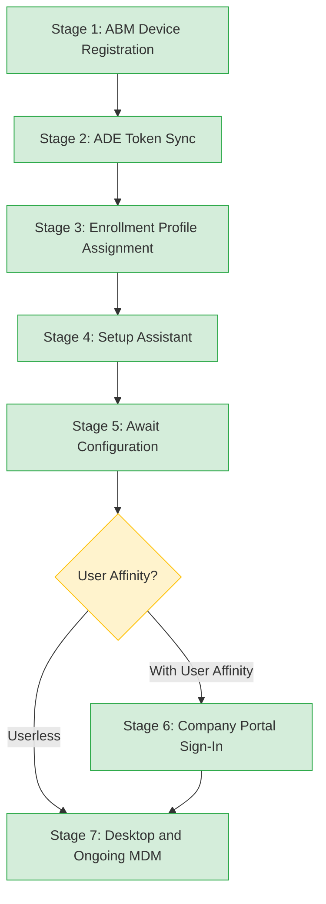

> **Platform gate:** This guide covers macOS Automated Device Enrollment (ADE) via Apple Business Manager and Microsoft Intune. For Windows Autopilot, see [Autopilot Lifecycle Overview](../lifecycle/00-overview.md). For terminology, see the [macOS Provisioning Glossary](../_glossary-macos.md).

# macOS ADE Lifecycle: Automated Device Enrollment End-to-End

## How to Use This Guide

This document is a single-file narrative covering the complete macOS [ADE](../_glossary-macos.md#ade) enrollment pipeline from device registration in [Apple Business Manager](https://business.apple.com) through desktop delivery and ongoing MDM management. Unlike the Windows Autopilot lifecycle (which splits across multiple guides due to deployment mode branching), the macOS ADE pipeline is a single linear sequence with one conditional branch at Stage 6.

The seven stages are:

1. **ABM Device Registration** -- Admin assigns device serial numbers to the Intune MDM server in Apple Business Manager.
2. **ADE Token Sync** -- Intune syncs device records from ABM via the .p7m enrollment program token.
3. **Enrollment Profile Assignment** -- Admin creates and assigns an enrollment profile defining user affinity, authentication, and configuration behavior.
4. **Setup Assistant** -- The device powers on, contacts Apple ADE endpoints, enrolls in MDM, and runs the first-run configuration screens.
5. **Await Configuration** -- The device pauses at a locked screen while Intune pushes critical configuration profiles.
6. **Company Portal Sign-In** -- (User affinity only) The user signs into Company Portal to register the device with Entra ID.
7. **Desktop and Ongoing MDM** -- The user reaches the desktop; two management channels (Apple MDM and Intune Management Extension) operate in parallel.

Each stage is organized into four subsections:

- **What the Admin Sees** -- The portal view or on-device experience visible to the admin or user.
- **What Happens** -- The step-by-step technical sequence at this stage.
- **Behind the Scenes** -- Deeper technical detail for L2 technicians and engineers.
- **Watch Out For** -- Common pitfalls and failure modes specific to this stage.

Use the [Stage Summary Table](#stage-summary-table) for quick orientation. Use the [ADE Pipeline diagram](#the-ade-pipeline) to visualize the full sequence. Navigate directly to any stage heading when troubleshooting a specific enrollment failure.

**Terminology note:** This guide uses macOS-native terminology throughout -- "Setup Assistant" for the first-run experience, "ADE" for the zero-touch enrollment mechanism, "ABM" for the Apple device management portal. For a mapping between Windows and macOS concepts, see [Windows vs macOS Concept Comparison](../windows-vs-macos.md).

**Version requirements:** Modern ADE features have minimum macOS version floors. ACME certificates require macOS 13.1+. Modern authentication requires macOS 10.15+. Await Configuration requires macOS 10.11+. DDM Software Update requires macOS 14.0+. Each stage notes version requirements where applicable.

---

## The ADE Pipeline

> Stage 6 only applies when the enrollment profile is configured for "Enroll with User Affinity" and modern authentication. Userless enrollments skip directly to Stage 7.

---

## Prerequisites

All prerequisites must be met before Stage 1. Missing any prerequisite causes failures that surface at Stage 2, 3, or 4.

- [ ] Apple Business Manager account created and verified for the organization
- [ ] At least one MDM server (Intune) configured in ABM under **Settings > Device Management Settings**
- [ ] ADE token (.p7m) downloaded from ABM and uploaded to Intune (see [ABM Token](../_glossary-macos.md#abm-token))
- [ ] APNs certificate configured in Intune (**Devices > Enrollment > Apple tab > Apple MDM Push certificate**)
- [ ] Enrollment profile created in Intune with desired user affinity, authentication, and Await Configuration settings
- [ ] Company Portal deployed as a required app (for user affinity enrollments)
- [ ] Network connectivity from enrollment locations to Apple ADE endpoints and Intune endpoints (see [Network Endpoints Reference](../reference/endpoints.md#macos-ade-endpoints))
- [ ] SSL/HTTPS inspection disabled for all `*.apple.com` and `*.push.apple.com` domains
- [ ] Appropriate Intune licenses assigned to users (Microsoft 365 Business Premium, E3, E5, or standalone Intune)
- [ ] Managed Apple ID created for ABM administration (not a personal Apple ID)

---

## Stage Summary Table

| Stage | Actor | Location | What Happens | Key Pitfall |
|-------|-------|----------|--------------|-------------|
| 1: ABM Device Registration | Admin | ABM Portal | Device serial numbers assigned to MDM server in Apple Business Manager | Device not assigned to correct MDM server; non-ABM-linked reseller |
| 2: ADE Token Sync | System/Intune | Intune admin center | Intune syncs device records from ABM via .p7m token | Token expired silently; 7-day full sync cooldown |
| 3: Enrollment Profile Assignment | Admin | Intune admin center | Enrollment profile (user affinity, auth method, Await Configuration) assigned to devices | No profile assigned before device powers on |
| 4: Setup Assistant | Device/User | On-device | Device contacts Apple ADE endpoints, installs MDM enrollment profile, runs Setup Assistant screens | Firewall blocks Apple endpoints; APNs certificate expired |
| 5: Await Configuration | System/Intune | On-device | Device held at "Awaiting final configuration" while Intune pushes critical policies | Misconfigured profile blocks the hold indefinitely |
| 6: Company Portal Sign-In | User | On-device | User signs into Company Portal to register device with Entra ID (user affinity only) | Company Portal not deployed as required app |
| 7: Desktop and Ongoing MDM | System/Intune | On-device | User reaches desktop; dual management channels (Apple MDM + IME) operate in parallel | APNs certificate renewal missed; IME agent not installed |

---

## Stage 1: ABM Device Registration

### What the Admin Sees

In [Apple Business Manager](https://business.apple.com) (ABM), navigate to **Devices** and use the search or filter options to locate devices by serial number. The **Assign to MDM Server** action links one or more devices to the Intune MDM server configured in [ABM](../_glossary-macos.md#abm). Devices can also be pre-assigned by Apple-authorized resellers at the time of purchase, in which case they appear in ABM already linked to the correct MDM server.

For bulk operations, ABM supports CSV upload and filtering by purchase order to assign large batches of devices simultaneously.

### What Happens

1. **Device serial number is registered in ABM.** When an organization purchases a device from an Apple-authorized reseller or directly from Apple, the serial number is added to the organization's ABM account. Some resellers pre-assign devices to the organization's ABM account automatically.

2. **Admin assigns device to MDM server.** In ABM, the admin selects the device (or a batch of devices) and assigns it to the Intune MDM server. This assignment tells Apple that when this device powers on and contacts Apple's enrollment endpoints, it should receive enrollment instructions from Intune.

3. **Assignment is recorded by Apple.** The ABM-to-MDM-server mapping is stored on Apple's side. The physical device does not need to be present or powered on for this step. The assignment takes effect the next time the device contacts Apple's ADE endpoints during [Setup Assistant](../_glossary-macos.md#setup-assistant).

### Behind the Scenes

- The serial number is the device identity for macOS ADE enrollment. Unlike Windows Autopilot, which uses a 4K-byte hardware hash derived from WMI data, macOS uses only the device serial number as its enrollment identifier.
- ABM supports multiple MDM servers. Each server appears as a named entry under **Settings > Device Management Settings** in ABM. Ensure the Intune server name is clearly labeled to avoid mis-assignment.
- Device assignment in ABM is a metadata operation -- no communication with the device occurs. The assignment is consumed during Stage 4 when the device contacts `deviceenrollment.apple.com`.
- Devices purchased outside ABM-linked channels (e.g., retail purchase, second-hand) cannot be enrolled via ADE unless manually added using Apple Configurator.
- ABM supports filters and bulk assignment for large batches. When processing hundreds of devices, use purchase order filtering to assign entire shipments to the correct MDM server in a single operation.

### Watch Out For

- **Device not assigned to the correct MDM server.** If a device is assigned to the wrong MDM server (or not assigned at all), it will not receive an enrollment profile during Setup Assistant. The device completes Setup Assistant as an unmanaged Mac.
- **Non-ABM-linked reseller.** Devices purchased from resellers not linked to the organization's ABM account do not appear in ABM automatically. The reseller must be an Apple Authorized Reseller enrolled in ABM device assignment.
- **Reseller forgot device transfer.** The reseller completed the sale but did not transfer the device serial numbers to the organization's ABM account. Follow up with the reseller or use Apple Configurator as a fallback.
- **Multiple MDM servers in ABM.** Organizations with multiple Intune tenants (dev, staging, production) or multiple MDM solutions may have several MDM servers listed in ABM. Verify the device is assigned to the correct production Intune server, not a test environment.

---

## Stage 2: ADE Token Sync

### What the Admin Sees

In the Intune admin center, navigate to **Devices > Enrollment > Apple tab > Enrollment program tokens**. This blade shows the list of [ABM Tokens](../_glossary-macos.md#abm-token) configured for the tenant, with columns for token name, Apple ID, status, and expiry date. After a sync completes, newly assigned devices from ABM appear in the device list under the token.

The **Sync** button triggers a manual sync. A progress indicator shows the sync status. The **Last synced** timestamp and device count update after completion.

A warning icon appears on the token entry if the token is nearing expiry (within 30 days) or if terms and conditions need to be accepted in ABM. The token expiry date is displayed prominently. Monitor this blade regularly to avoid silent sync failures.

The device list under each token shows serial numbers, device names, profile assignment status, and sync state. Devices that have been removed from ABM or reassigned to a different MDM server appear with an appropriate status indicator.

### What Happens

1. **ADE token connects Intune to ABM.** The ADE token (also called enrollment program token) is a .p7m file that Intune uses to authenticate with Apple's ADE service. The token is created during initial setup: admin downloads a public key from Intune, uploads it to ABM, downloads the resulting .p7m token from ABM, and uploads it to Intune.

2. **Automatic sync runs every 24 hours.** Intune automatically contacts ABM via the token to pull updated device assignments. Newly assigned devices appear in Intune after the next automatic sync cycle.

3. **Manual sync is available with rate limits.** Admin can trigger a manual sync from the Intune admin center. Manual sync is rate-limited to once every 15 minutes. A full sync (re-downloading all device records) has a 7-day cooldown period.

4. **Devices appear in Intune.** After sync, devices assigned to this MDM server in ABM show up in Intune's device list. They are ready for enrollment profile assignment (Stage 3).

### Behind the Scenes

- The .p7m token is cryptographically signed by Apple and tied to a specific Apple ID. Use a Managed Apple ID (not a personal Apple ID) to create the token, ensuring organizational control over renewal.
- Token renewal happens annually. When the token expires, Intune can no longer sync device records from ABM. Existing managed devices are unaffected, but new device assignments are not pulled until the token is renewed.
- The sync mechanism uses Apple's ADE API. Intune requests a list of devices assigned to its MDM server since the last sync checkpoint. Incremental syncs are lightweight; full syncs re-download all records and are subject to the 7-day cooldown.
- If ABM terms and conditions change, Apple may suspend the token's sync capability until the admin accepts the updated terms in ABM.

### Watch Out For

- **Token expired silently.** The ADE token expires annually. When expired, new devices assigned in ABM never appear in Intune. Existing managed devices continue to function. Set a calendar reminder for renewal at least 30 days before expiry.
- **Apple ID inaccessible.** The Apple ID used to create the token is no longer accessible (employee left, personal Apple ID). Token renewal requires the same Apple ID or a new token setup. Use a Managed Apple ID tied to a role account.
- **ABM terms and conditions changed.** Apple periodically updates ABM terms. If the admin has not accepted the updated terms, syncing is suspended until acceptance.
- **Full sync rate limit (7-day cooldown).** If a full sync was recently performed, subsequent full sync requests are rejected for 7 days. Plan bulk operations accordingly. Incremental syncs (every 15 minutes) are not affected by this limit.
- **Multiple tokens for multiple ABM accounts.** Large organizations may have multiple ABM accounts (e.g., per region or subsidiary). Each ABM account requires its own ADE token in Intune. Ensure each token is tracked separately for renewal.

---

## Stage 3: Enrollment Profile Assignment

### What the Admin Sees

In the Intune admin center, navigate to **Devices > Enrollment > Apple tab > Enrollment program tokens > [token name] > Profiles**. This blade shows enrollment profiles associated with the token. Each profile defines the enrollment behavior: user affinity setting, authentication method, [Await Configuration](../_glossary-macos.md#await-configuration) toggle, [Setup Assistant](../_glossary-macos.md#setup-assistant) screen visibility, and local account configuration.

A profile can be assigned to individual devices or set as the default profile for the token (all newly synced devices receive it automatically). The **Assign** action links the profile to selected devices.

### What Happens

1. **Admin creates an enrollment profile.** The profile defines how the device will enroll. Key settings include:
   - **User affinity:** "Enroll with User Affinity" (user-assigned device) or "Enroll without User Affinity" (shared/kiosk device).
   - **Authentication method:** "Setup Assistant with modern authentication" (recommended, default since late 2024) or "Setup Assistant (legacy)".
   - **Await final configuration:** Yes (default for new profiles since late 2024) or No.
   - **Setup Assistant screens:** Each screen (Apple ID, Siri, Privacy, FileVault, etc.) can be shown or hidden.

2. **Profile is assigned to devices.** The admin assigns the profile to specific devices or sets it as the default for the token. Assignment is a metadata operation -- the device does not need to be present.

3. **Profile is delivered over the air.** When the device contacts Apple's ADE endpoints during Setup Assistant (Stage 4), Apple directs it to Intune, which delivers the enrollment profile. The profile must be assigned before the device powers on.

### Behind the Scenes

- "Setup Assistant with modern authentication" enables the user to sign in with Entra credentials (email and password, plus MFA if configured) during Setup Assistant. This is the recommended method as it supports Conditional Access and MFA natively.
- "Setup Assistant (legacy)" uses older authentication (ADFS WS-Trust based). Microsoft explicitly recommends against it for new deployments.
- The "Await final configuration" setting controls whether Stage 5 fires. When set to Yes, the device pauses at a locked screen after Setup Assistant completes, allowing Intune to push critical policies before the user reaches the desktop.
- A default profile assigned to a token automatically applies to all newly synced devices. Per-device overrides take precedence over the default.
- Profile assignment is consumed once -- when the device enrolls. Changing a profile after enrollment does not affect already-enrolled devices.

### Watch Out For

- **No profile assigned before device powers on.** If a device reaches Setup Assistant without an enrollment profile assigned in Intune, the enrollment fails. The device completes Setup Assistant as an unmanaged Mac with no MDM enrollment.
- **Wrong authentication method for tenant setup.** If the tenant requires MFA or Conditional Access but the profile uses legacy authentication, users cannot complete enrollment.
- **Await Configuration disabled.** If Await Configuration is set to No, critical policies may not be applied before the user reaches the desktop. Users may access resources or change settings before security policies take effect.
- **Profile changes after enrollment have no effect.** If you modify or reassign an enrollment profile after the device has already enrolled, the changes do not retroactively apply. The enrollment profile is consumed at enrollment time only. To apply a different profile, the device must be wiped and re-enrolled.
- **Default profile applies to all synced devices.** If a default profile is set on the token, every device synced from ABM receives it automatically. This can cause unintended enrollment behavior if some devices should use different settings (e.g., shared kiosk devices vs. user-assigned devices). Use per-device assignment overrides for mixed fleets.

---

## Stage 4: Setup Assistant

### What the Admin Sees

The admin does not directly see this stage in the Intune admin center -- it happens entirely on the device. However, the admin can monitor enrollment progress by checking the device record in **Devices > All devices** (the device appears once MDM enrollment completes) and checking compliance status.

On the device, the user experiences the macOS first-run wizard: a series of configuration screens (language, region, accessibility, Wi-Fi, account creation, and any additional screens enabled in the enrollment profile). With modern authentication, an Entra sign-in screen appears within Setup Assistant, branded with the organization's Entra ID configuration.

If the enrollment profile hides optional screens (Apple ID, Siri, Privacy, FileVault, iCloud), those screens are skipped automatically and the user moves through a streamlined Setup Assistant experience.

### What Happens

1. **Device powers on and contacts Apple ADE endpoints.** On first power-on (or after a wipe), the device contacts `deviceenrollment.apple.com` to check whether it is assigned to an MDM server via [ADE](../_glossary-macos.md#ade). If assigned, Apple directs the device to the MDM server (Intune).

2. **MDM enrollment profile installs silently.** The device downloads and installs the MDM enrollment profile from Intune in the background. This profile establishes the management relationship between the device and Intune.

3. **[Setup Assistant](../_glossary-macos.md#setup-assistant) screens run.** The configurable first-run screens are presented based on the enrollment profile settings. Screens that were hidden by the admin (Apple ID, Siri, Privacy, etc.) are skipped automatically.

4. **User signs in (modern auth).** With "Setup Assistant with modern authentication", the user signs in with their Entra credentials (email, password, MFA if configured). This authenticates the user and associates the device with their identity.

5. **ACME certificate is issued (macOS 13.1+).** On macOS 13.1 and later, an ACME certificate is issued during enrollment, replacing the older SCEP-based certificate enrollment. This certificate is used for device identity validation.

### Behind the Scenes

- Three Apple endpoints are critical during this stage:
  - `deviceenrollment.apple.com` -- Initial ADE discovery. The device checks this endpoint to determine if it is ABM-managed.
  - `iprofiles.apple.com` -- Enrollment profile download. The device retrieves its enrollment configuration.
  - `mdmenrollment.apple.com` -- Profile upload and device/account lookups.
- APNs (`*.push.apple.com`) must be reachable for the MDM channel to function. APNs is used for all ongoing push notifications from Intune to the device.
- SSL/HTTPS inspection must be disabled for all Apple service endpoints. Apple explicitly requires this -- SSL inspection causes ADE and APNs to fail silently.
- With modern authentication, the Entra sign-in happens within Setup Assistant itself (not in a separate browser or Company Portal). This provides a seamless first-run experience.
- Devices running macOS versions older than 10.15 fall back to legacy authentication even if the profile specifies modern auth.
- The `cloudconfigurationd` daemon (`com.apple.ManagedClient.cloudconfigurationd` subsystem) handles the ADE discovery process during Setup Assistant. Use `log show --predicate 'subsystem contains "cloudconfigurationd"' --info --last 30m` to troubleshoot enrollment discovery failures.
- The MDM enrollment profile installed during this stage contains the Intune MDM server URL, the device identity certificate, and the management scope. It is not user-visible in System Settings unless the admin has enabled profile visibility.

### Watch Out For

- **Firewall blocks Apple endpoints.** If the device cannot reach `deviceenrollment.apple.com`, `iprofiles.apple.com`, or `mdmenrollment.apple.com`, ADE enrollment fails. The device completes Setup Assistant as an unmanaged Mac. Test connectivity with `curl -v --max-time 5 https://deviceenrollment.apple.com`.
- **Device not in ABM or wrong MDM server assignment.** The device contacts Apple's ADE endpoints but Apple has no record of it being assigned to Intune. Enrollment does not occur.
- **No enrollment profile assigned.** The device is in ABM and assigned to the correct MDM server, but no enrollment profile has been assigned in Intune (Stage 3). Intune has no instructions for how to enroll the device.
- **APNs certificate expired on the Intune side.** The Apple Push Notification service certificate in Intune has expired. The MDM channel cannot be established. This is a separate certificate from the ADE token -- it must also be renewed annually.
- **SSL inspection active.** Enterprise proxy or firewall performs SSL inspection (HTTPS decryption/re-encryption) on traffic to Apple services. ADE enrollment fails silently. Bypass SSL inspection for all `*.apple.com` and `*.push.apple.com` domains.

---

## Stage 5: Await Configuration

### What the Admin Sees

The admin does not directly observe this stage in the Intune admin center. On the device, the user sees a locked screen displaying "Awaiting final configuration" with a progress indicator. The screen cannot be dismissed, skipped, or cancelled by the user. The screen clears automatically when Intune signals that all critical configuration profiles have been delivered.

This stage is functionally similar to the Windows Enrollment Status Page device phase, but with key differences: there is no app-level progress list, no "Continue anyway" option, and no admin-configurable timeout. The hold is binary -- it either completes or it does not.

### What Happens

1. **Setup Assistant screens complete.** After the user finishes all visible Setup Assistant screens (Stage 4), the device transitions to the [Await Configuration](../_glossary-macos.md#await-configuration) hold (if enabled in the enrollment profile).

2. **Device displays "Awaiting final configuration" screen.** The screen is locked -- the user cannot interact with the desktop, change settings, or access applications.

3. **Intune pushes critical configuration profiles.** Via the APNs/MDM channel, Intune delivers configuration profiles (Wi-Fi, VPN, certificates, security policies, required apps) to the device. Progress is shown on the locked screen.

4. **Hold releases when Intune signals completion.** When Intune determines that all critical policies have been installed (or if an unrecoverable error occurs), the hold releases and the device proceeds to Stage 6 (user affinity) or Stage 7 (userless).

### Behind the Scenes

- "Await final configuration" is the official Intune terminology. The project glossary uses "[Await Configuration](../_glossary-macos.md#await-configuration)" as a shortened form.
- This stage only fires when the enrollment profile has Await Configuration set to **Yes**. This has been the default for new enrollment profiles since late 2024.
- There is no Intune-enforced minimum or maximum time limit for this stage. Duration depends entirely on the number and complexity of policies being delivered. Microsoft testing indicates most devices release within approximately 15 minutes.
- The locked screen prevents users from accessing restricted content or changing settings before security policies take effect. This is the macOS equivalent of the Windows Enrollment Status Page device phase.
- Supported on macOS 10.11 and later.
- Await Configuration does **not** fire on re-enrollment. If a device is wiped and re-enrolled, this stage is skipped if the device has previously completed it for this enrollment event.

### Watch Out For

- **Device sits on "Awaiting final configuration" indefinitely.** This is typically caused by a misconfigured or undeliverable configuration profile that blocks the completion signal. Common causes include:
  - A SCEP/certificate profile that cannot reach the certificate authority.
  - A Wi-Fi profile that depends on a certificate profile that failed to install.
  - A profile referencing a resource (SCEP server, RADIUS server) that is unreachable from the device's current network.
- **APNs connectivity issues.** If the APNs channel is disrupted during this stage, Intune cannot deliver policies. The device remains on the locked screen.
- **Token sync errors.** If the ADE token has issues (near expiry, terms and conditions not accepted), policy delivery may be disrupted.
- **Troubleshooting tip:** Use `log show --predicate 'subsystem == "com.apple.ManagedClient"' --info --last 1h` on another enrolled Mac or via SSH (if available) to check for MDM command processing errors. Look for repeated retry messages or certificate delivery failures.
- **Re-enrollment does not trigger Await Configuration.** If a previously enrolled device is wiped and re-enrolled, the Await Configuration hold does not fire again. The device proceeds directly past this stage. This is by design -- Apple considers the initial enrollment event the only trigger.
- **No admin-visible progress in Intune.** Unlike the Windows Enrollment Status Page (which shows app and policy progress in the Intune portal), the macOS Await Configuration stage has no admin-visible progress indicator in the Intune admin center. Monitoring requires on-device log analysis.

---

## Stage 6: Company Portal Sign-In

### What the Admin Sees

The admin does not directly observe this stage in the portal. On the device, the user sees the Company Portal app (if deployed) and is prompted to sign in with their organizational Entra credentials. After sign-in, the device appears in the user's device list in the Entra portal and in Intune's device records with user affinity populated.

### What Happens

1. **Await Configuration completes (Stage 5).** The device releases from the locked screen and the user reaches the desktop or is prompted to open Company Portal.

2. **User opens Company Portal app.** Company Portal must have been deployed as a required app (via Intune app deployment, typically using [VPP](../_glossary-macos.md#vpp) / Apps and Books). It is **not** pre-installed on macOS.

3. **User signs in with Entra credentials.** The user enters their organizational email and password (plus MFA if configured). This sign-in performs two functions:
   - Registers the device with Microsoft Entra ID (Azure AD).
   - Establishes the user-device affinity in Intune.

4. **Device gains Conditional Access compliance.** After Company Portal sign-in, the device can be evaluated for compliance policies and granted access to Conditional Access-protected resources (Exchange Online, SharePoint, Teams, etc.).

> **Note:** This stage only applies to enrollment profiles configured with **"Enroll with User Affinity"** and **"Setup Assistant with modern authentication"**. Userless enrollments (without User Affinity) skip this stage entirely and proceed directly to Stage 7.

### Behind the Scenes

- Company Portal is deployed to the device as a required app through Intune. Microsoft recommends assigning it to the device group used for ADE enrollment or to All Devices with an enrollment profile filter.
- The Company Portal sign-in is separate from the Entra sign-in during Setup Assistant (Stage 4). The Setup Assistant sign-in authenticates the user for the MDM enrollment; the Company Portal sign-in registers the device with Entra ID for Conditional Access.
- If the user does not sign in to Company Portal immediately, they are redirected to it when they first attempt to open a Conditional Access-protected application. Access to protected resources is blocked until sign-in completes.
- The device record in Entra ID transitions from "device-only" to "user-associated" after Company Portal sign-in. This enables user-scoped compliance policies and per-user Conditional Access evaluation.

### Watch Out For

- **Company Portal not deployed.** Company Portal is not pre-installed on macOS. If it was not assigned as a required app before enrollment, the user cannot find it. Deploy it as a required app using VPP/Apps and Books or as a DMG/PKG app via Intune.
- **Conditional Access chicken-and-egg.** If the organization's Conditional Access policies require a compliant device for all resource access, and the device is not yet registered in Entra (because Company Portal sign-in has not occurred), the user is blocked from resources. Ensure Company Portal sign-in is the first action after reaching the desktop.
- **User skips sign-in.** The user dismisses or ignores the Company Portal prompt. The device is enrolled in Intune (MDM management works) but is not registered in Entra. Protected resources remain inaccessible until the user completes sign-in.
- **"Install Company Portal" enrollment profile setting removed.** As of late 2024, the enrollment profile setting to install Company Portal during enrollment has been removed from Intune. Company Portal must now be deployed separately as a required app (via VPP/Apps and Books or as a standalone DMG/PKG). Do not rely on the enrollment profile to deliver it.
- **Company Portal version matters.** Ensure the deployed Company Portal app is current. Older versions may not support modern authentication flows or the latest compliance evaluation features. Use VPP/Apps and Books for automatic updates.

---

## Stage 7: Desktop and Ongoing MDM

### What the Admin Sees

In the Intune admin center, the device appears under **Devices > All devices** with an enrollment status of "Enrolled" and a management channel of "MDM." Compliance status, installed apps, and configuration profile delivery status are all visible on the device record. The admin can push new policies, deploy apps, trigger remote actions (lock, wipe, restart), and rotate the local admin password (LAPS) from this view.

### What Happens

1. **User reaches the macOS desktop.** All enrollment stages are complete. The user has a fully managed Mac with security policies applied.

2. **Two management channels operate in parallel:**
   - **Apple MDM (via APNs):** Delivers and enforces configuration profiles (Wi-Fi, VPN, certificates, restrictions, FileVault, firewall, Gatekeeper, compliance policies). MDM check-ins are push-triggered via APNs.
   - **Intune Management Extension (IME):** Handles app deployments (DMG, PKG), shell script execution, and custom attribute collection. Operates as a separate agent process.

3. **Ongoing policy application continues.** New policies assigned to the device's groups are delivered automatically. Compliance evaluation runs on a schedule. Non-compliant devices can be flagged, blocked from Conditional Access resources, or wiped.

4. **Security features enforce posture.** FileVault disk encryption, firewall, Gatekeeper, and other security settings are enforced via MDM profiles. Local admin password rotation (LAPS) occurs every 6 months if configured.

5. **Compliance evaluation runs continuously.** Intune evaluates device compliance on a regular schedule. Non-compliant devices are flagged in the admin center and can be blocked from Conditional Access-protected resources or marked for remediation. Common compliance checks include OS version, encryption status, and password policy adherence.

6. **Remote actions are available.** Admins can trigger remote actions from the Intune admin center: remote lock, remote wipe (full or selective), restart, rename, and LAPS password rotation. These actions are delivered via the APNs channel and require active MDM connectivity.

### Behind the Scenes

- The Intune Management Extension (IME) agent is installed at `/Library/Intune/Microsoft Intune Agent.app`. This agent is not visible in `/Applications` -- verify it is running with `pgrep -il "^IntuneMdm"`.
- The IME agent and Apple MDM are independent channels. MDM profiles are delivered via APNs push notifications from Apple's infrastructure; IME communicates directly with Intune's service endpoints.
- APNs certificate on the Intune side must be renewed annually (at **Devices > Enrollment > Apple tab > Apple MDM Push certificate** in the Intune admin center). This is a separate renewal from the ADE token (Stage 2). A lapsed APNs certificate breaks all MDM communication for all Apple devices in the tenant.
- LAPS (Local Administrator Password Solution) for macOS rotates the local admin account password on a configurable schedule (default: every 6 months). The password is stored in Intune and retrievable by authorized administrators.
- FileVault personal recovery key escrow to Intune happens during enrollment or at the next FileVault enable event. The key is stored in Intune and viewable by admins on the device record.
- The `com.apple.ManagedClient` unified log subsystem captures all MDM command processing events. Use `log show --predicate 'subsystem == "com.apple.ManagedClient"' --info --last 1h` to review recent MDM activity.

### Watch Out For

- **APNs certificate renewal missed.** The APNs certificate expires annually (separate from the ADE token). If it lapses, Intune cannot push any commands to Apple devices. All macOS (and iOS) devices in the tenant lose MDM communication until the certificate is renewed.
- **IME agent not installed or not running.** If the IME agent is missing or crashed, app deployments (DMG, PKG) and shell scripts do not execute. Verify with `pgrep -il "^IntuneMdm"`. Check IME logs at `/Library/Logs/Microsoft/Intune/IntuneMDMDaemon*.log`.
- **Two renewal calendars to track.** Admins managing macOS ADE devices must track two separate annual renewals: the ADE token (.p7m file, Stage 2) and the APNs certificate (this stage). Missing either one causes different but equally disruptive failures.
- **FileVault recovery key not escrowed.** If FileVault was enabled before Intune enrollment, the personal recovery key may not be escrowed to Intune. The admin cannot recover the device if the user forgets their password. Ensure FileVault is configured via Intune policy so the key is escrowed automatically.
- **CDN endpoint migration.** Intune app and script delivery uses regional CDN endpoints (`macsidecar.manage.microsoft.com` for North America, `macsidecareu.manage.microsoft.com` for Europe, `macsidecarap.manage.microsoft.com` for Asia Pacific). The older `*.azureedge.net` variants are being migrated to `*.manage.microsoft.com` starting March 2025. Ensure both domains are allowed during the transition period.
- **Defender for Endpoint onboarding.** If Microsoft Defender for Endpoint is deployed via Intune, it is delivered as a configuration profile during or after Stage 5. Defender requires system extensions and full disk access approvals, which should be pre-approved via MDM to avoid user prompts. Ensure the Defender onboarding profile is included in the device group used for enrollment.
- **macOS 15 log path changes.** On macOS 15, some devices are missing the user-level log directory (`~/Library/Logs/Microsoft/Intune`). If IME agent logs are not found at the user path, check the system-level path at `/Library/Logs/Microsoft/Intune/IntuneMDMDaemon*.log` instead. This is a known issue as of early 2026.

---

## See Also

- [macOS Provisioning Glossary](../_glossary-macos.md) -- ADE, ABM, Setup Assistant terminology
- [Windows vs macOS Concept Comparison](../windows-vs-macos.md) -- Platform enrollment mapping
- [macOS Terminal Commands Reference](../reference/macos-commands.md) -- Diagnostic commands referenced in this guide
- [macOS Log Paths Reference](../reference/macos-log-paths.md) -- Log file locations for troubleshooting
- [Network Endpoints Reference](../reference/endpoints.md#macos-ade-endpoints) -- Required URLs for ADE enrollment
- [Autopilot Lifecycle Overview](../lifecycle/00-overview.md) -- Windows Autopilot 5-stage lifecycle (for comparison)

---

## Renewal Calendar Quick Reference

Admins managing macOS ADE devices must track multiple annual renewals. Missing any of these causes enrollment or management failures.

| Item | Renewal Cycle | Where to Renew | Impact of Lapse |
|------|--------------|----------------|-----------------|
| ADE Token (.p7m) | Annual | Intune admin center > Enrollment program tokens | New device syncs from ABM stop silently |
| APNs Certificate | Annual | Intune admin center > Apple MDM Push certificate | All MDM communication to all Apple devices stops |
| ABM Terms and Conditions | As needed | Apple Business Manager portal | Device sync suspended until terms accepted |
| VPP/Apps and Books Token | Annual | Intune admin center > Connector status | App license sync stops; new app deployments fail |

---

## Version History

| Date | Change |
|------|--------|
| 2026-04-14 | Initial version -- complete 7-stage ADE lifecycle narrative |
