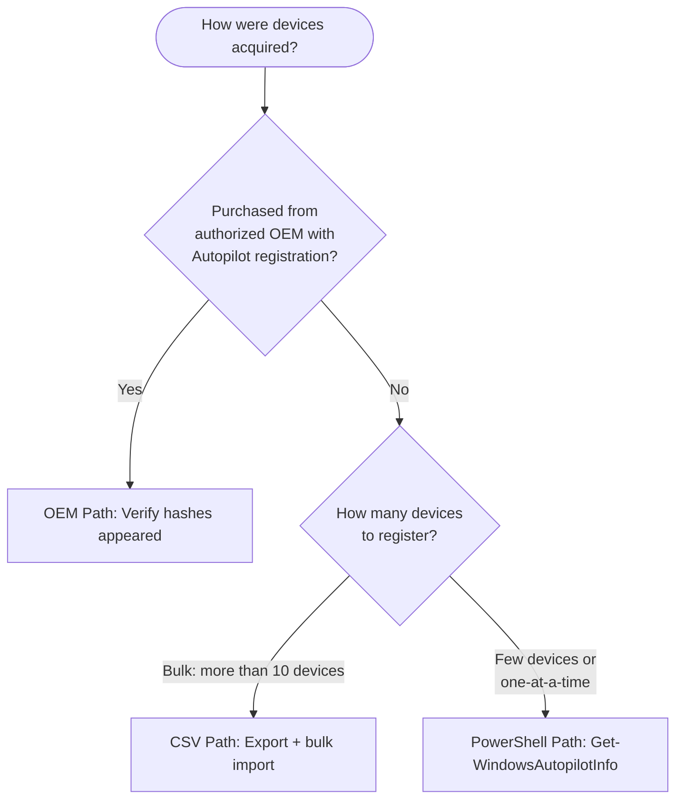

> **Version gate:** This guide covers Windows Autopilot (classic).
> For Autopilot Device Preparation (APv2), see [APv2 Admin Setup Guides](../admin-setup-apv2/00-overview.md).
> For framework selection, see [APv1 vs APv2](../apv1-vs-apv2.md).

# Hardware Hash Upload

Before a device can receive an Autopilot deployment profile, its hardware hash must be registered with your Intune tenant. Use the decision tree below to choose the correct upload path for your scenario.



## Prerequisites

- Intune Administrator or Autopilot Administrator role
- Devices powered on and network-connected (for PowerShell direct upload path)
- For CSV path: access to an existing CSV export, or physical device access to generate the hash
- For OEM path: procurement confirmation that OEM Autopilot registration was included in the purchase order

## Path 1: OEM Delivery

Devices purchased from an authorized OEM partner with Autopilot registration included arrive with hashes pre-registered. Your role is verification only — the OEM performs registration.

### Verification steps

1. Navigate to **Intune admin center** > **Devices** > **Windows** > **Enrollment** > **Windows enrollment** > **Windows Autopilot** > **Devices**.
2. Search for the device by serial number.
3. Confirm the device appears in the list with a **ZTDID** value populated.
4. Confirm **Profile Status** shows the expected state: `Not assigned` if no profile is assigned yet, or the profile name if already assigned.
5. If the device is not found: contact procurement to confirm whether OEM Autopilot registration was included in the purchase order. Request confirmation of the OEM partner registration portal submission date.

> **What breaks if misconfigured:** **Admin sees:** Device is not listed in the Windows Autopilot devices list. **End user sees:** Standard Windows OOBE (no company branding, no ESP, no automatic enrollment). **Runbook:** [Device Not Registered](../l1-runbooks/01-device-not-registered.md)

## Path 2: CSV Bulk Import

Use this path when you have existing devices not purchased through an OEM Autopilot program, or when you need to register more than 10 devices.

### Prerequisites (CSV path)

- CSV file prepared in **ANSI encoding** — Unicode and UTF-8 are explicitly not supported and cause silent import failure or a header row error
- Do NOT open or edit the CSV in Microsoft Excel — Excel reformats the file (changes encoding, adds quotation marks) and breaks the import
- Use Notepad, Visual Studio Code, or another plain-text editor to inspect and edit the file

### CSV format requirements

| Column | Required | Notes |
|--------|----------|-------|
| `Device Serial Number` | Yes | Case-sensitive header |
| `Windows Product ID` | Yes | Case-sensitive header |
| `Hardware Hash` | Yes | Case-sensitive header |
| `Group Tag` | No | Optional grouping label |
| `Assigned User` | No | Optional UPN for pre-assignment |

- No extra columns beyond the five above
- No quotation marks around any values
- Maximum 500 devices per CSV file
- Column headers are case-sensitive — `device serial number` will fail

### Import steps

1. Navigate to **Intune admin center** > **Devices** > **Windows** > **Enrollment** > **Windows enrollment** > **Windows Autopilot** > **Devices** > **Import**.
2. Select your prepared CSV file.
3. Select **Import**. Processing can take up to 15 minutes for large batches.
4. After import completes, verify devices appear in the Autopilot Devices list.
5. Check for devices with import errors in the **Windows Autopilot devices** list — errors appear in the **Profile Status** column.

> **What breaks if misconfigured (wrong encoding):** **Admin sees:** Import completes but no devices appear, or a header row error is displayed. **End user sees:** Standard Windows OOBE on the device because it was never registered. **Runbook:** [Device Not Registered](../l1-runbooks/01-device-not-registered.md)

> **What breaks if misconfigured (Excel editing):** **Admin sees:** Import fails with format error, or devices import but hash is invalid. **End user sees:** Standard Windows OOBE. Open the file in Notepad and verify encoding is ANSI and no quotation marks are present. **Runbook:** [Device Not Registered](../l1-runbooks/01-device-not-registered.md)

> **What breaks if misconfigured (duplicate serial numbers):** **Admin sees:** Only one of the duplicate rows processes successfully; remaining duplicates show `ZtdDeviceDuplicated` error. **End user sees:** No impact on successfully imported device. **Runbook:** Remove duplicate rows and re-import.

### Import error reference

| Error | Meaning | Resolution |
|-------|---------|------------|
| `ZtdDeviceAssignedToAnotherTenant` | Hash is already registered in a different tenant | Remove the device from the original tenant first, then re-import |
| `ZtdDeviceAlreadyAssigned` | Device is already registered in this tenant | Skip — already registered, no action needed |
| `ZtdDeviceDuplicated` | Duplicate rows in the CSV | Remove duplicate rows, re-import |
| `InvalidZtdHardwareHash` | Missing manufacturer or serial number in the hash data | Re-capture the hardware hash from the physical device |

## Path 3: PowerShell Script

Use this path for individual devices or small batches where OEM delivery is not available. This path is the most error-prone — follow the steps exactly.

### Prerequisites (PowerShell path)

- Physical access to the device (must be running Windows 10/11 before Autopilot enrollment)
- PowerShell 5.1 or later
- Internet connectivity from the device
- Intune Administrator credentials (required for the `-Online` direct upload option)

### Option A: Save hash locally as CSV, then upload via Path 2

Run the following commands in an elevated PowerShell session on the target device:

```powershell
# Set TLS 1.2 first — must be before any Install-Script call
[Net.ServicePointManager]::SecurityProtocol = [Net.SecurityProtocolType]::Tls12

# Create output directory
New-Item -Type Directory -Path "C:\HWID"
Set-Location -Path "C:\HWID"

# Add PowerShell Scripts path
$env:Path += ";C:\Program Files\WindowsPowerShell\Scripts"

# Set execution policy for this session only (no machine-wide impact)
Set-ExecutionPolicy -Scope Process -ExecutionPolicy RemoteSigned

# Install and run the script
Install-Script -Name Get-WindowsAutopilotInfo
Get-WindowsAutopilotInfo -OutputFile AutopilotHWID.csv
```

Output file: `C:\HWID\AutopilotHWID.csv`

Copy this file to your workstation and upload it using Path 2 (CSV Bulk Import) above.

### Option B: Direct upload to Intune

Run the following commands in an elevated PowerShell session on the target device:

```powershell
# Set TLS 1.2 first
[Net.ServicePointManager]::SecurityProtocol = [Net.SecurityProtocolType]::Tls12

# Set execution policy for this session only
Set-ExecutionPolicy -Scope Process -ExecutionPolicy RemoteSigned

# Install and run the script with direct Intune upload
Install-Script -Name Get-WindowsAutopilotInfo -Force
Get-WindowsAutopilotInfo -Online
```

When prompted, sign in with Intune Administrator credentials. If prompted to install NuGet or approve PSGallery as a package source, select **Yes** to proceed.

### Common errors and fixes

**1. Execution policy block**

> **What breaks if misconfigured:** **Admin sees:** Red error text: "running scripts is disabled on this system" or "cannot be loaded because running scripts is disabled." **End user sees:** No impact — error occurs before any device data is captured. **Fix:** The `-Scope Process` parameter limits the policy change to the current session only. No machine-wide configuration is changed.

**2. NuGet "no match found" or Install-Script fails**

> **What breaks if misconfigured:** **Admin sees:** `Install-Script` fails with "No match was found for the specified search criteria." **End user sees:** No impact. **Fix:** The TLS 1.2 line (`[Net.ServicePointManager]::SecurityProtocol`) must come first, before any `Install-Script` call. If TLS 1.2 is not set, the NuGet provider download fails silently or with a certificate validation error. **Runbook:** [Device Not Registered](../l1-runbooks/01-device-not-registered.md)

**3. Graph authentication errors (`-Online` option)**

> **What breaks if misconfigured:** **Admin sees:** Authentication popup that immediately errors, or a consent prompt for a new enterprise application. **End user sees:** No impact. **Fix:** The `Get-WindowsAutopilotInfo` script was updated in July 2023 to use Microsoft Graph PowerShell modules (replacing the deprecated AzureAD module). On the first run, you may need to approve new enterprise app permissions in Entra ID. If the admin account lacks permission to consent, a Global Administrator must approve the enterprise app. **Runbook:** [Device Not Registered](../l1-runbooks/01-device-not-registered.md)

**4. Stale hash from reimaged or modified device**

> **What breaks if misconfigured:** **Admin sees:** Device is listed in Autopilot Devices, but the end user reports standard OOBE on the device. **End user sees:** Standard Windows OOBE instead of Autopilot experience. **Fix:** The hardware hash must be captured from the device in its final hardware state. Any of the following invalidate a previously captured hash: hardware component replacement (SSD, motherboard), BIOS/firmware updates, or driver updates that change hardware identifiers. Re-capture the hash after all hardware changes are complete. **Runbook:** [Device Not Registered](../l1-runbooks/01-device-not-registered.md)

## Verification (all paths)

- [ ] Device appears in **Intune admin center** > **Devices** > **Windows** > **Enrollment** > **Windows enrollment** > **Windows Autopilot** > **Devices**
- [ ] **ZTDID** column is populated for the device
- [ ] **Profile Status** shows the expected state (`Not assigned` if no profile is assigned yet, or the profile name if already assigned)

## Configuration-Caused Failures

| Misconfiguration | Symptom | Runbook |
|------------------|---------|---------|
| CSV encoded as UTF-8 or Unicode instead of ANSI | Import completes silently with no devices added, or header row error displayed | [Device Not Registered](../l1-runbooks/01-device-not-registered.md) |
| CSV edited in Microsoft Excel | Hash field corrupted or quotation marks added; import fails or device registers with invalid hash | [Device Not Registered](../l1-runbooks/01-device-not-registered.md) |
| Stale hash captured before hardware changes | Device listed in Autopilot but shows standard OOBE on provisioning | [Device Not Registered](../l1-runbooks/01-device-not-registered.md) |
| Duplicate serial number rows in CSV | Only first matching row processes; `ZtdDeviceDuplicated` error on remaining rows | [Device Not Registered](../l1-runbooks/01-device-not-registered.md) |
| OEM registration not included in purchase | Device not present in Autopilot Devices list; standard OOBE on first boot | [Device Not Registered](../l1-runbooks/01-device-not-registered.md) |
| TLS 1.2 not set before Install-Script | `Install-Script` fails with no match found or certificate error | [Device Not Registered](../l1-runbooks/01-device-not-registered.md) |

## See Also

- [Hardware Hash Stage (Lifecycle)](../lifecycle/01-hardware-hash.md)
- [APv1 vs APv2 Comparison](../apv1-vs-apv2.md)

---
*Next step: [Deployment Profile](02-deployment-profile.md)*
