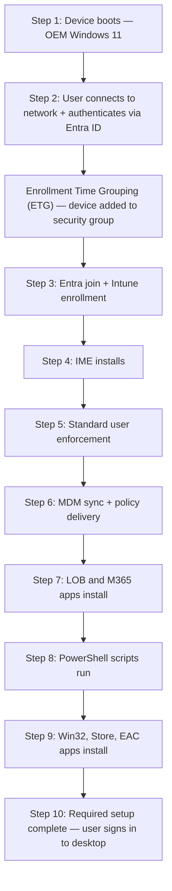
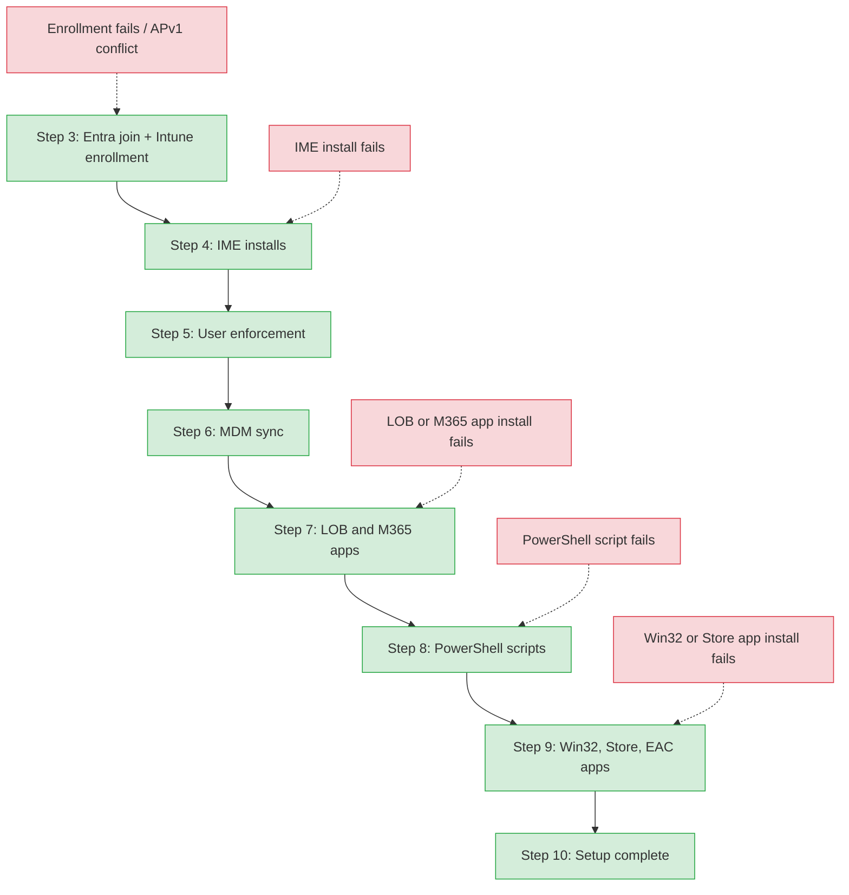

> **Version gate:** This guide covers Windows Autopilot Device Preparation (APv2).
> For Windows Autopilot (classic), see [Autopilot Lifecycle Overview](../lifecycle/00-overview.md).
> For framework selection, see [APv1 vs APv2](../apv1-vs-apv2.md).

# APv2 User-Driven Deployment Flow

## How to Use This Guide

This is the 10-step deployment process for APv2 user-driven mode. Each step is explained below with what happens, what can fail, and where to look when it does. For prerequisites and configuration requirements, see [APv2 Prerequisites](01-prerequisites.md). For automatic mode (Windows 365 Cloud PCs), see [APv2 Automatic Mode](03-automatic-mode.md).

## Level 1 — Happy Path

> The **Enrollment Time Grouping (ETG)** mechanism is the core architectural difference from APv1. Instead of hardware hash pre-staging and an Enrollment Status Page (ESP), APv2 adds the device to a pre-configured security group at the moment of enrollment. Apps and scripts assigned to that group deploy during OOBE.

## Level 2 — Failure Points

The following diagram shows where common failures surface during the APv2 deployment flow. Green nodes are steps; red nodes are failure categories connected with dashed arrows to the step where they appear.

## Step-by-Step Breakdown

### Step 1: Device Boots with OEM Windows 11

**What happens:** The device powers on with an OEM-preinstalled copy of Windows 11 (version 22H2 with KB5035942 or later, or 23H2/24H2). The Out-of-Box Experience (OOBE) begins.

**What can go wrong:** If the OS version does not meet the minimum requirement (Windows 11 22H2 + KB5035942), the APv2 Device Preparation policy is ignored and the device enrolls without APv2 configuration.

**Key detail:** Windows 10 is not supported for APv2. This is a hard OS gate.

### Step 2: User Authenticates During OOBE

**What happens:** The user connects to a network (Wi-Fi or Ethernet) and authenticates with their Microsoft Entra ID credentials during OOBE. This triggers the enrollment sequence.

**What can go wrong:** Network connectivity failures prevent authentication. Smart card or certificate-based authentication is not supported during OOBE.

**Key detail:** The user must have Microsoft Entra join permissions. If the user's account lacks join permissions, enrollment fails.

### Step 3: Entra Join and Intune Enrollment

**What happens:** The device joins Microsoft Entra ID and enrolls in Intune. At enrollment time, the device is added to the Enrollment Time Grouping (ETG) security group. The Intune Provisioning Client (service principal AppID: `f1346770-5b25-470b-88bd-d5744ab7952c`) performs the group membership assignment as the group owner.

**What can go wrong:** Enrollment fails if the device is already registered as an APv1 Autopilot device — the APv1 profile silently takes precedence. Enrollment also fails if the ETG security group is not correctly configured or if the Intune Provisioning Client is not set as the group owner.

**Key detail:** The ETG mechanism is what makes APv2 fundamentally different from APv1. Instead of pre-staging hardware hashes and waiting for dynamic group evaluation, the device is directly added to a pre-configured group at enrollment time.

### Step 4: Intune Management Extension (IME) Installs

**What happens:** The Intune Management Extension installs on the device. IME is required for Win32 app deployment, PowerShell script execution, and compliance remediation scripts.

**What can go wrong:** IME installation failure blocks all subsequent app and script deployments.

**Key detail:** IME must install successfully before any apps or scripts in the Device Preparation policy can be deployed.

### Step 5: Standard User Enforcement

**What happens:** If the Device Preparation policy is configured to enforce standard user permissions, and the user was added to the local Administrators group during Entra join, they are removed from the local Administrators group.

**What can go wrong:** This step does not cause deployment failure. However, if the admin expects the user to retain local admin rights but the policy enforces standard user, the user will not have admin access on the desktop.

**Key detail:** This enforcement runs silently. The user is not notified of the permission change.

### Step 6: MDM Sync and Policy Delivery

**What happens:** The deployment syncs with Intune. All MDM policies are synced to the device (but policy application is NOT individually tracked during deployment). The system checks for LOB and Microsoft 365 apps selected in the Device Preparation policy.

**What can go wrong:** Sync failure prevents app and script deployment from proceeding. If the Device Preparation policy references apps that do not exist or are not properly assigned to the ETG group, the deployment may fail or stall.

**Key detail:** MDM policy application is not tracked during APv2 deployment. Only app and script installations are tracked and can cause deployment failure. This is a key difference from APv1's ESP, which tracks both.

### Step 7: LOB and Microsoft 365 Apps Install

**What happens:** Line-of-Business (LOB) apps and Microsoft 365 apps selected in the Device Preparation policy install on the device.

**What can go wrong:** **Failure here fails the deployment.** The deployment status shows "Failed" in the Intune admin center. Common causes include corrupted app packages, insufficient disk space, or app dependency conflicts.

**Key detail:** Only apps selected in the Device Preparation policy are tracked. Apps assigned to the ETG group but not selected in the policy install post-OOBE (see [Post-Deployment Sync](#post-deployment-sync)).

### Step 8: PowerShell Scripts Run

**What happens:** PowerShell scripts selected in the Device Preparation policy execute on the device.

**What can go wrong:** **Failure here fails the deployment.** Script failures (non-zero exit codes or timeouts) cause the entire deployment to fail.

**Key detail:** Up to 10 PowerShell scripts can be selected in the Device Preparation policy.

### Step 9: Win32, Store, and EAC Apps Install

**What happens:** Win32 apps, Microsoft Store apps, and Enterprise App Catalog apps selected in the Device Preparation policy install on the device.

**What can go wrong:** **Failure here fails the deployment.** App install failures from any of these app types cause the deployment to fail.

**Key detail:** The combined limit for all app types (LOB, M365, Win32, Store, EAC) selected in the Device Preparation policy is 25 (raised from 10 as of January 30, 2026).

### Step 10: Required Setup Complete

**What happens:** The "Required setup complete" page displays to the user. The user dismisses the page and signs in to the Windows desktop. A second sync delivers remaining configurations.

**What can go wrong:** This step does not fail the deployment. However, post-OOBE app installations may still be in progress when the user reaches the desktop.

**Key detail:** After the user reaches the desktop, a background sync delivers apps/scripts assigned to the ETG device group but not selected in the Device Preparation policy, additional MDM policies, and user-based configurations.

## Post-Deployment Sync

After Step 10, the device continues receiving configurations in the background:

- **Apps and scripts** assigned to the ETG device group but NOT selected in the Device Preparation policy deploy silently in the background.
- **Additional MDM policies** that were synced but not tracked during deployment now apply.
- **User-based configurations** (apps and policies targeted to the user, not the device group) begin deploying.

The user can work normally during this period. Background installations do not block desktop access.

## Note on Windows Quality Updates

Windows quality updates may install after the device preparation page completes, potentially adding 20-40 minutes and a possible restart to the overall provisioning time. This feature's availability is subject to change. Check [What's New in Autopilot Device Preparation](https://learn.microsoft.com/en-us/autopilot/device-preparation/whats-new) for the latest status.

L2 detail: MDM policy tracking vs app tracking

During APv2 deployment, MDM policies sync but their application is NOT individually tracked. Only app and script installations are tracked and can cause deployment failure. This is a key difference from APv1's ESP, which tracks both policy and app installation.

Specifically:
- **Tracked (can fail deployment):** LOB apps, M365 apps, Win32 apps, Store apps, Enterprise App Catalog apps, PowerShell scripts — all selected in the Device Preparation policy.
- **Not tracked (synced but not monitored):** MDM configuration policies, compliance policies, security baselines.

If you need to verify that a specific MDM policy applied during deployment, check the device's configuration profile status in the Intune admin center post-enrollment rather than relying on the deployment status page.

## See Also

- [APv2 Overview](00-overview.md)
- [APv2 Prerequisites](01-prerequisites.md)
- [APv2 Automatic Mode](03-automatic-mode.md)
- [APv1 vs APv2 Comparison](../apv1-vs-apv2.md)
- [APv1 Lifecycle Overview](../lifecycle/00-overview.md)

---

*Deployment flow sourced from [Microsoft Learn — APv2 User-Driven Workflow](https://learn.microsoft.com/en-us/autopilot/device-preparation/tutorial/user-driven/entra-join-workflow), verified April 2026.*
