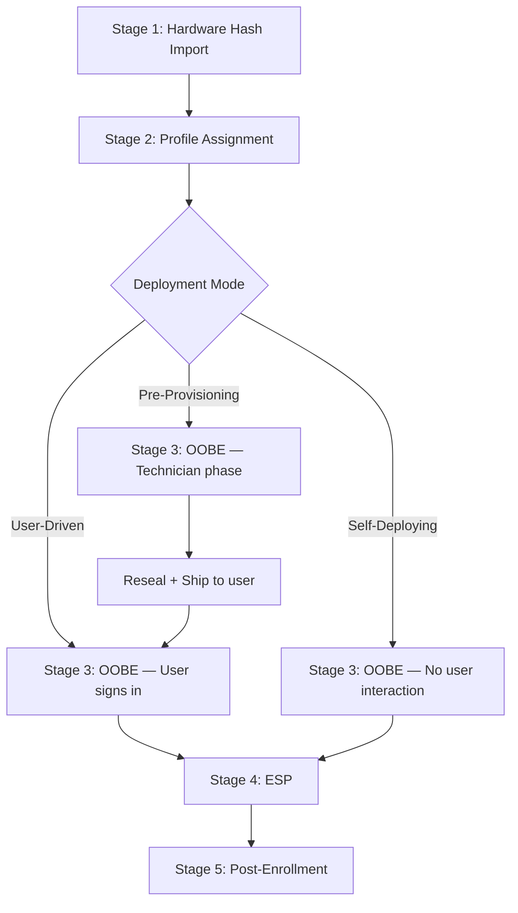
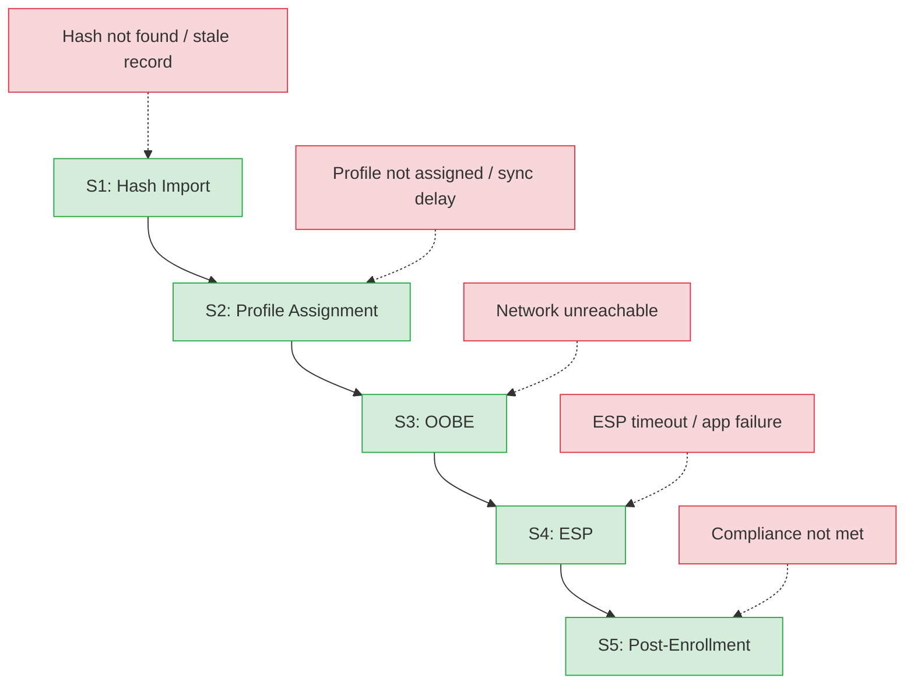

<objective>
Author the lifecycle overview document that ties all 5 stage guides together with two-level Mermaid diagrams, an actor summary table, prerequisites checklist, and a "How to Use This Guide" reader guide.

Purpose: The overview is the entry point for both L1 and L2 audiences into the lifecycle documentation. It must let a reader identify which stage a reported failure belongs to and navigate directly to that stage guide. Written last because it references all 5 stage guide files.
Output: `docs/lifecycle/00-overview.md` completing the Phase 2 deliverable set.
</objective>

<execution_context>
@C:/Users/joanderson/.claude/get-shit-done/workflows/execute-plan.md
@C:/Users/joanderson/.claude/get-shit-done/templates/summary.md
</execution_context>

<context>
@.planning/PROJECT.md
@.planning/ROADMAP.md
@.planning/STATE.md
@.planning/phases/02-lifecycle/02-CONTEXT.md
@.planning/phases/02-lifecycle/02-RESEARCH.md

@.planning/phases/02-lifecycle/02-01-SUMMARY.md
@.planning/phases/02-lifecycle/02-02-SUMMARY.md

@docs/_templates/l2-template.md
@docs/_glossary.md
@docs/apv1-vs-apv2.md
@docs/reference/registry-paths.md
@docs/reference/endpoints.md
@docs/reference/powershell-ref.md
@docs/architecture.md
</context>

<tasks>

<task type="auto">
  <name>Task 1: Create lifecycle overview with Mermaid diagrams, actor table, and prerequisites</name>
  <files>docs/lifecycle/00-overview.md</files>
  <action>
**File: `docs/lifecycle/00-overview.md`** (LIFE-01, 800-1200 words)

Frontmatter: `last_verified: 2026-03-14`, `review_by: 2026-06-12`, `applies_to: both`, `audience: both`

Version gate banner: "This guide primarily covers Windows Autopilot (classic). APv2 (Device Preparation) differences are noted inline. For a full comparison, see [APv1 vs APv2 disambiguation](../apv1-vs-apv2.md)."

Structure (NOT the 11-section stage guide structure -- the overview has its own structure per CONTEXT.md):

**# Autopilot Lifecycle Overview**

**## How to Use This Guide** (per CONTEXT.md -- overview only)
Brief reader guide (3-5 sentences): explains that this overview provides the end-to-end picture, each stage has a dedicated guide linked below, and readers can jump to the relevant stage when troubleshooting. Mention that L2 technical details appear as callouts within stage guides.

**## The Deployment Pipeline**

Two-level Mermaid diagram approach per CONTEXT.md and RESEARCH.md Pattern 5:

**Level 1 -- Happy Path (TD direction):**

Add text note below Level 1 diagram: "This diagram shows the APv1 (classic) flow. For the APv2 (Device Preparation) flow, see [APv1 vs APv2](../apv1-vs-apv2.md)." Per CONTEXT.md.

**Level 2 -- Failure Points (TD direction, color-coded):**

**## Stage Summary**

Actor summary table (per CONTEXT.md):

| Stage | Primary Actor | What Happens | Guide |
|-------|--------------|--------------|-------|
| 1: Hardware Hash Import | Admin / OEM / Partner | Device fingerprint uploaded to Intune | [Stage 1](01-hardware-hash.md) |
| 2: Profile Assignment | Admin | Autopilot profile matched to device via AAD group | [Stage 2](02-profile-assignment.md) |
| 3: OOBE | User / Technician / None | Deployment mode activates; device joins Azure AD | [Stage 3](03-oobe.md) |
| 4: ESP | Background (MDM) | Device and user apps/policies installed | [Stage 4](04-esp.md) |
| 5: Post-Enrollment | Admin verifies | Deployment confirmed; device handed off | [Stage 5](05-post-enrollment.md) |

**## Prerequisites**

Checklist (per CONTEXT.md -- tenant, licenses, profile, network, registration):
- [ ] Azure AD tenant configured with Intune
- [ ] Appropriate licenses assigned (Microsoft 365 Business Premium, E3, E5, or standalone Intune)
- [ ] Autopilot deployment profile created and assigned to a group
- [ ] Network connectivity to required [Autopilot endpoints](../reference/endpoints.md)
- [ ] Device hardware hash registered in Autopilot service

Brief note: "All prerequisites must be met before Stage 1. Missing any prerequisite causes failures that surface at Stage 2 or 3."

**## Related Documentation**

Links to all Phase 1 assets + architecture.md (per CONTEXT.md):
- [Glossary](../_glossary.md) -- Autopilot terminology reference
- [APv1 vs APv2 Disambiguation](../apv1-vs-apv2.md) -- Framework comparison
- [Registry Paths Reference](../reference/registry-paths.md) -- All Autopilot registry locations
- [Network Endpoints Reference](../reference/endpoints.md) -- Required URLs and test commands
- [PowerShell Function Reference](../reference/powershell-ref.md) -- Diagnostic and remediation functions
- [Architecture Overview](../architecture.md) -- System design context

**## Version History**

| Date | Change |
|------|--------|
| 2026-03-14 | Initial version |

First-mention glossary linking throughout. No inline definitions. Writing style: direct second-person. Standard Markdown blockquotes only.

Do NOT include prev/next navigation in the overview (it is not a stage guide -- it is the hub that links to all stages).
  </action>
  <verify>
    <automated>ls docs/lifecycle/00-overview.md && grep -c "mermaid" docs/lifecycle/00-overview.md && grep -c "click S" docs/lifecycle/00-overview.md && grep "Prerequisites" docs/lifecycle/00-overview.md</automated>
  </verify>
  <done>File exists with two Mermaid diagrams (happy path with clickable nodes + failure points with color coding), actor summary table linking to all 5 stage guides, prerequisites checklist, "How to Use This Guide" section, Related Documentation links to all Phase 1 assets + architecture.md, version gate banner, glossary links, and version history.</done>
</task>

</tasks>

<verification>
- `docs/lifecycle/00-overview.md` exists
- Contains two Mermaid diagrams (happy path TD + failure points TD)
- Happy path diagram shows all 3 deployment modes with reseal+ship node
- Happy path diagram has `click` nodes linking to all 5 stage guide files
- Failure points diagram uses `classDef` for color coding (green stage, red failure)
- Actor summary table has 5 rows with links to each stage guide
- Prerequisites checklist covers tenant, licenses, profile, network, registration
- "How to Use This Guide" section present
- Related Documentation links to all 6 Phase 1 assets
- APv1-only diagram note with link to apv1-vs-apv2.md
- Text below Level 1 diagram explains it is APv1 only
- No prev/next navigation (overview is hub, not sequential stage)
</verification>

<success_criteria>
- An L1 agent can open the overview and identify which stage corresponds to a reported failure
- The happy path diagram visually distinguishes user-driven, pre-provisioning, and self-deploying paths
- The failure points diagram highlights where common failures occur with color coding
- Every stage guide is reachable from the overview via both the actor table and clickable diagram nodes
- All Phase 1 reference assets are linked from Related Documentation
</success_criteria>

<output>
After completion, create `.planning/phases/02-lifecycle/02-03-SUMMARY.md`
</output>
