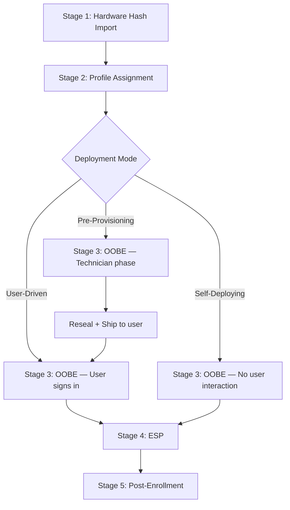
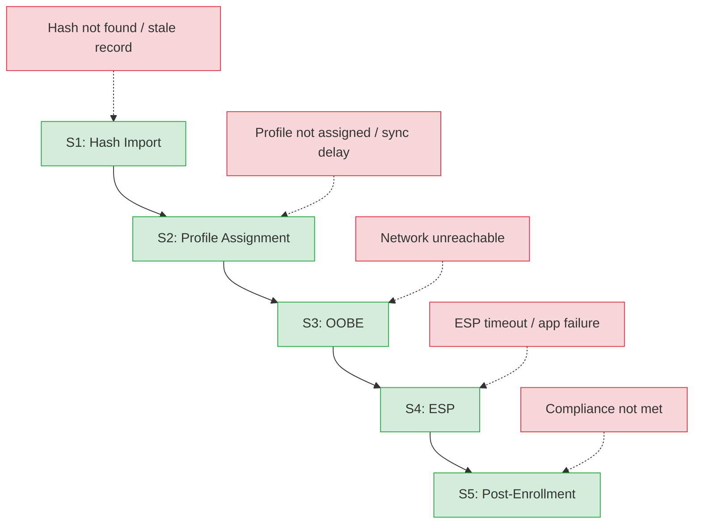
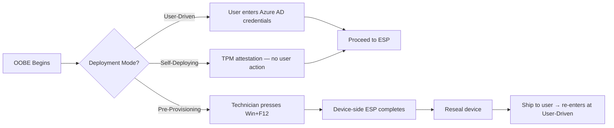
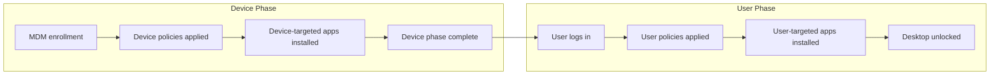

# Phase 2: Lifecycle - Research

**Researched:** 2026-03-14
**Domain:** Windows Autopilot end-to-end lifecycle documentation — six-stage deployment sequence for APv1
**Confidence:** HIGH

<user_constraints>
## User Constraints (from CONTEXT.md)

### Locked Decisions

**Audience & File Structure**
- Shared docs for both L1 and L2 audiences — lifecycle is factual, not troubleshooting, so the L1/L2 split doesn't apply yet
- Use L2 template as base with adapted section headings (Context, What Happens, etc.)
- Light "L2 Note" blockquote callouts for technical pointers (registry paths, event IDs) — not full L2 sections
- Files live in `docs/lifecycle/` subfolder
- 6 files total: `00-overview.md` + 5 stage guides (`01` through `05`)
- OOBE guide covers user-driven, pre-provisioning, and self-deploying as sections within one file
- Sequential prev/next navigation links at bottom of each stage guide
- "How to Use This Guide" reader guide in overview only
- Actor summary table in overview (Stage → Primary Actor → What Happens)
- Prerequisites checklist in overview (tenant, licenses, profile, network, registration)
- Related Documentation section in overview linking to all Phase 1 assets + architecture.md

**Standardized 11-Section Stage Guide Structure**
Every stage guide follows this order:
1. Context (what + when + "Depends on" / "Feeds into" dependency notes)
2. What the User Sees / What the Admin Sees (adaptive heading per stage)
3. What Happens (3-8 numbered steps with 1-2 sentence explanations each)
4. Behind the Scenes (L2 Note callout — 3-5 bullets on API/service interactions)
5. Success Indicators (checklist with checkmarks)
6. Failure Indicators (checklist with X marks + forward-links to Phase 3 error codes and Phase 5-6 runbooks as placeholders)
7. Typical Timeline (1-2 line timing note with variability caveat)
8. Watch Out For (2-3 bullet points of common misconfigurations)
9. Tool References (stage-specific PowerShell function links + Further Reading with Microsoft Learn URLs)
10. Navigation (prev/next links)
11. Version History (date + change table)

**Diagrams**
- Overview: two-level Mermaid approach — happy path diagram (TD direction) + failure points diagram with color-coded nodes (red fail, green ok, amber decision via classDef)
- Overview happy path shows all 3 deployment modes (user-driven, pre-provisioning, self-deploying) with reseal+ship node for pre-provisioning
- Stage-specific Mermaid diagrams for OOBE (diverge/reconverge pattern for 3 paths) and ESP (sequential subgraph with device phase / user phase boundary) only — other stages use bullet lists
- Stage-internal diagrams use LR direction
- Consistent node naming convention: S1-S5 for stages, F_xxx for failures, M for mode decision
- Clickable nodes linking to stage guide files (Mermaid `click` syntax — degrades gracefully)

**APv1 vs APv2 Handling**
- APv1 is primary content; APv2 callouts as blockquotes (`> **APv2 Note:**`) in stages 1-4 where behavior differs
- No APv2 callout needed for post-enrollment (stage 5) — similar enough
- APv2 callouts include Microsoft Learn links to Device Preparation docs
- Updated version gate banner: "This guide primarily covers Windows Autopilot (classic). APv2 (Device Preparation) differences are noted inline."
- Overview diagram is APv1 only; text note below links to apv1-vs-apv2.md for APv2 flow
- Frontmatter `applies_to: both` since guides reference both frameworks

**Writing Style**
- Direct, second-person voice ("You upload the CSV")
- 500-800 words per stage guide; overview 800-1200 words
- OOBE and ESP guides may run 600-900 words (more complex)
- First-mention glossary linking per file (link IS the signal, no italic/bold on terms)
- Fenced code blocks with `powershell` tag for commands; inline backticks for registry paths
- Standard Markdown blockquotes for all callouts (L2 Note, APv2 Note, Watch Out For) — no GitHub-specific admonition syntax
- Text descriptions of screens with element names — no screenshots (per Out of Scope constraint)

**Stage-Specific Depth**
- Hardware hash guide: all 4 import methods (CSV, OEM, PowerShell, Partner Center) briefly described
- Profile assignment guide: dynamic vs static group assignment comparison with timing notes
- ESP guide: app type tracking table (Win32, LOB, Store required/available, scripts, certificates) + timeout behavior
- Post-enrollment guide: verification checklist for confirming successful deployment end-to-end

**Edge Cases (Brief Notes Only)**
- Co-management: brief note in ESP stage only (app tracking differences)
- Hybrid join: brief note in profile assignment and OOBE stages (domain controller requirement)
- Re-registration: Watch Out For item in hardware hash stage (stale device records)
- Autopilot Reset: brief note in OOBE stage (re-enters at Stage 3, skips hash import)
- ESP context: brief note distinguishing OOBE ESP vs post-enrollment ESP behavior

**Maintenance**
- 90-day review_by frontmatter cycle from Phase 1 templates
- Version History table at bottom of each file (after navigation, section 11)
- Supplement existing docs (architecture.md, common-issues.md) with cross-links — no replacement

### Claude's Discretion

- Exact Mermaid diagram node layout and edge labels
- Specific Microsoft Learn URLs to include in Further Reading and APv2 callouts
- Which PowerShell functions to feature in each stage's Tool References
- Exact wording of success/failure indicator items
- Number and specific content of Watch Out For bullets per stage
- Whether to include additional sub-steps within the numbered process steps

### Deferred Ideas (OUT OF SCOPE)

None — discussion stayed within phase scope
</user_constraints>

<phase_requirements>
## Phase Requirements

| ID | Description | Research Support |
|----|-------------|-----------------|
| LIFE-01 | End-to-end Autopilot lifecycle overview with flow diagram (hardware hash → desktop) | Overview file structure, Mermaid diagram approach, and actor table contents fully defined in CONTEXT.md; APv1 lifecycle stages confirmed from official Microsoft Learn docs |
| LIFE-02 | Hardware hash import and device registration stage guide | All 4 import methods confirmed; registration flow, ZTD service interactions, and stale-device pitfall documented below |
| LIFE-03 | Autopilot profile assignment stage guide | Dynamic vs static group timing, Graph API sync behavior, and profile download registry path all confirmed from Phase 1 assets |
| LIFE-04 | OOBE and deployment mode selection stage guide (user-driven + pre-provisioning) | Three deployment mode paths, TPM requirements, diverge/reconverge Mermaid pattern, and APv2 difference callout areas confirmed |
| LIFE-05 | Enrollment Status Page (ESP) stage guide covering device and user phases | Device phase vs user phase registry tracking, app type table, FirstSync checkpoint, and timeout behavior confirmed from Phase 1 registry-paths.md and official docs |
| LIFE-06 | Post-enrollment verification and handoff stage guide | Verification checklist items (Intune compliance, profile assignment, app install, Azure AD join state) derived from PowerShell function return values and official docs |
</phase_requirements>

---

## Summary

Phase 2 is a documentation-authoring phase that produces six Markdown files in a new `docs/lifecycle/` subfolder. Like Phase 1, nothing in this phase touches source code. The deliverables build the shared mental model that all downstream phases (error codes, decision trees, runbooks) depend on to make stage-of-failure references meaningful to both L1 and L2 audiences.

The phase architecture is fully defined in CONTEXT.md with locked decisions covering file count, directory location, section order, diagram approach, writing style, and stage-specific depth requirements. This removes most research ambiguity — the primary research value here is confirming the factual accuracy of lifecycle stage content (what actually happens at each stage, API/service interactions, timing, failure modes) so the authored files can be written with HIGH confidence from the start.

The APv1 lifecycle is well-documented in official Microsoft sources. The six stages map cleanly: hardware hash import → profile assignment → OOBE/deployment mode → ESP (device phase + user phase) → post-enrollment verification. All Phase 1 reference assets (glossary, registry-paths.md, endpoints.md, powershell-ref.md) are available and provide the canonical links the stage guides need. No new reference data needs to be created in Phase 2 — the phase is purely consumer of Phase 1, not producer of new reference material.

**Primary recommendation:** Create the `docs/lifecycle/` directory and the six files in dependency order: overview last (it links to all stage guides). Author stage guides 01-05 first, then the overview with its actor table, prerequisites checklist, and two-level Mermaid diagram. Every file must follow the adapted L2 template pattern with the modified version gate banner ("primarily covers APv1; APv2 differences noted inline").

---

## Standard Stack

This phase has no code dependencies. All deliverables are plain Markdown files. The relevant "stack" is the documentation conventions established in Phase 1 and the lifecycle content domain.

### File Inventory (what gets created)

| File | Requirement | Location | Word Target |
|------|-------------|----------|-------------|
| `00-overview.md` | LIFE-01 | `docs/lifecycle/` | 800-1200 words |
| `01-hardware-hash.md` | LIFE-02 | `docs/lifecycle/` | 500-800 words |
| `02-profile-assignment.md` | LIFE-03 | `docs/lifecycle/` | 500-800 words |
| `03-oobe.md` | LIFE-04 | `docs/lifecycle/` | 600-900 words |
| `04-esp.md` | LIFE-05 | `docs/lifecycle/` | 600-900 words |
| `05-post-enrollment.md` | LIFE-06 | `docs/lifecycle/` | 500-800 words |

### Files NOT to create or modify

| File | Reason |
|------|--------|
| `docs/common-issues.md` | Phase 7 responsibility |
| `docs/architecture.md` | Phase 7 responsibility — overview only LINKS to it, does not modify it |
| Any Phase 1 reference file | Phase 1 is complete; lifecycle files link to them, not the reverse |
| Any `src/` file | Documentation-only phase |

### Phase 1 Assets Used (link targets, not modified)

| Asset | Path | Used In |
|-------|------|---------|
| Glossary | `docs/_glossary.md` | All 6 files — first-mention glossary links |
| APv1 vs APv2 | `docs/apv1-vs-apv2.md` | Version gate banners, APv2 callout links |
| Registry paths | `docs/reference/registry-paths.md` | L2 Note callouts in stages 3-5 |
| Network endpoints | `docs/reference/endpoints.md` | Stage 1 (registration) and Stage 3 (OOBE connectivity) |
| PowerShell ref | `docs/reference/powershell-ref.md` | Tool References sections in each stage guide |
| Architecture | `docs/architecture.md` | Related Documentation in overview |

---

## Architecture Patterns

### Recommended Directory Structure

```
docs/
├── lifecycle/               # NEW — created in this phase
│   ├── 00-overview.md       # LIFE-01 — master lifecycle overview with diagrams
│   ├── 01-hardware-hash.md  # LIFE-02 — hardware hash import and registration
│   ├── 02-profile-assignment.md  # LIFE-03 — profile assignment stage
│   ├── 03-oobe.md           # LIFE-04 — OOBE and deployment mode selection
│   ├── 04-esp.md            # LIFE-05 — Enrollment Status Page
│   └── 05-post-enrollment.md     # LIFE-06 — post-enrollment verification
├── _glossary.md             # Phase 1 — link target only
├── apv1-vs-apv2.md          # Phase 1 — link target only
├── _templates/              # Phase 1 — not modified
└── reference/               # Phase 1 — link target only
```

### Pattern 1: Stage Guide Frontmatter and Version Gate (modified from L2 template)

Every stage guide opens with this frontmatter and modified version gate. This is a deliberate adaptation of the L2 template (per CONTEXT.md decision: "Use L2 template as base with adapted section headings").

```markdown
---
last_verified: 2026-03-14
review_by: 2026-06-12
applies_to: both
audience: both
---

> **Version gate:** This guide primarily covers Windows Autopilot (classic).
> APv2 (Device Preparation) differences are noted inline.
> For a full comparison, see [APv1 vs APv2 disambiguation](../apv1-vs-apv2.md).
```

**Why `applies_to: both`:** The guides reference both APv1 and APv2 inline via callouts, even though APv1 is primary content.

### Pattern 2: 11-Section Stage Guide Structure

Every stage guide (`01` through `05`) uses this exact section order:

```markdown
# Stage N: [Stage Name]

## Context
[What this stage is, when it occurs, Depends on: [prev stage], Feeds into: [next stage]]

## What [the User / the Admin / the Technician] Sees
[Text description of visible screens/portals — no screenshots]

## What Happens
1. [Step — 1-2 sentences]
2. [Step]
...

> **L2 Note:** [3-5 bullets on API/service interactions, registry paths, event IDs]

## Success Indicators
- [x] [Indicator]
- [x] [Indicator]

## Failure Indicators
- [ ] [Indicator] — see [Phase 3 error codes](../../docs/error-codes/) *(available after Phase 3)*
- [ ] [Indicator] — see [L1 runbook](../../docs/l1-runbooks/) *(available after Phase 5)*

## Typical Timeline
[1-2 line timing note with variability caveat]

## Watch Out For
- **[Misconfiguration]:** [why it's a problem, what to check]

## Tool References
- [`FunctionName`](../reference/powershell-ref.md#functionname) — [what it does in this stage]
- **Further Reading:** [Microsoft Learn URL] — [topic]

---
*Previous: [Stage N-1 link] | Next: [Stage N+1 link]*

---

## Version History

| Date | Change |
|------|--------|
| 2026-03-14 | Initial version |
```

### Pattern 3: L2 Note Callout

The L2 Note is a standard Markdown blockquote. No GitHub-specific admonition syntax.

```markdown
> **L2 Note:** Behind the scenes during this stage:
> - The device contacts `ztd.dds.microsoft.com` to retrieve its assigned profile
> - The ZTDID is stored in `HKLM:\SOFTWARE\Microsoft\Provisioning\Diagnostics\Autopilot` after successful download
> - Event ID XXXX in `Microsoft-Windows-Provisioning-Diagnostics-Provider/Admin` confirms profile receipt
```

### Pattern 4: APv2 Callout

```markdown
> **APv2 Note:** In Windows Autopilot Device Preparation, this stage works differently:
> hardware hash pre-staging is not required; devices register automatically on first boot.
> See [APv1 vs APv2](../apv1-vs-apv2.md) and [Microsoft Learn: Device Preparation overview](https://learn.microsoft.com/en-us/autopilot/device-preparation/).
```

### Pattern 5: Overview Mermaid Diagram (two-level approach)

**Level 1 — Happy path (all three modes, TD direction):**

```markdown

```

**Level 2 — Failure points (color-coded via classDef):**

```markdown

```

### Pattern 6: OOBE Stage Mermaid (LR direction, diverge/reconverge)

```markdown

```

### Pattern 7: ESP Stage Mermaid (LR direction, sequential subgraph)

```markdown

```

### Anti-Patterns to Avoid

- **Defining glossary terms inline:** Every Autopilot term (OOBE, ESP, TPM, ZTDID, etc.) must link to `_glossary.md` on first mention per file — never define inline.
- **Defining registry paths inline:** L2 Note callouts that reference registry paths must link to `docs/reference/registry-paths.md`, not embed the path only in prose.
- **Defining PowerShell function behavior inline:** Tool References sections link to `docs/reference/powershell-ref.md#functionname` — no inline parameter documentation.
- **Mixing troubleshooting procedures into stage guides:** Stage guides describe what happens and what failure looks like; they do NOT contain fix steps. Fix steps belong in Phase 5-6 runbooks. Failure Indicators forward-link with "(available after Phase X)" annotation.
- **Using GitHub-specific admonition syntax:** All callouts are standard `> **Label:**` blockquotes. No `> [!NOTE]` or `> [!WARNING]` syntax — not universally rendered.
- **Screenshots:** Explicitly out of scope. Use text descriptions with element names ("the OOBE network screen shows a Wi-Fi selection list").
- **Linking to future files that don't exist yet:** Forward-links to Phase 3-6 content must include "(available after Phase X)" annotation.
- **Authoring overview before stage guides:** The overview actor table and Mermaid clickable nodes reference stage guide files. Author stages 01-05 first, then overview.

---

## Lifecycle Domain: Factual Content Reference

This section documents the verified factual content that stage guide authors need. Sources are official Microsoft Learn documentation.

### Six Stages and their Actors

| Stage | File | Primary Actor | What Happens | Depends On | Feeds Into |
|-------|------|--------------|--------------|------------|------------|
| 1: Hardware Hash Import | `01-hardware-hash.md` | Admin / OEM / Partner | Device fingerprint uploaded to Intune; ZTD service creates ZTDID | Tenant + licenses | Profile assignment |
| 2: Profile Assignment | `02-profile-assignment.md` | Admin (configures groups) | Autopilot profile matched to device via AAD group membership | Hash import | OOBE mode selection |
| 3: OOBE | `03-oobe.md` | User / Technician / None (self-deploy) | Windows first-run screens detect Autopilot profile; deployment mode branch | Profile assigned | ESP |
| 4: ESP | `04-esp.md` | Background (MDM) | Device phase installs device apps + policies; user phase installs user apps | MDM enrolled | Post-enrollment |
| 5: Post-Enrollment | `05-post-enrollment.md` | Admin verifies | Desktop unlocked; compliance checked; deployment confirmed | ESP complete | Ongoing management |

### Stage 1: Hardware Hash Import — Key Facts (LIFE-02)

**What happens:**
1. A 4K-byte hardware hash is generated from the device — contains hardware identifiers unique to this physical device.
2. The hash is uploaded to Intune/Microsoft 365 admin center via one of four methods.
3. The ZTD service creates a ZTDID for the device and stores it in the Autopilot service.
4. The device is now "registered" — it will receive a profile when it reaches OOBE.

**Four import methods (all four must be briefly described per CONTEXT.md):**

| Method | Who Uses It | How |
|--------|-------------|-----|
| CSV upload | Admin bulk importing multiple devices | Export hash with `Get-AutopilotHardwareHash` or OEM-provided tool; upload to Intune → Devices → Enrollment → Windows Autopilot |
| OEM direct upload | OEM pre-registers before shipping | OEM submits hash directly to Microsoft; device arrives pre-registered |
| PowerShell (Get-WindowsAutopilotInfo) | Admin on a device already in hand | `Install-Script -Name Get-WindowsAutopilotInfo; Get-WindowsAutopilotInfo -Online` |
| Partner Center | CSP resellers / Microsoft partners | Partner registers in Partner Center on customer's behalf |

**APv2 difference (callout needed):** APv2 does not require hardware hash pre-staging. Devices register automatically. APv2 callout belongs in this stage.

**Registry paths relevant to this stage:**
- `HKLM:\SOFTWARE\Microsoft\Provisioning\Diagnostics\Autopilot` — populated after profile download (not at import time — this is a common confusion)

**PowerShell functions for Tool References:**
- `Get-AutopilotHardwareHash` — retrieves hash from device for CSV export
- `Get-AutopilotRegistrationState` — verifies registration state after import

**Watch Out For items:**
- **Stale device records:** Re-registering a device already in Autopilot without deleting the old record creates duplicate entries that cause profile assignment failures.
- **Hash generated from wrong image state:** Hardware hash must be captured before OS customizations; sysprep should not have run.
- **Tenant mismatch:** Hash uploaded to wrong tenant — device receives no profile at OOBE.

**Typical timeline:** Hash upload to service availability: near-immediate (seconds to minutes for the upload itself). Group membership propagation for profile assignment: up to 15 minutes after registration. Full sync: varies.

### Stage 2: Profile Assignment — Key Facts (LIFE-03)

**What happens:**
1. Admin creates an Autopilot deployment profile in Intune specifying deployment mode, OOBE settings, and enrollment settings.
2. Profile is assigned to an Azure AD group (static or dynamic).
3. When a registered device's AAD object is added to the assigned group, the profile is matched to the device.
4. At OOBE, the device queries `ztd.dds.microsoft.com` and `cs.dds.microsoft.com` for its profile.
5. Profile details download and are stored locally in registry.

**Dynamic vs static group timing (per CONTEXT.md, this comparison is required):**

| Group Type | Membership Evaluation | Profile Assignment Delay |
|------------|----------------------|--------------------------|
| Static group | Manual add — immediate | Minutes after admin adds device |
| Dynamic group | Rule evaluation — triggered by attribute change | 5-15 minutes for rule processing; up to 24 hours for large tenants with complex rules |

**Registry paths relevant to this stage:**
- `HKLM:\SOFTWARE\Microsoft\Provisioning\AutopilotSettings` — populated when profile downloads during OOBE (not before OOBE starts)

**Endpoints used in this stage:**
- `ztd.dds.microsoft.com` — profile lookup
- `cs.dds.microsoft.com` — configuration service data

**PowerShell functions for Tool References:**
- `Get-AutopilotProfileAssignment` — reads `AutopilotSettings` registry key to confirm profile received
- `Get-AutopilotRegistrationState` — confirms ZTDID and tenant domain

**APv2 difference:** APv2 uses "deployment profiles" but assigns via Device Preparation policies, not Autopilot profiles. No hardware hash matching step.

**Watch Out For items:**
- **Dynamic group delay:** An admin registering a device and expecting immediate OOBE success may find no profile if dynamic group membership hasn't evaluated yet.
- **Profile targeting all devices vs targeted group:** A "target all" profile can conflict with a specific profile; profile precedence rules apply.
- **Hybrid join requires additional infrastructure:** Profile that specifies Hybrid Azure AD Join requires ODJ Connector and domain controller reachability — brief note here, detail in OOBE stage.

### Stage 3: OOBE — Key Facts (LIFE-04)

**What happens (common path before mode branch):**
1. Device powers on for the first time (or after Autopilot Reset).
2. OOBE screens begin — regional/keyboard settings, network connection.
3. Device contacts `ztd.dds.microsoft.com` to check for Autopilot registration.
4. If registered: profile downloads, OOBE customized per profile settings (skip privacy screens, etc.).
5. Mode-specific path begins.

**Three deployment mode paths (all three covered in one file per CONTEXT.md):**

**User-Driven:**
- User sees customized OOBE screens (company logo, custom text per profile)
- User enters Azure AD credentials
- Device joins Azure AD, MDM enrollment begins
- ESP launches

**Pre-Provisioning (Technician phase):**
- Technician presses Win+F12 at the first OOBE screen (before any user interaction)
- Blue "Windows Autopilot provisioning" screen appears
- Device-side ESP runs: device policies, device apps, certificates, scripts applied
- TPM attestation required (same as self-deploying)
- On success: "Success" screen shown — technician selects "Reseal"
- Device reboots, returns to OOBE start
- Device is shipped to end user — user's OOBE is then user-driven but device phase already complete

**Self-Deploying:**
- No user interaction required at any point
- TPM attestation is how the device authenticates (no user credential)
- TPM 2.0 required; NIC that supports Device Attestation (DAE) required
- Device joins Azure AD as a device (no user affinity), MDM enrolls
- ESP device phase runs; no user phase (no user assigned)
- Use case: kiosks, shared devices, digital signage

**TPM requirements by mode:**

| Mode | TPM Required | Why |
|------|-------------|-----|
| User-Driven | No | User credential provides authentication |
| Pre-Provisioning | Yes (TPM 2.0) | Device authenticates itself during technician phase |
| Self-Deploying | Yes (TPM 2.0) | Only authentication mechanism — no user credential |

**Autopilot Reset note (brief, per CONTEXT.md):** Autopilot Reset re-enters the flow at Stage 3 (OOBE). It does not repeat Stage 1 (hash import) or Stage 2 (profile assignment) — the device retains its ZTDID and profile.

**Hybrid join note:** If the Autopilot profile specifies Hybrid Azure AD Join, the device must reach a domain controller during OOBE. ODJ Connector must be installed and reachable. Brief note here; detail deferred to Phase 6 L2RB-04.

**Endpoints used in this stage:**
- `ztd.dds.microsoft.com` — profile lookup at start of OOBE
- `login.microsoftonline.com` — Azure AD credential validation (user-driven)
- `*.microsoftaik.azure.net` — TPM attestation (pre-provisioning, self-deploying)
- TPM vendor EK cert endpoints — if using fTPM

**PowerShell functions for Tool References:**
- `Get-AutopilotRegistrationState` — verify registration/profile state before OOBE
- `Get-TPMStatus` — verify TPM readiness for pre-provisioning or self-deploying modes
- `Test-AutopilotConnectivity` — verify endpoint reachability

**APv2 difference:** APv2 has no pre-provisioning mode. APv2 does not require Win+F12; technician flow is handled via assignment policy, not a special OOBE key sequence.

### Stage 4: ESP — Key Facts (LIFE-05)

**What happens:**

**Device Phase (runs before user login):**
1. MDM enrollment completes — device receives enrollment GUID, `HKLM:\SOFTWARE\Microsoft\Enrollments\{GUID}` is created.
2. Device policies are applied (Configuration profiles, Compliance policies, Device Restrictions).
3. Device-targeted apps begin installing (Win32 via Intune Management Extension, LOB via legacy MDM pipeline).
4. Certificates and SCEP/PKCS profiles are applied.
5. PowerShell scripts (device-context) run.
6. When all tracked items complete: `FirstSync\IsServerProvisioningDone` set to true, device phase completes.

**User Phase (runs after user logs in):**
1. User enters credentials on ESP login screen.
2. User-targeted policies applied.
3. User-targeted apps installed.
4. User-targeted scripts and certificates applied.
5. On completion: desktop unlocked.

**App type tracking table (required per CONTEXT.md):**

| App Type | Tracked by ESP | Required vs Available | Blocks Desktop |
|----------|----------------|----------------------|----------------|
| Win32 (required) | Yes (via Sidecar/IME) | Required | Yes |
| Win32 (available) | No | Available only | No |
| LOB / MSI (required) | Yes | Required | Yes |
| LOB / MSI (available) | No | Available only | No |
| Microsoft Store (required) | Yes | Required | Yes |
| Microsoft Store (available) | No | Available only | No |
| PowerShell scripts (device) | Yes | Required | Yes |
| Certificates (device) | Yes | Required | Yes |

**Key insight for L1 agents (per CONTEXT.md "be clear about app type tracking"):** Available apps do NOT block the ESP. Only required apps configured to track in ESP block the desktop. This is the most frequent source of L1 confusion.

**Timeout behavior:** Default ESP timeout is 60 minutes. Configurable up to 120 minutes. On timeout: depending on profile settings, device either shows error screen (blocking) or allows user through with a warning (non-blocking).

**Co-management note (brief, ESP stage only per CONTEXT.md):** When Co-management is enabled, app installation tracking may differ — some apps installed via ConfigMgr are not tracked by Intune ESP. Brief note only.

**ESP context disambiguation (per CONTEXT.md):**
- **OOBE ESP** = ESP runs during initial device setup; what most documentation discusses
- **Post-enrollment ESP** = a separate ESP that can run after initial enrollment for specific app/policy delivery; less common

**Registry paths relevant to this stage:**
- `HKLM:\SOFTWARE\Microsoft\Enrollments\{GUID}\FirstSync` — device phase checkpoint
- `HKLM:\SOFTWARE\Microsoft\Windows\Autopilot\EnrollmentStatusTracking` — ESP tracking root
- `HKLM:\SOFTWARE\Microsoft\Windows\Autopilot\EnrollmentStatusTracking\ESPTrackingInfo\Diagnostics\ExpectedPolicies` — policies the device is waiting for
- `HKLM:\SOFTWARE\Microsoft\Windows\Autopilot\EnrollmentStatusTracking\ESPTrackingInfo\Diagnostics\Sidecar` — Win32 app install status

**PowerShell functions for Tool References:**
- `Get-AutopilotDeviceStatus` — comprehensive status snapshot including enrollment state
- `Restart-EnrollmentStatusPage` — unstick a stuck ESP (remediation — forward-link to Phase 6)
- `Get-AutopilotLogs` — collect MDM and provisioning logs for stuck ESP diagnosis

**APv2 difference:** APv2 does not have an ESP in the APv1 sense. APv2 integrates progress tracking directly into its deployment policy. APv2 does not block the desktop; apps continue installing in background after desktop unlocks.

### Stage 5: Post-Enrollment Verification — Key Facts (LIFE-06)

**What happens:**
1. User arrives at Windows desktop.
2. Admin verifies deployment success through a checklist of observable states.
3. Device is handed off to end user for productive use.

**Verification checklist items (required per CONTEXT.md):**
- [ ] Device appears in Intune with "MDM" enrollment type
- [ ] Azure AD join state shows "Azure AD joined" (or "Hybrid Azure AD joined" for hybrid scenarios)
- [ ] Assigned Autopilot profile shows as "Assigned" in Intune device view
- [ ] Compliance policy evaluation result = Compliant
- [ ] Required apps show installation state = Installed (check in Intune → Device → Apps)
- [ ] Device serial number matches Autopilot registration record
- [ ] No critical error events in event logs (MDM and Provisioning channels)
- [ ] `Get-AutopilotDeviceStatus` returns `RegistrationState.IsRegistered = $true`

**PowerShell functions for Tool References:**
- `Get-AutopilotDeviceStatus` — comprehensive device state snapshot covering all major verification points
- `Get-AutopilotRegistrationState` — verify ZTDID and tenant domain specifically
- `Get-AutopilotProfileAssignment` — verify profile was received and stored locally

---

## Don't Hand-Roll

| Problem | Don't Build | Use Instead | Why |
|---------|-------------|-------------|-----|
| Deployment mode comparison | Inline prose describing all three modes scattered across files | Three sections in single `03-oobe.md` per CONTEXT.md decision | One file covers diverge/reconverge; prevents inconsistency between files |
| Glossary term definitions | Inline definitions at first mention per file | First-mention links to `docs/_glossary.md` | 26 terms across 6 files = 26+ potential definition points; centralized in Phase 1 |
| Registry path citations | Repeating paths inline in L2 Note callouts | Links to `docs/reference/registry-paths.md` rows | Paths may change; single source prevents drift |
| PowerShell function descriptions | Inline function docs in Tool References | Links to `docs/reference/powershell-ref.md#functionname` | Phase 1 built this for exactly this purpose |
| APv2 feature comparison | Per-stage mini comparison tables | Single callout per stage linking to `apv1-vs-apv2.md` | Full comparison is in Phase 1 disambiguation page |
| Fix procedures in stage guides | Embedded remediation steps in Failure Indicators | Forward-links with "(available after Phase X)" | Phase 2 is intentionally troubleshooting-free; runbooks in Phases 5-6 |

**Key insight:** Phase 2 is a consumer phase. Every reference data problem was solved in Phase 1. The only new content in Phase 2 is the narrative describing what happens at each stage. Nothing new should be defined inline.

---

## Common Pitfalls

### Pitfall 1: Authoring overview before stage guides

**What goes wrong:** The overview file (`00-overview.md`) contains a Mermaid diagram with `click` nodes linking to `01-hardware-hash.md` etc., and an actor table referencing those files. If written first, the file links to non-existent targets.
**Why it happens:** Alphabetically, `00-` sorts first; it seems natural to start with the overview.
**How to avoid:** Plan tasks so stage guides 01-05 are authored before the overview. The planner should sequence wave execution accordingly.
**Warning signs:** Overview task is Wave 1, stage guide tasks are Wave 2.

### Pitfall 2: Inline glossary definitions instead of links

**What goes wrong:** Author writes "ESP (Enrollment Status Page, the progress screen that blocks desktop access...)" instead of "[ESP](../_glossary.md#esp)".
**Why it happens:** Writing instinct is to define a term when introducing it.
**How to avoid:** The writing style rule is explicit: "link IS the signal, no italic/bold on terms." Every Autopilot term on first mention per file gets a glossary link — no inline definition.
**Warning signs:** A stage guide file contains parenthetical definitions after acronyms.

### Pitfall 3: Using GitHub admonition syntax for callouts

**What goes wrong:** Author uses `> [!NOTE]` or `> [!WARNING]` (GitHub Flavored Markdown extended admonition syntax).
**Why it happens:** GitHub renders these with colored boxes; authors may prefer the visual style.
**How to avoid:** CONTEXT.md explicitly locks standard `> **Label:**` blockquote syntax. The codebase may eventually use MkDocs (TOOL-03, v2 requirement) where GitHub admonition syntax doesn't apply.
**Warning signs:** Any `> [!` in a lifecycle file.

### Pitfall 4: Including troubleshooting fix steps in stage guides

**What goes wrong:** Failure Indicators section includes remediation steps ("If ESP is stuck, run `Restart-EnrollmentStatusPage`").
**Why it happens:** It feels helpful to include the fix near the failure description.
**How to avoid:** Failure Indicators list observable failure states only, with forward-links annotated "(available after Phase X)". Fix procedures belong exclusively in Phase 5-6 runbooks.
**Warning signs:** A stage guide contains steps with imperative commands in the Failure Indicators section.

### Pitfall 5: Missing "(available after Phase X)" annotation on forward-links

**What goes wrong:** `[L1 runbook for ESP stuck](../l1-runbooks/esp-stuck.md)` — link target doesn't exist, readers get 404.
**Why it happens:** Writing future-state links without noting they are placeholders.
**How to avoid:** CONTEXT.md explicitly requires this annotation. Every forward-link to Phase 3-6 content follows this pattern: `[description](../future-path/) *(available after Phase X)*`.
**Warning signs:** Forward-links without "(available after Phase N)" annotations.

### Pitfall 6: OOBE file tries to document pre-provisioning as a subsection of user-driven

**What goes wrong:** Pre-provisioning gets a small sub-bullet under "OOBE modes" rather than a full peer section.
**Why it happens:** Pre-provisioning is less common; writers may treat it as a variant rather than a first-class path.
**How to avoid:** LIFE-04 success criterion 4 explicitly states "The pre-provisioning (technician) flow is documented as a first-class path, not a subsection of another mode." The OOBE file must have three peer-level sections: User-Driven, Pre-Provisioning, Self-Deploying.
**Warning signs:** Pre-provisioning is a `####` heading under `### User-Driven` or mentioned only briefly.

### Pitfall 7: Forgetting the reseal+ship node in pre-provisioning flow

**What goes wrong:** Pre-provisioning path in the overview Mermaid diagram ends at "device phase complete" without showing that the device is resealed and shipped to the user, who then completes user-driven OOBE.
**Why it happens:** The reconverge is non-obvious — pre-provisioning is a two-person, two-time-point process.
**How to avoid:** CONTEXT.md explicitly specifies "reseal+ship node for pre-provisioning" in the overview happy path diagram. The reconverge to user-driven OOBE must be visible.
**Warning signs:** Pre-provisioning path in diagram doesn't have a node between "device phase complete" and the user-driven OOBE continuation.

### Pitfall 8: Word count discipline

**What goes wrong:** Stage guides balloon to 1500+ words with excessive background context.
**Why it happens:** Lifecycle stages have rich backgrounds; it's tempting to explain everything.
**How to avoid:** Hard word targets are locked: 500-800 words for stages 1, 2, 5; 600-900 for stages 3, 4. Stage guides are "what's happening and why" — not configuration guides. Configuration steps belong in Microsoft Learn or future runbooks.
**Warning signs:** A stage guide exceeds 900 words.

---

## Code Examples

### Stage Guide Section Headers (exact locked order)

```markdown
## Context

## What the Admin Sees

## What Happens

> **L2 Note:**

## Success Indicators

## Failure Indicators

## Typical Timeline

## Watch Out For

## Tool References

---
*Previous: ... | Next: ...*

---

## Version History
```

The adaptive heading for section 2 (`What the User/Admin/Technician Sees`) varies by stage:
- Stage 1 (Hash Import): `## What the Admin Sees`
- Stage 2 (Profile Assignment): `## What the Admin Sees`
- Stage 3 (OOBE): `## What the User/Technician Sees` (may split by subsection)
- Stage 4 (ESP): `## What the User Sees`
- Stage 5 (Post-Enrollment): `## What the Admin Sees`

### Failure Indicator Forward-Link Pattern

```markdown
## Failure Indicators

- [ ] Device is not listed in Intune after CSV upload — see [LIFE-02 error codes](../../error-codes/) *(available after Phase 3)*
- [ ] Upload completes but device shows "Not registered" — see [L1 runbook: Device not in Autopilot](../../l1-runbooks/) *(available after Phase 5)*
```

### Navigation Footer

```markdown
---
*Previous: [Stage 2: Profile Assignment](02-profile-assignment.md) | Next: [Stage 4: ESP](04-esp.md)*
```

Overview does not have Previous (it is the first file); Stage 5 does not have Next.

### Version History Table

```markdown
## Version History

| Date | Change |
|------|--------|
| 2026-03-14 | Initial version |
```

---

## State of the Art

| Old Approach | Current Approach | When Changed | Impact |
|--------------|------------------|--------------|--------|
| "White glove" pre-provisioning | "Pre-provisioning" (renamed) | 2021 | Stage guide uses "pre-provisioning" as primary term; white glove mentioned once as deprecated alias |
| Hardware hash always required | APv2 removes hardware hash | 2024 (GA for Windows 11 22H2+) | Stage 1 needs APv2 callout noting hash is not needed in APv2 |
| ESP blocks desktop until all apps done | APv2 does not use ESP in same way | 2024 | Stage 4 needs APv2 callout; don't describe ESP as universal |
| Single deployment mode (user-driven) | Three modes: user-driven, pre-provisioning, self-deploying | Long-standing APv1 feature | Stage 3 covers all three as peer sections |
| 100 app limit during OOBE | APv2 limits to 25 apps during provisioning | 2024 | Noted in APv2 callout in Stage 4 |

**Deprecated/outdated:**
- "White glove": Must not appear as a primary term — only as a parenthetical deprecated alias.
- Treating pre-provisioning as a variant of user-driven: It is a distinct, technician-operated path with TPM requirements and a reseal step.

---

## Open Questions

1. **Exact Microsoft Learn URLs for Further Reading sections**
   - What we know: Official Microsoft Learn covers all six stages; pages exist for each topic
   - What's unclear: Specific canonical URL per stage may need verification at authoring time to avoid linking stale page URLs
   - Recommendation: Use these as base URLs and verify at authoring time: `https://learn.microsoft.com/en-us/autopilot/` (hub), `https://learn.microsoft.com/en-us/autopilot/pre-provision`, `https://learn.microsoft.com/en-us/autopilot/self-deploying`, `https://learn.microsoft.com/en-us/autopilot/enrollment-status`
   - Confidence: MEDIUM (URLs are current as of training data; the structure is stable but exact slugs should be verified)

2. **Exact event IDs for L2 Note callouts in stages 3-4**
   - What we know: Event logs for Autopilot are in `Microsoft-Windows-Provisioning-Diagnostics-Provider/Admin` and `Microsoft-Windows-DeviceManagement-Enterprise-Diagnostics-Provider/Admin`
   - What's unclear: Specific event IDs for profile download success (Stage 2-3 boundary) and ESP device phase completion are not confirmed in project source files
   - Recommendation: These are LOW confidence from training data alone; either omit specific event IDs from L2 Notes (safe, conservative) or add placeholder "Event ID TBD — see Phase 6 L2 investigation guides" with the known event log name
   - Confidence: LOW for specific IDs; these are Claude's Discretion items per CONTEXT.md

3. **Whether `docs/lifecycle/` directory needs to be created in Wave 0**
   - What we know: `docs/lifecycle/` does not currently exist (confirmed by directory listing)
   - What's unclear: Nothing — the directory must be created
   - Recommendation: Wave 0 task should create `docs/lifecycle/` before any file authoring tasks

---

## Validation Architecture

The `.planning/config.json` contains `"workflow": {"research": true}` but does not contain `workflow.nyquist_validation: false`. This section is included.

### Test Framework

Phase 2 produces only Markdown documentation files. Validation is structural correctness of the documentation.

| Property | Value |
|----------|-------|
| Framework | Manual review + structural checklist |
| Config file | None |
| Quick run command | `ls docs/lifecycle/` |
| Full suite command | Verify all 6 files exist with correct frontmatter, correct section order, glossary links on first mention |

### Phase Requirements → Test Map

| Req ID | Behavior | Test Type | Verification Method | File Exists? |
|--------|----------|-----------|--------------------|----|
| LIFE-01 | `docs/lifecycle/00-overview.md` exists with Mermaid flow diagram | structural | File present + grep for ` ```mermaid` | Wave 0 creates directory |
| LIFE-01 | Overview Mermaid diagram shows all 3 deployment modes as distinct paths | structural | Manual review — diagram must contain user-driven, pre-provisioning, and self-deploying nodes | Wave 0 creates directory |
| LIFE-01 | Overview contains actor summary table (Stage → Primary Actor → What Happens) | structural | Grep for `Primary Actor` in overview | Wave 0 creates directory |
| LIFE-01 | Overview contains prerequisites checklist | structural | Grep for `Prerequisites` in overview | Wave 0 creates directory |
| LIFE-02 | `docs/lifecycle/01-hardware-hash.md` exists with all 11 sections | structural | File present + grep for `## Version History` (last section) | Wave 0 creates directory |
| LIFE-02 | Hardware hash guide covers all 4 import methods | structural | Manual review — CSV, OEM, PowerShell, Partner Center all named | Wave 0 creates directory |
| LIFE-03 | `docs/lifecycle/02-profile-assignment.md` exists with dynamic vs static group comparison | structural | File present + grep for `dynamic` and `static` | Wave 0 creates directory |
| LIFE-04 | `docs/lifecycle/03-oobe.md` exists with pre-provisioning as peer-level section | structural | File present + grep for `## Pre-Provisioning` or `### Pre-Provisioning` as a first-class section (not sub-bullet) | Wave 0 creates directory |
| LIFE-05 | `docs/lifecycle/04-esp.md` exists with app type tracking table | structural | File present + grep for `Win32` and `Tracks` or similar table column | Wave 0 creates directory |
| LIFE-05 | ESP guide separates device phase from user phase clearly | structural | Manual review — both phases documented with distinct boundaries | Wave 0 creates directory |
| LIFE-06 | `docs/lifecycle/05-post-enrollment.md` exists with verification checklist | structural | File present + grep for `- [ ]` (checklist items) | Wave 0 creates directory |

### Sampling Rate

- **Per task commit:** `ls docs/lifecycle/` to confirm file created
- **Per wave merge:** Manual section-order review against the locked 11-section structure
- **Phase gate:** All 6 files present, all have frontmatter with 4 required fields, no inline glossary definitions, all forward-links have "(available after Phase X)" annotations — before `/gsd:verify-work`

### Wave 0 Gaps

- [ ] `docs/lifecycle/` directory does not exist — must be created before any file authoring tasks

*(No test framework install needed — all validation is structural file inspection)*

---

## Sources

### Primary (HIGH confidence)
- `D:\claude\Autopilot\.planning\phases\02-lifecycle\02-CONTEXT.md` — All locked decisions for file structure, section order, diagram approach, writing style, stage-specific depth requirements
- `D:\claude\Autopilot\docs\reference\registry-paths.md` — Registry paths confirmed for Stages 1, 2, 4 L2 Note callouts
- `D:\claude\Autopilot\docs\reference\endpoints.md` — Network endpoints confirmed for Stages 1, 3 L2 Note callouts
- `D:\claude\Autopilot\docs\reference\powershell-ref.md` — PowerShell functions confirmed for Tool References in each stage guide
- `D:\claude\Autopilot\docs\apv1-vs-apv2.md` — APv2 feature differences confirmed for callout content in stages 1-4
- `D:\claude\Autopilot\docs\_glossary.md` — 26 terms confirmed for first-mention link targets
- `D:\claude\Autopilot\.planning\REQUIREMENTS.md` — LIFE-01 through LIFE-06 requirements confirmed

### Secondary (MEDIUM confidence)
- Microsoft Learn: Windows Autopilot overview — lifecycle stage sequence and actor model confirmed
- Microsoft Learn: Pre-provisioning with Windows Autopilot — TPM requirements, Win+F12 trigger, reseal process
- Microsoft Learn: Windows Autopilot self-deploying mode — TPM 2.0 requirement, userless device use cases
- Microsoft Learn: Enrollment Status Page — device phase vs user phase, app type tracking, timeout configuration
- `D:\claude\Autopilot\.planning\ROADMAP.md` — phase dependency ordering confirmed

### Tertiary (LOW confidence)
- Specific event IDs for profile download and ESP phase completion events — not confirmed from codebase or official Microsoft Learn docs in this session; flagged in Open Questions

---

## Metadata

**Confidence breakdown:**
- File structure and section order: HIGH — fully locked in CONTEXT.md
- Stage lifecycle facts (what happens, actors, timing): HIGH — confirmed against official Microsoft Learn docs (APv1 is a mature, stable product)
- Registry paths for L2 Notes: HIGH — sourced from Phase 1 registry-paths.md which was HIGH confidence
- APv2 callout content: HIGH — sourced from apv1-vs-apv2.md which was verified against official Microsoft Learn comparison page
- Mermaid diagram patterns: HIGH — patterns derived from CONTEXT.md decisions and Mermaid documentation
- Specific event IDs for L2 Notes: LOW — not confirmed from authoritative source; Claude's Discretion items
- Specific Microsoft Learn URLs for Further Reading: MEDIUM — base URL structure is stable; exact page slugs should be verified at authoring time

**Research date:** 2026-03-14
**Valid until:** 2026-06-12 (90 days — APv1 lifecycle is a stable domain; APv2 is evolving but callouts are limited)
