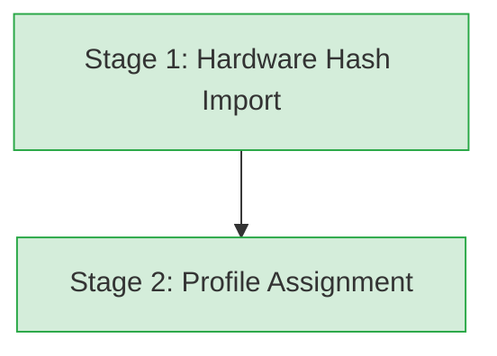
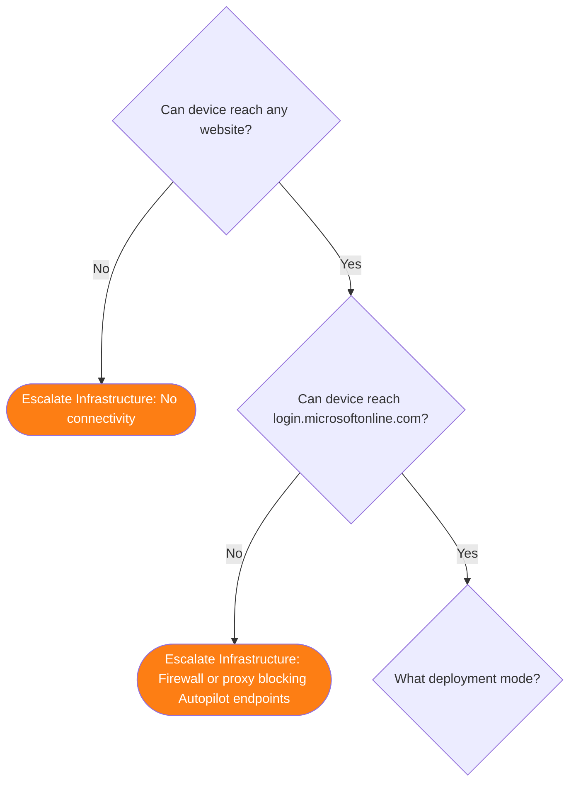
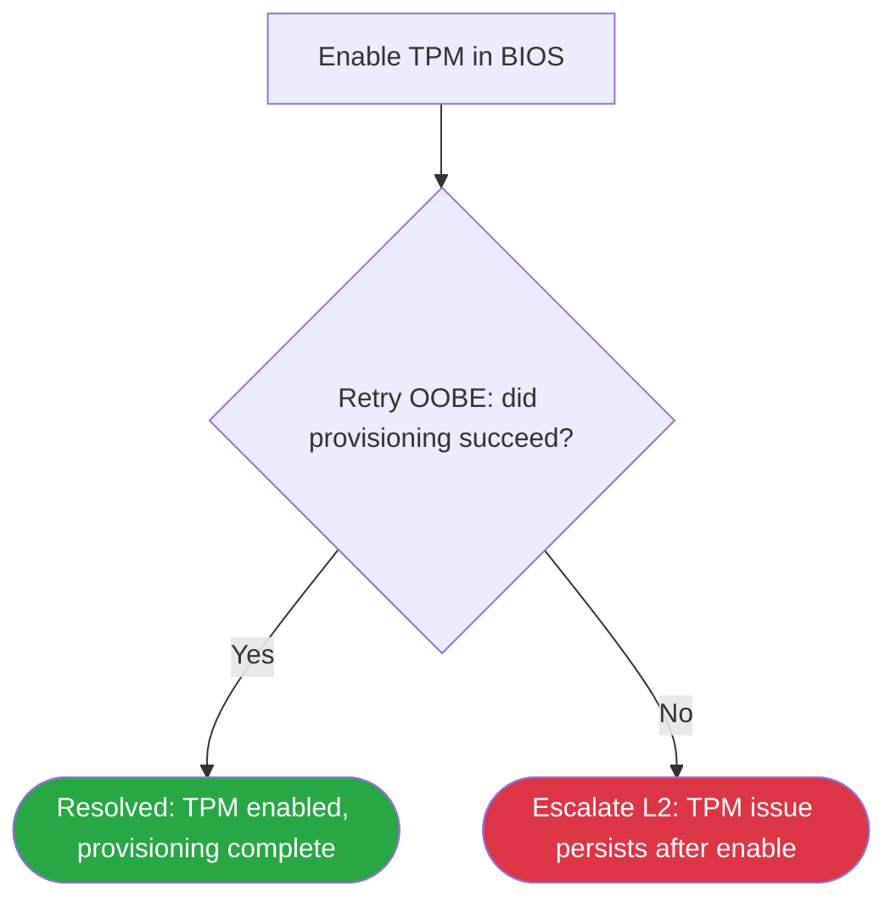

# Phase 4: L1 Decision Trees - Research

**Researched:** 2026-03-20
**Domain:** Mermaid flowchart authoring, L1 triage documentation structure, Windows Autopilot failure scenarios
**Confidence:** HIGH (domain fully defined in CONTEXT.md; research confirms Mermaid syntax and validates Autopilot diagnostic constraints)

---

<user_constraints>
## User Constraints (from CONTEXT.md)

### Locked Decisions

**Tree Structure & Relationships**
- Hub-and-spoke model: Initial triage tree (L1DT-01) is the single entry point, routing to 3 scenario trees (ESP, Profile, TPM)
- All trees use TD (top-down) Mermaid direction for consistent hierarchical flow
- Routing-level granularity: 5-10 decision nodes per tree — trees route to outcomes, runbooks instruct on how to fix
- Each scenario tree has a validation gate at entry with a "Return to Triage" escape if agent is in the wrong tree
- Triage tree includes catch-all branches: network failure, device not in portal, OOBE crash/other — not just the 3 dedicated scenarios
- Deployment mode question (user-driven / pre-provisioning / self-deploying) appears after network gate as an early branch
- Single path for both new and re-enrolling devices — no split by device history
- No "quick wins" gate (reboot check) in triage — reboot guidance belongs in resolved terminal nodes where appropriate
- Mermaid `click` syntax links triage routing nodes to scenario tree files (degrades gracefully in non-interactive renderers)

**Network Reachability Gate**
- Two-step check: (1) "Can device reach any website?" (general internet), (2) "Can device reach login.microsoftonline.com?" (Autopilot-specific)
- General internet failure → Escalate Infrastructure (physical/proxy issue)
- Autopilot endpoints blocked → Escalate Infrastructure (firewall rule)
- Browser-based check: L1 opens browser on device, navigates to login.microsoftonline.com — no PowerShell

**Triage Routing (after network gate + mode selection)**
1. Network fails general gate → Escalate: No connectivity
2. Network fails Autopilot endpoint gate → Escalate: Firewall/proxy
3. Device not in Autopilot portal → Check hash status, then Escalate L2
4. ESP stuck or error → ESP tree (01-esp-failure.md)
5. No profile assigned → Profile tree (02-profile-assignment.md)
6. TPM/provisioning error → TPM tree (03-tpm-attestation.md)
7. OOBE crash/other → Basic checks, Escalate L2

**ESP Tree Specifics**
- Primary branch: "Does ESP show an error code?" — separates error-code-lookup path from stuck/timeout path
- Stuck path branches on device vs user phase, then duration thresholds
- Phase identification via screen content: "Setting up your device..." = device phase, "Setting up for [username]..." = user phase, "Can't tell" = escalate with both noted

**Profile Assignment Tree Specifics**
- Assumes device IS in Autopilot portal (triage routes "not in portal" separately)
- Branches: profile assigned? → correct profile? → applied to device? / In correct group? → wait or add to group

**TPM Attestation Tree Specifics**
- Covers both pre-provisioning AND self-deploying TPM failures (same L1 triage path)
- Includes basic BIOS checks L1 can perform: "Is TPM enabled in BIOS?", "Is TPM version 2.0?"
- TPM disabled in BIOS → Resolved: Enable TPM (most common L1-fixable TPM issue)
- TPM not 2.0 → Escalate: Hardware
- After BIOS checks, routes to error code lookup in TPM error table

**Retry Logic**
- Linear retry pattern — no loop arrows in Mermaid (avoids spaghetti diagrams)
- Retry nodes are sequential: action → "Resolved?" → Yes: Resolved / No: Escalate L2
- Every retry-resolved terminal has a fail path to escalation

**Terminal States**
- Three terminal categories enforced: Resolved (green), Escalate to L2 (red), Escalate to Infrastructure/Network (orange)
- Mermaid classDef color-coding: `resolved fill:#28a745,color:#fff`, `escalateL2 fill:#dc3545,color:#fff`, `escalateInfra fill:#fd7e14,color:#fff`
- Shape by type: diamonds for decisions, rectangles for actions/routing, rounded rectangles for terminal states
- Short keyword edge labels (1-3 words) — detail in nodes, not edges

**Resolved Terminals**
- Include brief action phrase (under 8 words): "Resolved: Enable TPM in BIOS", "Resolved: Reboot, retry OOBE"
- Forward-link to Phase 5 L1 Runbooks with "(available after Phase 5)" annotation in Resolution & Next Steps table

**Escalation Terminals**
- Keyed escalation data table below each diagram (not in-node text — keeps diagrams clean)
- Table columns: ID | Scenario | Collect | See Also
- L2 escalation collects: device serial, error code, deployment mode, timestamp + scenario-specific items
- Infrastructure escalation collects: device IP/subnet, proxy configured, which endpoint failed, browser error, Wi-Fi or ethernet
- Distinct checklists for L2 vs infrastructure teams
- Forward-link to Phase 6 L2 Runbooks with "(Phase 6)" annotation in See Also column
- No severity/urgency indicators — L2 triages based on scenario and data collected

**Error Code Integration**
- Error-code-lookup nodes link to the specific category file (not master index): ESP tree → 03-esp-enrollment.md, TPM tree → 02-tpm-attestation.md, Profile tree → 01-mdm-enrollment.md
- Triage "unknown error" branch links to master index (00-index.md) as fallback
- "Follow L1 Action column" as terminal — error table handles retry/escalation logic per error
- Error code not found in table → immediate Escalate L2 (no generic steps)

**Decision Node Content**
- Checks limited to portal + screen observable: Intune portal status, device screen text, browser test, BIOS settings
- No PowerShell, registry, or log references (L1 constraint)
- Binary yes/no phrasing for decision diamonds; multi-option "What...?" only for category selection (mode, symptom)
- Multi-option nodes include "Don't know" branch routing to safe default (collect data, escalate)
- User/symptom language in node text ("Is device stuck on loading screen?") not technical jargon ("Is ESP in device phase timeout?")
- Companion "How to Check" table below diagram keyed by node ID — provides "where to look" guidance
- Companion "Resolution & Next Steps" table keyed by resolved node ID — provides runbook forward-links

**Node ID Convention**
- 2-letter tree prefix + type letter + number
- Tree prefixes: TR=Triage, ES=ESP, PR=Profile, TP=TPM
- Type letters: D=Decision, A=Action, R=Resolved, E=Escalate
- Example: TRD1, ESE2, TPR1 — unique across all files, referenceable in tickets

**File Organization**
- 4 files in `docs/decision-trees/`:
  - `00-initial-triage.md` — Hub document with legend, "How to Use" section, scenario tree links (L1DT-01)
  - `01-esp-failure.md` — ESP failure triage (L1DT-02)
  - `02-profile-assignment.md` — Profile assignment failure triage (L1DT-03)
  - `03-tpm-attestation.md` — TPM attestation failure triage for pre-prov and self-deploying (L1DT-04)

**File Structure (per tree file)**
Custom structure — not based on L1 or L2 templates:
1. YAML frontmatter (`last_verified`, `review_by`, `applies_to: APv1`, `audience: L1`)
2. Version gate banner
3. Title + brief intro (2-3 sentences)
4. Decision Tree (Mermaid diagram)
5. How to Check table (keyed to decision nodes)
6. Escalation Data table (keyed to escalation terminals)
7. Resolution & Next Steps table (keyed to resolved terminals)
8. Navigation
9. Version History

**Triage Hub Document (00-initial-triage.md)**
Additional sections before the diagram:
- "How to Use These Trees" (2-3 sentences: start here, follow branches)
- Legend table (shape meanings + color meanings)
- Scenario Trees list with links to all 3 scenario files
- APv2 note: "These trees cover Autopilot (classic). For Device Preparation, see apv1-vs-apv2.md."

**Navigation Pattern**
- Hub-based: every scenario tree links back to 00-initial-triage.md
- No prev/next between scenario trees (they're not sequential)
- Triage links out to all scenario trees

**Conventions (Consistent with Phase 1/2/3)**
- YAML frontmatter: `last_verified`, `review_by`, `applies_to: APv1`, `audience: L1`
- Version gate banner as first content after frontmatter
- First-mention glossary linking in companion text (not in Mermaid diagram nodes)
- Forward-links with "(available after Phase X)" annotation
- Version History table at bottom
- No screenshots — text descriptions only
- Direct second-person voice

**APv2 Handling**
- Minimal: one APv2 note in triage file only — "These trees cover Autopilot (classic)"
- Link to apv1-vs-apv2.md
- No APv2 notes in scenario tree files (triage already gates this)

### Claude's Discretion
- Exact Mermaid diagram layout, edge routing, and subgraph usage
- Specific decision node questions beyond the ones discussed (e.g., exact profile assignment checks)
- Number of decision nodes per tree within the 5-10 routing-level guideline
- Exact wording of "How to Use These Trees" and intro paragraphs
- How to Check table content for nodes not specifically discussed
- Escalation data specifics beyond the base pattern established
- classDef exact hex values (the ones provided are starting points)
- Whether to use Mermaid subgraphs for visual grouping within trees

### Deferred Ideas (OUT OF SCOPE)
None — discussion stayed within phase scope
</user_constraints>

---

<phase_requirements>
## Phase Requirements

| ID | Description | Research Support |
|----|-------------|------------------|
| L1DT-01 | Initial triage decision tree (Mermaid) with network reachability gate | Hub structure fully specified in CONTEXT.md; Mermaid TD syntax confirmed from Phase 2 precedent; two-step network gate logic defined |
| L1DT-02 | ESP failure decision tree with device vs user phase branching | Phase identification via screen text established; error code path vs stuck path branching defined; links to 03-esp-enrollment.md confirmed |
| L1DT-03 | Profile assignment failure decision tree | Assumes device in portal; branch logic specified; links to 01-mdm-enrollment.md confirmed |
| L1DT-04 | TPM attestation failure decision tree for pre-provisioning | BIOS check sequence defined; covers PP and SD modes; links to 02-tpm-attestation.md confirmed |
</phase_requirements>

---

## Summary

Phase 4 creates four Markdown files containing Mermaid flowcharts that route L1 Service Desk agents through structured triage for Windows Autopilot failures. All design decisions are locked in CONTEXT.md — this research phase confirms Mermaid syntax, validates that Phase 3 error code files exist and are linkable as specified, and documents the exact patterns and constraints the planner must carry into task authoring.

The work is entirely documentation authoring: no code, no tests, no package installs. The deliverable is four `.md` files in `docs/decision-trees/`. Every decision about structure, node content, terminal states, and file organization has already been settled. The planner's job is to sequence the authoring tasks in dependency order (hub last, or hub first as a skeleton then filled in) and ensure each task outputs exactly the file structure defined.

**Primary recommendation:** Author the three scenario trees first (ESP, Profile, TPM), then author the triage hub last — this ensures all link targets exist before the hub references them, and forces the author to confirm node IDs are consistent.

---

## Standard Stack

### Core

| Tool | Version | Purpose | Why Standard |
|------|---------|---------|--------------|
| Mermaid | Current (GitHub-native) | Flowchart source rendered in GitHub Markdown | Locked decision; GitHub renders Mermaid natively in `.md` files without plugins |
| GitHub Markdown | — | Rendering environment | All existing docs target GitHub rendering; confirmed by Phase 2 lifecycle docs |

### Supporting

| Tool | Version | Purpose | When to Use |
|------|---------|---------|-------------|
| YAML frontmatter | — | File metadata (last_verified, review_by, applies_to, audience) | Every decision tree file, per Phase 1 template convention |

### No Installation Required

This phase produces Markdown + Mermaid source files only. No packages to install. No build step. No runtime environment.

---

## Architecture Patterns

### Recommended Project Structure

```
docs/
├── decision-trees/          # New subdirectory — 4 files created in this phase
│   ├── 00-initial-triage.md # Hub: triage entry point (L1DT-01)
│   ├── 01-esp-failure.md    # ESP failure tree (L1DT-02)
│   ├── 02-profile-assignment.md  # Profile assignment tree (L1DT-03)
│   └── 03-tpm-attestation.md    # TPM attestation tree (L1DT-04)
├── lifecycle/               # Existing — Phase 2 deliverables
├── error-codes/             # Existing — Phase 3 deliverables (link targets)
└── reference/               # Existing — Phase 1 deliverables
```

### Pattern 1: Mermaid Decision Tree with classDef Color-Coding

**What:** TD-direction flowchart using diamond shapes for decisions, rectangle shapes for actions, rounded rectangles (`([...])`) for terminal states, with classDef for color-coding by terminal type.

**When to use:** All four decision tree files in this phase.

**Example (from Phase 2 `docs/lifecycle/00-overview.md` — established pattern):**
```
graph TD
    S1[Stage 1] --> S2[Stage 2]

    classDef stage fill:#d4edda,stroke:#28a745
    classDef failure fill:#f8d7da,stroke:#dc3545
    class S1,S2 stage
```

**Adapted for decision trees (Phase 4 pattern):**
```
graph TD
    TRD1{Can device reach any website?}
    TRD1 -->|No| TRE1([Escalate: No connectivity])
    TRD1 -->|Yes| TRD2{Can device reach login.microsoftonline.com?}
    TRD2 -->|No| TRE2([Escalate: Firewall or proxy])
    TRD2 -->|Yes| TRD3{What deployment mode?}

    classDef resolved fill:#28a745,color:#fff
    classDef escalateL2 fill:#dc3545,color:#fff
    classDef escalateInfra fill:#fd7e14,color:#fff
    class TPR1,TPR2 resolved
    class TRE3,TRE4 escalateL2
    class TRE1,TRE2 escalateInfra
```

**Shape reference (confirmed Mermaid syntax):**
- `{text}` — diamond (decision)
- `[text]` — rectangle (action/routing)
- `([text])` — stadium/rounded rectangle (terminal state)
- `click NodeId "url"` — hyperlink (degrades gracefully if renderer doesn't support)

### Pattern 2: Node ID System

**What:** Every node in every diagram has a unique ID following the prefix-type-number convention.

**When to use:** All nodes in all four trees.

**Prefix map:**
| Tree | Prefix | File |
|------|--------|------|
| Initial Triage | TR | 00-initial-triage.md |
| ESP Failure | ES | 01-esp-failure.md |
| Profile Assignment | PR | 02-profile-assignment.md |
| TPM Attestation | TP | 03-tpm-attestation.md |

**Type letter map:**
| Letter | Meaning |
|--------|---------|
| D | Decision (diamond) |
| A | Action (rectangle) |
| R | Resolved terminal |
| E | Escalate terminal |

**Examples:** TRD1, TRD2, TRA1, TRE1, TRR1, ESD1, ESE1, ESR1, PRD1, TPD1

### Pattern 3: Companion Tables Below Diagram

**What:** Three keyed reference tables appear below every diagram, keyed to node IDs.

**When to use:** Every decision tree file.

**Table 1 — How to Check (decision nodes):**
```markdown
## How to Check

| Node | Check | Where to Look |
|------|-------|---------------|
| TRD1 | Can device reach any website? | Open browser on device; navigate to any public site |
| TRD2 | Can device reach login.microsoftonline.com? | Open browser; navigate to https://login.microsoftonline.com |
```

**Table 2 — Escalation Data (escalation terminals):**
```markdown
## Escalation Data

| ID | Scenario | Collect | See Also |
|----|----------|---------|----------|
| TRE1 | No connectivity | Device IP/subnet, proxy configured, Wi-Fi or ethernet | [Phase 5 L1 Runbooks](../l1-runbooks/) (available after Phase 5) |
| TRE3 | Device not in portal | Device serial, hash import method, timestamp | [Phase 6 L2 Runbooks](../l2-runbooks/) (available after Phase 6) |
```

**Table 3 — Resolution & Next Steps (resolved terminals):**
```markdown
## Resolution & Next Steps

| ID | Resolution | Next Steps |
|----|-----------|------------|
| TRR1 | Profile now assigned | Retry OOBE; see [L1 Profile Runbook](../l1-runbooks/) (available after Phase 5) |
```

### Pattern 4: File-Level Structure

**What:** Every decision tree file follows the same 9-section order. The triage hub has 3 additional sections before the diagram.

**Standard scenario tree order:**
1. YAML frontmatter
2. Version gate banner
3. Title + intro (2-3 sentences)
4. Mermaid diagram
5. How to Check table
6. Escalation Data table
7. Resolution & Next Steps table
8. Navigation (link back to `00-initial-triage.md`)
9. Version History table

**Triage hub additions (inserted before diagram, after intro):**
- "How to Use These Trees" paragraph
- Legend table (shape + color meaning)
- Scenario Trees links list
- APv2 note

### Pattern 5: Linear Retry Sequence

**What:** Retry actions are represented as sequential nodes, not loop arrows. This avoids spaghetti diagrams that are unreadable in GitHub Markdown.

**When to use:** Any point in a tree where the agent takes an action and checks if it worked.

**Structure:**
```
TPA1[Action: Enable TPM in BIOS] --> TPD5{Retry OOBE — did it succeed?}
TPD5 -->|Yes| TPR1([Resolved: TPM enabled, provisioning complete])
TPD5 -->|No| TPE3([Escalate L2: TPM issue persists after enable])
```

### Anti-Patterns to Avoid

- **Loop arrows in Mermaid:** Using `-->` back to an earlier node creates visual spaghetti; use linear retry sequence instead.
- **Diagnostic detail in node text:** Node text must be L1-observable (screen content, portal UI); technical details belong in How to Check companion table.
- **PowerShell or registry references inside decision tree files:** Violates L1 constraint; these belong in L2 runbooks (Phase 6).
- **In-node escalation checklists:** Escalation data belongs in the Escalation Data table below the diagram, not crammed into terminal node text.
- **Prev/next navigation between scenario trees:** Scenario trees are parallel, not sequential; only link back to triage hub.
- **Duplicate node IDs across files:** Node IDs must be globally unique so agents can reference them in ticket notes (e.g., "reached node ESE2").

---

## Don't Hand-Roll

| Problem | Don't Build | Use Instead | Why |
|---------|-------------|-------------|-----|
| Color-coded terminal states | Custom HTML or CSS | Mermaid `classDef` + `class` directives | GitHub renders classDef natively; HTML in Mermaid breaks rendering |
| Cross-file navigation | Custom nav structure | Hub-and-spoke links with back-to-triage pattern | Established by Phase 2 lifecycle hub; consistent user experience |
| Error code decision logic | Inline error tables in diagrams | Link to Phase 3 category files | Error tables already exist and are maintained separately; duplication causes drift |

**Key insight:** The Phase 3 error code tables already contain the per-code L1 Action logic. The decision trees only need to route agents to the correct table file — the tables handle retry/escalate logic at the per-error level. Do not replicate error code logic inside the flowcharts.

---

## Existing Assets — Integration Points

These Phase 1, 2, and 3 files are link targets or pattern sources. Verify paths before authoring.

### Link Targets (confirmed to exist)

| Asset | Path | Used By |
|-------|------|---------|
| MDM enrollment errors | `docs/error-codes/01-mdm-enrollment.md` | Profile tree error lookup |
| TPM attestation errors | `docs/error-codes/02-tpm-attestation.md` | TPM tree error lookup |
| ESP enrollment errors | `docs/error-codes/03-esp-enrollment.md` | ESP tree error lookup |
| Error code master index | `docs/error-codes/00-index.md` | Triage "unknown error" fallback |
| Glossary | `docs/_glossary.md` | First-mention linking in companion text |
| APv1 vs APv2 | `docs/apv1-vs-apv2.md` | Triage APv2 note link target |
| L1 template | `docs/_templates/l1-template.md` | Frontmatter field reference only |
| Lifecycle overview (Mermaid pattern) | `docs/lifecycle/00-overview.md` | classDef + click syntax reference |

### Future Link Targets (forward-links with annotation)

| Asset | Future Path | Annotation to Use |
|-------|------------|-------------------|
| L1 Runbooks | `docs/l1-runbooks/` | "(available after Phase 5)" |
| L2 Runbooks | `docs/l2-runbooks/` | "(available after Phase 6)" |

### Relative Path Convention

Decision tree files live in `docs/decision-trees/`. Relative paths to sibling directories:
- `../error-codes/01-mdm-enrollment.md`
- `../error-codes/02-tpm-attestation.md`
- `../error-codes/03-esp-enrollment.md`
- `../error-codes/00-index.md`
- `../_glossary.md`
- `../apv1-vs-apv2.md`
- `00-initial-triage.md` (within same directory)

---

## Common Pitfalls

### Pitfall 1: Mermaid Rendering Breaks on Special Characters in Node Text

**What goes wrong:** Apostrophes, quotation marks, or angle brackets inside node label text cause Mermaid parse errors. The diagram renders as raw text or errors in GitHub.

**Why it happens:** Mermaid uses quotes and brackets as syntax delimiters; these characters inside labels need escaping or avoidance.

**How to avoid:** Use plain ASCII in node labels. Replace apostrophes with nothing or rephrase (e.g., "Can't tell" → "Unknown / cannot tell"). Use `#quot;` for literal quotes if unavoidable. Test by previewing in GitHub or mermaid.live before finalizing.

**Warning signs:** GitHub renders the fenced code block as raw text rather than a diagram; no visual output appears.

### Pitfall 2: classDef Applied Before Class Directive

**What goes wrong:** Nodes are colored with `classDef` but the `class NodeId className` directive appears before the `classDef` declaration — or is omitted entirely — resulting in uncolored terminals.

**Why it happens:** Author defines the color palette but forgets to assign nodes to classes.

**How to avoid:** Place all `classDef` lines at the end of the graph block, then place all `class` assignment lines after them. Do a final pass: for every terminal node (resolved, escalateL2, escalateInfra), confirm it appears in a `class` directive.

### Pitfall 3: Node IDs Reused Across Files

**What goes wrong:** Two files both define a node `D1` — this works visually but breaks the ticketing reference system (L1 says "reached D1" and it's ambiguous which tree).

**Why it happens:** Authors work file by file without a cross-file ID registry.

**How to avoid:** Use the full prefix from day one: TRD1 not D1. The prefix makes cross-file uniqueness automatic.

### Pitfall 4: click Syntax Breaks in Non-GitHub Renderers

**What goes wrong:** `click NodeId "relative-url"` causes parse errors in some Mermaid versions or offline renderers that don't support the click directive.

**Why it happens:** The click feature is renderer-dependent. GitHub supports it; local Mermaid CLI versions may not.

**How to avoid:** This is a locked decision (degrades gracefully). The trees function without click — it's an enhancement. Verify in GitHub preview after authoring. If a renderer breaks, the click lines can be removed without affecting diagram logic.

### Pitfall 5: Decision Node Count Exceeds 10

**What goes wrong:** A tree grows to 12-15 decision nodes trying to handle every sub-case inline. The diagram becomes unreadable.

**Why it happens:** Author attempts to handle what the error tables should handle, duplicating Phase 3 content.

**How to avoid:** When a branch reaches "look up error code in table" — stop there. The table handles the rest. The tree's job is routing to the table, not reproducing the table.

### Pitfall 6: L1-Unsafe Content in Decision Nodes

**What goes wrong:** A decision node says "Check HKLM:\SOFTWARE\Microsoft\..." or "Run Get-AutopilotDeviceStatus". L1 agents cannot perform these checks.

**Why it happens:** Author imports knowledge from L2 documentation.

**How to avoid:** Every decision node must pass the test: "Can an L1 agent at a device with only browser + Intune portal access perform this check?" If no, move it to the How to Check companion table with an L2 note, or remove it from the tree entirely.

---

## Code Examples

### Verified Mermaid Pattern — classDef and click (from docs/lifecycle/00-overview.md)



### Phase 4 Terminal Color Scheme (locked in CONTEXT.md)


### Network Gate Sequence (locked in CONTEXT.md)



### Linear Retry Pattern (locked in CONTEXT.md)



### YAML Frontmatter Pattern (from Phase 1/2/3 convention)

```yaml
---
last_verified: 2026-03-20
review_by: 2026-06-18
applies_to: APv1
audience: L1
---
```

### Version Gate Banner Pattern (from Phase 2 convention)

```markdown
> **Version gate:** This guide covers Windows Autopilot (classic). For Device Preparation (APv2), see [APv1 vs APv2 disambiguation](../apv1-vs-apv2.md).
```

### ESP Phase Identification Check (locked decision — screen-text-based)

The ESP tree branches on screen text, not registry values. The How to Check companion table entry for this node:

```markdown
| ESD2 | Is ESP in device phase or user phase? | Look at the screen message: "Setting up your device..." = device phase. "Setting up for [username]..." = user phase. If neither message is visible or the phase is unclear, choose "Cannot tell." |
```

---

## Validation Architecture

> workflow.nyquist_validation is not set in .planning/config.json — section included per default-enabled policy.

**Note:** Phase 4 produces only Markdown + Mermaid source files. There is no executable code, no test runner, and no automated test framework applicable to this phase. The "tests" for this phase are human verification checks against the success criteria.

### Phase Requirements vs. Verification Method

| Req ID | Behavior | Verification Type | How to Verify | Automated? |
|--------|----------|------------------|---------------|------------|
| L1DT-01 | Every tree opens with network reachability gate before scenario branches | Manual review | Inspect 00-initial-triage.md: first decision diamond after frontmatter/intro must be network check | Manual only |
| L1DT-02 | Three and only three terminal categories (Resolved, Escalate L2, Escalate Infra) | Manual review | Enumerate all terminal nodes across all 4 files; confirm each has exactly one of the 3 classDef classes | Manual only |
| L1DT-02 | ESP tree distinguishes device phase from user phase without registry access | Manual review | Inspect ESP tree branch for phase identification; confirm it uses screen text, not registry/PowerShell | Manual only |
| L1DT-03 | All flowcharts are Mermaid source and render in GitHub Markdown | Manual review | Push files to GitHub (or use GitHub preview); confirm each diagram renders as a flowchart | Manual / GitHub preview |

### Wave 0 Gaps

None — this phase requires no test infrastructure setup. Verification is done by human review of rendered Mermaid diagrams in GitHub.

---

## Open Questions

1. **How to Check table — profile tree nodes not fully specified in CONTEXT.md**
   - What we know: Profile tree branches on "profile assigned?", "correct profile?", "in correct group?"
   - What's unclear: Exact portal navigation path for each check (e.g., which Intune blade shows "profile assigned to device")
   - Recommendation: Use Claude's Discretion (explicitly authorized) — author should use knowledge of Intune admin center portal navigation; document in How to Check table as: "Intune admin center > Devices > Windows > Windows devices > [device name] > Overview — check Autopilot profile field"

2. **Duration thresholds for ESP stuck path**
   - What we know: CONTEXT.md states "branches on device vs user phase, then duration thresholds" — but exact thresholds are not specified
   - What's unclear: What duration constitutes "stuck" vs "still running" — 15 min? 30 min? 60 min?
   - Recommendation: Use Claude's Discretion — common industry guidance is 30 min for device phase, 60 min for user phase with heavy app sets; author should document these in the How to Check table with a note that threshold depends on the configured ESP timeout value

3. **Profile assignment tree — "correct profile" check**
   - What we know: Tree branches on whether the correct profile is assigned
   - What's unclear: How an L1 agent identifies what the "correct" profile should be without tenant-specific knowledge
   - Recommendation: Use Claude's Discretion — the check should be "Does the profile name match what IT configured for this device type?" with a "Don't know" branch that escalates; avoids tenant-specific configuration dependency

---

## Sources

### Primary (HIGH confidence)
- `docs/lifecycle/00-overview.md` — Confirmed Mermaid TD direction, classDef, click syntax patterns used in this project
- `docs/error-codes/01-mdm-enrollment.md` — Confirmed file exists, link target valid for Profile tree
- `docs/error-codes/02-tpm-attestation.md` — Confirmed file exists, link target valid for TPM tree; TPM error codes and L1 actions verified
- `docs/error-codes/03-esp-enrollment.md` — Confirmed file exists, link target valid for ESP tree; ESP error codes and L1 actions verified
- `docs/error-codes/00-index.md` — Confirmed file exists, link target valid for unknown error fallback
- `docs/_glossary.md` — Confirmed file exists; 26 terms available for first-mention linking
- `docs/apv1-vs-apv2.md` — Confirmed file exists; valid link target for APv2 note
- `docs/_templates/l1-template.md` — Confirmed frontmatter fields: last_verified, review_by, applies_to, audience
- `.planning/phases/04-l1-decision-trees/04-CONTEXT.md` — All design decisions locked; no alternatives to research

### Secondary (MEDIUM confidence)
- Phase 2 lifecycle docs pattern — classDef hex colors confirmed in source; click syntax confirmed as working in GitHub

### Tertiary (LOW confidence)
- ESP duration thresholds (30/60 min) — industry convention, not from official Microsoft documentation; flag for review in How to Check table

---

## Metadata

**Confidence breakdown:**
- Mermaid syntax patterns: HIGH — directly observed in Phase 2 source files in this repo
- File structure and sections: HIGH — locked in CONTEXT.md with no open decisions on structure
- Link target validity: HIGH — all Phase 3 files confirmed to exist at expected paths
- ESP/TPM diagnostic content: HIGH — Phase 3 error tables read; L1 actions and escalation patterns verified
- Duration thresholds: LOW — not specified in CONTEXT.md or Phase 3 files; using industry convention

**Research date:** 2026-03-20
**Valid until:** 2026-06-18 (90-day review cycle, matching Phase 3 frontmatter convention)
