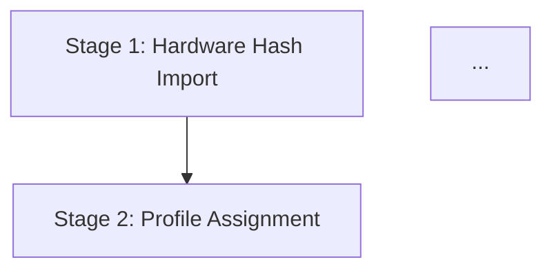
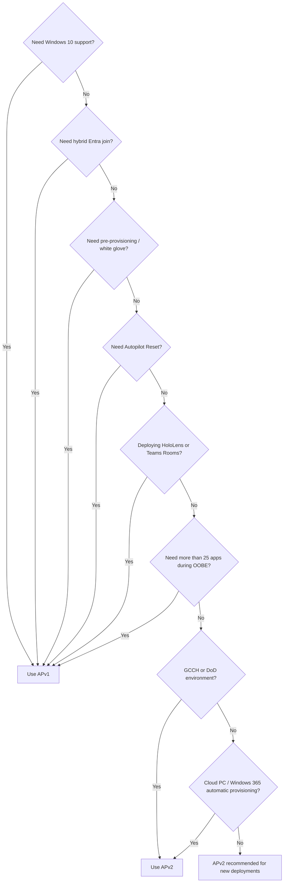

<objective>
Create the APv2 deployment flow document with two-level Mermaid diagrams, the automatic mode document with preview caveats, and extend the APv1 vs APv2 comparison page with a decision flowchart and migration guidance.

Purpose: Completes the APv2 lifecycle documentation set. The deployment flow gives admins the detailed 10-step process. The automatic mode document covers the Windows 365-only preview scenario. The comparison update helps admins make an informed framework selection decision.

Output: Two new files (`02-deployment-flow.md`, `03-automatic-mode.md`) and one updated file (`apv1-vs-apv2.md`)
</objective>

<execution_context>
@~/.claude/get-shit-done/workflows/execute-plan.md
@~/.claude/get-shit-done/templates/summary.md
</execution_context>

<context>
@.planning/PROJECT.md
@.planning/ROADMAP.md
@.planning/STATE.md
@.planning/phases/11-apv2-lifecycle-foundation/11-CONTEXT.md
@.planning/phases/11-apv2-lifecycle-foundation/11-RESEARCH.md

<interfaces>
<!-- Existing patterns and cross-link targets -->

From docs/lifecycle/00-overview.md (two-level Mermaid pattern):


Level 2 pattern uses:
```mermaid
    classDef stage fill:#d4edda,stroke:#28a745
    classDef failure fill:#f8d7da,stroke:#dc3545
    class S1,S2,S3,S4,S5 stage
    class F_HASH,F_PROFILE,F_OOBE,F_ESP,F_POST failure
```

From docs/apv1-vs-apv2.md (current structure — being EXTENDED not replaced):
- Frontmatter: last_verified, review_by, applies_to: both, audience: both
- Version gate blockquote
- Feature Comparison table (keep as-is)
- "Which Guide Do I Use?" section (keep as-is)
- "Important Notes" section (keep as-is)
- Source attribution footer (update date)
- NEW sections to ADD: Migration Guidance, Decision Flowchart
</interfaces>
</context>

<tasks>

<task type="auto">
  <name>Task 1: Create APv2 deployment flow document with two-level Mermaid diagrams</name>
  <files>docs/lifecycle-apv2/02-deployment-flow.md</files>
  <read_first>
    - docs/lifecycle/00-overview.md (pattern: two-level Mermaid diagram — Level 1 happy path with click links, Level 2 with classDef green/red coloring and dashed failure arrows)
    - .planning/phases/11-apv2-lifecycle-foundation/11-RESEARCH.md (section: "The 10-Step User-Driven Deployment Flow" for authoritative step content; section: "Mermaid — APv2 User-Driven Level 1 (Draft)" and "Level 2 (Draft)" for diagram drafts)
  </read_first>
  <action>
Create `docs/lifecycle-apv2/02-deployment-flow.md` with the following structure:

**Frontmatter:**
```yaml
---
last_verified: 2026-04-11
review_by: 2026-07-10
applies_to: APv2
audience: admin
---
```

**Version gate header** (per D-11):
```markdown
> **Version gate:** This guide covers Windows Autopilot Device Preparation (APv2).
> For Windows Autopilot (classic), see [Autopilot Lifecycle Overview](../lifecycle/00-overview.md).
> For framework selection, see [APv1 vs APv2](../apv1-vs-apv2.md).
```

**Title:** `# APv2 User-Driven Deployment Flow`

**Sections:**

1. **How to Use This Guide** — 2-3 sentences. This is the 10-step deployment process for APv2 user-driven mode. Each step is explained below with what happens, what can fail, and where to look when it does. For prerequisites, see `01-prerequisites.md`. For automatic mode (Windows 365), see `03-automatic-mode.md`.

2. **Level 1 — Happy Path** — Mermaid diagram showing the 10-step linear flow. Use the draft from RESEARCH.md as starting point but ensure ETG appears as a labeled mechanism callout between Step 2 (user authenticates) and Step 3 (Entra join + enrollment). Per D-05, ETG must be visually prominent — not hidden inside a step label. Use `graph TD` format with click links pointing to anchors within this file (e.g., `click S7 "#step-7-lob-and-microsoft-365-apps-install"`).

3. **Level 2 — Failure Points** — Second Mermaid diagram per D-04 pattern. Use `classDef stage fill:#d4edda,stroke:#28a745` and `classDef failure fill:#f8d7da,stroke:#dc3545`. Failure nodes connected with dashed arrows (`-.->`) to the step where they surface:
   - `F_REG[Enrollment fails / APv1 conflict]` -.-> Step 3
   - `F_IME[IME install fails]` -.-> Step 4
   - `F_APP1[LOB or M365 app install fails]` -.-> Step 7
   - `F_SCRIPT[PowerShell script fails]` -.-> Step 8
   - `F_APP2[Win32 or Store app install fails]` -.-> Step 9

4. **Step-by-Step Breakdown** — Each of the 10 steps gets a ### heading with:
   - **What happens:** 1-2 sentence description from RESEARCH.md content
   - **What can go wrong:** Brief failure description (forward reference to Phase 12 failure catalog when it exists)
   - **Key detail:** Any critical technical note

   The 10 steps (content from RESEARCH.md "The 10-Step User-Driven Deployment Flow"):
   - Step 1: Device boots with OEM-preinstalled Windows 11
   - Step 2: User connects to network and authenticates with Microsoft Entra credentials during OOBE
   - Step 3: Device joins Microsoft Entra ID and enrolls in Intune. At enrollment, device is added to the ETG security group (this is the ETG mechanism — explain that the Intune Provisioning Client AppID `f1346770-5b25-470b-88bd-d5744ab7952c` performs this)
   - Step 4: Intune Management Extension (IME) installs
   - Step 5: Standard user enforcement — if user was added to local Administrators group at join, they are removed if configured as standard user
   - Step 6: MDM sync — deployment syncs with Intune, syncs all MDM policies (policy application NOT tracked during deployment), checks for LOB and M365 apps selected in the Device Preparation policy
   - Step 7: LOB and Microsoft 365 apps install. **Failure here fails the deployment.**
   - Step 8: PowerShell scripts run. **Failure here fails the deployment.**
   - Step 9: Win32, Microsoft Store, and Enterprise App Catalog apps install. **Failure here fails the deployment.**
   - Step 10: "Required setup complete" page displays. User dismisses and signs in to desktop. A second sync delivers remaining configurations.

5. **Post-Deployment Sync** — Explain what happens after Step 10: apps/scripts assigned to the device group but NOT selected in the Device Preparation policy continue deploying in the background. Additional MDM policies and user-based configurations also apply.

6. **Note on Windows Quality Updates** — Brief note: Windows quality updates may install after the device preparation page completes, adding 20-40 minutes and a possible restart. Mark as "feature availability subject to change" and link to [What's New](https://learn.microsoft.com/en-us/autopilot/device-preparation/whats-new). (This addresses the open question from RESEARCH.md about monthly security update timing.)

7. **L2 detail collapsible block** (per D-12):
```html
<details>
<summary>L2 detail: MDM policy tracking vs app tracking</summary>

During APv2 deployment, MDM policies sync but their application is NOT individually tracked. Only app and script installations are tracked and can cause deployment failure. This is a key difference from APv1's ESP, which tracks both policy and app installation.

</details>
```

8. **See Also** (per D-11):
   - [APv2 Overview](00-overview.md)
   - [APv2 Prerequisites](01-prerequisites.md)
   - [APv2 Automatic Mode](03-automatic-mode.md)
   - [APv1 vs APv2 Comparison](../apv1-vs-apv2.md)
   - [APv1 Lifecycle Overview](../lifecycle/00-overview.md)

**Source attribution:** `*Deployment flow sourced from [Microsoft Learn — APv2 User-Driven Workflow](https://learn.microsoft.com/en-us/autopilot/device-preparation/tutorial/user-driven/entra-join-workflow), verified April 2026.*`
  </action>
  <verify>
    <automated>grep -c "graph TD" docs/lifecycle-apv2/02-deployment-flow.md && grep -c "classDef" docs/lifecycle-apv2/02-deployment-flow.md && grep -c "Enrollment Time Grouping" docs/lifecycle-apv2/02-deployment-flow.md && grep -c "Step 10" docs/lifecycle-apv2/02-deployment-flow.md</automated>
  </verify>
  <acceptance_criteria>
    - docs/lifecycle-apv2/02-deployment-flow.md exists
    - File contains frontmatter with `applies_to: APv2` and `audience: admin`
    - File contains version gate blockquote
    - File contains TWO Mermaid code blocks (Level 1 happy path, Level 2 failure points)
    - Level 1 Mermaid contains a node with "Enrollment Time Grouping" or "ETG" in the label (per D-05)
    - Level 2 Mermaid contains `classDef stage fill:#d4edda` and `classDef failure fill:#f8d7da`
    - Level 2 Mermaid contains at least 4 failure nodes with `-.->` dashed arrows
    - File contains headings for all 10 steps (grep for "Step 1" through "Step 10")
    - File contains "Failure here fails the deployment" for Steps 7, 8, and 9
    - File contains the Intune Provisioning Client AppID `f1346770-5b25-470b-88bd-d5744ab7952c` in Step 3
    - File contains `<details>` collapsible block
    - File contains `## See Also` section
  </acceptance_criteria>
  <done>Deployment flow document exists with two-level Mermaid diagrams (ETG prominent in Level 1, failure points in Level 2), all 10 steps documented with failure callouts, and cross-links in place</done>
</task>

<task type="auto">
  <name>Task 2: Create APv2 automatic mode document with preview caveats</name>
  <files>docs/lifecycle-apv2/03-automatic-mode.md</files>
  <read_first>
    - .planning/phases/11-apv2-lifecycle-foundation/11-RESEARCH.md (section: "Automatic Mode (Preview)" for authoritative content — 9-step process, supported SKUs, GCCH exception, 6-step admin workflow)
    - docs/apv1-vs-apv2.md (cross-link target for See Also)
  </read_first>
  <action>
Create `docs/lifecycle-apv2/03-automatic-mode.md` with the following structure:

**Frontmatter:**
```yaml
---
last_verified: 2026-04-11
review_by: 2026-07-10
applies_to: APv2
audience: admin
---
```

**Top banner blockquote** (per D-10 — FIRST thing after frontmatter, before version gate):
```markdown
> **Preview:** APv2 Automatic mode is in **public preview**. It applies ONLY to Windows 365 Cloud PCs.
> It does NOT apply to physical devices or standard APv2 user-driven deployments.
> Preview features may change before general availability.
```

**Version gate header** (per D-11):
```markdown
> **Version gate:** This guide covers Windows Autopilot Device Preparation (APv2) — Automatic mode.
> For APv2 user-driven mode, see [APv2 Deployment Flow](02-deployment-flow.md).
> For Windows Autopilot (classic), see [Autopilot Lifecycle Overview](../lifecycle/00-overview.md).
> For framework selection, see [APv1 vs APv2](../apv1-vs-apv2.md).
```

**Title:** `# APv2 Automatic Mode (Windows 365)`

**Sections:**

1. **Overview** — Explain that automatic mode is a distinct deployment mode (not a variant of user-driven). It is scoped exclusively to Windows 365 Cloud PC provisioning. The Cloud PC agent triggers enrollment — no user authentication during OOBE. Apps and scripts install before any user signs in.

   > **Preview:** This section describes preview functionality. [inline caveat per D-10]

2. **Supported Windows 365 SKUs** — Table:
   | SKU | Preview Since |
   |-----|---------------|
   | Windows 365 Frontline in shared mode | April 2, 2025 |
   | Windows 365 Enterprise | November 21, 2025 |
   | Windows 365 Frontline in dedicated mode | November 21, 2025 |
   | Windows 365 Cloud Apps | November 21, 2025 |

   Add note: **GCCH/DoD exception:** Windows 365 Frontline in shared mode is NOT supported in GCCH and DoD environments.

   > **Preview:** SKU availability and support matrix may change. Check [What's New](https://learn.microsoft.com/en-us/autopilot/device-preparation/whats-new) for updates.

3. **How Automatic Mode Differs from User-Driven** — Brief comparison:
   - No user authentication during OOBE (Cloud PC agent triggers enrollment)
   - Policy is included in the Windows 365 Cloud PC provisioning policy
   - Apps and scripts install before any user signs in
   - Console status: Provisioning -> Preparing (during APv2) -> Provisioned

4. **The 9-Step Automatic Deployment Process** — Numbered list from RESEARCH.md:
   1. Windows 365 Cloud PC agent creates the Cloud PC.
   2. Cloud PC agent joins Microsoft Entra.
   3. Cloud PC agent triggers Intune enrollment.
   4. Cloud PC agent calls the Device Preparation policy; configuration is applied.
   5. IME installs.
   6. MDM sync: LOB/M365 apps checked; policy synced (not tracked). Failure = "Failed" at phase "Policy installation".
   7. LOB/M365 apps install. Failure = "Failed" at phase "Apps installation".
   8. PowerShell scripts run. Failure = "Failed" at phase "Scripts installation".
   9. Win32, Microsoft Store, Enterprise App Catalog apps install. Failure = "Failed" at phase "Apps installation".

   For steps 6-9, include the failure status label in bold so admins know what to look for in the console.

5. **Current Limits** — Table:
   - Up to 25 essential apps (raised from 10, January 30, 2026)
   - Up to 10 essential PowerShell scripts

   > **Preview:** Limits may change before GA. The app limit was raised from 10 to 25 in January 2026.

6. **Admin Setup Workflow (6 Steps)** — High-level numbered list from RESEARCH.md. This is orientation only — the detailed setup walkthrough is in Phase 15 (APv2 Admin Setup).
   1. Set up Windows automatic Intune enrollment
   2. Create an assigned device group
   3. Assign applications and PowerShell scripts to device group
   4. Create Windows Autopilot Device Preparation policy (select "Automatic" mode)
   5. Create a Cloud PC provisioning policy
   6. Monitor the deployment

   Add note: "For detailed configuration steps, see the APv2 Admin Setup Guide (Phase 15)."

7. **See Also** (per D-11):
   - [APv2 Overview](00-overview.md)
   - [APv2 User-Driven Deployment Flow](02-deployment-flow.md)
   - [APv2 Prerequisites](01-prerequisites.md)
   - [APv1 vs APv2 Comparison](../apv1-vs-apv2.md)
   - [APv1 Lifecycle Overview](../lifecycle/00-overview.md)

**Source attribution:** `*Content sourced from [Microsoft Learn — APv2 Automatic Mode Workflow](https://learn.microsoft.com/en-us/autopilot/device-preparation/tutorial/automatic/automatic-workflow), verified April 2026.*`
  </action>
  <verify>
    <automated>grep -c "public preview" docs/lifecycle-apv2/03-automatic-mode.md && grep -c "Preview" docs/lifecycle-apv2/03-automatic-mode.md && grep -c "Windows 365" docs/lifecycle-apv2/03-automatic-mode.md && grep -c "Cloud PC" docs/lifecycle-apv2/03-automatic-mode.md</automated>
  </verify>
  <acceptance_criteria>
    - docs/lifecycle-apv2/03-automatic-mode.md exists
    - File contains frontmatter with `applies_to: APv2` and `audience: admin`
    - File contains preview banner blockquote as the FIRST blockquote (before version gate) containing "public preview" and "Windows 365 Cloud PCs" and "does NOT apply to physical devices"
    - File contains version gate blockquote linking to 02-deployment-flow.md, ../lifecycle/00-overview.md, ../apv1-vs-apv2.md
    - File contains at least 3 inline `> **Preview:**` callouts within sections (per D-10 double coverage)
    - File contains "GCCH" and "DoD" in a restriction note
    - File contains all 4 SKU rows: "Frontline in shared mode", "Enterprise", "Frontline in dedicated mode", "Cloud Apps"
    - File contains 9 numbered steps in the deployment process
    - File contains failure status labels: "Policy installation", "Apps installation", "Scripts installation"
    - File contains "25" as current app limit and "10" as original limit
    - File contains `## See Also` section
  </acceptance_criteria>
  <done>Automatic mode document exists with preview banner, inline preview caveats, all 4 supported SKUs, 9-step process, failure status labels, current limits, and cross-links</done>
</task>

<task type="auto">
  <name>Task 3: Extend APv1 vs APv2 comparison with decision flowchart and migration guidance</name>
  <files>docs/apv1-vs-apv2.md</files>
  <read_first>
    - docs/apv1-vs-apv2.md (MUST read current content — extending, not replacing per D-08)
    - .planning/phases/11-apv2-lifecycle-foundation/11-RESEARCH.md (section: "APv1 vs APv2 Comparison" for updated comparison data; section: "Mermaid — APv1 vs APv2 Decision Flowchart" for diagram draft; section: "Migration consideration" for high-level migration steps)
  </read_first>
  <action>
Extend `docs/apv1-vs-apv2.md` per D-08 and D-09. Keep ALL existing content intact (frontmatter, version gate, Feature Comparison table, "Which Guide Do I Use?" section, "Important Notes" section). Add two new sections and update metadata.

**Changes to frontmatter:**
- Update `last_verified: 2026-04-11`
- Update `review_by: 2026-07-10`
- Keep `applies_to: both` and `audience: both`

**Changes to version gate:** Update to reference APv2 lifecycle docs:
```markdown
> **Version gate:** This guide compares both Autopilot frameworks.
> For APv2 (Device Preparation), see [APv2 Lifecycle Overview](lifecycle-apv2/00-overview.md).
> For APv1 (classic), see [APv1 Lifecycle Overview](lifecycle/00-overview.md).
```

**Keep existing sections intact:**
- Feature Comparison table (keep all rows as-is)
- "Which Guide Do I Use?" section (keep as-is)
- "Important Notes" section (keep as-is)

**Add NEW section AFTER "Important Notes" and BEFORE the source attribution footer:**

### Decision Flowchart

Brief intro: "Use this flowchart to determine which Autopilot framework fits your deployment scenario."

Mermaid diagram from RESEARCH.md draft (the decision flowchart with Q1-Q8 decision nodes). Use `graph TD` format:


Note below the flowchart: "If none of the APv1-only requirements apply, APv2 is recommended for new deployments due to simpler administration and no hardware hash pre-staging requirement."

**Add SECOND new section after Decision Flowchart:**

### Migration Guidance (APv1 to APv2)

Per D-09: high-level numbered considerations and forward references only. Phase 11 orients admins; Phase 15 handles the actual configuration walkthrough.

Content:
1. **No in-place migration exists.** A device currently deployed via APv1 cannot be switched to APv2 without re-enrollment.
2. **Deregister from Autopilot first.** The device must be removed from the Autopilot devices list (Intune admin center > Devices > Windows > Windows enrollment > Devices > select > Delete). If not deregistered, the APv1 profile silently takes precedence.
3. **APv1 and APv2 can coexist in a tenant.** Different devices can use different frameworks. A gradual migration is possible: new devices use APv2 while existing devices remain on APv1.
4. **Plan the Enrollment Time Grouping (ETG) device group** before migrating any devices. The ETG group must be pre-configured with the Intune Provisioning Client as owner.
5. **Re-enroll devices through OOBE** after deregistration. The device will pick up the APv2 Device Preparation policy at next enrollment.

Add forward reference: "For step-by-step APv2 configuration, see the APv2 Admin Setup Guide (planned for Phase 15). For APv2 prerequisites, see [APv2 Prerequisites](lifecycle-apv2/01-prerequisites.md)."

**Update source attribution footer:**
```markdown
*Feature comparison sourced from [Microsoft Learn](https://learn.microsoft.com/en-us/autopilot/device-preparation/compare), verified April 2026. Decision flowchart derived from official comparison criteria.*
```
  </action>
  <verify>
    <automated>grep -c "Decision Flowchart" docs/apv1-vs-apv2.md && grep -c "Migration Guidance" docs/apv1-vs-apv2.md && grep -c "graph TD" docs/apv1-vs-apv2.md && grep -c "Feature Comparison" docs/apv1-vs-apv2.md</automated>
  </verify>
  <acceptance_criteria>
    - docs/apv1-vs-apv2.md exists and is not empty
    - File still contains the original Feature Comparison table (grep for "Hardware hash registration required")
    - File still contains "Which Guide Do I Use?" section
    - File still contains "Important Notes" section
    - File contains NEW `## Decision Flowchart` section (or `### Decision Flowchart`)
    - File contains a Mermaid code block with `graph TD` and decision nodes Q1 through Q8
    - Mermaid flowchart contains "APv2 recommended for new deployments" as a terminal node
    - File contains NEW `## Migration Guidance` section (or `### Migration Guidance`)
    - Migration section contains "No in-place migration exists"
    - Migration section contains "Deregister from Autopilot first"
    - Migration section contains "APv1 and APv2 can coexist in a tenant"
    - Migration section contains forward reference to Phase 15 or APv2 Admin Setup Guide
    - File contains link to `lifecycle-apv2/01-prerequisites.md`
    - Frontmatter `last_verified` updated to 2026-04-11
    - Version gate references both lifecycle-apv2/00-overview.md and lifecycle/00-overview.md
  </acceptance_criteria>
  <done>APv1 vs APv2 comparison page extended with decision flowchart (8-question Mermaid diagram) and high-level migration guidance (5 numbered considerations with Phase 15 forward reference), all existing content preserved</done>
</task>

</tasks>

<verification>
All Phase 11 deliverables complete:
1. `docs/lifecycle-apv2/00-overview.md` — APv2 model with ETG (Plan 01)
2. `docs/lifecycle-apv2/01-prerequisites.md` — Checklist with 7 items (Plan 01)
3. `docs/lifecycle-apv2/02-deployment-flow.md` — 10-step flow with two-level Mermaid (Plan 02)
4. `docs/lifecycle-apv2/03-automatic-mode.md` — Automatic mode with preview caveats (Plan 02)
5. `docs/apv1-vs-apv2.md` — Extended with decision flowchart + migration (Plan 02)
6. `docs/_templates/admin-template.md` — Admin template with what-breaks pattern (Plan 01)

Cross-link verification: every APv2 file has version gate header + See Also footer per D-11.
</verification>

<success_criteria>
- LIFE-01 fully addressed: 10-step deployment flow with two-level Mermaid diagram, ETG prominent
- LIFE-03 fully addressed: Decision flowchart + migration guidance added to comparison page
- LIFE-04 fully addressed: Automatic mode document with preview banner + inline caveats
- All files have version gate headers (D-11) and See Also footers (D-11)
- Existing apv1-vs-apv2.md content preserved (D-08)
- Migration guidance is high-level only (D-09)
- Preview caveats at both banner and section level (D-10)
</success_criteria>

<output>
After completion, create `.planning/phases/11-apv2-lifecycle-foundation/11-02-SUMMARY.md`
</output>
