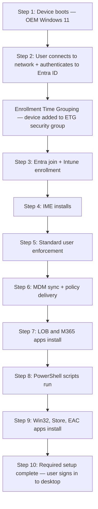
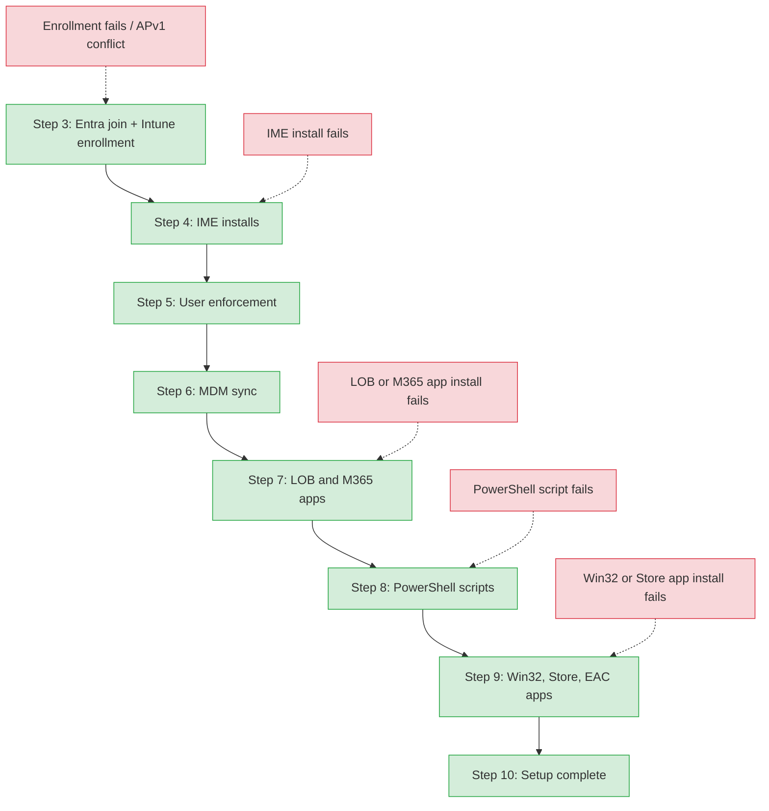
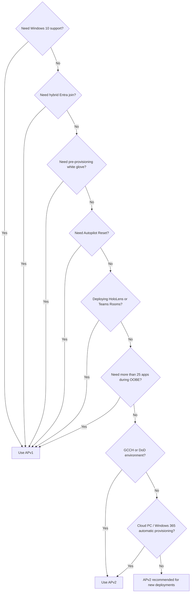

# Phase 11: APv2 Lifecycle Foundation - Research

**Researched:** 2026-04-11
**Domain:** Windows Autopilot Device Preparation (APv2) — lifecycle documentation
**Confidence:** HIGH (primary sources from Microsoft Learn, verified 2026-04-07 and 2026-04-10)

<user_constraints>
## User Constraints (from CONTEXT.md)

### Locked Decisions

- **D-01:** Create a separate `docs/lifecycle-apv2/` folder parallel to `docs/lifecycle/`. APv2 has a fundamentally different flow (no hardware hash, no ESP, Enrollment Time Grouping instead of pre-staging) — mixing frameworks in one folder would require confusing version gates on every section.
- **D-02:** Four files in `docs/lifecycle-apv2/`: `00-overview.md` (APv2 model explanation), `01-prerequisites.md` (standalone checklist), `02-deployment-flow.md` (10-step process with Mermaid diagram), `03-automatic-mode.md` (Windows 365 automatic deployment with preview caveats).
- **D-03:** Create `docs/_templates/admin-template.md` in this phase. ROADMAP Phase 16 depends on "admin-template.md established in Phase 11". Follows v1.0 pattern where Phase 1 created L1/L2 templates before content phases.
- **D-04:** Use the two-level Mermaid diagram pattern established in Phase 2 — Level 1: linear 10-step happy path; Level 2: color-coded failure points at each step.
- **D-05:** Enrollment Time Grouping (ETG) must be shown as the central mechanism in the diagram, distinct from APv1's ESP flow. This directly fulfills Success Criterion #1.
- **D-06:** Actionable checklist format — each prerequisite as a checkbox item with: what to check, where to check it (Intune portal path or PowerShell command), and what happens if it's missing.
- **D-07:** APv1 deregistration requirement must be the FIRST prerequisite with a warning callout. Per STATE.md decision: "APv1 silently wins when both apply" — this is the #1 gotcha for APv2 setup.
- **D-08:** Extend existing `docs/apv1-vs-apv2.md` (do not replace). Keep the current feature comparison table. Add two new sections: (1) migration guidance with high-level steps and forward references to Phase 15 (APv2 Admin Setup), and (2) a Mermaid decision flowchart for "which framework should I use?"
- **D-09:** Migration guidance stays high-level — numbered considerations and forward references. Phase 11 orients admins; Phase 15 handles the actual configuration walkthrough.
- **D-10:** Top banner blockquote at the top of `03-automatic-mode.md` stating preview status and Windows 365 scope, PLUS per-section inline callouts on any specific behavior that's preview-only. Double coverage ensures readers who jump via anchor links still see warnings.
- **D-11:** Every APv2 lifecycle file gets a version gate blockquote header ("This guide covers APv2. For APv1, see [link]") AND a "See also" footer section linking to the APv1 equivalent and the comparison page. Pre-builds the bidirectional linking Phase 17 requires (NAVG-04).
- **D-12:** Primary audience is Intune admins (frontmatter `audience: admin`). L2-level technical details (registry paths, event log references) included in collapsible/expandable blocks. L1 agents don't choose which framework to deploy — this content is admin-facing.
- **D-13:** Microsoft Learn is the authoritative primary source for the 10-step deployment flow. Community sources (oofhours.com, Call4Cloud) supplement gaps only, with MEDIUM confidence attribution. Consistent with the sourcing approach already established for Phase 14 BootstrapperAgent event IDs.

### Claude's Discretion

- File naming within `docs/lifecycle-apv2/` (numbering convention, slug format)
- Exact Mermaid node labels and color scheme for failure points
- Admin template structure (section headings, placeholder content) — as long as it includes per-setting "what breaks" callout pattern for Phases 15-16
- Collapsible block syntax (HTML details/summary vs other approach)

### Deferred Ideas (OUT OF SCOPE)

None — discussion stayed within phase scope.
</user_constraints>

<phase_requirements>
## Phase Requirements

| ID | Description | Research Support |
|----|-------------|------------------|
| LIFE-01 | Admin can find a complete APv2 deployment flow overview (10-step process, how it differs from APv1) | 10-step flow documented from Microsoft Learn user-driven workflow page; ETG mechanism fully described |
| LIFE-02 | Admin can verify APv2 prerequisites (OS version, licensing, Intune config, networking) | Full prerequisites confirmed from requirements page: OS gate (22H2+KB5035942), licensing, auto-enrollment config, APv1 deregistration rule |
| LIFE-03 | Admin can use updated APv1 vs APv2 comparison with actionable guidance (when to use which, migration steps) | Comparison table verified and extended from compare page; decision matrix confirmed; migration path documented |
| LIFE-04 | Admin can find APv2 automatic mode documentation (Windows 365 deployment, preview status noted) | Automatic mode confirmed as public preview (Windows 365 only); 6-step process documented from Microsoft Learn |
</phase_requirements>

---

## Summary

Windows Autopilot Device Preparation (APv2) is generally available as of June 3, 2024 (user-driven mode). It replaces the hardware-hash pre-staging model with Enrollment Time Grouping (ETG), where a device is added to a pre-defined security group at the moment of user authentication during OOBE. This eliminates the need for hardware hash registration, the Enrollment Status Page (ESP), and OEM/partner pre-staging workflows.

The user-driven deployment flow is a 10-step process: device boots with OEM Windows, user authenticates, Entra join + Intune enrollment, IME installs, user admin state enforced, MDM policy sync, LOB/M365 app install, PowerShell scripts run, Win32/Store/EAC app install, "Required setup complete" shown, then desktop. Apps and scripts assigned to the ETG security group (but not selected in the Device Preparation policy) continue deploying post-OOBE. The key architectural difference from APv1: ETG group membership is assigned at enrollment time by the Intune Provisioning Client (AppID `f1346770-5b25-470b-88bd-d5744ab7952c`), making dynamic group membership delays irrelevant to OOBE completion.

Automatic mode (for Windows 365 Cloud PCs only) is in **public preview** as of April 2025 (Frontline shared mode) and November 2025 (Enterprise, Frontline dedicated, Cloud Apps). It is a distinct deployment mode — not a variant of user-driven — and is scoped exclusively to Cloud PC provisioning. The app limit was raised from 10 to 25 in January 2026.

**Primary recommendation:** This phase is documentation authoring, not software development. The deliverables are five markdown files. All APv2 technical content is well-documented on Microsoft Learn (verified April 7, 2026). No speculative technical claims are needed — write directly from official sources.

---

## APv2 Technical Facts (for content authoring)

### The 10-Step User-Driven Deployment Flow

Sourced from: https://learn.microsoft.com/en-us/autopilot/device-preparation/tutorial/user-driven/entra-join-workflow (updated 2026-02-05)

1. Device boots with OEM-preinstalled Windows 11.
2. User connects to network and authenticates with Microsoft Entra credentials during OOBE.
3. Device joins Microsoft Entra ID and enrolls in Intune. At enrollment, device is added to the ETG security group.
4. Intune Management Extension (IME) installs.
5. Standard user enforcement: if user was added to local Administrators group at join, they are removed if configured as standard user.
6. MDM sync: deployment syncs with Intune, syncs all MDM policies (policy application is not tracked during deployment), checks for LOB and M365 apps selected in the Device Preparation policy.
7. LOB and Microsoft 365 apps install. Failure here fails the deployment.
8. PowerShell scripts run. Failure here fails the deployment.
9. Win32, Microsoft Store, and Enterprise App Catalog apps install. Failure here fails the deployment.
10. "Required setup complete" page displays. User dismisses and is signed in to the desktop. A second sync delivers remaining configurations: apps/scripts assigned to the device group but not selected in the policy, additional MDM policy, user-based configurations.

**Max apps selectable in policy:** 25 (raised from 10, January 30, 2026)
**Max PowerShell scripts selectable in policy:** 10

### Enrollment Time Grouping (ETG) Mechanism

ETG is the core architectural difference from APv1. At enrollment time, the Intune Provisioning Client (service principal AppID: `f1346770-5b25-470b-88bd-d5744ab7952c`) must be the **owner** of the device security group. This enables membership assignment at enrollment time — bypassing dynamic group evaluation delays entirely. The Device Preparation policy specifies this device group; apps and scripts assigned to that group are deployed during OOBE.

ETG phases (from overview page):
- Phase 1: Admin pre-assigns apps/policies to the device security group.
- Phase 2: At enrollment, device is added to the group; selected apps/scripts install during OOBE.

### Prerequisites (Complete List)

Sourced from: https://learn.microsoft.com/en-us/autopilot/device-preparation/requirements (updated 2026-04-07)

**Software (OS):**
- Windows 11, version 24H2 or later (no KB required)
- Windows 11, version 23H2 with KB5035942 or later (April 2024 media includes this)
- Windows 11, version 22H2 with KB5035942 or later (April 2024 media includes this)
- Windows 10: NOT supported
- Editions: Pro, Pro Education, Pro for Workstations, Enterprise, Education, Enterprise LTSC

**Critical prerequisite (APv1 deregistration):**
- Device must NOT be registered as an Autopilot device. If registered, the APv1 profile takes precedence over the APv2 Device Preparation policy — silently. Deregister first via: Intune admin center > Devices > Windows > Windows enrollment > Devices > select device > Delete.

**Configuration:**
- Microsoft Entra automatic enrollment must be configured (MDM scope)
- First user to sign in must have Microsoft Entra join permissions

**Networking (minimum):**
- DNS resolution for internet names
- Port 80 (HTTP), 443 (HTTPS), 123 (UDP/NTP) open
- Key URLs: `login.live.com` (Autopilot deployment service), Microsoft Entra ID, Intune endpoints, `lgmsapeweu.blob.core.windows.net` (diagnostic upload), `time.windows.com` UDP 123, `*.msftconnecttest.com` (NCSI)
- Smart card / certificate-based auth NOT supported during OOBE
- Proxy settings must be configured on the proxy server; Intune policy-based proxy config not fully supported for privileged access deployments

**Licensing (one of):**
- Microsoft 365 Business Premium
- Microsoft 365 F1 or F3
- Microsoft 365 Academic A1, A3, or A5
- Microsoft 365 Enterprise E3 or E5
- Enterprise Mobility + Security E3 or E5
- Intune for Education
- Microsoft Entra ID P1/P2 + Microsoft Intune subscription

**RBAC (for APv2 administrator role — 5 permission categories):**
- Device configurations: Read, Delete, Assign, Create, Update
- Enrollment programs: Enrollment time device membership assignment
- Managed apps: Read
- Mobile apps: Read
- Organization: Read

### Automatic Mode (Preview)

Sourced from: https://learn.microsoft.com/en-us/autopilot/device-preparation/tutorial/automatic/automatic-workflow (updated 2026-02-23)

**Status:** Public preview

**Scope:** Windows 365 Cloud PCs only. Supported SKUs:
- Windows 365 Frontline in shared mode (preview from April 2, 2025)
- Windows 365 Enterprise (preview from November 21, 2025)
- Windows 365 Frontline in dedicated mode (preview from November 21, 2025)
- Windows 365 Cloud Apps (preview from November 21, 2025)

**NOT applicable to:** Physical devices, standard Autopilot user-driven deployments.

**GCCH/DoD exception:** Windows 365 Frontline in shared mode is NOT supported in GCCH and DoD.

**How it differs from user-driven:**
- No user authentication during OOBE; the Cloud PC agent triggers enrollment.
- Policy is included in the Windows 365 Cloud PC provisioning policy.
- Apps and scripts install before any user signs in.
- Status in console: Provisioning → Preparing (during APv2) → Provisioned.

**Automatic mode 9-step process:**
1. Windows 365 Cloud PC agent creates the Cloud PC.
2. Cloud PC agent joins Microsoft Entra.
3. Cloud PC agent triggers Intune enrollment.
4. Cloud PC agent calls the Device Preparation policy; configuration is applied.
5. IME installs.
6. MDM sync: LOB/M365 apps checked; policy synced (not tracked). Failure = "Failed" at phase "Policy installation".
7. LOB/M365 apps install. Failure = "Failed" at phase "Apps installation".
8. PowerShell scripts run. Failure = "Failed" at phase "Scripts installation".
9. Win32, Microsoft Store, Enterprise App Catalog apps install. Failure = "Failed" at phase "Apps installation".

**Limits (current, post-January 2026 update):**
- Up to 25 essential apps
- Up to 10 essential PowerShell scripts

**6-step admin workflow:**
1. Set up Windows automatic Intune enrollment
2. Create an assigned device group
3. Assign applications and PowerShell scripts to device group
4. Create Windows Autopilot device preparation policy (select "Automatic" mode)
5. Create a Cloud PC provisioning policy
6. Monitor the deployment

### APv1 vs APv2 Comparison (Current State from Microsoft Learn)

Sourced from: https://learn.microsoft.com/en-us/autopilot/device-preparation/compare (updated 2026-04-07)

**Key differences for the comparison update (D-08):**

| Factor | APv2 wins | APv1 wins |
|--------|-----------|-----------|
| No device pre-staging required | APv2 | |
| GCCH/DoD support | APv2 | |
| Win32 + LOB in same deployment | APv2 | |
| Near real-time monitoring | APv2 | |
| Automatic deployment (Cloud PC) | APv2 | |
| Pre-provisioning (white glove) | | APv1 |
| Self-deploying (kiosk/userless) | | APv1 |
| Hybrid Entra join | | APv1 |
| Windows 10 support | | APv1 |
| Autopilot Reset | | APv1 |
| HoloLens / Teams Meeting Room | | APv1 |
| DFCI management | | APv1 |
| Co-management with ConfigMgr | | APv1 |
| Desktop blocking until user config done | | APv1 |
| >25 apps during OOBE | | APv1 (up to 100) |
| Extensive OOBE customization | | APv1 |

**Concurrent use rule:** APv1 profile takes precedence over APv2 policy. A device can only run one. To switch a device from APv1 to APv2: deregister from Autopilot first.

**Migration consideration (high-level, per D-09):**
- Existing APv1 devices: deregister → configure ETG group → assign Device Preparation policy → enroll via APv2. Full walkthrough in Phase 15.
- No in-place migration exists; device must be re-enrolled.
- APv1 and APv2 can coexist in a tenant (different devices).

---

## Architecture Patterns

### Recommended File Structure (Confirmed)

Per D-01, D-02:

```
docs/
├── lifecycle/                    # APv1 (existing, unchanged)
│   ├── 00-overview.md
│   ├── 01-hardware-hash.md
│   ├── 02-profile-assignment.md
│   ├── 03-oobe.md
│   ├── 04-esp.md
│   └── 05-post-enrollment.md
├── lifecycle-apv2/               # APv2 (new this phase)
│   ├── 00-overview.md            # APv2 model, ETG concept, how it differs from APv1
│   ├── 01-prerequisites.md       # Checklist with portal paths + deregistration as #1
│   ├── 02-deployment-flow.md     # 10-step flow with two-level Mermaid diagrams
│   └── 03-automatic-mode.md      # Windows 365 automatic mode, preview caveats
├── apv1-vs-apv2.md               # Extended (not replaced): +migration section +decision flowchart
└── _templates/
    ├── l1-template.md            # Existing
    ├── l2-template.md            # Existing
    └── admin-template.md         # New this phase (required by Phase 16)
```

### Mermaid Diagram Pattern (Two-Level, per D-04, D-05)

The established pattern from `docs/lifecycle/00-overview.md` uses:
- Level 1: `graph TD` with sequential happy-path nodes using click links to detail files
- Level 2: same sequential nodes, with `-.->` dashed lines from failure category nodes, using `classDef` for green (stage) and red (failure) coloring

For the APv2 flow diagram in `02-deployment-flow.md`, ETG must appear as a labeled node or mechanism callout — not merely implied by the enrollment step. The diagram should show:
- Level 1: 10 steps sequentially from boot to desktop
- Level 2: failure points at each step (enrollment failure, IME failure, app install failure, script failure)

ETG distinction from APv1 ESP: in APv1, the Level 1 diagram shows an ESP node between OOBE and post-enrollment. In APv2, there is no ESP node — ETG is a mechanism inside the enrollment step, not a UI phase.

### Frontmatter Pattern (Established, D-11, D-12)

All five new/modified files use:
```yaml
---
last_verified: 2026-04-11
review_by: 2026-07-10
applies_to: APv2
audience: admin
---
```

`apv1-vs-apv2.md` keeps `applies_to: both` and `audience: both`.

### Version Gate Header (Per D-11)

Every APv2 lifecycle file opens with:
```markdown
> **Version gate:** This guide covers Windows Autopilot Device Preparation (APv2).
> For Windows Autopilot (classic), see [Autopilot Lifecycle Overview](../lifecycle/00-overview.md).
> For framework selection, see [APv1 vs APv2](../apv1-vs-apv2.md).
```

### See Also Footer (Per D-11)

Every APv2 lifecycle file ends with a "See also" section that links back to the APv1 equivalent and the comparison page. This pre-builds the NAVG-04 bidirectional linking requirement.

### Admin Template Structure (Per D-03, D-12)

The admin template is a new template type — distinct from L1 (no PowerShell, portal-only) and L2 (investigation-focused). The admin template pattern, inferred from Phase 16's requirements (per-setting "what breaks" callouts) and D-12:

```markdown
---
last_verified: YYYY-MM-DD
review_by: YYYY-MM-DD
applies_to: APv1 | APv2 | both
audience: admin
---

> **Version gate:** [framework statement]

# [Admin Task Title]

## Prerequisites

- [Admin access requirements]
- [What must be configured before starting]

## Steps

1. [Portal action — imperative voice, include full Intune portal path]
2. ...

   > **What breaks if misconfigured:** [Consequence of getting this wrong]

## Verification

- [How to confirm the configuration is correct]

## See Also

- [Related admin guides]
- [Relevant troubleshooting runbook]
```

The "what breaks if misconfigured" callout pattern is the critical element: every configurable setting gets a warning block showing the downstream failure it causes. This is what Phase 16 (ADMN-06) depends on.

### Collapsible Blocks (Per D-12 Discretion)

Use HTML `<details>/<summary>` syntax for L2-level technical details (registry paths, event log entries). This is standard GitHub Markdown and renders correctly in most doc systems:

```markdown
<details>
<summary>L2 detail: Event log location for APv2 enrollment</summary>

Event log: `Microsoft-Windows-DeviceManagement-Enterprise-Diagnostics-Provider/Admin`
...
</details>
```

---

## Don't Hand-Roll

| Problem | Don't Build | Use Instead | Why |
|---------|-------------|-------------|-----|
| APv2 technical accuracy | Paraphrase from memory | Copy/adapt from Microsoft Learn source text | Training data may be stale; verified page content is current as of 2026-04-07 |
| Decision flowchart logic | Custom decision logic | Use official Microsoft compare table factors | The compare page already defines the decision criteria clearly |
| Prerequisite verification commands | Invent PowerShell commands | Link to existing `../reference/powershell-ref.md` | Commands already exist in the project reference; don't duplicate inline |
| Network endpoint list | List all URLs inline | Link to existing `../reference/endpoints.md` | Endpoints reference already exists; APv2 adds only `lgmsapeweu.blob.core.windows.net` (diagnostics) to what's already documented |

---

## Common Pitfalls

### Pitfall 1: APv1 Silently Wins

**What goes wrong:** Admin configures APv2 Device Preparation policy. Device also happens to be registered as an Autopilot device. At OOBE, the APv1 profile activates instead of APv2 — no error, no warning. Admin assumes APv2 is broken.
**Why it happens:** APv1 profile takes precedence over APv2 policy by design. Microsoft Learn states this explicitly: "Windows Autopilot profiles take precedence over Windows Autopilot device preparation policies."
**How to avoid:** D-07 requires APv1 deregistration as the FIRST prerequisite with a warning callout in `01-prerequisites.md`.
**Warning signs:** ESP appears during deployment (APv1 indicator); device appears in Autopilot devices list in Intune.

### Pitfall 2: Automatic Mode Scope Confusion

**What goes wrong:** Admin reads about "automatic mode" and tries to apply it to physical devices or standard APv2 user-driven deployments. The option is not available or doesn't work as expected.
**Why it happens:** Automatic mode is Windows 365-only (Cloud PCs). It is not a variant of user-driven deployment for physical devices.
**How to avoid:** D-10 requires top banner blockquote in `03-automatic-mode.md` stating preview status AND Windows 365 scope. Per-section inline callouts for preview-only behaviors.
**Warning signs:** Admin cannot find the "Automatic" mode selector in a Device Preparation policy unless they have a Windows 365 provisioning policy context.

### Pitfall 3: App Limit Mismatch After January 2026

**What goes wrong:** Older documentation (or training data) states the app limit is 10. Admin hits what they think is a documented limit and stops at 10 apps.
**Why it happens:** The limit was 10 at GA (June 2024), raised to 25 on January 30, 2026.
**How to avoid:** Document the current limit as 25. Note the history in a "State of the Art" entry. Source: What's New page, January 30, 2026 entry.

### Pitfall 4: ETG Group Owner Requirement Missed

**What goes wrong:** Admin creates a device security group without adding the Intune Provisioning Client (AppID `f1346770-5b25-470b-88bd-d5744ab7952c`) as owner. ETG does not function; device does not get added to the group at enrollment.
**Why it happens:** This requirement is easy to miss — it's not a standard Intune group configuration. The AppID is not well-known.
**How to avoid:** `01-prerequisites.md` should include the ETG group requirement. `00-overview.md` should explain the Intune Provisioning Client's role. The Phase 15 setup guide (not this phase) covers the full configuration procedure.

### Pitfall 5: Windows 10 Assumption

**What goes wrong:** Admin tries to deploy APv2 to Windows 10 devices. No error during policy configuration; failure only at device enrollment.
**Why it happens:** APv2 requires Windows 11 minimum (22H2 + KB5035942). This is a hard OS gate.
**How to avoid:** OS version gate must be the first software prerequisite in `01-prerequisites.md` (after the APv1 deregistration warning, per D-07).

---

## Code Examples

### Mermaid — APv2 User-Driven Level 1 (Draft)



### Mermaid — APv2 User-Driven Level 2 (Draft)



### Mermaid — APv1 vs APv2 Decision Flowchart (for apv1-vs-apv2.md extension, per D-08)



### Prerequisite Checklist Pattern (for 01-prerequisites.md, per D-06, D-07)

```markdown
> **Warning:** If the device is registered as a Windows Autopilot device, the APv1 profile will take
> precedence over this APv2 policy — silently. Complete step 0 before any other prerequisite.

- [ ] **0. Deregister device from Windows Autopilot (APv1)**
  - **Where to check:** Intune admin center > Devices > Windows > Windows enrollment > Devices
  - **What to do:** Search by serial number. If found, select > Delete.
  - **What happens if skipped:** Device deploys via APv1 ESP instead of APv2 — no error shown.

- [ ] **1. OS version gate**
  - **Where to check:** Device spec sheet or `winver` command
  - **Minimum:** Windows 11 22H2 with KB5035942 (April 2024 media or later)
  - **What happens if missing:** Autopilot device preparation policy is ignored; device enrolls without APv2 configuration.
```

---

## State of the Art

| Old Behavior | Current Behavior | When Changed | Impact |
|--------------|------------------|--------------|--------|
| Max 10 apps in Device Preparation policy | Max 25 apps | January 30, 2026 | Documents written before this date state wrong limit |
| Automatic mode: Frontline shared only | Automatic mode: Enterprise, Frontline dedicated, Cloud Apps added | November 21, 2025 | Broader Cloud PC coverage in preview |
| No Enterprise App Catalog support | Enterprise App Catalog apps supported | June 26, 2025 | Wider app type selection in policy |
| No managed installer policy support | Managed installer policy applied during OOBE (before Win32/Store/EAC) | April 10, 2026 | Prevents app installation conflicts |
| Monthly security updates: delayed install | Monthly security updates install during OOBE post-device-prep page | September 2025 (delayed, no revised timeline as of April 2026) | Adds 20-40 min + possible restart to provisioning; timeline TBD |

**Deprecated/outdated:**
- App limit of 10: Replaced by 25 as of January 30, 2026. Any reference to "10 apps" in APv2 documentation needs the qualifier "as of GA; 25 as of January 2026."

---

## Open Questions

1. **Monthly security update installation during OOBE**
   - What we know: Feature was announced September 3, 2025, then delayed September 9, 2025. As of April 2026, no revised timeline on Microsoft Learn What's New page.
   - What's unclear: Whether this feature is now live or still delayed. The What's New page was last updated April 10, 2026 with no new entry on this topic.
   - Recommendation: Do not document the monthly security update behavior as active in Phase 11. Include a note in `02-deployment-flow.md` that Windows quality updates may install after the device prep page completes (increasing provisioning time), and mark as "feature availability subject to change — check [What's New](https://learn.microsoft.com/en-us/autopilot/device-preparation/whats-new)."

2. **APv2 pre-provisioning mode**
   - What we know: Out of scope per REQUIREMENTS.md: "APv2 pre-provisioning: Experimental/unconfirmed in official Microsoft Learn docs; defer until GA."
   - What's unclear: Whether this will be announced before Phase 11 authoring completes.
   - Recommendation: Do not document. If the comparison table asks "pre-provisioning?" for APv2, mark as "No" with a footnote that this may change — consistent with the official compare page.

---

## Validation Architecture

> `workflow.nyquist_validation` is not present in `.planning/config.json` (key absent — treated as enabled).

### Test Framework

This is a documentation phase. No automated code tests apply. Validation is content review.

| Property | Value |
|----------|-------|
| Framework | Manual content review + Mermaid syntax check |
| Config file | N/A |
| Quick run command | Open rendered Mermaid in GitHub or mermaid.live |
| Full suite command | Read through all 5 files checking cross-links resolve |

### Phase Requirements → Test Map

| Req ID | Behavior | Test Type | How to Verify | File Exists? |
|--------|----------|-----------|---------------|-------------|
| LIFE-01 | APv2 10-step flow is documented with ETG as central mechanism | Manual review | Read `02-deployment-flow.md` — ETG node present in Mermaid Level 1 diagram | Wave 0 (create) |
| LIFE-02 | Prerequisites checklist covers OS gate, licensing, auto-enrollment, APv1 deregistration | Manual review | Read `01-prerequisites.md` — all 4 categories present, deregistration is first | Wave 0 (create) |
| LIFE-03 | APv1 vs APv2 comparison has decision flowchart + migration section | Manual review | Read updated `apv1-vs-apv2.md` — flowchart present, migration section present | Exists (extend) |
| LIFE-04 | Automatic mode documented with preview status clearly stated | Manual review | Read `03-automatic-mode.md` — preview banner at top, inline caveats per section | Wave 0 (create) |

### Wave 0 Gaps

- [ ] `docs/lifecycle-apv2/00-overview.md` — covers LIFE-01 (APv2 model, ETG concept)
- [ ] `docs/lifecycle-apv2/01-prerequisites.md` — covers LIFE-02
- [ ] `docs/lifecycle-apv2/02-deployment-flow.md` — covers LIFE-01 (10-step flow + diagrams)
- [ ] `docs/lifecycle-apv2/03-automatic-mode.md` — covers LIFE-04
- [ ] `docs/_templates/admin-template.md` — required by Phase 16 (ADMN-06)
- [ ] Update `docs/apv1-vs-apv2.md` — covers LIFE-03 (add decision flowchart + migration section)

---

## Sources

### Primary (HIGH confidence)

- https://learn.microsoft.com/en-us/autopilot/device-preparation/overview — Overview, ETG mechanism, capabilities (updated 2026-04-07)
- https://learn.microsoft.com/en-us/autopilot/device-preparation/requirements — Full prerequisites: software, networking, licensing, configuration, RBAC (updated 2026-04-07)
- https://learn.microsoft.com/en-us/autopilot/device-preparation/tutorial/user-driven/entra-join-workflow — Complete 10-step user-driven deployment process (updated 2026-02-05)
- https://learn.microsoft.com/en-us/autopilot/device-preparation/compare — APv1 vs APv2 feature comparison table and decision criteria (updated 2026-04-07)
- https://learn.microsoft.com/en-us/autopilot/device-preparation/tutorial/automatic/automatic-workflow — Automatic mode overview, Windows 365 scope, preview status, 9-step process (updated 2026-02-23)
- https://learn.microsoft.com/en-us/autopilot/device-preparation/whats-new — Version history: app limit to 25 (Jan 2026), automatic mode preview expansions, managed installer support (updated 2026-04-10)

### Secondary (MEDIUM confidence)

- None required for Phase 11 — all content is covered by official Microsoft Learn documentation.

### Tertiary (LOW confidence)

- None used.

---

## Metadata

**Confidence breakdown:**
- Deployment flow (10 steps): HIGH — sourced directly from Microsoft Learn tutorial page, updated February 2026
- Prerequisites: HIGH — sourced directly from Microsoft Learn requirements page, updated April 2026
- ETG mechanism: HIGH — explicitly described in overview and compare pages
- Automatic mode status: HIGH — confirmed as public preview on official tutorial page, What's New page has dated entries
- App limits: HIGH — January 30, 2026 entry on What's New page is explicit and dated
- Monthly security update status: LOW — delayed as of September 9, 2025; no confirmed resolution date as of April 10, 2026

**Research date:** 2026-04-11
**Valid until:** 2026-07-11 (90-day cycle per established project convention; What's New RSS recommended for early alerts)
