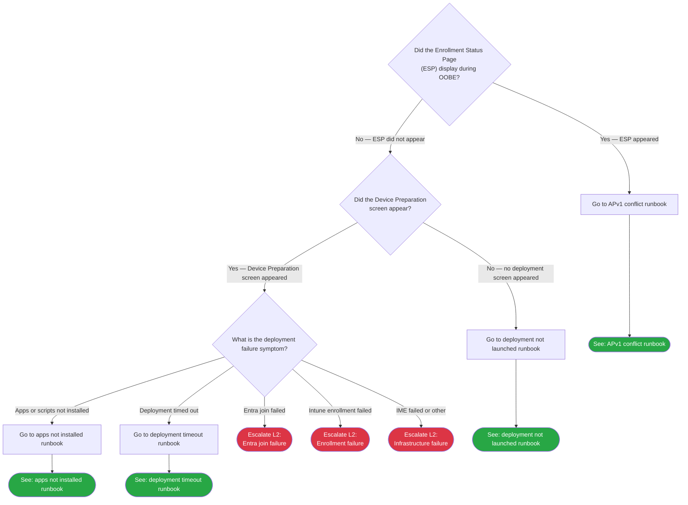

# Phase 13: APv2 L1 Decision Trees & Runbooks - Research

**Researched:** 2026-04-12
**Domain:** Technical documentation authoring — Mermaid decision trees, L1 runbook patterns, APv2 Intune portal actions
**Confidence:** HIGH

<user_constraints>
## User Constraints (from CONTEXT.md)

### Locked Decisions

**Decision Tree Structure**
- D-01: Single APv2 triage tree in `docs/decision-trees/04-apv2-triage.md` with a Mermaid diagram containing ~6-8 decision nodes.
- D-02: First gate: "Did ESP display?" — Yes routes to the APv1 registration conflict runbook. No continues APv2 triage.
- D-03: Second gate: "Did Device Preparation screen appear?" — No routes to "deployment never launched" runbook. Yes proceeds to symptom-based routing (Entra join/enrollment failures escalate to L2; app/script/timeout failures route to L1 runbooks).
- D-04: Include the same legend table as APv1 decision trees (Diamond = decision, Rectangle = action, Green = resolved, Red = escalate L2, Orange = escalate infra).

**Runbook Scope & Count**
- D-05: Deliver 3-4 L1 runbooks:
  1. `06-apv2-deployment-not-launched.md` — Deployment experience never launched
  2. `07-apv2-apps-not-installed.md` — Apps and scripts not installed
  3. `08-apv2-apv1-conflict.md` — APv1 registration conflict / ESP appeared
  4. `09-apv2-deployment-timeout.md` (optional) — Deployment timed out
- D-06: Entra join failed, enrollment failed, IME install failed → L2 escalation in decision tree only, no L1 runbooks.
- D-07: Each runbook: Prerequisites + numbered Steps + Escalation Criteria with collect list. Zero PowerShell, zero registry, portal-only actions.

**File Organization**
- D-08: Add APv2 files into existing `docs/decision-trees/` and `docs/l1-runbooks/` folders using next available numbers.
- D-09: Update `docs/decision-trees/00-initial-triage.md` to add a "See also" reference to the APv2 triage tree.
- D-10: Update `docs/l1-runbooks/00-index.md` to add an APv2 section below existing APv1 table; update frontmatter from `applies_to: APv1` to `applies_to: both`.

**APv1 Cross-Routing**
- D-11: "Did ESP display? → Yes" routes to `08-apv2-apv1-conflict.md` (dedicated verification runbook), not directly to APv1 docs.
- D-12: If no APv1 registration found but ESP appeared → escalate L2. This edge case L1 cannot resolve.

**Frontmatter & Cross-Linking**
- D-13: All new files: `applies_to: APv2`, `audience: L1`, `last_verified`, `review_by` (90-day cycle per Phase 11 pattern).
- D-14: Version gate blockquote on every file: "This guide covers Autopilot Device Preparation (APv2). For APv1 (classic), see [link]." Plus "See also" footer.
- D-15: Forward references in `docs/error-codes/06-apv2-device-preparation.md` that say "(Phase 13)" must be updated to real markdown links.

### Claude's Discretion
- Exact Mermaid node labels, IDs, and color scheme for the APv2 triage tree
- Exact wording of "Say to the user" scripts in runbooks
- Whether optional 4th runbook `09-apv2-deployment-timeout.md` is included (decide based on portal-only action depth)
- Ordering of steps within each runbook (portal-only constraint maintained)
- Whether to include a network reachability gate in the APv2 triage tree

### Deferred Ideas (OUT OF SCOPE)
None — discussion stayed within phase scope.

</user_constraints>

<phase_requirements>
## Phase Requirements

| ID | Description | Research Support |
|----|-------------|------------------|
| TROU-02 | L1 agent can follow APv2 decision tree to identify failure type and route to correct runbook | Decision tree file `04-apv2-triage.md` with first gate "Did ESP display?" and second gate "Did Device Preparation screen appear?"; 3-step routing to correct runbook established |
| TROU-03 | L1 agent can follow scripted APv2 runbooks (zero PowerShell, portal-only actions) | 3-4 runbook files in `docs/l1-runbooks/` using established Prerequisites + Steps + Escalation pattern; all steps verified as portal-only from Phase 12 failure catalog Quick Check sections |

</phase_requirements>

## Summary

Phase 13 is a documentation authoring phase. No new technical libraries, frameworks, or APIs are being introduced — the entire work is creating markdown files that follow established patterns from Phases 1-12. The research job is therefore: (1) audit the existing pattern corpus so the planner can specify exact format requirements, (2) inventory what Phase 12 produced that this phase must link to and update, and (3) establish the APv2-specific portal paths that will appear in runbook steps.

The existing pattern corpus is rich and consistent. The APv1 initial triage tree (`docs/decision-trees/00-initial-triage.md`), three scenario trees, and five L1 runbooks all use the same Mermaid `graph TD` format, legend table, "How to Check" navigation guide, Escalation Data table, and frontmatter. The Phase 12 failure catalog (`docs/error-codes/06-apv2-device-preparation.md`) provides the exact Quick Check portal paths for each scenario — these become the runbook step bodies verbatim, expanded into numbered instructions.

The optional fourth runbook (`09-apv2-deployment-timeout.md`) is justified. The Phase 12 catalog documents three distinct portal-only timeout root causes (policy timeout value, app count, Windows 365 known issue), and each has a specific portal navigation path L1 can check. There are enough portal-only actions to produce a meaningful standalone runbook rather than collapsing it to a single escalation node in the decision tree.

**Primary recommendation:** Author all five new files (1 decision tree + 3 mandatory runbooks + 1 timeout runbook) and three update tasks (00-initial-triage.md, l1-runbooks/00-index.md, 06-apv2-device-preparation.md forward references) using the exact patterns documented below.

## Standard Stack

This phase has no software dependencies. The "stack" is the documentation pattern corpus.

### Core Pattern Files (read before authoring)

| File | Purpose | What to Extract |
|------|---------|-----------------|
| `docs/decision-trees/00-initial-triage.md` | APv1 triage tree — master pattern | Mermaid node naming convention, legend table, How to Check table, Escalation Data table, classDef block |
| `docs/l1-runbooks/01-device-not-registered.md` | APv1 L1 runbook — master exemplar | Frontmatter, version gate blockquote, Prerequisites, Steps with "Say to the user" callouts, Escalation Criteria section |
| `docs/error-codes/06-apv2-device-preparation.md` | APv2 failure catalog — step content source | Quick Check portal paths become step bodies; Runbook forward references are the strings to replace |
| `docs/_templates/l1-template.md` | L1 template | Section structure and no-PowerShell constraint reminder |

### Established Mermaid Pattern

```
graph TD
    [NodeID]{"Question text"} --> |Yes| ...
    [NodeID]["Action text"] --> ...
    [NodeID](["Resolved: description"]) — green terminal
    [NodeID](["Escalate L2: description"]) — red terminal
    [NodeID](["Escalate Infra: description"]) — orange terminal

    classDef resolved fill:#28a745,color:#fff
    classDef escalateL2 fill:#dc3545,color:#fff
    classDef escalateInfra fill:#fd7e14,color:#fff

    class [id1],[id2] resolved
    class [id3],[id4] escalateL2
    class [id5] escalateInfra
```

Node ID convention from existing trees: prefix + number (TRD1, TRD2, TRA1, TRE1 for triage; ESD1, ESA1, ESE1 for ESP). Use APV2 prefix for the new tree (e.g., APD1, APD2, APA1, APE1).

**Confidence:** HIGH — verified directly from `00-initial-triage.md` and `01-esp-failure.md`.

## Architecture Patterns

### New Files to Create

```
docs/
├── decision-trees/
│   └── 04-apv2-triage.md              # NEW — APv2 triage decision tree
└── l1-runbooks/
    ├── 06-apv2-deployment-not-launched.md   # NEW — mandatory runbook 1
    ├── 07-apv2-apps-not-installed.md        # NEW — mandatory runbook 2
    ├── 08-apv2-apv1-conflict.md             # NEW — mandatory runbook 3
    └── 09-apv2-deployment-timeout.md        # NEW — optional runbook 4
```

### Files to Update

```
docs/
├── decision-trees/
│   └── 00-initial-triage.md           # UPDATE — add "See also" APv2 triage reference
├── l1-runbooks/
│   └── 00-index.md                    # UPDATE — add APv2 section, change applies_to: both
└── error-codes/
    └── 06-apv2-device-preparation.md  # UPDATE — replace "(Phase 13)" placeholders with real links
```

### APv2 Triage Tree Structure (D-01 through D-04)

The tree has these decision gates and routing outcomes:

```
Gate 1 (APD1): "Did ESP display?"
  Yes → APV1 conflict runbook (08-apv2-apv1-conflict.md)
  No  → Gate 2

Gate 2 (APD2): "Did Device Preparation screen appear?"
  No  → deployment not launched runbook (06-apv2-deployment-not-launched.md)
  Yes → Gate 3

Gate 3 (APD3): "What is the deployment failure symptom?"
  Apps/scripts not installed → 07-apv2-apps-not-installed.md
  Deployment timed out      → 09-apv2-deployment-timeout.md
  Entra join failed         → Escalate L2 (collect: deployment report, Entra join error)
  Enrollment failed         → Escalate L2 (collect: Intune device status, license info)
  IME failed / other infra  → Escalate L2 (collect: deployment report phases)
```

Approximate node count: 3 decision diamonds, 3-4 action rectangles, 2 resolved terminals, 3 escalate-L2 terminals = 11-12 nodes. Within the 6-8 node target if action rectangles are combined into terminal labels. The tree should stay flat — no sub-trees.

Network reachability gate (Claude's Discretion): The APv2 deployment flow requires network connectivity for Entra join, but by the time a user is reporting an APv2 issue, they already authenticated during OOBE (which required network access). A network gate at the top of this tree would fire only for infrastructure failures before OOBE progresses — these are already captured by the APv1 initial triage tree's orange escalation paths. **Recommendation: omit the network reachability gate.** The APv2 tree starts at the post-OOBE observation level. Document this choice in the How to Use section.

### Pattern 1: APv2 Triage Tree File Structure

```markdown
---
last_verified: YYYY-MM-DD
review_by: YYYY-MM-DD  (last_verified + 90 days)
applies_to: APv2
audience: L1
---

> **Version gate:** This guide covers Windows Autopilot Device Preparation (APv2).
> For Windows Autopilot (classic), see [Initial Triage Decision Tree](00-initial-triage.md).

# APv2 Device Preparation Triage

## How to Use This Tree
[brief orientation — starts after OOBE network auth, covers portal-observable symptoms]

## Legend
[same legend table as 00-initial-triage.md — copy verbatim]

## Decision Tree


## How to Check
[table: Node | Check | Where to Look]

## Escalation Data
[table: ID | Scenario | Collect | See Also]

## See Also
- [Initial Triage Decision Tree](00-initial-triage.md)
- [APv2 Deployment Flow](../lifecycle-apv2/02-deployment-flow.md)
- [APv1 vs APv2](../apv1-vs-apv2.md)
- [L1 Runbooks](../l1-runbooks/00-index.md)
```

### Pattern 2: APv2 L1 Runbook File Structure

Follows `01-device-not-registered.md` exemplar exactly:

```markdown
---
last_verified: YYYY-MM-DD
review_by: YYYY-MM-DD
applies_to: APv2
audience: L1
---

> **Version gate:** This guide covers Autopilot Device Preparation (APv2).
> For Windows Autopilot (classic), see [link to equivalent APv1 runbook or initial triage].

# [Issue Title]

[1-sentence description of when to use this runbook]

## Prerequisites
- Access to Intune admin center (https://intune.microsoft.com) with at minimum read permissions
- [Device serial number if needed]
- [What the user must have confirmed before this runbook applies]

## Steps
1. [Portal navigation action]
2. [Check / observe / verify]
3. > **Say to the user:** "[script]"
4. [Next portal action]
...

## Escalation Criteria

Escalate to L2 if:
- [Condition]
- [Condition]

**Before escalating, collect:**
- [Data item]
- [Data item]

**L2 escalation path:** [link to L2 runbooks index or specific L2 runbook in Phase 14]

---

[Back to APv2 Triage Tree](../decision-trees/04-apv2-triage.md)

## Version History
| Date | Change | Author |
|------|--------|--------|
| YYYY-MM-DD | Initial version | — |
```

### Anti-Patterns to Avoid

- **Inline portal navigation in Prerequisites:** Prerequisites list what the agent needs (access, serial number, prior confirmation); portal navigation belongs in Steps.
- **Combining multiple checks in one step:** Each step = one action. "Navigate to X, click Y, verify Z" should be three steps.
- **Referencing log files or event viewer in L1 runbooks:** The template explicitly forbids this. All runbook steps must be achievable from the Intune admin center or Entra admin center browser UI.
- **Linking to L2 runbooks from within Steps:** L2 links belong only in Escalation Criteria. Steps assume L1 can execute independently.
- **Copying Phase 12 Quick Check wording verbatim as a single step:** Quick Check text is comma-delimited summary navigation. Expand each portal path into a discrete numbered step.

## Don't Hand-Roll

| Problem | Don't Build | Use Instead |
|---------|-------------|-------------|
| Step content for runbooks | Writing portal paths from memory | Phase 12 failure catalog Quick Check sections — exact portal navigation paths already verified |
| Decision tree routing logic | Designing from scratch | Phase 13 CONTEXT.md D-02 and D-03 — routing decisions are locked |
| Mermaid diagram syntax | Experimenting with node shapes | Copy node patterns from `docs/decision-trees/00-initial-triage.md` lines 38-80 |
| Frontmatter fields | Guessing field names | Copy from any Phase 11/12 file — `last_verified`, `review_by`, `applies_to`, `audience` are canonical |
| "See also" / Version gate text | Writing from scratch | Copy from Phase 12 output `06-apv2-device-preparation.md` lines 1-12 and adapt |
| Escalation data table format | Reinventing | Copy Escalation Data table from `00-initial-triage.md` lines 95-103 |

**Key insight:** Phase 12 did the technical research for this phase. Every runbook step body already exists as a Quick Check entry in `06-apv2-device-preparation.md`. The authoring work is expansion and formatting, not research.

## Runbook Content Map

This maps each new runbook to its source material in Phase 12:

### 06-apv2-deployment-not-launched.md

**Source:** Phase 12 scenario "Deployment experience never launched" (lines 26-40 of `06-apv2-device-preparation.md`)

**Portal paths to expand into steps:**
1. Intune admin center > Devices > Windows > Enrollment > Device preparation policies — verify policy exists, has user group assigned, has device group selected
2. Confirm the signing-in user is a member of the assigned user group (Intune or Entra group membership check)
3. Verify OS version meets minimum requirements: Windows 11 22H2 + KB5035942 (check from Intune device properties or ask user to check Settings > System > About)
4. Check MDM scope: Entra admin center > Mobility (MDM and WIP) > Microsoft Intune > MDM user scope (not None)
5. Check Entra join permissions: Entra admin center > Devices > Device settings > "Users may join devices to Microsoft Entra"
6. Check corporate identifiers if applicable: Intune admin center > Devices > Windows > Enrollment > Corporate device identifiers

**Escalation trigger:** All portal checks clear but deployment still didn't launch → L2 (likely OS version issue not visible from portal, or tenancy-level configuration problem)

### 07-apv2-apps-not-installed.md

**Source:** Phase 12 scenarios "LOB or M365 app install failed" and "Win32, Store, or EAC app install failed" (lines 108-138 of `06-apv2-device-preparation.md`). These two scenarios share root causes and portal paths — combine into one "apps and scripts not installed" runbook.

**Portal paths to expand into steps:**
1. Intune admin center > Devices > Monitor > Windows Autopilot device preparation deployments — locate the device's deployment record
2. Select the deployment record > Apps tab — review each app status (Installed / In progress / Skipped / Failed)
3. Select the deployment record > Scripts tab — review each script status
4. For each Failed app: check app assignment context — Intune admin center > Apps > [app name] > Properties > Assignments — verify install context = System (not User)
5. For each Skipped app: Intune admin center > Apps > [app name] > Assignments — verify ETG device group is in the assignment list
6. For Skipped Win32/Store/EAC apps with correct ETG assignment: Intune admin center > Endpoint security > App control for business — check for active Managed Installer policy (known issue, resolved April 2026)

**Escalation trigger:** App/script status is Failed with correct context and ETG assignment → L2 (packaging error, detection rule issue, log analysis required)

**Note on scripts:** Script failures always escalate to L2 (script output/exit code requires log analysis). The runbook checks script status and assignment/context; if failure is confirmed and assignment is correct, the runbook immediately escalates. Do not create a separate "scripts not installed" runbook — cover scripts in Step 3 of this runbook with a clear escalation fork.

### 08-apv2-apv1-conflict.md

**Source:** Phase 12 scenario "APv1 profile took precedence" (lines 44-54 of `06-apv2-device-preparation.md`); also Phase 11 prerequisites `01-prerequisites.md` prerequisite 0 (deregistration procedure)

**Portal paths to expand into steps:**
1. Intune admin center > Devices > Windows > Windows enrollment > Devices — search by serial number
2. If device found: confirm APv1 registration is active — note profile name assigned
3. If APv1 profile confirmed: inform user and route to APv1 initial triage tree (this is APv1 territory now)
4. Check for assigned Autopilot Deployment Profile: Intune admin center > Devices > Windows > Enrollment > Windows Autopilot deployment profiles — check if any profile is assigned to a group containing this device
5. If device NOT found in APv1 list but ESP appeared → escalate L2 (D-12 — edge case L1 cannot resolve)

**L1 resolution path:** L1 identifies and confirms the APv1 registration; the resolution (deregistration) is an admin action typically outside L1 scope. Runbook ends with: confirm APv1 registration is the cause, inform the user of expected timeline, escalate to admin team to deregister the device. Runbook does NOT attempt to instruct L1 to delete the device from Autopilot (that is an admin action requiring separate permissions and the APv2 prerequisites process).

### 09-apv2-deployment-timeout.md (optional — include)

**Source:** Phase 12 scenario "Deployment timed out" (lines 143-155 of `06-apv2-device-preparation.md`)

**Portal paths to expand into steps:**
1. Intune admin center > Devices > Windows > Enrollment > Device preparation policies > [policy name] — check "Minutes allowed before device preparation fails" setting
2. Review apps and scripts tab counts to estimate expected install time vs configured timeout
3. Check for Windows 365 deployment: if this is a Windows 365 device, note whether deployment predates the February 2026 fix
4. If timeout value appears too low: L1 can report the finding to the admin team (cannot change policy settings — RBAC)

**Justification for including as standalone runbook (Claude's Discretion):** Three distinct portal checks with different correction actions. An agent following the decision tree arrives here with one symptom (timed out) but needs to determine which of three root causes applies. The portal paths are non-trivial enough to warrant a runbook rather than a single escalation node. The runbook's primary output is a structured diagnosis for the admin team, since L1 cannot modify policy timeout values.

## Common Pitfalls

### Pitfall 1: Confusing APv2 "Device Preparation screen" with APv1 ESP

**What goes wrong:** Agent sees a progress screen during OOBE and calls it "ESP" when it is actually the APv2 Device Preparation screen. This causes incorrect routing: the agent starts on the APv1 triage tree instead of the APv2 triage tree.

**Why it happens:** Both screens appear during OOBE and track installation progress. To an L1 agent they look similar.

**How to avoid:** The decision tree's first gate ("Did ESP display?") is the routing mechanism. The decision tree's "How to Check" section must describe the visual difference: APv1 ESP shows "Setting up your device..." or "Setting up for [username]..." as the heading; APv2 Device Preparation shows "Getting everything ready..." or "Please wait..." (or similar APv2-specific progress UI). Include this visual distinction in the How to Check table for gate APD1.

**Warning signs:** Agent arrives at an APv2 runbook but the device behavior they describe (e.g., "ESP stuck at 40%") is classic APv1 behavior.

**Confidence:** HIGH — documented in Phase 12 failure catalog "APv1 profile took precedence" scenario. The visual distinction between screens is a core part of the D-02 gate design.

### Pitfall 2: "Skipped" status misread as "not a failure"

**What goes wrong:** L1 agent sees "Skipped" in the deployment report Apps tab and closes the ticket as "app not required." In fact, "Skipped" means the app was selected in the Device Preparation policy but was not assigned to the ETG group (or Managed Installer policy interfered), causing the deployment to bypass it.

**Why it happens:** The label "Skipped" sounds intentional. The portal does not display a plain-language explanation.

**How to avoid:** Runbook 07-apv2-apps-not-installed.md must explicitly address "Skipped" status with the same escalation urgency as "Failed." Include a callout: "Skipped does not mean optional — it means the app was expected but bypassed due to a configuration gap."

**Warning signs:** Deployment completed "successfully" but expected apps are missing at user desktop.

**Confidence:** HIGH — explicitly documented in Phase 12 failure catalog for both LOB/M365 and Win32/Store/EAC app scenarios.

### Pitfall 3: Routing Entra join/enrollment failures to L1 runbooks

**What goes wrong:** A planner creates L1 runbook steps for Entra join failed or Intune enrollment failed scenarios, putting portal-check steps in a runbook. These scenarios require infrastructure fixes (MDM scope, ETG ownership, license assignment) that are admin-level actions outside L1 scope.

**Why it happens:** The Phase 12 catalog documents "Quick Check" steps for these scenarios, which look like portal navigation an L1 agent could follow.

**How to avoid:** D-06 is a hard constraint. The decision tree routes Entra join, enrollment, and IME failures directly to L2 escalation with a data collection list. No L1 runbooks for these scenarios. The "Quick Check" steps from Phase 12 become the "Collect" items in the Escalation Data table, not runbook steps.

**Confidence:** HIGH — explicit in CONTEXT.md D-06.

### Pitfall 4: Forward reference links in Phase 12 left as partial text

**What goes wrong:** The 06-apv2-device-preparation.md file contains 8 runbook references written as plain text like "L1 runbook: APv2 deployment experience never launched (Phase 13)". After Phase 13, these must be updated to real markdown links. Forgetting this update leaves broken placeholder text in a published document.

**Why it happens:** The update is spread across multiple locations in the file and is easy to overlook when focused on authoring new files.

**How to avoid:** The plan must include a dedicated update task for `06-apv2-device-preparation.md` that replaces all "(Phase 13)" text strings with the correct relative markdown links. This is a find-and-replace-style task, not new authoring.

**Locations in file (lines where "(Phase 13)" appears):**
- Line 40: `L1 runbook: APv2 deployment experience never launched (Phase 13)`
- Line 54: `L1 runbook: APv1 profile took precedence over APv2 (Phase 13)`
- Line 72: `L1 runbook: APv2 Entra join failed (Phase 13)` — NOTE: this maps to L2 escalation path (Entra join is L2 per D-06)
- Line 85: `L1 runbook: APv2 Intune enrollment failed (Phase 13)` — NOTE: this maps to L2 escalation (D-06)
- Line 121: `L1 runbook: APv2 LOB or M365 app install failed (Phase 13)`
- Line 138: `L1 runbook: APv2 Win32, Store, or EAC app install failed (Phase 13)`
- Line 154: `L1 runbook: APv2 deployment timed out (Phase 13)`

Lines 72 and 85 (Entra join failed, enrollment failed) — the Phase 12 text says "L1 runbook" but per D-06 there will be no L1 runbooks for these. The update must change these lines to point to the L2 escalation path (Phase 14), with a note that these are L2 investigations. This is a CORRECTION, not a simple link insert.

**Confidence:** HIGH — verified by reading the file directly.

### Pitfall 5: Optional runbook decision made too late

**What goes wrong:** If the decision about 09-apv2-deployment-timeout.md is left to the execution phase, it creates ambiguity in the decision tree: the tree may reference the runbook before the runbook exists (or fail to reference it if it was dropped).

**Why it happens:** The CONTEXT.md marks it as Claude's Discretion, which could be interpreted as "decide during execution."

**How to avoid:** Research recommendation is to INCLUDE the timeout runbook (justification documented above in Runbook Content Map). The plan should treat it as a required deliverable. The planner should not leave this as a conditional.

**Confidence:** HIGH — decision grounded in Phase 12 content analysis.

## Code Examples

### Mermaid APv2 Triage Tree Skeleton

Verified pattern from `docs/decision-trees/00-initial-triage.md` (lines 38-80):



Note: click targets for Mermaid use relative paths in the existing decision trees. Maintain the same pattern.

### Frontmatter Pattern (Phase 11 verified)

```yaml
---
last_verified: 2026-04-12
review_by: 2026-07-11
applies_to: APv2
audience: L1
---
```

`review_by` = `last_verified` + 90 days.

### Version Gate Blockquote (APv2 variant)

```markdown
> **Version gate:** This guide covers Windows Autopilot Device Preparation (APv2).
> For Windows Autopilot (classic), see [Initial Triage Decision Tree](../decision-trees/00-initial-triage.md).
```

Adapt target link per file location. Decision tree files link to `../decision-trees/00-initial-triage.md`; runbook files link to `../../decision-trees/00-initial-triage.md` (one level deeper).

Wait — both decision trees and runbooks are at the same depth relative to docs root. Decision trees are in `docs/decision-trees/`, runbooks are in `docs/l1-runbooks/`. Cross-links between them use `../` prefix (e.g., from a runbook: `../decision-trees/04-apv2-triage.md`; from a decision tree to a runbook: `../l1-runbooks/06-apv2-deployment-not-launched.md`).

### "See also" Footer Pattern for APv2 files

```markdown
## See Also

- [APv2 Device Preparation Triage Tree](../decision-trees/04-apv2-triage.md)
- [APv2 Failure Catalog](../error-codes/06-apv2-device-preparation.md)
- [APv2 Deployment Flow](../lifecycle-apv2/02-deployment-flow.md)
- [APv1 vs APv2 Comparison](../apv1-vs-apv2.md)
- [L1 Runbooks Index](../l1-runbooks/00-index.md) [or `00-index.md` if already in l1-runbooks/]
```

### l1-runbooks/00-index.md APv2 Section Addition

```markdown
## APv2 Device Preparation Runbooks

| # | Runbook | When to Use |
|---|---------|-------------|
| 6 | [Deployment Not Launched](06-apv2-deployment-not-launched.md) | Device Preparation screen never appeared during OOBE |
| 7 | [Apps Not Installed](07-apv2-apps-not-installed.md) | Apps or scripts show Failed or Skipped in deployment report |
| 8 | [APv1 Registration Conflict](08-apv2-apv1-conflict.md) | ESP appeared instead of Device Preparation screen |
| 9 | [Deployment Timed Out](09-apv2-deployment-timeout.md) | Deployment failed with a timeout, no specific app failure shown |
```

### decision-trees/00-initial-triage.md "See also" Addition

Add to the "Scenario Trees" section (currently lines 29-34):

```markdown
**See also:** For APv2 (Autopilot Device Preparation) issues, use the [APv2 Triage Tree](04-apv2-triage.md) instead of this tree.
```

## State of the Art

| Old Approach | Current Approach | When Changed | Impact |
|--------------|------------------|--------------|--------|
| APv2 app limit: 10 apps per policy | APv2 app limit: 25 apps per policy | January 30, 2026 | Timeout runbook step checking app count must reference 25 as the current limit |
| Windows 365 hardcoded 60-min timeout | Windows 365 respects configured timeout | February 2026 | Timeout runbook step for Windows 365 must note the fix; residual diagnosis context |
| Win32/Store/EAC apps skipped due to Managed Installer | Managed Installer issue resolved | April 2026 | Apps runbook must still document this check (tenants may have residual failed records from before fix) |

All three items are sourced directly from `docs/error-codes/06-apv2-device-preparation.md` lines 131-154, which was authored against verified sources.

## Open Questions

1. **APv2 Device Preparation screen visual appearance**
   - What we know: The Phase 12 catalog refers to "APv2 Device Preparation progress screen" generically. The decision tree gate APD1 requires L1 to distinguish this screen from APv1 ESP.
   - What's unclear: The exact heading text that appears on the APv2 Device Preparation screen ("Getting everything ready for work", "Setting up your device with [company] settings", or other) needs to be documented in the How to Check table for gate APD1. Training data references "Getting everything ready for work" as the heading but this may vary by tenant configuration or OS version.
   - Recommendation: The planner should instruct the implementer to include a note that the screen heading may vary, and define it by what it is NOT ("not 'Setting up your device...' or 'Setting up for [username]...'" which are APv1 ESP phases). Alternatively, look up current Microsoft Learn APv2 documentation to confirm the exact heading string.

2. **Phase 14 L2 runbook links from escalation paths**
   - What we know: Each L1 runbook's Escalation Criteria section should link to the specific L2 runbook for further investigation. Phase 14 has not been authored yet.
   - What's unclear: Whether the escalation paths should link to `../l2-runbooks/00-index.md` (generic) or to specific Phase 14 filenames (which don't exist yet).
   - Recommendation: Use `../l2-runbooks/00-index.md` as the escalation link target in all new runbooks. Phase 14 will update these to specific file links. This follows the same pattern used in Phase 12's forward references.

3. **Entra join / enrollment "Runbook" lines in Phase 12 that say "L1 runbook"**
   - What we know: Lines 72 and 85 of `06-apv2-device-preparation.md` say "L1 runbook: APv2 Entra join failed (Phase 13)" and "L1 runbook: APv2 Intune enrollment failed (Phase 13)" — but per D-06 these are L2 scenarios with no L1 runbooks.
   - What's unclear: Whether to (a) update these lines to say "L2 investigation guide (Phase 14)" with a link to the L2 index, or (b) remove the "Runbook" field from these entries.
   - Recommendation: Change to "L2 escalation — see [L2 Runbooks](../l2-runbooks/00-index.md)". This is a correction to Phase 12 text, not new content. The plan update task for `06-apv2-device-preparation.md` must handle this distinctly from the simple link-insertion updates.

## Validation Architecture

> Note: `workflow.nyquist_validation` key is absent from `.planning/config.json` — treating as enabled.

This phase produces only markdown documentation files. There are no code, tests, or executable artifacts.

### Test Framework

| Property | Value |
|----------|-------|
| Framework | None — documentation-only phase |
| Config file | None |
| Quick run command | `find docs/decision-trees/ docs/l1-runbooks/ -name "*.md" -newer docs/error-codes/06-apv2-device-preparation.md` (verify new files exist) |
| Full suite command | Manual review against checklist below |

### Phase Requirements — Test Map

| Req ID | Behavior | Test Type | Automated Command | File Exists? |
|--------|----------|-----------|-------------------|-------------|
| TROU-02 | L1 can enter APv2 triage tree, answer "Did ESP display?" as first gate, reach correct runbook in 3 steps | manual | Review `04-apv2-triage.md` — count nodes from entry to any terminal | ❌ Wave 0 |
| TROU-02 | "Did ESP display? Yes" routes to APv1 conflict runbook | manual | Trace Mermaid `APD1 Yes` path in `04-apv2-triage.md` | ❌ Wave 0 |
| TROU-03 | Deployment not launched runbook contains zero PowerShell/registry steps | manual | `grep -i "powershell\|registry\|reg\s\|HKLM\|HKCU" docs/l1-runbooks/06-apv2-deployment-not-launched.md` | ❌ Wave 0 |
| TROU-03 | Apps not installed runbook contains zero PowerShell/registry steps | manual | `grep -i "powershell\|registry\|reg\s\|HKLM\|HKCU" docs/l1-runbooks/07-apv2-apps-not-installed.md` | ❌ Wave 0 |
| TROU-03 | APv1 conflict runbook contains zero PowerShell/registry steps | manual | `grep -i "powershell\|registry\|reg\s\|HKLM\|HKCU" docs/l1-runbooks/08-apv2-apv1-conflict.md` | ❌ Wave 0 |
| TROU-03 | Timeout runbook contains zero PowerShell/registry steps | manual | `grep -i "powershell\|registry\|reg\s\|HKLM\|HKCU" docs/l1-runbooks/09-apv2-deployment-timeout.md` | ❌ Wave 0 |

### Sampling Rate

- **Per task commit:** Verify file exists at correct path and frontmatter is present
- **Per wave merge:** Full manual review — trace decision tree paths; verify all runbook links resolve; confirm no PowerShell/registry content in L1 files
- **Phase gate:** All new files link-check passes, all "(Phase 13)" placeholders in `06-apv2-device-preparation.md` replaced with real links, before `/gsd:verify-work`

### Wave 0 Gaps

None — no test infrastructure needed. All validation is manual document review. The grep commands in the test map are runnable immediately once files exist.

## Sources

### Primary (HIGH confidence)

- `docs/decision-trees/00-initial-triage.md` — Mermaid pattern, legend table, How to Check format, Escalation Data table, classDef color block; read directly
- `docs/l1-runbooks/01-device-not-registered.md` — L1 runbook structure, frontmatter, version gate, Prerequisites/Steps/Escalation pattern; read directly
- `docs/error-codes/06-apv2-device-preparation.md` — APv2 failure scenarios, Quick Check portal paths, forward reference placeholder strings; read directly
- `docs/lifecycle-apv2/02-deployment-flow.md` — 10-step deployment flow and step-to-failure mapping; read directly
- `docs/lifecycle-apv2/01-prerequisites.md` — Prerequisite 0 (APv1 deregistration) content for APv1 conflict runbook; read directly
- `docs/_templates/l1-template.md` — Template structure and no-PowerShell constraint; read directly
- `.planning/phases/13-apv2-l1-decision-trees-runbooks/13-CONTEXT.md` — All locked decisions D-01 through D-15; read directly

### Secondary (MEDIUM confidence)

- `docs/decision-trees/01-esp-failure.md` — Cross-verified Mermaid node ID convention (prefix + number), classDef pattern, click targets; read directly
- `docs/l1-runbooks/02-esp-stuck-or-failed.md` — Verified "Say to the user" callout formatting in steps; read directly

### Tertiary (LOW confidence)

- Training data: APv2 Device Preparation screen heading text ("Getting everything ready for work") — not verified against current Microsoft Learn docs; flagged as Open Question 1

## Metadata

**Confidence breakdown:**
- File structure and naming: HIGH — all paths verified by direct directory listing
- Mermaid pattern and syntax: HIGH — copied from existing working files
- Runbook step content: HIGH — sourced from Phase 12 failure catalog Quick Check sections
- Decision tree routing logic: HIGH — locked in CONTEXT.md D-01 through D-04
- Forward reference correction locations: HIGH — verified by reading Phase 12 file line by line
- APv2 screen visual description: LOW — not verified against live Microsoft Learn documentation

**Research date:** 2026-04-12
**Valid until:** 2026-07-11 (90-day cycle matching APv2 review cadence)
