# Phase 16: APv1 Admin Setup Guides - Research

**Researched:** 2026-04-13
**Domain:** Windows Autopilot (classic) admin configuration — hardware hash, deployment profiles, ESP policies, dynamic groups, deployment modes, Intune Connector for AD
**Confidence:** HIGH — all key technical claims verified against official Microsoft Learn documentation

---

<user_constraints>
## User Constraints (from CONTEXT.md)

### Locked Decisions

**Guide Organization & File Structure (D-01)**
- Multi-file in a new `docs/admin-setup-apv1/` directory parallel to `docs/admin-setup-apv2/`. 11 files total, numbered sequentially: `00-overview.md`, `01-hardware-hash-upload.md`, `02-deployment-profile.md`, `03-esp-policy.md`, `04-dynamic-groups.md`, `05-deployment-modes-overview.md`, `06-user-driven.md`, `07-pre-provisioning.md`, `08-self-deploying.md`, `09-intune-connector-ad.md`, `10-config-failures.md`.
- D-02: Every file includes "Next step:" footer. `00-overview.md` serves as reading-order reference.
- D-03: `10-config-failures.md` is a standalone, first-class reference artifact. NOT embedded in the overview.

**Hardware Hash Upload Paths (D-04 through D-06)**
- D-04: Decision tree/flowchart at top of `01-hardware-hash-upload.md`.
- D-05: PowerShell path gets full depth; CSV gets moderate depth; OEM gets minimal depth (3-5 verification steps only).
- D-06: All three paths use admin-template structure but section length varies by complexity.

**Deployment Modes Organization (D-07 through D-10)**
- D-07: Separate file per mode (3 files) plus overview/comparison plus standalone Intune Connector file = 5 files total for this section.
- D-08: `05-deployment-modes-overview.md` contains comparison table, mode selection guidance, common OOBE profile settings shared across all modes.
- D-09: Each mode file (06, 07, 08) gets full admin-template treatment with mode-specific prerequisites prominent.
- D-10: `09-intune-connector-ad.md` is standalone; referenced from 06 (user-driven hybrid) and 07 (pre-provisioning hybrid).

**APv1 Positioning Relative to APv2 (D-11 through D-13)**
- D-11: Single "Consider APv2" callout in `00-overview.md` only.
- D-12: Individual guide files (01-10) stay purely APv1-focused except for version gate header and "See Also" link to comparison page.
- D-13: Symmetrical with APv2 guides pattern.

**Troubleshooting Integration (D-14 through D-16)**
- D-14: Dual-layer pattern: inline "what breaks if misconfigured" callouts per setting (3 elements: admin sees, user sees, L1 runbook link) PLUS per-file Configuration-Caused Failures table.
- D-15: Per-file tables cover only that file's settings. `10-config-failures.md` aggregates all.
- D-16: "What breaks" callouts link to v1.0 L1 runbooks (01-05). L2 runbooks cross-referenced in `<details>` blocks.

**Frontmatter & Cross-Linking (D-17 through D-18)**
- D-17: All files use `applies_to: APv1`, `audience: admin`, `last_verified`, `review_by` (90-day cycle) frontmatter.
- D-18: Version gate blockquote on every file linking to APv2 counterpart. "See also" footer.

### Claude's Discretion

- Exact wording of "what breaks" callouts (must include all 3 template elements)
- PowerShell code style and comments in hardware hash upload procedures
- Number of entries in per-file Configuration-Caused Failures tables
- Exact Mermaid decision tree syntax for hardware hash path selection and mode selection
- Whether `05-deployment-modes-overview.md` includes a visual Mermaid comparison diagram (optional)
- Exact structure of the "Consider APv2" callout in overview (must include comparison page link and "APv1 silently wins" note)
- Whether common OOBE settings in `05-deployment-modes-overview.md` are duplicated or linked from `02-deployment-profile.md`

### Deferred Ideas (OUT OF SCOPE)

None — discussion stayed within phase scope.
</user_constraints>

---

<phase_requirements>
## Phase Requirements

| ID | Description | Research Support |
|----|-------------|------------------|
| ADMN-01 | Admin can follow the hardware hash upload guide covering all three paths (OEM, CSV, PowerShell) and know which path applies to their scenario | Hardware hash section: confirmed CSV column format, PowerShell script commands, OEM verification steps from official docs |
| ADMN-02 | Admin can configure a deployment profile with correct OOBE settings and read per-setting "what breaks" warnings for each configurable option | Deployment profile section: full setting list from Microsoft Learn profiles page; "what breaks" patterns from established template |
| ADMN-03 | Admin can configure an ESP policy with recommended timeout values, app tracking list, and Windows Update setting, with misconfiguration consequences per setting | ESP section: full setting list from Microsoft Learn ESP setup page; Windows Update default change documented |
| ADMN-04 | Admin can create a dynamic device group using correct ZTDId membership rule with sync delay expectations and profile conflict resolution guidance | Dynamic groups section: ZTDId rule syntax confirmed; profile priority rules documented |
| ADMN-05 | Admin can select and configure any of the three APv1 deployment modes with mode-specific prerequisites and known limitations | Deployment modes section: TPM 2.0 and wired ethernet requirements confirmed; Win+F12 trigger documented |
| ADMN-06 | Admin can look up any configuration mistake from a reverse-lookup table linking to v1.0 runbooks | Config failures table: pattern from Phase 15; all six target runbooks verified to exist |
| ADMN-07 | Admin can set up Intune Connector for AD with connector version gate and current log path documented | Connector section: version gate 6.2501.2000.5+, log path in Event Viewer confirmed from official docs |
</phase_requirements>

---

## Summary

Phase 16 delivers 11 admin setup guide files for Windows Autopilot (classic). The technical domain is well-covered by official Microsoft Learn documentation, and the project's existing lifecycle docs and L1 runbooks provide strong cross-linking targets. All seven success criteria map cleanly to verifiable content that can be authored from official sources with HIGH confidence.

The primary technical risks for authoring are: (1) the ESP "Install Windows quality updates" setting has a **non-intuitive default change** (new profiles default to Yes, existing profiles default to No — as of December 9, 2025 this reversed to No for new profiles; see details below) — this must be accurately documented; (2) the Intune Connector for Active Directory has a **critical version gate** (versions older than 6.2501.2000.5 are deprecated and cannot process requests) requiring explicit callout; (3) CSV import has a documented quirk that **ANSI encoding is required, not UTF-8 or Unicode**, which contradicts common advice about UTF-8.

**Primary recommendation:** Follow the admin-template.md pattern exactly, use Phase 15 files as structural reference, and layer in the verified technical details documented below. All "what breaks" callouts should link to the existing L1 runbooks (01-05) which are confirmed to exist in `docs/l1-runbooks/`.

---

## Standard Stack

No new libraries or tools required. This is a documentation-only phase.

### File Organization Pattern

| Element | Standard | Why |
|---------|----------|-----|
| Directory | `docs/admin-setup-apv1/` | Mirrors `docs/admin-setup-apv2/` for symmetry |
| File naming | `NN-name.md` (00-10) | Matches established numbered sequence pattern |
| Frontmatter | `applies_to: APv1`, `audience: admin`, `last_verified`, `review_by` | Matches Phases 11-15 pattern |
| Template | `docs/_templates/admin-template.md` | Project-established admin guide template |
| Density target | 143-201 lines per content file | APv2 guide average; established in CODE_CONTEXT |

### Canonical Reference Files Already in Project

| File | Used By | Content |
|------|---------|---------|
| `docs/_templates/admin-template.md` | All 11 files | Template with Prerequisites, Steps, Verification, Config-Caused Failures, See Also |
| `docs/admin-setup-apv2/00-overview.md` | `00-overview.md` | Sequencer pattern with Mermaid flow diagram |
| `docs/admin-setup-apv2/01-prerequisites-rbac.md` | All files | Prerequisite formatting, "what breaks" callout 3-element pattern |
| `docs/lifecycle/01-hardware-hash.md` | `01-hardware-hash-upload.md` | Import methods context; links back to this |
| `docs/lifecycle/02-profile-assignment.md` | `02-deployment-profile.md` | Profile assignment stage context |
| `docs/lifecycle/03-oobe.md` | `05-08` mode files | Deployment mode context including Mermaid diagram |
| `docs/lifecycle/04-esp.md` | `03-esp-policy.md` | ESP phase context including app type tracking table |
| `docs/apv1-vs-apv2.md` | All 11 files | Version gate link target; comparison page |
| `docs/l1-runbooks/01-device-not-registered.md` | `01-hardware-hash-upload.md`, `10-config-failures.md` | Hardware hash failure target |
| `docs/l1-runbooks/02-esp-stuck-or-failed.md` | `03-esp-policy.md`, `10-config-failures.md` | ESP failure target |
| `docs/l1-runbooks/03-profile-not-assigned.md` | `02-deployment-profile.md`, `04-dynamic-groups.md`, `10-config-failures.md` | Profile/group failure target |
| `docs/l1-runbooks/04-network-connectivity.md` | `06-08` mode files, `10-config-failures.md` | Connectivity failure target |
| `docs/l1-runbooks/05-oobe-failure.md` | `05-08` mode files, `10-config-failures.md` | OOBE/mode failure target |

---

## Architecture Patterns

### Recommended Directory Structure

```
docs/admin-setup-apv1/
├── 00-overview.md           # Sequencer/index with setup flow, "Consider APv2" callout
├── 01-hardware-hash-upload.md
├── 02-deployment-profile.md
├── 03-esp-policy.md
├── 04-dynamic-groups.md
├── 05-deployment-modes-overview.md
├── 06-user-driven.md
├── 07-pre-provisioning.md
├── 08-self-deploying.md
├── 09-intune-connector-ad.md
├── 10-config-failures.md
```

### Pattern 1: Admin Guide File Structure (all 11 files)

```markdown
---
last_verified: 2026-04-13
review_by: 2026-07-12
applies_to: APv1
audience: admin
---

> **Version gate:** This guide covers Windows Autopilot (classic).
> For Autopilot Device Preparation (APv2), see [APv2 Admin Setup Guides](../admin-setup-apv2/00-overview.md).
> For framework selection, see [APv1 vs APv2](../apv1-vs-apv2.md).

# [Guide Title]

## Prerequisites
## Steps
### Step N: [Action]
   > **What breaks if misconfigured:** **Admin sees:** [portal error or behavior]. **End user sees:** [OOBE/enrollment behavior]. **Runbook:** [link]
## Verification
## Configuration-Caused Failures
| Misconfiguration | Symptom | Runbook |
## See Also
---
*Next step: [link to next file]*
```

Source: `docs/_templates/admin-template.md` + Phase 15 files pattern.

### Pattern 2: "What Breaks" Callout (3 mandatory elements)

```markdown
> **What breaks if misconfigured:** **Admin sees:** [what the admin observes in the Intune portal or from a support ticket].
> **End user sees:** [what the end user experiences during OOBE, ESP, or desktop].
> **Runbook:** [Title](../l1-runbooks/NN-name.md)
```

Source: `docs/_templates/admin-template.md` + Phase 15 implementation.

### Pattern 3: Mermaid Decision Tree (hardware hash path)

```mermaid
flowchart TD
  START([New device?]) --> OEM{Purchased from<br/>authorized OEM with<br/>Autopilot registration?}
  OEM -->|Yes| OEMPATH[OEM Path: Verify hash appeared]
  OEM -->|No| BATCH{Batch import<br/>of existing devices?}
  BATCH -->|Yes, >10 devices| CSVPATH[CSV Path: Export + bulk import]
  BATCH -->|No, few devices| PSPATH[PowerShell Path: Get-WindowsAutopilotInfo]
```



Source: Decision tree structure guided by D-04; syntax per existing lifecycle Mermaid diagrams.

### Pattern 4: Configuration-Caused Failures Table

```markdown
## Configuration-Caused Failures

| Misconfiguration | Symptom | Runbook |
|------------------|---------|---------|
| [Setting X wrong value] | [What admin or user sees] | [Link to L1 runbook] |
```

Source: `docs/_templates/admin-template.md`; see `docs/admin-setup-apv2/01-prerequisites-rbac.md` for reference implementation.

### Anti-Patterns to Avoid

- **Embedding APv2 comparisons in individual guide files (01-10):** Only `00-overview.md` gets the "Consider APv2" callout. Individual files stay APv1-focused. (D-12)
- **Using `<details>` blocks for primary procedure steps:** Reserved for L2 supplementary content only. Never hide a step the admin needs. (Phase 15 D-06 precedent)
- **Fabricating OEM path steps:** OEM path is verification only (3-5 steps maximum). Admin's role is to confirm hashes appear, not perform registration. (D-05)
- **Mixing LOB and Win32 apps in ESP tracking guidance:** Microsoft ESP docs explicitly warn against mixing LOB/MSI and Win32 apps due to TrustedInstaller conflict. This is a critical "what breaks" callout for `03-esp-policy.md`.

---

## Don't Hand-Roll

| Problem | Don't Build | Use Instead | Why |
|---------|-------------|-------------|-----|
| Hardware hash collection | Custom WMI script | `Get-WindowsAutopilotInfo.ps1` from PowerShell Gallery | Microsoft-maintained, handles Graph auth, direct-to-Intune upload |
| Dynamic group membership rule | Custom Intune attribute logic | `(device.devicePhysicalIDs -any (_ -startsWith "[ZTDid]"))` | This is the canonical Microsoft-provided rule for all Autopilot devices |
| Connector installation | Manual MSA setup | Installer's automatic MSA creation | Connector bootstrapper creates `msaODJ#####` MSA automatically with correct permissions |

---

## Technical Facts by Guide File

### 01-hardware-hash-upload.md

**CSV format requirements** (source: Microsoft Learn — add-devices, updated 2026-04-07):
- Required columns: `Device Serial Number`, `Windows Product ID`, `Hardware Hash`
- Optional columns: `Group Tag`, `Assigned User`
- Column headers are **case-sensitive**
- Extra columns are **not allowed**
- Quotation marks are **not allowed**
- Encoding: **ANSI format only** — Unicode/UTF-8 explicitly NOT supported
- Max rows per import: **500 devices per CSV**
- Do not edit with Microsoft Excel — use Notepad or plain-text editor (Excel reformats and breaks the file)

**PowerShell path — Save locally as CSV** (source: Microsoft Learn — add-devices):
```powershell
[Net.ServicePointManager]::SecurityProtocol = [Net.SecurityProtocolType]::Tls12
New-Item -Type Directory -Path "C:\HWID"
Set-Location -Path "C:\HWID"
$env:Path += ";C:\Program Files\WindowsPowerShell\Scripts"
Set-ExecutionPolicy -Scope Process -ExecutionPolicy RemoteSigned
Install-Script -Name Get-WindowsAutopilotInfo
Get-WindowsAutopilotInfo -OutputFile AutopilotHWID.csv
```
Output file: `C:\HWID\AutopilotHWID.csv`

**PowerShell path — Direct upload to Intune** (source: Microsoft Learn — add-devices):
```powershell
[Net.ServicePointManager]::SecurityProtocol = [Net.SecurityProtocolType]::Tls12
Set-ExecutionPolicy -Scope Process -ExecutionPolicy RemoteSigned
Install-Script -Name Get-WindowsAutopilotInfo -Force
Get-WindowsAutopilotInfo -Online
```
Requires: Intune Administrator sign-in when prompted. NuGet prompt: agree to install from PSGallery.

**PowerShell common errors** (source: WebSearch verified):
- Execution policy block: fix with `-Scope Process -ExecutionPolicy RemoteSigned` (process-scoped, no machine impact)
- NuGet "no match found": caused by TLS 1.2 not set or certificate validation issue; fix: include `[Net.ServicePointManager]::SecurityProtocol = [Net.SecurityProtocolType]::Tls12` first
- Graph auth errors: script updated July 2023 to use Microsoft Graph PowerShell modules (not deprecated AzureAD); may require approving new enterprise app permissions on first run
- Stale hash from reimaged device: hash must be captured from final hardware state; hardware changes or BIOS updates require re-capture

**OEM path — admin verification only** (source: Microsoft Learn — lifecycle/01-hardware-hash.md):
1. Navigate to Intune admin center > Devices > Windows > Enrollment > Windows Autopilot > Devices
2. Search for device serial number
3. Confirm device appears with ZTDID assigned
4. Confirm Profile Status shows "Not assigned" or a profile name
5. If not present: confirm with procurement whether OEM registration was included in purchase

**Import errors** (source: Microsoft Learn — add-devices):
- `ZtdDeviceAssignedToAnotherTenant`: device hash already in a different tenant; requires removal from original tenant first
- `ZtdDeviceAlreadyAssigned`: device already in this tenant; skip re-import
- `ZtdDeviceDuplicated`: duplicate rows in CSV; only one processes successfully
- `InvalidZtdHardwareHash`: missing manufacturer or serial number in hash data

**Portal navigation** (source: Microsoft Learn — add-devices):
Intune admin center > Devices > Windows > Enrollment > Windows enrollment > Windows Autopilot > **Devices** > Import

### 02-deployment-profile.md

**Portal navigation** (source: Microsoft Learn — profiles, updated 2026-02-05):
Intune admin center > Devices > Windows > Enrollment > Windows enrollment > Windows Autopilot > **Deployment Profiles** > Create Profile > Windows PC

**Configurable OOBE settings** (source: Microsoft Learn — profiles):

| Setting | Options | Notes |
|---------|---------|-------|
| Deployment mode | User-Driven, Self-Deploying | Self-deploying greys out most other settings |
| Join to Microsoft Entra ID as | Microsoft Entra joined, Hybrid Microsoft Entra joined | Hybrid requires Intune Connector for AD |
| Microsoft Software License Terms | Show, Hide | EULA display control |
| Privacy settings | Show, Hide | Warning: hiding privacy settings disables location services by default |
| Hide change account options | Show, Hide | Requires company branding configured in Entra ID |
| User account type | Administrator, Standard User | Applies to user joining the device |
| Allow pre-provisioned deployment | Yes, No | Enabling allows Win+F12; disabling still allows Win+F12 but causes error 0x80180005 |
| Language (Region) | (list) | Available in all modes |
| Automatically configure keyboard | Yes, No | Only if Language is selected; requires ethernet (Wi-Fi not supported at this stage) |
| Apply device name template | Yes, No | Requires Entra join; names ≤15 chars, supports %SERIAL% and %RAND:x% macros |
| Convert all targeted devices to Autopilot | Yes, No | Auto-registers non-Autopilot corporate devices; 48-hour processing delay |

**Profile conflict resolution** (source: Microsoft Learn — profiles):
- Multiple profiles on same group: oldest created profile wins
- "All Devices" assignment: exclusions not supported; can cause assignment problems
- Best practice: avoid "All Devices" profile if targeted profiles exist

**Profile assignment status** (source: Microsoft Learn — profiles):
Status progression: Unassigned → Assigning → Assigned. Check "Date assigned" field before imaging.

### 03-esp-policy.md

**Portal navigation** (source: Microsoft Learn — setup-status-page, updated 2026-04-09):
Intune admin center > Devices > Enrollment (Device onboarding) > Windows (tab) > Windows Autopilot > **Enrollment Status Page** > Create

**Configurable settings** (source: Microsoft Learn — setup-status-page):

| Setting | Options | Notes |
|---------|---------|-------|
| Show app and profile configuration progress | Yes, No | No = ESP doesn't appear during setup |
| Show error when installation exceeds N minutes | Number (default 60) | Recommend 60 min standard; increase for large app sets |
| Show custom message on timeout/error | Yes, No | No = default "Setup could not be completed" message |
| Turn on log collection and diagnostics page | Yes, No | Recommended Yes; shows collect logs button and Autopilot diagnostics page (Win11) |
| Only show page to devices provisioned by OOBE | Yes, No | No = shown to every new user on device; Yes = first user only |
| Install Windows quality updates (might restart) | Yes, No | See critical note below |
| Block device use until all apps/profiles installed | Yes, No | No = users can exit ESP early |
| Allow users to reset device if error occurs | Yes, No | Only visible when Block = Yes |
| Allow users to use device if error occurs | Yes, No | Adds bypass option on error screen |
| Block device use until these required apps installed | All, Selected | Selected allows specifying a blocking app list (up to 100 apps) |
| Only fail selected blocking apps in technician phase | Yes, No | Pre-provisioning only; Yes = nonblocking app failures ignored during technician flow |

**ESP "Install Windows quality updates" — critical default change** (source: Microsoft Learn — setup-status-page, 2026-04-09):
- **New ESP profiles:** default is **Yes** (installs monthly security updates during OOBE)
- **Existing ESP profiles:** default is **No** (pre-existing behavior)
- **Important:** This adds 20-40 minutes to provisioning and may cause restarts
- **Windows 11 only:** This setting only supports current supported versions of Windows 11
- **Not supported in pre-provisioning Technician Flow:** Quality updates install only during User Flow, not Technician Flow
- **Critical dependency:** `Block device use until all apps/profiles installed` must be **Yes** for Windows Update settings to apply; if set to No, device may exit ESP before Update Rings and quality updates are applied

**App type tracking** (source: lifecycle/04-esp.md + Microsoft Learn):
- Tracked (blocks desktop): Win32 required, LOB/MSI required, Microsoft Store required, PowerShell scripts (device), Certificates (device)
- Not tracked: available assignment apps (any type), LOB+Win32 mixed in same deployment (causes TrustedInstaller conflict)
- Do NOT mix LOB (MSI) and Win32 apps — use APv2 or Win32-only for this requirement

**ESP timeout known issues** (source: Microsoft Learn — setup-status-page):
- Hybrid Entra join: ESP takes 40 minutes LONGER than configured timeout (connector creates AD object); example: 30-min timeout = 70-min actual
- DeviceLock policy: causes autologon failure if enabled without reboot planning
- Microsoft 365 Apps (MSI type) + Win32 apps simultaneously: causes ESP hang; use Win32 type for M365 Apps instead

**Max ESP profiles:** 51 (1 default + 50 custom) per tenant.

### 04-dynamic-groups.md

**ZTDId membership rule** (source: Microsoft Learn — enrollment-autopilot):
```
(device.devicePhysicalIDs -any (_ -startsWith "[ZTDid]"))
```
This rule matches ALL Windows Autopilot devices in the tenant regardless of group tag.

**Group tag targeting** (source: Microsoft Learn — enrollment-autopilot):
```
(device.devicePhysicalIds -any (_ -eq "[OrderID]:YOUR_GROUP_TAG"))
```
Use this to target a subset of Autopilot devices by group tag.

**Sync delay expectations** (source: lifecycle/02-profile-assignment.md):
- Simple rules in small tenants: 5-15 minutes
- Complex rules or large tenants (10,000+ devices): up to 24 hours for initial evaluation
- Azure AD Premium P1 or P2 required for dynamic groups — without it, dynamic membership does not work

**Profile conflict resolution** (source: Microsoft Learn — profiles):
- Multiple profiles targeting same device: oldest created profile wins (not highest priority)
- Avoid "All Autopilot Devices" broad profile that conflicts with targeted profiles
- To verify group membership before imaging: check Azure AD group membership manually

**Portal navigation** (source: Microsoft Learn — enrollment-autopilot):
Azure portal > Microsoft Entra ID > Groups > New group > Dynamic Device membership type

### 05-08: Deployment Modes

**Mode comparison** (source: lifecycle/03-oobe.md + Microsoft Learn):

| Feature | User-Driven | Pre-Provisioning | Self-Deploying |
|---------|-------------|-----------------|----------------|
| TPM 2.0 required | No | **Yes** | **Yes** |
| Wired ethernet required | No | **Yes** | **Yes** |
| User credentials at OOBE | Required | First by technician, then user | None |
| Hybrid join support | Yes (with Intune Connector) | Yes (with Intune Connector) | No (no user affinity) |
| User phase of ESP | Yes | Yes (user phase) | No |
| Trigger key | N/A | **Win+F12** at first OOBE screen | N/A (automatic) |
| Technician reseals device | No | Yes | No |

**Pre-provisioning prerequisites** (source: Microsoft Learn — pre-provision):
- Physical device (VMs not supported)
- TPM 2.0 with attestation capability (fTPM devices must reach manufacturer EK certificate endpoints)
- Wired ethernet — Wi-Fi connectivity is not supported during pre-provisioning technician flow
- "Allow pre-provisioned deployment" set to **Yes** in deployment profile
- User-driven scenarios working successfully in the tenant first (pre-provisioning builds on user-driven)
- Setting to No still allows Win+F12 but causes error code 0x80180005

**Self-deploying prerequisites** (source: lifecycle/03-oobe.md + Microsoft Learn):
- TPM 2.0 with attestation capability — TPM is the ONLY authentication mechanism (no user credentials)
- Wired ethernet (same reason as pre-provisioning — network connection required before any user input)
- No user affinity (devices join as device objects, no user assignment)
- Only device phase of ESP runs (no user phase)

**Common OOBE profile settings shared across all modes** (source: Microsoft Learn — profiles):
- Microsoft Software License Terms (EULA)
- Privacy settings
- Language/Region
- Automatically configure keyboard
- Apply device name template

**Win+F12 behavior note** (source: Microsoft Learn — profiles):
Even when "Allow pre-provisioned deployment" is set to No, the Win+F12 key combination still invokes the provisioning screen, but deployment fails with error 0x80180005. Admin must set this to Yes explicitly.

### 09-intune-connector-ad.md

**Version gate — CRITICAL** (source: Microsoft Learn — hybrid-azure-ad-join-intune-connector, updated 2026-02-05):
- Versions older than **6.2501.2000.5** are **deprecated and cannot process enrollment requests**
- Enrollment from old connector build stops being accepted in late June 2025 (already in effect)
- Old connector must be manually uninstalled before installing updated connector — no automatic update path

**Current connector version** (source: Microsoft Learn, 2025-05-29):
- Version **6.2504.2001.8** switched from WebBrowser (Internet Explorer) to WebView2 (Edge)
- With version 6.2504.2001.8+: Internet Explorer Enhanced Security Configuration no longer needs to be disabled
- With older versions: IE Enhanced Security Configuration must be turned off

**Server requirements** (source: Microsoft Learn):
- Windows Server 2016 or later
- .NET Framework 4.7.2 or later
- Local administrator rights for installation account
- Rights to create `msDs-ManagedServiceAccount` objects in Managed Service Accounts container

**Installation overview** (source: Microsoft Learn — hybrid-azure-ad-join-intune-connector):
1. Download `ODJConnectorBootstrapper.exe` from Intune admin center > Devices > Windows > Enrollment > Windows Autopilot > **Intune Connector for Active Directory** > Add
2. Run installer on target server
3. Sign in with Intune Administrator account (temporary requirement — account not used after installation)
4. Connector automatically creates MSA named `msaODJ#####` (five random characters)
5. Verify connector shows as **Active** in Intune (may take several minutes to appear)
6. Verify version ≥ 6.2501.2000.5 in the connector list

**Log path — Event Viewer** (source: Microsoft Learn — hybrid-azure-ad-join-intune-connector):
`Event Viewer > Applications and Services Logs > Microsoft > Intune > ODJConnectorService`
- Admin log: `Microsoft-Intune-ODJConnectorService/Admin`
- Operational log: `Microsoft-Intune-ODJConnectorService/Operational`

**Log path — file** (source: WebSearch, MEDIUM confidence — not in official docs above):
`C:\Program Files\Microsoft Intune\ODJConnector\ODJConnectorUI\ODJConnectorUI.log`

**OU configuration** (source: Microsoft Learn):
- By default, MSA can only create computer objects in the **Computers** container
- To allow OUs: edit `ODJConnectorEnrollmentWizard.exe.config` at `C:\Program Files\Microsoft Intune\ODJConnector\ODJConnectorEnrollmentWizard\` — add OU LDAP distinguished names to `OrganizationalUnitsUsedForOfflineDomainJoin` key
- Multiple OUs: semicolon-separated within one set of quotes

**Multi-domain setup** (source: Microsoft Learn):
- One connector per domain (connectors can only process requests for their own domain)
- Multiple connectors per domain supported for redundancy (load-distributes automatically)
- 1 connector maximum per server

**References from mode files:**
- `06-user-driven.md`: hybrid join subsection cross-references `09-intune-connector-ad.md`
- `07-pre-provisioning.md`: hybrid join subsection cross-references `09-intune-connector-ad.md`
- `08-self-deploying.md`: no hybrid join reference (self-deploying is Entra-join only, no user affinity)

---

## Common Pitfalls

### Pitfall 1: ANSI Encoding Requirement for CSV

**What goes wrong:** Admin exports CSV in UTF-8 (common default for modern editors) and upload fails.
**Why it happens:** Microsoft's CSV import requires ANSI encoding; the error message is unclear.
**How to avoid:** Document explicitly: use Notepad (not Excel, not VS Code, not UTF-8) to create/edit CSV. Do not open in Excel to verify — Excel reformats and breaks the file.
**Warning signs:** Import completes but devices don't appear; or "incorrect header" error despite correct headers.

### Pitfall 2: Dynamic Group Delay Before OOBE

**What goes wrong:** Device reaches OOBE before dynamic group evaluates; no profile received; standard Windows setup runs.
**Why it happens:** Dynamic group evaluation is async and can take 5-15 minutes for simple rules, up to 24 hours for complex rules in large tenants.
**How to avoid:** Verify group membership in Entra ID before powering on device. Consider static groups for controlled deployments.
**Warning signs:** Device shows as Autopilot-registered in Intune but runs standard OOBE; Profile Status shows "Unassigned" or "Assigning" at boot time.

### Pitfall 3: ESP Timeout Underestimated for Hybrid Join

**What goes wrong:** Admin sets 60-minute ESP timeout; hybrid join deployments consistently time out.
**Why it happens:** Hybrid Entra join adds ~40 minutes to the configured timeout; the connector must create the AD computer object before ESP proceeds.
**How to avoid:** For hybrid join, always set ESP timeout to at least 100 minutes (60 + 40 buffer). Document this explicitly in `09-intune-connector-ad.md` and `06-user-driven.md`.
**Warning signs:** ESP times out consistently at ~40 minutes past the configured limit in hybrid deployments.

### Pitfall 4: Stale Hash from Reimaged Device

**What goes wrong:** Hash from a device captured before reimaging doesn't match the device after reinstall.
**Why it happens:** Hardware hash includes hardware and BIOS state; changes after capture invalidate it.
**How to avoid:** Always capture hash from final hardware state. Flag in hardware hash guide: capture AFTER all hardware changes, BIOS updates, and driver updates.
**Warning signs:** Device registered but OOBE doesn't get Autopilot profile; "no profile found" at ZTD lookup.

### Pitfall 5: LOB + Win32 App Mixing Causing ESP Hang

**What goes wrong:** ESP hangs indefinitely during device phase; never progresses past app install.
**Why it happens:** LOB (MSI) and Win32 apps both use TrustedInstaller; simultaneous installation deadlocks.
**How to avoid:** Never assign both LOB/MSI apps AND Win32 apps as required in the same ESP tracking scope. Convert to Win32 app type, or use APv2 which supports mixing.
**Warning signs:** ESP stuck at app installation progress; sidecar logs show "Another installation is in progress."

### Pitfall 6: Connector Version Gate (APv1 Hybrid Join Broken)

**What goes wrong:** Hybrid join silently fails; no enrollment requests processed.
**Why it happens:** Connector versions older than 6.2501.2000.5 stopped accepting requests in late June 2025.
**How to avoid:** Verify connector version in Intune admin center > Intune Connector for Active Directory list; version must be ≥ 6.2501.2000.5.
**Warning signs:** Connector shows "Active" in Intune but hybrid join enrollments fail; no ODJ blob returned.

### Pitfall 7: Profile Conflict — Oldest Wins (Not Most Specific)

**What goes wrong:** Admin creates a targeted profile for a new device group; old broad profile still applies.
**Why it happens:** APv1 profile conflict resolution uses creation date (oldest wins), unlike Intune compliance policies which use priority.
**How to avoid:** Document explicitly in `02-deployment-profile.md` and `04-dynamic-groups.md`: in APv1, the oldest created profile wins conflicts. Admins managing profile assignment must audit for creation dates, not just priorities.
**Warning signs:** Device receives wrong deployment mode or wrong settings; no error shown.

### Pitfall 8: Windows Quality Updates Adding Unexpected Provisioning Time

**What goes wrong:** New ESP profiles default to installing Windows quality updates; provisioning takes 20-40 minutes longer than expected; restarts may occur.
**Why it happens:** New ESP profile default changed to Yes (install quality updates). Admins who copy existing profiles retain No, but new profiles created in 2025-2026 default to Yes.
**How to avoid:** Document the setting explicitly; flag the default behavior difference between new and existing profiles; recommend 90+ minutes timeout when this setting is Yes.
**Warning signs:** Pre-provisioning Technician Flow taking unexpectedly long (though quality updates don't apply in Technician Flow — this is a User Flow issue).

---

## Code Examples

### ZTDId Dynamic Group Rule

```
(device.devicePhysicalIDs -any (_ -startsWith "[ZTDid]"))
```
Source: [Microsoft Learn — Create device groups for Windows Autopilot](https://learn.microsoft.com/en-us/autopilot/enrollment-autopilot)

### Group Tag Targeting Rule

```
(device.devicePhysicalIds -any (_ -eq "[OrderID]:YOUR_GROUP_TAG"))
```
Source: [Microsoft Learn — Create device groups for Windows Autopilot](https://learn.microsoft.com/en-us/autopilot/enrollment-autopilot)

### PowerShell — Save Hash Locally

```powershell
[Net.ServicePointManager]::SecurityProtocol = [Net.SecurityProtocolType]::Tls12
New-Item -Type Directory -Path "C:\HWID"
Set-Location -Path "C:\HWID"
$env:Path += ";C:\Program Files\WindowsPowerShell\Scripts"
Set-ExecutionPolicy -Scope Process -ExecutionPolicy RemoteSigned
Install-Script -Name Get-WindowsAutopilotInfo
Get-WindowsAutopilotInfo -OutputFile AutopilotHWID.csv
```
Source: [Microsoft Learn — Manually register devices with Windows Autopilot](https://learn.microsoft.com/en-us/autopilot/add-devices)

### PowerShell — Direct Upload to Intune

```powershell
[Net.ServicePointManager]::SecurityProtocol = [Net.SecurityProtocolType]::Tls12
Set-ExecutionPolicy -Scope Process -ExecutionPolicy RemoteSigned
Install-Script -Name Get-WindowsAutopilotInfo -Force
Get-WindowsAutopilotInfo -Online
```
Source: [Microsoft Learn — Manually register devices with Windows Autopilot](https://learn.microsoft.com/en-us/autopilot/add-devices)

### CSV Header Row

```csv
Device Serial Number,Windows Product ID,Hardware Hash,Group Tag,Assigned User
```
Note: Windows Product ID is optional for admin uploads directly into Intune (required only for partner uploads). Group Tag and Assigned User are optional.
Source: [Microsoft Learn — Manually register devices with Windows Autopilot](https://learn.microsoft.com/en-us/autopilot/add-devices)

### ODJ Connector OU Configuration (XML)

```xml
<appSettings>
  <add key="OrganizationalUnitsUsedForOfflineDomainJoin"
       value="OU=AutopilotDevices,DC=contoso,DC=com" />
</appSettings>
```
File path: `C:\Program Files\Microsoft Intune\ODJConnector\ODJConnectorEnrollmentWizard\ODJConnectorEnrollmentWizard.exe.config`
Source: [Microsoft Learn — Install the Intune Connector for Active Directory](https://learn.microsoft.com/en-us/autopilot/tutorial/user-driven/hybrid-azure-ad-join-intune-connector)

---

## State of the Art

| Old Approach | Current Approach | When Changed | Impact |
|--------------|------------------|--------------|--------|
| Legacy ODJ Connector (SYSTEM account) | Updated connector with MSA (Managed Service Account) | January 2025 (deprecated) | Old connector can no longer process enrollment requests as of late June 2025 |
| Internet Explorer WebBrowser in connector | WebView2 (Edge-based) in connector | Version 6.2504.2001.8 (April 2025) | IE Enhanced Security Configuration no longer needs to be disabled |
| AzureAD Graph PowerShell modules in Get-WindowsAutopilotInfo | Microsoft Graph PowerShell modules | July 2023 | Admins using old script version may hit Graph auth failures |
| ESP "Install Windows quality updates" default: No | Default: Yes for new profiles (inverted default) | December 9, 2025 | New ESP profiles automatically install quality updates during OOBE; +20-40 min to provisioning |
| Group Tag column in CSV named "OrderID" | Renamed to "Group Tag" | Intune 1905 service update | CSV files using OrderID header fail to import correctly |

**Deprecated/outdated:**
- Legacy Intune Connector for Active Directory (versions < 6.2501.2000.5): deprecated; stops processing requests late June 2025
- AzureAD PowerShell module in Get-WindowsAutopilotInfo: deprecated; script updated July 2023 to use Microsoft Graph PowerShell

---

## Open Questions

1. **APv2 admin guide links in version gate headers**
   - What we know: Every file needs a version gate link to "APv2 Admin Setup Guides". The APv2 guides are at `docs/admin-setup-apv2/`.
   - What's unclear: The APv2 guide for `00-overview.md` currently says "APv1 Admin Setup Guides -- coming in Phase 16" as the link target. After Phase 16 is complete, this placeholder will need to point to `../admin-setup-apv1/00-overview.md`.
   - Recommendation: Write the APv1 files with correct links to APv2; note that the APv2 files' back-references to APv1 are updated in Phase 17 (navigation wiring). Do not trigger Phase 17 work from within Phase 16.

2. **Connector log file path — file vs Event Viewer**
   - What we know: Event Viewer path is confirmed from official docs: `Applications and Services Logs > Microsoft > Intune > ODJConnectorService`. File log path (`C:\Program Files\Microsoft Intune\ODJConnector\ODJConnectorUI\ODJConnectorUI.log`) found via WebSearch (MEDIUM confidence).
   - What's unclear: Whether the file log path is the current path for the updated connector (6.2501.2000.5+) or applies to the legacy connector.
   - Recommendation: Document the Event Viewer path as the primary (HIGH confidence) log location. Include the file path with "(verify path for current connector version)" note.

3. **ADMN requirements not in REQUIREMENTS.md**
   - What we know: ADMN-01 through ADMN-07 are referenced in ROADMAP.md as the 7 success criteria for Phase 16. They are not formally defined in REQUIREMENTS.md (which only covers v1.0 requirements through NAV-04).
   - What's unclear: Whether REQUIREMENTS.md should be updated to include ADMN requirements as part of this phase.
   - Recommendation: Treat the 7 success criteria in ROADMAP.md as the de facto ADMN-01 through ADMN-07 requirements. The planner should map tasks to these criteria directly.

---

## Validation Architecture

> Note: `.planning/config.json` does not have `workflow.nyquist_validation` set to false (key is absent). Treat as enabled. However, this is a documentation-only phase with no executable code. The validation architecture section documents how to verify the documentation meets its success criteria.

### Test Framework

| Property | Value |
|----------|-------|
| Framework | Manual documentation review — no automated test framework applicable |
| Config file | None — documentation phase |
| Quick run command | Check all 11 files exist in `docs/admin-setup-apv1/` and have correct frontmatter |
| Full suite command | Verify all cross-links resolve and all "what breaks" callouts have 3 elements |

### Phase Requirements → Verification Map

| Req ID | Behavior | Test Type | Verification Command | File Exists? |
|--------|----------|-----------|---------------------|-------------|
| ADMN-01 | Hardware hash guide covers OEM, CSV, PowerShell paths with decision tree | Manual review | Check `01-hardware-hash-upload.md` for Mermaid decision tree + 3 path sections | Wave 0: create file |
| ADMN-02 | Deployment profile has per-setting "what breaks" for each configurable option | Manual review | Count "what breaks" callouts vs setting count from profiles doc (9 settings) | Wave 0: create file |
| ADMN-03 | ESP policy guide documents timeout values, app tracking, Windows Update setting | Manual review | Verify Windows Update default-change note is present; timeout recommendation documented | Wave 0: create file |
| ADMN-04 | Dynamic group guide has ZTDId rule and sync delay expectations | Manual review | Check ZTDId rule syntax is exact; sync delay ranges (5-15min, up to 24h) present | Wave 0: create file |
| ADMN-05 | All 3 deployment mode files with mode-specific prerequisites | Manual review | Check `06-user-driven.md`, `07-pre-provisioning.md`, `08-self-deploying.md` each have Prerequisites section; TPM 2.0 and ethernet callouts in 07 and 08 | Wave 0: create files |
| ADMN-06 | `10-config-failures.md` aggregates all config mistakes with runbook links | Manual review | Verify all links in 10-config-failures.md resolve to existing L1 runbooks 01-05 | Wave 0: create file |
| ADMN-07 | Intune Connector guide has version gate (≥6.2501.2000.5) and log path | Manual review | Verify version number 6.2501.2000.5 is present; Event Viewer log path documented | Wave 0: create file |

### Wave 0 Gaps

All 11 files need to be created:
- [ ] `docs/admin-setup-apv1/00-overview.md`
- [ ] `docs/admin-setup-apv1/01-hardware-hash-upload.md`
- [ ] `docs/admin-setup-apv1/02-deployment-profile.md`
- [ ] `docs/admin-setup-apv1/03-esp-policy.md`
- [ ] `docs/admin-setup-apv1/04-dynamic-groups.md`
- [ ] `docs/admin-setup-apv1/05-deployment-modes-overview.md`
- [ ] `docs/admin-setup-apv1/06-user-driven.md`
- [ ] `docs/admin-setup-apv1/07-pre-provisioning.md`
- [ ] `docs/admin-setup-apv1/08-self-deploying.md`
- [ ] `docs/admin-setup-apv1/09-intune-connector-ad.md`
- [ ] `docs/admin-setup-apv1/10-config-failures.md`

---

## Sources

### Primary (HIGH confidence)

- [Microsoft Learn — Configure Windows Autopilot profiles](https://learn.microsoft.com/en-us/autopilot/profiles) (updated 2026-02-05) — Deployment profile creation, all OOBE settings, profile conflict resolution
- [Microsoft Learn — Set up the Enrollment Status Page](https://learn.microsoft.com/en-us/intune/device-enrollment/windows/setup-status-page) (updated 2026-04-09) — All ESP settings, Windows Update default change, app tracking, known issues
- [Microsoft Learn — Manually register devices with Windows Autopilot](https://learn.microsoft.com/en-us/autopilot/add-devices) (updated 2026-04-07) — CSV format, PowerShell commands, OEM verification, import errors
- [Microsoft Learn — Install the Intune Connector for Active Directory](https://learn.microsoft.com/en-us/autopilot/tutorial/user-driven/hybrid-azure-ad-join-intune-connector) (updated 2026-02-05) — Version gate, installation steps, log path, OU configuration
- [Microsoft Learn — Create device groups for Windows Autopilot](https://learn.microsoft.com/en-us/autopilot/enrollment-autopilot) — ZTDId rule syntax, group tag rule syntax
- `docs/_templates/admin-template.md` — Project template; all Phase 16 files follow this
- `docs/admin-setup-apv2/` — Phase 15 output; structural reference for density, pattern, cross-linking
- `docs/lifecycle/01-05` — APv1 lifecycle context docs; confirmed as cross-link targets
- `docs/l1-runbooks/01-05` — Confirmed existing files; all 5 runbooks available as "what breaks" link targets

### Secondary (MEDIUM confidence)

- [WebSearch — Intune Connector log file path] — File path `C:\Program Files\Microsoft Intune\ODJConnector\ODJConnectorUI\ODJConnectorUI.log` from multiple community sources; Event Viewer path confirmed from official docs
- [WebSearch — Get-WindowsAutopilotInfo common errors] — NuGet, execution policy, Graph auth errors; supported by official docs for the script commands

### Tertiary (LOW confidence)

- None — all critical claims verified at PRIMARY or SECONDARY level.

---

## Metadata

**Confidence breakdown:**
- Standard stack (template/patterns): HIGH — verified from existing project files
- Hardware hash technical details: HIGH — verified from Microsoft Learn add-devices (2026-04-07)
- Deployment profile settings: HIGH — verified from Microsoft Learn profiles (2026-02-05)
- ESP policy settings: HIGH — verified from Microsoft Learn setup-status-page (2026-04-09)
- Dynamic group rules: HIGH — verified from Microsoft Learn enrollment-autopilot
- Deployment mode prerequisites: HIGH — verified from Microsoft Learn pre-provision + lifecycle/03-oobe.md
- Intune Connector version gate: HIGH — verified from Microsoft Learn hybrid connector (2026-02-05)
- Connector log file path (file system): MEDIUM — community sources; Event Viewer path is HIGH

**Research date:** 2026-04-13
**Valid until:** 2026-07-13 (90 days — stable platform, but Intune UI updates and connector version updates may shift specifics)
