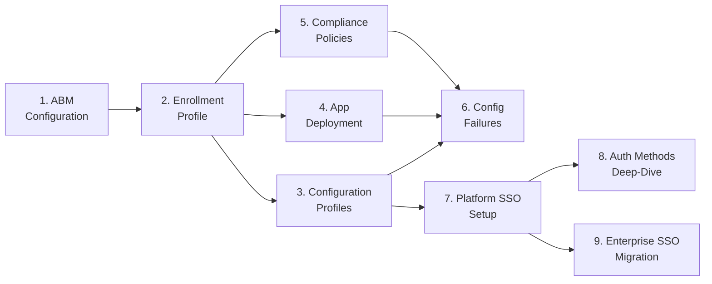

# Phase 83: Kerberos SSO Extension Guide - Pattern Map

**Mapped:** 2026-06-22
**Files analyzed:** 4 (1 new, 3 modified)
**Analogs found:** 4 / 4

---

## File Classification

| New/Modified File | Role | Data Flow | Closest Analog | Match Quality |
|-------------------|------|-----------|----------------|---------------|
| `docs/admin-setup-macos/10-kerberos-sso-extension.md` | admin-setup guide (new) | request-response (admin reads guide → executes Intune steps) | `docs/admin-setup-macos/07-platform-sso-setup.md` (structure) + `docs/admin-setup-macos/09-enterprise-sso-plugin-migration.md` (disambiguation + coexistence framing) | exact (suite sibling) |
| `docs/admin-setup-macos/09-enterprise-sso-plugin-migration.md` | admin-setup guide (surgical edit, line 148 only) | — | self | exact (one-sentence replacement, surrounding context extracted below) |
| `docs/admin-setup-macos/00-overview.md` | overview / index (surgical edit) | — | self (lines 19–31 Mermaid + lines 33–49 bullet list) | exact (append-only) |
| `docs/_glossary-macos.md` | reference glossary (surgical insert) | — | self (lines 122–141, `## Authentication` section) | exact (alphabetical insert) |

---

## Pattern Assignments

---

### `docs/admin-setup-macos/10-kerberos-sso-extension.md` (new guide)

**Primary analog:** `docs/admin-setup-macos/07-platform-sso-setup.md`
**Secondary analog:** `docs/admin-setup-macos/09-enterprise-sso-plugin-migration.md`

---

#### Frontmatter block

Copy exactly from guide 07 (lines 1–7). Guide 10 must match the same five keys in the same order. Only the date values change.

```yaml
---
last_verified: 2026-06-22
review_by: 2026-09-22
applies_to: ADE
audience: admin
platform: macOS
---
```

Note: `last_verified` = authoring date; `review_by` = 90 days later. The keys `applies_to: ADE`, `audience: admin`, `platform: macOS` are copied verbatim — do not alter.

---

#### Platform-gate header blockquote

Copy the blockquote format from guide 07 (lines 9–11). Guide 10 gets its own scope description but must use the same three-line structure, `**Platform gate:**` bold label, and identical third line linking to the macOS Glossary.

**Analog (guide 07, lines 9–11):**
```markdown
> **Platform gate:** This guide covers macOS Platform SSO configuration via Microsoft Intune.
> For Windows Autopilot setup, see [Windows Admin Setup Guides](../admin-setup-apv1/00-overview.md).
> For macOS provisioning terminology, see the [macOS Glossary](../_glossary-macos.md).
```

**For guide 10 — replace lines 1 and 2 with Kerberos scope; keep line 3 verbatim:**
```markdown
> **Platform gate:** This guide covers macOS Kerberos SSO extension configuration via Intune Custom Template (.mobileconfig) for PSSO-integrated deployments.
> For Platform SSO setup (prerequisite), see [Platform SSO Setup](07-platform-sso-setup.md).
> For macOS provisioning terminology, see the [macOS Glossary](../_glossary-macos.md).
```

---

#### Disambiguation table format

Copy the 4-column table format from guide 09 (lines 26–33), `## Product-Name Disambiguation` section. Guide 10's "What This Guide Is NOT" box must use the same `| Term | What It Is | Configuration Surface |` column headers and the same inline bold term styling.

**Analog (guide 09, lines 25–33):**
```markdown
The four terms have distinct meanings:

| Term | What It Is | Configuration Surface |
|------|-----------|----------------------|
| **Microsoft Enterprise SSO plug-in for Apple devices** | Umbrella product -- ... | N/A -- delivered automatically via Company Portal |
| **Platform SSO (PSSO)** | Modern sub-feature ... | Intune **Settings Catalog** only (`com.apple.extensiblesso` payload) |
| **SSO app extension** | Legacy sub-feature. ... | Intune **Device Features** template (legacy path); ... |
| **Kerberos SSO extension** | Separate Apple-NATIVE extension ... | Separate MDM payload; coexists with PSSO (see ...) |
```

Note the `--` (double dash, no spaces around) used as em-dash substitute throughout the suite. Guide 10 must use `--` not `—` or ` - `.

---

#### Prerequisites section format

Copy the prerequisites block format from guide 07 (lines 17–23). Use bullet list with `**Label:**` bold prefix per item. Guide 10's prerequisites list is different in content but must follow the same visual structure.

**Analog (guide 07, lines 17–23):**
```markdown
## Prerequisites

- **Entra ID:** "Users may join devices to Microsoft Entra ID" enabled ...
- **Intune role:** Policy and Profile Manager built-in role ...
- **MFA:** Tenant MFA enabled -- users complete MFA ...
- **Company Portal:** Minimum version 5.2404.0 installed ...
- **macOS version:** macOS 13 minimum (macOS 14 recommended ...).
```

Guide 10 prerequisites (content from CONTEXT.md D-03/D-08/KRB-02 + RESEARCH.md):
- **Platform SSO:** Already deployed (guide 07). See [Platform SSO Setup](07-platform-sso-setup.md).
- **macOS version:** macOS 14.6 Sonoma or later (required for `usePlatformSSOTGT` PSSO TGT integration; macOS 10.15+ supports standalone, but standalone is outside v1.10 scope).
- **Company Portal:** Version 5.2408.0 or later (for PSSO TGT sharing); version 2508 or later for `custom_tgt_setting` fine-grained control.
- **On-premises AD / KDC:** [bounded callout per D-08 — one paragraph only, links out to Apple and Microsoft Learn].

---

#### Configuration-Caused Failures table format

Copy the 4-column table format from guide 07 (lines 131–138) or guide 09 (lines 153–159). Both are identical in structure. Use `| Misconfiguration | Portal | Symptom | Runbook |` headers.

**Analog (guide 07, lines 131–138):**
```markdown
## Configuration-Caused Failures

| Misconfiguration | Portal | Symptom | Runbook |
|------------------|--------|---------|---------|
| Only macOS 14+ `Platform SSO > Authentication Method` configured on mixed fleet (no deprecated field) | Intune | Error 10001 on macOS 13 devices | `35-macos-sso-sign-in-failure.md` (Phase 80) |
| Legacy SSO app extension profile still assigned alongside Platform SSO Settings Catalog policy | Intune | Error 10002; PSSO registration suppressed | `35-macos-sso-sign-in-failure.md` (Phase 80) |
```

Note: The Runbook column for guide 10 Kerberos failures references the Phase 85 runbook (not yet authored). Use `-- (Phase 85)` as the placeholder value.

---

#### See Also section format

Copy the bullet list format from guide 09 (lines 163–169). Use `- [Label](path.md) -- description` with double-dash separator. Bare glossary links (no description) are also used for terms — see guide 07 (lines 142–147).

**Analog (guide 09, lines 163–169):**
```markdown
## See Also

- [Platform SSO Setup](07-platform-sso-setup.md) -- Settings Catalog policy creation, prerequisites, and verification
- [Auth Methods Deep-Dive](08-auth-methods-deep-dive.md) -- Authentication method selection for Platform SSO (Secure Enclave key, Password sync, Smart Card)
- [Enterprise SSO Plug-in](../_glossary-macos.md#enterprise-sso-plug-in)
- [Platform SSO](../_glossary-macos.md#platform-sso)
- [Secure Enclave](../_glossary-macos.md#secure-enclave)
```

**Guide 10 See Also must include:**
```markdown
## See Also

- [Platform SSO Setup](07-platform-sso-setup.md) -- Settings Catalog policy creation, prerequisites, and verification
- [Auth Methods Deep-Dive](08-auth-methods-deep-dive.md) -- Authentication method selection for Platform SSO
- [Enterprise SSO Plug-in & Migration Guide](09-enterprise-sso-plugin-migration.md) -- disambiguation, Error 10002 avoidance, migration sequence
- [Kerberos SSO Extension](../_glossary-macos.md#kerberos-sso-extension)
- [Platform SSO](../_glossary-macos.md#platform-sso)
- [Enterprise SSO Plug-in](../_glossary-macos.md#enterprise-sso-plug-in)
- [Apple Kerberos SSO Extension deployment reference](https://developer.apple.com/documentation/devicemanagement/extensiblesinglesignonkerberos) -- Apple Developer Docs
- [Enable Kerberos SSO in Platform SSO](https://learn.microsoft.com/en-us/entra/identity/devices/device-join-macos-platform-single-sign-on-kerberos-configuration) -- Microsoft Learn (authoritative payload source)
```

---

#### Version-history table format

Copy the closing table from guide 07 (lines 196–200). The `---` horizontal rule precedes the table; no section heading. The table is the final element in the file.

**Analog (guide 07, lines 196–200):**
```markdown
---

| Date | Change | Author |
|------|--------|--------|
| 2026-06-22 | Phase 81 (SSOREF-04): added E3 See Also cross-link to macos-capability-matrix.md#authentication | -- |
| 2026-06-20 | Phase 76 (PSSO-01/02/03/12): initial Platform SSO admin setup guide | -- |
```

**For guide 10 — initial row only:**
```markdown
---

| Date | Change | Author |
|------|--------|--------|
| 2026-06-22 | Phase 83 (KRB-01..04): initial Kerberos SSO Extension guide | -- |
```

---

#### Known-blockquote callout format (for D-08 bounded AD prerequisite callout)

Copy the `> **Bold label:**` callout style from guide 07 (lines 26–35) or guide 09 (lines 57–69). Multi-paragraph callouts use `>` on every line including blank separator lines.

**Analog (guide 07, lines 26–29 — simplified):**
```markdown
> **Before You Deploy -- Resolve These First:**
>
> The following issues cause Platform SSO registration to fail silently ...
>
> - **Remove legacy per-user MFA (DF-3):** ...
```

**Guide 10 AD prerequisites bounded callout must use the same format:**
```markdown
> **On-Premises AD / KDC Prerequisites (not covered in this guide):**
>
> This guide covers the Intune-admin-facing MDM payload only. Configuring the on-premises Active Directory Kerberos realm, KDC reachability, and DNS SRV records is an AD-admin responsibility outside this guide's scope. See [Apple Kerberos SSO Extension deployment reference](https://developer.apple.com/documentation/devicemanagement/extensiblesinglesignonkerberos) and [Enable Kerberos SSO in Platform SSO](https://learn.microsoft.com/en-us/entra/identity/devices/device-join-macos-platform-single-sign-on-kerberos-configuration) for AD-side configuration steps.
```

---

### `docs/admin-setup-macos/09-enterprise-sso-plugin-migration.md` (surgical edit — line 148 only)

**Analog:** self (surrounding context lines 140–149)

**Exact current text at line 148 to replace (verbatim from file read):**
```
A full Kerberos SSO extension configuration guide (payload walkthrough, Extension Identifier values, profile structure) is deferred to a future documentation phase -- see **PSSO-FUT-04** in the v1.9 deferred-cleanup tracking.
```

This sentence is the final sentence of the `### Kerberos SSO Extension (Coexistence)` subsection (lines 140–148). The preceding three paragraphs (lines 142–146) are NOT changed.

**Replacement text (exact text to insert):**
```markdown
For the full Kerberos SSO extension configuration guide (payload walkthrough, Extension Identifier values, PSSO TGT integration, and diagnostics), see [Kerberos SSO Extension](10-kerberos-sso-extension.md).
```

**Surrounding context that must remain unchanged (lines 140–147):**
```markdown
### Kerberos SSO Extension (Coexistence)

The Kerberos SSO extension is a **distinct Apple-native extension** -- NOT a Microsoft extension. It handles Kerberos ticket-granting for on-premises Active Directory / Kerberos resources only; it is not used for Entra ID authentication. It uses the **Kerberos payload type**, not the Redirect payload type used by the Microsoft Enterprise SSO plug-in.

**Separate Extension Identifiers are required.** The Apple SSO extension framework supports multiple extensions per device when they have different Extension Identifiers. The Microsoft PSSO extension uses identifier `com.microsoft.CompanyPortalMac.ssoextension`. The Apple Kerberos SSO extension uses a different, Apple-controlled identifier. If an admin configures both extensions under the **same** Extension Identifier value, one overrides the other -- both stop functioning correctly.

**Coexists with Platform SSO.** On devices that need both Entra ID cloud authentication (Platform SSO) and on-premises AD / Kerberos resources (Kerberos SSO extension), both extensions can be deployed simultaneously as separate profile entries with their distinct identifiers. Platform SSO handles Entra cloud auth; the Kerberos SSO extension handles on-prem Kerberos SSO. They operate in parallel without conflict when identifiers are correctly separated.
```

**Additionally:** The guide 09 version-history table (lines 173–175) must receive a new row:
```markdown
| 2026-06-22 | Phase 83 (KRB-04): replaced deferred-note sentence with forward link to guide 10 | -- |
```

---

### `docs/admin-setup-macos/00-overview.md` (surgical edits — Mermaid + bullet + version-history)

**Analog:** self

---

#### Current Mermaid block (lines 19–31, verbatim from file read):



**Node/edge syntax pattern:** Each node is `SingleLetter[number. Label<br/>Continuation]`. Edges use ` --> `. The `<br/>` (not `<br>`) linebreak splits the guide number from the guide short name within the node label. Multi-word short names use two-word wrapping only where natural (e.g., `Auth Methods` / `Deep-Dive`; `Enterprise SSO` / `Migration`).

**Insertion — add ONE new line after the `G --> I` line:**
```
  G --> J[10. Kerberos SSO<br/>Extension]
```

Arrow source is `G` (node 7, Platform SSO Setup) — NOT `I` (node 9). This is because guide 10 depends on PSSO (guide 07), not on guide 09. The pattern `G --> H`, `G --> I`, `G --> J` matches the existing sibling-descent topology from Platform SSO Setup.

---

#### Current bullet list item 9 (line 49, verbatim from file read):

```markdown
9. **[Enterprise SSO Plug-in & Migration Guide](09-enterprise-sso-plugin-migration.md)** -- Decision-first reference for mixed-fleet admins: product-name disambiguation (Microsoft Enterprise SSO plug-in vs Platform SSO vs legacy SSO app extension vs Kerberos SSO extension), migrate/keep/coexist decision matrix, staged migration sequence that avoids Error 10002, what breaks during migration, and the mandatory destructive rollback procedure.
```

**Bullet list format pattern:** `N. **[Full Guide Title](filename.md)** -- One-sentence description that names the key topics covered.` Double dash `--` (no spaces) separates title from description. Description is one run-on sentence with comma-separated topic list ending in a period.

**Insertion — add after line 49 (after item 9, before the `## Cross-Platform References` heading):**
```markdown
10. **[Kerberos SSO Extension](10-kerberos-sso-extension.md)** -- Configure the Apple Kerberos SSO extension (`com.apple.AppSSOKerberos.KerberosExtension`, Type: Credential) via Intune Custom Template (.mobileconfig) for PSSO-integrated on-premises AD Kerberos authentication. Covers realm and Hosts payload, PSSO TGT sharing (`usePlatformSSOTGT`), and `app-sso platform -s` / `klist` diagnostics.
```

---

#### Version-history table (lines 67–71, verbatim from file read):

```markdown
| Date | Change | Author |
|------|--------|--------|
| 2026-06-20 | Phase 76: added guides 07/08/09 to Mermaid diagram and numbered list | -- |
| 2026-04-14 | Initial version -- macOS admin setup overview with Mermaid diagram and 6-guide setup sequence | -- |
| 2026-06-21 | Phase 77: converted `08-auth-methods-deep-dive.md` code-span to live link with description | -- |
| 2026-06-21 | Phase 78: converted guide-09 code-span to live link with description | -- |
```

**Row to append:**
```markdown
| 2026-06-22 | Phase 83 (KRB-04): added guide 10 node to Mermaid diagram and item 10 to numbered list | -- |
```

---

### `docs/_glossary-macos.md` (surgical insert — new Authentication entry)

**Analog:** self (lines 122–141, `## Authentication` section)

---

#### Existing glossary entry format (Enterprise SSO Plug-in entry, lines 136–140, verbatim):

```markdown
### Enterprise SSO Plug-in

The Microsoft Enterprise SSO plug-in for Apple devices is the umbrella product -- an Apple enterprise SSO extension delivered on macOS (and iOS/iPadOS) via the Intune Company Portal app -- that provides Entra ID single sign-on across apps and browsers. It contains two sub-features: Platform SSO (the modern mode, configured via Settings Catalog, macOS 13+, recommended macOS 14+) and the SSO app extension (the legacy mode, configured via Intune Device Features template). The plug-in uses the Redirect type in Apple's extensible SSO framework; the Kerberos SSO extension (for on-premises AD Kerberos) is a separate, coexisting Apple-native extension. Running both the legacy SSO app extension profile and a Platform SSO Settings Catalog policy simultaneously causes Error 10002; migration sequence is to assign Platform SSO to a pilot group, validate, then remove the legacy profile.

> See also: [Platform SSO](#platform-sso); [Entra ID SSO](_glossary.md#entra-id-sso).
```

**Format pattern:**
- H3 heading: `### Term Name`
- Body: one dense paragraph, no sub-bullets. Double-dash `--` for em-dash. Backtick code-spans for identifiers, version numbers, key names.
- Closing blockquote: `> See also: [Term](#anchor); [Term](#anchor); [external link](url).` — semicolon-separated, period at end. No `**bold**` inside the See-also line.

---

#### Alphabetical Index current state (line 17, verbatim):

```markdown
[ABM](#abm) | [ABM Token](#abm-token) | [Account-Driven User Enrollment](#account-driven-user-enrollment) | [ADE](#ade) | [APNs](#apns) | [Await Configuration](#await-configuration) | [Enterprise SSO Plug-in](#enterprise-sso-plug-in) | [Jailbreak Detection](#jailbreak-detection) | [MAM-WE](#mam-we) | [Platform SSO](#platform-sso) | [Secure Enclave](#secure-enclave) | [Setup Assistant](#setup-assistant) | [Supervision](#supervision) | [VPP](#vpp)
```

**Alphabetical insertion point:** Between `[Jailbreak Detection](#jailbreak-detection)` and `[MAM-WE](#mam-we)`. "K" falls between "J" and "M".

**New index entry to insert:**
```
[Kerberos SSO Extension](#kerberos-sso-extension)
```

**Full updated index line:**
```markdown
[ABM](#abm) | [ABM Token](#abm-token) | [Account-Driven User Enrollment](#account-driven-user-enrollment) | [ADE](#ade) | [APNs](#apns) | [Await Configuration](#await-configuration) | [Enterprise SSO Plug-in](#enterprise-sso-plug-in) | [Jailbreak Detection](#jailbreak-detection) | [Kerberos SSO Extension](#kerberos-sso-extension) | [MAM-WE](#mam-we) | [Platform SSO](#platform-sso) | [Secure Enclave](#secure-enclave) | [Setup Assistant](#setup-assistant) | [Supervision](#supervision) | [VPP](#vpp)
```

---

#### Authentication section insertion point

The `## Authentication` section currently ends at line 141 (after `> See also: [Platform SSO](#platform-sso); [Entra ID SSO](_glossary.md#entra-id-sso).`), followed by the `---` rule and `## Version History`.

**Insert the new entry AFTER the Enterprise SSO Plug-in entry (after line 141) and BEFORE the `---` rule:**

```markdown
### Kerberos SSO Extension

An Apple-native extension (`com.apple.AppSSOKerberos.KerberosExtension`, payload Type: Credential, Team Identifier: `apple`) that provides seamless Kerberos ticket-granting ticket (TGT) acquisition for on-premises Active Directory resources on macOS. It is deployed as a separate Intune Custom Template (.mobileconfig) profile -- distinct from Platform SSO (which uses Type: Redirect and handles Entra ID authentication) and from the Microsoft Enterprise SSO plug-in. When combined with Platform SSO and `usePlatformSSOTGT: true`, the extension uses TGTs issued by PSSO rather than independently acquiring its own, enabling seamless on-prem AD resource access without user interaction. Requires macOS 14.6 or later for PSSO TGT integration; macOS 10.15 or later for standalone operation (standalone is outside v1.10 scope).

> See also: [Platform SSO](#platform-sso); [Enterprise SSO Plug-in](#enterprise-sso-plug-in); [Kerberos SSO Extension Guide](admin-setup-macos/10-kerberos-sso-extension.md).
```

---

#### Glossary version-history table (lines 146–154, verbatim):

```markdown
| Date | Change | Author |
|------|--------|--------|
| 2026-06-22 | Phase 81 (SSOREF-04): added E2 cross-link from Platform SSO term to guide 07 | -- |
| 2026-06-20 | Phase 75: added `## Authentication` section (Platform SSO, Secure Enclave, Enterprise SSO Plug-in); added three new terms to `## Alphabetical Index`; updated `last_verified` and `review_by` front matter | -- |
...
```

**Row to append:**
```markdown
| 2026-06-22 | Phase 83 (KRB-04): added Kerberos SSO Extension entry to ## Authentication and Alphabetical Index | -- |
```

---

## Shared Patterns

### Double-dash em-dash convention
**Source:** All suite files (guides 07, 08, 09; glossary)
**Apply to:** All four files being authored/edited
All suite files use ` -- ` (space, double-hyphen, space) as an em-dash substitute. Do NOT use `—`, `–`, or ` - `. This is consistent across every existing file read in this suite.

### Backtick code-spans for identifiers
**Source:** `docs/admin-setup-macos/09-enterprise-sso-plugin-migration.md` (lines 32, 144) and `docs/admin-setup-macos/07-platform-sso-setup.md` (lines 71–81)
**Apply to:** guide 10 and all surgical edits
All extension identifiers, key names, command names, and version-pinned values use inline backticks: `com.apple.AppSSOKerberos.KerberosExtension`, `usePlatformSSOTGT`, `app-sso platform -s`, `klist`, `CONTOSO.COM`.

### Author field in version-history rows
**Source:** All suite files
**Apply to:** All four version-history table rows being appended
The Author column is always `--` (two hyphens), never a name or email. This applies uniformly across every existing entry in guides 07, 08, 09, and the glossary.

### Frontmatter `last_verified` / `review_by` update on surgical edits
**Source:** guide 09 (line 2–3: `last_verified: 2026-06-21` / `review_by: 2026-09-21`)
**Apply to:** guides 09, 00-overview.md, and glossary when edited in Phase 83
When a file is surgically edited, update its frontmatter `last_verified` to the editing date (2026-06-22) and `review_by` to 90 days later (2026-09-22). This is the suite convention inferred from the pattern that `last_verified` matches the most recent version-history row date for each file.

---

## No Analog Found

All four target files have close analogs within the suite. No files require fallback to RESEARCH.md patterns only.

---

## Anti-Patterns Extracted from Suite (Must NOT appear in guide 10)

| Anti-Pattern | Source of Ban | Action |
|---|---|---|
| `app-sso diagnose` command | CONTEXT.md D-13; RESEARCH.md K-3 | PROHIBITED — do not include anywhere in guide 10 |
| Extension identifier `com.microsoft.CompanyPortalMac.ssoextension` in Kerberos profile | RESEARCH.md K-1 | Include only the Apple identifier; add side-by-side comparison table showing the distinction |
| `Type: Redirect` in Kerberos plist | RESEARCH.md K-5 | Every plist example must show `Type: Credential` |
| Team Identifier `UBF8T346G9` in Kerberos profile | RESEARCH.md Pitfall 1 | Kerberos Team Identifier is literal string `apple` — never `UBF8T346G9` |
| `custom_tgt_setting` key in Kerberos .mobileconfig | RESEARCH.md Pitfall 4 | This key belongs in the PSSO Settings Catalog policy's ExtensionData, not the Kerberos .mobileconfig. Tag as [ASSUMED] per open question in RESEARCH.md |
| Realm name in lowercase (`contoso.com`) | RESEARCH.md Pitfall 6 | Realm MUST be ALL CAPS: `CONTOSO.COM` |
| Hosts array missing dot-prefixed wildcard | RESEARCH.md Pitfall 7 | Always include both: `["contoso.com", ".contoso.com"]` |
| Entries to `docs/index.md`, `common-issues.md`, or `quick-ref-l2.md` | CONTEXT.md deferred (Phase 87) | Out of scope for Phase 83 — do not touch navigation-hub files |
| Full AD/KDC walkthrough (`nltest`, SRV records, DC diagnostics, OU/forest) | CONTEXT.md D-08; RESEARCH.md K-4 | One bounded callout paragraph + external links only |

---

## Metadata

**Analog search scope:** `docs/admin-setup-macos/` (07, 08, 09, 00-overview.md); `docs/_glossary-macos.md`
**Files read:** 4 (07-platform-sso-setup.md, 09-enterprise-sso-plugin-migration.md, 00-overview.md, _glossary-macos.md)
**Pattern extraction date:** 2026-06-22
