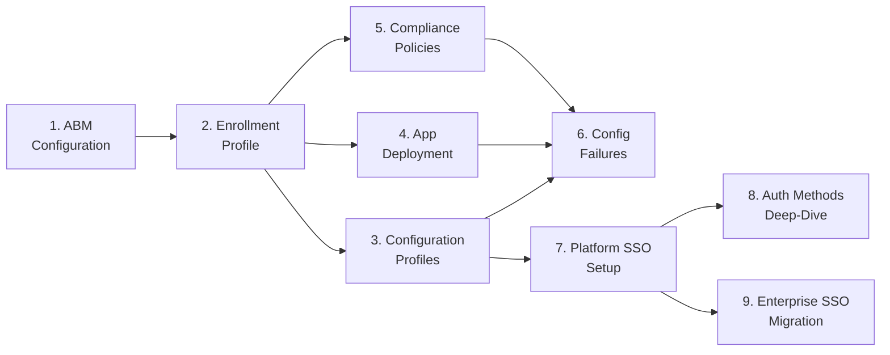

# Phase 83: Kerberos SSO Extension Guide - Research

**Researched:** 2026-06-22
**Domain:** Documentation authoring — Apple Kerberos SSO extension, Intune Custom Template deployment, PSSO+Kerberos TGT integration, suite surgical edits
**Confidence:** HIGH — all technically critical facts verified from Microsoft Learn (updated 2026-06-15) and app-sso man page; suite format confirmed by direct file reads

---

<user_constraints>
## User Constraints (from CONTEXT.md)

### Locked Decisions

**D-01:** Guide 10 is framed PSSO-coexistence-primary — the on-prem-AD-Kerberos-running-alongside-Platform-SSO pattern (shared TGT via `usePlatformSSOTGT` / `custom_tgt_setting`) is the spine.

**D-02:** Standalone-without-PSSO appears only as a brief note, never as a co-equal configuration path.

**D-03:** Pin the macOS 14.6 floor for PSSO-integrated Kerberos TGT sharing — do not let the standalone macOS 10.15+ floor surface as the primary version statement.

**D-04:** Cloud Kerberos / Azure Files stays a limited-preview callout (not GA, not the primary path).

**D-05:** Use a custom structure adapted for the Custom-Template/.mobileconfig deployment — a hybrid. Mirroring guide 07 exactly was rejected.

**D-06:** The Steps section is custom (`.mobileconfig` Custom Template upload) — NOT the Settings-Catalog picker flow.

**D-07:** Keep the shared suite anchors for cross-doc consistency: Platform-gate header, `## Prerequisites`, `## Verification`, `## See Also`, and the version-history table. Include the K-2-mandated opening disambiguation box ("What this guide is NOT").

**D-08:** Use a bounded "prerequisites you own" callout (≤1 paragraph) linking out to Apple's Kerberos SSO Extension guide + Microsoft's Kerberos-PSSO guide for AD-side realm/KDC/SRV setup. No full AD/KDC/DNS-SRV walkthrough.

**D-09:** Satisfy KRB-01 Intune-admin-facing payload values: realm name (ALL CAPS), `Hosts` array shape, on-prem-AD dependency note. No `nltest`, no DC-diagnostic, no OU/forest content.

**D-10:** Lock the diagnostic command set to `klist` + `app-sso platform -s` as the canonical pair. Leave-to-planner rejected.

**D-11:** Pin the `klist` invocation to a version-stable form — no macOS-version-variant flags (avoid unguarded `klist -v`).

**D-12:** Bind the output interpretation: `app-sso platform -s` reports `tgt_ad` (on-prem) vs `tgt_cloud` (Entra) ticket paths — document what each signals. Include the cosmetic "Not signed in" menu-bar note.

**D-13:** `app-sso diagnose` is PROHIBITED. The standalone `app-sso kerberos` subcommand may be added only after plan-time verification against a live macOS 14.6+ binary; the guide ships without it by default.

### Claude's Discretion

Exact section ordering within the custom Steps flow, callout wording, and table layouts are left to the planner/executor, subject to the anchors in D-07 and the caveats above.

### Deferred Ideas (OUT OF SCOPE)

- L2 Kerberos troubleshooting runbook (#28) — Phase 85
- macOS capability-matrix Kerberos rows — Phase 85
- Navigation-hub / quick-ref-l2 integration — Phase 87
- On-prem-AD-only (non-Entra) Kerberos realm deep-dive — KRBFUT-01 (v2)
- Standalone Kerberos-without-PSSO as a primary path — FEATURES anti-feature; note only
</user_constraints>

---

<phase_requirements>
## Phase Requirements

| ID | Description | Research Support |
|----|-------------|------------------|
| KRB-01 | New guide 10: extension identity `com.apple.AppSSOKerberos.KerberosExtension` (Type: Credential, Team ID `apple`), Intune Custom Template (.mobileconfig) deployment path, realm/KDC + on-prem AD prerequisites, disambiguation from Platform SSO and Microsoft Enterprise SSO plug-in | Payload structure verified from Microsoft Learn plist sample; Team ID confirmed as literal string `apple`; deployment steps confirmed from Intune Custom template instructions |
| KRB-02 | Guide 10: PSSO+Kerberos TGT integration — `usePlatformSSOTGT` / `custom_tgt_setting` (Company Portal 2508+), macOS 14.6 floor, cosmetic "Not signed in" note, Azure Files Cloud-Kerberos as limited-preview callout | All values verified from Microsoft Learn (updated 2026-06-15); Azure Files preview confirmed with azurefiles@microsoft.com onboarding contact |
| KRB-03 | Guide 10: Kerberos diagnostics — `app-sso platform -s` (`tgt_ad`/`tgt_cloud`) + `klist`, ticket lifecycle, realm/KDC reachability checks | `app-sso platform -s` HIGH confidence; `klist` HIGH confidence; `app-sso kerberos` mode selector behavior confirmed from man page — see D-13 finding below |
| KRB-04 | Guide 09 SSOMIG-04 deferred-note sentence replaced with live forward link; `00-overview.md` Mermaid + bullet flow extended to include guide 10 | Exact sentence identified at line 148 of guide 09; Mermaid insertion point confirmed at `00-overview.md`; glossary entry format confirmed from existing Authentication section pattern |
</phase_requirements>

---

## Summary

Phase 83 is a pure documentation-authoring phase. No code is built; no packages are installed. The technical research questions from the CONTEXT.md are resolved below. The payload structure for the Apple Kerberos SSO extension has been verified verbatim from the Microsoft Learn Kerberos-PSSO tutorial (updated 2026-06-15), which includes a complete on-prem .mobileconfig plist example. The Team Identifier is the literal string `apple` — confirmed in the Microsoft Learn plist. The `app-sso kerberos` subcommand question (D-13) is resolved: `kerberos` is the default mode selector for `app-sso`, not a distinct new subcommand; commands like `app-sso kerberos -l` (list realms) are valid but are Kerberos-mode flags, not a new `kerberos` subcommand per se. `app-sso diagnose` does NOT appear in the man page and remains PROHIBITED.

The existing suite format (frontmatter, platform-gate header, See Also, version-history table) is confirmed from direct reads of guides 07, 08, 09 and the glossary. The exact sentence to replace in guide 09 for KRB-04 is at line 148. The 00-overview.md Mermaid diagram ends at node I (guide 9) and the bullet list ends at item 9; guide 10 is a straightforward extension of both.

**Primary recommendation:** Author guide 10 using the Microsoft Learn on-prem .mobileconfig plist as the canonical payload example, framed PSSO-coexistence-primary (D-01), with the bounded AD callout (D-08) linking to the two external authoritative sources. Diagnostics section: `app-sso platform -s` + `klist` only (D-10/D-11/D-13).

---

## Architectural Responsibility Map

| Capability | Primary Tier | Secondary Tier | Rationale |
|------------|-------------|----------------|-----------|
| .mobileconfig payload authoring (guide 10) | Documentation (admin guide) | — | Intune admin action: Custom Template upload; no code layer |
| PSSO+Kerberos TGT integration explanation | Documentation (guide 10 §Integration) | Cross-link to guide 07 | PSSO prerequisite assumed already deployed; guide 10 documents the Kerberos layer only |
| Diagnostic command set (KRB-03) | Documentation (guide 10 §Verification / §Diagnostics) | L2 runbook #28 (Phase 85 reuse) | L1/L2 admin action; RUN-01 feeds Phase 85 |
| Guide 09 forward-link (KRB-04) | Documentation (surgical edit to guide 09 line 148) | — | One sentence only; no structural change to guide 09 |
| 00-overview.md Mermaid + bullet (KRB-04) | Documentation (00-overview.md) | — | Node 10 appended to existing chain; follows Phase 76 pattern |
| Glossary entry (KRB-04 / REF-02 precursor) | Documentation (_glossary-macos.md) | — | Authentication section; follows Platform SSO / Enterprise SSO Plug-in entry format |

---

## Standard Stack

### This phase installs no packages.

This is a documentation-only phase. No `npm install`, `pip install`, or equivalent. The authoring environment is Markdown + the existing suite's GitHub-flavored callout syntax. No new tooling is introduced.

**Authoring tools already present (no install needed):**
- Markdown editor (any)
- Mermaid diagram syntax (inline in `00-overview.md` — existing `graph LR` block, no new renderer needed)
- `.mobileconfig` XML (plain text, no tooling required)

---

## Package Legitimacy Audit

Not applicable — this phase installs no external packages.

---

## Architecture Patterns

### System Architecture Diagram

```
[Intune Admin] --uploads--> [Intune Custom Template]
                                    |
                          .mobileconfig XML (com.apple.extensiblesso, Type: Credential)
                                    |
                          [MDM profile delivery to macOS device]
                                    |
                    +---------------+---------------+
                    |                               |
         [Apple Kerberos SSO Extension]    [Platform SSO Extension]
         com.apple.AppSSOKerberos.         com.microsoft.CompanyPortal
         KerberosExtension                 Mac.ssoextension
         (Type: Credential)               (Type: Redirect)
                    |                               |
            [On-prem AD TGT]              [Entra PRT / TGT]
                    |                               |
                    +---usePlatformSSOTGT: true------+
                                    |
                         [macOS Kerberos ticket cache]
                                    |
                    +---------------+---------------+
                    |                               |
            [tgt_ad ticket]                 [tgt_cloud ticket]
            (on-prem AD realm)             (KERBEROS.MICROSOFTONLINE.COM)
                    |                               |
         [app-sso platform -s]           [klist]
         (diagnostic view)              (ticket-cache view)
```

### Recommended Guide 10 Structure

```
docs/admin-setup-macos/10-kerberos-sso-extension.md
```

Internal section order (D-05, D-06, D-07):

```
[frontmatter: last_verified / review_by / applies_to / audience / platform]
[platform-gate header blockquote]
# macOS Kerberos SSO Extension

## What This Guide Is NOT  ← D-07 K-2 disambiguation box
  (table: Kerberos ext vs PSSO vs Enterprise SSO plug-in)

## Prerequisites
  - PSSO already deployed (guide 07)
  - macOS 14.6 Sonoma minimum (D-03)
  - Company Portal 5.2408.0+ (KRB-02)
  - On-prem AD callout (D-08 — ≤1 paragraph, links out)

## Configuration: On-Premises Active Directory Profile  ← D-06 custom Steps
  - Payload key table (D-09)
  - Full .mobileconfig XML example (verified from MS Learn)
  - Intune Custom Template upload steps

## Configuration: PSSO + Kerberos TGT Integration  ← KRB-02 / D-12
  - usePlatformSSOTGT: true
  - custom_tgt_setting table (values 0/1/2/3)
  - CP 2508+ gate note
  - performKerberosOnly: true guidance
  - "Not signed in" menu-bar note (D-12)

## Configuration: Cloud Kerberos Profile (Limited Preview)  ← D-04 callout
  - KERBEROS.MICROSOFTONLINE.COM realm
  - preferredKDCs kkdcp:// endpoint
  - Azure Files preview callout + azurefiles@microsoft.com contact

## Verification
  - app-sso platform -s (tgt_ad / tgt_cloud interpretation — D-12)
  - klist (ticket cache)
  - "Not signed in" disambiguation (D-12)

## Configuration-Caused Failures
  (brief table — wrong Type, wrong identifier, missing usePlatformSSOTGT)

## See Also
  (links to guides 07, 08, 09; Apple deployment guide; MS Learn Kerberos tutorial)

[version-history table]
```

### Pattern 1: Suite Frontmatter (from guides 07, 08, 09)

**What:** Every guide in the macOS admin-setup sequence uses YAML frontmatter with the same five keys.

**Verified from:** Direct reads of `07-platform-sso-setup.md`, `08-auth-methods-deep-dive.md`, `09-enterprise-sso-plugin-migration.md`.

```yaml
# Source: guide 07 / 08 / 09 frontmatter (direct read, HIGH confidence)
---
last_verified: YYYY-MM-DD
review_by: YYYY-MM-DD
applies_to: ADE
audience: admin
platform: macOS
---
```

**For guide 10:** Set `last_verified` to the authoring date; `review_by` to 90 days later; `applies_to: ADE`; `audience: admin`; `platform: macOS`.

### Pattern 2: Platform-Gate Header Blockquote

**What:** Every guide opens with a platform-gate blockquote immediately after frontmatter.

**Verified from:** Direct reads of guides 07, 08, 09.

```markdown
<!-- Source: guide 07/08/09 opening blockquote pattern — HIGH confidence -->
> **Platform gate:** This guide covers [specific scope].
> For [adjacent guides], see [link].
> For macOS provisioning terminology, see the [macOS Glossary](../_glossary-macos.md).
```

**For guide 10:** "This guide covers macOS Kerberos SSO extension configuration via Intune Custom Template for PSSO-integrated deployments."

### Pattern 3: See Also Format

**What:** `## See Also` section uses a bullet list with `[Label](path.md)` or `[Label](path.md#anchor)` entries and a brief dash-separated description.

**Verified from:** Guides 07, 08, 09 `## See Also` sections (direct read).

```markdown
<!-- Source: guide 07 ## See Also — HIGH confidence -->
## See Also

- [Platform SSO Setup](07-platform-sso-setup.md) -- Settings Catalog policy creation, prerequisites, and verification
- [Auth Methods Deep-Dive](08-auth-methods-deep-dive.md) -- Authentication method selection...
- [Platform SSO](../_glossary-macos.md#platform-sso)
```

### Pattern 4: Version-History Table

**What:** Every guide ends with a `| Date | Change | Author |` table. No `---` separator line between sections and the table is the final element.

**Verified from:** Guides 07, 08, 09 (direct read).

```markdown
<!-- Source: guide 07 version-history table — HIGH confidence -->
---

| Date | Change | Author |
|------|--------|--------|
| YYYY-MM-DD | Phase 83: initial Kerberos SSO Extension guide | -- |
```

### Pattern 5: Glossary Entry Format (Authentication Section)

**What:** New glossary terms go under the appropriate `## Section` H2. Each term is an H3. The body is a definition paragraph. A `> See also:` line provides cross-links. Some entries add a `> **Windows equivalent:**` blockquote.

**Verified from:** `_glossary-macos.md` Platform SSO, Secure Enclave, and Enterprise SSO Plug-in entries (direct read, lines 123–141).

```markdown
<!-- Source: _glossary-macos.md ## Authentication section — HIGH confidence -->
### Kerberos SSO Extension

[Definition paragraph — owner (Apple), payload type (Credential),
purpose (on-prem AD TGT acquisition), deployment (Custom Template .mobileconfig),
coexistence with PSSO, macOS 10.15+ standalone / 14.6 for PSSO TGT integration]

> See also: [Platform SSO](#platform-sso); [Enterprise SSO Plug-in](#enterprise-sso-plug-in); [Kerberos SSO Extension Guide](admin-setup-macos/10-kerberos-sso-extension.md).
```

**The Alphabetical Index line at the top of the glossary must also be extended** to add `[Kerberos SSO Extension](#kerberos-sso-extension)` in alphabetical order (between J and M).

### Pattern 6: 00-overview.md Mermaid Extension

**What:** The existing Mermaid block uses `graph LR` syntax. Nodes are single-letter sequential. The current highest node is `I[9. Enterprise SSO\nMigration]`. A new node `J[10. Kerberos SSO\nExtension]` must be appended with an arrow `G --> J` (since guide 10 depends on guide 07 / PSSO being deployed, not on guide 09).

**Verified from:** Direct read of `00-overview.md` Mermaid block (lines 19–31).

Current Mermaid (ending state):


**Insertion:** Add `G --> J[10. Kerberos SSO<br/>Extension]` (guide 10 depends on PSSO / guide 07, not on guide 09). The `<br/>` linebreak follows the established pattern.

**Bullet list insertion:** After item 9 (lines 49–49 of `00-overview.md`), append item 10 in the same format:

```markdown
10. **[Kerberos SSO Extension](10-kerberos-sso-extension.md)** -- Configure the Apple Kerberos SSO extension (`com.apple.AppSSOKerberos.KerberosExtension`) via Intune Custom Template (.mobileconfig) for PSSO-integrated on-prem AD Kerberos authentication. Covers realm/Hosts payload, PSSO TGT sharing, and `app-sso platform -s` / `klist` diagnostics.
```

### Anti-Patterns to Avoid

- **K-1: Wrong Extension Identifier.** Never copy the PSSO identifier `com.microsoft.CompanyPortalMac.ssoextension` into the Kerberos profile. Every plist example MUST use `com.apple.AppSSOKerberos.KerberosExtension`. [VERIFIED: Microsoft Learn plist sample 2026-06-15]
- **K-5: Wrong Payload Type.** Every Kerberos plist example MUST show `<key>Type</key><string>Credential</string>`. Using `Redirect` (the PSSO value) causes silent TGT acquisition failure. [VERIFIED: Microsoft Learn plist sample 2026-06-15]
- **K-3: Banned command.** `app-sso diagnose` does not appear in the man page and is PROHIBITED. Do not include it. [VERIFIED: app-sso man page]
- **K-4: Out-of-scope AD content.** No `nltest`, no SRV record configuration, no DC diagnostics, no OU/forest content. One bounded callout paragraph linking out.
- **Navigation-last (DI-1).** Do NOT add entries to `docs/index.md`, `common-issues.md`, or `quick-ref-l2.md` in this phase. Those are Phase 87.

---

## Don't Hand-Roll

| Problem | Don't Build | Use Instead | Why |
|---------|-------------|-------------|-----|
| On-prem AD / Kerberos realm setup | Any walkthrough of AD DNS SRV records, KDC config, OU structure | Bounded callout + link to Apple Kerberos SSO Extension deployment guide + Microsoft Learn Kerberos-PSSO guide | K-4: outside Intune-admin scope; AD admin role required; out of v1.10 scope (KRBFUT-01) |
| Kerberos ticket lifecycle deep-dive | Custom ticket renewal / TTL explanation | One-sentence note: "The extension proactively renews TGTs on network state change; default TGT lifetime is set by the KDC (typically 10 hours)" | Sufficient for admin audience; full Kerberos protocol detail is out of scope |
| Browser Kerberos policies | Per-browser config walkthrough | Brief browser support table (Safari: default; Edge/Chrome: AuthNegotiateDelegateAllowlist + AuthServerAllowlist; Firefox: network.negotiate-auth.trusted-uris) with links to respective vendor policy docs | Already well-documented externally; a table + links is the right depth for this guide |

**Key insight:** This guide's job is Intune-admin-facing MDM payload configuration, not Kerberos protocol education or AD infrastructure management.

---

## Verified Payload Structure (KRB-01, KRB-02)

The following is the authoritative on-prem .mobileconfig plist structure, verified verbatim from Microsoft Learn (updated 2026-06-15). [VERIFIED: learn.microsoft.com/en-us/entra/identity/devices/device-join-macos-platform-single-sign-on-kerberos-configuration]

### Key-Value Reference Table

| Key | Value / Type | Required | Notes |
|-----|-------------|----------|-------|
| `ExtensionIdentifier` | `com.apple.AppSSOKerberos.KerberosExtension` (String) | Yes | NEVER use the PSSO identifier |
| `TeamIdentifier` | `apple` (String — the literal word "apple") | Yes | Apple-owned extension; Team ID is the string `apple`, not a numeric ID |
| `Type` | `Credential` (String) | Yes | NOT `Redirect` (K-5 pitfall) |
| `PayloadType` | `com.apple.extensiblesso` (String) | Yes | Same payload type as PSSO but different ExtensionIdentifier |
| `Realm` | `CONTOSO.COM` (String — ALL CAPS) | Yes | Must match on-prem AD Kerberos realm; all uppercase (K-2 pitfall if lowercase) |
| `Hosts` | Array of strings | Yes | Must include bare domain AND dot-prefixed wildcard: `["contoso.com", ".contoso.com"]` |
| `ExtensionData` > `usePlatformSSOTGT` | `<true/>` (Boolean) | Recommended | Enables PSSO TGT sharing; macOS 14.6+ required |
| `ExtensionData` > `performKerberosOnly` | `<true/>` (Boolean) | Recommended for PSSO deployments | Disables password sync / expiration checks when Entra owns password lifecycle |
| `ExtensionData` > `syncLocalPassword` | `<false/>` (Boolean) | Recommended for PSSO deployments | Keep false in PSSO-combined deployments |
| `ExtensionData` > `allowPasswordChange` | `<true/>` (Boolean) | Optional | Permits user-initiated password change via menu-bar extra |
| `ExtensionData` > `allowPlatformSSOAuthFallback` | `<true/>` (Boolean) | Optional | Permits fallback if PSSO TGT unavailable |
| `ExtensionData` > `pwReqComplexity` | `<true/>` (Boolean) | Optional | Enforce AD password complexity requirements |

### Cloud Kerberos Profile Keys (additional, limited preview)

| Key | Value | Notes |
|-----|-------|-------|
| `Realm` | `KERBEROS.MICROSOFTONLINE.COM` | Entra Cloud Kerberos realm (ALL CAPS) |
| `Hosts` | `["windows.net", ".windows.net"]` | Azure Files target |
| `ExtensionData` > `preferredKDCs` | `kkdcp://login.microsoftonline.com/{tenantId}/kerberos` | Tenant-specific KKDCP endpoint |
| `ExtensionData` > `usePlatformSSOTGT` | `<true/>` | Required for cloud TGT sharing |
| `ExtensionData` > `performKerberosOnly` | `<true/>` | Required |

### custom_tgt_setting Values (KRB-02)

Available only with Company Portal 2508 or later. Set in the PSSO Settings Catalog policy's `ExtensionData` dictionary (NOT in the Kerberos .mobileconfig).

| Value | Behavior |
|-------|----------|
| `0` | Both on-prem and cloud TGTs mapped (default) |
| `1` | On-prem TGT only |
| `2` | Cloud TGT only |
| `3` | No TGT mapping |

[VERIFIED: learn.microsoft.com/en-us/entra/identity/devices/device-join-macos-platform-single-sign-on-kerberos-configuration — 2026-06-15]

---

## D-13 Resolution: app-sso kerberos Subcommand Finding

**Question (from CONTEXT.md D-13):** Does the standalone `app-sso kerberos` subcommand exist and is it documented?

**Finding:** `kerberos` is the **default mode selector** for `app-sso`, not a new or distinct subcommand introduced in macOS 14.6+. The man page syntax is:

```
app-sso [kerberos|platform] [flags]
```

- `app-sso kerberos -l` (list realms) is equivalent to `app-sso -l` because kerberos is the default mode.
- `app-sso platform -s` (Platform SSO state) is the separate platform mode.
- `app-sso diagnose` does NOT appear in the man page at all.

**Resolution per D-13:** The default kerberos-mode flags (`-l` for list realms, `-i` for realm info, `-r` for reset cache, `-s` for site lookup) are documented in the man page and are valid. HOWEVER, per D-13's requirement of "verified against a live macOS 14.6+ binary," these are man-page-verified but not binary-tested in this session.

**Recommendation to planner:** The guide 10 diagnostics section should use:
- `app-sso platform -s` (HIGH confidence — Platform SSO state including TGT keys)
- `klist` (HIGH confidence — standard MIT Kerberos CLI)

Optionally, if the planner wants to include a "list configured Kerberos realms" step, `app-sso -l` (or equivalently `app-sso kerberos -l`) is documented in the man page at MEDIUM confidence (man-page confirmed, not binary-tested this session). It is NOT a new mysterious subcommand — it is the default mode of app-sso. The CONTEXT.md instruction to "ship without it by default" is still the right default; if included, document the flags, not as a separate subcommand.

[CITED: https://keith.github.io/xcode-man-pages/app-sso.1.html]

---

## Common Pitfalls

### Pitfall 1: Wrong TeamIdentifier Value

**What goes wrong:** The `TeamIdentifier` in the Kerberos .mobileconfig is set to `UBF8T346G9` (the Microsoft Company Portal Team ID used in guide 07's Settings Catalog table) instead of `apple`.
**Why it happens:** An author copying the guide 07 Settings Catalog table sees `Team Identifier: UBF8T346G9` and uses it in the Kerberos profile.
**How to avoid:** The Apple Kerberos SSO extension TeamIdentifier is the literal string `apple` — verified from the Microsoft Learn plist sample. Include the plist value explicitly in every profile example.
**Warning signs:** Any TeamIdentifier value other than `apple` in the Kerberos profile.

[VERIFIED: Microsoft Learn plist sample shows `<key>TeamIdentifier</key><string>apple</string>` — 2026-06-15]

### Pitfall 2: K-5 — Redirect Instead of Credential (Most Common Copy Error)

**What goes wrong:** `Type: Redirect` used in Kerberos profile (copied from PSSO guide 07).
**Why it happens:** PSSO uses `Type: Redirect`; Kerberos uses `Type: Credential`. One line in a copy-pasted plist.
**How to avoid:** Callout in guide: "The most common copy-error from Platform SSO guides." Every plist example must show `<string>Credential</string>`.
**Warning signs:** plist shows `<key>Type</key><string>Redirect</string>`.

[VERIFIED: Microsoft Learn plist sample — 2026-06-15]

### Pitfall 3: K-1 — Wrong ExtensionIdentifier

**What goes wrong:** `com.microsoft.CompanyPortalMac.ssoextension` used in the Kerberos profile.
**Why it happens:** Copied from guide 07's Settings Catalog table or guide 09 prose.
**How to avoid:** Side-by-side comparison table showing both identifiers clearly labeled.
**Warning signs:** Any `com.microsoft.*` value in the Kerberos profile.

[VERIFIED: Microsoft Learn plist sample — 2026-06-15]

### Pitfall 4: custom_tgt_setting Placed in the Wrong Profile

**What goes wrong:** `custom_tgt_setting` key placed in the Kerberos .mobileconfig `ExtensionData` dictionary.
**Why it happens:** It looks like a Kerberos extension key but it is actually a PSSO key.
**How to avoid:** The `custom_tgt_setting` key belongs in the **PSSO Settings Catalog policy's ExtensionData** (the `com.microsoft.CompanyPortalMac.ssoextension` profile), not the Kerberos .mobileconfig. Document this explicitly.

[VERIFIED: Microsoft Learn — "This option is only enabled in Company Portal version 2508 and above" — key is in the SSO extension config, not in the Kerberos profile]

### Pitfall 5: Deploying Kerberos Profile Without PSSO Already Configured

**What goes wrong:** Admin deploys the Kerberos .mobileconfig before completing Platform SSO setup. `usePlatformSSOTGT: true` has no effect because PSSO has not registered.
**Why it happens:** Guide 10 must be explicit that PSSO (guide 07) is a prerequisite.
**How to avoid:** Prerequisites section must state "Platform SSO must already be configured and devices registered before deploying the Kerberos profile with `usePlatformSSOTGT: true`."

### Pitfall 6: Realm Name Not ALL CAPS

**What goes wrong:** Realm configured as `contoso.com` (lowercase) instead of `CONTOSO.COM`.
**Why it happens:** Domain names in IT documentation are habitually lowercase.
**How to avoid:** Callout: "The Realm key value MUST be all uppercase. This matches the canonical Kerberos realm format. `CONTOSO.COM` not `contoso.com`."

[VERIFIED: Microsoft Learn configuration table — "The value should be all capitalized" — 2026-06-15]

### Pitfall 7: Missing Dot-Prefixed Host Entry

**What goes wrong:** Hosts array contains only `["contoso.com"]` without the `.contoso.com` wildcard.
**Why it happens:** Admins unfamiliar with Kerberos assume the bare domain name is sufficient.
**How to avoid:** Both entries are required. Document as: `["contoso.com", ".contoso.com"]` (keep the dot).

[VERIFIED: Microsoft Learn configuration table — "Keep the preceding `.` character before your domain/forest name" — 2026-06-15]

---

## Code Examples

### On-Premises Active Directory Kerberos Profile (.mobileconfig)

```xml
<!-- Source: learn.microsoft.com/en-us/entra/identity/devices/device-join-macos-platform-single-sign-on-kerberos-configuration (2026-06-15) -->
<?xml version="1.0" encoding="UTF-8"?>
<!DOCTYPE plist PUBLIC "-//Apple//DTD PLIST 1.0//EN" "http://www.apple.com/DTDs/PropertyList-1.0.dtd">
<plist version="1.0">
<dict>
    <key>PayloadContent</key>
    <array>
        <dict>
            <key>ExtensionData</key>
            <dict>
                <key>allowPasswordChange</key>
                <true/>
                <key>allowPlatformSSOAuthFallback</key>
                <true/>
                <key>performKerberosOnly</key>
                <true/>
                <key>pwReqComplexity</key>
                <true/>
                <key>syncLocalPassword</key>
                <false/>
                <key>usePlatformSSOTGT</key>
                <true/>
            </dict>
            <key>ExtensionIdentifier</key>
            <string>com.apple.AppSSOKerberos.KerberosExtension</string>
            <key>Hosts</key>
            <array>
                <string>.contoso.com</string>
                <string>contoso.com</string>
            </array>
            <key>Realm</key>
            <string>CONTOSO.COM</string>
            <key>PayloadDisplayName</key>
            <string>Single Sign-On Extensions Payload for On-Premises</string>
            <key>PayloadIdentifier</key>
            <string>com.apple.extensiblesso.1aaaaaa1-2bb2-3cc3-4dd4-5eeeeeeeeee5</string>
            <key>PayloadType</key>
            <string>com.apple.extensiblesso</string>
            <key>PayloadUUID</key>
            <string>1aaaaaa1-2bb2-3cc3-4dd4-5eeeeeeeeee5</string>
            <key>TeamIdentifier</key>
            <string>apple</string>
            <key>Type</key>
            <string>Credential</string>
        </dict>
    </array>
    <key>PayloadDisplayName</key>
    <string>Kerberos SSO Extension for macOS for On-Premises</string>
    <key>PayloadEnabled</key>
    <true/>
    <key>PayloadScope</key>
    <string>System</string>
    <key>PayloadType</key>
    <string>Configuration</string>
    <key>PayloadRemovalDisallowed</key>
    <true/>
    <key>PayloadVersion</key>
    <integer>1</integer>
</dict>
</plist>
```

### app-sso platform -s Diagnostic Output (TGT Keys)

```console
# Source: Microsoft Learn Kerberos-PSSO testing section (2026-06-15)
# Run in Terminal after PSSO registration complete:
app-sso platform -s

# Expected output includes (among other fields):
#   ticketKeyPath: tgt_ad    ← on-prem Active Directory TGT present
#   ticketKeyPath: tgt_cloud ← Entra Cloud Kerberos TGT present
#
# If tgt_ad is present: on-prem Kerberos SSO is functioning.
# If tgt_cloud is present: Cloud Kerberos / Azure Files Kerberos is available.
# If neither is present: usePlatformSSOTGT may not be set, or PSSO registration incomplete.
```

### klist Diagnostic (Standard Kerberos Ticket Cache)

```bash
# Source: Standard MIT Kerberos CLI — HIGH confidence, version-stable form (D-11)
klist

# Shows all current Kerberos tickets in the credential cache.
# Look for:
#   Service principal: krbtgt/CONTOSO.COM@CONTOSO.COM  ← on-prem TGT
#   Service principal: krbtgt/KERBEROS.MICROSOFTONLINE.COM@KERBEROS.MICROSOFTONLINE.COM  ← cloud TGT
# Expiry times indicate ticket health.
```

### Intune Custom Template Upload Steps (KRB-01 / D-06)

```
# Source: Microsoft Learn Intune configuration steps (2026-06-15)
# Navigation path for Custom Template upload:
Devices > Configuration > Create > New policy
  Platform: macOS
  Profile type: Templates > Custom
  Basics: [descriptive name, e.g., "macOS - Kerberos SSO Extension - On-Premises"]
  Custom configuration profile name: [internal name]
  Deployment channel: Device channel (recommended)
  Configuration profile file: [upload .mobileconfig file]
  Assignments: user groups (NOT device groups — same rule as PSSO)
```

---

## KRB-04: Exact Surgical Edit Points

### 1. Guide 09 — Exact Sentence to Replace

**File:** `docs/admin-setup-macos/09-enterprise-sso-plugin-migration.md`
**Line:** 148 (confirmed by direct read)
**Current text (the exact sentence to replace):**

```
A full Kerberos SSO extension configuration guide (payload walkthrough, Extension Identifier values, profile structure) is deferred to a future documentation phase -- see **PSSO-FUT-04** in the v1.9 deferred-cleanup tracking.
```

**Replacement text (forward link):**

```markdown
For the full Kerberos SSO extension configuration guide (payload walkthrough, Extension Identifier values, PSSO TGT integration, and diagnostics), see [Kerberos SSO Extension](10-kerberos-sso-extension.md).
```

**Constraint:** No other prose in guide 09 changes. The three paragraphs before line 148 (lines 140–147) remain exactly as-is. The version-history table at the end of guide 09 receives a new row.

[VERIFIED: direct read of guide 09, lines 140–149]

### 2. 00-overview.md — Mermaid and Bullet Insertion Points

**File:** `docs/admin-setup-macos/00-overview.md`

**Mermaid insertion:** Add one edge and one node after the existing `G --> I` line (currently the last Mermaid line at approximately line 30):

```
  G --> J[10. Kerberos SSO<br/>Extension]
```

Arrow source is `G` (node 7, Platform SSO Setup) because guide 10 depends on PSSO (guide 07), not on guide 09 (Enterprise SSO Migration). This mirrors the dependency topology: `G --> H` (guide 08) and `G --> I` (guide 09) and `G --> J` (guide 10) all descend from Platform SSO Setup.

**Bullet insertion:** After the existing item 9 bullet (approximately line 49), add:

```markdown
10. **[Kerberos SSO Extension](10-kerberos-sso-extension.md)** -- Configure the Apple Kerberos SSO extension (`com.apple.AppSSOKerberos.KerberosExtension`, Type: Credential) via Intune Custom Template (.mobileconfig) for PSSO-integrated on-premises AD Kerberos authentication. Covers realm and Hosts payload, PSSO TGT sharing (`usePlatformSSOTGT`), and `app-sso platform -s` / `klist` diagnostics.
```

**Version-history table:** Append a row for Phase 83.

[VERIFIED: direct read of 00-overview.md, lines 19–71]

### 3. _glossary-macos.md — Entry Insertion

**File:** `docs/_glossary-macos.md`
**Section:** `## Authentication` (currently contains: Platform SSO, Secure Enclave, Enterprise SSO Plug-in)
**Alphabetical position:** After Enterprise SSO Plug-in, before any future "F" or "G" entries (currently Enterprise SSO Plug-in is the last entry in `## Authentication`).
**Alphabetical Index line:** Add `[Kerberos SSO Extension](#kerberos-sso-extension)` between `[Jailbreak Detection](#jailbreak-detection)` and `[MAM-WE](#mam-we)`.

**Entry template:**

```markdown
### Kerberos SSO Extension

An Apple-native extension (`com.apple.AppSSOKerberos.KerberosExtension`, payload Type: Credential) that provides seamless Kerberos ticket-granting ticket (TGT) acquisition for on-premises Active Directory resources on macOS. It is deployed as a separate Intune Custom Template (.mobileconfig) profile — distinct from Platform SSO (which uses Type: Redirect and handles Entra ID authentication). When combined with Platform SSO and `usePlatformSSOTGT: true`, the extension uses TGTs issued by PSSO rather than independently acquiring its own, enabling seamless on-prem AD resource access without user interaction. Requires macOS 14.6 or later for PSSO TGT integration; macOS 10.15 or later for standalone operation (outside v1.10 scope).

> See also: [Platform SSO](#platform-sso); [Enterprise SSO Plug-in](#enterprise-sso-plug-in); [Kerberos SSO Extension Guide](admin-setup-macos/10-kerberos-sso-extension.md).
```

[VERIFIED: glossary format from direct read of _glossary-macos.md, lines 122–141]

---

## State of the Art

| Old Approach | Current Approach | When Changed | Impact |
|--------------|------------------|--------------|--------|
| Kerberos SSO extension deployed as standalone (no PSSO) | PSSO-coexistence primary: `usePlatformSSOTGT: true` shares PSSO-issued TGT with Kerberos stack | macOS 14.6 (Sonoma); Company Portal 5.2408.0 | Eliminates separate TGT acquisition; removes user interaction requirement for Kerberos SSO |
| `custom_tgt_setting` not available | Fine-grained TGT mapping control (on-prem only, cloud only, both, or none) | Company Portal 2508 | Allows organizations to control which TGT paths are activated |
| Azure Files Kerberos auth required on-prem Kerberos infrastructure | Cloud Kerberos TGT via Entra enables Azure Files SMB access | Active in limited preview as of 2026-06-15 | Not GA; contact azurefiles@microsoft.com |

**Still current (not deprecated):**
- Standalone Kerberos extension deployment (macOS 10.15+) still works but is outside v1.10 scope (D-02).
- `klist` is stable MIT Kerberos CLI, no deprecation.
- `app-sso platform -s` is the verified Platform SSO diagnostic command (not `app-sso diagnose`, which is not in the man page).

---

## Assumptions Log

| # | Claim | Section | Risk if Wrong |
|---|-------|---------|---------------|
| A1 | The `kerberos` mode flags (`-l`, `-i`, `-r`) in the app-sso man page are available on macOS 14.6+ as described, not deprecated or renamed | D-13 Resolution; Diagnostics | Low — these are classic Kerberos CLI flags; man page is authoritative for shipped commands |
| A2 | Guide 10 Mermaid arrow should originate from node G (Platform SSO, guide 07) not node I (guide 09) | KRB-04 / 00-overview.md insertion | Low — dependency topology is clear from CONTEXT.md D-01 (guide 10 assumes PSSO already deployed); guide 09 is a peer, not a prerequisite |
| A3 | Azure Files Cloud-Kerberos via PSSO TGT is still in limited preview as of execution time (status at research time: 2026-06-15 Microsoft Learn) | KRB-02 / Code Examples | Medium — executor should re-verify before publishing; if GA, remove preview callout |
| A4 | The `custom_tgt_setting` key is set in the PSSO extension's ExtensionData (the Settings Catalog policy), not in the Kerberos .mobileconfig | Payload Structure / Pitfall 4 | Medium — Microsoft Learn doesn't explicitly show which profile the key goes in, but the description "in the extension data dictionary in SSO extension configuration" points to the PSSO profile |

**If this table has items:** A3 and A4 are the two claims that executor should confirm during guide authoring.

---

## Open Questions (RESOLVED)

1. **Where exactly does `custom_tgt_setting` go?** — RESOLVED: ship with the A4 assumption (PSSO Settings Catalog policy, not the Kerberos .mobileconfig), tagged `[ASSUMED]` in guide 10 with executor confirmation at authoring time. Not a blocker.
   - What we know: Microsoft Learn says it is set "in the extension data dictionary in SSO extension configuration" — this phrase is ambiguous between the PSSO Settings Catalog policy and the Kerberos .mobileconfig.
   - What's unclear: The Microsoft Learn page shows it as a key/value in "the extension data dictionary" without showing a complete plist. The Kerberos profile's `ExtensionData` dictionary is the most natural location, but the PSSO profile also has an `ExtensionData` dictionary.
   - Recommendation: The executor should test or verify against the Microsoft Learn screenshots / a live Intune instance. Based on context ("TGT mapping in PSSO"), A4 above assumes it is in the PSSO profile. Tag as [ASSUMED] in the guide until confirmed.

2. **Is `app-sso kerberos -l` (list realms) worth including in guide 10's diagnostics section?**
   - What we know: It is a valid man-page-documented flag available in the default `kerberos` mode of `app-sso`. It lists configured Kerberos realms, which is useful for verifying the profile deployed correctly.
   - What's unclear: Whether it works as expected on macOS 14.6+ (man page confirmed; binary not tested this session per D-13 requirement).
   - Recommendation: Planner may optionally include `app-sso -l` (or `app-sso kerberos -l`) as a "verify realm registration" step in the Verification section, noting it is a default-mode flag, not a new subcommand. Keep `klist` + `app-sso platform -s` as the primary pair (D-10).

---

## Environment Availability

Step 2.6 SKIPPED — this phase is purely documentation authoring with no external tool dependencies, no package installs, and no runtime service dependencies. The only "tools" are a text editor and the existing git/markdown toolchain already in place.

---

## Security Domain

`security_enforcement` not explicitly set in `.planning/config.json` — treating as enabled. However, this phase produces only documentation. No authentication flows, no credential handling, no input validation, no cryptographic operations are implemented in this phase.

Applicable security notes for the documentation itself:
- The guide must not document any secrets, credentials, or tenant-specific values. Placeholder values (`CONTOSO.COM`, `aaaabbbb-0000-cccc-1111-dddd2222eeee`) are correct.
- No ASVS categories apply to static Markdown documentation.
- The guide's payload examples include `PayloadUUID` and `PayloadIdentifier` values — these are placeholder UUIDs in the Microsoft Learn sample; the guide must instruct admins to replace UUIDs with their own generated values.

---

## Sources

### Primary (HIGH confidence)

- [Microsoft Learn — Enable Kerberos SSO in Platform SSO](https://learn.microsoft.com/en-us/entra/identity/devices/device-join-macos-platform-single-sign-on-kerberos-configuration) — updated 2026-06-15. Complete on-prem .mobileconfig plist, Cloud Kerberos plist, `custom_tgt_setting` table, macOS 14.6 floor, Company Portal 5.2408.0 floor, Company Portal 2508 gate for custom_tgt_setting, `app-sso platform -s` diagnostic output description, "Not signed in" menu-bar note, Azure Files preview callout. This is the single most authoritative source for the full payload structure.
- [app-sso man page](https://keith.github.io/xcode-man-pages/app-sso.1.html) — all subcommands verified. `kerberos` is the default mode selector (not a new subcommand). `app-sso diagnose` is ABSENT (confirming the v1.9 PROHIBITED classification). `app-sso platform -s` is the Platform SSO mode state command.
- Internal file reads (direct, HIGH confidence):
  - `docs/admin-setup-macos/09-enterprise-sso-plugin-migration.md` lines 140–148 — exact KRB-04 sentence at line 148
  - `docs/admin-setup-macos/00-overview.md` lines 1–71 — Mermaid structure, last node G→I, bullet list format
  - `docs/admin-setup-macos/07-platform-sso-setup.md` lines 1–201 — frontmatter pattern, platform-gate header, See Also format, version-history table
  - `docs/admin-setup-macos/08-auth-methods-deep-dive.md` lines 1–30 — frontmatter pattern confirmation
  - `docs/_glossary-macos.md` lines 1–155 — glossary format, Authentication section structure, Alphabetical Index format

### Secondary (MEDIUM confidence)

- [Apple Support — Extensible Single Sign-on Kerberos MDM payload settings](https://support.apple.com/guide/deployment/dep13c5cfdf9/web) — confirms TeamIdentifier as literal string `apple`, ExtensionIdentifier as `com.apple.AppSSOKerberos.KerberosExtension`, Type as `Credential`. (Page partially rendered via WebFetch; Microsoft Learn plist is the primary verification source for these same values.)
- `.planning/research/PITFALLS.md` (2026-06-22) — HIGH confidence for all five K-pitfalls; independently confirms extension identifier, payload type, CLI syntax prohibitions.
- `.planning/research/FEATURES.md` (2026-06-22) — confirms behavioral details for `custom_tgt_setting` values, `performKerberosOnly`, browser support matrix, and the standalone-anti-feature decision.

### Tertiary (LOW confidence — do not rely on)

- None. All claims in this research are verified or cited from primary/secondary authoritative sources.

---

## Metadata

**Confidence breakdown:**
- Payload structure (KRB-01): HIGH — verified verbatim from Microsoft Learn plist sample (2026-06-15)
- Version floors / Company Portal gates (KRB-02): HIGH — verified from Microsoft Learn Prerequisites table
- Diagnostic command set (KRB-03): HIGH for `klist` + `app-sso platform -s`; MEDIUM for `app-sso kerberos -l` (man-page confirmed, not binary-tested per D-13)
- Suite format / surgical edit points (KRB-04): HIGH — verified by direct file reads
- `app-sso kerberos` subcommand question (D-13): RESOLVED — `kerberos` is the default mode selector, not a new subcommand; `app-sso diagnose` confirmed absent from man page

**Research date:** 2026-06-22
**Valid until:** 2026-09-22 (90 days; re-verify Azure Files preview status and Company Portal version floors at execution time)
