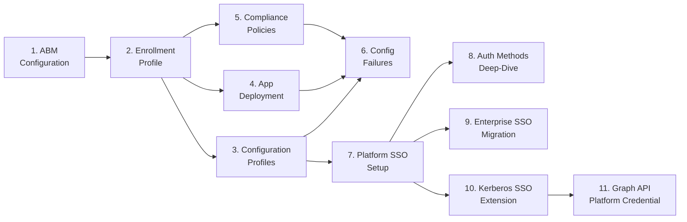

# Phase 84: Graph API Doc + NUAL Key Table - Pattern Map

**Mapped:** 2026-06-23
**Files analyzed:** 4 (1 new, 3 edits)
**Analogs found:** 4 / 4

---

## File Classification

| New/Modified File | Role | Data Flow | Closest Analog | Match Quality |
|-------------------|------|-----------|----------------|---------------|
| `docs/admin-setup-macos/11-graph-api-platform-credential.md` | guide (operations-reference, hybrid suite-anchor) | request-response (Graph API doc) | `docs/admin-setup-macos/10-kerberos-sso-extension.md` | exact (hybrid body precedent, Phase 83) |
| `docs/admin-setup-macos/08-auth-methods-deep-dive.md` (NUAL section edit) | guide (surgical section edit) | transform (table consolidation) | `docs/admin-setup-macos/08-auth-methods-deep-dive.md` lines 260-287 (self — existing section) | self-analog (replace in-place) |
| `docs/admin-setup-macos/00-overview.md` (guide-11 node addition) | overview / index | transform (Mermaid + list extension) | `docs/admin-setup-macos/00-overview.md` lines 31-32 + 52 (guide-10 node precedent, Phase 83) | exact |
| `docs/_glossary-macos.md` (Platform SSO see-also extension) | glossary | transform (see-also append) | `docs/_glossary-macos.md` line 128 + 140 + 146 (D-15 reciprocal see-also convention) | exact |

---

## Pattern Assignments

### `docs/admin-setup-macos/11-graph-api-platform-credential.md` (new guide, hybrid operations-reference)

**Analog:** `docs/admin-setup-macos/10-kerberos-sso-extension.md`

**Frontmatter pattern** (guide 10, lines 1-7):
```yaml
---
last_verified: 2026-06-22
review_by: 2026-09-22
applies_to: ADE
audience: admin
platform: macOS
---
```
For guide 11, set `last_verified: 2026-06-23` and `review_by: 2026-09-23`.

**Platform-gate header pattern** (guide 10, lines 9-11):
```markdown
> **Platform gate:** This guide covers macOS Kerberos SSO extension configuration via Intune Custom Template (.mobileconfig) for PSSO-integrated deployments.
> For Platform SSO setup (prerequisite), see [Platform SSO Setup](07-platform-sso-setup.md).
> For macOS provisioning terminology, see the [macOS Glossary](../_glossary-macos.md).
```
For guide 11, adapt the first sentence to: "This guide covers programmatic management of macOS Secure Enclave Platform Credentials via the Microsoft Graph API (`platformCredentialAuthenticationMethod`, Graph v1.0)." Keep the second and third lines verbatim (same prerequisite and glossary links).

**`## What This Guide Is NOT` disambiguation box pattern** (guide 10, lines 19-36):
```markdown
## What This Guide Is NOT

> **Terminology Trap -- [description]**
>
> [One-sentence consequence of confusion]

| Term | What It Is | Configuration Surface |
|------|-----------|----------------------|
| ...  | ...        | ...                  |
```
For guide 11, the disambiguation content is: no Create/Update operations exist (device-initiated via Company Portal registration only); this guide covers List/Get/Delete of existing credentials only. A table is optional for this guide — a short bulleted list or blockquote may suffice since there is no "wrong extension identifier" class of confusion. The RESEARCH.md body sequence calls this the first section.

**Body section sequence** (from RESEARCH.md Architecture Patterns, Pattern 1, verified against guide 10 shape):
```
1. ## What This Guide Is NOT
2. ## Resource Reference        (properties table: id, displayName, createdDateTime, keyStrength, platform, device relationship)
3. ## Operations
   ### List Platform Credentials
   ### Get a Platform Credential
   ### Delete a Platform Credential   ← [!WARNING] callout lives here
4. ## Permissions               (permissions matrix table — read vs delete; delegated vs application; national cloud)
5. ## Leaver / Offboarding Automation Pattern   (dry-run-first script)
6. ## Prerequisites
7. ## Verification
8. ## See Also
9. version-history table (bare — no H2 header; follows the --- rule as in guide 10)
```

**`## Prerequisites` pattern** (guide 10, lines 163-176):
```markdown
## Prerequisites

- **[Dependency name]:** [Condition that must be true before this guide applies.] See [Guide Name](link.md) for [what].

- **[Another dependency]:** [Condition.] [Version gate if applicable.]

  > **[Nested callout for out-of-scope note]:**
  >
  > [Explanation of what this guide does not cover and where to go instead.]
```
For guide 11: Prerequisites are (1) Platform SSO already deployed (guide 07), (2) Secure Enclave auth method in use (guide 08), (3) appropriate Graph API permissions granted to the calling identity (Entra App Registration or delegated session), (4) `Microsoft.Graph.Identity.SignIns` module installed for PowerShell examples (`Install-Module Microsoft.Graph.Identity.SignIns`).

**`## Verification` pattern** (guide 10, lines 249-252):
```markdown
## Verification

Use the following [commands/steps] as the canonical diagnostic [pair/procedure] for [topic] health. These are read-only [commands] safe to run on any enrolled device.
```
For guide 11, verification = confirming a credential exists via `Get-MgUserAuthenticationPlatformCredentialMethod` (read-only) before performing any Delete.

**`## See Also` pattern** (guide 10, lines 322-331):
```markdown
## See Also

- [Guide Name](path.md) -- [one-line description of what it provides and relevance]
- [Glossary term](../_glossary-macos.md#anchor) -- [term description relevance]
- [External link](https://...) -- [source name] ([what it is; when to use it])
```
For guide 11, See Also must include: guide 07 (PSSO setup), guide 08 (auth methods — Secure Enclave section), `_glossary-macos.md#platform-sso`, `_glossary-macos.md#secure-enclave`, the Microsoft Learn resource type page, the List/Get/Delete operation pages, and a forward cross-link to Phase 85 runbook #29 (bulk-audit; one line).

**Version-history table pattern** (guide 10, lines 335-337):
```markdown
| Date | Change | Author |
|------|--------|--------|
| 2026-06-23 | Phase 84 (GRAPH-01/GRAPH-02): initial Graph API Platform Credential guide | -- |
```
No H2 header above the table; separated from `## See Also` content by a `---` rule, matching guide 10 lines 333-337.

---

### `docs/admin-setup-macos/08-auth-methods-deep-dive.md` — NUAL section surgical edit

**Analog:** Self (the existing `## New User At Login Window` section, lines 260-287)

**Existing section to replace** (guide 08, lines 260-287 — current state):

Lines 270-276 contain the existing table to be replaced:
```markdown
| Settings Catalog Setting | Type | Purpose |
|--------------------------|------|---------|
| `Enable Create User At Login` | Boolean | Allow any organizational user to sign in and create a new local account on first login |
| `New User Authorization Mode` | Enum (Standard / Admin / Groups) | One-time permissions granted to the new user when the account is first created |
| `User Authorization Mode` | Enum (Standard / Admin / Groups) | Persistent permissions at each subsequent PSSO sign-in |
```

Lines 278-286 contain the deferred blockquote to be REMOVED entirely:
```markdown
> **Deferred item -- MDM key literals for the NUAL authorization-mode settings:**
>
> Two Settings Catalog display names control NUAL authorization: "New User Authorization Mode" (one-time
> permissions at account creation) and "User Authorization Mode" (persistent permissions at each subsequent
> sign-in), both with values Standard / Admin / Groups. The underlying MDM plist key names for **both** are
> unconfirmed from an authoritative Settings Catalog payload schema and are therefore omitted from this guide
> pending verification.
>
> See `v1.9-DEFERRED-CLEANUP.md` for tracking details (PSSO-11 / PSSO-FUT-01).
```

**Replacement table** (verified literals from RESEARCH.md Code Examples, NUAL-01):
```markdown
| Settings Catalog Display Name | MDM plist key | Type | Allowed Values | Scope |
|-------------------------------|--------------|------|----------------|-------|
| Enable Create User At Login | `EnableCreateUserAtLogin` | Boolean | `true` / `false` (default: `false`) | Prerequisite — requires `UseSharedDeviceKeys: true` in same policy |
| New User Authorization Mode | `NewUserAuthorizationMode` | String | `Standard`, `Admin`, `Groups`, `Temporary` | One-time: applied at account creation only |
| User Authorization Mode | `UserAuthorizationMode` | String | `Standard`, `Admin`, `Groups` | Persistent: re-applied at each subsequent PSSO sign-in |
```

**Notes block to add immediately below the table** (from RESEARCH.md D-05 must-surface items):
```markdown
**Notes:**
- `Temporary` is a valid value in the Apple schema for `NewUserAuthorizationMode` only. It is **not surfaced in the Intune Settings Catalog UI** — to use it, deploy via a custom profile or direct plist.
- `UserAuthorizationMode` does NOT accept `Temporary` — the allowed values are Standard / Admin / Groups only.
- **Behavioral asymmetry example:** Setting `NewUserAuthorizationMode: Admin` + `UserAuthorizationMode: Standard` grants admin rights at first login, then reverts to standard at every subsequent PSSO sign-in. The admin promotion is overwritten on the second sign-in.
```

**Version-history row to append** (guide 08, lines 331-334 — existing table):
```markdown
| 2026-06-23 | Phase 84 (NUAL-01): consolidated NUAL Settings Catalog table with verified MDM plist key literals; removed v1.9 deferred blockquote (PSSO-FUT-01 closed) | -- |
```

**Blast-radius constraint (D-06):** The ONLY changes to guide 08 are: (1) replace lines 270-276 table with the consolidated table above, (2) delete lines 278-286 deferred blockquote, (3) append the version-history row. No changes to the `## New User At Login Window` H2 title, intro prose (lines 260-269), or section separator (line 287's `---`).

---

### `docs/admin-setup-macos/00-overview.md` — guide-11 node addition

**Analog:** `docs/admin-setup-macos/00-overview.md` lines 31-32 (guide-10 node, Phase 83 precedent) and line 52 (guide-10 numbered-list item, Phase 83 precedent)

**Mermaid diagram — current last node** (line 31-32):
```
  G --> J[10. Kerberos SSO<br/>Extension]
```

**Mermaid node to append** (after line 32, inside the closing ` ``` ` fence):
```
  J --> K[11. Graph API<br/>Platform Credential]
```

**Full Mermaid after edit** (lines 19-33, showing context):
```markdown

```

**Numbered-list current last item** (line 52):
```markdown
10. **[Kerberos SSO Extension](10-kerberos-sso-extension.md)** -- Configure the Apple Kerberos SSO extension (`com.apple.AppSSOKerberos.KerberosExtension`, Type: Credential) via Intune Custom Template (.mobileconfig) for PSSO-integrated on-premises AD Kerberos authentication. Covers realm and Hosts payload, PSSO TGT sharing (`usePlatformSSOTGT`), and `app-sso platform -s` / `klist` diagnostics.
```

**New item 11 to append** (after line 52):
```markdown
11. **[Graph API: Platform Credential Management](11-graph-api-platform-credential.md)** -- Programmatic management of macOS Secure Enclave Platform Credentials via Microsoft Graph v1.0 (`platformCredentialMethods`). Covers List / Get / Delete operations (HTTP + PowerShell SDK), permissions matrix (read vs delete; delegated vs application; national cloud), and the leaver/offboarding automation pattern with mandatory dry-run step.
```

**Version-history row to append** (guide 00, lines 70-76 — existing table):
```markdown
| 2026-06-23 | Phase 84 (GRAPH-01): added guide 11 node to Mermaid diagram and item 11 to numbered list | -- |
```

---

### `docs/_glossary-macos.md` — Platform SSO see-also extension

**Analog:** `docs/_glossary-macos.md` line 128 (D-15 reciprocal `> See also:` convention)

**Current `> See also:` line** (line 128, inside the Platform SSO term's `> **Windows equivalent:**` blockquote):
```markdown
> See also: [Enterprise SSO Plug-in](#enterprise-sso-plug-in); [Entra ID SSO](_glossary.md#entra-id-sso); [Platform SSO Setup Guide](admin-setup-macos/07-platform-sso-setup.md).
```

**Target state** — extend by appending one more semicolon-separated entry to the SAME line:
```markdown
> See also: [Enterprise SSO Plug-in](#enterprise-sso-plug-in); [Entra ID SSO](_glossary.md#entra-id-sso); [Platform SSO Setup Guide](admin-setup-macos/07-platform-sso-setup.md); [Graph API: Platform Credential Management](admin-setup-macos/11-graph-api-platform-credential.md).
```

**D-15 convention details** — the pattern is also used at:
- Line 140: `> See also: [Platform SSO](#platform-sso); [Entra ID SSO](_glossary.md#entra-id-sso).`
- Line 146: `> See also: [Platform SSO](#platform-sso); [Enterprise SSO Plug-in](#enterprise-sso-plug-in); [Kerberos SSO Extension Guide](admin-setup-macos/10-kerberos-sso-extension.md).`

All three cases: a single `> See also:` line with semicolon-delimited links, appended INSIDE the existing blockquote. Do NOT create a new standalone blockquote. Do NOT insert a new line.

**Version-history row to append** (glossary lines 151-158 — existing table):
```markdown
| 2026-06-23 | Phase 84 (GRAPH-02): extended Platform SSO term see-also with guide 11 cross-link | -- |
```

---

## Shared Patterns

### Suite Frontmatter Shape
**Source:** `docs/admin-setup-macos/10-kerberos-sso-extension.md` lines 1-7
**Apply to:** Guide 11 (new file)
```yaml
---
last_verified: YYYY-MM-DD
review_by: YYYY-MM-DD   # 90 days from last_verified
applies_to: ADE
audience: admin
platform: macOS
---
```

### Platform-Gate Header
**Source:** `docs/admin-setup-macos/10-kerberos-sso-extension.md` lines 9-11 (also guide 08 lines 9-11)
**Apply to:** Guide 11 (new file)
```markdown
> **Platform gate:** This guide covers [topic description].
> For Platform SSO setup (prerequisite), see [Platform SSO Setup](07-platform-sso-setup.md).
> For macOS provisioning terminology, see the [macOS Glossary](../_glossary-macos.md).
```

### `[!WARNING]` Destructive-Operation Callout
**Source:** `docs/admin-setup-apv1/03-esp-policy.md` lines 101-102 and 104-105
**Apply to:** Guide 11, `### Delete a Platform Credential` section (mandatory per G-2)
```markdown
> [!WARNING]
> **Deleting a Platform Credential severs the Entra ID binding for the user's device and forces PSSO re-registration.** The user will see the "Registration Required" prompt on their next Conditional Access-gated sign-in. The Secure Enclave private key on the device is NOT remotely erased — only the Entra-side record is removed. Use with care in automation loops; test with `-WhatIf` before running against production users.
```
The exact wording above is from RESEARCH.md Pattern 2 (verified). The structural form `> [!WARNING]\n> **bold statement.** prose` is confirmed from `03-esp-policy.md` lines 101-102.

### Version-History Table (no H2 header)
**Source:** `docs/admin-setup-macos/10-kerberos-sso-extension.md` lines 335-337; `docs/admin-setup-macos/08-auth-methods-deep-dive.md` lines 331-334
**Apply to:** Guide 11 (new file), guides 08 / 00 / glossary (appended rows)
```markdown
---

| Date | Change | Author |
|------|--------|--------|
| YYYY-MM-DD | Phase N (REQ-ID): description | -- |
```
No `## Version History` heading. Table is preceded by a `---` rule. Author column always `--` (not a real name).

### Semicolon-Delimited See-Also Convention (D-15)
**Source:** `docs/_glossary-macos.md` lines 128, 140, 146
**Apply to:** Glossary Platform SSO term extension (D-07)
```markdown
> See also: [Term 1](#anchor); [Term 2](path#anchor); [Term 3](path); [New Entry](new-path).
```
One line, semicolons between entries, final entry ends with `.`. Appended on the SAME `> See also:` line, not on a new line.

---

## No Analog Found

All four files have close analogs. No files fall into the "no analog" category.

| File | Role | Data Flow | Reason |
|------|------|-----------|--------|
| — | — | — | All files matched |

---

## Metadata

**Analog search scope:** `docs/admin-setup-macos/`, `docs/admin-setup-apv1/`, `docs/_glossary-macos.md`
**Files scanned:** 6 analog files read in full or via targeted range
**Pattern extraction date:** 2026-06-23

**Analog file list (read):**
- `docs/admin-setup-macos/10-kerberos-sso-extension.md` (338 lines — read in full; primary guide-11 template)
- `docs/admin-setup-macos/00-overview.md` (77 lines — read in full; Mermaid + list precedent)
- `docs/admin-setup-macos/08-auth-methods-deep-dive.md` lines 1-20 + 250-310 (frontmatter + NUAL section)
- `docs/_glossary-macos.md` lines 110-162 (Authentication section + version history)
- `docs/admin-setup-apv1/03-esp-policy.md` grep-targeted lines 97-106 (`[!WARNING]` pattern)
