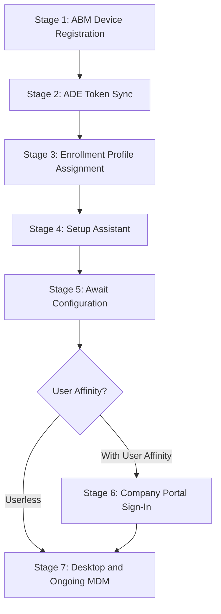

# Phase 89: PSSO Provisioning Walkthrough - Pattern Map

**Mapped:** 2026-06-24
**Files analyzed:** 4 (1 new, 3 modified)
**Analogs found:** 4 / 4

---

## File Classification

| New/Modified File | Role | Data Flow | Closest Analog | Match Quality |
|-------------------|------|-----------|----------------|---------------|
| `docs/macos-lifecycle/01-psso-provisioning-walkthrough.md` | scenario doc (lifecycle walkthrough) | request-response (operator reads → executes steps) | `docs/macos-lifecycle/00-ade-lifecycle.md` | exact — same role, same data flow, same sibling slot |
| `docs/macos-lifecycle/00-ade-lifecycle.md` (See Also edit) | lifecycle scenario doc | — | self | self-referential — add one bullet to existing "Related Guides" sub-section |
| `docs/admin-setup-macos/07-platform-sso-setup.md` (See Also edit) | admin reference guide | — | self | self-referential — add one bullet to existing "See Also" section |
| `docs/admin-setup-macos/02-enrollment-profile.md` (See Also edit) | admin reference guide | — | self | self-referential — add one bullet to existing "See Also" section |

---

## Pattern Assignments

### `docs/macos-lifecycle/01-psso-provisioning-walkthrough.md` (new scenario doc)

**Analog:** `docs/macos-lifecycle/00-ade-lifecycle.md`

---

#### Frontmatter pattern (lines 1-7)

```yaml
---
last_verified: 2026-06-20
review_by: 2026-09-20
applies_to: ADE
audience: all
platform: macOS
---
```

**New doc must use:** `last_verified: 2026-06-24`, `review_by: 2026-09-24`, `audience: all` (multi-role scenario doc, per CONTEXT.md Established Patterns).

---

#### Version gate / platform gate blockquote (line 9)

```markdown
> **Version gate:** This guide covers macOS Automated Device Enrollment (ADE) via Apple Business Manager and Microsoft Intune. For Windows Autopilot, see [Autopilot Lifecycle Overview](../lifecycle/00-overview.md). For terminology, see the [macOS Provisioning Glossary](../_glossary-macos.md).
```

**New doc must use:** Same `> **[Gate label]:**` blockquote pattern immediately after frontmatter. The label and content change for PSSO, but the format is identical.

---

#### "How to Use This Guide" pattern (lines 13-36)

```markdown
## How to Use This Guide

This is a single-file narrative covering...

**Audience:** This guide serves all three roles:

- **L1 Service Desk:** Use the "What the Admin Sees" and "Watch Out For" sections...
- **L2 Desktop Engineering:** Use the "Behind the Scenes" sections...
- **Intune Admins:** Use "What Happens" sections...

Each of the seven stages below contains four subsections:

- **What the Admin Sees** -- ...
- **What Happens** -- ...
- **Behind the Scenes** -- ...
- **Watch Out For** -- ...

**Navigation:**

- Start at **Stage 1** if...
- Jump to a **specific stage** if...
- Use the **Stage Summary Table** below...
- See the **See Also** section at the bottom...
```

**D-04 adaptation:** Reduce to a one-liner "how to use" with an L1/L2/Admin role sentence. Then place the path-divergence selector table BEFORE Prerequisites. The exact format of the one-liner is Claude's Discretion, but must reference all three roles (L1/L2/Admin).

---

#### Prerequisites checklist pattern (lines 38-49)

```markdown
### Prerequisites

All prerequisites must be met before Stage 1. Missing any prerequisite causes failures that surface at Stages 2-4.

- [ ] Apple Business Manager account configured and verified
- [ ] At least one MDM server configured in ABM and linked to Microsoft Intune
- [ ] ADE token (.p7m) downloaded from ABM and uploaded to Intune
...
```

**New doc must use:** Same `- [ ]` checkbox list format under a `### Prerequisites` H3. The new doc's prerequisites must enumerate all A2 hard-gate preconditions (CP 5.2604.0 LOB, `EnableRegistrationDuringSetup`, three-policy same-static-group, SmartCard exclusion) and must link (not copy) guide-00's ADE prereqs rather than duplicating them inline.

---

#### Mermaid pipeline diagram pattern (lines 52-65)

```markdown
## The ADE Pipeline



> Stage 6 only applies when...
```

**New doc must use:** Same fenced `mermaid` block in a `## The [Name] Pipeline` section. The new diagram shows the A1/A2 branch — a diamond node after the shared spine stages, branching to the A1 desktop path and the A2 in-SA registration path, converging at the verification step.

---

#### Stage Summary Table pattern (lines 70-80)

```markdown
## Stage Summary Table

| Stage | Actor | Location | What Happens | Key Pitfall |
|-------|-------|----------|--------------|-------------|
| 1: ABM Device Registration | Admin | ABM Portal | Device serial numbers assigned to MDM server in Apple Business Manager | Device not assigned to correct MDM server; non-ABM-linked reseller |
| 2: ADE Token Sync | System/Intune | Intune admin center | Intune syncs device list from ABM via .p7m token (auto every 24h) | Token expired; Apple ID inaccessible; ABM T&C changed |
...
```

**New doc must use:** Same column schema (`Stage | Actor | Location | What Happens | Key Pitfall`), plus a `Path` column (A1 / A2 / Both) per D-04 execution rule. Rows that are shared spine use `Both`; rows specific to A1 or A2 use the appropriate path label.

---

#### Per-stage H2 heading + 4-block anatomy pattern (lines 83-113)

```markdown
## Stage 1: ABM Device Registration

### What the Admin Sees

[paragraph]

### What Happens

1. **Item one.** explanation
2. **Item two.** explanation

### Behind the Scenes

- bullet
- bullet

**Subsection if needed:**
[table or code block]

### Watch Out For

- **Pitfall title.** explanation and resolution.
```

**New doc must use:** Exact same `## Stage N: [Name]` / `### What the Admin Sees` / `### What Happens` / `### Behind the Scenes` / `### Watch Out For` block sequence for every stage. At stages where registration state changes (D-03 stage set: A1 Stage 7 and A2 final SA stage), add two additional blocks immediately after `### Watch Out For`:

```markdown
### What the User Sees

[paragraph describing user-facing UI / notification]

### How to Verify

Open Terminal and run:

```bash
app-sso platform -s
```

Confirm both lines appear in the output:

```
Device Registration: REGISTERED
User Registration: REGISTERED
```

If either line shows a different value, see [L1 #35 macOS SSO Sign-In Failure](../l1-runbooks/35-macos-sso-sign-in-failure.md) or [L2 #27 macOS SSO Investigation](../l2-runbooks/27-macos-sso-investigation.md).
```

The verification gate pattern is sourced from guide-07 Verification section (lines 124-128) and the RESEARCH.md "Verification Gate Block" code example. No partial `app-sso platform -s` output may be cited — only the two sourced end-state lines.

---

#### Admonition style pattern (guide-00 line 66; guide-07 lines 27-36; guide-02 lines 46-59)

```markdown
> **Label:** text
```

or multi-paragraph blockquote:

```markdown
> **Label:** text
>
> More text.
>
> - bullet
> - bullet
```

**New doc must use:** Same `>` blockquote with bold label. This is the project-wide admonition style (no callout fences). The A2 divergence callout (D-02) uses the multi-paragraph form. The userless scope callout uses the single-paragraph form.

---

#### Freshness stamp on gated sections (guide-07 lines 154-155)

```markdown
> _Section provenance — `last_verified: 2026-06-20` / `review_by: 2026-09-20`. This is the highest-drift content in this guide...; re-confirm against current Microsoft Learn / Apple documentation at each 90-day review._
```

**New doc must use:** Identical format, with dates updated to `last_verified: 2026-06-24` / `review_by: 2026-09-24`. The stamp goes at the **end** of the A2 divergence callout block (inside the `>` blockquote, as a final `_italic_` line). Every macOS-26-gated section in the new doc must carry this stamp.

---

#### "See Also" three-subsection pattern (guide-00 lines 378-396)

```markdown
## See Also

**Terminology and Concepts:**

- [macOS Provisioning Glossary](../_glossary-macos.md) -- ADE, ABM, Setup Assistant, VPP terminology with Windows equivalents
- [Windows vs macOS Concept Comparison](../windows-vs-macos.md) -- ...

**Technical References:**

- [macOS Terminal Commands Reference](../reference/macos-commands.md) -- ...
- [macOS Log Paths Reference](../reference/macos-log-paths.md) -- ...
- [Network Endpoints Reference](../reference/endpoints.md#macos-ade-endpoints) -- ...

**Related Guides:**

- [Autopilot Lifecycle Overview](../lifecycle/00-overview.md) -- ...
- [Documentation Hub](../index.md) -- ...
- [Platform SSO Setup](../admin-setup-macos/07-platform-sso-setup.md) -- ...
```

**New doc must use:** Same `## See Also` H2 with three bold-labeled sub-groups (`**Terminology and Concepts:**`, `**Technical References:**`, `**Related Guides:**`). Entries use `-- ` (double-dash space) as the separator before the description. The new doc's "Related Guides" must include:

- `[macOS ADE Lifecycle Overview](00-ade-lifecycle.md)` — shared pipeline this walkthrough threads through
- `[Platform SSO Setup](../admin-setup-macos/07-platform-sso-setup.md)` — Settings Catalog policy reference
- `[Enrollment Profile Configuration](../admin-setup-macos/02-enrollment-profile.md)` — enrollment profile reference
- `[L1 #35 macOS SSO Sign-In Failure](../l1-runbooks/35-macos-sso-sign-in-failure.md)` — escalation
- `[L1 #36 macOS Secure Enclave Key](../l1-runbooks/36-macos-secure-enclave-key.md)` — escalation
- `[L2 #27 macOS SSO Investigation](../l2-runbooks/27-macos-sso-investigation.md)` — escalation

---

#### Glossary Quick Reference pattern (guide-00 lines 399-411)

```markdown
## Glossary Quick Reference

Key terms used throughout this guide. Full definitions with Windows equivalents are in the [macOS Provisioning Glossary](../_glossary-macos.md).

| Term | Definition | First Appears |
|------|-----------|---------------|
| [ADE](../_glossary-macos.md#ade) | Automated Device Enrollment -- Apple's zero-touch enrollment mechanism | Stage 1 |
| [ABM](../_glossary-macos.md#abm) | Apple Business Manager -- Apple's device and app management portal | Stage 1 |
...
```

**New doc must use:** Same `## Glossary Quick Reference` H2, same `| Term | Definition | First Appears |` column schema with glossary-anchored term links, same intro sentence pointing to the full glossary file. PSSO-specific terms to include at minimum: PSSO / Platform SSO, WPJ (Workplace Join), Secure Enclave, `app-sso platform -s`, ADE, Setup Assistant, LOB app.

---

#### Version History footer pattern (guide-00 lines 414-419)

```markdown
## Version History

| Date | Change |
|------|--------|
| 2026-06-22 | Phase 81 (SSOREF-04): added E8 Related Guides cross-link to guide 07 | -- |
| 2026-04-14 | Initial version -- complete 7-stage ADE lifecycle narrative |
```

**New doc must use:** Same `## Version History` H2 with `| Date | Change |` two-column table. Initial entry for this phase:

```markdown
| 2026-06-24 | Phase 89 (PROV-01..04): initial PSSO provisioning walkthrough (A1 + A2 paths) |
```

Note: guide-00 has a trailing ` | -- |` on some rows (author column) but guide-07 and guide-02 use ` | -- |` in a three-column schema. Prefer the guide-00 two-column form (`| Date | Change |`) for the new doc since that is the sibling.

---

### `docs/macos-lifecycle/00-ade-lifecycle.md` (See Also edit — "Related Guides")

**Analog:** Self. The existing "Related Guides" sub-section is the pattern.

**Current "Related Guides" content (lines 393-396):**

```markdown
**Related Guides:**

- [Autopilot Lifecycle Overview](../lifecycle/00-overview.md) -- Windows Autopilot 5-stage deployment pipeline (for comparison)
- [Documentation Hub](../index.md) -- Role-based entry points for all platforms
- [Platform SSO Setup](../admin-setup-macos/07-platform-sso-setup.md) -- Configure macOS Platform SSO authentication via the Settings Catalog `com.apple.extensiblesso` payload
```

**Reciprocal edit — insert after the Platform SSO Setup entry (after line 396):**

```markdown
- [PSSO Provisioning Walkthrough](01-psso-provisioning-walkthrough.md) -- End-to-end operator walkthrough threading the ADE lifecycle through Platform SSO registration for both standard post-enrollment (A1) and ADE-during-Setup-Assistant (A2, macOS 26+) paths
```

**Style rules enforced by this pattern:**
- Relative path (same directory — no `../` prefix needed for sibling in `macos-lifecycle/`)
- `-- ` double-dash space separator before description
- Description is a complete sentence fragment naming what the linked doc covers

---

### `docs/admin-setup-macos/07-platform-sso-setup.md` (See Also edit)

**Analog:** Self. The existing flat "See Also" section is the pattern.

**Current "See Also" content (lines 140-148):**

```markdown
## See Also

- [Platform SSO](../_glossary-macos.md#platform-sso)
- [Secure Enclave](../_glossary-macos.md#secure-enclave)
- [Enterprise SSO Plug-in](../_glossary-macos.md#enterprise-sso-plug-in)
- [Configuration Profiles](03-configuration-profiles.md)
- [macOS ADE Lifecycle Overview](../macos-lifecycle/00-ade-lifecycle.md)
- [macOS Capability Matrix — Authentication](../reference/macos-capability-matrix.md#authentication) -- macOS vs Windows auth-method capability comparison and hardware/version gates
```

**Key style observation:** Guide-07 uses a flat single-level list (no bold sub-groups), and only some entries have ` -- ` descriptions. The `macOS ADE Lifecycle Overview` entry has no description. The new entry should match the style of entries that do have descriptions (the matrix entry).

**Reciprocal edit — insert after the `macOS ADE Lifecycle Overview` entry (after line 146):**

```markdown
- [PSSO Provisioning Walkthrough](../macos-lifecycle/01-psso-provisioning-walkthrough.md) -- End-to-end operator walkthrough from enrollment profile through Platform SSO registration (standard post-enrollment and ADE-during-Setup-Assistant paths)
```

**Style rules enforced by this pattern:**
- Cross-directory relative path: `../macos-lifecycle/01-psso-provisioning-walkthrough.md`
- The insertion point is explicitly after the `macOS ADE Lifecycle Overview` entry per RESEARCH.md
- No H3 sub-grouping — guide-07's See Also is a flat list

---

### `docs/admin-setup-macos/02-enrollment-profile.md` (See Also edit)

**Analog:** Self. The existing flat "See Also" section is the pattern.

**Current "See Also" content (lines 129-134):**

```markdown
## See Also

- [ABM Configuration](01-abm-configuration.md)
- [Configuration Profiles](03-configuration-profiles.md)
- [macOS ADE Lifecycle Overview](../macos-lifecycle/00-ade-lifecycle.md)
- [macOS Provisioning Glossary](../_glossary-macos.md)
```

**Key style observation:** Guide-02's See Also is a flat list with no ` -- ` descriptions on any entry. All entries are bare `[Text](path)` links. The new entry must match this style (no description appended).

**Reciprocal edit — insert after the `macOS ADE Lifecycle Overview` entry (after line 132):**

```markdown
- [PSSO Provisioning Walkthrough](../macos-lifecycle/01-psso-provisioning-walkthrough.md)
```

**Style rules enforced by this pattern:**
- Cross-directory relative path: `../macos-lifecycle/01-psso-provisioning-walkthrough.md`
- NO ` -- ` description — guide-02's See Also has no descriptions on any entry; adding one would break house style for this file
- The insertion point is after `macOS ADE Lifecycle Overview` per RESEARCH.md

---

## Shared Patterns

### Cross-link format

**Source:** All three existing guide files (guide-00 lines 382-396; guide-07 lines 140-148; guide-02 lines 129-134)
**Apply to:** All cross-links in new doc and all See Also edits

```markdown
[Link Text](relative/path/to/file.md)
[Link Text with anchor](relative/path/to/file.md#section-anchor)
```

Rules:
- Always relative paths (never absolute, never `http://` for internal docs)
- Parent-directory links use `../` prefix
- Same-directory links use bare filename
- Anchor links use `#kebab-case-heading-text`

---

### Admonition / blockquote style

**Source:** `docs/macos-lifecycle/00-ade-lifecycle.md` line 66; `docs/admin-setup-macos/07-platform-sso-setup.md` lines 27-36; `docs/admin-setup-macos/02-enrollment-profile.md` lines 46-59
**Apply to:** All callouts in the new doc (version gate, userless scope, A2 divergence, freshness stamp)

```markdown
> **Label:** Single-paragraph content.

> **Label:** Multi-paragraph callout.
>
> Second paragraph.
>
> - Bullet list item
> - Another item
```

No fenced callout syntax (no `:::note`, no `<Callout>` components). Strictly `>` Markdown blockquotes.

---

### Verification checklist format

**Source:** `docs/admin-setup-macos/07-platform-sso-setup.md` lines 122-129
**Apply to:** `### How to Verify` blocks in the new doc

```markdown
- [ ] Intune portal: navigate to **Devices** > **Configuration** > [profile name] > **Device status** — status shows **Succeeded** for enrolled devices.
- [ ] Device-side: open Terminal and run `app-sso platform -s`. Confirm the output shows:
  - `Device Registration: REGISTERED`
  - `User Registration: REGISTERED`
```

The two `app-sso platform -s` output strings are the only permitted verification output. Do not cite partial or intermediate states.

---

### Inline bold navigation paths

**Source:** `docs/admin-setup-macos/07-platform-sso-setup.md` lines 42-45; `docs/admin-setup-macos/02-enrollment-profile.md` lines 29-33
**Apply to:** Any "What the Admin Sees" block that describes portal navigation

```markdown
Navigation: **Devices** > **Manage devices** > **Configuration** > **Create** > **New policy**
```

Bold each segment, use ` > ` (space-chevron-space) as separator.

---

### Configuration table format

**Source:** `docs/admin-setup-macos/07-platform-sso-setup.md` lines 69-82; `docs/admin-setup-macos/02-enrollment-profile.md` lines 38-44
**Apply to:** Any "What Happens" block listing settings or requirements (including A2 preconditions table)

```markdown
| Field | Value | Scope |
|-------|-------|-------|
| Extension Identifier | `com.microsoft.CompanyPortalMac.ssoextension` | All |
```

or:

```markdown
| Setting | Options | Default | Notes |
|---------|---------|---------|-------|
```

Use `code` formatting for literal values (registry keys, identifiers, version numbers). Column schema varies by context; use the most appropriate schema.

---

## No Analog Found

None. All four files have direct analogs in the codebase. The new scenario doc mirrors guide-00 exactly; the three See Also edits modify self-contained sections that serve as their own pattern.

---

## Metadata

**Analog search scope:** `docs/macos-lifecycle/`, `docs/admin-setup-macos/`
**Files read:** 4 (guide-00, guide-07, guide-02, CONTEXT.md, RESEARCH.md)
**Pattern extraction date:** 2026-06-24

**Critical constraints carried forward to planner:**
1. The path-divergence selector table is the FIRST content element after frontmatter (D-04 — before Prerequisites).
2. Only the two sourced `app-sso platform -s` end-state lines may be cited — no partial states (D-03).
3. See Also edit to guide-02 uses NO description suffix (house style for that file is bare links).
4. See Also edit to guide-07 uses a ` -- ` description (house style for that file matches the matrix entry).
5. Freshness stamp `last_verified: 2026-06-24 / review_by: 2026-09-24` goes on every A2/macOS-26-gated block.
6. "Behind the Scenes" blocks must link to guide-00/07/02 rather than repeat their content (link-not-copy).
7. Nav hub files (`docs/index.md`, `common-issues.md`, `quick-ref-l2.md`, `decision-trees/06-macos-triage.md`) must NOT be edited in this phase.
```
