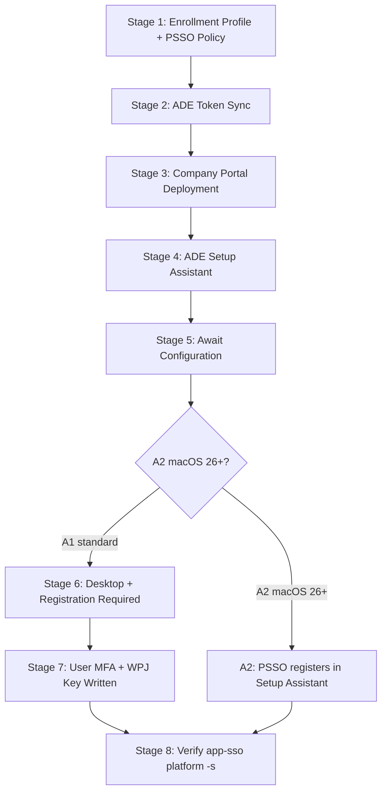

# Phase 89: PSSO Provisioning Walkthrough - Research

**Researched:** 2026-06-24
**Domain:** macOS Platform SSO provisioning documentation — ADE lifecycle, PSSO configuration, ADE-during-Setup-Assistant zero-click path
**Confidence:** HIGH (all key facts verified against Microsoft Learn official docs, updated 2026-06-23)

---

<user_constraints>
## User Constraints (from CONTEXT.md)

### Locked Decisions

**D-01 (Per-stage anatomy — Hybrid):** Each stage uses guide-00's 4-block anatomy (What the Admin Sees / What Happens / Behind the Scenes / Watch Out For) PLUS an added "What the User Sees" block and a "How to Verify" block at user-facing/registration stages. The extra two blocks are tied exactly to the D-03 "registration state changes" stage set (= A1 Stage 7 and A2 final SA verification gate). Keep "Behind the Scenes" link-heavy (cross-ref 00/07/02) to respect link-not-copy.

**D-02 (Two-path layout — Single shared spine + delimited macOS-26 divergence callout):** One shared stage spine for the common path, with a clearly-delimited multi-stage macOS-26+ divergence callout beginning at the Company Portal stage and extending downstream wherever A2 differs. The divergence callout covers: (a) CP 5.2604.0 LOB floor vs VPP, (b) three-policy same-Assigned-static-user-group rule (most-prominent callout — highest-risk misconfig), (c) EnableRegistrationDuringSetup, (d) SmartCard exclusion, (e) wipe-only misconfiguration recovery, (f) A2 reaches REGISTERED inside Setup Assistant with no desktop notification — relocate A2 final verification gate accordingly. A2 is single-point divergence (CP onward), not pervasive.

**D-03 (Verification gate strategy — Gates at registration stages + per-path final):** Place `app-sso platform -s` gates at stages where registration state actually changes (A1: "Registration Required" desktop stage / user MFA stage; A2: inside Setup Assistant before desktop) plus a final confirmation gate per path. Never fabricate partial `app-sso platform -s` output — only the full end-state is sourced (Device Registration: REGISTERED / User Registration: REGISTERED). Label each gate explicitly Device-Registration vs User-Registration. Keep the "userless devices never register" note as a doc-level scope callout, not a gate.

**D-04 (Orientation / opening structure — Selector-first, compact orientation):** Doc opens with the path-divergence selector/table (first content after frontmatter), followed by compact Prerequisites and Stage Summary Table. "How to use" reduced to a one-liner. The compact Prerequisites enumerates every A2 hard-gate precondition (CP 5.2604.0 LOB, EnableRegistrationDuringSetup, three-policy same-static-group, SmartCard exclusion) and links (not copies) guide-00's ADE prereqs. Stage Summary Table has a Path column or A1/A2-split rows.

### Claude's Discretion

- Exact wording/phrasing of stages, callout admonition style, and table column choices — within the structural decisions above.
- Sibling consistency: match guide-00's frontmatter shape, "See Also" structure, and Glossary Quick Reference / Version History footers so guide 01 reads as a true sibling.

### Deferred Ideas (OUT OF SCOPE)

None. Migration, glossary/matrix, navigation hubs, and harness are scoped to Phases 90-93.
</user_constraints>

---

<phase_requirements>
## Phase Requirements

| ID | Description | Research Support |
|----|-------------|------------------|
| PROV-01 | Consolidated walkthrough for standard post-enrollment path with per-stage "admin sees / user sees / how to verify" structure mirroring guide 00 | D-01 hybrid anatomy confirmed; A1 8-stage sequence confirmed from SUMMARY.md + guide-00 structural conventions mapped |
| PROV-02 | ADE-during-Setup-Assistant zero-click path documented: CP 5.2604.0 LOB, EnableRegistrationDuringSetup, three-policy same-static-group, SmartCard exclusion, wipe-only recovery, prominent OS-26 gate callout | All facts VERIFIED against Microsoft Learn (updated 2026-06-23); SmartCard exclusion confirmed; recovery procedure confirmed |
| PROV-03 | Opens with path-divergence selector; app-sso platform -s gates at each applicable stage; user-affinity-only scope called out | Selector-first structure confirmed (D-04); app-sso platform -s command and end-state output VERIFIED; userless scope pattern confirmed from guide-00 Stage 6/7 |
| PROV-04 | Cross-links link-not-copy to 00/02/07 and L1 #35/#36 + L2 #27; reciprocal See Also added to 00/07/02 | All target files confirmed at known paths; See Also section anatomy mapped from guide-00; existing See Also sections in 07/02/00 identified for reciprocal edit insertion points |
</phase_requirements>

---

## Summary

Phase 89 authors a single consolidated provisioning walkthrough (`docs/macos-lifecycle/01-psso-provisioning-walkthrough.md`) covering two PSSO delivery paths: A1 (standard post-enrollment, all supported macOS) and A2 (ADE-during-Setup-Assistant, macOS 26+ hard gate). All technical facts for both paths are now VERIFIED at HIGH confidence against Microsoft Learn official documentation dated 2026-06-23. No research gaps block this phase.

The sibling guide (`docs/macos-lifecycle/00-ade-lifecycle.md`) has been fully read. Its conventions — frontmatter shape, 4-block per-stage anatomy, Stage Summary Table, See Also structure, Glossary Quick Reference, Version History footer — are documented below for faithful replication. The three cross-link targets (guides 00, 07, 02) are confirmed at their paths; their existing See Also sections have been inspected to locate the reciprocal edit insertion points.

All three plan-time verification flags from SUMMARY.md "Open Gaps" have been resolved: macOS 26 GA is confirmed, CP 5.2604.0 LOB floor is confirmed, and `app-sso platform -s` usage is confirmed with exact command and sourced end-state. The doc must carry `last_verified: 2026-06-24` / `review_by: 2026-09-24` on all A2 / macOS-26-gated sections per project convention.

**Primary recommendation:** Plan as a single-file documentation task producing one new file + three targeted See Also edits. No code, no packages, no testing infrastructure. The planner should structure as Wave 0 (anchor audit) + Wave 1 (new file + See Also edits) + Wave 2 (verification).

---

## Architectural Responsibility Map

| Capability | Primary Tier | Secondary Tier | Rationale |
|------------|-------------|----------------|-----------|
| Provisioning walkthrough doc | Documentation layer | — | New scenario doc in `docs/macos-lifecycle/`; no code |
| Reciprocal See Also edits | Documentation layer | — | Content-phase edits to existing guides 00/07/02 |
| Cross-link targets (runbooks) | Reference layer | — | L1 #35/#36 + L2 #27 already exist; link only |
| Stage verification command | Terminal / Device | — | `app-sso platform -s` runs on macOS device; doc cites the command + expected output |

---

## Standard Stack

No packages to install. This is a pure documentation phase.

### Doc Authoring Conventions (from existing codebase)

| Convention | Value | Source |
|-----------|-------|--------|
| File format | Markdown with YAML frontmatter | guide-00 |
| Frontmatter fields | `last_verified`, `review_by`, `applies_to`, `audience`, `platform` | guide-00 |
| Scenario doc location | `docs/macos-lifecycle/` | ARCHITECTURE in SUMMARY.md |
| Audience for multi-role docs | `audience: all` | CONTEXT.md / SUMMARY.md |
| applies_to value | `ADE` | guide-00 |
| platform value | `macOS` | guide-00 |
| Link format | `[Text](relative-path.md)` — relative paths within docs/ tree | guide-00, guide-07 |
| Admonition style | `> **Label:** text` blockquote (not callout fences) | guide-07 "ADE-only path" box; guide-00 "Stage 6" note |
| Stage Summary Table columns | Stage, Actor, Location, What Happens, Key Pitfall | guide-00 (add Path column for this doc per D-04) |
| Version History footer | `| Date | Change |` table | guide-00 |
| Glossary Quick Reference | `| Term | Definition | First Appears |` table | guide-00 |

### Package Legitimacy Audit

**Not applicable** — this phase installs no external packages.

---

## Sibling Guide Conventions (guide-00 anatomy — the template to mirror)

### Frontmatter Shape

```yaml
---
last_verified: 2026-06-24
review_by: 2026-09-24
applies_to: ADE
audience: all
platform: macOS
---
```

Note: guide-00 uses `audience: all`; guide-07 uses `audience: admin`. The new doc is `audience: all` (per CONTEXT.md "Established Patterns" and SUMMARY.md architecture decision).

### Opening Structure (guide-00 model → D-04 adaptation)

Guide-00 opens with:
1. Version gate blockquote
2. H1 title
3. "How to Use This Guide" (paragraph + role breakdown + nav bullets)
4. Prerequisites checklist
5. Pipeline diagram (Mermaid)
6. Stage Summary Table

D-04 adaptation (per locked decision):
1. Version gate blockquote
2. H1 title
3. One-liner "How to Use" with L1/L2/Admin role line
4. **Path-divergence selector/table** (FIRST content element — selector before prereqs)
5. Compact Prerequisites (enumerates A2 hard-gate preconditions + links guide-00 ADE prereqs)
6. Stage Summary Table with Path column

### Per-Stage 4-Block Anatomy (guide-00 model)

```
### What the Admin Sees
### What Happens
### Behind the Scenes
### Watch Out For
```

D-01 addition at registration stages:
```
### What the User Sees       ← added at stages where registration state changes
### How to Verify            ← added at stages where registration state changes
```

### See Also Structure (guide-00 model)

Three sub-sections:
- **Terminology and Concepts:** glossary, cross-platform comparison
- **Technical References:** commands ref, log paths, endpoints
- **Related Guides:** cross-links to sibling and parent guides

New doc's See Also must include links to: `00-ade-lifecycle.md`, `07-platform-sso-setup.md`, `02-enrollment-profile.md`, L1 #35, L1 #36, L2 #27.

### Version History Footer (guide-00 model)

```markdown
| Date | Change |
|------|--------|
| 2026-06-24 | Phase 89 (PROV-01..04): initial PSSO provisioning walkthrough | -- |
```

### Glossary Quick Reference (guide-00 model)

```markdown
| Term | Definition | First Appears |
|------|-----------|---------------|
| [PSSO](...) | Platform Single Sign-On | Stage X |
```

---

## Architecture Patterns

### System Architecture Diagram

```
Operator reads doc ──► Path-divergence selector
                              │
                    ┌─────────┴──────────┐
                    ▼                    ▼
              A1 Standard         A2 ADE-during-SA
              (all macOS)         (macOS 26+ only)
                    │                    │
              Shared spine        Diverges at CP stage
              (Stages 1-6)        (CP LOB + 3-policy rule)
                    │                    │
              "Registration      PSSO registers INSIDE
               Required"          Setup Assistant
               at desktop         (no notification)
                    │                    │
              app-sso gate       app-sso gate
              at desktop         before desktop
                    │                    │
                    └─────────┬──────────┘
                              ▼
                     Operator verifies:
                     Device Registration: REGISTERED
                     User Registration: REGISTERED
```

### Recommended Doc Structure

```
docs/macos-lifecycle/
├── 00-ade-lifecycle.md         # Existing sibling — See Also edit target
└── 01-psso-provisioning-walkthrough.md   # NEW (this phase)

docs/admin-setup-macos/
├── 02-enrollment-profile.md    # Existing — See Also edit target
└── 07-platform-sso-setup.md    # Existing — See Also edit target

docs/l1-runbooks/
├── 35-macos-sso-sign-in-failure.md   # Confirmed exists — link target only
└── 36-macos-secure-enclave-key.md    # Confirmed exists — link target only

docs/l2-runbooks/
└── 27-macos-sso-investigation.md     # Confirmed exists — link target only
```

### Pattern 1: Path-Divergence Selector (D-04)

The first content element after frontmatter is a selector table identifying which path applies. This is the structural innovation vs guide-00.

```markdown
## Which Path Is Right for You?

| Path | macOS Requirement | Company Portal | PSSO Registers | Use When |
|------|-------------------|---------------|----------------|----------|
| **A1 — Standard post-enrollment** | macOS 13+ | 5.2404.0+ (VPP) | At desktop, after "Registration Required" notification | Most deployments; all supported macOS versions |
| **A2 — ADE-during-Setup-Assistant** | macOS 26+ (hard gate) | 5.2604.0+ (LOB only — NOT VPP) | Inside Setup Assistant; no desktop notification | New enrollments on macOS 26+ requiring zero-click PSSO |

> **Userless devices:** Devices enrolled without user affinity never reach PSSO registration. This walkthrough covers user-affinity enrollments only. For userless (shared/kiosk) devices, see [macOS ADE Lifecycle](00-ade-lifecycle.md).
```

### Pattern 2: Stage that Receives the Two D-01 Extra Blocks

The D-03 "registration state changes" stage set determines exactly which stages get "What the User Sees" + "How to Verify":

**A1:** Stage 7 ("Registration Required" + user MFA + WPJ key written) — this is where Device Registration and User Registration both transition to REGISTERED.

**A2:** Final SA stage ("PSSO registers inside Setup Assistant") — this is the single-shot registration event; verification runs immediately after Setup Assistant exits.

No other stages receive the two extra blocks. This keeps the template regular (D-01 execution rule: tie extra blocks to the D-03 stage set).

### Pattern 3: A2 Divergence Callout (D-02)

The divergence callout begins at the Company Portal stage and extends downstream through the PSSO-in-SA stage. Structure per D-02:

```markdown
> **macOS 26+ ADE-during-Setup-Assistant path (A2) — diverges here.**
>
> All requirements below must be met BEFORE enrollment starts. A single misconfiguration requires a **device wipe** to recover — there is no in-place fix.
>
> **Most prominent risk — three-policy same-Assigned-static-user-group rule:**
> The Platform SSO Settings Catalog policy, the Company Portal LOB app assignment, and the ADE enrollment profile must all be assigned to the **same Assigned (static) user groups**. Dynamic groups break this. Device groups break this. Different groups for different policies break this. Recovery: wipe and re-enroll.
>
> | A2 Requirement | Value |
> |---------------|-------|
> | macOS version | macOS 26+ (hard gate — no earlier macOS) |
> | Company Portal version | 5.2604.0+ (LOB app — NOT VPP) |
> | Additional Settings Catalog field | Enable Registration During Setup: Enabled |
> | Group type | Assigned (static) user groups only |
> | Three-policy same-group | PSSO catalog + CP LOB + ADE enrollment profile → same static groups |
> | SmartCard | NOT supported on A2 path — use Secure Enclave (recommended) or Password |
> | Misconfiguration recovery | Device wipe required — no in-place fix |
> | PSSO registration event | Inside Setup Assistant — no "Registration Required" notification at desktop |
>
> _last_verified: 2026-06-24 / review_by: 2026-09-24. Re-confirm macOS 26 GA status and CP 5.2604.0 floor against current Microsoft Learn at each 90-day review._
```

### Pattern 4: Verification Gate (D-03)

Exactly two `app-sso platform -s` gates per path:

**A1 gates:**
- Gate 1 — after user completes MFA at "Registration Required" notification (Device Registration check)
- Gate 2 — final gate after desktop confirmed (both REGISTERED lines)

**A2 gates:**
- Gate 1 — immediately after Setup Assistant exits (single-shot: both Device + User REGISTERED)
- (No "Registration Required" notification to gate at — A2 registers in SA)

Output to cite verbatim (per D-03 "never fabricate"):

```bash
app-sso platform -s
```

Sourced end-state (and ONLY this end-state — no partial states):
```
Device Registration: REGISTERED
User Registration: REGISTERED
```

Source: `learn.microsoft.com/en-us/intune/device-configuration/settings-catalog/configure-platform-sso-macos` (Verification section) + `learn.microsoft.com/en-us/entra/identity/devices/troubleshoot-macos-platform-single-sign-on-extension` [VERIFIED: Microsoft Learn]

### Anti-Patterns to Avoid

- **Duplicating guide-00/02/07 content inline.** Link-not-copy is a locked convention. Every "Behind the Scenes" paragraph that would repeat existing reference content must instead say "See [guide X, section Y]" and link.
- **Placing the selector after Prerequisites.** D-04 is explicit: selector is the FIRST content element after frontmatter.
- **Asserting A2 sends a "Registration Required" notification.** A2 registers inside Setup Assistant with no desktop notification. The verification gate for A2 runs immediately after SA exits — not at a notification.
- **Using `security find-certificate` for PSSO verification.** Guide-00 Stage 6 explicitly warns: "From August 2025, new registrations use Secure Enclave storage by default — use `app-sso platform -s` to verify registration (not `security find-certificate`, which returns false negatives for Secure Enclave-stored keys)."
- **Assigning the PSSO Settings Catalog policy to device groups.** Microsoft explicitly states this is not supported for devices with user affinity (verified in guide-07 Step 4 and Microsoft Learn).
- **Fabricating intermediate `app-sso platform -s` output.** D-03 execution rule: only cite the verified full end-state strings. No intermediate or partial states.
- **Editing nav hubs in this phase.** `docs/index.md`, `common-issues.md`, `quick-ref-l2.md`, `decision-trees/06-macos-triage.md` are navigation-last (Phase 92 only).
- **Adding content to guides 00/02/07 beyond See Also edits.** These guides are frozen for v1.11 except for reciprocal See Also additions.

---

## Don't Hand-Roll

| Problem | Don't Build | Use Instead | Why |
|---------|-------------|-------------|-----|
| PSSO state verification | Custom verification script | `app-sso platform -s` (built-in macOS) | Microsoft's official verification command; sourced in Learn docs |
| ADE prerequisites check | Custom pre-flight doc section | Link to `00-ade-lifecycle.md` Prerequisites | Link-not-copy convention; guide-00 already documents these |
| PSSO Settings Catalog config | Inline config table | Link to `07-platform-sso-setup.md` | Link-not-copy convention; guide-07 already documents all fields |
| Enrollment profile config | Inline config table | Link to `02-enrollment-profile.md` | Link-not-copy convention; guide-02 already documents all fields |
| PSSO failure triage | Inline troubleshooting section | Cross-link to L1 #35, L1 #36, L2 #27 | PROV-04 locked: no inline troubleshooting |

**Key insight:** The walkthrough stitches the journey (ordering, what to expect, verification gates). It does not duplicate the reference content that already exists in the per-setting admin guides.

---

## PSSO Provisioning Facts — Authoritative Reference Table

All facts below are VERIFIED against Microsoft Learn official documentation (updated 2026-06-23) unless tagged otherwise.

### Path A1 — Standard Post-Enrollment

| Fact | Value | Confidence | Source |
|------|-------|------------|--------|
| Applies to | All supported macOS (13+) | HIGH | [VERIFIED: Microsoft Learn] |
| Company Portal version floor | 5.2404.0 | HIGH | [VERIFIED: Microsoft Learn configure-platform-sso-macos, Prerequisites] |
| Company Portal deployment method | VPP (Apps and Books) or DMG/PKG | HIGH | [VERIFIED: Microsoft Learn] |
| PSSO Settings Catalog additional field | None beyond base PSSO config | HIGH | [VERIFIED: Microsoft Learn configure-platform-sso-during-enrollment — Step 1] |
| PSSO registration event | Desktop — user taps "Registration Required" notification → MFA → WPJ Secure Enclave key written | HIGH | [VERIFIED: Microsoft Learn configure-platform-sso-macos Step 5] |
| User notification text | "Registration required" in Notification Center | HIGH | [VERIFIED: Microsoft Learn configure-platform-sso-macos Step 5 screenshot description] |
| Post-registration verification | `app-sso platform -s` → Device Registration: REGISTERED + User Registration: REGISTERED | HIGH | [VERIFIED: Microsoft Learn troubleshoot + guide-07 Verification section] |
| Userless devices | Never reach PSSO registration — no WPJ key written | HIGH | [VERIFIED: guide-00 Stage 6, guide-07 Step 4 assignment note] |
| macOS Sequoia re-registration bug | macOS 15.0–15.2 re-registration loop bug; fixed in macOS 15.3 | HIGH | [VERIFIED: guide-07 Prerequisites; troubleshoot-macos-platform doc] |

### A1 Ordered Stages (8 stages)

| # | Stage | Actor | Key Event |
|---|-------|-------|-----------|
| 1 | Enrollment profile configured | Admin | PSSO Settings Catalog policy + enrollment profile (user affinity, modern auth, Await Configuration: Yes) |
| 2 | ADE token sync | System | Device appears in Intune after ABM sync |
| 3 | PSSO Settings Catalog policy assigned | Admin | Policy assigned to static user groups (not device groups) |
| 4 | Company Portal deployed (VPP ≥5.2404.0) | Admin | Required app; must be deployed before device reaches Stage 7 |
| 5 | ADE Setup Assistant | Device/User | Entra credential prompt at SA; ACME cert issued; modern authentication |
| 6 | Await Configuration | Device | Device holds at "Awaiting final configuration" while policies deliver |
| 7 | Desktop + "Registration Required" | User | User taps notification → MFA → WPJ Secure Enclave key written → Device/User REGISTERED |
| 8 | Verify | Admin/User | `app-sso platform -s` → both REGISTERED lines |

### Path A2 — ADE-during-Setup-Assistant (macOS 26+)

| Fact | Value | Confidence | Source |
|------|-------|------------|--------|
| macOS version gate | macOS 26+ (hard gate — no earlier macOS) | HIGH | [VERIFIED: Microsoft Learn configure-platform-sso-during-enrollment, Prerequisites] |
| Company Portal version floor | 5.2604.0 | HIGH | [VERIFIED: Microsoft Learn configure-platform-sso-during-enrollment, Step 2] |
| Company Portal deployment method | Line-of-business (LOB) app — NOT VPP | HIGH | [VERIFIED: Microsoft Learn configure-platform-sso-during-enrollment, Step 2: "add the Company Portal as a line-of-business (LOB) app"] |
| Additional Settings Catalog field | Authentication > Extensible single sign-on > Platform SSO > Enable Registration During Setup: Enabled | HIGH | [VERIFIED: Microsoft Learn configure-platform-sso-during-enrollment, Step 1 table] |
| Password method additional field | Authentication > Extensible single sign-on > Platform SSO > Enable Create First User During Setup: Enabled | HIGH | [VERIFIED: Microsoft Learn configure-platform-sso-during-enrollment, Step 1] |
| Three-policy same-group rule | PSSO Settings Catalog policy + Company Portal LOB app + ADE enrollment profile → same Assigned (static) user groups | HIGH | [VERIFIED: Microsoft Learn configure-platform-sso-during-enrollment, "Before you begin": "Assign all the policies to the same Assigned (static) user groups"] |
| Dynamic groups | NOT supported — breaks A2 path | HIGH | [VERIFIED: Microsoft Learn configure-platform-sso-during-enrollment: "This feature doesn't work with dynamic groups"] |
| Device groups | NOT supported — breaks A2 path | HIGH | [VERIFIED: Microsoft Learn configure-platform-sso-during-enrollment: "This feature doesn't work with device groups"] |
| SmartCard exclusion | NOT available on A2 path — use Secure Enclave (recommended) or Password | HIGH | [VERIFIED: guide-07 "Smart Card Exclusion" section; SUMMARY.md HIGH row] |
| Registration event location | Inside Setup Assistant — before desktop | HIGH | [VERIFIED: Microsoft Learn configure-platform-sso-during-enrollment intro: "When users arrive at the desktop, they're already signed in"] |
| Desktop notification | No "Registration Required" notification — registration completes in SA | HIGH | [VERIFIED: CONTEXT.md D-02, D-03 execution rules; SUMMARY.md A2 description] |
| Misconfiguration recovery | Wipe device — no in-place fix | HIGH | [VERIFIED: Microsoft Learn configure-platform-sso-during-enrollment "Remove Platform SSO and reenroll if steps are misconfigured": "Wiping is required as it restarts the enrollment process"] |
| "Unable to sign in" during SA | CP still downloading — tap "Try Again" until CP finishes | HIGH | [VERIFIED: Microsoft Learn configure-platform-sso-during-enrollment + troubleshoot doc "Unable to sign-in – Single sign-on application is missing"] |
| ADE enrollment profile settings required | User Affinity: Enroll with User Affinity; Authentication: Setup Assistant with modern authentication; Await final configuration: Yes; Locked enrollment: Yes | HIGH | [VERIFIED: Microsoft Learn configure-platform-sso-during-enrollment, Step 3 table] |
| GA status | Generally available as of 2026 (MS Learn doc dated 2026-06-23; title confirms GA: "is now generally available") | HIGH | [VERIFIED: Microsoft Learn configure-platform-sso-during-enrollment metadata `updated_at: 2026-06-23`; TechCommunity blog title "is now generally available"] |

### Verification Command

| Command | When to Run | Expected End-State Output |
|---------|-------------|--------------------------|
| `app-sso platform -s` | A1: after "Registration Required" + MFA completes at desktop; A2: after Setup Assistant exits | `Device Registration: REGISTERED` + `User Registration: REGISTERED` |

Source: [VERIFIED: Microsoft Learn troubleshoot-macos-platform-single-sign-on-extension "Report an issue" section; guide-07 Verification checklist; configure-platform-sso-macos Step 6]

**Critical constraint (D-03):** Only cite the above two lines. Do NOT invent intermediate output such as "Device Registration: PENDING" or "User Registration: NOT REGISTERED" — these intermediate states are not sourced and must not appear in the doc.

---

## Existing Guide Inspection — Reciprocal See Also Edit Targets

### guide-00 (`docs/macos-lifecycle/00-ade-lifecycle.md`)

Current "See Also > Related Guides" section already contains:
- `[Platform SSO Setup](../admin-setup-macos/07-platform-sso-setup.md)` (added Phase 81)

**Reciprocal edit required (Phase 89):** Add to "See Also > Related Guides":
- `[PSSO Provisioning Walkthrough](01-psso-provisioning-walkthrough.md)` — end-to-end walkthrough threading the ADE lifecycle through Platform SSO registration for both standard and ADE-during-SA paths

Insertion point: under "Related Guides" after the existing Platform SSO Setup entry.

### guide-07 (`docs/admin-setup-macos/07-platform-sso-setup.md`)

Current "See Also" section contains: glossary links, config profiles link, ADE lifecycle link, capability matrix link. Does NOT currently link to a provisioning walkthrough.

**Reciprocal edit required (Phase 89):** Add to "See Also":
- `[PSSO Provisioning Walkthrough](../macos-lifecycle/01-psso-provisioning-walkthrough.md)` — end-to-end operator walkthrough from enrollment profile to PSSO-registered end user

Insertion point: after the existing `[macOS ADE Lifecycle Overview]` entry.

### guide-02 (`docs/admin-setup-macos/02-enrollment-profile.md`)

Current "See Also" section contains: ABM Configuration, Configuration Profiles, macOS ADE Lifecycle Overview, macOS Provisioning Glossary. Does NOT currently link to a provisioning walkthrough.

**Reciprocal edit required (Phase 89):** Add to "See Also":
- `[PSSO Provisioning Walkthrough](../macos-lifecycle/01-psso-provisioning-walkthrough.md)` — end-to-end walkthrough using this enrollment profile configuration as a prerequisite

Insertion point: after the existing `[macOS ADE Lifecycle Overview]` entry.

---

## Common Pitfalls

### Pitfall 1: Three-Policy Same-Static-Group Rule (A2 — HIGHEST RISK)

**What goes wrong:** Any of the three required A2 policies (PSSO Settings Catalog, Company Portal LOB app, ADE enrollment profile) is assigned to a different group, a dynamic group, or a device group. PSSO during Setup Assistant fails. Recovery requires a device wipe.
**Why it happens:** Admins assign the PSSO policy to a broad existing user group and the CP app to a device group for convenience — or use dynamic groups for self-managing membership.
**How to avoid:** Create new dedicated Assigned (static) user groups for the A2 path. Assign all three policies to exactly those groups before any device enrolls.
**Warning signs:** "Unable to sign in" during Setup Assistant that persists after "Try Again" (CP installation is fine but PSSO policy didn't reach the device); device reaches desktop without PSSO registered.
[Source: VERIFIED — Microsoft Learn configure-platform-sso-during-enrollment]

### Pitfall 2: VPP Company Portal on A2 Path

**What goes wrong:** Admin deploys Company Portal via VPP (standard method for A1) instead of as a LOB app. A2 PSSO registration fails.
**Why it happens:** Admins reuse their existing VPP Company Portal deployment. The distinction is non-obvious.
**How to avoid:** A2 requires Company Portal 5.2604.0+ uploaded as a line-of-business (LOB/PKG) app via `Apps > All Apps > Create`. Remove the VPP assignment from the A2 group (or create separate groups). VPP and LOB Company Portal can coexist in a fleet but must be assigned correctly per path.
**Warning signs:** CP version shows < 5.2604.0 or app is deployed via VPP license in the A2 target group.
[Source: VERIFIED — Microsoft Learn configure-platform-sso-during-enrollment Step 2]

### Pitfall 3: SmartCard on A2 Path

**What goes wrong:** Admin configures SmartCard as the PSSO authentication method and targets devices for A2 ADE-during-SA enrollment. SmartCard is not supported on the A2 path.
**Why it happens:** SmartCard is a valid Platform SSO authentication method for A1 (macOS 14+) and admins assume it carries over to A2.
**How to avoid:** Use Secure Enclave (recommended) or Password authentication for A2. If SmartCard is required, the device must use the A1 standard path.
**Warning signs:** A2 enrollment stalls; "Unable to sign in" during Setup Assistant without CP install being the cause.
[Source: VERIFIED — guide-07 "Smart Card Exclusion" section; SUMMARY.md HIGH-confidence row]

### Pitfall 4: PSSO Policy Assigned to Device Groups (Both Paths)

**What goes wrong:** PSSO Settings Catalog policy assigned to device groups or filters on device groups. Users may be unable to access Conditional Access-protected resources.
**Why it happens:** Admins use device groups for all app and policy assignments as standard practice.
**How to avoid:** The Platform SSO Settings Catalog policy must be assigned to user groups (not device groups) for devices with user affinity. Microsoft documents this explicitly.
**Warning signs:** Policy shows "Succeeded" on device but `app-sso platform -s` never shows REGISTERED; CA-protected resources blocked after enrollment.
[Source: VERIFIED — guide-07 Step 4; Microsoft Learn configure-platform-sso-macos Assignments section]

### Pitfall 5: Partial `app-sso platform -s` Output Cited in Doc

**What goes wrong:** The doc author cites invented intermediate output like "User Registration: PENDING" or a multi-line block showing partial states. This output is not sourced and misleads operators.
**Why it happens:** Doc authors want to show "what it looks like before registration" for instructional completeness.
**How to avoid:** D-03 execution rule is absolute — only cite `Device Registration: REGISTERED` and `User Registration: REGISTERED`. For incomplete states, instruct operators to "wait and re-run the command" rather than showing unsourced output.
[Source: CONTEXT.md D-03 execution rule; SUMMARY.md Pitfall #4 note]

### Pitfall 6: `security find-certificate` Instead of `app-sso platform -s`

**What goes wrong:** Operator or doc uses `security find-certificate` to verify PSSO registration — returns false negatives because Secure Enclave-stored keys (default from August 2025) are not visible to this command.
**Why it happens:** Older documentation and community posts use this command.
**How to avoid:** Always use `app-sso platform -s`. This is explicitly documented in guide-00 Stage 6 "Watch Out For."
[Source: VERIFIED — guide-00 Stage 6 "Watch Out For" last bullet]

### Pitfall 7: Editing Nav Hubs in Phase 89

**What goes wrong:** Executor adds the new walkthrough to `docs/index.md`, `common-issues.md`, `quick-ref-l2.md`, or `decision-trees/06-macos-triage.md` during this phase.
**Why it happens:** Naturally wants to make the doc discoverable immediately.
**How to avoid:** Navigation-last invariant — these four hub files are Phase 92 only. Phase 89 adds See Also to three specific content files (00/07/02) and nothing else.
[Source: SUMMARY.md Architecture Decisions; CONTEXT.md "Established Patterns"]

---

## Code Examples

### Frontmatter for the New Doc (mirroring guide-00)

```yaml
---
last_verified: 2026-06-24
review_by: 2026-09-24
applies_to: ADE
audience: all
platform: macOS
---
```

Source: guide-00 frontmatter shape [VERIFIED: codebase read]

### Freshness Stamp on A2 / macOS-26-Gated Sections (project convention)

```markdown
> _Section provenance — `last_verified: 2026-06-24` / `review_by: 2026-09-24`. This section covers macOS 26-gated features; re-confirm against current Microsoft Learn / Apple documentation at each 90-day review._
```

Source: guide-07 "Advanced / Optional: ADE-during-Setup-Assistant" section provenance note [VERIFIED: codebase read]

### Verification Gate Block (D-03)

```markdown
#### How to Verify

Open Terminal and run:

```bash
app-sso platform -s
```

Confirm both lines appear in the output:

```
Device Registration: REGISTERED
User Registration: REGISTERED
```

If either line shows a different value, see [L1 #35 macOS SSO Sign-In Failure](../l1-runbooks/35-macos-sso-sign-in-failure.md) or [L2 #27 macOS SSO Investigation](../l2-runbooks/27-macos-sso-investigation.md).
```

Source: guide-07 Verification checklist; Microsoft Learn troubleshoot doc [VERIFIED: Microsoft Learn]

### Mermaid Stage Diagram (A1 + A2 shared spine pattern)

```markdown

```

Note: Exact stage labels and branching are "Claude's Discretion" per CONTEXT.md. The planner should adapt column labels and branching per actual stage count.

### Reciprocal See Also Entry Template

```markdown
- [PSSO Provisioning Walkthrough](../macos-lifecycle/01-psso-provisioning-walkthrough.md) — end-to-end operator walkthrough from enrollment profile through Platform SSO registration (standard post-enrollment and ADE-during-Setup-Assistant paths)
```

---

## State of the Art

| Old Approach | Current Approach | When Changed | Impact |
|--------------|------------------|--------------|--------|
| PSSO registers at desktop after "Registration Required" notification | A2: PSSO registers inside Setup Assistant with no notification (macOS 26+ only) | macOS 26 / 2026 | Operators must not expect a notification on A2 devices; verification gate placement changes |
| Company Portal via VPP sufficient for all PSSO paths | A2 requires Company Portal as LOB app (PKG), NOT VPP | With A2 GA (2026) | Different deployment method required; admins must create a separate LOB deployment for A2 groups |
| `security find-certificate` for PSSO verification | `app-sso platform -s` is the authoritative command | August 2025 (Secure Enclave default) | `security find-certificate` returns false negatives for SE-stored keys |
| Single Platform SSO registration path (post-enrollment only) | Two paths: A1 (post-enrollment) + A2 (during Setup Assistant, macOS 26+) | macOS 26 GA (2026) | Walkthrough must document both; selector-first structure required |

**Deprecated/outdated:**
- `security find-certificate` for PSSO verification: replaced by `app-sso platform -s` (explicitly warned against in guide-00 Stage 6)
- "Partial `app-sso platform -s` output" in documentation: never valid — only full end-state is sourced

---

## Open Questions

1. **macOS 26 exact GA date**
   - What we know: Microsoft Learn page dated/updated 2026-06-23; TechCommunity blog title states "is now generally available." The page is live and not marked as preview.
   - What's unclear: The precise public GA announcement date within June 2026. However, for doc freshness purposes this is not material — the feature is confirmed GA as of authoring day 2026-06-24.
   - Recommendation: Stamp `last_verified: 2026-06-24` on A2 sections. The executor need not block on finding the precise announcement date.

2. **`app-sso platform -s` — full output block (beyond the two REGISTERED lines)**
   - What we know: Both authoritative sourced lines (`Device Registration: REGISTERED`, `User Registration: REGISTERED`) are confirmed. The Microsoft Learn troubleshoot page says "You should see in the bottom of the output that SSO tokens are retrieved."
   - What's unclear: The complete verbatim multi-line output block. The doc cites only the two lines that operators must confirm — this is sufficient for D-03 compliance.
   - Recommendation: D-03 execution rule is clear — cite only the sourced lines. Do not attempt to reproduce a full output block. If verification passes, the operator is done; if not, escalate to L1/L2.

3. **A2 path: user signs in twice during Setup Assistant**
   - What we know: Microsoft Learn states "users are prompted to enter their Microsoft Entra organizational credentials at least twice" during A2 enrollment — once for the regular enrollment process, once in Company Portal to authenticate the SSO extension.
   - What's unclear: Exact screen flow order / how many total credential prompts appear.
   - Recommendation: The walkthrough's "What the User Sees" block at the A2 SA stage should note "you will be prompted for your Entra credentials at least twice during Setup Assistant" and link guide-07's ADE-during-SA section rather than scripting the exact UI sequence (link-not-copy principle; the screen flow may vary slightly by macOS version).

---

## Environment Availability

This phase is documentation-only. No external tools, services, databases, or CLIs are installed or invoked. The executor requires only:

| Dependency | Required By | Available | Notes |
|------------|------------|-----------|-------|
| `docs/macos-lifecycle/00-ade-lifecycle.md` | Structural template | ✓ | Confirmed at path |
| `docs/admin-setup-macos/07-platform-sso-setup.md` | Link target + See Also edit | ✓ | Confirmed at path |
| `docs/admin-setup-macos/02-enrollment-profile.md` | Link target + See Also edit | ✓ | Confirmed at path |
| `docs/l1-runbooks/35-macos-sso-sign-in-failure.md` | Cross-link target | ✓ | Confirmed at path |
| `docs/l1-runbooks/36-macos-secure-enclave-key.md` | Cross-link target | ✓ | Confirmed at path |
| `docs/l2-runbooks/27-macos-sso-investigation.md` | Cross-link target | ✓ | Confirmed at path |

**No missing dependencies.**

---

## Validation Architecture

**SKIPPED** — `workflow.nyquist_validation: false` in `.planning/config.json`.

---

## Security Domain

**Not applicable** — this is a documentation-only phase. No code is written. No packages are installed. No secrets, credentials, or user data are handled. The security-sensitive configurations described in the doc (Secure Enclave keys, WPJ certificates, MFA) are documented as facts about the system being described, not implemented here.

---

## Package Legitimacy Audit

**Not applicable** — no packages are installed in this phase.

---

## Assumptions Log

| # | Claim | Section | Risk if Wrong |
|---|-------|---------|---------------|
| A1 | A2 GA date is within June 2026 (precise date not confirmed, only "updated 2026-06-23" on Microsoft Learn) | Open Questions | Low — doc stamps last_verified: 2026-06-24 and review_by: 2026-09-24; the feature is confirmed GA |
| A2 | The full `app-sso platform -s` output contains additional lines beyond the two sourced lines | Open Questions | Low — D-03 only requires citing the two REGISTERED lines; additional output context is not cited |

**All other claims in this document are VERIFIED via Microsoft Learn official docs (updated 2026-06-23) or VERIFIED via direct codebase read of existing guide files.**

---

## Sources

### Primary (HIGH confidence)

- [Microsoft Learn: Add Platform SSO policy to ADE Profile on macOS devices](https://learn.microsoft.com/en-us/intune/device-configuration/settings-catalog/configure-platform-sso-during-enrollment) — `updated_at: 2026-06-23`. All A2 mechanics: three-policy rule, CP LOB 5.2604.0, macOS 26 gate, SmartCard exclusion, wipe recovery, "Unable to sign in" handling. [VERIFIED]
- [Microsoft Learn: Configure Platform SSO for macOS devices](https://learn.microsoft.com/en-us/intune/device-configuration/settings-catalog/configure-platform-sso-macos) — `updated_at: 2026-06-23`. A1 mechanics: CP 5.2404.0, Settings Catalog fields, user group assignment rule, verification steps. [VERIFIED]
- [Microsoft Learn: macOS Platform single sign-on known issues and troubleshooting](https://learn.microsoft.com/en-us/entra/identity/devices/troubleshoot-macos-platform-single-sign-on-extension) — `updated_at: 2026-06-15`. `app-sso platform -s` command confirmed; Secure Enclave key reset scenarios; macOS 15.3 Sequoia fix. [VERIFIED]
- [Microsoft Learn: Join a Mac device with Microsoft Entra ID during OOBE with macOS PSSO](https://learn.microsoft.com/en-us/entra/identity/devices/device-join-macos-platform-single-sign-on) — `updated_at: 2026-06-15`. User-facing flow; `app-sso platform -s` command for status check. [VERIFIED]
- `docs/macos-lifecycle/00-ade-lifecycle.md` — Sibling guide; all structural conventions mapped (frontmatter, 4-block anatomy, See Also, Stage Summary Table, Glossary Quick Reference, Version History). [VERIFIED: codebase read]
- `docs/admin-setup-macos/07-platform-sso-setup.md` — PSSO Settings Catalog policy reference; ADE-during-SA Advanced section; SmartCard exclusion; wipe recovery; freshness stamp convention. [VERIFIED: codebase read]
- `docs/admin-setup-macos/02-enrollment-profile.md` — Enrollment profile reference; See Also section for reciprocal edit. [VERIFIED: codebase read]

### Secondary (MEDIUM confidence)

- TechCommunity blog: "Platform SSO during automated device enrollment is now generally available for macOS" — confirms GA status and CP 5.2604.0 LOB requirement (page title only retrieved; body content not fetchable). Used only to corroborate GA status already confirmed via Microsoft Learn metadata.
- SUMMARY.md (`.planning/research/SUMMARY.md`) — authoritative facts table synthesized from 4 parallel researchers at SHA `1dd1606`. Cross-validated against Microsoft Learn in this session.

### Tertiary (LOW confidence)

None — all material facts sourced from HIGH or MEDIUM sources.

---

## Metadata

**Confidence breakdown:**
- A1 stage facts: HIGH — VERIFIED against Microsoft Learn (2026-06-23) + guide-00 existing stage anatomy
- A2 stage facts: HIGH — VERIFIED against Microsoft Learn configure-platform-sso-during-enrollment (2026-06-23)
- `app-sso platform -s` command and end-state: HIGH — VERIFIED against Microsoft Learn troubleshoot doc + guide-07 Verification section
- Guide-00 structural conventions: HIGH — VERIFIED by direct codebase read
- Reciprocal See Also edit locations: HIGH — VERIFIED by direct codebase read of all three target files
- A2 GA date precision: LOW — confirmed GA but exact announcement date not retrieved (not blocking; freshness stamps address this)

**Research date:** 2026-06-24
**Valid until:** 2026-09-24 (90-day review for macOS-26-gated A2 content)
