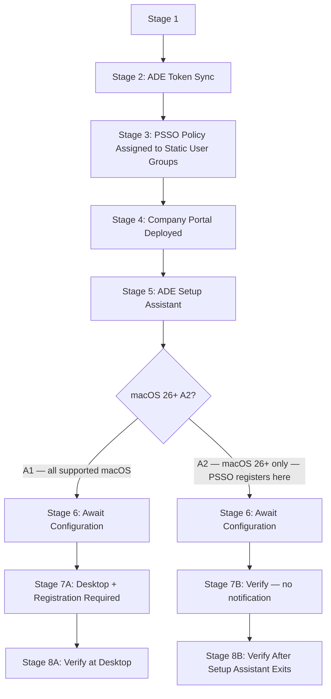

# Phase 89: Code Review Report

**Reviewed:** 2026-06-24
**Depth:** standard
**Files Reviewed:** 4
**Status:** issues_found

## Summary

Four files reviewed: the new PSSO provisioning walkthrough (`01-psso-provisioning-walkthrough.md`) and three pre-existing guides that each received one reciprocal See Also bullet (`00-ade-lifecycle.md`, `07-platform-sso-setup.md`, `02-enrollment-profile.md`).

The new walkthrough is structurally sound. The A2 section freshness stamp is present and correctly scoped. No fabricated intermediate registration states (`PENDING`, `NOT REGISTERED`) appear in any verification output block. The three-policy same-static-user-group rule is prominently called out with a dedicated callout box and wipe-recovery warning. The See Also reciprocal bullets in all three modified guides resolve to valid file paths. Cross-links to L1/L2 runbooks (35, 36, 27) and reference files (endpoints.md, macos-commands.md, macos-log-paths.md) all resolve.

One critical factual error was found in the pre-existing guide 00: a "Watch Out For" bullet added at Stage 4 says the PSSO Settings Catalog policy must be assigned to a "static **device** group" — directly contradicting the core requirement stated everywhere else (static **user** groups). Two warnings address a mermaid diagram branch-point that misrepresents when A2 diverges from A1, and an intra-document link that identifies a named section in its link text but omits the anchor.

---

## Critical Issues

### CR-01: "Static device group" in 00-ade-lifecycle.md contradicts the static user group requirement

**File:** `docs/macos-lifecycle/00-ade-lifecycle.md:250`

**Issue:** The Stage 4 "Watch Out For" bullet added in this phase reads:

> "...the SSO extension Settings Catalog profile must be assigned to a **static device group** and delivered before the device reaches the Entra credential screen in Setup Assistant."

This directly contradicts the requirement stated in every other location in the codebase:

- `01-psso-provisioning-walkthrough.md` lines 33, 41, 71, 108, 146, 150, 152, 154, 158, 163, 369–376, 388 — all say **Assigned (static) user groups**.
- `07-platform-sso-setup.md` lines 51, 117–118, 167–168 — all say **user groups**, with explicit call-out that device groups are NOT supported.

Microsoft's own documentation explicitly states the Platform SSO Settings Catalog policy must be assigned to **user groups** for devices with user affinity, and that device-group assignment is unsupported and causes Conditional Access failures. An operator following the guide 00 bullet and assigning the policy to a static device group would produce exactly that failure — silently, because the profile shows "Succeeded" in Intune regardless.

**Fix:** Change "static device group" to "static user group" in `00-ade-lifecycle.md:250`:

```
Before: ...the SSO extension Settings Catalog profile must be assigned to a static device group and delivered...

After:  ...the SSO extension Settings Catalog profile must be assigned to an Assigned (static) user group and delivered...
```

---

## Warnings

### WR-01: Mermaid pipeline diagram branch point misrepresents A2 divergence timing

**File:** `docs/macos-lifecycle/01-psso-provisioning-walkthrough.md:54-58`

**Issue:** The diagram branches the A1/A2 paths after Stage 6 (Await Configuration):

```
S6[Stage 6: Await Configuration] --> Branch{macOS 26+ A2?}
Branch -->|A2 — macOS 26+ only| S8[Stage 7B: PSSO Registers Inside Setup Assistant]
```

But Stage 5 body text (line 210) explicitly states: "For A2 devices ..., PSSO registration occurs inside Setup Assistant at this stage [Stage 5]." Stage 6 body text (lines 240-242) confirms: "for A2, Setup Assistant has already registered PSSO before this stage is reached."

The diagram therefore shows Stage 7B ("PSSO Registers Inside Setup Assistant") as occurring *after* Stage 6, when the document text says it occurs *during* Stage 5, before Stage 6. Stage 6 (Await Configuration) is shared by both paths — it is not the branch point.

An operator reading the diagram first would conclude that A2 PSSO registration is a post-Await-Configuration event, which is incorrect. Escalation paths for "A2 PSSO not registering" would incorrectly focus on Await Configuration rather than Stage 5.

**Fix:** Move the branch to exit Stage 5, making Stage 6 a shared node on both paths:



Alternatively, add a sub-node inside Stage 5 to show the A2 branch without restructuring the shared Stage 6 node.

---

### WR-02: Link to guide 07 ADE section omits the anchor, landing at document top

**File:** `docs/macos-lifecycle/01-psso-provisioning-walkthrough.md:394`

**Issue:** The link reads:

```
[Platform SSO Setup — ADE-during-Setup-Assistant section](../admin-setup-macos/07-platform-sso-setup.md)
```

The link text explicitly names the "ADE-during-Setup-Assistant section," but the URL has no anchor. The correct anchor for that section in `07-platform-sso-setup.md` is `#advanced--optional-ade-during-setup-assistant` (generated from `## Advanced / Optional: ADE-during-Setup-Assistant`). Without the anchor, an operator following this link lands at the top of the guide (roughly 150 lines above the relevant section) and must scroll manually to find it.

This is the only in-walkthrough link to guide 07 that claims to target a specific section and fails to do so; all other guide-07 links either target the whole document or use a named section implicitly.

**Fix:** Add the anchor:

```
Before: [Platform SSO Setup — ADE-during-Setup-Assistant section](../admin-setup-macos/07-platform-sso-setup.md)

After:  [Platform SSO Setup — ADE-during-Setup-Assistant section](../admin-setup-macos/07-platform-sso-setup.md#advanced--optional-ade-during-setup-assistant)
```

---

## Info

### IN-01: Six stage-referencing cross-links in walkthrough omit anchors

**File:** `docs/macos-lifecycle/01-psso-provisioning-walkthrough.md:26,130,204,216,222,244,249,279`

**Issue:** Multiple links reference specific stages within `00-ade-lifecycle.md` in their link text but omit the anchor:

- Line 26: `[macOS ADE Lifecycle — Prerequisites](00-ade-lifecycle.md)` — no anchor; guide 00 has no `## Prerequisites` heading (prerequisites are under an H3 below the intro, so no standard anchor exists here — this is acceptable).
- Line 130: `[macOS ADE Lifecycle — Stage 2](00-ade-lifecycle.md)` — should be `#stage-2-ade-token-sync`
- Line 204/216/222: `[macOS ADE Lifecycle — Stage 4](00-ade-lifecycle.md)` — should be `#stage-4-setup-assistant`
- Line 244/249: `[macOS ADE Lifecycle — Stage 5](00-ade-lifecycle.md)` — should be `#stage-5-await-configuration`
- Line 279: `[macOS ADE Lifecycle — Stage 7 Watch Out For](00-ade-lifecycle.md)` — should be `#stage-7-desktop-and-ongoing-mdm`

The links are valid (files exist), but the link text sets an expectation of navigating to a specific stage that the bare URL does not fulfill. An operator clicks "Stage 4" and lands at the document top. The anchors exist in guide 00 as standard Markdown heading anchors.

**Fix:** Add stage anchors to the relevant links, e.g.:
```
[macOS ADE Lifecycle — Stage 4](00-ade-lifecycle.md#stage-4-setup-assistant)
[macOS ADE Lifecycle — Stage 5](00-ade-lifecycle.md#stage-5-await-configuration)
[macOS ADE Lifecycle — Stage 7 Watch Out For](00-ade-lifecycle.md#stage-7-desktop-and-ongoing-mdm)
```
(The prerequisites link at line 26 is acceptable without an anchor since guide 00 has no top-level Prerequisites heading.)

---

_Reviewed: 2026-06-24_
_Reviewer: Claude (gsd-code-reviewer)_
_Depth: standard_
