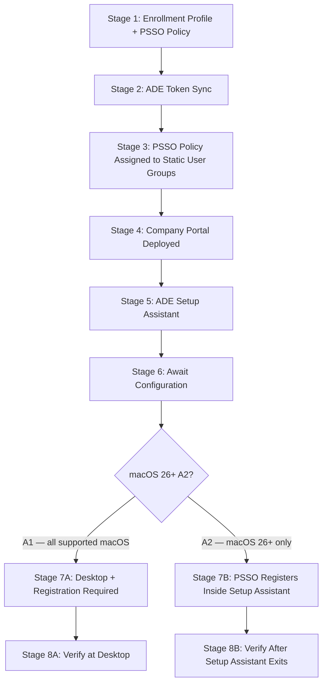

# Phase 90: MDM Migration Walkthrough + L2 Runbook #30 - Pattern Map

**Mapped:** 2026-06-24
**Files analyzed:** 4 (2 new, 2 modified)
**Analogs found:** 4 / 4

---

## File Classification

| New/Modified File | Role | Data Flow | Closest Analog | Match Quality |
|-------------------|------|-----------|----------------|---------------|
| `docs/macos-lifecycle/02-mdm-migration-psso.md` | scenario walkthrough | request-response (operator procedure) | `docs/macos-lifecycle/01-psso-provisioning-walkthrough.md` | exact |
| `docs/l2-runbooks/30-macos-mdm-migration-failure.md` | L2 investigation runbook | event-driven (failure investigation) | `docs/l2-runbooks/27-macos-sso-investigation.md` | exact |
| `docs/l2-runbooks/00-index.md` | index hub | CRUD (row append) | existing rows in the same `## macOS ADE Runbooks / ### When to Use` table | exact |
| `docs/l2-runbooks/27-macos-sso-investigation.md` | L2 investigation runbook | CRUD (section append) | existing `## Related Resources` section in that same file | exact |

---

## Pattern Assignments

### `docs/macos-lifecycle/02-mdm-migration-psso.md` (scenario walkthrough, two-path)

**Primary analog:** `docs/macos-lifecycle/01-psso-provisioning-walkthrough.md`
**Secondary analog:** `docs/macos-lifecycle/00-ade-lifecycle.md` (4-block stage anatomy reference)

---

#### Frontmatter pattern (lines 1–7 of `01`):

```yaml
---
last_verified: 2026-06-24
review_by: 2026-09-24
applies_to: ADE
audience: all
platform: macOS
---
```

**Rule for `02`:** Use identical keys. Set `last_verified: 2026-06-24` / `review_by: 2026-09-24` (the OS-26-gated sections carry the same 90-day window).

---

#### Platform gate callout pattern (line 9 of `01`, immediately before H1):

```markdown
> **Platform gate:** This guide covers macOS Platform SSO provisioning via Microsoft Intune and Apple Business Manager, for both the standard post-enrollment path (A1, all supported macOS) and the ADE-during-Setup-Assistant zero-click path (A2, macOS 26+ only). For the underlying ADE enrollment pipeline, see [macOS ADE Lifecycle](00-ade-lifecycle.md). For Platform SSO policy configuration, see [Platform SSO Setup](../admin-setup-macos/07-platform-sso-setup.md).
```

**Rule for `02`:** Place a `> **Platform gate:**` blockquote immediately before H1. Mention both B1 (macOS 26+) and B2 (pre-macOS 26), and cross-link to `00-ade-lifecycle.md` and `01-psso-provisioning-walkthrough.md`.

---

#### H1 title pattern (line 11 of `01`):

```markdown
# macOS Platform SSO Provisioning Walkthrough: A1 Standard and A2 ADE-during-Setup-Assistant
```

**Rule for `02`:** Match the `# macOS [Topic] Walkthrough: B1 [name] and B2 [name]` pattern. Example: `# macOS MDM Migration Walkthrough: B1 In-Place (macOS 26+) and B2 Wipe-and-Re-Enroll`.

---

#### Role-description paragraph + path selector table (lines 13–21 of `01`):

```markdown
This is a single-file operator walkthrough threading a Mac from enrollment through PSSO registration, serving all three roles: **L1 Service Desk** (use "What the Admin Sees" and "Watch Out For" for orientation and failure identification), **L2 Desktop Engineering** (use "Behind the Scenes" for endpoint and daemon detail), and **Intune Admins** (use "What Happens" for the complete configuration workflow).

## Which Path Is Right for You?

| Path | macOS Requirement | Company Portal | PSSO Registers | Use When |
|------|-------------------|----------------|----------------|----------|
| **A1 — Standard post-enrollment** | macOS 13+ | 5.2404.0+ (VPP) | At desktop, after "Registration Required" notification | Most deployments; all supported macOS versions |
| **A2 — ADE-during-Setup-Assistant** | macOS 26+ (hard gate) | 5.2604.0+ (LOB only — NOT VPP) | Inside Setup Assistant; no desktop notification | New enrollments on macOS 26+ requiring zero-click PSSO |
```

**Rule for `02`:** Open with the three-role paragraph. Then `## Which Path Is Right for You?` table. Adapt columns to B1/B2: `| Path | macOS Requirement | Migration Type | PSSO Re-registration | Use When |`. Path column values: `**B1 — macOS 26 in-place**` and `**B2 — Pre-macOS-26 wipe**`.

---

#### Userless-device scope callout pattern (lines 22–23 of `01`):

```markdown
> **Userless devices:** Devices enrolled without user affinity never reach PSSO registration — no WPJ key is written and no Secure Enclave entry is created. This walkthrough covers user-affinity enrollments only. For userless (shared/kiosk) devices, see [macOS ADE Lifecycle](00-ade-lifecycle.md).
```

**Rule for `02`:** Place an equivalent `> **Userless devices:**` blockquote immediately after the path selector table.

---

#### Prerequisites section pattern (lines 24–43 of `01`):

```markdown
### Prerequisites

All prerequisites must be met before Stage 1. The ADE pipeline prerequisites (ABM account, ADE token, APNs certificate, Intune licenses, network endpoints) are covered in [macOS ADE Lifecycle — Prerequisites](00-ade-lifecycle.md).

**Common prerequisites (A1 and A2):**

- [ ] Apple Business Manager account configured and ADE token uploaded to Intune
- [ ] Enrollment profile created with: User Affinity — Enroll with User Affinity; Authentication — Setup Assistant with modern authentication; Await Configuration: Yes; Locked Enrollment: Yes
- [ ] Platform SSO Settings Catalog policy created and configured (see [Platform SSO Setup](../admin-setup-macos/07-platform-sso-setup.md) for field-level detail)
- [ ] Platform SSO policy assigned to **Assigned (static) user groups** — not device groups, not dynamic groups

**A2-only hard-gate prerequisites (macOS 26+ path):**

- [ ] macOS 26 or later confirmed on target devices (hard gate — A2 does not function on earlier macOS)
...
```

**Rule for `02`:** Use `### Prerequisites` with `- [ ]` checklist items. Split into `**Common prerequisites (B1 and B2):**` and `**B1-only prerequisites (macOS 26+ in-place path):**`. Cross-link to `00-ade-lifecycle.md` for base ADE prerequisites.

---

#### Mermaid pipeline diagram pattern (lines 47–62 of `01`):

```markdown
## The PSSO Provisioning Pipeline



> Stages 1–6 are the shared spine, applicable to both paths...
```

**Rule for `02`:** Use `## The MDM Migration Pipeline` with a `graph TD` Mermaid block. Show the fork at the OS-26 gate node. Shared pre-flight stages (both) feed into the fork; B1 9-stage arm and B2 5-stage arm diverge from there. Add the `>` prose summary below the code fence.

---

#### Stage Summary Table pattern (lines 67–79 of `01`):

```markdown
## Stage Summary Table

| Stage | Actor | Location | What Happens | Key Pitfall | Path |
|-------|-------|----------|--------------|-------------|------|
| 1: Enrollment Profile + PSSO Policy | Admin | Intune admin center | Enrollment profile configured ... | PSSO policy assigned to device groups or wrong group type | Both |
| 2: ADE Token Sync | System/Intune | Intune admin center | Device appears in Intune after ABM sync | Token expired; sync lag up to 24h | Both |
...
| 7A: Desktop + "Registration Required" | User | On-device | User taps Notification Center prompt ... | User dismisses notification; wrong verification command | A1 |
| 7B: PSSO Registers Inside Setup Assistant | Device/User | On-device (SA) | PSSO registers in SA before desktop ... | Three-policy group mismatch; CP LOB not deployed; SmartCard configured | A2 |
```

**Rule for `02`:** Exact column header match: `| Stage | Actor | Location | What Happens | Key Pitfall | Path |`. Path column values for `02`: `Both` (shared pre-flight stages), `B1` (in-place path stages), `B2` (wipe-path stages). No other values.

---

#### Per-stage 4-block anatomy pattern (lines 84–111 of `01`, representative Stage 1):

```markdown
## Stage 1: Enrollment Profile + PSSO Policy

### What the Admin Sees

In the **Intune admin center**, navigate to...

### What Happens

1. **Enrollment profile creation.** Create an enrollment profile with...
2. **Platform SSO Settings Catalog policy.** Create a Settings Catalog policy...
3. **Authentication method selection.** Choose Secure Enclave...

### Behind the Scenes

- The enrollment profile maps to Apple's MDM enrollment profile specification...
- The Platform SSO Settings Catalog policy delivers the `com.apple.extensiblesso` payload...

### Watch Out For

- **PSSO policy assigned to device groups.**...
- **Await Configuration: No.**...
```

**Rule for `02`:** Every stage gets exactly these four H3 subsections in this order: `### What the Admin Sees`, `### What Happens` (numbered steps), `### Behind the Scenes` (bullet prose), `### Watch Out For` (bold-lead bullets). Add `### What the User Sees` and `### How to Verify` only at user-facing stages (matching `01`'s pattern at Stage 7A).

---

#### `app-sso platform -s` gate block pattern (lines 294–313 of `01`):

```markdown
### How to Verify

Open Terminal and run:

```bash
app-sso platform -s
```

Confirm both lines appear in the output:

```
Device Registration: REGISTERED
User Registration: REGISTERED
```

If either line shows a different value, wait and re-run the command — registration may still be in progress. If the values do not transition to REGISTERED after several minutes, escalate to:

- [L1 #35 macOS SSO Sign-In Failure](../l1-runbooks/35-macos-sso-sign-in-failure.md)
- [L1 #36 macOS Secure Enclave Key](../l1-runbooks/36-macos-secure-enclave-key.md)
- [L2 #27 macOS SSO Investigation](../l2-runbooks/27-macos-sso-investigation.md)

Do not attempt inline triage — these runbooks contain the authoritative investigation steps.
```

**Rule for `02`:** Copy this exact structure for the post-migration PSSO verification gate (D-02 / Stage 9 B1). The output block shows ONLY the full end-state: `Device Registration: REGISTERED` / `User Registration: REGISTERED`. Never fabricate intermediate states. Escalation bullet list must include L1 #35, L1 #36, and L2 #27. Add the link-not-copy handoff sentence pointing to `01-psso-provisioning-walkthrough.md` for the registration UX steps (D-02 bidirectional anchor).

---

#### A2-style divergence/fork callout block pattern (lines 361–442 of `01`):

```markdown
## A2 Path: ADE-during-Setup-Assistant (macOS 26+)

> **macOS 26+ ADE-during-Setup-Assistant path (A2) — diverges at Stage 4 (Company Portal) and extends through Stage 7B.**
>
> All requirements below must be met BEFORE enrollment starts. A single misconfiguration requires a **device wipe** to recover — there is no in-place fix.
>
> ---
>
> **Most prominent risk — three-policy same-Assigned-static-user-group rule:**
> ...
>
> ---
>
> **A2 Requirements Summary:**
>
> | A2 Requirement | Value |
> |----------------|-------|
> | macOS version | macOS 26+ (hard gate — A2 does not function on earlier macOS) |
> ...
```

**Rule for `02`:** Use a top-level `##` section titled `## B2 Path: Pre-macOS-26 Wipe-and-Re-Enroll` for the B2 fork content. Inside, use `>` blockquote callouts for the hard requirements and risks, with `---` horizontal rules separating logical sub-blocks. Include a `**B2 Requirements Summary:**` table (matching the A2 pattern) with columns `| B2 Requirement | Value |`. End the B2 section with the link-not-copy handoff to `01-psso-provisioning-walkthrough.md` (D-01: B2 terminus hands off to guide `01`'s A1 path).

---

#### OS-26 freshness stamp pattern (line 441 of `01`):

```markdown
_Section provenance — `last_verified: 2026-06-24` / `review_by: 2026-09-24`. This section covers macOS 26-gated features (ADE-during-Setup-Assistant PSSO, Company Portal 5.2604.0 LOB floor). Re-confirm macOS 26 GA status and CP 5.2604.0 LOB floor against current Microsoft Learn / Apple documentation at each 90-day review._
```

**Rule for `02`:** Place this italic `_Section provenance — ..._` stamp at the end of every OS-26-gated section (the entire B1 in-place path + ABM "Assign Device Management" + Deadline mechanics blocks). Use `last_verified: 2026-06-24` / `review_by: 2026-09-24`. Specify what to re-confirm (ABM button label, non-dismissible lock behavior, supervision status preservation).

---

#### See Also section pattern (lines 445–466 of `01`):

```markdown
## See Also

**Terminology and Concepts:**

- [macOS Provisioning Glossary](../_glossary-macos.md) -- PSSO, WPJ, Secure Enclave, ADE, Setup Assistant, LOB terminology
- [Windows vs macOS Concept Comparison](../windows-vs-macos.md) -- Platform enrollment mechanism mapping and auth-method comparison

**Technical References:**

- [macOS Terminal Commands Reference](../reference/macos-commands.md) -- Diagnostic commands including `app-sso platform -s` and enrollment verification
- [macOS Log Paths Reference](../reference/macos-log-paths.md) -- Log file locations for Company Portal, PSSO extension, and MDM subsystems
- [Network Endpoints Reference](../reference/endpoints.md#macos-ade-endpoints) -- Required Apple and Microsoft URLs for ADE enrollment and PSSO

**Related Guides:**

- [macOS ADE Lifecycle Overview](00-ade-lifecycle.md) -- Complete 7-stage ADE enrollment pipeline that this walkthrough threads PSSO through
- [Platform SSO Setup](../admin-setup-macos/07-platform-sso-setup.md) -- Settings Catalog policy configuration reference for the PSSO extension
...
```

**Rule for `02`:** Three subsections in order: `**Terminology and Concepts:**`, `**Technical References:**`, `**Related Guides:**`. Use `--` (double dash) as separator in bullets (matches `01` style, not `—`). In Related Guides, include: `00-ade-lifecycle.md`, `01-psso-provisioning-walkthrough.md` (bidirectional anchor for D-02), `07-platform-sso-setup.md`, `02-enrollment-profile.md`, `27-macos-sso-investigation.md` (L2 #27), `30-macos-mdm-migration-failure.md` (L2 #30, reciprocal link).

---

#### Glossary Quick Reference pattern (lines 470–483 of `01`):

```markdown
## Glossary Quick Reference

Key terms used throughout this guide. Full definitions with Windows equivalents are in the [macOS Provisioning Glossary](../_glossary-macos.md).

| Term | Definition | First Appears |
|------|-----------|---------------|
| [PSSO / Platform SSO](../_glossary-macos.md#platform-sso) | Platform Single Sign-On -- macOS extension enabling Entra ID SSO via the Enterprise SSO plug-in | Stage 1 |
| [ADE](../_glossary-macos.md#ade) | Automated Device Enrollment -- Apple's zero-touch enrollment mechanism via ABM | Stage 1 |
...
```

**Rule for `02`:** Copy the table format exactly: three columns `| Term | Definition | First Appears |`. Use bracketed term links pointing into `../_glossary-macos.md#anchor`. Include migration-specific terms: ABM "Assign Device Management", Deadline, FileVault recovery key, Activation Lock bypass code, ACME, profile-based enrollment, Kandji/Iru.

---

#### Version History pattern (lines 487–491 of `01`):

```markdown
## Version History

| Date | Change |
|------|--------|
| 2026-06-24 | Phase 89 (PROV-01..04): initial PSSO provisioning walkthrough (A1 + A2 paths) |
```

**Rule for `02`:** Two columns only — `| Date | Change |` — NO Author column. This matches `01` and `00-ade-lifecycle.md`. (Contrast: `27-macos-sso-investigation.md` and `00-index.md` have an Author column — do NOT use Author in the `macos-lifecycle/` docs.)

---

### `docs/l2-runbooks/30-macos-mdm-migration-failure.md` (L2 investigation runbook, three parallel tracks)

**Analog:** `docs/l2-runbooks/27-macos-sso-investigation.md`

---

#### Frontmatter pattern (lines 1–7 of `27`):

```yaml
---
last_verified: 2026-06-21
review_by: 2026-09-21
applies_to: ADE
audience: L2
platform: macOS
---
```

**Rule for `30`:** Use identical keys. `audience: L2` (not `all`). Set `last_verified: 2026-06-24` / `review_by: 2026-09-24`.

---

#### Platform gate callout pattern (lines 9–10 of `27`):

```markdown
> **Platform gate:** This guide covers macOS Platform SSO L2 investigation via Intune and Entra. For Windows Autopilot, see [Windows L2 Runbooks](00-index.md). For other macOS ADE investigation runbooks, see [macOS ADE Runbooks](00-index.md#macos-ade-runbooks).
```

**Rule for `30`:** Place `> **Platform gate:**` blockquote before H1. Mention macOS ADE migration investigation scope; link to `00-index.md#macos-ade-runbooks` for other macOS runbooks.

---

#### H1 pattern (line 12 of `27`):

```markdown
# macOS Platform SSO Investigation
```

**Rule for `30`:** No "L2 #30" or runbook number in H1. Pattern: `# macOS MDM Migration Failure Investigation` (or similar topic-first title matching `27`'s style).

---

#### Context preamble + in-preamble routing pattern (lines 14–26 of `27`):

```markdown
## Context

This runbook covers macOS Platform SSO (PSSO) failure investigation across two failure classes: registration failures (device or user not reaching REGISTERED state) and Password-sync failures (sign-in loop, per-user MFA blocker, AD-bound account limitation).

Before starting: collect a diagnostic package per the [macOS Log Collection Guide](10-macos-log-collection.md). For PSSO investigations, also enable AppSSO debug logging before reproducing the issue — see Track A Step 3 for the debug-enable procedure.

**From L1 escalation?** L1 runbook 35 (SSO sign-in failure / registration not appearing) or L1 runbook 36 (Secure Enclave key loss after password reset) has escalated. L1 collected: device serial number, macOS version, user UPN, `app-sso platform -s` output, and Intune device configuration status screenshot. Route to the matching track:

- L1 35 → Track A: Registration Failure Investigation
- L1 36 → Track A: Registration Failure Investigation (SE key re-registration path)
- Password-sync failures (registration shows REGISTERED but sign-in / token acquisition fails; per-user MFA or AD-bound account suspected) → Track B: Password-Sync Failure Investigation
- No L1 escalation: begin at Track A Step 1 to confirm registration state, then proceed to Track B if registration state shows REGISTERED but sign-in still fails
```

**Rule for `30`:** Open with `## Context` (no H2 router table — routing is prose+bullets inside Context, per D-03). Paragraph 1: describe three failure classes (Track A: deadline lockout; Track B: profile-not-delivered/enrollment-failed; Track C: PSSO re-registration stuck). Paragraph 2: `Before starting: collect a diagnostic package per the [macOS Log Collection Guide](10-macos-log-collection.md).` (This is the MIG-L2-#10 cross-link — mandatory, listed first). Paragraph 3: `**From L1 escalation?**` block with bulleted routing to Track A / Track B / Track C. Include routing for: "device stuck on non-dismissible migration screen → Track A", "migration appeared to complete but Intune shows not enrolled → Track B", "migration complete and enrolled but PSSO 'Registration Required' not appearing or stuck → Track C", "PSSO registration initiated but stuck → Track C → link to L2 #27".

---

#### Parallel track H2 headers pattern (lines 29, 138 of `27`):

```markdown
## Track A: Registration Failure Investigation

...

## Track B: Password-Sync Failure Investigation
```

**Rule for `30`:** Three H2 track sections:
- `## Track A: Deadline Lockout`
- `## Track B: Profile-Not-Delivered / Enrollment-Failed`
- `## Track C: PSSO Re-Registration Stuck`

No top-level router table between the Context and Track A. Router is entirely within the Context preamble (D-03).

---

#### Step numbering pattern (lines 31, 53, 68, 109, 142, 157 of `27`):

```markdown
### Step 1: Confirm registration state via `app-sso platform -s`

### Step 2: Intune portal — device configuration status

### Step 3: AppSSO debug logging + sysdiagnose capture

### Step 4: TLS-inspection exclusion verification

### Step 5: macOS 15.0–15.2 re-registration loop check
```

**Rule for `30`:** Within each track, use `### Step N: [verb phrase]` headers. Number steps sequentially within each track (restart at Step 1 for each track). Each step: prose description → code block (if diagnostic command) → interpretation guidance.

---

#### Code block pattern for diagnostic commands (lines 35–38, 74–97 of `27`):

```markdown
```bash
app-sso platform -s
```
```

and multi-step procedures:

```markdown
```bash
# Step 1: Enable persistent AppSSO debug logging
sudo log config --mode "level:debug,persist:debug" --subsystem "com.apple.AppSSO"

# Step 2: Reproduce the issue (sign-in failure, registration failure, or re-registration prompt)
# Note the exact timestamp of the failure for log correlation

# Step 3: Capture a sysdiagnose archive
sudo sysdiagnose

# Step 4: Reset AppSSO logging to defaults
sudo log config --reset --subsystem "com.apple.AppSSO"
```
```

**Rule for `30`:** All diagnostic commands in fenced `bash` code blocks. Comments inside blocks use `#`. For multi-step procedures, inline comment the step numbers within a single block.

---

#### Important/Note blockquote pattern (lines 51–53, 106–107 of `27`):

```markdown
> **Important:** Do not interpret the absence or unexpected value of any particular JSON field as a specific root cause without correlating with Intune portal state (Step 2) and the sysdiagnose capture (Step 3)...

> **Note:** The `app-sso` binary does not have a `diagnose` subcommand in any verified Apple or Microsoft source...
```

**Rule for `30`:** Use `> **Important:**` for must-not-do cautions. Use `> **Note:**` for advisory context. MEDIUM-confidence facts (ABM recovery steps, supervision status, ABM lockout-release UI) must be inside these callouts with explicit confidence language ("MEDIUM confidence — verify in current ABM portal on authoring day").

---

#### Version gate callout pattern (lines 121–132 of `27`):

```markdown
> **Version gate — macOS 15.0–15.2:** If the device is running macOS 15.0, 15.1, or 15.2, repeated "Registration Required" prompts are caused by a known Apple OS bug...
>
> **Fixed in macOS 15.3.** Action: upgrade the device to macOS 15.3 or later...
```

**Rule for `30`:** For any OS-version-specific behavior (e.g., macOS 26 hard gate for B1 in-place migration), use `> **Version gate — macOS [X]:**` blockquote format.

---

#### Microsoft Support Escalation Packet pattern (lines 177–186 of `27`):

```markdown
## Microsoft Support Escalation Packet

When Track A or Track B investigation does not resolve the issue, engage Microsoft Support. Assemble the following before opening a case:

- **`app-sso platform -s` full JSON output** — captured on the affected device at the time of failure; include the complete output, not excerpts
- **sysdiagnose archive** — captured with AppSSO debug logging enabled before reproducing the issue (Track A Step 3 procedure); required for Microsoft Support to analyze PSSO subsystem events
- **Company Portal log incident ID** — generated via Company Portal app > Help > Send diagnostic report > Email logs; note the incident ID before closing — Microsoft Support uses this to retrieve the associated logs
- **Intune device configuration status screenshot** — Intune admin center > Devices > [device] > Configuration, showing the Platform SSO Settings Catalog policy status (Succeeded / error code)
- **macOS version** and **Company Portal version** — from the Intune device record or device About screen
- **Entra sign-in log screenshot** — Entra admin center > Monitoring > Sign-in logs, filtered to the affected user, showing any MFA failures, Conditional Access policy blocks, or sign-in error codes
```

**Rule for `30`:** Include `## Microsoft Support Escalation Packet` section after all tracks. Bulleted list of required artifacts. For a migration failure case, include: `app-sso platform -s` full JSON output, IntuneMacODC diagnostic package (from L2 #10), Intune device enrollment status screenshot (admin center → Enrollment → Apple → Enrollment program tokens → [token] → Devices), ABM migration status screenshot (device's current migration state in ABM), macOS version, Company Portal log incident ID, Entra sign-in log screenshot.

---

#### Related Resources pattern (lines 189–197 of `27`):

```markdown
## Related Resources

- [macOS Log Collection Guide (runbook 10)](10-macos-log-collection.md) — prerequisite for this runbook
- [L1 Runbook 35: macOS Platform SSO Sign-In Failure](../l1-runbooks/35-macos-sso-sign-in-failure.md) — escalation source (registration not appearing / sign-in failure)
- [L1 Runbook 36: macOS Platform SSO — Secure Enclave Key Loss](../l1-runbooks/36-macos-secure-enclave-key.md) — escalation source (key loss after password reset)
- [macOS Platform SSO Setup Guide](../admin-setup-macos/07-platform-sso-setup.md) — Configuration-Caused Failures table, `app-sso platform -s` healthy output reference, TLS exclusion endpoints DF-10 (link-not-copy)
- [macOS Auth Methods Deep-Dive](../admin-setup-macos/08-auth-methods-deep-dive.md) — SE key behavior, DF-3 per-user MFA, DF-7 AD-bound account (link-not-copy)
- [Enterprise SSO Plugin Migration Guide](../admin-setup-macos/09-enterprise-sso-plugin-migration.md) — Error 10002 / legacy plug-in conflict context (link-not-copy)
- [macOS ADE L2 Runbook Index](00-index.md#macos-ade-runbooks)
```

**Rule for `30`:** `## Related Resources` section with bulleted list. Prerequisite (`10-macos-log-collection.md`) listed FIRST with " — prerequisite for this runbook" annotation (matches `27`'s ordering convention). Then: `27-macos-sso-investigation.md` (Track C link-not-copy target), `02-mdm-migration-psso.md` (walkthrough companion — link for normal-path steps), `07-platform-sso-setup.md`, `00-index.md#macos-ade-runbooks`. Use `— ` (em-dash + space) as description separator (matches `27`'s style). Link format: `[Runbook Name (runbook N)](filename.md)` for runbook references.

---

#### Version History pattern (lines 201–204 of `27`):

```markdown
## Version History

| Date | Change | Author |
|------|--------|--------|
| 2026-06-21 | Initial version — macOS Platform SSO L2 investigation (SSORUN-03): Registration Failure track + Password-Sync Failure track; macOS 15.0–15.2 version-gate callout | -- |
```

**Rule for `30`:** Three columns: `| Date | Change | Author |` — Author column IS present in L2 runbooks (matches `27` and `00-index.md`; contrast with `macos-lifecycle/` docs which have no Author column). Use `| -- |` for Author value on initial version.

---

### `docs/l2-runbooks/00-index.md` — Add row for L2 #30

**Analog:** Existing rows in the `## macOS ADE Runbooks / ### When to Use` table (lines 80–88 of `00-index.md`).

---

#### Existing row format to copy (lines 84–88 of `00-index.md`):

```markdown
### When to Use

| Runbook | When to Use | Prerequisite |
|---------|-------------|--------------|
| [macOS Log Collection Guide](10-macos-log-collection.md) | Before starting any macOS L2 investigation -- collect IntuneMacODC zip and Terminal diagnostic outputs | None |
| [Profile Delivery Investigation](11-macos-profile-delivery.md) | Configuration profile not delivered, showing error/conflict, or not taking effect on device | [macOS Log Collection](10-macos-log-collection.md) |
| [App Install Failure Diagnosis](12-macos-app-install.md) | DMG, PKG, or VPP app not installing, showing failed status, or continuous reinstall loop | [macOS Log Collection](10-macos-log-collection.md) |
| [Compliance Evaluation Investigation](13-macos-compliance.md) | Device non-compliant, compliance not evaluating, or Conditional Access blocking despite compliance | [macOS Log Collection](10-macos-log-collection.md) |
| [Platform SSO Investigation](27-macos-sso-investigation.md) | PSSO registration not completing, "Registration Required" loop, or Password-sync sign-in failure | [macOS Log Collection](10-macos-log-collection.md) |
| [Kerberos SSO Investigation](28-macos-kerberos-sso-investigation.md) | Kerberos TGT not acquired, realm/KDC unreachable, or PSSO-TGT integration failure (`usePlatformSSOTGT`) | [macOS Log Collection](10-macos-log-collection.md) |
| [Graph Credential Investigation](29-macos-graph-credential-investigation.md) | Platform Credential not appearing in Graph, delete-and-re-register flow, or permission/scope errors on `platformCredentialMethods` | [macOS Log Collection](10-macos-log-collection.md) |
```

**Rule for `00-index.md` edit:** Append the following row at the END of the `### When to Use` table inside `## macOS ADE Runbooks`, after the `[Graph Credential Investigation]` row:

```markdown
| [macOS MDM Migration Failure](30-macos-mdm-migration-failure.md) | Migration deadline lockout (non-dismissible screen), profile-not-delivered after migration, or PSSO re-registration stuck post-migration | [macOS Log Collection](10-macos-log-collection.md) |
```

**Separator style:** `--` (double hyphen) used in "When to Use" cell prose in `00-index.md`. Prerequisite cell uses `[macOS Log Collection](10-macos-log-collection.md)` without the "Guide" suffix (matches `27`'s row in the table at line 86).

**Version History row to append** (matching existing rows at lines 219–226 of `00-index.md`, three-column `| Date | Change | Author |`):

```markdown
| 2026-06-24 | Phase 90 MIG/RUN-01: added macOS MDM Migration Failure runbook #30 to When-to-Use table; added macOS L1 Escalation Mapping note for migration failures | -- |
```

---

### `docs/l2-runbooks/27-macos-sso-investigation.md` — Append reciprocal See Also

**Analog:** Existing `## Related Resources` section (lines 189–197 of `27-macos-sso-investigation.md`).

---

#### Existing Related Resources block to append to (lines 189–197 of `27`):

```markdown
## Related Resources

- [macOS Log Collection Guide (runbook 10)](10-macos-log-collection.md) — prerequisite for this runbook
- [L1 Runbook 35: macOS Platform SSO Sign-In Failure](../l1-runbooks/35-macos-sso-sign-in-failure.md) — escalation source (registration not appearing / sign-in failure)
- [L1 Runbook 36: macOS Platform SSO — Secure Enclave Key Loss](../l1-runbooks/36-macos-secure-enclave-key.md) — escalation source (key loss after password reset)
- [macOS Platform SSO Setup Guide](../admin-setup-macos/07-platform-sso-setup.md) — Configuration-Caused Failures table, `app-sso platform -s` healthy output reference, TLS exclusion endpoints DF-10 (link-not-copy)
- [macOS Auth Methods Deep-Dive](../admin-setup-macos/08-auth-methods-deep-dive.md) — SE key behavior, DF-3 per-user MFA, DF-7 AD-bound account (link-not-copy)
- [Enterprise SSO Plugin Migration Guide](../admin-setup-macos/09-enterprise-sso-plugin-migration.md) — Error 10002 / legacy plug-in conflict context (link-not-copy)
- [macOS ADE L2 Runbook Index](00-index.md#macos-ade-runbooks)
```

**Rule for `27` edit:** Append ONE new bullet at the end of the `## Related Resources` list, before the `---` separator (if any), or directly after the last bullet. Use the same `— ` separator style and `[Name (runbook N)](filename.md)` format:

```markdown
- [macOS MDM Migration Failure (runbook 30)](30-macos-mdm-migration-failure.md) — for PSSO re-registration stuck post-migration from Kandji/Iru; Track C of runbook 30 routes to this runbook
```

**Version History row to append** (matching existing rows at lines 201–204 of `27`, three-column with Author):

```markdown
| 2026-06-24 | Phase 90 RUN-01: appended reciprocal Related Resources entry → L2 #30 macOS MDM Migration Failure | -- |
```

---

## Shared Patterns

### Frontmatter keys (all four files)

**Source:** `docs/macos-lifecycle/01-psso-provisioning-walkthrough.md` lines 1–7; `docs/l2-runbooks/27-macos-sso-investigation.md` lines 1–7.

Shared keys across all macos-lifecycle and l2-runbooks docs:
```yaml
last_verified: YYYY-MM-DD
review_by: YYYY-MM-DD
applies_to: ADE
audience: [all | L2]
platform: macOS
```

`audience: all` for macos-lifecycle walkthrough docs; `audience: L2` for l2-runbook docs.

---

### Platform gate callout (all new/modified docs with H1)

**Source:** `01` line 9; `27` lines 9–10.

```markdown
> **Platform gate:** [scope description]. For [other platform], see [link]. For [related scope], see [link].
```

Always appears immediately before H1. No blank line between the callout and H1.

---

### Link-not-copy cross-reference style

**Source:** `01` lines 102–103, 309–312; `27` lines 190–196.

Cross-links to sibling docs always use relative paths. Never reproduce the target's content inline. Always include a description clause after `—`:

```markdown
- [macOS ADE Lifecycle Overview](00-ade-lifecycle.md) -- Complete 7-stage ADE enrollment pipeline...
```

`--` (double hyphen) used as description separator in `macos-lifecycle/` docs (matches `01` and `00-ade-lifecycle.md`).
`—` (em-dash) used as description separator in `l2-runbooks/` docs (matches `27` and `00-index.md`).

**Use the correct separator per directory.**

---

### Verification gate (all stages verifying `app-sso platform -s`)

**Source:** `01` lines 294–313.

The output block is always shown as a plain (non-bash) fenced block showing ONLY the full healthy end-state:

```markdown
```bash
app-sso platform -s
```

Confirm both lines appear in the output:

```
Device Registration: REGISTERED
User Registration: REGISTERED
```
```

Never fabricate intermediate states (e.g., `User Registration: NOT REGISTERED`) in the output block. Only the REGISTERED end-state is shown in any verification gate in `02`.

---

### MEDIUM-confidence callout convention

**Source:** `27` lines 51–53, 106–107, 121–131; RESEARCH.md authoring posture table.

For facts stated at MEDIUM confidence (ABM recovery steps, supervision status, Iru console labels), use:

```markdown
> **Note:** [Fact stated conceptually.] MEDIUM confidence — verify [what] in [where] on authoring day / before fleet migration.
```

For must-not-do cautions regardless of confidence:

```markdown
> **Important:** [Prohibition.] [Consequence.]
```

---

### `profiles renew` prohibition (B2 section of `02`)

**Source:** RESEARCH.md MIG-02 content.

This must appear as a named callout or bold-lead Watch Out For bullet:

```markdown
- **`sudo profiles renew -type enrollment` is NOT a supported migration path for ADE-enrolled macOS devices.** macOS only queries ABM for MDM assignment during Setup Assistant after a device wipe. Using `profiles renew` on an ADE-enrolled device results in enrollment failure — the SSO extension profile cannot be installed because MDM enrollment is a prerequisite for that profile, creating a circular dependency.
```

---

## No Analog Found

All four files have direct analogs in the codebase. No files in Phase 90 require falling back to RESEARCH.md patterns alone.

---

## Metadata

**Analog search scope:** `docs/macos-lifecycle/`, `docs/l2-runbooks/`
**Files read for pattern extraction:** 4 (01-psso-provisioning-walkthrough.md, 27-macos-sso-investigation.md, 00-index.md, 00-ade-lifecycle.md)
**Pattern extraction date:** 2026-06-24

### Critical rules extracted from analog reading

1. **Author column presence is directory-specific.** `macos-lifecycle/` docs (00, 01): NO Author column in Version History. `l2-runbooks/` docs (27, 00-index): Author column present (`| -- |` for unattributed entries). `02` follows `01` (no Author). `30` follows `27` (has Author).

2. **Description separator is directory-specific.** `macos-lifecycle/` See Also: `--` (double hyphen). `l2-runbooks/` Related Resources: `—` (em-dash). Match the directory.

3. **Router placement.** `27`'s routing lives inside the `## Context` preamble as `**From L1 escalation?**` prose + bullets — no separate router H2. `30` must mirror this exactly (D-03 mandate).

4. **Stage Summary Table "Path" column.** Present in `01` but absent from `00-ade-lifecycle.md` (single-path doc). `02` is a two-path doc and MUST include the Path column. Values: `Both`, `B1`, `B2` only.

5. **`app-sso platform -s` output format.** The output fence uses no language tag (plain text), not `bash`. The command itself uses a `bash` fence. This two-fence pattern is present in `01` at every verification gate and must be replicated exactly in `02`.

6. **Divergence block is a top-level `##` section in `01`, not an H3.** The A2 path block is `## A2 Path: ADE-during-Setup-Assistant (macOS 26+)` — top-level. The B2 block in `02` should similarly be `## B2 Path: Pre-macOS-26 Wipe-and-Re-Enroll` as a top-level section.

7. **`00-index.md` macOS section header is `## macOS ADE Runbooks` with `### When to Use` sub-table.** The new row appends after the last existing row in `### When to Use`, before the `### macOS L1 Escalation Mapping` subsection.
