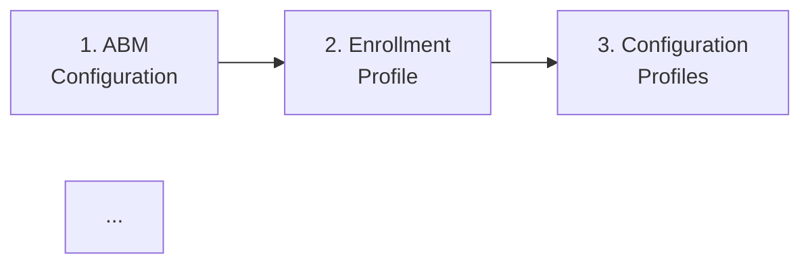
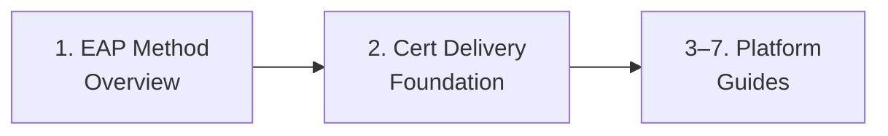
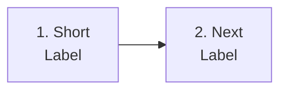
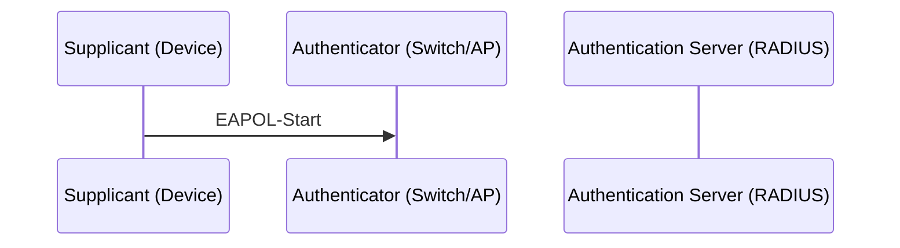

# Phase 101: 802.1X Foundation — Pattern Map

**Mapped:** 2026-06-29
**Files analyzed:** 8 (4 new files + 4 modified files)
**Analogs found:** 8 / 8

---

## File Classification

| New/Modified File | Role | Data Flow | Closest Analog | Match Quality |
|---|---|---|---|---|
| `docs/_glossary-network.md` | glossary | reference | `docs/_glossary-macos.md` | exact |
| `docs/admin-setup-8021x/00-overview.md` | overview/nav | navigation | `docs/admin-setup-macos/00-overview.md` | exact |
| `docs/admin-setup-8021x/01-eap-method-overview.md` | deep-dive guide | comparison | `docs/admin-setup-macos/08-auth-methods-deep-dive.md` | exact |
| `docs/admin-setup-8021x/02-cert-delivery-foundation.md` | reference/foundation | matrix + callout | `docs/reference/macos-capability-matrix.md` + `docs/admin-setup-macos/08-auth-methods-deep-dive.md` | role-match |
| `docs/_glossary.md` (banner insert) | existing glossary | banner edit | `docs/_glossary-macos.md` blockquote | exact |
| `docs/_glossary-macos.md` (banner insert) | existing glossary | banner edit | self (matches its own blockquote structure) | exact |
| `docs/_glossary-android.md` (banner insert) | existing glossary | banner edit | — unique structure (banner AFTER H1, not before) | structural note |
| `docs/_glossary-linux.md` (banner insert) | existing glossary | banner edit | `docs/_glossary-macos.md` blockquote | exact |

---

## Pattern Assignments

### `docs/_glossary-network.md` (glossary, reference)

**Primary analog:** `docs/_glossary-macos.md`

**Front-matter pattern** (lines 1–7 of `_glossary-macos.md`):
```yaml
---
last_verified: 2026-06-28
review_by: 2026-09-28
applies_to: both
audience: all
platform: all
---
```
For the new file, substitute `last_verified: 2026-06-29`, `review_by: 2026-09-27`, `platform: all`.

**Top blockquote banner pattern** (lines 9–11 of `_glossary-macos.md`):
```markdown
> **Platform coverage:** This glossary covers Apple-platform provisioning and management terminology for macOS and iOS/iPadOS.
> For Windows Autopilot terminology, see the [Windows Autopilot Glossary](_glossary.md). For Android Enterprise terminology, see the [Android Enterprise Provisioning Glossary](_glossary-android.md). For Linux terminology, see [Linux Provisioning Glossary](_glossary-linux.md).
> **Apple Business governance:** For Apple Business delegated permission terminology (Organizational Units, custom roles, Managed Apple Account, content tokens), see the [Apple Business Governance Glossary](_glossary-apple-business.md).
```
For the new file: replace `**Platform coverage:**` with `**Domain coverage:**`; point cross-links to the four existing platform glossaries (not back to network glossary — no back-links per D-10). Omit the Apple Business governance line (not relevant).

**H1 pattern** (line 13 of `_glossary-macos.md`):
```markdown
# Apple Provisioning Glossary
```
New file: `# Network Authentication Glossary`

**Alphabetical index pattern** (lines 15–17 of `_glossary-macos.md`):
```markdown
## Alphabetical Index

[ABM](#abm) | [ABM Token](#abm-token) | [Account-Driven User Enrollment](#account-driven-user-enrollment) | [ACME](#acme) | ...
```
Single unbroken pipe-separated line. For 802.1X glossary, 13 terms in A-Z order:
`[802.1X](#8021x) | [authenticator](#authenticator) | [authentication server](#authentication-server) | [EAP](#eap) | [EAPOL](#eapol) | [EKU (Client Authentication)](#eku-client-authentication) | [inner-outer identity](#inner-outer-identity) | [PKCS](#pkcs) | [RADIUS](#radius) | [SCEP](#scep) | [server-name validation](#server-name-validation) | [supplicant](#supplicant) | [trusted root](#trusted-root)`

**H2 section grouping pattern** (line 21+ of `_glossary-macos.md`):
```markdown
## Enrollment

### Account-Driven User Enrollment
```
Use H2 for logical groups, H3 for each term heading. For the new file, the three groups are:
- `## 802.1X Protocol Actors`
- `## Authentication Methods`
- `## Certificate Delivery`

**Term entry pattern** — definition body (lines 25–28 of `_glossary-macos.md`):
```markdown
### Account-Driven User Enrollment

Apple's privacy-preserving BYOD enrollment method for iOS/iPadOS (iOS 15+) and macOS (Sonoma+). ...

> **Windows equivalent:** No direct equivalent. ...
> See also: [BYOD](_glossary-android.md#byod) (Android); [User Enrollment](_glossary-android.md#user-enrollment) (Android).
```
Pattern: prose definition paragraph, then one or more `>` blockquote lines for cross-links. For the network glossary, cross-links within term entries follow the `> See also:` form only (no `> **Windows equivalent:**` — this is a platform-neutral glossary).

**Horizontal rule separator between H2 sections** (line 19 of `_glossary-macos.md`):
```markdown
---
```
Place a `---` rule after the index and between each H2 section group.

---

### `docs/admin-setup-8021x/00-overview.md` (overview/nav)

**Primary analog:** `docs/admin-setup-macos/00-overview.md`

**Front-matter pattern** (lines 1–7 of `admin-setup-macos/00-overview.md`):
```yaml
---
last_verified: 2026-06-22
review_by: 2026-09-22
applies_to: ADE
audience: admin
platform: macOS
---
```
For the new file: `last_verified: 2026-06-29`, `review_by: 2026-09-27`, `applies_to: both`, `audience: admin`, `platform: all`.

**Top blockquote pattern** (lines 9–11 of `admin-setup-macos/00-overview.md`):
```markdown
> **Platform gate:** This guide covers macOS ADE configuration via Apple Business Manager and Intune.
> For Windows Autopilot setup, see [Windows Admin Setup Guides](../admin-setup-apv1/00-overview.md).
> For macOS provisioning terminology, see the [macOS Glossary](../_glossary-macos.md).
```
For the new file: replace `**Platform gate:**` with `**Guide scope:**`; adjust copy to describe 802.1X scope + link to `_glossary-network.md`.

**H1 pattern** (line 13 of `admin-setup-macos/00-overview.md`):
```markdown
# macOS Admin Setup: Complete Configuration Guide
```
New file: `# 802.1X Network Authentication: Admin Setup Guides`

**Intro paragraph** (line 15 of `admin-setup-macos/00-overview.md`):
```markdown
This guide walks Intune administrators through configuring a complete macOS Automated Device Enrollment deployment from scratch. Complete the guides in order -- ABM configuration and enrollment profile are prerequisites for all subsequent configuration.
```
One sentence/short paragraph. Use `--` (double-hyphen), NOT em dash.

**`## Setup Sequence` + Mermaid block** (lines 17–33 of `admin-setup-macos/00-overview.md`):
```markdown
## Setup Sequence


```
Exact pattern to replicate. For Phase 101 (two foundation guides only), the 802.1X Mermaid has three nodes:

Node `C` is a placeholder label with no file link (avoids C13 broken-link failure for files not yet created).

**Numbered list — descriptive one-liner format** (lines 35–55 of `admin-setup-macos/00-overview.md`):
```markdown
1. **[ABM Configuration](01-abm-configuration.md)** -- Create ADE token in Apple Business Manager and Intune, assign devices to MDM server, configure token renewal. This must be complete before any enrollment profile can be created.

2. **[Enrollment Profile](02-enrollment-profile.md)** -- Configure enrollment profile with user affinity, authentication method, Await Configuration, locked enrollment, and Setup Assistant screen customization.
```
Pattern: `**[Title](filename.md)**` + ` -- ` (double hyphen with surrounding spaces) + single descriptive sentence. Each item is a separate numbered line; no H2 sub-heading between items. Blank line between items.

**`## See Also` section** (lines 62–66 of `admin-setup-macos/00-overview.md`):
```markdown
## See Also

- [macOS ADE Lifecycle Overview](../macos-lifecycle/00-ade-lifecycle.md)
- [Windows APv1 Admin Setup](../admin-setup-apv1/00-overview.md)
- [Windows APv2 Admin Setup](../admin-setup-apv2/00-overview.md)
```
Bare bullet list, no descriptions.

**Change history table** (lines 73–81 of `admin-setup-macos/00-overview.md`):
```markdown
| Date | Change | Author |
|------|--------|--------|
| 2026-06-20 | Phase 76: added guides 07/08/09 to Mermaid diagram and numbered list | -- |
| 2026-04-14 | Initial version -- macOS admin setup overview with Mermaid diagram and 6-guide setup sequence | -- |
```
Author column is always `--`. Place at bottom of file, after a `---` rule. Include a `*Next step: [Guide Name](filename.md)*` italic line before the table rule.

---

### `docs/admin-setup-8021x/01-eap-method-overview.md` (deep-dive guide, comparison)

**Primary analog:** `docs/admin-setup-macos/08-auth-methods-deep-dive.md`

**Front-matter pattern** (lines 1–7 of `08-auth-methods-deep-dive.md`):
```yaml
---
last_verified: 2026-06-21
review_by: 2026-09-21
applies_to: ADE
audience: admin
platform: macOS
---
```
For the new file: `last_verified: 2026-06-29`, `review_by: 2026-09-27`, `applies_to: both`, `audience: admin`, `platform: all`.

**Top blockquote pattern** (lines 9–11 of `08-auth-methods-deep-dive.md`):
```markdown
> **Platform gate:** This guide covers macOS Platform SSO authentication methods in depth.
> For the Platform SSO setup walk-through, see [Platform SSO Setup](07-platform-sso-setup.md).
> For macOS provisioning terminology, see the [macOS Glossary](../_glossary-macos.md).
```
For the new file: replace `**Platform gate:**` with `**Prerequisites:**`; link to `_glossary-network.md` and list the prerequisite terms.

**H1 pattern** (line 13 of `08-auth-methods-deep-dive.md`):
```markdown
# macOS Platform SSO: Auth Method Selection & Deep-Dive
```
New file: `# 802.1X EAP Method Overview`

**Opening comparison table pattern** (lines 18–27 of `08-auth-methods-deep-dive.md`):
```markdown
## Auth Method Comparison

Choose your authentication method using the four dimensions below. Secure Enclave key is Microsoft's recommended method for most deployments.

| | Secure Enclave Key | Password Sync | Smart Card |
|--|-------------------|---------------|-----------|
| **Microsoft recommendation** | **Recommended (Microsoft)** | Second choice | Third choice |
```
For the new file, the EAP comparison table appears AFTER the individual method sections (per RESEARCH.md), not before. The table uses the same `| Property | EAP-TLS | PEAP-MSCHAPv2 | EAP-TTLS |` format.

**Selection guidance callout pattern** (lines 29–34 of `08-auth-methods-deep-dive.md`):
```markdown
> **Selection guidance:**
>
> - **Secure Enclave key** -- Best for most organizations. ...
> - **Password sync** -- Use for legacy hardware ...
> - **Smart card** -- Use only when your organization ...
```
Blank `>` continuation line after the label, then bullet sub-items with `**Name** --` prefixes. Replicate for EAP method selection guidance.

**`---` section separator** (line 35 of `08-auth-methods-deep-dive.md`):
```markdown
---
```
Use between each co-equal method H2 section.

**Co-equal H2 method section pattern** (lines 37–66 of `08-auth-methods-deep-dive.md`):
```markdown
## Secure Enclave Key Method

The [Secure Enclave](../_glossary-macos.md#secure-enclave) key method stores ... It is Microsoft's recommended authentication method ...

### What the Secure Enclave Key Is and Is Not

Six non-negotiable facts ...

1. **The private key never leaves the Secure Enclave.** ...
```
Pattern: H2 for each method, intro paragraph linking to glossary terms, then H3 subsections covering the required sub-topics. For EAP methods, the RESEARCH.md specifies four sub-topics per method: what authenticates, client requirements, trust requirements, when to choose. These can be H3 sub-headings or bold-label bullet lists — either matches corpus conventions. The critical constraint (pitfall E-06): all three co-equal methods (EAP-TLS, PEAP-MSCHAPv2, EAP-TTLS) must use H2, not H3. TEAP gets one paragraph only, NOT an H2.

**`> **CRITICAL:**`-style callout within a method section** (see `02-cert-delivery-foundation.md` spec and `08-auth-methods-deep-dive.md` line 70+):
```markdown
> **FileVault and Platform SSO -- Cold-Boot Behavior**
```
The label is `> **Label:**` or `> **Label -- Sub-label**`. For PEAP's security warning: `> **Security note:**`.

---

### `docs/admin-setup-8021x/02-cert-delivery-foundation.md` (reference/foundation, matrix + callout)

**Primary analog:** `docs/reference/macos-capability-matrix.md` (for the matrix/table structure) + `docs/admin-setup-macos/08-auth-methods-deep-dive.md` (for callout style)

**Front-matter pattern** (lines 1–7 of `macos-capability-matrix.md`):
```yaml
---
last_verified: 2026-06-24
review_by: 2026-09-24
applies_to: both
audience: admin
platform: all
---
```
For the new file: `last_verified: 2026-06-29`, `review_by: 2026-09-27`.

**Top blockquote pattern** (lines 9–11 of `08-auth-methods-deep-dive.md`, adapted):
```markdown
> **Prerequisites:** Read [EAP Method Overview](01-eap-method-overview.md) first.
> For certificate term definitions, see [Network Authentication Glossary](../_glossary-network.md#scep).
```
Two-line blockquote. `> **Prerequisites:**` label on first line.

**H1 pattern**: `# 802.1X Certificate Delivery Foundation`

**`> **Scope:**` canonical callout pattern** (from `_glossary-macos.md` `> **Windows equivalent:**` multi-line blockquote and `08-auth-methods-deep-dive.md` `> **Selection guidance:**` multi-line blockquote):
Multi-line `>` blockquote with label on first line, then continuation lines. Blank `>` line between sections within the callout. Bullet items with `- ` prefix (not `•`). Example from corpus:
```markdown
> **Selection guidance:**
>
> - **Secure Enclave key** -- Best for most organizations.
```
For the scope callout:
```markdown
> **Scope — Intune client-side configuration only.** These guides cover configuring managed
> devices via Intune. The following are OUT OF SCOPE for this guide set:
> - RADIUS/NPS server configuration ...
> - PKI/CA infrastructure build-out ...
> ...
>
> **Assumed:** A RADIUS/NPS server already exists ...
```

**`> **CRITICAL — Ordering:**` prominent callout** — follows the same `> **Label:**` multi-line blockquote pattern. Must be the FIRST substantive content section after the front-matter blockquote (prominence requirement from pitfall A-01).

**Per-platform cert matrix table pattern** (lines 15–27 of `macos-capability-matrix.md`):
```markdown
| Feature | Windows | macOS |
|---------|---------|-------|
| Zero-touch enrollment method | Autopilot (hardware hash to Intune) | ADE via ABM (serial number to ABM) |
```
For the cert matrix: headers are `| Platform | Wired Profile | SCEP (client cert) | PKCS (client cert) | PFX Import / PKCS Imported | Trusted Root |`. Cells with key asymmetries use bold text: `**NOT supported for wired profiles**`. Gaps use `**NO native ...`** with bold emphasis.

**`> **Boundary:**` callout after matrix** — same `> **Label:**` blockquote pattern. Signals where the foundation stops and per-platform guides start.

**H2 section pattern for substantive sections** (same as `macos-capability-matrix.md` lines 13, 29, 43, 57):
```markdown
## Enrollment

## Configuration
```
Named after the conceptual topic: `## The Deployment Ordering Rule`, `## Trusted Root Certificate Profile`, `## SCEP Certificate Profile`, `## PKCS Certificate Profile`, etc.

---

## Banner Insert Points — Modified Files

### `docs/_glossary.md`

**Analog structure:** lines 1–13 (front-matter lines 1–7, then blockquote lines 9–12, then H1 on line 14).

**Blockquote lines 9–12 (exact):**
```markdown
> **Framework coverage:** This glossary covers terminology for both Windows Autopilot (classic/APv1) and Autopilot Device Preparation (APv2).
> Terms specific to one framework are labeled. See [APv1 vs APv2](apv1-vs-apv2.md) for framework selection.
> For macOS provisioning terminology (ADE, ABM, Setup Assistant), see the [macOS Provisioning Glossary](_glossary-macos.md). For Linux terminology, see [Linux Provisioning Glossary](_glossary-linux.md).
> **Apple Business governance:** For Apple Business delegated permission terminology (Organizational Units, custom roles, Managed Apple Account, content tokens), see the [Apple Business Governance Glossary](_glossary-apple-business.md).
```
**Insert point:** After line 12 (last line of blockquote, the `> **Apple Business governance:**` line), before the blank line that precedes `# Autopilot Glossary`. The insert adds one new line:
```markdown
> **802.1X / Network authentication:** For 802.1X protocol terminology (EAP methods, RADIUS, supplicant, SCEP, PKCS, trusted root, server-name validation), see the [Network Authentication Glossary](_glossary-network.md).
```
**Line shift:** All lines after the insert shift by +1.
**Front-matter update:** Set `last_verified: 2026-06-29`, `review_by: 2026-09-27`.

---

### `docs/_glossary-macos.md`

**Analog structure:** front-matter lines 1–7, blockquote lines 9–11, blank line 12, H1 line 13.

**Blockquote lines 9–11 (exact):**
```markdown
> **Platform coverage:** This glossary covers Apple-platform provisioning and management terminology for macOS and iOS/iPadOS.
> For Windows Autopilot terminology, see the [Windows Autopilot Glossary](_glossary.md). For Android Enterprise terminology, see the [Android Enterprise Provisioning Glossary](_glossary-android.md). For Linux terminology, see [Linux Provisioning Glossary](_glossary-linux.md).
> **Apple Business governance:** For Apple Business delegated permission terminology (Organizational Units, custom roles, Managed Apple Account, content tokens), see the [Apple Business Governance Glossary](_glossary-apple-business.md).
```
**Insert point:** After line 11 (the `> **Apple Business governance:**` line). Adds one new line:
```markdown
> **802.1X / Network authentication:** For 802.1X protocol terminology (EAP methods, RADIUS, supplicant, SCEP, PKCS, trusted root, server-name validation), see the [Network Authentication Glossary](_glossary-network.md).
```
**iOS coverage note:** This single banner covers both macOS and iOS/iPadOS — `_glossary-macos.md` self-scopes as covering both (line 9: "macOS and iOS/iPadOS"). No separate `_glossary-ios.md` action needed.
**Front-matter update:** Set `last_verified: 2026-06-29`, `review_by: 2026-09-27`.

---

### `docs/_glossary-android.md`

**STRUCTURAL DIFFERENCE — banner is AFTER H1, not before.**

**Exact structure (lines 8–14):**
```
line 8:  ---               (end of front-matter)
line 9:  (blank)
line 10: # Android Enterprise Provisioning Glossary
line 11: (blank)
line 12: > **Platform coverage:** This glossary covers Android Enterprise ...
line 13: > **Apple Business governance:** For Apple Business ...
line 14: (blank — before ## Alphabetical Index)
```
**Insert point:** After line 13 (the `> **Apple Business governance:**` line). Adds one new line:
```markdown
> **802.1X / Network authentication:** For 802.1X protocol terminology (EAP methods, RADIUS, supplicant, SCEP, PKCS, trusted root, server-name validation), see the [Network Authentication Glossary](_glossary-network.md).
```
**Allowlist impact:** The `v1.13-audit-allowlist.json` tracks specific line numbers in `_glossary-android.md`:
- `safetynet_exemptions`: lines 186, 201
- `supervision_exemptions`: lines 17, 50, 70, 80, 82, 83, 182, 196, 198, 199
- `c7_knox_allowlist`: lines 122, 124, 126, 198
- `c9_exemptions`: line 203

The single-line banner insert at line 13 will shift ALL these tracked line numbers by +1. The `v1.13-audit-allowlist.json` must NOT be modified in Phase 101 — Phase 112 creates `v1.14-audit-allowlist.json` with corrected offsets. Plan task must note: "1 line inserted before line 14 of `_glossary-android.md`; all tracked line numbers above shift +1."

**Front-matter update:** Set `last_verified: 2026-06-29`, `review_by: 2026-09-27`. Note: `phase_46_wave2_retrofit` custom field already present — do NOT remove or add similar fields.

---

### `docs/_glossary-linux.md`

**Analog structure:** front-matter lines 1–7, blockquote lines 9–11, blank line 12, H1 line 13.

**Blockquote lines 9–11 (exact):**
```markdown
> **Platform coverage:** This glossary covers Linux-specific terminology for Intune-managed Ubuntu LTS devices.
> For Windows Autopilot terminology, see the [Windows Autopilot Glossary](_glossary.md). For Apple-platform terminology, see the [Apple Provisioning Glossary](_glossary-macos.md). For Android Enterprise terminology, see the [Android Enterprise Provisioning Glossary](_glossary-android.md).
> **Apple Business governance:** For Apple Business delegated permission terminology (Organizational Units, custom roles, Managed Apple Account, content tokens), see the [Apple Business Governance Glossary](_glossary-apple-business.md).
```
**Insert point:** After line 11 (the `> **Apple Business governance:**` line). Adds one new line:
```markdown
> **802.1X / Network authentication:** For 802.1X protocol terminology (EAP methods, RADIUS, supplicant, SCEP, PKCS, trusted root, server-name validation), see the [Network Authentication Glossary](_glossary-network.md).
```
**Front-matter update:** Set `last_verified: 2026-06-29`, `review_by: 2026-09-27`.

---

## Shared Patterns

### Callout/Blockquote Convention
**Source:** `docs/admin-setup-macos/08-auth-methods-deep-dive.md` (lines 29–34, 70+) and `docs/_glossary-macos.md` (lines 27–28, 34–35)
**Apply to:** All four new files

Corpus uses `> **Label:** text` blockquotes exclusively — NO `:::` admonition syntax, NO HTML `<div>`. Multi-line callouts continue with `>` on each line. Blank continuation `>` lines are used for visual breathing room inside a callout. Example:
```markdown
> **Selection guidance:**
>
> - **Option A** -- description.
> - **Option B** -- description.
```

Phase 101 label inventory (all new files):
- `> **CRITICAL — Ordering:**` — cert deployment rule in `02-cert-delivery-foundation.md` (highest severity)
- `> **Scope — Intune client-side configuration only.**` — canonical scope callout in `02-cert-delivery-foundation.md`
- `> **Prerequisites:**` — top blockquote in `01-eap-method-overview.md` and `02-cert-delivery-foundation.md`
- `> **Guide scope:**` — top blockquote in `00-overview.md`
- `> **Domain coverage:**` — top blockquote in `_glossary-network.md`
- `> **Wired 802.1X availability note:**` — gap-platform flag in `00-overview.md`
- `> **Boundary:**` — link-not-copy boundary note after cert matrix in `02-cert-delivery-foundation.md`
- `> **Security note:**` — PEAP server validation warning in `01-eap-method-overview.md`

Do NOT use emoji in any callout — project-wide instruction.

---

### Freshness Front-Matter
**Source:** `docs/_glossary-macos.md` (lines 1–7), `docs/_glossary.md` (lines 1–7), `docs/admin-setup-macos/00-overview.md` (lines 1–7)
**Apply to:** All four new files AND all four modified glossary files

Field order is fixed: `last_verified` → `review_by` → `applies_to` → `audience` → `platform`. Do not reorder. Do not add custom fields (the `phase_46_wave2_retrofit` in `_glossary-android.md` is an existing one-off — do not replicate).

For all Phase 101 new files: `last_verified: 2026-06-29`, `review_by: 2026-09-27`.
For modified files: update `last_verified` and `review_by` only (keep all other front-matter unchanged).

---

### Change History Table
**Source:** `docs/admin-setup-macos/00-overview.md` (lines 73–81)
**Apply to:** All four new files

```markdown
| Date | Change | Author |
|------|--------|--------|
| 2026-06-29 | Initial version -- description | -- |
```
Author column is always `--`. Use `--` (double-hyphen) in descriptions, not em dash. Place after a `---` horizontal rule at the bottom of the file.

---

### Descriptive One-Liner Format
**Source:** `docs/admin-setup-macos/00-overview.md` (lines 35–55)
**Apply to:** `docs/admin-setup-8021x/00-overview.md` numbered list

```markdown
1. **[Guide Title](filename.md)** -- Description. Specific callout of unique constraint.
```
Separator is ` -- ` (space-double-hyphen-space). NOT em dash (`—`). NOT colon.

---

### Mermaid Format
**Source:** `docs/admin-setup-macos/00-overview.md` (lines 19–33)
**Apply to:** `00-overview.md` (graph LR) and `01-eap-method-overview.md` (sequenceDiagram)

For setup sequence (graph LR):

- Two-space indent on each node line
- `<br/>` for two-line node labels
- `-->` arrows only (no `-->|label|` in overview diagrams)

For EAPOL flow (sequenceDiagram):

- Four-space indent for participants and messages
- `participant X as Label (Role)` pattern for participant declarations
- `->>` for requests, `-->>` for responses
- `Note over X,Y: text` for method-exchange annotation

---

### Alphabetical Index Format
**Source:** `docs/_glossary-macos.md` (line 17), `docs/_glossary.md` (line 18)
**Apply to:** `docs/_glossary-network.md`

Single unbroken pipe-separated line — do NOT wrap. `[Term](#slug)` format, alphabetically sorted. Numeric entries (`802.1X`) sort before alpha entries (matching `_glossary-macos.md` where `[ABM](#abm)` leads). Example from corpus (line 17 of `_glossary-macos.md`):
```markdown
[ABM](#abm) | [ABM Token](#abm-token) | [Account-Driven User Enrollment](#account-driven-user-enrollment) | ...
```

---

### See-Also Banner Format (modified files)
**Source:** `docs/_glossary.md` (lines 9–12), `docs/_glossary-macos.md` (lines 9–11)
**Apply to:** Banner lines inserted into all four modified glossary files

```markdown
> **802.1X / Network authentication:** For 802.1X protocol terminology (EAP methods, RADIUS, supplicant, SCEP, PKCS, trusted root, server-name validation), see the [Network Authentication Glossary](_glossary-network.md).
```
Single line continuing the existing blockquote. No blank line before or after this line within the blockquote continuation. Inserted as the new last line of each file's existing top blockquote.

---

## No Analog Found

None — all eight files have clear analogs in the existing corpus.

---

## Metadata

**Analog search scope:** `docs/_glossary*.md`, `docs/admin-setup-macos/`, `docs/reference/`
**Files scanned:** 10 (4 glossary files, 1 macos overview, 1 deep-dive guide, 1 capability matrix, 3 reference files sampled)
**Pattern extraction date:** 2026-06-29

---

## PATTERN MAPPING COMPLETE
