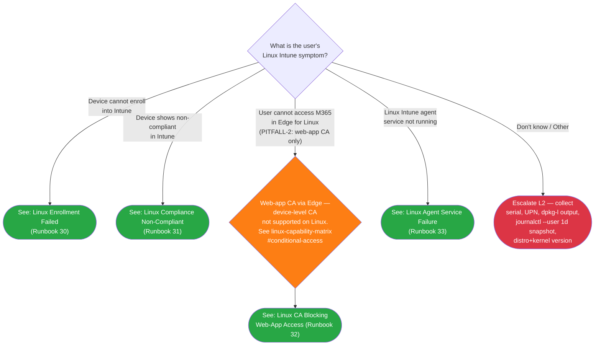
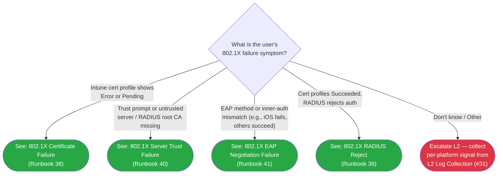

# Phase 107: L1 Runbooks #38-41 (802.1X Triage) - Pattern Map

**Mapped:** 2026-06-30
**Files analyzed:** 5 (4 L1 runbooks + 1 decision tree)
**Analogs found:** 5 / 5 (all via composite source — two frontmatter/skeleton analogs + one tree analog)

---

## File Classification

| New File | Role | Data Flow | Closest Analog(s) | Match Quality |
|----------|------|-----------|-------------------|---------------|
| `docs/l1-runbooks/38-8021x-certificate-failure.md` | L1 runbook | request-response (triage) | `#34` (frontmatter + scope note) + `#35` (section skeleton + collect-don't-interpret) | role-match composite |
| `docs/l1-runbooks/39-8021x-radius-reject.md` | L1 runbook | request-response (triage) | same composite | role-match composite |
| `docs/l1-runbooks/40-8021x-server-trust-failure.md` | L1 runbook | request-response (triage) | same composite | role-match composite |
| `docs/l1-runbooks/41-8021x-eap-negotiation-failure.md` | L1 runbook | request-response (triage) | same composite | role-match composite |
| `docs/decision-trees/10-8021x-triage.md` | decision tree | request-response (routing) | `docs/decision-trees/09-linux-triage.md` | exact |

**Why composite for runbooks:** No single existing runbook is both cross-platform AND symptom-primary. `#34` owns the compound frontmatter + L1 scope note pattern; `#35` owns the section skeleton + collect-don't-interpret depth discipline. The 1C structure (D-01) diverges from `#34`'s A/B/C path model — SC2:213 is the structural spec, not `#34`'s body.

---

## Pattern Assignments

### All four L1 runbooks (#38, #39, #40, #41) — shared skeleton

All four runbooks are structurally identical. The differences are: symptom title, first-check prose, per-platform diagnostic signal table rows, escalation divergence notes, and L2 routing destination (D-07). Extract the skeleton once and replicate four times.

---

#### Frontmatter block

**Analog:** `docs/l1-runbooks/34-apple-business-shared-ipad-passcode-reset.md` lines 1–6

```yaml
---
last_verified: 2026-06-30
review_by: 2026-09-28
applies_to: both
audience: L1
platform: windows+macos+ios+android+linux
---
```

**What to preserve:** `+`-delimited compound token (extend `#34`'s `ios+macos+shared-ipad` to all five); `audience: L1`; 90-day freshness pair (`last_verified` + 90 days = `review_by`); `applies_to: both` (Wi-Fi + Wired).

**What to strip:** `#34`'s `applies_to: apple-business` domain token — replace with `both` (Wi-Fi + Wired). Do NOT use `#35`'s single-platform `platform: macOS` token; these runbooks are cross-platform.

---

#### Platform gate callout

**Analog:** `docs/l1-runbooks/34-apple-business-shared-ipad-passcode-reset.md` line 9 (blockquote callout immediately after frontmatter)

```markdown
> **Platform gate:** This guide covers 802.1X [symptom] across all five platforms (Windows / macOS / iOS / Android / Linux). For other 802.1X failure symptoms, return to the [802.1X Triage Decision Tree](../decision-trees/10-8021x-triage.md).
```

**Note:** Adapt the text; the cross-platform gate format (blockquote, bold `Platform gate:` label) is the corpus pattern from `#34:9`.

---

#### L1 read-only scope note

**Analog:** `docs/l1-runbooks/34-apple-business-shared-ipad-passcode-reset.md` line 17

```markdown
> **L1 scope note:** L1 Triage Steps in this runbook are read-only checks. State-changing commands (MDM ClearPasscode, MDM EraseDevice) appear ONLY in the per-cause `### Admin Action Required` sections — they are not L1 actions.
```

**What to clone:** The `> **L1 scope note:**` blockquote format and the "read-only checks" + "state-changing commands … ONLY in … not L1 actions" language structure. Adapt the parenthetical examples (replace MDM commands with 802.1X remediation examples relevant to the symptom). This note appears directly after the platform gate callout and before the `## Prerequisites` heading.

---

#### Section skeleton

**Analog:** `docs/l1-runbooks/35-macos-sso-sign-in-failure.md` overall structure (lines 14–108)

```markdown
## Prerequisites

## Symptom

## First Checks (All Platforms)

## Per-Platform Diagnostic Signal

| Platform | Signal / Channel | L1 Action |
|----------|-----------------|-----------|
| Windows (Wi-Fi)  | ... | ... |
| Windows (Wired)  | ... | ... |
| macOS            | ... | ... |
| iOS/iPadOS       | ... | ... |
| Android          | ... | ... |
| Linux            | ... | ... |

## Per-Platform Escalation Notes

### Windows
### macOS
### iOS/iPadOS
### Android
### Linux

## Escalation Criteria

**Before escalating, collect:**

## Version History
```

**What this differs from `#35`:** `#35` has a flat Steps list per single-platform root-cause walk. The 1C structure mandates: shared prose sections (Symptom, Prerequisites, First Checks) → per-platform table → per-platform divergence notes → escalation. This is SC2:213 ordering, not `#35`'s step numbering. The `## Prerequisites`, `## Escalation Criteria`, `**Before escalating, collect:**`, and `## Version History` headings ARE cloned from `#35`.

---

#### Prerequisites section

**Analog:** `docs/l1-runbooks/35-macos-sso-sign-in-failure.md` lines 15–21

```markdown
## Prerequisites

- Access to Intune admin center (https://intune.microsoft.com)
- Access to Microsoft Entra admin center (https://entra.microsoft.com) — read-only is sufficient
- Device serial number
- User's UPN (email address)
```

**What to clone:** Bullet format. Intune admin center access is always first. Add "Device platform (Windows/macOS/iOS/Android/Linux)" as a fourth bullet since the per-platform table requires knowing the platform upfront.

---

#### Collect-don't-interpret pattern (macOS command model)

**Analog:** `docs/l1-runbooks/35-macos-sso-sign-in-failure.md` lines 24–34

```markdown
   Once Terminal is open, have the user run the following command exactly as shown:

   ```bash
   app-sso platform -s
   ```

   Ask the user to copy and paste the **complete output** back to you (the full JSON block, not just part of it). ...

   If the output shows anything other than both fields in a REGISTERED state, note the full output — do **not** attempt to interpret individual field values; collect the complete output and continue triage below.
```

**What to clone:** The "run the following command exactly as shown" + fenced code block + "copy and paste the **complete output**" + "do **not** attempt to interpret individual field values; collect the complete output" language structure.

**What to change:** Replace `app-sso platform -s` with the 802.1X-appropriate command per platform (see Per-Platform Diagnostic Signal table in RESEARCH.md). For macOS: `log show --predicate 'subsystem contains "com.apple.eapol"' --info --last 30m`. For Linux: `journalctl -u NetworkManager`. For Windows: Event Viewer navigation (no single command — name the channel path instead).

**Critical pitfall guard:** Do NOT copy `app-sso platform -s` from `#35` into any 802.1X runbook. That command is Platform SSO diagnostics, not 802.1X/EAPOL. See RESEARCH.md Pitfall 2.

---

#### Escalation Criteria section

**Analog:** `docs/l1-runbooks/35-macos-sso-sign-in-failure.md` lines 77–98

```markdown
## Escalation Criteria

Escalate to L2 if:

- Error 10002 is present and requires unassigning the legacy SSO extension profile (admin-level policy change)
- ...

**Before escalating, collect:**

- Full output of `app-sso platform -s` (the complete JSON block — not a single field)
- Device serial number
- User UPN (email address)
- macOS version (Apple menu > About This Mac)
- ...

See [macOS Platform SSO Investigation (L2 #27)](../l2-runbooks/27-macos-sso-investigation.md) for PSSO registration and Password-sync failure investigation.
```

**What to clone:** `## Escalation Criteria` heading; `Escalate to L2 if:` bullet list; `**Before escalating, collect:**` bold label + bullet list; trailing `See [...]` L2 reference line.

**What to change — critical (D-06/D-07):** L2 #31-33 do NOT exist yet. Replace the live link `[macOS Platform SSO Investigation (L2 #27)](../l2-runbooks/27-macos-sso-investigation.md)` with **prose-only forward-reference**:

```markdown
See L2 Log Collection (#31) for per-platform log sources before proceeding to
L2 Certificate Chain Investigation (#32) [runbook #38 only] or
L2 RADIUS/EAP Investigation (#33) [runbooks #39, #40, #41].
(Live links wired in Phase 108.)
```

Apply the D-07 routing map per runbook:
- `#38` → "L2 #31 (log collection) → L2 #32 (certificate chain investigation)"
- `#39` → "L2 #31 → L2 #33 (RADIUS/EAP investigation)"
- `#40` → "L2 #31 → L2 #33 (server-name validation, primary) + L2 #32 (trusted root chain, cross-ref)"
- `#41` → "L2 #31 → L2 #33 (RADIUS/EAP investigation)"

The `#35:98` live link to `#27` is valid because #27 already exists. The equivalent for Phase 107 would be broken links — use prose only.

---

#### Navigation footer

**Analog:** `docs/l1-runbooks/35-macos-sso-sign-in-failure.md` line 102

```markdown
[Back to macOS ADE Triage](../decision-trees/06-macos-triage.md)
```

**What to clone:** The bare link line above `## Version History`, outside all sections.

**What to change:** Replace with:

```markdown
[Back to 802.1X Triage Decision Tree](../decision-trees/10-8021x-triage.md)
```

---

#### Version History table

**Analog:** `docs/l1-runbooks/35-macos-sso-sign-in-failure.md` lines 104–108

```markdown
## Version History

| Date | Change | Author |
|------|--------|--------|
| 2026-06-21 | Initial version | -- |
```

**Clone verbatim** with date `2026-06-30` and "Phase 107 plan NN-NN: initial authoring — [runbook title]" in the Change column. Author `--`.

---

### `docs/decision-trees/10-8021x-triage.md` (decision tree, request-response routing)

**Analog:** `docs/decision-trees/09-linux-triage.md` (exact match by role + data flow)

---

#### Frontmatter block

**Analog:** `docs/decision-trees/09-linux-triage.md` lines 1–6

```yaml
---
last_verified: 2026-04-27
review_by: 2026-06-26
applies_to: all
audience: L1
platform: Linux
---
```

**What to clone:** All six frontmatter keys. **What to change:** `platform: windows+macos+ios+android+linux`; `applies_to: both` (Wi-Fi + Wired); `last_verified: 2026-06-30`; `review_by: 2026-09-28`.

---

#### Platform gate callout

**Analog:** `docs/decision-trees/09-linux-triage.md` lines 8–9

```markdown
> **Platform gate:** This guide covers Linux Intune client troubleshooting (Ubuntu 22.04/24.04 LTS). For Windows Autopilot, see [Initial Triage Decision Tree](00-initial-triage.md). ...
```

**What to clone:** `> **Platform gate:**` blockquote format. **What to change:** Adapt content to 802.1X cross-platform triage; reference sibling trees and the initial triage tree.

---

#### How-to-use note with node-budget declaration

**Analog:** `docs/decision-trees/09-linux-triage.md` lines 11–15

```markdown
## How to Use This Tree

Start here when a user reports an issue with a Linux device enrolled (or expected to enroll) in Intune. Identify the failure symptom, then follow the matching branch to an L1 runbook or L2 escalation. All terminal nodes are within 2 decision steps of the root (well under the SC #1 5-node budget). Per Phase 51 D-01 + PITFALL-1 mitigation, this tree uses a flat-symptom shape (no enrollment-mode pre-gate) ...
```

**What to clone:** `## How to Use This Tree` heading; "All terminal nodes are within 2 decision steps of the root (well under the SC #1 5-node budget)" sentence. **What to change:** "a user reports a 802.1X connection failure"; reference Phase 107 D-03 + D-04; "flat-symptom shape (symptom-primary root, per D-03; per-platform leaves live inside the runbooks, not this tree)."

---

#### Legend section

**Analog:** `docs/decision-trees/09-linux-triage.md` lines 17–25

```markdown
## Legend

| Symbol | Meaning |
|--------|---------|
| Diamond `{...}` | Decision -- answer the question |
| Green rounded `([...])` | Resolved -- follow the linked L1 runbook |
| Red rounded `([...])` | Escalate to L2 -- collect data listed in Escalation Data table and hand off |
| Orange rounded `([...])` | Architectural callout -- web-app CA only on Linux (PITFALL-2) |
```

**What to clone:** All four Legend rows format. **What to change:** Drop the orange `pitfallCallout` row (no architectural callout node in the 802.1X tree — the tree stays at 6 nodes max, no room for a disambiguation callout). Keep Diamond, Green resolved, Red escalate.

---

#### Mermaid block

**Analog:** `docs/decision-trees/09-linux-triage.md` lines 27–51

```markdown

```

**What to clone — verbatim structural elements:**
- `graph TD` directive
- `{"..."}` diamond syntax for decision nodes
- `(["..."])` rounded-rectangle syntax for terminal nodes
- `-->|"label text"|` edge syntax with pipe-delimited label
- `click NODEID "relative-path"` directives (one per resolved terminal)
- `classDef resolved fill:#28a745,color:#fff` (green)
- `classDef escalateL2 fill:#dc3545,color:#fff` (red)
- `class NODEID classname` assignment lines

**What to change for the 802.1X tree:**



**Node budget:** 1 root (`EAP1`) + 4 symptom terminal nodes + 1 escalation terminal = 6 nodes. All terminal nodes are within 1 decision step of root. Under the 5-node/2-step budget stated in `09-linux-triage.md:15,55`. No `pitfallCallout` class needed — omit that `classDef` line.

**`click` directives:** All four runbook links use relative paths from `docs/decision-trees/` to `docs/l1-runbooks/`. The "Don't know / Other" escalation node (`EAPE`) has NO `click` directive (L2 #31 doesn't exist yet; D-06 prose-only).

---

#### Routing Verification table

**Analog:** `docs/decision-trees/09-linux-triage.md` lines 53–64

```markdown
## Routing Verification

All terminal nodes are within 2 decision steps of the root node (LIN1), well under the SC #1 5-node budget.

| Path | Step 1 (root) | Step 2 (CA disambiguation, where applicable) | Destination |
|------|---------------|----------------------------------------------|-------------|
| Enrollment failed | Device cannot enroll into Intune | (terminal) | Runbook 30 |
...
```

**What to clone:** `## Routing Verification` heading; "All terminal nodes are within N decision steps" sentence; table with Path / Step 1 / Step 2 / Destination columns. **What to change:** All rows become 802.1X symptom paths. Step 2 column will be "(terminal)" for all rows (no disambiguation node in the 802.1X tree). Node ID in the sentence: `EAP1` replacing `LIN1`.

---

#### How-to-Check and Escalation Data sections

**Analog:** `docs/decision-trees/09-linux-triage.md` lines 66–83

```markdown
## How to Check

Use these questions to identify which symptom branch applies before routing.

| Question | How to Check |
|----------|-------------|
| Did the device successfully enroll into Intune? | Open Intune admin center > **Devices > All devices** ... |
...

## Escalation Data

Collect this information before routing to L2.

| When You Escalate | Collect This |
|-------------------|-------------|
| Unknown / Other (LINE1) | Device serial number, User UPN, distro + version ... |
```

**What to clone:** Both section headings, both table shapes (two-column), introductory sentences. **What to change:** Questions become 802.1X symptom discriminators (from RESEARCH.md Per-Symptom Mapping); Escalation Data row becomes the EAPE node with 802.1X-appropriate collect list (device serial, UPN, platform, Intune cert profile screenshot, event log channel name).

---

#### Related Resources and Version History

**Analog:** `docs/decision-trees/09-linux-triage.md` lines 85–100

```markdown
## Related Resources

- [Linux L1 Runbooks Index](../l1-runbooks/00-index.md#linux-l1-runbooks) — All 4 Linux L1 runbooks (30-33)
- [Linux Provisioning Glossary](../_glossary-linux.md) — ...
...

## Version History

| Date | Change | Author |
|------|--------|--------|
| 2026-04-27 | Initial version (Phase 51 — ...) | -- |
```

**What to clone:** Both headings; Related Resources bullet format; Version History table. **What to change:** Related Resources links point at the four new 802.1X runbooks, `_glossary-network.md`, `01-eap-method-overview.md`, `02-cert-delivery-foundation.md`, and the initial triage tree. Version History entry: `2026-06-30 | Phase 107 plan NN: initial authoring — 802.1X triage decision tree (symptom-primary, D-03/D-04) | --`.

---

## Shared Patterns

### 1. Callout vocabulary

**Source:** `docs/l1-runbooks/34-apple-business-shared-ipad-passcode-reset.md` (inline examples) + Phase 106 CONTEXT.md census
**Apply to:** All five new files

Permitted labels: `NOTE`, `WARNING`, `DANGER`, `CRITICAL` only. Blockquote format:

```markdown
> **NOTE:** [text]
> **WARNING:** [text]
> **DANGER:** [text]
> **CRITICAL:** [text]
```

`IMPORTANT` is out-of-vocabulary. `DANGER`/`CRITICAL` reserved for auth-break/lockout hazards (per Phase 106 CONTEXT.md callout census). The `#34:17` scope note uses `**L1 scope note:**` — this is a named pattern label, not a callout; keep it as-is.

---

### 2. Freshness stamps (90-day)

**Source:** `docs/l1-runbooks/35-macos-sso-sign-in-failure.md` lines 1–3; `docs/decision-trees/09-linux-triage.md` lines 1–3
**Apply to:** All five new files

```yaml
last_verified: 2026-06-30
review_by: 2026-09-28
```

`review_by` = `last_verified` + 90 days. Both dates in `YYYY-MM-DD` format.

---

### 3. Anchor slug discipline (plain GitHub auto-slugs)

**Source:** Phase 106 CONTEXT.md canonical_refs; no `{#id}` overrides in any corpus file
**Apply to:** All five new files

Section headings generate slugs automatically. Rules:
- Use simple heading text; GitHub auto-slugs lowercase + hyphens
- Double-hyphen trap: avoid adjacent hyphens in heading names (e.g., "Pre-Check — iOS" → slug `pre-check--ios`; prefer "iOS Pre-Check" → `ios-pre-check`)
- No `{#id}` override syntax anywhere in these files
- The `#35:98` link `[macOS Platform SSO Investigation (L2 #27)](../l2-runbooks/27-macos-sso-investigation.md)` is a corpus example of a valid live link; the Phase 107 L2 equivalents are prose-only (D-06)

---

### 4. Navigation-last invariant

**Source:** `docs/l1-runbooks/35-macos-sso-sign-in-failure.md` line 98 (live link only where target exists); Phase 107 CONTEXT.md D-06/D-08
**Apply to:** All five new files

- No live relative links to L2 #31-33 (not yet created — Phase 108)
- No edits to `docs/l1-runbooks/00-index.md` (deferred — Phase 109, D-08)
- The `click` directives in `10-8021x-triage.md` that point to the four new runbooks ARE valid — those files are created in the same phase
- The "Don't know / Other" escalation node has NO `click` directive — its L2 target (#31) doesn't exist yet

---

### 5. L1 read-only scope enforcement

**Source:** `docs/l1-runbooks/34-apple-business-shared-ipad-passcode-reset.md` line 17
**Apply to:** All four L1 runbooks

The scope note blockquote must appear in every runbook immediately after the platform gate callout. Android escalation note must include: "L1 names the `adb logcat -s "wpa_supplicant"` filter; do NOT attempt to run adb commands at L1 — requires USB debugging + tethered PC. L2 or local IT team collects this." (RESEARCH.md Pitfall 3)

---

## Link-Not-Copy Targets (read-only, never restate inline)

These files are link targets for all four runbooks. Content from them must NOT be restated inline.

| Target File | What to Link, Not Copy | Used By |
|-------------|----------------------|---------|
| `docs/admin-setup-8021x/01-eap-method-overview.md` | EAP method overview (EAP-TLS / PEAP-MSCHAPv2 / EAP-TTLS, co-equal) | #41 (EAP negotiation context) |
| `docs/admin-setup-8021x/02-cert-delivery-foundation.md` | Cert-delivery ordering rule (CRITICAL callout at `:37`); EKU = Client Auth; server-name validation (`:98-104`) | #38 (ordering constraint), #40 (server-name validation) |
| `docs/admin-setup-8021x/03-windows.md` lines 103–118 | dot3svc service dependency (detect + remediate) | #38/#39/#40/#41 (wired Windows L1 note — link, don't reproduce the full WARNING block) |
| `docs/_glossary-network.md` | 802.1X / EAP / EAPOL / RADIUS / supplicant / server-name-validation term anchors | All four runbooks + tree |

---

## No Analog Found

None. All five files have analog coverage via the composite pattern above.

---

## Strips / Anti-Patterns to Enforce

| Pattern to Strip | Source of Temptation | Correct Approach |
|-----------------|---------------------|------------------|
| `#34` A/B/C path structure | `#34` is named as the frontmatter analog | 1C structure only (SC2:213); paths don't apply to symptom-primary runbooks |
| `app-sso platform -s` command | `#35:29` is the collect-don't-interpret model | For 802.1X: `log show --predicate 'subsystem contains "com.apple.eapol"' --info --last 30m` (macOS), `journalctl -u NetworkManager` (Linux) |
| `adb logcat` as an L1 action | Per-platform table includes the Android tag | Mark as "escalation-collected — L1 names, does NOT run" |
| Live links to `../l2-runbooks/31-`, `32-`, `33-` | D-07 routing map feels linkable | Prose-only forward-references; live links wired in Phase 108 |
| `pitfallCallout classDef` in tree | `#09` defines it | 802.1X tree has no architectural callout node; omit orange `classDef` |
| Editing `00-index.md` | 4× legacy in-phase index precedent (`#34` Phase 65, `#35/#36` Phase 80, `#37` Phase 99) | Conscious defer to Phase 109 (D-08); note the override explicitly in the plan |
| `IMPORTANT` callout label | Common markdown practice | Out-of-vocabulary; use NOTE/WARNING/DANGER/CRITICAL only |
| `{#id}` anchor overrides | Desire to control slug text | Plain GitHub auto-slugs only; avoid double-hyphen trap in heading names |

---

## Metadata

**Analog search scope:** `docs/l1-runbooks/`, `docs/decision-trees/`, `docs/admin-setup-8021x/`
**Files read:** 4 analog files (34, 35, 09-linux-triage, 03-windows lines 98–127) + CONTEXT.md + RESEARCH.md
**Pattern extraction date:** 2026-06-30
