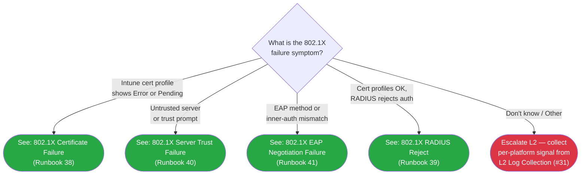

# Phase 107: L1 Runbooks #38-41 (802.1X Triage) - Research

**Researched:** 2026-06-30
**Domain:** 802.1X L1 triage runbook authoring (documentation phase) — five-platform diagnostic-signal verification
**Confidence:** HIGH for Windows/Linux/iOS (corpus-verified or Microsoft Learn-verified); MEDIUM for macOS log command and Android adb tags

---

<user_constraints>
## User Constraints (from CONTEXT.md)

### Locked Decisions

**D-01 — Structure = 1C:** shared symptom + shared first-checks → compact per-platform diagnostic-signal table → per-platform escalation-divergence notes (HIGH). Anchor: ROADMAP.md:213 SC2 four-part ordering.

**D-02 — Frontmatter = compound multi-platform:** `platform: windows+macos+ios+android+linux` + `audience: L1` + `applies_to` + 90-day freshness pair (`last_verified` / `review_by`). Anchor: `docs/l1-runbooks/34-...:1-6`.

**D-03 — Tree axis = 2A: symptom-primary root** → 4 branches → runbook; per-platform leaves live INSIDE the runbook (HIGH). Anchor: ROADMAP.md:214 SC3 "routes L1 by symptom to the correct runbook with per-platform leaves."

**D-04 — Decision tree `10-8021x-triage.md` IS a Phase-107 deliverable** (HIGH). The Phase 108 title mentions it as a stale label; P107 SC3 and DOT1X-09 are dispositive.

**D-05 — Depth = per-platform-calibrated** (HIGH): name-the-signal baseline; user-run read-only command ONLY where genuinely L1-feasible. Per-platform rule table:

| Platform | L1 stops at |
|----------|-------------|
| Windows | Name the WLAN-AutoConfig / Wired-AutoConfig Event Viewer channel; open + collect output, do NOT interpret. |
| macOS | Name the signal + ONE user-runnable read-only command; collect complete output, do NOT interpret. |
| iOS | Intune-portal inspection only — NO device command exists. |
| Android | Name the `adb logcat` 802.1X filter as an escalation-collected signal, NOT an L1 user action. |
| Linux | Name the signal + ONE user-runnable read-only command; collect output, do NOT interpret. |

**D-06 — Forward-refs to L2 #31-33 = prose only, no live links** (HIGH). Navigation-last: no live cross-links to content that does not yet exist (L2 #31-33 are Phase 108).

**D-07 — Symptom→L2 routing map** (HIGH): #38→L2 #32; #39→L2 #33; #41→L2 #33; #40→L2 #33 primary + #32 cross-ref; #31 = shared prerequisite for all four.

**D-08 — `docs/l1-runbooks/00-index.md` 802.1X section = DEFER to Phase 109** (MEDIUM, conscious override of the 4× legacy in-phase index habit).

### Claude's Discretion

- Exact prose, callout phrasing/labels, and section ordering within each runbook and the tree.
- Exact runbook filenames (suggested: `38-8021x-certificate-failure.md`, `39-8021x-radius-reject.md`, `40-8021x-server-trust-failure.md`, `41-8021x-eap-negotiation-failure.md`) and the tree's exact node labels / Mermaid styling — within the 1C structure (D-01), 2A axis (D-03), and per-platform depth rule (D-05).
- The exact set and shape of the per-platform diagnostic-signal table columns.
- Whether server-trust runbook #40 surfaces its #32 cross-ref inline in the escalation note or in a See-Also.

### Deferred Ideas (OUT OF SCOPE)

- L2 investigation runbooks #31-33 + verified per-platform log-filter strings → Phase 108 (DOT1X-10).
- All live navigation wiring — `docs/l1-runbooks/00-index.md`, capability-matrix rows, global nav-hub entries → Phase 109 (DOT1X-11).
- Foundation theory restatement — cert-ordering, EKU, server-name-validation, EAP comparison — already in `01-`/`02-`; link, never restate.
- RADIUS/NPS server config, PKI/CA build-out, switch/AP port config — out of milestone scope entirely.
</user_constraints>

<phase_requirements>
## Phase Requirements

| ID | Description | Research Support |
|----|-------------|------------------|
| DOT1X-09 | An L1 technician can triage 802.1X connection failures via new cross-platform L1 runbooks (#38-41) routed by `docs/decision-trees/10-8021x-triage.md`, with per-platform leaves. | Per-platform diagnostic-signal table (this research), house style from #34/#35, Mermaid scaffold from #09. |
</phase_requirements>

---

## Summary

This research answers the one open item the CONTEXT flagged as "plan-time verify": the exact, literal per-platform L1 diagnostic-signal strings for 802.1X. All implementation decisions (structure, depth rule, routing map, tree axis) are locked in CONTEXT.md and are NOT re-litigated here.

**Key finding 1 (CRITICAL CORRECTION):** The Windows wired event channel name in the milestone PITFALLS.md D-01 table is stated as "Dot3Svc/Operational channel." This is the Windows SERVICE name, not the event log provider. The correct event log channel verified from Microsoft Learn is `Microsoft-Windows-Wired-AutoConfig/Operational`. The planner must use this exact string in the runbook, not "Dot3Svc/Operational."

**Key finding 2:** The macOS L1 command for 802.1X is `log show --predicate 'subsystem contains "com.apple.eapol"' --info --last 30m` — the eapolclient unified-logging subsystem, NOT the app-sso Platform SSO surface used by #35. This is MEDIUM confidence (community-cited, not official Apple docs page).

**Key finding 3:** The Linux L1 command is `journalctl -u NetworkManager` — already present in the committed `07-linux.md` verification trio (HIGH confidence).

**Key finding 4:** The L2 routing map in D-07 is consistent with ROADMAP.md Phase 108 SCs — no mismatch found.

**Primary recommendation:** Use the per-platform signal table in this research document as the literal source for all five-platform diagnostic cells in each of the four L1 runbooks. Use the symptom discriminators in the "Per-Symptom Mapping" section to write the decision tree branches and the first-check prose in each runbook.

---

## Architectural Responsibility Map

| Capability | Primary Tier | Secondary Tier | Rationale |
|------------|-------------|----------------|-----------|
| L1 triage runbook authoring (#38-41) | Documentation / content | — | Pure markdown authoring; no backend or frontend tier involved |
| Per-platform diagnostic-signal identification | Documentation / content | — | Naming signals only; signals are read on device or Intune portal by technician |
| Intune portal inspection (iOS, Android L1) | Intune cloud portal | Device | iOS/Android have no device command; portal is the primary L1 surface |
| Windows Event Viewer channel identification | Device / endpoint | — | WLAN-AutoConfig and Wired-AutoConfig channels are local Event Viewer logs |
| macOS eapolclient unified log | Device / endpoint | — | `log show` is a local read from Apple's unified logging system |
| Linux NetworkManager journal | Device / endpoint | — | journalctl reads systemd journal locally |
| Android adb logcat | Escalation-only | Tethered PC | Requires USB debugging; named at L1 for escalation use; collected only by L2 |
| Decision tree routing (#10) | Documentation / content | — | Mermaid markdown; routes by symptom; no runtime component |

---

## Standard Stack

### Core (for documentation authoring)

| Asset | Version / Source | Purpose | Why Standard |
|-------|---------|---------|--------------|
| `docs/l1-runbooks/34-apple-business-shared-ipad-passcode-reset.md` | Current | Compound frontmatter + L1 read-only scope note template | Only multi-platform L1 runbook; D-02 frontmatter precedent |
| `docs/l1-runbooks/35-macos-sso-sign-in-failure.md` | Current | L1 runbook section skeleton + collect-don't-interpret model | D-05 macOS command pattern anchor |
| `docs/decision-trees/09-linux-triage.md` | Current | Mermaid scaffold: Legend + classDef + click + Routing-Verification table; node-budget model | D-03 tree structure anchor |
| `docs/admin-setup-8021x/01-eap-method-overview.md` | Current | EAP theory link target for #41 | link-not-copy |
| `docs/admin-setup-8021x/02-cert-delivery-foundation.md` | Current | Ordering-rule + EKU + server-name-validation link targets for #38/#40 | link-not-copy |
| `docs/_glossary-network.md` | Current | 802.1X / EAP / EAPOL / RADIUS / supplicant term anchors for all four runbooks | link-not-copy |

### New Files to Create

| File | Number | Symptom |
|------|--------|---------|
| `docs/l1-runbooks/38-8021x-certificate-failure.md` | #38 | Certificate profile Error or Pending; cert not deployed |
| `docs/l1-runbooks/39-8021x-radius-reject.md` | #39 | Cert profiles Succeeded; RADIUS rejects auth (Access-Reject) |
| `docs/l1-runbooks/40-8021x-server-trust-failure.md` | #40 | Trust prompt / untrusted server; RADIUS cert root not trusted on device |
| `docs/l1-runbooks/41-8021x-eap-negotiation-failure.md` | #41 | EAP method or inner-auth mismatch causes negotiation failure |
| `docs/decision-trees/10-8021x-triage.md` | Tree #10 | Symptom-primary routing: root → 4 branches → 4 runbooks |

---

## Package Legitimacy Audit

> NOT APPLICABLE. This is a pure documentation phase. No packages are installed.

---

## Architecture Patterns

### System Architecture Diagram

```
User/Technician receives: "802.1X connection failure"
         |
         v
[10-8021x-triage.md] (symptom-primary root question)
    "What is the 802.1X failure symptom?"
         |
    _____|_____________________________________
    |           |           |               |
    v           v           v               v
 Cert        Server      EAP-          RADIUS
 Error/      Trust       Negotiation   Reject
 Pending     Prompt      Failure       (no prompt,
 (#38)       (#40)       (#41)          certs OK)
                                        (#39)
    |           |           |               |
    v           v           v               v
Per-platform diagnostic table in each runbook:
 - Windows: Open Event Viewer channel, collect
 - macOS: Run log show command, collect
 - iOS: Check Intune portal profile status
 - Android: Note adb logcat tag for escalation
 - Linux: Run journalctl command, collect
         |
         v
     Escalation criteria → L2 #31 (log) → #32 or #33
```

### Recommended File Structure

```
docs/
├── l1-runbooks/
│   ├── 38-8021x-certificate-failure.md   (new)
│   ├── 39-8021x-radius-reject.md          (new)
│   ├── 40-8021x-server-trust-failure.md   (new)
│   └── 41-8021x-eap-negotiation-failure.md (new)
└── decision-trees/
    └── 10-8021x-triage.md                 (new)
```

### Pattern 1: 1C Runbook Structure (D-01)

**What:** shared symptom + shared first-checks → compact per-platform diagnostic-signal table → per-platform escalation-divergence notes.

**When to use:** All four runbooks. This is the locked structure.

```markdown
---
last_verified: YYYY-MM-DD
review_by: YYYY-MM-DD
applies_to: both
audience: L1
platform: windows+macos+ios+android+linux
---

> **Scope:** L1 read-only triage. All checks in this runbook are read-only.
> State-changing remediation is L2 only.

# 802.1X [Symptom Name]

[Symptom description — what the user reports / what L1 sees.]

## Prerequisites

- Access to Intune admin center (https://intune.microsoft.com)
- Device serial number or Entra device ID
- User UPN

## First Checks (All Platforms)

1. In Intune admin center, navigate to **Devices** > [platform] >
   select device by serial number > **Device configuration**.
   Confirm cert profile status (Trusted Certificate + SCEP/PKCS).
2. [Additional shared first-check step]

## Per-Platform Diagnostic Signal

| Platform | Signal to Identify / Collect | L1 Action |
|----------|------------------------------|-----------|
| Windows (Wi-Fi) | `Microsoft-Windows-WLAN-AutoConfig/Operational` | Open Event Viewer channel; collect output |
| Windows (Wired) | `Microsoft-Windows-Wired-AutoConfig/Operational` | Open Event Viewer channel; collect output |
| macOS | eapolclient unified log (`com.apple.eapol` subsystem) | Run `log show` command; collect complete output |
| iOS/iPadOS | Intune portal profile status | Inspect portal only — no device command |
| Android | `wpa_supplicant` adb logcat tag | Name for escalation only; L2 collects |
| Linux | NetworkManager journal | Run journalctl command; collect complete output |

## Per-Platform Escalation Notes

### Windows
[Platform-specific escalation divergence]

### macOS
[Platform-specific escalation divergence]

...

## Escalation Criteria

Escalate to L2 if:
- [Condition]

**Before escalating, collect:**
- [Signal collected via the per-platform table above]

See [L2 log collection (#31)](../l2-runbooks/31-...) before [L2 #32 or #33].
```

Source: SC2 ROADMAP.md:213 (symptom + first-checks + per-platform commands + escalation trigger); `#35` collect-don't-interpret model (:29-34); `#34` L1 scope note (:17).

### Pattern 2: Decision Tree Structure (D-03)

Clone `09-linux-triage.md` Mermaid scaffold. Symptom-primary root. Four branches. Each branch is a direct link to one runbook. No per-platform leaves in the tree (they live in the runbook). Node budget: 4 branches + 1 root + 1 "unknown" escalation = 6 nodes max (under the 5-node/2-step goal; all terminal nodes within 2 steps of root).



### Anti-Patterns to Avoid

- **Restating foundation theory:** cert-ordering rule, EKU explanation, EAP method overview, server-name-validation concept — all live in `01-`/`02-`; LINK, never restate.
- **Per-platform parallel sections (1A structure):** rejected by D-01. Use the shared-first + per-platform-table structure.
- **Running adb commands at L1:** Android adb logcat is L2/escalation-collected. L1 names the tag, does not run it.
- **Live links to L2 #31-33:** These files don't exist yet. Use prose-only forward-references per D-06.
- **Editing `00-index.md`:** Conscious defer to Phase 109 per D-08.
- **`IMPORTANT` callout label:** Out-of-vocabulary. Use NOTE / WARNING / DANGER / CRITICAL only.

---

## Don't Hand-Roll

| Problem | Don't Build | Use Instead | Why |
|---------|-------------|-------------|-----|
| Compound frontmatter | Custom multi-platform token syntax | `platform: windows+macos+ios+android+linux` (extend #34 precedent) | D-02 locked; corpus convention |
| L1 scope note | Custom prose | Clone from #34:17 ("L1 Triage Steps … are read-only checks; state-changing commands appear ONLY in Admin Action Required sections") | Corpus house style |
| Mermaid decision tree | New Mermaid syntax patterns | Clone scaffold from `09-linux-triage.md` (Legend + classDef + click + Routing-Verification table) | D-03; node-budget discipline established |
| Escalation section | Custom format | Clone from #35 ("Before escalating collect:") | L1 house style |
| Foundation theory | Inline restatement | Link to `01-eap-method-overview.md`, `02-cert-delivery-foundation.md`, `_glossary-network.md` | link-not-copy |

---

## Per-Platform Diagnostic Signal Table (The Main Research Deliverable)

This table is the literal source for the planner. Use exact strings as shown.

### Windows

**L1 depth rule:** Name the Event Viewer channel; open + collect output; do NOT interpret.

| Channel | Event Viewer Path | Key Event IDs | L1 Action |
|---------|------------------|---------------|-----------|
| `Microsoft-Windows-WLAN-AutoConfig/Operational` | `Applications and Services Logs\Microsoft\Windows\WLAN-AutoConfig\Operational` | 8001 (auth attempted/started), 8002 (auth succeeded), 8003 (auth failed/disconnected) | Open in Event Viewer; collect the log output; do not interpret — send full export to L2 |
| `Microsoft-Windows-Wired-AutoConfig/Operational` | `Applications and Services Logs\Microsoft\Windows\Wired-AutoConfig\Operational` | Same 8001/8002/8003 structure for wired | Open in Event Viewer; collect; do not interpret |

**Also relevant for wired (already in 03-windows.md):**
`sc query dot3svc` — confirms whether the Wired AutoConfig service is running. If `STATE: STOPPED`, this is the primary L1 wired check before any event log review.

**Confidence:** HIGH [VERIFIED: Microsoft Learn — "802.1X authentication issues troubleshooting" (updated 2026-02-12); "Data collection for troubleshooting 802.1X authentication issues" (updated 2026-02-12); retrieved 2026-06-30]

> **CORRECTION NOTE FOR PLANNER:** The milestone PITFALLS.md D-01 table lists "Dot3Svc/Operational channel" as the Windows wired event channel. This is incorrect — `Dot3Svc` is the Windows service name for the Wired AutoConfig service, not the event log provider name. The actual event log channel confirmed from Microsoft Learn is `Microsoft-Windows-Wired-AutoConfig/Operational`. Use this exact string in all runbook content; do not use "Dot3Svc/Operational" as an event channel path.

### macOS

**L1 depth rule:** Name the signal + ONE user-runnable read-only command; collect complete output; do NOT interpret.

| Signal | What It Is | L1 Command | Collect |
|--------|-----------|------------|---------|
| eapolclient unified log | macOS 802.1X supplicant (`eapolclient` daemon) logs via Apple unified logging (`com.apple.eapol` subsystem). Since macOS 10.12 (Sierra), EAPOL logs are in unified logging, not `/var/log`. | `log show --predicate 'subsystem contains "com.apple.eapol"' --info --last 30m` | Copy complete terminal output; do not interpret; send to L2 |

**L1 user-visible signal (no command needed):** System Settings > Wi-Fi shows "Authentication Failed" next to the SSID name.

**Note on command format:** This command does NOT require sudo for reading recent unified logs. If the user is on a managed Mac where elevated access is restricted, `log show` still works without elevation for reading from the unified log store. If the output is empty, the session may be too recent for the `--last 30m` window; extend to `--last 2h`.

**Confidence:** MEDIUM [CITED: Jamf technical community documentation on 802.1X wireless debug logging; web search results confirming `com.apple.eapol` subsystem predicate — not an official Apple developer docs page. Not verified directly from Apple developer documentation. The eapolclient process and com.apple.eapol subsystem are consistent across multiple independent sources.]

**NOT the right macOS command:** `app-sso platform -s` — this is Platform SSO / PSSO diagnostics, not 802.1X/EAPOL. The #35 runbook uses it for Platform SSO; #38-41 do NOT use it.

### iOS/iPadOS

**L1 depth rule:** Intune-portal inspection only — NO device command exists.

| Signal | Portal Location | L1 Action |
|--------|----------------|-----------|
| Intune device configuration profile status | Intune admin center > **Devices** > [iOS/iPadOS] > select device by serial > **Device configuration** | Check each profile: Trusted Certificate status, SCEP/PKCS cert status, Wi-Fi/Wired network profile status |
| iOS device profile list | On device: **Settings** > **General** > **VPN & Device Management** | Confirm profiles are installed; do not attempt any remediation |

**What to look for at the portal:**
- Trusted Certificate profile: must show "Succeeded"
- SCEP or PKCS profile: must show "Succeeded" with certificate enrolled
- Wi-Fi or Wired network profile: if "Error" while cert profiles show "Succeeded," escalate

**Confidence:** HIGH [CITED: PITFALLS.md D-01 (corpus research, Microsoft Learn-verified 2026-06-29); Microsoft Learn wired network settings for Apple (2026-06-04)]

### Android Enterprise

**L1 depth rule:** Name the `adb logcat` 802.1X filter as an escalation-collected signal; do NOT attempt to collect it at L1 (requires tethered PC + USB debugging + developer mode). L1 checks the Intune portal only.

| Signal | Type | L1 Action |
|--------|------|-----------|
| Intune device configuration profile status | Portal (L1 collectable) | Intune admin center > **Devices** > [Android Enterprise] > select device > **Device configuration** — check Wi-Fi profile and cert profile status |
| `adb logcat -s "wpa_supplicant"` | Escalation-collected (L2 only) | L1 names this tag for the L2 escalation note; L1 does NOT run it |

**Android adb logcat signal (for escalation note only):**
- Primary tag: `wpa_supplicant` — the 802.1X supplicant process on Android
- Filter syntax (for escalation note text): `adb logcat -s "wpa_supplicant"` or `adb logcat wpa_supplicant:V *:S`
- On newer Android (12+), additional relevant log tags: `WificondControl`, `WifiNetworkAgent`
- On older Android (pre-12): `WifiStateMachine`

**Confidence:** MEDIUM [CITED: community Android debugging references, XDA forums, Jamf community. The `wpa_supplicant` tag is consistent across sources. The newer-Android tags (`WificondControl`, `WifiNetworkAgent`) are ASSUMED from training knowledge and Android open-source changelogs — not verified against an official Android Enterprise MDM diagnostic guide.]

### Linux

**L1 depth rule:** Name the signal + ONE user-runnable read-only command; collect complete output; do NOT interpret.

| Signal | Command | Collect |
|--------|---------|---------|
| NetworkManager journal (primary) | `journalctl -u NetworkManager` | Copy complete output; do not interpret |
| wpa_supplicant journal (supplement) | `journalctl -u wpa_supplicant` | Collect if NetworkManager output is insufficient |
| Connection profile state | `nmcli connection show <connection-name>` | Shows configured EAP settings and connection state |

**Why `journalctl -u NetworkManager` is the primary L1 command:** This exact command is in the committed `07-linux.md` guide verification trio. In Ubuntu 24.04 LTS (and 26.04 LTS), NetworkManager is the primary network daemon; wpa_supplicant is typically managed by NetworkManager as a subprocess rather than as an independent systemd unit. The NM journal contains both NM-level and wpa_supplicant EAP events.

**Confidence:** HIGH [VERIFIED: `docs/admin-setup-8021x/07-linux.md` verification section, committed 2026-06-30; PITFALLS.md D-01 cites both units]

---

## Per-Symptom Mapping

For each of the four runbooks: which signal to point at, the first-check step, and the decision-tree branch discriminator.

### #38 Certificate Failure

**What it looks like:** Intune shows the 802.1X profile as "Succeeded" but the device cannot connect. The cert profile (Trusted Certificate or SCEP/PKCS) shows "Error," "Pending," or "Not applicable" — OR the cert profile shows "Succeeded" but the certificate was not actually enrolled (e.g., SCEP latency, cert expired).

**L1 first-check:** In Intune admin center, navigate to the device > Device configuration. Check each cert profile status in order: (1) Trusted Certificate — must be Succeeded; (2) SCEP/PKCS client cert — must be Succeeded; (3) Wi-Fi/Wired network profile.

**Decision-tree discriminator:** "Does Intune show the Trusted Certificate or SCEP/PKCS cert profile as Error or Pending for this device?" → Yes → #38.

**Per-platform signal to name:**
- Windows Wi-Fi: `Microsoft-Windows-WLAN-AutoConfig/Operational` — may show event 8001 with "The certificate was not found" or "chain verification failure"
- Windows Wired: `Microsoft-Windows-Wired-AutoConfig/Operational`
- macOS: eapolclient unified log — `log show --predicate 'subsystem contains "com.apple.eapol"' --info --last 30m`
- iOS: Intune portal cert profile status (primary) + Settings > VPN & Device Management
- Android: Intune portal profile status (primary); `adb logcat -s "wpa_supplicant"` named for escalation
- Linux: `journalctl -u NetworkManager`

**L2 routing:** #38 → L2 #31 (collect logs first) → L2 #32 (cert chain investigation). Prose-only forward-reference; no live link.

**Foundation link targets:** deployment ordering rule at `02-cert-delivery-foundation.md#ordering-rule`; EKU at `02-cert-delivery-foundation.md`; SCEP/PKCS at `02-cert-delivery-foundation.md`.

### #39 RADIUS Reject

**What it looks like:** All cert profiles show "Succeeded." The device attempts to connect and authentication fails — no trust prompt, no cert error. The RADIUS server is reachable (this is not a network connectivity issue). The connection attempt is rejected.

**L1 first-check:** Confirm ALL cert profiles show "Succeeded" in Intune (to rule out #38). Confirm the RADIUS server name field is populated in the Wi-Fi/Wired profile (to rule out a simple misconfiguration that would produce a server trust failure instead). Note the EAP method configured in the profile.

**Decision-tree discriminator:** "Are cert profiles Succeeded AND there is no trust prompt, AND the failure is a clean auth rejection?" → #39. (If the user sees a trust popup → #40. If there's an EAP type mismatch → #41.)

**Per-platform signal to name:** Same as #38 (WLAN-AutoConfig, Wired-AutoConfig for Windows; eapolclient log for macOS; portal for iOS; adb logcat named for Android; NetworkManager journal for Linux). The Windows event logs will show 8003 (failure) without a certificate-chain error event; on macOS the unified log shows EAPOL rejection after the TLS tunnel is established.

**L2 routing:** #39 → L2 #31 → L2 #33 (RADIUS/EAP investigation). Prose-only forward-reference.

### #40 Server Trust / Validation Failure

**What it looks like:** On Windows, the user sees an intermittent certificate trust dialog ("Trust this certificate?"). On macOS/iOS, the connection fails immediately with "Authentication Failed" and there is no user prompt (managed profiles suppress the dialog, so trust failures are silent on these platforms). The Trusted Certificate profile for the RADIUS server root CA may be missing, wrong, or not yet deployed to the device.

**L1 first-check:** In Intune, check whether a Trusted Certificate profile for the RADIUS server's root CA is assigned to this device group AND shows "Succeeded." Also verify the Certificate server names field in the Wi-Fi/Wired profile is populated (an empty field with server validation nominally enabled is a misconfiguration that produces this symptom).

**Decision-tree discriminator:** "Does the user or technician observe a certificate trust dialog or 'untrusted server' indicator? OR is the Trusted Certificate profile for the RADIUS root CA missing/failed?" → #40.

**Per-platform signal to name:**
- Windows Wi-Fi: `Microsoft-Windows-WLAN-AutoConfig/Operational` — event 8001 "The server certificate chain couldn't be validated" or event 8003 "Authentication failed"
- Windows Wired: `Microsoft-Windows-Wired-AutoConfig/Operational`
- macOS: eapolclient unified log — `log show --predicate 'subsystem contains "com.apple.eapol"' --info --last 30m` — may show "identity rejected by server" or trust validation failure
- iOS: Intune portal Trusted Certificate profile status (primary L1 signal)
- Android: Intune portal (Trusted Certificate profile status); `adb logcat -s "wpa_supplicant"` for escalation
- Linux: `journalctl -u NetworkManager` — NM/wpa_supplicant logs will show TLS handshake failure

**L2 routing:** #40 → L2 #31 → L2 #33 (primary: server-name validation) + L2 #32 (cross-ref: trusted root chain inspection). Both escalation destinations should be noted in prose. The #33 is primary per D-07; #32 is a legitimate cross-ref because the trusted root cert chain is the root cause mechanism.

**Foundation link targets:** server-name validation at `02-cert-delivery-foundation.md#server-name-validation`; trusted root deployment at `02-cert-delivery-foundation.md`; RADIUS server trust concept at `_glossary-network.md#server-name-validation`.

### #41 EAP Negotiation Failure

**What it looks like:** The connection attempt fails after a longer delay than a cert-rejection would produce (the EAP negotiation starts but the method is rejected). Cert profiles all show "Succeeded" in Intune. No trust dialog. The symptom is consistent across all users on a given device type or platform. A common cause is iOS with PEAP where the RADIUS side is configured for PAP (iOS PEAP inner auth is always MS-CHAPv2 — PAP causes immediate EAP-NAK). Another cause is EAP-TTLS inner-auth mismatch between the Intune profile and the RADIUS policy.

**L1 first-check:** Confirm cert profiles are Succeeded (to rule out #38). Ask: "Which EAP method is configured in the Intune profile? Did this work before or has this never worked? Is this affecting one device type or all platforms?" Note: iOS PEAP with PAP causes an immediate EAP-NAK — this is a platform-specific symptom that surfaces as "Authentication Failed on iOS only while other platforms succeed on the same SSID."

**Decision-tree discriminator:** "Is there evidence of an EAP type or inner-auth mismatch (e.g., iOS fails on an SSID where other platforms succeed, suggesting PEAP inner-auth incompatibility)?" → #41.

**Per-platform signal to name:** Same pattern as #38/#39, with particular attention to:
- Windows: `Microsoft-Windows-WLAN-AutoConfig/Operational` — event may show EAP negotiation failure with method-specific text
- macOS: eapolclient unified log
- iOS: No device log; L1 uses portal only; the symptom pattern (iOS fails, others succeed) is itself the discriminating signal
- Android: `adb logcat -s "wpa_supplicant"` for escalation — wpa_supplicant logs EAP NAK/reject details
- Linux: `journalctl -u NetworkManager` — NM logs EAP method negotiation

**L2 routing:** #41 → L2 #31 → L2 #33 (RADIUS/EAP investigation). Prose-only forward-reference.

**Foundation link targets:** EAP method overview at `01-eap-method-overview.md`; inner-auth behavior by platform at the per-platform admin-setup guides (`03-windows.md`, `04-macos.md`, `05-ios.md`, `06-android.md`, `07-linux.md`).

---

## Common Pitfalls

### Pitfall 1: Windows Wired Event Channel Name Error

**What goes wrong:** Planner uses "Dot3Svc/Operational" as the Event Viewer channel name for Windows wired 802.1X.
**Why it happens:** PITFALLS.md D-01 table uses "Dot3Svc/Operational channel" — referring to the Windows service name (dot3svc = Dot3Svc = Wired AutoConfig service), not the event log provider name.
**How to avoid:** Use `Microsoft-Windows-Wired-AutoConfig/Operational` in all runbook content. The service name and the event channel name are different strings on Windows.
**Warning signs:** Any runbook draft that says "open Dot3Svc/Operational in Event Viewer" — this path does not exist in Event Viewer by that name.

### Pitfall 2: macOS Command is EAPOL not PSSO

**What goes wrong:** Author copies `app-sso platform -s` from #35 and uses it for 802.1X runbooks.
**Why it happens:** #35 is the macOS L1 house-style model (per CONTEXT.md D-05), and CONTEXT.md mentions "app-sso platform -s-style." But `app-sso platform -s` is for Platform SSO, not 802.1X.
**How to avoid:** For 802.1X runbooks, the correct macOS command is `log show --predicate 'subsystem contains "com.apple.eapol"' --info --last 30m`. Only the command PATTERN from #35 (one command, collect complete output, don't interpret) is reused — not the specific command string.
**Warning signs:** Any #38-41 runbook draft that shows `app-sso platform -s` as the macOS diagnostic command.

### Pitfall 3: Running Android adb at L1

**What goes wrong:** Runbook #38-#41 includes an Android section that asks the L1 technician to run `adb logcat`.
**Why it happens:** The per-platform diagnostic table shows the adb logcat tag for all four symptoms, and it can be mistakenly treated as an L1 action.
**How to avoid:** Android adb logcat is ESCALATION-COLLECTED (L2 only). The L1 runbook Android cell must say: "Name the `adb logcat -s "wpa_supplicant"` filter for L2; do NOT attempt to collect — requires USB debugging and a tethered PC. L1 checks Intune portal profile status only."
**Warning signs:** Any Android runbook cell with a runnable `adb` command without the escalation-only qualifier.

### Pitfall 4: Live Links to L2 #31-33

**What goes wrong:** Runbook escalation sections include relative links like `[L2 Log Collection #31](../l2-runbooks/31-8021x-log-collection.md)`.
**Why it happens:** D-07 specifies the routing map, and it is tempting to immediately wire the links.
**How to avoid:** L2 #31-33 do not exist until Phase 108. All L2 references must be PROSE ONLY: "See L2 Log Collection (#31) for the per-platform log sources, then L2 #32 for certificate chain investigation." No relative-path links to non-existent files. Live links are wired in Phase 108 per D-06.
**Warning signs:** Any `.md` link to `../l2-runbooks/31-`, `../l2-runbooks/32-`, or `../l2-runbooks/33-` in the Phase 107 files.

### Pitfall 5: Decision Tree Over-Budget

**What goes wrong:** The decision tree includes per-platform leaf nodes inside the tree itself, blowing the 5-node/2-step budget.
**Why it happens:** Per-platform leaves are natural to include, and the ROADMAP.md says "with per-platform leaves."
**How to avoid:** Per-platform leaves live INSIDE the runbook, not in the tree (D-03). The tree stays at the symptom level: 1 root + 4 symptom branches + 1 escalation node = 6 nodes max. "Per-platform leaves" in ROADMAP.md means the runbooks each have per-platform content — not that the tree has 4×5=20 leaves.
**Warning signs:** Any Mermaid draft with more than 8 total nodes in the 802.1X triage tree.

### Pitfall 6: Editing `00-index.md` in Phase 107

**What goes wrong:** After authoring the four runbooks, the planner adds an 802.1X index section to `docs/l1-runbooks/00-index.md`.
**Why it happens:** All four previous runbook-authoring phases (Phase 65, 80, 99) added index entries in the same phase.
**How to avoid:** D-08 is a CONSCIOUS override of this legacy habit. The index entry is deferred to Phase 109. The plan must include an explicit note that the `00-index.md` edit is NOT in scope for Phase 107 and why (navigation-last per ROADMAP.md:241,243).
**Warning signs:** Any task in the Phase 107 plan that touches `docs/l1-runbooks/00-index.md`.

---

## L2 Routing Map Sanity Check (Research Focus Item 7)

**Checking CONTEXT.md D-07 against ROADMAP.md Phase 108 SCs:**

| D-07 Routing | Phase 108 SC | Match? |
|-------------|--------------|--------|
| #38 cert failure → L2 #32 | SC2: "#32 enables cert chain validation, SCEP profile deployment, EKU/SAN/expiry" | YES — cert investigation is #32 |
| #39 RADIUS reject → L2 #33 | SC3: "#33 documents what to request from RADIUS/NPS team and EAP method mismatch diagnosis" | YES — RADIUS/EAP investigation is #33 |
| #41 EAP negotiation → L2 #33 | SC3: "#33 … EAP method mismatch … per platform" | YES — EAP negotiation is in #33 scope |
| #40 server trust → L2 #33 primary + #32 cross-ref | SC3: "#33 documents … server-name validation failures per platform" — #40's core is server-name/trust; SC2: cert-chain cross-ref valid | YES — no mismatch; #33 primary, #32 secondary is correct |
| #31 = shared prerequisite | SC1: "#31 serves as the prerequisite for #32 and #33" | YES |

**Verdict:** No mismatch found. The D-07 routing map is fully consistent with Phase 108 SCs. Planners can use D-07 as-is.

**Note on Decision Tree #10 in Phase 108 title:** The ROADMAP.md Phase 108 title reads "L2 Runbooks #31-33 + Decision Tree #10." D-04 has resolved this as a stale label — the tree is authored in Phase 107. No action needed from the planner; this is noted so a future reviewer of the ROADMAP does not mistake Phase 107's tree deliverable for a Phase 108 task.

---

## Code Examples

### Windows — Event Viewer Navigation (read-only collect)

```
Event Viewer (Local) >
  Applications and Services Logs >
    Microsoft >
      Windows >
        WLAN-AutoConfig >      ← Wi-Fi 802.1X
          Operational

        Wired-AutoConfig >     ← Wired 802.1X
          Operational
```

Source: [VERIFIED: Microsoft Learn — 802.1X authentication issues troubleshooting, https://learn.microsoft.com/en-us/troubleshoot/windows-client/networking/802-1x-authentication-issues-troubleshooting, updated 2026-02-12]

### Windows — Wired Service State Check (already in 03-windows.md)

```powershell
# Read-only check for dot3svc service state (L1 runnable)
Get-Service -Name dot3svc
# OR
sc query dot3svc
```

Source: [VERIFIED: docs/admin-setup-8021x/03-windows.md:109-118, committed 2026-06-30]

### macOS — eapolclient Unified Log Collect (L1 read-only)

```bash
# Collect last 30 minutes of 802.1X/EAPOL events (read-only, no sudo required)
log show --predicate 'subsystem contains "com.apple.eapol"' --info --last 30m
```

Copy complete output. Do NOT interpret individual fields. Provide the complete output to L2.

Source: [CITED: Jamf community documentation on 802.1X wireless debug logging; web search cross-reference confirming com.apple.eapol subsystem predicate — MEDIUM confidence]

### iOS/iPadOS — Portal Navigation (no device command)

```
Intune admin center:
  Devices > iOS/iPadOS > [device] > Device configuration
    → Check: Trusted Certificate profile status
    → Check: SCEP/PKCS cert profile status
    → Check: Wi-Fi or Wired network profile status

On device (read-only):
  Settings > General > VPN & Device Management
    → Verify: profile is listed and installed
```

Source: [CITED: PITFALLS.md D-01, corpus research verified against Microsoft Learn 2026-06-29]

### Android — adb logcat Tags (escalation-only, named at L1)

```bash
# L2/escalation use only — requires USB debugging + tethered PC
# Primary tag (all Android Enterprise versions):
adb logcat -s "wpa_supplicant"

# Broader filter for EAP context:
adb logcat wpa_supplicant:V *:S
```

L1 runbook must state clearly: "Collect the `adb logcat -s "wpa_supplicant"` output — request this from L2 or the user's local IT team. Do NOT attempt to run adb commands at L1."

Source: [CITED: Android community debugging references — MEDIUM confidence]

### Linux — NetworkManager Journal Collect (L1 read-only)

```bash
# Primary L1 read-only command (from 07-linux.md verification trio)
journalctl -u NetworkManager

# Supplement if NM output insufficient:
journalctl -u wpa_supplicant
```

Source: [VERIFIED: docs/admin-setup-8021x/07-linux.md verification section, committed 2026-06-30]

---

## Assumptions Log

| # | Claim | Section | Risk if Wrong |
|---|-------|---------|---------------|
| A1 | macOS eapolclient unified logging uses `com.apple.eapol` subsystem predicate | Per-Platform Diagnostic Signal Table — macOS | If the subsystem string differs in macOS 15+, the `log show` command returns no output. Planner mitigation: add a note that if output is empty, try `log show --predicate 'process == "eapolclient"' --info --last 30m` as fallback. |
| A2 | Android adb logcat newer-Android tags: `WificondControl`, `WifiNetworkAgent` | Per-Symptom Mapping — Android section | These are supplementary tags for newer Android; the primary `wpa_supplicant` tag is well-established. Misidentified tags cause L2 to filter for a non-existent tag and miss events. Since these are escalation-named-only at L1, the risk is low at L1 level. |
| A3 | `log show` on macOS does not require sudo/admin elevation for reading recent unified log events | Code Examples — macOS | If elevation is required on some managed Mac configurations, the L1 user would see a permission error. Fallback: instruct user to paste the command into Terminal; if permission denied, escalate without the log. |

---

## Open Questions (RESOLVED)

1. **macOS command authoritative verification** — **RESOLVED:** Plan 107-01/107-02 pin the exact predicate `log show --predicate 'subsystem contains "com.apple.eapol"' --info --last 30m` with the `--last 2h` fallback and a MEDIUM-confidence callout; flagged for independent Phase-108 re-verification when authoring L2 #31.
   - What we know: Community/Jamf-sourced command `log show --predicate 'subsystem contains "com.apple.eapol"' --info --last 30m` is consistent across multiple independent sources
   - What's unclear: No official Apple developer documentation page (like a WWDC tech talk or Apple technical note) verified this exact predicate
   - Recommendation: Planner should include the command with a MEDIUM-confidence callout and the `--last 2h` extension note in case `--last 30m` is empty. Phase 108 will need to independently verify the macOS log signal when authoring L2 #31.

2. **Decision tree "Unknown / Other" escalation target** — **RESOLVED (Claude's Discretion):** Plan 107-03 authors the "Don't know / Other" branch as a prose-only escalation node naming L2 #31 (log collection) as the starting point, with NO `click` directive (per D-06 navigation-last).
   - What we know: The tree needs a "Don't know / Other" branch (per `09-linux-triage.md` pattern)
   - What's unclear: The escalation target for the unknown branch — should it go directly to L2 #31 (log collection) or to a human escalation holding state?
   - Recommendation: Planner discretion (Claude's Discretion per CONTEXT.md). Suggest: escalate to L2 and name L2 #31 as the log-collection prerequisite in prose.

---

## Environment Availability

> NOT APPLICABLE. This is a pure documentation phase with no external tool dependencies beyond the file system and git. No CLI tools, services, runtimes, databases, or package managers are required beyond the standard project environment.

---

## State of the Art

| Old Approach | Current Approach | When Changed | Impact |
|--------------|------------------|--------------|--------|
| Single-platform L1 runbooks (#1-37) | Cross-platform symptom-primary L1 runbooks (#38-41) with per-platform diagnostic-signal table | Phase 107 (new in this milestone) | Requires per-platform depth calibration (D-05) instead of a single-platform command list |
| macOS 802.1X: `/var/log/wifi.log` (legacy) | macOS 802.1X: unified logging via `log show --predicate '...'` | macOS 10.12 Sierra (2016) | `/var/log/wifi.log` is no longer the primary source; unified logging is the current approach |
| Windows wired 802.1X: sometimes referred to by service name "Dot3Svc" | Windows wired 802.1X event channel: `Microsoft-Windows-Wired-AutoConfig/Operational` | Current (always been the case; naming confusion is a documentation pitfall, not a change) | Planner must use the event channel name, not the service name |

**Deprecated/outdated:**
- `/var/log/wifi.log` on macOS: Still present but no longer the primary EAPOL diagnostic; unified logging with eapolclient predicate is the current approach (macOS 10.12+).

---

## Sources

### Primary (HIGH confidence)

- Microsoft Learn — "802.1X authentication issues troubleshooting" — https://learn.microsoft.com/en-us/troubleshoot/windows-client/networking/802-1x-authentication-issues-troubleshooting (updated 2026-02-12; retrieved 2026-06-30) — confirms WLAN-AutoConfig/Operational and Wired-AutoConfig/Operational channel names; Event Viewer path verified
- Microsoft Learn — "Data collection for troubleshooting 802.1X authentication issues" — https://learn.microsoft.com/en-us/troubleshoot/windows-client/networking/data-collection-for-troubleshooting-802-1x-authentication-issues (updated 2026-02-12; retrieved 2026-06-30) — confirms `wevtutil epl "Microsoft-Windows-WLAN-AutoConfig/Operational"` and `wevtutil epl "Microsoft-Windows-Wired-AutoConfig/Operational"` as the exact event export commands
- `docs/admin-setup-8021x/03-windows.md` (committed 2026-06-30) — dot3svc detection commands; WLAN-AutoConfig reference
- `docs/admin-setup-8021x/07-linux.md` (committed 2026-06-30) — `journalctl -u NetworkManager` as the primary Linux verification command
- `.planning/research/PITFALLS.md` (verified against Microsoft Learn 2026-06-29) — per-platform diagnostic map D-01 (used with the channel-name correction noted above)
- `docs/l1-runbooks/35-macos-sso-sign-in-failure.md` — L1 house style model; collect-don't-interpret pattern

### Secondary (MEDIUM confidence)

- Jamf community / web search — macOS eapolclient unified logging via `com.apple.eapol` subsystem predicate — multiple independent sources confirm the predicate; no single official Apple documentation URL retrieved
- Android community debugging references (XDA, community.jamf.com) — `adb logcat -s "wpa_supplicant"` filter for 802.1X diagnostics; confirmed primary tag; newer-Android tags are ASSUMED

### Tertiary (LOW confidence / ASSUMED — see Assumptions Log)

- Newer Android adb tags (`WificondControl`, `WifiNetworkAgent`) — not verified against an official Android Enterprise MDM diagnostic guide; supplementary only

---

## Metadata

**Confidence breakdown:**
- Windows diagnostic channel strings: HIGH — verified from Microsoft Learn official troubleshooting guide (2026-02-12, retrieved 2026-06-30)
- iOS portal inspection: HIGH — consistent with existing corpus research (PITFALLS.md, Microsoft Learn-verified 2026-06-29)
- Linux journalctl command: HIGH — present in committed guide `07-linux.md`
- macOS eapolclient log command: MEDIUM — cited from community/Jamf sources; not from official Apple developer documentation
- Android adb logcat primary tag: MEDIUM — consistent across community sources; not from official Android Enterprise MDM diagnostic guide
- Android adb logcat newer-Android tags: LOW/ASSUMED — training knowledge supplemented by open-source changelogs
- Symptom discriminators: MEDIUM — derived from pitfall analysis and corpus research; reflect expected L1 triage patterns
- L2 routing map: HIGH — directly verified against ROADMAP.md Phase 108 SCs

**Research date:** 2026-06-30
**Valid until:** 2026-09-28 (90 days; macOS EAPOL predicate may change across major macOS releases)

---

## RESEARCH COMPLETE
