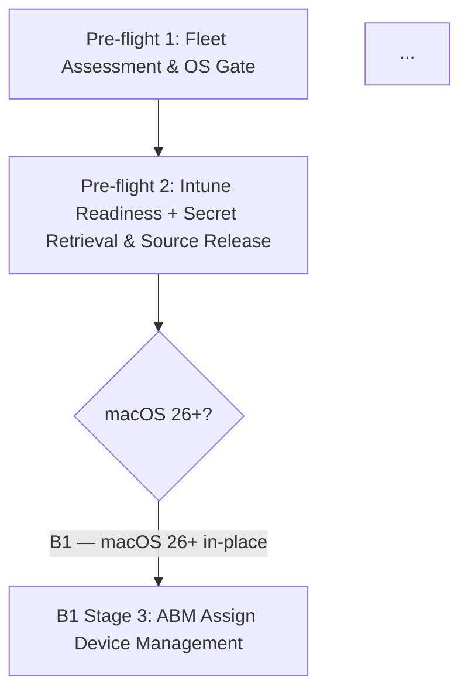

# Phase 110: Pillar B + C — Corpus Fixes + MDM Migration Walkthroughs - Pattern Map

**Mapped:** 2026-07-01
**Files analyzed:** 5 (1 new, 4 modified)
**Analogs found:** 5 / 5

---

## File Classification

| New/Modified File | Role | Data Flow | Closest Analog | Match Quality |
|---|---|---|---|---|
| `docs/ios-lifecycle/02-mdm-migration.md` | walkthrough (new) | linear-staged narrative | `docs/macos-lifecycle/02-mdm-migration-psso.md` | exact (platform parallel) |
| `docs/macos-lifecycle/02-mdm-migration-psso.md` (append appendix) | walkthrough (append) | addendum section | same file — Stage 2 sub-structure `:126-182` | self-analog |
| `docs/index.md` at `:110` | index table row | single-cell reword | `docs/index.md:112` (sibling PSSO row, already correct) | role-match |
| `docs/quick-ref-l1.md` at `:106` | quick-ref trigger line | single-line reword | `docs/quick-ref-l1.md:107`/`:108` (sibling #35/#37 triggers) | exact sibling match |
| `docs/common-issues.md` at ~`:249-254` | issue-resolution block | bullet insertion | same block `:253`/`:254` (the two surrounding bullets) | self-context |

---

## Pattern Assignments

---

### 1. NEW `docs/ios-lifecycle/02-mdm-migration.md` (walkthrough, linear-staged narrative)

**Primary analog:** `docs/macos-lifecycle/02-mdm-migration-psso.md`
**Secondary analog (tone + iOS front-matter):** `docs/ios-lifecycle/01-ade-lifecycle.md`

---

#### Front-matter pattern

Mirror `docs/macos-lifecycle/02-mdm-migration-psso.md` lines 1-7, substituting iOS values:

```yaml
---
last_verified: [authoring-date]
review_by: [authoring-date + 90 days]
applies_to: ADE
audience: all
platform: iOS
---
```

iOS front-matter precedent from `docs/ios-lifecycle/01-ade-lifecycle.md` lines 1-7:
```yaml
---
last_verified: 2026-04-17
review_by: 2026-07-16
applies_to: ADE
audience: all
platform: iOS
---
```

**Convention:** `platform: iOS` (not `platform: macOS`). `review_by` = 90 days from `last_verified` per corpus convention.

---

#### Platform-gate blockquote pattern

Mirror `docs/macos-lifecycle/02-mdm-migration-psso.md` line 9. Adapt for iOS:

```markdown
> **Platform gate:** This guide covers iOS/iPadOS MDM migration from Kandji/Iru to Microsoft Intune using the ABM "Assign Device Management" + Deadline in-place path (iOS/iPadOS 26 or later). For the underlying ADE enrollment pipeline (including the pre-26 wipe re-enroll path), see [iOS/iPadOS ADE Lifecycle](01-ade-lifecycle.md). For macOS MDM migration, see [macOS MDM Migration Walkthrough](../macos-lifecycle/02-mdm-migration-psso.md).
```

macOS original (line 9):
```markdown
> **Platform gate:** This guide covers macOS MDM migration from Kandji/Iru to Microsoft Intune with Platform SSO (PSSO), for both the wipe-free in-place path (B1, macOS 26+) and the wipe-and-re-enroll fallback path (B2, macOS 25 or earlier). For the underlying ADE enrollment pipeline, see [macOS ADE Lifecycle](00-ade-lifecycle.md). For post-migration PSSO registration on a fresh enrollment, see [macOS Platform SSO Provisioning Walkthrough](01-psso-provisioning-walkthrough.md).
```

---

#### H1 title pattern

Mirror `docs/macos-lifecycle/02-mdm-migration-psso.md` line 11:

macOS original:
```markdown
# macOS MDM Migration Walkthrough: B1 In-Place (macOS 26+) and B2 Wipe-and-Re-Enroll
```

iOS adaptation:
```markdown
# iOS/iPadOS MDM Migration Walkthrough: In-Place Migration (iOS/iPadOS 26+)
```

---

#### "Which Path Is Right for You?" table pattern

Mirror `docs/macos-lifecycle/02-mdm-migration-psso.md` lines 15-20. iOS version has one primary path row (in-place, iOS/iPadOS 26+) and a note row for pre-26.

macOS original (lines 15-20):
```markdown
## Which Path Is Right for You?

| Path | macOS Requirement | Migration Type | PSSO Re-registration | Use When |
|------|-------------------|----------------|----------------------|----------|
| **B1 — macOS 26 in-place** | macOS 26 or later (hard gate) | Wipe-free in-place; genuine unenroll + reenroll via profile-based enrollment | Always required — MDM unenrollment = IdP unregistration; new Secure Enclave key created | Target devices confirmed running macOS 26+; wipe is operationally unacceptable |
| **B2 — Pre-macOS-26 wipe** | macOS 25 or earlier | Retire/wipe/re-enroll; fresh ADE enrollment via Intune | Fresh PSSO provisioning from scratch (link to guide 01) | Target devices running macOS 25 or earlier; B1 in-place path not available |
```

iOS adaptation: replace columns for iOS — no PSSO column (drop it). Table columns: `Path | iOS/iPadOS Requirement | Migration Type | Use When`. One primary row for 26+ in-place; the pre-26 case is noted via the blockquote subsection (see B2 pointer pattern below), not a second table row.

---

#### Mermaid pipeline diagram pattern

Mirror `docs/macos-lifecycle/02-mdm-migration-psso.md` lines 51-67. iOS pipeline has 7 nodes (Stages 1-7 only; Stages 8-9 are dropped):

macOS original structure (lines 51-67):
```markdown
## The MDM Migration Pipeline


```

iOS adaptation: no fork gate (single in-place track). Node labels adapted for iOS stage names. Caption paragraph below diagram (same as macOS `:69`) explains the pre-26 subsection pointer.

---

#### Stage Summary Table pattern

Mirror `docs/macos-lifecycle/02-mdm-migration-psso.md` lines 73-91. Columns: `Stage | Actor | Location | What Happens | Key Pitfall | Path`.

iOS adaptation: 7 rows (Stages 1-7); no Stages 8-9 (FileVault Key Rotation / PSSO Re-Registration rows dropped entirely). Stage 6 row must contrast "forced device restart" (iOS) vs "non-dismissible full-screen migration prompt" (macOS text at line 82). Stage 7 row: portal-only verification; no `app-sso platform -s` command reference.

macOS Stage 6 row (line 82 — use as inversion model):
```
| 6: Deadline Enforcement | Device | On-device | Non-dismissible full-screen migration prompt at deadline; device locked until enrollment completes | Enrollment cannot complete because of policy misconfiguration — ABM admin must cancel deadline to recover | B1 |
```

iOS Stage 6 row pattern (write as):
```
| 6: Deadline Enforcement | Device | On-device | iOS/iPadOS performs a forced device restart at the deadline; device reboots and re-enrolls with Intune automatically — no user-facing locked screen (unlike macOS) | Enrollment policy not assigned in Intune before deadline — device restarts but cannot complete re-enrollment | In-place |
```

---

#### Per-stage four-part block pattern

Mirror `docs/macos-lifecycle/02-mdm-migration-psso.md` Stage 1 (lines 94-124) for the structural template. Each stage has exactly:

```markdown
## Stage N: [Name]

### What the Admin Sees

[portal view / device screen description]

### What Happens

1. **[Action].** [Detail]
2. **[Action].** [Detail]

### Behind the Scenes

- [protocol/daemon detail]

### Watch Out For

- **[Pitfall].** [Detail]
```

---

#### Stage 2 iOS analog — Activation Lock retrieval + source release (TWO sub-steps only)

**Source pattern:** `docs/macos-lifecycle/02-mdm-migration-psso.md` lines 126-181 (Stage 2).

**iOS Stage 2 = two sub-steps (NOT three):**
- DROP: FileVault recovery key retrieval (macOS `:148`, sub-step 3) — iOS has no FileVault; Data Protection is hardware-tied, always-on, no MDM-escrowed key.
- KEEP: Activation Lock bypass code retrieval (macOS `:150`, sub-step 4).
- KEEP: Delete Device Record (macOS `:154-166`, sub-step 5).

Pre-deletion warning callout to mirror from `docs/macos-lifecycle/02-mdm-migration-psso.md` line 134:
```markdown
> **Important:** Retrieve ALL secrets from Kandji/Iru BEFORE performing Delete Device Record. FileVault recovery keys and Activation Lock bypass codes are **permanently destroyed** when the device record is deleted. There is no recovery path after deletion. Activation Lock bypass codes are only available within 30 days of the device being supervised — do not delay retrieval.
```

iOS adaptation (two items instead of three; FileVault line dropped):
```markdown
> **Important:** Retrieve the Activation Lock bypass code from Kandji/Iru BEFORE performing Delete Device Record. The bypass code is **permanently destroyed** when the device record is deleted. There is no recovery path after deletion. Activation Lock bypass codes are only available within 30 days of the device being supervised — do not delay retrieval.
```

Hedge note callout to mirror from `docs/macos-lifecycle/02-mdm-migration-psso.md` lines 152-153:
```markdown
> **Note:** ... `support.iru.io` resolves but is a login-gated SPA — console navigation there is not verifiable without operator login credentials. The conceptual action is the same regardless of which portal you access: navigate to the device record, open the Device Action Menu, and access the secret-retrieval options before any deletion step. Verify current console labels on your own authoring day ...
```

---

#### Stage 6 iOS Deadline Enforcement — SC4 differentiator

Stage 6 "What Happens" must contain an explicit iOS/macOS platform contrast. Use this language (from RESEARCH.md):

```markdown
**Deadline enforcement on iOS/iPadOS:** At the deadline, iOS/iPadOS performs a **forced device restart** — the device reboots and completes enrollment in Intune automatically. Unlike macOS (which displays a non-dismissible full-screen prompt), there is no locked screen on iOS/iPadOS requiring active user input at deadline time. After the restart, the device re-enrolls with Intune using the ADE enrollment policy assigned to the device serial number.
```

macOS Stage 6 contrast anchor at `docs/macos-lifecycle/02-mdm-migration-psso.md` lines 285-298 (the source text being contrasted against).

---

#### Pre-26 wipe subsection (pointer, not staged track)

Mirror `docs/macos-lifecycle/02-mdm-migration-psso.md` lines 437-513 (B2 path pattern), adapted as a short subsection (not a full 5-stage parallel track). Key structural elements:

macOS B2 intro blockquote (lines 439-458):
```markdown
> **Pre-macOS-26 wipe-and-re-enroll path (B2) — required for all devices running macOS 25 or earlier.**
>
> The B1 in-place migration path is not available on macOS 25 or earlier. This path requires a full device wipe. ...
```

macOS B2 Stage 5 link-not-copy handoff (lines 505-513):
```markdown
### B2 Stage 5: Fresh PSSO Provisioning (Link-Not-Copy Handoff to Guide 01)
...
**[macOS Platform SSO Provisioning Walkthrough — A1 Standard Path](01-psso-provisioning-walkthrough.md)**
...
```

iOS pre-26 subsection pattern (write as — do NOT expand into multiple stages):
```markdown
## Pre-iOS/iPadOS-26: Wipe Required

> **Pre-iOS/iPadOS-26 wipe-and-re-enroll — required for all devices running iOS/iPadOS 25 or earlier.**
>
> The in-place ABM "Assign Device Management" + Deadline migration path is not available on iOS/iPadOS 25 or earlier. For pre-26 devices, a full device erase is required; the device re-enrolls via ADE in Setup Assistant.
>
> Before wiping: retrieve the Activation Lock bypass code from Kandji/Iru and perform Delete Device Record (same sequencing as Stage 2 above). The bypass code is permanently destroyed on device-record deletion.
>
> For the complete ADE re-enroll pipeline after wipe, see [iOS/iPadOS ADE Lifecycle](01-ade-lifecycle.md).
```

---

#### See Also section pattern

Mirror `docs/macos-lifecycle/02-mdm-migration-psso.md` lines 517-537 (navigation-last). iOS version references iOS-specific files.

macOS original structure (lines 517-537):
```markdown
## See Also

**Terminology and Concepts:**
- [macOS Provisioning Glossary](../_glossary-macos.md) ...

**Technical References:**
- [macOS Terminal Commands Reference](../reference/macos-commands.md) ...

**Related Guides:**
- [macOS ADE Lifecycle Overview](00-ade-lifecycle.md) ...
```

iOS adaptation: replace macOS-specific references with iOS equivalents. Retain link to `docs/_glossary-macos.md` (shared Apple glossary). No `app-sso` reference (no Terminal on iOS). Add cross-link to `01-ade-lifecycle.md` (the link-not-copy target for pre-26 wipe). Add cross-link to macOS file (platform parallel).

Secondary analog for iOS See Also format: `docs/ios-lifecycle/01-ade-lifecycle.md` lines 378-383:
```markdown
## See Also

- [iOS/iPadOS Enrollment Path Overview](00-enrollment-overview.md) -- for enrollment path comparison and selection guidance
- [macOS ADE Lifecycle](../macos-lifecycle/00-ade-lifecycle.md) -- for cross-platform ADE comparison
- [Apple Provisioning Glossary](../_glossary-macos.md) -- for terminology definitions
```

---

#### Glossary Quick Reference pattern

Mirror `docs/macos-lifecycle/02-mdm-migration-psso.md` lines 541-557. Three-column table: `Term | Definition | First Appears`.

macOS original (lines 545-557):
```markdown
| Term | Definition | First Appears |
|------|-----------|---------------|
| [ABM "Assign Device Management"](../_glossary-macos.md#assign-device-management) | ... | Stage 3 |
| [Deadline](../_glossary-macos.md#deadline) | ... | Stage 4 |
| [FileVault recovery key](../_glossary-macos.md#filevault-recovery-key) | ... | Stage 2 |
| [Activation Lock bypass code](../_glossary-macos.md#activation-lock-bypass) | ... | Stage 2 |
...
```

iOS adaptation: DROP `FileVault recovery key` row (no iOS FileVault). DROP `ACME` row (iOS ACME is an ADE pipeline detail, not migration-specific). DROP `Profile-based enrollment` row (iOS re-enrolls as ADE enrollment, not profile-based). DROP `PSSO / Platform SSO` and `app-sso platform -s` rows (no iOS PSSO). KEEP: `ABM "Assign Device Management"`, `Deadline`, `Activation Lock bypass code`, `Kandji / Iru`, `Delete Device Record`.

Secondary analog for two-column Glossary QR: `docs/ios-lifecycle/01-ade-lifecycle.md` lines 390-397 (two-column table). Either two-column or three-column format is acceptable; macOS three-column (with "First Appears") is preferred for cross-referencing.

---

#### Version History pattern

Mirror `docs/macos-lifecycle/02-mdm-migration-psso.md` lines 560-564:
```markdown
## Version History

| Date | Change |
|------|--------|
| 2026-06-24 | Phase 90 (MIG-01..04): initial MDM migration walkthrough (B1 in-place + B2 wipe paths) |
```

iOS entry:
```markdown
| [authoring-date] | Phase 110: initial iOS/iPadOS MDM migration walkthrough (in-place path, iOS/iPadOS 26+) |
```

---

### 2. MODIFY `docs/macos-lifecycle/02-mdm-migration-psso.md` — Append Jamf Pro + Mosyle Appendix (MIGF-02)

**Self-analog:** Stage 2 source-release sub-structure, `docs/macos-lifecycle/02-mdm-migration-psso.md` lines 126-181.
**Append target:** after line 565 (current last line), after the Version History table.

---

#### Appendix heading — slug-safe wording

From CONTEXT.md D-03 and RESEARCH.md slug-trap note:

```markdown
## Appendix: Source-MDM Release Steps for Jamf Pro and Mosyle
```

Slug: `appendix-source-mdm-release-steps-for-jamf-pro-and-mosyle` (clean — no `/`, no `()` in slug-generating part).

**Do NOT use:** `## Appendix (Jamf Pro / Mosyle)` → slug `appendix-jamf-pro--mosyle` (double-hyphen trap).

H3 subsection headings:
```markdown
### Jamf Pro
### Mosyle
```

Slugs: `jamf-pro`, `mosyle` (both clean).

---

#### Appendix structure — mirror Stage 2's three sub-steps per vendor

Each H3 covers: (1) FileVault recovery key retrieval, (2) Activation Lock bypass code retrieval, (3) device-record deletion. Same pre-deletion sequencing warning as Stage 2.

**Callout style for appendix:** The macOS migration file predates the Phase 109 callout-vocab lock. Use `> **Important:**` and `> **Note:**` (the file's own existing callout style). Do NOT use `NOTE:` / `WARNING:` / `DANGER:` / `CRITICAL:` box syntax.

Pre-deletion warning callout pattern from line 134 (mirror this for each vendor):
```markdown
> **Important:** Retrieve ALL secrets from [Jamf Pro / Mosyle] BEFORE performing device-record deletion. FileVault recovery keys and Activation Lock bypass codes are **permanently destroyed** when the device record is deleted. There is no recovery path after deletion.
```

Hedge note pattern from lines 152-153 (mirror for each vendor):
```markdown
> **Note:** The exact console navigation paths for [vendor] are not live-verifiable without operator login credentials. The conceptual action is the same: navigate to the device record and access the secret-retrieval options before any deletion step. Verify current console labels on your own authoring day.
```

---

#### Appendix preamble (before Jamf Pro and Mosyle H3s)

Short introduction paragraph connecting this appendix to Stage 2's Kandji/Iru steps:

Pattern: "Stage 2 above documents the source-release steps for Kandji/Iru as the source MDM. Organizations migrating from Jamf Pro or Mosyle follow the same three-step sequencing (FileVault key retrieval → Activation Lock bypass code retrieval → device-record deletion) at the conceptual-action level. The exact console paths differ; each vendor's steps are documented below at conceptual depth. Verify current console labels in the respective admin console on your authoring day."

---

#### Appendix See Also wiring (navigation-last invariant)

Appendix does not need its own See Also block — the file's existing See Also (line 517) already covers all related guides. The appendix is a content section, not a navigation hub. No new cross-links needed beyond the appendix section itself referencing Stage 2 by heading link.

---

### 3. MODIFY `docs/index.md` at `:110` — FIX-01

**Live text to replace (verified at `:110`):**
```
| [macOS L1 Runbooks](l1-runbooks/00-index.md#macos-ade-runbooks) | Scripted procedures for top macOS ADE enrollment failures (6 runbooks: device, Setup Assistant, profiles, apps, compliance, Company Portal) |
```

**Required reword (count-only fix; DRY — do NOT enumerate #35/#36/#37 again, `:112` already does):**
```
| [macOS L1 Runbooks](l1-runbooks/00-index.md#macos-ade-runbooks) | Scripted procedures for top macOS ADE enrollment failures (9 macOS L1 runbooks — 6 ADE plus 3 Platform SSO; see row below) |
```

**Sibling context for DRY check — `:112` already reads:**
```
| [macOS Platform SSO Runbooks](l1-runbooks/00-index.md#macos-ade-runbooks) | Platform SSO sign-in failure (runbook #35: "Registration Required" not appearing) or Secure Enclave key loss after password reset (runbook #36); or local password recovery for locked-out users ([runbook #37](l1-runbooks/37-macos-local-password-reset.md): FileVault recovery key / LAPS admin / Apple ID) |
```

Do NOT change `:112`. Do NOT add a new row. The "see row below" pointer in the reworded `:110` is sufficient.

**Anchor must not change:** `l1-runbooks/00-index.md#macos-ade-runbooks` — this link is correct and points to the `## macOS ADE Runbooks` H2 which covers all 9 runbooks.

---

### 4. MODIFY `docs/quick-ref-l1.md` at `:106` — FIX-02

**Live text to replace (verified at `:106`):**
```
- Secure Enclave key error after password reset or FileVault recovery --> **Escalate L2** via [Platform SSO — Secure Enclave Key Loss](l1-runbooks/36-macos-secure-enclave-key.md) first; escalate to L2 if re-registration fails (collect: serial number, macOS version, `app-sso platform -s` output)
```

**Required reword (match L1 "Use runbook" pattern of siblings #35 at `:107` and #37 at `:108`):**
```
- Secure Enclave key error after password reset or FileVault recovery --> **Use [Platform SSO — Secure Enclave Key Loss](l1-runbooks/36-macos-secure-enclave-key.md) runbook** first; escalate to L2 if re-registration fails (collect: serial number, macOS version, `app-sso platform -s` output)
```

**Sibling wiring to match (already correct — do NOT change):**

`:107` (#35):
```
- Platform SSO sign-in loop or "Registration Required" notification never appeared --> **Use [Platform SSO Sign-In Failure](l1-runbooks/35-macos-sso-sign-in-failure.md) runbook** (collect: Intune Succeeded screenshot, Company Portal version, `app-sso platform -s` output)
```

`:108` (#37):
```
- User cannot log in — local password lost or unknown --> **Use [macOS Local Password Recovery](l1-runbooks/37-macos-local-password-reset.md) runbook** (FileVault recovery key / LAPS admin / Apple ID; PSSO re-registration via #36 required afterward)
```

**The only change is at `:106`:** `**Escalate L2** via [Platform SSO — Secure Enclave Key Loss]` → `**Use [Platform SSO — Secure Enclave Key Loss](...) runbook**`. The collect-list at the end is preserved verbatim.

---

### 5. MODIFY `docs/common-issues.md` — FIX-03

**Target block heading (semantic locator — NOT stale line number `:242-247`):**
```
### macOS Local Password: User Locked Out
```

**Live text at the target location (verified ~`:249-254`):**
```markdown
### macOS Local Password: User Locked Out

User cannot log in to their Mac — local password is unknown or forgotten. Recover access using the escrowed FileVault recovery key, the macOS LAPS managed admin account, or Apple ID (where org policy allows). Note: SSPR resets the Entra password only and does not reset the independent local password on Secure Enclave Platform SSO devices. ...

- **L1:** [macOS Local Password Recovery](l1-runbooks/37-macos-local-password-reset.md)
- **L2:** [macOS Platform SSO Investigation](l2-runbooks/27-macos-sso-investigation.md) — if PSSO re-registration fails after recovering access
```

**Required insertion:** Add one bullet BETWEEN the L1 #37 line and the L2 #27 line:

```markdown
- **L1:** [Platform SSO — Secure Enclave Key Loss](l1-runbooks/36-macos-secure-enclave-key.md) — mandatory PSSO re-registration after password recovery (the reset invalidates the Secure Enclave key)
```

**Result after insertion (complete bullet sequence):**
```markdown
- **L1:** [macOS Local Password Recovery](l1-runbooks/37-macos-local-password-reset.md)
- **L1:** [Platform SSO — Secure Enclave Key Loss](l1-runbooks/36-macos-secure-enclave-key.md) — mandatory PSSO re-registration after password recovery (the reset invalidates the Secure Enclave key)
- **L2:** [macOS Platform SSO Investigation](l2-runbooks/27-macos-sso-investigation.md) — if PSSO re-registration fails after recovering access
```

**Do NOT touch:** The `### Platform SSO Re-Registration Failure (Post-Migration)` block (~`:241-247`) — this is the WRONG block. It is adjacent and was the stale REQUIREMENTS.md anchor target. Its content is unrelated to the local password recovery flow. Semantic confirmation: the wrong block text begins "Platform SSO 'Registration Required' notification has not appeared after MDM migration..."; the correct block begins "User cannot log in to their Mac — local password is unknown or forgotten."

---

## Shared Patterns

### Callout Style — Two Regimes (apply per file)

**Source:** `docs/macos-lifecycle/02-mdm-migration-psso.md` (pre-callout-vocab-lock) and `docs/ios-lifecycle/01-ade-lifecycle.md`

**Macros migration file (`:134`, `:152`):** Uses `> **Important:**` and `> **Note:**` inline blockquotes.
**Apply to:** MIGF-02 appendix (append to macOS file — must match the file's existing style) and iOS Stage 2 (new file — use same style as the macOS template).
**Do NOT use** `NOTE:` / `WARNING:` / `DANGER:` / `CRITICAL:` box syntax in either the appendix or the iOS migration file.

Phase 109 callout-vocab-locked files use the box syntax. The macOS migration file and iOS lifecycle files use `> **Bold label:**` inline blockquotes. The new iOS migration file must use the same `> **Bold label:**` style as its primary analog.

---

### Pre-Deletion Sequencing Warning (apply to iOS Stage 2 + MIGF-02 appendix)

**Source:** `docs/macos-lifecycle/02-mdm-migration-psso.md` line 134

This `> **Important:**` callout must appear in both:
1. iOS Stage 2 (adapted: one item instead of two — no FileVault key)
2. Each vendor H3 in the MIGF-02 appendix (adapted: both FileVault key AND Activation Lock code listed, same as macOS Stage 2)

---

### Hedge Language for Unverifiable Console Paths (apply to iOS Stage 2 + MIGF-02)

**Source:** `docs/macos-lifecycle/02-mdm-migration-psso.md` lines 152-153

Pattern: "resolves but is a login-gated SPA — console navigation there is not verifiable without operator login credentials. The conceptual action is the same regardless of which portal you access... Verify current console labels on your own authoring day."

Apply to:
- iOS Stage 2: Kandji/Iru console paths for iOS device Activation Lock bypass code retrieval.
- MIGF-02 Jamf Pro H3: all three sub-steps.
- MIGF-02 Mosyle H3: all three sub-steps.

---

### Navigation-Last Invariant

**Source:** Phase 109 convention (`.planning/phases/109-.../109-CONTEXT.md`) + macOS migration file structure.

The new iOS migration file's nav-hub entries are written AFTER the content file is committed. Nav-hub wiring targets:
- `docs/ios-lifecycle/00-enrollment-overview.md` — add migration walkthrough link
- `docs/index.md` iOS/iPadOS Provisioning section — add migration walkthrough row

These nav entries are NOT part of MIGF-01 content; they are a follow-up commit. Do not block MIGF-01 delivery on nav wiring.

---

### Plain-GitHub Auto-Slug Anchor Convention

**Source:** Phase 109 convention + CONTEXT.md D-03.

Rules confirmed for this phase:
- `### Jamf Pro` → slug `jamf-pro` (clean)
- `### Mosyle` → slug `mosyle` (clean)
- `## Appendix: Source-MDM Release Steps for Jamf Pro and Mosyle` → slug `appendix-source-mdm-release-steps-for-jamf-pro-and-mosyle` (clean)
- Any ` / ` in a heading → double-hyphen in slug (e.g. `### Jamf Pro / Mosyle` → `jamf-pro--mosyle`) — AVOID

Do not use `{#custom-id}` overrides. GitHub renders plain Markdown heading anchors.

---

### Link-Not-Copy Pattern

**Source:** Phase 109 convention + macOS file B2 Stage 5 (lines 505-513).

Applied three times in Phase 110:
1. iOS pre-26 wipe subsection → link to `01-ade-lifecycle.md`, not re-author the ADE pipeline.
2. MIGF-02 appendix → reference Stage 2's Kandji/Iru sub-structure by heading link, not re-author it inline.
3. FIX-01 at `index.md:110` → `(see row below)` pointer to `:112`, not duplicate #35/#36/#37 enumeration.

---

## No Analog Found

All five deliverables have clear analogs in the existing codebase. No files require falling back to RESEARCH.md patterns exclusively.

---

## Metadata

**Analog search scope:** `docs/macos-lifecycle/`, `docs/ios-lifecycle/`, `docs/index.md`, `docs/quick-ref-l1.md`, `docs/common-issues.md`
**Files read:** 7 (macOS migration file in 3 non-overlapping passes; iOS ADE lifecycle; index.md; quick-ref-l1.md; common-issues.md)
**Pattern extraction date:** 2026-07-01
