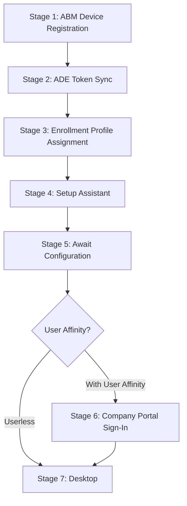
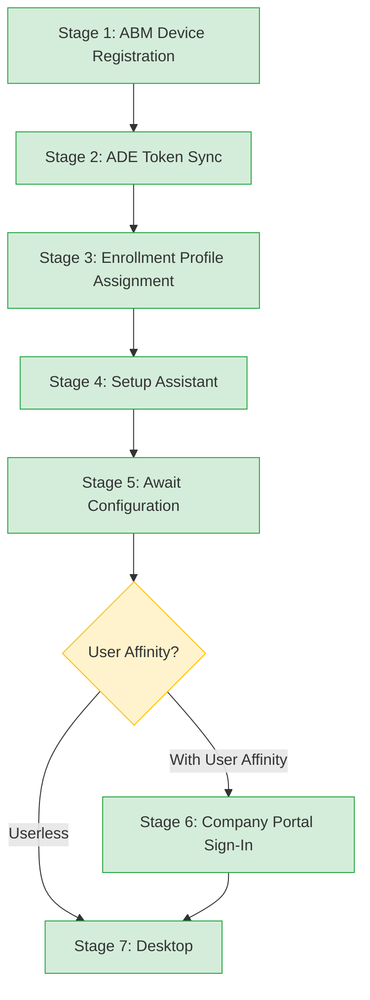

# Phase 22: macOS Lifecycle Foundation - Research

**Researched:** 2026-04-14
**Domain:** macOS ADE enrollment lifecycle, macOS Intune diagnostic reference, Apple/Microsoft network endpoints
**Confidence:** HIGH

---

<user_constraints>
## User Constraints (from CONTEXT.md)

### Locked Decisions

**Folder Placement**
- D-01: Create `docs/macos-lifecycle/` folder for Phase 22 content (parallel to `docs/lifecycle/` and `docs/lifecycle-apv2/`)
- D-02: Do NOT create `docs/macos/` umbrella folder
- D-03: Do NOT extend `docs/lifecycle/` with macOS content
- D-04: MLIF-02 reference files (`macos-commands.md`, `macos-log-paths.md`) go in `docs/reference/`, NOT `docs/macos-lifecycle/`
- D-05: MLIF-03 macOS endpoints go into `docs/reference/endpoints.md` as a new section, NOT a separate file

**Lifecycle Narrative Style (MLIF-01)**
- D-06: Single narrative file `docs/macos-lifecycle/00-ade-lifecycle.md` covering all 7 ADE stages. Do NOT mirror Windows multi-file pattern.
- D-07: Include Mermaid flow diagram at top. Each stage gets its own H2 section.
- D-08: D-10 from Phase 20 governs `docs/index.md` hub navigation only, NOT lifecycle document internal structure.
- D-09: Estimated file size 400-600 lines with TOC — acceptable.

**Reference File Scope (MLIF-02)**
- D-10: Two separate reference files: `docs/reference/macos-commands.md` (Terminal diagnostic commands, mirrors `powershell-ref.md`) and `docs/reference/macos-log-paths.md` (log paths and config profile locations, mirrors `registry-paths.md`)
- D-11: `macos-commands.md` uses Synopsis/Parameters/Output/Examples structure. Include `last_verified` with macOS version tested.
- D-12: `macos-log-paths.md` includes macOS version annotations per row, matching `registry-paths.md` table format.
- D-13: `profiles show` AND its output interpretation both go in `macos-commands.md`.
- D-14: Update `docs/reference/00-index.md`: change `platform: Windows` to `platform: all`, add macOS References section.

**Network Endpoints (MLIF-03)**
- D-15: Extend `docs/reference/endpoints.md` with `## macOS ADE Endpoints` section below existing Windows content. No separate file.
- D-16: Phase 21 D-08 ("endpoints.md stays unchanged") was phase-scoped — NOT a permanent prohibition. ARCHITECTURE.md Pattern 2 supersedes.
- D-17: Shared Microsoft endpoints appear in macOS section with "(shared)" labels. No duplication of Windows table.
- D-18: macOS test commands use `curl` and macOS-native tools (not PowerShell). Add macOS-specific test commands subsection.
- D-19: Update H1 title from "Autopilot Network Endpoints Reference" to a platform-neutral title.
- D-20: Update `applies_to:` frontmatter — change to `platform: all`.

### Claude's Discretion
- Exact section headings within each lifecycle stage
- Number of H2 sections (7 stage sections + intro + summary, or merge conceptually thin stages)
- Whether `macos-log-paths.md` uses pure table format or includes explanatory paragraphs
- Exact ordering of entries within each reference file
- How to handle `00-index.md` subsection grouping for new macOS reference files

### Deferred Ideas (OUT OF SCOPE)
None — discussion stayed within phase scope.
</user_constraints>

---

<phase_requirements>
## Phase Requirements

| ID | Description | Research Support |
|----|-------------|------------------|
| MLIF-01 | macOS ADE lifecycle overview documenting all 7 stages (ABM registration → ADE token sync → enrollment profile assignment → Setup Assistant → Await Configuration → Company Portal → desktop) with flow diagram | Full 7-stage pipeline verified from Microsoft Learn ADE docs (updated 2025-12-02). Stage sequence confirmed. Mermaid linear graph pattern established from `docs/lifecycle/00-overview.md`. |
| MLIF-02 | macOS reference files for log paths, Terminal diagnostic commands, and key configuration profile locations | Diagnostic commands identified: `profiles`, `log show`, `system_profiler`, `mdmclient`, `pgrep`. Log paths confirmed: `/Library/Logs/Microsoft/Intune`, `~/Library/Logs/Microsoft/Intune`, unified log subsystems. Config profile location: `/private/var/db/ConfigurationProfiles/`. |
| MLIF-03 | macOS network endpoints reference listing all Apple and Microsoft URLs required for ADE enrollment with test commands | Apple ADE-specific endpoints documented from `support.apple.com/en-us/101555` (updated July 2025). Intune endpoints from Microsoft Learn (updated 2026-03-24). macOS-specific CDN endpoints for app/script deployments found. |
</phase_requirements>

---

## Summary

Phase 22 delivers three foundational macOS documentation artifacts: a complete ADE lifecycle narrative, two technical reference files (commands and log paths), and an extension to the existing network endpoints reference. All three are greenfield content with no existing docs to migrate.

The macOS ADE enrollment pipeline is a single linear 7-stage sequence with no branching (unlike Windows Autopilot which branches by deployment mode). This makes a single narrative file the architecturally correct choice. The 7 stages map cleanly to: (1) ABM device registration, (2) ADE token sync between ABM and Intune, (3) enrollment profile assignment in Intune, (4) Setup Assistant on-device, (5) Await Configuration (post-Setup-Assistant hold), (6) Company Portal sign-in for Entra registration, (7) desktop delivery and ongoing MDM management. Stage 6 (Company Portal) only applies to "Enroll with User Affinity + modern authentication" — userless enrollments skip it.

The macOS diagnostic surface differs fundamentally from Windows: instead of registry inspection and PowerShell cmdlets, technicians use `profiles` (OS-shipped), `log show` / `log stream` (unified logging), `system_profiler`, and Microsoft's IntuneMacODC collection tool. Log paths are under `/Library/Logs/Microsoft/Intune` (system) and `~/Library/Logs/Microsoft/Intune` (user). Configuration profiles are stored in binary form at `/private/var/db/ConfigurationProfiles/` and inspected via `profiles` or System Settings, not by direct file editing.

**Primary recommendation:** Write the lifecycle narrative first (MLIF-01) as it establishes the vocabulary and cross-references the other two deliverables. Write the reference files second (MLIF-02), then extend endpoints.md third (MLIF-03). Update the three navigation files (00-index.md, endpoints.md title/frontmatter, docs/index.md) as the final plan tasks.

---

## Standard Stack

This phase produces documentation files only — no code libraries, no npm packages, no installation required. The "stack" is the existing documentation infrastructure already in place.

### Existing Documentation Infrastructure (reuse as-is)

| Component | Current State | Phase 22 Usage |
|-----------|--------------|----------------|
| Markdown files | All existing docs | New files follow same format |
| Mermaid diagrams | Used in `docs/lifecycle/00-overview.md` | Adapt linear graph pattern for macOS |
| Frontmatter schema | `last_verified`, `review_by`, `applies_to`, `audience`, `platform` | All new docs use this schema |
| `platform:` field | Established in Phase 20 | Set to `macOS` or `all` as appropriate |
| Relative cross-links | Used throughout (`../_glossary-macos.md#anchor`) | Same pattern for macOS lifecycle cross-references |

### File Outputs (what gets created or modified)

| File | Action | Mirrors |
|------|--------|---------|
| `docs/macos-lifecycle/00-ade-lifecycle.md` | CREATE new | Adapts `docs/lifecycle/00-overview.md` pattern |
| `docs/reference/macos-commands.md` | CREATE new | Mirrors `docs/reference/powershell-ref.md` |
| `docs/reference/macos-log-paths.md` | CREATE new | Mirrors `docs/reference/registry-paths.md` |
| `docs/reference/endpoints.md` | EXTEND (add section) | Add `## macOS ADE Endpoints` below Windows content |
| `docs/reference/00-index.md` | UPDATE | Change `platform: Windows` → `platform: all`; add macOS References section |
| `docs/index.md` | UPDATE (lines 94-117) | Add lifecycle/reference links to macOS Provisioning section |

---

## Architecture Patterns

### Recommended File Structure

```
docs/
├── macos-lifecycle/            # NEW — parallel to lifecycle/ and lifecycle-apv2/
│   └── 00-ade-lifecycle.md    # Single narrative: all 7 stages + Mermaid diagram
└── reference/                  # EXISTING — add two new files
    ├── macos-commands.md       # NEW — Terminal diagnostic commands reference
    └── macos-log-paths.md      # NEW — log paths and config profile locations
```

### Pattern 1: Single-File Linear Pipeline Narrative (MLIF-01)

**What:** A single markdown file covering all 7 ADE stages sequentially. The Windows pattern uses one file per stage because Windows has branching deployment modes. macOS ADE is strictly linear — no mode branching — so a single narrative is appropriate and sufficient.

**When to use:** Any enrollment pipeline with no branching (single path from start to desktop).

**Lifecycle narrative internal structure (per stage):**

```markdown
# macOS ADE Lifecycle: Automated Device Enrollment End-to-End

## How to Use This Guide
[navigation guidance]

## The ADE Pipeline
[Mermaid linear graph: 7 stages]

## Stage Summary Table
[Stage | Actor | What Happens | Notes]

## Stage 1: ABM Device Registration
### What the Admin Sees
[ABM portal view]
### What Happens
[Technical sequence]
### Behind the Scenes
[L2: MDM server assignment, serial number lookup]
### Watch Out For
[Common pitfalls at this stage]

## Stage 2: ADE Token Sync
...

## Stage 3: Enrollment Profile Assignment
...

## Stage 4: Setup Assistant
...

## Stage 5: Await Configuration
...

## Stage 6: Company Portal Sign-In
...

## Stage 7: Desktop and Ongoing MDM
...

## See Also
[Cross-references to glossary, reference files, windows-vs-macos]
```

**Mermaid diagram pattern (linear, no branching):**



Note: Stage 6 is the only conditional branch (user affinity vs. userless). The planner should decide whether to show this branch or simplify to 7 linear stages with an inline note.

### Pattern 2: Reference File Structure (MLIF-02)

**macos-commands.md** mirrors `powershell-ref.md` exactly. Each command gets a top-level heading with these subsections:

```markdown
### profiles

**Type:** OS-shipped binary
**Synopsis:** Manages configuration profiles on macOS. Primary tool for viewing installed profiles, checking enrollment status, and triggering enrollment.
**last_verified:** macOS 14 (Sonoma)

**Subcommands and Flags:**

| Flag / Subcommand | Purpose |
|-------------------|---------|
| `show` | Lists all installed profiles with full detail |
| `list` | Lists profile identifiers (shorter output) |
| `status -type enrollment` | Shows MDM enrollment status |
| `-C -v` | Lists all system-domain profiles verbosely |

**Expected Output (profiles status -type enrollment):**
[sample output block]

**Example:**
```bash
# Check if device is enrolled in MDM
profiles status -type enrollment

# List all installed configuration profiles with details
sudo profiles show

# List profile identifiers only
sudo profiles list
```
```

**macos-log-paths.md** mirrors `registry-paths.md` exactly — a table with columns: Path | Purpose | Referenced By | Notes (including macOS version).

### Pattern 3: Endpoints Extension (MLIF-03)

**What:** Add `## macOS ADE Endpoints` section to existing `docs/reference/endpoints.md` below the existing Windows content. No new file.

**Section structure:**

```markdown
## macOS ADE Endpoints

### Apple-Specific Endpoints (ADE and MDM)

| URL / Pattern | Service | Purpose | Criticality |
|---------------|---------|---------|-------------|
| `https://deviceenrollment.apple.com` | Apple DEP | ADE provisional enrollment | Critical |
| ... | ... | ... | ... |

### Microsoft Endpoints (shared with Windows, annotated)

| URL / Pattern | Service | Purpose | Criticality |
|---------------|---------|---------|-------------|
| `https://login.microsoftonline.com` | Entra ID | (shared) User authentication | Critical |
| ... | ... | ... | ... |

### macOS App and Script Deployment (CDN by region)

| Region | CDN Endpoint | Port |
|--------|-------------|------|
| North America | `macsidecar.manage.microsoft.com` | TCP 443 |
| ... | ... | ... |

### macOS Test Commands

```bash
# Check enrollment status
profiles status -type enrollment

# Test Apple ADE endpoint
curl -v --max-time 5 https://deviceenrollment.apple.com

# Test APNs connectivity
curl -v --max-time 5 https://api.push.apple.com
```
```

---

## Don't Hand-Roll

This phase creates documentation files, not code. The "don't hand-roll" principle applies to content decisions:

| Problem | Don't Build | Use Instead | Why |
|---------|-------------|-------------|-----|
| macOS log collection | Custom shell script instructions | IntuneMacODC tool (`sudo ./IntuneMacODC.sh`) | Microsoft-maintained; collects all relevant logs automatically |
| Endpoint test commands | Custom connectivity check scripts | `profiles status -type enrollment`, `curl -v` | OS-native and universally available |
| Configuration profile inspection | Manual filesystem path spelunking | `sudo profiles show` | Apple-supported; works across all macOS versions |
| ADE stage sequence | Research from scratch | Microsoft Learn ADE docs (updated 2025-12-02) | Authoritative and current |

---

## macOS ADE Lifecycle: 7 Stages — Verified Content

**Source:** Microsoft Learn — "Set up automated device enrollment (ADE) for macOS", updated 2025-12-02 (HIGH confidence)

### Stage 1: ABM Device Registration

**What happens:** Admin or OEM assigns device serial numbers to an MDM server in Apple Business Manager. Devices can be assigned at purchase, in bulk, or later. The assignment links the physical device (by serial number) to the Intune MDM server configured in ABM.

**Admin portal:** Apple Business Manager (business.apple.com) > Devices > Assign to MDM Server

**Key facts:**
- Serial number is the device identity (unlike Windows, which uses hardware hash)
- Devices can be pre-assigned by Apple resellers at purchase
- ABM supports filters and bulk assignment for large batches
- A device not assigned to the correct MDM server will not receive an enrollment profile during Setup Assistant

**What can go wrong:** Device not assigned to the correct MDM server; device purchased from non-ABM-linked reseller; reseller forgot to transfer device to organization's ABM account.

### Stage 2: ADE Token Sync

**What happens:** The ADE token (enrollment program token / .p7m file) connects Intune to ABM. Intune syncs device information from ABM via this token. Sync happens automatically every 24 hours; manual sync is rate-limited to once per 15 minutes; full sync no more than once per 7 days.

**Admin portal:** Intune admin center > Devices > Enrollment > Apple tab > Enrollment program tokens

**Key facts:**
- Token is a .p7m file downloaded from ABM
- Token must be renewed annually — lapse silently stops new device syncing
- After sync, newly assigned devices appear in Intune's device list
- Token is tied to a specific Apple ID — use a Managed Apple ID, not a personal one

**What can go wrong:** Token expired; Apple ID used for token creation is no longer accessible; ABM terms and conditions changed (Apple suspends syncing); full sync rate limit hit (7-day cooldown).

### Stage 3: Enrollment Profile Assignment

**What happens:** An enrollment profile is created in Intune and assigned to devices. The profile defines: user affinity (with/without), authentication method (modern or legacy Setup Assistant), Await Configuration (on/off), Setup Assistant screens to show/hide, and local account settings. A default profile can be set for the token so all synced devices receive it automatically.

**Admin portal:** Intune admin center > Devices > Enrollment > Apple tab > Enrollment program tokens > [token] > Profiles

**Key facts:**
- Profile must be assigned BEFORE the device is powered on, or enrollment fails
- "Setup Assistant with modern authentication" is the recommended and default method as of late 2024
- "Await final configuration" is the default for new profiles as of late 2024
- Profile can be assigned per-device or via a default for the token
- Profile is delivered over-the-air; device does not need to be present

**What can go wrong:** No profile assigned before device powers on (enrollment fails); wrong authentication method for tenant setup; Await Configuration disabled (policies may not apply before user reaches desktop).

### Stage 4: Setup Assistant

**What happens:** On first power-on (or after wipe), the device contacts Apple ADE endpoints (`deviceenrollment.apple.com`, `iprofiles.apple.com`, `mdmenrollment.apple.com`) to discover it is ABM-managed, download the MDM enrollment profile, and install it. Setup Assistant then runs the configured screens (customizable via enrollment profile) and prompts for Entra credentials (modern auth method) or legacy credentials.

**On-device:** macOS Setup Assistant screens run, enrollment profile installs silently in background

**Key facts:**
- Device must reach Apple ADE endpoints and Intune endpoints during this stage
- `deviceenrollment.apple.com` handles initial ADE discovery
- `iprofiles.apple.com` and `mdmenrollment.apple.com` handle profile download and upload
- APNs (`*.push.apple.com`) is required for all ongoing MDM communication
- Setup Assistant screens are customizable — admin can hide screens like Apple ID, Siri, Privacy
- With modern auth, user signs in with Entra credentials during Setup Assistant
- ACME certificate is issued during enrollment on macOS 13.1+ (replaces SCEP)

**What can go wrong:** Device can't reach ADE endpoints (firewall); device not in ABM or wrong MDM server assignment; no enrollment profile assigned; APNs certificate expired on Intune side.

### Stage 5: Await Configuration

**What happens:** After Setup Assistant screens complete but before the home screen loads, the device pauses at an "Awaiting final configuration" screen. Intune pushes critical configuration profiles via the APNs/MDM channel. The device shows downloading progress. When Intune signals completion (or a timeout occurs), the hold releases and the user proceeds.

**On-device:** Locked "Awaiting final configuration" screen

**Key facts:**
- This is "Await final configuration" in Intune's official terminology (the glossary term "Await Configuration" follows project convention)
- Only applies when enrollment profile has Await Configuration set to Yes
- This is the default for new enrollment profiles since late 2024
- No Intune-enforced minimum or maximum time limit — duration depends on policy count and complexity
- Most devices tested by Microsoft released within 15 minutes
- The locked experience prevents users from changing settings or accessing restricted content during policy delivery
- Supported on macOS 10.11 and later
- Does NOT apply if device is re-enrolling (Await Configuration only fires once per enrollment event)

**What can go wrong:** Device sits on Await Configuration screen indefinitely — typically caused by a misconfigured or undeliverable configuration profile blocking the signal; APNs connectivity issues; token sync errors.

### Stage 6: Company Portal Sign-In (User Affinity only)

**What happens:** After Await Configuration completes, if the enrollment profile is configured for "Enroll with User Affinity" and "Setup Assistant with modern authentication", the user must open the Company Portal app and sign in with their Entra credentials to complete Microsoft Entra device registration. Until they do, the device cannot access resources protected by Conditional Access.

**On-device:** Company Portal app; user signs in with org account (user@contoso.com)

**Key facts:**
- Company Portal must be deployed to the device as a required app (via Intune) — it is not pre-installed
- If user skips Company Portal sign-in, they are redirected to it when opening any Conditional Access-protected app
- Company Portal sign-in registers the device with Entra ID and adds it to the user's device record
- After sign-in, the device can be evaluated for compliance and access Conditional Access-protected resources
- Userless enrollments (without User Affinity) skip this stage entirely

**What can go wrong:** Company Portal not deployed (user can't find it); user sign-in blocked by Conditional Access before registration completes (chicken-and-egg); user skips sign-in and loses access to protected resources.

### Stage 7: Desktop and Ongoing MDM

**What happens:** The user reaches the macOS desktop. The Intune Management Extension (IME) agent handles ongoing app deployments (DMG, PKG, shell scripts) via a separate channel from the MDM profile channel. The MDM profile (delivered via APNs) continues to enforce configuration profiles and compliance policies. Microsoft Defender for Endpoint, SSO extension, and other policy-delivered tools are applied.

**On-device:** Standard macOS desktop; background MDM policy application continues

**Key facts:**
- Two management channels operate in parallel: (1) Apple MDM via APNs for configuration profiles, (2) Intune Management Extension (IME) for shell scripts and apps
- The IME agent is installed at `/Library/Intune/Microsoft Intune Agent.app`
- Ongoing MDM check-ins use APNs (push-triggered)
- APNs certificate on the Intune side must be renewed annually (separate from ADE token renewal)
- Local admin password (LAPS) rotation happens every 6 months if configured
- FileVault, firewall, Gatekeeper, and compliance policies apply via MDM profiles

---

## macOS Diagnostic Commands — Verified Reference Content

**Source:** Microsoft Learn, ss64.com/mac/profiles.html, mosen.github.io/profiledocs, direct Apple documentation (HIGH-MEDIUM confidence)

### Commands for macos-commands.md

| Command | Tool | Synopsis | macOS Version |
|---------|------|---------|---------------|
| `profiles status -type enrollment` | `profiles` (OS) | Check MDM enrollment status and whether user-approved MDM is active | 10.13.4+ |
| `sudo profiles show` | `profiles` (OS) | List all installed configuration profiles with full payload detail | 10.7+ |
| `sudo profiles list` | `profiles` (OS) | List installed profile identifiers (compact output) | 10.7+ |
| `sudo profiles renew -type enrollment` | `profiles` (OS) | Trigger ADE re-enrollment on an already-set-up Mac | 10.13+ |
| `log show --predicate 'subsystem == "com.apple.ManagedClient"' --info --last 1h` | `log` (OS) | Filter unified log for MDM/profile management events | 10.12+ |
| `log stream --predicate 'subsystem contains "com.apple.ManagedClient"' --info` | `log` (OS) | Live stream MDM log entries | 10.12+ |
| `system_profiler SPConfigurationProfileDataType` | `system_profiler` (OS) | Output all installed configuration profile data in plist format | All |
| `defaults read /Library/Managed\ Preferences/com.microsoft.intune` | `defaults` (OS) | Read Intune-managed preferences plist | All |
| `pgrep -il "^IntuneMdm"` | `pgrep` (OS) | Verify IntuneMdmDaemon and IntuneMdmAgent processes are running | All |
| `sudo ./IntuneMacODC.sh` | IntuneMacODC (Microsoft) | Collect all Intune diagnostic logs and system info into a zip file | 10.15+ |
| `mdmclient QueryInstalledApps > /tmp/apps.txt` | `mdmclient` (OS) | List apps as reported by the MDM client | All |

**IntuneMacODC acquisition:**
```bash
curl -L https://aka.ms/IntuneMacODC -o IntuneMacODC.sh
chmod u+x ./IntuneMacODC.sh
sudo ./IntuneMacODC.sh
```
Output: `IntuneMacODC.zip` in an `ODC/` subfolder, opened automatically in Finder.

### Unified Log Subsystem Identifiers

| Subsystem | What It Covers |
|-----------|---------------|
| `com.apple.ManagedClient` | Configuration profile installation, MDM command processing |
| `com.apple.ManagedClient.cloudconfigurationd` | ADE/DEP cloud configuration daemon (Setup Assistant enrollment) |
| `com.apple.securityd` | Keychain interactions triggered by MDM profiles |

**Enable debug-level MDM logging:**
```bash
sudo log config --subsystem com.apple.ManagedClient --mode="level:debug,persist:debug"
# Reset after troubleshooting:
sudo log config --subsystem com.apple.ManagedClient --reset
```

---

## macOS Log Paths — Verified Reference Content

**Source:** Microsoft Tech Community, MEM.Zone, mosen.github.io (MEDIUM-HIGH confidence)

### Paths for macos-log-paths.md

| Path | Purpose | Referenced By | Notes |
|------|---------|---------------|-------|
| `/Library/Logs/Microsoft/Intune/IntuneMDMDaemon*.log` | Intune management daemon — PKG installs, DMG installs, root-context shell scripts, policy application | IntuneMacODC, L2 runbooks | System-level log. 6 pipe-delimited columns: timestamp \| process \| level \| PID \| task \| detail |
| `~/Library/Logs/Microsoft/Intune/IntuneMDMAgent*.log` | Intune management agent — user-context shell scripts, user-level policy | IntuneMacODC, L2 runbooks | User-level log. May be absent on macOS 15 (known issue as of 2026-04); check system log instead |
| `/Library/Logs/Microsoft/Intune/CompanyPortal*.log` | Company Portal enrollment events, device registration, compliance | IntuneMacODC, L2 runbooks | Generated by Company Portal app during enrollment and compliance checks |
| `/Library/Intune/Microsoft Intune Agent.app` | Intune Management Extension agent binary | pgrep, Activity Monitor | Not visible in /Applications. Check via pgrep |
| `/private/var/db/ConfigurationProfiles/` | Binary store of all installed configuration profiles | `profiles` command | Binary format — do not edit directly. Use `profiles show` or System Settings to inspect |
| `/Library/Managed Preferences/` | MCX-derived managed preference plists applied to device | `defaults read` | Managed plists are written here by `mdmclient` when profiles apply |
| `/Library/Logs/ManagedClient/ManagedClient.log` | Legacy MCX logging (pre-unified log) | Older macOS / legacy L2 reference | Superseded by unified log (`log show`) on macOS 10.12+; still present on some systems |
| `Unified log — subsystem com.apple.ManagedClient` | MDM command processing, profile installation events | `log show --predicate 'subsystem == "com.apple.ManagedClient"'` | macOS 10.12+ only; use log command to query |
| `Unified log — subsystem com.apple.ManagedClient.cloudconfigurationd` | ADE enrollment discovery during Setup Assistant | `log stream --predicate 'subsystem contains "cloudconfigurationd"'` | Useful for Setup Assistant enrollment failures |

---

## macOS ADE Network Endpoints — Verified Reference Content

**Source:** Apple Support HT101555 (updated July 2025), Microsoft Learn Intune Endpoints (updated 2026-03-24) (HIGH confidence)

### Apple-Specific Endpoints (ADE and MDM)

| URL / Pattern | Service | Purpose | Criticality |
|---------------|---------|---------|-------------|
| `https://deviceenrollment.apple.com` | Apple DEP | ADE provisional enrollment — initial device discovery | Critical |
| `https://iprofiles.apple.com` | Apple Enrollment Profiles | Enrollment profile download for ADE via ABM/ASM | Critical |
| `https://mdmenrollment.apple.com` | Apple MDM Enrollment | Profile uploads and device/account lookups for ADE | Critical |
| `https://*.push.apple.com` (port 443, 5223) | Apple Push Notification Service (APNs) | MDM push notifications for all ongoing management commands | Critical |
| `https://*.business.apple.com` | Apple Business Manager | Admin portal access for device assignment and token management | Required for admin |
| `https://gdmf.apple.com` | Apple Software Updates | MDM server identification of available software updates | Required for updates |
| `https://identity.apple.com` | Apple Identity | APNs certificate request portal | Required for cert renewal |
| `https://vpp.itunes.apple.com` | VPP / Apps and Books | App license operations via MDM | Required if using VPP apps |
| `https://deviceservices-external.apple.com` | MDM Services | MDM servers disable Activation Lock on managed devices | Required for Activation Lock |

**SSL Inspection Warning:** Apple explicitly requires that SSL/HTTPS inspection be disabled for all Apple service endpoints. SSL inspection causes ADE and APNs to fail silently.

### Microsoft Endpoints (shared with Windows, mark "(shared)" in the macOS table)

| URL / Pattern | Service | Purpose | Criticality |
|---------------|---------|---------|-------------|
| `https://login.microsoftonline.com` | Entra ID | (shared) User credential validation; Entra device join | Critical |
| `https://graph.microsoft.com` / `graph.windows.net` | Microsoft Graph | (shared) Intune device management queries | Critical |
| `https://*.manage.microsoft.com` | Intune Core | (shared) MDM enrollment, check-in, policy delivery | Critical |
| `https://EnterpriseEnrollment.manage.microsoft.com` | Intune Enrollment | (shared) MDM enrollment initiation | Critical |
| `https://enterpriseregistration.windows.net` | Entra Device Registration | (shared) Device Entra registration (Company Portal sign-in) | Critical |
| `https://login.live.com` / `account.live.com` | Microsoft Account | (shared) Microsoft account services | Required |

### macOS-Specific CDN Endpoints (App and Script Deployment)

| Region | CDN Endpoint | Port |
|--------|-------------|------|
| North America | `macsidecar.manage.microsoft.com` | TCP 443 |
| Europe | `macsidecareu.manage.microsoft.com` | TCP 443 |
| Asia Pacific | `macsidecarap.manage.microsoft.com` | TCP 443 |

Note: The `*.azureedge.net` variants of these endpoints are migrating to `*.manage.microsoft.com` starting March 2025.

### macOS Test Commands (for endpoints.md test commands subsection)

```bash
# Check MDM enrollment status
profiles status -type enrollment

# Test Apple ADE discovery endpoint
curl -v --max-time 5 https://deviceenrollment.apple.com

# Test Apple enrollment profile endpoint
curl -v --max-time 5 https://iprofiles.apple.com

# Test APNs (port 5223 may require specific firewall rules)
curl -v --max-time 5 https://api.push.apple.com

# Test Intune MDM endpoint
curl -v --max-time 5 https://manage.microsoft.com

# Test Entra ID authentication
curl -v --max-time 5 https://login.microsoftonline.com

# Test ABM portal
curl -v --max-time 5 https://business.apple.com
```

---

## Common Pitfalls

### Pitfall 1: Stage 5 (Await Configuration) Blocks Indefinitely

**What goes wrong:** Device shows "Awaiting final configuration" screen for more than 20-30 minutes with no progress or release.

**Why it happens:** A configuration profile assigned to the device during Await Configuration is misconfigured or cannot be delivered. The MDM channel waits for all "critical" profiles to install before releasing. If a SCEP/certificate profile fails, a Wi-Fi profile that depends on it also fails, blocking the entire hold.

**How to avoid:** Test enrolled devices with a minimal set of policies first. Add policies incrementally. Check that certificate infrastructure (SCEP, PKCS) is reachable before enrollment at scale.

**Warning signs:** Company Portal app cannot be reached; `log show` for `com.apple.ManagedClient` shows repeated retry messages; device sits on Await Configuration screen significantly longer than the 15-minute average.

### Pitfall 2: ADE Token Expiry Silently Breaks New Enrollments

**What goes wrong:** New devices are assigned in ABM but never appear in Intune. Existing managed devices are unaffected.

**Why it happens:** The ADE token (.p7m file) expires annually. When expired, Intune cannot sync new device assignments from ABM. The failure is silent — no admin alert is sent by default.

**How to avoid:** Set a calendar reminder for token renewal at least 30 days before expiry. Use a Managed Apple ID tied to a role account, not a personal Apple ID. Monitor the Intune admin center for token expiry warnings.

**Warning signs:** New devices not appearing in Intune device list after ABM assignment; "Sync" in Enrollment program tokens shows errors or warning state.

### Pitfall 3: SSL Inspection Breaks Apple Service Connectivity

**What goes wrong:** ADE enrollment fails silently during Setup Assistant. Device cannot contact Apple endpoints. Setup Assistant completes but MDM profile is not installed.

**Why it happens:** Enterprise proxy/firewall performs SSL inspection (HTTPS decryption/re-encryption) on traffic to Apple services. Apple explicitly states this is unsupported and causes failures.

**How to avoid:** Bypass SSL inspection for all `*.apple.com` and `*.push.apple.com` domains. Document this as a network prerequisite in the lifecycle guide.

**Warning signs:** `curl -v https://deviceenrollment.apple.com` shows certificate errors; enrollment fails on corporate network but succeeds on hotspot.

### Pitfall 4: Company Portal Not Deployed Before User Reaches Desktop

**What goes wrong:** User completes Setup Assistant with modern authentication and reaches the desktop but cannot find Company Portal. Device is not Entra-registered, so Conditional Access blocks all protected resources.

**Why it happens:** Company Portal is not pre-installed on macOS. It must be deployed as a required app before or during enrollment. If deployment hasn't completed when the user reaches the desktop, the app is missing.

**How to avoid:** Assign Company Portal as a required app to the device group used for ADE enrollment. Ensure it is in the "critical apps" list if Await Configuration is enabled. Microsoft recommends deploying Company Portal to All Devices with the enrollment profile filter.

**Warning signs:** Users report being redirected to Company Portal every time they open a managed app; device does not appear in user's Entra device list.

### Pitfall 5: macOS Version Floor Confusion

**What goes wrong:** New enrollment profile features (Await Configuration, ACME certificates, LAPS) don't work on some devices.

**Why it happens:** Modern macOS management features have version floors: ACME requires 13.1+, Await Configuration requires 10.11+, modern auth requires 10.15+ (older falls back to legacy), LAPS requires 10.11+, DDM Software Update requires 14.0+.

**How to avoid:** Document the minimum macOS version requirement for the organization's ADE deployment. The lifecycle narrative's "Behind the Scenes" sections should note version requirements per feature.

**Warning signs:** Await Configuration screen doesn't appear on older Macs; IntuneMDMAgent logs show SCEP instead of ACME for certificates.

### Pitfall 6: macOS 15 Log Path Changes

**What goes wrong:** L2 technician following the log path reference cannot find `~/Library/Logs/Microsoft/Intune` on macOS 15 devices.

**Why it happens:** On macOS 15, some devices are missing the `~/Library/Logs/Microsoft` directory (known issue as of early 2026). The system-level path `/Library/Logs/Microsoft/Intune` remains intact.

**How to avoid:** The log paths reference should document both paths and note the macOS 15 known issue. Direct technicians to the system-level path as the primary reference.

**Warning signs:** `ls ~/Library/Logs/Microsoft` returns "No such file or directory" on macOS 15.

---

## State of the Art

| Old Approach | Current Approach | When Changed | Impact |
|--------------|------------------|--------------|--------|
| SCEP certificate enrollment | ACME protocol | macOS 13.1 (late 2022) | Better validation, more secure certificate issuance |
| Setup Assistant (legacy) with ADFS WS-Trust | Setup Assistant with modern authentication (Entra) | 2023 — modern auth now strongly recommended | More secure; enables MFA and Conditional Access |
| Await Configuration = No (default for existing profiles) | Await Configuration = Yes (default for new profiles) | Late 2024 | Critical policies now reliably applied before desktop |
| azureedge.net CDN domains | manage.microsoft.com CDN domains | March 2025 rollout | CDN migration; both endpoints work during transition |
| VPP token management outside ABM | VPP/Apps and Books integrated in ABM (no separate token) | ~2020 — now standard | Simplified app license management |

**Deprecated/outdated:**
- **Setup Assistant (legacy):** Microsoft explicitly recommends against it. Still available but no longer documented as a valid path in new deployments.
- **DEP (Device Enrollment Program):** Rebranded as ADE. Same technical mechanism. Only the name changed.
- **iOS/iPadOS "Install Company Portal" enrollment profile setting:** Removed from enrollment policies in late 2024. The same removal applies to macOS ADE policies. Company Portal is now deployed as a required app instead.

---

## Code Examples

### Mermaid Flow Diagram for 00-ade-lifecycle.md



### Frontmatter Template for New macOS Files

```yaml
---
last_verified: 2026-04-14
review_by: 2026-07-13
applies_to: ADE
audience: admin       # or: all, L2
platform: macOS
---
```

### Version Gate for macOS Lifecycle Narrative

```markdown
> **Platform gate:** This guide covers macOS Automated Device Enrollment (ADE) via Apple Business Manager and Microsoft Intune.
> For Windows Autopilot, see [Autopilot Lifecycle Overview](../lifecycle/00-overview.md).
> For terminology, see the [macOS Provisioning Glossary](../_glossary-macos.md).
```

### profiles Command — Expected Output Samples

```bash
# profiles status -type enrollment
Enrolled via DEP: Yes
MDM enrollment: Yes (User Approved)
```

```bash
# sudo profiles list (abbreviated)
There are 4 configuration profiles installed for 'Computer'
_computerlevel[1] attribute: name: Microsoft Intune MDM Profile
_computerlevel[2] attribute: name: Company Portal: Network Access
```

---

## Navigation Integration Points

When the planner creates tasks, these navigation updates must be planned as separate tasks (written last, after content files exist):

**docs/index.md (lines 94-117 — macOS Provisioning section):**
- L1 row: Add link to `macos-lifecycle/00-ade-lifecycle.md` (for stage orientation)
- L2 row: Add link to `macos-lifecycle/00-ade-lifecycle.md` (Behind the Scenes sections) and `reference/macos-commands.md`
- Admin Setup row: Existing TBD — Phase 22 does not create admin setup docs (Phase 23), but lifecycle can be referenced here too

**docs/reference/00-index.md:**
- Change frontmatter `platform: Windows` → `platform: all`
- Add `## macOS References` section with links to `macos-commands.md` and `macos-log-paths.md`

**docs/reference/endpoints.md:**
- Change H1 title to "Network Endpoints Reference" (platform-neutral)
- Change `applies_to:` and `platform:` in frontmatter to reflect cross-platform coverage
- Add `## macOS ADE Endpoints` section

---

## Validation Architecture

> This phase produces only documentation (Markdown files). There is no executable code, no test framework, and no automated tests. Manual review is the validation mechanism.

### Phase Requirements → Validation Map

| Req ID | Behavior | Validation Type | Command | Notes |
|--------|----------|-----------------|---------|-------|
| MLIF-01 | 7-stage ADE lifecycle narrative with flow diagram exists | Manual review | — | Reviewer confirms: 7 stages present, Mermaid renders, macOS-native terminology throughout |
| MLIF-02 | macos-commands.md and macos-log-paths.md exist in docs/reference/ | File existence check + manual review | `ls docs/reference/macos-commands.md docs/reference/macos-log-paths.md` | Reviewer confirms: Synopsis/Parameters/Output/Examples pattern followed; table format matches registry-paths.md |
| MLIF-03 | endpoints.md extended with macOS ADE Endpoints section | File content check + manual review | `grep "macOS ADE Endpoints" docs/reference/endpoints.md` | Reviewer confirms: Apple endpoints present, shared endpoints annotated "(shared)", curl test commands present |

### Wave 0 Gaps

None — this is a pure documentation phase. No test files to create, no framework to install.

---

## Open Questions

1. **Stage 6 branching in the Mermaid diagram**
   - What we know: Userless enrollments (without User Affinity) skip Company Portal sign-in
   - What's unclear: Whether to show the branch in the Mermaid diagram (technically accurate) or simplify to 7 linear stages with an inline note (cleaner narrative)
   - Recommendation: Show the branch in the diagram for accuracy (it IS a real decision point); document both paths in the Stage 6 section body

2. **macOS version floor for the lifecycle narrative**
   - What we know: The guide targets macOS with Intune; Microsoft dropped support below macOS 14 for Company Portal and the agent as of 2026
   - What's unclear: Whether to state a minimum macOS version in the version gate or leave it open
   - Recommendation: State "macOS 14 and later" in the version gate, consistent with current Intune support policy. Add inline notes where specific features have different floors.

3. **Await Configuration timing guarantee**
   - What we know: Microsoft says "most devices release within 15 minutes" but no enforced limit
   - What's unclear: Whether to give a concrete time estimate in the narrative
   - Recommendation: Document "typically under 15 minutes; varies with policy count" — avoid giving a guarantee. Reference Microsoft's statement.

4. **macos-log-paths.md format: pure table vs. paragraphs**
   - What we know: Claude has discretion here (per CONTEXT.md)
   - What's unclear: Whether the log subsystem paths (not filesystem paths) warrant their own section vs. rows in the same table
   - Recommendation: Use the pure table format (matches registry-paths.md exactly) with a subsection header `## Unified Log Subsystems` for the `log show` subsystem identifiers. This keeps the file scannable.

---

## Sources

### Primary (HIGH confidence)
- Microsoft Learn: "Set up automated device enrollment (ADE) for macOS" — updated 2025-12-02 — 7-stage pipeline, Await Configuration details, authentication methods, ACME
- Microsoft Learn: "Get started with macOS endpoints" — updated 2026-01-22 — enrollment phases, Company Portal deployment, IME architecture
- Microsoft Learn: "Network endpoints for Microsoft Intune" — updated 2026-03-24 — macOS CDN endpoints (macsidecar.manage.microsoft.com), consolidated FQDN list
- Apple Support HT101555 (support.apple.com/en-us/101555) — updated July 2025 — Apple ADE endpoints: deviceenrollment.apple.com, iprofiles.apple.com, mdmenrollment.apple.com, APNs hosts, ABM hosts

### Secondary (MEDIUM confidence)
- Microsoft Tech Community: "Support tip: Troubleshooting Microsoft Intune management agent on macOS" — `pgrep -il "^IntuneMdm"`, `/Library/Logs/Microsoft/Intune` paths, pipe-delimited log format
- mosen.github.io/profiledocs/troubleshooting/logging.html — `com.apple.ManagedClient` subsystem identifiers, `log config` command, MCX debug configuration
- ss64.com/mac/profiles.html — `profiles` command subcommands and flags reference
- Microsoft Q&A: "Where are IntuneMDMAgent*.log files on macOS 15?" — macOS 15 known issue with missing user log directory

### Tertiary (LOW confidence — flag for validation)
- copyprogramming.com: `/private/var/db/ConfigurationProfiles/` as binary profile store location — verify with Apple developer docs before publishing
- Jamf community posts: `/Library/Managed Preferences/` as managed plist location — verified by independent source (mosen.github.io) so elevated to MEDIUM

---

## Metadata

**Confidence breakdown:**
- 7-stage ADE pipeline sequence: HIGH — from official Microsoft Learn ADE docs (2025-12-02)
- Apple-specific network endpoints: HIGH — from Apple HT101555 (July 2025 update)
- Microsoft/Intune network endpoints: HIGH — from official Intune Endpoints doc (2026-03-24)
- macOS diagnostic commands: HIGH (profiles, log, system_profiler) / MEDIUM (mdmclient subcommands) — commands are OS-shipped; confirm exact subcommand syntax against current macOS version
- Log file paths: HIGH (/Library/Logs/Microsoft/Intune) / LOW (/private/var/db/ConfigurationProfiles/ binary format) — the binary store location should be confirmed with Apple developer docs; the Intune log paths are confirmed by multiple Microsoft sources

**Research date:** 2026-04-14
**Valid until:** 2026-07-14 (90 days — stable Microsoft Learn docs; re-verify Apple endpoints against HT101555 before publishing if more than 30 days have elapsed)
