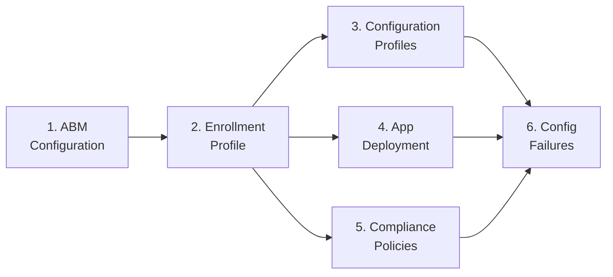

<objective>
Create the macOS admin setup overview, consolidated config-failures reference, and update all navigation files to integrate Phase 23 content into the documentation hub.

Purpose: The overview provides the entry point and setup sequence for the macOS admin guide suite. The config-failures reference gives a reverse-lookup table for troubleshooting misconfigurations. Navigation updates resolve TBD placeholders across index.md, reference/00-index.md, and windows-vs-macos.md. This plan runs in Wave 2 because it depends on all 5 admin guides and the capability matrix existing.

Output: Overview and config-failures files in `docs/admin-setup-macos/`, plus navigation updates to 3 existing files.
</objective>

<execution_context>
@~/.claude/get-shit-done/workflows/execute-plan.md
@~/.claude/get-shit-done/templates/summary.md
</execution_context>

<context>
@.planning/PROJECT.md
@.planning/ROADMAP.md
@.planning/STATE.md
@.planning/phases/23-macos-admin-setup/23-CONTEXT.md
@.planning/phases/23-macos-admin-setup/23-01-SUMMARY.md
@.planning/phases/23-macos-admin-setup/23-02-SUMMARY.md
@.planning/phases/23-macos-admin-setup/23-03-SUMMARY.md
</context>

<tasks>

<task type="auto">
  <name>Task 1: Create macOS admin setup overview and consolidated config-failures reference</name>
  <files>docs/admin-setup-macos/00-overview.md, docs/admin-setup-macos/06-config-failures.md</files>
  <read_first>
    - docs/admin-setup-apv1/00-overview.md (pattern for overview with setup sequence and Mermaid diagram)
    - docs/admin-setup-apv1/10-config-failures.md (pattern for consolidated reverse-lookup table)
    - docs/admin-setup-macos/01-abm-configuration.md (read Configuration-Caused Failures table to aggregate)
    - docs/admin-setup-macos/02-enrollment-profile.md (read Configuration-Caused Failures table to aggregate)
    - docs/admin-setup-macos/03-configuration-profiles.md (read Configuration-Caused Failures table to aggregate)
    - docs/admin-setup-macos/04-app-deployment.md (read Configuration-Caused Failures table to aggregate)
    - docs/admin-setup-macos/05-compliance-policy.md (read Configuration-Caused Failures table to aggregate)
    - docs/_glossary-macos.md (glossary anchors)
  </read_first>
  <action>
**File 1: `docs/admin-setup-macos/00-overview.md`** (~50-70 lines) per D-03.

**Frontmatter:**
```yaml
---
last_verified: 2026-04-14
review_by: 2026-07-13
applies_to: ADE
audience: admin
platform: macOS
---
```

**Platform gate blockquote:**
```
> **Platform gate:** This guide covers macOS ADE configuration via Apple Business Manager and Intune.
> For Windows Autopilot setup, see [Windows Admin Setup Guides](../admin-setup-apv1/00-overview.md).
> For macOS provisioning terminology, see the [macOS Glossary](../_glossary-macos.md).
```

**H1:** `# macOS Admin Setup: Complete Configuration Guide`

**Introductory paragraph:** This guide walks Intune administrators through configuring a complete macOS Automated Device Enrollment deployment from scratch. Complete the guides in order -- ABM configuration and enrollment profile are prerequisites for all subsequent configuration.

**Mermaid dependency diagram** (Claude's discretion per CONTEXT.md -- use Mermaid diagram for consistency with APv1 overview):


**Numbered setup sequence with links (same pattern as APv1 overview):**

1. **[ABM Configuration](01-abm-configuration.md)** -- Create ADE token in Apple Business Manager and Intune, assign devices to MDM server, configure token renewal. This must be complete before any enrollment profile can be created.

2. **[Enrollment Profile](02-enrollment-profile.md)** -- Configure enrollment profile with user affinity, authentication method, Await Configuration, locked enrollment, and Setup Assistant screen customization.

3. **[Configuration Profiles](03-configuration-profiles.md)** -- Deploy Wi-Fi, VPN, email, restrictions, FileVault, and firewall profiles via Settings Catalog. Configuration profiles enforce settings; compliance policies detect non-compliance.

4. **[App Deployment](04-app-deployment.md)** -- Deploy macOS apps via DMG, PKG (managed and unmanaged), and VPP/Apps and Books with size limits, detection rules, and uninstall capabilities documented per type.

5. **[Compliance Policies](05-compliance-policy.md)** -- Configure compliance policies for SIP, FileVault, firewall, Gatekeeper, and password. Important: no Intune security baselines exist for macOS.

6. **[Configuration-Caused Failures Reference](06-config-failures.md)** -- Consolidated reverse-lookup table of all macOS admin setup misconfigurations with links to guide files and troubleshooting runbooks.

**## Cross-Platform References:**
- [Capability Matrix](../reference/macos-capability-matrix.md) -- Intune feature parity gaps between macOS and Windows
- [Windows vs macOS Concept Comparison](../windows-vs-macos.md) -- Platform terminology mapping

**## See Also:**
- [macOS ADE Lifecycle Overview](../macos-lifecycle/00-ade-lifecycle.md)
- [Windows APv1 Admin Setup](../admin-setup-apv1/00-overview.md)
- [Windows APv2 Admin Setup](../admin-setup-apv2/00-overview.md)

---
*Next step: [ABM Configuration](01-abm-configuration.md)*

---

**File 2: `docs/admin-setup-macos/06-config-failures.md`** (~80-120 lines) per D-03.

**Frontmatter:**
```yaml
---
last_verified: 2026-04-14
review_by: 2026-07-13
applies_to: ADE
audience: admin
platform: macOS
---
```

**Platform gate blockquote** (same as template).

**H1:** `# macOS Configuration-Caused Failures Reference`

**Introductory paragraph:** This is the consolidated reverse-lookup table for all macOS admin setup configuration mistakes. Each entry links to both the guide file where the setting is configured and the troubleshooting runbook for the failure it causes. Use this page when you see a deployment or management failure and suspect a configuration mistake.

**## How to Use This Table:**
1. Find the symptom you are seeing in the **Symptom** column
2. Read the **Misconfiguration** column to identify the likely cause
3. Follow the **Guide** link to fix the configuration
4. Follow the **Runbook** link for immediate troubleshooting steps

**H2 sections organized by guide (per APv1 pattern):**

### ABM Configuration Failures
Aggregate all rows from `01-abm-configuration.md` Configuration-Caused Failures table. Columns: `| Misconfiguration | Symptom | Guide | Runbook |`
- Link Guide column to `01-abm-configuration.md`
- Link Runbook column to `[TBD - Phase 24]`
- Include: Personal Apple ID, no enrollment profile before power-on, wrong MDM server, expired ADE token, device not released

### Enrollment Profile Failures
Aggregate from `02-enrollment-profile.md`: no user affinity, legacy auth, Await Config = No, locked enrollment = No, Accessibility screen hidden, Restore screen macOS 15.4+

### Configuration Profile Failures
Aggregate from `03-configuration-profiles.md`: deprecated template, FileVault without escrow, firewall blocks MDM, SSID mismatch, Gatekeeper not enforced, missing certificate

### App Deployment Failures
Aggregate from `04-app-deployment.md`: non-app in DMG included apps, managed PKG > 2 GB, PKG without payload, VPP Available to device group, unmanaged PKG uninstall, VPP license revoke without uninstall, expired VPP token

### Compliance Policy Failures
Aggregate from `05-compliance-policy.md`: compliance without config profile, SIP required but disabled, OS version too new, password change timing, Gatekeeper compliance without config profile

**## See Also:**
- [macOS Admin Setup Overview](00-overview.md)
- macOS L1 Runbooks (TBD - Phase 24)
- [macOS ADE Lifecycle Overview](../macos-lifecycle/00-ade-lifecycle.md)
  </action>
  <verify>
    <automated>bash -c "test -f 'D:/claude/Autopilot/docs/admin-setup-macos/00-overview.md' && test -f 'D:/claude/Autopilot/docs/admin-setup-macos/06-config-failures.md' && echo PASS || echo FAIL"</automated>
  </verify>
  <acceptance_criteria>
    - File `docs/admin-setup-macos/00-overview.md` exists with >= 40 lines
    - Overview frontmatter contains `platform: macOS`
    - Overview contains Mermaid diagram (```mermaid block)
    - Overview contains numbered list linking to all 6 files: 01 through 06
    - Overview contains link to `../reference/macos-capability-matrix.md`
    - File `docs/admin-setup-macos/06-config-failures.md` exists with >= 80 lines
    - Config-failures frontmatter contains `platform: macOS`
    - Config-failures contains H2 sections: "ABM Configuration Failures", "Enrollment Profile Failures", "Configuration Profile Failures", "App Deployment Failures", "Compliance Policy Failures"
    - Config-failures table rows have 4 columns: Misconfiguration, Symptom, Guide, Runbook
    - Config-failures Guide column entries link to the corresponding guide file (e.g., `01-abm-configuration.md`)
    - Config-failures Runbook column entries contain `[TBD - Phase 24]`
    - No references to OOBE or ESP in either file
  </acceptance_criteria>
  <done>Overview with setup sequence, Mermaid diagram, and links to all guides. Config-failures with consolidated reverse-lookup table aggregated from all 5 guide files.</done>
</task>

<task type="auto">
  <name>Task 2: Update navigation files (index.md, reference index, windows-vs-macos.md)</name>
  <files>docs/index.md, docs/reference/00-index.md, docs/windows-vs-macos.md</files>
  <read_first>
    - docs/index.md (current state -- find line 123 TBD placeholder for macOS Admin Setup)
    - docs/reference/00-index.md (current state -- macOS References section to add capability matrix)
    - docs/windows-vs-macos.md (current state -- lines 10 and 67 with Phase 23 TBD references)
  </read_first>
  <action>
Update three navigation files per D-07 to integrate Phase 23 content.

**File 1: `docs/index.md`**

Find the macOS Admin Setup placeholder (around line 123):
```
| macOS Admin Setup Guides | ABM configuration, enrollment profiles, apps, compliance (TBD - Phase 23) |
```

Replace with:
```
| [macOS Admin Setup Guides](admin-setup-macos/00-overview.md) | ABM configuration, enrollment profiles, configuration profiles, app deployment, compliance policies |
```

Also add to the Cross-Platform References section (after the existing entries, before Version History):
```
| [macOS Capability Matrix](reference/macos-capability-matrix.md) | Intune feature parity comparison between Windows and macOS across enrollment, configuration, apps, compliance, and updates |
```

Update Version History table with a new row:
```
| 2026-04-14 | Added macOS Admin Setup links and macOS Capability Matrix to Cross-Platform References | -- |
```

**File 2: `docs/reference/00-index.md`**

In the `## macOS References` section, add a new entry after the existing macOS Log Paths line:
```
- [macOS Capability Matrix](macos-capability-matrix.md) — Intune feature parity comparison between Windows and macOS (MADM-06)
```

Update Version History:
```
| 2026-04-14 | Added macOS Capability Matrix to macOS References section |
```

**File 3: `docs/windows-vs-macos.md`**

Line 10 -- update the platform coverage note. Change:
```
> It covers terminology and enrollment mechanisms, not Intune feature parity (see Capability Matrix -- Phase 23).
```
to:
```
> It covers terminology and enrollment mechanisms, not Intune feature parity (see [Capability Matrix](reference/macos-capability-matrix.md)).
```

Line 67 -- update the See Also TBD reference. Change:
```
- Capability Matrix (TBD - Phase 23) — Intune feature parity comparison
```
to:
```
- [Capability Matrix](reference/macos-capability-matrix.md) — Intune feature parity comparison
```

Update Version History:
```
| 2026-04-14 | Resolved capability matrix forward references to reference/macos-capability-matrix.md | -- |
```
  </action>
  <verify>
    <automated>bash -c "grep -c 'admin-setup-macos/00-overview' 'D:/claude/Autopilot/docs/index.md' | xargs test 0 -lt && grep -c 'macos-capability-matrix' 'D:/claude/Autopilot/docs/reference/00-index.md' | xargs test 0 -lt && grep -c 'TBD - Phase 23' 'D:/claude/Autopilot/docs/windows-vs-macos.md' | xargs test 1 -gt && echo PASS || echo FAIL"</automated>
  </verify>
  <acceptance_criteria>
    - `docs/index.md` contains link `admin-setup-macos/00-overview.md` (TBD placeholder replaced)
    - `docs/index.md` contains link `reference/macos-capability-matrix.md` in Cross-Platform References
    - `docs/index.md` does NOT contain "TBD - Phase 23" text
    - `docs/reference/00-index.md` contains `macos-capability-matrix.md` entry in macOS References section
    - `docs/windows-vs-macos.md` does NOT contain "TBD - Phase 23" text
    - `docs/windows-vs-macos.md` contains link `reference/macos-capability-matrix.md` on former line 10 and former line 67
    - All three files have updated Version History entries dated 2026-04-14
  </acceptance_criteria>
  <done>All three navigation files updated: index.md has macOS Admin Setup links and capability matrix; reference index has capability matrix; windows-vs-macos.md has resolved TBD references</done>
</task>

<task type="auto">
  <name>Task 3: Validate all Phase 23 files and cross-references</name>
  <files>docs/admin-setup-macos/00-overview.md, docs/admin-setup-macos/01-abm-configuration.md, docs/admin-setup-macos/02-enrollment-profile.md, docs/admin-setup-macos/03-configuration-profiles.md, docs/admin-setup-macos/04-app-deployment.md, docs/admin-setup-macos/05-compliance-policy.md, docs/admin-setup-macos/06-config-failures.md, docs/reference/macos-capability-matrix.md</files>
  <read_first>
    - docs/admin-setup-macos/00-overview.md
    - docs/admin-setup-macos/01-abm-configuration.md
    - docs/admin-setup-macos/02-enrollment-profile.md
    - docs/admin-setup-macos/03-configuration-profiles.md
    - docs/admin-setup-macos/04-app-deployment.md
    - docs/admin-setup-macos/05-compliance-policy.md
    - docs/admin-setup-macos/06-config-failures.md
    - docs/reference/macos-capability-matrix.md
  </read_first>
  <action>
Validate all 8 Phase 23 output files for structural completeness and cross-reference integrity.

**Structural validation (for each file):**
1. Frontmatter present with `platform:` field (macOS for admin guides, all for capability matrix)
2. `last_verified: 2026-04-14` and `review_by: 2026-07-13` in frontmatter
3. Platform gate blockquote present (admin guides only, not capability matrix)
4. H1 heading present
5. `## Configuration-Caused Failures` table present with `Portal` column (admin guides 01-05 only)
6. `[TBD - Phase 24]` format for runbook links (admin guides only)

**Cross-reference validation:**
1. Overview (00) links to all 6 guide files (01-06) -- verify each link resolves to an existing file
2. Each guide (01-05) links to at least one other guide in See Also
3. Config-failures (06) links to all 5 guide files (01-05) in Guide column
4. Capability matrix links to windows-vs-macos.md and admin-setup-macos/00-overview.md

**Terminology validation:**
1. No file contains "OOBE" (Windows term -- should use "Setup Assistant")
2. No file contains standalone "ESP" referring to macOS (should use "Await Configuration")
3. All files use "Settings Catalog" (not "Endpoint protection template") as the recommended path

**Content completeness validation:**
1. `01-abm-configuration.md` has `## Renewal / Maintenance` table
2. `02-enrollment-profile.md` has Setup Assistant screens table with >= 23 rows
3. `03-configuration-profiles.md` covers >= 6 profile types (Wi-Fi, VPN, email, restrictions, FileVault, firewall)
4. `04-app-deployment.md` has comparison table with DMG, PKG, VPP columns
5. `05-compliance-policy.md` contains "no Intune security baselines" callout
6. Capability matrix has 5 domain H2 sections

If any validation fails, fix the issue in the file before completing this task. Report all findings.
  </action>
  <verify>
    <automated>bash -c "cd 'D:/claude/Autopilot' && for f in docs/admin-setup-macos/00-overview.md docs/admin-setup-macos/01-abm-configuration.md docs/admin-setup-macos/02-enrollment-profile.md docs/admin-setup-macos/03-configuration-profiles.md docs/admin-setup-macos/04-app-deployment.md docs/admin-setup-macos/05-compliance-policy.md docs/admin-setup-macos/06-config-failures.md docs/reference/macos-capability-matrix.md; do test -f \"$f\" || { echo FAIL: $f missing; exit 1; }; done && echo ALL_FILES_EXIST"</automated>
  </verify>
  <acceptance_criteria>
    - All 8 files exist: 00-overview.md through 06-config-failures.md + macos-capability-matrix.md
    - Zero occurrences of "OOBE" in any admin-setup-macos file (grep returns 0)
    - Zero occurrences of standalone "ESP" as macOS concept in any admin-setup-macos file
    - All guide files (01-05) have `## Configuration-Caused Failures` heading
    - All guide files have at least one `What breaks if misconfigured` callout
    - Overview links to all 6 guide files
    - Config-failures links to all 5 guide files
    - Cross-reference links resolve to existing files (no broken links within admin-setup-macos)
  </acceptance_criteria>
  <done>All 8 Phase 23 files validated for structure, cross-references, terminology, and content completeness. Any issues found have been fixed.</done>
</task>

</tasks>

<verification>
Phase-level checks for Plan 04:
1. Overview provides clear entry point with setup sequence and Mermaid diagram
2. Config-failures consolidates all misconfigurations from guides 01-05
3. docs/index.md no longer has "TBD - Phase 23" text
4. docs/reference/00-index.md has capability matrix entry
5. docs/windows-vs-macos.md TBD references resolved to actual capability matrix link
6. All 8 Phase 23 files pass structural, cross-reference, and terminology validation
</verification>

<success_criteria>
- Admin can navigate from docs/index.md to macOS Admin Setup overview in one click
- Admin can see setup dependency sequence in overview
- Admin can reverse-lookup any macOS misconfiguration in consolidated config-failures table
- All TBD Phase 23 placeholders across the documentation are resolved
- Capability matrix is discoverable from reference index and windows-vs-macos comparison page
</success_criteria>

<output>
After completion, create `.planning/phases/23-macos-admin-setup/23-04-SUMMARY.md`
</output>
