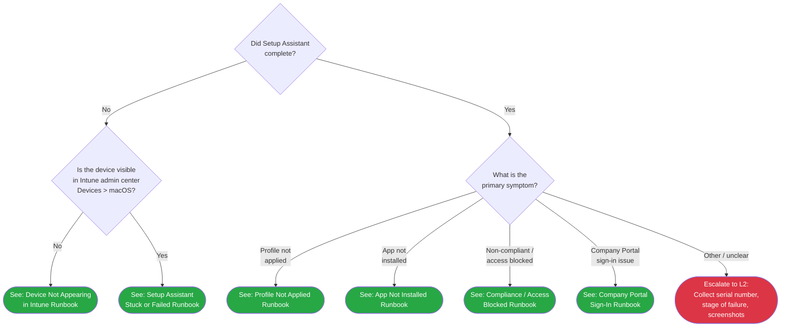

<objective>
Create the macOS ADE triage decision tree and all 6 L1 runbooks for macOS enrollment failure scenarios.

Purpose: Enable L1 support agents to independently triage and resolve macOS enrollment/management failures using only portal-based actions (ABM + Intune admin center), without Terminal commands or L2 escalation for common scenarios.

Output: 7 new markdown files -- 1 triage decision tree and 6 L1 runbooks covering device not appearing, Setup Assistant failures, profile delivery, app install, compliance/CA, and Company Portal sign-in issues.
</objective>

<execution_context>
@~/.claude/get-shit-done/workflows/execute-plan.md
@~/.claude/get-shit-done/templates/summary.md
</execution_context>

<context>
@.planning/PROJECT.md
@.planning/ROADMAP.md
@.planning/STATE.md
@.planning/phases/24-macos-troubleshooting/24-CONTEXT.md
@.planning/phases/24-macos-troubleshooting/24-RESEARCH.md

@docs/decision-trees/04-apv2-triage.md
@docs/l1-runbooks/01-device-not-registered.md
@docs/l1-runbooks/02-esp-stuck-or-failed.md
@docs/admin-setup-macos/06-config-failures.md
@docs/admin-setup-macos/01-abm-configuration.md
@docs/admin-setup-macos/02-enrollment-profile.md
@docs/admin-setup-macos/03-configuration-profiles.md
@docs/admin-setup-macos/04-app-deployment.md
@docs/admin-setup-macos/05-compliance-policy.md
@docs/macos-lifecycle/00-ade-lifecycle.md
@docs/reference/macos-commands.md
@docs/reference/macos-log-paths.md

<interfaces>
<!-- Existing frontmatter pattern for L1 runbooks (from 01-device-not-registered.md): -->
```yaml
---
last_verified: 2026-03-20
review_by: 2026-06-18
applies_to: APv1
audience: L1
---
```

<!-- macOS adaptation per D-18: -->
```yaml
---
last_verified: 2026-04-14
review_by: 2026-07-13
applies_to: ADE
audience: L1
platform: macOS
---
```

<!-- Version gate pattern per D-19: -->
```markdown
> **Platform gate:** This guide covers macOS ADE troubleshooting via Intune. For Windows Autopilot, see [Windows L1 Runbooks](00-index.md#apv1-runbooks).
```

<!-- Triage tree frontmatter (from 04-apv2-triage.md): -->
```yaml
---
last_verified: 2026-04-12
review_by: 2026-07-11
applies_to: APv2
audience: L1
---
```

<!-- macOS triage tree adaptation: -->
```yaml
---
last_verified: 2026-04-14
review_by: 2026-07-13
applies_to: ADE
audience: L1
platform: macOS
---
```

<!-- L1 runbook escalation pattern (from 01-device-not-registered.md): -->
<!-- "Before escalating, collect:" checklist with bullet items for L2 data handoff -->

<!-- Branching pattern (from 02-esp-stuck-or-failed.md): -->
<!-- "How to Use This Runbook" section with anchor links to sub-scenario sections -->

<!-- Config-failures categories from 06-config-failures.md that map to L1 runbooks: -->
<!-- H2: ABM Configuration Failures -> runbook 10 -->
<!-- H2: Enrollment Profile Failures -> runbook 11 -->
<!-- H2: Configuration Profile Failures -> runbook 12 -->
<!-- H2: App Deployment Failures -> runbook 13 -->
<!-- H2: Compliance Policy Failures -> runbook 14 -->
<!-- (Company Portal sign-in: cross-cutting from ADE lifecycle Stage 6 -> runbook 15) -->
</interfaces>
</context>

<tasks>

<task type="auto">
  <name>Task 1: Create macOS ADE triage decision tree</name>
  <files>docs/decision-trees/06-macos-triage.md</files>
  <read_first>
    - docs/decision-trees/04-apv2-triage.md (structural template -- standalone triage tree with Mermaid, "How to Use" section, Legend table, escalation data table)
    - docs/decision-trees/00-initial-triage.md (cross-reference banner pattern at line 7-8 for APv2; adapt for macOS)
    - docs/admin-setup-macos/06-config-failures.md (the 5 failure categories + Company Portal = 6 routing destinations)
    - docs/macos-lifecycle/00-ade-lifecycle.md (7-stage lifecycle for understanding where failures occur)
  </read_first>
  <action>
Create `docs/decision-trees/06-macos-triage.md` as a standalone macOS ADE triage decision tree (per D-04, D-05).

**Frontmatter:**
```yaml
---
last_verified: 2026-04-14
review_by: 2026-07-13
applies_to: ADE
audience: L1
platform: macOS
---
```

**Version gate blockquote (per D-19):**
```
> **Platform gate:** This guide covers macOS ADE troubleshooting via Intune. For Windows Autopilot, see [Initial Triage Decision Tree](00-initial-triage.md).
```

**H1:** `# macOS ADE Triage`

**"How to Use This Tree" section** (parallel to APv2 triage pattern):
- Explain: Start here when a user reports an issue with a Mac enrolled (or expected to enroll) via ADE. Follow each decision point using Intune admin center observations. The tree routes to an L1 runbook or L2 escalation within 3 steps.
- Link to `../_glossary-macos.md` for macOS-specific terms.

**Legend table** matching APv2 triage pattern:
| Symbol | Meaning |
|--------|---------|
| Diamond `{}` | Decision -- answer the question |
| Rounded `([])` | Action -- follow the linked runbook |
| Red terminal | Escalate to L2 |

**Mermaid decision tree** (per D-07: must route within 3 decision steps from root):


**Routing verification table** (shows each path is within 3 decision steps):
| Path | Step 1 | Step 2 | Destination |
|------|--------|--------|-------------|
| Device not appearing | Setup Assistant? No | Visible in Intune? No | Runbook 10 |
| Setup Assistant stuck | Setup Assistant? No | Visible in Intune? Yes | Runbook 11 |
| Profile not applied | Setup Assistant? Yes | Symptom: profile | Runbook 12 |
| App not installed | Setup Assistant? Yes | Symptom: app | Runbook 13 |
| Compliance/access blocked | Setup Assistant? Yes | Symptom: non-compliant | Runbook 14 |
| Company Portal sign-in | Setup Assistant? Yes | Symptom: CP sign-in | Runbook 15 |
| Other/unclear | Setup Assistant? Yes | Symptom: other | L2 escalation |

**"How to Check" table** (portal observation guidance matching APv2 triage pattern):
| Question | How to Check |
|----------|-------------|
| Did Setup Assistant complete? | Ask user: "Are you at the macOS desktop?" If yes, Setup Assistant completed. If device shows Apple logo, spinning globe, or remote management screen, it did not complete. |
| Is the device visible in Intune? | Open Intune admin center > Devices > macOS. Search by serial number (System Information > Serial Number on the device). |
| What is the primary symptom? | Ask user: "What specifically is not working?" Map their response to the symptom categories. |

**Escalation Data table:**
| When You Escalate | Collect This |
|-------------------|-------------|
| "Other / unclear" route | Device serial number, macOS version (Apple menu > About This Mac), screenshot of current screen, description of expected vs. actual behavior, time when issue first appeared |

**Related Resources** section linking to L1 runbook index, L2 runbooks index, macOS ADE lifecycle, and Windows initial triage tree.

**Version History** table: `| 2026-04-14 | Initial version | -- |`

Target length: 80-110 lines.
  </action>
  <verify>
    <automated>cd D:/claude/Autopilot && test -f docs/decision-trees/06-macos-triage.md && grep -c "Did Setup Assistant" docs/decision-trees/06-macos-triage.md && grep -q "platform: macOS" docs/decision-trees/06-macos-triage.md && grep -q "click MACR1" docs/decision-trees/06-macos-triage.md && grep -q "click MACR6" docs/decision-trees/06-macos-triage.md && echo "PASS" || echo "FAIL"</automated>
  </verify>
  <acceptance_criteria>
    - docs/decision-trees/06-macos-triage.md exists
    - File contains frontmatter with `platform: macOS`, `applies_to: ADE`, `audience: L1`
    - File contains version gate blockquote with "Platform gate:" text
    - File contains `graph TD` Mermaid block
    - Root node text contains "Did Setup Assistant"
    - Mermaid block contains `click MACR1` through `click MACR6` with correct relative paths to l1-runbooks/10-15
    - No Mermaid terminal node is more than 3 edges from root node MAC1
    - "How to Check" table has entries for all 3 decision questions
    - Escalation Data table specifies serial number, macOS version, screenshot, description
    - File contains `classDef resolved` and `classDef escalateL2` style definitions
    - Version History table present with 2026-04-14 entry
  </acceptance_criteria>
  <done>Triage tree file exists with Mermaid diagram routing all 6 L1 runbook destinations within 3 decision steps from "Did Setup Assistant complete?" root node, plus L2 escalation for "other/unclear" path.</done>
</task>

<task type="auto">
  <name>Task 2: Create all 6 macOS L1 runbooks</name>
  <files>
    docs/l1-runbooks/10-macos-device-not-appearing.md
    docs/l1-runbooks/11-macos-setup-assistant-failed.md
    docs/l1-runbooks/12-macos-profile-not-applied.md
    docs/l1-runbooks/13-macos-app-not-installed.md
    docs/l1-runbooks/14-macos-compliance-access-blocked.md
    docs/l1-runbooks/15-macos-company-portal-sign-in.md
  </files>
  <read_first>
    - docs/l1-runbooks/01-device-not-registered.md (template for simple linear L1 runbook -- portal-only steps, "Say to user" callouts, escalation criteria)
    - docs/l1-runbooks/02-esp-stuck-or-failed.md (template for branching L1 runbook -- "How to Use This Runbook" nav table, multiple sub-scenario sections with anchors, each path under 15 steps)
    - docs/admin-setup-macos/06-config-failures.md (all failure scenarios organized by category -- the source content for each L1 runbook)
    - docs/admin-setup-macos/01-abm-configuration.md (ABM failure scenarios for runbook 10)
    - docs/admin-setup-macos/02-enrollment-profile.md (enrollment profile failures for runbook 11)
    - docs/admin-setup-macos/03-configuration-profiles.md (config profile failures for runbook 12)
    - docs/admin-setup-macos/04-app-deployment.md (app deployment failures for runbook 13)
    - docs/admin-setup-macos/05-compliance-policy.md (compliance/CA failures for runbook 14)
    - docs/macos-lifecycle/00-ade-lifecycle.md (Stage 6 Company Portal context for runbook 15)
    - docs/decision-trees/06-macos-triage.md (just created in Task 1 -- verify link targets match)
  </read_first>
  <action>
Create all 6 L1 runbooks per D-08, D-09, D-10. Every runbook uses this common structure:

**Common frontmatter for ALL 6 files:**
```yaml
---
last_verified: 2026-04-14
review_by: 2026-07-13
applies_to: ADE
audience: L1
platform: macOS
---
```

**Common version gate for ALL 6 files (per D-19):**
```
> **Platform gate:** This guide covers macOS ADE troubleshooting via Intune. For Windows Autopilot, see [Windows L1 Runbooks](00-index.md#apv1-runbooks).
```

**Common elements in ALL 6 files:**
- Prerequisites section: portal access (Intune admin center, ABM where applicable), device serial number
- "Say to user" callouts using `> **Say to the user:** "..."` blockquote format
- Escalation Criteria section: "If [condition], escalate to L2. Before escalating, collect:" with bullet checklist including serial number, macOS version, Intune device status screenshot, description of steps attempted
- Related Resources section linking back to `06-macos-triage.md` and to the corresponding admin setup guide
- Version History: `| 2026-04-14 | Initial version | -- |`
- ZERO Terminal commands, ZERO file paths, ZERO `bash`/`sh`/`powershell` code blocks (per D-09, D-15)
- Each execution path under 15 steps (per D-10)

---

**Runbook 10: `10-macos-device-not-appearing.md`** (linear, no branching needed)
- **H1:** `# macOS Device Not Appearing in Intune`
- **Use when:** Device serial number not found in Intune admin center Devices > macOS after completing ADE enrollment.
- **Prerequisites:** Access to Intune admin center AND Apple Business Manager portal, device serial number.
- **Failure scenarios sourced from `06-config-failures.md` ABM Configuration Failures section:**
  1. Device not in ABM (check ABM > Devices > search by serial)
  2. Wrong MDM server selected (check ABM > Devices > [serial] > MDM Server)
  3. Expired ADE token (check Intune > Devices > Enrollment > Apple > Enrollment program tokens > token status)
  4. No enrollment profile assigned before power-on (check Intune > Devices > Enrollment > Apple > Enrollment program tokens > [token] > Profiles)
  5. Device not released by previous organization (check ABM > Devices > [serial] -- if "Assigned to: [other org]", cannot fix at L1)
- **Steps:** 8-10 numbered portal-check steps. Each step names the exact portal navigation path.
- **"Say to user" callout:** "We're checking your device registration. This may take a few minutes. Please keep the device powered on and connected to Wi-Fi."
- **Escalation:** If device not in ABM and not owned by another org, or if ADE token renewal requires admin action beyond L1 scope.
- Target: 60-80 lines.

---

**Runbook 11: `11-macos-setup-assistant-failed.md`** (BRANCHING -- 3 sub-scenarios per D-10)
- **H1:** `# macOS Setup Assistant Stuck or Failed`
- **Use when:** Device is visible in Intune but Setup Assistant did not complete -- stuck on Apple logo, spinning globe, remote management prompt, or authentication screen.
- **"How to Use This Runbook" nav table:**
  - [Authentication Failure](#authentication-failure) -- Setup Assistant authentication prompt fails or loops
  - [Await Configuration Stuck](#await-configuration-stuck) -- Device shows "Your Mac is being configured" but never advances
  - [Network / Connectivity Issue](#network-connectivity) -- Setup Assistant cannot reach Apple or Microsoft endpoints
- **Failure scenarios sourced from `06-config-failures.md` Enrollment Profile Failures + network issues:**
  - Auth failure: Legacy authentication method, modern CA blocking, user affinity misconfigured
  - Await Config stuck: Await Configuration = Yes but critical profiles not deploying, timeout behavior
  - Network: DNS/proxy blocking apple.com or manage.microsoft.com domains
- **Each sub-scenario section:** 6-10 numbered portal-check steps, "Say to user" callout, section-specific escalation criteria.
- **Escalation:** If authentication failure persists after enrollment profile verification, or Await Configuration exceeds 30 minutes.
- Target: 100-130 lines.

---

**Runbook 12: `12-macos-profile-not-applied.md`** (BRANCHING -- 2 sub-scenarios)
- **H1:** `# macOS Configuration Profile Not Applied`
- **Use when:** Setup Assistant completed but expected configuration (Wi-Fi, VPN, restrictions, FileVault, firewall) is missing.
- **"How to Use This Runbook" nav table:**
  - [Profile Not Showing](#profile-not-showing) -- Profile not listed under device's Configuration profiles in Intune
  - [Profile Showing but Not Working](#profile-showing-not-working) -- Profile shows as applied in Intune but setting not active on device
- **Failure scenarios sourced from `06-config-failures.md` Configuration Profile Failures:**
  - Profile not showing: Assignment group mismatch, profile deployment pending sync, Intune enrollment incomplete
  - Profile showing not working: SSID case mismatch (Wi-Fi), firewall blocking MDM (device cannot check in), FileVault without escrow, certificate profile missing for 802.1X, deprecated Endpoint protection template
- **Steps per branch:** 6-8 portal-check steps. Key portal paths: Intune > Devices > macOS > [device] > Configuration profiles (check delivery status per profile).
- **"Say to user" callout:** "We're checking your device's configuration settings. Some settings require a device restart to take effect -- please don't restart until we've finished checking."
- **Escalation:** If profile shows "Error" or "Conflict" status in Intune, escalate to L2 with profile name and status.
- Target: 80-100 lines.

---

**Runbook 13: `13-macos-app-not-installed.md`** (BRANCHING -- 3 sub-scenarios per app type)
- **H1:** `# macOS App Not Installed`
- **Use when:** Expected app is not present on device after enrollment.
- **"How to Use This Runbook" nav table:**
  - [DMG/PKG App Missing](#dmg-pkg-missing) -- Managed app (DMG or PKG) not installed
  - [VPP App Missing](#vpp-missing) -- Apps and Books (VPP) app not visible in Company Portal or not installed
  - [App Install Failed](#app-install-failed) -- App shows "Failed" status in Intune
- **Failure scenarios sourced from `06-config-failures.md` App Deployment Failures:**
  - DMG/PKG: Non-app file in DMG, PKG > 2 GB upload fail, PKG without payload causing reinstall loop, detection rule mismatch
  - VPP: Expired VPP token, VPP Available assigned to device group (invisible in CP), license revoked without uninstall
  - Failed: General install failure status in Intune, device-side space issues
- **Steps per branch:** 6-8 portal-check steps. Key portal path: Intune > Apps > macOS > [app name] > Device install status.
- **"Say to user" callout:** "We're checking the application deployment status. Some apps take up to 30 minutes to install after enrollment."
- **Escalation:** If app shows persistent "Failed" status after Sync action, or VPP token issues require admin renewal.
- Target: 90-110 lines.

---

**Runbook 14: `14-macos-compliance-access-blocked.md`** (BRANCHING -- 2 sub-scenarios per Pitfall 3)
- **H1:** `# macOS Compliance Failure / Access Blocked`
- **Use when:** Device shows as non-compliant in Intune, OR user cannot access Microsoft 365 resources (email, Teams) despite enrollment.
- **"How to Use This Runbook" nav table (per Research Pitfall 3 -- must distinguish these two):**
  - [Device Non-Compliant](#device-non-compliant) -- Device shows "Not compliant" in Intune
  - [Compliant but Access Blocked](#compliant-access-blocked) -- Device shows "Compliant" in Intune but user still cannot access resources
- **Failure scenarios sourced from `06-config-failures.md` Compliance Policy Failures + CA cross-cutting:**
  - Non-compliant: SIP disabled (user must boot Recovery Mode -- L1 cannot fix, document for "Say to user"), OS version requirement ahead of available update, password timing gap, Gatekeeper not enforced via config profile, compliance without enforcement config profile
  - Access blocked but compliant: Conditional Access policy scope (check Entra ID > Security > Conditional Access), user not in compliant device group, Entra device registration incomplete, CA grace period not elapsed
- **Steps per branch:** 8-12 portal-check steps. Key portal paths: Intune > Devices > macOS > [device] > Compliance; Intune > Endpoint security > Conditional access.
- **"Say to user" callout (non-compliant SIP):** "Your device's System Integrity Protection is disabled. This requires a special restart that we'll walk you through. Please save any open work."
- **Escalation:** If compliance policy misconfiguration requires admin change, or CA policy scope change needed.
- Target: 100-120 lines.

---

**Runbook 15: `15-macos-company-portal-sign-in.md`** (linear, no branching needed)
- **H1:** `# macOS Company Portal Sign-In Failure`
- **Use when:** User cannot sign into Company Portal app, or Company Portal app is not available on the device.
- **Context:** This covers ADE lifecycle Stage 6 failures. Company Portal is required for user affinity completion, Entra device registration, and access to VPP "Available" apps.
- **Failure scenarios (identified during D-08 adversarial review as cross-cutting gap):**
  1. Company Portal not deployed to device (check Intune > Apps > macOS for CP assignment)
  2. User skips Company Portal sign-in (device functional but unregistered in Entra -- explain consequence)
  3. Entra registration incomplete (check Entra ID > Devices for device record)
  4. CA blocks resource access before CP sign-in completes (enrollment chicken-and-egg)
  5. Company Portal crashes or hangs (check Intune > Apps > macOS > Company Portal > Device install status)
- **Steps:** 8-10 numbered portal-check steps. Focus on verifying CP deployment, user assignment, and Entra device registration status.
- **"Say to user" callout:** "The Company Portal app is required to complete your device setup and access company resources like email and Teams. Let's check if it's installed correctly."
- **Escalation:** If Company Portal app deployment is missing from Intune config (requires admin), or Entra registration stuck.
- Target: 60-80 lines.
  </action>
  <verify>
    <automated>cd D:/claude/Autopilot && for f in 10-macos-device-not-appearing 11-macos-setup-assistant-failed 12-macos-profile-not-applied 13-macos-app-not-installed 14-macos-compliance-access-blocked 15-macos-company-portal-sign-in; do test -f "docs/l1-runbooks/${f}.md" && echo "EXISTS: ${f}" || echo "MISSING: ${f}"; done && echo "---" && grep -rl "platform: macOS" docs/l1-runbooks/1*.md | wc -l && echo "---" && grep -rl '```bash\|```sh\|```powershell' docs/l1-runbooks/1*.md 2>/dev/null | wc -l && echo "(should be 0 Terminal code blocks)"</automated>
  </verify>
  <acceptance_criteria>
    - All 6 files exist: docs/l1-runbooks/10-macos-device-not-appearing.md through 15-macos-company-portal-sign-in.md
    - Every file contains frontmatter with `platform: macOS`, `applies_to: ADE`, `audience: L1`
    - Every file contains `> **Platform gate:**` version gate blockquote
    - Every file has a `## Prerequisites` section
    - Every file has at least one `> **Say to the user:**` blockquote
    - Every file has a `## Escalation Criteria` section with "Before escalating, collect:" checklist
    - Every file has a `## Version History` table
    - ZERO files contain ````bash`, ````sh`, or ````powershell` code blocks (L1 = portal only per D-09, D-15)
    - Files 11, 12, 13, 14 each contain a "## How to Use This Runbook" section with anchor links (branching pattern per D-10)
    - File 14 has separate sections for "Device Non-Compliant" and "Compliant but Access Blocked" (per Research Pitfall 3)
    - Every file has a `## Related Resources` section linking back to `06-macos-triage.md`
    - `grep -c "platform: macOS" docs/l1-runbooks/1*.md` returns 6 (one per file)
  </acceptance_criteria>
  <done>All 6 macOS L1 runbooks exist with portal-only actions, "Say to user" callouts, escalation criteria, branching where applicable, and zero Terminal commands. Each runbook's failure scenarios are sourced from Phase 23 admin setup guides and config-failures table.</done>
</task>

</tasks>

<verification>
1. `ls docs/decision-trees/06-macos-triage.md docs/l1-runbooks/1[0-5]-macos-*.md | wc -l` returns 7
2. `grep -rl "platform: macOS" docs/decision-trees/06-macos-triage.md docs/l1-runbooks/1*.md | wc -l` returns 7
3. `grep -rl '```bash\|```sh\|```powershell' docs/l1-runbooks/1*.md | wc -l` returns 0 (zero Terminal commands in L1 files)
4. Manual path-trace: from MAC1 root in Mermaid to any terminal node is at most 3 edges
5. Each L1 runbook contains "Say to the user:" callout and "Escalation Criteria" section
</verification>

<success_criteria>
- Triage tree routes to all 6 L1 runbooks within 3 decision steps from "Did Setup Assistant complete?"
- All L1 runbooks use portal-only actions with zero Terminal/PowerShell commands
- Branching runbooks (11, 12, 13, 14) use "How to Use This Runbook" navigation pattern
- Compliance runbook (14) distinguishes non-compliant vs. compliant-but-blocked scenarios
- All files have correct macOS frontmatter (platform: macOS, applies_to: ADE, audience: L1)
</success_criteria>

<output>
After completion, create `.planning/phases/24-macos-troubleshooting/24-01-SUMMARY.md`
</output>
