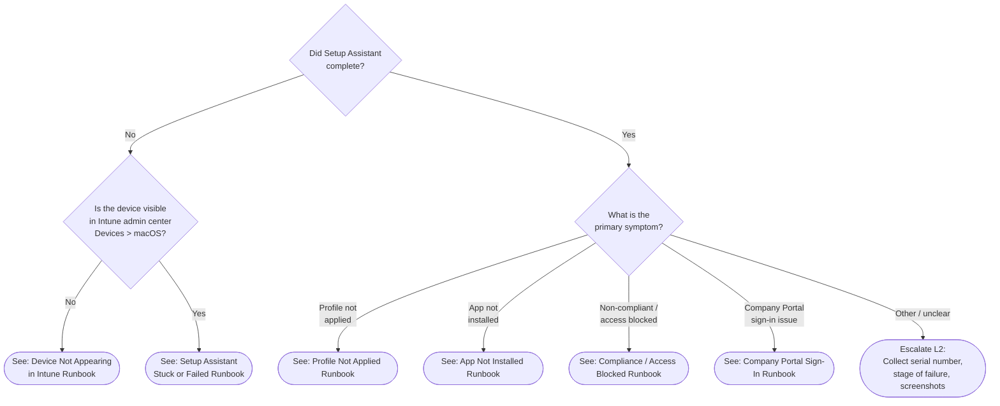

# Phase 24: macOS Troubleshooting - Research

**Researched:** 2026-04-14
**Domain:** macOS ADE troubleshooting documentation — L1 triage tree, L1 portal-only runbooks, L2 log collection guide, L2 diagnostic runbooks
**Confidence:** HIGH

---

<user_constraints>
## User Constraints (from CONTEXT.md)

### Locked Decisions

**Folder Placement (D-01, D-02):**
- All files go inside existing `docs/decision-trees/`, `docs/l1-runbooks/`, and `docs/l2-runbooks/` folders using numbered continuation.
- macOS triage tree starts at `06-*` in `decision-trees/`.
- L1 runbooks start at `10-*` in `l1-runbooks/`.
- L2 runbooks start at `10-*` in `l2-runbooks/`.
- Do NOT create separate `l1-runbooks-macos/`, `l2-runbooks-macos/`, or `troubleshooting-macos/` folders.

**Index Updates (D-03):**
- Update `l1-runbooks/00-index.md` and `l2-runbooks/00-index.md` with new "## macOS ADE Runbooks" sections.
- Add `platform: all` frontmatter to index files.

**Triage Tree Design (D-04 through D-07):**
- Create standalone `docs/decision-trees/06-macos-triage.md`.
- Do NOT integrate into `00-initial-triage.md`.
- Add one-line cross-reference banner to `00-initial-triage.md` (following APv2 banner pattern at line 7).
- Tree must route to correct runbook within 3 decision steps from "Did Setup Assistant complete?".

**L1 Failure Scenario Coverage (D-08 through D-10):**
- Create 6 L1 runbooks (numbered 10–15 in `l1-runbooks/`) covering:
  1. Device not appearing in Intune
  2. Setup Assistant stuck or failed
  3. Configuration profile not applied
  4. App not installed
  5. Compliance failure / access blocked
  6. Company Portal sign-in failure
- All L1 runbooks use portal-only actions (ABM + Intune admin center). Zero Terminal commands.
- Use branching pattern from `02-esp-stuck-or-failed.md` for multi-sub-scenario runbooks.
- Each execution path stays under 15 steps.

**L2 Diagnostic Approach (D-11 through D-14):**
- L2 log collection guide leads with IntuneMacODC as primary comprehensive collection tool, Terminal as secondary/fallback.
- IntuneMacODC is macOS-native (bash script) — not a Windows pattern.
- L2 investigation runbooks cover: profile delivery investigation, app install failure diagnosis, compliance evaluation troubleshooting. Use macOS-native diagnostics.
- L2 log collection guide structure: Section 1 (IntuneMacODC), Section 2 (Terminal-based targeted commands), Section 3 (log paths per macOS version).

**Cross-Phase Patterns (D-15 through D-19):**
- L1 templates forbid Terminal commands — portal-only.
- L2 templates link to `docs/reference/macos-commands.md` and `docs/reference/macos-log-paths.md`.
- Resolve all `[TBD - Phase 24]` placeholder links in Phase 23 admin setup guides.
- `platform: macOS` and `applies_to: ADE` frontmatter on all new files.
- Version gate blockquote: "This guide covers macOS ADE troubleshooting via Intune. For Windows Autopilot, see [link]."

### Claude's Discretion
- Exact file numbering within each folder (starting at 06 for decision-trees, 10 for l1-runbooks and l2-runbooks, per ARCHITECTURE.md).
- Whether L2 investigation runbooks are 2 files (profile+compliance combined, app separate) or 3 files (one per MTRO-04 area).
- How to structure the L2 log collection guide's macOS-version-specific paths (inline table vs subsections).
- Whether `06-config-failures.md` `[TBD - Phase 24]` links point to individual runbook files or to the L1 index with section anchors.
- Exact branching structure within each L1 runbook (which sub-scenarios get branches).

### Deferred Ideas (OUT OF SCOPE)
None — discussion stayed within phase scope.

</user_constraints>

<phase_requirements>
## Phase Requirements

| ID | Description | Research Support |
|----|-------------|------------------|
| MTRO-01 | macOS L1 triage decision tree using symptom-based routing with "Did Setup Assistant complete?" as first gate, routed to scripted runbooks | Triage tree structure documented; 3-step routing verified against 6 failure scenarios; Mermaid syntax confirmed from APv2 triage precedent |
| MTRO-02 | macOS L1 runbooks for top enrollment failure scenarios using only ABM portal and Intune admin center actions (zero Terminal commands) | 6-runbook set defined from Phase 23 config-failures table; portal check paths documented for all 6 scenarios; L1 template pattern confirmed from existing runbooks |
| MTRO-03 | macOS L2 log collection guide using IntuneMacODC tool and Terminal commands with log path reference for each macOS version | IntuneMacODC acquisition/run steps confirmed from macos-commands.md; all log paths per macOS version documented in macos-log-paths.md; structural model confirmed from Windows l2-runbooks/01-log-collection.md |
| MTRO-04 | macOS L2 runbooks for profile delivery investigation, app install failure diagnosis, and compliance evaluation troubleshooting using macOS-native diagnostics | macOS-native diagnostic commands documented (profiles show, log show, system_profiler, IntuneMdmDaemon log); three investigation domains mapped; structural model confirmed from l2-runbooks/02-esp-deep-dive.md |

</phase_requirements>

---

## Summary

Phase 24 is a documentation-only phase producing 11 new files and 6 file modifications. All source content required to write the deliverables already exists in previously-completed phases (22 and 23). The research task is primarily structural — confirming numbering, template patterns, diagnostic command accuracy, and the exact routing logic for the triage tree.

The macOS troubleshooting layer maps cleanly to the existing Windows/APv2 troubleshooting structure: one standalone triage tree (parallel to `04-apv2-triage.md`), six L1 portal-only runbooks (parallel to APv1/APv2 runbooks), one L2 log collection guide (parallel to `01-log-collection.md` and `06-apv2-log-collection.md`), and investigation runbooks (parallel to `02-esp-deep-dive.md`). The key adaptation is replacing Windows-specific tools (PowerShell, mdmdiagnosticstool.exe, registry) with macOS-native equivalents (Terminal, IntuneMacODC, unified log).

The 6-runbook set for L1 covers every failure category in the `06-config-failures.md` reverse-lookup table plus the Company Portal/Conditional Access gap identified during Phase 24 discussion. All failure scenario content is sourced from Phase 23 admin setup guides — the runbooks do not need to invent new failure scenarios, they need to operationalize the already-documented ones as portal-action procedures.

**Primary recommendation:** Work through files in strict dependency order: triage tree first (defines routing), then L1 runbooks (the destinations), then L2 log collection (the prerequisite for L2), then L2 investigation runbooks. Resolve `[TBD - Phase 24]` links in Phase 23 files as a cleanup sweep after all new files exist.

---

## Standard Stack

### Content Creation
| Component | Version/Format | Purpose | Why Standard |
|-----------|---------------|---------|--------------|
| Markdown frontmatter | YAML block | `last_verified`, `review_by`, `applies_to`, `audience`, `platform` fields | Established in every prior phase; required for cross-platform filtering (XPLAT-04) |
| Mermaid diagrams | Mermaid (no version pin — rendered by viewer) | Decision tree flowcharts | Established in `00-initial-triage.md` and `04-apv2-triage.md`; renders in GitHub and MkDocs |
| Relative markdown links | `../folder/file.md#anchor` | Cross-references between docs | Project-wide convention; no absolute paths |
| Version gate blockquote | Freetext `> **...:** ...` | Platform disambiguation at top of each file | Established pattern; every runbook has one |

### Diagnostic Tools Referenced in L2 Content
| Tool | Type | Primary Use | Verified In |
|------|------|-------------|-------------|
| IntuneMacODC | Microsoft-provided bash script | Comprehensive log collection (equivalent of mdmdiagnosticstool.exe) | `docs/reference/macos-commands.md` |
| `profiles show` / `profiles status` | OS-shipped binary | Verify MDM enrollment status and installed profiles | `docs/reference/macos-commands.md` |
| `log show` / `log stream` | OS unified logging | Query MDM events (`com.apple.ManagedClient` subsystem) | `docs/reference/macos-commands.md` |
| `system_profiler SPConfigurationProfileDataType` | OS-shipped binary | Dump all installed configuration profiles | `docs/reference/macos-commands.md` |
| `pgrep -il "^IntuneMdm"` | OS-shipped binary | Verify Intune agent processes are running | `docs/reference/macos-commands.md` |
| `defaults read /Library/Managed\ Preferences/com.microsoft.intune` | OS-shipped binary | Read Intune-managed preferences | `docs/reference/macos-commands.md` |

### Portal Actions Referenced in L1 Content
| Portal | Navigation Path | L1 Use Case |
|--------|-----------------|-------------|
| Intune admin center | Devices > Enrollment > Apple > Enrollment program tokens | Check ADE token status and sync devices |
| Intune admin center | Devices > macOS > [device] > Overview | Check enrollment status, sync, restart |
| Intune admin center | Devices > macOS > [device] > Configuration profiles | Check profile delivery status |
| Intune admin center | Apps > macOS > [app] > Device install status | Check app install status |
| Intune admin center | Devices > macOS > [device] > Compliance | Check compliance policy evaluation results |
| Apple Business Manager | Devices > [serial number] > MDM Server | Verify/change MDM server assignment |
| Apple Business Manager | Settings > MDM Servers > [server] | Verify ADE token enrollment profile |

---

## Architecture Patterns

### File Placement (Verified Against Existing Folder Contents)

Current last file in each folder:
- `docs/decision-trees/` — `05-device-lifecycle.md` → macOS triage: `06-macos-triage.md`
- `docs/l1-runbooks/` — `09-apv2-deployment-timeout.md` → macOS L1 starts at `10-macos-device-not-appearing.md`
- `docs/l2-runbooks/` — `08-apv2-deployment-report.md` → macOS L2 starts at `10-macos-log-collection.md`

### Recommended File Set

**New files to create (11 files):**

```
docs/decision-trees/
└── 06-macos-triage.md                         # MTRO-01: macOS ADE triage tree

docs/l1-runbooks/
├── 10-macos-device-not-appearing.md           # MTRO-02: runbook 1 of 6
├── 11-macos-setup-assistant-failed.md         # MTRO-02: runbook 2 of 6
├── 12-macos-profile-not-applied.md            # MTRO-02: runbook 3 of 6
├── 13-macos-app-not-installed.md              # MTRO-02: runbook 4 of 6
├── 14-macos-compliance-access-blocked.md      # MTRO-02: runbook 5 of 6
└── 15-macos-company-portal-sign-in.md         # MTRO-02: runbook 6 of 6

docs/l2-runbooks/
├── 10-macos-log-collection.md                 # MTRO-03: IntuneMacODC-first log collection
├── 11-macos-profile-delivery.md               # MTRO-04: profile delivery investigation
├── 12-macos-app-install.md                    # MTRO-04: app install failure diagnosis
└── 13-macos-compliance.md                     # MTRO-04: compliance evaluation investigation
```

**Files to modify (6 modifications):**

```
docs/decision-trees/00-initial-triage.md       # Add macOS cross-reference banner (line 7)
docs/l1-runbooks/00-index.md                   # Add "## macOS ADE Runbooks" section; platform: all
docs/l2-runbooks/00-index.md                   # Add "## macOS ADE Runbooks" section; platform: all
docs/index.md                                  # Replace TBD placeholders (lines 103-104, 114-115)
docs/admin-setup-macos/06-config-failures.md   # Replace all [TBD - Phase 24] links
docs/admin-setup-macos/01-05 (as needed)       # Replace any [TBD - Phase 24] runbook links
```

### Pattern 1: macOS Triage Tree (Mermaid)

**What:** Standalone Mermaid decision tree with "Did Setup Assistant complete?" as root node, routing to 6 L1 runbooks within 3 decision steps.
**When to use:** Template for `06-macos-triage.md`.

**Routing logic (3-step verification):**

```
Step 1: "Did Setup Assistant complete?" → No → "Did device appear in ABM?" → routes to runbook 10 or 11
Step 1: "Did Setup Assistant complete?" → Yes → "What is the primary symptom?" → routes to runbook 12, 13, 14, or 15
```

This satisfies "within 3 decision steps" per MTRO-01 Success Criteria #1.

**Key structural differences from APv2 triage tree (`04-apv2-triage.md`):**
- Root gate: "Did Setup Assistant complete?" (macOS) vs "Did ESP display?" (APv2)
- macOS has no deployment mode distinction (all ADE follows one pipeline)
- macOS adds Company Portal sign-in as a discrete failure category (Stage 6 of ADE lifecycle)
- macOS escalation paths go to L2 runbooks in `l2-runbooks/` not to error codes

**Mermaid node convention (established in existing trees):**
```
Diamond {question}      — decision nodes
Rectangle [action]      — action steps
Rounded ([...])         — terminal nodes (resolved/escalate)
click node "url"        — clickable links to runbooks
classDef resolved       — fill:#28a745,color:#fff
classDef escalateL2     — fill:#dc3545,color:#fff
classDef escalateInfra  — fill:#fd7e14,color:#fff
```

### Pattern 2: macOS L1 Runbook

**What:** Portal-only runbook with frontmatter, version gate, prerequisites, numbered steps, "Say to user" callouts, branching (where needed), and escalation criteria with data collection checklist.
**When to use:** Template for all 6 macOS L1 runbooks (files 10–15).

**Frontmatter for all new L1 runbooks:**
```yaml
---
last_verified: 2026-04-14
review_by: 2026-07-13
applies_to: ADE
audience: L1
platform: macOS
---
```

**Version gate for all new L1 runbooks:**
```markdown
> **Platform gate:** This guide covers macOS ADE troubleshooting via Intune. For Windows Autopilot, see [Windows L1 Runbooks](00-index.md#apv1-runbooks).
```

**Structure (from `01-device-not-registered.md` template):**
1. Prerequisites (portal access, device identifier)
2. Steps (numbered, portal navigation paths spelled out fully)
3. "Say to user" callouts (exact script text in `> **Say to the user:**` blockquote)
4. Escalation Criteria section with "Before escalating, collect:" checklist

**Branching (from `02-esp-stuck-or-failed.md` template):**
- Named sections with `{#anchor}` for each sub-scenario
- "How to Use This Runbook" navigation table at top
- Each path under 15 steps
- Applies to runbooks 11 (Setup Assistant), 12 (profiles), 14 (compliance/CA)

### Pattern 3: macOS L2 Log Collection Guide

**What:** IntuneMacODC-first log collection guide parallel to Windows `01-log-collection.md`.
**When to use:** Template for `10-macos-log-collection.md`.

**Section structure (mirrors Windows guide structure):**
- Section 1: IntuneMacODC comprehensive collection (primary — equivalent of `mdmdiagnosticstool.exe -area Autopilot -cab`)
- Section 2: Terminal-based targeted commands (secondary/fallback — equivalent of `wevtutil` exports)
- Section 3: Specific log paths per macOS version (from `macos-log-paths.md`)

**IntuneMacODC invocation (from `macos-commands.md`):**
```bash
curl -L https://aka.ms/IntuneMacODC -o IntuneMacODC.sh
chmod u+x ./IntuneMacODC.sh
sudo ./IntuneMacODC.sh
```
Output: `IntuneMacODC.zip` in `ODC/` subfolder.

**"Gather everything first" principle:**
Carried forward from Windows L2 guide: all other L2 runbooks open with "Before starting: collect a diagnostic package per [macOS Log Collection Guide](10-macos-log-collection.md)."

### Pattern 4: macOS L2 Investigation Runbook

**What:** Terminal-command investigation runbook with triage block (from L1 escalation vs starting fresh), step-by-step commands referencing canonical reference files, resolution scenarios, and escalation ceiling.
**When to use:** Template for `11-macos-profile-delivery.md`, `12-macos-app-install.md`, `13-macos-compliance.md`.

**Key structural elements (from `02-esp-deep-dive.md` template):**
- Triage block: "From L1 escalation? Skip to Step X. Starting fresh? Begin at Step 1."
- Step 1 always: "Collect diagnostic package per [macOS Log Collection Guide](10-macos-log-collection.md)"
- Commands reference `macos-commands.md` and `macos-log-paths.md` (not inline-defined)
- Escalation ceiling section for Microsoft support cases

**macOS-native diagnostics by investigation domain:**

| Domain | Primary Command | Log Path |
|--------|----------------|----------|
| Profile delivery | `sudo profiles show` | Unified log: `com.apple.ManagedClient` |
| Profile delivery | `log show --predicate 'subsystem == "com.apple.ManagedClient"' --info --last 1h` | Unified log |
| App install | IntuneMDMDaemon log | `/Library/Logs/Microsoft/Intune/IntuneMDMDaemon*.log` |
| App install | `pgrep -il "^IntuneMdm"` | Process check |
| Compliance | `profiles status -type enrollment` | Enrollment status |
| Compliance | Company Portal log | `/Library/Logs/Microsoft/Intune/CompanyPortal*.log` |

### Anti-Patterns to Avoid

- **Transplanting Windows patterns to macOS:** Never reference registry paths, PowerShell, mdmdiagnosticstool.exe, `.cab` files, ESP tracking keys, or `AppWorkload.log` in macOS runbooks. These have no macOS equivalent (Pitfall P10 from CONTEXT.md discussion).
- **Conflating MDM channel and IME channel:** Configuration profiles (Wi-Fi, VPN, restrictions) are delivered via Apple MDM channel (APNs). Shell scripts and DMG/PKG apps are delivered via IME channel. Troubleshooting the wrong channel is a dead end. Runbooks must be explicit about which channel is involved.
- **Treating "Await Configuration" as equivalent to ESP:** macOS Await Configuration has no user-phase, no itemized progress, no configurable timeout, no retry button, and does not fire on re-enrollment. Do not copy ESP diagnostic logic.
- **Inline log paths:** All log paths must link to `macos-log-paths.md` rather than being defined inline. This prevents maintenance drift.
- **Inline command definitions:** All Terminal commands must link to `macos-commands.md`. Same reason.

---

## Don't Hand-Roll

| Problem | Don't Build | Use Instead | Why |
|---------|-------------|-------------|-----|
| Comprehensive log collection | Custom log export script | IntuneMacODC (`aka.ms/IntuneMacODC`) | Microsoft-maintained; collects all Intune agent logs, system profiler, profiles, process lists in one zip |
| MDM enrollment status check | Custom enrollment parser | `profiles status -type enrollment` | OS-shipped; returns `Enrolled via DEP`, `MDM enrollment: User Approved`, MDM server URL in structured format |
| Profile inspection | Manual plist parsing | `sudo profiles show` or `system_profiler SPConfigurationProfileDataType` | OS-shipped; output is human-readable and parseable |
| Log filtering | Custom log collector | `log show --predicate 'subsystem == "com.apple.ManagedClient"'` | OS unified log API; structured, filterable, covers all MDM subsystems |
| Failure scenario definitions | New research | `docs/admin-setup-macos/06-config-failures.md` | All failure scenarios and their causes already documented in Phase 23; runbooks operationalize existing content |

**Key insight:** Every technical artifact needed to write Phase 24 already exists in the project — `macos-commands.md`, `macos-log-paths.md`, `06-config-failures.md`, and the ADE lifecycle guide. Phase 24 is primarily composition and operationalization, not new discovery.

---

## Common Pitfalls

### Pitfall 1: Triage Tree Exceeds 3-Step Route Constraint
**What goes wrong:** Adding a 4th decision gate before reaching a runbook link — violates MTRO-01 Success Criteria #1.
**Why it happens:** macOS has 6 failure categories; without grouping, the tree becomes deep.
**How to avoid:** Use the two-gate structure: Gate 1 (Setup Assistant complete?), Gate 2a (ABM visibility for "No" branch), Gate 2b (symptom for "Yes" branch). Company Portal and Compliance both fall under the "Yes" branch's symptom gate — they are symptoms, not a third gate.
**Warning signs:** Any node that is more than 3 edges from the root.

### Pitfall 2: L1 Runbooks That Require L2 Escalation for Step 1
**What goes wrong:** An L1 runbook's first step requires checking something only L2 can access — e.g., Intune agent logs, Terminal commands.
**Why it happens:** Copying L2 investigation logic into L1 structure.
**How to avoid:** Every step in an L1 runbook must be completable from the Intune admin center or ABM portal with no Terminal, no registry, no log file access. Anything requiring Terminal goes in an escalation criteria item or the corresponding L2 runbook.
**Warning signs:** Any step containing a Terminal command, file path, or registry reference.

### Pitfall 3: Conflating "Compliance failure" and "CA blocking access"
**What goes wrong:** The L1 runbook for "Compliance failure / access blocked" (runbook 14) treats these as the same scenario — compliance evaluation failure vs. Conditional Access policy blocking a compliant device.
**Why it happens:** They present the same user symptom ("can't access email/Teams") but have different root causes and different portal fixes.
**How to avoid:** Use branching in runbook 14: Branch A for "device shows non-compliant in Intune" (compliance evaluation issue), Branch B for "device shows compliant but access still blocked" (CA policy scope issue). This is documented in Phase 23's `05-compliance-policy.md`.
**Warning signs:** A single linear path that doesn't distinguish the two scenarios.

### Pitfall 4: Forgetting to Resolve [TBD - Phase 24] Links
**What goes wrong:** Phase 23 files ship with broken `[TBD - Phase 24]` placeholder links. All 25+ placeholders in `06-config-failures.md` and individual admin guides must be updated.
**Why it happens:** The cleanup step gets missed in planning.
**How to avoid:** Include a dedicated modification task that sweeps all Phase 23 files for `[TBD - Phase 24]` and replaces with actual runbook file paths. This must run AFTER all L1 runbook files exist.
**Warning signs:** Any `[TBD - Phase 24]` string remaining in `docs/admin-setup-macos/`.

### Pitfall 5: Incorrect macOS Version Callouts for IntuneMDMAgent
**What goes wrong:** Runbooks reference `IntuneMDMAgent*.log` (user-level) without noting it may be absent on macOS 15.
**Why it happens:** Not checking `macos-log-paths.md` notes column.
**How to avoid:** `macos-log-paths.md` explicitly notes: "May be absent on macOS 15 (known issue as of 2026-04); check system log instead." The L2 log collection guide must include this caveat when listing the agent log paths.
**Warning signs:** Any reference to `IntuneMDMAgent*.log` without the macOS 15 caveat.

### Pitfall 6: IntuneMacODC Download Step Fails on Device Under Investigation
**What goes wrong:** The `curl -L https://aka.ms/IntuneMacODC` step fails because the device has network restrictions or firewall rules.
**Why it happens:** The device being diagnosed may have broken network connectivity.
**How to avoid:** The L2 log collection guide must include a fallback section (Terminal-based manual log collection) for when IntuneMacODC cannot be downloaded. This is why D-11 specifies Terminal commands as a secondary option.
**Warning signs:** Section 2 of the log collection guide is missing or underspecified.

---

## Code Examples

Verified patterns from `docs/reference/macos-commands.md` and `docs/reference/macos-log-paths.md`:

### IntuneMacODC Collection (Section 1 of L2 log guide)
```bash
# Download the diagnostic collection script
curl -L https://aka.ms/IntuneMacODC -o IntuneMacODC.sh

# Make executable
chmod u+x ./IntuneMacODC.sh

# Run with elevated privileges
sudo ./IntuneMacODC.sh
# Output: IntuneMacODC.zip in ODC/ subfolder, opened automatically in Finder
```

### MDM Enrollment Status Check (L1 portal verification alternative for L2)
```bash
profiles status -type enrollment
# Expected output:
# Enrolled via DEP: Yes
# MDM enrollment: Yes (User Approved)
# MDM server: https://*.manage.microsoft.com/...
```

### Profile Delivery Investigation
```bash
# List all installed profiles with full payload detail
sudo profiles show

# Query unified log for MDM/profile events in last hour
log show --predicate 'subsystem == "com.apple.ManagedClient"' --info --last 1h

# ADE enrollment events (Setup Assistant investigation)
log show --predicate 'subsystem contains "cloudconfigurationd"' --info --last 30m
```

### App Install Investigation
```bash
# Check if Intune management processes are running
pgrep -il "^IntuneMdm"

# Check Intune daemon log (PKG/DMG installs)
# Path: /Library/Logs/Microsoft/Intune/IntuneMDMDaemon*.log
# Format: timestamp | process | level | PID | task | detail
```

### Compliance / Enrollment Verification
```bash
# Check enrollment and DEP status
profiles status -type enrollment

# List all configuration profiles (compact)
sudo profiles list

# Dump all installed configuration profiles
system_profiler SPConfigurationProfileDataType
```

### Mermaid Decision Tree Skeleton (for 06-macos-triage.md)

*Note: This skeleton requires expansion with "How to Check" table and Escalation Data table per the APv2 triage tree pattern.*

---

## State of the Art

| Old Approach | Current Approach | When Changed | Impact |
|--------------|-----------------|--------------|--------|
| "Setup Assistant (legacy)" authentication | "Setup Assistant with modern authentication" | Default changed late 2024 | L2 runbooks must document both; L1 runbooks reference auth method mismatch as a sub-scenario in runbook 11 |
| SCEP-based device identity certificate | ACME certificate | macOS 13.1+ | Enrollment failure investigation changes on newer OS; note in L2 profile delivery runbook |
| IntuneMDMAgent log (user-level) | System log via `log show` | macOS 15 (known issue as of 2026-04) | L2 log collection guide must include macOS 15 caveat for agent log |

**Currently accurate (no deprecation concerns):**
- IntuneMacODC download URL (`aka.ms/IntuneMacODC`): active and current per `macos-commands.md`
- `profiles status -type enrollment` output format: stable across macOS 10.13+
- Log paths in `macos-log-paths.md`: verified against macOS 14 (Sonoma), noted where macOS 15 differences exist
- Intune admin center navigation paths: current as of April 2026

---

## Open Questions

1. **L2 investigation runbook count: 2 files vs 3 files**
   - What we know: MTRO-04 lists 3 investigation areas (profile delivery, app install, compliance evaluation). D-13 covers all three.
   - What's unclear: Whether compliance evaluation and profile delivery are similar enough to combine, or whether combining makes each runbook too long.
   - Recommendation: Use 3 files (11, 12, 13) for clean 1:1 mapping to MTRO-04's three explicit areas. Each will be roughly the same length as `02-esp-deep-dive.md` (200 lines). Combining two areas risks exceeding the readable length threshold.

2. **[TBD - Phase 24] link resolution: individual files vs index anchors**
   - What we know: `06-config-failures.md` has 25+ `[TBD - Phase 24]` links. The failure categories map to 6 runbooks, but each table row is a specific sub-scenario within a runbook.
   - What's unclear: Whether to link to individual runbook files (e.g., `10-macos-device-not-appearing.md`) or to specific section anchors within those files.
   - Recommendation: Link to individual runbook files without anchors. The runbooks use "How to Use This Runbook" navigation sections at top for internal routing. Section-level anchors add maintenance burden.

3. **macOS version coverage range in L2 log guide**
   - What we know: `macos-log-paths.md` verifies against macOS 14 (Sonoma) with notes for macOS 15 differences. macOS 12 and 13 are likely still in production in enterprise fleets.
   - What's unclear: Whether the log collection guide needs a macOS 12/13 column in its version table.
   - Recommendation: Include a 3-column table: macOS 13 (Ventura), macOS 14 (Sonoma), macOS 15 (Sequoia). macOS 12 (Monterey) is approaching end of enterprise support; note it in a "Legacy" row rather than giving it a full column.

---

## Validation Architecture

`workflow.nyquist_validation` key is absent from `.planning/config.json`. Treating as enabled.

### Test Framework

This is a documentation-only phase. There is no code under test. The "test" for each deliverable is a structural completeness check.

| Property | Value |
|----------|-------|
| Framework | Manual review against acceptance criteria checklist |
| Config file | None — documentation phase |
| Quick run command | `grep -r "\[TBD - Phase 24\]" D:/claude/Autopilot/docs/` (verify all placeholders resolved) |
| Full suite command | Manual review of each file against its corresponding MTRO acceptance criterion |

### Phase Requirements → Test Map

| Req ID | Behavior | Test Type | Automated Command | File Exists? |
|--------|----------|-----------|-------------------|-------------|
| MTRO-01 | Triage tree routes to runbook within 3 decision steps | Manual path-trace | Count edges from root to each terminal node in `06-macos-triage.md` | ❌ Wave 0 |
| MTRO-01 | First gate is "Did Setup Assistant complete?" | Manual inspection | Open `06-macos-triage.md`, verify root node text | ❌ Wave 0 |
| MTRO-02 | L1 runbooks contain zero Terminal commands | Automated grep | `grep -l "^\`\`\`bash\|^\`\`\`sh\|^\`\`\`powershell" docs/l1-runbooks/1*.md` — should return empty | ❌ Wave 0 |
| MTRO-02 | All 6 L1 runbooks exist | Automated file check | `ls docs/l1-runbooks/1[0-5]-macos-*.md \| wc -l` — should return 6 | ❌ Wave 0 |
| MTRO-03 | L2 log guide leads with IntuneMacODC | Manual inspection | Open `10-macos-log-collection.md`, verify Section 1 is IntuneMacODC | ❌ Wave 0 |
| MTRO-03 | Log paths reference per macOS version | Manual inspection | Check Section 3 has macOS 13/14/15 version differentiation | ❌ Wave 0 |
| MTRO-04 | L2 runbooks use macOS-native diagnostics only | Manual inspection | Verify no PowerShell, registry, mdmdiagnosticstool.exe, AppWorkload.log references | ❌ Wave 0 |
| MTRO-04 | All 3 investigation areas covered | File existence | `ls docs/l2-runbooks/1[1-3]-macos-*.md \| wc -l` — should return 3 | ❌ Wave 0 |
| Cross-cutting | All [TBD - Phase 24] links resolved | Automated grep | `grep -r "\[TBD - Phase 24\]" docs/` — should return empty | ❌ Wave 0 |
| Cross-cutting | platform: macOS frontmatter on all new L1/L2 files | Automated grep | `grep -rL "platform: macOS" docs/l1-runbooks/1*.md docs/l2-runbooks/1*.md` — should return empty | ❌ Wave 0 |

### Sampling Rate
- **Per task commit:** `grep -r "\[TBD - Phase 24\]" D:/claude/Autopilot/docs/`
- **Per wave merge:** Manual triage tree path-trace + Terminal command grep on L1 files
- **Phase gate:** Full acceptance criteria check before `/gsd:verify-work`

### Wave 0 Gaps
- [ ] All 11 new files listed above — do not yet exist
- [ ] `docs/decision-trees/06-macos-triage.md` — covers MTRO-01
- [ ] `docs/l1-runbooks/10-15-macos-*.md` (6 files) — covers MTRO-02
- [ ] `docs/l2-runbooks/10-13-macos-*.md` (4 files) — covers MTRO-03, MTRO-04
- [ ] 6 existing file modifications — covers D-03, D-06, D-17, and index integration

---

## Sources

### Primary (HIGH confidence)
- `docs/decision-trees/04-apv2-triage.md` — Structural template for `06-macos-triage.md`; Mermaid syntax, node conventions, "How to Check" table pattern, "Escalation Data" table pattern
- `docs/l1-runbooks/01-device-not-registered.md` — L1 runbook template (prerequisites, numbered steps, "Say to user" callouts, escalation criteria)
- `docs/l1-runbooks/02-esp-stuck-or-failed.md` — Branching L1 runbook pattern (multi-section, anchor navigation, < 15 steps per path)
- `docs/l2-runbooks/01-log-collection.md` — L2 log collection guide structural template (Section 1 primary tool, Section 2 manual alternative, Section 3 artifact naming)
- `docs/l2-runbooks/02-esp-deep-dive.md` — L2 investigation runbook template (triage block, step-by-step registry/log investigation, resolution scenarios, escalation ceiling)
- `docs/reference/macos-commands.md` — All Terminal diagnostic commands and IntuneMacODC acquisition steps; verified against macOS 14
- `docs/reference/macos-log-paths.md` — All log file paths, unified log subsystems, macOS version notes; verified against macOS 14 with macOS 15 delta
- `docs/admin-setup-macos/06-config-failures.md` — Failure scenario definitions for all 6 L1 runbooks; 25+ `[TBD - Phase 24]` links that need resolution
- `docs/macos-lifecycle/00-ade-lifecycle.md` — 7-stage ADE pipeline; Stage 6 detail for Company Portal runbook; Stage 4/5 detail for Setup Assistant runbook
- `.planning/phases/24-macos-troubleshooting/24-CONTEXT.md` — All locked decisions, discretion areas

### Secondary (MEDIUM confidence)
- `docs/l1-runbooks/00-index.md` — Current index structure; APv1/APv2 section pattern for macOS section addition
- `docs/l2-runbooks/00-index.md` — Current index structure; L1 escalation mapping pattern for macOS mapping
- `docs/decision-trees/00-initial-triage.md` — APv2 banner pattern (line 7/8) to replicate for macOS cross-reference
- `docs/index.md` (lines 99–115) — TBD placeholder locations for macOS L1/L2 navigation sections
- `docs/admin-setup-macos/01-05` — Source material for per-runbook failure scenario content

### Tertiary (LOW confidence)
None — all research is based on in-project documentation and established patterns.

---

## Metadata

**Confidence breakdown:**
- File placement and numbering: HIGH — verified by `ls` against existing folder contents; confirmed 05 is last in decision-trees, 09 in l1-runbooks, 08 in l2-runbooks
- Triage tree routing logic: HIGH — verified "within 3 steps" with the two-gate design; all 6 scenarios reachable
- L1 runbook template: HIGH — direct pattern from existing runbooks; portal paths verified against admin guides
- L2 diagnostic commands: HIGH — sourced from `macos-commands.md` which was verified against macOS 14
- IntuneMacODC: HIGH — download URL and output documented in `macos-commands.md`; marked as current
- macOS 15 agent log caveat: HIGH — explicitly noted in `macos-log-paths.md`
- Failure scenario definitions: HIGH — sourced from `06-config-failures.md`; produced by Phase 23

**Research date:** 2026-04-14
**Valid until:** 2026-07-14 (90-day review cycle per project convention; macOS commands verified against macOS 14; check for macOS 16 beta changes after WWDC 2026)
