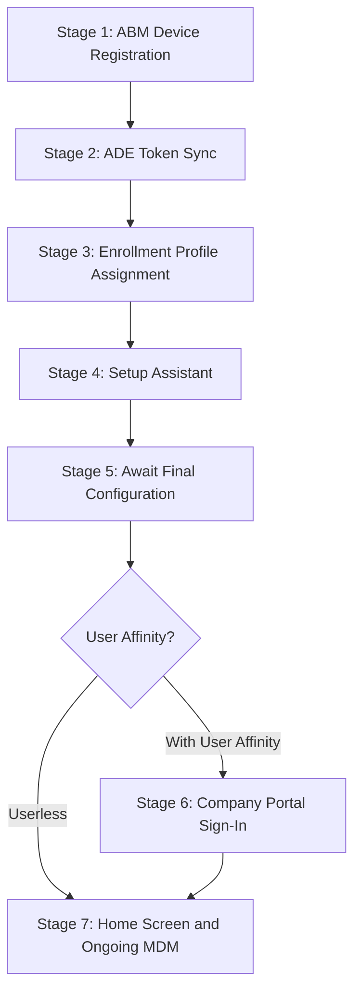

<objective>
Create the iOS/iPadOS ADE lifecycle document covering supervised corporate enrollment end-to-end in a 7-stage narrative that mirrors the macOS ADE lifecycle format. This is the second foundational document for v1.3, enabling all downstream troubleshooting and admin setup content to reference specific enrollment stages.

Purpose: IT teams managing both macOS and iOS need consistent lifecycle documentation. The 7-stage format with 4 subsections per stage is already validated by v1.2. This document applies iOS-specific adaptations to each stage while maintaining structural consistency.

Output: `docs/ios-lifecycle/01-ade-lifecycle.md` -- a single Markdown file with 7 stages, each containing 4 subsections.
</objective>

<execution_context>
@~/.claude/get-shit-done/workflows/execute-plan.md
@~/.claude/get-shit-done/templates/summary.md
</execution_context>

<context>
@.planning/PROJECT.md
@.planning/ROADMAP.md
@.planning/STATE.md

@docs/macos-lifecycle/00-ade-lifecycle.md
@docs/_glossary-macos.md

<interfaces>
<!-- The macOS ADE lifecycle (docs/macos-lifecycle/00-ade-lifecycle.md) is the PRIMARY structural template. -->
<!-- Each stage follows this exact 4-subsection pattern: -->

## Stage N: [Name]

### What the Admin Sees
[Portal views and device-side screens]

### What Happens
[Numbered technical sequence of events]

### Behind the Scenes
[L2 detail: endpoints, protocols, agent behavior, log references]

### Watch Out For
[Common pitfalls with remediation guidance]

<!-- Frontmatter schema from macOS lifecycle: -->
<!-- last_verified, review_by, applies_to, audience, platform -->
</interfaces>
</context>

<threat_model>
This plan creates a single Markdown documentation file. No code execution, no secrets, no API endpoints, no user input processing, no network access.

| Threat | Severity | Mitigation |
|--------|----------|------------|
| macOS content bleeding into iOS stages | LOW | D-07, D-08, D-09 are explicit constraints; acceptance criteria check for IME, FileVault, DMG/PKG absence; research documents all iOS-specific deviations |
| Wrong ACME certificate threshold | LOW | D-11 locks iOS 16+ (not macOS 13.1+); acceptance criteria grep for correct value |
| Portal click-paths documented (UI redesign pending) | LOW | Phase 26 documents concepts and stages, not portal navigation (per Pitfall #4 in research); portal steps are Phase 27 scope |

No blocking threats.
</threat_model>

<tasks>

<task type="auto">
  <name>Task 1: Create iOS ADE lifecycle document - Stages 1-4 with preamble</name>
  <files>docs/ios-lifecycle/01-ade-lifecycle.md</files>

  <read_first>
    docs/macos-lifecycle/00-ade-lifecycle.md
    docs/_glossary-macos.md
    .planning/phases/26-ios-ipados-foundation/26-CONTEXT.md
    .planning/phases/26-ios-ipados-foundation/26-RESEARCH.md
  </read_first>

  <action>
Create `docs/ios-lifecycle/01-ade-lifecycle.md` with the preamble sections and Stages 1-4. The file will be completed by Task 2 (Stages 5-7 + closing sections).

**Frontmatter** (per D-19):
```yaml
---
last_verified: 2026-04-16
review_by: 2026-07-15
applies_to: ADE
audience: all
platform: iOS
---
```

**Version gate blockquote:**
```
> **Version gate:** This guide covers iOS/iPadOS Automated Device Enrollment (ADE) via Apple Business Manager and Microsoft Intune. For the enrollment path overview, see [iOS/iPadOS Enrollment Path Overview](00-enrollment-overview.md). For macOS ADE, see [macOS ADE Lifecycle](../macos-lifecycle/00-ade-lifecycle.md). For terminology, see the [Apple Provisioning Glossary](../_glossary-macos.md).
```

**H1:** `# iOS/iPadOS ADE Lifecycle: Automated Device Enrollment End-to-End`

**## How to Use This Guide** -- Mirror the macOS lifecycle pattern exactly (per D-05):
- Explain this is a single-file narrative covering the complete iOS ADE pipeline from ABM registration through home screen delivery and ongoing MDM management
- State that iOS ADE follows a single linear pipeline with one conditional branch at Stage 6 (user affinity) -- same as macOS
- Audience routing for L1 ("What the Admin Sees" and "Watch Out For"), L2 ("Behind the Scenes"), and admins ("What Happens" and "Watch Out For")
- Navigation instructions: start at Stage 1 for first-time setup, jump to specific stage for troubleshooting, use Stage Summary Table for overview

**### Prerequisites** -- Checklist (mirror macOS format, adapt for iOS):
- [ ] Apple Business Manager account configured and verified
- [ ] At least one MDM server configured in ABM and linked to Microsoft Intune
- [ ] ADE token (.p7m) downloaded from ABM and uploaded to Intune
- [ ] Apple Push Notification certificate configured in Intune (Tenant administration > Connectors and tokens)
- [ ] Appropriate Intune licenses assigned to target users
- [ ] Network connectivity to required Apple ADE endpoints and Microsoft Intune endpoints
- [ ] Enrollment profile created and assigned in Intune (Stage 3)
- [ ] Company Portal app licensed via VPP/Apps and Books in ABM (for user affinity enrollments)

**## Supervision** -- Dedicated section BEFORE Stage 1 (per D-06, D-12, D-13). This is the conceptual anchor for the entire v1.3 milestone. Structure with three clearly delineated subsections:

1. **What supervision is:** A management state set at enrollment time through ADE. When a device is supervised, the MDM server has expanded control including capabilities not available on unsupervised devices (enforced restrictions, silent app install, activation lock bypass, lost mode, etc.). Unsupervised devices receive standard MDM management only. State that for iOS/iPadOS 13.0 and later, devices enrolled via ADE are automatically placed in supervised mode.

2. **When supervision is set:** Exclusively at enrollment time, through ADE. The enrollment profile includes a supervised mode setting. Once the device completes ADE enrollment, the supervision state is locked. Supervision cannot be added to a device that was enrolled without it (e.g., via Device Enrollment or User Enrollment).

3. **Changing supervision requires a full device erase:** Write EXACTLY: "Changing a device from unsupervised to supervised requires a full device erase and re-enrollment via ADE. A full device erase removes all data on the device, including personal data. This is not a selective wipe, which removes only managed data while preserving personal content." Include verification: "On a supervised device, Settings > General > About displays: 'This iPhone is supervised and managed by [organization name].'" End with the D-15 forward reference: "Subsequent admin setup guides mark supervised-only settings with the supervised-only callout pattern."

**## The ADE Pipeline** -- Mermaid diagram (from research, identical topology to macOS):

Add note below diagram: "Stage 6 only applies when the enrollment profile is configured for 'Enroll with User Affinity' and modern authentication. Userless enrollments skip directly to Stage 7."

**## Stage Summary Table** -- 7-row table (per D-05, mirror macOS format) with columns: Stage, Actor, Location, What Happens, Key Pitfall. Use these iOS-specific values:

| Stage | Actor | Location | What Happens | Key Pitfall |
|-------|-------|----------|--------------|-------------|
| 1: ABM Device Registration | Admin | ABM Portal | Device serial numbers assigned to MDM server in Apple Business Manager | Device not assigned to correct MDM server; non-ABM-linked reseller |
| 2: ADE Token Sync | System/Intune | Intune admin center | Intune syncs device list from ABM via .p7m token (auto every 12h) | Token expired; Apple ID inaccessible; ABM T&C changed |
| 3: Enrollment Profile Assignment | Admin | Intune admin center | Enrollment profile assigned to devices (defines supervised mode, auth method, Setup Assistant screens) | No profile assigned before device powers on |
| 4: Setup Assistant | Device/User | On-device | Device contacts Apple ADE endpoints, enrolls in MDM, runs iOS-specific Setup Assistant screens | Firewall blocks ADE endpoints; APNs certificate expired |
| 5: Await Final Configuration | System/Intune | On-device | Device pauses at "Awaiting final configuration" while Intune pushes configuration policies | Misconfigured profile blocks release; APNs connectivity issues |
| 6: Company Portal Sign-In | Device/User | On-device | User signs into Company Portal for Entra ID registration and Conditional Access | Company Portal not deployed via VPP; user skips sign-in |
| 7: Home Screen and Ongoing MDM | System/Intune | On-device | Home screen delivered; single MDM channel via APNs manages device | APNs certificate renewal missed; no IME fallback on iOS |

Note the iOS-specific differences from macOS: Stage 2 uses 12h delta sync (not 24h), Stage 6 mentions VPP deployment, Stage 7 says "single MDM channel via APNs" (no IME).

**## Stage 1: ABM Device Registration** -- 4 subsections (per D-05, D-10):
- **### What the Admin Sees:** ABM portal Devices view, Assign to MDM Server action. Same as macOS -- include iPhone/iPad device types in inline notes.
- **### What Happens:** 4 numbered steps: (1) Device identity via serial number assigned to MDM server in ABM, (2) MDM server association (one-to-one: each device to one MDM server), (3) OEM pre-assignment (reseller linked to ABM), (4) Bulk operations for fleet-scale. Duplicate macOS content per D-10 with iOS device type inline notes.
- **### Behind the Scenes:** Serial number is sole identity mechanism (no hardware hash like Windows). Device contacts `deviceenrollment.apple.com` during Setup Assistant. ABM supports multiple MDM servers. Apple Configurator can add non-ABM-purchased devices.
- **### Watch Out For:** Wrong MDM server, non-ABM-linked reseller, reseller forgot device transfer, device already enrolled in another MDM.

**## Stage 2: ADE Token Sync** -- 4 subsections (per D-05, D-10):
- **### What the Admin Sees:** Intune admin center Devices > Enrollment > Apple > Enrollment program tokens. Token status, device count, last sync time.
- **### What Happens:** 4 numbered steps: (1) Intune contacts ABM using the .p7m token, (2) Delta sync runs automatically every 12 hours (NOTE: this is 12h for iOS, not 24h as in macOS doc -- verified against Microsoft Learn iOS ADE doc), (3) Full sync available once per 7 days, (4) Manual sync up to once per 15 minutes. State that new devices appear after next sync cycle.
- **### Behind the Scenes:** Token is a .p7m certificate connecting Intune to ABM. Token expires annually. The ABM Apple ID used during token creation becomes permanently associated -- if that Apple ID becomes inaccessible, the token cannot be renewed. The sync retrieves serial numbers and device metadata only.
- **### Watch Out For:** Token expiration (annual renewal required), Apple ID associated with token becomes inaccessible, ABM Terms and Conditions changed (blocks sync until accepted), sync shows 0 devices (usually means token assigned to wrong ABM server).

**## Stage 3: Enrollment Profile Assignment** -- 4 subsections:
- **### What the Admin Sees:** Intune admin center enrollment profile list. Profile settings including supervised mode toggle, user affinity, authentication method, Setup Assistant screens. Note: "Portal navigation may vary by Intune admin center version" (per Pitfall #4 -- do NOT document exact click-path, reserve for Phase 27).
- **### What Happens:** 4 numbered steps: (1) Admin creates iOS/iPadOS enrollment profile specifying supervised mode (Yes for corporate ADE), user affinity preference, and authentication method, (2) Profile assigned to devices synced from ABM (by serial number), (3) Locked enrollment option hides the remove-profile button on the device, (4) Setup Assistant screen customization determines which screens users see during initial setup.
- **### Behind the Scenes:** The enrollment profile is a server-side configuration. It is not pushed to the device -- instead, when the device contacts `iprofiles.apple.com` during Setup Assistant, Apple's service returns the MDM enrollment payload that includes these profile settings. For iOS/iPadOS 13.0+, Intune ignores the `is_supervised` flag because ADE devices are automatically supervised. The authentication method choices are: Setup Assistant with modern authentication (recommended), Setup Assistant (legacy), and no authentication.
- **### Watch Out For:** No profile assigned before device powers on (device enrolls without profile = unsupervised standard Setup Assistant), supervised mode not enabled (cannot be changed after enrollment without full device erase), locked enrollment not enabled (user can remove MDM profile from Settings), wrong authentication method (legacy Setup Assistant does not support modern auth MFA).

**## Stage 4: Setup Assistant** -- 4 subsections (per D-08, D-11):
- **### What the Admin Sees:** Device displays iOS Setup Assistant screens. The exact screens shown depend on enrollment profile configuration. User completes required screens.
- **### What Happens:** 5 numbered steps: (1) Device powers on and contacts `deviceenrollment.apple.com` to check for ADE assignment, (2) Apple's service responds with the MDM enrollment payload, (3) Device installs the MDM management profile and establishes the APNs channel, (4) Setup Assistant screens are presented per the enrollment profile configuration, (5) Device identity certificate is issued (ACME protocol for iOS 16.0+ and iPadOS 16.1+; SCEP for older versions per D-11).
- **### Behind the Scenes:** iOS-specific Setup Assistant panes that can be shown or hidden (per D-08 -- these are iOS-specific, NOT macOS panes): Touch ID/Face ID (iOS 8.1+), Apple Pay (iOS 7.0+), Screen Time (iOS 12.0+), SIM Setup (iOS 12.0+), iMessage and FaceTime (iOS 9.0+), Android Migration (iOS 9.0+), Watch Migration (iOS 11.0+), Emergency SOS (iOS 16.0+), Action button (iOS 17.0+), Apple Intelligence (iOS 18.0+), Camera button (iOS 18.0+), Web content filtering (iOS 18.2+). Panes present on both platforms: Apple ID, Siri, Privacy, Diagnostics Data, Terms and Conditions, Location Services, Restore, Passcode, Appearance, Software Update, Get Started. Deprecated panes to avoid configuring: Display Tone (deprecated iOS 15), Zoom (deprecated iOS 17). Key endpoints contacted: `deviceenrollment.apple.com` (ADE discovery), `iprofiles.apple.com` (enrollment profile download), `mdmenrollment.apple.com` (enrollment handshake), `*.push.apple.com` (APNs on TCP 443, 2197, 5223), `login.microsoftonline.com` (Entra auth), `manage.microsoft.com` (Intune service).
- **### Watch Out For:** Firewall or proxy blocking Apple ADE endpoints (device shows standard non-managed Setup Assistant instead of ADE enrollment), APNs certificate expired (MDM channel fails to establish), ACME certificate failure on pre-iOS 16 devices (ensure SCEP fallback is available), users skipping required screens (some screens cannot be skipped when configured as required in enrollment profile).
  </action>

  <verify>
    <automated>bash -c "test -f 'D:/claude/Autopilot/docs/ios-lifecycle/01-ade-lifecycle.md' && echo 'FILE EXISTS' || echo 'FILE MISSING'"</automated>
    <automated>bash -c "grep 'platform: iOS' 'D:/claude/Autopilot/docs/ios-lifecycle/01-ade-lifecycle.md'"</automated>
    <automated>bash -c "grep -c '## Supervision' 'D:/claude/Autopilot/docs/ios-lifecycle/01-ade-lifecycle.md'"</automated>
    <automated>bash -c "grep -c 'full device erase' 'D:/claude/Autopilot/docs/ios-lifecycle/01-ade-lifecycle.md'"</automated>
    <automated>bash -c "grep -c '## Stage 1' 'D:/claude/Autopilot/docs/ios-lifecycle/01-ade-lifecycle.md'"</automated>
    <automated>bash -c "grep -c '## Stage 4' 'D:/claude/Autopilot/docs/ios-lifecycle/01-ade-lifecycle.md'"</automated>
    <automated>bash -c "grep -c 'Touch ID' 'D:/claude/Autopilot/docs/ios-lifecycle/01-ade-lifecycle.md'"</automated>
    <automated>bash -c "grep -c 'every 12 hours' 'D:/claude/Autopilot/docs/ios-lifecycle/01-ade-lifecycle.md'"</automated>
    <automated>bash -c "grep -c 'iOS 16' 'D:/claude/Autopilot/docs/ios-lifecycle/01-ade-lifecycle.md'"</automated>
  </verify>

  <acceptance_criteria>
- File `docs/ios-lifecycle/01-ade-lifecycle.md` exists
- Frontmatter contains `platform: iOS`, `applies_to: ADE`, `audience: all`
- Version gate blockquote links to `00-enrollment-overview.md`, `../macos-lifecycle/00-ade-lifecycle.md`, and `../_glossary-macos.md`
- `## Supervision` section exists before `## Stage 1` with "full device erase" phrase (not "wipe" or "selective wipe")
- Supervision section contains `Settings > General > About` verification
- Supervision section contains forward-reference phrase "supervised-only callout pattern"
- Mermaid pipeline diagram present with 7 stages and conditional User Affinity branch
- Stage Summary Table has 7 rows with iOS-specific values (12h sync, VPP, single MDM channel)
- `## Stage 1: ABM Device Registration` exists with 4 subsections (What the Admin Sees, What Happens, Behind the Scenes, Watch Out For)
- `## Stage 2: ADE Token Sync` exists with 4 subsections; "What Happens" states 12h delta sync interval (NOT 24h)
- `## Stage 3: Enrollment Profile Assignment` exists with 4 subsections; does NOT contain exact portal click-path navigation
- `## Stage 4: Setup Assistant` exists with 4 subsections; Behind the Scenes lists iOS-specific panes (Touch ID/Face ID, Apple Pay, Screen Time, SIM Setup, Emergency SOS, Action button, Apple Intelligence, Camera button)
- Stage 4 does NOT mention FileVault or macOS Migration Assistant
- Stage 4 states ACME certificate threshold as iOS 16.0+ / iPadOS 16.1+ (NOT 13.1+)
- Stage 4 Behind the Scenes lists key endpoints: deviceenrollment.apple.com, iprofiles.apple.com, mdmenrollment.apple.com
  </acceptance_criteria>

  <done>
The first half of the iOS ADE lifecycle document (preamble + Stages 1-4) is written with: the Supervision section as conceptual anchor, correct 12h sync interval, iOS-specific Setup Assistant panes, ACME iOS 16+ threshold, and no macOS-specific content bleeding through.
  </done>
</task>

<task type="auto">
  <name>Task 2: Complete iOS ADE lifecycle document - Stages 5-7 and closing sections</name>
  <files>docs/ios-lifecycle/01-ade-lifecycle.md</files>

  <read_first>
    docs/ios-lifecycle/01-ade-lifecycle.md
    docs/macos-lifecycle/00-ade-lifecycle.md
    .planning/phases/26-ios-ipados-foundation/26-RESEARCH.md
  </read_first>

  <action>
Append Stages 5-7 and closing sections to `docs/ios-lifecycle/01-ade-lifecycle.md` (created by Task 1). Read the file as written by Task 1 first to ensure continuity.

**## Stage 5: Await Final Configuration** -- 4 subsections:
- **### What the Admin Sees:** Device displays "Awaiting final configuration" screen. Admin can monitor device status in Intune admin center under Devices > iOS/iPadOS > [device] > Device configuration.
- **### What Happens:** 4 numbered steps: (1) After MDM enrollment completes in Stage 4, the device pauses at the "Awaiting final configuration" screen, (2) Intune pushes configuration policies (device restrictions, Wi-Fi, VPN, certificates) to the device via APNs, (3) The device waits until all required configuration policies are confirmed installed before proceeding, (4) Once Intune confirms policy delivery, the device releases the hold and proceeds to Stage 6 (user affinity) or Stage 7 (userless). Note: apps are NOT included during this hold -- only device configuration policies. iOS 13+ requirement for Await Configuration.
- **### Behind the Scenes:** The "Await final configuration" behavior is controlled by the enrollment profile setting. When enabled, Intune sends a `ScheduleOSUpdateScan` command and configuration profiles in priority order. The device reports installation status back via MDM check-ins over APNs. The hold is released when Intune marks the device as having received all critical configuration. If any policy fails to install, the device may remain stuck at this screen.
- **### Watch Out For:** Device stuck at "Awaiting final configuration" for extended time (check Intune device status for policy delivery failures), APNs connectivity issues (device cannot report status back to Intune), misconfigured required policy blocks release (a required configuration profile with errors prevents the hold from releasing), timeout behavior (the device eventually times out and proceeds, but without all intended configuration applied).

**## Stage 6: Company Portal Sign-In** -- 4 subsections (per D-09):
- **### What the Admin Sees:** User opens Company Portal app on the device and signs in with their Entra ID (formerly Azure AD) credentials. After sign-in, the device registers with Entra ID and becomes eligible for Conditional Access policies.
- **### What Happens:** 4 numbered steps: (1) Company Portal app must already be installed on the device via VPP device licensing through Apps and Books in ABM (per D-09 -- do NOT describe DMG/PKG deployment; do NOT tell users to install from App Store directly), (2) User opens Company Portal and signs in with Entra ID credentials, (3) The sign-in registers the device with Entra ID, establishing the user-device affinity that Conditional Access policies evaluate, (4) After successful sign-in, the device is fully enrolled with both MDM management and Entra ID registration. State that this stage only applies to enrollments configured with "Enroll with User Affinity." Userless enrollments skip this stage entirely.
- **### Behind the Scenes:** Company Portal on iOS is an App Store app, not a DMG/PKG. Recommended deployment method: VPP device licensing through Apps and Books in ABM. The VPP device license allows automatic installation without user Apple ID sign-in. Do NOT deploy Company Portal by asking users to download it from the App Store -- this does not provide automatic updates and creates a user-licensed dependency. Enable automatic app updates via the VPP token settings in Intune. After Company Portal sign-in, the device registers in Entra ID with a device ID. Conditional Access policies that require "device to be marked as compliant" or "require approved client app" now evaluate against this registered device.
- **### Watch Out For:** Company Portal not deployed via VPP (user cannot complete Stage 6 because the app is not on the device), user skips Company Portal sign-in (device is MDM-managed but not Entra-registered -- Conditional Access policies that require device registration will block access), Company Portal deployed with user licensing instead of device licensing (requires user Apple ID sign-in in App Store before Company Portal can install), automatic updates not enabled (Company Portal becomes outdated and may fail Conditional Access checks).

**## Stage 7: Home Screen and Ongoing MDM** -- 4 subsections (per D-07):
- **### What the Admin Sees:** User reaches the iOS home screen. The device is fully enrolled and managed. In Intune admin center, the device appears under Devices > iOS/iPadOS with a "Compliant" or "Not compliant" status depending on compliance policy evaluation.
- **### What Happens:** 4 numbered steps: (1) Home screen is delivered and the user can begin using the device, (2) Ongoing MDM management operates through a single channel: Apple MDM via APNs (Apple Push Notification service), (3) Intune pushes configuration changes, app deployments, and compliance checks via APNs push notifications that wake the device to check in, (4) The device periodically checks in with Intune (approximately every 8 hours for iOS, or on-demand when the user opens Company Portal or when Intune sends a push notification).

  CRITICAL per D-07: iOS has NO Intune Management Extension (IME). Do NOT mention IME, dual channels, shell scripts, DMG/PKG apps, or any IME-related content. The entire section must describe APNs-only MDM management.

- **### Behind the Scenes:** iOS MDM operates through a single channel -- Apple MDM via APNs. There is no equivalent to the macOS Intune Management Extension (IME) agent. This means: (a) No shell script execution on iOS -- all management is through MDM commands and configuration profiles, (b) No DMG/PKG app deployment -- iOS apps are deployed as .ipa files via VPP, web clips, or App Store links, (c) No direct filesystem inspection -- L2 diagnostics use Company Portal log upload (device uploads logs to Microsoft), MDM diagnostic report (Settings > General > VPN & Device Management > Management Profile > More Details), and for advanced investigation, Mac+cable sysdiagnose (Phase 31 scope). APNs is the sole push mechanism. If the APNs certificate expires, ALL iOS/iPadOS MDM communication stops -- no commands can be sent and the device cannot check in. The APNs certificate is shared across all platforms (iOS, iPadOS, macOS) -- a single expired certificate breaks management for all Apple devices.
- **### Watch Out For:** APNs certificate expiration (annual renewal required; affects ALL Apple platforms -- one expired certificate breaks iOS AND macOS management simultaneously), no IME fallback (unlike macOS where IME can execute scripts independently of MDM, iOS has no alternative management channel -- if APNs is down, no management actions are possible), device check-in gaps (iOS devices check in approximately every 8 hours; time-sensitive actions may be delayed -- use Company Portal sync or Intune remote actions to trigger immediate check-in), app deployment limitations (no Win32-equivalent packaging on iOS; all apps must be .ipa format, VPP-distributed, or web clips).

**## See Also** -- Cross-reference section:
- `[iOS/iPadOS Enrollment Path Overview](00-enrollment-overview.md)` -- for enrollment path comparison and selection guidance
- `[macOS ADE Lifecycle](../macos-lifecycle/00-ade-lifecycle.md)` -- for cross-platform ADE comparison
- `[Apple Provisioning Glossary](../_glossary-macos.md)` -- for terminology definitions

**## Glossary Quick Reference** -- Optional table (discretionary per Claude's Discretion). Include if the document exceeds ~2500 words. Short table with key terms used in the document and brief inline definitions:

| Term | Definition |
|------|-----------|
| ADE | Automated Device Enrollment -- Apple's zero-touch enrollment through ABM |
| ABM | Apple Business Manager -- Apple's portal for device and app management |
| APNs | Apple Push Notification service -- the sole push channel for iOS MDM |
| VPP | Volume Purchase Program -- Apple's mechanism for device-licensed app deployment via Apps and Books |
| ACME | Automated Certificate Management Environment -- certificate protocol replacing SCEP (iOS 16+) |
| Supervised | Management state set at ADE enrollment time granting expanded MDM control |
  </action>

  <verify>
    <automated>bash -c "grep -c '## Stage 5' 'D:/claude/Autopilot/docs/ios-lifecycle/01-ade-lifecycle.md'"</automated>
    <automated>bash -c "grep -c '## Stage 6' 'D:/claude/Autopilot/docs/ios-lifecycle/01-ade-lifecycle.md'"</automated>
    <automated>bash -c "grep -c '## Stage 7' 'D:/claude/Autopilot/docs/ios-lifecycle/01-ade-lifecycle.md'"</automated>
    <automated>bash -c "grep -c '## See Also' 'D:/claude/Autopilot/docs/ios-lifecycle/01-ade-lifecycle.md'"</automated>
    <automated>bash -c "grep -c 'VPP' 'D:/claude/Autopilot/docs/ios-lifecycle/01-ade-lifecycle.md'"</automated>
    <automated>bash -c "grep -c 'single channel' 'D:/claude/Autopilot/docs/ios-lifecycle/01-ade-lifecycle.md'"</automated>
    <automated>bash -c "grep -ci 'Intune Management Extension' 'D:/claude/Autopilot/docs/ios-lifecycle/01-ade-lifecycle.md' || echo '0 matches (correct -- IME must not appear)'"</automated>
    <automated>bash -c "grep -ci 'FileVault' 'D:/claude/Autopilot/docs/ios-lifecycle/01-ade-lifecycle.md' || echo '0 matches (correct -- FileVault must not appear)'"</automated>
    <automated>bash -c "grep -ci 'DMG' 'D:/claude/Autopilot/docs/ios-lifecycle/01-ade-lifecycle.md' || echo '0 matches (correct -- DMG must not appear as deployment method)'"</automated>
    <automated>bash -c "grep -c '00-enrollment-overview.md' 'D:/claude/Autopilot/docs/ios-lifecycle/01-ade-lifecycle.md'"</automated>
  </verify>

  <acceptance_criteria>
- `## Stage 5: Await Final Configuration` exists with 4 subsections; states apps NOT included during hold; states iOS 13+ requirement
- `## Stage 6: Company Portal Sign-In` exists with 4 subsections; describes Company Portal as VPP App Store app deployed via Apps and Books (NOT DMG/PKG per D-09); states "Do NOT deploy Company Portal by asking users to download it from the App Store"
- `## Stage 7: Home Screen and Ongoing MDM` exists with 4 subsections; describes single-channel APNs-only MDM management per D-07
- Stage 7 does NOT contain: "Intune Management Extension", "IME", "shell script", "DMG", "PKG", "dual channel", "/Library/Intune/", "mdmclient", "pgrep"
- Stage 7 Behind the Scenes explicitly states there is no equivalent to the macOS IME agent
- Stage 7 states APNs certificate affects ALL Apple platforms (shared certificate)
- `## See Also` section links to `00-enrollment-overview.md` and `../macos-lifecycle/00-ade-lifecycle.md`
- Total file has all 7 stages (Stage 1 through Stage 7), each with exactly 4 subsections
- File contains no macOS-only content: no FileVault, no Migration Assistant (macOS-specific), no 24h sync interval, no 13.1+ ACME threshold
  </acceptance_criteria>

  <done>
The complete iOS ADE lifecycle document exists at `docs/ios-lifecycle/01-ade-lifecycle.md` with: (1) all 7 stages with 4 subsections each, (2) supervision preamble with enrollment-time constraint and full device erase, (3) iOS-specific adaptations at every stage (12h sync, iOS Setup Assistant panes, VPP Company Portal, APNs-only Stage 7, ACME iOS 16+), (4) zero macOS content bleeding through (no IME, no FileVault, no DMG/PKG).
  </done>
</task>

</tasks>

<verification>
- File `docs/ios-lifecycle/01-ade-lifecycle.md` exists with all 7 stages
- Each stage has exactly 4 subsections: What the Admin Sees, What Happens, Behind the Scenes, Watch Out For
- Supervision section precedes Stage 1 with enrollment-time constraint and "full device erase" language
- No macOS-specific content: grep for "IME", "FileVault", "Migration Assistant", "DMG", "PKG", "13.1+" should return 0 matches (except where explicitly noting absence, e.g., "no equivalent to IME")
- Stage 2 sync interval is 12h (not 24h)
- Stage 4 ACME threshold is iOS 16+ (not 13.1+)
- Stage 6 Company Portal deployed via VPP (not DMG/PKG)
- Stage 7 is APNs-only single-channel MDM
- Cross-references link to enrollment overview and macOS lifecycle
</verification>

<success_criteria>
SC #2: A new team member reading the ADE lifecycle document can describe each stage of supervised corporate enrollment from Setup Assistant to post-enrollment without consulting external sources.
SC #3: The distinction between supervised and unsupervised management capabilities is stated explicitly with the consequence that supervision is set at enrollment time and cannot be added retroactively without a full device erase.
</success_criteria>

<output>
After completion, create `.planning/phases/26-ios-ipados-foundation/26-02-SUMMARY.md`
</output>
