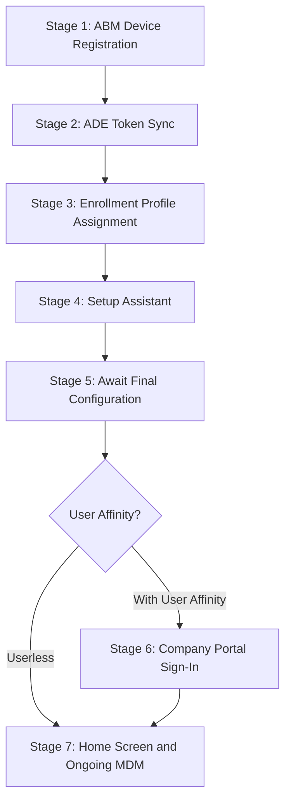

# Phase 26: iOS/iPadOS Foundation - Research

**Researched:** 2026-04-16
**Domain:** iOS/iPadOS enrollment types, supervision model, ADE lifecycle, Intune MDM
**Confidence:** HIGH (primary findings verified against current Microsoft Learn docs, updated 2026-04-14)

---

<user_constraints>
## User Constraints (from CONTEXT.md)

### Locked Decisions

**Enrollment Path Overview Format (LIFE-01)**
- D-01: Narrative overview with embedded table format. Introductory narrative (2-3 paragraphs) establishing the iOS enrollment landscape, followed by the SC #1 comparison table, then individual per-path sections with "When to use" callouts. Target 800-1200 words total.
- D-02: SC #1 comparison table columns: Enrollment Path, Ownership Model, Supervision State, Management Scope, Appropriate Use Case. All four paths as rows.
- D-03: MAM-WE must be visually separated from the three MDM enrollment paths (distinct subsection or horizontal rule + callout) to satisfy SC #4's requirement that it be clearly identified as an app-layer model with no device enrollment.
- D-04: Per-path `###` heading sections (3-5 sentences each) serve as anchor targets for Phase 27-29 cross-references. Keep brief to avoid duplication with downstream admin setup guides.

**ADE Lifecycle Document Structure (LIFE-02)**
- D-05: Mirror macOS 7-stage format with same 4 subsections per stage (What the Admin Sees, What Happens, Behind the Scenes, Watch Out For). Maximum cross-platform consistency for L2 teams managing both macOS and iOS.
- D-06: Mandatory supervision preamble: add a dedicated "Supervision" section before Stage 1 (or within Stage 3 as a prominent subsection) that explains the supervised/unsupervised distinction, states the enrollment-time constraint, and documents the full device erase consequence.
- D-07: Stage 7 rewritten for single-channel MDM management (no IME dual-channel content — iOS has no Intune Management Extension agent).
- D-08: Stage 4 rewritten for iOS-specific Setup Assistant panes (biometric enrollment, Display Zoom, SOS, Screen Time, etc. — NOT macOS panes like FileVault, Siri).
- D-09: Stage 6 rewritten for iOS Company Portal as an App Store app deployed via VPP/Apps and Books (NOT macOS DMG/PKG deployment).
- D-10: ABM/token content (Stages 1-2) duplicated from macOS rather than cross-referenced. Accepted ~2800 words of overlap as the cost of LIFE-02 self-containment ("without consulting external sources"). Keep iOS-specific differences inline (device types, platform filters in ABM).
- D-11: ACME certificate version threshold updated to iOS 16+ (macOS uses 13.1+).

**Supervision Axis Presentation**
- D-12: Both dedicated section AND inline reinforcement (Option C). Dedicated section defines the concept, states the enrollment-time constraint, documents the full device erase (not selective wipe) consequence, and notes verification location (Settings > General > About). Inline callouts per enrollment path link back to the dedicated section anchor.
- D-13: The dedicated section does NOT list specific supervised-only features or capabilities. That is Phase 27/28 scope. It explains WHAT supervision is, WHEN it is set, and WHAT HAPPENS if you need to change it.
- D-14: SC #1's comparison table includes a "Supervision State" column with values: Supervised (ADE), Unsupervised (Device Enrollment), Unsupervised (User Enrollment), N/A (MAM-WE).
- D-15: Forward-reference the Phase 27 callout pattern: "Subsequent admin setup guides mark supervised-only settings with the supervised-only callout pattern."

**File Organization**
- D-16: Create `docs/ios-lifecycle/` directory for Phase 26 content. Follows the macOS flat-directory convention (`macos-lifecycle/`, `admin-setup-macos/`).
- D-17: Phase 27 creates `docs/admin-setup-ios/` when admin setup content begins. Phase 30-31 L1/L2 runbooks go in shared `l1-runbooks/` and `l2-runbooks/` with `ios-` prefix and sequential numbering starting at 16.
- D-18: iOS admin template `_templates/admin-template-ios.md` created during Phase 27.
- D-19: Frontmatter `platform: iOS` for iOS-specific docs. The `applies_to` field uses enrollment-type-specific values where applicable (e.g., `ADE`, `all`).

### Claude's Discretion
- Mermaid pipeline diagram style and complexity (can follow macOS precedent or simplify)
- Stage Summary Table layout and "Key Pitfall" column content
- "How to Use This Guide" section wording and audience routing
- Exact word count within the 800-1200 word target for enrollment overview
- Whether to include a "Glossary Quick Reference" table at the bottom of the ADE lifecycle doc (macOS has one)
- Behind the Scenes subsection depth for iOS (no Terminal/shell access on iOS — L2 content focuses on Company Portal logs, Intune admin center inspection, MDM protocol details)

### Deferred Ideas (OUT OF SCOPE)
None — discussion stayed within phase scope
</user_constraints>

---

<phase_requirements>
## Phase Requirements

| ID | Description | Research Support |
|----|-------------|------------------|
| LIFE-01 | Enrollment path overview covers all 4 paths (ADE, device enrollment, user enrollment, MAM-WE) with comparison table and selection guidance | Four-path matrix fully documented with supervision states, management scope, and ownership models — see Architecture Patterns section |
| LIFE-02 | iOS/iPadOS ADE lifecycle document covers supervised corporate enrollment end-to-end (Setup Assistant through post-enrollment) | Seven-stage iOS ADE pipeline mapped, iOS-specific deviations from macOS documented (no IME, VPP app deployment, iOS Setup Assistant panes, ACME iOS 16+) — see Architecture Patterns and Code Examples sections |
</phase_requirements>

---

## Summary

Phase 26 produces two foundational documents that anchor all downstream iOS/iPadOS phases (27-32). The research confirms that iOS/iPadOS enrollment in Intune spans four distinct paths with fundamentally different management scopes and supervision states. Understanding the supervision axis is the conceptual keystone: supervision is set at enrollment time via ADE and cannot be added retroactively without a full device erase (not selective wipe). This distinction gates the entire Phase 27-28 admin setup content.

The iOS ADE lifecycle maps directly onto the macOS 7-stage format established in `docs/macos-lifecycle/00-ade-lifecycle.md`, with six iOS-specific deviations that require deliberate adaptation rather than simple copy-paste: no Intune Management Extension agent (Stage 7), iOS-specific Setup Assistant panes (Stage 4), VPP/App Store Company Portal deployment (Stage 6), iOS 16+ ACME certificate threshold (Stage 4), platform-specific ABM device types (Stages 1-2), and the absence of any CLI diagnostic tools for Behind the Scenes content.

A critical planning flag: the iOS/iPadOS ADE enrollment profile UI is being redesigned. The new "Enrollment policies" UI (replacing the current "Profiles" blade) was expected Q2 CY26 and had not yet rolled out as of 2026-04-16. The lifecycle document should document concepts and outcomes rather than current click-paths, and the ADE enrollment profile guide (Phase 27, ACORP-03) should verify portal navigation before writing.

**Primary recommendation:** Structure LIFE-01 as a single comparison page with the four-path matrix as its anchor, then LIFE-02 as a self-contained 7-stage narrative modeled on `docs/macos-lifecycle/00-ade-lifecycle.md` with iOS-specific substitutions applied to each adapted stage.

---

## Standard Stack

This phase produces Markdown documentation only — no software libraries. The "stack" here is the document schema and tooling used across the existing 116 docs in this suite.

### Document Schema

| Component | Value | Purpose |
|-----------|-------|---------|
| Frontmatter fields | `last_verified`, `review_by`, `applies_to`, `audience`, `platform` | Established schema — all 116 existing docs use this |
| Platform value | `platform: iOS` | iOS-specific documents |
| Applies-to values | `ADE`, `all`, `device-enrollment`, `user-enrollment` | Per enrollment path |
| Audience values | `all`, `admin`, `l1`, `l2` | Role-based routing |
| Mermaid diagrams | Mermaid v10+ (embedded in Markdown) | Pipeline visualization — matches macOS ADE lifecycle |
| Callout blockquotes | `> **Note:**`, `> **Version gate:**`, `> **Operational note:**` | Established inline callout pattern |

### Structural Template

The direct template for LIFE-02 is `docs/macos-lifecycle/00-ade-lifecycle.md`:

- 7-stage single-file narrative
- 4 subsections per stage: What the Admin Sees / What Happens / Behind the Scenes / Watch Out For
- Stage Summary Table at top for quick navigation
- Mermaid pipeline diagram with conditional branch
- Prerequisites checklist before Stage 1
- Glossary Quick Reference at bottom (discretionary for iOS)

---

## Architecture Patterns

### Document 1: Enrollment Path Overview (LIFE-01)

**File:** `docs/ios-lifecycle/00-enrollment-overview.md`

#### Four-Path Matrix

Verified against Microsoft Learn (updated 2026-04-14):

| Enrollment Path | Ownership Model | Supervision State | Management Scope | Appropriate Use Case |
|-----------------|-----------------|-------------------|------------------|---------------------|
| ADE (Automated Device Enrollment) | Corporate-owned | Supervised | Full device: all MDM capabilities including supervised-only restrictions, remote wipe, OS update enforcement, silent app install | Corporate fleet; zero-touch deployment via ABM; new or wiped devices only |
| Device Enrollment | Personal or corporate (BYOD typical) | Unsupervised | Device: MDM-managed policies, certificates, Wi-Fi, VPN, compliance — but no supervised-only capabilities | BYOD or legacy corporate devices not eligible for ADE; no ABM required |
| User Enrollment (account-driven) | Personal/BYOD | Unsupervised | App-layer + limited device: separate managed APFS volume; per-app VPN, Wi-Fi, restricted app list; no UDID, serial, or IMEI collection | Privacy-preserving BYOD; iOS 15+ required for account-driven (profile-based deprecated iOS 18) |
| MAM-WE (app protection only) | Any (personal or corporate) | N/A (no enrollment) | App-layer only: policy controls within SDK-integrated apps (Outlook, Teams, Edge, etc.); no device enrollment; no MDM profile | Unmanaged personal devices needing access to M365 apps; contractor/partner devices; devices managed by another MDM |

**Important distinction verified:** MAM-WE is not an MDM enrollment path. It applies app protection policies to apps via the Intune App SDK without installing an MDM profile. The device is not enrolled in Intune. Document D-03 (visual separation) is technically correct and essential.

#### Account-Driven vs Profile-Based User Enrollment

- **Profile-based user enrollment with Company Portal:** DEPRECATED — "no longer available for newly enrolled devices" (Microsoft Learn, updated 2026-04-14)
- **Account-driven user enrollment:** Current standard. iOS/iPadOS 15+ required. Enrollment via Settings > VPN & Device Management > add work account. Supported: per-app VPN, Wi-Fi, LOB apps, user-licensed VPP apps. Not collected: UDID, serial number, IMEI, app inventory outside managed APFS volume.
- **MFA limitation:** iOS 15.5 and iOS 15.7-16.3 have MFA enrollment limitations with account-driven user enrollment (phone call only on 15.7-16.3). Document inline as a version note in LIFE-01 if space permits; Phase 29 (ABYOD-02) owns full treatment.

#### Document Structure for LIFE-01

```
docs/ios-lifecycle/00-enrollment-overview.md
├── [frontmatter: platform: iOS, applies_to: all, audience: all]
├── [version gate blockquote]
├── H1: iOS/iPadOS Enrollment Path Overview
├── ## How to Use This Guide  (audience routing: L1/L2/admin)
├── ## The Four iOS/iPadOS Enrollment Paths  (2-3 para narrative)
├── ## Enrollment Path Comparison  (5-column table: D-02)
├── ## Supervision  (dedicated section per D-12/D-13)
│   ├── What supervision is
│   ├── When it is set (enrollment time, ADE only)
│   └── What happens if you need to change it (full device erase)
├── ### Automated Device Enrollment (ADE)  (anchor: #ade)
├── ### Device Enrollment  (anchor: #device-enrollment)
├── ### User Enrollment  (anchor: #user-enrollment)
├── ### MAM Without Enrollment (MAM-WE)  (anchor: #mam-we)
│   [horizontal rule or distinct subsection per D-03]
└── ## See Also
```

---

### Document 2: ADE Lifecycle (LIFE-02)

**File:** `docs/ios-lifecycle/01-ade-lifecycle.md`

#### iOS ADE Pipeline (7 Stages)

Verified against Microsoft Learn ADE setup guide (updated 2026-04-14):

| Stage | Actor | Location | What Happens | iOS Difference from macOS |
|-------|-------|----------|--------------|---------------------------|
| 1: ABM Device Registration | Admin | ABM Portal | Device serial numbers assigned to MDM server in ABM | Same as macOS; include iPhone/iPad device types in inline notes |
| 2: ADE Token Sync | System/Intune | Intune admin center | Intune syncs device list from ABM via .p7m token (auto every 12h; full sync 7-day limit) | Same mechanics as macOS; sync interval is 12h for delta (macOS doc says 24h — verify: iOS doc says "every 12 hours" for delta) |
| 3: Enrollment Profile Assignment | Admin | Intune admin center | Profile defines supervised mode, user affinity, auth method, Setup Assistant screens, locked enrollment | iOS: "Supervised" toggle in profile is explicit; iOS 13+ auto-supervised; iOS distinction: locked enrollment hides remove-profile button |
| 4: Setup Assistant | Device/User | On-device | Device contacts Apple ADE endpoints, enrolls in MDM, runs iOS-specific Setup Assistant screens | iOS-specific panes: Touch ID/Face ID, Apple Pay, Screen Time, SIM Setup, Emergency SOS, Action button, Apple Intelligence; ACME cert: iOS 16+/iPadOS 16.1+ |
| 5: Await Final Configuration | System/Intune | On-device | Device pauses at "Awaiting final configuration" while Intune pushes configuration policies | Same mechanics as macOS; apps NOT included during this hold (only device config policies); iOS 13+ requirement |
| 6: Company Portal Sign-In | Device/User | On-device | User signs into Company Portal for Entra ID registration and Conditional Access | iOS CP is an App Store app deployed via VPP (NOT DMG/PKG); must use VPP device licensing; do NOT deploy from App Store directly |
| 7: Home Screen and Ongoing MDM | System/Intune | On-device | Home screen delivered; single MDM channel via APNs only | NO Intune Management Extension (IME); iOS is APNs-only; no shell scripts; no DMG/PKG apps; L2 diagnostics via Company Portal log upload, MDM diagnostic report |

**Delta sync interval discrepancy:** The macOS ADE lifecycle doc states "automatically once per 24 hours" but the iOS ADE setup guide states "every 12 hours" for delta sync. This is an iOS vs macOS difference, not an error. Document 12h for iOS.

#### Supervision Section Content (per D-06, D-12, D-13)

Verified facts for the dedicated Supervision section:

- **What it is:** A management state set at enrollment time. When a device is supervised, the MDM server has expanded control over the device (enforced restrictions, silent app install, etc.). Unsupervised devices have standard MDM management only.
- **When it is set:** At enrollment time, exclusively through ADE. The enrollment profile setting "Supervised: Yes" enables supervised mode. For iOS/iPadOS 13.0 and later, Intune ignores the `is_supervised` flag because devices enrolled via ADE are automatically placed in supervised mode.
- **The enrollment-time constraint:** Supervision cannot be added to a device that was enrolled without supervision. Changing a device from unsupervised to supervised requires a full device erase and re-enrollment via ADE.
- **"Full device erase" language:** Use this exact phrase (per D-06 specifics). This is not a selective wipe (which removes only managed data). A full device erase removes all personal data. This is the consequence a user faces if supervision must be added after initial enrollment.
- **Verification:** Settings > General > About shows the message "This iPhone is supervised and managed by [organization name]" on supervised devices. No CLI equivalent exists on iOS (no Terminal access).
- **Forward reference (D-15):** "Subsequent admin setup guides mark supervised-only settings with the supervised-only callout pattern."

#### iOS Setup Assistant Panes (Stage 4 content)

Verified full list from Microsoft Learn ADE guide (updated 2025-12-02, docs updated 2026-04-14):

iOS-specific panes (not on macOS):
- Touch ID and Face ID (iOS/iPadOS 8.1+)
- Apple Pay (iOS/iPadOS 7.0+)
- Screen Time (iOS/iPadOS 12.0+)
- SIM Setup (iOS/iPadOS 12.0+)
- iMessage & FaceTime (iOS/iPadOS 9.0+)
- Android Migration (iOS/iPadOS 9.0+)
- Watch Migration (iOS/iPadOS 11.0+)
- Emergency SOS (iOS/iPadOS 16.0+)
- Action button (iOS/iPadOS 17.0+)
- Apple Intelligence (iOS/iPadOS 18.0+)
- Camera button (iOS/iPadOS 18.0+)
- Web content filtering (iOS/iPadOS 18.2+)
- Safety and handling (iOS/iPadOS 18.4+)

Panes that exist on both platforms (Apple ID, Siri, Privacy, Diagnostics Data, Terms and Conditions, Location Services, Restore, Passcode, Appearance, Software Update, Get Started).

Deprecated: Display Tone (deprecated iOS 15), Zoom (deprecated iOS 17).

macOS-only (must NOT appear in iOS doc): FileVault, Siri (note: Siri IS on iOS too — keep it), Migration Assistant, Accessibility (verify), local account settings.

#### ACME Certificate (Stage 4)

- iOS 16.0 and later / iPadOS 16.1 and later: ACME protocol (replaces SCEP)
- macOS uses 13.1+ — the iOS threshold is different, as specified by D-11
- Source: Microsoft Learn ADE setup guide (2026-04-14)

#### Stage 7 — Single-Channel MDM (no IME)

Critical iOS vs macOS difference per D-07:
- macOS has dual channels: Apple MDM (APNs) + Intune Management Extension (IME agent at `/Library/Intune/Microsoft Intune Agent.app`)
- iOS has single channel: Apple MDM (APNs) only. No IME agent. No shell script execution. No DMG/PKG app deployment.
- iOS app deployment: `.ipa` files, App Store apps via VPP, web clips. No Win32-equivalent packaging.
- L2 diagnostics on iOS: Company Portal log upload, MDM diagnostic report from Settings, Mac+cable sysdiagnose (Phase 31 scope). No `pgrep`, no Terminal, no filesystem inspection.

#### Stage 6 — Company Portal on iOS

Per D-09 and verified against Microsoft Learn:
- Company Portal is an App Store app, not a DMG/PKG
- Recommended deployment: VPP device licensing via Apps and Books in ABM
- Do NOT install directly from App Store on ADE devices — this does not provide automatic updates
- Deploy as required VPP app with device licensing
- Enable Automatic app updates via the VPP token settings

#### Document Structure for LIFE-02

```
docs/ios-lifecycle/01-ade-lifecycle.md
├── [frontmatter: platform: iOS, applies_to: ADE, audience: all]
├── [version gate blockquote]
├── H1: iOS/iPadOS ADE Lifecycle: Automated Device Enrollment End-to-End
├── ## How to Use This Guide  (audience routing: L1/L2/admin)
│   └── Prerequisites checklist
├── ## Supervision  (prominent section per D-06, D-12, D-13)
│   ├── What supervision is
│   ├── When supervision is set (enrollment time only)
│   └── Changing supervision requires full device erase
├── ## The ADE Pipeline  (mermaid diagram with 7 stages)
├── ## Stage Summary Table
├── ## Stage 1: ABM Device Registration
│   ├── ### What the Admin Sees
│   ├── ### What Happens
│   ├── ### Behind the Scenes
│   └── ### Watch Out For
├── [Stages 2-7, same structure]
├── ## See Also
└── ## Glossary Quick Reference  (discretionary)
```

---

### Anti-Patterns to Avoid

- **Using macOS Setup Assistant pane list for iOS:** FileVault, macOS Migration Assistant, and local account settings are macOS-specific. The iOS panes list is verified above.
- **Mentioning Intune Management Extension (IME) for iOS Stage 7:** IME does not exist on iOS. Stage 7 must describe APNs-only MDM management.
- **Referencing profile-based user enrollment:** Deprecated as of iOS 18. LIFE-01 documents only account-driven user enrollment for the User Enrollment path.
- **"Selective wipe" when describing supervision change consequence:** Use "full device erase" per D-06. Selective wipe is a different operation (removes only managed data and leaves personal data intact).
- **Stating 24h ADE sync interval for iOS:** The iOS delta sync is 12h (verified). Only the full sync has the 7-day cooldown (same as macOS).
- **Describing "Zoom" Setup Assistant pane as current:** Deprecated iOS 17.
- **Describing "Display Tone" pane as current:** Deprecated iOS 15.

---

## Don't Hand-Roll

| Problem | Don't Build | Use Instead | Why |
|---------|-------------|-------------|-----|
| Enrollment path comparison | Custom enumeration or prose-only | 5-column table with all four paths as rows | Existing `apv1-vs-apv2.md` pattern; comparison table is the established format for this kind of matrix |
| Supervision concept explanation | Multi-document cross-reference chain | Single dedicated section in LIFE-01 AND preamble in LIFE-02 | The enrollment-time-constraint is the conceptual anchor for v1.3; self-contained explanation required in both documents |
| Stage-by-stage lifecycle content | Original research | Model directly on `docs/macos-lifecycle/00-ade-lifecycle.md` with iOS substitutions | 7-stage structure, 4 subsections per stage, mermaid pipeline, and stage summary table are already validated by v1.2 milestone delivery |
| iOS diagnostic content | Terminal commands (don't exist on iOS) | Company Portal log upload + MDM diagnostic report (Settings) + Intune admin center device properties | iOS has no CLI access; Behind the Scenes must use portal-based and log-based references only |
| Glossary cross-references for new terms | New glossary file | Inline definitions with planned `_glossary-macos.md` anchor format | Phase 32 (NAV-01) adds iOS terms to existing shared glossary; use inline definitions with `[term](../_glossary-macos.md#anchor)` pattern noting the anchor does not exist yet |

---

## Common Pitfalls

### Pitfall 1: IME Content Bleeding into iOS Stage 7
**What goes wrong:** Author copies macOS Stage 7 and forgets to remove the Intune Management Extension dual-channel table and `pgrep` diagnostic commands.
**Why it happens:** macOS lifecycle is the template; IME content is prominent in macOS Stage 7.
**How to avoid:** D-07 is a hard constraint. iOS Stage 7 describes APNs-only management. Remove the dual-channel table entirely. Replace `pgrep -il "^IntuneMdm"` with Company Portal log upload and Intune admin center inspection.
**Warning signs:** Any mention of `/Library/Intune/`, `mdmclient`, IME, shell scripts, or DMG/PKG in Stage 7 content for the iOS document.

### Pitfall 2: macOS ACME Threshold Applied to iOS
**What goes wrong:** Document states "iOS 13.1+" for ACME (correct for macOS, wrong for iOS).
**Why it happens:** Training data and macOS lifecycle doc both use 13.1+.
**How to avoid:** iOS ACME threshold is iOS 16.0 / iPadOS 16.1 (verified against Microsoft Learn 2026-04-14). D-11 explicitly addresses this.
**Warning signs:** Any "13.1+" reference in the iOS ADE lifecycle document.

### Pitfall 3: Profile-Based User Enrollment Documented
**What goes wrong:** LIFE-01 describes profile-based user enrollment (Company Portal flow) as a current option.
**Why it happens:** It was valid prior to iOS 18 and still appears in some documentation.
**How to avoid:** Profile-based user enrollment with Company Portal is deprecated — "no longer available for newly enrolled devices" (Microsoft Learn, 2026-04-14). Document account-driven user enrollment only. Note the deprecation in a brief callout.
**Warning signs:** Steps describing "install Company Portal, open app, follow enrollment screens" for user enrollment (this is the profile-based flow).

### Pitfall 4: ADE Enrollment Profile UI Navigation Stated as Current
**What goes wrong:** Document describes navigation path "Devices > Enrollment > Apple > Enrollment program tokens > token > Profiles" as the location for creating enrollment profiles.
**Why it happens:** This is the current path as of research date.
**How to avoid:** Phase 26 (LIFE-02) describes concepts and stages, not portal click-paths. Avoid documenting the exact nav path in LIFE-02; reserve portal UI steps for Phase 27 (ACORP-03). Note the pending UI change for Phase 27 planning.
**Context:** A new "Enrollment policies" UI is expected in Q2 CY26 (expected April-June 2026). As of 2026-04-16 it had not yet rolled out. New path will be "Devices > Enrollment > Apple > Enrollment program tokens > token > Enrollment policies > Create".

### Pitfall 5: Supervision "Added" Rather Than "Re-enrollment Required"
**What goes wrong:** Document implies supervision can be toggled on an enrolled device or added via a remote action.
**Why it happens:** Admins familiar with configuration profiles expect MDM settings to be pushable.
**How to avoid:** Supervision is set at enrollment time and cannot be changed without a full device erase and re-enrollment via ADE. State this explicitly in the dedicated Supervision section. Use the phrase "full device erase" (not "wipe" or "selective wipe").
**Warning signs:** Language like "to enable supervision on an existing device, update the enrollment profile" — this is incorrect.

### Pitfall 6: Sync Interval Stated as 24h for iOS
**What goes wrong:** iOS delta sync interval stated as 24h (macOS value).
**Why it happens:** macOS ADE lifecycle doc says 24h; iOS doc says 12h for delta sync.
**How to avoid:** iOS delta sync auto-runs every 12h. Full sync: once per 7 days. Manual sync: up to once per 15 minutes. These are verified against Microsoft Learn iOS ADE doc (2026-04-14).

---

## Code Examples

All examples are verified patterns from Microsoft Learn official documentation.

### Supervision Verification on iOS (no CLI — device-side UI only)

```
Settings > General > About
→ Displays: "This iPhone is supervised and managed by [organization name]"
```

Source: Microsoft Learn ADE setup guide — verified against current docs (2026-04-14)

### iOS ADE Mermaid Pipeline Diagram (LIFE-02)



Note: This mirrors the macOS ADE pipeline diagram structure exactly, which is correct — the 7-stage flow is the same. iOS-specific differences are within each stage, not in the pipeline topology.

### iOS ADE Key Endpoints (Stage 4 — Behind the Scenes)

| Endpoint | Protocol | Purpose |
|----------|----------|---------|
| `deviceenrollment.apple.com` | HTTPS (443) | ADE discovery — device checks if it is ABM-managed |
| `iprofiles.apple.com` | HTTPS (443) | MDM enrollment profile download |
| `mdmenrollment.apple.com` | HTTPS (443) | Enrollment handshake completion |
| `*.push.apple.com` | TCP 443, 2197, 5223 | APNs — MDM push notifications (ongoing management) |
| `login.microsoftonline.com` | HTTPS (443) | Entra authentication (modern auth) |
| `manage.microsoft.com` | HTTPS (443) | Intune service endpoint |

Source: Mirrors macOS ADE endpoint table (endpoints are the same); verified against Microsoft Learn ADE docs.

### Enrollment Overview Comparison Table (LIFE-01 anchor element)

```markdown
| Enrollment Path | Ownership Model | Supervision State | Management Scope | Appropriate Use Case |
|-----------------|-----------------|-------------------|------------------|---------------------|
| Automated Device Enrollment (ADE) | Corporate-owned | Supervised | Full device (all MDM capabilities) | Corporate fleet; zero-touch via ABM |
| Device Enrollment | Personal or corporate | Unsupervised | Device (MDM policies, compliance) | BYOD; corporate without ABM |
| User Enrollment (account-driven) | Personal (BYOD) | Unsupervised | App-layer + limited device | Privacy-preserving BYOD; iOS 15+ |
| MAM Without Enrollment (MAM-WE) | Any | N/A | App-layer only (no MDM profile) | Unmanaged devices needing M365 app access |
```

---

## State of the Art

| Old Approach | Current Approach | When Changed | Impact |
|--------------|------------------|--------------|--------|
| Profile-based user enrollment (Company Portal flow) | Account-driven user enrollment (Settings > VPN & Device Management) | Deprecated with iOS 18 / Intune announcement 2024-08-19 | LIFE-01 documents account-driven only; note deprecation |
| Setup Assistant (legacy) auth method for ADE | Setup Assistant with modern authentication (recommended) | Recommended since ~2024; legacy still available | LIFE-02 documents modern auth as standard path; brief note on legacy |
| SCEP certificate for device-to-MDM authentication | ACME certificate | iOS 16.0+ / iPadOS 16.1+ | Document ACME as current; note iOS 16+ threshold |
| ADE enrollment profiles at "Enrollment program tokens > Profiles" | New "Enrollment policies" UI (pending) | Q2 CY26 (expected; not yet rolled out as of 2026-04-16) | Phase 26 docs should not document portal click-paths; Phase 27 must verify before writing |
| Apple DEP (Device Enrollment Program) | Automated Device Enrollment (ADE) via ABM/ASM | Rebranded 2018; DEP terminology appears in legacy contexts | Use "ADE" in all documentation; DEP is legacy terminology only |

**Deprecated/outdated:**
- Profile-based user enrollment: Deprecated, no new enrollments. Document only account-driven.
- Setup Assistant (legacy) auth: Still supported but not recommended. Do not present as standard path.
- Display Tone Setup Assistant pane: Deprecated iOS 15.
- Zoom Setup Assistant pane: Deprecated iOS 17.
- Device Enrollment Program (DEP): Legacy name for ADE; use ADE throughout.

---

## Open Questions

1. **ADE sync interval: 12h vs 24h**
   - What we know: The iOS ADE setup guide (Microsoft Learn) states delta sync runs "every 12 hours"; the macOS ADE lifecycle doc (already written) states "automatically once per 24 hours."
   - What's unclear: Whether this is a genuine iOS vs macOS difference or a documentation inconsistency.
   - Recommendation: Use 12h for iOS (matches current Microsoft Learn iOS-specific doc). Flag for Phase 27 verification when testing actual ADE setup.

2. **ADE enrollment profile UI timing**
   - What we know: New "Enrollment policies" UI for iOS/iPadOS ADE profiles was expected Q2 CY26 (April-June 2026) but had NOT rolled out as of 2026-04-16.
   - What's unclear: Whether the UI change will affect LIFE-02 content (lifecycle doc should describe concepts; portal steps are Phase 27 scope).
   - Recommendation: LIFE-02 describes stages and outcomes, not UI click-paths. Phase 27 (ACORP-03) author must verify portal navigation before writing. Flag in LIFE-02 as "Portal navigation varies by Intune admin center version."

3. **macOS glossary anchor availability**
   - What we know: `_glossary-macos.md` contains ABM, ADE, VPP, ABM Token, Setup Assistant, Await Configuration. iOS-specific terms (supervision, MAM-WE, account-driven user enrollment, APNs) are NOT yet in the glossary — they are Phase 32 (NAV-01) scope.
   - What's unclear: Whether to use pending glossary links or inline definitions only.
   - Recommendation: Use inline definitions for Phase 26. Include the planned glossary anchor pattern in the link text (e.g., `[supervision](../_glossary-macos.md#supervision)`) so Phase 32 can activate them by adding the anchor — this is the same forward-reference pattern used in macOS lifecycle docs.

---

## Validation Architecture

The `workflow.nyquist_validation` key is absent from `.planning/config.json` — treating as enabled.

### Test Framework

| Property | Value |
|----------|-------|
| Framework | Manual review (documentation phase — no automated test framework) |
| Config file | None — documentation quality is validated by success criteria review |
| Quick run command | Manual: Open file, read against SC #1-4 checklist |
| Full suite command | Manual: Cross-reference all four success criteria and verify anchor targets exist |

### Phase Requirements → Test Map

| Req ID | Behavior | Test Type | Automated Command | File Exists? |
|--------|----------|-----------|-------------------|-------------|
| LIFE-01 | Enrollment path overview exists with 4-path comparison table, supervision state column, and MAM-WE visual separation | Manual review | Open `docs/ios-lifecycle/00-enrollment-overview.md`, verify table and MAM-WE section | ❌ Wave 0 |
| LIFE-01 | SC #1: Admin can read one doc and understand all four paths | Manual review | Read doc as target audience; confirm SC #1 satisfied | ❌ Wave 0 |
| LIFE-01 | SC #4: MAM-WE identified as app-layer model with no device enrollment | Manual review | Verify visual separation (horizontal rule or distinct subsection) and explicit "no device enrollment" statement | ❌ Wave 0 |
| LIFE-02 | ADE lifecycle doc covers 7 stages with 4 subsections each | Manual review | Count stages and subsections in `docs/ios-lifecycle/01-ade-lifecycle.md` | ❌ Wave 0 |
| LIFE-02 | SC #2: New team member can describe each stage without consulting external sources | Manual review | Read as new team member; verify self-containment | ❌ Wave 0 |
| LIFE-02 | SC #3: Supervision constraint stated explicitly (enrollment-time, full device erase) | Manual review | Locate Supervision section; verify "full device erase" language and enrollment-time constraint | ❌ Wave 0 |

### Sampling Rate
- **Per task commit:** Read completed document against its specific success criteria (SC #1-4)
- **Per wave merge:** Full two-document review against all four success criteria
- **Phase gate:** Both LIFE-01 and LIFE-02 satisfy all four success criteria before `/gsd:verify-work`

### Wave 0 Gaps
- [ ] `docs/ios-lifecycle/` directory — must be created (does not yet exist)
- [ ] `docs/ios-lifecycle/00-enrollment-overview.md` — LIFE-01 deliverable
- [ ] `docs/ios-lifecycle/01-ade-lifecycle.md` — LIFE-02 deliverable

*(No test infrastructure gaps — this phase produces documentation only; validation is manual review against success criteria)*

---

## Sources

### Primary (HIGH confidence)
- Microsoft Learn: iOS/iPadOS device enrollment guide — https://learn.microsoft.com/en-us/intune/intune-service/fundamentals/deployment-guide-enrollment-ios-ipados (updated 2026-04-14)
- Microsoft Learn: Set up automated device enrollment (ADE) for iOS/iPadOS — https://learn.microsoft.com/en-us/intune/intune-service/enrollment/device-enrollment-program-enroll-ios (updated 2026-04-14)
- Microsoft Learn: Overview of Apple device enrollment (personal devices) — https://learn.microsoft.com/en-us/intune/intune-service/enrollment/ios-device-enrollment (updated 2026-04-14)
- Microsoft Learn: Overview of Apple User Enrollment — https://learn.microsoft.com/en-us/intune/intune-service/enrollment/ios-user-enrollment-supported-actions (updated 2026-04-14)
- Microsoft Learn: MAM for unenrolled devices — https://learn.microsoft.com/en-us/intune/intune-service/fundamentals/deployment-guide-enrollment-mamwe (updated 2026-04-14)
- `docs/macos-lifecycle/00-ade-lifecycle.md` — Direct structural template for LIFE-02 (project document, verified 2026-04-14)

### Secondary (MEDIUM confidence)
- Microsoft Tech Community: New iOS/iPadOS and macOS ADE enrollment policies experience — https://techcommunity.microsoft.com/blog/intunecustomersuccess/new-iosipados-and-macos-ade-enrollment-policies-experience/4393531 (March 2026 post) — Used for ADE profile UI redesign timeline and navigation path changes
- Microsoft Tech Community: Transforming the iOS/iPadOS ADE experience — https://techcommunity.microsoft.com/blog/intunecustomersuccess/transforming-the-iosipados-ade-experience-in-microsoft-intune/4013312 — Background context on ADE authentication method evolution

### Tertiary (LOW confidence)
- None — all findings verified against primary Microsoft Learn sources

---

## Metadata

**Confidence breakdown:**
- Four-path enrollment matrix: HIGH — verified directly against current Microsoft Learn docs (2026-04-14)
- Supervision model (enrollment-time constraint, full device erase): HIGH — confirmed in ADE setup guide, explicitly stated
- Stage-by-stage iOS ADE lifecycle: HIGH — direct reading of Microsoft Learn ADE setup doc (2026-04-14)
- iOS Setup Assistant panes list: HIGH — complete table in Microsoft Learn ADE doc, with OS version requirements
- ADE UI redesign status: MEDIUM — Tech Community blog post (March 2026), not in official learn.microsoft.com help docs
- Account-driven user enrollment deprecation of profile-based: HIGH — explicit "deprecated" statement in Microsoft Learn (2026-04-14)
- ACME iOS 16+ threshold: HIGH — stated in both iOS ADE setup guide and device enrollment overview
- Sync interval 12h vs 24h discrepancy: MEDIUM — based on direct reading of two different docs; plausible platform difference, not independently verified

**Research date:** 2026-04-16
**Valid until:** 2026-07-16 (stable documentation domain; 90 days; re-verify ADE UI change status before Phase 27 planning)
