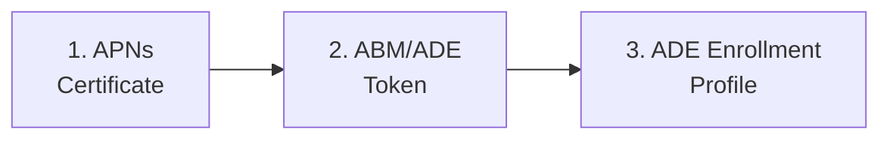

<objective>
Create the iOS admin template and overview page that serve as the structural foundation for all Phase 27 admin setup guides.

Purpose: The template (per D-15) must exist before any guide is written — it defines the iOS-specific document structure, the supervised-only callout pattern (D-01), and the "What breaks if misconfigured" convention. The overview page (per D-13) serves as the routing page with prerequisites, dependency chain, and the single portal navigation caveat (D-17).

Output:
- `docs/_templates/admin-template-ios.md` — iOS admin guide template
- `docs/admin-setup-ios/00-overview.md` — Admin setup overview/index
</objective>

<execution_context>
@~/.claude/get-shit-done/workflows/execute-plan.md
@~/.claude/get-shit-done/templates/summary.md
</execution_context>

<context>
@.planning/PROJECT.md
@.planning/ROADMAP.md
@.planning/STATE.md
@.planning/phases/27-ios-admin-setup-corporate-ade-path/27-CONTEXT.md
@.planning/phases/27-ios-admin-setup-corporate-ade-path/27-RESEARCH.md

<interfaces>
<!-- Key structural precedents the executor needs. -->

From docs/_templates/admin-template-macos.md:
- Frontmatter: last_verified, review_by, audience, platform
- Platform gate blockquote (top of doc)
- Structure: Prerequisites > Steps > Verification > Configuration-Caused Failures > Renewal/Maintenance > See Also
- "What breaks if misconfigured" callout pattern
- Portal sub-sections: #### In Apple Business Manager / #### In Intune admin center

From docs/admin-setup-macos/00-overview.md:
- Mermaid graph LR diagram for setup sequence
- Numbered guide list with links and 1-sentence descriptions
- Cross-Platform References section
- See Also section

From docs/ios-lifecycle/00-enrollment-overview.md:
- ## Supervision section at anchor #supervision — this is the link target for all supervised-only callouts (D-02)
- platform: iOS frontmatter pattern
</interfaces>
</context>

<tasks>

<task type="auto">
  <name>Task 1: Create iOS admin template</name>
  <files>docs/_templates/admin-template-ios.md</files>
  <read_first>
    - docs/_templates/admin-template-macos.md (source template to adapt)
    - docs/ios-lifecycle/00-enrollment-overview.md (link target for supervised-only callout)
    - .planning/phases/27-ios-admin-setup-corporate-ade-path/27-CONTEXT.md (decisions D-01 through D-16)
  </read_first>
  <action>
Create `docs/_templates/admin-template-ios.md` by adapting the macOS admin template with the following specific changes (per D-15, D-16):

**HTML comment header** (replace macOS references):
```
<!-- iOS/iPadOS ADMIN SETUP GUIDE TEMPLATE
     Usage: Copy this file as your starting point for any iOS/iPadOS admin configuration guide.
     Rules:
     - Fill in all YYYY-MM-DD dates (review_by = last_verified + 90 days)
     - Set platform to iOS (this template is iOS/iPadOS-specific)
     - Replace all [bracketed placeholders] with actual content
     - Every configurable setting MUST have a "What breaks if misconfigured" callout
       specifying which portal the misconfiguration occurs in AND where the symptom manifests
     - Every supervised-only setting MUST have the supervised-only callout (see pattern below)
     - Use imperative voice for steps ("Navigate to...", "Select...", "Enter...")
     - Steps that span both ABM and Intune portals MUST use #### In Apple Business Manager and
       #### In Intune admin center sub-sections
     - No Terminal/CLI steps -- iOS has no command-line access; all admin actions are portal-based
     - Include Renewal/Maintenance section ONLY when the guide's subject has a
       renewable component (e.g., ADE token, APNs certificate). Omit otherwise.
     Reviewer: iOS Platform Lead (role, not person name)
-->
```

**Frontmatter** — change `platform: macOS` to `platform: iOS`. Keep all other fields (last_verified, review_by, audience).

**Platform gate blockquote** — replace with:
```markdown
> **Platform gate:** This guide covers iOS/iPadOS configuration via Apple Business Manager and Intune.
> For macOS ADE setup, see [macOS Admin Setup Guides](../admin-setup-macos/00-overview.md).
> For iOS/iPadOS enrollment terminology, see the [Apple Provisioning Glossary](../_glossary-macos.md).
> Portal navigation may vary by Intune admin center version. See [Overview](00-overview.md#portal-navigation-note) for details.
```

**Add supervised-only callout pattern block** — insert after the platform gate blockquote, before the `# [Admin Task Title]` heading, as a template usage instruction inside an HTML comment:
```
<!-- SUPERVISED-ONLY CALLOUT PATTERN
     Use this exact format for every supervised-only setting. No variations.
     Place immediately AFTER the setting description, BEFORE any configuration steps.
     Link target is ALWAYS the Phase 26 conceptual page, NOT the enrollment profile guide.

     > 🔒 **Supervised only:** [feature/setting name] requires supervised mode. [1-2 sentence explanation of what this means for unsupervised devices.] See [Supervision](../ios-lifecycle/00-enrollment-overview.md#supervision).
-->
```

**Remove all Terminal/CLI references** — the macOS template has no explicit Terminal steps, but ensure no CLI-suggestive patterns exist. The iOS template is portal-only.

**Runbook links** — change comment from "Runbook links should point to the appropriate L1 runbook in docs/l1-runbooks/ (10-15 range for macOS ADE)" to "Runbook links should point to the appropriate iOS L1 runbook in docs/l1-runbooks/ (Phase 30 range) once available."

**See Also section** — replace macOS references:
```markdown
## See Also

- [Related iOS admin guide](link)
- [iOS/iPadOS ADE Lifecycle Overview](../ios-lifecycle/01-ade-lifecycle.md)
- [iOS/iPadOS Enrollment Path Overview](../ios-lifecycle/00-enrollment-overview.md)
- [Apple Provisioning Glossary](../_glossary-macos.md)
```

Keep all other structural elements unchanged: Prerequisites, Steps, Step sub-sections with portal headings, "What breaks if misconfigured" callout pattern, Verification checklist, Configuration-Caused Failures table, Renewal/Maintenance conditional section.
  </action>
  <verify>
    <automated>bash -c "test -f docs/_templates/admin-template-ios.md && grep -c 'platform: iOS' docs/_templates/admin-template-ios.md && grep -c 'Supervised only' docs/_templates/admin-template-ios.md && grep -c 'ios-lifecycle/00-enrollment-overview.md#supervision' docs/_templates/admin-template-ios.md && grep -c 'No Terminal' docs/_templates/admin-template-ios.md"</automated>
  </verify>
  <acceptance_criteria>
    - docs/_templates/admin-template-ios.md exists
    - File contains `platform: iOS` in frontmatter
    - File contains the supervised-only callout pattern with exact text `> 🔒 **Supervised only:**`
    - File contains link target `ios-lifecycle/00-enrollment-overview.md#supervision`
    - File contains "No Terminal" or "no command-line" indicating CLI exclusion
    - File contains `What breaks if misconfigured` callout pattern
    - File contains `## Prerequisites`, `## Steps`, `## Verification`, `## Configuration-Caused Failures`, `## Renewal / Maintenance`, `## See Also` section headings
    - File contains `#### In Apple Business Manager` and `#### In Intune admin center` portal sub-section patterns
    - File contains `Platform gate:` blockquote with links to macOS admin setup, glossary, and overview portal navigation note
    - File does NOT contain `platform: macOS`
  </acceptance_criteria>
  <done>iOS admin template exists with platform: iOS frontmatter, supervised-only callout pattern, portal-only admin actions, and all structural sections from macOS template adapted for iOS</done>
</task>

<task type="auto">
  <name>Task 2: Create iOS admin setup overview page</name>
  <files>docs/admin-setup-ios/00-overview.md</files>
  <read_first>
    - docs/admin-setup-macos/00-overview.md (structural precedent for overview page)
    - docs/_templates/admin-template-ios.md (just created in Task 1 — verify template pattern)
    - .planning/phases/27-ios-admin-setup-corporate-ade-path/27-CONTEXT.md (decisions D-12, D-13, D-14, D-17)
    - .planning/phases/27-ios-admin-setup-corporate-ade-path/27-RESEARCH.md (prerequisites, architecture patterns)
  </read_first>
  <action>
Create directory `docs/admin-setup-ios/` and create `docs/admin-setup-ios/00-overview.md`.

**Frontmatter:**
```yaml
---
last_verified: 2026-04-16
review_by: 2026-07-15
applies_to: ADE
audience: admin
platform: iOS
---
```

**Platform gate blockquote:**
```markdown
> **Platform gate:** This guide covers iOS/iPadOS ADE configuration via Apple Business Manager and Intune.
> For macOS ADE setup, see [macOS Admin Setup Guides](../admin-setup-macos/00-overview.md).
> For iOS/iPadOS enrollment terminology, see the [Apple Provisioning Glossary](../_glossary-macos.md).
```

**Title:** `# iOS/iPadOS Admin Setup: Corporate ADE Configuration`

**Introductory paragraph:** One paragraph explaining this guide walks Intune administrators through configuring the three prerequisites for iOS/iPadOS Automated Device Enrollment: APNs certificate, ABM/ADE token, and ADE enrollment profile. Complete the guides in order — each is a prerequisite for the next.

**Setup Sequence — Mermaid diagram (per D-14 dependency chain):**


**Numbered guide list (per D-12 file structure):**

1. **[APNs Certificate](01-apns-certificate.md)** -- Create and maintain the Apple Push Notification certificate that enables all Apple MDM communication. This certificate is shared infrastructure — one expired certificate breaks iOS, iPadOS, AND macOS management simultaneously.

2. **[ABM/ADE Token](02-abm-token.md)** -- Configure the enrollment program token linking Apple Business Manager to Intune for iOS/iPadOS device syncing. Shared portal steps cross-reference the macOS ABM guide; only iOS-specific differences are documented inline.

3. **[ADE Enrollment Profile](03-ade-enrollment-profile.md)** -- Create the enrollment profile that configures supervised mode, authentication method, Setup Assistant customization, and locked enrollment for corporate iOS/iPadOS devices.

**Prerequisites section (per D-13):**
```markdown
## Prerequisites

Before starting the iOS/iPadOS ADE configuration guides:

- [ ] **Apple Push Notification certificate Apple ID** — A company email address Apple ID (NOT a personal Apple ID). As a best practice, use a distribution list monitored by more than one person.
- [ ] **Apple Business Manager account** — A Managed Apple ID with Device Manager or Administrator role in ABM.
- [ ] **Intune Administrator role** — Or a custom RBAC role with enrollment management permissions.
- [ ] **Microsoft Intune Plan 1** (or higher) subscription.
- [ ] **iOS/iPadOS enrollment path selected** — Confirm ADE is the appropriate path for your deployment. See [Enrollment Path Overview](../ios-lifecycle/00-enrollment-overview.md).
```

**Portal Navigation Note section (per D-17 — this is the single location for the caveat):**
```markdown
## Portal Navigation Note

The Intune admin center is actively rolling out updated navigation for enrollment configuration. Portal paths referenced in these guides reflect the current documented experience. If menu locations differ from what is described:

- Look for equivalent options under **Devices** > **Device onboarding** > **Enrollment** > **Apple** tab.
- The settings and their effects remain the same regardless of navigation path.
- Portal navigation may vary by Intune admin center version and tenant rollout timing.
```

**Cross-Platform References section:**
```markdown
## Cross-Platform References

- [macOS Admin Setup Guides](../admin-setup-macos/00-overview.md) -- macOS ADE configuration (shared ABM portal steps)
- [iOS/iPadOS Enrollment Path Overview](../ios-lifecycle/00-enrollment-overview.md) -- Enrollment type comparison and supervision concept
- [iOS/iPadOS ADE Lifecycle](../ios-lifecycle/01-ade-lifecycle.md) -- End-to-end ADE enrollment pipeline
```

**See Also section:**
```markdown
## See Also

- [iOS/iPadOS ADE Lifecycle](../ios-lifecycle/01-ade-lifecycle.md)
- [Apple Provisioning Glossary](../_glossary-macos.md)
- [Windows APv1 Admin Setup](../admin-setup-apv1/00-overview.md)
- [macOS Admin Setup](../admin-setup-macos/00-overview.md)
```

**Footer:**
```markdown
---
*Next step: [APNs Certificate](01-apns-certificate.md)*

---

| Date | Change | Author |
|------|--------|--------|
| 2026-04-16 | Initial version -- iOS admin setup overview with Mermaid diagram and 3-guide setup sequence | -- |
```
  </action>
  <verify>
    <automated>bash -c "test -f docs/admin-setup-ios/00-overview.md && grep -c 'platform: iOS' docs/admin-setup-ios/00-overview.md && grep -c '01-apns-certificate.md' docs/admin-setup-ios/00-overview.md && grep -c '02-abm-token.md' docs/admin-setup-ios/00-overview.md && grep -c '03-ade-enrollment-profile.md' docs/admin-setup-ios/00-overview.md && grep -c 'Portal Navigation Note' docs/admin-setup-ios/00-overview.md && grep -c 'graph LR' docs/admin-setup-ios/00-overview.md"</automated>
  </verify>
  <acceptance_criteria>
    - docs/admin-setup-ios/00-overview.md exists
    - File contains `platform: iOS` in frontmatter
    - File contains `last_verified: 2026-04-16` and `review_by: 2026-07-15`
    - File contains links to all three guides: `01-apns-certificate.md`, `02-abm-token.md`, `03-ade-enrollment-profile.md`
    - File contains Mermaid diagram with `graph LR` showing APNs -> ABM -> Enrollment Profile dependency chain
    - File contains `## Portal Navigation Note` section (D-17 caveat — single location)
    - File contains `## Prerequisites` section with Apple ID, ABM account, Intune role, subscription, and enrollment path confirmation
    - File contains `Platform gate:` blockquote with macOS admin setup link, glossary link
    - File contains link to `../ios-lifecycle/00-enrollment-overview.md`
    - File contains cross-platform references to macOS admin setup guides
    - File does NOT contain the supervised-only callout pattern (overview is not a configuration guide)
    - File does NOT contain `platform: macOS`
  </acceptance_criteria>
  <done>Overview page exists as routing page with prerequisites checklist, Mermaid dependency chain diagram, links to all three guides, single portal navigation caveat (D-17), and cross-platform references</done>
</task>

</tasks>

<verification>
- Template file exists at docs/_templates/admin-template-ios.md with iOS-specific adaptations
- Overview file exists at docs/admin-setup-ios/00-overview.md with all three guide links
- Portal navigation caveat exists in overview only (not in template)
- Supervised-only callout pattern documented in template
- No macOS platform markers in either file
</verification>

<success_criteria>
- iOS admin template adapts macOS template with platform: iOS, supervised-only callout, no CLI/Terminal references
- Overview page serves as index with dependency chain, prerequisites, and D-17 portal caveat
- Both files follow established frontmatter schema (last_verified, review_by, applies_to, audience, platform)
</success_criteria>

<output>
After completion, create `.planning/phases/27-ios-admin-setup-corporate-ade-path/27-01-SUMMARY.md`
</output>
