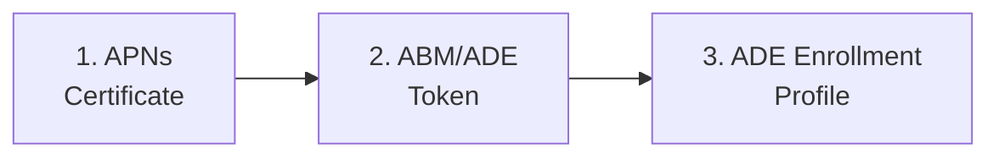

# Phase 27: iOS Admin Setup — Corporate ADE Path - Research

**Researched:** 2026-04-16
**Domain:** iOS/iPadOS Intune administration — APNs certificate, ABM/ADE token, ADE enrollment profile
**Confidence:** HIGH

---

<user_constraints>
## User Constraints (from CONTEXT.md)

### Locked Decisions

**D-01 — Supervised-Only Callout Format:**
```
> 🔒 **Supervised only:** [feature/setting name] requires supervised mode. [1-2 sentence explanation of what this means for unsupervised devices.] See [Supervision](../ios-lifecycle/00-enrollment-overview.md#supervision).
```

**D-02 — Callout Link Target:** `../ios-lifecycle/00-enrollment-overview.md#supervision` (the conceptual anchor from Phase 26). Do NOT link to the enrollment profile guide.

**D-03:** Every supervised-only setting in all three guides MUST use this exact callout format. No variations.

**D-04:** Callout placed immediately after the setting description, before any configuration steps.

**D-05 — ABM Cross-Reference Structure:** Each section: (1) 1-2 sentence context summary, (2) link to macOS section, (3) iOS-specific differences inline.

**D-06:** iOS guide does NOT duplicate macOS portal click-paths. macOS ABM guide is single source of truth for ABM portal navigation. iOS owns only enrollment profile creation (doc 03).

**D-07:** If macOS section has no iOS-specific differences, one sentence with link is sufficient.

**D-08 — APNs Scope:** Creation, renewal, cross-platform expiry impact. Per-step "What breaks" callouts.

**D-09 — Renew-not-replace is the critical callout:** Creating a NEW certificate breaks ALL existing iOS, iPadOS, and macOS device MDM communication. Devices must be re-enrolled.

**D-10:** No troubleshooting in APNs guide. Preventive, not reactive.

**D-11:** APNs is shared cross-platform infrastructure. One expired certificate breaks ALL Apple platforms.

**D-12 — File structure:**
```
docs/admin-setup-ios/
├── 00-overview.md
├── 01-apns-certificate.md
├── 02-abm-token.md
└── 03-ade-enrollment-profile.md
```

**D-13:** Overview serves as routing page with prerequisites checklist and links.

**D-14:** Ordering follows dependency chain: APNs → ABM token → enrollment profile.

**D-15:** Create `_templates/admin-template-ios.md` FIRST (Plan 01).

**D-16 — Template adaptations from macOS:** `platform: iOS`, iOS enrollment overview platform gate, "What breaks" callout convention, supervised-only callout as template element, no Terminal/CLI steps.

**D-17:** ADE enrollment profile UI redesign in progress (Q2 CY2026). Document concepts and outcomes rather than exact click-paths. Include note: "Portal navigation may vary by Intune admin center version."

### Claude's Discretion

- Exact word count per guide
- Prerequisites checklist content for overview page
- Whether to include Renewal/Maintenance section in ABM token and enrollment profile guides
- "What breaks" callout wording beyond the renew-not-replace rule
- Number of Setup Assistant panes to detail vs reference Phase 26's Stage 4 list
- Mermaid diagram in overview showing dependency chain (APNs → ABM → Enrollment Profile)

### Deferred Ideas (OUT OF SCOPE)

None — discussion stayed within phase scope.
</user_constraints>

---

<phase_requirements>
## Phase Requirements

| ID | Description | Research Support |
|----|-------------|------------------|
| ACORP-01 | APNs certificate guide covers creation, renewal, and cross-platform expiry impact warning | Current navigation path confirmed (Devices > Device onboarding > Enrollment > Apple tab > Apple MDM Push Certificate); renew-vs-create distinction verified; 365-day lifecycle and 30-day grace period confirmed |
| ACORP-02 | ABM/ADE token guide covers iOS token setup with cross-reference to macOS ABM guide for shared portal steps | iOS token steps are structurally identical to macOS (same 4-step process); iOS-specific differences are minimal (device type filter in ABM, sync interval is 12h not 24h for iOS) |
| ACORP-03 | ADE enrollment profile guide covers supervised mode, authentication methods, Setup Assistant customization, and locked enrollment with supervised-only callout pattern | Enrollment profile settings fully documented from current Microsoft Learn source (updated 2025-12-02); new "Enrollment Policies" UI experience confirmed in Q2 CY2026 rollout; all Setup Assistant panes verified with current iOS versions |
</phase_requirements>

---

## Summary

Phase 27 produces four documentation artifacts for iOS/iPadOS corporate ADE setup: an iOS admin template, an overview page, and three configuration guides (APNs certificate, ABM/ADE token, ADE enrollment profile). All three guides follow structural precedents established by the macOS admin setup suite.

The primary technical domain is Intune administration for iOS/iPadOS — specifically the Apple-specific connector layer (APNs certificate, ADE token) and iOS enrollment profile configuration. The supervised-only callout pattern established in this phase governs all subsequent iOS documentation phases (28-32).

**Key finding requiring attention (D-17 confirmed):** The Intune admin center is actively rolling out a new "Enrollment Policies" experience for iOS/iPadOS ADE enrollment profiles, expected in Q2 CY2026. The current path (token > Profiles) is being replaced by token > Enrollment policies, with several settings removed from the new experience. Guides must document concepts and outcomes rather than click-paths, and include the UI caveat note.

**Primary recommendation:** Write 03-ade-enrollment-profile.md around setting concepts and their outcomes, not the specific UI navigation, to insulate the guide from the in-progress redesign. For 01-apns-certificate.md, the current navigation path is stable and well-documented.

---

## Standard Stack

This phase produces Markdown documentation, not code. The "stack" is the documentation infrastructure established across 116 existing docs.

### Documentation Infrastructure
| Component | Version/Pattern | Purpose | Established By |
|-----------|----------------|---------|----------------|
| Frontmatter schema | `last_verified`, `review_by`, `applies_to`, `audience`, `platform` | Metadata and review tracking | All 116 existing docs |
| macOS admin template | `_templates/admin-template-macos.md` | Structural basis for iOS template | Phase 22-25 |
| "What breaks if misconfigured" callout | Blockquote format per admin template | Per-setting failure documentation | macOS admin guides |
| Platform gate blockquote | Top-of-doc navigation pattern | Cross-platform wayfinding | All admin guides |
| Relative cross-reference links with anchors | `../folder/file.md#section-anchor` | Section-level linking | All phases |
| Mermaid diagram | Graph LR / Graph TD | Dependency visualization | macOS overview (00-overview.md) |
| Prerequisites checklist | `- [ ]` markdown task list | Pre-configuration requirements | macOS admin guides |

### New Pattern Being Established
| Pattern | Format | Established In | Used By |
|---------|--------|---------------|---------|
| Supervised-only callout | Blockquote with 🔒 | Phase 27 (this phase) | Phases 28-32 |

---

## Architecture Patterns

### Document Structure

The four Phase 27 documents follow the macOS admin guide structure with iOS adaptations.

#### iOS Admin Template (`_templates/admin-template-ios.md`)

Adapt `_templates/admin-template-macos.md` with:
- `platform: iOS` frontmatter
- Platform gate: reference iOS enrollment overview and macOS cross-platform guide
- Include supervised-only callout pattern block with usage instructions
- Remove any Terminal/CLI references (iOS has no command line access)
- Preserve: "What breaks if misconfigured" callout, portal sub-sections, Renewal/Maintenance section marker, See Also

#### Admin Setup Overview (`docs/admin-setup-ios/00-overview.md`)

Pattern: `docs/admin-setup-macos/00-overview.md`

Key structural differences from macOS overview:
- 3-guide sequence instead of 6 (APNs, ABM token, enrollment profile only)
- Mermaid diagram: `APNs Certificate → ABM Token → ADE Enrollment Profile`
- Dependency chain made explicit: APNs must precede ABM token; ABM token must precede enrollment profile
- Portal caveat (D-17) placed HERE once, not repeated in each guide
- Prerequisites checklist: APNs Apple ID, ABM account with Managed Apple ID, Intune Administrator role

#### APNs Certificate Guide (`docs/admin-setup-ios/01-apns-certificate.md`)

Pattern: macOS admin template structure.

Scope (D-08): Creation, renewal, cross-platform expiry impact.

Structure:
```
## Prerequisites
## Steps
### Step 1: Create the Apple Push Notification certificate
#### In Intune admin center
#### In Apple Push Certificates Portal
### Step 2: Upload the certificate to Intune
## Renewal (annual — mandatory)
### Renew vs. Create: Critical distinction
## Verification
## Configuration-Caused Failures
## Renewal / Maintenance
## See Also
```

The renew-not-replace rule (D-09) is the highest-severity "What breaks" callout in the entire guide. It belongs as a visually prominent callout immediately before the renewal steps.

#### ABM/ADE Token Guide (`docs/admin-setup-ios/02-abm-token.md`)

Pattern: Cross-reference strategy (D-05 through D-07). This guide does NOT duplicate the macOS ABM portal click-paths.

Structure:
```
## Prerequisites
## How iOS ADE Token Setup Differs from macOS
## Steps
### Step 1: Download the Intune public key certificate
  [Summary + link to macOS Step 1 + iOS difference: none]
### Step 2: Create MDM server and download token in ABM
  [Summary + link to macOS Step 2 + iOS difference: filter by device type "iPhone/iPad" in ABM]
### Step 3: Upload token to Intune
  [Summary + link to macOS Step 3 + iOS difference: select iOS/iPadOS platform]
### Step 4: Assign devices to MDM server
  [Summary + link to macOS Step 4 + iOS difference: serial number lookup by IMEI also available]
## Verification
## Configuration-Caused Failures
## Renewal / Maintenance
## See Also
```

#### ADE Enrollment Profile Guide (`docs/admin-setup-ios/03-ade-enrollment-profile.md`)

Pattern: `docs/admin-setup-macos/02-enrollment-profile.md` — adapted for iOS concepts.

Structure:
```
## Prerequisites
## Key Concepts Before You Begin
### Supervised Mode
### Authentication Methods
## Steps
### Step 1: Create the enrollment profile
### Step 2: Configure supervision and enrollment settings
  [Supervised mode — supervised-only callout]
  [Locked enrollment — supervised-only callout]
  [User affinity options]
  [Authentication method]
  [Await final configuration]
### Step 3: Configure Setup Assistant panes
### Step 4: Assign profile to devices
## Verification
## Configuration-Caused Failures
## Renewal / Maintenance
## See Also
```

### Supervised-Only Callout Pattern (D-01 — canonical form)

This is the pattern Phase 28-32 inherit verbatim. It must be documented exactly as decided:

```markdown
> 🔒 **Supervised only:** [feature/setting name] requires supervised mode. [1-2 sentence explanation of what this means for unsupervised devices.] See [Supervision](../ios-lifecycle/00-enrollment-overview.md#supervision).
```

Settings in the enrollment profile guide requiring this callout:
- **Locked enrollment** (supervised-only on iOS — cannot be enforced without supervision)
- **Supervised mode setting itself** (the setting that enables supervision — callout explains consequence of leaving it off)

Note: On iOS 13+, ADE automatically sets devices to supervised mode. The enrollment profile supervised mode setting should still be explicitly set to Yes for corporate deployments to declare supervised intent clearly.

### Anti-Patterns to Avoid

- **Duplicating macOS ABM portal click-paths in the iOS token guide.** The macOS guide is the single source of truth (D-06). Cross-reference only.
- **Referencing exact Intune UI click-paths for enrollment profile creation.** The UI is being redesigned (D-17). Document setting concepts and outcomes.
- **Omitting the supervised-only callout on any supervised-only setting.** Every supervised-only setting must have the callout (D-03). No exceptions.
- **Placing the callout after the steps.** Callout goes immediately after the setting description, before steps (D-04). It's a gate, not a footnote.
- **Using a personal Apple ID for the APNs certificate.** This is a common misconfiguration — the guide must flag it.
- **Linking supervised-only callouts to the enrollment profile guide.** The link target is the Phase 26 conceptual page, not the guide where supervision is configured (D-02).

---

## Don't Hand-Roll

| Problem | Don't Build | Use Instead | Why |
|---------|-------------|-------------|-----|
| Cross-reference format for ABM token guide | Custom inline summary with full step duplication | Structured cross-reference per D-05/D-06/D-07 | Duplication creates maintenance burden; macOS guide will drift from iOS guide |
| Supervised-only callout | Ad-hoc warning text per guide | Exact D-01 callout pattern throughout | Downstream phases inherit this verbatim — variations break the pattern |
| APNs renewal guidance | New section with different wording | Renewal/Maintenance table (macOS template pattern) | Consistent format, reader knows where to look |

**Key insight:** This phase establishes canonical patterns, not invents new ones for each guide. Every non-iOS-specific pattern already exists in the macOS admin suite. The job is adaptation and the supervised-only callout establishment, not invention.

---

## Common Pitfalls

### Pitfall 1: Creating a New APNs Certificate Instead of Renewing

**What goes wrong:** Admin navigates to Apple Push Certificates Portal and selects "Create a Certificate" instead of finding the existing certificate and selecting "Renew." A new certificate has a different UID. All devices enrolled with the old certificate lose MDM communication immediately. They cannot check in, receive policies, or be managed until re-enrolled.

**Why it happens:** The Apple portal shows "Create a Certificate" prominently. The existing certificate that needs renewal is in a list below it. Under time pressure, admins create new instead of finding and renewing.

**How to avoid:** The APNs guide must make "Renew, not Create" the first and most prominent instruction in the renewal section. The "What breaks" callout for this is the highest-severity warning in the guide.

**Warning signs:** Enrolled devices suddenly show "Not checking in" in Intune; APNs certificate shows a new UID that doesn't match device management profiles.

**Confirmed by:** Microsoft Learn APNs guide (ms.date: 2025-05-12, updated_at: 2026-04-16) — step 8 of the renewal procedure explicitly says "find the certificate you want to renew and select Renew."

### Pitfall 2: APNs Certificate Expiration Is Silent

**What goes wrong:** No automatic alert is sent when the APNs certificate approaches expiration. All iOS, iPadOS, and macOS MDM communication stops simultaneously on expiration.

**Why it happens:** No built-in Intune alert for APNs certificate expiration is configured by default.

**How to avoid:** Guide must include the recommendation to set a calendar reminder 30 days before expiration. The renewal section should state the 30-day grace period (Microsoft confirmed: "once the certificate expires, there is a 30-day grace period to renew it").

**Warning signs:** All Apple devices across all platforms stop responding to MDM commands on the same day.

### Pitfall 3: Personal Apple ID for APNs or ADE Token

**What goes wrong:** Admin uses personal Apple ID instead of a company Apple ID (or Managed Apple ID) to create the APNs certificate or ADE token. When that employee leaves, the certificate or token cannot be renewed.

**How to avoid:** Both guides must require a company email address Apple ID. Managed Apple ID is preferred for ADE token.

**Confirmed by:** Microsoft Learn APNs guide: "As a best practice, use a company email address as your Apple ID and make sure the mailbox is monitored by more than one person, such as by a distribution list."

### Pitfall 4: Supervised Mode Not Enabled Before Devices Enroll

**What goes wrong:** Enrollment profile has supervised mode set to No (or not explicitly Yes). iOS 13+ ADE devices are automatically supervised regardless, but setting it explicitly to Yes is still required to declare supervised intent in the profile and ensure consistent behavior.

**Why it matters:** Supervision cannot be added after enrollment without a full device erase. If corporate devices enroll without the supervised flag explicitly set, and the organization later needs supervised-only policies, every device must be wiped and re-enrolled.

**How to avoid:** Enrollment profile guide must place the supervised mode setting early and make the consequence of leaving it off explicit.

### Pitfall 5: Locked Enrollment Not Enabled

**What goes wrong:** Admin leaves locked enrollment set to No. Users navigate to Settings > General > VPN & Device Management and remove the management profile, unenrolling their device.

**How to avoid:** Enrollment profile guide must state that locked enrollment = Yes is the correct setting for all corporate-owned ADE deployments. This is a supervised-only capability — it requires the supervised-only callout.

### Pitfall 6: Enrollment Profile Not Assigned Before Device Powers On

**What goes wrong:** Device is powered on and runs standard (non-managed) Setup Assistant before an enrollment profile is assigned. Device does not enroll in MDM. Fix requires factory reset.

**How to avoid:** Overview and enrollment profile guide must state this constraint clearly. The overview dependency chain (prerequisite ordering) makes the sequencing explicit.

### Pitfall 7: ADE UI Redesign — "Profiles" vs "Enrollment Policies"

**What goes wrong:** Admin follows guide click-paths using the old "Profiles" tab. The new "Enrollment Policies" tab is in preview/GA rollout during Q2 CY2026. Old profiles tab remains accessible but new profiles cannot be created there.

**How to avoid:** Per D-17, the enrollment profile guide documents concepts and outcomes, not click-paths. The overview page includes the single caveat note about portal navigation variation. This insulates all four guides from the UI transition.

**Confirmed by:** Microsoft Tech Community blog (February 26, 2026): Q2 CY26 rollout of new "Enrollment Policies" experience under token > **Enrollment policies** (replacing token > **Profiles**).

---

## State of the Art

| Old Approach | Current Approach | When Changed | Impact |
|--------------|------------------|--------------|--------|
| APNs certificate at Tenant administration > Connectors | APNs at Devices > Device onboarding > Enrollment > Apple tab | 2024-2025 Intune nav reorganization | Navigation paths in guides must use the new path |
| ADE enrollment profiles at token > Profiles | ADE enrollment profiles moving to token > Enrollment policies | Q2 CY2026 rollout | Guides must not document click-paths; use concept-based descriptions |
| Setup Assistant with legacy authentication | Setup Assistant with modern authentication (recommended) | iOS 13.0+ | Legacy auth no longer recommended; guides should use modern auth as default |
| SCEP certificate for enrollment identity | ACME protocol (iOS 16.0+ / iPadOS 16.1+) | iOS 16 / iPadOS 16.1 | SCEP is fallback only for older devices; Phase 26 already documents this |
| Profile-based User Enrollment | Account-driven User Enrollment | iOS 18 | Out of scope for Phase 27 (BYOD path); already in STATE.md |
| Company Portal as ADE auth method | Company Portal removed from new enrollment policies UI | Q2 CY2026 new experience | "Install Company Portal" settings removed from new enrollment policies; Setup Assistant with modern auth is standard |

**Deprecated/outdated:**
- Zoom Setup Assistant pane: deprecated iOS/iPadOS 17. Do not include in pane table as a recommended option.
- Display Tone Setup Assistant pane: deprecated iOS/iPadOS 15. Do not include.
- Device to Device Migration pane: not available for iOS 13 and later (deprecated in practice).
- Setup Assistant (Legacy) authentication: still technically available but Microsoft explicitly recommends against it for all new deployments.

---

## Technical Facts Verified

### APNs Certificate (ACORP-01)

**Navigation path (current, confirmed from Microsoft Learn ms.date 2025-05-12):**
Intune admin center > **Devices** > **Device onboarding** > **Enrollment** > **Apple** tab > **Apple MDM Push Certificate**

**Old path (still may work but not canonical):**
Tenant administration > Connectors and tokens > Apple push notification certificate

**Creation process:**
1. Download CSR from Intune
2. Create certificate at Apple Push Certificates Portal (identity.apple.com) — select "Create a Certificate"
3. Upload resulting .pem file to Intune
4. Enter Apple ID used

**Renewal process (CRITICAL distinction from creation):**
1. Download NEW CSR from Intune
2. At Apple Push Certificates Portal — find EXISTING certificate in list, select **Renew** (NOT Create a Certificate)
3. Upload new CSR, download new .pem
4. Upload to Intune

**Renewal facts:**
- Valid for 365 days
- 30-day grace period after expiration
- Must renew with the SAME Apple ID used to create it
- Creating a new certificate (not renewing) breaks all enrolled iOS, iPadOS, and macOS devices — they must be re-enrolled
- A unique UID identifies each certificate — renewal preserves the UID; new creation generates a new UID

**Cross-platform impact:**
Single APNs certificate covers all Apple platforms in Intune. Expiration or replacement affects iOS, iPadOS, and macOS MDM simultaneously.

**Source:** Microsoft Learn: `learn.microsoft.com/en-us/mem/intune/enrollment/apple-mdm-push-certificate-get` — updated 2026-04-16, ms.date 2025-05-12

### ADE Token — iOS Differences from macOS (ACORP-02)

**Process is structurally identical to macOS.** The four steps (download Intune public key → create ABM MDM server → upload token to Intune → assign devices) are the same.

**iOS-specific differences verified:**
- In ABM device assignment: filter by device type (iPhone, iPad) to find iOS/iPadOS devices specifically
- In Intune token creation: select iOS/iPadOS as the platform
- Sync interval: delta sync every **12 hours** for iOS (macOS guide states 24 hours — this is a documented iOS/macOS difference in Microsoft Learn)
- Rate-limited manual sync: once per 15 minutes (same as macOS)
- Full sync: once per 7 days (same as macOS)

**Limits (iOS-specific, confirmed):**
- Maximum enrollment profiles per token: 1,000
- Maximum ADE devices per profile: 200,000
- Maximum ADE tokens per Intune tenant: 2,000

**Note on Apple School Manager:** ASM is functionally identical to ABM for MDM purposes. iOS guide should acknowledge ASM in one sentence.

**Source:** Microsoft Learn: `learn.microsoft.com/en-us/mem/intune/enrollment/device-enrollment-program-enroll-ios` — updated 2026-04-16, ms.date 2025-12-02

### ADE Enrollment Profile — iOS (ACORP-03)

**Current navigation (being replaced in Q2 CY2026):**
Devices > Device onboarding > Enrollment > Apple tab > Enrollment Program Tokens > [token] > Profiles > Create profile > iOS/iPadOS

**New navigation (Q2 CY2026 rollout):**
Devices > Device onboarding > Enrollment > Apple tab > Enrollment Program Tokens > [token] > **Enrollment policies** > Create

**Key enrollment settings confirmed:**

| Setting | Options | Corporate ADE Recommendation | Notes |
|---------|---------|------------------------------|-------|
| User Affinity | Enroll with / without User Affinity / Microsoft Entra shared mode | With User Affinity (user-assigned devices) | Without = kiosk/shared devices |
| Authentication method | Setup Assistant with modern auth (recommended) / Company Portal / Setup Assistant (legacy) | Modern authentication | Legacy not recommended; Company Portal being removed from new UI |
| Supervised | Yes / No | Yes | iOS 13+ ADE auto-supervises, but set explicitly |
| Locked enrollment | Yes / No | Yes | Supervised-only effective enforcement |
| Await final configuration | Yes / No | Yes | Default for new profiles; iOS 13+ required |
| Device name template | {{DEVICETYPE}}-{{SERIAL}} | Organization preference | |

**Authentication method detail:**
- **Setup Assistant with modern authentication** (recommended): iOS 13.0+, supports MFA, supports JIT registration (can eliminate Company Portal dependency)
- **Company Portal**: Modern auth + MFA; still requires Entra registration via app; being removed from new Enrollment Policies UI
- **Setup Assistant (legacy)**: Pre-iOS 13.0 support only; does not support modern Conditional Access; not recommended

**Supervision on iOS 13+:**
Microsoft Learn states: "Microsoft Intune ignores the is_supervised flag for devices running iOS/iPadOS 13.0 and later because these devices are automatically put in supervised mode at the time of enrollment." However, setting Supervised = Yes explicitly is still required in the enrollment profile to declare intent and ensure consistent behavior — the guide should set this expectation.

**Locked enrollment nuance:**
For devices not originally purchased through ABM (later added via Apple Configurator): users can see the remove management button for the **first 30 days** after activation even with locked enrollment = Yes. After 30 days, the button is hidden.

**Await final configuration:**
- Only device configuration policies install during this hold; apps are NOT included
- No enforced time limit; typical release within ~15 minutes
- Supported on iOS/iPadOS 13+ with modern auth, userless, or shared mode enrollments
- Not available when Shared iPad = Yes + Enroll without User Affinity

**iOS/iPadOS Setup Assistant panes (current list, verified from Microsoft Learn updated 2026-04-16):**

*iOS/iPadOS-specific (not on macOS):*
- Touch ID and Face ID (iOS 8.1+)
- Apple Pay (iOS 7.0+)
- Screen Time (iOS 12.0+)
- SIM Setup (iOS 12.0+)
- iMessage and FaceTime (iOS 9.0+)
- Android Migration (iOS 9.0+)
- Watch Migration (iOS 11.0+)
- Onboarding (iOS 11.0+)
- Device to Device Migration (deprecated for iOS 13+)
- Emergency SOS (iOS 16.0+)
- Action button (iOS 17.0+)
- Apple Intelligence (iOS 18.0+)
- Camera button (iOS 18.0+)
- Web content filtering (iOS 18.2+)
- Safety and handling (iOS 18.4+)
- Multitasking (iOS 26.0+)
- OS Showcase (iOS 26.0+)

*Deprecated (do not recommend):*
- Zoom: deprecated iOS 17
- Display Tone: deprecated iOS 15

*Available on both iOS and macOS:*
- Passcode, Location Services, Restore, Apple ID, Terms and conditions, Siri, Diagnostics Data, Privacy, Appearance, Software Update, Get Started, Terms of Address (iOS 16.0+), App Store (iOS 14.3+), Restore Completed, Software Update Completed

**Source:** Microsoft Learn: `learn.microsoft.com/en-us/mem/intune/enrollment/device-enrollment-program-enroll-ios` — updated 2026-04-16, ms.date 2025-12-02

---

## Validation Architecture

The `.planning/config.json` does not set `workflow.nyquist_validation` to false (the key is absent). However, this phase produces only Markdown documentation files — no executable code, no tests, no APIs. There is no automated test infrastructure for documentation content.

**Documentation quality gates (manual verification):**

| Req ID | Verification Method | Automated? |
|--------|--------------------|-----------:|
| ACORP-01 | Review: APNs guide covers creation, renewal, renew-not-replace warning, cross-platform expiry impact | Manual only |
| ACORP-02 | Review: ABM token guide uses cross-reference structure (D-05/D-06/D-07), no duplicated macOS click-paths | Manual only |
| ACORP-03 | Review: Enrollment profile guide covers supervised mode, auth methods, Setup Assistant panes, locked enrollment with 🔒 callouts | Manual only |
| All | Supervised-only callout pattern exactly matches D-01 in every instance | Manual + grep |

**Grep verification command (post-implementation):**
```bash
grep -r "Supervised only" docs/admin-setup-ios/ --include="*.md"
```
Each match should show the exact blockquote format. Any instance not starting with `> 🔒 **Supervised only:**` is a pattern violation.

**Link verification:**
```bash
grep -r "ios-lifecycle/00-enrollment-overview.md#supervision" docs/admin-setup-ios/ --include="*.md"
```
All supervised-only callouts must link to this target (D-02).

**Wave 0 gaps:** None for documentation phases. Markdown files are created as the implementation artifact.

---

## Open Questions

1. **Intune admin center APNs path — dual navigation**
   - What we know: Microsoft Learn current docs show `Devices > Device onboarding > Enrollment > Apple tab > Apple MDM Push Certificate`. Older community posts also reference `Tenant administration > Connectors and tokens`.
   - What's unclear: Whether both paths still work simultaneously or if the "Tenant administration" path has been removed.
   - Recommendation: Use the `Devices > Device onboarding > Enrollment` path in the guide (it matches the current official docs). Note both paths may work; if the old path is removed after publication, the guide still points to the canonical current location.

2. **Exact Q2 CY2026 enrollment policies rollout timing**
   - What we know: Blog post dated February 26, 2026 says Q2 CY26 rollout. The current doc (updated 2026-04-16) still documents the old "Profiles" path as the active experience.
   - What's unclear: Whether the new experience has already GA'd for all tenants as of the time of writing.
   - Recommendation: Per D-17, the enrollment profile guide documents concepts and outcomes with the UI caveat note. The guide is correct regardless of which experience is active.

3. **macOS ABM guide section anchors for cross-references**
   - What we know: The macOS ABM guide (`docs/admin-setup-macos/01-abm-configuration.md`) has 5 steps. The iOS token guide cross-references these with relative paths and section anchors.
   - What's unclear: Exact anchor values for each step (markdown auto-generates these from heading text). The planner/implementer must verify anchors match the actual generated values.
   - Recommendation: Document the expected anchors in the plan (e.g., `#step-1-download-intune-public-key`) and note they should be verified against the actual rendered file.

---

## Code Examples

The "code" for this phase is Markdown document patterns.

### Supervised-Only Callout (canonical form — D-01)

```markdown
> 🔒 **Supervised only:** Locked enrollment requires supervised mode. On unsupervised devices, this setting has no effect and users can remove the management profile from Settings > General > VPN & Device Management. See [Supervision](../ios-lifecycle/00-enrollment-overview.md#supervision).
```

### "What Breaks if Misconfigured" Callout (macOS admin template pattern, adapted for iOS)

```markdown
> **What breaks if misconfigured:** Creating a NEW APNs certificate instead of renewing immediately breaks MDM communication to ALL enrolled iOS, iPadOS, and macOS devices. Devices cannot receive policies, check in, or be managed until they are wiped and re-enrolled. Symptom appears in: all Apple devices (MDM commands stop working); Intune admin center (devices show "Not checking in").
```

### Cross-Reference Block (D-05 pattern for ABM token guide)

```markdown
The steps for creating an MDM server in Apple Business Manager and downloading the server token are the same for iOS/iPadOS and macOS. Follow [ABM Configuration: Step 2 — Create MDM Server and Download Server Token](../admin-setup-macos/01-abm-configuration.md#step-2-create-mdm-server-and-download-server-token) in the macOS ABM guide.

**iOS-specific difference:** When filtering devices in ABM for assignment, filter by device type **iPhone** or **iPad** to locate your iOS/iPadOS devices.
```

### Overview Mermaid Diagram



### Frontmatter (iOS guide pattern)

```yaml
---
last_verified: 2026-04-16
review_by: 2026-07-15
applies_to: ADE
audience: admin
platform: iOS
---
```

### Platform Gate Blockquote (iOS adaptation)

```markdown
> **Platform gate:** This guide covers iOS/iPadOS ADE configuration via Apple Business Manager and Intune.
> For macOS ADE setup, see [macOS Admin Setup Guides](../admin-setup-macos/00-overview.md).
> For iOS/iPadOS enrollment terminology, see the [Apple Provisioning Glossary](../_glossary-macos.md).
> Portal navigation may vary by Intune admin center version. See [Overview](00-overview.md#portal-navigation-note) for details.
```

---

## Sources

### Primary (HIGH confidence)
- Microsoft Learn: `learn.microsoft.com/en-us/mem/intune/enrollment/apple-mdm-push-certificate-get` — APNs certificate creation and renewal; ms.date 2025-05-12, updated 2026-04-16
- Microsoft Learn: `learn.microsoft.com/en-us/mem/intune/enrollment/device-enrollment-program-enroll-ios` — iOS ADE enrollment profile full documentation; ms.date 2025-12-02, updated 2026-04-16
- Phase 26 outputs: `docs/ios-lifecycle/00-enrollment-overview.md` and `docs/ios-lifecycle/01-ade-lifecycle.md` — supervision concept, Setup Assistant pane list, APNs channel description; verified 2026-04-16
- Existing project files: `docs/admin-setup-macos/` (all files), `docs/_templates/admin-template-macos.md` — structural precedents; verified 2026-04-16

### Secondary (MEDIUM confidence)
- Microsoft Tech Community blog: "New iOS/iPadOS and macOS ADE Enrollment Policies Experience" — Q2 CY2026 enrollment policies UI change; published February 26, 2026; verified against enrollment profile doc current navigation

### Tertiary (LOW confidence)
- WebSearch result confirming dual APNs navigation paths ("Tenant administration" vs "Device onboarding") — both may still work; canonical path taken from official docs

---

## Metadata

**Confidence breakdown:**
- Standard stack (documentation patterns): HIGH — directly read from 116 existing docs
- APNs certificate technical facts: HIGH — verified against Microsoft Learn current docs
- ADE token iOS differences: HIGH — verified against Microsoft Learn current docs
- Enrollment profile settings: HIGH — verified against Microsoft Learn current docs (ms.date 2025-12-02)
- Q2 CY2026 UI change: MEDIUM — verified from Microsoft Tech Community blog (February 2026), consistent with STATE.md research flag
- APNs dual navigation paths: MEDIUM — canonical path from official docs confirmed; old path status unverified

**Research date:** 2026-04-16
**Valid until:** 2026-07-16 (90 days) — APNs and ADE token guidance is stable; enrollment profile UI section may need refresh after Q2 CY2026 rollout completes
