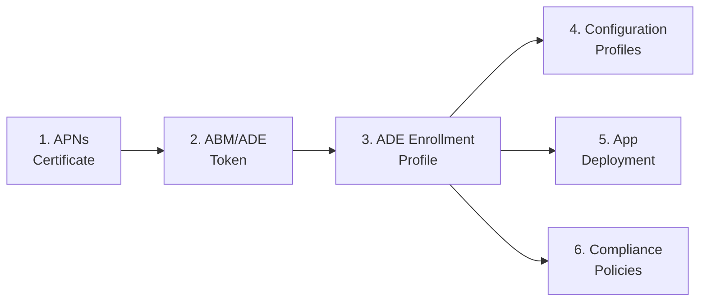
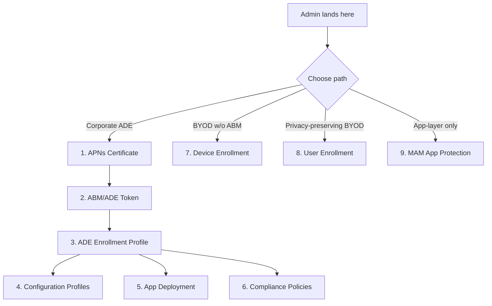

<objective>
Rewrite `docs/admin-setup-ios/00-overview.md` in place to cover ALL iOS admin paths (corporate ADE + Device Enrollment + User Enrollment + MAM-WE) rather than ADE only. The rewrite updates frontmatter (`applies_to: ADE` → `applies_to: all`), restructures the title to be path-agnostic, evolves the Mermaid diagram into a branching path-selector (ADE chain + parallel BYOD/MAM-WE alternatives with no cross-chain dependency), adds a new `## Intune Enrollment Restrictions` shared section consumed by Wave 3 guides, splits Prerequisites into ADE-path and BYOD-path subsections, and preserves the Portal Navigation Note verbatim. The file remains the single authoritative router for iOS admin setup content.

Purpose: Implements D-06 (overview rewrite scope), D-07 (Mermaid restructure), D-08 (shared enrollment-restrictions section), D-09 (dual-tier prereqs). Satisfies must-haves MH1 via the Mermaid path decision point and MH2/MH3/MH4 indirectly by providing the landing surface that routes readers to the three new guides without implying the BYOD/MAM-WE paths are downstream of ADE prerequisites.

Output: A fully-rewritten `00-overview.md` file with evolved frontmatter, restructured Mermaid, new Intune Enrollment Restrictions section, split Prerequisites, preserved Portal Navigation Note, expanded See Also, and an appended version-history row documenting the Phase 29 restructure.
</objective>

<execution_context>
@$HOME/.claude/get-shit-done/workflows/execute-plan.md
@$HOME/.claude/get-shit-done/templates/summary.md
</execution_context>

<context>
@.planning/PROJECT.md
@.planning/ROADMAP.md
@.planning/STATE.md
@.planning/phases/29-ios-admin-setup-byod-mam/29-CONTEXT.md
@.planning/phases/29-ios-admin-setup-byod-mam/29-PATTERNS.md
@.planning/phases/29-ios-admin-setup-byod-mam/29-RESEARCH.md
@.planning/phases/29-ios-admin-setup-byod-mam/29-VALIDATION.md

<interfaces>
<!-- Current file baseline, to be evolved in place -->

Current `docs/admin-setup-ios/00-overview.md` frontmatter (lines 1-7):

```yaml
---
last_verified: 2026-04-16
review_by: 2026-07-15
applies_to: ADE
audience: admin
platform: iOS
---
```

Current Mermaid (lines 19-26):



Current Prerequisites (lines 40-48) — single-tier checkbox list.

Portal Navigation Note (lines 50-56) — preserve verbatim per Phase 27 D-17 lock.

Version-history table (lines 77-79) — append a new row for Phase 29 restructure; do NOT delete prior rows.

Target reference model: `docs/ios-lifecycle/00-enrollment-overview.md` (already uses `applies_to: all` + multi-path routing prose). 29-PATTERNS.md §"docs/admin-setup-ios/00-overview.md — MODIFIED (rewrite per D-06)" (lines 390-539) contains the complete target structure including:
- Target frontmatter (last_verified: 2026-04-17 / review_by: 2026-07-16)
- Mermaid Approach A (single extended diagram with branches) — reusable verbatim
- Dual-tier prereqs exact markdown
- Version-history append row
</interfaces>
</context>

<tasks>

<task type="auto">
  <name>Task 1: Rewrite overview frontmatter, title, intro paragraph, and Mermaid diagram</name>
  <files>docs/admin-setup-ios/00-overview.md</files>
  <read_first>
    - docs/admin-setup-ios/00-overview.md (current file — full read before editing)
    - docs/ios-lifecycle/00-enrollment-overview.md (reference model for `applies_to: all` + multi-path routing prose)
    - .planning/phases/29-ios-admin-setup-byod-mam/29-PATTERNS.md §"docs/admin-setup-ios/00-overview.md — MODIFIED" (lines 390-539) — contains target Mermaid, frontmatter, and prereqs structure
    - .planning/phases/29-ios-admin-setup-byod-mam/29-CONTEXT.md D-06 (rewrite scope), D-07 (Mermaid restructure constraint), D-09 (prereqs split preview), D-11 (slot-10 reservation context)
    - .planning/phases/29-ios-admin-setup-byod-mam/29-RESEARCH.md §"System Architecture Diagram" (lines 170-191) — canonical flowchart for restructure
  </read_first>
  <action>
Implements D-06 (frontmatter + title + scope widening) and D-07 (Mermaid restructure).

**Step 1 — Update frontmatter (lines 1-7).** Replace:

```yaml
---
last_verified: 2026-04-16
review_by: 2026-07-15
applies_to: ADE
audience: admin
platform: iOS
---
```

with EXACTLY:

```yaml
---
last_verified: 2026-04-17
review_by: 2026-07-16
applies_to: all
audience: admin
platform: iOS
---
```

The date values are fixed by Phase 29 conventions — do not substitute other dates. `last_verified` = 2026-04-17; `review_by` = last_verified + 90 days = 2026-07-16. `applies_to` = `all` (not `ADE`, not `device-enrollment`, not any other token).

**Step 2 — Update Platform-gate banner (line 9-11).** Replace the current banner text `This guide covers iOS/iPadOS ADE configuration via Apple Business Manager and Intune.` with `This guide covers iOS/iPadOS admin setup across all enrollment paths: corporate ADE, Device Enrollment, account-driven User Enrollment, and MAM-WE.`. Keep the "For macOS ADE setup..." + Apple Provisioning Glossary + Portal navigation lines unchanged (structure is Phase 27/28 locked).

**Step 3 — Replace title (line 13).** Replace:

```markdown
# iOS/iPadOS Admin Setup: Corporate ADE Configuration and Device Management
```

with EXACTLY:

```markdown
# iOS/iPadOS Admin Setup
```

(Claude's discretion per D-06 permitted alternate path-agnostic titles; `# iOS/iPadOS Admin Setup` is the chosen form because it matches the convention of `ios-lifecycle/00-enrollment-overview.md` which is titled `# iOS/iPadOS Enrollment Path Overview` — single parallel form.)

**Step 4 — Replace intro paragraph (line 15).** The current paragraph says "Complete the guides in order — each is a prerequisite for the next." This is ADE-only framing and is wrong for a path-agnostic overview. Replace it with a 2-3 sentence path-selection-framed paragraph:

```markdown
This overview routes Intune administrators to the correct iOS/iPadOS admin setup path. Corporate devices purchased through Apple Business Manager follow the Automated Device Enrollment (ADE) chain (guides 01-06). Personal-device and non-ABM paths — Device Enrollment, account-driven User Enrollment, and app-layer MAM-WE — are parallel alternatives, each with its own prerequisites and trade-offs. Choose a path from the diagram below, then follow the guide for that path.
```

**Step 5 — Restructure Mermaid (lines 19-26).** Replace the current 6-node linear graph with Approach A from 29-PATTERNS.md (branching path-selector with ADE chain + parallel BYOD/MAM-WE paths). Insert this block verbatim:

````markdown

````

CRITICAL CONSTRAINT (D-07): there MUST NOT be any arrow from node `C` (or any ADE node A/B/C/D/E/F) to nodes `G`, `H`, or `I`. G, H, I are parallel alternatives branching from `CHOOSE`, not continuations of the ADE chain. Do not add `C --> G`, `C --> H`, or `C --> I`. Do not add dashed contrast arrows either — this is the path-selector diagram, not the information-flow diagram (the information-flow version with dashed contrast lines lives in RESEARCH.md § Architecture Patterns for internal reference only).

Use `flowchart TD` (top-down) not `graph LR` — the branching structure needs vertical space.
  </action>
  <verify>
    <automated>bash -c "head -10 docs/admin-setup-ios/00-overview.md | grep -q 'applies_to: all' && head -10 docs/admin-setup-ios/00-overview.md | grep -q 'last_verified: 2026-04-17' && head -10 docs/admin-setup-ios/00-overview.md | grep -q 'review_by: 2026-07-16' && grep -q '^# iOS/iPadOS Admin Setup$' docs/admin-setup-ios/00-overview.md && grep -q 'CHOOSE -->|Corporate ADE|' docs/admin-setup-ios/00-overview.md && grep -q 'CHOOSE -->|BYOD w/o ABM|' docs/admin-setup-ios/00-overview.md && grep -q 'CHOOSE -->|Privacy-preserving BYOD|' docs/admin-setup-ios/00-overview.md && grep -q 'CHOOSE -->|App-layer only|' docs/admin-setup-ios/00-overview.md && ! grep -qE 'C --> G|C --> H|C --> I' docs/admin-setup-ios/00-overview.md && echo OK"</automated>
  </verify>
  <done>
    - Frontmatter has `applies_to: all`, `last_verified: 2026-04-17`, `review_by: 2026-07-16`
    - Title is exactly `# iOS/iPadOS Admin Setup`
    - Intro paragraph frames path-selection, not sequential chain
    - Mermaid uses `flowchart TD` with a `CHOOSE` decision node branching to 4 labelled paths (Corporate ADE, BYOD w/o ABM, Privacy-preserving BYOD, App-layer only)
    - No edges from ADE chain nodes (A/B/C/D/E/F) to non-ADE nodes (G/H/I)
    - Platform-gate banner updated to reflect all-paths scope
  </done>
</task>

<task type="auto">
  <name>Task 2: Restructure body — path-router sections, Intune Enrollment Restrictions, split Prerequisites, preserve Portal Navigation Note, append version history</name>
  <files>docs/admin-setup-ios/00-overview.md</files>
  <read_first>
    - docs/admin-setup-ios/00-overview.md (post-Task-1 state)
    - .planning/phases/29-ios-admin-setup-byod-mam/29-PATTERNS.md lines 468-539 (Intune Enrollment Restrictions section structure, dual-prereqs exact markdown, version-history append row)
    - .planning/phases/29-ios-admin-setup-byod-mam/29-CONTEXT.md D-08 (shared restrictions section scope), D-09 (dual-prereqs split), D-11 (slot 10 reservation reminder — DO NOT claim slot 10 in this file; the reservation is implicit because slots 07/08/09 go to Phase 29 guides and slot 10 is reserved for a future config-failures file)
    - .planning/phases/29-ios-admin-setup-byod-mam/29-RESEARCH.md "Intune Enrollment Restrictions" content — section inventory for platform filtering, ownership flag, per-user device limits, enrollment-type blocking
  </read_first>
  <action>
Implements D-08 (shared Intune Enrollment Restrictions section), D-09 (dual-tier prereqs), preservation of Portal Navigation Note per Phase 27 D-17.

**Step 1 — Update the existing per-guide routing list (currently lines 28-38, 6 numbered items).** Keep items 1-6 (ADE chain) with their existing descriptions; add items 7-9 for the new guides. After item 6 "Compliance Policies", append three new items (do NOT renumber 1-6):

```markdown
7. **[Device Enrollment](07-device-enrollment.md)** — Company Portal and web-based enrollment flows for personal and corporate iOS/iPadOS devices without ABM. Covers capabilities available without supervision and personal-vs-corporate ownership-flag behavior. No ABM token required.

8. **[User Enrollment](08-user-enrollment.md)** — Account-driven User Enrollment for privacy-preserving BYOD. IT manages only work apps and data within a managed APFS volume; personal apps, data, and device-level attributes remain outside Intune's management scope. Profile-based User Enrollment is deprecated and not available for new enrollments.

9. **[MAM App Protection](09-mam-app-protection.md)** — Microsoft Intune app protection policies (MAM-WE) protect work data inside SDK-integrated apps without enrolling the device. Covers the three-level data protection framework, dual-targeting for enrolled and unenrolled devices, iOS-specific behaviors, and selective wipe. Standalone — does not require reading any MDM enrollment guide.
```

Each description summarizes the guide's scope in 2-3 sentences using terminology from the phase's locked decisions (D-12/D-14/D-16 for guide 07; D-19/D-20/D-21 for guide 08; D-24/D-25/D-26/D-28 for guide 09). Reserve mention of slot 10 — do NOT add a "10. [Config-Caused Failures]" item; that slot is reserved for future Phase 30/32 work per D-11.

**Step 2 — Replace single-tier Prerequisites section (currently lines 40-48).** Delete the current "Before starting the iOS/iPadOS ADE configuration guides:" intro and the five single-tier checkboxes. Replace with a split structure per D-09:

```markdown
## Prerequisites

Each enrollment path has its own prerequisite set. Determine your path from the diagram above, then confirm the prerequisites for that path.

### ADE-Path Prerequisites

For corporate ADE deployments (guides 01-06):

- [ ] **Apple Push Notification certificate Apple ID** — A company email address Apple ID (NOT a personal Apple ID). As a best practice, use a distribution list monitored by more than one person.
- [ ] **Apple Business Manager account** — A Managed Apple ID with Device Manager or Administrator role in ABM.
- [ ] **Intune Administrator role** — Or a custom RBAC role with enrollment management permissions.
- [ ] **Microsoft Intune Plan 1** (or higher) subscription.
- [ ] **iOS/iPadOS enrollment path = ADE confirmed** — See [Enrollment Path Overview](../ios-lifecycle/00-enrollment-overview.md).

### BYOD-Path Prerequisites

For non-ABM enrollment and MAM-WE deployments (guides 07, 08, 09):

- [ ] **APNs certificate active** — Required for Device Enrollment ([07-device-enrollment.md](07-device-enrollment.md)) and account-driven User Enrollment ([08-user-enrollment.md](08-user-enrollment.md)). Not required for MAM-WE ([09-mam-app-protection.md](09-mam-app-protection.md)).
- [ ] **Managed Apple ID considerations reviewed** — Required for account-driven User Enrollment. See [User Enrollment guide](08-user-enrollment.md) for the distinction between Managed Apple ID and personal Apple ID.
- [ ] **Microsoft 365 licensing baseline** — Required for MAM-WE app protection policies (Intune Plan 1 or higher).
- [ ] **Intune Administrator role** — Or a custom RBAC role with enrollment management permissions.
```

**Step 3 — Preserve Portal Navigation Note (currently lines 50-56).** Do NOT modify this section. Its content is locked by Phase 27 D-17. Keep the heading `## Portal Navigation Note` and the full paragraph + 3 bullets intact. If Task 1's earlier edits shifted its line numbers, that's fine — the content must not change.

**Step 4 — Add new `## Intune Enrollment Restrictions` section.** Insert a new top-level heading `## Intune Enrollment Restrictions` between the Portal Navigation Note section and the Cross-Platform References section. Section body covers four subsections per D-08:

```markdown
## Intune Enrollment Restrictions

Intune enrollment restrictions apply tenant-wide to iOS/iPadOS enrollment and are shared across all non-ADE paths (Device Enrollment and User Enrollment). Corporate ADE enrollment is subject to the same tenant-level settings in addition to its own ADE-profile-specific controls. Configure restrictions before end users begin enrolling.

### Platform Filtering

Intune can allow or block iOS/iPadOS enrollment at the tenant level and per-user-group. Settings live at **Devices** > **Enrollment** > **Enrollment device platform restrictions** > **iOS/iPadOS restrictions**. A platform-blocked tenant cannot enroll new iOS/iPadOS devices via any path (Device Enrollment, User Enrollment, or ADE). Policy changes apply at next device check-in; in-progress enrollments complete.

### Personal vs Corporate Ownership Flag

Every enrolled iOS/iPadOS device carries an Intune ownership designation of **Personal** or **Corporate** that affects wipe and retire behavior, compliance-evaluation scope, and default personal-data-protection posture. The designation is set automatically by the enrollment path (ADE → Corporate; Device Enrollment → administrator-configurable; User Enrollment → Personal by default). Device Enrollment administrators can mark devices as Corporate via the device-identifier-upload feature (IMEI, serial number, or Apple ID). See [Device Enrollment guide § Ownership Flag](07-device-enrollment.md) for implementation mechanics.

### Per-User Device Limits

Intune enforces a per-user device limit (default 5; configurable 1-15) across all enrollment paths. When a user exceeds their limit, additional enrollments fail with a user-visible "device cap reached" error. Settings live at **Devices** > **Enrollment** > **Device limit restrictions**.

### Enrollment-Type Blocking

Tenant administrators can block specific enrollment types at the policy layer: block personal-owned devices (Device Enrollment), block account-driven User Enrollment, or block the legacy profile-based User Enrollment flow. Settings live at **Devices** > **Enrollment** > **Enrollment device platform restrictions** > **iOS/iPadOS restrictions** > **Personally owned**. Blocking Device Enrollment does not affect ADE or MAM-WE.
```

The section must have the anchor `intune-enrollment-restrictions` (which Markdown derives automatically from the heading `## Intune Enrollment Restrictions`). Wave 3 Plans 03 and 04 will cross-link to `00-overview.md#intune-enrollment-restrictions`.

**Step 5 — Expand See Also list (currently lines 64-69).** Append links to the three new guides:

```markdown
## See Also

- [iOS/iPadOS Enrollment Path Overview](../ios-lifecycle/00-enrollment-overview.md) — Conceptual path overview and supervision boundary
- [iOS/iPadOS ADE Lifecycle](../ios-lifecycle/01-ade-lifecycle.md) — End-to-end ADE enrollment pipeline
- [Device Enrollment](07-device-enrollment.md) — BYOD/non-ABM enrollment
- [User Enrollment](08-user-enrollment.md) — Privacy-preserving account-driven enrollment
- [MAM App Protection](09-mam-app-protection.md) — App-layer protection without device enrollment
- [Apple Provisioning Glossary](../_glossary-macos.md)
- [Windows APv1 Admin Setup](../admin-setup-apv1/00-overview.md)
- [macOS Admin Setup](../admin-setup-macos/00-overview.md)
```

**Step 6 — Update footer nav (currently line 72 `*Next step: [APNs Certificate](01-apns-certificate.md)*`).** Replace with a path-selector footer:

```markdown
*Next step: Choose your path — [APNs Certificate](01-apns-certificate.md) for corporate ADE, [Device Enrollment](07-device-enrollment.md) for BYOD without ABM, [User Enrollment](08-user-enrollment.md) for privacy-preserving BYOD, or [MAM App Protection](09-mam-app-protection.md) for app-layer only.*
```

**Step 7 — Append version-history row (currently lines 77-79).** Keep the existing two rows; insert a new row at the TOP of the data rows (immediately after the header separator) — version history convention is reverse-chronological (newest first):

```markdown
| 2026-04-17 | Restructured to cover all iOS admin paths (ADE + Device Enrollment + User Enrollment + MAM-WE) — added BYOD-path prerequisites, Intune Enrollment Restrictions shared section, branching Mermaid path-selector diagram; `applies_to` widened from ADE to all | -- |
```

Do NOT delete either of the two existing rows. Do NOT touch the `| Date | Change | Author |` header or the `|------|--------|--------|` separator.
  </action>
  <verify>
    <automated>bash -c "grep -qE '^## .*Enrollment Restrictions' docs/admin-setup-ios/00-overview.md && grep -qiE 'BYOD.?Path Prerequisites|BYOD-path prereqs' docs/admin-setup-ios/00-overview.md && grep -qE 'ADE.?Path Prerequisites' docs/admin-setup-ios/00-overview.md && grep -qE '### Platform Filtering' docs/admin-setup-ios/00-overview.md && grep -qE '### Personal vs Corporate Ownership Flag' docs/admin-setup-ios/00-overview.md && grep -qE '### Per-User Device Limits' docs/admin-setup-ios/00-overview.md && grep -qE '### Enrollment-Type Blocking' docs/admin-setup-ios/00-overview.md && grep -q '## Portal Navigation Note' docs/admin-setup-ios/00-overview.md && grep -q '07-device-enrollment.md' docs/admin-setup-ios/00-overview.md && grep -q '08-user-enrollment.md' docs/admin-setup-ios/00-overview.md && grep -q '09-mam-app-protection.md' docs/admin-setup-ios/00-overview.md && grep -q '2026-04-17 | Restructured to cover all iOS admin paths' docs/admin-setup-ios/00-overview.md && echo OK"</automated>
  </verify>
  <done>
    - `## Intune Enrollment Restrictions` section exists with four `###` subsections (Platform Filtering, Personal vs Corporate Ownership Flag, Per-User Device Limits, Enrollment-Type Blocking)
    - Prerequisites section split into `### ADE-Path Prerequisites` and `### BYOD-Path Prerequisites` with the exact bullet lists above
    - Portal Navigation Note section present and content unchanged from pre-edit state
    - Mermaid + body reference all three new guides by filename (07/08/09)
    - Version-history table has a new top row dated 2026-04-17 describing the restructure; two prior rows retained
    - `applies_to: all` in frontmatter, title is `# iOS/iPadOS Admin Setup`, no "Corporate ADE Configuration" substring remains in the title line
  </done>
</task>

</tasks>

<threat_model>
## Trust Boundaries

| Boundary | Description |
|----------|-------------|
| Internal authoring → published docs | Overview rewrite becomes the public landing page for iOS admin work; misdescribed path semantics propagate to Phase 30 runbooks |

## STRIDE Threat Register

| Threat ID | Category | Component | Disposition | Mitigation Plan |
|-----------|----------|-----------|-------------|-----------------|
| T-29-02-01 | Information Disclosure | Intune Enrollment Restrictions section | mitigate | Section content is Microsoft-Learn-sourced public settings documentation. No real tenant IDs, GUIDs, or internal enrollment-restriction policy names used — all examples use generic settings paths (`Devices > Enrollment > ...`). No PII. |
| T-29-02-02 | Tampering (roadmap-disclosure) | Portal-path language + slot-10 reservation | accept | Slot-10 reservation is an internal planning marker referenced only in plan frontmatter and internal comments, not rendered in the published overview. Portal paths cite published Microsoft Learn navigation patterns only. |
</threat_model>

<verification>
After Task 2, run both task-level verify commands. Additionally:
- `bash .planning/phases/29-ios-admin-setup-byod-mam/validate-quick.sh docs/admin-setup-ios/00-overview.md` (if Wave 0 has produced this script; otherwise note that Wave 0 was never run and run the grep commands individually from 29-VALIDATION.md rows 29-01-01 / 29-01-02 / 29-01-04)
- Visually inspect the Mermaid block by opening the file and confirming no `C --> G`, `C --> H`, `C --> I`, `C -->|...| G`, etc. edges exist
- Confirm `applies_to: all` appears at frontmatter line 4 (or whichever line the frontmatter block places it on post-edit)
</verification>

<success_criteria>
- 29-01-01 validation row passes: `head -10 docs/admin-setup-ios/00-overview.md | grep "applies_to: all"` exits 0
- 29-01-02 validation row passes: `grep -iE "^## .*Enrollment Restrictions" docs/admin-setup-ios/00-overview.md` exits 0
- 29-01-03 validation row passes (manual): reviewer confirms no arrow from node `C` to nodes `G/H/I` in the Mermaid
- 29-01-04 validation row passes: `grep -i "BYOD.*prerequisites\|BYOD-path prereqs" docs/admin-setup-ios/00-overview.md` exits 0
- All cross-references resolve: Mermaid nodes G/H/I correspond to real filenames that Wave 3 plans will create (07-device-enrollment.md, 08-user-enrollment.md, 09-mam-app-protection.md)
- Downstream Wave 3 plans can cross-link to `00-overview.md#intune-enrollment-restrictions` as a stable anchor
</success_criteria>

<output>
After completion, create `.planning/phases/29-ios-admin-setup-byod-mam/29-02-SUMMARY.md` documenting:
- Frontmatter evolution (applies_to ADE → all; date bump to 2026-04-17/2026-07-16)
- Title change (added path-agnostic title)
- Mermaid restructure summary (6-node linear → 10-node branching with `CHOOSE` decision node; explicit note that no edges exist from ADE chain to BYOD/MAM-WE paths)
- New Intune Enrollment Restrictions section (heading, 4 subsections)
- Prerequisites split structure
- Portal Navigation Note preservation confirmation
- Version-history append row text
- Downstream consumers: Plans 03/04 cross-link to `#intune-enrollment-restrictions`; Plan 05 references but does not depend on this section for MAM-WE content
</output>
