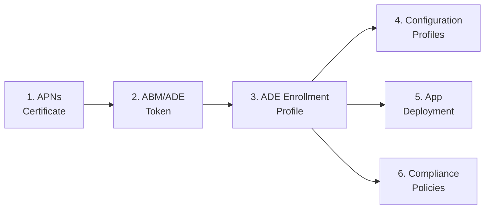
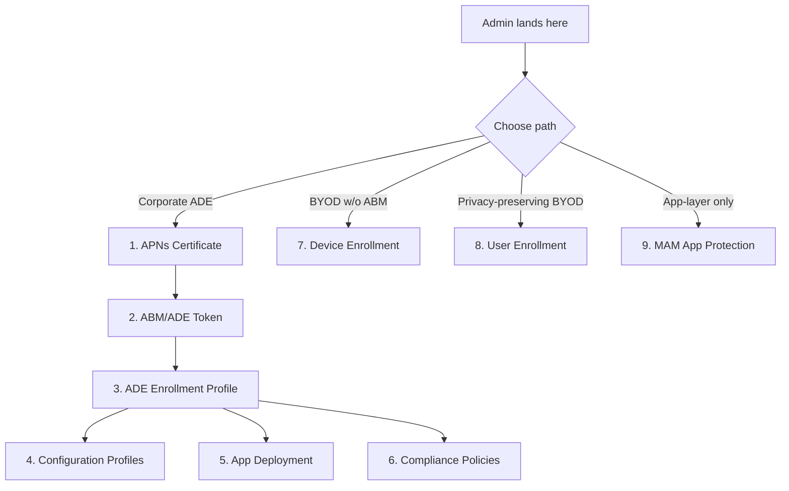

# Phase 29: iOS Admin Setup — BYOD & MAM - Pattern Map

**Mapped:** 2026-04-17
**Files analyzed:** 5 (3 new, 2 modified)
**Analogs found:** 5 / 5 (all with exact or role-match analogs in-repo)

## File Classification

| New/Modified File | Role | Data Flow | Closest Analog | Match Quality |
|-------------------|------|-----------|----------------|---------------|
| `docs/admin-setup-ios/07-device-enrollment.md` (NEW) | documentation — iOS admin guide (BYOD enrollment, no ABM) | request-response (admin reads → configures portal) | `docs/admin-setup-ios/05-app-deployment.md` | exact — same role, same multi-path comparison-table + per-type-section structure; secondary analog `03-ade-enrollment-profile.md` for Key Concepts + callout patterns |
| `docs/admin-setup-ios/08-user-enrollment.md` (NEW) | documentation — iOS admin guide (privacy-preserving BYOD) | request-response + new callout pattern (privacy-limit) | `docs/admin-setup-ios/03-ade-enrollment-profile.md` | exact — same Key Concepts Before You Begin two-tier structure; supervised-only callout pattern is the direct structural model (not semantic) for the new privacy-limit callout |
| `docs/admin-setup-ios/09-mam-app-protection.md` (NEW) | documentation — iOS admin guide (app-layer MAM-WE, standalone) | request-response + dedicated operational section | `docs/admin-setup-ios/06-compliance-policy.md` | exact for Selective Wipe dedicated section; `05-app-deployment.md` exact for three-level comparison table + per-level sections; `03-ade-enrollment-profile.md` exact for Key Concepts self-contained intro |
| `docs/admin-setup-ios/00-overview.md` (MODIFIED — rewrite) | documentation — directory overview/router | request-response (admin lands → chooses path) | `docs/ios-lifecycle/00-enrollment-overview.md` | role-match — already uses `applies_to: all`, path-routing prose, per-path subsections; current `00-overview.md` is the in-place baseline for Mermaid evolution + prereqs split |
| `docs/_templates/admin-template-ios.md` (MODIFIED — extend) | documentation — template | template-reuse | existing in-file `SUPERVISED-ONLY CALLOUT PATTERN` comment block (lines 30-36) | exact — new `PRIVACY-LIMIT CALLOUT PATTERN` block must mirror this convention verbatim (comment-block style, placement, usage rules) |

---

## Pattern Assignments

### `docs/admin-setup-ios/07-device-enrollment.md` — ABYOD-01 (controller-like: documentation guide, request-response)

**Primary analog:** `docs/admin-setup-ios/05-app-deployment.md`
**Secondary analogs:** `docs/admin-setup-ios/03-ade-enrollment-profile.md` (for Key Concepts, What Breaks callouts); `docs/admin-setup-ios/02-abm-token.md` (for ABM-vs-non-ABM contrast framing)

**Why this analog:** ABYOD-01 requires (a) a comparison table at top + parallel per-flow sections (Company Portal vs web-based — D-12), which is structurally identical to `05-app-deployment.md`'s four-deployment-type comparison table + four per-type sections; (b) a capability-level "Available Without Supervision" table at the top (D-14), whose closest existing model is `05-app-deployment.md`'s 4-axis silent install table (lines 36-44). Both answer "what works in which scenario" in a scannable matrix.

#### Frontmatter pattern

**Source:** `docs/admin-setup-ios/05-app-deployment.md` lines 1-7 (copy exactly; update `applies_to` per this guide's scope)

```markdown
---
last_verified: 2026-04-17
review_by: 2026-07-16
applies_to: device-enrollment
audience: admin
platform: iOS
---
```

**Deviation:** `applies_to` value is `device-enrollment` (or similar non-ADE path-specific token). Phase 27/28 guides use `applies_to: ADE`; Phase 29 ABYOD-01 is NOT ADE. Planner should confirm token naming — `00-enrollment-overview.md` uses `applies_to: all`, so `device-enrollment` / `user-enrollment` / `mam-we` are the expected new tokens per the path-specific rationale implied by D-06.

#### Platform-gate banner pattern (lines 9-12)

**Source:** `docs/admin-setup-ios/05-app-deployment.md` lines 9-12 (copy verbatim structure, update `covers iOS/iPadOS ADE configuration` → non-ADE phrasing)

```markdown
> **Platform gate:** This guide covers iOS/iPadOS Device Enrollment via Intune (no ABM required).
> For corporate ADE setup, see [iOS/iPadOS Admin Setup Overview](00-overview.md).
> For iOS/iPadOS enrollment terminology, see the [Apple Provisioning Glossary](../_glossary-macos.md).
> Portal navigation may vary by Intune admin center version. See [Overview](00-overview.md#portal-navigation-note) for details.
```

#### Comparison table at TOP (capability table — D-14)

**Source pattern:** `docs/admin-setup-ios/05-app-deployment.md` lines 36-44 (4-axis silent install table) and lines 50-64 (multi-attribute comparison table — 11 rows × 4 columns)

**Structural excerpt to replicate:**

```markdown
| # | Scenario | Apple Account prompt | Install prompt |
|---|----------|:---------------------:|:----------------:|
| 1 | BYOD — user licensed (not User Enrollment) | Yes | Yes |
```

**ABYOD-01 adaptation:** Replace scenario columns with capability-level rows (MDM policies, Config profiles, Compliance evaluation, VPP device-licensed app install, VPP user-licensed app install, LOB install, Store-without-VPP install, Silent install, OS update enforcement, Supervised-only restrictions, Remote actions, etc.) vs 2-3 columns (Available on unsupervised Device Enrollment? / Comparison to ADE / Notes).

**Deviation from analog:** `05-app-deployment.md` table is scenario-focused; ABYOD-01 table is capability-focused and deliberately positioned BEFORE setup steps (per D-14 "at TOP of guide ... before setup steps") — `05-app-deployment.md` puts its comparison table after Key Concepts. This is intentional per D-14 ordering requirement.

#### Per-flow section structure (decision point at top, then parallel sections — D-12)

**Source:** `docs/admin-setup-ios/05-app-deployment.md` lines 88-150 — four top-level `##` sections (`## VPP Device-Licensed`, `## VPP User-Licensed`, `## LOB (.ipa)`, `## Store Apps (without VPP)`), each self-contained with `#### In Intune admin center` + numbered steps + What Breaks callouts.

**Excerpt to model:**

```markdown
## VPP Device-Licensed

#### In Apple Business Manager

1. Sign in to [Apple Business Manager](https://business.apple.com).
2. Navigate to **Apps and Books**. Search for the app. [...]

#### In Intune admin center

1. Verify the VPP token is synced: **Tenant administration** > **Connectors and tokens** > **Apple VPP tokens**.
[...]

> **What breaks if misconfigured:** [...] Symptom appears in: Intune admin center (assignment succeeds) but device (Company Portal does not list the app).
```

**ABYOD-01 adaptation:** `## Company Portal Enrollment` and `## Web-Based Enrollment` as the two parallel top-level sections, each with `#### In Intune admin center` (ABM sub-section not applicable to non-ADE paths — omit). Flow-specific prereqs per D-12 listed at start of each section.

#### Phase 30 runbook placeholder pattern

**Source:** `docs/admin-setup-ios/05-app-deployment.md` lines 186-195 (Configuration-Caused Failures table — all Runbook column entries read `iOS L1 runbooks (Phase 30)` verbatim)

**Excerpt (verbatim placeholder text):**

```markdown
| Misconfiguration | Portal | Symptom | Runbook |
|------------------|--------|---------|---------|
| VPP user-licensed app assigned to device with "Block App Store" restriction | Intune | Invitation cannot be accepted; user license stuck in "Invitation sent" | iOS L1 runbooks (Phase 30) |
```

**Usage count verified:** 45 occurrences across 6 Phase 27/28 guides. Confirmed canonical text.

#### Contrast-to-ADE prose (D-04 — no 🔓 glyph, inline prose + relative link)

**Source:** No direct precedent in iOS guides (Phase 29 introduces this pattern). Closest model is `05-app-deployment.md` line 134 where LOB silent install is contrasted to VPP without a callout glyph:

> LOB apps can install silently on both supervised and unsupervised devices because Apple trusts the enterprise signature — no Apple Account required. No 🔒 callout applies to LOB silent install because it is signature-gated, not supervision-gated.

**ABYOD-01 usage per D-04:** Short contrast sentences where readers might expect ADE-only features. Format: "[Capability] is an ADE-only capability — see [ADE enrollment profile](03-ade-enrollment-profile.md)." No glyph, no blockquote — inline prose only.

#### See Also pattern

**Source:** `docs/admin-setup-ios/05-app-deployment.md` lines 207-217

```markdown
## See Also

- [Configuration Profiles](04-configuration-profiles.md) — Wi-Fi/VPN/Certificates delivery [...]
- [ADE Enrollment Profile](03-ade-enrollment-profile.md) — supervised mode requirement for silent install
- [iOS/iPadOS Admin Setup Overview](00-overview.md)
- [iOS/iPadOS Enrollment Path Overview](../ios-lifecycle/00-enrollment-overview.md) — supervision concept anchor
- [Apple Provisioning Glossary](../_glossary-macos.md)
```

#### Version-history table footer pattern

**Source:** `docs/admin-setup-ios/05-app-deployment.md` lines 222-226

```markdown
---

| Date | Change | Author |
|------|--------|--------|
| 2026-04-16 | Initial version — [description of what this guide covers] | -- |
```

---

### `docs/admin-setup-ios/08-user-enrollment.md` — ABYOD-02 (documentation guide, privacy-callout-heavy)

**Primary analog:** `docs/admin-setup-ios/03-ade-enrollment-profile.md`
**Secondary analog:** `docs/_templates/admin-template-ios.md` lines 30-36 (supervised-only callout block — STRUCTURAL template for new privacy-limit pattern)

**Why this analog:** ABYOD-02 requires (a) a "Key Concepts Before You Begin" two-tier structure (D-19 privacy-boundaries summary is a direct parallel to `03-ade-enrollment-profile.md` § Key Concepts Before You Begin); (b) per-capability inline callouts (D-01), which mirror — but do NOT reuse the glyph of — the supervised-only callout pattern used 6 times in `03-ade-enrollment-profile.md`; (c) Prerequisites + Steps + Verification + Configuration-Caused Failures + See Also per template.

#### Key Concepts Before You Begin two-tier structure

**Source:** `docs/admin-setup-ios/03-ade-enrollment-profile.md` lines 24-47 — heading `## Key Concepts Before You Begin` followed by `### Supervised Mode` (paragraph-only) and `### Authentication Methods` (table + paragraph + What Breaks callout).

**Excerpt to model:**

```markdown
## Key Concepts Before You Begin

### Supervised Mode

On iOS/iPadOS 13.0 and later, devices enrolled through ADE are **automatically supervised** regardless of the enrollment profile supervised mode setting. However, you should explicitly set supervised mode to **Yes** in the enrollment profile to:

- Declare supervised intent in the profile configuration
- Ensure consistent behavior across all iOS versions in your fleet
[...]

Supervision cannot be added after enrollment without a full device erase. See [Supervision](../ios-lifecycle/00-enrollment-overview.md#supervision) for what supervision enables and the consequences of enrolling without it.

### Authentication Methods

| Method | iOS Version | Recommendation | Notes |
|--------|-------------|----------------|-------|
| Setup Assistant with modern authentication | iOS 13.0+ | **Recommended** | [...] |
```

**ABYOD-02 adaptation (D-19/D-20):** `## Key Concepts Before You Begin` → `### Managed Apple ID vs Personal Apple ID` (paragraph-only, critical BYOD distinction per D-22) → `### Privacy Boundaries on User Enrollment` (7-bullet canonical privacy boundary list from D-20, ending with "Each capability section below repeats the relevant limit as a point-of-need callout."). Linked target for every privacy reference: `../ios-lifecycle/00-enrollment-overview.md#user-enrollment` (D-03).

#### Privacy-limit inline callout (NEW pattern — D-01/D-02/D-03)

**Source:** NO existing in-repo analog for the semantic (correctly — this is a new pattern). STRUCTURAL template is `docs/_templates/admin-template-ios.md` lines 30-36:

```markdown
<!-- SUPERVISED-ONLY CALLOUT PATTERN
     Use this exact format for every supervised-only setting. No variations.
     Place immediately AFTER the setting description, BEFORE any configuration steps.
     Link target is ALWAYS the Phase 26 conceptual page, NOT the enrollment profile guide.

     > 🔒 **Supervised only:** [feature/setting name] requires supervised mode. [1-2 sentence explanation of what this means for unsupervised devices.] See [Supervision](../ios-lifecycle/00-enrollment-overview.md#supervision).
-->
```

**Actual callout rendering precedent** (how it appears in body copy):

`docs/admin-setup-ios/03-ade-enrollment-profile.md` line 73:

```markdown
> 🔒 **Supervised only:** Supervised mode enables the full range of MDM capabilities including OS update enforcement, silent app installation, and supervised-only configuration profiles. Devices enrolled without supervision receive standard MDM management only and cannot be upgraded to supervised without a full device erase. See [Supervision](../ios-lifecycle/00-enrollment-overview.md#supervision).
```

**ABYOD-02 adaptation (plain blockquote, NO glyph — D-02):**

```markdown
> **Privacy limit:** System-wide VPN is not available on this enrollment path — only per-app VPN scoped to managed apps. Personal app traffic does not route through the corporate VPN. See [User Enrollment](../ios-lifecycle/00-enrollment-overview.md#user-enrollment).
```

**Critical deviation:** NO leading glyph (D-02 lock). Link target is `#user-enrollment` not `#supervision` (D-03). Semantic is "what IT cannot do" (not "what requires supervised mode"). Format is `> **Privacy limit:** [capability-specific sentence]. See [User Enrollment](../ios-lifecycle/00-enrollment-overview.md#user-enrollment).` — see RESEARCH.md Example 2.

#### Deprecation section framing (D-21)

**Source pattern:** `docs/admin-setup-ios/03-ade-enrollment-profile.md` lines 40-44 (Authentication Methods table marks legacy row as "Not recommended" / "Being phased out") plus the forward-looking framing "For all new deployments, use **Setup Assistant with modern authentication**."

**Adaptation guidance (per RESEARCH.md Pitfall 4):** ABYOD-02 `## Profile-Based User Enrollment (Deprecated)` section should open with forward-looking directive:

```markdown
**For new enrollments, use account-driven User Enrollment** (documented above). Profile-based User Enrollment via Company Portal is deprecated and is no longer available for newly enrolled devices. Existing enrolled devices continue to work; Microsoft Intune support remains available for them.
```

Include MFA-limitation verbatim-with-attribution block from RESEARCH.md D-31 verification section (lines 501-519), with "verify current status before assuming these apply to your fleet" framing per D-31 / RESEARCH.md Pitfall 5.

#### Prerequisites pattern

**Source:** `docs/admin-setup-ios/03-ade-enrollment-profile.md` lines 18-23 (short checkbox-style Prerequisites list + cross-reference links)

```markdown
## Prerequisites

- ADE token configured and active with at least one iOS/iPadOS device synced (see [ABM/ADE Token Guide](02-abm-token.md))
- APNs certificate configured and active (see [APNs Certificate Guide](01-apns-certificate.md))
- Intune Administrator role
```

**ABYOD-02 adaptation (D-22):** Managed Apple ID (with first-occurrence parenthetical "Apple rebranded as 'Managed Apple Account' in 2024; Microsoft Intune documentation continues to use 'Managed Apple ID'" per RESEARCH.md line 492), Service Discovery setup (reference to `.well-known/com.apple.remotemanagement`), Microsoft Entra work account for JIT registration, Microsoft Authenticator required-app assignment, iOS 15+ baseline, APNs certificate active.

#### Configuration-Caused Failures table pattern

**Source:** `docs/admin-setup-ios/03-ade-enrollment-profile.md` lines 157-166

```markdown
## Configuration-Caused Failures

| Misconfiguration | Portal | Symptom | Runbook |
|------------------|--------|---------|---------|
| Supervised mode set to No | Intune | Supervised-only policies show "Not applicable"; locked enrollment ineffective | iOS L1 runbooks (Phase 30) |
| Locked enrollment set to No | Intune | Users can remove management profile via Settings > General > VPN & Device Management | iOS L1 runbooks (Phase 30) |
```

**Deviations expected vs. analog:** ABYOD-02 has NO ABM portal column entries (no ABM involvement in User Enrollment). `Portal` column is mostly "Intune"; any entries relating to Service Discovery configuration list the org's DNS/web server as the "portal" context — not a Microsoft portal.

---

### `docs/admin-setup-ios/09-mam-app-protection.md` — ABYOD-03 (MAM-WE standalone guide)

**Primary analog for overall structure:** `docs/admin-setup-ios/03-ade-enrollment-profile.md` (Key Concepts self-contained intro — D-24)
**Primary analog for three-level framework layout:** `docs/admin-setup-ios/05-app-deployment.md` (comparison table + per-type sections — D-25)
**Primary analog for Selective Wipe dedicated section:** `docs/admin-setup-ios/06-compliance-policy.md` lines 149-199 (CA timing dedicated section — D-28)

**Why these analogs:** ABYOD-03 has three structural patterns that each map to a distinct existing precedent: (a) standalone conceptual intro mirrors `03-ade-enrollment-profile.md`'s Key Concepts Before You Begin (but must NOT require MDM cross-reads — this is the key deviation); (b) Level 1 summary / Level 2 detail / Level 3 detail mirrors `05-app-deployment.md`'s four-deployment-type comparison + per-type sections; (c) Selective Wipe dedicated section is structurally identical to `06-compliance-policy.md`'s `## Compliance Evaluation Timing and Conditional Access` section which answers SC #4 from the guide alone per Phase 28 D-11.

#### Self-contained opening paragraph (D-24 — CRITICAL deviation from precedent)

**Source (STRUCTURAL):** `docs/admin-setup-ios/03-ade-enrollment-profile.md` line 16 (opening paragraph introduces the subject before jumping to Prerequisites)

```markdown
The enrollment profile configures how iOS/iPadOS devices enroll through Automated Device Enrollment (ADE): their supervision state, authentication method, Setup Assistant experience, and whether users can remove management. This is the final step in the ADE prerequisite chain — APNs certificate, then ABM/ADE token, then enrollment profile. [...]
```

**Critical DEVIATION:** `03-ade-enrollment-profile.md` explicitly references its sibling guides (APNs, ABM token) — ABYOD-03 must NOT do this per D-24. Pattern already provided in RESEARCH.md Pattern 2 (lines 257-269):

```markdown
# iOS MAM-WE App Protection Policies

Microsoft Intune app protection policies protect work data within SDK-integrated apps without enrolling the device in Intune MDM. This is called MAM Without Enrollment (MAM-WE). On iOS, MAM-WE applies to apps like Outlook, Teams, and Microsoft Edge that integrate the Intune App SDK. The device is not enrolled; no MDM profile is installed; IT has no device-level management capability. Policy controls apply only within managed apps and govern how work data can move into, out of, and within those apps.

Although this guide lives alongside MDM enrollment guides, MAM-WE is an app-layer protection model that does not require — and is not paired with — device enrollment. Everything you need to configure MAM-WE is in this guide; you do not need to read any MDM enrollment guide first.
```

**Why this deviation matters:** Every Phase 27/28 iOS admin guide cross-references sibling guides in its opening paragraph because they form a sequential chain. ABYOD-03 breaks the chain deliberately — it is standalone per SC #3. Planner should audit draft for any `[Device Enrollment](07-...)` or `[User Enrollment](08-...)` links in opening paragraphs and ensure they are only "optional deeper-detail" references per RESEARCH.md Pitfall 3.

#### Three-level comparison table + per-level sections (D-25)

**Source:** `docs/admin-setup-ios/05-app-deployment.md` lines 50-64 (comparison table with 11 attribute rows × 4 deployment-type columns)

**Excerpt to model (structure):**

```markdown
## App Type Comparison Table

The table below summarizes the four deployment types against the attributes that most commonly affect deployment decisions. Use this as the starting point when choosing a deployment method for a specific app.

| Attribute | VPP Device-Licensed | VPP User-Licensed | LOB (.ipa) | Store Apps (without VPP) |
|-----------|---------------------|-------------------|------------|--------------------------|
| Apple Account required | No | Yes [...] | No | Yes [...] |
| Silent install (supervised) | **Yes** | No [...] | Yes [...] | No |
[...]
```

**ABYOD-03 adaptation:** Comparison table has rows for key differentiators (data ingress, data egress, access controls, device conditions, typical use case) × 3 columns (Level 1 / Level 2 / Level 3). Per D-25, Level 1 gets table-only treatment + Microsoft Learn deep link; Level 2 and Level 3 each get a full `## Level 2 — Enterprise Enhanced Data Protection` and `## Level 3 — Enterprise High Data Protection` section with detailed setting tables and What Breaks callouts (model: `05-app-deployment.md` per-deployment-type `##` sections at lines 88, 106, 124, 140).

**Level 2 / Level 3 detail tables source content:** RESEARCH.md "Three-Level Data Protection Framework (D-33 verification)" section (starting line 555; iOS settings verbatim for all three levels). Copy settings verbatim with Microsoft Learn attribution per RESEARCH.md "Don't Hand-Roll" row on Level 1/2/3 setting content.

#### Dual-targeting (enrolled vs unenrolled) section (D-26)

**Source:** `docs/admin-setup-ios/05-app-deployment.md` lines 50-64 column structure is the closest analog (comparison table as decision guide). Also `03-ade-enrollment-profile.md` lines 60-68 (User Affinity comparison table + per-mode paragraph).

**ABYOD-03 adaptation:** `## Targeting: Enrolled vs Unenrolled Devices` section with: (1) 1-2 sentence conceptual intro defining enrolled-mode in-doc per RESEARCH.md Pitfall 3 (do NOT link-out for definition); (2) comparison table (assignment UX, behavior differences); (3) per-mode subsections with decision guidance per specifics section (lines 190-191 of CONTEXT.md).

#### Selective Wipe dedicated section (D-28)

**Source:** `docs/admin-setup-ios/06-compliance-policy.md` lines 149-199 — `## Compliance Evaluation Timing and Conditional Access` section.

**Structural excerpt to model:**

```markdown
## Compliance Evaluation Timing and Conditional Access

Compliance evaluation does not happen instantly after enrollment. During the window between enrollment completion and the first compliance evaluation — typically 0-30 minutes — a device's compliance state is "Not evaluated." How Conditional Access treats devices in this state is governed by a single Intune tenant setting: the **default compliance posture toggle**. This section documents the timing sequence, the toggle's behavior in the gap, and iOS-specific considerations.

### Compliance State Timeline Post-Enrollment

| Time after enrollment | Compliance state | What is happening | Conditional Access behavior |
|-----------------------|------------------|-------------------|------------------------------|
| T+0 min | Managed, no compliance record | [...] | Determined by the **default compliance posture toggle** (see below) |
[...]

### Default Compliance Posture Toggle

**Location in Intune admin center:** **Endpoint security** > **Device compliance** > **Compliance policy settings** > **Mark devices with no compliance policy assigned as**.

[...]

### iOS-Specific Timing Considerations

- **APNs dependency:** [...]
[...]

### Default Compliance Posture Decision Summary

| Organizational profile | Recommended toggle | Rationale |
[...]

### Cross-References for Deep-Dive Content

The timing sequence and mitigation patterns above are sufficient to determine CA behavior during the 0-30 minute window for any iOS enrollment path. For cross-platform timing mechanics, [...]
```

**ABYOD-03 adaptation:** `## Selective Wipe` with sub-structure:
- Opening paragraph (MAM-WE wipe scope definition, ONE contrast sentence to MDM device wipe per D-28)
- `### Trigger Sources` (admin-initiated via Intune, user-initiated via Company Portal, conditional on compliance/Entra state)
- `### Wipe Scope` (managed app data + corporate accounts, NOT device — with the single contrast sentence)
- `### Verification Steps`
- Optionally `### iOS-Specific Considerations`

**ONE contrast sentence** (per D-28 + specifics line 189):

> Unlike MDM device wipe (which resets the device to factory state), MAM-WE selective wipe removes only managed app data and corporate accounts.

**Deviation vs. analog:** `06-compliance-policy.md` CA timing section has a `### Cross-References for Deep-Dive Content` subsection at end. ABYOD-03 Selective Wipe section must NOT include such a subsection pointing to MDM wipe details — per D-24 / D-28 "NO MDM-wipe subsection or comparison table."

#### iOS-specific behaviors section (D-29)

**Source:** `docs/admin-setup-ios/06-compliance-policy.md` lines 179-184 (`### iOS-Specific Timing Considerations` — bulleted paragraph-per-behavior format).

```markdown
### iOS-Specific Timing Considerations

- **APNs dependency:** iOS compliance check-in is initiated by Apple Push Notification service, not by a polling schedule. If APNs is blocked at the network edge (firewall, proxy, captive portal) the 0-15 minute evaluation can stall indefinitely. [...]
- **No MDM diagnostic tool on iOS:** Unlike Windows, iOS has no `mdmdiagnosticstool.exe` equivalent. [...]
- **Setup Assistant CA interaction:** [...]
- **User can force re-sync:** [...]
```

**ABYOD-03 adaptation per D-29:** App SDK integration requirements, keyboard restrictions, clipboard/copy-paste controls between managed and unmanaged apps, iOS-version-dependent features, Managed Open In boundary. Per D-27: no Android references, no "unlike Android" phrasing — use iOS-specific phrasing ("on iOS devices...", "iOS-version-dependent...").

#### "What breaks if misconfigured" callout pattern

**Source:** Canonical in `docs/admin-setup-ios/05-app-deployment.md` (10 instances) and `docs/admin-setup-ios/06-compliance-policy.md` (10 instances).

**Representative excerpt:** `06-compliance-policy.md` line 65:

```markdown
> **What breaks if misconfigured:** If "Unable to set up email on the device" is set to Require without a managed email configuration profile deployed, the device will always be flagged non-compliant — there is no system email profile to detect. Deploy an email configuration profile (Settings Catalog > Mail > Account) before enabling this compliance setting. Symptom appears in: Intune admin center (all devices non-compliant for email setting despite no user-configured email conflict) and device (CA blocks access until email profile is present).
```

**ABYOD-03 adaptation (D-25):** "What breaks if misconfigured" callouts required for Level 2 AND Level 3 settings where misconfiguration has operational consequence (per D-25). Level 1 settings do NOT require individual What Breaks callouts (summary-table treatment only).

---

### `docs/admin-setup-ios/00-overview.md` — MODIFIED (rewrite per D-06)

**Primary analog:** `docs/ios-lifecycle/00-enrollment-overview.md` (the only existing iOS overview file that already uses `applies_to: all` with multi-path routing prose)
**Secondary analog:** `docs/admin-setup-ios/00-overview.md` (current file itself — the base for in-place evolution)

**Why this analog:** `ios-lifecycle/00-enrollment-overview.md` is the proven existing model for "overview covering multiple iOS paths without chaining them" — exactly the pattern D-06 requires. Current `00-overview.md` uses `applies_to: ADE` and a sequential-chain mental model; the rewrite must shift to `applies_to: all` and a choose-your-path mental model.

#### Frontmatter evolution

**Current (D:\claude\Autopilot\docs\admin-setup-ios\00-overview.md lines 1-7):**

```markdown
---
last_verified: 2026-04-16
review_by: 2026-07-15
applies_to: ADE
audience: admin
platform: iOS
---
```

**Target (D-06 + model from `ios-lifecycle/00-enrollment-overview.md` lines 1-7):**

```markdown
---
last_verified: 2026-04-17
review_by: 2026-07-16
applies_to: all
audience: admin
platform: iOS
---
```

Key changes: `applies_to: ADE` → `applies_to: all`; `last_verified` / `review_by` bump to Phase 29 write date.

#### Title restructure

**Current (line 13):** `# iOS/iPadOS Admin Setup: Corporate ADE Configuration and Device Management`

**Target (D-06 — Claude's discretion, path-agnostic wording):** `# iOS/iPadOS Admin Setup` or `# iOS/iPadOS Admin Setup Overview` (matching pattern of `ios-lifecycle/00-enrollment-overview.md` title `# iOS/iPadOS Enrollment Path Overview`).

#### Mermaid diagram (D-07)

**Current excerpt to evolve (`00-overview.md` lines 19-26 — VERBATIM for planner design reference):**



**Target structure (D-07 — Claude's discretion between two approaches):**

Approach A — single extended diagram with branches:



Approach B: Path-selector matrix at top + per-path mini-diagrams per section.

**CORE CONSTRAINT (D-07):** Non-ADE paths MUST NOT chain from ADE prerequisites — NO dependency arrow from node C to nodes G/H/I. G, H, I are parallel alternatives to the A→B→C→{D,E,F} chain, not continuations.

**Model for restructured visual:** RESEARCH.md Architecture Patterns section (RESEARCH.md lines 170-191) already contains the canonical flowchart for this exact restructure — the planner should reuse it directly with minor label adaptation.

#### Intune Enrollment Restrictions shared section (D-08)

**No direct existing analog** — this is a new `##`-level section introduced in Phase 29. Closest structural model is `06-compliance-policy.md` lines 149-199 (dedicated operational `##` section) but the content is new.

**Section structure per D-08:**
- Platform filtering (iOS/iPadOS enrollment allowed/blocked per Intune tenant)
- Personal/corporate ownership flag (implementation mechanics; cross-ref from ABYOD-01 D-16 section)
- Per-user device limits
- Enrollment-type blocking (block Device Enrollment, block User Enrollment, block MAM-WE at tenant-level)

ABYOD-01 and ABYOD-02 cross-link to this section with anchor `00-overview.md#intune-enrollment-restrictions` — do NOT duplicate per D-08.

#### Dual prerequisites split (D-09)

**Current single-tier list (`00-overview.md` lines 40-48):**

```markdown
## Prerequisites

Before starting the iOS/iPadOS ADE configuration guides:

- [ ] **Apple Push Notification certificate Apple ID** -- A company email address Apple ID (NOT a personal Apple ID). As a best practice, use a distribution list monitored by more than one person.
- [ ] **Apple Business Manager account** -- A Managed Apple ID with Device Manager or Administrator role in ABM.
- [ ] **Intune Administrator role** -- Or a custom RBAC role with enrollment management permissions.
- [ ] **Microsoft Intune Plan 1** (or higher) subscription.
- [ ] **iOS/iPadOS enrollment path selected** -- Confirm ADE is the appropriate path for your deployment. See [Enrollment Path Overview](../ios-lifecycle/00-enrollment-overview.md).
```

**Target two-tier structure (D-09):**

```markdown
## Prerequisites

### ADE-Path Prerequisites

- [ ] **Apple Push Notification certificate Apple ID** -- [existing text]
- [ ] **Apple Business Manager account** -- [existing text]
- [ ] **Intune Administrator role**
- [ ] **Microsoft Intune Plan 1** (or higher) subscription
- [ ] **iOS/iPadOS enrollment path = ADE confirmed** -- See [Enrollment Path Overview](../ios-lifecycle/00-enrollment-overview.md)

### BYOD-Path Prerequisites

- [ ] **APNs certificate active** (required for Device Enrollment)
- [ ] **Managed Apple ID considerations reviewed** (required for account-driven User Enrollment per [User Enrollment guide](08-user-enrollment.md))
- [ ] **Microsoft 365 licensing baseline** (for MAM-WE app protection policies)
- [ ] **Intune Administrator role**
```

#### Portal Navigation Note preservation (Phase 27 D-17)

**Source (current `00-overview.md` lines 50-56):** Keep verbatim — per D-09 this stays in the overview and is NOT duplicated in individual guides.

```markdown
## Portal Navigation Note

The Intune admin center is actively rolling out updated navigation for enrollment configuration. Portal paths referenced in these guides reflect the current documented experience. If menu locations differ from what is described:

- Look for equivalent options under **Devices** > **Device onboarding** > **Enrollment** > **Apple** tab.
- The settings and their effects remain the same regardless of navigation path.
- Portal navigation may vary by Intune admin center version and tenant rollout timing.
```

#### Version-history table growth (D-10 implied)

**Current (`00-overview.md` lines 77-79):** two-row version history. **Target:** add a new row for Phase 29 restructure:

```markdown
| 2026-04-17 | Restructured to cover all iOS admin paths (ADE + Device Enrollment + User Enrollment + MAM-WE); added BYOD-path prerequisites section and Intune Enrollment Restrictions shared section; Mermaid diagram evolved from sequential chain to branching path-selector | -- |
```

---

### `docs/_templates/admin-template-ios.md` — MODIFIED (extend per D-05)

**Primary analog (in-file):** The existing `SUPERVISED-ONLY CALLOUT PATTERN` comment block at lines 30-36.

**Why this analog:** D-05 explicitly requires mirroring this exact documentation convention — "Privacy callout pattern in the template (D-05) should follow the same 'SUPERVISED-ONLY CALLOUT PATTERN' comment-block style that already lives in `admin-template-ios.md`" (CONTEXT.md specifics line 191).

#### Existing comment block (VERBATIM — lines 30-36)

```markdown
<!-- SUPERVISED-ONLY CALLOUT PATTERN
     Use this exact format for every supervised-only setting. No variations.
     Place immediately AFTER the setting description, BEFORE any configuration steps.
     Link target is ALWAYS the Phase 26 conceptual page, NOT the enrollment profile guide.

     > 🔒 **Supervised only:** [feature/setting name] requires supervised mode. [1-2 sentence explanation of what this means for unsupervised devices.] See [Supervision](../ios-lifecycle/00-enrollment-overview.md#supervision).
-->
```

#### Target new comment block to ADD (D-05 + D-01/D-02/D-03)

Insert immediately BELOW the existing supervised-only block (keep supervised-only block intact; add the new privacy-limit block as a sibling):

```markdown
<!-- PRIVACY-LIMIT CALLOUT PATTERN
     Use this exact format for account-driven User Enrollment privacy boundaries. No variations.
     Place immediately AFTER the capability/setting description, BEFORE any configuration steps.
     Plain blockquote only — NO emoji/glyph. Do NOT use 🔒 (reserved for supervised-only) or
     introduce a new glyph (parallel glyph conventions are locked per Phase 27).
     Link target is ALWAYS the Phase 26 conceptual page #user-enrollment anchor,
     NOT the User Enrollment admin guide (08-user-enrollment.md).
     Apply ONLY in account-driven User Enrollment contexts (08-user-enrollment.md).
     Do NOT use in Device Enrollment (07-device-enrollment.md) or MAM-WE (09-mam-app-protection.md).

     > **Privacy limit:** [what IT cannot see/do for this capability]. See [User Enrollment](../ios-lifecycle/00-enrollment-overview.md#user-enrollment).
-->
```

**Structural mirror:** 6-line pattern, matching the 6-line structure of the existing supervised-only block:
1. Heading comment (`PRIVACY-LIMIT CALLOUT PATTERN`)
2. Usage rule ("Use this exact format...")
3. Placement rule ("Place immediately AFTER...")
4. Glyph rule ("Plain blockquote only — NO emoji/glyph...")
5. Link-target rule ("Link target is ALWAYS...")
6. Scope rule ("Apply ONLY in...") — new compared to supervised-only pattern because privacy-limit has stricter scope per D-18

Format-literal blockquote example (matching the inline-format-example convention used in the supervised-only block).

---

## Shared Patterns

### Platform-gate banner (top of every iOS admin guide)

**Source:** `docs/admin-setup-ios/05-app-deployment.md` lines 9-12, `docs/admin-setup-ios/03-ade-enrollment-profile.md` lines 9-12 (verified identical structure across all 6 Phase 27/28 guides)

**Apply to:** `07-device-enrollment.md`, `08-user-enrollment.md`, `09-mam-app-protection.md`

```markdown
> **Platform gate:** This guide covers [scope].
> For [cross-platform link], see [target].
> For iOS/iPadOS enrollment terminology, see the [Apple Provisioning Glossary](../_glossary-macos.md).
> Portal navigation may vary by Intune admin center version. See [Overview](00-overview.md#portal-navigation-note) for details.
```

### Phase 30 runbook placeholder text (VERBATIM)

**Source:** `docs/admin-setup-ios/` — 45 occurrences across 6 Phase 27/28 guides, all using the identical string.

**Apply to:** All three new guides' Configuration-Caused Failures tables (every row's Runbook column).

```
iOS L1 runbooks (Phase 30)
```

Literal string, no link, no markdown link syntax. Planner must ensure verbatim use — Phase 32 will bulk-replace once Phase 30 runbooks exist.

### "What breaks if misconfigured" callout format

**Source:** `docs/admin-setup-ios/03-ade-enrollment-profile.md` line 46 (and 5 other instances in same file), `docs/admin-setup-ios/04-configuration-profiles.md` (9 instances), `docs/admin-setup-ios/06-compliance-policy.md` (10 instances)

**Apply to:** All three new guides. Required per `admin-template-ios.md` line 7: "Every configurable setting MUST have a 'What breaks if misconfigured' callout."

```markdown
> **What breaks if misconfigured:** [Consequence]. Symptom appears in: {specify portal where symptom manifests, which may differ from the portal where the misconfiguration occurs}.
```

### Frontmatter schema

**Source:** Every file in `docs/admin-setup-ios/` (Phase 27/28) uses this exact 6-field schema:

```yaml
---
last_verified: YYYY-MM-DD
review_by: YYYY-MM-DD  (= last_verified + 90 days)
applies_to: [ADE | all | device-enrollment | user-enrollment | mam-we]
audience: admin
platform: iOS
---
```

**Apply to:** All three new guides + overview rewrite. `applies_to` values for new guides: `device-enrollment` (07), `user-enrollment` (08), `mam-we` (09), `all` (overview rewrite).

### Cross-reference path convention

**Source:** Every Phase 27/28 guide uses relative paths with section anchors:

```markdown
See [Supervision](../ios-lifecycle/00-enrollment-overview.md#supervision)
```

**Apply to:** All three new guides. Privacy callouts (ABYOD-02) use `../ios-lifecycle/00-enrollment-overview.md#user-enrollment` (D-03). Contrast-to-ADE links (ABYOD-01/03) use `03-ade-enrollment-profile.md` (D-04).

### See Also section pattern

**Source:** `docs/admin-setup-ios/05-app-deployment.md` lines 207-217 (10-link format); `03-ade-enrollment-profile.md` lines 170-176 (7-link format).

**Apply to:** All three new guides. Should include (at minimum): sibling new guides, `00-overview.md`, `../ios-lifecycle/00-enrollment-overview.md`, `../_glossary-macos.md`. ABYOD-03 deviations per D-24: sibling MDM guides (07, 08) listed as "For related MDM enrollment context, see..." rather than "prerequisites" — and must not be presented as required reading.

### Footer navigation + version-history table

**Source:** `docs/admin-setup-ios/05-app-deployment.md` lines 219-226, `docs/admin-setup-ios/03-ade-enrollment-profile.md` lines 178-186

```markdown
---
*Previous: [Previous Guide](prev.md) | Next: [Next Guide](next.md) | [Back to Overview](00-overview.md)*

---

| Date | Change | Author |
|------|--------|--------|
| 2026-04-17 | Initial version — [description] | -- |
```

**Apply to:** All three new guides. Cross-link choices for "Previous/Next" at planner discretion (ABYOD-03 may omit Previous/Next given D-24 standalone-ness — or link to 08 as "Previous sibling new guide" rather than "Prerequisite").

---

## No Analog Found

No files in scope lack an adequate analog. Every file maps to at least one exact structural analog in-repo. The patterns requiring novel synthesis are:

| New element | Reason no perfect analog exists | Source instead |
|-------------|-------------------------------|----------------|
| Privacy-limit callout (`> **Privacy limit:** ...`) | New pattern introduced by Phase 29 per D-01 | STRUCTURE from `admin-template-ios.md` supervised-only comment block (lines 30-36); FORMAT from CONTEXT D-01 |
| "Capabilities Available Without Supervision" table (ABYOD-01) | Capability-level granularity differs from `ios-lifecycle/00-enrollment-overview.md` per-path table (D-14) | Structural model: `05-app-deployment.md` silent-install table (lines 36-44); content sourced from RESEARCH.md "Capabilities Available Without Supervision" section |
| Intune Enrollment Restrictions section (overview) | Shared config-tier section introduced by Phase 29 (D-08) | Structural model: `06-compliance-policy.md` Step 2 setting-group structure (lines 59-111); content from RESEARCH.md |
| Overview Mermaid restructure | Current diagram is ADE-only sequential; target is branching (D-07) | Base Mermaid from current `00-overview.md` lines 19-26; target structure from RESEARCH.md Architecture Patterns diagram (RESEARCH lines 172-191) |

---

## Metadata

**Analog search scope:**
- `docs/admin-setup-ios/` (6 Phase 27/28 iOS admin guides + current overview)
- `docs/_templates/admin-template-ios.md` (canonical iOS admin template)
- `docs/_templates/admin-template-macos.md` (secondary pattern reference)
- `docs/ios-lifecycle/00-enrollment-overview.md` (multi-path overview analog)

**Files scanned:** 11 source files, plus CONTEXT.md and RESEARCH.md for Phase 29 locked decisions.

**Phase 30 runbook placeholder usage count:** 45 occurrences across 6 Phase 27/28 iOS admin guides (verbatim string `iOS L1 runbooks (Phase 30)` — confirmed canonical).

**Pattern extraction date:** 2026-04-17

## PATTERN MAPPING COMPLETE
