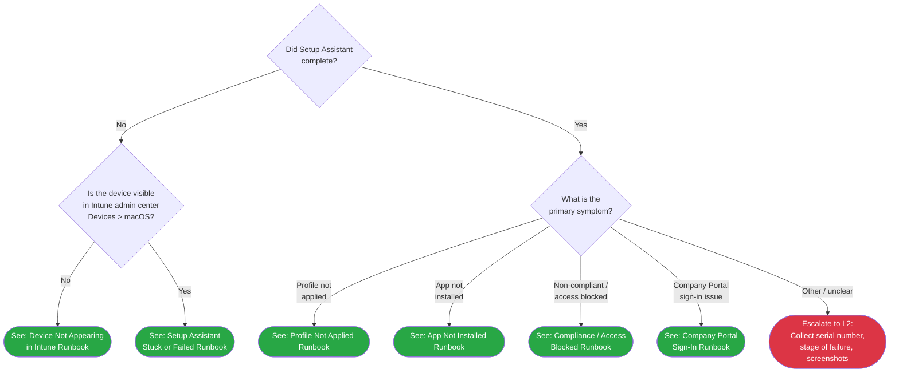

# Phase 30: iOS L1 Triage & Runbooks - Pattern Map

**Mapped:** 2026-04-17
**Files analyzed:** 20 (7 NEW + 13 MODIFY — template, 00-initial-triage, 00-index, 9 admin-setup-ios, 1 prose retrofit embedded in 07-device-enrollment)
**Analogs found:** 20 / 20 (all have direct in-repo precedent)

---

## File Classification

| File | Action | Role | Data Flow | Closest Analog | Match Quality |
|------|--------|------|-----------|----------------|---------------|
| `docs/decision-trees/07-ios-triage.md` | NEW | decision tree | branching router (visibility-gate + symptom-fork) | `docs/decision-trees/06-macos-triage.md` | exact (D-02 says mirror structure exactly) |
| `docs/l1-runbooks/16-ios-apns-expired.md` | NEW | L1 runbook (tenant-config, single-flow) | detect-escalate | `docs/l1-runbooks/10-macos-device-not-appearing.md` | role-match + format upgrade (D-10 sectioned H2) |
| `docs/l1-runbooks/17-ios-ade-not-starting.md` | NEW | L1 runbook (tenant-config, single-flow, ONLY runbook with manual-sync write exception) | detect-escalate + manual-sync exception | `docs/l1-runbooks/10-macos-device-not-appearing.md` (step 10 = manual-sync precedent) | exact precedent for write exception |
| `docs/l1-runbooks/18-ios-enrollment-restriction-blocking.md` | NEW | L1 runbook (tenant-config, single-flow) | detect-escalate | `docs/l1-runbooks/10-macos-device-not-appearing.md` | role-match |
| `docs/l1-runbooks/19-ios-license-invalid.md` | NEW | L1 runbook (tenant-config, single-flow, 2nd-portal Prerequisites flag) | detect-escalate | `docs/l1-runbooks/10-macos-device-not-appearing.md` | role-match |
| `docs/l1-runbooks/20-ios-device-cap-reached.md` | NEW | L1 runbook (tenant-config, single-flow) | detect-escalate (optional manual-sync retry per D-08) | `docs/l1-runbooks/10-macos-device-not-appearing.md` | role-match |
| `docs/l1-runbooks/21-ios-compliance-blocked.md` | NEW | L1 runbook (multi-cause, sub-sectioned per D-28) | detect-escalate + user-action (D-09) | `docs/l1-runbooks/11-macos-setup-assistant-failed.md` | exact precedent for multi-symptom H2 layout |
| `docs/decision-trees/00-initial-triage.md` | MODIFY (banner + See Also + Scenario Trees + last_verified) | decision tree | banner injection | Line 9 macOS banner (self-referential precedent) | exact (D-04 mirrors line 9 verbatim pattern) |
| `docs/l1-runbooks/00-index.md` | MODIFY (add iOS section + Related Resources entry + Version History) | index | platform-section addition | Existing macOS ADE Runbooks section (lines 36-47) | exact |
| `docs/_templates/l1-template.md` | MODIFY (extend `platform:` enum to add `iOS`) | template | one-line YAML enum edit | Line 18 `platform:` enum currently `Windows \| macOS \| all` | exact (D-24 adds `iOS`) |
| `docs/admin-setup-ios/01-apns-certificate.md` | MODIFY (5 placeholder rows + last_verified + Version History) | admin guide retrofit | link-substitution | In-file existing rows (identical pattern) | exact (per-row judgment per D-17) |
| `docs/admin-setup-ios/02-abm-token.md` | MODIFY (5 placeholder rows + last_verified + Version History) | admin guide retrofit | link-substitution | Same pattern | exact |
| `docs/admin-setup-ios/03-ade-enrollment-profile.md` | MODIFY (6 placeholder rows + last_verified + Version History) | admin guide retrofit | link-substitution | Same pattern | exact |
| `docs/admin-setup-ios/04-configuration-profiles.md` | MODIFY (9 placeholder rows + last_verified + Version History) | admin guide retrofit | link-substitution | Same pattern | exact |
| `docs/admin-setup-ios/05-app-deployment.md` | MODIFY (10 placeholder rows + last_verified + Version History) | admin guide retrofit | link-substitution | Same pattern | exact |
| `docs/admin-setup-ios/06-compliance-policy.md` | MODIFY (10 placeholder rows + last_verified + Version History) | admin guide retrofit | link-substitution | Same pattern | exact |
| `docs/admin-setup-ios/07-device-enrollment.md` | MODIFY (12 placeholder rows + 1 prose retrofit line 243 + last_verified + Version History) | admin guide retrofit | link-substitution + prose rewrite | Same pattern + D-18 prose tense shift | exact |
| `docs/admin-setup-ios/08-user-enrollment.md` | MODIFY (7 placeholder rows + last_verified + Version History) | admin guide retrofit | link-substitution | Same pattern | exact |
| `docs/admin-setup-ios/09-mam-app-protection.md` | MODIFY (7 placeholder rows — may resolve to L2 placeholder per D-31 + last_verified + Version History) | admin guide retrofit | link-substitution | Same pattern | exact pattern, routing target varies |

**Count verification against CONTEXT.md D-16 enumeration:** 5+5+6+9+10+10+12+7+7 = 71 placeholder rows. Matches CONTEXT canonical count.

---

## Pattern Assignments

### `docs/decision-trees/07-ios-triage.md` (decision tree, branching router)

**Analog:** `docs/decision-trees/06-macos-triage.md` (mirror structurally per D-02)

**Frontmatter pattern** (06-macos-triage.md lines 1-7 — COPY EXACTLY, change `macOS` -> `iOS`; `applies_to:` decision is Claude's per CONTEXT.md Claude's discretion):

```yaml
---
last_verified: 2026-04-17
review_by: 2026-07-16
applies_to: all
audience: L1
platform: iOS
---
```

**Platform gate banner** (06-macos-triage.md line 9):

```markdown
> **Platform gate:** This guide covers macOS ADE troubleshooting via Intune. For Windows Autopilot, see [Initial Triage Decision Tree](00-initial-triage.md).
```

iOS adaptation (new runbook):

```markdown
> **Platform gate:** This guide covers iOS/iPadOS troubleshooting via Intune. For Windows Autopilot, see [Initial Triage Decision Tree](00-initial-triage.md). For macOS ADE, see [macOS ADE Triage](06-macos-triage.md).
```

**Section sequence** (06-macos-triage.md H2 order — mirror exactly):

1. `# [Title]` (H1) + intro paragraph
2. `## How to Use This Tree` (lines 13-17)
3. `## Legend` (lines 19-25) — 3-row table Diamond/Green/Red
4. `## Decision Tree` (lines 27-55) — Mermaid block
5. `## Routing Verification` (lines 57-69) — proves N-node cap met
6. `## How to Check` (lines 71-77) — per-node check instructions
7. `## Escalation Data` (lines 79-83) — what to collect on L2-escalate nodes
8. `## Related Resources` (lines 85-91)
9. `## Version History` (lines 93-97)

**Mermaid code block (FULL pattern)** — 06-macos-triage.md lines 29-55:

````markdown

````

**iOS adaptation rules (D-02 + D-01 + Specifics):**
- Node ID prefix `IOS` (NOT `MAC`) — `IOS1`, `IOS2`, `IOSR1`..`IOSR6`, `IOSE1`
- Axis 1 root (IOS1): `"Is the device visible<br/>in Intune admin center<br/>Devices &gt; iOS/iPadOS?"` (D-01 visibility gate)
- Axis 2 (IOS2 No-branch, IOS3 Yes-branch): two different fork questions per D-01 hybrid
- Keep `<br/>` line breaks for node readability
- Keep `&gt;` HTML entity for the `>` inside node text (Mermaid-safe)
- Keep `classDef resolved fill:#28a745,color:#fff` / `classDef escalateL2 fill:#dc3545,color:#fff` styling verbatim
- Keep `click` directives linking resolved nodes to `../l1-runbooks/16-ios-*.md` through `../l1-runbooks/21-ios-*.md`
- **Terminal-node budget: all nodes within 5 edges of root (SC #1 cap) — Routing Verification table proves it**

**Legend table** — copy verbatim from 06-macos-triage.md lines 21-25:

```markdown
| Symbol | Meaning |
|--------|---------|
| Diamond `{...}` | Decision -- answer the question |
| Green rounded `([...])` | Resolved -- follow the linked L1 runbook |
| Red rounded `([...])` | Escalate to L2 -- collect data listed in Escalation Data table and hand off |
```

**Routing Verification table structure** (06-macos-triage.md lines 57-69):

```markdown
## Routing Verification

All terminal nodes are within 3 edges of the root node (MAC1):

| Path | Step 1 | Step 2 | Destination |
|------|--------|--------|-------------|
| Device not appearing | Setup Assistant? No | Visible in Intune? No | Runbook 10 |
| Setup Assistant stuck | Setup Assistant? No | Visible in Intune? Yes | Runbook 11 |
...
```

iOS version: change "3 edges of the root node (MAC1)" to "N edges of the root node (IOS1)" where N <= 5 (SC #1), enumerate all iOS runbook destinations (16-21 + L2 escalate).

**How to Check table structure** (06-macos-triage.md lines 71-77):

```markdown
## How to Check

| Question | How to Check |
|----------|-------------|
| Did Setup Assistant complete? | Ask the user: "Are you at the macOS desktop...". If yes, ... |
| Is the device visible in Intune? | Open Intune admin center > **Devices** > **macOS**. Search by serial number. ... |
| What is the primary symptom? | Ask the user: "What specifically is not working?" ... |
```

iOS version: questions map to IOS1, IOS2, IOS3 node text; portal paths use P-01..P-10 from RESEARCH.md Section 3 navigation table (verbatim field names).

**Escalation Data table structure** (06-macos-triage.md lines 79-83):

```markdown
## Escalation Data

| When You Escalate | Collect This |
|-------------------|-------------|
| "Other / unclear" route | Device serial number (...), macOS version (...), screenshot ..., description ..., approximate time ..., any steps already attempted |
```

iOS version: device serial (Settings > General > About > Serial Number), iOS version (Settings > General > About > Software Version).

**Related Resources block** (06-macos-triage.md lines 85-91):

```markdown
## Related Resources

- [macOS L1 Runbooks Index](../l1-runbooks/00-index.md) -- All 6 macOS L1 runbooks
- [macOS L2 Runbooks Index](../l2-runbooks/00-index.md) -- L2 diagnostic guides
- [macOS ADE Lifecycle](../macos-lifecycle/00-ade-lifecycle.md) -- 7-stage enrollment lifecycle
- [Initial Triage Decision Tree](00-initial-triage.md) -- Windows Autopilot (classic) triage
- [macOS Glossary](../_glossary-macos.md) -- macOS-specific terminology
```

iOS version maps to:
- `[iOS L1 Runbooks Index](../l1-runbooks/00-index.md)` — All 6 iOS L1 runbooks (16-21)
- `[iOS/iPadOS Admin Setup](../admin-setup-ios/00-overview.md)` — admin config reference
- `[iOS/iPadOS Enrollment Overview](../ios-lifecycle/00-enrollment-overview.md)` — path concepts
- `[Initial Triage Decision Tree](00-initial-triage.md)` — Windows Autopilot (classic) triage
- `[macOS ADE Triage](06-macos-triage.md)` — sibling Apple platform triage
- `[Apple Provisioning Glossary](../_glossary-macos.md)` — shared Apple terminology (Phase 32 NAV-01 will add iOS-specific glossary)

**Version History pattern** (06-macos-triage.md lines 93-97):

```markdown
## Version History

| Date | Change | Author |
|------|--------|--------|
| 2026-04-14 | Initial version | -- |
```

iOS version: single row, date = Phase 30 ship date, Change = "Initial version", Author = `--`.

---

### `docs/l1-runbooks/16-ios-apns-expired.md` (L1 runbook, single-flow, tenant-config)

**Analog:** `docs/l1-runbooks/10-macos-device-not-appearing.md` (tenant-side visibility-check template)

**CRITICAL STRUCTURAL DEPARTURE FROM ANALOG (D-10):** macOS runbook 10 uses 3-section "Prerequisites / Steps / Escalation Criteria" prose. iOS Phase 30 runbooks use sectioned H2 actor-boundary layout. The frontmatter, platform gate banner, H1/intro, and closing blocks (Escalation Criteria, back-link, Version History) are inherited verbatim; the middle is rewritten to the new sectioned format.

**Frontmatter pattern** (10-macos-device-not-appearing.md lines 1-7):

```yaml
---
last_verified: 2026-04-14
review_by: 2026-07-13
applies_to: ADE
audience: L1
platform: macOS
---
```

iOS adaptation per D-25:
- `platform: iOS` (requires D-24 template enum extension)
- `audience: L1`
- `applies_to: all` (runbook 16 APNs affects all paths per D-25)
- `last_verified: <phase 30 ship date>`, `review_by: last_verified + 90 days`

**Platform gate banner** (10-macos-device-not-appearing.md line 9 — D-26 mandates mirroring this verbatim):

```markdown
> **Platform gate:** This guide covers macOS ADE troubleshooting via Intune. For Windows Autopilot, see [Windows L1 Runbooks](00-index.md#apv1-runbooks).
```

iOS verbatim adaptation (D-26 locked wording):

```markdown
> **Platform gate:** This guide covers iOS/iPadOS troubleshooting via Intune. For Windows Autopilot, see [Windows L1 Runbooks](00-index.md#apv1-runbooks). For macOS ADE, see [macOS ADE Runbooks](00-index.md#macos-ade-runbooks).
```

**H1 title + intro paragraph pattern** (10-macos-device-not-appearing.md lines 11-13):

```markdown
# macOS Device Not Appearing in Intune

Use this runbook when a Mac is not found in Intune admin center after the user attempted ADE enrollment, or when a Mac is expected to enroll via [ADE](../_glossary-macos.md#ade) but the device serial number does not appear in Intune Devices > macOS.
```

iOS pattern: `# iOS APNs Certificate Expired` + intro paragraph describing the symptom and linking back to the triage tree entry node (D-11 requirement: link to Mermaid anchor of triage entry point).

**Section heading sequence (D-10 sectioned H2 actor-boundary — DEPARTURE from macOS 3-section prose):**

```markdown
## Symptom
## L1 Triage Steps
## Admin Action Required
## Escalation Criteria
```

(For runbook 16: **no User Action Required section** per D-13 — tenant-config only; no substantive user action.)

**"Symptom" section pattern (D-11):**
- 1-3 concrete indicators (portal state, user-visible messages, screenshots)
- Link back to the Mermaid anchor in `07-ios-triage.md` that routes here — e.g., `[IOS-triage IOSR1 entry](../decision-trees/07-ios-triage.md#ios-triage-decision-tree)`
- For runbook 16: D-27 mandates opening with the cross-platform blast radius statement: "This failure affects ALL enrolled iOS, iPadOS, AND macOS devices in the tenant simultaneously."
- RESEARCH.md §4 "Runbook 16" gives literal error strings to include: `APNSCertificateNotValid` / `NoEnrollmentPolicy` / `AccountNotOnboarded` with body text verbatim from Microsoft Learn

**"L1 Triage Steps" section pattern (detect-and-escalate per D-07 — numbered imperative-voice list):**

Inherits the numbered-step imperative voice from 10-macos-device-not-appearing.md lines 21-43. Example step pattern:

```markdown
1. Open Intune admin center and navigate to **Devices** > **macOS**. In the search bar, enter the device serial number exactly as shown on the device.
```

iOS uses RESEARCH.md §3 P-01..P-10 navigation paths VERBATIM (field names load-bearing). Example:

```markdown
1. Navigate to **Devices** > **Device onboarding** > **Enrollment** > **Apple** (tab) > **Apple MDM Push Certificate**. Record: Status, Days until expiration, Apple ID, Expiration date.
```

**"Say to the user" callout pattern** (10-macos-device-not-appearing.md line 29):

```markdown
4. > **Say to the user:** "We're checking your device registration. This may take a few minutes. Please keep the device powered on and connected to Wi-Fi."
```

D-14 rule: for tenant-config runbooks 16-20 use sparingly and for STATUS ONLY, not pseudo-remediation. Format: nested blockquote inside numbered list (preserves numbering + callout visual).

**"Admin Action Required" section pattern (D-12 — three-part structure):**

```markdown
## Admin Action Required

L1 documents and hands this packet to the Intune admin. L1 does not execute.

**Ask the admin to:**
- Renew the APNs certificate via the Apple Push Certificates Portal following the RENEWAL (not CREATE-NEW) flow at [../admin-setup-ios/01-apns-certificate.md § Renewal](../admin-setup-ios/01-apns-certificate.md#renewal).
- The Apple ID used for the original certificate MUST be used for renewal — renewing with a different Apple ID fails.

**Verify:**
- After admin renewal, on the same Apple MDM Push Certificate pane: Status returns to Active; Days until expiration returns to ~365.

**If the admin confirms none of the above applies:**
- Proceed to [Escalation Criteria](#escalation-criteria).
```

**"Escalation Criteria" section pattern** (10-macos-device-not-appearing.md lines 45-65 — mirror verbatim per D-15):

```markdown
## Escalation Criteria

Escalate to L2 if:

- Device serial number is not found in Apple Business Manager
- Device is in ABM but assigned to a different MDM server
- ...

**Before escalating, collect:**

- Device serial number
- Device make and model (e.g., MacBook Pro 14-inch, 2023)
- macOS version if accessible (Apple menu > About This Mac)
- Screenshot of Intune Devices > macOS search showing no results
- ...
```

iOS adaptations:
- "Escalate to [L2 | Intune Admin | Infrastructure/Network]" — L1 escalates to the correct tier per D-15
- Collection items include: serial (Settings > General > About > Serial Number), iOS version (Settings > General > About > Software Version), screenshots of portal panes per D-12 Verify list

**Back-link pattern** (10-macos-device-not-appearing.md lines 67-70):

```markdown
See [macOS L2 Runbooks](../l2-runbooks/00-index.md) for advanced ADE enrollment investigation. For ABM configuration reference, see [ABM Configuration Guide](../admin-setup-macos/01-abm-configuration.md).

---

[Back to macOS ADE Triage](../decision-trees/06-macos-triage.md)
```

iOS adaptation:
- `See [iOS L2 Runbooks (Phase 31)](../l2-runbooks/00-index.md)` — Phase 31 placeholder is acceptable per deferred Phase 31 L2TS-02 scope; Deferred §"iOS L2 runbook placeholder" establishes this as NEW placeholder category in Phase 30
- `For APNs config reference, see [APNs Certificate Guide](../admin-setup-ios/01-apns-certificate.md)`
- `[Back to iOS Triage](../decision-trees/07-ios-triage.md)` — back-link goes to new 07-ios-triage.md

**Version History pattern** (10-macos-device-not-appearing.md lines 72-76):

```markdown
## Version History

| Date | Change | Author |
|------|--------|--------|
| 2026-04-14 | Initial version | -- |
```

---

### `docs/l1-runbooks/17-ios-ade-not-starting.md` (L1 runbook, single-flow, includes manual-sync L1 write exception)

**Analog:** `docs/l1-runbooks/10-macos-device-not-appearing.md` (step 10 manual-sync precedent at lines 43)

**All patterns inherit from runbook 16 section above.** Adaptations:
- Frontmatter `applies_to: ADE` (D-25 — ADE-specific)
- Specifics line 251: Symptom section distinguishes THREE failure signatures (never appears / stuck at welcome / stops at Microsoft sign-in)
- **Manual-sync L1 write exception (D-08):** include as an L1 Triage Step before escalation, mirroring macOS runbook 10 step 10 verbatim pattern:

```markdown
N. If all checks above pass but the device still does not appear, attempt a manual sync: in Intune admin center > **Devices** > **Device onboarding** > **Enrollment** > **Apple** (tab) > **Enrollment program tokens** > select the token > **Sync**. Wait 5 minutes and re-search for the device serial number.
```

- Use RESEARCH.md P-03 navigation path (manual sync) verbatim
- Admin Action Required packet: ABM token renewal / profile reassignment per RESEARCH.md §4 Runbook 17 content

---

### `docs/l1-runbooks/18-ios-enrollment-restriction-blocking.md` (L1 runbook, single-flow)

**Analog:** `docs/l1-runbooks/10-macos-device-not-appearing.md`

**Inherits runbook 16 section template.** Key specifics:
- Frontmatter `applies_to: all` (Claude's discretion per D-25; covers all iOS enrollment paths since restrictions are cross-path)
- D-29 scope: per-user device limits, personal/corporate ownership flag gating, platform-level blocking
- Cross-link Phase 29 D-08: `../admin-setup-ios/00-overview.md#intune-enrollment-restrictions`
- Use RESEARCH.md P-05 dual-path navigation note: primary path + fallback path + "navigation may vary" callout
- Related Resources footer disambiguates 18 vs 20 (Specifics line 252): "Runbook 18 covers CONFIG BLOCKS (platform/ownership/enrollment-type). For QUOTA EXHAUSTION (per-user device limit hit), see [Runbook 20](20-ios-device-cap-reached.md)."

---

### `docs/l1-runbooks/19-ios-license-invalid.md` (L1 runbook, single-flow, 2nd-portal Prerequisites flag)

**Analog:** `docs/l1-runbooks/10-macos-device-not-appearing.md`

**Inherits runbook 16 section template.** Key specifics:
- Frontmatter `applies_to: all` (Claude's discretion per D-25)
- Symptom section covers BOTH manifestations per RESEARCH.md §4 Runbook 19: device-visible Stage-1 error `"User Name Not Recognized..."` AND Stage-2 silent failure
- **Prerequisites section flags the 2nd-portal access requirement** (RESEARCH.md D-35 answer): "Access to Microsoft 365 admin center OR Microsoft Entra admin center to verify user's Intune license assignment"
- Admin Action Required packet: fix is in Microsoft 365 admin center per RESEARCH.md P-10 navigation path (`Users > Active Users > [user] > Product licenses > Edit`)
- Escalation Criteria: if L1 lacks 2nd-portal access, escalate with documented license-verification request

---

### `docs/l1-runbooks/20-ios-device-cap-reached.md` (L1 runbook, single-flow, optional manual-sync retry)

**Analog:** `docs/l1-runbooks/10-macos-device-not-appearing.md`

**Inherits runbook 16 section template.** Key specifics:
- Frontmatter `applies_to: all` (Claude's discretion per D-25)
- D-30 scope: per-user device limit quota exhaustion only (distinct from 18)
- Symptom section per RESEARCH.md §4 Runbook 20: BOTH user-facing error strings — `DeviceCapReached` literal AND the misleading `"Company Portal Temporarily Unavailable"`
- L1 Triage Steps use RESEARCH.md P-06 (device limit blade) + P-07 (user's enrolled-device count)
- Admin Action Required packet: increase limit OR remove stale device records
- Optional manual-sync retry (D-08 extension): same pattern as runbook 17, cite `P-03`
- Related Resources footer disambiguates 20 vs 18 (reciprocal cross-reference to runbook 18)

---

### `docs/l1-runbooks/21-ios-compliance-blocked.md` (L1 runbook, MULTI-CAUSE sub-sectioned, user-action in scope)

**Analog:** `docs/l1-runbooks/11-macos-setup-assistant-failed.md` (multi-symptom H2 layout template — D-28)

**Structural departure from runbooks 16-20:** Uses macOS runbook 11's "## How to Use This Runbook" sub-navigation + H2 sub-sections per cause, AND adds the D-10 actor-boundary format AT EACH SUB-CAUSE level.

**Frontmatter adapts per D-25:** `applies_to: all`

**Platform gate banner** — verbatim from runbook 16 template above (D-26).

**H1 + intro + How to Use This Runbook sub-navigation** — pattern from 11-macos-setup-assistant-failed.md lines 11-28:

```markdown
# iOS Compliance Blocked / Access Denied

Use this runbook when an iOS/iPadOS device is enrolled in Intune but Conditional Access is blocking user access to Microsoft 365 resources, or when the device shows as non-compliant without a clear reason.

## Prerequisites

- Access to Intune admin center (https://intune.microsoft.com)
- Device serial number
- Knowledge of the specific resource access failure (email, SharePoint, Teams, Outlook — ask the user)

## How to Use This Runbook

Go directly to the section that matches the observation:

- [Cause A: CA Gap (First Compliance Evaluation Pending)](#cause-a-ca-gap) -- Enrollment completed recently; Intune shows device as "Not evaluated"
- [Cause B: Actual Policy Mismatch](#cause-b-policy-mismatch) -- Device shows "Non-compliant" with a specific setting (OS version, jailbreak, passcode)
- [Cause C: Default Posture "Not compliant" Configuration](#cause-c-default-posture) -- Device enrolled but no compliance policy is assigned to the user
```

**Per-cause H2 block pattern (follows macOS runbook 11 lines 31-49 structure for each H2 sub-section, BUT with D-10 actor-boundary nested inside):**

```markdown
## Cause A: CA Gap (First Compliance Evaluation Pending) {#cause-a-ca-gap}

**Entry condition:** User completed enrollment within the last 30 minutes and is being denied access to Microsoft 365 resources. Intune shows compliance state "Not evaluated" or "In grace period".

### Symptom
[concrete indicators]

### L1 Triage Steps
1. [numbered imperative voice]
...

### Admin Action Required
[three-part packet per D-12]

### User Action Required
[only if applicable per D-9 / D-13 — for Cause A: wait window + sign-out/sign-in retry is user action in scope]

### Escalation Criteria
[per D-15]
```

**Each cause sub-section ends with `---` horizontal rule** (11-macos-setup-assistant-failed.md lines 51, 71, 95 precedent).

**Sub-section anchors use `{#slug}` format** (11-macos-setup-assistant-failed.md lines 31, 53, 73 — literal Pandoc attribute syntax). Important: anchor IDs match the links in "How to Use This Runbook" sub-navigation.

**Entry condition opening line** (11-macos-setup-assistant-failed.md line 33):

```markdown
**Entry condition:** Setup Assistant displays a sign-in screen (Microsoft or Apple ID) that returns an error or loops back to the same screen.
```

iOS adaptation: `**Entry condition:** [specific portal state + user-visible observation]`

**Content sources (D-28 + RESEARCH.md §4 Runbook 21):**
- Cause A: RESEARCH.md D-36 "Not evaluated" verbatim definition; deep-link to `../admin-setup-ios/06-compliance-policy.md#compliance-evaluation-timing-and-conditional-access`
- Cause B: RESEARCH.md §4 Runbook 21 — OS version gates, jailbreak detection, passcode mismatch
- Cause C: RESEARCH.md D-36 "Mark devices with no compliance policy assigned as" toggle; deep-link to `../admin-setup-ios/06-compliance-policy.md`

**"User Action Required" pattern (D-09, D-13 — ONLY runbook 21 has this section, and only for Cause B):**

Device-side actions in scope: device restart, iOS version update (`Settings > General > Software Update`), passcode reset. Framed as USER actions on USER device, NOT admin-scope toggles.

**Final Escalation Criteria + Collect block** at bottom of file (after all sub-causes resolve) mirrors runbook 16 pattern.

**Back-link + Version History** — same pattern as runbook 16.

---

### `docs/decision-trees/00-initial-triage.md` (MODIFY — banner + See Also + Scenario Trees + last_verified bump)

**Analog:** line 9 of same file (self-referential — macOS banner is the shipped precedent for THIS file's banner-integration pattern).

**Insertion point 1: Banner strip** — insert NEW line 10 directly below existing line 9:

Current lines 8-9:

```markdown
> **Version gate:** This guide covers Windows Autopilot (classic). For Device Preparation (APv2), see [APv1 vs APv2 disambiguation](../apv1-vs-apv2.md).
> **macOS:** For macOS ADE troubleshooting, see [macOS ADE Triage](06-macos-triage.md).
```

Add line 10 (D-04 locked wording):

```markdown
> **iOS/iPadOS:** For iOS/iPadOS troubleshooting, see [iOS Triage](07-ios-triage.md).
```

Rationale: Mirrors line 9 pattern EXACTLY. Same `>` blockquote, same `**Platform:**` bold prefix, same "For X troubleshooting, see [link]" phrase. Specifics line 255 locks wording.

**Insertion point 2: Scenario Trees list** — lines 31-36, append new bullet:

Current last bullet (line 36):

```markdown
- [APv2 Device Preparation Triage](04-apv2-triage.md) — APv2 (Device Preparation) deployment failure routing
```

Append:

```markdown
- [iOS Triage](07-ios-triage.md) — iOS/iPadOS failure routing
```

**Insertion point 3: See Also footer** — lines 114-116, append new entry:

Current:

```markdown
## See Also

- [APv2 Device Preparation Triage](04-apv2-triage.md) -- For APv2 (Device Preparation) deployment failures
```

Append (mirror the `-- For` em-dash-style wording):

```markdown
- [iOS Triage](07-ios-triage.md) -- For iOS/iPadOS (Intune-managed) deployment failures
- [macOS ADE Triage](06-macos-triage.md) -- For macOS ADE (Intune-managed) deployment failures
```

(Note: macOS entry is not currently in See Also — adding it now keeps parity.)

**Insertion point 4: Scenario Trees at bottom** — lines 120-124:

Current last line:

```markdown
- [APv2 Device Preparation Triage](04-apv2-triage.md)
```

Append:

```markdown
- [iOS Triage](07-ios-triage.md)
```

**Frontmatter last_verified bump** — line 2:

Current:

```yaml
last_verified: 2026-04-13
```

New: Phase 30 ship date. Also bump `review_by:` line 3 to `last_verified + 90 days`.

**Version History row** — lines 126-132. Insert new row ABOVE existing rows (chronological descending — mirror the 2026-04-14 macOS banner pattern):

```markdown
| <Phase 30 date> | Added iOS/iPadOS triage cross-reference banner | -- |
```

**Non-negotiable constraint (D-05):** Do NOT modify the Mermaid graph (lines 40-82). Do NOT add iOS nodes. Do NOT renumber TRD IDs. `applies_to: APv1` stays.

---

### `docs/l1-runbooks/00-index.md` (MODIFY — add iOS section + Related Resources + Version History)

**Analog:** existing "## macOS ADE Runbooks" section at lines 36-47 of same file (D-23 mirrors this structure).

**Insertion point 1: New H2 section AFTER "## macOS ADE Runbooks" section** (after line 47, before line 49 `## Scope`):

Pattern to mirror (lines 36-47):

```markdown
## macOS ADE Runbooks

Scripted procedures for macOS ADE enrollment failure scenarios. Each runbook provides portal-only instructions using ABM and Intune admin center actions. Start with the [macOS ADE Triage Decision Tree](../decision-trees/06-macos-triage.md) to identify which runbook applies.

| # | Runbook | When to Use |
|---|---------|-------------|
| 10 | [Device Not Appearing in Intune](10-macos-device-not-appearing.md) | macOS device serial number not found in Intune after ADE enrollment |
| 11 | [Setup Assistant Stuck or Failed](11-macos-setup-assistant-failed.md) | Setup Assistant authentication failure, Await Configuration stuck, or network connectivity issue |
| 12 | [Configuration Profile Not Applied](12-macos-profile-not-applied.md) | Expected configuration (Wi-Fi, VPN, FileVault, restrictions) missing after enrollment |
| 13 | [App Not Installed](13-macos-app-not-installed.md) | DMG, PKG, or VPP app not installed or showing failed status |
| 14 | [Compliance Failure / Access Blocked](14-macos-compliance-access-blocked.md) | Device non-compliant or user cannot access Microsoft 365 resources |
| 15 | [Company Portal Sign-In Failure](15-macos-company-portal-sign-in.md) | Company Portal not available, sign-in failing, or Entra registration incomplete |
```

New iOS section (mirror verbatim structure, rows 16-21 per D-21):

```markdown
## iOS L1 Runbooks

Scripted procedures for iOS/iPadOS Intune enrollment and compliance failure scenarios. Each runbook provides portal-only instructions using Intune admin center, Apple Business Manager, and (for licensing) Microsoft 365 admin center. Start with the [iOS Triage Decision Tree](../decision-trees/07-ios-triage.md) to identify which runbook applies.

| # | Runbook | When to Use |
|---|---------|-------------|
| 16 | [APNs Certificate Expired](16-ios-apns-expired.md) | ALL iOS/iPadOS/macOS device MDM check-ins stopped; enrollment attempts fail with APNSCertificateNotValid / NoEnrollmentPolicy / AccountNotOnboarded |
| 17 | [ADE Not Starting](17-ios-ade-not-starting.md) | Supervised ADE enrollment never reaches Intune, or Setup Assistant stalls on the enrollment step |
| 18 | [Enrollment Restriction Blocking](18-ios-enrollment-restriction-blocking.md) | Tenant-level enrollment restriction blocks user enrollment by platform, ownership, or enrollment type |
| 19 | [License Invalid](19-ios-license-invalid.md) | User sees "User Name Not Recognized" at enrollment, or enrollment silently fails with no MDM profile download |
| 20 | [Device Cap Reached](20-ios-device-cap-reached.md) | Enrollment fails with `DeviceCapReached` or misleading "Company Portal Temporarily Unavailable" message |
| 21 | [Compliance Blocked / Access Denied](21-ios-compliance-blocked.md) | Device enrolled but user cannot access Microsoft 365 resources; CA gap, policy mismatch, or default "Not compliant" posture |
```

**Insertion point 2: Related Resources footer** — lines 57-65. Add entry for iOS triage tree after existing macOS triage entry (line 61):

```markdown
- [iOS Triage Decision Tree](../decision-trees/07-ios-triage.md) -- iOS/iPadOS failure routing
```

**Insertion point 3 (Claude's discretion per CONTEXT Claude's discretion §"Whether to extend..."):** Consider adding a parallel "No L1 runbook for MAM-WE Failures" advisory note mirroring the existing "## TPM Attestation Note" format at lines 53-55:

```markdown
## TPM Attestation Note

> **Note:** There is no L1 runbook for TPM attestation failures. TPM issues that are not resolved by enabling TPM in BIOS require L2 investigation. See [L2 Runbooks](../l2-runbooks/00-index.md).
```

Proposed parallel for iOS MAM (matches D-31 deferred ADDTS-01):

```markdown
## MAM-WE Note (iOS)

> **Note:** There is no L1 runbook for MAM Without Enrollment (MAM-WE) failures on iOS — PIN loop, app protection not applying, selective wipe failures. These are deferred to the ADDTS-01 future milestone. See [L2 Runbooks](../l2-runbooks/00-index.md) until then.
```

**Version History row** — lines 69-75. Insert new row ABOVE 2026-04-14 macOS row (chronological descending):

```markdown
| <Phase 30 date> | Added iOS L1 runbook section (runbooks 16-21) | -- |
```

**Frontmatter last_verified bump** — line 2 to Phase 30 ship date; `review_by:` to last_verified + 90 days.

---

### `docs/_templates/l1-template.md` (MODIFY — extend `platform:` enum)

**Analog:** the existing platform line itself (line 18).

**Insertion point: line 18**

Current:

```markdown
platform: Windows | macOS | all
```

D-24 change:

```markdown
platform: Windows | macOS | iOS | all
```

**Also update inline comment at line 10** (`     - Set platform to Windows, macOS, or all` -> `     - Set platform to Windows, macOS, iOS, or all`).

No frontmatter bump for the template file (it's metadata-free). No Version History (template has none).

---

### Admin-setup-ios placeholder retrofits (9 files)

**Analog for each retrofit:** the in-file existing Configuration-Caused Failures table pattern is self-referential. The pattern to REPLACE is the string `iOS L1 runbooks (Phase 30)` in the rightmost `Runbook` column.

**Per-row replacement structure (D-17 — per-row judgment required, no bulk sed):**

Before:

```markdown
| Certificate expired without renewal | Intune | All Apple device MDM communication stops; 30-day grace period for renewal | iOS L1 runbooks (Phase 30) |
```

After (link substitution — the link target is the per-row planner-judgment result; judgment enumeration belongs in PLAN.md):

```markdown
| Certificate expired without renewal | Intune | All Apple device MDM communication stops; 30-day grace period for renewal | [Runbook 16: APNs Expired](../l1-runbooks/16-ios-apns-expired.md) |
```

**Per-file row counts (D-16 canonical):**

| File | Row Count | Primary Runbook Target(s) per CONTEXT D-16 hint |
|------|-----------|-------------------------------------------------|
| `01-apns-certificate.md` | 5 | Runbook 16 (all 5 rows are APNs-expired variants) |
| `02-abm-token.md` | 5 | Runbook 17 (ADE) + Runbook 20 (device cap) — per-row judgment |
| `03-ade-enrollment-profile.md` | 6 | Runbook 17 (all 6 ADE profile-related) |
| `04-configuration-profiles.md` | 9 | Runbook 21 (compliance-blocked) mostly; some may be "No L1 runbook — escalate L2 (Phase 31)" per D-17 |
| `05-app-deployment.md` | 10 | Varies; per-row judgment — D-17 explicit |
| `06-compliance-policy.md` | 10 | Runbook 21 |
| `07-device-enrollment.md` | 12 (11 rows + 1 prose line 243) | Runbook 18 + Runbook 19; prose retrofit per D-18 |
| `08-user-enrollment.md` | 7 | Runbook 18 + Runbook 21 |
| `09-mam-app-protection.md` | 7 | May resolve to "No L1 runbook — escalate L2 (Phase 31)" per D-31 |

**Prose retrofit pattern (D-18, only 07-device-enrollment.md line 243):**

Current line 243:

```markdown
Full triage trees for each symptom will live in the iOS L1 runbooks (Phase 30).
```

Retrofit (past/present tense with concrete links — D-18 locked):

```markdown
Full triage trees for each symptom live in the [iOS Triage Decision Tree](../decision-trees/07-ios-triage.md) and are executed via [iOS L1 Runbooks 16-21](../l1-runbooks/00-index.md#ios-l1-runbooks).
```

**Per-file Version History retrofit (D-19 — add 1 row, same date per D-20 atomic commit):**

Pattern to mirror (existing row at bottom of each admin-setup-ios file, e.g., 01-apns-certificate.md line 127):

```markdown
| 2026-04-16 | Initial version -- APNs certificate creation, renewal, and cross-platform expiry impact | -- |
```

New row to prepend (ABOVE existing row — chronological descending):

```markdown
| <Phase 30 ship date> | Resolved iOS L1 runbook cross-references | -- |
```

**Per-file frontmatter `last_verified` bump (D-19):** change to Phase 30 ship date; `review_by:` to last_verified + 90 days. (The `audience: admin` and `platform: iOS` stay; these files ARE admin-audience.)

**Commit grouping (D-20):** ALL 9 file retrofits + prose retrofit are ONE atomic commit. Commit message locked: `docs(30): resolve iOS L1 runbook placeholders in admin-setup-ios`. Do NOT fold into individual runbook commits.

---

## Shared Patterns

### Pattern: Platform gate banner (mirrors macOS runbook 10 line 9)

**Source:** `docs/l1-runbooks/10-macos-device-not-appearing.md` line 9

**Apply to:** all 6 iOS L1 runbooks (16-21)

```markdown
> **Platform gate:** This guide covers iOS/iPadOS troubleshooting via Intune. For Windows Autopilot, see [Windows L1 Runbooks](00-index.md#apv1-runbooks). For macOS ADE, see [macOS ADE Runbooks](00-index.md#macos-ade-runbooks).
```

Structural rule: blockquote `>` + bold `**Platform gate:**` + single-sentence platform scope + 2 cross-platform redirect links. D-26 locked.

---

### Pattern: Sectioned H2 actor-boundary format (D-10 — STRUCTURAL DEPARTURE from macOS)

**Source:** New in Phase 30 (D-10); derived from SC #4 literal "no ambiguity about who does what". macOS predates SC #4 and does not use this layout.

**Apply to:** all 6 iOS L1 runbooks (16-21). Runbook 21 nests this format inside each sub-cause H2 per D-28.

**Section order:**

```markdown
## Symptom
## L1 Triage Steps
## Admin Action Required
## User Action Required    <-- optional, only runbook 21; omit entirely for 16-20 per D-13
## Escalation Criteria
```

Each H2 section opens with a 1-sentence statement of its actor boundary. Every step within a section is executed by exactly one actor.

**Actor-boundary labels:**
- "L1 Triage Steps" = L1 executes
- "Admin Action Required" = L1 documents; Intune admin executes
- "User Action Required" = user executes on the device (device restart, iOS update, passcode reset)

---

### Pattern: Admin Action Required three-part escalation packet (D-12)

**Source:** New in Phase 30 (D-12 locks structure). No in-repo precedent — this is Phase 30's SC #4 literal response.

**Apply to:** all 6 iOS L1 runbooks (16-21)

```markdown
## Admin Action Required

L1 documents and hands this packet to the Intune admin. L1 does not execute.

**Ask the admin to:**
- [imperative-voice action 1 — exact Intune admin center / Entra / ABM step]
- [imperative-voice action 2]

**Verify:**
- [what L1 should see change in the portal after the admin acts]
- [confirms the fix before closing the ticket]

**If the admin confirms none of the above applies:**
- Proceed to [Escalation Criteria](#escalation-criteria).
```

---

### Pattern: "Say to the user" callout (macOS precedent — sparingly per D-14)

**Source:** `docs/l1-runbooks/10-macos-device-not-appearing.md` line 29 + 15 other precedents in existing L1 runbooks

**Apply to:** iOS runbooks 16-20 status-only (D-14 restraint — NOT pseudo-remediation); runbook 21 may use more liberally for user-action guidance.

**Exact format** (nested blockquote inside numbered step):

```markdown
4. > **Say to the user:** "We're checking your device registration. This may take a few minutes. Please keep the device powered on and connected to Wi-Fi."
```

Structural rule: numbered list item + blockquote prefix + bold `**Say to the user:**` + double-quoted direct speech.

For tenant-config runbooks 16-20, restrain to status communication: "We're checking your device registration — your admin is being notified."

---

### Pattern: Escalation Criteria block (D-15 — mirror macOS verbatim)

**Source:** `docs/l1-runbooks/10-macos-device-not-appearing.md` lines 45-65

**Apply to:** all 6 iOS L1 runbooks (16-21)

```markdown
## Escalation Criteria

Escalate to L2 if:

- [condition 1]
- [condition 2]
- [condition 3]

**Before escalating, collect:**

- Device serial number
- [other data items — screenshots, timestamps, portal state snapshots]
- Description of steps already attempted

See [iOS L2 Runbooks (Phase 31)](../l2-runbooks/00-index.md) for advanced investigation. For [relevant admin config] reference, see [../admin-setup-ios/NN-xxx.md](../admin-setup-ios/NN-xxx.md).
```

Adaptations:
- "Escalate to L2" may be "Escalate to Intune Admin" or "Escalate to Infrastructure/Network" per scenario (D-15 authorizes this)
- L2 link includes "(Phase 31)" placeholder — NEW placeholder category established in Phase 30 for Phase 31 L2TS-02 deferral (Deferred §"iOS L2 investigation runbooks")

---

### Pattern: Back-link + Version History (closing block)

**Source:** `docs/l1-runbooks/10-macos-device-not-appearing.md` lines 68-76

**Apply to:** all 6 iOS L1 runbooks (16-21) AND `07-ios-triage.md`

```markdown
---

[Back to iOS Triage](../decision-trees/07-ios-triage.md)

## Version History

| Date | Change | Author |
|------|--------|--------|
| <Phase 30 ship date> | Initial version | -- |
```

For `07-ios-triage.md`: back-link goes to `00-initial-triage.md` instead (mirroring 06-macos-triage.md line 90).

---

### Pattern: Frontmatter conventions (D-25 — per runbook)

**Source:** `docs/l1-runbooks/10-macos-device-not-appearing.md` lines 1-7 (structural template)

**Apply to:** all 6 iOS L1 runbooks (16-21) AND `07-ios-triage.md`

```yaml
---
last_verified: <phase 30 ship YYYY-MM-DD>
review_by: <last_verified + 90 days>
applies_to: all | ADE
audience: L1
platform: iOS
---
```

`applies_to` values per D-25:
- Runbook 16 (APNs): `all` (locked)
- Runbook 17 (ADE not starting): `ADE` (locked)
- Runbook 21 (compliance): `all` (locked)
- Runbooks 18, 19, 20: Claude's discretion at research time — enroll path scope depends on failure-mode mapping
- `07-ios-triage.md`: `all` (covers all iOS paths)

**Template prerequisite (D-24):** `platform: iOS` value requires `docs/_templates/l1-template.md` platform enum extension — this modification is a hard prerequisite for runbooks 16-21 to validate against the template schema. Plan ordering MUST land the template edit BEFORE the runbook creations.

---

### Pattern: Portal-navigation fallback callout (admin-setup-ios self-pattern)

**Source:** `docs/admin-setup-ios/01-apns-certificate.md` line 12 (also present in 02-abm-token.md, 03-ade-enrollment-profile.md — consistent shipped pattern)

**Apply to:** `07-ios-triage.md` How to Check table; any iOS runbook step that uses a navigation path with a documented fallback (RESEARCH.md §3 P-05, P-06 dual-path entries).

```markdown
> Portal navigation may vary by Intune admin center version. See [Overview](00-overview.md#portal-navigation-note) for details.
```

For L1 runbooks, the link target is `../admin-setup-ios/00-overview.md#portal-navigation-note`. This acknowledges the Path A / Path B duality without duplicating the explanation.

---

### Pattern: Configuration-Caused Failures table retrofit (D-16 — 9 admin-setup-ios files)

**Source:** The tables already exist. Phase 30 substitutes the last-column value.

**Apply to:** 71 rows across 9 admin-setup-ios files (per-row judgment per D-17)

**Replace:** `iOS L1 runbooks (Phase 30)`

**With:** a single-link markdown reference to the specific runbook — e.g., `[Runbook 16: APNs Expired](../l1-runbooks/16-ios-apns-expired.md)`. Where no single-runbook target exists, acceptable alternatives per D-17: `[Runbook N](../l1-runbooks/NN-ios-....md) — [contextual note]` OR `[No L1 runbook — escalate to L2](../l2-runbooks/00-index.md) (Phase 31)`.

Per-row target enumeration is NOT in this PATTERNS.md — D-17 mandates PLAN.md enumerate all 71 rows with line numbers and target resolutions before execution. Executor performs pure substitution from that enumeration.

---

## No Analog Found

**None.** Every file in Phase 30 has a direct in-repo precedent:

| File | Why analog coverage is complete |
|------|---------------------------------|
| 07-ios-triage.md | 06-macos-triage.md is an exact structural template (D-02 "mirror exactly") |
| 16-20 runbooks | 10-macos-device-not-appearing.md is the structural template; D-10 sectioned format is a local block-level upgrade, not a structural novelty |
| 21 runbook | 11-macos-setup-assistant-failed.md is the multi-symptom template (D-28 explicit) |
| 00-initial-triage.md banner | Self-referential — macOS banner at line 9 is the precedent for the macOS integration; iOS mirrors it (Specifics line 255 locks wording) |
| 00-index.md iOS section | macOS section lines 36-47 is the structural template (D-23 explicit) |
| l1-template.md | Line 18 platform enum edit — self-referential micro-change |
| 9 admin-setup-ios retrofits | Tables + Version History patterns are pre-existing in each file; Phase 30 edits are cell-level substitutions |

**Shared-pattern novelty acknowledgment:** Patterns D-10 (sectioned H2 actor-boundary) and D-12 (three-part Admin Action packet) are NEW to Phase 30. No prior in-repo L1 runbook uses them. They are authored in this phase as Phase 30's SC #4 literal response and will become the precedent for future iOS L1 content (ADDTS-01, Phase 31 L2 adaptation).

---

## Metadata

**Analog search scope:**
- `docs/decision-trees/` (all files)
- `docs/l1-runbooks/` (all files 01-15)
- `docs/_templates/l1-template.md`
- `docs/admin-setup-ios/` (all 9 files + 00-overview.md)
- `docs/admin-setup-macos/` (referenced for cross-platform structural parity)

**Files scanned:** ~22 existing files to extract the patterns above.

**Key pattern-source files (primary templates):**
1. `docs/decision-trees/06-macos-triage.md` — triage tree template
2. `docs/l1-runbooks/10-macos-device-not-appearing.md` — single-flow L1 runbook template
3. `docs/l1-runbooks/11-macos-setup-assistant-failed.md` — multi-symptom L1 runbook template
4. `docs/l1-runbooks/12-macos-profile-not-applied.md` — additional multi-section reference
5. `docs/l1-runbooks/00-index.md` — platform-sectioned index template
6. `docs/decision-trees/00-initial-triage.md` — banner-integration target (self-precedent at line 9)
7. `docs/_templates/l1-template.md` — template schema
8. `docs/admin-setup-ios/01-apns-certificate.md`, `07-device-enrollment.md`, `02-abm-token.md` — retrofit target pattern

**Pattern extraction date:** 2026-04-17

**Key structural delta from macOS L1 precedent (binding for planner):** macOS L1 runbooks ship with "Prerequisites / Steps / Escalation Criteria" 3-section prose. Phase 30 D-10 upgrades this to sectioned H2 actor-boundary (Symptom / L1 Triage Steps / Admin Action Required / User Action Required / Escalation Criteria). Do NOT carry macOS 3-section prose into iOS runbooks. Frontmatter, banner, H1, intro, callout format, Escalation Criteria format, back-link, and Version History ARE inherited verbatim. Only the middle section layout differs.

**Hard prerequisite ordering for planner:**
1. `docs/_templates/l1-template.md` edit (D-24) MUST precede any runbook creation — runbooks 16-21 declare `platform: iOS` which is invalid until the enum is extended.
2. `docs/decision-trees/07-ios-triage.md` creation MUST precede runbooks 16-21 finalization — each runbook's Symptom section links back to a Mermaid anchor in the triage tree (D-11).
3. `docs/l1-runbooks/00-index.md` iOS section addition MUST precede `docs/decision-trees/00-initial-triage.md` banner update only if the index has new anchors the banner references; otherwise independent.
4. 9-file admin-setup-ios retrofit MUST follow creation of all 6 runbooks (runbook files must exist before placeholder rows can link to them); grouped as atomic commit per D-20.

## PATTERN MAPPING COMPLETE
