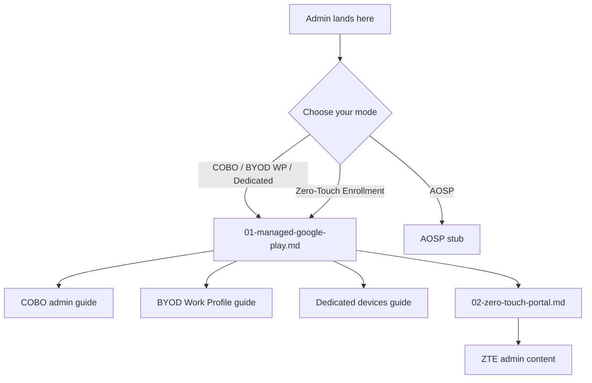

# Phase 35: Code Review Report

**Reviewed:** 2026-04-21
**Depth:** standard
**Files Reviewed:** 5
**Status:** issues_found

## Summary

Reviewed the five Phase 35 Android Enterprise documentation deliverables: one concept-only prerequisites orientation (`01-android-prerequisites.md`), one version-matrix reference (`03-android-version-matrix.md`), and three admin setup guides (`00-overview.md`, `01-managed-google-play.md`, `02-zero-touch-portal.md`). All files pass factual-accuracy checks against the Phase 35 RESEARCH findings — the critical no-90-day-GMS-token guard, Entra-preferred-since-August-2024 account-type policy, CloudDPC signature checksum, ZT portal URL, and signupwithoutgmail path are all documented correctly. Cross-references to the `_glossary-android.md` anchors, sibling android-lifecycle files, and peer admin-setup-android files are intact. Forward references to `06-aosp-stub.md` (Phase 39 scope) are known stubs and are not flagged as broken.

Three WARNING-level issues were identified: (1) an author-facing meta-comment leaked into an admin-facing what-breaks table row, (2) a subtly stronger-than-research claim about Google requiring a minimum of two Entra owners, and (3) an internal numeric inconsistency between "1-65,535 days" and "up to ~65 years" in the MGP renewal table. Six INFO items cover frontmatter/style drift (missing `## Changelog` heading, missing changelog in the version matrix, forward references to internal phase numbers in admin-facing prose, an orphaned `#bind-mgp` anchor, and a redundant mermaid node) — none are bugs but all would improve polish before the v1.4 lock.

No security-sensitive guidance issues (portal URLs, account types, disconnect consequences) were found. The KME/ZT mutual-exclusion callout, disconnect-consequences retirement sequence, and reseller-gate prerequisite are all presented consistently.

## Warnings

### WR-01: Author meta-comment leaked into admin-facing what-breaks table

**File:** `docs/admin-setup-android/01-managed-google-play.md:100`
**Issue:** The "Recovery" column for the "Consumer Gmail used (new binding post-August 2024)" row contains the parenthetical `(text-only stub, not hyperlink)`. This is authoring/pattern-time guidance (instructing the author NOT to hyperlink the See Also stub, per D-17 subtractive-deletion pattern) that was copied verbatim from the plan into the published document. Admin readers will see this meta-commentary and be confused by it. The cell is supposed to describe what to do after the failure mode, not describe how the documentation was authored.

**Fix:** Remove the parenthetical. Rewrite the row so the Recovery cell gives an admin-actionable instruction and the See Also stub is phrased naturally:

```markdown
| Consumer Gmail used (new binding post-August 2024) | Binding succeeds; Entra-preference path not taken | All GMS modes work but future migration required per v1.4.1 | Binding continues to function; plan migration to an Entra-backed binding per v1.4.1 (See Also: binding migration for pre-August-2024 consumer Google/Gmail bindings, tracked for v1.4.1). |
```

### WR-02: "Google requires a minimum of two" owners contradicts research source

**File:** `docs/admin-setup-android/01-managed-google-play.md:26`
**Issue:** Prerequisite checklist item states: *"Two or more Entra account owners recommended (Google requires a minimum of two; the linked account cannot be changed without disconnecting)"*. This asserts a hard Google requirement of two owners. The Phase 35 RESEARCH (line 226) sources this as *"Google recommends minimum two owners for redundancy"* — a recommendation, not a requirement. The 35-03-PLAN (line 190) also uses "recommended". Asserting "requires a minimum of two" as fact could mislead admins into believing binding will fail without two owners; it will not. Also internally inconsistent (the same bullet starts with "recommended" then switches to "requires").

**Fix:** Soften the parenthetical to match the research source and internal wording:

```markdown
- [ ] **Two or more Entra account owners recommended** (Google recommends a minimum of two for redundancy; the linked account cannot be changed without disconnecting)
```

### WR-03: "1-65,535 days" and "up to ~65 years" are numerically inconsistent

**File:** `docs/admin-setup-android/01-managed-google-play.md:120`
**Issue:** The Renewal / Maintenance table row for "Enrollment profile tokens (QR / DPC identifier / COBO token)" states renewal period: *"Configurable 1-65,535 days (GMS tokens can be set up to ~65 years)"*. 65,535 days equals roughly 179 years, not 65. MS Learn sources (`setup-fully-managed`, `setup-dedicated`) phrase the maximum as "up to 65 years" (≈23,741 days). The inherited "1-65,535 days" figure from Phase 34's renewal-maintenance seed appears to be a u16-max-derived upper bound that does not reconcile with the MS Learn 65-year claim. A Pedantic admin reading this will notice they cannot both be upper bounds. Per the Phase 35 no-90-day RESEARCH resolution (D-28), the authoritative figure is the MS Learn 65-year ceiling.

**Fix:** Either (a) drop the "1-65,535 days" numeric range in favor of the MS Learn-sourced "up to 65 years in the future" wording, or (b) clarify that the 1-65,535 range is the Intune UI input field and the 65-year figure is the practical maximum. Option (a) is the cleaner alignment with research:

```markdown
| Managed Google Play binding (Entra-backed) | No expiry while Entra account remains active | New app approvals and app distribution stop; existing enrolled devices continue until token refresh fails | Re-bind via Intune admin center > Devices > Android > Managed Google Play — see this guide |
| Enrollment profile tokens (QR / DPC identifier / COBO token) | GMS token expiry configurable up to 65 years in the future (MS Learn: setup-fully-managed / setup-dedicated) | New enrollments using the token fail; existing enrolled devices unaffected | Regenerate in Intune admin center > Devices > Android > Enrollment > [profile] |
```

If option (b) is preferred (keep the u16 UI range), reconcile as: *"Configurable per token (Intune UI accepts 1-65,535 days input; GMS tokens have a practical maximum of up to 65 years per MS Learn)."*

## Info

### IN-01: Missing `## Changelog` heading above changelog table

**File:** `docs/android-lifecycle/01-android-prerequisites.md:57-60`
**Issue:** The changelog table at the end of the file is not preceded by a `## Changelog` heading. The three admin-setup-android files (`00-overview.md`, `01-managed-google-play.md`, `02-zero-touch-portal.md`) all use a `## Changelog` heading; `01-android-prerequisites.md` does not. Inconsistency with sibling Phase 35 deliverables.

**Fix:** Insert `## Changelog` immediately before the table on line 58:

```markdown
## Changelog

| Date | Change | Author |
|------|--------|--------|
| 2026-04-21 | Initial version — concept-only orientation to tri-portal surface, GMS/AOSP split, Android 12+ identifiers | -- |
```

### IN-02: No changelog at all in Android Version Matrix

**File:** `docs/android-lifecycle/03-android-version-matrix.md` (end of file)
**Issue:** `03-android-version-matrix.md` has no changelog section whatsoever (neither heading nor table). The other four Phase 35 deliverables all carry a changelog. Phase 42 audit will need version history for drift-tracking against Google/Microsoft source updates, which is the matrix's whole purpose.

**Fix:** Append a `## Changelog` section mirroring the pattern used in the other four files:

```markdown
## Changelog

| Date | Change | Author |
|------|--------|--------|
| 2026-04-21 | Initial version — mode × Intune-minimum OS matrix, Android 11/12/15 breakpoints, SafetyNet → Play Integrity (Jan 2025), AMAPI BYOD migration (Apr 2025) | -- |
```

### IN-03: Forward references to internal phase numbers in admin-facing prose

**Files:**
- `docs/android-lifecycle/01-android-prerequisites.md:31, 39`
- `docs/android-lifecycle/03-android-version-matrix.md:33, 37, 46, 74, 89, 100`
- `docs/admin-setup-android/00-overview.md:23, 30-35, 66-67, 98`
- `docs/admin-setup-android/02-zero-touch-portal.md:18, 74, 126, 135, 158`

**Issue:** Admin-facing documents repeatedly reference internal project planning phase numbers ("Phase 36", "Phase 37", "Phase 38", "Phase 39", "Phase 42", "Phase 41"). External admins reading the docs do not know what these phases are, and the references leak implementation scheduling into end-user documentation. The `v1.4.1` references are similarly internal but are at least semver-ish; "Phase 39 AOSP stub" is unambiguously project-internal.

**Fix:** Replace "Phase NN" with content-oriented descriptions. Examples:
- "see [Phase 39 AOSP stub]" → "see [AOSP admin setup guide]" (once 06-aosp-stub.md is authored)
- "Phase 36 COBO admin guide" → "the COBO admin guide"
- "(authored in Phase 39)" → "(forthcoming)" or simply delete the parenthetical

Where the target file does not yet exist, keep the forward link by filename (`06-aosp-stub.md`) but drop the "Phase 39" prefix.

### IN-04: Orphaned `#bind-mgp` anchor

**File:** `docs/admin-setup-android/01-managed-google-play.md:80`
**Issue:** `<a id="bind-mgp"></a>` is placed between Step 4 and the Verification section but is not referenced from anywhere in `docs/`. Only planning artifacts and patterns reference `#bind-mgp`. The comment on line 82-83 explicitly documents that the ZT-portal H4 was deleted per D-17 subtractive-deletion pattern; the `#bind-mgp` anchor may have been intended as a future deep-link target for Phase 36-39 admin guides to use.

**Fix:** If the anchor is reserved for Phase 36-39 deep-linking, leave it and document its reservation in a HTML comment (e.g., `<!-- #bind-mgp: reserved for Phase 36-39 deep-links into this guide -->`). Otherwise, remove the anchor since it has no referents.

### IN-05: Mermaid diagram uses two node IDs for the same target file

**File:** `docs/admin-setup-android/00-overview.md:25-36`
**Issue:** The mermaid flowchart defines `MGP[01-managed-google-play.md]` (line 28) and `MGPZTE[01-managed-google-play.md]` (line 32) as separate node IDs that render the same label. This is visually redundant — a reader sees "01-managed-google-play.md" appear twice in the diagram and may wonder whether they are different files. A single shared node with two incoming edges would be cleaner.

**Fix:** Collapse the two nodes:



(The ZTE branch should still show the extra ZT step; the key change is that `MGP` appears once.)

### IN-06: Shared prerequisites duplicated across per-path lists

**File:** `docs/admin-setup-android/00-overview.md:46-74`
**Issue:** "Microsoft Intune Plan 1 (or higher) subscription" and "Intune Administrator role" appear both in the per-path prerequisite blocks (GMS-Path, ZTE-Path, AOSP-Path) AND in the "Shared Prerequisites (All Paths)" block at the end. For example, `Microsoft Intune Plan 1` is listed in GMS-Path (line 53) AND in Shared Prerequisites (line 71). An admin working through the checklist may tick the same item twice and waste attention.

**Fix:** Either (a) keep only the Shared Prerequisites list and prune the duplicate entries from the per-path lists, or (b) keep only the per-path lists and delete the Shared Prerequisites section. Option (a) is structurally cleaner — the per-path lists then carry only path-specific prerequisites (MGP binding for GMS, reseller relationship for ZTE, OEM list for AOSP).

---

_Reviewed: 2026-04-21_
_Reviewer: Claude (gsd-code-reviewer)_
_Depth: standard_
