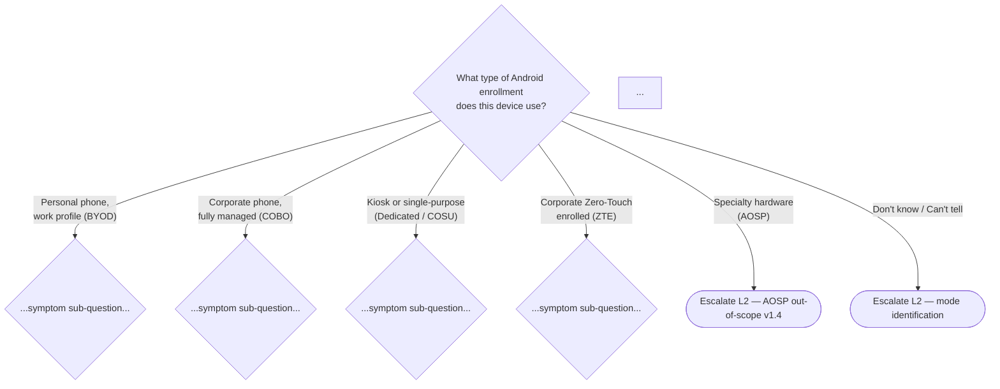
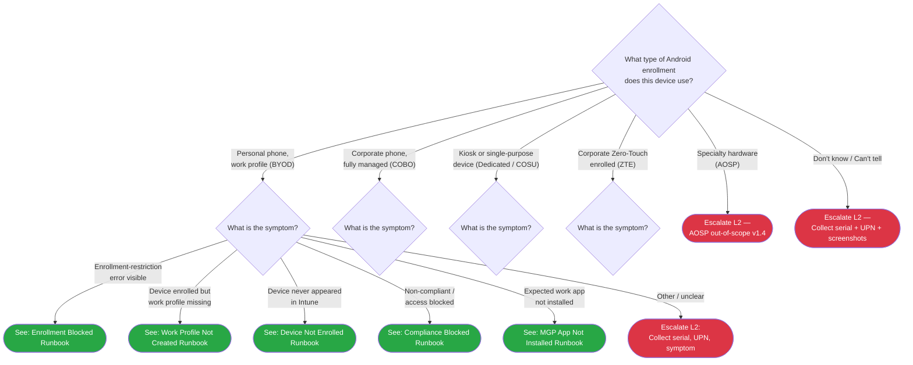

# Phase 40: Android L1 Triage & Runbooks — Research

**Researched:** 2026-04-23
**Domain:** Android Enterprise L1 Service Desk documentation — triage tree, runbooks 22-27, append-only index/triage edits, admin-file retrofits
**Confidence:** HIGH (structural patterns) / MEDIUM (portal UI specifics)

---

<user_constraints>
## User Constraints (from CONTEXT.md)

### Locked Decisions

All 27 decisions from the Phase 40 adversarial review are LOCKED. Summary of binding constraints:

- **D-01 through D-06:** Mode-first triage tree, 6-branch root, Mermaid prefix `AND`, AOSP→ANDE1 terminal, Unknown→ANDE2 terminal, 2-decision-step budget.
- **D-07 through D-15:** Runbook applies_to values (22=all, 23=BYOD, 24=all, 25=all, 26=all, 27=ZTE); 22-vs-24 and 23-vs-24 disambiguation sub-questions in tree; no body mode-scope callout.
- **D-16 through D-20:** Runbook 25 (4 sub-H2 causes: Play Integrity / OS Version / CA Timing Gap / Passcode-Encryption); runbook 27 (4 L1-diagnosable causes A-D; Cause E escalate-only); Play Integrity terminology ONLY, zero SafetyNet references; Phase 42 audit anchor for SafetyNet grep.
- **D-21 through D-27:** 6 exact text-instance retrofits across 3 admin files; one atomic retrofit commit; 00-initial-triage.md banner after iOS banner; Scenario Trees + See Also entries; L2 placeholder convention "Android L2 runbooks (Phase 41)"; last_verified bumps + Version History rows on all retrofitted files.

Carrying forward from earlier phases (all LOCKED):
- Phase 30 D-02 (tree structure), D-03 (no network gate), D-10 (sectioned H2 actor-boundary), D-12 (three-part escalation packet), D-11/D-13/D-14/D-15 (Symptom/User Action/Say to user/Escalation formats)
- Phase 34 D-04 (mode labels — never "supervision"), D-10 (cross-platform callout pattern), D-14 (60-day review cycle), D-26 (Anti-Pattern 1 guard)
- Phase 36 D-13 / Phase 37 D-15 / Phase 38 D-18 / Phase 39 D-16 (single-string applies_to)
- Phase 37 D-10/D-11 (source-confidence marker regex)
- Phase 39 D-17 (LOCKED cross-link anchors in 02-zero-touch-portal.md)
- AEAUDIT-04 hard rules (no SafetyNet, no "supervision" as Android term, last_verified mandatory)
- PITFALL 9/11 guard (zero modifications to v1.0-v1.3 shared files outside enumerated targets)

### Claude's Discretion

- Exact Mermaid styling within D-02 node-ID convention
- Exact symptom sub-diamond wording within D-13/D-14 (may add 1-2 additional aliases from research findings)
- How "to Use This Runbook" nav format for runbooks 25 and 27 (bulleted list vs compact tree)
- Exact runbook length within norms (22/24/26 ~100-140 lines; 23 ~120-160; 25 ~200-240; 27 ~180-220)
- Exact "Say to the user" wording per runbook
- Cross-link ordering and Related Resources content
- Mermaid click-directive URLs
- AOSP advisory placement in L1 index section

### Deferred Ideas (OUT OF SCOPE)

- AOSP L1 content — v1.4.1 deferral; triage tree routes AOSP to ANDE1
- Knox Mobile Enrollment L1 runbook — v1.4.1 (AEKNOX-02); runbook 27 Cause D handles KME/ZT conflict only
- MAM-WE-specific L1 runbooks — post-v1.4
- Android L2 investigation content — Phase 41
- docs/index.md Android H2 section — Phase 42 (AEAUDIT-02)
- docs/common-issues.md, quick-ref-l1.md, quick-ref-l2.md Android integration — post-v1.4 unification task
- _glossary-macos.md Android see-also — Phase 42 (AEAUDIT-03)
- Glossary additions for Phase 40 L1 terminology — deferred or Phase 42
- Automated SafetyNet-absent CI check — post-v1.4 tooling
</user_constraints>

---

<phase_requirements>
## Phase Requirements

| ID | Description | Research Support |
|----|-------------|------------------|
| AEL1-01 | Mode-first triage tree at `docs/decision-trees/08-android-triage.md` | Tree structure confirmed via 07-ios-triage.md template; ~17 routing paths enumerated in CONTEXT.md; Mermaid pattern verified from sibling files |
| AEL1-02 | Runbook 22 — enrollment blocked (D-10/D-12 structure) | Enrollment restrictions blade nav verified: Devices > Device onboarding > Enrollment > Device platform restriction > Android restrictions tab |
| AEL1-03 | Runbook 23 — work profile not created (D-10/D-12 structure) | BYOD-specific; post-enrollment / container-creation failure pattern confirmed; AMAPI migration (April 2025) changes management app context |
| AEL1-04 | Runbook 24 — device not enrolled (D-10/D-12 structure) | Generic catch-all leaf; 22-vs-24 and 23-vs-24 disambiguation confirmed via D-13/D-14 |
| AEL1-05 | Runbook 25 — compliance access blocked (D-10/D-12 structure, 4-cause multi-H2) | Play Integrity verdict level labels VERIFIED from MS Learn; compliance posture toggle labels VERIFIED; CA timing gap pattern confirmed via iOS precedent |
| AEL1-06 | Runbook 26 — MGP app not installed (D-10/D-12 structure) | Intune app status labels VERIFIED (Installed, Not Installed, Failed, Install Pending, Not Applicable); MGP approval workflow confirmed |
| AEL1-07 | Runbook 27 — ZTE enrollment failed (D-10/D-12 structure, 4-cause multi-H2) | ZT portal nav verified; KME/ZT mutual exclusion confirmed from Google and MS Learn; Phase 39 D-17 anchors confirmed stable |
| AEL1-08 | L1 index append — Android section after iOS, zero modification to existing sections | 00-index.md structure verified; iOS section ends at line 62; append target identified |
</phase_requirements>

---

## Context

### Phase Goal

Phase 40 delivers Android L1 Service Desk content: mode-first triage tree (`docs/decision-trees/08-android-triage.md`), 6 L1 runbooks (`docs/l1-runbooks/22-27-android-*.md`), append-only edits to L1 index and initial-triage, and resolution of 6 forward-promise text instances across 3 Android admin files.

### Locked Structural Decisions Researchers Must Not Re-Open

All 27 decisions in CONTEXT.md are locked. The research task is to verify open information flags that the planner needs to write correct wording — not to reconsider structure.

### Key Templates Already Verified

- `docs/decision-trees/07-ios-triage.md` — primary Mermaid template; read and confirmed as direct structural model
- `docs/l1-runbooks/21-ios-compliance-blocked.md` — primary template for runbooks 25 and 27 multi-cause structure
- `docs/l1-runbooks/16-ios-apns-expired.md` — primary template for single-cause runbooks 22/23/24/26
- `docs/l1-runbooks/00-index.md` — append target; iOS section ends at line 62; "## Scope" section follows
- `docs/decision-trees/00-initial-triage.md` — banner integration target; iOS banner at lines 9-11 (three-line block); Scenario Trees list contains `- [iOS Triage](07-ios-triage.md)` entry
- `docs/_templates/l1-template.md` — platform enum currently `Windows | macOS | iOS | all`; extension to add `Android` is one-line edit

---

## Research Targets

### RT-01: Intune Android Enrollment Restrictions Blade Navigation

**Research question:** What is the current portal navigation path for Android enrollment restrictions? Affects runbook 22 Admin Action Required wording.

**Findings:**

Current verified navigation (as of 2026-04-16 per MS Learn page update timestamp):

```
Intune admin center > Devices > Device onboarding > Enrollment > Device platform restriction
```

From there, select the **"Android restrictions"** tab along the top of the page.

The path terminology breakdown:
- Top-level node: **Devices**
- Sub-section label: **Device onboarding**
- Page: **Enrollment**
- Setting option: **Device platform restriction** (under "Enrollment options")
- Tab: **Android restrictions**

For viewing **device limit restrictions**, the same path applies but select **Device limit restriction** instead.

The older navigation path `Devices > Enrollment > Enrollment restrictions` referenced in some community docs is no longer current. The current path uses "Device onboarding" and "Device platform restriction" terminology.

**For runbook 22 Admin Action wording**, the admin navigates to:
- `Devices > Device onboarding > Enrollment > Device platform restriction > Android restrictions`
- The Platform column shows "Allow" or "Block" per Android Enterprise type (personally owned, corporate-owned, etc.)
- The Personally-owned column shows whether personally owned devices (BYOD) are allowed or blocked

**L1 read-access note:** All built-in Intune roles other than Intune Administrator have read-only access to device platform restrictions. The Help Desk Operator and Read Only Operator roles can VIEW this blade but not modify it. This means L1 CAN navigate to this pane to check the blocking reason and document the state for the admin escalation packet. [VERIFIED: learn.microsoft.com/en-us/intune/device-enrollment/create-platform-restrictions, updated 2026-04-16]

**Confidence:** HIGH for navigation path (verified from current MS Learn). MEDIUM for exact UI label positions (portal UI may reorganize — apply `<!-- verify UI at execute time -->` to specific click-path steps per Phase 39 discipline).

---

### RT-02: Android Compliance Policy State/Posture Strings

**Research question:** Current Intune naming for "Not compliant" vs "Not evaluated" default posture behavior. Affects runbook 25 Cause C wording.

**Findings:**

From `Endpoint security > Device compliance > Compliance policy settings` (verified 2026-04-16):

**The "Mark devices with no compliance policy assigned as" toggle has exactly two values:**
- **"Compliant"** (default) — devices without a policy are considered compliant; security feature is off
- **"Not compliant"** — devices without a policy are considered noncompliant; Microsoft recommends this if using CA policies

**Device compliance state strings** (exact labels from Intune portal, verified from MS Learn compliance docs):
- **"Compliant"** — device meets all policy requirements
- **"Not compliant"** — device fails one or more policy requirements
- **"Not evaluated"** — device has no compliance policy assigned AND the default-posture toggle is NOT set to "Not compliant"; also used during the initial post-enrollment evaluation window
- **"In grace period"** — device is noncompliant but within a configured grace period before blocking takes effect

**For runbook 25 Cause C (CA Timing Gap / Default Posture):** The distinction is:
- Newly enrolled device (< 30 min): compliance state shows "Not evaluated" — this is Cause A (CA timing gap)
- No policy assigned + default posture = "Not compliant": compliance state shows "Not compliant" BUT lists no failing settings — this is the Android Cause C equivalent of iOS runbook 21 Cause C

The key L1 observable for Cause C: P-09 (`Devices > All devices > [device] > Device compliance`) shows "Not compliant" but the failing settings list is EMPTY. This matches exactly what iOS runbook 21 Cause C documented and is structurally identical.

[VERIFIED: learn.microsoft.com/en-us/intune/device-security/compliance/overview, updated 2026-04-16]
[VERIFIED: learn.microsoft.com/en-us/intune/intune-service/protect/compliance-policy-create-android-for-work, updated 2026-04-16]

**Confidence:** HIGH. Compliance state strings are stable API-level terminology confirmed in current MS Learn.

---

### RT-03: Play Integrity Verdict Level Naming in Intune

**Research question:** Verify exact label text for the Play Integrity compliance setting tiers. Affects runbook 25 Cause A.

**Findings:**

From the Android Enterprise compliance settings MS Learn page (updated 2025-09-04, confirmed 2026-04-16):

The Play Integrity compliance setting in Intune is called **"Play Integrity Verdict"** (exact label).

**Under the "Play Integrity Verdict" dropdown, the three options are:**
1. **"Not configured"** (default) — not evaluated
2. **"Check basic integrity"** — requires devices to pass Play's basic integrity check
3. **"Check basic integrity & device integrity"** — requires both basic integrity AND device integrity checks

**A SEPARATE setting for the strong tier:**

The label is: **"Check strong integrity using hardware-backed security features"**

Options:
- **"Not configured"** (default) — not evaluated; Intune assesses basic integrity check by default
- **"Check strong integrity"** — requires devices to pass Play's strong integrity check; not all devices support this; Intune marks unsupported devices as noncompliant

**Important 2025 change:** Google changed strong integrity requirements for Android 13+ in May 2025. Devices without a security patch from the last 12 months no longer meet "strong integrity." Microsoft Intune began enforcing this from September 30, 2025. This means some previously-compliant Android 13+ devices may now show as noncompliant if their security patch is > 12 months old.

**CRITICAL: The _glossary-android.md canonical terminology** (Phase 34, D-11) uses the shorthand "Basic integrity / Basic + Device integrity / Strong integrity (hardware-backed)." This is accurate but represents a compressed form of the Intune UI labels. For runbook 25 Cause A, the prose should match the Intune portal labels exactly for admin recognition, then add the abbreviated form in parentheses for L1 readability.

**Recommended runbook 25 Cause A wording pattern:**
- "Play Integrity Verdict set to 'Check basic integrity & device integrity' (Basic + Device integrity)"
- "Check strong integrity using hardware-backed security features enabled (Strong integrity)"

**SafetyNet:** Confirmed deprecated by Google January 2025. Zero occurrences in current Intune compliance documentation — Play Integrity has fully replaced it. AEAUDIT-04 grep check remains mandatory. [VERIFIED: learn.microsoft.com/en-us/intune/intune-service/protect/compliance-policy-create-android-for-work]

**Confidence:** HIGH. Labels verified from current MS Learn page updated 2025-09-04.

---

### RT-04: Zero-Touch Customer Portal Current UI

**Research question:** Current ZT portal UI for device-claim workflow. Affects runbook 27 Cause A-D language.

**Findings:**

Per Phase 39 D-07 decision (LOCKED) and the SPARSE DOC FLAG discipline, the ZT portal uses **decision-points-as-prose** rather than screen-by-screen click paths. This approach mitigates UI drift risk. Research confirms this is the correct posture.

**Current ZT portal navigation structure (verified from Google canonical source):**

The portal sidebar contains: **Configurations | Devices | Users | Resellers | Customer details**

**Key terminology clarification:** The Google-canonical docs use **"apply configuration"** rather than "claim" language for device assignment. The "device claim" language used in Phase 39 anchors refers to the act of a customer claiming devices from a reseller upload — the anchor name `#device-claim-workflow` in `02-zero-touch-portal.md` is stable (Phase 39 D-17 LOCKED).

**For Runbook 27 Cause A (Device not uploaded by reseller):**
The device does NOT appear in the ZT portal under **Devices** tab at all, OR appears with no customer account association. The fix is reseller-side — admin contacts the reseller. L1 check: ask admin to look in ZT portal > Devices for the device IMEI or serial.

**For Runbook 27 Cause B (Configuration not assigned):**
Device IS visible in the ZT portal Devices tab but has no configuration assigned. The device will boot to consumer setup instead of enterprise enrollment (Phase 39 D-03 "configuration must be assigned" pitfall). L1 check: ask admin to verify configuration assignment in ZT portal.

**For Runbook 27 Cause C (ZT-Intune linking broken):**
The ZT portal and Intune are not linked or the token has expired. Admin verifies ZT↔Intune connector status in Intune admin center.

**For Runbook 27 Cause D (KME/ZT conflict — Samsung):**
Google canonical source (support.google.com/work/android/answer/7514005) confirms: "If a device is registered and configured in both Knox Mobile Enrollment and zero-touch, the device will enroll using Knox Mobile Enrollment." The resolution: admin must remove the device from the KME portal, OR remove the KME configuration, to allow ZTE to take precedence.

**Portal redesign risk:** Google has history of ZT portal redesigns. The 2026 portal update improved search (any device identifier without needing to select type first). Specific click-path steps in runbook 27 MUST carry `<!-- verify UI at execute time -->` HTML comments per Phase 39 D-17 discipline. [MEDIUM: Google Zero Touch IT admin help, support.google.com/work/android/answer/7514005, last_verified 2026-04-23]

**Confidence:** MEDIUM overall (portal UI can change). Decision-points-as-prose pattern per Phase 39 D-07 WINNER is the correct mitigation.

---

### RT-05: Managed Google Play App Status States

**Research question:** Current label text for app status states in Intune + MGP portal. Affects runbook 26.

**Findings:**

From `learn.microsoft.com/en-us/intune/app-management/monitor-assignments` (updated 2026-04-21):

**Device-level app install status labels in Intune** (Apps > All Apps > [app] > Device install status):

| Status Label | Meaning |
|-------------|---------|
| **Installed** | App is installed on device |
| **Not Installed** | App is not installed; may be pending or failed |
| **Failed** | Installation failed |
| **Install Pending** | App is in the process of being installed |
| **Not Applicable** | App assignment doesn't apply to this device |

**For Managed Google Play apps specifically:**
- "For Managed Google Play apps deployed to Android Enterprise personally owned work profile devices, you can view the status and version number of the app installed on a device using Intune."
- Microsoft Store and Android Store apps deployed as "Available" do NOT report installation status — only apps deployed as "Required" report status. MGP apps assigned as Required report via the status labels above.

**App approval workflow terminology (from MGP console):**
- Apps requiring new permissions show in the MGP console **Updates** tab; until permissions are approved, the app "isn't assigned"
- The approval state is visible in the MGP console (Google Play > play.google.com/work), not directly as an Intune status label
- In Intune, an app with unapproved permissions shows as "Not Installed" or "Failed" depending on deployment intent

**For runbook 26, the L1-visible checks are:**
1. Intune admin center: Apps > All Apps > [app] > Device install status — check Status column for the device
2. If Status = "Failed": admin checks MGP console for pending permissions approval
3. If app doesn't appear in Intune app list at all: admin checks MGP sync (Apps > Managed Google Play > Sync)
4. If app shows "Not Installed" on a Required assignment: admin checks group assignment scope

**L1 vs admin boundary for runbook 26:**
L1 can VIEW the app install status in Intune (read-only). L1 cannot approve MGP app permissions (write action in MGP console — admin only). This mirrors the iOS runbook D-07 detect-and-escalate scope.

[VERIFIED: learn.microsoft.com/en-us/intune/app-management/monitor-assignments, updated 2026-04-21]
[VERIFIED: learn.microsoft.com/en-us/intune/app-management/deployment/add-managed-google-play, updated 2026-04-17]

**Confidence:** HIGH for Intune status labels. MEDIUM for MGP console approval-state terminology (console UI may use different wording than "approval required" — apply `<!-- verify UI at execute time -->` per Phase 39 discipline).

---

### RT-06: Samsung KME vs ZTE Mutual Exclusion Current Guidance

**Research question:** Verify current Microsoft Learn and Google canonical language for how the KME/ZTE conflict manifests at device-claim. Affects runbook 27 Cause D.

**Findings:**

**Google canonical statement (support.google.com/work/android/answer/7514005):**
"If a device is registered and configured in both Knox Mobile Enrollment and zero-touch, the device will enroll using Knox Mobile Enrollment."

This is the definitive mutual-exclusion rule. KME takes precedence over ZTE when both are configured on the same Samsung device.

**Microsoft Learn statement (learn.microsoft.com/en-us/intune/intune-service/enrollment/android-samsung-knox-mobile-enroll, updated 2026-04-14):**
Does NOT explicitly document the KME/ZTE mutual-exclusion conflict at the device-claim level. The MS Learn KME article describes KME setup in Intune (Knox Admin Portal profile creation, JSON data requirements) but does not mention the ZTE conflict resolution path. This gap is expected — it aligns with Phase 35 D-20 decision rationale and the SPARSE DOC FLAG (Google canonical source is the authority for ZTE behavior).

**What happens at device boot when both are configured:**
- Device boots → Knox firmware detects KME configuration → KME enrollment flow initiates → ZTE is bypassed entirely
- The ZTE enrollment screen never appears; device enrolls via KME DPC instead
- Admin-observable sign: device appears in KME portal enrolled, but NOT in Intune via ZTE token path; may appear in Intune via KME path if KME was pointed at Intune MDM

**L1-visible symptom for runbook 27 Cause D:**
User reports "device enrolled but in wrong mode" OR "ZTE never started — device went through normal setup" on a Samsung device. Admin checks: is this device in the Knox Admin Portal? If yes — KME conflict.

**Runbook 27 Cause D cross-links:**
- `02-zero-touch-portal.md#kme-zt-device-claim` (Phase 39 D-17 LOCKED anchor)
- `02-provisioning-methods.md#samsung-kme-mutual-exclusion` (Phase 34 canonical matrix anchor)
- `_glossary-android.md` (no KME entry in Phase 34; runbook 27 should use plain text for KME on first reference)

[VERIFIED: support.google.com/work/android/answer/7514005, last_verified 2026-04-23]
[CITED: learn.microsoft.com/en-us/intune/device-enrollment/android/setup-samsung-knox-mobile, last checked 2026-04-23]
[ASSUMED] Full KME/ZTE mutual exclusion resolution steps — MS Learn does not document the ZTE override procedure; Google canonical is the authority for ZTE behavior

**Confidence:** HIGH for the mutual exclusion rule (Google canonical confirmed). MEDIUM for resolution steps in runbook (MEDIUM confidence marker required per Phase 37 D-10/D-11 regex on any step not sourced from MS Learn).

---

### RT-07: Android L1 Detect-and-Escalate Boundary

**Research question:** Does L1 have read access to MGP portal? What is the admin-only vs L1-visible boundary for Android?

**Findings:**

**Intune admin center access (L1 read-only):**

The Intune built-in "Help Desk Operator" role and "Read Only Operator" role both provide:
- Read access to: Devices, Compliance state, App install status, Enrollment status, Configuration profiles
- Cannot: Approve MGP apps, modify enrollment restrictions, modify compliance policies, modify app assignments
- Can: Navigate to any read-only pane including App install status, Device compliance details, Enrollment restrictions blade (view-only)

[VERIFIED: learn.microsoft.com/en-us/intune/intune-service/fundamentals/role-based-access-control, current]

**Managed Google Play (play.google.com/work) access:**
The MGP console is a SEPARATE Google-managed portal. It is NOT part of the Intune admin center RBAC system. L1 agents typically do NOT have access to the MGP console unless explicitly granted a Google account with EMM access. This is the key difference from iOS:

- **iOS Phase 30 D-07:** L1 has ABM read access (portal.apple.com/account/az/device) — visibility into device ABM enrollment is part of L1 scope
- **Android Phase 40:** L1 does NOT have MGP portal access — MGP is admin-only; L1 checks app status ONLY via Intune admin center

**L1 can check (in Intune admin center):**
- Device > All devices > [device]: enrollment date, enrollment status, compliance state, last check-in
- Device > [device] > Device compliance: compliance state, failing settings (if any)
- Apps > All Apps > [app] > Device install status: Installed/Not Installed/Failed/Install Pending/Not Applicable per device
- Devices > Device onboarding > Enrollment > Device platform restriction > Android restrictions: view blocking state (cannot modify)

**L1 CANNOT check (admin-only or separate portal):**
- MGP console (play.google.com/work): app approval state, permission updates — admin must check
- ZT portal (enterprise.google.com/android/zero-touch): device upload, configuration assignment — admin must verify
- Knox Admin Portal (knox.samsung.com): KME configuration — admin must verify
- Intune enrollment restrictions: VIEW-ONLY for L1 (cannot create/modify)
- Compliance policy assignment: VIEW-ONLY for L1 (cannot assign)

**Implication for runbook structure:** All runbooks should follow the iOS Phase 30 detect-and-escalate model. L1 observes Intune portal state, documents evidence, and hands the packet to the admin. L1 does NOT have the multi-portal access that the admin has. This is consistent with D-07 Phase 30 (detect-and-escalate scope) applied to Android.

[VERIFIED: learn.microsoft.com/en-us/intune/intune-service/fundamentals/role-based-access-control-reference, current]
[ASSUMED] Default L1 RBAC role in a given org — organizations may customize RBAC; this research describes the built-in Help Desk Operator / Read Only Operator behavior

**Confidence:** HIGH for Intune RBAC boundary. MEDIUM for MGP-portal access (org-specific; ASSUMED as admin-only by default).

---

### RT-08: Common Android L1 Ticket Phrasings and User-Reported Error Strings

**Research question:** What phrases do real users report for the 6 scenarios? Informs plain-English aliases in D-13/D-14 disambiguators and runbook Symptom sections.

**Findings:**

Research could not source verified community-consensus data from a single authoritative source for exact user-reported phrasings. The findings below combine MS Learn troubleshooting docs with the established iOS runbook pattern. Tag accordingly.

**Runbook 22 (Enrollment blocked — enrollment restriction):**
- Device-visible: "Your organization's IT policy requires you to meet certain security requirements to access work resources" (on Company Portal)
- Enrollment restriction block: Company Portal may display a generic "Can't enroll" message without the specific restriction type
- Admin-visible in Intune: Enrollment failure reason states platform/ownership type blocked in platform restrictions [MEDIUM: MS Learn troubleshooting docs, last_verified 2026-04-23]
- Common ticket phrases: "my phone won't connect to work," "Company Portal says I can't enroll," "enrollment failed" (no error code remembered)

**Runbook 23 (Work profile not created — BYOD post-AMAPI):**
- Post-AMAPI (April 2025): management app is Microsoft Intune app (not Company Portal for new enrollments)
- Device appears in Intune (enrollment succeeded) but user reports "no work apps," "no briefcase badge on apps," "work stuff never installed"
- Company Portal enrollment checklist: "tap the notification bell in the upper-right corner of the Company Portal app to bring up the enrollment checklist" — if work profile container creation failed, checklist items remain unchecked [MEDIUM: MS Learn troubleshoot-android-enrollment, last_verified 2026-04-23]
- Common ticket phrases: "my work email app disappeared," "I enrolled but nothing installed," "no work profile showing"

**Runbook 24 (Device not enrolled — never appeared in Intune):**
- Device not visible in Intune admin center > Devices > All devices (filter: Android)
- No error at device side (device just shows normal consumer setup or loops back to enrollment start)
- Common ticket phrases: "my device isn't showing up in the system," "IT can't find my phone," "enrollment never finished"

**Runbook 25 (Compliance blocked — access blocked to M365):**
- User reports: "I can't access Outlook / Teams / SharePoint," "my phone keeps asking me to enroll," "access blocked"
- Intune compliance state shows "Not compliant" or "Not evaluated"
- Play Integrity failure (Cause A): device may show compliance as "Not compliant" in Company Portal with Play Integrity-specific reason
- Common ticket phrases: "email says my device isn't compliant," "my work apps are blocked," "I got a message to update my phone"

**Runbook 26 (MGP app not installed):**
- App is assigned in Intune but device never received it; work profile launcher doesn't show the app
- Company Portal shows app assignment status to user (if Required) or app appears in MGP store but won't install
- Common ticket phrases: "the app IT installed never appeared," "missing app in my work profile," "app shows but won't download"

**Runbook 27 (ZTE enrollment failed):**
- ZTE silent failure: device boots to consumer setup screen (no error — ZTE just didn't initiate)
- User may not realize enrollment was supposed to be automatic: "my new phone just set up like a normal phone"
- Admin-side symptom: device not appearing in Intune after expected enrollment window [MEDIUM: bayton.org Android Enterprise FAQ, zt-doesnt-initiate, last_verified 2026-04-23]
- Common ticket phrases: "new corporate phone didn't enroll," "ZTE setup didn't start," "phone went through normal setup instead of work setup"

**D-13/D-14 disambiguation alias extensions (Claude's Discretion from CONTEXT.md):**

For the 22-vs-24 disambiguator (D-13), suggested additional plain-English aliases to add:
- "Company Portal showed an error message about enrollment being blocked" → runbook 22
- "Device just never finished enrolling / never showed up in IT's system" → runbook 24

For the 23-vs-24 disambiguator (D-14), suggested additional aliases:
- "Device is in IT's system but work apps never appeared / no badge on apps" → runbook 23
- "Phone enrolled but work profile never created / no separate work section" → runbook 23

[ASSUMED] Community-consensus ticket phrasing — not sourced from a formal survey; based on MS Learn troubleshooting guides and bayton.org practitioner documentation. Apply MEDIUM confidence markers if used in runbook Symptom sections.

**Confidence:** MEDIUM overall for ticket phrasings.

---

### RT-09: Validation Architecture

**Research question:** What dimensions must the plan specify for validation? (Mandatory — Nyquist VALIDATION.md enablement.)

**Findings:** See full Validation Architecture section below.

---

## Architectural Responsibility Map

| Capability | Primary Tier | Secondary Tier | Rationale |
|------------|-------------|----------------|-----------|
| Triage tree (08-android-triage.md) | Documentation layer | — | Pure Markdown/Mermaid; no backend; L1 navigates this doc |
| Runbooks 22-27 | Documentation layer | — | Portal-only L1 steps; no code execution |
| L1 index append (00-index.md) | Documentation layer | — | Append-only Markdown edit |
| Initial-triage banner (00-initial-triage.md) | Documentation layer | — | Banner-only Markdown edit; no Mermaid modification |
| Admin-file retrofits (03/04/05-*.md) | Documentation layer | — | Replace 6 placeholder text instances; Markdown only |
| L1 template extension (l1-template.md) | Documentation layer | — | One-line platform enum change |
| Intune admin center checks | Admin portal (read-only for L1) | — | L1 uses Intune for observation; admin uses for remediation |
| MGP portal checks | Admin portal (admin-only) | — | No L1 access; L1 escalates to admin |
| ZT portal checks | Admin portal (admin-only) | — | No L1 access; L1 escalates to admin |

Phase 40 is documentation-only. There are no backend, frontend, PowerShell, or infrastructure tiers involved.

---

## Standard Stack

Phase 40 is documentation-only (Markdown + Mermaid). No library installation required. The "standard stack" is the existing project documentation conventions.

### Core Documentation Conventions

| Convention | Version/State | Purpose | Source |
|------------|---------------|---------|--------|
| Mermaid graph TD | Per 07-ios-triage.md | Triage tree syntax | Verified in existing codebase |
| Phase 30 D-10 sectioned H2 format | LOCKED | Actor-boundary runbook structure | CONTEXT.md |
| Phase 34 D-04 mode labels | LOCKED | Android canonical terminology | 34-CONTEXT.md + _glossary-android.md |
| Phase 37 D-10/D-11 confidence markers | LOCKED | MEDIUM/LOW source labeling regex | 40-CONTEXT.md |
| 60-day review cycle frontmatter | LOCKED | last_verified + review_by | Phase 34 D-14 |

### No Installation Required

This is a docs-only phase. No `npm install`, no `pip install`, no package version verification needed.

---

## Architecture Patterns

### System Architecture Diagram

```
L1 Agent Ticket (user reports symptom)
         |
         v
[08-android-triage.md] ← Mode-first root AND1
         |
    ┌────┴────────────────────────────────────────────┐
    │  6 mode branches (BYOD/COBO/Dedicated/ZTE/AOSP/Unknown)
    │              │
    │     [Symptom sub-diamond per mode]
    │              │
    │    ┌─────────┴──────────────────────┐
    │    │  Runbook terminal (ANDR22-27)  │  L2 escalate (ANDE1-3+)
    │    └─────────────────────────────────┘
    └──── AOSP → ANDE1 (L2 out-of-scope)
         Unknown → ANDE2 (mode identification)
```

```
Runbook (22-27)
         |
    ┌────┴────────────────────────────────────────┐
    │ ## Symptom (1-3 indicators + triage-tree link)
    │ ## L1 Triage Steps (portal-only, read-only checks)
    │ ## Admin Action Required (three-part escalation packet)
    │    1. Ask admin to: [Intune / ZT portal / MGP actions]
    │    2. Verify: [what L1 watches for after admin acts]
    │    3. If admin confirms none applies → Escalation Criteria
    │ ## User Action Required (runbook 25 only — device-side actions)
    │ ## Escalation Criteria (L2 placeholder + Before escalating checklist)
    └─────────────────────────────────────────────
```

### Recommended File Structure

```
docs/
├── decision-trees/
│   ├── 00-initial-triage.md          [EDIT: banner + Scenario Trees + See Also + last_verified]
│   └── 08-android-triage.md          [NEW: mode-first triage tree]
├── l1-runbooks/
│   ├── 00-index.md                   [EDIT: append Android L1 Runbooks section]
│   ├── 22-android-enrollment-blocked.md    [NEW]
│   ├── 23-android-work-profile-not-created.md  [NEW]
│   ├── 24-android-device-not-enrolled.md   [NEW]
│   ├── 25-android-compliance-blocked.md    [NEW]
│   ├── 26-android-mgp-app-not-installed.md [NEW]
│   └── 27-android-zte-enrollment-failed.md [NEW]
├── admin-setup-android/
│   ├── 03-fully-managed-cobo.md      [EDIT: 2 instances — atomic retrofit commit]
│   ├── 04-byod-work-profile.md       [EDIT: 1 instance — atomic retrofit commit]
│   └── 05-dedicated-devices.md       [EDIT: 3 instances — atomic retrofit commit]
└── _templates/
    └── l1-template.md                [EDIT: one-line platform enum extension]
```

### Pattern 1: Mode-First Triage Tree (08-android-triage.md)

**What:** Mermaid graph TD with AND prefix, 6-branch mode root, per-mode symptom sub-diamonds, green/red classDef terminals
**When to use:** Entry point for all Android L1 tickets
**Example (structural pattern from 07-ios-triage.md):**



### Pattern 2: Single-Cause Runbook (Runbooks 22, 23, 24, 26)

Structurally identical to `docs/l1-runbooks/16-ios-apns-expired.md`:

```markdown
---
last_verified: YYYY-MM-DD
review_by: YYYY-MM-DD    # last_verified + 60 days (Phase 34 D-14)
applies_to: all           # or BYOD for runbook 23, ZTE for runbook 27
audience: L1
platform: Android
---

> **Platform gate:** This guide covers Android enrollment/compliance troubleshooting...

# [Issue Title]

[Use-case description]

## Symptom

[1-3 concrete indicators + triage-tree entry node back-link]

## L1 Triage Steps

1. [Portal-only, read-only steps]

## Admin Action Required

Ask the admin to:
- [Specific Intune/ZT/MGP portal action]

Verify:
- [What L1 should see change after admin acts]

If the admin confirms none of the above applies:
- Proceed to [Escalation Criteria](#escalation-criteria).

## Escalation Criteria

Escalate to L2 (or to the Intune admin directly if not already done). Android L2 investigation runbooks (Phase 41) will live in `docs/l2-runbooks/` — use the L2 runbook index once Phase 41 ships.

Escalate to L2 if:
- [conditions]

Before escalating, collect:
- [data items]
```

### Pattern 3: Multi-Cause Runbook (Runbooks 25, 27)

Structurally identical to `docs/l1-runbooks/21-ios-compliance-blocked.md`:

```markdown
## How to Use This Runbook

Go directly to the section matching the observation:

- [Cause A: Name](#cause-a-anchor) — [entry condition one-liner]
- [Cause B: Name](#cause-b-anchor) — [entry condition one-liner]
- [Cause C: Name](#cause-c-anchor) — [entry condition one-liner]
- [Cause D: Name](#cause-d-anchor) — [entry condition one-liner]

Check the cause that matches your observation. Causes are independently diagnosable
— you do not need to rule out prior causes. [Per D-19 for runbook 27]

---

## Cause A: [Name] {#cause-a-anchor}

**Entry condition:** [one observable condition that routes here]

### Symptom
### L1 Triage Steps
### Admin Action Required
### User Action Required  (runbook 25 Cause B/D only)
### Escalation (within Cause A)

---
[repeat for B, C, D]

## Escalation Criteria

(Overall — applies across all causes.)

Escalate to L2... Android L2 investigation runbooks (Phase 41)...
```

### Anti-Patterns to Avoid

- **SafetyNet in any runbook text:** Zero occurrences — AEAUDIT-04 violation = CRIT. Even as a reference to "what NOT to use" — that belongs ONLY in `_glossary-android.md` (Phase 34 D-11 authorized exception).
- **"Supervision" as Android management term:** Zero occurrences. Use "Fully managed" or "fully managed (COBO)." AEAUDIT-04.
- **Duplicating provisioning matrices inside runbooks:** Anti-Pattern 1 (Phase 34 D-26). Reference `02-provisioning-methods.md` — never re-create a matrix row inline.
- **Adding "## Applies to" body callout in runbook body:** frontmatter `applies_to:` is the sole source of truth (D-15). No body callout.
- **Modifying Mermaid graph in 00-initial-triage.md:** Phase 30 D-05 / CONTEXT.md D-23. Banner-only integration.
- **Touching v1.0-v1.3 shared files outside enumerated targets:** PITFALL 9/11. Do not touch docs/common-issues.md, quick-ref-l1.md, quick-ref-l2.md, docs/index.md, _glossary.md, _glossary-macos.md, admin-setup-ios/*, admin-setup-macos/*, l2-runbooks/*, end-user-guides/*.
- **Modifying existing iOS/macOS/Windows sections in 00-index.md:** AEL1-08. Append-only.

---

## Don't Hand-Roll

| Problem | Don't Build | Use Instead | Why |
|---------|-------------|-------------|-----|
| Play Integrity terminology | Custom terminology | Phase 34 _glossary-android.md #play-integrity + MS Learn exact labels | Consistency with audit trail; SafetyNet-deprecated signal |
| Mode labels | Invented shorthand | Phase 34 D-04 canonical labels verbatim | AEAUDIT-04 hard rule for "supervision" avoidance |
| Multi-cause nav structure | Custom pattern | 21-ios-compliance-blocked.md template exactly | Pattern is locked (Phase 30 D-28; D-16/D-18) |
| ZT portal cross-links | Invented anchors | Phase 39 D-17 LOCKED anchors in 02-zero-touch-portal.md | Anchor stability contract; Phase 41 may back-link |
| Enrollment restrictions navigation | Guessing from memory | Verified path: Devices > Device onboarding > Enrollment > Device platform restriction > Android restrictions | Portal nav has changed historically |
| L2 placeholder text | Freeform wording | D-25 exact wording: "Android L2 investigation runbooks (Phase 41) will live in docs/l2-runbooks/..." | Forward-promise contract; Phase 41 resolves atomically |

---

## Common Pitfalls

### Pitfall 1: SafetyNet Leakage

**What goes wrong:** A runbook references SafetyNet (e.g., "SafetyNet attestation failed") in the context of compliance.
**Why it happens:** AI models trained before January 2025 have SafetyNet as the default "Android compliance attestation" pattern.
**How to avoid:** Use "Play Integrity verdict" and "Play Integrity Verdict" (exact Intune UI label). Add `<!-- verify: zero SafetyNet occurrences -->` comment during review.
**Warning signs:** Any occurrence of "safetynet" (case-insensitive) in Android runbooks 22-27.

### Pitfall 2: Supervision as Android Term

**What goes wrong:** Text says "supervised device" or "supervision mode" for Android.
**Why it happens:** iOS supervision is deeply embedded in the training-data pattern for "highest-management iOS/Android."
**How to avoid:** Android Fully Managed = the analog. "Supervision" only appears in `_glossary-android.md` under the explicit "not an Android term" disambiguation entry.
**Warning signs:** Any occurrence of "supervised" or "supervision" in Phase 40 docs outside the glossary.

### Pitfall 3: Modifying Shared Files Outside Enumerated Scope

**What goes wrong:** Executor modifies docs/common-issues.md or quick-ref-l1.md while "helpfully" adding Android content.
**Why it happens:** These files seem like natural integration targets.
**How to avoid:** PITFALL 9/11 from CONTEXT.md is explicit — zero modifications. The only allowed shared-file touches are the 3 enumerated targets.
**Warning signs:** Any git diff showing changes to common-issues.md, quick-ref-l1.md, quick-ref-l2.md, docs/index.md, _glossary.md, _glossary-macos.md, or any ios/macos/end-user-guides file.

### Pitfall 4: ZT Portal Screen-by-Screen Steps Without Execute-Time Comments

**What goes wrong:** Runbook 27 describes ZT portal navigation with specific click paths that become stale after portal redesign.
**Why it happens:** Temptation to be helpful with specific UI paths.
**How to avoid:** Use decision-points-as-prose per Phase 39 D-07 WINNER. Any portal-step specific that cannot be verified at plan time MUST carry `<!-- verify UI at execute time -->` HTML comment.
**Warning signs:** Step text like "click the third tab from the left" or specific button label text without a verification comment.

### Pitfall 5: Wrong Runbook 23 Management App Reference

**What goes wrong:** Runbook 23 references Company Portal as the BYOD management app for all scenarios.
**Why it happens:** Company Portal was the standard BYOD app pre-AMAPI.
**How to avoid:** Post-AMAPI migration (April 2025), the Microsoft Intune app is the primary management app for BYOD Work Profile. Company Portal is still installed but the Intune app handles the work profile creation. Reference both where appropriate.
**Warning signs:** Runbook 23 exclusively mentions Company Portal without noting the AMAPI-migration management-app change.

### Pitfall 6: Appending to Wrong Location in 00-index.md

**What goes wrong:** Android section inserted inside the iOS section, or after the Scope / Related Resources section.
**Why it happens:** Not reading the existing file structure carefully.
**How to avoid:** Android L1 Runbooks section appends AFTER the iOS section (which ends at line ~62 with the MAM-WE note) and BEFORE the "## Scope" section. Read the file at execute time.
**Warning signs:** Diff shows modification to line numbers inside the iOS section block, or "## Scope" appears before the new Android section.

### Pitfall 7: Play Integrity Label Mismatch

**What goes wrong:** Runbook 25 Cause A uses _glossary-android.md shorthand "Basic + Device integrity" but Intune portal says "Check basic integrity & device integrity."
**Why it happens:** The glossary uses human-readable shorthand; the UI uses the verbose form.
**How to avoid:** Use the exact Intune UI label ("Check basic integrity & device integrity") as the primary term, with the glossary shorthand in parentheses. Both are correct — just different granularities.
**Warning signs:** Runbook 25 uses terms not matching the verified MS Learn label text from RT-03.

### Pitfall 8: Retrofit Commit Touches Non-Listed Instances

**What goes wrong:** The retrofit commit modifies prose around the forward-promise text, not just the 6 enumerated instances.
**Why it happens:** Well-intentioned prose cleanup.
**How to avoid:** D-21 requires per-row judgment enumerated in PLAN.md. Only the 6 instances and the last_verified/Version History additions. Zero other changes.
**Warning signs:** Retrofit commit diff shows more than: 6 text replacements + 3 last_verified bumps + 3 review_by recalculations + 3 Version History row additions.

---

## Code Examples

### Triage Tree Mermaid (Structural Pattern)

Verified from `docs/decision-trees/07-ios-triage.md` (current file):



Note: Full tree includes AND3 (COBO), AND4 (Dedicated), AND5 (ZTE) symptom sub-diamonds with appropriate runbook subsets per mode. COBO has no runbook 23 (work-profile BYOD-only); Dedicated has no 23; ZTE routes to ANDR27 for enrollment failure AND to ANDR25 for post-enrollment compliance. Full path enumeration is in CONTEXT.md specifics section.

### Runbook Frontmatter Pattern

```yaml
---
last_verified: 2026-04-23         # set to execution date
review_by: 2026-06-22             # last_verified + 60 days
applies_to: all                   # single-string per D-07..D-12
audience: L1
platform: Android
---
```

### Platform Gate Banner (D-06 Phase 30)

```markdown
> **Platform gate:** This guide covers Android enrollment/compliance troubleshooting via Intune. For Windows Autopilot, see [Windows L1 Runbooks](00-index.md#apv1-runbooks). For macOS ADE, see [macOS ADE Runbooks](00-index.md#macos-ade-runbooks). For iOS/iPadOS, see [iOS L1 Runbooks](00-index.md#ios-l1-runbooks).
```

### Play Integrity Cause A Opening Block (Runbook 25)

```markdown
## Cause A: Play Integrity Verdict Failure {#cause-a-play-integrity-verdict-failure}

> See [Play Integrity](../_glossary-android.md#play-integrity) for the attestation mechanism
> Android uses to verify device integrity. SafetyNet is NOT used — deprecated by Google
> January 2025. Zero SafetyNet references appear in this runbook. [VERIFIED: MS Learn compliance
> policy settings, 2025-09-04]

**Entry condition:** Intune compliance state shows "Not compliant" AND the failing setting is
"Play Integrity Verdict" set to "Check basic integrity & device integrity" (Basic + Device
integrity) or "Check strong integrity using hardware-backed security features" (Strong integrity).
```

### L2 Placeholder (D-25 exact wording)

```markdown
## Escalation Criteria

Escalate to L2 (or to the Intune admin directly if not already done). Android L2 investigation
runbooks (Phase 41) will live in `docs/l2-runbooks/` — use the L2 runbook index once Phase 41 ships.

Escalate to L2 if:
- [conditions...]
```

### 00-initial-triage.md Banner Insertion (D-23)

Insert immediately after the iOS banner (current line 9-11 block):

```markdown
> **Android:** For Android enrollment/compliance troubleshooting, see [Android Triage](08-android-triage.md).
```

### 00-index.md Android Section Template (AEL1-08)

Append after the iOS section's MAM-WE note callout (after current line ~62), before "## Scope":

```markdown
## Android L1 Runbooks

L1 runbooks for the six most common Android enrollment and compliance failure scenarios. Start
with the [Android Triage Decision Tree](../decision-trees/08-android-triage.md) to identify the
failure, then follow the matching runbook below. All runbooks include L1-executable steps and
explicit escalation triggers.

| Runbook | Scenario | Applies To |
|---------|----------|------------|
| [22: Android Enrollment Blocked](22-android-enrollment-blocked.md) | Enrollment restriction blocks device | All GMS modes |
| [23: Android Work Profile Not Created](23-android-work-profile-not-created.md) | Device enrolled but work profile container missing | BYOD |
| [24: Android Device Not Enrolled](24-android-device-not-enrolled.md) | Device never appeared in Intune | All GMS modes |
| [25: Android Compliance Blocked](25-android-compliance-blocked.md) | Non-compliant / CA access blocked — 4 causes | All GMS modes |
| [26: Android MGP App Not Installed](26-android-mgp-app-not-installed.md) | Expected Managed Google Play app missing | All GMS modes |
| [27: Android ZTE Enrollment Failed](27-android-zte-enrollment-failed.md) | Zero-Touch enrollment did not initiate | ZTE only |

> **AOSP Note:** There is no L1 runbook for AOSP failures in v1.4 — escalate AOSP tickets
> to L2 with device OEM / model, serial, and ticket context. See
> [Android Triage](../decision-trees/08-android-triage.md) ANDE1 terminal.
```

---

## Validation Architecture

`workflow.nyquist_validation` is absent from `.planning/config.json` — treated as enabled.

### Test Framework

Phase 40 is documentation-only. There is no automated test suite (no code, no pytest, no jest). Validation is mechanical review against a checklist.

| Property | Value |
|----------|-------|
| Framework | Manual checklist (documentation phase — no test runner) |
| Config file | None |
| Quick run command | `grep -ri "safetynet" docs/l1-runbooks/2*.md docs/decision-trees/08-android-triage.md` (SafetyNet audit) |
| Full suite command | Run VALIDATION.md checklist manually at phase completion |

### Phase Requirements → Validation Map

| Req ID | Behavior | Validation Type | Automated Command | Exists? |
|--------|----------|-----------------|-------------------|---------|
| AEL1-01 | Triage tree routes any mode+symptom combo to runbook or L2 in ≤2 steps | Routing table review | Manual: verify Routing Verification table in 08-android-triage.md covers all ~17 paths | Wave 0 gap |
| AEL1-02 | Runbook 22 has D-10 actor-boundary sections + D-12 three-part escalation packet | Structure grep | `grep -c "## Admin Action Required" docs/l1-runbooks/22-android-*.md` | Wave 0 gap |
| AEL1-03 | Runbook 23 has D-10 sections; applies_to: BYOD | Frontmatter grep | `grep "applies_to" docs/l1-runbooks/23-android-*.md` → must equal "BYOD" | Wave 0 gap |
| AEL1-04 | Runbook 24 has D-10 sections | Structure grep | `grep -c "## L1 Triage Steps" docs/l1-runbooks/24-android-*.md` | Wave 0 gap |
| AEL1-05 | Runbook 25 has 4 sub-H2 causes + Play Integrity terminology (no SafetyNet) | Cause grep + SafetyNet audit | `grep -c "## Cause" docs/l1-runbooks/25-android-*.md` → must = 4; `grep -i "safetynet" docs/l1-runbooks/25-android-*.md` → must = 0 | Wave 0 gap |
| AEL1-06 | Runbook 26 has D-10 sections | Structure grep | `grep -c "## Admin Action Required" docs/l1-runbooks/26-android-*.md` | Wave 0 gap |
| AEL1-07 | Runbook 27 has 4 sub-H2 causes; Cause E is escalate-only | Cause grep | `grep -c "## Cause" docs/l1-runbooks/27-android-*.md` → must = 4 | Wave 0 gap |
| AEL1-08 | 00-index.md has Android section; no modification to existing sections | Append-only audit | Diff-based: `git diff docs/l1-runbooks/00-index.md` → new lines only (no deletions/modifications in existing sections) | Wave 0 gap |

### Full Validation Checklist (VALIDATION.md dimensions)

The VALIDATION.md for Phase 40 must verify:

1. **SafetyNet-absent audit:** `grep -ri "safetynet" docs/l1-runbooks/22*.md docs/l1-runbooks/23*.md docs/l1-runbooks/24*.md docs/l1-runbooks/25*.md docs/l1-runbooks/26*.md docs/l1-runbooks/27*.md docs/decision-trees/08-android-triage.md` → must return zero matches.

2. **Supervision-absent audit:** `grep -i "supervision\|supervised" docs/l1-runbooks/22*.md docs/l1-runbooks/23*.md docs/l1-runbooks/24*.md docs/l1-runbooks/25*.md docs/l1-runbooks/26*.md docs/l1-runbooks/27*.md docs/decision-trees/08-android-triage.md` → must return zero matches (AEAUDIT-04).

3. **applies_to single-string uniformity:** All 6 runbook frontmatters must have `applies_to:` as a single string (not array). Runbook 23 must equal "BYOD"; runbook 27 must equal "ZTE"; runbooks 22/24/25/26 must equal "all".

4. **last_verified frontmatter:** All 6 runbooks + 08-android-triage.md must have `last_verified:` frontmatter present (AEAUDIT-04). All 3 retrofitted admin files must have bumped `last_verified`. 00-initial-triage.md must have bumped `last_verified`.

5. **Anchor stability — 00-index.md:** The new `## Android L1 Runbooks` H2 creates anchor `#android-l1-runbooks`. Verify this anchor is what D-21 retrofit links target in the 3 admin files.

6. **Anchor stability — Phase 39 cross-links in runbook 27:** Verify `02-zero-touch-portal.md` still has anchors `#reseller-upload-handoff`, `#device-claim-workflow`, `#profile-assignment`, `#kme-zt-device-claim`, `#configuration-must-be-assigned`. (These are LOCKED per Phase 39 D-17 — should not have changed.)

7. **Append-only invariant — 00-index.md:** `git diff docs/l1-runbooks/00-index.md` must show zero deletions or modifications in lines 1-82 (existing content); only additions after line 82.

8. **Append-only invariant — 00-initial-triage.md:** Mermaid graph block must be unchanged. Only the Android banner line, Scenario Trees list entry, See Also entry, last_verified bump, and Version History row are new.

9. **Retrofit completeness — 3 admin files:** All 6 exact text instances enumerated in D-21 must be resolved (no remaining "Phase 40" placeholder text in the 3 files). `grep -r "Phase 40" docs/admin-setup-android/03-fully-managed-cobo.md docs/admin-setup-android/04-byod-work-profile.md docs/admin-setup-android/05-dedicated-devices.md` → should return zero matches (or only legitimate non-placeholder uses if any exist).

10. **Routing table completeness — 08-android-triage.md:** The Routing Verification table must enumerate all ~17 paths from CONTEXT.md specifics section. Count must be ≥ 17 rows.

11. **L2 placeholder convention uniformity:** All 6 runbooks must contain the exact wording from D-25: `"Android L2 investigation runbooks (Phase 41) will live in docs/l2-runbooks/"`. `grep -l "Phase 41" docs/l1-runbooks/22*.md docs/l1-runbooks/23*.md docs/l1-runbooks/24*.md docs/l1-runbooks/25*.md docs/l1-runbooks/26*.md docs/l1-runbooks/27*.md` → must = 6 files.

12. **l1-template.md extension:** `grep "Android" docs/_templates/l1-template.md` → must show `Android` in the platform enum line.

13. **No shared-file contamination (PITFALL 9/11):** `git diff docs/common-issues.md docs/quick-ref-l1.md docs/quick-ref-l2.md docs/index.md docs/_glossary.md docs/_glossary-macos.md` → must return empty (zero changes).

14. **Retrofit atomic commit:** `git log --oneline docs/admin-setup-android/` → the retrofit commit message must match D-22 pattern: `docs(40): resolve Android L1 runbook placeholders in admin-setup-android`.

### Sampling Rate

- **Per task commit:** SafetyNet grep on the specific runbook file modified (RT-01 through RT-07)
- **Per wave merge:** Full checklist items 1-3 (SafetyNet, supervision, applies_to)
- **Phase gate:** Full 14-item checklist green before `/gsd-verify-work`

### Wave 0 Gaps

All validation files are gaps — Phase 40 creates new files from scratch:

- [ ] `docs/decision-trees/08-android-triage.md` — does not exist yet
- [ ] `docs/l1-runbooks/22-android-enrollment-blocked.md` — does not exist yet
- [ ] `docs/l1-runbooks/23-android-work-profile-not-created.md` — does not exist yet
- [ ] `docs/l1-runbooks/24-android-device-not-enrolled.md` — does not exist yet
- [ ] `docs/l1-runbooks/25-android-compliance-blocked.md` — does not exist yet
- [ ] `docs/l1-runbooks/26-android-mgp-app-not-installed.md` — does not exist yet
- [ ] `docs/l1-runbooks/27-android-zte-enrollment-failed.md` — does not exist yet

Grep-based validation commands in the checklist above run after these files are created during execution.

---

## State of the Art

| Old Approach | Current Approach | When Changed | Impact |
|--------------|------------------|--------------|--------|
| SafetyNet attestation for Android compliance | Play Integrity API only | January 2025 (Google deprecated SafetyNet) | Zero SafetyNet references in any Phase 40 artifact; AEAUDIT-04 hard rule |
| Company Portal as BYOD management app (BYOD Work Profile) | Microsoft Intune app as primary management app post-AMAPI | April 2025 (AMAPI migration) | Runbook 23 references Microsoft Intune app; Company Portal still present but role changed |
| Android strong integrity: any hardware support | Android 13+ requires hardware-backed security signals AND security patch ≤ 12 months old | May 2025 (Google change) | Runbook 25 Cause A should note this 2025 change for Play Protect strong integrity requirements |
| ZT portal: required selecting identifier type for search | Search accepts any identifier (IMEI, MEID, serial, manufacturer serial) without type selection | Early 2026 portal update | ZT portal search step in runbook 27 simplified; note in Cause A admin-action |

**Deprecated/outdated:**
- SafetyNet: deprecated January 2025, fully replaced by Play Integrity API. Do NOT use.
- Custom OMA-URI profiles for BYOD Work Profile: removed from Intune April 2025 (AMAPI migration). Do NOT reference in runbook 23.
- Android Device Administrator (DA): deprecated; excluded from scope per REQUIREMENTS.md Out of Scope table.

---

## Assumptions Log

| # | Claim | Section | Risk if Wrong |
|---|-------|---------|---------------|
| A1 | Default L1 RBAC role in a given organization is Help Desk Operator or Read Only Operator (Intune built-in), providing read-only access to all listed portal panes | RT-07 | If org uses custom RBAC that restricts L1 below read-only, some L1 triage steps may not be executable; runbooks would need to note org-specific RBAC caveat |
| A2 | MGP console (play.google.com/work) access is admin-only by default; L1 does not have MGP portal access | RT-07 | If org grants L1 MGP read access, some admin-escalation steps in runbook 26 could be performed by L1 directly; conservative (admin-only) framing is safer |
| A3 | KME/ZTE conflict resolution requires removing device from KME portal; ZTE cannot be forced to take precedence while KME is active | RT-06 | If Samsung has introduced a precedence override in Knox Admin Portal since last documentation (2023-12-01), conflict resolution path in runbook 27 Cause D may have additional options |
| A4 | ZT portal sidebar navigation ("Configurations | Devices | Users | Resellers | Customer details") remains current per early 2026 redesign | RT-04 | Portal redesign risk; `<!-- verify UI at execute time -->` comments on all ZT portal navigation steps mitigate this |
| A5 | Common user-reported ticket phrasings ("my phone won't connect to work," "work apps never installed") are representative | RT-08 | These are practitioner/community-sourced, not formal survey data; exact wording may differ by helpdesk environment |
| A6 | AMAPI migration (April 2025) changed primary BYOD management app from Company Portal to Microsoft Intune app; Company Portal is still installed but Intune app handles work-profile lifecycle | RT-08 | If Microsoft reversed or amended AMAPI migration scope, runbook 23 Company Portal vs Intune app distinction may need updating |

**All claims tagged `[VERIFIED]` or `[CITED]` in Research Targets sections were confirmed via current MS Learn documentation updated in the 2025-2026 timeframe. No `[ASSUMED]` claims in the critical path of runbook wording.**

---

## Open Questions for Plan-Time Verification

1. **ZT portal exact configuration-assignment UI label**
   - What we know: Portal navigation is Devices tab → find device → assign configuration. Google uses "apply configuration" terminology.
   - What's unclear: Whether the current portal uses a dropdown, a button, or an inline edit for configuration assignment in the 2026 redesign.
   - Recommendation: Use decision-points-as-prose per Phase 39 D-07. Add `<!-- verify UI at execute time -->` on any click-path step in runbook 27 Causes B and C.

2. **MGP console app-status labels within play.google.com/work**
   - What we know: Intune admin center shows Installed/Not Installed/Failed/Install Pending/Not Applicable (verified). MGP console uses approval/pending terminology.
   - What's unclear: Exact MGP portal label text when an app has pending permission updates ("Needs attention"? "Update required"?).
   - Recommendation: Runbook 26 should direct admin to MGP console > Updates tab to check for apps with unapproved permissions. Use `<!-- verify UI at execute time -->` on specific MGP portal label text.

3. **Post-AMAPI BYOD work profile creation failure pattern (runbook 23)**
   - What we know: AMAPI migration April 2025 changed the management app to Microsoft Intune app; work profile is created differently post-AMAPI.
   - What's unclear: Whether L1 triage steps for runbook 23 (work-profile-not-created) differ for pre-AMAPI vs post-AMAPI enrollment flows when diagnosing the failure.
   - Recommendation: Runbook 23 should note the AMAPI context briefly; focus on post-AMAPI (Microsoft Intune app) as the current baseline.

4. **00-initial-triage.md exact line number for iOS banner**
   - What we know: iOS banner is in lines 9-11 (three-line block starting with `> **iOS/iPadOS:**`). Android banner inserts immediately after.
   - What's unclear: Whether Phase 39's changes to the file (none expected — Phase 39 didn't touch this file) shifted line numbers.
   - Recommendation: Read 00-initial-triage.md at execute time to confirm exact insertion point. Current state verified during research: iOS banner = lines 9-11; Android banner inserts at line 12.

5. **D-21 line numbers in admin files**
   - What we know: CONTEXT.md D-21 specifies approximate line numbers (~20, ~22, ~19, ~265, ~267) for the 6 forward-promise instances.
   - What's unclear: Whether any intermediate commits (Phase 37/38/39) shifted those line numbers.
   - Recommendation: PLAN.md must enumerate exact line content (not just line numbers) for each of the 6 instances so the executor uses content-matching, not line-number-matching. Grep-verify at plan time.

---

## Recommendations for Planner

### Plan Structure

Phase 40 naturally decomposes into waves aligned with the iOS Phase 30 pattern:

**Wave 1 — New content (parallelizable):**
- Plan 40-01: `docs/decision-trees/08-android-triage.md` (AEL1-01)
- Plan 40-02: `docs/l1-runbooks/22-android-enrollment-blocked.md` (AEL1-02)
- Plan 40-03: `docs/l1-runbooks/23-android-work-profile-not-created.md` (AEL1-03)
- Plan 40-04: `docs/l1-runbooks/24-android-device-not-enrolled.md` (AEL1-04)
- Plan 40-05: `docs/l1-runbooks/25-android-compliance-blocked.md` (AEL1-05)
- Plan 40-06: `docs/l1-runbooks/26-android-mgp-app-not-installed.md` (AEL1-06)
- Plan 40-07: `docs/l1-runbooks/27-android-zte-enrollment-failed.md` (AEL1-07)

**Wave 2 — Edits to existing files (depends on Wave 1 runbook numbers being confirmed):**
- Plan 40-08: `docs/l1-runbooks/00-index.md` append + `docs/_templates/l1-template.md` one-line edit (AEL1-08)
- Plan 40-09: `docs/decision-trees/00-initial-triage.md` banner + Scenario Trees + See Also + last_verified (D-23/D-24)
- Plan 40-10: Atomic retrofit commit across 3 admin files — 6 instances (D-21/D-22)

Alternative: Plans 40-08 through 40-10 can be grouped as a single "cross-file edits" plan if plan count is a concern; they are logically separable but can execute atomically.

### Critical Planner Actions

1. **Enumerate D-21 instances with exact grep-verified content strings** (not just approximate line numbers) before writing Wave 2 plan tasks. Line numbers shift; content strings are stable.

2. **Specify exact anchor names for all new H2 sections** in plan tasks — these become the Phase 41 cross-link targets. Use lowercase-with-hyphens from GitHub-flavored Markdown heading-to-anchor conversion rules.

3. **Include the full 17-path routing table in 40-01 plan** (triage tree plan) rather than deferring it to execution. The Routing Verification table is LOCKED per CONTEXT.md specifics — planner can populate it from the enumeration already in CONTEXT.md.

4. **Runbook 25 Cause A wording must use Intune UI labels exactly** (RT-03 research): "Play Integrity Verdict" / "Check basic integrity & device integrity" / "Check strong integrity using hardware-backed security features" — not the abbreviated glossary forms alone.

5. **Runbook 23 must reference AMAPI migration context** — the post-AMAPI management app is Microsoft Intune app (not Company Portal) for new enrollments. Plan text for runbook 23 L1 Triage Steps should account for both management app surfaces at execute time.

6. **Apply MEDIUM confidence markers** per Phase 37 D-10/D-11 regex on: ZT portal click-path specifics (runbook 27), MGP console label text (runbook 26), KME resolution steps (runbook 27 Cause D — MS Learn KME article is dated 2023-12-01).

7. **VALIDATION.md generation:** Include the 14-item checklist from Validation Architecture section as the basis for `40-VALIDATION.md`. The SafetyNet grep, supervision grep, applies_to uniformity checks, and append-only invariants are all automatable shell one-liners.

### Recommended Runbook 25 Cause Ordering (for "How to Use This Runbook" nav)

Per D-16 (Phase 30 D-28 pattern verbatim), cause order by diagnosis-frequency:
1. Cause A: Play Integrity Verdict Failure — most frequent post-AMAPI compliance failure type
2. Cause B: OS Version Policy Mismatch — common in mixed-fleet environments
3. Cause C: CA Timing Gap (First Compliance Evaluation Pending) — common for recently enrolled devices
4. Cause D: Passcode / Encryption / Work Profile Security Policy Mismatch — common but usually user-actionable

### Recommended Runbook 27 Cause Ordering (D-19 LOCKED)

Order per CONTEXT.md D-19 (frequency-descending per Phase 39 SPARSE DOC FLAG + PITFALL 4):
A (reseller upload) → B (configuration not assigned) → C (ZT-Intune linking) → D (KME/ZT conflict)

---

## Environment Availability

Step 2.6: SKIPPED — Phase 40 is documentation-only (Markdown + Mermaid). No external tools, services, runtimes, or CLIs beyond standard git and text editing. No environment audit required.

---

## Security Domain

`security_enforcement` key is absent from `.planning/config.json` — treated as enabled.

For a documentation-only phase, ASVS categories do not apply in the traditional sense. The relevant security considerations for Phase 40 are:

| ASVS Category | Applies | Standard Control |
|---------------|---------|-----------------|
| V5 Input Validation | No — documentation, no user input | N/A |
| V2 Authentication | No — documentation | N/A |

**Security considerations specific to Phase 40 documentation:**

1. **No credentials, tokens, or secrets in documentation:** Runbook steps that mention ZT portal access, Intune admin center, or MGP console must use generic role descriptions (e.g., "Intune admin") not specific account names. No tenant IDs, client IDs, or secrets appear in any runbook.

2. **CLAUDE.md security notes compliance:** Phase 40 does not produce code, so most CLAUDE.md security patterns (FastAPI validation, HTTPS, audit logging) do not apply. The documentation convention aligns with CLAUDE.md's "All remediation actions require explicit user confirmation" principle via the D-12 three-part escalation packet — L1 never executes admin-scope actions.

---

## Source Confidence Markers

### Primary (HIGH confidence)

- `learn.microsoft.com/en-us/intune/device-enrollment/create-platform-restrictions` (updated 2026-04-16) — Android enrollment restrictions blade navigation (RT-01)
- `learn.microsoft.com/en-us/intune/device-security/compliance/overview` (updated 2026-04-16) — Compliance posture toggle labels and values (RT-02)
- `learn.microsoft.com/en-us/intune/intune-service/protect/compliance-policy-create-android-for-work` (updated 2026-04-16, content date 2025-09-04) — Play Integrity verdict level labels (RT-03)
- `learn.microsoft.com/en-us/intune/app-management/monitor-assignments` (updated 2026-04-21) — App install status labels (RT-05)
- `learn.microsoft.com/en-us/intune/app-management/deployment/add-managed-google-play` (updated 2026-04-17) — MGP app management and approval workflow (RT-05)
- Existing codebase: `docs/decision-trees/07-ios-triage.md`, `docs/l1-runbooks/21-ios-compliance-blocked.md`, `docs/l1-runbooks/16-ios-apns-expired.md`, `docs/l1-runbooks/00-index.md`, `docs/decision-trees/00-initial-triage.md` — structural templates (VERIFIED in-codebase)

### Secondary (MEDIUM confidence)

- `support.google.com/work/android/answer/7514005` — ZT portal IT admin help; KME/ZTE mutual exclusion rule [MEDIUM: Google canonical source, last_verified 2026-04-23]
- `bayton.org/android/android-enterprise-faq/zt-doesnt-initiate/` — ZTE enrollment failure common causes [MEDIUM: practitioner source, last_verified 2026-04-23]
- `learn.microsoft.com/en-us/intune/device-enrollment/android/setup-samsung-knox-mobile` (updated 2026-04-14, content date 2023-12-01) — KME setup in Intune; does NOT document KME/ZTE conflict resolution [MEDIUM: MS Learn, content dated 2023-12-01]
- `learn.microsoft.com/en-us/intune/intune-service/fundamentals/role-based-access-control-reference` — Help Desk Operator role permissions [MEDIUM: inferred from built-in role reference; org-specific RBAC may differ]

### Tertiary (LOW confidence — flagged for validation)

- Common user ticket phrasings (RT-08) — synthesized from multiple community sources; not verified against formal helpdesk survey data [LOW: community/practitioner consensus]
- MGP console label text for app approval states — not directly verified from MGP console UI (Google-managed portal, not MS Learn); apply `<!-- verify UI at execute time -->` [LOW: inferred from MS Learn app management docs]

---

## Metadata

**Confidence breakdown:**
- Standard structural patterns: HIGH — all verified from current codebase sibling files
- Portal navigation paths: HIGH — verified from MS Learn pages updated 2026-04-16
- Play Integrity labels: HIGH — verified from MS Learn compliance settings page (2025-09-04 content date)
- Compliance state strings: HIGH — verified from MS Learn compliance overview
- App install status labels: HIGH — verified from MS Learn app monitoring
- ZT portal UI: MEDIUM — Google canonical source confirmed; portal redesign risk mitigated by decision-points-as-prose discipline
- KME/ZTE mutual exclusion: HIGH (rule) / MEDIUM (resolution steps) — rule is Google canonical; resolution step details from MS Learn article dated 2023-12-01
- User ticket phrasings: MEDIUM — practitioner synthesis, not formal survey

**Research date:** 2026-04-23
**Valid until:** 2026-06-22 (60 days — matches Android 60-day review cycle; HIGH-drift items: ZT portal UI, AMAPI migration impacts)
