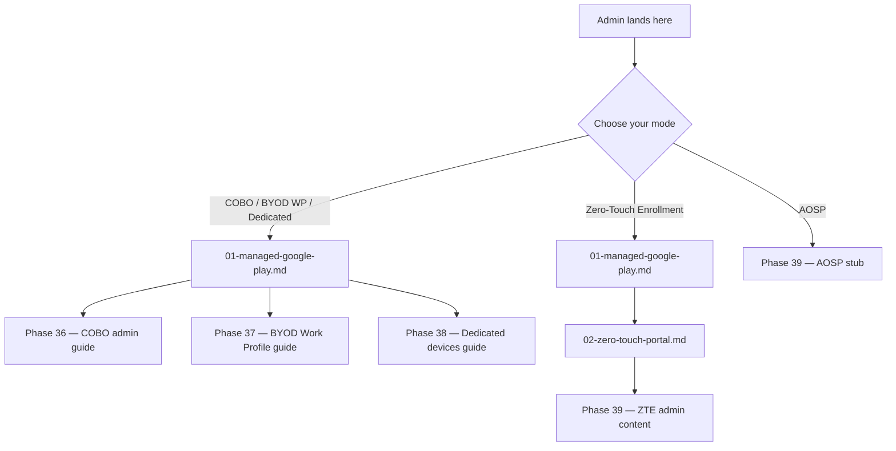

<objective>
Surgically extend `docs/admin-setup-android/00-overview.md` by adding a 6th Mermaid branch (Knox-KME Samsung-only), appending a Knox step to the Setup Sequence numbered list, and inserting a new `### KME-Path Prerequisites` H3 between the existing ZTE-Path and AOSP-Path Prerequisites H3s. Existing 5 branches, items 1-2, and other H3 prerequisite groups are preserved verbatim.

Purpose: Fulfill AEKNOX-05 — the canonical mode-router (Mermaid) and Setup Sequence list both surface the new Knox path as the 6th branch / 3rd setup step. Reader cognitive overhead is minimized by appending (not restructuring) existing content.

Output: Surgical edits to ONE existing file (`docs/admin-setup-android/00-overview.md`); no new files; bounded to 4 small additive edits + frontmatter dates.
</objective>

<execution_context>
@$HOME/.claude/get-shit-done/workflows/execute-plan.md
@$HOME/.claude/get-shit-done/templates/summary.md
</execution_context>

<context>
@.planning/phases/44-knox-mobile-enrollment/44-CONTEXT.md
@.planning/phases/44-knox-mobile-enrollment/44-RESEARCH.md
@.planning/phases/44-knox-mobile-enrollment/44-PATTERNS.md
@.planning/phases/44-knox-mobile-enrollment/44-VALIDATION.md
@docs/admin-setup-android/00-overview.md
@docs/admin-setup-android/07-knox-mobile-enrollment.md

KEY VERBATIM SOURCE-OF-TRUTH (sourced from PATTERNS.md File 5 + RESEARCH §6):

**Existing Mermaid block (verbatim — 5-branch structure to be PRESERVED + 1 line ADDED):**
```


**Phase 44 ADDS exactly ONE new line to the Mermaid block (just before the closing ` ``` ` of the mermaid fence):**
```
    CHOOSE -->|Knox - KME Samsung-only| KNOX[07-knox-mobile-enrollment.md]
```

Recommended branch label "Knox - KME Samsung-only" per CONTEXT.md Claude's Discretion. Branch terminates at the Knox admin doc directly (not via MGP — Knox Admin Portal is the 4th portal, sourced via admin doc Step N).

**Existing Setup Sequence numbered list (verbatim — items 1 and 2 preserved):**
```
1. **[Managed Google Play Binding](01-managed-google-play.md)** — Bind the Intune tenant to Managed Google Play using an Entra account. Required for all GMS modes (COBO, BYOD WP, Dedicated, ZTE). Complete before any GMS enrollment profile.

2. **[Zero-Touch Portal Configuration](02-zero-touch-portal.md)** — Configure the Zero-Touch portal account and DPC extras JSON, and link ZT to Intune. Required for ZTE only. Reseller relationship (Step 0) must be in place before this guide.
```

**Phase 44 APPENDS exactly ONE new numbered item 3 (after the existing item 2, with one blank line separator):**
```
3. **[Knox Mobile Enrollment](07-knox-mobile-enrollment.md)** — Configure Samsung Knox Admin Portal B2B account, create EMM profile pointing at Microsoft Intune, and assign profile to Samsung devices via reseller upload OR Knox Deployment App. Required for Samsung KME path only; mutually exclusive with Zero-Touch on the same Samsung device.
```

**Existing Prerequisites section H3 ordering (verbatim — preserved + 1 new H3 INSERTED between ZTE-Path and AOSP-Path):**
```
### ZTE-Path Prerequisites
... [existing body unchanged] ...

### AOSP-Path Prerequisites
... [existing body unchanged] ...
```

**Phase 44 INSERTS the following new H3 BETWEEN the closing of `### ZTE-Path Prerequisites` body and the opening of `### AOSP-Path Prerequisites` H3:**
```
### KME-Path Prerequisites

For Samsung Knox Mobile Enrollment (Samsung-only):

- [ ] **Samsung Knox B2B account** — Approval takes 1-2 business days. See [07-knox-mobile-enrollment.md#step-0-b2b-approval](07-knox-mobile-enrollment.md#step-0-b2b-approval).
- [ ] **Microsoft Intune Plan 1+** with Intune Administrator role.
- [ ] **Samsung devices** registered in Knox Admin Portal via reseller upload OR Knox Deployment App.
- [ ] **NOT also configured for Zero-Touch** on the same devices — KME and ZT are mutually exclusive on Samsung hardware.
```

**Frontmatter shift (Phase 43 D-22 metadata-only):**
- `last_verified:` shift to today's execute date YYYY-MM-DD
- `review_by:` shift to today + 60 days YYYY-MM-DD

**Forbidden changes (per PATTERNS.md File 5):**
- Do NOT alter existing Mermaid arrow connections (5 existing branches preserved verbatim; only 1 new Knox branch line added)
- Do NOT renumber existing numbered list items 1, 2 (3 is APPENDED, not inserted)
- Do NOT touch GMS-Path / ZTE-Path / AOSP-Path / Shared Prerequisites H3 bodies (only ADD new KME-Path H3 between ZTE-Path and AOSP-Path)
- Do NOT modify Portal Navigation Note H2 / See Also list / Changelog table beyond appending a Phase 44 changelog row (changelog row is at planner's discretion — recommended to add for traceability)
</context>

<tasks>

<task type="auto" tdd="false">
  <name>Task 1: Surgical edits to 00-overview.md — Mermaid 5→6 branch + Setup Sequence item 3 + KME-Path Prerequisites H3 + frontmatter dates</name>
  <files>docs/admin-setup-android/00-overview.md</files>
  <read_first>
    - .planning/phases/44-knox-mobile-enrollment/44-CONTEXT.md (AEKNOX-05 surgical-edit scope; D-discretion Mermaid branch label)
    - .planning/phases/44-knox-mobile-enrollment/44-PATTERNS.md (File 5 — verbatim copy-from-source for Mermaid line + Setup Sequence item 3 + KME-Path H3)
    - docs/admin-setup-android/00-overview.md (read FULL file to identify exact Mermaid block, Setup Sequence numbered list, and Prerequisites H3 ordering — line numbers may have shifted)
    - docs/admin-setup-android/07-knox-mobile-enrollment.md (Plan 01 output — confirms cross-link target file + #step-0-b2b-approval anchor exists)
  </read_first>
  <behavior>
    - Mermaid block has 6 branches (5 existing + 1 new Knox); existing 5 branches preserved verbatim including arrow connections and node names
    - New Mermaid line is the LAST line inside the mermaid fence (just before the closing ` ``` `)
    - Setup Sequence numbered list has item 3 appended; items 1 and 2 verbatim preserved
    - New `### KME-Path Prerequisites` H3 sits BETWEEN the existing `### ZTE-Path Prerequisites` body and the existing `### AOSP-Path Prerequisites` heading
    - Frontmatter `last_verified` and `review_by` updated
    - Optional: append changelog row noting Phase 44 changes (planner discretion; recommended)
  </behavior>
  <action>
    Use the Edit tool to make the following surgical edits to `docs/admin-setup-android/00-overview.md`:

    **Edit 1 — Frontmatter dates (Phase 43 D-22 shift):**
    Compute dates: `node -e "const d=new Date(); console.log('last_verified: '+d.toISOString().slice(0,10)); d.setDate(d.getDate()+60); console.log('review_by: '+d.toISOString().slice(0,10))"`
    - Replace existing `last_verified: <old-date>` with `last_verified: <execute-date>`
    - Replace existing `review_by: <old-date>` with `review_by: <execute-date + 60d>`

    **Edit 2 — Mermaid 6th branch (add 1 line just before mermaid fence closer):**
    Find the line `    CHOOSE -->|AOSP| AOSP_PATH[Phase 39 — AOSP stub]` (the current LAST line inside the mermaid block). Replace this single line with these TWO lines (preserve the AOSP line, add Knox line below it):
    ```
        CHOOSE -->|AOSP| AOSP_PATH[Phase 39 — AOSP stub]
        CHOOSE -->|Knox - KME Samsung-only| KNOX[07-knox-mobile-enrollment.md]
    ```
    Indentation MUST match (4 spaces). The closing ` ``` ` mermaid fence remains on its own line below.

    **Edit 3 — Setup Sequence item 3 (append after existing item 2):**
    Find the line starting `2. **[Zero-Touch Portal Configuration](02-zero-touch-portal.md)**` and locate the END of that paragraph (the next blank line OR the next H2/H3 heading). Insert the new item 3 verbatim from `<context>` after item 2's closing paragraph, separated by one blank line:
    ```
    3. **[Knox Mobile Enrollment](07-knox-mobile-enrollment.md)** — Configure Samsung Knox Admin Portal B2B account, create EMM profile pointing at Microsoft Intune, and assign profile to Samsung devices via reseller upload OR Knox Deployment App. Required for Samsung KME path only; mutually exclusive with Zero-Touch on the same Samsung device.
    ```
    If the existing list already contains an item 3 (e.g., AOSP), abort and re-read the file — but per current state (verified at PATTERNS.md File 5), only items 1 and 2 are present; item 3 is the new Knox item.

    **Edit 4 — KME-Path Prerequisites H3 (insert between ZTE-Path and AOSP-Path):**
    Find the line `### ZTE-Path Prerequisites` and read down through the body of that H3 until the next `### ` heading (which should be `### AOSP-Path Prerequisites`). Insert the new H3 + body verbatim from `<context>` immediately BEFORE the `### AOSP-Path Prerequisites` heading, separated by one blank line:
    ```
    ### KME-Path Prerequisites

    For Samsung Knox Mobile Enrollment (Samsung-only):

    - [ ] **Samsung Knox B2B account** — Approval takes 1-2 business days. See [07-knox-mobile-enrollment.md#step-0-b2b-approval](07-knox-mobile-enrollment.md#step-0-b2b-approval).
    - [ ] **Microsoft Intune Plan 1+** with Intune Administrator role.
    - [ ] **Samsung devices** registered in Knox Admin Portal via reseller upload OR Knox Deployment App.
    - [ ] **NOT also configured for Zero-Touch** on the same devices — KME and ZT are mutually exclusive on Samsung hardware.

    ```

    **Edit 5 (optional — recommended for traceability):** Append a Phase 44 changelog row to the existing Changelog table (if present at the bottom of the file). Format mirrors existing Changelog rows in sibling docs:
    ```
    | <execute-date> | Phase 44: added 6th Mermaid branch (Knox - KME Samsung-only) terminating at 07-knox-mobile-enrollment.md; appended Setup Sequence item 3; inserted KME-Path Prerequisites H3 between ZTE-Path and AOSP-Path. | -- |
    ```

    Do NOT modify any other lines: the GMS-Path, ZTE-Path, AOSP-Path, Shared Prerequisites H3 bodies must remain verbatim. Existing 5 mermaid branches must remain verbatim. Existing items 1 and 2 of Setup Sequence must remain verbatim.
  </action>
  <verify>
    <automated>grep -q "07-knox-mobile-enrollment.md" docs/admin-setup-android/00-overview.md && grep -q "Knox - KME Samsung-only" docs/admin-setup-android/00-overview.md && grep -q "KME-Path Prerequisites" docs/admin-setup-android/00-overview.md && grep -q "Setup" docs/admin-setup-android/00-overview.md && grep -qE "last_verified: 20[0-9]{2}-[0-9]{2}-[0-9]{2}" docs/admin-setup-android/00-overview.md</automated>
  </verify>
  <acceptance_criteria>
    - `grep -q "07-knox-mobile-enrollment.md" docs/admin-setup-android/00-overview.md` matches at least 3 times (Mermaid + Setup Sequence + KME-Path Prerequisites)
    - `grep -c "07-knox-mobile-enrollment.md" docs/admin-setup-android/00-overview.md` returns at least 3
    - `grep -q "Knox - KME Samsung-only"` matches (Mermaid branch label)
    - `grep -q 'KNOX\[07-knox-mobile-enrollment.md\]'` matches (Mermaid node terminal)
    - `grep -q "### KME-Path Prerequisites"` matches (new H3)
    - `grep -q "Samsung Knox B2B account"` matches (KME-Path Prerequisites body)
    - `grep -q "07-knox-mobile-enrollment.md#step-0-b2b-approval"` matches (B2B account anchor cross-link)
    - Existing 5 Mermaid branches preserved (verbatim spot-checks):
      - `grep -q 'CHOOSE -->|COBO / BYOD WP / Dedicated| MGP\[01-managed-google-play.md\]'` matches
      - `grep -q 'CHOOSE -->|Zero-Touch Enrollment| MGPZTE\[01-managed-google-play.md\]'` matches
      - `grep -q 'CHOOSE -->|AOSP| AOSP_PATH\[Phase 39 — AOSP stub\]'` matches
    - Mermaid arrow count unchanged for old branches: `grep -c 'CHOOSE -->' docs/admin-setup-android/00-overview.md` returns at least 4 (3 original CHOOSE arrows + 1 new Knox arrow; AOSP and Knox both anchor from CHOOSE)
    - Setup Sequence items 1 and 2 preserved verbatim:
      - `grep -q '1. \*\*\[Managed Google Play Binding\](01-managed-google-play.md)\*\*'` matches
      - `grep -q '2. \*\*\[Zero-Touch Portal Configuration\](02-zero-touch-portal.md)\*\*'` matches
      - `grep -q '3. \*\*\[Knox Mobile Enrollment\](07-knox-mobile-enrollment.md)\*\*'` matches (new item)
    - Existing H3 prerequisite groups preserved:
      - `grep -q '### ZTE-Path Prerequisites'` matches
      - `grep -q '### AOSP-Path Prerequisites'` matches
    - KME-Path Prerequisites H3 sits BETWEEN ZTE-Path and AOSP-Path: line number of `### KME-Path Prerequisites` > line number of `### ZTE-Path Prerequisites` AND line number of `### KME-Path Prerequisites` < line number of `### AOSP-Path Prerequisites`. Verify via:
      ```bash
      ZTE=$(grep -n '### ZTE-Path Prerequisites' docs/admin-setup-android/00-overview.md | cut -d: -f1)
      KME=$(grep -n '### KME-Path Prerequisites' docs/admin-setup-android/00-overview.md | cut -d: -f1)
      AOSP=$(grep -n '### AOSP-Path Prerequisites' docs/admin-setup-android/00-overview.md | cut -d: -f1)
      [ "$ZTE" -lt "$KME" ] && [ "$KME" -lt "$AOSP" ]
      ```
    - `grep -qE "last_verified: 20[0-9]{2}-[0-9]{2}-[0-9]{2}"` matches
    - `! grep -q "SafetyNet"` (audit C1)
    - `! grep -qE "supervis(ed|ion|or)"` (audit C2)
    - VALIDATION.md AEKNOX-05 unit-grep passes:
      ```
      grep -q "07-knox-mobile-enrollment.md" docs/admin-setup-android/00-overview.md && grep -qE "KME-Path Prerequisites|Knox Mobile Enrollment" docs/admin-setup-android/00-overview.md
      ```
    - Audit harness 8/8 PASS post-edit: `node scripts/validation/v1.4.1-milestone-audit.mjs` exits 0
  </acceptance_criteria>
  <done>Mermaid 6-branch update + Setup Sequence item 3 + KME-Path Prerequisites H3 inserted; existing content preserved verbatim; frontmatter dates shifted. All 19 acceptance criteria pass. AEKNOX-05 VALIDATION unit-grep exits 0. Audit harness 8/8 PASS.</done>
</task>

</tasks>

<threat_model>
## Trust Boundaries

| Boundary | Description |
|----------|-------------|
| Mermaid source → rendered diagram | Mermaid syntax sensitivity to whitespace/indentation; 4-space indent matches existing pattern |
| H3 ordering → reader navigation | KME-Path Prerequisites must sit BETWEEN ZTE-Path and AOSP-Path for alphabetical/scope-ordered prerequisite discovery |
| Cross-link `07-knox-mobile-enrollment.md#step-0-b2b-approval` → Plan 01 anchor | Anchor must exist in admin doc 07 (verified by Plan 01 acceptance criteria) |

## STRIDE Threat Register

| Threat ID | Category | Component | Disposition | Mitigation Plan |
|-----------|----------|-----------|-------------|-----------------|
| T-44-03 | Tampering (link-rot) | New cross-links to 07-knox-mobile-enrollment.md and #step-0-b2b-approval | mitigate | Plan 01 (Wave 1) ships admin doc with these exact anchors; this plan in Wave 3 — anchors guaranteed to exist; manual visual verification at execute time per VALIDATION.md Manual-Only check (Mermaid renders 6 branches) |
| T-44-04 | Tampering (silent drift) | Mermaid block — adding 1 line could break syntax | mitigate | Match indentation (4 spaces) verbatim with existing branches; preserve existing arrows; only add Knox branch line |
</threat_model>

<verification>
After the task completes:

1. Audit harness: `node scripts/validation/v1.4.1-milestone-audit.mjs` — expect 8/8 PASS.
2. AEKNOX-05 unit-grep predicate (from VALIDATION.md):
   ```bash
   grep -q "07-knox-mobile-enrollment.md" docs/admin-setup-android/00-overview.md && \
     grep -qE "KME-Path Prerequisites|Knox Mobile Enrollment" docs/admin-setup-android/00-overview.md
   ```
   Expected: exit 0.
3. Manual visual check (per VALIDATION.md Manual-Only): render the file in GitHub or VS Code Mermaid preview; confirm 6 branches visible and Knox branch labeled "Knox - KME Samsung-only".
4. H3 ordering check (from acceptance criteria): KME-Path Prerequisites must be after ZTE-Path and before AOSP-Path.
</verification>

<success_criteria>
- Mermaid block has 6 branches; existing 5 preserved; new Knox branch terminates at `KNOX[07-knox-mobile-enrollment.md]`
- Setup Sequence has 3 numbered items; items 1 and 2 preserved verbatim; item 3 is the new Knox step
- Prerequisites section has new `### KME-Path Prerequisites` H3 between `### ZTE-Path Prerequisites` and `### AOSP-Path Prerequisites`
- Frontmatter dates shifted (D-22 metadata-only)
- Zero SafetyNet (C1), zero supervision (C2)
- AEKNOX-05 VALIDATION unit-grep exits 0
- Audit harness 8/8 PASS
- Manual visual Mermaid render confirms 6 branches
</success_criteria>

<output>
After completion, create `.planning/phases/44-knox-mobile-enrollment/44-05-SUMMARY.md` documenting:
- 5 surgical edits made (frontmatter / Mermaid +1 line / Setup Sequence +1 item / KME-Path Prerequisites +1 H3 / changelog row)
- H3 ordering verification result (line numbers ZTE < KME < AOSP)
- Audit harness 8/8 PASS state
- Manual visual Mermaid render note
</output>
