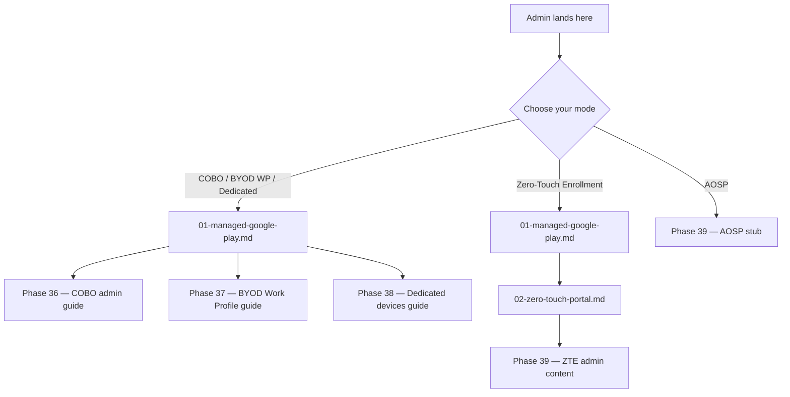
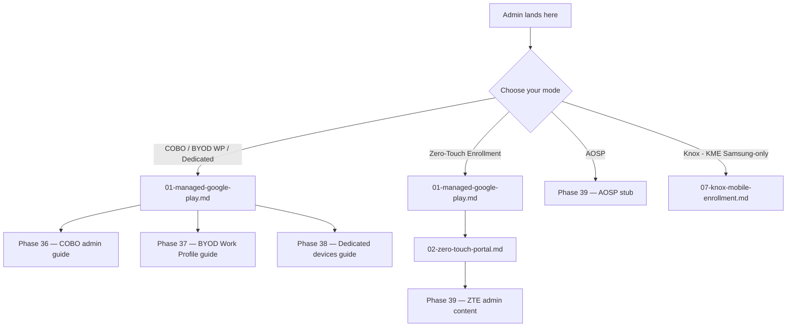

# Phase 44: Knox Mobile Enrollment — Pattern Map

**Mapped:** 2026-04-25
**Files analyzed:** 9 (3 new + 6 existing surgical edits)
**Analogs found:** 9 / 9 (100% coverage; 8 exact-match, 1 role-match)

## File Classification

| New/Modified File | Role | Data Flow | Closest Analog | Match Quality |
|-------------------|------|-----------|----------------|---------------|
| `docs/admin-setup-android/07-knox-mobile-enrollment.md` (NEW) | admin doc, Step 0 → Step N → Verification skeleton | linear procedural narrative + 4-portal overlay | `docs/admin-setup-android/02-zero-touch-portal.md` (primary structural model) + `docs/admin-setup-android/03-fully-managed-cobo.md` (Prereq + What-Breaks supplementary) | exact (D-02 Step 0 H2 verbatim sibling at ZT line 33) |
| `docs/l1-runbooks/28-android-knox-enrollment-failed.md` (NEW) | L1 runbook, Cause A-D + Cause E (escalate-only) | per-cause actor-boundary triage flow | `docs/l1-runbooks/27-android-zte-enrollment-failed.md` | exact (D-10 actor-boundary + D-12 escalation packet — Phase 40 lock) |
| `docs/l2-runbooks/22-android-knox-investigation.md` (NEW) | L2 runbook, Pattern A-E with per-pattern Microsoft Support escalation packet | investigation narrative across mode-agnostic data-collection + pattern matching | `docs/l2-runbooks/19-android-enrollment-investigation.md` | exact (D-09 Pattern-based investigation — Phase 41 lock) |
| `docs/reference/android-capability-matrix.md` (MODIFY) | reference matrix, surgical anchor rename + row populate | append-only on disjoint line ranges | self (lines 113-119 deferred-row pattern; line 86 cross-ref pattern) | exact (anchor-rename retrofit; same file, same H3 shape) |
| `docs/admin-setup-android/00-overview.md` (MODIFY) | overview index, Mermaid 5→6 branch + Setup Sequence numbered list + Prerequisites H3 add | additive narrative | self (lines 25-36 Mermaid block; lines 38-40 numbered list; lines 46-67 H3 prerequisite groups) | exact (canonical extension of existing 5-branch shape) |
| `docs/_glossary-android.md` (MODIFY) | glossary, 3 new H3 entries (Knox / KME / KPE) + alphabetical index update | alphabetical-by-term insert into 5-category H2 layout | self (lines 21-37 Enrollment H2 entries pattern; line 75 WPCO entry pattern) | exact (Phase 34 D-09 5-category lock; identical entry skeleton) |
| `docs/android-lifecycle/02-provisioning-methods.md` (MODIFY) | lifecycle reference, anchor rename + body replace at line 50-55 + top-callout edit at line 19 | surgical content replace | self (line 18-19 callout pattern; line 50-55 deferred-anchor pattern) | exact (same file, same anchor-replace shape) |
| `docs/admin-setup-android/02-zero-touch-portal.md` (MODIFY) | reciprocal pin + AEKNOX-03 anti-paste insert at JSON-paste step | line-targeted text replace + blockquote insert | self (line 16 KME/ZT mutex callout; line 88-117 DPC JSON paste step) | exact (line 16 forward-promise closure; line ~106 anti-paste insertion) |
| `docs/admin-setup-android/03-fully-managed-cobo.md` (MODIFY) | reciprocal pin at line 162 Samsung-admins callout | line-targeted text replace | self (line 162 Samsung-admins forward-promise) | exact (line 162 forward-promise closure) |

## Pattern Assignments

### File 1: `docs/admin-setup-android/07-knox-mobile-enrollment.md` (NEW admin doc)

**Primary analog:** `docs/admin-setup-android/02-zero-touch-portal.md` (entire file — sibling Samsung-adjacent admin guide)
**Supplementary analog:** `docs/admin-setup-android/03-fully-managed-cobo.md` (Prerequisites + What Breaks Summary table + tenant-conditional sub-section)

**Frontmatter pattern** (verbatim from `02-zero-touch-portal.md` lines 1-7):
```yaml
---
last_verified: 2026-04-23
review_by: 2026-06-22
audience: admin
platform: Android
applies_to: ZTE
---
```

**Knox doc adaptation (per Phase 43 D-22 + Phase 34 D-14):**
```yaml
---
last_verified: <execute-date YYYY-MM-DD>
review_by: <execute-date + 60d YYYY-MM-DD>
audience: admin
platform: Android
applies_to: KME
---
```

**Platform gate blockquote pattern** (verbatim from `02-zero-touch-portal.md` lines 11-12):
```markdown
> **Platform gate:** ZT portal account setup, DPC extras JSON, and ZT↔Intune linking for Android Enterprise Zero-Touch Enrollment (ZTE).
> For iOS, see [iOS Admin Guides](../admin-setup-ios/00-overview.md); for macOS, [macOS Admin Setup](../admin-setup-macos/00-overview.md); for terminology, [Android glossary](../_glossary-android.md).
```

**Knox adaptation (`07-knox-mobile-enrollment.md` line 11-12 must mirror this exact shape — Samsung-only KME phrasing, identical iOS/macOS/glossary cross-link tail).**

**Top-of-doc safety callout pattern** (verbatim from `02-zero-touch-portal.md` line 16 — the model for D-03 emoji-bearing blockquote):
```markdown
> ⚠️ **KME/ZT mutual exclusion (Samsung):** For Samsung fleets, choose either Knox Mobile Enrollment (KME) or Zero-Touch Enrollment — never both. Configuring both causes out-of-sync enrollment state. Full KME coverage is tracked for v1.4.1. See [KME/ZT Mutual Exclusion](#kme-zt-mutual-exclusion) below.
```

**Knox doc reciprocal callout (line ~16):** mirrors the same `> ⚠️ **KME/ZT mutual exclusion (Samsung):**` shape but the body points BACK to `[02-zero-touch-portal.md#kme-zt-mutual-exclusion]` instead of forward.

**Prerequisites H2 pattern** (verbatim from `02-zero-touch-portal.md` lines 23-30):
```markdown
<a id="prerequisites"></a>
## Prerequisites

- [ ] **MGP binding complete** — See [01-managed-google-play.md](01-managed-google-play.md); ZTE via Intune is a GMS path.
- [ ] **Authorized ZT reseller relationship** — See [Step 0](#step-0-reseller).
- [ ] **ZT portal Google account** — Corporate email (NOT Gmail); see [Create ZT Portal Account](#create-zt-account).
- [ ] **Intune enrollment profile** with exported token.
- [ ] **Microsoft Intune Plan 1+** and Intune Administrator role.
```

**Knox doc Prerequisites must use:** `<a id="prerequisites"></a>` + `## Prerequisites` H2 + bulleted `- [ ] **bold name** — description` checklist form. Required Knox prereqs (per RESEARCH §2 + Pitfall 2):
- MGP binding complete
- Samsung devices (Knox-eligible hardware)
- Samsung Knox B2B account submitted (forward-link to Step 0)
- Samsung devices in reseller channel OR Knox Deployment App pathway
- Microsoft Intune Plan 1+ with Intune Administrator role

**D-02 Step 0 H2 pattern (CRITICAL — locked decision)** — verbatim sibling at `02-zero-touch-portal.md` lines 32-41:
```markdown
<a id="step-0-reseller"></a>
## Step 0 — Verify Reseller Relationship

Before creating a ZT portal account, confirm the reseller relationship:

- [ ] Devices purchased from an [authorized Zero-Touch reseller](https://androidenterprisepartners.withgoogle.com/resellers/).
- [ ] Reseller confirmed devices are registered in the Zero-Touch system.
- [ ] Contact the vendor/reseller to verify ZT registration status.

**If the reseller relationship is not in place:** Do not proceed. Options: enroll via COBO QR code, NFC, or afw#setup (see [Provisioning Methods](../android-lifecycle/02-provisioning-methods.md)); or defer to corporate procurement. Devices deregistered from Zero-Touch cannot be re-registered without reseller involvement.
```

**Knox doc Step 0 must use exact title `## Step 0 — Samsung Knox Portal B2B account approval (1-2 business days)` (D-02 LOCKED). Body must:**
- Tell admin to submit B2B account on Day 0
- List productive parallel work during the 1-2 business day wait (read rest of doc; identify devices; align with reseller)
- Anchor: `<a id="step-0-b2b-approval"></a>` (recommendation; planner finalizes slug)

**Per-portal sub-H4 pattern** (verbatim from `02-zero-touch-portal.md` lines 46, 70, 81):
```markdown
#### In Zero-Touch portal

1. Navigate to [Zero-Touch portal](https://enterprise.google.com/android/zero-touch/customers). The portal requires Google account login. <!-- verify UI at execute time -->
```
and
```markdown
#### In Intune admin center

1. Sign in to [Intune admin center](https://endpoint.microsoft.com). <!-- verify URL at execute time -->
```

**Knox doc must use parallel sub-H4s:** `#### In Knox Admin Portal` and `#### In Intune admin center`. Every per-portal navigation step gets a `<!-- verify UI at execute time -->` HTML comment per the COBO/ZT convention.

**Inline `> What breaks if misconfigured` blockquote pattern** (verbatim from `03-fully-managed-cobo.md` line 79; same pattern at lines 89, 93, 119, 121, 123):
```markdown
   > **What breaks if misconfigured:** Renaming the profile after assignment breaks future enrollments — the rename is not propagated and dynamic device-group rules matching the old name drift out of scope. Recovery: create a new profile, reassign, revoke the old token, delete the old profile. Symptom appears in: Intune admin center (devices stuck at enrollment; dynamic group membership empty).
```

**Knox doc applies one `> **What breaks if misconfigured:**` blockquote at each decision point** (after each numbered step inside `#### In Knox Admin Portal` / `#### In Intune admin center`). Per-doc minimum: 5-6 such callouts mirroring COBO doc density (lines 79, 89, 93, 119, 121, 123 = 6 callouts in COBO).

**DPC extras JSON code-block + D-03 anti-paste blockquote pattern**

ZT JSON pattern (verbatim from `02-zero-touch-portal.md` lines 88-105):
```markdown
<a id="dpc-extras-json"></a>
## DPC Extras JSON Configuration

Paste the JSON below into the ZT portal configuration. Replace `YourEnrollmentToken` with the token exported from your Intune enrollment profile.

```json
{
  "android.app.extra.PROVISIONING_DEVICE_ADMIN_COMPONENT_NAME":
    "com.google.android.apps.work.clouddpc/.receivers.CloudDeviceAdminReceiver",
  "android.app.extra.PROVISIONING_DEVICE_ADMIN_SIGNATURE_CHECKSUM":
    "I5YvS0O5hXY46mb01BlRjq4oJJGs2kuUcHvVkAPEXlg",
  "android.app.extra.PROVISIONING_DEVICE_ADMIN_PACKAGE_DOWNLOAD_LOCATION":
    "https://play.google.com/managed/downloadManagingApp?identifier=setup",
  "android.app.extra.PROVISIONING_ADMIN_EXTRAS_BUNDLE": {
    "com.google.android.apps.work.clouddpc.EXTRA_ENROLLMENT_TOKEN": "YourEnrollmentToken"
  }
}
```
```

**Knox doc JSON (verbatim per RESEARCH §1 / Code Examples §1 — Microsoft Learn `setup-samsung-knox-mobile`):**
```json
{"com.google.android.apps.work.clouddpc.EXTRA_ENROLLMENT_TOKEN": "enter Intune enrollment token string"}
```

**This is FLAT — NO `PROVISIONING_ADMIN_EXTRAS_BUNDLE` wrapper. NOT identical to ZT JSON. The structural difference is the entire reason D-03 anti-paste exists.**

**D-03 anti-paste blockquote (LOCKED VERBATIM — must appear in BOTH `07-knox-mobile-enrollment.md` AND `02-zero-touch-portal.md` at the JSON-paste step):**
```markdown
<!-- AEKNOX-03-shared-anti-paste-block -->
> ⚠️ **DO NOT paste this JSON into the other portal**
> The KME and ZT DPC-extras JSON look similar but use different field names.
> Pasting ZT JSON into KME (or vice versa) silently produces a "stuck applying configuration" failure.
> If you maintain both portals: confirm the portal name in your browser tab before pasting.
<!-- /AEKNOX-03-shared-anti-paste-block -->
```

**Drift discoverability:** the HTML-comment markers wrap the block on both ends to enable `grep -r "AEKNOX-03-shared-anti-paste-block" docs/` future audits.

**5-SKU disambiguation H2 (D-01 LOCKED) — table format per RESEARCH §1 / Code Examples §3:**
```markdown
<a id="sku-disambiguation"></a>
## Knox SKU disambiguation (5 SKUs)

| SKU | KPE Standard | KPE Premium | Cost | Required for KME | Intune relationship |
|---|---|---|---|---|---|
| KME | — | — | Free | YES (the deliverable itself) | Knox portal → Intune handoff |
| KPE | Free baseline | Per-device upgrade (now free per Samsung 2024-03-21) | Free / Premium tier | NOT required for KME | Plan 1+ supplies Premium transparently |
| Knox Manage | — | — | Per-device | N/A — alternative MDM | Mutually exclusive with Intune |
| Knox Suite | — | — | Per-device bundle | NOT required for KME | Bundle that includes KPE Premium |
| Knox Configure | — | — | Per-device | NOT required for KME | Independent |
```

**Constraints:**
- Em-dash `—` in non-KPE Standard|Premium cells (no blanks; no `N/A` except Knox Manage row's Intune-relationship cell which already uses `N/A — alternative MDM`)
- H2 title MUST be `## Knox SKU disambiguation (5 SKUs)` exactly (REQUIREMENTS line 21 literal)
- Table title parens "(5 SKUs)" present to disambiguate row count from line 16's KPE Standard|Premium two-column hierarchy

**Mutex H2 with anchor pattern** (from `02-zero-touch-portal.md` lines 119-126):
```markdown
<a id="kme-zt-mutual-exclusion"></a>
## KME/ZT Mutual Exclusion (Samsung)

For Samsung fleets, Knox Mobile Enrollment (KME) and Zero-Touch Enrollment are mutually exclusive.

**Behavior when both are configured** (verified HIGH — Samsung Knox docs and Google Developers known issues): a device registered in both enrolls via KME. To apply Zero-Touch on a Samsung device, remove KME configuration for that device set.
```

**Knox doc gets its own KME/ZT mutex H2** (anchor `kme-zt-mutual-exclusion` OR equivalent slug) with content tilted to KME side: "From the KME side: when both KME and ZT are configured, KME takes precedence; remove ZT configuration if KME is desired."

**Verification checklist pattern** (verbatim from `02-zero-touch-portal.md` lines 198-205):
```markdown
## Verification

After ZT↔Intune linking:

- [ ] ZT portal shows the new configuration with EMM DPC app set to Microsoft Intune.
- [ ] Intune admin center > Devices > By platform > Android > Device onboarding > Enrollment > Zero-touch enrollment shows the linked ZT account.
- [ ] DPC extras JSON has the token substituted (no literal `YourEnrollmentToken` remains).
- [ ] A test device from reseller-uploaded stock boots into the Intune DPC — see [Device Claim Workflow](#device-claim-workflow) for device-claim testing at scale.
```

**Knox doc Verification must include the four verification points named in RESEARCH §Pitfall 4:**
- Knox Admin Portal Devices view shows the device (after reseller upload OR KDA enrollment) within 24 hours
- KME profile assigned to device set BEFORE first boot (not after)
- Custom JSON Data contains ONLY `{"com.google.android.apps.work.clouddpc.EXTRA_ENROLLMENT_TOKEN": "..."}` (no wrapper)
- Test Samsung device boots into Intune DPC via KME flow; appears in Intune admin center within ~15 minutes

**Renewal/Maintenance table pattern** (verbatim from `02-zero-touch-portal.md` lines 207-213):
```markdown
<a id="renewal-maintenance"></a>
## Renewal / Maintenance

| Component | Renewal Period | Consequence of Lapse | Renewal Steps |
|---|---|---|---|
| ZT reseller contract | Reseller-specific; typically annual | New IMEI/serial uploads stop appearing; previously uploaded devices remain claimable | Contact reseller; re-verify in ZT portal **Customer details** |
| Enrollment profile tokens | Configurable 1–65,535 days | New ZTE enrollments fail; enrolled devices unaffected | Regenerate in Intune admin center; update DPC extras JSON in ZT configurations |
```

**Knox doc Renewal table:** Knox B2B account validity, KME profile staging-token cadence, KPE Premium license cycle (now-free post-2024-03-21 per RESEARCH "State of the Art").

**See Also list pattern** (verbatim from `02-zero-touch-portal.md` lines 215-222):
```markdown
## See Also

- [Managed Google Play Binding](01-managed-google-play.md) — prerequisite for ZTE
- [Android Enterprise Admin Setup Overview](00-overview.md)
- [Android Enterprise Prerequisites](../android-lifecycle/01-android-prerequisites.md)
- [Android Enterprise Enrollment Overview](../android-lifecycle/00-enrollment-overview.md)
- [Android Provisioning Methods](../android-lifecycle/02-provisioning-methods.md)
- [Android Enterprise Provisioning Glossary](../_glossary-android.md#zero-touch-enrollment)
```

**Knox doc See Also must cross-link:**
- Managed Google Play Binding (prerequisite)
- Admin Setup Overview
- Android Prerequisites + Enrollment Overview + Provisioning Methods
- Glossary anchors `#knox`, `#kme`, `#kpe`, `#amapi`
- L1 runbook 28 (sibling failure-mode runbook)
- L2 runbook 22 (sibling investigation runbook)

**Changelog pattern** (verbatim from `02-zero-touch-portal.md` lines 226-228):
```markdown
## Changelog

| Date | Change | Author |
|------|--------|--------|
| 2026-04-21 | Initial version (Phase 35 scope) — Step 0 reseller gate, ZT account creation, DPC extras JSON, ZT↔Intune linking (Methods A/B), KME/ZT Samsung mutual-exclusion. ... | -- |
```

**Knox doc Changelog seed:** "Initial version (Phase 44 scope) — Samsung Knox B2B account approval (Step 0 1-2 business day gate), reseller bulk upload + Knox Deployment App provisioning paths, KME EMM profile + Intune DPC-extras JSON (flat `EXTRA_ENROLLMENT_TOKEN` key per Microsoft Learn `setup-samsung-knox-mobile`), 5-SKU disambiguation table (D-01 5-SKU H2 lock), KME/ZT mutex (reciprocal of `02-zero-touch-portal.md#kme-zt-mutual-exclusion`), D-03 anti-paste blockquote (`AEKNOX-03-shared-anti-paste-block`)."

**What Breaks Summary table pattern** (from supplementary analog `03-fully-managed-cobo.md` lines 197-216):
```markdown
<a id="what-breaks"></a>
## What Breaks Summary

Inline what-breaks callouts at each decision point. Severity descending within each source section.

| Misconfiguration | Section | Severity |
|------------------|---------|----------|
| Entra join not enabled | [Prerequisites](#prerequisites) | CRITICAL |
| CA exclusion missing (tenant-conditional) | [Prerequisites](#prerequisites) | HIGH (if CA policy applies) |
| ...
```

**Knox doc gets a parallel `## What Breaks Summary` table with Knox-specific misconfigurations** (B2B account not approved before Day 0; KME profile EMM not Intune; DPC JSON copy-pasted from ZT; Knox tripped silently blocks; KME/ZT dual-configured on Samsung).

**Forbidden changes for File 1:**
- Do NOT modify any other file's `last_verified` / `review_by` (Phase 43 D-22 frontmatter-shift is per-file, surgical, not bulk)
- Do NOT include SafetyNet references unless within the +/-200-char Play-Integrity-deprecation regex window (Audit C1 — `scripts/validation/v1.4.1-milestone-audit.mjs:130-162`)
- Do NOT use "supervised" / "supervision" as Android management terms (Audit C2)
- Do NOT introduce a separate Knox category H2 in glossary — use the existing 5-category H2 layout (Phase 34 D-09 lock)
- Do NOT pre-commit any Phase 45+ AOSP / Galaxy XR / wearable KME variant content (Phase 44 scope is Samsung-stock-Android KME only)
- Do NOT inline-paste the ZT DPC JSON wrapper into the Knox doc (the entire D-03 block warns against this — would visually undermine the warning)

---

### File 2: `docs/l1-runbooks/28-android-knox-enrollment-failed.md` (NEW L1 runbook)

**Analog:** `docs/l1-runbooks/27-android-zte-enrollment-failed.md` (entire file — Phase 40 D-10/D-12 sibling)

**Frontmatter pattern** (verbatim from `27-android-zte-enrollment-failed.md` lines 1-7):
```yaml
---
last_verified: 2026-04-23
review_by: 2026-06-22
applies_to: ZTE
audience: L1
platform: Android
---
```

**Knox L1 frontmatter (per Phase 43 D-22):**
```yaml
---
last_verified: <execute-date YYYY-MM-DD>
review_by: <execute-date + 60d YYYY-MM-DD>
applies_to: KME
audience: L1
platform: Android
---
```

**Platform gate blockquote** (verbatim from line 9):
```markdown
> **Platform gate:** This guide covers Android enrollment/compliance troubleshooting via Intune. For Windows Autopilot, see [Windows L1 Runbooks](00-index.md#apv1-runbooks). For macOS ADE, see [macOS ADE Runbooks](00-index.md#macos-ade-runbooks). For iOS/iPadOS, see [iOS L1 Runbooks](00-index.md#ios-l1-runbooks).
```

**Knox L1 must use identical Platform gate.** No deviation.

**H1 + 1-paragraph context** (verbatim from lines 11-13):
```markdown
# Android Zero-Touch Enrollment Failed

L1 runbook for Zero-Touch Enrollment (ZTE) failures: device was expected to enroll automatically via Zero-Touch but did not — device booted to consumer setup, looped back to first-time setup, or never arrived in Intune. Four L1-diagnosable causes plus Cause E (escalate-only).
```

**Knox L1 H1:** `# Android Knox Mobile Enrollment Failed` + 1-paragraph context: "L1 runbook for Knox Mobile Enrollment (KME) failures: Samsung device was expected to enroll automatically via KME but did not — device booted to consumer setup, looped back to first-time setup, or never arrived in Intune. Four L1-diagnosable causes plus Cause E (escalate-only)."

**Applies-to scope** (verbatim from line 15):
```markdown
**Applies to ZTE only.** For non-ZTE enrollment failures see sibling Android L1 runbooks ([22](22-android-enrollment-blocked.md) / [23](23-android-work-profile-not-created.md) / [24](24-android-device-not-enrolled.md) / [25](25-android-compliance-blocked.md) / [26](26-android-mgp-app-not-installed.md)).
```

**Knox L1 must scope:** "**Applies to KME only (Samsung).** For non-Samsung corporate enrollment failures see runbook [27 ZTE](27-android-zte-enrollment-failed.md). For non-corporate enrollment failures see ([22](22-android-enrollment-blocked.md) / [23](23-android-work-profile-not-created.md) / [24](24-android-device-not-enrolled.md) / [25](25-android-compliance-blocked.md) / [26](26-android-mgp-app-not-installed.md))."

**Triage tree routing reference** (verbatim from line 17):
```markdown
Routed here from the [Android Triage Decision Tree](../decision-trees/08-android-triage.md) ANDR27 branch.
```

**Knox L1:** `Routed here from the [Android Triage Decision Tree](../decision-trees/08-android-triage.md) ANDR28 branch.` (Phase 40 placeholder closes here.)

**Prerequisites + portal shorthand pattern** (verbatim from lines 19-26):
```markdown
## Prerequisites

- Access to Intune admin center (`https://intune.microsoft.com`) — L1 read-only
- Device serial number, IMEI, or manufacturer identifier
- Portal shorthand used in this runbook:
   - **P-ZT** = Zero-Touch customer portal (`enterprise.google.com/android/zero-touch/customers`) — **admin-only**; L1 does NOT have access
   - **P-KAP** = Knox Admin Portal (`knox.samsung.com`) — **admin-only**; Samsung-specific (Cause D)
   - **P-INTUNE** = Intune admin center Devices / Tenant admin blades
```

**Knox L1 portal shorthand:** Same `P-INTUNE` + `P-KAP = Knox Admin Portal (knox.samsung.com) — admin-only`. Drop `P-ZT` (not relevant to Knox L1) but keep `P-KAP` since it's the primary admin portal Knox L1 escalates to.

**L1 scope note** (verbatim from line 28):
```markdown
> **L1 scope note:** ZT portal and Knox Admin Portal are admin-only portals. L1 observes Intune-side symptoms (device absence / enrollment state) and hands the packet to the admin for ZT / KAP portal actions. All ZT portal click paths in this runbook are within `## Admin Action Required` sections.
```

**Knox L1:** "Knox Admin Portal is admin-only. L1 observes Intune-side symptoms (device absence / enrollment state) and hands the packet to the admin for KAP portal actions. All Knox Admin Portal click paths in this runbook are within `## Admin Action Required` sections."

**How to Use This Runbook + Cause ordering pattern** (verbatim from lines 30-39):
```markdown
## How to Use This Runbook

Check the cause that matches your observation. Causes are independently diagnosable — you do not need to rule out prior causes. Cause ordering below reflects frequency (most common first) per research sources:

- [Cause A: Device Not Uploaded by Reseller](#cause-a-device-not-uploaded-by-reseller) — Device serial not visible in ZT portal device list; reseller handoff incomplete
- [Cause B: Configuration Not Assigned to Device Set](#cause-b-configuration-not-assigned) — Device visible in ZT portal but no configuration assigned; device falls through to consumer setup
- [Cause C: ZT ↔ Intune Linking Broken](#cause-c-zt-intune-linking-broken) — ZT portal and Intune are not linked, or token expired; re-linking required
- [Cause D: KME/ZT Mutual-Exclusion Conflict (Samsung)](#cause-d-kme-zt-mutual-exclusion-conflict) — Samsung device registered in both Knox Mobile Enrollment and Zero-Touch; KME takes precedence

If none of Causes A-D match and enrollment still fails, see [Escalation Criteria](#escalation-criteria) below for Cause E (DPC extras JSON — admin-only investigation).
```

**Knox L1 Causes (recommended per RESEARCH §3 + Pitfalls 1-6):**
- **Cause A: B2B account approval pending** — most-common, gates ALL else; symptom: "cannot sign in to Knox Admin Portal"
- **Cause B: Device not in Knox Admin Portal Devices view** — reseller upload not done OR Knox Deployment App not used
- **Cause C: KME profile not assigned to device set** — profile exists but device shows no profile
- **Cause D: KME/ZT mutex collision (Samsung)** — device dual-configured; KME takes precedence (mirror runbook 27 Cause D from inverse direction)
- **Cause E (escalate-only):** Knox custom JSON wrong format / Knox tripped status / Knox license edge cases — admin-only DPC investigation + L2 escalation

**Per-Cause sectioned actor-boundary pattern (D-10 LOCK)** — verbatim from lines 43-83 (Cause A skeleton):
```markdown
## Cause A: Device Not Uploaded by Reseller {#cause-a-device-not-uploaded-by-reseller}

**Entry condition:** Admin confirms the device serial is NOT visible in the ZT customer portal (`Devices` tab). Device boots to consumer setup on first power-on.

### Symptom

- User (or IT purchaser) reports the corporate Android device went through "normal" setup instead of automatic corporate enrollment.
- Device does NOT appear in Intune after expected enrollment window (typically within 15 minutes of first power-on with internet).
- Admin searches the ZT portal `Devices` tab by IMEI or serial — no match.

Context: see [Reseller-Upload Handoff Workflow](../admin-setup-android/02-zero-touch-portal.md#reseller-upload-handoff) in the ZT portal admin guide.

### L1 Triage Steps

1. > **Say to the user:** "I'll verify whether your device was prepared correctly for automatic enrollment. If not, I'll coordinate with your IT administrator and the device reseller."
2. In Intune admin center, navigate to `Devices > All devices`, filter platform = Android, search by serial. Confirm device is NOT present. <!-- verify UI at execute time -->
3. Collect device identifiers for admin escalation: serial number, IMEI (or MEID for CDMA devices), make, model, manufacturer.

### Admin Action Required

**Ask the admin to:**

- Open the ZT customer portal at `enterprise.google.com/android/zero-touch/customers` (admin-only). Go to the `Devices` tab. <!-- verify UI at execute time -->
- Search for the device by IMEI, serial, or other identifier. The 2026 portal redesign accepts any identifier without type selection. [MEDIUM: support.google.com/work/android/answer/7514005, last_verified 2026-04-23]
- If device is absent: contact the authorized reseller who supplied the device. Reseller must upload the device identifier to the customer's ZT portal account. Without reseller upload, ZTE cannot enroll the device — this is a Google-canonical requirement.
- See [Reseller-Upload Handoff Workflow](../admin-setup-android/02-zero-touch-portal.md#reseller-upload-handoff) for the reseller handoff details and [Device Claim Workflow](../admin-setup-android/02-zero-touch-portal.md#device-claim-workflow) for what to do after devices appear.

**Verify:**

- After reseller upload: device appears in ZT portal Devices tab within 24 hours (reseller upload latency).
- After device is uploaded AND configuration is assigned (see Cause B), user can factory-reset and retry first-boot enrollment.

**If the admin confirms none of the above applies:**

- Device is listed in ZT portal but enrollment still fails — route to Cause B.

### Escalation (within Cause A)

- Reseller denies responsibility or cannot locate the device in their systems
- Device was purchased from a non-authorized reseller (no ZT upload path)
```

**Knox L1 must use the EXACT same skeleton per Cause:**
- `## Cause X: <name> {#cause-x-anchor}`
- `**Entry condition:** ...`
- `### Symptom` (3-5 bullets, observable in Intune admin center / Knox Admin Portal / device-side)
- `### L1 Triage Steps` (numbered: 1. `> **Say to the user:**` script ; 2. Intune admin center navigation with `<!-- verify UI at execute time -->` ; 3. Collect identifiers)
- `### Admin Action Required` — `**Ask the admin to:**` bulleted with cross-links into admin doc 07
- `**Verify:**` bullets
- `**If the admin confirms none of the above applies:**` route-to-next-Cause line
- `### Escalation (within Cause X)` — Cause-internal escalation triggers

**Cross-Cause routing pattern** — Cause D (Samsung KME mutex from ZT side, lines 161-202) is the inverse-direction analog. Knox L1 Cause D writes the SAME mutex from the KME side: "device dual-configured; KME takes precedence; admin must remove ZT side OR remove KME side per the desired enrollment path."

**Escalation Criteria H2 + Cause E + D-12 three-part escalation packet pattern** (verbatim from lines 207-234):
```markdown
## Escalation Criteria

(Overall — applies across all four L1-diagnosable causes plus Cause E admin-only path.)

Escalate to L2 (or to the Intune admin directly if not already done). See [Android Enrollment Investigation](../l2-runbooks/19-android-enrollment-investigation.md#pattern-c-zte-device-claim-failure) (Pattern C — ZTE Device Claim Failure) and [Android Log Collection Guide](../l2-runbooks/18-android-log-collection.md).

Escalate to L2 if:

- Cause A: reseller denies device upload AND purchase channel is unclear (vendor management issue)
- Cause B: admin assigned configuration AND user factory-reset device AND enrollment still falls through
- Cause C: re-linking attempted; connector still errors; Managed Google Play binding re-authorization fails
- Cause D: Samsung device removed from KME portal AND factory-reset; ZTE still doesn't initiate

**Cause E (DPC extras JSON — admin-only, not an L1 diagnosis):**

If all Cause A-D checks pass but devices still fail at enrollment, escalate to Intune admin for DPC-extras JSON review (see [DPC Extras JSON](../admin-setup-android/02-zero-touch-portal.md#dpc-extras-json)). L1 does NOT modify DPC extras JSON.

**Before escalating, collect:**

- Device serial number + IMEI (or MEID for CDMA)
- Device manufacturer, model, firmware / Android version
- Which Cause (A/B/C/D/E) closest matches observation
- For Cause A: reseller name, purchase date, purchase order / invoice reference
- For Cause B: screenshot of ZT portal Devices tab (admin-provided) showing device with empty Configuration column
- For Cause C: screenshot of Intune Tenant admin > Connectors and tokens showing Android ZT / MGP state
- For Cause D: confirmation of device presence/absence in Knox Admin Portal (admin-provided)
- Number of devices affected (single device vs fleet — shape-of-problem signal)
- Timestamp of most recent failed enrollment attempt
```

**Knox L1 Escalation Criteria (D-12 three-part escalation packet — token-state / profile-state / GUID, mirrored from runbook 27):**
- Cross-link to `[Android Enrollment Investigation](../l2-runbooks/22-android-knox-investigation.md#pattern-...)` (specific Pattern anchor depends on which Cause is being escalated)
- Per-Cause escalation triggers (per-Cause "what happens after L1 has done their part and it still fails")
- "Before escalating, collect:" data list — same shape as runbook 27 BUT Knox-specific (B2B account approval timestamp; Knox Admin Portal screenshot of device-pending state; Knox-tripped efuse status if known; KME profile name; reseller name + Knox B2B account email)

**Back-to-triage footer pattern** (verbatim from line 237):
```markdown
[Back to Android Triage](../decision-trees/08-android-triage.md)
```

**Knox L1 must use identical footer (no deviation).**

**Version History pattern** (verbatim from lines 239-244):
```markdown
## Version History

| Date | Change | Author |
|------|--------|--------|
| 2026-04-23 | Resolved Phase 41 L2 cross-references | -- |
| 2026-04-23 | Initial version (4 L1-diagnosable causes A-D + Cause E escalate-only) | -- |
```

**Knox L1 Version History seed:** "Initial version (Phase 44 scope) — 4 L1-diagnosable causes A-D (B2B account / device-not-in-portal / KME-profile-unassigned / KME-ZT-collision) + Cause E escalate-only (DPC JSON malformation / Knox tripped / Knox license edge cases). Closes Phase 40 ANDR28 placeholder."

**Forbidden changes for File 2:**
- ZERO `SafetyNet` references (Audit C1 — even in deprecation context, requires +/-200-char Play-Integrity regex window or `safetynet_exemptions[]` pin)
- ZERO `supervision` / `supervised` / `unsupervised` references (Audit C2 — requires `supervision_exemptions[]` pin if iOS-attributed cross-platform note needed)
- Do NOT cite Knox SKU pricing in L1 runbook (Knox-license-expired Cause E mention only — directs to admin doc 07 for SKU table)
- Do NOT include any device-side adb logcat or `setprop` commands (L1-scope is Intune-admin-center read-only)

---

### File 3: `docs/l2-runbooks/22-android-knox-investigation.md` (NEW L2 runbook)

**Analog:** `docs/l2-runbooks/19-android-enrollment-investigation.md` (Phase 41 D-09 sibling — Pattern A-E + per-Pattern Microsoft Support escalation packet)

**Frontmatter pattern** (verbatim from `19-android-enrollment-investigation.md` lines 1-7):
```yaml
---
last_verified: 2026-04-23
review_by: 2026-06-22
applies_to: all
audience: L2
platform: Android
---
```

**Knox L2 frontmatter:**
```yaml
---
last_verified: <execute-date YYYY-MM-DD>
review_by: <execute-date + 60d YYYY-MM-DD>
applies_to: KME
audience: L2
platform: Android
---
```

**Platform gate** (verbatim from line 9):
```markdown
> **Platform gate:** This guide covers Android Enterprise L2 investigation via Intune. For Windows Autopilot, see [Windows L2 Runbooks](00-index.md). For macOS ADE, see [macOS ADE Runbooks](00-index.md#macos-ade-runbooks). For iOS/iPadOS, see [iOS L2 Runbooks](00-index.md#ios-l2-runbooks).
```

**Knox L2 uses identical Platform gate.**

**Context H2 pattern** (verbatim from lines 13-17):
```markdown
## Context

This runbook covers Android Enterprise enrollment-failure investigation across all GMS-based modes (BYOD Work Profile, Fully Managed COBO, Dedicated COSU, Zero-Touch Enrollment). AOSP enrollment is out of scope — v1.4.1 (AEAOSPFULL-03 deferred).

Before starting: collect a diagnostic package per the [Android Log Collection Guide](18-android-log-collection.md) using the method appropriate for the enrollment mode (Company Portal logs for BYOD pre-AMAPI; Microsoft Intune app logs for BYOD post-AMAPI / COBO / Dedicated / ZTE; adb logcat as last-resort tier where USB debugging is available).
```

**Knox L2 Context:** "This runbook covers Knox Mobile Enrollment failure investigation across Samsung KME-provisioned devices (provisions into COBO / Dedicated / WPCO modes — KME does NOT enroll devices into a separate KME mode; it provisions Samsung devices into one of the three existing Android Enterprise device-owner modes via the Knox portal handoff). AOSP enrollment is out of scope. Samsung Galaxy XR / wearable / tablet KME variants are routed to Phase 45 (per-OEM AOSP)."

**From-L1-escalation router pattern** (verbatim from lines 19-24):
```markdown
**From L1 escalation?** L1 runbook 22 (enrollment blocked) / 23 (work profile not created) / 24 (device not enrolled) / 27 (ZTE enrollment failed) has escalated. L1 collected: serial number, user UPN, mode (Fully managed / Work profile / Dedicated / ZTE), and device-side symptoms. Skip to the Pattern section matching L1's observation:
- L1 22 → Pattern E (Enrollment Restriction)
- L1 23 → Pattern A (Work Profile Not Created)
- L1 24 → start at Data Collection Step 1-4 to narrow mode; then Pattern B / D as identified
- L1 27 → Pattern C (ZTE Device Claim Failure)
- No L1 escalation: begin at Data Collection Step 1
```

**Knox L2 router (per RESEARCH §3 — runbook 22 Pattern A-E mapping):**
- L1 28 Cause A (B2B account pending) → Pattern A (KME profile misconfiguration / B2B account state)
- L1 28 Cause B (device not in KAP) → Pattern B (Knox tripped status investigation) OR reseller-upload audit
- L1 28 Cause C (KME profile not assigned) → Pattern A (KME profile misconfiguration)
- L1 28 Cause D (KME/ZT collision) → Pattern C (KME→ZT collision)
- L1 28 Cause E (DPC JSON malformed / Knox license / Knox tripped) → Pattern D (Knox license edge cases) OR Pattern E (DPC custom JSON malformation)

**Graph API READ-ONLY scope blockquote** (verbatim from line 26):
```markdown
> **Graph API scope:** Where this runbook references the Microsoft Graph API, usage is strictly READ-ONLY (GET requests). No modifications. No token regeneration. No DPC extras JSON mutation. For deep Android Enterprise Graph operations, see ADDTS-ANDROID-02 (future milestone — Android Graph API deep-dive).
```

**Knox L2 uses identical Graph scope blockquote (no deviation).**

**Investigation — Data Collection (mode-agnostic) pattern** (verbatim 4-step structure from lines 28-110):
```markdown
## Investigation — Data Collection (mode-agnostic)

### Step 1: Device registration state (Intune admin center > Devices > All devices)

**Breadcrumb:** Intune admin center > **Devices** > **All devices** > search by serial number or filter by user UPN.

**Observables to collect:**

- Is the device visible at all? A device that never appears was not registered ...

### Step 2: Enrollment restriction blade state (platform/ownership gate)

**Breadcrumb:** ...

### Step 3: Token / profile sync state (mode-specific)

[mode-specific token + profile checks; KME-specific tokens involve Knox Admin Portal pending vs assigned states]

### Step 4: Device-side enrollment state (collect per runbook 18 based on mode)
```

**Knox L2 Data Collection (4 steps adapted to Samsung KME):**
- **Step 1:** Device registration state — Intune admin center Devices > All devices; search by serial; check `Manufacturer = Samsung`
- **Step 2:** Knox Admin Portal device state — admin-side check; serial in Devices view; profile assignment column populated
- **Step 3:** Knox profile + Intune enrollment token sync state — KME profile EMM = Microsoft Intune; Custom JSON Data parses correctly; Intune-side enrollment profile staging-token Active
- **Step 4:** Device-side enrollment state — per runbook 18 Section 2 (Microsoft Intune app logs preferred for KME-provisioned devices; adb logcat last-resort if USB-debug available)

**Pattern-based Analysis pattern (D-09 LOCK)** — verbatim from lines 112-120 (Pattern A skeleton):
```markdown
## Analysis — Match Against Known Patterns

### Pattern A: Work Profile Not Created (BYOD) {#pattern-a-work-profile-not-created-byod}

**Typical class:** ⚙️ Config Error (enrollment restriction / work profile policy misalignment) — occasionally 🐛 Defect (AMAPI transition bug)

**Symptom:** The end user attempts BYOD enrollment via Company Portal or Microsoft Intune app; enrollment completes without an obvious error but no work profile badge (briefcase icon) appears on managed apps, ...

**Known Indicators:**

- Intune admin center > Devices > [device] > Configuration: no Work Profile device restriction policy shows as applied.
- ...

**Resolution Steps:**

1. Verify the enrollment restriction allows ...
2. ...

**Microsoft Support escalation packet (D-09):**

- **Token sync status:** ...
- **Profile assignment state:** ...
- **Enrollment profile GUID:** ...
```

**Knox L2 Patterns (per RESEARCH §3 — Pattern A-E for runbook 22):**
- **Pattern A: KME profile misconfiguration** (most common; D-02 / D-03 misconfig at admin doc 07)
- **Pattern B: Knox tripped status investigation** (Pitfall 6 — sticky efuse flag; non-recoverable for KME)
- **Pattern C: KME → ZT collision** (mirror of runbook 19 Pattern C; KME takes precedence)
- **Pattern D: Knox license edge cases** (KPE Premium not provisioned; Plan 1+ misalignment; Knox Suite vs KPE confusion — D-01 SKU disambiguation reinforced)
- **Pattern E: DPC custom JSON malformation** (Pitfall 1 — D-03 anti-paste violation; ZT JSON wrapper pasted into KME profile)

Each Pattern in Knox L2 follows the EXACT shape:
- `### Pattern X: <name> {#pattern-x-anchor}`
- `**Typical class:** ⚙️ Config Error | 🐛 Defect | ⏱️ Timing` (one or two)
- `**Symptom:** ...`
- `**Known Indicators:** ...` (4-7 bullets)
- `**Resolution Steps:** 1. ... 2. ...` (numbered, with cross-links to admin doc 07 anchors)
- `**Microsoft Support escalation packet (D-09):**` with three labeled sub-bullets (`Token sync status` / `Profile assignment state` / `Enrollment profile GUID`)

**Play Integrity 3-tier verdict structure (Phase 41 lock — Audit C1 enforces zero SafetyNet)** — sourced from `_glossary-android.md` line 138 + `19-android-enrollment-investigation.md` references:

Knox L2 must use ONLY:
- **Basic integrity** — device hardware/OS not detected as compromised
- **Basic + Device integrity** — adds basic device-recognition signal
- **Strong integrity** — requires hardware-backed boot attestation from device TEE (Knox attestation contributes to Strong on Samsung devices)

**Pattern B (Knox tripped) must specifically reference Strong-integrity verdict failure** because Knox-tripped flag at the firmware level prevents Strong integrity attestation regardless of OS state.

**Resolution H2 + Microsoft Support escalation criteria** (verbatim from lines 267-285):
```markdown
## Resolution

Each Pattern sub-section above includes Resolution Steps and a Microsoft Support escalation packet (token sync status, profile assignment state, enrollment profile GUID). This section aggregates the common Microsoft Support case framing.

### Microsoft Support escalation criteria

Escalate to Microsoft Support when:
- All ⚙️ Config Error paths ruled out across the identified Pattern
- ⏱️ Timing windows have elapsed (24-48 hours for first-sync patterns; QR token rotation window per Pattern D)
- Pattern indicators match but Resolution Steps do not move the device to the Active state
- Data collection per runbook 18 is complete

### Case data to attach (all patterns)

1. Device serial number + Android OS version + OEM
2. User UPN + tenant domain
3. Enrollment mode and Pattern (A/B/C/D/E)
4. Intune admin center screenshots per Data Collection Step 1-3
5. Runbook 18 log artifact IDs (Company Portal log incident OR Microsoft Intune app log incident OR adb logcat excerpt)
6. Pattern-specific escalation packet (token sync status, profile assignment state, enrollment profile GUID — per D-09)
```

**Knox L2 must include identical Resolution H2 with Knox-specific case data:**
- Samsung manufacturer + model
- Knox B2B account email + KME profile name + Knox eFuse status (tripped/not-tripped)
- Knox Admin Portal screenshot of device row showing assignment state
- Pattern (A/B/C/D/E)

**Related Resources pattern** (verbatim from lines 287-297):
```markdown
## Related Resources

- [Android Log Collection Guide (runbook 18)](18-android-log-collection.md) — prerequisite for this runbook
- [Android App Install Investigation (runbook 20)](20-android-app-install-investigation.md)
- [Android Compliance Investigation (runbook 21)](21-android-compliance-investigation.md)
- [L2 Runbook Index](00-index.md#android-l2-runbooks)
- [L1 Runbook 22: Android Enrollment Blocked](../l1-runbooks/22-android-enrollment-blocked.md)
- [L1 Runbook 23: Android Work Profile Not Created](../l1-runbooks/23-android-work-profile-not-created.md)
- [L1 Runbook 24: Android Device Not Enrolled](../l1-runbooks/24-android-device-not-enrolled.md)
- [L1 Runbook 27: Android ZTE Enrollment Failed](../l1-runbooks/27-android-zte-enrollment-failed.md)
```

**Knox L2 Related Resources adds:**
- L1 Runbook 28: Android Knox Enrollment Failed (sibling)
- Admin doc 07-knox-mobile-enrollment.md
- Glossary anchors `#knox`, `#kme`, `#kpe`, `#play-integrity`

**Forbidden changes for File 3:**
- ZERO `SafetyNet` references (Audit C1)
- ZERO `supervision` references (Audit C2) — even in cross-platform notes (KME is Samsung-only; no iOS bridge per locked context)
- ZERO Graph API mutating commands — READ-ONLY GET only (D-09 lock)
- Do NOT include device-side `adb shell setprop` or `pm enable/disable` commands (out-of-scope for L2 read-only investigation)
- Do NOT cite Samsung firmware-level efuse-clearing procedures (Knox tripped is non-recoverable; runbook directs to alternate enrollment paths)

---

### File 4: `docs/reference/android-capability-matrix.md` (MODIFY — anchor rename + row populate)

**Analog:** Self (lines 86 cross-ref + 113-119 deferred-row block)

**Existing anchor block (verbatim lines 113-119):**
```markdown
<a id="deferred-knox-mobile-enrollment-row"></a>
### Deferred: Knox Mobile Enrollment row

Knox Mobile Enrollment (KME) is a Samsung-specific zero-touch enrollment path
mutually exclusive with Google Zero-Touch on Samsung hardware. KME coverage —
including a provisioning-method row and capability mapping — is deferred to v1.4.1
per PROJECT.md Key Decisions. See [Knox Mobile Enrollment deferral note](../android-lifecycle/02-provisioning-methods.md#knox-mobile-enrollment).
```

**Phase 44 surgical edit (per AEKNOX-04):**
- **Anchor rename:** `<a id="deferred-knox-mobile-enrollment-row"></a>` → `<a id="knox-mobile-enrollment-row"></a>`
- **H3 rename:** `### Deferred: Knox Mobile Enrollment row` → `### Knox Mobile Enrollment (Samsung)`
- **Body replacement:** populated row data per locked context (Samsung-only; free baseline; KME provisions into COBO/Dedicated/WPCO; cross-link to admin doc 07 + L1 runbook 28 + L2 runbook 22)
- **Cross-ref line 86 edit:** `[KME deferral footer](#deferred-knox-mobile-enrollment-row)` → `[Knox Mobile Enrollment](#knox-mobile-enrollment-row)`

**Existing line 86 (verbatim):**
```markdown
| **iOS Automated Device Enrollment (ADE) via Apple Business Manager** | **Google Zero-Touch Enrollment via ZT portal** |
| ... Samsung hardware: Zero-Touch is mutually exclusive with Knox Mobile Enrollment — see the [KME deferral footer](#deferred-knox-mobile-enrollment-row). |
```

**Replace `[KME deferral footer](#deferred-knox-mobile-enrollment-row)` → `[Knox Mobile Enrollment](#knox-mobile-enrollment-row)`** (drop "deferral footer" wording).

**Optional (planner discretion per RESEARCH §5 Pin 4):** APPEND a single Knox KME row at the BOTTOM of the Enrollment H2 table (rows 16-25) explicitly framed as "Samsung KME (provisioning method into COBO / Dedicated / WPCO)" — this preserves the mode-first 5-column structure (COBO / BYOD / Dedicated / ZTE / AOSP) while exposing KME as a Samsung-overlay provisioning path. Body copy: "Samsung-only KME path; provisions Samsung devices into the COBO/Dedicated/WPCO column states above. See [07-knox-mobile-enrollment.md](../admin-setup-android/07-knox-mobile-enrollment.md) for full admin coverage."

**Forbidden changes for File 4:**
- Do NOT modify `last_verified` / `review_by` of files OTHER than this one (frontmatter shift on this file IS expected per Phase 43 D-22)
- Do NOT remove the `<!-- AEAUDIT-04: ... -->` HTML comment at lines 74-77 (Audit C2 supervision-attribution pin source-of-truth)
- Do NOT introduce a 4th deferred-row footer for Knox content (the deferred block converts to a live row with retained anchor)
- Surgical-edit boundary: changes confined to lines 86, 113-119, AND optionally an appended row in the Enrollment table at line ~25-26 (no other line modifications)

---

### File 5: `docs/admin-setup-android/00-overview.md` (MODIFY — Mermaid 5→6 + Setup Sequence + Prerequisites)

**Analog:** Self (lines 25-36 Mermaid block; lines 38-40 numbered list; lines 46-67 H3 prerequisite groups)

**Mermaid block existing (verbatim lines 25-36):**
```markdown

```

**Phase 44 6-branch update (per AEKNOX-05; recommended branch label `Knox (KME) Samsung-only` from CONTEXT.md Claude's Discretion):**
```markdown

```

**Setup Sequence numbered list existing (verbatim lines 38-40):**
```markdown
1. **[Managed Google Play Binding](01-managed-google-play.md)** — Bind the Intune tenant to Managed Google Play using an Entra account. Required for all GMS modes (COBO, BYOD WP, Dedicated, ZTE). Complete before any GMS enrollment profile.

2. **[Zero-Touch Portal Configuration](02-zero-touch-portal.md)** — Configure the Zero-Touch portal account and DPC extras JSON, and link ZT to Intune. Required for ZTE only. Reseller relationship (Step 0) must be in place before this guide.
```

**Phase 44 add item 3 (recommended per RESEARCH §6):**
```markdown
3. **[Knox Mobile Enrollment](07-knox-mobile-enrollment.md)** — Configure Samsung Knox Admin Portal B2B account, create EMM profile pointing at Microsoft Intune, and assign profile to Samsung devices via reseller upload OR Knox Deployment App. Required for Samsung KME path only; mutually exclusive with Zero-Touch on the same Samsung device.
```

**Prerequisites section H3 add (recommended per RESEARCH §6 — between line 62 `### ZTE-Path Prerequisites` and line 63 `### AOSP-Path Prerequisites`):**
```markdown
### KME-Path Prerequisites

For Samsung Knox Mobile Enrollment (Samsung-only):

- [ ] **Samsung Knox B2B account** — Approval takes 1-2 business days. See [07-knox-mobile-enrollment.md#step-0-b2b-approval](07-knox-mobile-enrollment.md#step-0-b2b-approval).
- [ ] **Microsoft Intune Plan 1+** with Intune Administrator role.
- [ ] **Samsung devices** registered in Knox Admin Portal via reseller upload OR Knox Deployment App.
- [ ] **NOT also configured for Zero-Touch** on the same devices — KME and ZT are mutually exclusive on Samsung hardware.
```

**Forbidden changes for File 5:**
- Do NOT alter the existing Mermaid arrow connections (5 existing branches preserved verbatim; only new Knox branch added)
- Do NOT renumber the existing numbered list items 1, 2 (3 is appended, not inserted)
- Do NOT touch GMS-Path / ZTE-Path / AOSP-Path / Shared Prerequisites H3 bodies (only ADD new KME-Path H3 between ZTE-Path and AOSP-Path)
- Do NOT modify the Portal Navigation Note H2 / See Also list / Changelog table beyond appending the Phase 44 changelog row
- Frontmatter `last_verified` + `review_by` shift to execute date + 60d (Phase 43 D-22)

---

### File 6: `docs/_glossary-android.md` (MODIFY — 3 new entries Knox/KME/KPE; AMAPI cross-link only)

**Analog:** Self (lines 21-37 Enrollment H2 entries; line 75 WPCO entry pattern; line 124 AMAPI existing entry; line 15 Alphabetical Index)

**Existing entry skeleton pattern (verbatim from `_glossary-android.md` line 75 WPCO entry — model for D-04 entries):**
```markdown
### WPCO

Work Profile on Corporate-Owned devices (WPCO) is Android Enterprise's newer mode combining a fully managed device with a user-separated work profile. Google recommends WPCO as the successor pattern to [COPE](#cope) — same "corporate device with personal-use partition" shape, cleaner profile boundary and better user-privacy controls. WPCO provisioning is QR, Zero-Touch, or DPC identifier [afw#setup](#afw-setup); the NFC path was removed on Android 11+.

> **Cross-platform note:** No Windows, macOS, or iOS equivalent — the "corporate device with user-separated personal partition" model is Android-specific. See also the [COPE entry](#cope) for the older terminology drift context.
```

**Pattern shape to mirror for ALL 3 new entries (Knox / KME / KPE):**
- `### <Term>` H3 (4-row title — "Knox" / "KME (Knox Mobile Enrollment)" / "KPE (Knox Platform for Enterprise)")
- 1 paragraph (~80 words) descriptive body with `[cross-link](#anchor)` to other glossary entries
- `> **Cross-platform note:** ...` blockquote — Samsung-specific framing per locked context

**Knox / KME / KPE entry text (D-04 LOCKED — sourced from RESEARCH §7 sketches):**

```markdown
### Knox

Samsung Knox is Samsung's mobile-device security platform spanning hardware (Knox eFuse, Knox Vault) and software (Knox Platform for Enterprise, Knox Mobile Enrollment, Knox Suite, Knox Manage, Knox Configure). For Intune-managed Samsung fleets, the relevant Knox SKUs are [KME](#kme) (the Samsung zero-touch-equivalent enrollment path) and [KPE](#kpe) (the Samsung security-extension layer that Intune Plan 1+ supplies transparently). See the [Knox SKU disambiguation table](../admin-setup-android/07-knox-mobile-enrollment.md#sku-disambiguation) in the KME admin guide for the 5-SKU breakdown.

> **Cross-platform note:** Samsung-specific. No Apple, Microsoft, or AOSP equivalent. Samsung Knox security features apply only to Samsung hardware; Knox SKUs are not portable to non-Samsung Android OEMs.
```

```markdown
### KME (Knox Mobile Enrollment)

Knox Mobile Enrollment is Samsung's zero-touch-equivalent enrollment channel for Samsung devices. KME provisions Samsung devices into the Intune-managed [COBO](#cobo) / [Dedicated](#dedicated) / [WPCO](#wpco) modes via the Knox Admin Portal → Intune handoff (custom JSON containing the Intune enrollment token). KME is **free** and does not require a paid Knox license; it is mutually exclusive with [Zero-Touch Enrollment](#zero-touch-enrollment) on the same Samsung device (KME takes precedence at the device firmware level when both are configured).

> **Cross-platform note:** Samsung-specific. The Google ZT analog is [Zero-Touch Enrollment](#zero-touch-enrollment); the Apple analog is ADE; the Windows analog is Autopilot. KME is NOT portable to non-Samsung Android OEMs.
```

```markdown
### KPE (Knox Platform for Enterprise)

Knox Platform for Enterprise is Samsung's security-extension layer adding device-policy capabilities beyond stock Android Enterprise (kiosk customization, advanced restriction policies, custom boot animations). KPE has historically been licensed in two tiers: Standard (free baseline) and Premium (per-device upgrade). Samsung made Premium licenses **free** in 2024 (Samsung confirmed 2024-03-21); Microsoft Intune Plan 1+ supplies KPE Premium transparently to enrolled Samsung devices. KPE is NOT required for [KME](#kme); the two are independent SKUs.

> **Cross-platform note:** Samsung-specific security-extension layer. No Apple or Windows analog at the SKU level; the closest concept is Apple's MDM-controlled supervised-only restrictions (which are gated by ADE, not licensed separately).
```

**Section placement (per Phase 34 D-09 5-category H2 lock + RESEARCH §7):**
- All 3 new entries go under **Provisioning Methods H2** (line 81) since Knox is fundamentally a Samsung-specific provisioning umbrella (KME provisions into COBO/Dedicated/WPCO modes)
- Insert order alphabetical within the H2: between line 88 (`afw#setup`) and line 90 (`Corporate Identifiers`) — Knox → KME → KPE block
- AMAPI: NO new entry. Existing entry at line 124 already covers Google's MDM API. **Phase 44 adds**: cross-link to `[AMAPI](#amapi)` FROM new Knox/KME entries (e.g., Knox entry can mention "Intune calls [AMAPI](#amapi) for Knox-provisioned device policy")

**Alphabetical Index update (existing line 15):**
```markdown
[afw#setup](#afw-setup) | [AMAPI](#amapi) | [BYOD](#byod) | [COBO](#cobo) | [COPE](#cope) | [Corporate Identifiers](#corporate-identifiers) | [Dedicated](#dedicated) | [DPC](#dpc) | [EMM](#emm) | [Entra Shared Device Mode](#entra-shared-device-mode) | [Fully Managed](#fully-managed) | [Managed Google Play](#managed-google-play) | [Managed Home Screen](#managed-home-screen) | [Play Integrity](#play-integrity) | [Supervision](#supervision) | [User Enrollment](#user-enrollment) | [Work Profile](#work-profile) | [WPCO](#wpco) | [Zero-Touch Enrollment](#zero-touch-enrollment)
```

**Phase 44 update (insert Knox / KME / KPE between Fully Managed and Managed Google Play):**
```markdown
[afw#setup](#afw-setup) | [AMAPI](#amapi) | [BYOD](#byod) | [COBO](#cobo) | [COPE](#cope) | [Corporate Identifiers](#corporate-identifiers) | [Dedicated](#dedicated) | [DPC](#dpc) | [EMM](#emm) | [Entra Shared Device Mode](#entra-shared-device-mode) | [Fully Managed](#fully-managed) | [Knox](#knox) | [KME](#kme) | [KPE](#kpe) | [Managed Google Play](#managed-google-play) | [Managed Home Screen](#managed-home-screen) | [Play Integrity](#play-integrity) | [Supervision](#supervision) | [User Enrollment](#user-enrollment) | [Work Profile](#work-profile) | [WPCO](#wpco) | [Zero-Touch Enrollment](#zero-touch-enrollment)
```

**Forbidden changes for File 6:**
- Do NOT add a separate WPCO entry — `_glossary-android.md` already has WPCO at line 75 (D-04 explicit prohibition)
- Do NOT add separate entries for Knox Manage / Knox Suite / Knox Configure — covered by the umbrella Knox entry's cross-link to admin doc 07's 5-SKU H2 table
- Do NOT add a new AMAPI entry — existing line 124 entry stands; Phase 44 only adds back-references TO it from new Knox/KME entries
- Do NOT introduce a Knox-specific category H2 — use existing 5-category H2 layout (Phase 34 D-09 lock)
- Do NOT modify the Supervision callout at line 65-67 (Audit C2 attribution discipline)
- Do NOT modify Cross-platform notes on existing entries (they already establish the iOS/Apple/Windows attribution pattern that new Knox entries mirror)
- Frontmatter `last_verified` + `review_by` shift to execute date + 60d
- Version History append: "Phase 44: 3 new Provisioning Methods H2 entries (Knox / KME / KPE); 3 new alphabetical-index entries; AMAPI cross-link added FROM Knox/KME entries (no new AMAPI entry)."

---

### File 7: `docs/android-lifecycle/02-provisioning-methods.md` (MODIFY — anchor rename + body replace + top-callout edit)

**Analog:** Self (lines 18-19 callout pattern; lines 50-55 deferred-anchor block)

**Existing top callout (verbatim lines 18-19):**
```markdown
<a id="samsung-kme-mutual-exclusion"></a>
> **Samsung devices:** Knox Mobile Enrollment (KME) is mutually exclusive with Zero-Touch on the same Samsung device. Configure only one. KME is deferred to v1.4.1; see the [KME deferral note](#knox-mobile-enrollment-kme---deferred-to-v141) at the bottom of this page.
```

**Phase 44 edit (per RESEARCH §5 Pin 3):**
```markdown
<a id="samsung-kme-mutual-exclusion"></a>
> **Samsung devices:** Knox Mobile Enrollment (KME) is mutually exclusive with Zero-Touch on the same Samsung device. Configure only one. For full KME admin coverage, see [Knox Mobile Enrollment](../admin-setup-android/07-knox-mobile-enrollment.md); for the within-this-doc record, see [Knox Mobile Enrollment](#knox-mobile-enrollment) below.
```

**Existing deferred-anchor block (verbatim lines 50-55):**
```markdown
<a id="knox-mobile-enrollment-kme---deferred-to-v141"></a>
## Knox Mobile Enrollment (KME) — Deferred to v1.4.1

Knox Mobile Enrollment is Samsung's Zero-Touch-equivalent for Samsung hardware. A KME row will be added to the matrix above in v1.4.1 per [PROJECT.md Key Decisions](../../.planning/PROJECT.md). For v1.4, treat Samsung devices as Zero-Touch-eligible per the [Samsung KME mutual-exclusion note](#samsung-kme-mutual-exclusion) at the top of this page. Do NOT configure both KME and Zero-Touch on the same Samsung device — KME takes precedence at the device firmware level.

Full KME admin documentation (binding Knox Admin Portal to Intune, Samsung reseller workflow, KME-specific failure modes) is tracked in the v1.4 deferred-items list and will ship in v1.4.1.
```

**Phase 44 edit (per AEKNOX-06 + RESEARCH §5 Pin 3):**
- **Anchor rename:** `<a id="knox-mobile-enrollment-kme---deferred-to-v141"></a>` → `<a id="knox-mobile-enrollment"></a>` (matches CONTEXT.md `02-provisioning-methods.md#knox-mobile-enrollment` anchor expectation)
- **H2 rename:** `## Knox Mobile Enrollment (KME) — Deferred to v1.4.1` → `## Knox Mobile Enrollment (KME)` (drop "— Deferred to v1.4.1")
- **Body replace:** Replace both paragraphs with one populated paragraph cross-linking to admin doc 07, L1 runbook 28, L2 runbook 22, and capability matrix `#knox-mobile-enrollment-row` anchor (post-AEKNOX-04 retrofit)

**Replacement body (planner adapts; ~100 words):**
```markdown
<a id="knox-mobile-enrollment"></a>
## Knox Mobile Enrollment (KME)

Knox Mobile Enrollment is Samsung's Zero-Touch-equivalent for Samsung hardware. KME provisions Samsung devices into the Intune-managed [Fully Managed (COBO)](#cobo), [Dedicated (COSU)](#dedicated-cosu), or WPCO modes via the Knox Admin Portal → Intune handoff. KME is mutually exclusive with [Zero-Touch](#zero-touch) on the same Samsung device — KME takes precedence at the device firmware level when both are configured. For full admin coverage (Knox B2B account, reseller bulk upload, Knox Deployment App, EMM profile, DPC-extras JSON, 5-SKU disambiguation), see [Knox Mobile Enrollment Admin Setup](../admin-setup-android/07-knox-mobile-enrollment.md). For Samsung-specific failure-mode runbooks: [L1 runbook 28](../l1-runbooks/28-android-knox-enrollment-failed.md) and [L2 runbook 22](../l2-runbooks/22-android-knox-investigation.md). See also the [Knox Mobile Enrollment row](../reference/android-capability-matrix.md#knox-mobile-enrollment-row) in the capability matrix.
```

**Forbidden changes for File 7:**
- Do NOT add a Knox row to the existing Mode × Method Matrix at lines 21-29 (the matrix's 5-mode shape is locked; Knox is provisioning-method overlay, not a 6th mode)
- Do NOT remove the existing `<a id="samsung-kme-mutual-exclusion"></a>` anchor at line 18 (other docs link TO it)
- Do NOT modify entries in the Mode × Method Matrix or the Per-Method Details section (NFC / QR / afw#setup / Zero-Touch H3s)
- Surgical-edit boundary: changes confined to lines 18-19 (top callout) and lines 50-55 (anchor + H2 + body replace)
- Frontmatter `last_verified` + `review_by` shift to execute date + 60d

---

### File 8: `docs/admin-setup-android/02-zero-touch-portal.md` (MODIFY — reciprocal pin line 16 + AEKNOX-03 anti-paste insert at JSON-paste step)

**Analog:** Self (line 16 KME/ZT mutex callout; lines 88-117 DPC JSON paste step)

**Existing line 16 (verbatim):**
```markdown
> ⚠️ **KME/ZT mutual exclusion (Samsung):** For Samsung fleets, choose either Knox Mobile Enrollment (KME) or Zero-Touch Enrollment — never both. Configuring both causes out-of-sync enrollment state. Full KME coverage is tracked for v1.4.1. See [KME/ZT Mutual Exclusion](#kme-zt-mutual-exclusion) below.
```

**Phase 44 edit (per AEKNOX-07 + RESEARCH §5 Pin 1):**
```markdown
> ⚠️ **KME/ZT mutual exclusion (Samsung):** For Samsung fleets, choose either Knox Mobile Enrollment (KME) or Zero-Touch Enrollment — never both. Configuring both causes out-of-sync enrollment state. See [Knox Mobile Enrollment](07-knox-mobile-enrollment.md) for full KME admin coverage and [KME/ZT Mutual Exclusion](#kme-zt-mutual-exclusion) below for the within-this-doc record.
```

**Diff:** Replace `Full KME coverage is tracked for v1.4.1.` with `See [Knox Mobile Enrollment](07-knox-mobile-enrollment.md) for full KME admin coverage and `. Closes v1.4 forward-promise.

**AEKNOX-03 anti-paste insert at JSON-paste step (D-03 LOCKED — identical block in BOTH files):**

The blockquote must be inserted at the JSON-paste step in `02-zero-touch-portal.md`. The most natural insertion point is **immediately before the JSON code block at line 93** (just after line 91 "Paste the JSON below into the ZT portal configuration..." and before the triple-backtick line 93 ` ```json `).

**Insert at line 92 (between current line 91 and line 93):**
```markdown
<!-- AEKNOX-03-shared-anti-paste-block -->
> ⚠️ **DO NOT paste this JSON into the other portal**
> The KME and ZT DPC-extras JSON look similar but use different field names.
> Pasting ZT JSON into KME (or vice versa) silently produces a "stuck applying configuration" failure.
> If you maintain both portals: confirm the portal name in your browser tab before pasting.
<!-- /AEKNOX-03-shared-anti-paste-block -->
```

**Identical block must also appear in `07-knox-mobile-enrollment.md` at the corresponding KME JSON-paste step** — the HTML-comment markers enable `grep -r "AEKNOX-03-shared-anti-paste-block" docs/` discovery for future drift detection.

**Surgical-edit boundary for File 8:**
- Line 16 text replacement (single line)
- New blockquote insert between current line 91 and line 93 (5 markdown lines added)
- Frontmatter `last_verified` + `review_by` shift to execute date + 60d
- Changelog append: "Phase 44 — line 16 reciprocal pin (KME/ZT mutex callout now references new admin doc 07); AEKNOX-03 anti-paste blockquote inserted at JSON-paste step (`AEKNOX-03-shared-anti-paste-block` HTML-comment marker for drift discoverability per CONTEXT.md D-03)."

**Forbidden changes for File 8:**
- Do NOT touch the JSON code block content (lines 93-105 — the ZT JSON wrapper structure is verbatim correct per Microsoft Learn `setup-fully-managed`)
- Do NOT touch the Fields reference table (lines 107-115)
- Do NOT touch the `> **Authors:** Do NOT add in-JSON ... ` callout at line 117 (separate Authors discipline; orthogonal to AEKNOX-03)
- Do NOT modify the existing `<a id="kme-zt-mutual-exclusion"></a>` H2 at line 119 (it stays; only line 16 callout body changes)
- Do NOT modify any Phase 39 corporate-scale operations content (lines 128-196)
- Do NOT modify the existing Changelog rows; only APPEND a new Phase 44 row

---

### File 9: `docs/admin-setup-android/03-fully-managed-cobo.md` (MODIFY — reciprocal pin line 162)

**Analog:** Self (line 162 Samsung-admins forward-promise callout)

**Existing line 162 (verbatim):**
```markdown
> ⚠️ **Samsung admins:** Choose Knox Mobile Enrollment (KME) or Zero-Touch — never both. Configuring both on the same devices causes out-of-sync enrollment state on Samsung hardware. Full KME coverage is deferred to v1.4.1. See [02-zero-touch-portal.md#kme-zt-mutual-exclusion](02-zero-touch-portal.md#kme-zt-mutual-exclusion) for the mutual-exclusion record and [_glossary-android.md#zero-touch-enrollment](../_glossary-android.md#zero-touch-enrollment) for the Zero-Touch definition and the iOS ADE cross-platform analog.
```

**Phase 44 edit (per AEKNOX-07 + RESEARCH §5 Pin 2):**
```markdown
> ⚠️ **Samsung admins:** Choose Knox Mobile Enrollment (KME) or Zero-Touch — never both. Configuring both on the same devices causes out-of-sync enrollment state on Samsung hardware. See [Knox Mobile Enrollment](07-knox-mobile-enrollment.md) for full KME admin coverage; [02-zero-touch-portal.md#kme-zt-mutual-exclusion](02-zero-touch-portal.md#kme-zt-mutual-exclusion) for the mutual-exclusion record; and [_glossary-android.md#zero-touch-enrollment](../_glossary-android.md#zero-touch-enrollment) for the Zero-Touch definition and the iOS ADE cross-platform analog.
```

**Diff:** Replace `Full KME coverage is deferred to v1.4.1. See [02-zero-touch-portal.md#kme-zt-mutual-exclusion]` with `See [Knox Mobile Enrollment](07-knox-mobile-enrollment.md) for full KME admin coverage; [02-zero-touch-portal.md#kme-zt-mutual-exclusion]`. Closes v1.4 forward-promise.

**Surgical-edit boundary for File 9:**
- Line 162 text replacement (single line)
- Frontmatter `last_verified` + `review_by` shift to execute date + 60d
- Changelog append: "Phase 44 — line 162 reciprocal pin (Samsung-admins callout now references new admin doc 07; closes v1.4 forward-promise)."

**Forbidden changes for File 9:**
- Do NOT touch the existing line 20 "Not covered" forward-promise that includes "Knox Mobile Enrollment (deferred v1.4.1)" — Phase 44 is bounded to line 162 only per RESEARCH §5 Pin 2; the line 20 mention is part of a longer Phase-list "Not covered" sentence and would require sentence rewriting beyond the single-line scope (defer to a v1.5 cleanup phase)
  - **Note for planner:** Line 20 wording `; Knox Mobile Enrollment (deferred v1.4.1);` is a "Not covered" scope boundary clause; the planner may opt to update this in a separate plan within Phase 44 (additional surgical scope) OR defer. Recommend updating in Phase 44 to: `; Knox Mobile Enrollment (see [07-knox-mobile-enrollment.md](07-knox-mobile-enrollment.md));`
- Do NOT touch any other "What breaks if misconfigured" callouts (lines 79, 89, 93, 119, 121, 123 etc.)
- Do NOT touch the What Breaks Summary table (lines 197-216) row "KME + ZT dual-configured on Samsung" (the row text stands; only line 162 callout body changes)
- Do NOT modify the existing Changelog rows; only APPEND a new Phase 44 row

---

## Shared Patterns

### Shared Pattern 1: Frontmatter + 60-day Android freshness (Phase 34 D-14 lock)

**Source:** All sibling Android docs (`02-zero-touch-portal.md` lines 1-7; `03-fully-managed-cobo.md` lines 1-7; `27-android-zte-enrollment-failed.md` lines 1-7; `19-android-enrollment-investigation.md` lines 1-7; `_glossary-android.md` lines 1-7; `00-overview.md` lines 1-7)

**Apply to:**
- All 3 NEW files (frontmatter at file head)
- All 6 MODIFIED files (frontmatter `last_verified` and `review_by` shift to execute date + 60d per Phase 43 D-22 metadata-shift pattern)

**Excerpt (canonical shape):**
```yaml
---
last_verified: <YYYY-MM-DD>
review_by: <YYYY-MM-DD + 60d>
audience: admin | L1 | L2
platform: Android
applies_to: KME | ZTE | COBO | all | both
---
```

**Audit C5 enforces:** `review_by` must be exactly `last_verified + 60` days for all Android-platform files. Validator at `scripts/validation/v1.4.1-milestone-audit.mjs:C5-check`.

### Shared Pattern 2: Platform gate blockquote at top of each runbook / admin doc

**Source:** Universal across all sibling docs:
- Admin docs: `02-zero-touch-portal.md:11-12`, `03-fully-managed-cobo.md:9-12`, `00-overview.md:9-12`
- Runbooks: `27-android-zte-enrollment-failed.md:9`, `19-android-enrollment-investigation.md:9`

**Apply to:**
- File 1 (admin doc 07) — admin variant
- File 2 (L1 runbook 28) — L1 variant
- File 3 (L2 runbook 22) — L2 variant

**Excerpt (admin-doc shape, verbatim from `02-zero-touch-portal.md:11-12`):**
```markdown
> **Platform gate:** ZT portal account setup, DPC extras JSON, and ZT↔Intune linking for Android Enterprise Zero-Touch Enrollment (ZTE).
> For iOS, see [iOS Admin Guides](../admin-setup-ios/00-overview.md); for macOS, [macOS Admin Setup](../admin-setup-macos/00-overview.md); for terminology, [Android glossary](../_glossary-android.md).
```

**Excerpt (runbook shape, verbatim from `27-android-zte-enrollment-failed.md:9`):**
```markdown
> **Platform gate:** This guide covers Android enrollment/compliance troubleshooting via Intune. For Windows Autopilot, see [Windows L1 Runbooks](00-index.md#apv1-runbooks). For macOS ADE, see [macOS ADE Runbooks](00-index.md#macos-ade-runbooks). For iOS/iPadOS, see [iOS L1 Runbooks](00-index.md#ios-l1-runbooks).
```

### Shared Pattern 3: HTML anchor convention `<a id="anchor-name"></a>`

**Source:** Throughout `02-zero-touch-portal.md` (lines 23, 32, 43, 56, 88, 119, 128, 133, 144, 157, 169, 178, 189, 207); same in `03-fully-managed-cobo.md`; runbooks use `{#anchor-name}` H2/H3 form (e.g., `27-android-zte-enrollment-failed.md:43,86,124,161`)

**Apply to:**
- File 1 (admin doc 07) — explicit `<a id="..."></a>` BEFORE each H2 (admin-doc convention)
- File 2 (L1 runbook 28) — `## Cause X: Name {#cause-x-anchor}` (runbook convention)
- File 3 (L2 runbook 22) — `### Pattern X: Name {#pattern-x-anchor}` (runbook convention)

**Excerpt (admin-doc explicit-anchor):**
```markdown
<a id="prerequisites"></a>
## Prerequisites
```

**Excerpt (runbook inline-anchor):**
```markdown
## Cause A: Device Not Uploaded by Reseller {#cause-a-device-not-uploaded-by-reseller}
```

### Shared Pattern 4: `<!-- verify UI at execute time -->` HTML comment after portal navigation steps

**Source:** Throughout `02-zero-touch-portal.md` (lines 48, 50, 65, 73, 105, 142, 153) and `03-fully-managed-cobo.md` and `27-android-zte-enrollment-failed.md` (lines 58, 65, 105, 135, 183)

**Apply to:**
- File 1 (admin doc 07) — every step inside `#### In Knox Admin Portal` and `#### In Intune admin center` that names a UI breadcrumb
- File 2 (L1 runbook 28) — every step that names an Intune admin center breadcrumb
- File 3 (L2 runbook 22) — every breadcrumb in Data Collection Steps + Resolution Steps

**Excerpt:**
```markdown
1. Navigate to [Zero-Touch portal](https://enterprise.google.com/android/zero-touch/customers). The portal requires Google account login. <!-- verify UI at execute time -->
```

**Why:** Documents authoring intent that admin-center UI may shift between authoring and execute time; reviewers see the marker and re-verify navigation before publishing.

### Shared Pattern 5: Cross-platform note blockquote (in glossary entries only)

**Source:** Every entry in `_glossary-android.md` (lines 25, 31, 37, 45, 51, 57, 63, 73, 79, 88, 94, 100, 108, 114, 120, 128, 134, 140)

**Apply to:**
- File 6 (glossary `_glossary-android.md`) — 3 new entries (Knox / KME / KPE) each get a `> **Cross-platform note:** ...` blockquote

**Excerpt (verbatim shape, from line 73):**
```markdown
> **Cross-platform note:** On Windows, the phrase "Work profile on personally-owned devices" applies only to Android — there is no on-Windows work-profile equivalent; closest parallels are MAM-WE app protection (app-layer only) or a separate Entra-joined work device. On iOS, there is no work-profile equivalent; the closest parallel is [Account-Driven User Enrollment](_glossary-macos.md#account-driven-user-enrollment), which uses a managed APFS volume rather than a profile container. macOS has no equivalent concept. Do not conflate with iOS User Enrollment.
```

**For Knox/KME/KPE the cross-platform note must say "Samsung-specific. No Apple, Microsoft, or AOSP equivalent."** (Locked context — KME is Samsung-only by design.)

### Shared Pattern 6: Audit harness compliance (Phase 43 lock)

**Source:** `scripts/validation/v1.4.1-milestone-audit.mjs` lines 1-388; `scripts/validation/v1.4.1-audit-allowlist.json`

**Apply to:** All 9 Phase 44 files

**Constraint matrix:**

| Check | Constraint | Phase 44 risk | Mitigation |
|-------|-----------|---------------|------------|
| C1 (zero SafetyNet) | Zero `SafetyNet` references except in +/-200-char Play-Integrity-deprecation regex window OR `safetynet_exemptions[]` allow-list | Knox L2 may discuss Play Integrity history; admin doc 07 may reference attestation evolution | Use ONLY Play Integrity 3-tier verdicts; if SafetyNet must appear (e.g., "Play Integrity is the successor to SafetyNet"), include `successor` / `turned off` / `deprecated` keywords within +/-200 chars |
| C2 (zero supervision as Android mgmt term) | Zero `supervision` references except iOS-attributed cross-platform notes (must add `supervision_exemptions[]` pin per Phase 43 Plan 04 helper workflow) | Glossary cross-platform notes may reference iOS supervision | New Knox/KME/KPE entries should NOT use "supervision" without iOS attribution; if any iOS-supervision reference appears, add new pin to `scripts/validation/v1.4.1-audit-allowlist.json` |
| C3 (AOSP word count — informational) | None (Knox content is not AOSP scoped) | None | None |
| C4 (zero Android links in deferred shared files) | None (Knox content lives in `admin-setup-android/`, NOT in deferred-files target list) | None | None |
| C5 (60-day freshness) | `review_by` = `last_verified + 60d` for all Android files | All 9 Phase 44 files (3 new + 6 modified) | Use shared pattern 1 |
| C7 (bare-Knox informational) | Logs every `Knox` occurrence without SKU qualifier within 50 chars | Knox admin doc + L1/L2 runbooks reference "Knox" frequently | Most occurrences satisfy C7 because Knox is followed by Mobile Enrollment / Platform for Enterprise / Suite / Manage / Configure within 50 chars; bare-Knox is acceptable when discussing the Samsung Knox security platform as a whole concept (not a specific SKU). C7 is informational-first per Phase 42 D-29 — no blocking action |
| C8 (informational — drift detection) | None (deferred to v1.5 / Phase 47 per CONTEXT.md Deferred Ideas) | None | Future audit harness check for `AEKNOX-03-shared-anti-paste-block` HTML-comment marker drift; not implemented in Phase 44 |
| C9 (banned phrases) | "COPE deprecated" banned (sidecar-driven) | None — Knox content does not discuss COPE deprecation | None |

**Allow-list pin candidates:** None expected (Knox is Samsung-only; no iOS-supervision callouts expected in Phase 44 files). Use `node scripts/validation/regenerate-supervision-pins.mjs --emit-stubs` after Phase 44 content lands to surface stub-eligible pins. If 0 pins emerge, no allow-list edit needed.

### Shared Pattern 7: Reciprocal pin convention (closes v1.4 forward-promises)

**Source:** RESEARCH §5 Reciprocal Pin Census + Phase 44 CONTEXT.md "Reciprocal Pin Convention"

**Apply to:**
- File 1 (admin doc 07) — receives pins; H1-landing per CONTEXT.md (no mid-doc anchors expected for incoming reciprocal links from Files 8, 9)
- File 7 (`02-provisioning-methods.md`) — outgoing pin to File 1 in body and top callout
- File 8 (`02-zero-touch-portal.md` line 16) — outgoing pin to File 1 (replaces `Full KME coverage is tracked for v1.4.1.`)
- File 9 (`03-fully-managed-cobo.md` line 162) — outgoing pin to File 1 (replaces `Full KME coverage is deferred to v1.4.1. See ...`)

**Pin shape (verbatim from CONTEXT.md and RESEARCH §5):**
```markdown
See [Knox Mobile Enrollment](07-knox-mobile-enrollment.md) for full KME admin coverage and [<existing-anchor-name>](#existing-anchor-name) below for the within-this-doc record.
```

**H1-landing rule:** All reciprocal forward-links FROM Files 7, 8, 9 land at the H1 of `07-knox-mobile-enrollment.md` (no mid-doc anchor like `#step-0-b2b-approval` or `#sku-disambiguation`). This guarantees readers always pass Step 0 (D-02 placement rationale).

## No Analog Found

All 9 Phase 44 files have an exact or strong sibling analog. **Zero files require fallback to RESEARCH.md generic patterns.**

| File | Analog Quality | Notes |
|------|---------------|-------|
| (all 9) | exact-match (8) or self-modification (6) | Phase 44 inherits a complete authoring framework from v1.4 (Phase 34 admin template + Phase 40 D-10 + Phase 41 D-09 + Phase 42 D-29 + Phase 43 audit harness) |

## Metadata

**Analog search scope (read directly):**
- `docs/admin-setup-android/00-overview.md` (full)
- `docs/admin-setup-android/02-zero-touch-portal.md` (full — 229 lines)
- `docs/admin-setup-android/03-fully-managed-cobo.md` (lines 1-220, 220-251 — full)
- `docs/_glossary-android.md` (full — 152 lines)
- `docs/reference/android-capability-matrix.md` (lines 1-130 covering all five domain H2s + Cross-Platform Equivalences + deferred-row footers)
- `docs/android-lifecycle/02-provisioning-methods.md` (full — 62 lines)
- `docs/l1-runbooks/27-android-zte-enrollment-failed.md` (full — 244 lines)
- `docs/l2-runbooks/19-android-enrollment-investigation.md` (full — 303 lines, sampled lines 1-303)

**Phase context:**
- `.planning/phases/44-knox-mobile-enrollment/44-CONTEXT.md` (4 locked decisions D-01 through D-04 with adversarial review backing)
- `.planning/phases/44-knox-mobile-enrollment/44-RESEARCH.md` (10-section technical research; HIGH confidence)

**Audit harness reference (consulted indirectly via RESEARCH §4):**
- `scripts/validation/v1.4.1-milestone-audit.mjs` (Phase 43 lock — 5 mandatory + 3 informational checks)
- `scripts/validation/v1.4.1-audit-allowlist.json` (18 supervision pins + 4 SafetyNet pins + 3 COPE banned phrases)

**Files scanned:** 8 sibling/self files + 2 phase context files = 10
**Pattern extraction date:** 2026-04-25
**Pattern map confidence:** HIGH (all 9 files mapped to exact-match analogs; locked decisions D-01..D-04 directly translate to extraction excerpts; reciprocal pin shapes already shipped in production v1.4 docs at `02-zero-touch-portal.md:16` and `03-fully-managed-cobo.md:162`)
