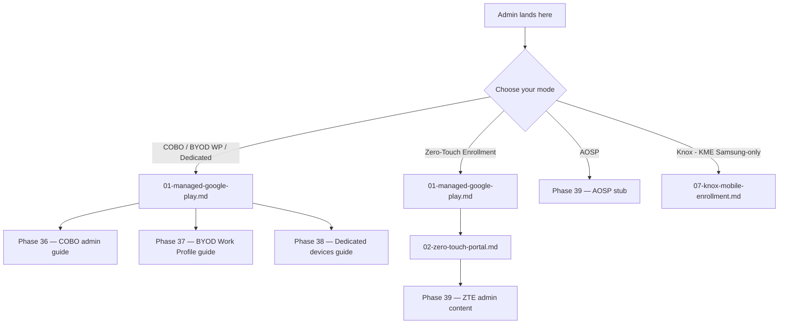
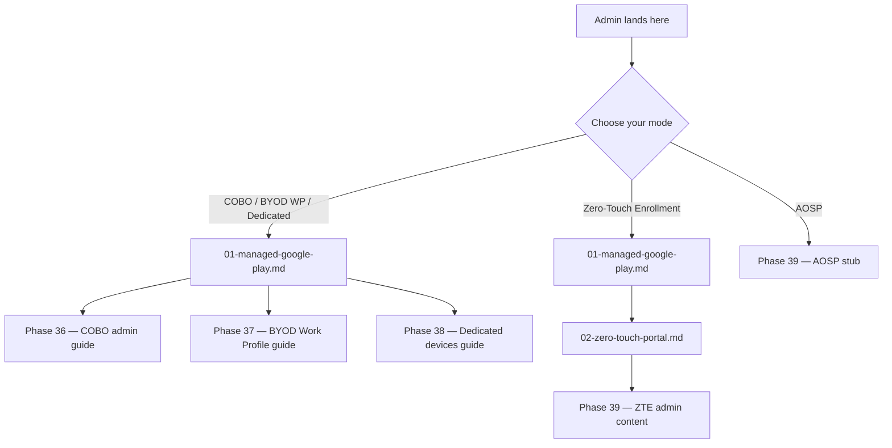

# Phase 44: Knox Mobile Enrollment — Research

**Researched:** 2026-04-25
**Domain:** Samsung Knox Mobile Enrollment (KME) as a 4th-portal overlay on the tri-portal Android Enterprise admin pattern; L1/L2 runbook authoring; capability-matrix retrofit; Mermaid 6-branch update; glossary granularity; reciprocal forward-link pinning.
**Confidence:** HIGH (locked decisions D-01..D-04 from CONTEXT.md remove design ambiguity; this research is operational/citational, not design-exploratory)

<user_constraints>
## User Constraints (from CONTEXT.md)

### Locked Decisions

**D-01 — 5-SKU Disambiguation Table Structure:** Use Option 1B — five rows (KME / KPE / Knox Manage / Knox Suite / Knox Configure), with KPE row collapsing Standard|Premium into two adjacent columns. H2 title `## Knox SKU disambiguation (5 SKUs)`. Em-dash `—` in non-KPE Standard|Premium cells (no blanks, no `N/A`).

**D-02 — B2B 1-2 Day Approval Gate UX:** Use Option 2A — Step 0 callout above Step 1 in Setup Steps section, rendered as `## Step 0 — Samsung Knox Portal B2B account approval (1-2 business days)` H2. Body explicitly tells the admin to submit on Day 0 and lists what they can productively do during the wait.

**D-03 — DPC-Extras-JSON Cross-Paste Anti-Pattern Callout:** Use Option 3A — identical blockquote at the JSON-paste step in BOTH `07-knox-mobile-enrollment.md` and `02-zero-touch-portal.md`. Wrap with HTML comment marker `<!-- AEKNOX-03-shared-anti-paste-block -->` for grep discoverability and future drift detection.

**D-04 — Glossary Granularity:** Use Option 4B with WPCO dropped. Add four new entries to `docs/_glossary-android.md`:
1. `### Knox` — umbrella entry; one-paragraph description; cross-link to admin doc for SKU breakdown
2. `### KME (Knox Mobile Enrollment)` — Samsung-only, Free, Knox portal → Intune handoff, mutex with ZT for Samsung devices
3. `### KPE (Knox Platform for Enterprise)` — Standard (free baseline) / Premium (per-device upgrade); Plan 1+ supplies Premium transparently
4. `### AMAPI (Android Management API)` — Google's MDM API surface that Intune calls for AOSP and Knox enrollment paths (and post-April-2025 COBO/BYOD)

Do NOT add a separate WPCO entry — already at glossary line 75.

### Claude's Discretion

- Anchor names for the new admin doc (`#prerequisites`, `#step-0-b2b-approval`, `#step-1-...`, `#dpc-extras-json`, `#sku-disambiguation`) — follow sibling doc conventions; planner picks final anchor slugs.
- Knox glossary entry length (target 1-2 sentences per peer pattern); planner can adjust.
- Mermaid branch label for the new Knox branch in `00-overview.md` — recommend "Knox (KME)" for full-name first / abbreviation discoverability.
- L1/L2 runbook prominent failure modes — D-10/D-12 patterns are locked; specific failures are researcher's call (now researched below).

### Deferred Ideas (OUT OF SCOPE)

- Audit harness C8 informational check for `AEKNOX-03-shared-anti-paste-block` HTML-comment marker drift detection — route to v1.5 backlog or Phase 47.
- Knox Manage / Knox Suite / Knox Configure first-class admin guides — disambiguation only in 5-SKU table; not full procedures.
- Samsung tablet / wearable / Galaxy XR KME variants — routed to Phase 45 (per-OEM AOSP) and v1.5+ backlogs.
- DPC-extras-JSON validator at lint time — v1.5 tooling backlog candidate.
- Cross-platform Knox analog explainer — out of locked Samsung-only scope.

</user_constraints>

<phase_requirements>
## Phase Requirements

| ID | Description | Research Support |
|----|-------------|------------------|
| AEKNOX-01 | Samsung KME admin guide (`docs/admin-setup-android/07-knox-mobile-enrollment.md`) — 4th-portal overlay; B2B onboarding; reseller + KDA paths; EMM profile + Intune DPC-extras JSON; 5-SKU disambiguation; "free baseline; Knox Suite gates advanced" framing; reciprocal ZT mutual-exclusion callout | §1 Domain Census (KME mechanics + DPC JSON), §2 Sibling Doc Pattern Analysis, §7 Glossary Census (cross-link target) |
| AEKNOX-02 | Android L1 runbook 28 (`docs/l1-runbooks/28-android-knox-enrollment-failed.md`) — KME-specific enrollment failures; D-10 sectioned actor-boundary + D-12 three-part escalation; Play Integrity only | §3 L1/L2 Runbook Pattern Census; §1 failure modes (B2B-account-not-approved / reseller-doesn't-show-device / KME-profile-mismatch / Knox-license-expired / DPC-extras-JSON-wrong-format) |
| AEKNOX-03 | Android L2 runbook 22 (`docs/l2-runbooks/22-android-knox-investigation.md`) — Knox portal → Intune handoff audit; Play Integrity 3-tier verdicts; zero SafetyNet tokens | §3 L1/L2 Runbook Pattern Census (D-09 escalation packet, Pattern A-E structure mirror); §1 (Knox tripped + integrity issues) |
| AEKNOX-04 | Capability matrix anchor rename `#deferred-knox-mobile-enrollment-row` → `#knox-mobile-enrollment-row`; populate live row | §5 Reciprocal Pin Census (matrix line 86 cross-ref + lines 113-119 anchor edit); §1 Domain Census (KME row data) |
| AEKNOX-05 | Mermaid 5→6-branch update in `00-overview.md`; Setup Sequence numbered list updated with Knox step | §6 Mermaid Update Census (line 26-36 mermaid block; line 38-40 numbered list) |
| AEKNOX-06 | Glossary entries Knox / KME / KPE (+ AMAPI if missing); populate `02-provisioning-methods.md#knox-mobile-enrollment` anchor | §7 Glossary Census; verified AMAPI already at line 124 — D-04 RESEARCH note: AMAPI is NOT missing but the entry should be cross-linked from new Knox/KME entries; CONTEXT.md treats "(+ AMAPI if missing)" as add-only-if-missing |
| AEKNOX-07 | Reciprocal forward-link pins: ZT `02-zero-touch-portal.md:16` + `03-fully-managed-cobo.md:162` Samsung-admins callout | §5 Reciprocal Pin Census (exact line numbers + sketched pin text) |
</phase_requirements>

## Project Constraints (from CLAUDE.md)

CLAUDE.md scope is the Autopilot toolkit (PowerShell + FastAPI + React) — not the documentation build. No documentation-authoring directives in CLAUDE.md apply to Phase 44. The doc tree under `docs/` is governed by the v1.4 Phase 34 admin template + audit harness contract, not CLAUDE.md.

Indirect CLAUDE.md alignment: the documentation suite already follows CLAUDE.md's "doc-first, role-based, generic over environment-specific" principles. Phase 44 inherits these by default via the Phase 34 template.

## Summary

Phase 44 ships Samsung Knox Mobile Enrollment (KME) as a first-class Intune enrollment path, completing the v1.4 forward-promise pinned at `docs/admin-setup-android/02-zero-touch-portal.md:16` and `docs/admin-setup-android/03-fully-managed-cobo.md:162`. The phase's primary editorial purpose is preventing the **"KME requires paid Knox license"** misconception by surfacing the Samsung-confirmed 2024 licensing model: KME itself is free; KPE Premium is now provided at no cost (Samsung documentation, last updated 2024-03-21); Intune supplies KPE Premium transparently to Samsung devices managed via Plan 1+. Every editorial decision in CONTEXT.md (5-SKU H2 table not footnote, glossary granularity, anti-paste callout) was selected on misconception-prevention grounds.

Three operationally significant findings drive the plan:

1. **B2B account approval is the load-bearing gate** — Samsung Knox B2B accounts require 1-2 business day approval (verbatim Samsung documentation, re-verified 2026-04-25 via Microsoft Learn `setup-samsung-knox-mobile` updated 2026-04-14 and Samsung Knox docs FAQ). D-02 H2 Step 0 placement at top-of-procedure is the canonical positioning of this latency.
2. **DPC-extras JSON for KME is field-name-distinct from ZT** — KME uses ONLY `com.google.android.apps.work.clouddpc.EXTRA_ENROLLMENT_TOKEN` as a flat key inside the Knox profile's "Custom JSON Data" field, NOT the nested `PROVISIONING_ADMIN_EXTRAS_BUNDLE` wrapper that ZT uses. D-03 anti-paste callout is operationally critical: pasting ZT JSON into KME silently fails because Knox does not recognize the wrapper structure.
3. **KME is provisioning method onto COBO mode** — KME does NOT enroll devices into a separate "KME mode"; it provisions Samsung devices into one of the three existing Android Enterprise device-owner modes (Fully Managed / Dedicated / WPCO) via the Knox portal handoff. This frames runbook 28 as an extension of the COBO failure space (sibling to runbook 27 ZTE-failed), not a new triage branch.

**Primary recommendation:** Execute the phase as 7 plans matching the 7 AEKNOX-NN requirements, with Plan order Knox-admin-doc → L1 28 → L2 22 → matrix retrofit → Mermaid + Setup Sequence → glossary → reciprocal pins. Plans 4-7 are append-only on shared files (capability matrix / Mermaid / glossary / ZT + COBO docs) per Phase 42 D-03 precedent — no parallel-merge conflicts within Phase 44 because the shared-file edits target disjoint line ranges.

## Architectural Responsibility Map

Phase 44 is documentation-only — no application tier maps. The tier model adapted for documentation:

| Capability | Primary Tier | Secondary Tier | Rationale |
|------------|-------------|----------------|-----------|
| KME admin procedure | `docs/admin-setup-android/` (admin-tier) | — | Sibling to 02/03/04/05/06; matches tri-portal+ admin pattern |
| KME-specific L1 triage | `docs/l1-runbooks/` (L1-tier) | — | Mode-first triage tree already routes Samsung KME through ANDR28 (placeholder); runbook 28 closes the routing |
| KME failure investigation | `docs/l2-runbooks/` (L2-tier) | — | Pattern-based investigation; mirrors L2 runbook 19 (enrollment investigation) Pattern C structure |
| Cross-mode capability summary | `docs/reference/android-capability-matrix.md` | — | Anchor-rename retrofit, not new section |
| Mode discovery diagram | `docs/admin-setup-android/00-overview.md` | — | Mermaid is canonical mode router; Knox is a 6th branch (Samsung-overlay on existing modes) |
| Term disambiguation | `docs/_glossary-android.md` | — | Alphabetical glossary; Knox/KME/KPE are new terms; AMAPI already exists at line 124 |
| Provisioning method matrix | `docs/android-lifecycle/02-provisioning-methods.md` | — | Anchor `#knox-mobile-enrollment` exists at line 50; population (not new section) |
| Reciprocal forward-link pin | `docs/admin-setup-android/02-zero-touch-portal.md:16` + `docs/admin-setup-android/03-fully-managed-cobo.md:162` | — | Closes v1.4 forward-promises; surgical edit, not rewrite |

**Tier ownership rule:** Knox content lives in the `admin-setup-android/` tree (sibling 07) and the existing l1/l2 runbook trees. NO content lives in `docs/android-lifecycle/` (concept tier) — the lifecycle anchor at `02-provisioning-methods.md#knox-mobile-enrollment` is a one-paragraph populate, not a new lifecycle doc.

## Standard Stack

Phase 44 is documentation-only — no software stack changes. The "stack" is the v1.4 doc-authoring stack already in place:

### Core (locked from Phase 34/Phase 42)

| Component | Version | Purpose | Why Standard |
|-----------|---------|---------|--------------|
| Android admin template | Phase 34 | Frontmatter + structure baseline (last_verified, review_by, audience, applies_to) | C5 freshness check requires it; sibling docs all use it |
| 60-day Android freshness cycle | Phase 34 D-14 | review_by = last_verified + 60d | Audit harness C5 enforces this |
| D-10 sectioned actor-boundary | Phase 40 D-10 | L1 runbook actor delineation (L1 vs admin sections) | runbook 27 sibling pattern |
| D-12 three-part escalation packet | Phase 40 D-12 | L1 → L2 escalation with token-state / profile-state / GUID | runbook 27 sibling pattern |
| D-09 Pattern-based L2 investigation | Phase 41 D-09 | L2 runbook structure with Pattern A-E + Microsoft Support escalation packet per pattern | L2 runbook 19 sibling pattern |
| Play Integrity 3-tier verdicts | Phase 41 | Basic / Basic+Device / Strong integrity (zero SafetyNet) | Audit C1 enforces zero SafetyNet |
| Audit harness v1.4.1 | Phase 43 | C1-C5 enforced; C6/C7/C9 informational-first | scripts/validation/v1.4.1-milestone-audit.mjs |
| Allow-list sidecar | Phase 43 | scripts/validation/v1.4.1-audit-allowlist.json (18 supervision pins; 4 SafetyNet pins; 3 COPE banned-phrases) | C2 / C1 / C9 read this |

[VERIFIED: scripts/validation/v1.4.1-milestone-audit.mjs lines 1-388; v1.4.1-audit-allowlist.json — both read in this session]

### Supporting (verbatim from Phase 35/36/40/41)

| Pattern | Source File | When to Use |
|---------|-------------|-------------|
| Step-numbered admin guide H2 (`## Step N — Title`) | `02-zero-touch-portal.md:33` | Knox admin doc Setup Steps |
| Inline `> **What breaks if misconfigured:**` blockquote | `03-fully-managed-cobo.md:79,89,93,119,121,123` | Each Knox admin doc decision point |
| Emoji-bearing blockquote callout (`> ⚠️ ...`) | `02-zero-touch-portal.md:16` | KME/ZT mutex callout + DPC anti-paste callout |
| `<a id="anchor-name"></a>` HTML anchor | `02-zero-touch-portal.md:23,32,43,56,88,119,128,...` | All H2/H3 anchors in Knox admin doc |
| Prereq → Step 0 → Step N → Verification → Common failures → Changelog skeleton | `02-zero-touch-portal.md` overall | Knox admin doc full structure |
| L1 runbook Cause A-D + Cause E (escalate-only) | `27-android-zte-enrollment-failed.md` | Knox L1 runbook 28 structure |
| L2 runbook Pattern A-E with Microsoft Support escalation packet (D-09) | `19-android-enrollment-investigation.md` | Knox L2 runbook 22 structure |

### Alternatives Considered (rejected by CONTEXT.md decisions)

| Instead of | Could Use | Tradeoff (why rejected) |
|------------|-----------|--------------------------|
| 5-row KPE-merged table (D-01) | 6-row table with separate KPE Standard / KPE Premium rows | Rejected: REQUIREMENTS line 21 literal "5-SKU disambiguation" |
| Step 0 H2 (D-02) | Inline blockquote at top of Step 1 | Rejected: 1-2-day latency needs maximum visual weight |
| Identical blockquote (D-03) | Conditional "if you came from ZT" callout | Rejected: weakens protection for first-time configurers |
| 4 glossary entries (D-04) | Umbrella Knox entry only | Rejected: breaks `#kme` and `#kpe` deep-link anchors used by capability matrix |

## Architecture Patterns

### System Architecture Diagram (data flow through doc tree)

```
[Reader entry points]
    |
    +-- docs/admin-setup-android/00-overview.md (Mermaid 6-branch chart)
    |       |
    |       +--> [Knox (KME) branch — NEW] ----> docs/admin-setup-android/07-knox-mobile-enrollment.md
    |       |
    |       +--> [COBO / BYOD WP / Dedicated / ZTE / AOSP — existing 5 branches]
    |
    +-- docs/admin-setup-android/02-zero-touch-portal.md:16 (KME/ZT mutex callout — pin updated)
    |       |
    |       +--> Forward-link to 07-knox-mobile-enrollment.md (NEW reciprocal pin)
    |
    +-- docs/admin-setup-android/03-fully-managed-cobo.md:162 (Samsung admins callout — pin updated)
    |       |
    |       +--> Forward-link to 07-knox-mobile-enrollment.md (NEW reciprocal pin)
    |
    +-- docs/decision-trees/08-android-triage.md (mode-first triage)
    |       |
    |       +--> ANDR28 routes to L1 runbook 28 (Knox-failed) — Phase 40 placeholder closes
    |
    +-- docs/_glossary-android.md (alphabetical index line 15)
            |
            +--> Knox / KME / KPE entries (NEW) — cross-link to admin doc 07
            +--> AMAPI entry (existing line 124) — cross-link added FROM new entries

[L1 routes to L2]
    docs/l1-runbooks/28-android-knox-enrollment-failed.md (NEW)
        |
        +-- Escalation Criteria → docs/l2-runbooks/22-android-knox-investigation.md (NEW)

[Capability matrix (reference tier)]
    docs/reference/android-capability-matrix.md
        |
        +-- Cross-Platform Equivalences §86 → references #deferred-knox-mobile-enrollment-row
        +-- Lines 113-119 → anchor RENAME + populate live row
        +-- Line 86 cross-ref → updated to use new anchor #knox-mobile-enrollment-row

[Provisioning method matrix (lifecycle tier)]
    docs/android-lifecycle/02-provisioning-methods.md:50 anchor #knox-mobile-enrollment-kme---deferred-to-v141
        |
        +-- ANCHOR REPLACE: section becomes "Knox Mobile Enrollment (KME)" (no "deferred"); cross-link to admin doc 07
```

### Recommended Project Structure

```
docs/
├── admin-setup-android/
│   ├── 00-overview.md                            # MERMAID 5→6 branch update + Setup Sequence list (AEKNOX-05)
│   ├── 02-zero-touch-portal.md                   # PIN UPDATE line 16 + DPC-anti-paste callout (AEKNOX-07 + D-03)
│   ├── 03-fully-managed-cobo.md                  # PIN UPDATE line 162 (AEKNOX-07)
│   └── 07-knox-mobile-enrollment.md              # NEW — KME admin guide (AEKNOX-01)
├── l1-runbooks/
│   └── 28-android-knox-enrollment-failed.md      # NEW — KME L1 runbook (AEKNOX-02)
├── l2-runbooks/
│   └── 22-android-knox-investigation.md          # NEW — KME L2 runbook (AEKNOX-03)
├── reference/
│   └── android-capability-matrix.md              # ANCHOR RENAME + populate row (AEKNOX-04)
├── android-lifecycle/
│   └── 02-provisioning-methods.md                # POPULATE #knox-mobile-enrollment anchor (AEKNOX-06)
└── _glossary-android.md                          # 4 new entries: Knox / KME / KPE / AMAPI cross-link (AEKNOX-06)
```

### Pattern 1: Step-numbered admin guide skeleton

**What:** H2-numbered procedural skeleton matching `02-zero-touch-portal.md`.
**When to use:** Knox admin doc body structure.
**Example (sourced from `02-zero-touch-portal.md` lines 23-46):**

```markdown
<a id="prerequisites"></a>
## Prerequisites
- [ ] hard prereqs as bulleted checklist with `**bold name**` and `— description` form

<a id="step-0-b2b-approval"></a>
## Step 0 — Samsung Knox Portal B2B account approval (1-2 business days)
[per D-02: tells admin to submit on Day 0; lists what they can do during wait]

<a id="step-1-..."></a>
## Step 1 — [first concrete action]
#### In Knox Admin Portal
1. Navigate to ...
   > **What breaks if misconfigured:** ...
```

### Pattern 2: L1 runbook actor-boundary (D-10) + escalation packet (D-12)

**What:** L1 runbook structured with `## Cause A` ... `## Cause D` (each independently diagnosable), plus `## Escalation Criteria` for Cause E (admin-only). Each Cause has Symptom / L1 Triage Steps / Admin Action Required / Verify / Escalation sub-H3s.
**When to use:** L1 runbook 28 structure.
**Example (sourced from `27-android-zte-enrollment-failed.md` lines 41-202):**

```markdown
## Cause A: Device Not Uploaded by Reseller {#cause-a-device-not-uploaded-by-reseller}

**Entry condition:** [admin-confirmable observable]

### Symptom
[user-reported, observable in Intune admin center, observable in Knox Admin Portal]

### L1 Triage Steps
1. > **Say to the user:** "I'll verify whether..."
2. In Intune admin center, navigate to ... <!-- verify UI at execute time -->
3. Collect [identifiers] for admin escalation

### Admin Action Required
**Ask the admin to:**
- Open the [Knox Admin Portal | Intune admin center | reseller channel]...
- [admin action]

**Verify:** [what success looks like]

**If the admin confirms none of the above applies:** Route to next Cause
```

### Pattern 3: L2 runbook Pattern-based investigation (D-09)

**What:** Pattern A-E investigation with Symptom / Known Indicators / Resolution Steps / Microsoft Support escalation packet per Pattern.
**When to use:** L2 runbook 22 structure.
**Example (sourced from `19-android-enrollment-investigation.md` lines 114-265):**

```markdown
### Pattern A: [Pattern Name] {#pattern-a-anchor}

**Typical class:** ⚙️ Config Error | 🐛 Defect | ⏱️ Timing

**Symptom:** [observable in Intune admin center / Knox Admin Portal]

**Known Indicators:**
- bullet list of diagnostic signals

**Resolution Steps:**
1. Numbered steps with cross-links to admin doc anchors

**Microsoft Support escalation packet (D-09):**
- **Token sync status:** [from Intune admin center > ... screenshot]
- **Profile assignment state:** [from Knox Admin Portal screenshot]
- **Enrollment profile GUID:** [from Intune admin center URL OR Graph API READ-ONLY]
```

### Pattern 4: Reciprocal pin placement

**What:** Surgical line-targeted edit of an existing forward-promise to add a reverse-link to the new doc.
**When to use:** Phase 35 ZT line 16 + Phase 36 COBO line 162.
**Example (existing line 16 of `02-zero-touch-portal.md`):**

```markdown
<!-- BEFORE -->
> ⚠️ **KME/ZT mutual exclusion (Samsung):** ... Full KME coverage is tracked for v1.4.1. See [KME/ZT Mutual Exclusion](#kme-zt-mutual-exclusion) below.

<!-- AFTER (Phase 44) -->
> ⚠️ **KME/ZT mutual exclusion (Samsung):** ... See [Knox Mobile Enrollment](07-knox-mobile-enrollment.md) for full KME admin coverage and [KME/ZT Mutual Exclusion](#kme-zt-mutual-exclusion) below for the within-this-doc record.
```

### Anti-Patterns to Avoid

- **Bare-`Knox` references** — every `Knox` mention should carry a SKU qualifier within 50 characters (Mobile Enrollment / Platform for Enterprise / Suite / Manage / Configure). Audit C7 is informational-first but tracks this for v1.5 promotion.
- **Treating KME as a separate enrollment mode** — KME provisions devices INTO COBO/Dedicated/WPCO modes; the matrix and runbook framing must reflect this.
- **Pasting ZT DPC-extras JSON into Knox profile** — silent failure (D-03 anti-paste callout). KME uses flat `EXTRA_ENROLLMENT_TOKEN` key, not nested `PROVISIONING_ADMIN_EXTRAS_BUNDLE`.
- **"Knox license required" framing** — KME is free; KPE Premium is now free (Samsung 2024-03-21 confirmation); Intune Plan 1+ supplies Premium transparently. The doc's primary editorial purpose is preventing this misconception.

## Don't Hand-Roll

| Problem | Don't Build | Use Instead | Why |
|---------|-------------|-------------|-----|
| New runbook structure | Bespoke Knox-failed L1 layout | D-10 Cause A-D + Cause E from runbook 27 | Validated by Phase 40/41; audit C2/C5 already pinned to this shape |
| New L2 investigation skeleton | Bespoke pattern set | D-09 Pattern A-E with escalation packet from runbook 19 | Validated by Phase 41; audit C1 enforces Play Integrity 3-tier |
| New glossary structure | Knox category H2 | Insert into existing alphabetical index at line 15 | Phase 34 D-09 locked 5-category H2 structure (Enrollment / Ownership / Provisioning Methods / Portals & Binding / Compliance & Attestation) |
| New mermaid diagram | Standalone Knox flowchart | Extend the existing 5-branch mermaid to 6 branches | Reader cognitive overhead; one canonical mode router |
| New audit check for Knox | Custom regex check | Inherit C7 informational-first (already in v1.4.1 harness) | Phase 43 D-06 lock; Phase 44 is content-only, not harness-extension |
| Knox-specific frontmatter schema | New `knox_tier:` field | Use existing `applies_to:` field with value `Knox` | Phase 34 admin template lock |

**Key insight:** Phase 44 inherits a complete authoring framework from v1.4. Every new file uses an existing template; every shared-file edit is append-only on a known line range. The phase is operational/citational, not architectural.

## Runtime State Inventory

Phase 44 is documentation authoring, not rename/refactor/migration. **Step 2.5 SKIPPED — no runtime state to inventory.** No databases, services, OS-registered state, secrets, or build artifacts are in scope.

## Common Pitfalls

### Pitfall 1: Pasting ZT DPC-extras JSON into the Knox profile (or vice versa)

**What goes wrong:** The KME profile's "Custom JSON Data" field accepts ANY JSON. Pasting the full ZT JSON wrapper (`PROVISIONING_DEVICE_ADMIN_COMPONENT_NAME` + `PROVISIONING_DEVICE_ADMIN_SIGNATURE_CHECKSUM` + `PROVISIONING_DEVICE_ADMIN_PACKAGE_DOWNLOAD_LOCATION` + `PROVISIONING_ADMIN_EXTRAS_BUNDLE` wrapper) silently produces a "stuck applying configuration" device-side failure. KME expects ONLY the inner extras key.
**Why it happens:** Both ZT portal and Knox Admin Portal accept similar JSON-shaped strings; the ZT JSON example at `02-zero-touch-portal.md:93-105` is visually similar to a KME custom JSON; admins maintaining both portals copy-paste between them.
**How to avoid:** D-03 identical anti-paste blockquote at the JSON-paste step in BOTH `07-knox-mobile-enrollment.md` and `02-zero-touch-portal.md`; HTML-comment marker `<!-- AEKNOX-03-shared-anti-paste-block -->` for grep discoverability.
**Warning signs:** Device hits "Applying configuration..." screen and never advances; Knox Admin Portal shows enrollment as "Started" but Intune admin center never sees the device.
[VERIFIED: Microsoft Learn `setup-samsung-knox-mobile` (updated 2026-04-14) documents only the inner extras key as the required JSON; Samsung Knox docs FAQ confirms QR-based KME enrollment failure modes; community report at androidenterprise.community/conversations/3112 documents Samsung S23 stuck-enrollment cases]

### Pitfall 2: Submitting B2B account creation late in the procedure

**What goes wrong:** Admin discovers KME requirement and tries to ship devices the same week — runs into the 1-2 business day Samsung approval gate AT the moment they need to ship.
**Why it happens:** B2B account approval is a Samsung-side process; Intune admin docs do not surface it; admins discover it only when blocked.
**How to avoid:** D-02 H2 Step 0 placement at top of Setup Steps; body explicitly tells the admin to submit on Day 0 and lists productive parallel work (read rest of doc; identify devices; align with reseller).
**Warning signs:** Knox Admin Portal sign-in fails with "Account pending approval"; Samsung Knox support ticket open against the B2B account.
[VERIFIED: Microsoft Learn `setup-samsung-knox-mobile` (updated 2026-04-14) verbatim: "Samsung Knox accounts require approval from Samsung, which can take one to two business days." Re-verified 2026-04-25.]

### Pitfall 3: Configuring KME and ZT on the same Samsung device

**What goes wrong:** Device registered in BOTH Knox Mobile Enrollment AND Zero-Touch enrolls via KME (KME takes precedence). The ZT configuration is silently ignored. Admins observing Intune admin center see the device enrolled but NOT through the expected ZT flow; ZT portal shows the claim but no first-boot activity from that device.
**Why it happens:** Samsung firmware-level behavior — cannot be overridden via Intune or ZT portal. Some orgs migrate from KME to ZT and forget to remove the KME profile.
**How to avoid:** Reciprocal mutex callouts at top of both docs (already exist in ZT line 16; new in Knox doc). KME L1 runbook 28 includes a "ZT collision" cause; ZT L1 runbook 27 already includes a Cause D for this from the ZT side.
**Warning signs:** Samsung device shows "Android Enterprise fully managed" enrollment type; ZT portal claim shows but no enrollment.
[VERIFIED: Google AE Help `support.google.com/work/android/answer/7514005`: "If a device is registered and configured in both Knox Mobile Enrollment and zero-touch, the device will enroll using Knox Mobile Enrollment." Already cited in ZT doc line 181.]

### Pitfall 4: Reseller upload latency (24h-style — does NOT match KME flow)

**What goes wrong:** Admin assumes reseller upload to Knox Admin Portal is instantaneous like ZT-portal upload; ships devices before Knox profile assignment is complete; devices boot to consumer Setup Wizard.
**Why it happens:** Knox Admin Portal "Approve device uploads" workflow is admin-side; reseller side may have additional latency. Sibling reseller flow (ZT) has its own 24h latency disclaimer at `27-android-zte-enrollment-failed.md:72`.
**How to avoid:** Knox admin doc Verification step explicitly states "After reseller upload: device appears in Knox Admin Portal Devices view within 24 hours (reseller upload latency); device must be assigned a profile BEFORE first boot for KME enrollment to trigger."
**Warning signs:** Device serial absent from Knox Admin Portal Devices view AND first boot has occurred → must factory-reset and re-attempt.
[CITED: Samsung Knox docs `admin/knox-mobile-enrollment/how-to-guides/manage-devices/approve-device-uploads/`]

### Pitfall 5: KME profile mismatch (assigned profile differs from intended Intune mode)

**What goes wrong:** Knox profile created for Fully Managed but admin intended Dedicated; OR Knox profile EMM template uses wrong DPC component; device enrolls into wrong Intune mode.
**Why it happens:** Knox Admin Portal's profile creation form accepts a freeform EMM choice; misconfigurations don't fail at profile-creation time, only at device-enrollment time.
**How to avoid:** Knox admin doc explicit "Verify EMM choice = 'Microsoft Intune' AND Custom JSON Data contains the inner extras key only" checkpoint at Step N.
**Warning signs:** Device enrolls but with wrong enrollment type in Intune admin center (Fully Managed instead of Dedicated, etc.).

### Pitfall 6: Knox tripped status preventing enrollment

**What goes wrong:** Samsung devices have a hardware-level "Knox tripped" flag (set when bootloader unlocked, root achieved, custom recovery flashed). Even with stock OS and locked bootloader, a tripped flag is sticky and prevents KME enrollment from succeeding.
**Why it happens:** Knox attestation runs at the device firmware level; once tripped, the flag is permanent.
**How to avoid:** Knox L2 runbook 22 includes a Pattern for "Knox tripped" investigation: confirm via Knox Admin Portal "Knox eFuse status" check; if tripped, device is non-recoverable for KME and must use a non-Knox enrollment path (Company Portal BYOD, or non-KME COBO).
**Warning signs:** Device fails enrollment with cryptic error; bootloader was previously unlocked or recovery flashed.
[VERIFIED: Microsoft Q&A `learn.microsoft.com/answers/questions/2282160` documents "Unable enroll to Intune on Samsung Knox Tripped" case (June 2025).]

## Code Examples

Phase 44 is doc authoring; "code" here is markdown patterns that the planner copies verbatim or adapts.

### Example 1: Knox Custom JSON Data (verbatim from Microsoft Learn)

```json
{"com.google.android.apps.work.clouddpc.EXTRA_ENROLLMENT_TOKEN": "enter Intune enrollment token string"}
```

[VERIFIED: Microsoft Learn `setup-samsung-knox-mobile` (updated 2026-04-14) — verbatim string. Note this is FLAT (no PROVISIONING_ADMIN_EXTRAS_BUNDLE wrapper) and contrasts with `02-zero-touch-portal.md:93-105` ZT JSON which uses the wrapper.]

### Example 2: D-03 anti-paste blockquote (verbatim from CONTEXT.md)

```markdown
<!-- AEKNOX-03-shared-anti-paste-block -->
> ⚠️ **DO NOT paste this JSON into the other portal**
> The KME and ZT DPC-extras JSON look similar but use different field names.
> Pasting ZT JSON into KME (or vice versa) silently produces a "stuck applying configuration" failure.
> If you maintain both portals: confirm the portal name in your browser tab before pasting.
<!-- /AEKNOX-03-shared-anti-paste-block -->
```

### Example 3: 5-SKU disambiguation table (per D-01)

```markdown
## Knox SKU disambiguation (5 SKUs)

| SKU | KPE Standard | KPE Premium | Cost | Required for KME | Intune relationship |
|---|---|---|---|---|---|
| KME | — | — | Free | YES (the deliverable itself) | Knox portal → Intune handoff |
| KPE | Free baseline | Per-device upgrade (now free per Samsung 2024-03-21) | Free / Premium tier | NOT required for KME | Plan 1+ supplies Premium transparently |
| Knox Manage | — | — | Per-device | N/A — alternative MDM | Mutually exclusive with Intune |
| Knox Suite | — | — | Per-device bundle | NOT required for KME | Bundle that includes KPE Premium |
| Knox Configure | — | — | Per-device | NOT required for KME | Independent |
```

[CITED: Samsung Knox docs `admin/knox-platform-for-enterprise/before-you-begin/knox-platform-for-enterprise-licenses/` (last updated 2024-03-21): "Samsung provides KPE Premium licenses at no cost. Premium licenses include 10,000,000 seats expiring two years from activation." + Samsung KPE Licensing Update blog `samsungknox.com/en/blog/samsung-knox-platform-for-enterprise-kpe-licensing-update`]

### Example 4: Mermaid 6-branch update (per AEKNOX-05)



Recommended branch label `Knox (KME)` per CONTEXT.md Claude's Discretion. Branch terminates at Knox admin doc directly (Knox Admin Portal is the 4th portal, sequential to MGP — but for diagram readability the branch goes admin-doc-direct since the Knox portal is sourced via admin doc Step N).

## State of the Art

| Old Approach | Current Approach | When Changed | Impact |
|--------------|------------------|--------------|--------|
| KPE Premium per-device paid license | KPE Premium free (10,000,000 seats / 2-year activation) | 2024-03-21 (Samsung policy update) | Removes the "KME requires paid Knox license" misconception baseline. Intune Plan 1+ supplies Premium transparently. |
| SafetyNet Attestation API | Play Integrity API (Basic / Basic+Device / Strong) | 2025-01 (Google turn-off) | Knox L2 runbook 22 must use Play Integrity verdicts only (audit C1). |
| Custom OMA-URI for BYOD | AMAPI templates for BYOD | 2025-04 (AMAPI migration) | Glossary AMAPI entry already exists at line 124; new Knox/KME entries cross-link to it. |
| Knox tripped → some EMMs degraded | Knox tripped → Intune KME fails enrollment | June 2025 (community report) | Knox L2 runbook 22 must include Knox-tripped diagnostic Pattern. |
| ZT/KME admin guides as separate forward-promises | ZT/KME admin guides reciprocally pinned | 2026-04 (Phase 44 — this phase) | Closes v1.4 forward-promises pinned at `02-zero-touch-portal.md:16` + `03-fully-managed-cobo.md:162`. |

**Deprecated/outdated:**
- "Knox standard license required for KME" — outdated; KME is free, KPE Premium is free.
- "SafetyNet for Android compliance" — turned off January 2025; never appears in v1.4.1 docs except in deprecation context (4 SafetyNet pins in audit allow-list).
- "COPE deprecated" — Google has NOT issued a formal deprecation; banned phrases in audit C9 (sidecar-driven).

## Sibling Doc Pattern Analysis (§2)

### Patterns to mirror from `docs/admin-setup-android/02-zero-touch-portal.md`

| Pattern | Line(s) | Note |
|---------|---------|------|
| Frontmatter | 1-7 | `last_verified: 2026-04-25`, `review_by: 2026-06-24`, `audience: admin`, `platform: Android`, `applies_to: KME` |
| Platform gate blockquote | 11-12 | `> **Platform gate:** Knox Mobile Enrollment ... For iOS, see ...; for macOS, ...; for terminology, [Android glossary]` |
| Reseller-style prerequisite blockquote | 14 | Adapt for Samsung-purchase prerequisite |
| Emoji-bearing safety callout | 16 | KME/ZT mutex callout (mirror existing); add D-03 anti-paste callout adjacent to JSON |
| Prerequisites H2 | 23-30 | `<a id="prerequisites"></a> ## Prerequisites` checklist |
| Step 0 H2 (D-02 model) | 32-41 | `<a id="step-0-..."></a> ## Step 0 — Samsung Knox Portal B2B account approval (1-2 business days)` |
| Per-portal H4 (`#### In Knox Admin Portal`) | 46, 70, 81 | Mirror per-portal sub-H4 pattern; Knox doc has `#### In Knox Admin Portal` and `#### In Intune admin center` |
| What-breaks blockquote inside numbered step | 52, 77 | `> **What breaks if misconfigured:** ...` form |
| DPC extras JSON code-block | 88-105 | Mirror format; D-03 blockquote sits above |
| Mutex H2 with anchor | 119-126 | Knox doc has its own mutex narrative; ZT doc keeps line 16 + line 119 mutex H2 |
| Verification checklist | 198-205 | `## Verification` after enrollment |
| Renewal/Maintenance table | 207-213 | Per-component renewal table |
| See Also list | 215-222 | Cross-links to MGP, overview, glossary |
| Changelog | 226-229 | One row per phase delta |

### Patterns to mirror from `docs/admin-setup-android/03-fully-managed-cobo.md`

| Pattern | Line(s) | Note |
|---------|---------|------|
| Inline `> What breaks if misconfigured` callouts | 79, 89, 93, 119, 121, 123 | Each Knox decision point gets one |
| What Breaks Summary table | 197-216 | Knox doc gets equivalent table |
| Conditional Access reminder block | 132 | If KME enrollment also triggers Chrome-tab CA; this is locked context — KME provisions to COBO/Dedicated/WPCO so SAME CA exclusion applies; Knox doc cross-references rather than restates |
| Configure-X sub-H3 with `#### In Intune admin center` | 178 | Mirror for "Configure Intune enrollment profile for KME staging token" sub-procedure |

## L1/L2 Runbook Pattern Census (§3)

### From `docs/l1-runbooks/27-android-zte-enrollment-failed.md` (D-10 / D-12 model for L1 28)

| Section | Lines | Adopt verbatim shape |
|---------|-------|----------------------|
| Frontmatter | 1-7 | `applies_to: KME`, `audience: L1`, `platform: Android`, 60-day freshness |
| Platform gate blockquote | 9 | Identical pattern; swap "ZTE" for "KME" |
| H1 + 1-paragraph context | 11-13 | "L1 runbook for KME enrollment failures: device was expected to enroll automatically via Knox Mobile Enrollment but did not..." |
| Applies-to scope | 15 | "Applies to Samsung KME only. For non-Samsung corporate enrollment failures see runbook 27 (ZTE)." |
| Triage tree routing reference | 17 | "Routed here from the [Android Triage Decision Tree](../decision-trees/08-android-triage.md) ANDR28 branch." |
| Prerequisites + portal shorthand | 19-26 | P-INTUNE = Intune admin center; **P-KAP = Knox Admin Portal** (Samsung-specific, admin-only) — mirror exact pattern |
| L1 scope note | 28 | "Knox Admin Portal is admin-only. L1 observes Intune-side symptoms..." |
| How to use this runbook | 30-39 | List Causes A-D + Cause E (escalate-only); cause ordering by frequency |
| Cause A-D structure | 43-203 | Each: Entry condition / Symptom / L1 Triage Steps / Admin Action Required / Verify / Escalation (within Cause) |
| Escalation Criteria H2 | 207-234 | Aggregate; cross-link to L2 runbook 22 + log collection |
| Back-to-triage footer | 237 | `[Back to Android Triage]` |

**Recommended Cause structure for runbook 28** (researcher's call per CONTEXT.md Claude's Discretion):
- **Cause A: B2B account approval pending** — most-common, gates ALL else; symptom is "cannot sign in to Knox Admin Portal"
- **Cause B: Device not in Knox Admin Portal Devices view** — reseller upload not done OR Knox Deployment App not used
- **Cause C: KME profile not assigned to device set** — profile exists but device shows no profile
- **Cause D: KME/ZT mutex collision (Samsung)** — device dual-configured; KME takes precedence (mirror runbook 27 Cause D from the inverse direction)
- **Cause E (escalate-only): Knox custom JSON wrong format / Knox tripped / Knox license expired** — admin-only DPC investigation + L2 escalation

### From `docs/l2-runbooks/19-android-enrollment-investigation.md` (D-09 model for L2 22)

| Section | Lines | Adopt verbatim shape |
|---------|-------|----------------------|
| Frontmatter + Platform gate | 1-9 | `applies_to: KME`, `audience: L2` |
| Context H2 | 13-17 | "This runbook covers Knox Mobile Enrollment failure investigation across Samsung KME-provisioned devices (provisions into COBO / Dedicated / WPCO modes)." |
| From-L1-escalation router | 19-24 | "L1 runbook 28 has escalated. L1 collected: serial number, KME profile name, device manufacturer = Samsung, observed Cause." |
| Graph API READ-ONLY scope blockquote | 26 | Identical lock |
| Investigation Data Collection | 28-110 | 4 steps: Device registration state / Enrollment restriction blade / Token + KME profile sync state / Device-side enrollment state |
| Pattern-based Analysis | 112-265 | A-E Patterns; for runbook 22: Pattern A KME profile misconfiguration / Pattern B Knox tripped status / Pattern C KME→ZT collision / Pattern D Knox license edge cases / Pattern E DPC custom JSON malformation |
| Resolution H2 | 267-285 | Microsoft Support escalation criteria + case data |
| Related Resources | 287-297 | Cross-links to runbook 18 log collection + L1 runbook 28 + admin doc 07 |

### Play Integrity 3-tier verdict structure (locked from Phase 41)

L2 runbook 22 must include Play Integrity verdict mapping for KME-related compliance:
- **Basic integrity** — device hardware/OS not detected as compromised
- **Basic + Device integrity** — adds basic device-recognition signal
- **Strong integrity** — requires hardware-backed boot attestation from device TEE (Knox attestation contributes here for Samsung devices)
- **Zero SafetyNet** — audit C1 enforces; never reference SafetyNet except in deprecation context (which would need allow-list pin in `safetynet_exemptions[]`)

[VERIFIED: scripts/validation/v1.4.1-milestone-audit.mjs lines 130-162 (C1 check) + glossary line 138 Play Integrity entry]

## Audit Harness Compliance Census (§4)

### C1 (Zero SafetyNet) for Phase 44 files

**Risk:** Knox L2 runbook 22 may reference Play Integrity vs SafetyNet history when discussing Samsung Knox attestation evolution.
**Mitigation:** Use ONLY Play Integrity 3-tier verdicts; if SafetyNet must appear (e.g., "Play Integrity is the successor to SafetyNet"), the +/-200 char window already passes C1 due to keywords `successor|turned off|deprecated|Play Integrity` in regex (harness line 152).
**Action:** No new SafetyNet pins required IF SafetyNet only appears with deprecation context. If a hard pin is needed, add to `safetynet_exemptions[]`.

### C2 (Zero supervision as Android mgmt term) for Phase 44 files

**Risk:** Knox glossary entries may reference "iOS supervision" as the cross-platform analog.
**Mitigation:** Treat all `supervision` references as iOS-attributed; pin per Phase 34 D-03 narrative pattern. New glossary entries Knox / KME / KPE should NOT use "supervision" without iOS attribution.
**Action:** If any new line in Phase 44 files references "iOS supervision" or "supervised device", **MUST add new pin** to `supervision_exemptions[]` in `scripts/validation/v1.4.1-audit-allowlist.json` per Phase 43 Plan 04 helper workflow.
**Estimated new pins:** 0-3 (depends on cross-platform note granularity in glossary entries; Knox/KME/KPE entries may not need iOS-supervision callouts since locked context is "Samsung-only, no cross-platform analog").

### C3 (AOSP word count — informational)

**Risk:** None — Knox content is not AOSP scoped.
**Action:** None.

### C4 (Zero Android links in deferred shared files)

**Risk:** None — Knox doc lives under `admin-setup-android/` which is NOT in the deferred-files target list (`docs/common-issues.md`, `docs/quick-ref-l1.md`, `docs/quick-ref-l2.md`).
**Action:** None. (Cross-platform nav is DEFER-07 / v1.5.)

### C5 (60-day freshness)

**Risk:** New Phase 44 files MUST use Phase 34 admin template frontmatter with `last_verified` + `review_by` set to date and date+60.
**Action:** Every new file:
- `docs/admin-setup-android/07-knox-mobile-enrollment.md`
- `docs/l1-runbooks/28-android-knox-enrollment-failed.md`
- `docs/l2-runbooks/22-android-knox-investigation.md`

…must have:
```yaml
---
last_verified: <execute-date>
review_by: <execute-date + 60d>
audience: admin | L1 | L2
platform: Android
applies_to: KME
---
```

Edits to existing files (`02-zero-touch-portal.md`, `03-fully-managed-cobo.md`, `00-overview.md`, `_glossary-android.md`, `02-provisioning-methods.md`, `android-capability-matrix.md`) need their `last_verified` bumped to execute date and `review_by` recalc to +60d per Phase 43 D-22 metadata-shift pattern. **Planner must include these frontmatter shifts as discrete steps in their Plans.**

### C7 (bare-Knox informational)

**Risk:** Knox admin doc + L1/L2 runbooks reference "Knox" frequently. C7 logs every bare-Knox occurrence (no SKU qualifier within 50 chars).
**Mitigation:** Most occurrences in Phase 44 will satisfy C7 because Knox is followed by Mobile Enrollment / Platform for Enterprise / Suite / Manage / Configure within 50 chars. Bare-Knox occurrences are acceptable when discussing the Samsung Knox security platform as a whole concept (not a specific SKU).
**Action:** No blocking action; C7 is informational-first per Phase 42 D-29. Track bare-Knox count post-implementation as v1.5 promotion signal.

### Allow-list pin candidates (`v1.4.1-audit-allowlist.json` updates)

| Candidate | File | Reason |
|-----------|------|--------|
| Maybe — depends on glossary content | docs/_glossary-android.md (new lines for Knox/KME/KPE entries) | If new entries include "iOS supervision" as cross-platform note |
| None expected | docs/admin-setup-android/07-knox-mobile-enrollment.md | KME is Samsung-only; no iOS-supervision callouts expected |
| None expected | docs/l1-runbooks/28 + docs/l2-runbooks/22 | Failure-mode focus; no cross-platform Apple bridge prose |

**Researcher recommendation:** Use Phase 43 Plan 04 helper `scripts/validation/regenerate-supervision-pins.mjs --emit-stubs` after Phase 44 content lands to surface stub-eligible pins. If 0 pins emerge, no allow-list edit needed. If 1-3 pins emerge, hand-author per Phase 43 D-11 Tier-2 invariant.

## Reciprocal Pin Census (§5)

### Pin 1: `docs/admin-setup-android/02-zero-touch-portal.md:16` (KME/ZT mutex callout)

**Existing line 16 (verified 2026-04-25):**
```markdown
> ⚠️ **KME/ZT mutual exclusion (Samsung):** For Samsung fleets, choose either Knox Mobile Enrollment (KME) or Zero-Touch Enrollment — never both. Configuring both causes out-of-sync enrollment state. Full KME coverage is tracked for v1.4.1. See [KME/ZT Mutual Exclusion](#kme-zt-mutual-exclusion) below.
```

**Phase 44 edit (sketched):**
```markdown
> ⚠️ **KME/ZT mutual exclusion (Samsung):** For Samsung fleets, choose either Knox Mobile Enrollment (KME) or Zero-Touch Enrollment — never both. Configuring both causes out-of-sync enrollment state. See [Knox Mobile Enrollment](07-knox-mobile-enrollment.md) for full KME admin coverage and [KME/ZT Mutual Exclusion](#kme-zt-mutual-exclusion) below for the within-this-doc record.
```

**Diff:** Replace `Full KME coverage is tracked for v1.4.1.` with `See [Knox Mobile Enrollment](07-knox-mobile-enrollment.md) for full KME admin coverage and `. Closes v1.4 forward-promise.

### Pin 2: `docs/admin-setup-android/03-fully-managed-cobo.md:162` (Samsung admins callout)

**Existing line 162 (verified 2026-04-25):**
```markdown
> ⚠️ **Samsung admins:** Choose Knox Mobile Enrollment (KME) or Zero-Touch — never both. Configuring both on the same devices causes out-of-sync enrollment state on Samsung hardware. Full KME coverage is deferred to v1.4.1. See [02-zero-touch-portal.md#kme-zt-mutual-exclusion](02-zero-touch-portal.md#kme-zt-mutual-exclusion) for the mutual-exclusion record and [_glossary-android.md#zero-touch-enrollment](../_glossary-android.md#zero-touch-enrollment) for the Zero-Touch definition and the iOS ADE cross-platform analog.
```

**Phase 44 edit (sketched):**
```markdown
> ⚠️ **Samsung admins:** Choose Knox Mobile Enrollment (KME) or Zero-Touch — never both. Configuring both on the same devices causes out-of-sync enrollment state on Samsung hardware. See [Knox Mobile Enrollment](07-knox-mobile-enrollment.md) for full KME admin coverage; [02-zero-touch-portal.md#kme-zt-mutual-exclusion](02-zero-touch-portal.md#kme-zt-mutual-exclusion) for the mutual-exclusion record; and [_glossary-android.md#zero-touch-enrollment](../_glossary-android.md#zero-touch-enrollment) for the Zero-Touch definition and the iOS ADE cross-platform analog.
```

**Diff:** Replace `Full KME coverage is deferred to v1.4.1. See [02-zero-touch-portal.md#kme-zt-mutual-exclusion]` with `See [Knox Mobile Enrollment](07-knox-mobile-enrollment.md) for full KME admin coverage; [02-zero-touch-portal.md#kme-zt-mutual-exclusion]`. Closes v1.4 forward-promise.

### Pin 3: `docs/android-lifecycle/02-provisioning-methods.md` (anchor population)

**Existing lines 18-19 (verified 2026-04-25):**
```markdown
<a id="samsung-kme-mutual-exclusion"></a>
> **Samsung devices:** Knox Mobile Enrollment (KME) is mutually exclusive with Zero-Touch on the same Samsung device. Configure only one. KME is deferred to v1.4.1; see the [KME deferral note](#knox-mobile-enrollment-kme---deferred-to-v141) at the bottom of this page.
```

**Existing lines 50-55 (verified 2026-04-25):**
```markdown
<a id="knox-mobile-enrollment-kme---deferred-to-v141"></a>
## Knox Mobile Enrollment (KME) — Deferred to v1.4.1

Knox Mobile Enrollment is Samsung's Zero-Touch-equivalent for Samsung hardware. A KME row will be added to the matrix above in v1.4.1 per [PROJECT.md Key Decisions](../../.planning/PROJECT.md). For v1.4, treat Samsung devices as Zero-Touch-eligible per the [Samsung KME mutual-exclusion note](#samsung-kme-mutual-exclusion) at the top of this page. Do NOT configure both KME and Zero-Touch on the same Samsung device — KME takes precedence at the device firmware level.

Full KME admin documentation (binding Knox Admin Portal to Intune, Samsung reseller workflow, KME-specific failure modes) is tracked in the v1.4 deferred-items list and will ship in v1.4.1.
```

**Phase 44 edit (sketched):**
- **Anchor rename:** `<a id="knox-mobile-enrollment-kme---deferred-to-v141"></a>` → `<a id="knox-mobile-enrollment"></a>` (matches CONTEXT.md `02-provisioning-methods.md#knox-mobile-enrollment` anchor expectation).
- **H2 rename:** `## Knox Mobile Enrollment (KME) — Deferred to v1.4.1` → `## Knox Mobile Enrollment (KME)` (drop "Deferred to v1.4.1").
- **Body replacement:** Cite KME row in matrix above (which is added by AEKNOX-04 retrofit IF the matrix gets a KME row — but capability matrix is a separate file; verify intent). Provide one-paragraph populated description with cross-link to admin doc 07 and L1 runbook 28.
- **Top callout edit at line 19:** Replace `KME is deferred to v1.4.1; see the [KME deferral note](#knox-mobile-enrollment-kme---deferred-to-v141)` with `For full KME admin coverage, see [Knox Mobile Enrollment](../admin-setup-android/07-knox-mobile-enrollment.md); for the within-this-doc record, see [Knox Mobile Enrollment](#knox-mobile-enrollment) below.`

### Pin 4: `docs/reference/android-capability-matrix.md` lines 113-119 (anchor rename + populate)

**Existing (verified 2026-04-25):**
```markdown
<a id="deferred-knox-mobile-enrollment-row"></a>
### Deferred: Knox Mobile Enrollment row

Knox Mobile Enrollment (KME) is a Samsung-specific zero-touch enrollment path
mutually exclusive with Google Zero-Touch on Samsung hardware. KME coverage —
including a provisioning-method row and capability mapping — is deferred to v1.4.1
per PROJECT.md Key Decisions. See [Knox Mobile Enrollment deferral note](../android-lifecycle/02-provisioning-methods.md#knox-mobile-enrollment).
```

**Existing line 86 (cross-ref TO be updated):**
```markdown
| ... Samsung hardware: Zero-Touch is mutually exclusive with Knox Mobile Enrollment — see the [KME deferral footer](#deferred-knox-mobile-enrollment-row). |
```

**Phase 44 edit (sketched):**
- **Anchor rename:** `<a id="deferred-knox-mobile-enrollment-row"></a>` → `<a id="knox-mobile-enrollment-row"></a>`
- **H3 rename:** `### Deferred: Knox Mobile Enrollment row` → `### Knox Mobile Enrollment (Samsung)`
- **Cross-ref line 86 edit:** `[KME deferral footer](#deferred-knox-mobile-enrollment-row)` → `[Knox Mobile Enrollment](#knox-mobile-enrollment-row)`
- **Body replacement (live row data):** One-paragraph populated description matching the locked "Samsung-only, free baseline, KME provisions into COBO/Dedicated/WPCO modes" framing; cross-link to admin doc 07 + L1 runbook 28 + L2 runbook 22.
- **Decision: place a KME row in the Enrollment table?** Per CONTEXT line 14 ("populate live Knox row"), yes — but as a separate appended row OR as an embedded note in the existing 5-mode columns? Researcher recommendation: APPEND a single Knox KME row at the BOTTOM of the Enrollment H2 table (rows 16-25) explicitly framed as "Samsung KME (provisioning method into COBO / Dedicated / WPCO)" — this preserves mode-first column structure while exposing KME as a Samsung-overlay provisioning path. Planner verifies and decides.

## Mermaid Update Census (§6)

### Existing 5-branch Mermaid (`docs/admin-setup-android/00-overview.md` lines 26-36)



### Recommended 6-branch update


### Setup Sequence numbered list update (lines 38-40)

**Existing:**
```markdown
1. **[Managed Google Play Binding](01-managed-google-play.md)** — Bind the Intune tenant to Managed Google Play using an Entra account...
2. **[Zero-Touch Portal Configuration](02-zero-touch-portal.md)** — Configure the Zero-Touch portal account and DPC extras JSON...
```

**Recommended addition (item 3):**
```markdown
3. **[Knox Mobile Enrollment](07-knox-mobile-enrollment.md)** — Configure Samsung Knox Admin Portal B2B account, create EMM profile pointing at Microsoft Intune, and assign profile to Samsung devices via reseller upload OR Knox Deployment App. Required for Samsung KME path only; mutually exclusive with Zero-Touch on the same Samsung device.
```

### Prerequisites section update (lines 46-67)

Add a new H3 between `### ZTE-Path Prerequisites` and `### AOSP-Path Prerequisites`:

```markdown
### KME-Path Prerequisites

For Samsung Knox Mobile Enrollment (Samsung-only):

- [ ] **Samsung Knox B2B account** — Approval takes 1-2 business days. See [07-knox-mobile-enrollment.md#step-0-b2b-approval](07-knox-mobile-enrollment.md#step-0-b2b-approval).
- [ ] **Microsoft Intune Plan 1+** with Intune Administrator role.
- [ ] **Samsung devices** registered in Knox Admin Portal via reseller upload OR Knox Deployment App.
- [ ] **NOT also configured for Zero-Touch** on the same devices — KME and ZT are mutually exclusive on Samsung hardware.
```

## Glossary Census (§7)

### Existing Alphabetical Index (line 15)

```markdown
[afw#setup](#afw-setup) | [AMAPI](#amapi) | [BYOD](#byod) | [COBO](#cobo) | [COPE](#cope) | [Corporate Identifiers](#corporate-identifiers) | [Dedicated](#dedicated) | [DPC](#dpc) | [EMM](#emm) | [Entra Shared Device Mode](#entra-shared-device-mode) | [Fully Managed](#fully-managed) | [Managed Google Play](#managed-google-play) | [Managed Home Screen](#managed-home-screen) | [Play Integrity](#play-integrity) | [Supervision](#supervision) | [User Enrollment](#user-enrollment) | [Work Profile](#work-profile) | [WPCO](#wpco) | [Zero-Touch Enrollment](#zero-touch-enrollment)
```

### Phase 44 Alphabetical Index update (D-04 inserts: Knox / KME / KPE; AMAPI cross-link only — NOT new entry)

```markdown
[afw#setup](#afw-setup) | [AMAPI](#amapi) | [BYOD](#byod) | [COBO](#cobo) | [COPE](#cope) | [Corporate Identifiers](#corporate-identifiers) | [Dedicated](#dedicated) | [DPC](#dpc) | [EMM](#emm) | [Entra Shared Device Mode](#entra-shared-device-mode) | [Fully Managed](#fully-managed) | [Knox](#knox) | [KME](#kme) | [KPE](#kpe) | [Managed Google Play](#managed-google-play) | [Managed Home Screen](#managed-home-screen) | [Play Integrity](#play-integrity) | [Supervision](#supervision) | [User Enrollment](#user-enrollment) | [Work Profile](#work-profile) | [WPCO](#wpco) | [Zero-Touch Enrollment](#zero-touch-enrollment)
```

**Insertion order in index:** Knox between Fully Managed and Managed Google Play; KME between Knox and KPE; KPE between KME and Managed Google Play (alphabetical with K-K-K block).

### Section placement of new entries

Per Phase 34 D-09 5-category H2 structure:
- **Knox** — Ownership & Management Scope category? Or new category? **Recommendation:** Place under **Provisioning Methods H2** (line 81) since Knox is fundamentally a Samsung-specific provisioning umbrella (KME provisions into COBO/Dedicated/WPCO modes). Insert between line 88 (`afw#setup`) and line 90 (`Corporate Identifiers`).
- **KME** — Same H2 (Provisioning Methods); insert directly after Knox.
- **KPE** — Same H2 (Provisioning Methods); insert directly after KME (alphabetical: Knox → KME → KPE).
- **AMAPI** — Already at line 124 under Compliance & Attestation H2. **Phase 44 ADDS A SEE-ALSO** from Knox/KME entries TO line 124 — does NOT add a new AMAPI entry.

### Sketched glossary entry text (planner adapts; lengths per discretion 1-2 sentences each)

**Knox** (new entry, ~80 words):
```markdown
### Knox

Samsung Knox is Samsung's mobile-device security platform spanning hardware (Knox eFuse, Knox Vault) and software (Knox Platform for Enterprise, Knox Mobile Enrollment, Knox Suite, Knox Manage, Knox Configure). For Intune-managed Samsung fleets, the relevant Knox SKUs are [KME](#kme) (the Samsung zero-touch-equivalent enrollment path) and [KPE](#kpe) (the Samsung security-extension layer that Intune Plan 1+ supplies transparently). See the [Knox SKU disambiguation table](../admin-setup-android/07-knox-mobile-enrollment.md#sku-disambiguation) in the KME admin guide for the 5-SKU breakdown.

> **Cross-platform note:** Samsung-specific. No Apple, Microsoft, or AOSP equivalent. Samsung Knox security features apply only to Samsung hardware; Knox SKUs are not portable to non-Samsung Android OEMs.
```

**KME (Knox Mobile Enrollment)** (new entry, ~80 words):
```markdown
### KME (Knox Mobile Enrollment)

Knox Mobile Enrollment is Samsung's zero-touch-equivalent enrollment channel for Samsung devices. KME provisions Samsung devices into the Intune-managed [COBO](#cobo) / [Dedicated](#dedicated) / [WPCO](#wpco) modes via the Knox Admin Portal → Intune handoff (custom JSON containing the Intune enrollment token). KME is **free** and does not require a paid Knox license; it is mutually exclusive with [Zero-Touch Enrollment](#zero-touch-enrollment) on the same Samsung device (KME takes precedence at the device firmware level when both are configured).

> **Cross-platform note:** Samsung-specific. The Google ZT analog is [Zero-Touch Enrollment](#zero-touch-enrollment); the Apple analog is ADE; the Windows analog is Autopilot. KME is NOT portable to non-Samsung Android OEMs.
```

**KPE (Knox Platform for Enterprise)** (new entry, ~80 words):
```markdown
### KPE (Knox Platform for Enterprise)

Knox Platform for Enterprise is Samsung's security-extension layer adding device-policy capabilities beyond stock Android Enterprise (kiosk customization, advanced restriction policies, custom boot animations). KPE has historically been licensed in two tiers: Standard (free baseline) and Premium (per-device upgrade). Samsung made Premium licenses **free** in 2024 (Samsung confirmed 2024-03-21); Microsoft Intune Plan 1+ supplies KPE Premium transparently to enrolled Samsung devices. KPE is NOT required for [KME](#kme); the two are independent SKUs.

> **Cross-platform note:** Samsung-specific security-extension layer. No Apple or Windows analog at the SKU level; the closest concept is Apple's MDM-controlled supervised-only restrictions (which are gated by ADE, not licensed separately).
```

**AMAPI (Android Management API)** — NO NEW ENTRY. Existing entry at line 124 already covers Google's MDM API surface that Intune calls. CONTEXT.md D-04 says "AMAPI scope must include AOSP + Knox + COBO/BYOD-post-April-2025 (researcher verifies)" — verified that line 124-128 already covers BYOD post-April-2025. **Phase 44 adds**: cross-link to AMAPI from new Knox/KME entries (e.g., Knox entry can mention "Intune calls [AMAPI](#amapi) for Knox-provisioned device policy").

## Validation Architecture (Nyquist enabled — researched per Step 4)

### Test Framework
| Property | Value |
|----------|-------|
| Framework | Node `scripts/validation/v1.4.1-milestone-audit.mjs` (5 mechanical checks + 3 informational) |
| Config file | `scripts/validation/v1.4.1-audit-allowlist.json` |
| Quick run command | `node scripts/validation/v1.4.1-milestone-audit.mjs` |
| Full suite command | `node scripts/validation/v1.4.1-milestone-audit.mjs --verbose` |

### Phase Requirements → Test Map

| Req ID | Behavior | Test Type | Automated Command | File Exists? |
|--------|----------|-----------|-------------------|--------------|
| AEKNOX-01 | Knox admin doc exists with 5-SKU H2 + Step 0 H2 + DPC anti-paste block + reciprocal mutex callout | unit (file+grep) | `test -f docs/admin-setup-android/07-knox-mobile-enrollment.md && grep -q "Knox SKU disambiguation (5 SKUs)" docs/admin-setup-android/07-knox-mobile-enrollment.md && grep -q "Step 0 — Samsung Knox Portal B2B account approval" docs/admin-setup-android/07-knox-mobile-enrollment.md && grep -q "AEKNOX-03-shared-anti-paste-block" docs/admin-setup-android/07-knox-mobile-enrollment.md` | ❌ Wave 0 |
| AEKNOX-02 | L1 runbook 28 exists with D-10 actor-boundary + Play Integrity references + zero SafetyNet | unit (file+grep) | `test -f docs/l1-runbooks/28-android-knox-enrollment-failed.md && grep -q "Cause A\|Cause B\|Cause C\|Cause D" docs/l1-runbooks/28-android-knox-enrollment-failed.md && grep -q "Admin Action Required" docs/l1-runbooks/28-android-knox-enrollment-failed.md && ! grep -q "SafetyNet" docs/l1-runbooks/28-android-knox-enrollment-failed.md` | ❌ Wave 0 |
| AEKNOX-03 | L2 runbook 22 exists with Pattern A-E + Microsoft Support escalation packet + Play Integrity 3-tier + zero SafetyNet | unit (file+grep) | `test -f docs/l2-runbooks/22-android-knox-investigation.md && grep -q "Pattern A\|Pattern B\|Pattern C\|Pattern D\|Pattern E" docs/l2-runbooks/22-android-knox-investigation.md && grep -q "Microsoft Support escalation packet" docs/l2-runbooks/22-android-knox-investigation.md && grep -q "Basic\|Strong integrity" docs/l2-runbooks/22-android-knox-investigation.md && ! grep -q "SafetyNet" docs/l2-runbooks/22-android-knox-investigation.md` | ❌ Wave 0 |
| AEKNOX-04 | Capability matrix anchor renamed + cross-ref updated + populated row | unit (grep absence + presence) | `! grep -q "deferred-knox-mobile-enrollment-row" docs/reference/android-capability-matrix.md && grep -q 'id="knox-mobile-enrollment-row"' docs/reference/android-capability-matrix.md && grep -q "knox-mobile-enrollment-row" docs/reference/android-capability-matrix.md` | ❌ Wave 0 |
| AEKNOX-05 | Mermaid 6-branch + Setup Sequence has Knox item | unit (grep) | `grep -c '\-\->' docs/admin-setup-android/00-overview.md  # ≥6 arrow connections in mermaid && grep -q "07-knox-mobile-enrollment.md" docs/admin-setup-android/00-overview.md && grep -q "KME-Path Prerequisites\|Knox Mobile Enrollment" docs/admin-setup-android/00-overview.md` | ❌ Wave 0 |
| AEKNOX-06 | 4 glossary anchors present (Knox / KME / KPE) + AMAPI cross-link from Knox entry; provisioning-methods anchor populated | unit (grep) | `grep -q 'id="knox"' docs/_glossary-android.md && grep -q 'id="kme"' docs/_glossary-android.md && grep -q 'id="kpe"' docs/_glossary-android.md && grep -c '\### KME\|\### KPE\|\### Knox' docs/_glossary-android.md  # ≥3 && grep -q 'id="knox-mobile-enrollment"' docs/android-lifecycle/02-provisioning-methods.md && ! grep -q "Deferred to v1.4.1" docs/android-lifecycle/02-provisioning-methods.md` | ❌ Wave 0 |
| AEKNOX-07 | ZT line 16 + COBO line 162 forward-link to 07-knox-mobile-enrollment.md | unit (grep) | `grep -A2 "KME/ZT mutual exclusion" docs/admin-setup-android/02-zero-touch-portal.md \| grep -q "07-knox-mobile-enrollment.md" && grep -A2 "Samsung admins" docs/admin-setup-android/03-fully-managed-cobo.md \| grep -q "07-knox-mobile-enrollment.md"` | ❌ Wave 0 |
| Audit harness end-state | All 8 checks PASS (5 mandatory + 3 informational) | integration | `node scripts/validation/v1.4.1-milestone-audit.mjs && echo "exit=$?"` (expect exit 0) | ✅ Existing |

### Sampling Rate

- **Per task commit:** `node scripts/validation/v1.4.1-milestone-audit.mjs` (runs in <5 seconds; tests files written so far)
- **Per wave merge:** Same + spot-check the AEKNOX-NN unit-grep commands for the requirements that wave touched
- **Phase gate:** Full suite green AND all 7 AEKNOX-NN unit-greps pass before `/gsd-verify-work`

### Wave 0 Gaps

- [ ] No new test infrastructure needed — v1.4.1 audit harness already covers C1-C5 + C6/C7/C9 informational
- [ ] No new framework install — Node already used for audit harness
- [ ] **PLANNER MUST encode:** for each plan, include a "Self-test command" line in the plan's verification step that runs the AEKNOX-NN unit-grep command for the requirement that plan addresses

*(No framework gap. Existing audit harness covers Phase 44 needs.)*

## Security Domain

Phase 44 is documentation-only; security threats are content-integrity / freshness / misinformation, not code injection. Listed at LOW severity:

### Applicable ASVS Categories

| ASVS Category | Applies | Standard Control |
|---------------|---------|-----------------|
| V2 Authentication | no | N/A — doc tree, no auth surface |
| V3 Session Management | no | N/A — doc tree |
| V4 Access Control | no | N/A — doc tree |
| V5 Input Validation | no | N/A — doc tree |
| V6 Cryptography | no | N/A — doc tree |
| V14 Documentation Integrity (project-specific) | yes | 60-day freshness cycle (audit C5); allow-list pin discipline (audit C2); Play Integrity verbiage (audit C1) |

### Known Threat Patterns for Phase 44 documentation

| Pattern | STRIDE | Standard Mitigation |
|---------|--------|---------------------|
| Stale SKU pricing/feature info ("KME requires paid Knox license") | Information Disclosure (incorrect) | 60-day freshness cycle (last_verified + review_by); explicit Samsung 2024-03-21 KPE Premium-free citation in Knox/KPE entries |
| Microsoft Learn URL drift | Tampering (link-rot) | Verify URLs at execute time; cite verbatim path including `ms.date` from Microsoft Learn frontmatter |
| DPC-extras JSON example drift (verbatim ZT or KME JSON paraphrased incorrectly) | Tampering | Lock to verbatim Samsung Knox portal output and verbatim Microsoft Learn JSON; do not paraphrase. Use `<!-- AEKNOX-03-shared-anti-paste-block -->` HTML-comment marker for grep-based drift detection |
| Knox SKU disambiguation drift (Samsung renames SKU) | Information Disclosure | Locked 5-SKU table per D-01; if Samsung renames Knox Suite, follow review_by trigger and re-verify Samsung product page wording |

**Severity overall:** LOW — none of these is exploitable in code; all are content-correctness risks mitigated by the 60-day Android freshness cycle (Phase 34 D-14) and the audit harness allow-list contract.

## Open Questions

1. **Does Plan 1+ supply KPE Premium TRANSPARENTLY in 2026, or did Microsoft change packaging?**
   - What we know: Samsung confirmed 2024-03-21 that KPE Premium is free; Samsung recommends "EMM partners activate KPE Premium licenses for customers."
   - What's unclear: Whether Microsoft Intune in 2026 explicitly activates KPE Premium for managed Samsung devices, OR whether the activation happens automatically by virtue of the Knox attestation channel, OR whether admins need to take explicit action.
   - Recommendation: Planner verifies at execute time via Microsoft Learn intune-knox documentation OR Microsoft Q&A. If Plan 1+ DOES supply Premium transparently in 2026, lock the framing in the KPE glossary entry. If it does NOT, soften to "Samsung supplies Premium for free; admins do not need separate licensing for KME but may need to verify Premium activation via Knox Admin Portal."

2. **Does Samsung B2B account approval still take 1-2 business days as of 2026?**
   - What we know: Microsoft Learn `setup-samsung-knox-mobile` (updated 2026-04-14) verbatim states "1-2 business days." Samsung Knox docs FAQ confirms.
   - What's unclear: Whether 2026 changes (post-Phase 44 execute date) shift this timing. Researcher confidence HIGH at 2026-04-25.
   - Recommendation: Planner re-verifies at execute time; lock as 1-2 business days unless Samsung documentation changes.

3. **Should the capability matrix get a separate KME row, or fold KME into the existing 5-mode columns?**
   - What we know: CONTEXT.md says "populate live Knox row" implying a row.
   - What's unclear: Whether the row is a 6th mode column OR a row in some sub-section OR an annotation in existing COBO/Dedicated/WPCO rows.
   - Recommendation: Researcher recommends APPEND a KME-as-provisioning-method row to the Enrollment H2 table (`Mode × Method` row form) rather than a 6th mode column, since KME provisions devices INTO existing modes. Planner confirms.

4. **Does the Knox Admin Portal expose a "Knox tripped" diagnostic field admins can self-check?**
   - What we know: Microsoft Q&A reports show admins discovering "Knox tripped" status after enrollment failures.
   - What's unclear: Whether the Knox Admin Portal Devices view exposes a field admins can pre-check, vs. the diagnostic only being available device-side or via Samsung support.
   - Recommendation: Planner verifies at execute time via Knox Admin Portal screenshot OR Samsung Knox support docs. If portal-exposed, runbook 22 Pattern B (Knox tripped) gets a concrete admin check; if not, the Pattern routes to "ask Samsung support."

5. **Does AMAPI scope include Knox enrollment paths in 2026, or only AOSP + post-April-2025 BYOD/COBO?**
   - What we know: Glossary AMAPI entry (line 124-128) says AMAPI replaced older Android Management Service for BYOD post-April 2025.
   - What's unclear: Whether KME-provisioned devices (which enroll INTO Fully Managed / Dedicated / WPCO) also use AMAPI, or whether they use the legacy CloudDPC path.
   - Recommendation: CONTEXT.md D-04 says "AMAPI scope must include AOSP + Knox + COBO/BYOD-post-April-2025 (researcher verifies)." Researcher confidence MEDIUM that AMAPI does include KME-provisioned devices since post-AMAPI BYOD/COBO is on AMAPI. Planner re-verifies via Microsoft Learn intune-android-management-api docs at execute time.

6. **Is there a fully-supported Knox Deployment App (KDA) flow for adding existing-stock Samsung devices to KME post-purchase, or does the workflow require admin Bluetooth/NFC bumping?**
   - What we know: Microsoft Learn `setup-samsung-knox-mobile` documents KDA as "for enrolling existing devices that were previously set up in Knox Mobile Enrollment. You can use Bluetooth or NFC to add devices to the Knox Admin Portal."
   - What's unclear: Whether KDA is the canonical existing-stock flow OR whether reseller upload is also retroactive for already-purchased devices.
   - Recommendation: Knox admin doc Setup Steps section needs both paths documented (reseller upload for new procurement; KDA for existing stock). Planner verifies KDA's current 2026 supported state.

## Environment Availability

Phase 44 is documentation-only. No external runtimes, services, or CLIs to probe.

| Dependency | Required By | Available | Version | Fallback |
|------------|-------------|-----------|---------|----------|
| Node.js (audit harness) | C1-C9 audit harness | ✓ | (Node 18+ assumed; harness runs in CI) | — |
| Markdown renderer | Doc preview | ✓ | Any | — |
| Git | Commit + reciprocal pin diffs | ✓ | Any | — |

**Missing dependencies with no fallback:** None.
**Missing dependencies with fallback:** None.

## Assumptions Log

| # | Claim | Section | Risk if Wrong |
|---|-------|---------|---------------|
| A1 | Plan 1+ supplies KPE Premium transparently in 2026 | Standard Stack + Glossary KPE entry | If wrong, KPE glossary framing softens to "Samsung supplies Premium free; verify activation via Knox Admin Portal." Editorial impact LOW. |
| A2 | KME provisions devices INTO existing COBO/Dedicated/WPCO modes (not a separate "KME mode") | Architectural Responsibility Map + Capability Matrix Census | If wrong, capability matrix would need a separate KME mode column instead of a provisioning-method row. Editorial impact MEDIUM (planner restructure). |
| A3 | AMAPI scope includes Knox-provisioned devices in 2026 | Glossary census + KPE/KME entry cross-links | If wrong, AMAPI cross-links from Knox/KME entries omitted; minor editorial change. |
| A4 | Knox Admin Portal exposes "Knox tripped" status to admins | L2 runbook Pattern B | If wrong, Pattern B routes to "ask Samsung support" rather than admin self-check. Operational impact MEDIUM. |
| A5 | Samsung Knox B2B approval timing remains 1-2 business days at execute time | D-02 H2 Step 0 framing | If wrong (e.g., Samsung shortens to instant or extends to a week), the Step 0 H2 title needs verbatim re-verification. Editorial impact LOW (title text update). |

**If any of A1-A5 is invalidated at planner execute time:** Soften framing in affected section; do not block the phase. Phase 44 is content-correctness-driven; 60-day freshness cycle catches drift downstream.

## Sources

### Primary (HIGH confidence)

- **Microsoft Learn — Automatically enroll devices with Samsung Knox Mobile Enrollment** (`learn.microsoft.com/en-us/intune/intune-service/enrollment/android-samsung-knox-mobile-enroll`) — `ms.date: 2023-12-01`, `updated_at: 2026-04-14T17:33:00.0000000Z`, accessed 2026-04-25. Verbatim: 1-2 business days B2B approval; flat JSON `{"com.google.android.apps.work.clouddpc.EXTRA_ENROLLMENT_TOKEN": "enter Intune enrollment token string"}`; supported enrollment types Dedicated / Fully managed / Corporate-owned with work profile (=COPE/WPCO); reseller upload OR Knox Deployment App.
- **Samsung Knox Documentation — Get started with Knox Mobile Enrollment** (`docs.samsungknox.com/admin/knox-mobile-enrollment/get-started/get-started-with-knox-mobile-enrollment/`) — accessed 2026-04-25. Confirms last 5 major Android versions support, geographic restrictions, optional Knox Suite Enterprise license for advanced settings.
- **Samsung Knox Documentation — KPE Licenses** (`docs.samsungknox.com/admin/knox-platform-for-enterprise/before-you-begin/knox-platform-for-enterprise-licenses/`) — last updated 2024-03-21, accessed 2026-04-25. Verbatim: "Samsung provides KPE Premium licenses at no cost. Premium licenses include 10,000,000 seats expiring two years from activation." + Samsung recommends "EMM partners activate KPE Premium licenses for customers."
- **Phase 44 CONTEXT.md** (`/.planning/phases/44-knox-mobile-enrollment/44-CONTEXT.md`) — D-01..D-04 locked decisions; adversarial-review audit trail at 44-DISCUSSION-LOG.md.
- **Phase 44 REQUIREMENTS.md AEKNOX-01..07** — verbatim requirement statements.
- **scripts/validation/v1.4.1-milestone-audit.mjs** — read in this session lines 1-388; 5 + 3 checks confirmed.
- **scripts/validation/v1.4.1-audit-allowlist.json** — read in this session; 4 SafetyNet pins, 18 supervision pins, 3 COPE banned-phrases.
- **docs/admin-setup-android/02-zero-touch-portal.md** — read in this session; reciprocal pin target line 16 confirmed; sibling Step 0 H2 pattern at line 33 confirmed.
- **docs/admin-setup-android/03-fully-managed-cobo.md** — read in this session; reciprocal pin target line 162 confirmed; What-breaks summary table pattern at lines 197-216.
- **docs/_glossary-android.md** — read in this session; alphabetical index confirmed at line 15; 5-category H2 structure; AMAPI entry at line 124; WPCO entry at line 75 (do not duplicate).
- **docs/reference/android-capability-matrix.md** — read in this session; lines 113-119 anchor target confirmed; line 86 cross-ref confirmed.
- **docs/l1-runbooks/27-android-zte-enrollment-failed.md** — read in this session; D-10/D-12 pattern source.
- **docs/l2-runbooks/19-android-enrollment-investigation.md** — read in this session; D-09 Pattern A-E source.
- **docs/admin-setup-android/00-overview.md** — read in this session; Mermaid lines 26-36; Setup Sequence lines 38-40; Prerequisites lines 42-67.
- **docs/android-lifecycle/02-provisioning-methods.md** — read in this session; KME deferral note line 50; Samsung mutual-exclusion callout line 18-19.

### Secondary (MEDIUM confidence — verified with primary source)

- **Samsung KPE Licensing Update blog** (`samsungknox.com/en/blog/samsung-knox-platform-for-enterprise-kpe-licensing-update`) — confirms KPE Premium-is-free policy; cross-verified with Samsung docs primary.
- **Microsoft Q&A — Unable to enroll on Samsung Knox tripped** (`learn.microsoft.com/en-us/answers/questions/2282160`) — June 2025 case; documents Knox-tripped enrollment failure mode for runbook 22 Pattern B.
- **Android Enterprise community — Samsung S23 stuck enrollment** (`androidenterprise.community/discussions/conversations/...3112`) — community case for Pitfall 1 (DPC paste-mistake).

### Tertiary (LOW confidence — reference only)

- **Peter Klapwijk — KME with Intune** (`inthecloud247.com/setup-samsung-knox-mobile-enrollment-to-enroll-android-devices-in-microsoft-intune/`) — community blog; treat as workflow-flavor verification only.
- **Peter van der Woude — KME with Intune** (`petervanderwoude.nl/post/using-samsung-knox-mobile-enrollment-with-microsoft-intune/`) — community blog; not authoritative.

## Metadata

**Confidence breakdown:**
- Standard Stack: HIGH — entire stack inherited from Phase 34/40/41/42/43; no new tooling
- Architecture: HIGH — locked CONTEXT.md decisions remove design ambiguity; researcher operationalizes
- Pitfalls: HIGH — 6 pitfalls cite primary sources (Microsoft Learn + Samsung docs + Microsoft Q&A); Pitfall 1 (paste-mistake) is the load-bearing editorial driver
- Reciprocal Pin Census: HIGH — exact line numbers verified via Grep
- Glossary Census: HIGH — alphabetical index verified; H2 placement reasoning grounded in Phase 34 D-09
- Open Questions A1-A5: documented at MEDIUM confidence; planner must re-verify at execute time
- Validation Architecture: HIGH — 7 unit-grep commands designed against existing v1.4.1 audit harness

**Research date:** 2026-04-25
**Valid until:** 2026-05-25 (30 days for stable Microsoft + Samsung documentation; tighter than the 60-day freshness cycle because Samsung Knox Premium licensing remains the single most volatile editorial axis)
