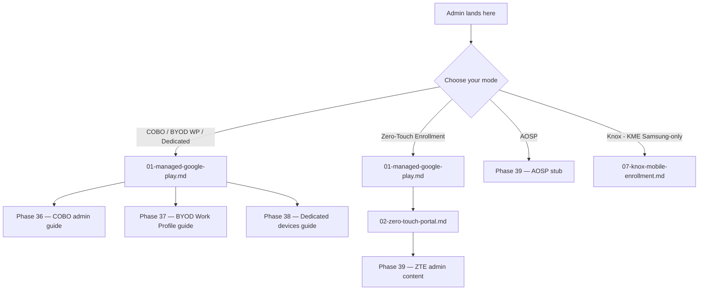

# Phase 47: Integration & Re-Audit — Pattern Map

**Mapped:** 2026-04-25
**Files analyzed:** 7 (all modified; zero new files created)
**Analogs found:** 7 / 7

---

## File Classification

| Modified File | Role | Data Flow | Closest Analog | Match Quality |
|---|---|---|---|---|
| `docs/_glossary-android.md` | doc / content | transform (alphabetical sort, line 16) | `docs/_glossary-android.md` itself at Phase 45-10 state | self-ref (same file; prior edit is the pattern) |
| `docs/reference/android-capability-matrix.md` | doc / reference | transform (column-order coherence verify) | `docs/reference/android-capability-matrix.md` at Phase 46 Wave 2 commit `ce5ffc0` | self-ref (column-order pattern established by prior atomic commit) |
| `docs/admin-setup-android/00-overview.md` | doc / navigation | transform (Mermaid leaf-ordering verify) | `docs/admin-setup-android/00-overview.md` at Phase 44 KME-branch state | self-ref (6-branch Mermaid already on disk) |
| `scripts/validation/v1.4.1-milestone-audit.mjs` | validation harness | batch (file-reads-only; regex/array literal edits) | `scripts/validation/v1.4-milestone-audit.mjs` (frozen predecessor, reference only) | role-match (same harness structure; D-33 frozen — DO NOT MODIFY predecessor) |
| `scripts/validation/v1.4.1-audit-allowlist.json` | validation sidecar | batch (additive-only JSON array extension + pin-shift) | `scripts/validation/v1.4.1-audit-allowlist.json` at Phase 46 Wave 2 state | self-ref (same file; additive-only append pattern) |
| `.planning/milestones/v1.4-MILESTONE-AUDIT.md` | planning artifact / audit doc | event-driven (append re_audit_resolution YAML + frontmatter flip) | `.planning/milestones/v1.4-MILESTONE-AUDIT.md` lines 143-168 (DEFER-04 closure block) | exact (DEFER-04 closure by Phase 43 Plan 09 is the verbatim schema model) |
| `.planning/PROJECT.md` | planning artifact / traceability | transform (append subsection + 24-req flips + footer refresh) | `.planning/PROJECT.md` Validated section lines 88-142 (existing v1.0–v1.4 entry pattern) | exact (same file; additive-only append into existing Validated section) |

---

## Pattern Assignments

### `docs/_glossary-android.md` (doc, transform)

**Analog:** Same file — Phase 45-10 atomic commit `3400bff` is the most recent prior-art for additive glossary edits (OEMConfig H3 insertion + alphabetical-index extension + sidecar pin-shift in a single atomic commit).

**Current state of line 16 (alphabetical index):**
```
[afw#setup](#afw-setup) | [AMAPI](#amapi) | [BYOD](#byod) | [COBO](#cobo) | [COPE](#cope) | [Corporate Identifiers](#corporate-identifiers) | [Dedicated](#dedicated) | [DPC](#dpc) | [EMM](#emm) | [Entra Shared Device Mode](#entra-shared-device-mode) | [Fully Managed](#fully-managed) | [Knox](#knox) | [KME](#kme) | [KPE](#kpe) | [Managed Google Play](#managed-google-play) | [Managed Home Screen](#managed-home-screen) | [OEMConfig](#oemconfig) | [Play Integrity](#play-integrity) | [Private Space](#private-space) | [Supervision](#supervision) | [User Enrollment](#user-enrollment) | [Work Profile](#work-profile) | [WPCO](#wpco) | [Zero-Touch Enrollment](#zero-touch-enrollment)
```

This is 24 entries in substantially correct alphabetical order. The RESEARCH.md notes the K-entries (Knox / KME / KPE) are in correct sub-order. Plan 47-01 verifies H3 section ordering under each H2 is consistent with this index.

**Frontmatter pattern** (lines 1-8, copy for any future glossary edits):
```yaml
---
last_verified: 2026-04-25
review_by: 2026-06-24
applies_to: both
audience: all
platform: all
phase_46_wave2_retrofit: 2026-04-25
---
```

**Atomic commit discipline (from commit `3400bff`):** Glossary edit + sidecar pin-shift MUST land in one commit. See Shared Patterns > Pin-Shift Maintenance below.

---

### `docs/reference/android-capability-matrix.md` (doc, transform)

**Analog:** Same file at Phase 46 Wave 2 commit `ce5ffc0` — established COPE at column index 1 across all 5 sub-tables. Column header pattern to verify against:

**All 5 sub-table header pattern** (copy from lines 16, 33, 46, etc.):
```markdown
| Feature | COBO (Fully Managed) | COPE (WPCO / Corp-Owned Work Profile) | BYOD (Work Profile) | Dedicated (COSU) | ZTE (Zero-Touch) | AOSP |
|---------|----------------------|----------------------|---------------------|------------------|------------------|------|
```

COPE is at index 1 (per Phase 46 D-20), Knox is NOT a column in the matrix (Knox content is in the `07-knox-mobile-enrollment.md` admin guide and the Enrollment table row — not a capability column). The AOSP OEM matrix cross-link is at lines 121-127 (filled by Phase 45-10).

**Cross-Platform Equivalences section (lines 78-88 region — supervision pins):** These lines are NOT edited by Plan 47-01; they are a supervision pin reference region. Verify they are present and unchanged.

**Scope of Plan 47-01 work:** Verification of column-order coherence only. If already coherent (as Phase 46 VERIFICATION confirms), this is a zero-edit verification. Per RESEARCH.md Open Question 2: the edit may be a no-op.

---

### `docs/admin-setup-android/00-overview.md` (doc, navigation)

**Analog:** Same file at Phase 44 state — 6-branch Mermaid with KME branch is the locked form.

**Current Mermaid (lines 25-37) — copy as-is; Plan 47-01 verifies, does not rewrite:**


**Key invariant (RESEARCH.md Pitfall 6):** AOSP-Path terminates at a single leaf "Phase 39 — AOSP stub". Do NOT add per-OEM AOSP leaves — Phase 45 scoped those to `admin-setup-android/` docs only, not Mermaid. This is a verification-only task unless the leaf ordering (within the Knox branch block) is alphabetically inconsistent.

**Setup Sequence numbered list (lines 39-43):** Must stay aligned with branch order (MGP binding → ZT portal → KME). Currently in correct order.

---

### `scripts/validation/v1.4.1-milestone-audit.mjs` (validation harness, batch)

**Analog:** `scripts/validation/v1.4-milestone-audit.mjs` (FROZEN at commit `3c3a140` — reference only, DO NOT MODIFY). The v1.4.1 harness was cloned from this predecessor at commit `be1087b`.

**Three targeted literal edits for Plan 47-02:**

**Edit 1 — C4 regex expansion (line 228):**

Current (line 228):
```javascript
const re = /\]\([^)]*(android|aosp|byod-work-profile|zero-touch|managed-google-play|play-integrity|managed-home-screen|amapi)[^)]*\)/gi;
```

After edit (D-07 locked token list):
```javascript
const re = /\]\([^)]*(android|aosp|byod-work-profile|zero-touch|managed-google-play|play-integrity|managed-home-screen|amapi|knox|kme|kpe|realwear|zebra|pico|htc-vive-focus|meta-quest|cope-full-admin|aosp-realwear|aosp-zebra|aosp-pico|aosp-htc-vive-focus|aosp-meta-quest|aosp-oem-matrix)[^)]*\)/gi;
```

**Edit 2 — C6 targets array expansion (lines 293-296):**

Current (lines 293-296):
```javascript
const targets = [
  'docs/admin-setup-android/06-aosp-stub.md',
  // Phase 45 will add per-OEM files here (09-aosp-realwear.md, 10-aosp-zebra.md, etc.)
];
```

After edit (D-07 + Phase 45 shipped file paths — remove placeholder comment):
```javascript
const targets = [
  'docs/admin-setup-android/06-aosp-stub.md',
  'docs/admin-setup-android/09-aosp-realwear.md',
  'docs/admin-setup-android/10-aosp-zebra.md',
  'docs/admin-setup-android/11-aosp-pico.md',
  'docs/admin-setup-android/12-aosp-htc-vive-focus.md',
  'docs/admin-setup-android/13-aosp-meta-quest.md',
];
```

**Edit 3 — C7 suffix-list expansion (line 314):**

Current (line 314):
```javascript
const suffixes = /(Mobile Enrollment|Platform for Enterprise|Suite|Manage|Configure)/;
```

After edit (D-07 + Phase 44 D-01 5-SKU disambiguation table):
```javascript
const suffixes = /(Mobile Enrollment|Platform for Enterprise|Suite|Manage|Configure|KPE|KME|KPE Standard|KPE Premium|on-device attestation|Mobile Enrollment Portal)/;
```

**Surrounding context — C6 check structure (lines 286-305) — copy for orientation only:**
```javascript
  {
    id: 6,
    name: 'C6: PITFALL-7 preservation in AOSP + per-OEM docs',
    informational: true,
    // D-06 + Phase 42 D-29: INFORMATIONAL-FIRST. Always PASS. Emits findings count.
    run() {
      const targets = [
        'docs/admin-setup-android/06-aosp-stub.md',
        // Phase 45 will add per-OEM files here ...  ← REMOVE THIS COMMENT
      ];
      let found = 0, total = 0;
      for (const t of targets) {
        const c = readFile(t);
        if (!c) continue;
        total++;
        if (/not supported under AOSP/i.test(c)) found++;
      }
      return { pass: true, detail: '(informational - ' + found + '/' + total + ' AOSP-scoped files preserve PITFALL-7 framing)' };
    }
  },
```

**Constraint (D-07 / D-11):** C9 banned-phrase list lives in the sidecar JSON only — do NOT edit the C9 `run()` function body for COPE phrase changes. C7 suffix list is in harness code (line 314) — that edit IS allowed.

---

### `scripts/validation/v1.4.1-audit-allowlist.json` (validation sidecar, batch)

**Analog:** Same file at Phase 46 Wave 2 state (current on-disk baseline). Additive-only contract per Phase 43 D-26.

**Schema** (full current file):
```json
{
  "schema_version": "1.0",
  "generated": "2026-04-24T00:00:00Z",
  "phase": "43-v1-4-cleanup-audit-harness-fix",
  "safetynet_exemptions": [...],
  "supervision_exemptions": [...],
  "cope_banned_phrases": [...]
}
```

**Edit 1 — C9 cope_banned_phrases[] extension (Plan 47-02):**

Current (lines 31-35):
```json
"cope_banned_phrases": [
  "\\bCOPE\\b[^.]*\\bdeprecated\\b",
  "\\bCOPE\\b[^.]*\\bend of life\\b",
  "\\bCOPE\\b[^.]*\\bremoved\\b"
]
```

After edit (D-07 + Phase 46 D-31 full banned set — additive-only, keep "removed"):
```json
"cope_banned_phrases": [
  "\\bCOPE\\b[^.]*\\bdeprecated\\b",
  "\\bCOPE\\b[^.]*\\bend of life\\b",
  "\\bCOPE\\b[^.]*\\bremoved\\b",
  "\\bCOPE\\b[^.]*\\bEOL\\b",
  "\\bCOPE\\b[^.]*\\bno longer supported\\b",
  "\\bCOPE\\b[^.]*\\bobsolete\\b",
  "\\bCOPE\\b[^.]*\\bsunset\\b",
  "\\bCOPE\\b[^.]*\\bretired\\b"
]
```

8 total patterns (3 existing + 5 added). "removed" kept per additive-only contract even though it is not in D-31's named set.

**Edit 2 — supervision_exemptions[] pin-shift maintenance (Plan 47-01):**

Glossary pins that may shift after line 16 re-sort (current coordinates — from the live sidecar):

| Entry reason | Current line | File |
|---|---|---|
| Alphabetical index Supervision link | 16 | `docs/_glossary-android.md` |
| COBO Cross-platform note | 46 | `docs/_glossary-android.md` |
| Fully Managed Cross-platform note | 66 | `docs/_glossary-android.md` |
| Supervision H3 heading | 76 | `docs/_glossary-android.md` |
| Supervision blockquote body | 78 | `docs/_glossary-android.md` |
| MHS cross-platform note | 172 | `docs/_glossary-android.md` |
| Version History supervision row | 188 | `docs/_glossary-android.md` |

The capability matrix pins (lines 78-88) are unaffected by the glossary edit.

**Pin annotation pattern** (copy from current sidecar — append to any updated pin's `"reason"` field):
```
"re-verified 2026-04-25 post Plan 47-01; line shifted +N from Plan 46-02 Wave 2 baseline due to <description of glossary change>"
```

**Verification step after edit (mandatory):**
```
node scripts/validation/regenerate-supervision-pins.mjs --self-test
```
Exit 0 mandatory. If non-zero, pin coordinates are wrong.

---

### `.planning/milestones/v1.4-MILESTONE-AUDIT.md` (planning artifact, event-driven)

**Analog:** Lines 143-168 of the same file — the DEFER-04 closure block authored by Phase 43 Plan 09 commit `c782af6`. This is the verbatim schema model.

**DEFER-04 closure block (lines 143-168 — verbatim, for schema reference):**
```yaml
re_audit_resolution:
  DEFER-04:
    resolution_milestone: "v1.4.1"
    resolution_phase: "43-v1-4-cleanup-audit-harness-fix"
    resolution_plan: "07 (AOSP stub trim + Phase 45 prep shell migration) + 09 (Phase 39 re-gate)"
    resolution_commit_trim: "5dd0862"
    resolution_timestamp: "2026-04-24T21:40:00Z"
    pre_resolution_word_count: 1089
    final_word_count: 696
    envelope: "600-900 words (Phase 39 D-11 + PITFALL 12)"
    headroom_under_cap: 204
    d18_target: "~700 words ..."
    invariants_preserved:
      - "PITFALL-7 'not supported under AOSP' framing: 2 grep hits"
      - "9-H2 whitelist: exactly 9 H2 headings"
      - ...
    harness_evidence:
      v1_4_1_harness: "scripts/validation/v1.4.1-milestone-audit.mjs — 8/8 PASS; ..."
    status: "resolved"
    classification_change: "C3_aosp_wordcount: informational (body 1089 vs 600-900 envelope) → PASS (body 696 within 600-900 envelope)"
    mechanism: "..."
    notes: "DEFER-04 was the sole informational-severity tech-debt item on v1.4. ..."
```

**Minimum required fields per new sibling key (D-14):**
```yaml
  DEFER-NN:                                 # use audit-doc canonical numbering (01/02/08/09/10)
    resolution_milestone: "v1.4.1"
    resolution_phase: "<phase-slug>"
    resolution_plan: "<plan-id-or-range>"
    resolution_commit: "<SHA>"              # or per-artifact variant e.g. resolution_commit_terminal
    resolution_timestamp: "<ISO-8601>"
    status: "resolved"
    classification_change: "<original classification → resolved state>"
```

**D-16 cross-doc citation rule:** Each new child key MUST cite both numbering systems. Example:
```yaml
    notes: "PROJECT.md DEFER-01 / audit-doc DEFER-01. ..."
```

**DEFER-numbering reconciliation (D-16) — canonical mapping for new keys:**

| YAML key to add | PROJECT.md alias | Audit-doc title | Closing commit |
|---|---|---|---|
| `DEFER-01:` | PROJECT.md DEFER-01 | C2 allow-list expansion (27 supervision pins) | `4f41431` (Plan 03) / `0b3be9a` (terminal) |
| `DEFER-02:` | PROJECT.md DEFER-02 | C5 freshness normalization | `2574c79` (Plan 05) / `0b3be9a` (terminal) |
| `DEFER-08:` | PROJECT.md DEFER-04 | Knox Mobile Enrollment (AEKNOX-01..07) | `51c2e72` (terminal) |
| `DEFER-09:` | PROJECT.md DEFER-05 | Per-OEM AOSP expansion (AEAOSPFULL-01..09) | `eb88750` (terminal) / `3400bff` (atomic retrofit) |
| `DEFER-10:` | PROJECT.md DEFER-06 | COPE full admin path (AECOPE-01..04) | `bcb0986` (terminal) / `ce5ffc0` (Wave 2 atomic) |

**DO NOT add DEFER-04 again** — it is already closed with a complete block at lines 143-168 per D-15.

**Frontmatter status flip (line 5):**

Current:
```yaml
status: tech_debt
```

After Plan 47-04:
```yaml
status: passed
```

**Also read:** `.planning/milestones/v1.3-MILESTONE-AUDIT.md` lines 13-23 for the v1.3 `re_audit_resolution:` alternate schema (looser structure — Phase 47 follows the DEFER-04 / v1.4 schema, not v1.3).

---

### `.planning/PROJECT.md` (planning artifact, transform)

**Analog:** Same file, Validated section lines 88-142 (existing v1.0–v1.4 entry pattern). Also: the existing `## Current Milestone: v1.4.1` section lines 144-163 (DEFER enumeration to close) and the footer at line 236.

**Validated section entry pattern** (lines 125-142, copy format):
```markdown
- ✓ <description> — Phase N / vX.Y (REQ-ID)
```

Examples from current file:
```markdown
- ✓ Android disambiguation glossary (13 colliding terms + 6 Android-native) with cross-platform callouts — Phase 34 / v1.4 (AEBASE-01)
- ✓ COPE Full Admin guide (`docs/admin-setup-android/08-cope-full-admin.md`) — ... — Phase 46 / v1.4.1 (AECOPE-01)
```

**24 reqs to move from Active to Validated (D-23):**
- AEAUDIT-02..05 (4 reqs, Phase 43)
- AEKNOX-01..07 (7 reqs, Phase 44)
- AEAOSPFULL-01..09 (9 reqs, Phase 45)
- AECOPE-01..04 (4 reqs, Phase 46)

All 4 AEINTEG-01..04 reqs flip when Plan 47-04 ships (as part of Phase 47's own plan).

Active section (lines 164-165) is currently empty — confirmed by on-disk read ("### Active" with nothing below).

**"Closed Deferred Items" subsection (D-20) — append to Context section, after line 191 (`## Context`):**
```markdown
## Closed Deferred Items (v1.4 → v1.4.1)

- **DEFER-01** (Audit allow-list expansion — C2 supervision pins) — closed Phase 43 commit `4f41431` (AEAUDIT-02 + Plans 43-03/43-04)
- **DEFER-02** (60-day freshness normalization) — closed Phase 43 commit `2574c79` (AEAUDIT-03 + Plan 43-05)
- **DEFER-03** (AOSP stub re-validation / Phase 41 VERIFICATION) — closed Phase 43 commit `c782af6` (AEAUDIT-04 + Plans 43-07/43-09)
- **DEFER-04** (Knox Mobile Enrollment) — closed Phase 44 commit `51c2e72` (AEKNOX-01..07 + Plans 44-01..44-07)
- **DEFER-05** (Per-OEM AOSP Expansion) — closed Phase 45 commit `eb88750` (AEAOSPFULL-01..09 + Plans 45-01..45-10)
- **DEFER-06** (COPE Full Admin) — closed Phase 46 commit `bcb0986` (AECOPE-01..04 + Plans 46-01..46-02)
```

Exact bullet prose is Claude's Discretion (CONTEXT.md) — the D-20 template above is the canonical reference shape.

**Footer pattern** (current line 236):
```markdown
*Last updated: 2026-04-25 — v1.4 shipped (audit `tech_debt` accepted); v1.4.1 in progress: Phase 43 (audit harness fix) + Phase 44 (Knox Mobile Enrollment) + Phase 45 (Per-OEM AOSP Expansion) + Phase 46 (COPE Full Admin) all COMPLETE; Phase 47 (Integration & Re-Audit) remaining. ...*
```

After Plan 47-03 (D-24 verbatim):
```markdown
*Last updated: 2026-04-25 — v1.4.1 shipped. v1.4 audit re-run with status: passed; all 28 reqs validated; DEFER-01..06 closed in Closed Deferred Items subsection. v1.4.1 ships Knox Mobile Enrollment + per-OEM AOSP expansion (RealWear/Zebra/Pico/HTC VIVE Focus/Meta Quest) + COPE Full Admin + audit harness 8/8 PASS via v1.4.1-milestone-audit.mjs.*
```

**Additive-only constraint (Phase 42 D-22 / D-25):** Existing Validated entries are NEVER deleted or reordered. New v1.4.1 entries append after the last v1.4 entry (currently line 142).

---

## Shared Patterns

### Atomic Same-Commit Retrofit

**Source:** Phase 45-10 commit `3400bff` (6 files + 1 deletion in one commit) and Phase 46 Wave 2 commit `ce5ffc0` (5 files in one commit).

**Apply to:** Plans 47-01, 47-02, 47-03 individually (each is its own atomic commit), and Plan 47-04 (its own atomic commit).

**Pattern discipline:** Every plan produces ONE commit containing all its file edits. No "fixup" commits allowed post-plan. Plans 47-01/02/03 have disjoint file sets (`docs/` vs `scripts/validation/` vs `.planning/PROJECT.md`) and may run in parallel with no merge conflicts. Plan 47-04 is strictly last.

### Additive-Only JSON Contract

**Source:** `scripts/validation/v1.4.1-audit-allowlist.json` current state; Phase 43 D-26.

**Apply to:** Plan 47-02 (`cope_banned_phrases[]` extension) and Plan 47-01 (supervision_exemptions[] pin-shift updates).

**Pattern:** Append new array elements; update existing pin `"line"` values and `"reason"` strings only. Never delete array elements. Never change `schema_version`.

### Pin-Shift Maintenance Workflow

**Source:** Phase 45-10 commit `3400bff` (demonstrated pin-shift for OEMConfig insertion) and Phase 46 Wave 2 commit `ce5ffc0` (demonstrated pin-shift for Private Space H3 insertion).

**Apply to:** Plan 47-01 only (glossary line 16 re-sort may shift subsequent glossary line numbers).

**Workflow (copy from RESEARCH.md Pin-Shift Maintenance Recipe):**
1. Edit `docs/_glossary-android.md` line 16.
2. Run `node scripts/validation/regenerate-supervision-pins.mjs --report` — note shifted pins.
3. Update affected `"line"` values in `v1.4.1-audit-allowlist.json`.
4. Append post-Plan-47-01 annotation to each updated pin's `"reason"`.
5. Run `node scripts/validation/regenerate-supervision-pins.mjs --self-test` — exit 0 mandatory.
6. Commit `docs/` + sidecar atomically.

### Auditor-Independence Worktree

**Source:** Phase 42 Plan 42-06 (recorded in v1.4-MILESTONE-AUDIT.md `performed_by` field, line 25: "gsd-executor agent a23e52fe distinct from Plans 42-02/42-03/42-04 content-author worktree agents per D-02 auditor-independence rule; fresh worktree spawn verified at execution start").

**Apply to:** Plan 47-04 only.

**Pattern:** Spawn a NEW executor worktree pinned to the post-Plan-47-03 tip commit. Run `node scripts/validation/v1.4.1-milestone-audit.mjs --verbose` from repo root. Record stdout. Append `re_audit_resolution:` keys. Commit from this distinct worktree.

### Validated Section Append Pattern

**Source:** `.planning/PROJECT.md` lines 88-142 (existing Validated entries).

**Apply to:** Plan 47-03.

**Pattern:** New entries follow `- ✓ <description> — Phase N / vX.Y (REQ-ID)` format. Append after the last existing entry (currently AECOPE-04 at line 142). Preserve all prior entries without modification.

---

## No Analog Found

None. All 7 Phase 47 modified files have exact or role-match analogs within the codebase. No file requires falling back to RESEARCH.md external patterns.

---

## Metadata

**Analog search scope:** `docs/`, `scripts/validation/`, `.planning/milestones/`, `.planning/PROJECT.md`, `.planning/phases/43-v1-4-cleanup-audit-harness-fix/`

**Files scanned (read for pattern extraction):**
- `scripts/validation/v1.4.1-milestone-audit.mjs` (lines 1-335)
- `scripts/validation/v1.4.1-audit-allowlist.json` (full)
- `.planning/milestones/v1.4-MILESTONE-AUDIT.md` (lines 1-180)
- `.planning/milestones/v1.3-MILESTONE-AUDIT.md` (lines 1-50)
- `.planning/PROJECT.md` (lines 1-237)
- `docs/_glossary-android.md` (lines 1-30)
- `docs/reference/android-capability-matrix.md` (lines 1-50)
- `docs/admin-setup-android/00-overview.md` (lines 1-80)
- `.planning/phases/43-v1-4-cleanup-audit-harness-fix/43-VERIFICATION.md` (lines 1-60)
- Git commit metadata: `3400bff` (Phase 45-10 atomic), `ce5ffc0` (Phase 46 Wave 2 atomic)

**Pattern extraction date:** 2026-04-25
