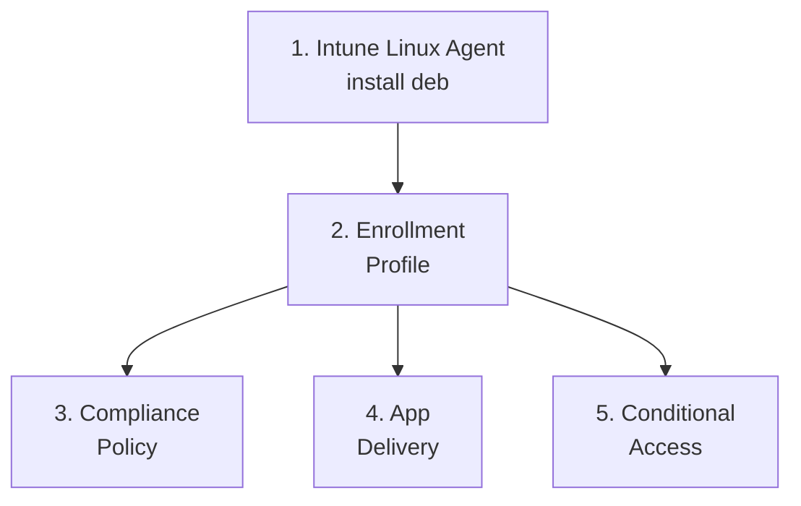

<objective>
Author 3 of 6 admin-setup-linux files: 00-overview, 01-intune-linux-agent (LIN-05), and 02-enrollment-profile (LIN-03). All 3 files mirror their macOS analog with Linux-specific deviations locked in CONTEXT.md D-rules.

Purpose: Establishes the admin entry-point for Linux Intune management — overview routes users to file-specific guides; agent install carries the LIN-05 Identity Broker pitfall callout (1b FOLD); enrollment-profile is admin-only with mandatory cross-link to the end-user file (D-10) and explicit NEGATIVE assertions guarding against rejected 2A/2B/2C drift.
Output: 3 admin-setup-linux markdown files with locked H2s, frontmatter, and assertion-grade callouts.
</objective>

<execution_context>
@$HOME/.claude/get-shit-done/workflows/execute-plan.md
@$HOME/.claude/get-shit-done/templates/summary.md
</execution_context>

<context>
@.planning/phases/50-linux-admin-setup-capability-matrix/50-CONTEXT.md
@.planning/phases/50-linux-admin-setup-capability-matrix/50-PATTERNS.md
@.planning/phases/50-linux-admin-setup-capability-matrix/50-VALIDATION.md
@.planning/phases/49-linux-foundation-taxonomy-glossary-version-matrix/49-VERIFICATION.md
@docs/admin-setup-macos/00-overview.md
@docs/admin-setup-macos/02-enrollment-profile.md
@docs/admin-setup-android/01-managed-google-play.md
@docs/linux-lifecycle/00-enrollment-overview.md
@docs/linux-lifecycle/01-linux-prerequisites.md

<interfaces>
<!-- Phase 49 anchors that THIS plan back-links to. These already exist (verified in 49-VERIFICATION.md). -->

From docs/linux-lifecycle/00-enrollment-overview.md (Phase 49):
- H2 anchor: `#supported-management-surface` (Phase 49 V-49-02)
- H3 cross-platform bridge anchor: `#for-admins-familiar-with-windows--macos--android` (Phase 49 V-49-04)

From docs/linux-lifecycle/01-linux-prerequisites.md (Phase 49):
- H3 anchor: `#non-version-breakpoints` (Phase 49 V-49-12 — LIN-05 callout target)
- H3 anchor: `#ubuntu-2004--end-of-support` (Phase 49 V-49-11)

From docs/_glossary-linux.md (Phase 49):
- H3 anchors usable in cross-references: `#intune-portal-package`, `#microsoft-identity-broker`, `#intune-agenttimer`, `#web-app-ca`

Frontmatter contract (Phase 49 D-03 inherited; C10 blocking from Phase 48):
```yaml
---
last_verified: 2026-04-27
review_by: 2026-06-26
applies_to: enrollment
audience: admin
platform: Linux
---
```
</interfaces>
</context>

<tasks>

<task type="auto" tdd="false">
  <name>Task 1: Author docs/admin-setup-linux/00-overview.md</name>
  <files>docs/admin-setup-linux/00-overview.md</files>
  <read_first>
    - docs/admin-setup-macos/00-overview.md (PRIMARY analog — 60-line structural mirror; macOS uses 5-domain fan-out, Linux uses 6-file fan-out 00→01→02→{03,04,05})
    - docs/admin-setup-android/00-overview.md (secondary analog for Mermaid setup-sequence variant — flowchart TD if branching)
    - docs/linux-lifecycle/00-enrollment-overview.md (back-link target — DO NOT duplicate any content from this file's `## For Admins Familiar with Windows / macOS / Android` H3 region)
    - .planning/phases/50-linux-admin-setup-capability-matrix/50-PATTERNS.md (lines 29-94 — 00-overview.md pattern map)
    - .planning/phases/50-linux-admin-setup-capability-matrix/50-CONTEXT.md (D-03 frontmatter, CD-01 back-link wording, CD-02 Mermaid optional, DPO-03 anti-duplication, DPO-07)
  </read_first>
  <behavior>
    - File exists with C10-compliant frontmatter
    - Contains "Setup Sequence" guidance (1→2→3→4/5/6 fan-out matching the 6-file directory layout)
    - Contains a back-link blockquote to Phase 49 cross-platform bridge anchor — back-link, NOT duplicate
    - Negative assertion: file does NOT contain its own H2 "## For Admins Familiar with Windows / macOS / Android"
    - Includes "Cross-Platform References" H2 with link to ../reference/linux-capability-matrix.md (file path; matrix authored in plan 04 — link still resolves at commit time per D-18 atomic)
    - Includes "See Also" H2 + Version History table
  </behavior>
  <action>
Create `docs/admin-setup-linux/00-overview.md` mirroring `docs/admin-setup-macos/00-overview.md` structure with these EXACT requirements:

**Frontmatter (D-03 verbatim):**
```yaml
---
last_verified: 2026-04-27
review_by: 2026-06-26
applies_to: enrollment
audience: admin
platform: Linux
---
```

**H1:** `# Linux Admin Setup Overview`

**Platform-gate blockquote (lines after H1):**
```
> **Platform gate:** This guide covers Linux device management in Microsoft Intune for Ubuntu 22.04 LTS and 24.04 LTS.
> For macOS ADE setup, see [macOS Admin Setup](../admin-setup-macos/00-overview.md).
> For Android Enterprise setup, see [Android Admin Setup](../admin-setup-android/00-overview.md).
> For Linux provisioning terminology, see the [Linux Provisioning Glossary](../_glossary-linux.md).
> For the locked Linux management surface (whitelist) + out-of-scope callouts, see [Linux Enrollment Overview](../linux-lifecycle/00-enrollment-overview.md#supported-management-surface).
```

**REQUIRED back-link (DPO-03 / DPO-07 — CD-01 wording-discretion; CONCRETE example below):**
Place a paragraph or blockquote near the top OR in a "## Cross-Platform References" H2 near the bottom that contains the literal string `docs/linux-lifecycle/00-enrollment-overview.md#for-admins-familiar-with-windows--macos--android`. Suggested wording:
```
> **For admins familiar with Windows, macOS, or Android:** see the cross-platform bridge subsection in [Linux Enrollment Overview](../linux-lifecycle/00-enrollment-overview.md#for-admins-familiar-with-windows--macos--android). That subsection covers what carries over and what does not from your existing Intune mental model.
```

**NEGATIVE assertion (validator-enforced per DPO-03):** This file MUST NOT contain its own H2 line `## For Admins Familiar with Windows / macOS / Android`. Use a back-link instead.

**H2: `## Setup Sequence`** with 6-file fan-out. Mermaid diagram is OPTIONAL per CD-02 — recommended if author judges it adds value:

Then the numbered list of 6 sibling files with one-sentence descriptions:
```
1. **[Intune Linux Agent](01-intune-linux-agent.md)** — Install the `intune-portal` deb package from `packages.microsoft.com` and configure the Microsoft Identity Broker.
2. **[Enrollment Profile](02-enrollment-profile.md)** — Verify Intune + Entra P1 licensing and configure user-initiated Linux enrollment.
3. **[Compliance Policy](03-compliance-policy.md)** — Configure 4 settings-catalog categories (Allowed Distributions, Custom Compliance, Device Encryption, Password Policy).
4. **[App Delivery](04-app-delivery.md)** — Script-based-only app delivery (no Win32/MSIX/.pkg analog).
5. **[Conditional Access](05-conditional-access.md)** — Web-app CA via Microsoft Edge for Linux 102.x+ (no device-level CA).
```

**H2: `## Cross-Platform References`**
```
- [Linux Capability Matrix](../reference/linux-capability-matrix.md) — Win|Linux bilateral comparison; explicit "Not supported" cells; Cross-Platform Equivalences with 3 attributed pairs.
- [Linux Enrollment Overview](../linux-lifecycle/00-enrollment-overview.md) — Phase 49 management-surface whitelist + Out of Scope callout.
- [Linux Prerequisites](../linux-lifecycle/01-linux-prerequisites.md) — Ubuntu 22.04/24.04 LTS supported; Ubuntu 20.04 dropped from Intune 2508.
```

**H2: `## See Also`** — link to Linux glossary, Linux capability matrix, end-user guide.

**Version History table:**
```
---

| Date | Change | Author |
|------|--------|--------|
| 2026-04-27 | Initial version — Linux admin setup overview (Phase 50) | -- |
```

Per CONTEXT.md D-03 (frontmatter), CD-01 (back-link wording discretion), CD-02 (Mermaid optional), DPO-03 (anti-duplication), DPO-07 (Phase 50 anti-duplication vs Phase 49).
  </action>
  <verify>
    <automated>node -e "const fs=require('fs');const c=fs.readFileSync('docs/admin-setup-linux/00-overview.md','utf8');const ok=c.includes('platform: Linux')&&c.includes('audience: admin')&&c.includes('docs/linux-lifecycle/00-enrollment-overview.md#for-admins-familiar-with-windows--macos--android')&&!/^## For Admins Familiar with Windows \/ macOS \/ Android\s*$/m.test(c)&&/^## Setup Sequence\s*$/m.test(c)&&/^## See Also\s*$/m.test(c);process.exit(ok?0:1)"</automated>
  </verify>
  <acceptance_criteria>
    - File exists at `docs/admin-setup-linux/00-overview.md`
    - Frontmatter contains literal lines `platform: Linux`, `audience: admin`, `applies_to: enrollment`, `last_verified: 2026-04-27`, `review_by: 2026-06-26` (60-day delta)
    - File contains literal string `docs/linux-lifecycle/00-enrollment-overview.md#for-admins-familiar-with-windows--macos--android` — maps to V-50 DPO-03 back-link probe
    - File does NOT contain regex `^## For Admins Familiar with Windows \/ macOS \/ Android\s*$` (multiline) — DPO-03 negative assertion
    - File contains H2 `## Setup Sequence` and H2 `## See Also` (`grep -c '^## '` ≥ 4)
    - File contains relative link `../reference/linux-capability-matrix.md` and `../end-user-guides/linux-intune-portal-enrollment.md` (cross-references resolve at atomic commit time per D-18)
  </acceptance_criteria>
  <done>00-overview.md exists with correct frontmatter, all required H2s, DPO-03 back-link present, negative assertion holds, Setup Sequence section guides users through the 6-file directory.</done>
</task>

<task type="auto" tdd="false">
  <name>Task 2: Author docs/admin-setup-linux/01-intune-linux-agent.md (LIN-05 + PITFALL-3)</name>
  <files>docs/admin-setup-linux/01-intune-linux-agent.md</files>
  <read_first>
    - docs/admin-setup-android/01-managed-google-play.md (PRIMARY analog — tri-portal callout structure; Prerequisites/Steps/Verification with H4 sub-sub-headings; lines 11-50 for blockquote + checklist patterns)
    - docs/linux-lifecycle/01-linux-prerequisites.md (Phase 49 — verify the H3 `### Non-version Breakpoints` exists at the back-linked anchor)
    - docs/_glossary-linux.md (Phase 49 — verify `### intune-portal package` and `### microsoft-identity-broker` H3s exist for cross-reference)
    - .planning/phases/50-linux-admin-setup-capability-matrix/50-PATTERNS.md (lines 96-135 — 01-intune-linux-agent.md pattern map; LIN-05 + PITFALL-3 callout literals)
    - .planning/phases/50-linux-admin-setup-capability-matrix/50-CONTEXT.md (DPO-01 — Phase 49 anchor inheritance; D-24 — PITFALL-3 + LIN-05 validator assertions)
  </read_first>
  <behavior>
    - File exists with C10-compliant frontmatter
    - Contains MANDATORY LIN-05 `> ⚠️ **Known admin pitfall**` blockquote with literal back-link string `docs/linux-lifecycle/01-linux-prerequisites.md#non-version-breakpoints` (DPO-01 contract)
    - Contains MANDATORY PITFALL-3 deb-vs-Snap callout with literal "deprecated" or "preview" applied to the Snap path
    - Documents `sudo apt install intune-portal` as the GA install command (no Snap)
    - References `packages.microsoft.com` as the deb source
  </behavior>
  <action>
Create `docs/admin-setup-linux/01-intune-linux-agent.md` mirroring `docs/admin-setup-android/01-managed-google-play.md` structure with these EXACT requirements:

**Frontmatter (D-03 verbatim):**
```yaml
---
last_verified: 2026-04-27
review_by: 2026-06-26
applies_to: enrollment
audience: admin
platform: Linux
---
```

**H1:** `# Intune Linux Agent — Install and Configure`

**Platform-gate blockquote:**
```
> **Platform gate:** This guide covers installation of the `intune-portal` deb package and Microsoft Identity Broker on Ubuntu 22.04 LTS and 24.04 LTS.
> For Linux prerequisites and supported distributions, see [Linux Prerequisites](../linux-lifecycle/01-linux-prerequisites.md).
> For Linux provisioning terminology, see the [Linux Provisioning Glossary](../_glossary-linux.md).
```

**MANDATORY LIN-05 callout (DPO-01 contract per CONTEXT.md D-24):**
Place near the top of the file (after Platform gate, before Prerequisites). EXACT format:
```
> ⚠️ **Known admin pitfall — Identity Broker re-enrollment (intune-portal 2.0.2+):** The `intune-portal` 2.0.2 release replaced the Java-based broker with `microsoft-identity-broker` (systemd unit). Updating from a pre-2.0.2 install triggers AUTOMATIC RE-ENROLLMENT of all already-enrolled Linux devices with NEW device IDs. Admin action required after the rollout: review device-based Conditional Access assignments, Intune filters, and Entra ID group memberships scoped to Linux devices — old device IDs become stale and the new device IDs may not match prior assignments. See [Non-version Breakpoints](../linux-lifecycle/01-linux-prerequisites.md#non-version-breakpoints) for the full breakpoint matrix.
>
> **Admin action checklist:**
> 1. Identify Entra ID groups scoped to Linux devices via device-based filters
> 2. After upgrade, verify membership with the new device IDs
> 3. Re-validate device-based CA policies (if any) — note Linux supports web-app CA only
> 4. Audit `microsoft-identity-broker` systemd-unit status post-upgrade: `systemctl status microsoft-identity-broker`
```
The literal `docs/linux-lifecycle/01-linux-prerequisites.md#non-version-breakpoints` must appear within the callout block. The validator (V-50) asserts the blockquote regex `^> ⚠️ \*\*Known admin pitfall` AND the back-link literal both appear in this file.

**MANDATORY PITFALL-3 deb-vs-Snap callout:**
Place in the install-steps section. EXACT format:
```
> 📋 **Note — deb vs Snap:** The Snap package (`snap install intune-portal`) was available during preview and is **deprecated**. Use the deb package via `packages.microsoft.com` for general-availability deployments. The Snap path will not receive Identity Broker 2.0.2+ updates.
```
The validator asserts the file contains "deprecated" or "preview" within reasonable proximity of "Snap" mention.

**H2: `## Prerequisites`** — checklist:
- Ubuntu 22.04 LTS or 24.04 LTS (per Phase 49 prerequisites)
- GNOME desktop environment (per Phase 49 whitelist)
- Intune license assigned to user
- `sudo` access on target device

**H2: `## Steps`** — numbered with H4 sub-sub-headings:
```
### Step 1: Add the Microsoft package signing key

#### On device
1. Run: `curl -sSL https://packages.microsoft.com/keys/microsoft.asc | sudo tee /etc/apt/trusted.gpg.d/microsoft.asc`
2. Add the apt repo: `echo "deb [arch=amd64,arm64,armhf signed-by=/etc/apt/trusted.gpg.d/microsoft.asc] https://packages.microsoft.com/ubuntu/$(lsb_release -rs)/prod $(lsb_release -cs) main" | sudo tee /etc/apt/sources.list.d/microsoft-prod.list`
3. Update apt: `sudo apt update`

### Step 2: Install the intune-portal deb package

#### On device
1. Run: `sudo apt install intune-portal`
2. Verify: `dpkg -l | grep intune-portal`

[insert PITFALL-3 callout here]

### Step 3: Verify Microsoft Identity Broker is running

#### On device
1. Check broker service: `systemctl status microsoft-identity-broker`
2. Check user-scope timer: `systemctl --user status intune-agent.timer`
```

**H2: `## Verification`** — checklist (Intune admin center device shows; broker service active; timer enabled).

**H2: `## See Also`**
- [Enrollment Profile](02-enrollment-profile.md)
- [Linux Prerequisites — Non-version Breakpoints](../linux-lifecycle/01-linux-prerequisites.md#non-version-breakpoints)
- [Linux Glossary — intune-portal package](../_glossary-linux.md#intune-portal-package)
- [Linux Glossary — microsoft-identity-broker](../_glossary-linux.md#microsoft-identity-broker)

**Version History:**
```
---

| Date | Change | Author |
|------|--------|--------|
| 2026-04-27 | Initial version — Intune Linux client install + LIN-05 + PITFALL-3 callouts (Phase 50) | -- |
```

Per CONTEXT.md D-03 (frontmatter), DPO-01 (LIN-05 anchor inheritance), D-24 (PITFALL-3 + LIN-05 validator assertions), CD-06 (PITFALL-3 wording discretion within "deprecated/preview applied to Snap" constraint).
  </action>
  <verify>
    <automated>node -e "const fs=require('fs');const c=fs.readFileSync('docs/admin-setup-linux/01-intune-linux-agent.md','utf8');const ok=c.includes('platform: Linux')&&c.includes('audience: admin')&&/^> ⚠️ \*\*Known admin pitfall/m.test(c)&&c.includes('docs/linux-lifecycle/01-linux-prerequisites.md#non-version-breakpoints')&&/deprecated|preview/i.test(c)&&/Snap/i.test(c)&&c.includes('intune-portal')&&c.includes('packages.microsoft.com');process.exit(ok?0:1)"</automated>
  </verify>
  <acceptance_criteria>
    - File exists at `docs/admin-setup-linux/01-intune-linux-agent.md`
    - Frontmatter: `platform: Linux`, `audience: admin`, `applies_to: enrollment`, 60-day cycle (`last_verified: 2026-04-27` / `review_by: 2026-06-26`)
    - Matches regex `^> ⚠️ \*\*Known admin pitfall` (LIN-05 callout) — maps to V-50 LIN-05 callout probe
    - Contains literal `docs/linux-lifecycle/01-linux-prerequisites.md#non-version-breakpoints` (DPO-01 anchor — V-50 LIN-05 anchor probe)
    - Contains both substring "Snap" AND ("deprecated" OR "preview") in same file (PITFALL-3 — V-50 PITFALL-3 probe)
    - Contains literal `sudo apt install intune-portal` (GA install command per PITFALL-3)
    - Contains literal `packages.microsoft.com` (deb source per PITFALL-3)
  </acceptance_criteria>
  <done>01-intune-linux-agent.md exists with LIN-05 blockquote callout including the Phase 49 anchor back-link, PITFALL-3 deb-vs-Snap deprecation callout, and complete install steps for the deb package.</done>
</task>

<task type="auto" tdd="false">
  <name>Task 3: Author docs/admin-setup-linux/02-enrollment-profile.md (LIN-03 + D-08 + D-10)</name>
  <files>docs/admin-setup-linux/02-enrollment-profile.md</files>
  <read_first>
    - docs/admin-setup-macos/02-enrollment-profile.md (PRIMARY analog — DIRECT mirror per D-08; 5 H2s pinned: Prerequisites/Steps/Verification/Configuration-Caused Failures/See Also; lines 18-140)
    - .planning/phases/50-linux-admin-setup-capability-matrix/50-PATTERNS.md (lines 137-198 — 02-enrollment-profile.md pattern map)
    - .planning/phases/50-linux-admin-setup-capability-matrix/50-CONTEXT.md (D-07/D-08/D-10 — split-by-audience; pinned H2 list; mandatory cross-link to end-user file; D-24 negative assertions)
    - docs/admin-setup-android/04-byod-work-profile.md (Phase 37 v1.4 admin-with-end-user-cross-link precedent for D-10 forward direction)
  </read_first>
  <behavior>
    - File exists with C10-compliant frontmatter; `audience: admin` (NOT end-user)
    - Contains EXACT 5 H2s in order: Prerequisites / Steps / Verification / Configuration-Caused Failures / See Also (D-08)
    - Contains MANDATORY cross-link to `../end-user-guides/linux-intune-portal-enrollment.md` near the top (D-10 forward direction)
    - NEGATIVE assertions: file does NOT contain `## End-User Enrollment Steps`, `## Appendix:`, or `## Validate End-User Flow` (regression guard against rejected 2A/2B/2C)
    - Documents Intune + Entra P1 licensing verification (LIN-03 mandate)
    - Documents optional CA scoping for Linux devices
  </behavior>
  <action>
Create `docs/admin-setup-linux/02-enrollment-profile.md` mirroring `docs/admin-setup-macos/02-enrollment-profile.md` (~140 lines) with these EXACT requirements:

**Frontmatter (D-03 verbatim):**
```yaml
---
last_verified: 2026-04-27
review_by: 2026-06-26
applies_to: enrollment
audience: admin
platform: Linux
---
```

**H1:** `# Linux Enrollment Profile — Admin Configuration`

**Platform-gate blockquote** (3 lines, mirroring macOS pattern lines 9-12):
```
> **Platform gate:** This guide covers admin-side configuration of Linux device enrollment in Intune (license verification, optional CA scoping). Linux enrollment on Ubuntu 22.04/24.04 LTS is user-initiated only; there is no admin-driven push enrollment.
> For end-user enrollment steps (install Edge, install intune-portal deb, sign in), see [Linux Intune Portal Enrollment](../end-user-guides/linux-intune-portal-enrollment.md).
> For Linux provisioning terminology, see the [Linux Provisioning Glossary](../_glossary-linux.md).
```

**MANDATORY cross-link to end-user file (D-10 forward direction; place near top, after Platform gate):**
```
> **For end users:** Personal-device or self-enrolling users follow [Linux Intune Portal Enrollment](../end-user-guides/linux-intune-portal-enrollment.md). This guide covers admin-side enrollment configuration only.
```
Validator (V-50-12) asserts file contains literal string `../end-user-guides/linux-intune-portal-enrollment.md`.

**5 EXACT pinned H2s (D-08 — order matters):**

```markdown
## Prerequisites

[License verification: Intune license assigned to user; Entra ID P1 minimum (P2 if conditional access policies will scope to Linux devices). Ubuntu 22.04/24.04 LTS target hosts; GNOME desktop. Edge for Linux 102.x+ available.]

## Steps

### Step 1: Verify Intune + Entra licensing

#### In Intune admin center
1. Navigate to **Tenant administration > Microsoft Intune licenses**
2. Confirm the test user has an Intune license (Microsoft Intune Plan 1, EMS E3/E5, or M365 with Intune)
3. For CA-scoping in Step 3, confirm Entra ID P1 (P2 for risk-based CA)

[what-breaks blockquote per analog lines 46-49:]

> **What breaks if misconfigured:** Without an Intune license assigned, the user cannot complete sign-in in the Intune Portal app — enrollment fails at the Intune sign-in step.
> Symptom appears in: Intune Portal app on device (sign-in error).
> See: [Linux Enrollment Failed (Phase 51 runbook 30)](../l1-runbooks/30-linux-enrollment-failed.md)

### Step 2: (Optional) Configure user-affinity scoping

#### In Intune admin center
1. Navigate to **Devices > Linux > Linux enrollment**
2. (Note: Linux enrollment is user-initiated; no enrollment profile assignment exists like Windows Autopilot or macOS ADE)
3. To restrict enrollment to specific user groups, use Intune device enrollment restrictions: **Devices > Enrollment > Enrollment device platform restrictions > Linux**

### Step 3: (Optional) Scope a Conditional Access policy to Linux

[Note: Linux supports web-app CA only via Edge; device-level CA grant `Require device to be marked as compliant` is not available. See 05-conditional-access.md for the architectural callout.]

## Verification

[Checklist of post-config admin verifications: license shows assigned; enrollment restriction (if any) saved and applied; CA policy (if any) saved and shows Linux as targeted platform.]

## Configuration-Caused Failures

| Misconfiguration | Portal | Symptom | Runbook |
|------------------|--------|---------|---------|
| User missing Intune license | Intune admin center | Sign-in fails on device | [30-linux-enrollment-failed.md](../l1-runbooks/30-linux-enrollment-failed.md) |
| Enrollment restriction blocks user | Intune admin center | Enrollment blocked at sign-in | [30-linux-enrollment-failed.md](../l1-runbooks/30-linux-enrollment-failed.md) |
| CA policy excludes Linux but org expects coverage | Entra portal | Edge web-app access denied | [32-linux-ca-blocking-web-access.md](../l1-runbooks/32-linux-ca-blocking-web-access.md) |

## See Also

- [Intune Linux Agent](01-intune-linux-agent.md) — install the intune-portal deb
- [Compliance Policy](03-compliance-policy.md)
- [Conditional Access](05-conditional-access.md) — web-app CA via Edge
- [Linux Capability Matrix](../reference/linux-capability-matrix.md)
- [Linux Intune Portal Enrollment (end-user guide)](../end-user-guides/linux-intune-portal-enrollment.md)
```

**Version History:**
```
---

| Date | Change | Author |
|------|--------|--------|
| 2026-04-27 | Initial version — Linux enrollment profile admin configuration (Phase 50) | -- |
```

**NEGATIVE assertions (validator-enforced per D-08 / D-24):** This file MUST NOT contain ANY of:
- H2 line `## End-User Enrollment Steps`
- H2 line `## Appendix:` (or any H2 starting with `## Appendix:`)
- H2 line `## Validate End-User Flow`

These are regression guards against rejected gray-area-2 options 2A/2B/2C.

Per CONTEXT.md D-07/D-08/D-10 (split-by-audience; pinned H2 list; mandatory cross-link), D-24 (negative assertions). Phase 51 runbook cross-links resolve at Phase 51 ship; for Phase 50, the LINK strings must be present (resolution at Phase 51 ship is downstream concern).
  </action>
  <verify>
    <automated>node -e "const fs=require('fs');const c=fs.readFileSync('docs/admin-setup-linux/02-enrollment-profile.md','utf8');const h2=['## Prerequisites','## Steps','## Verification','## Configuration-Caused Failures','## See Also'];const allH2=h2.every(h=>new RegExp('^'+h.replace(/[.*+?^${}()|[\\]\\\\]/g,'\\\\$&')+'\\\\s*$','m').test(c));const forbidden=[/^## End-User Enrollment Steps\s*$/m,/^## Appendix:/m,/^## Validate End-User Flow\s*$/m];const noForbidden=forbidden.every(r=>!r.test(c));const ok=c.includes('platform: Linux')&&c.includes('audience: admin')&&allH2&&noForbidden&&c.includes('../end-user-guides/linux-intune-portal-enrollment.md');process.exit(ok?0:1)"</automated>
  </verify>
  <acceptance_criteria>
    - File exists at `docs/admin-setup-linux/02-enrollment-profile.md`
    - Frontmatter: `platform: Linux`, `audience: admin`, `applies_to: enrollment`, 60-day cycle
    - File contains ALL 5 PINNED H2 lines (regex `^## Prerequisites\s*$`, `^## Steps\s*$`, `^## Verification\s*$`, `^## Configuration-Caused Failures\s*$`, `^## See Also\s*$`) — maps to V-50-09 H2 pinned-string assertion
    - File does NOT contain regex `^## End-User Enrollment Steps\s*$`, `^## Appendix:`, or `^## Validate End-User Flow\s*$` — maps to V-50-23/24 negative assertions
    - File contains literal string `../end-user-guides/linux-intune-portal-enrollment.md` (D-10 forward direction — V-50-12 cross-link probe)
    - Configuration-Caused Failures table contains row referencing Phase 51 runbook 30 path `../l1-runbooks/30-linux-enrollment-failed.md`
  </acceptance_criteria>
  <done>02-enrollment-profile.md exists with 5 pinned H2s in correct order, mandatory cross-link to end-user file present near top, all 3 forbidden H2 lines absent, Configuration-Caused Failures table populated with Phase 51 runbook references.</done>
</task>

</tasks>

<threat_model>
## Trust Boundaries

| Boundary | Description |
|----------|-------------|
| Documentation-only | No application code, no auth flows, no data handling, no cryptographic operations introduced by Phase 50 |

## STRIDE Threat Register

| Threat ID | Category | Component | Disposition | Mitigation Plan |
|-----------|----------|-----------|-------------|-----------------|
| T-50-01 | Information Disclosure | LIN-05 admin-pitfall callout in 01-intune-linux-agent.md | mitigate | Callout MUST surface the Identity Broker re-enrollment behavior so admins audit CA assignments + Entra group memberships post-upgrade (per LIN-05 contract). Suppression of this callout would expose orgs to stale-device-ID misconfigurations. |
| T-50-02 | Tampering (supply chain) | PITFALL-3 deb-vs-Snap callout in 01-intune-linux-agent.md | mitigate | Callout MUST direct admins to `packages.microsoft.com` deb (signed Microsoft repo) and label Snap as deprecated. Documentation-as-supply-chain-hygiene mitigation. |

Phase 50 is documentation-only — no code threat surface. The two threats above are documentation-fidelity risks rather than application security risks.
</threat_model>

<verification>
After all 3 tasks complete:

```bash
# All 3 files exist
test -f docs/admin-setup-linux/00-overview.md \
  && test -f docs/admin-setup-linux/01-intune-linux-agent.md \
  && test -f docs/admin-setup-linux/02-enrollment-profile.md

# Frontmatter probe — all 3 have platform: Linux + audience: admin + 60-day cycle
node -e "const fs=require('fs');const files=['docs/admin-setup-linux/00-overview.md','docs/admin-setup-linux/01-intune-linux-agent.md','docs/admin-setup-linux/02-enrollment-profile.md'];let ok=true;for(const f of files){const c=fs.readFileSync(f,'utf8');if(!c.includes('platform: Linux'))ok=false;if(!c.includes('audience: admin'))ok=false;if(!c.includes('last_verified: 2026-04-27'))ok=false;if(!c.includes('review_by: 2026-06-26'))ok=false;}process.exit(ok?0:1)"

# DPO-01 + DPO-03 anchor probes (manual; full enforcement in plan 05 validator)
grep -F "non-version-breakpoints" docs/admin-setup-linux/01-intune-linux-agent.md
grep -F "for-admins-familiar-with-windows--macos--android" docs/admin-setup-linux/00-overview.md
```

DO NOT commit yet — atomic D-18 commit is owned by plan 06.
</verification>

<success_criteria>
Maps to ROADMAP §Phase 50 Success Criteria:
- **SC#1 (LIN-05 Identity Broker callout in 01-intune-linux-agent.md):** ✅ Task 2 delivers
- **SC#5 (check-phase-50.mjs frontmatter cycle on admin files):** ✅ All 3 files carry C10-compliant frontmatter

Plan complete when:
- [ ] 3 files exist at locked paths
- [ ] All frontmatter is C10-compliant (`platform: Linux`, 60-day cycle, correct audience)
- [ ] LIN-05 callout in 01-intune-linux-agent.md contains DPO-01 anchor back-link
- [ ] PITFALL-3 deb-vs-Snap callout in 01-intune-linux-agent.md uses "deprecated" or "preview" applied to Snap
- [ ] 02-enrollment-profile.md has all 5 pinned H2s, mandatory cross-link, and zero forbidden H2s
- [ ] 00-overview.md has DPO-03 back-link and lacks the duplicated bridge H2
</success_criteria>

<output>
After completion, create `.planning/phases/50-linux-admin-setup-capability-matrix/50-01-SUMMARY.md` documenting:
- 3 files authored with line counts
- Frontmatter values
- LIN-05 callout exact text + back-link verification
- PITFALL-3 callout exact text
- D-08 5-H2 pinning verification
- D-10 cross-link literal verification (forward direction only — reverse direction owned by plan 03)
- DPO-03 back-link verification + negative-assertion verification
- Note: NO COMMIT — atomic D-18 commit owned by plan 06
</output>
