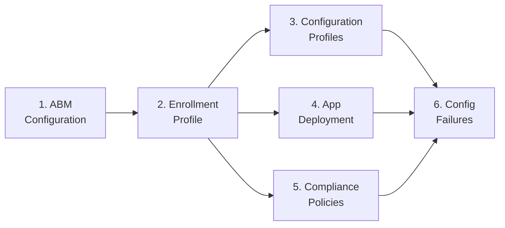

# Phase 50: Linux Admin Setup + Capability Matrix — Pattern Map

**Mapped:** 2026-04-27
**Files analyzed:** 13 (9 deliverables + 4 metadata edits)
**Analogs found:** 12 / 13 (1 partial-reference only)

---

## File Classification

| New/Modified File | Role | Data Flow | Closest Analog | Match Quality |
|---|---|---|---|---|
| `docs/admin-setup-linux/00-overview.md` | doc/overview | transform | `docs/admin-setup-macos/00-overview.md` | exact (macOS mirror) |
| `docs/admin-setup-linux/01-intune-linux-agent.md` | doc/admin-guide | request-response | `docs/admin-setup-android/01-managed-google-play.md` | role-match (pitfall-callout pattern) |
| `docs/admin-setup-linux/02-enrollment-profile.md` | doc/admin-guide | CRUD | `docs/admin-setup-macos/02-enrollment-profile.md` | exact (macOS mirror per D-08) |
| `docs/admin-setup-linux/03-compliance-policy.md` | doc/admin-guide | CRUD | `docs/admin-setup-macos/05-compliance-policy.md` + `docs/admin-setup-android/04-byod-work-profile.md` | mixed mirror |
| `docs/admin-setup-linux/04-app-delivery.md` | doc/admin-guide | transform | `docs/admin-setup-macos/04-app-deployment.md` | role-match (scope-callout opening) |
| `docs/admin-setup-linux/05-conditional-access.md` | doc/admin-guide | request-response | `docs/reference/ca-enrollment-timing.md` | partial (CA-constraint framing) |
| `docs/end-user-guides/linux-intune-portal-enrollment.md` | doc/end-user-guide | request-response | `docs/end-user-guides/android-work-profile-setup.md` | exact (end-user mirror per D-09) |
| `docs/reference/linux-capability-matrix.md` | doc/reference | transform | `docs/reference/macos-capability-matrix.md` + `docs/reference/android-capability-matrix.md` | hybrid (macos for shape; android for Equivalences H2) |
| `scripts/validation/check-phase-50.mjs` | validator | batch | `scripts/validation/check-phase-49.mjs` | exact (direct extension) |
| `.planning/ROADMAP.md` (lines 119, 188) | metadata | transform | existing file (in-place edit) | N/A |
| `.planning/REQUIREMENTS.md` (lines 87, 148) | metadata | transform | existing file (in-place edit) | N/A |

---

## Pattern Assignments

### `docs/admin-setup-linux/00-overview.md` (doc/overview)

**Analog:** `docs/admin-setup-macos/00-overview.md`

**Frontmatter pattern** (lines 1-7):
```yaml
---
last_verified: 2026-04-14
review_by: 2026-07-13
applies_to: ADE
audience: admin
platform: macOS
---
```
For Linux: substitute `platform: Linux`, `applies_to: enrollment`, `last_verified: 2026-04-27`, `review_by: 2026-06-26` (60-day cycle per D-03).

**Platform-gate blockquote pattern** (lines 9-12):
```markdown
> **Platform gate:** This guide covers macOS ADE configuration via Apple Business Manager and Intune.
> For Windows Autopilot setup, see [Windows Admin Setup Guides](../admin-setup-apv1/00-overview.md).
> For macOS provisioning terminology, see the [macOS Glossary](../_glossary-macos.md).
```
For Linux: reference Linux Provisioning Glossary + Phase 49 cross-platform bridge back-link (DPO-03 anti-duplication; must NOT reproduce the H2, must back-link to `docs/linux-lifecycle/00-enrollment-overview.md#for-admins-familiar-with-windows--macos--android`).

**Mermaid setup-sequence diagram** (lines 19-28 — CD-02 recommended):
```markdown
## Setup Sequence


```
For Linux: fan-out is `00 → 01 → 02 → {03, 04, 05}` (install agent → enrollment profile → compliance/app/CA in parallel). Android overview (`docs/admin-setup-android/00-overview.md` lines 26-37) uses `flowchart TD` variant if branching is conditional. Mermaid style is author discretion (CD-02).

**Sequential guide list** (lines 30-41 — macOS `00-overview.md`):
```markdown
1. **[ABM Configuration](01-abm-configuration.md)** -- ...description...
2. **[Enrollment Profile](02-enrollment-profile.md)** -- ...description...
```
For Linux: 6-item list (00 through 05), each pointing at the sibling file with a one-sentence description.

**Cross-Platform References H2 + See Also H2** (lines 43-54):
```markdown
## Cross-Platform References
- [Capability Matrix](../reference/macos-capability-matrix.md) -- ...

## See Also
- [macOS ADE Lifecycle Overview](../macos-lifecycle/00-ade-lifecycle.md)
```
For Linux: `## Cross-Platform References` → `linux-capability-matrix.md` + back-link to Phase 49 whitelist. The DPO-03 anti-duplication guard means the `## For Admins Familiar…` content lives ONLY at `docs/linux-lifecycle/00-enrollment-overview.md#for-admins-familiar-with-windows--macos--android`. Validator asserts the back-link string is present AND the H2 string does NOT appear in `00-overview.md`.

**Version History table** (lines 58-61):
```markdown
| Date | Change | Author |
|------|--------|--------|
| 2026-04-14 | Initial version ... | -- |
```
For Linux: `| 2026-04-27 | Initial version — Linux admin setup overview ... | -- |`

---

### `docs/admin-setup-linux/01-intune-linux-agent.md` (doc/admin-guide, request-response)

**Analog:** `docs/admin-setup-android/01-managed-google-play.md` (tri-portal callout structure pattern)

**Frontmatter** (same as all admin-setup-linux files):
```yaml
---
last_verified: 2026-04-27
review_by: 2026-06-26
applies_to: enrollment
audience: admin
platform: Linux
---
```

**Platform-gate blockquote** (01-managed-google-play.md lines 11-17):
```markdown
> **Platform gate:** This guide covers Managed Google Play (MGP) tenant binding for Android
> Enterprise GMS modes: ...
> For macOS ADE, see [macOS Admin Setup](../admin-setup-macos/00-overview.md).
> For Android provisioning terminology, see the [Android Enterprise Provisioning Glossary](../_glossary-android.md).
```
For Linux: point at Linux glossary `_glossary-linux.md` and Phase 49 prerequisites.

**LIN-05 pitfall callout (MANDATORY — DPO-01 contract)**:
```markdown
> ⚠️ **Known admin pitfall:** ...
```
Validator asserts: `/^> ⚠️ \*\*Known admin pitfall/m` AND `content.includes('docs/linux-lifecycle/01-linux-prerequisites.md#non-version-breakpoints')` within 5 lines of the callout. Pattern from check-phase-49.mjs check V-49-06 (lines 120-122 of the validator): `> ⚠️ **Known caveat:**` blockquote pattern.

**PITFALL-3 deb-vs-Snap callout (MANDATORY)**:
```markdown
> 📋 **Note:** The Snap package (`snap install intune-portal`) was available during preview ...
> Use the deb package via `packages.microsoft.com` — the Snap path is [deprecated/preview].
```
Validator asserts: `content` includes literal "deprecated" or "preview" applied to Snap. The GA install command MUST be `sudo apt install intune-portal`.

**Prerequisites/Steps/Verification structure**: Mirror `docs/admin-setup-android/01-managed-google-play.md` lines 23-50 — checklist-style Prerequisites, then numbered Steps with `#### In Intune admin center` and `#### On device` H4 sub-headings, then Verification checklist.

---

### `docs/admin-setup-linux/02-enrollment-profile.md` (doc/admin-guide, CRUD)

**Analog:** `docs/admin-setup-macos/02-enrollment-profile.md` — DIRECT mirror (D-08)

**Frontmatter**:
```yaml
---
last_verified: 2026-04-27
review_by: 2026-06-26
applies_to: enrollment
audience: admin
platform: Linux
---
```

**Platform-gate blockquote** (analog lines 9-12):
```markdown
> **Platform gate:** This guide covers macOS ADE configuration via Apple Business Manager and Intune.
> For Windows Autopilot setup, see [Windows Admin Setup Guides](../admin-setup-apv1/00-overview.md).
> For macOS provisioning terminology, see the [macOS Glossary](../_glossary-macos.md).
```
For Linux: reference Linux glossary + Phase 49 prerequisites.

**Mandatory cross-link to end-user file (D-10 — BOTH DIRECTIONS required)**:
```markdown
> **For end users:** Personal-device or self-enrolling users follow [Linux Intune Portal Enrollment](../end-user-guides/linux-intune-portal-enrollment.md). This guide covers admin-side enrollment configuration only.
```
Place near the top of the file. Validator asserts `content.includes('../end-user-guides/linux-intune-portal-enrollment.md')`.

**H2 structure — PINNED (D-08)**:
- `## Prerequisites` — mirror analog lines 18-22
- `## Steps` — mirror analog lines 24-107 (numbered steps with H3/H4 hierarchy)
- `## Verification` — checklist format, mirror analog lines 108-115
- `## Configuration-Caused Failures` — table format, mirror analog lines 118-127
- `## See Also` — mirror analog lines 128-134

**What-breaks callout pattern** (analog lines 46-49):
```markdown
> **What breaks if misconfigured:** Without user affinity, Company Portal will not work...
> Symptom appears in: Intune admin center (device shows no primary user)...
> See: [Setup Assistant Failed](../l1-runbooks/11-macos-setup-assistant-failed.md)
```
For Linux: same 3-line blockquote format with `Symptom appears in:` + `See:` runbook cross-reference (Phase 51 runbooks 30-33 are the targets).

**NEGATIVE assertions (validator-enforced per D-08)**: The file MUST NOT contain `## End-User Enrollment Steps`, `## Appendix:`, or `## Validate End-User Flow`. Validator pattern from RESEARCH.md Code Examples (Negative Assertion Pattern):
```javascript
const forbidden = [
  /^## End-User Enrollment Steps\s*$/m,
  /^## Appendix:/m,
  /^## Validate End-User Flow\s*$/m
];
```

**Version History table** (analog lines 136-140):
```markdown
| Date | Change | Author |
|------|--------|--------|
| 2026-04-27 | Initial version — Linux enrollment profile admin configuration | -- |
```

---

### `docs/admin-setup-linux/03-compliance-policy.md` (doc/admin-guide, CRUD)

**Primary analog:** `docs/admin-setup-macos/05-compliance-policy.md`
**Secondary analog (PITFALL-2 callout shape):** `docs/admin-setup-android/04-byod-work-profile.md` lines 18-19

**Frontmatter**: Same pattern as sibling files (`platform: Linux`, `audience: admin`, 60-day cycle).

**PITFALL-2 architectural callout (MANDATORY — opening section)**:
```markdown
> ⚠️ **Architecture callout:** The `Require device to be marked as compliant` grant control in Conditional Access is not available on Linux. A device that reports compliant via Intune compliance policy does NOT receive CA-level access grants — web-app CA via Microsoft Edge 102.x+ is the only supported CA pattern on Linux. See [Conditional Access](05-conditional-access.md) and [Linux Capability Matrix — Conditional Access](../reference/linux-capability-matrix.md#conditional-access).
```
Validator asserts: `content.includes('Require device to be marked as compliant')` AND `/not available|not supported/i.test(content)` (from RESEARCH.md PITFALL-2 callout assertion pattern).

**Compliance vs Configuration distinction table** (macOS analog lines 19-28):
```markdown
## Compliance vs. Configuration: Critical Distinction

| Action | Compliance Policy | Configuration Profile |
|--------|------------------|----------------------|
| Verify ... | Yes | Yes (also enforces it) |
```
For Linux: show 4 settings-catalog categories (Allowed Distributions / Custom Compliance / Device Encryption / Password Policy) in the same detect-vs-enforce framing. Note: Linux has no configuration profiles; compliance is detect-only.

**Steps H2 structure** (macOS analog lines 37-110):
- `## Steps` with H3 sub-steps (`### Step 1: Create Compliance Policy`, etc.)
- `#### In Intune admin center` H4 for portal-navigation numbered lists
- Per-setting what-breaks callouts

**Verification checklist + Configuration-Caused Failures table** (macOS analog lines 118-135): Same table format `| Misconfiguration | Portal | Symptom | Runbook |`.

**See Also H2** (macOS analog lines 136-142): Cross-link to `05-conditional-access.md` + `linux-capability-matrix.md` + Phase 51 runbook 31 (when available).

---

### `docs/admin-setup-linux/04-app-delivery.md` (doc/admin-guide, transform)

**Analog:** `docs/admin-setup-macos/04-app-deployment.md`

**Frontmatter**: Same pattern (`platform: Linux`, `audience: admin`, 60-day cycle).

**PITFALL-1 scope callout (MANDATORY — opening section)**:
The analog macOS file opens with a wide-scope comparison table (lines 18-29). Linux must instead open with a scope RESTRICTION callout:
```markdown
> 📋 **Scope note:** Linux app delivery in Intune is script-based only. There is no binary package delivery (no Win32 / MSI / MSIX / `.pkg` analog, no `.deb` direct delivery). Intune delivers Shell/Bash scripts; the script itself downloads and installs packages. See [Linux Capability Matrix — App Deployment](../reference/linux-capability-matrix.md#app-deployment).
```
Validator asserts: `content` includes literal "script-based only" or "no Win32" (from CONTEXT.md D-24 PITFALL-1 check).

**Concept-level overview pattern**: macOS file lines 52-100 show per-format step-by-step portal navigation. Linux equivalent is concept-level + at most 1 minimal Bash example (CD-07, LIN-DEFER-01 Bash deep-dive deferred to v1.5.1). Do NOT author a full script library.

**Prerequisites + Verification + See Also H2s**: Mirror macOS file structure. See Also cross-links to `linux-capability-matrix.md#app-deployment`.

---

### `docs/admin-setup-linux/05-conditional-access.md` (doc/admin-guide, request-response)

**Analog:** `docs/reference/ca-enrollment-timing.md` (CA constraint framing)

**Note:** No direct CA-only admin-guide analog exists for Linux. Use `ca-enrollment-timing.md` for the CA-constraint architectural framing and `macos-capability-matrix.md` Conditional Access row for the capability boundary shape.

**Frontmatter**: Same pattern (`platform: Linux`, `audience: admin`, 60-day cycle, `applies_to: conditional-access`).

**PITFALL-2 inheritance (mandatory — no device-level CA H2)**:
```markdown
> ⚠️ **Architecture: Web-app CA only.** Linux does NOT support device-level Conditional Access (`Require device to be marked as compliant` is not available). The only CA enforcement path on Linux is web-app CA via Microsoft Edge for Linux 102.x+. For cross-platform CA architectural reference, see [Linux Capability Matrix — Conditional Access](../reference/linux-capability-matrix.md#conditional-access).
```
This file MUST NOT have an H2 titled `## Device-Level Conditional Access` or similar — the CA capability is web-app-only and PITFALL-2 is the authoritative framing.

**CA-constraint framing from `ca-enrollment-timing.md`** (lines 13-55):
The problem-statement + why-it-happens + built-in-mitigations pattern is the structural template for the Linux CA guide. For Linux: the "problem" is that device-level CA does not exist; the architectural section explains web-app CA via Edge 102.x+ as the only available path.

**`## Prerequisites` H2**: Licensing verification (Intune + Entra P1/P2 for CA policies), Edge 102.x+ on device, enrollment complete.

**See Also H2**: Cross-link to `linux-capability-matrix.md#conditional-access` (anchor-stability contract for Phase 51 runbook 32 per CDI-Phase50-04), `02-enrollment-profile.md`, `03-compliance-policy.md`.

---

### `docs/end-user-guides/linux-intune-portal-enrollment.md` (doc/end-user-guide, request-response)

**Analog:** `docs/end-user-guides/android-work-profile-setup.md` — DIRECT mirror (D-09)

**Frontmatter** (analog lines 1-7):
```yaml
---
last_verified: 2026-04-22
review_by: 2026-06-21
audience: end-user
platform: Android
applies_to: BYOD
---
```
For Linux:
```yaml
---
last_verified: 2026-04-27
review_by: 2026-06-26
audience: end-user
platform: Linux
applies_to: enrollment
---
```

**Mandatory cross-link to admin file (D-10 — both directions required)**:
```markdown
> **For administrators:** If you administer Intune and are configuring Linux enrollment policy, see [admin-setup-linux/02-enrollment-profile.md](../admin-setup-linux/02-enrollment-profile.md).
```
Validator asserts `content.includes('../admin-setup-linux/02-enrollment-profile.md')`.

**H2 structure — PINNED (D-09, mirroring Android end-user analog)**:

1. `## What is Linux Intune Enrollment?` — mirrors `## What is BYOD Work Profile?` (analog lines 13-15). Plain-language explanation for non-technical users.

2. `## Before you start` — mirrors analog lines 17-27. Checklist of 5-6 items (Ubuntu 22.04/24.04, Edge 102.x+ available, org email, stable internet, time estimate). Plain-language format with bold item names.

3. `## Enroll your device` — mirrors analog lines 29-56. Numbered step list (LIN-06 5-step walkthrough: install Edge, install intune-portal deb, sign in, compliance remediation, access org resources via Edge). No alt-path complexity on Linux (unlike Android's web enrollment alternative).

4. `## Verify enrollment` — mirrors analog's enrollment-confirmation section. What the user sees when enrollment succeeds. Parallel to Android's "briefcase icon" visual confirmation.

5. `## Get help` — mirrors analog's "If something goes wrong" + "For IT helpdesk agents" sections (analog lines 80-122). Common error messages, what to tell IT, L1 routing note.

**Writing style**: Plain language, no jargon, bold for UI element names (same as Android end-user file). Avoid technical terms unless defined inline.

---

### `docs/reference/linux-capability-matrix.md` (doc/reference, transform)

**Primary analog:** `docs/reference/macos-capability-matrix.md` (Win|macOS bilateral shape)
**Secondary analog:** `docs/reference/android-capability-matrix.md` lines 76-92 (Cross-Platform Equivalences H2)

**Frontmatter** (macOS analog lines 1-7):
```yaml
---
last_verified: 2026-04-14
review_by: 2026-07-13
applies_to: both
audience: admin
platform: all
---
```
For Linux (D-03):
```yaml
---
last_verified: 2026-04-27
review_by: 2026-06-26
applies_to: both
audience: admin
platform: Linux
---
```
`platform: Linux` (NOT `platform: all`) per D-03 — Linux-focal-platform pattern for C10 AUDIT-02 scoping.

**Introductory prose pattern** (macOS analog lines 9-11):
```markdown
# Intune: macOS vs Windows Capability Matrix

This document compares Intune management capabilities between Windows and macOS...
For macOS admin setup guides, see [macOS Admin Setup Overview](../admin-setup-macos/00-overview.md).
```
For Linux: `# Intune: Linux vs Windows Capability Matrix` — then intro prose pointing at `admin-setup-linux/00-overview.md` and Phase 49 `linux-lifecycle/00-enrollment-overview.md#supported-management-surface`.

**Table format (Win|Linux 3-column, D-04)**:
macOS analog tables are `| Feature | Windows | macOS |`. Linux extends to `| Feature | Windows | Linux |`. Windows column uses prose. Linux column uses 3-status closed set only:
- `Supported`
- `Partial`
- `Not supported` (optionally with `— qualifier` suffix)

The CA row MUST read `Not supported — web-app CA only` (em dash `\u2014`, per PITFALL-2 line 48 + Phase 49 V-49-08 contract). Validator asserts: `content.includes("Not supported \u2014 web-app CA only")`.

**6 domain H2s — PINNED (D-02, D-06)**:
```markdown
## Enrollment
## Configuration
## App Deployment
## Compliance
## Software Updates
## Conditional Access
```
macOS uses 5 H2s (no separate CA H2 — CA is folded into Compliance). Linux ELEVATES CA to its own H2 (D-02). This creates the `linux-capability-matrix.md#conditional-access` anchor for Phase 51 runbook 32 (CDI-Phase50-04 lock). Validator asserts all 6 H2 strings present.

**Cross-Platform Equivalences H2 (D-05, D-06)**:
Placement: below the 6 domain H2s, above `## Key Gaps Summary`. Mirrors `docs/reference/android-capability-matrix.md` lines 76-92.

Android analog preamble (lines 83-84):
```markdown
This section maps three Apple↔Android capability pairs called out in ROADMAP SC#1. It is NOT a 4-platform comparison — see the [4-platform deferral footer](#deferred-4-platform-unified-capability-comparison) below. Each paired row attributes the platform explicitly on both sides...
```
For Linux: adapt to Linux↔multi-platform, ROADMAP SC#4 reference, same partial-mapping discipline (PITFALL-1 — `_glossary-linux.md` "mapping is structural, not behavioral").

Android paired-row table format (lines 85-92):
```markdown
| iOS / Apple | Android |
|-------------|---------|
| **iOS Supervision (ADE-enrolled)** | **Android Fully Managed (COBO / DPC owner)** |
| [body prose with anchor links] | [body prose with anchor links] |
```
For Linux: 3 rows, 2-column (`| macOS / iOS | Linux |` or similar header).

**Pair 1 (D-13)**: `Linux 'intune-portal' deb + 'microsoft-identity-broker' systemd unit` ≈ `macOS Microsoft Intune Company Portal app + IntuneMDMDaemon LaunchAgent`. Anchors: `_glossary-linux.md#intune-portal-package`, `_glossary-linux.md#microsoft-identity-broker`, `_glossary-macos.md#mam-we`.

**Pair 2 (D-14)**: `Linux 'intune-agent.timer' user-scope check-in` ≈ `iOS APNs-triggered MDM check-in cycle`. Body MUST disclose timer-poll vs APNs-push transport divergence. Anchors: `_glossary-linux.md#intune-agenttimer`, `_glossary-macos.md#apns`.

**Pair 3 (D-15, required by LIN-13)**: `Linux web-app CA (Microsoft Edge for Linux 102.x+)` ≈ `iOS MAM-WE — both 'compliance-lite' patterns`. Body MUST disclose architectural divergence (browser-challenge vs app-layer selective-wipe). Anchors: `_glossary-linux.md#web-app-ca`, `_glossary-macos.md#mam-we`.

**CRITICAL — SC#4 defect correction**: Do NOT use old SC#4 phrasing ("intune-portal service ≈ macOS LaunchDaemon"). D-13 rephrases Pair 1 to correct W-CRIT-1/2/3 defects. The same-commit ROADMAP.md D-22 edit updates SC#4 to match.

**Remaining H2s — PINNED (D-06)**:
```markdown
## Key Gaps Summary
## See Also
## Version History
```
macOS analog uses same H2s (lines 78-101). Android analog includes `## Key Gaps Summary` (recommended per CD-04). Total 10 H2s.

---

### `scripts/validation/check-phase-50.mjs` (validator, batch)

**Analog:** `scripts/validation/check-phase-49.mjs` — DIRECT extension

**File header pattern** (check-phase-49.mjs lines 1-5):
```javascript
#!/usr/bin/env node
// Phase 49 static validation harness
// Source of truth: .planning/phases/49-.../49-CONTEXT.md
// NO SHELL: all file content via fs.readFileSync; no shared module; no external tools
// Implements 22 checks (V-49-01 through V-49-22); --skip-reciprocal flag skips ...
```
For Phase 50: adapt header comment; estimated 24-28 checks.

**Imports + helpers pattern** (lines 7-9):
```javascript
import { readFileSync, existsSync } from 'node:fs';
import { join } from 'node:path';
import process from 'node:process';
```
No additional imports — no-external-tools constraint (Phase 48 D-25).

**readFile helper** (lines 15-19):
```javascript
function readFile(relPath) {
  const abs = join(process.cwd(), relPath);
  if (!existsSync(abs)) return null;
  return readFileSync(abs, 'utf8');
}
```
Copy verbatim.

**argv flags pattern** (lines 11-13):
```javascript
const argv = process.argv.slice(2);
const VERBOSE = argv.includes('--verbose');
```
Phase 50 has no `--skip-reciprocal` flag (no reciprocal appends in Phase 50).

**Frontmatter check pattern — V-49-18 (lines 254-279) → extend to 8 files**:
```javascript
const fmMatch = content.replace(/\r\n/g, '\n').match(/^---\n([\s\S]*?)\n---/m);
if (!fmMatch) { failures.push(f + ": no frontmatter"); continue; }
const fm = fmMatch[1];
if (!/^platform: Linux\s*$/m.test(fm)) issues.push("platform: Linux missing");
const lvMatch = fm.match(/^last_verified: (\d{4}-\d{2}-\d{2})\s*$/m);
const rbMatch = fm.match(/^review_by: (\d{4}-\d{2}-\d{2})\s*$/m);
if (lvMatch && rbMatch) {
  const lv = new Date(lvMatch[1]), rb = new Date(rbMatch[1]);
  const days = (rb - lv) / (1000 * 60 * 60 * 24);
  if (days > 60) issues.push("review_by > 60 days after last_verified...");
}
```
Extend to check `audience: admin` on 7 admin files and `audience: end-user` on the end-user file.

**H2 pinned-string assertion pattern — V-49-02 (lines 80-86)**:
```javascript
if (/^## Supported Management Surface\s*$/m.test(content)) return { pass: true };
return { pass: false, detail: "H2 '## Supported Management Surface' not found" };
```
Copy this pattern for all pinned H2 strings: 6 domain H2s in matrix, 5 H2s in admin file (02), 5 H2s in end-user file.

**Column-aware 3-status closed-set check — V-49-07 (lines 126-149) → extend to Win|Linux 3-col**:
```javascript
// V-49-07 original (2-col table; cell index 1):
const statusCell = cells[1];

// V-50 extension (3-col table | Feature | Windows | Linux |; cell index 2):
const linuxCell = cells[2]; // Linux is the 3rd column
```
The domain H2 scope-entry regex must match all 6 Linux domain H2s:
```javascript
if (/^## (Enrollment|Configuration|App Deployment|Compliance|Software Updates|Conditional Access)\s*$/.test(line)) { inMatrix = true; continue; }
```
Header-row skip: `/^\| Feature \| Windows \| Linux \|/` (not just any header row).

**Cross-link literal assertions pattern — V-49-20/21/22 (lines 308-336)**:
```javascript
if (content.includes(RECIPROCAL_LINK_LITERAL)) return { pass: true };
return { pass: false, detail: "..." };
```
For Phase 50 cross-links (D-10):
```javascript
// Admin file → end-user file
content.includes('../end-user-guides/linux-intune-portal-enrollment.md')
// End-user file → admin file
content.includes('../admin-setup-linux/02-enrollment-profile.md')
```

**PITFALL callout assertions** (from RESEARCH.md Code Examples):

PITFALL-2 (03-compliance-policy.md):
```javascript
if (!content.includes('Require device to be marked as compliant'))
  return { pass: false, detail: "PITFALL-2: literal not found" };
if (!/not available|not supported/i.test(content))
  return { pass: false, detail: "PITFALL-2: qualifier not found" };
```

LIN-05 callout (01-intune-linux-agent.md):
```javascript
if (!content.includes('docs/linux-lifecycle/01-linux-prerequisites.md#non-version-breakpoints'))
  return { pass: false, detail: "DPO-01: back-link not found" };
if (!/^> ⚠️ \*\*Known admin pitfall/m.test(content))
  return { pass: false, detail: "LIN-05: blockquote not found" };
```

PITFALL-3 (01-intune-linux-agent.md — deb-vs-Snap):
```javascript
if (!/deprecated|preview/i.test(content))
  return { pass: false, detail: "PITFALL-3: 'deprecated' or 'preview' applied to Snap not found" };
```

DPO-03 anti-duplication (00-overview.md):
```javascript
// back-link present:
content.includes('docs/linux-lifecycle/00-enrollment-overview.md#for-admins-familiar-with-windows--macos--android')
// bridge H2 NOT present (regression guard):
!/^## For Admins Familiar with Windows \/ macOS \/ Android\s*$/m.test(content)
```

**Negative assertion pattern (D-08 guard)**:
```javascript
const forbidden = [
  /^## End-User Enrollment Steps\s*$/m,
  /^## Appendix:/m,
  /^## Validate End-User Flow\s*$/m
];
const found = forbidden.filter(r => r.test(content)).map(r => r.source);
if (found.length === 0) return { pass: true };
```

**CA cell literal assertion (V-49-08 pattern)**:
```javascript
if (content.includes("Not supported \u2014 web-app CA only")) return { pass: true };
return { pass: false, detail: "PITFALL-2 CA cell phrasing not found" };
```

**Equivalences ≥3 paired rows assertion**:
```javascript
// Count separator rows or explicit row pairs within ## Cross-Platform Equivalences scope
// Use line-based scope entry/exit (H2 detect) then count non-header, non-separator pipe rows
```

**Output + exit pattern** (lines 340-364):
```javascript
const LABEL_WIDTH = 64;
function padLabel(s) { ... }
let passed = 0, failed = 0, skipped = 0;
for (const check of checks) {
  let result;
  try { result = check.run(); } catch (e) { ... }
  // PASS / FAIL / SKIPPED output
}
process.stdout.write("\nSummary: " + passed + " passed, " + failed + " failed...\n");
process.exit(failed > 0 ? 1 : 0);
```
Copy verbatim from check-phase-49.mjs lines 339-364.

---

### `.planning/ROADMAP.md` — metadata edits (D-22 bundle)

**Line 119 — current text (verified)**:
```
- [ ] **Phase 50: Linux Admin Setup + Capability Matrix** — admin-setup-linux/ 6-file guide (00-overview through 05-conditional-access), linux-capability-matrix.md bilateral; end-user enrollment guide embedded
```
**Line 119 — target text (D-22)**:
```
- [ ] **Phase 50: Linux Admin Setup + Capability Matrix** — admin-setup-linux/ 6-file guide (00-overview through 05-conditional-access), linux-capability-matrix.md bilateral; end-user enrollment guide in docs/end-user-guides/ (cross-linked)
```
Change: `embedded` → `in docs/end-user-guides/ (cross-linked)`

**Line 188 — current text (verified)**:
```
  4. `docs/reference/linux-capability-matrix.md` has explicit "Not supported" cells for CA device-level, app binary delivery, zero-touch enrollment, configuration profiles, and Hybrid Entra Join — includes a Cross-Platform Equivalences section with at least 2 attributed pairs (intune-portal service ≈ macOS LaunchDaemon; Linux compliance check ≈ iOS MDM check-in cycle)
```
**Line 188 — target text (D-17/D-22 per CONTEXT.md verbatim)**:
```
  4. `docs/reference/linux-capability-matrix.md` has explicit "Not supported" cells for CA device-level, app binary delivery, zero-touch enrollment, configuration profiles, and Hybrid Entra Join — includes a Cross-Platform Equivalences section with at least 3 attributed pairs (Linux `intune-portal` deb + `microsoft-identity-broker` systemd unit ≈ macOS Microsoft Intune Company Portal app + IntuneMDMDaemon LaunchAgent; Linux `intune-agent.timer` user-scope check-in ≈ iOS APNs-triggered MDM check-in cycle; Linux web-app CA ≈ iOS MAM-WE both as "compliance-lite" patterns per LIN-13). DRIFT-07 cross-platform encryption pairs (BitLocker / FileVault / dm-crypt) and Bash-vs-PowerShell remediation pairs are NOT authored here — encryption drift belongs to Phase 56 DRIFT-07; Bash deep-dive belongs to v1.5.1 LIN-DEFER-01.
```

---

### `.planning/REQUIREMENTS.md` — metadata edits (D-22 bundle)

**Line 87 — current text (verified)**:
```
- [ ] **AUDIT-06**: Each new v1.5 phase ships a `check-phase-NN.mjs` validator alongside content (continues v1.3+ validator-as-deliverable discipline); CI workflow `.github/workflows/audit-harness-integrity.yml` registers each new validator
```
**Line 87 — target text (D-21/D-22)**:
Replace `.github/workflows/audit-harness-integrity.yml` → `.github/workflows/audit-harness-v1.5-integrity.yml`

**Line 148 — current text (verified)**:
```
| LIN-06 | 50 | admin-setup-linux/02-enrollment-profile.md — end-user enrollment steps embedded in admin setup phase |
```
**Line 148 — target text (D-22)**:
```
| LIN-06 | 50 | docs/end-user-guides/linux-intune-portal-enrollment.md — authored during Phase 50 admin setup; cross-linked from admin-setup-linux/02-enrollment-profile.md |
```

---

## Shared Patterns

### Frontmatter (C10 contract — all 8 content files)

**Source:** `docs/linux-lifecycle/00-enrollment-overview.md` lines 1-7 (Phase 49 canonical Linux frontmatter)
**Apply to:** All 8 Phase 50 content files

```yaml
---
last_verified: 2026-04-27
review_by: 2026-06-26
applies_to: [file-specific]
audience: admin          # end-user for linux-intune-portal-enrollment.md
platform: Linux
---
```

Rules:
- `platform: Linux` required on ALL 8 files (C10 AUDIT-02 scoping)
- 60-day `review_by` cycle: `last_verified: 2026-04-27` → `review_by: 2026-06-26`
- `audience: end-user` ONLY on `linux-intune-portal-enrollment.md`; `audience: admin` on all other 7
- `linux-capability-matrix.md` uses `applies_to: both` (bilateral matrix)

### Platform-gate blockquote

**Source:** `docs/admin-setup-macos/00-overview.md` lines 9-12 (or any macOS admin file)
**Apply to:** All 6 `docs/admin-setup-linux/` files

```markdown
> **Platform gate:** This guide covers [description].
> For [sibling platform] setup, see [...].
> For Linux terminology, see the [Linux Provisioning Glossary](../_glossary-linux.md).
```

### What-breaks callout

**Source:** `docs/admin-setup-macos/02-enrollment-profile.md` lines 46-49
**Apply to:** `02-enrollment-profile.md`, `03-compliance-policy.md`, `04-app-delivery.md`

```markdown
> **What breaks if misconfigured:** [description of misconfiguration consequence].
> Symptom appears in: [portal/device location of symptom].
> See: [runbook link — Phase 51 runbooks 30-33]
```

### Configuration-Caused Failures table

**Source:** `docs/admin-setup-macos/02-enrollment-profile.md` lines 118-127
**Apply to:** `02-enrollment-profile.md`, `03-compliance-policy.md`

```markdown
## Configuration-Caused Failures

| Misconfiguration | Portal | Symptom | Runbook |
|------------------|--------|---------|---------|
| [description] | Intune | [symptom] | [Phase 51 runbook link] |
```

### Validator check structure

**Source:** `scripts/validation/check-phase-49.mjs` lines 70-149 (check array entry format)
**Apply to:** `scripts/validation/check-phase-50.mjs`

```javascript
{
  id: N, name: "V-50-NN: [description]",
  run() {
    const content = readFile("path/to/file.md");
    if (content === null) return { pass: false, detail: "File does not exist" };
    if ([assertion]) return { pass: true };
    return { pass: false, detail: "[failure description]" };
  }
},
```

### Version History table

**Source:** `docs/admin-setup-macos/00-overview.md` lines 58-61
**Apply to:** All 8 content files

```markdown
---

| Date | Change | Author |
|------|--------|--------|
| 2026-04-27 | Initial version — [description] | -- |
```

---

## No Analog Found

| File | Role | Data Flow | Reason |
|------|------|-----------|--------|
| `docs/admin-setup-linux/05-conditional-access.md` | doc/admin-guide | request-response | No prior CA-only admin guide exists (macOS CA coverage is embedded in compliance guide and ca-enrollment-timing.md is a cross-platform reference doc, not a platform-specific admin guide). Use `ca-enrollment-timing.md` framing + PITFALL-2 content from RESEARCH.md. |

---

## Metadata

**Analog search scope:**
- `docs/admin-setup-macos/` (direct macOS mirror per Phase 34 D-08)
- `docs/admin-setup-android/` (Android BYOD precedent per Phase 37)
- `docs/end-user-guides/` (Android end-user file for D-09 mirror)
- `docs/reference/` (macos-capability-matrix + android-capability-matrix for D-01/D-05)
- `scripts/validation/` (check-phase-49.mjs direct ancestor)
- `docs/reference/ca-enrollment-timing.md` (CA constraint framing)
- `docs/linux-lifecycle/` (Phase 49 prerequisite anchors)

**Files scanned:** 15 analog files read + 2 planning files verified (ROADMAP.md, REQUIREMENTS.md)
**Pattern extraction date:** 2026-04-27

---

## Key Anchor Targets (Validator Must Assert)

| Anchor | File | Required By | Validator Check |
|--------|------|-------------|-----------------|
| `#non-version-breakpoints` | `docs/linux-lifecycle/01-linux-prerequisites.md` | LIN-05 / DPO-01 | `content.includes('docs/linux-lifecycle/01-linux-prerequisites.md#non-version-breakpoints')` |
| `#for-admins-familiar-with-windows--macos--android` | `docs/linux-lifecycle/00-enrollment-overview.md` | DPO-03 / DPO-07 | `content.includes('docs/linux-lifecycle/00-enrollment-overview.md#for-admins-familiar-with-windows--macos--android')` |
| `#intune-portal-package` | `docs/_glossary-linux.md` | D-13 Pair 1 | author asserts; Phase 49 verified existence |
| `#microsoft-identity-broker` | `docs/_glossary-linux.md` | D-13 Pair 1 | author asserts; Phase 49 verified existence |
| `#intune-agenttimer` | `docs/_glossary-linux.md` | D-14 Pair 2 | author asserts; Phase 49 verified existence |
| `#web-app-ca` | `docs/_glossary-linux.md` | D-15 Pair 3 | author asserts; Phase 49 verified existence |
| `#mam-we` | `docs/_glossary-macos.md` | D-14/D-15 Pairs 2/3 | author asserts; Phase 49 verified existence |
| `#apns` | `docs/_glossary-macos.md` | D-14 Pair 2 | author asserts; Phase 49 verified existence |
| `#conditional-access` | `docs/reference/linux-capability-matrix.md` | CDI-Phase50-04 | validator asserts H2 `## Conditional Access` present; phase 51 runbook 32 deep-links here |
