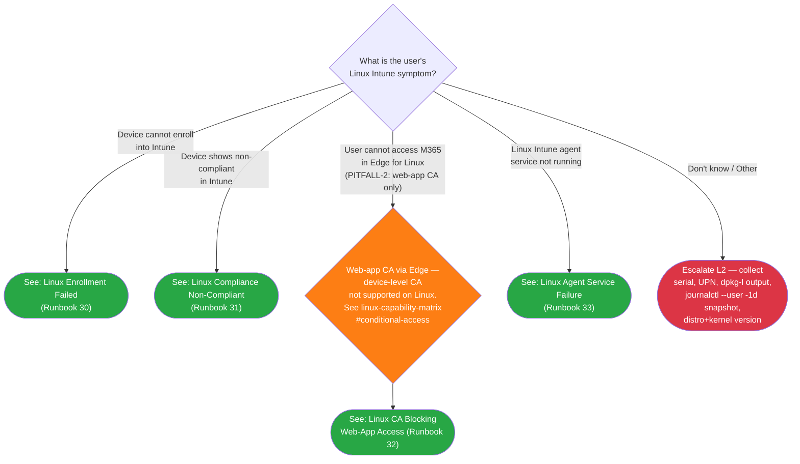

<objective>
Author `docs/decision-trees/09-linux-triage.md` — the Linux L1 triage Mermaid decision tree (LIN-07). Flat-symptom shape with 4 root branches (enrollment / non-compliant / CA-blocking-Edge / agent-service) routing to L1 runbooks 30-33, plus a "Don't know / Other" escalation node and a tree-level CA disambiguation diamond carrying the PITFALL-2 callout. NO enrollment-mode pre-gate (D-01 / PITFALL-1 whitelist-first lock).

Purpose: Satisfies SC#1 (L1 reaches correct runbook in ≤2 decision steps for each of 4 failure branches) and SC#3 tree-level component (PITFALL-2 routing discipline enforced at the decision-tree layer per Adversary disprove 1C-3 REJECTED + D-04). Tree is the discoverability + routing surface that feeds Runbooks 30/31/32/33; click directives + CA deep-link land here.

Output: 1 markdown file at `docs/decision-trees/09-linux-triage.md` (~140-180 lines) that passes V-51-01, V-51-05, V-51-06, V-51-07, V-51-08, V-51-09, V-51-10, V-51-11 in `check-phase-51.mjs`.
</objective>

<execution_context>
@$HOME/.claude/get-shit-done/workflows/execute-plan.md
@$HOME/.claude/get-shit-done/templates/summary.md
</execution_context>

<context>
@.planning/phases/51-linux-l1-triage-runbooks-30-33/51-CONTEXT.md
@.planning/phases/51-linux-l1-triage-runbooks-30-33/51-RESEARCH.md
@.planning/phases/51-linux-l1-triage-runbooks-30-33/51-PATTERNS.md
@docs/decision-trees/08-android-triage.md
@docs/decision-trees/00-initial-triage.md
@docs/reference/linux-capability-matrix.md

<interfaces>
The tree consumes:
- Phase 50 anchor: `docs/reference/linux-capability-matrix.md#conditional-access` (Phase 50 CDI-Phase50-04 immutable; verified at line 59 of matrix)
- Phase 50 anchor: `docs/end-user-guides/linux-intune-portal-enrollment.md` (referenced from Related Resources only — direct deep-link is owned by Runbook 30 per V-51-16)
- Phase 49 glossary: `docs/_glossary-linux.md` (referenced from Related Resources)

The tree provides (consumed downstream):
- 4 click destinations: `../l1-runbooks/30-linux-enrollment-failed.md`, `../l1-runbooks/31-linux-compliance-non-compliant.md`, `../l1-runbooks/32-linux-ca-blocking-web-access.md`, `../l1-runbooks/33-linux-agent-service-failure.md`
- LINR30/LINR31/LINR32/LINR33 node IDs (Phase 52 L2 cross-references may back-link)
- LINCA disambiguation node ID (tree-level PITFALL-2 enforcement surface)

Author discretion (CD per CONTEXT):
- CD-01: Exact comma/listing of platform-gate sibling links — author may polish wording
- CD-02: classDef styling — green (resolved) + red (escalateL2) + orange (pitfallCallout) is recommended
- CD-03: LINCA shape — decision diamond with embedded PITFALL-2 callout text is the recommended form (validator V-51-09 accepts either pattern)
- CD-07: LIN1 root label phrasing — author may polish
- CD-08: Don't-Know escalation node — recommended Escalation Data table at bottom (Android tree precedent at lines 117-121)
</interfaces>
</context>

<tasks>

<task type="auto" tdd="false">
  <name>Task 1: Author docs/decision-trees/09-linux-triage.md (Mermaid 4-branch tree + supporting H2s)</name>
  <files>docs/decision-trees/09-linux-triage.md</files>
  <read_first>
    - docs/decision-trees/08-android-triage.md (PRIMARY analog — frontmatter lines 1-7; platform-gate line 9; H1+How-to-Use+Legend lines 11-26; Mermaid block lines 29-75 for skeleton; Routing Verification table lines 77-101; How to Check lines 103-112; Escalation Data lines 114-121; Related Resources lines 123-133; Version History lines 135-140)
    - docs/decision-trees/00-initial-triage.md (secondary analog — flat-symptom precedent for LIN1 root; line 11 platform-gate banner pattern; line 81 escalateInfra orange palette ancestor for pitfallCallout class)
    - docs/reference/linux-capability-matrix.md (verify `## Conditional Access` H2 anchor at line 59 — slug `#conditional-access` — Phase 50 CDI-Phase50-04 immutable)
    - .planning/phases/51-linux-l1-triage-runbooks-30-33/51-PATTERNS.md (Section A — paste-ready frontmatter, platform-gate, H1, Legend, Mermaid skeleton, Routing Verification, How to Check, Escalation Data, Related Resources, Version History)
    - .planning/phases/51-linux-l1-triage-runbooks-30-33/51-RESEARCH.md (Mermaid syntax notes lines 39-72; tree-level PITFALL-2 callout variants lines 429-448; GFM anchor edge cases lines 401-427)
    - .planning/phases/51-linux-l1-triage-runbooks-30-33/51-CONTEXT.md (D-01..D-08 — tree shape decisions; CDI-Phase51-01..03 — coupling decisions)
  </read_first>
  <behavior>
    - File exists at `docs/decision-trees/09-linux-triage.md`
    - Frontmatter contains `platform: Linux`, `audience: L1`, `last_verified: 2026-04-27`, `review_by: 2026-06-26`, `applies_to: all`
    - Platform-gate blockquote at top names all 5 sibling platforms (Windows/macOS/iOS/Android/Linux) with relative-path links
    - Mermaid block uses `graph TD` and `LIN1{...}` root decision diamond
    - 4 click directives present (LINR30/LINR31/LINR32/LINR33) with relative paths to runbooks 30-33
    - LINCA disambiguation node carries literal "PITFALL-2" + "web-app CA" or "Edge for Linux"
    - Literal `../reference/linux-capability-matrix.md#conditional-access` cross-link present
    - "Don't know / Other" edge label present, routing to LINE1 escalateL2 terminal node
    - NO Android mode-axis tokens (BYOD/COBO/COPE/Dedicated/ZTE/AOSP/"What type of...enrollment")
    - Routing Verification table present with 5 rows (4 symptom-to-runbook + 1 unclear-to-escalation)
    - Related Resources H2 + Version History H2 present
  </behavior>
  <action>
Create `docs/decision-trees/09-linux-triage.md` containing the following sections, in order. Paste the structures verbatim and adapt only the listed Linux substitutions.

**1. Frontmatter (paste verbatim):**
```
---
last_verified: 2026-04-27
review_by: 2026-06-26
applies_to: all
audience: L1
platform: Linux
---
```

**2. Platform-gate blockquote (paste verbatim):**
```
> **Platform gate:** This guide covers Linux Intune client troubleshooting (Ubuntu 22.04/24.04 LTS). For Windows Autopilot, see [Initial Triage Decision Tree](00-initial-triage.md). For macOS ADE, see [macOS ADE Triage](06-macos-triage.md). For iOS/iPadOS, see [iOS Triage](07-ios-triage.md). For Android, see [Android Triage](08-android-triage.md).
```

**3. H1 + How to Use This Tree H2 + Legend H2 (paste verbatim):**
```
# Linux Triage Decision Tree

## How to Use This Tree

Start here when a user reports an issue with a Linux device enrolled (or expected to enroll) in Intune. Identify the failure symptom, then follow the matching branch to an L1 runbook or L2 escalation. All terminal nodes are within 2 decision steps of the root (well under the SC #1 5-node budget). Per Phase 51 D-01 + PITFALL-1 mitigation, this tree uses a flat-symptom shape (no enrollment-mode pre-gate) — Linux Intune supports a single management mode (Ubuntu 22.04/24.04 LTS via packages.microsoft.com), so the mode-axis question that gates Android does not apply.

## Legend

| Symbol | Meaning |
|--------|---------|
| Diamond `{...}` | Decision -- answer the question |
| Green rounded `([...])` | Resolved -- follow the linked L1 runbook |
| Red rounded `([...])` | Escalate to L2 -- collect data listed in Escalation Data table and hand off |
| Orange diamond `{...}` | Architectural callout -- web-app CA only on Linux (PITFALL-2) |
```

**4. Decision Tree H2 + Mermaid block (paste verbatim — this is the load-bearing structure):**
````
## Decision Tree


````

**5. Routing Verification H2 (paste verbatim):**
```
## Routing Verification

All terminal nodes are within 2 decision steps of the root node (LIN1), well under the SC #1 5-node budget per Phase 51 D-02.

| Path | Step 1 (root) | Step 2 (CA disambiguation, where applicable) | Destination |
|------|---------------|----------------------------------------------|-------------|
| Enrollment failed | Device cannot enroll into Intune | (terminal) | Runbook 30 |
| Compliance non-compliant | Device shows non-compliant in Intune | (terminal) | Runbook 31 |
| CA blocking web-app access | User cannot access M365 in Edge for Linux | LINCA → web-app CA only | Runbook 32 |
| Agent service failure | Linux Intune agent service not running | (terminal) | Runbook 33 |
| Unknown / Other | Don't know / Other | (terminal) | Escalate LINE1 |
```

**6. How to Check H2 (paste verbatim):**
```
## How to Check

Use these questions to identify which symptom branch applies before routing.

| Question | How to Check |
|----------|-------------|
| Did the device successfully enroll into Intune? | Open Intune admin center > **Devices > All devices** and filter by platform = Linux. If the device serial does not appear at all, the symptom is "Device cannot enroll" → Runbook 30. |
| Does the device appear in Intune as Non-compliant? | In **Devices > All devices > [device] > Device compliance**, the compliance state shows "Not compliant" → Runbook 31. |
| Is the user blocked accessing M365 specifically through Edge? | If the user reports "I can't sign in to Outlook on the web" or "Edge says my device isn't allowed," route via the LINCA disambiguation node → Runbook 32. Note that Linux supports web-app CA only (PITFALL-2). |
| Is the Intune agent service running on the device? | Ask the user to run `systemctl --user status intune-agent.timer` in a terminal. If output shows `inactive`, `failed`, or "Unit not found" → Runbook 33. |
```

**7. Escalation Data H2 (paste verbatim):**
```
## Escalation Data

Collect this information before routing to L2.

| When You Escalate | Collect This |
|-------------------|-------------|
| Unknown / Other (LINE1) | Device serial number, User UPN, distro + version (`lsb_release -a`), kernel + GA-vs-HWE (`uname -r`), `dpkg -l intune-portal` output, `journalctl --user --since "1 day ago"` snapshot, ticket description. Route to L2 for symptom identification. |
```

**8. Related Resources H2 (paste verbatim):**
```
## Related Resources

- [Linux L1 Runbooks Index](../l1-runbooks/00-index.md#linux-l1-runbooks) — All 4 Linux L1 runbooks (30-33)
- [Linux Provisioning Glossary](../_glossary-linux.md) — Canonical Linux Intune terminology
- [Linux Enrollment Overview](../linux-lifecycle/00-enrollment-overview.md) — Supported management surface
- [Linux Admin Setup Overview](../admin-setup-linux/00-overview.md) — Admin configuration entry point
- [Linux Capability Matrix — Conditional Access](../reference/linux-capability-matrix.md#conditional-access) — Architectural detail for PITFALL-2
- [Initial Triage Decision Tree](00-initial-triage.md) — Windows Autopilot entry point
- [macOS ADE Triage](06-macos-triage.md) — macOS ADE failure routing
- [iOS Triage](07-ios-triage.md) — iOS/iPadOS failure routing
- [Android Triage](08-android-triage.md) — Android enrollment/compliance failure routing
```

**9. Version History H2 (paste verbatim):**
```
## Version History

| Date | Change | Author |
|------|--------|--------|
| 2026-04-27 | Initial version (Phase 51 — Linux L1 triage tree, flat-symptom shape per D-01 / PITFALL-1) | -- |
```

DO NOT include any of the following Android mode-axis tokens anywhere in the file (V-51-07 negative regression-guard): `BYOD`, `COBO`, `COPE`, `Dedicated`, `ZTE`, `AOSP`, or any phrase matching `What type of...enrollment`.

DO NOT modify any other file in this plan — Runbook 30/31/32/33 are owned by 51-02/03/04/05; the validator is owned by 51-06; append-only edits at `00-index.md` + `00-initial-triage.md` are owned by 51-07.

DO NOT commit yet — atomic commit is owned by 51-08.
  </action>
  <verify>
    <automated>test -f docs/decision-trees/09-linux-triage.md && grep -c "click LINR" docs/decision-trees/09-linux-triage.md</automated>
  </verify>
  <acceptance_criteria>
    - File exists at `docs/decision-trees/09-linux-triage.md`
    - File contains literal `platform: Linux` (frontmatter; matches `/^platform: Linux\s*$/m`)
    - File contains literal `audience: L1` (frontmatter; matches `/^audience: L1\s*$/m`)
    - File contains literal `last_verified: 2026-04-27` and `review_by: 2026-06-26` (matches V-51-05 60-day cycle check)
    - File contains opening fence ` ```mermaid ` AND `graph TD` AND `LIN1{` (V-51-06 assertions)
    - File contains 4 click directives matching: `click \w+ "\.\.\/l1-runbooks\/30-linux-enrollment-failed\.md"`, `click \w+ "\.\.\/l1-runbooks\/31-linux-compliance-non-compliant\.md"`, `click \w+ "\.\.\/l1-runbooks\/32-linux-ca-blocking-web-access\.md"`, `click \w+ "\.\.\/l1-runbooks\/33-linux-agent-service-failure\.md"` (V-51-08)
    - Mermaid block contains literal `PITFALL-2` AND (`web-app CA` OR `Edge for Linux`) (V-51-09)
    - File contains literal `../reference/linux-capability-matrix.md#conditional-access` (V-51-10)
    - File contains literal `Don't know` AND (`Escalate L2` OR `escalateL2`) (V-51-11)
    - File does NOT contain any of: `BYOD`, `COBO`, `COPE`, `Dedicated`, `ZTE`, `AOSP`, or pattern `What type of[\s\S]*?enrollment` (V-51-07 regression guard)
    - File does NOT contain any of: `TBD`, `TODO`, `FIXME`, `XXX` (V-51-25)
    - File contains H2 `## Routing Verification` with a 5-row table (rows for: Enrollment failed, Compliance non-compliant, CA blocking, Agent service failure, Unknown / Other)
    - File contains H2 `## Related Resources` and H2 `## Version History`
  </acceptance_criteria>
  <done>09-linux-triage.md exists with frontmatter, Mermaid 4-branch tree (LIN1 root + 4 click directives + LINCA disambiguation + LINE1 escalation), Routing Verification table, How to Check, Escalation Data, Related Resources, Version History — all V-51-01/05/06/07/08/09/10/11 assertions structurally satisfiable; no commit yet (51-08 owns atomicity).</done>
</task>

</tasks>

<threat_model>
| Threat ID | Category | Component | Disposition | Mitigation |
|-----------|----------|-----------|-------------|------------|
| T-51-01 | Tampering (regression) | Mermaid block — Android mode-axis drift | mitigate | V-51-07 negative regex enforces `BYOD/COBO/COPE/Dedicated/ZTE/AOSP/'What type of...enrollment'` are absent. Author MUST keep `LIN1{...}` symptom-axis-only root. |
| T-51-02 | Tampering (regression) | LINCA disambiguation node | mitigate | V-51-09 enforces `PITFALL-2` + `web-app CA`/`Edge for Linux` tokens present in Mermaid block. Removing the LINCA node would fail SC#3 tree-level PITFALL-2 routing discipline (D-04). |
| T-51-03 | Information disclosure | Cross-link to Phase 50 matrix | accept | Phase 50 CDI-Phase50-04 locks `#conditional-access` anchor; same-commit validator dependency makes any rename detectable. |

No application security threats — tree is documentation-only.
</threat_model>

<verification>
After task completes:

```bash
test -f docs/decision-trees/09-linux-triage.md
grep -c "click LINR" docs/decision-trees/09-linux-triage.md   # expect 4
grep -c "PITFALL-2" docs/decision-trees/09-linux-triage.md    # expect >=1
grep -c "../reference/linux-capability-matrix.md#conditional-access" docs/decision-trees/09-linux-triage.md  # expect >=1
grep -E "BYOD|COBO|COPE|\\bDedicated\\b|ZTE|AOSP" docs/decision-trees/09-linux-triage.md && echo "FAIL: mode-axis token present" || echo "PASS"
```

If `check-phase-51.mjs` exists (51-06 may complete before this), run:
```bash
node scripts/validation/check-phase-51.mjs --verbose
# expect V-51-01 / V-51-05 / V-51-06 / V-51-07 / V-51-08 / V-51-09 / V-51-10 / V-51-11 PASS
```

DO NOT commit yet — atomic commit owned by 51-08.
</verification>

<success_criteria>
Maps to ROADMAP §Phase 51 Success Criteria:
- **SC#1 (L1 reaches correct runbook in ≤2 decision steps for each of 4 failure branches):** ✅ Tree's flat-symptom shape with 4 click directives + LINCA single-arm CA disambiguation satisfies the 2-step ceiling per D-02
- **SC#3 (Runbook 32 routes to web-app CA workflow only — PITFALL-2 routing discipline enforced in L1 triage [tree level]):** ✅ Tree LINCA node + cross-link to capability matrix CA H2 (per D-04 / CDI-Phase51-01 / CDI-Phase51-03)
- **SC#5 (frontmatter on 60-day cycle, platform: Linux, audience: L1):** ✅ Frontmatter block

Plan complete when:
- [ ] File exists at `docs/decision-trees/09-linux-triage.md`
- [ ] All 13 acceptance criteria pass (verified by 51-06 validator V-51-01/05/06/07/08/09/10/11 once authored)
- [ ] No mode-axis tokens present (PITFALL-1 whitelist-first lock honored)
- [ ] No commit yet — 51-08 owns atomicity
</success_criteria>

<output>
After completion, create `.planning/phases/51-linux-l1-triage-runbooks-30-33/51-01-SUMMARY.md` documenting:
- File path + line count
- Mermaid block structure (LIN1 root + 4 branches + LINCA + LINE1)
- 4 click directive paths verified
- PITFALL-1 negative regression guard (no mode-axis tokens) verified
- PITFALL-2 tree-level enforcement verified (LINCA + capability-matrix deep-link)
- Note: NO COMMIT — atomic commit owned by 51-08
</output>
