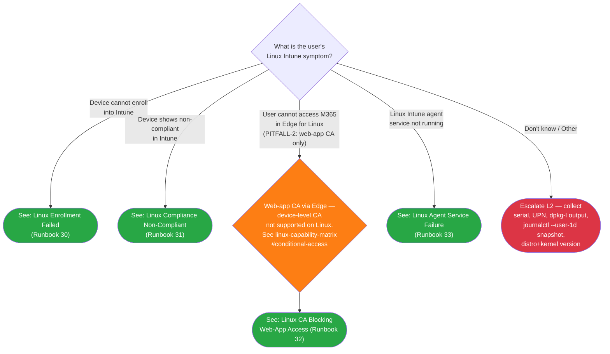

# Phase 51 Pattern Map

**Date:** 2026-04-27
**Status:** PATTERN MAPPING COMPLETE
**Files mapped:** 8 (1 tree + 4 runbooks + 1 validator + 2 append-only edits)

This document maps each Phase 51 deliverable to its closest existing analog with concrete, paste-ready code excerpts. The plan author should be able to lift the snippets verbatim and apply the listed Linux adaptations without re-reading the analog files.

Conventions used:
- "Copy verbatim" sections contain exact byte sequences from the analog files (line refs included).
- "Adapt for Linux" sections list the specific token swaps + structural modifications.
- All path references are relative to repository root unless otherwise noted.
- 51-RESEARCH.md remains the canonical command/regex source; this document is the structural mapping.

---

## A. `docs/decision-trees/09-linux-triage.md` → `08-android-triage.md` + `00-initial-triage.md`

**Why this analog:** Android triage tree (`08-android-triage.md`) supplies the verbatim Mermaid `graph TD` skeleton + classDef + click directive + Routing Verification table + Escalation Data + Related Resources + Version History H2 layout the Linux tree needs; Initial Triage (`00-initial-triage.md`) is the secondary analog only because Phase 51 rejects the Android mode-axis pre-gate (PITFALL-1) and Initial Triage is the closest flat-symptom precedent for the LIN1 root.

### Copy verbatim — Frontmatter (from 08-android-triage.md lines 1-7)

```
---
last_verified: 2026-04-27
review_by: 2026-06-26
applies_to: all
audience: L1
platform: Linux
---
```

### Copy verbatim — Platform-gate blockquote (from 08-android-triage.md line 9, adapted)

```
> **Platform gate:** This guide covers Linux Intune client troubleshooting (Ubuntu 22.04/24.04 LTS). For Windows Autopilot, see [Initial Triage Decision Tree](00-initial-triage.md). For macOS ADE, see [macOS ADE Triage](06-macos-triage.md). For iOS/iPadOS, see [iOS Triage](07-ios-triage.md). For Android, see [Android Triage](08-android-triage.md).
```

### Copy verbatim — H1 + How to Use This Tree H2 + Legend H2 (from 08-android-triage.md lines 11-26)

```
# Linux Triage Decision Tree

## How to Use This Tree

Start here when a user reports an issue with a Linux device enrolled (or expected to enroll) in Intune. Identify the failure symptom, then follow the matching branch to an L1 runbook or L2 escalation. All terminal nodes are within 2 decision steps of the root (well under the SC #1 5-node budget). Per Phase 51 D-01 + PITFALL-1 mitigation, this tree uses a flat-symptom shape (no enrollment-mode pre-gate) — Linux Intune supports a single management mode (Ubuntu 22.04/24.04 LTS via packages.microsoft.com), so the mode-axis question that gates Android does not apply.

## Legend

| Symbol | Meaning |
|--------|---------|
| Diamond `{...}` | Decision -- answer the question |
| Green rounded `([...])` | Resolved -- follow the linked L1 runbook |
| Red rounded `([...])` | Escalate to L2 -- collect data listed in Escalation Data table and hand off |
| Orange rounded `([...])` | Architectural callout -- web-app CA only on Linux (PITFALL-2) |
```

### Copy verbatim — Mermaid block (skeleton from 51-RESEARCH.md lines 41-65, fenced as Mermaid per 08-android-triage.md lines 29-75)

````
## Decision Tree


````

### Copy verbatim — Routing Verification table (from 08-android-triage.md lines 77-101)

```
## Routing Verification

All terminal nodes are within 2 decision steps of the root node (LIN1), well under the SC #1 5-node budget.

| Path | Step 1 (root) | Step 2 (CA disambiguation, where applicable) | Destination |
|------|---------------|----------------------------------------------|-------------|
| Enrollment failed | Device cannot enroll into Intune | (terminal) | Runbook 30 |
| Compliance non-compliant | Device shows non-compliant in Intune | (terminal) | Runbook 31 |
| CA blocking web-app access | User cannot access M365 in Edge for Linux | LINCA → web-app CA only | Runbook 32 |
| Agent service failure | Linux Intune agent service not running | (terminal) | Runbook 33 |
| Unknown / Other | Don't know / Other | (terminal) | Escalate LINE1 |
```

### Copy verbatim — How to Check H2 (pattern from 08-android-triage.md lines 103-112)

```
## How to Check

Use these questions to identify which symptom branch applies before routing.

| Question | How to Check |
|----------|-------------|
| Did the device successfully enroll into Intune? | Open Intune admin center > **Devices > All devices** and filter by platform = Linux. If the device serial does not appear at all, the symptom is "Device cannot enroll" → Runbook 30. |
| Does the device appear in Intune as Non-compliant? | In **Devices > All devices > [device] > Device compliance**, the compliance state shows "Not compliant" → Runbook 31. |
| Is the user blocked accessing M365 specifically through Edge? | If the user reports "I can't sign in to Outlook on the web" or "Edge says my device isn't allowed," route via the LINCA disambiguation node → Runbook 32. Note that Linux supports web-app CA only (PITFALL-2). |
| Is the Intune agent service running on the device? | Ask the user to run `systemctl --user status intune-agent.timer` in a terminal. If output shows `inactive`, `failed`, or "Unit not found" → Runbook 33. |
```

### Copy verbatim — Escalation Data H2 (pattern from 08-android-triage.md lines 114-121)

```
## Escalation Data

Collect this information before routing to L2.

| When You Escalate | Collect This |
|-------------------|-------------|
| Unknown / Other (LINE1) | Device serial number, User UPN, distro + version (`lsb_release -a`), kernel + GA-vs-HWE (`uname -r`), `dpkg -l intune-portal` output, `journalctl --user --since "1 day ago"` snapshot, ticket description. Route to L2 for symptom identification. |
```

### Copy verbatim — Related Resources H2 (pattern from 08-android-triage.md lines 123-133)

```
## Related Resources

- [Linux L1 Runbooks Index](../l1-runbooks/00-index.md#linux-l1-runbooks) — All 4 Linux L1 runbooks (30-33)
- [Linux Provisioning Glossary](../_glossary-linux.md) — Canonical Linux Intune terminology
- [Linux Enrollment Overview](../linux-lifecycle/00-enrollment-overview.md) — Supported management surface
- [Linux Admin Setup Overview](../admin-setup-linux/00-overview.md) — Admin configuration entry point
- [Linux Capability Matrix — Conditional Access](../reference/linux-capability-matrix.md#conditional-access) — Architectural detail for PITFALL-2
- [Initial Triage Decision Tree](00-initial-triage.md) — Windows Autopilot entry point
- [macOS ADE Triage](06-macos-triage.md) — macOS ADE failure routing
- [iOS Triage](07-ios-triage.md) — iOS/iPadOS failure routing
- [Android Triage](08-android-triage.md) — Android enrollment/compliance failure routing
```

### Copy verbatim — Version History H2 (pattern from 08-android-triage.md lines 135-140)

```
## Version History

| Date | Change | Author |
|------|--------|--------|
| 2026-04-27 | Initial version (Phase 51 — Linux L1 triage tree, flat-symptom shape per D-01 / PITFALL-1) | -- |
```

### Adapt for Linux

- Replace all `AND*` node IDs with `LIN*` (`AND1` → `LIN1`, `ANDR22-29` → `LINR30-33`, `ANDE2/ANDE3` → `LINE1`, plus new `LINCA` disambiguation diamond).
- Replace 5-mode pre-gate (`What type of Android enrollment...`) with single-question root (`What is the user's Linux Intune symptom?`).
- Add `classDef pitfallCallout fill:#fd7e14,color:#fff` (orange) — borrows palette from Initial Triage `escalateInfra` (line 81) and applies to the architectural-callout `LINCA` diamond.
- Add `<br/>` line breaks inside node labels — verified-supported in GitHub Mermaid per 08-android-triage.md lines 31-46.
- Replace per-mode click target list with 4 click directives (`LINR30/31/32/33`) per CDI-Phase51-04.
- Adapt Escalation Data fields: serial + UPN + `dpkg -l intune-portal` output + `journalctl --user --since "1 day ago"` snapshot + `lsb_release -a` distro + `uname -r` kernel/GA-vs-HWE.
- Update Related Resources cross-link list — replace 6 Android-specific entries with 8 Linux-specific entries (glossary, lifecycle, admin-setup, capability-matrix, sibling triage trees).
- Routing Verification table: 5 rows (4 symptom-to-runbook + 1 unclear-to-escalation); optional 6th row showing CA disambiguation 2-step path (per 51-RESEARCH.md Open Question 2 — author discretion).

---

## B. `docs/l1-runbooks/30-linux-enrollment-failed.md` → `25-android-compliance-blocked.md`

**Why this analog:** Multi-cause anchor-indexed runbook with explicit `## Cause A: <Name> {#cause-a-<anchor>}` H2 syntax + per-cause body (Entry condition + Symptom + L1 Triage Steps + Admin Action Required + Verify + Escalation) + overall Escalation Criteria — exact shape Phase 51 D-09 + D-11 + D-12 inherits for Runbooks 30/31/32.

### Copy verbatim — Frontmatter + Platform-gate (from 25-android-compliance-blocked.md lines 1-9, adapted)

```
---
last_verified: 2026-04-27
review_by: 2026-06-26
applies_to: all
audience: L1
platform: Linux
---

> **Platform gate:** This guide covers Linux Intune client troubleshooting (Ubuntu 22.04/24.04 LTS). For Windows Autopilot, see [Windows L1 Runbooks](00-index.md#apv1-runbooks). For macOS ADE, see [macOS ADE Runbooks](00-index.md#macos-ade-runbooks). For iOS/iPadOS, see [iOS L1 Runbooks](00-index.md#ios-l1-runbooks). For Android, see [Android L1 Runbooks](00-index.md#android-l1-runbooks).
```

### Copy verbatim — H1 + intro paragraph + cause enumeration (pattern from 25-android-compliance-blocked.md lines 11-22)

```
# Linux Enrollment Failed

L1 runbook for Linux endpoints (Ubuntu 22.04/24.04 LTS) where Intune enrollment did not complete. Three distinct causes are diagnosed independently:

- **Cause A:** Package install failure (`intune-portal` deb did not install or is in error state)
- **Cause B:** Sign-in failure (Microsoft Identity Broker authentication did not complete)
- **Cause C:** Enrollment timeout (`intune-agent.timer` did not check in within the expected window)

Routed here from the [Linux Triage Decision Tree](../decision-trees/09-linux-triage.md) LINR30 branch.
```

### Copy verbatim — Prerequisites H2 (pattern from 25-android-compliance-blocked.md lines 24-31, Linux-adapted)

```
## Prerequisites

- Access to Intune admin center (`https://intune.microsoft.com`) with Help Desk Operator or Read Only Operator role (read-only for enrollment status)
- Device serial number or User UPN
- Terminal access on the affected Linux device (the user runs read-only commands; sudo is admin-only — see [Admin Action Required](#admin-action-required))
- Portal shorthand used in this runbook:
   - **P-09** = `Devices > All devices > [device] > Overview` (device enrollment state view)
   - **P-08** = `Devices > Enrollment > Linux` (tenant-wide Linux enrollment configuration)
   - **P-COMP** = the Linux compliance policy assigned to the user's group (found via `Endpoint security > Device compliance > [policy name]`)
```

### Copy verbatim — How to Use This Runbook H2 (pattern from 25-android-compliance-blocked.md lines 33-44)

```
## How to Use This Runbook

Check the cause that matches your observation. Causes are independently diagnosable — you do not need to rule out prior causes.

- [Cause A: Package Install Failure](#cause-a-package-install) — `apt list --installed | grep intune-portal` empty OR `dpkg -l intune-portal` shows non-`ii` status
- [Cause B: Sign-In Failure (Microsoft Identity Broker)](#cause-b-sign-in-failure) — Identity Broker authentication did not complete; user sees sign-in prompt repeatedly or auth timeout
- [Cause C: Enrollment Timeout (`intune-agent.timer`)](#cause-c-enrollment-timeout) — `systemctl --user list-timers intune-agent.timer` shows `-` for NEXT or last activation > 1 hour ago

If none matches, proceed directly to [Escalation Criteria](#escalation-criteria).

Common ticket phrasings: "intune-portal won't install," "the sign-in keeps looping," "I enrolled but my device never shows up."

---
```

### Copy verbatim — Per-cause H2 anatomy (pattern from 25-android-compliance-blocked.md lines 48-93 = Cause A template)

```
## Cause A: Package Install Failure {#cause-a-package-install}

> See [intune-portal (package)](../_glossary-linux.md#intune-portal-package) for the package definition; [/var/log/dpkg.log](../_glossary-linux.md#varlogdpkglog) for the install-event log path; [APT repository](../_glossary-linux.md#apt-repository) for the packages.microsoft.com source.

**Entry condition:** `apt list --installed | grep intune-portal` returns empty OR `dpkg -l intune-portal` shows a status other than `ii` (e.g., `un`, `iU`, `iF`).

### Symptom

- User reports they tried to install Intune on their Linux device but the install did not complete
- `apt list --installed | grep intune-portal` returns empty (no installed entry)
- `dpkg -l intune-portal` shows package in non-`ii` state — typical: `un` (unknown / not installed), `iU` (install pending), `iF` (install failed during configure)

### L1 Triage Steps

1. > **Say to the user:** "Let me check whether the Intune client package is installed on your device. Please open Terminal and type: `apt list --installed | grep intune-portal`. Read me the output."
2. If the output is empty, the package is not installed — collect `cat /var/log/dpkg.log | grep intune` (or `tail -50 /var/log/dpkg.log`) to identify what happened on the last install attempt.
3. If the output shows non-`ii` state, ask the user to read me the full line from `dpkg -l intune-portal`.
4. Cross-reference [/var/log/dpkg.log](../_glossary-linux.md#varlogdpkglog) for the install-event log path; LOW-MEDIUM confidence per Phase 49 attestation.

### Admin Action Required

**Ask the admin to:**

- Reinstall the `intune-portal` package via `sudo apt install intune-portal` after confirming the packages.microsoft.com APT repository is reachable from the device's network.
- If the device is behind a proxy or firewall, verify that `https://packages.microsoft.com` is reachable.

**Verify:**

- After reinstall: `apt list --installed | grep intune-portal` returns a single line `intune-portal/jammy,now 2.0.X amd64 [installed]` (Ubuntu 22.04) or `intune-portal/noble,now 2.0.X amd64 [installed]` (Ubuntu 24.04).

**If the admin confirms none of the above applies:**

- Proceed to [Escalation Criteria](#escalation-criteria).

### Escalation (within Cause A)

- Reinstall succeeds but enrollment still does not complete (Cause B or C may apply next)
- packages.microsoft.com unreachable from the device's network despite the user being on the corporate network — escalate to Network team for proxy/firewall review

---
```

### Copy verbatim — Overall Escalation Criteria H2 (pattern from 25-android-compliance-blocked.md lines 236-261)

```
## Escalation Criteria

(Overall — applies across all three causes.)

Escalate to L2 (per Phase 30 D-12 three-part escalation packet). See [Phase 52 L2 Linux Enrollment Investigation] (forthcoming).

Escalate to L2 if:

- Cause A: reinstall succeeds but enrollment still fails after 30 minutes
- Cause B: Microsoft Identity Broker logs show no sign-in attempt despite user retrying
- Cause C: `intune-agent.timer` is active but no check-in occurs within 60 minutes
- Observation does not cleanly match any single cause (multiple failing signals across A/B/C)

**Before escalating, collect:**

- Device serial number
- Distro + version (`lsb_release -a` output)
- Kernel + GA-vs-HWE (`uname -r`)
- User UPN
- `dpkg -l intune-portal` output
- `journalctl --user --since "1 day ago"` snapshot (or `journalctl -u microsoft-identity-broker --since "1 day ago"` for Cause B)
- Which Cause (A/B/C) most closely matches the observation
- Timestamp of the failed enrollment attempt
- User actions attempted (if any) and the outcome

---

[Back to Linux Triage](../decision-trees/09-linux-triage.md)

## Version History

| Date | Change | Author |
|------|--------|--------|
| 2026-04-27 | Initial version (Phase 51 — 3-cause runbook: Package Install / Sign-In Failure / Enrollment Timeout) | -- |
```

### Adapt for Linux

- 3 causes (Runbook 25 has 4): drop one cause-block; preserve the A/B/C anchor-slug shape per CDI-Phase51-04 (`#cause-a-package-install`, `#cause-b-sign-in-failure`, `#cause-c-enrollment-timeout`).
- Replace P-09/P-08/P-COMP portal definitions with Linux-specific routes (`Devices > All devices > [device] > Overview` for P-09 — adapt as appropriate).
- Replace Android-specific glossary anchors with Linux glossary anchors using GFM-stripped slugs per 51-RESEARCH.md (`#intune-portal-package`, `#varlogdpkglog`, `#apt-repository`, `#identity-broker`, `#microsoft-identity-broker`, `#intune-agenttimer` — period stripped; `#journalctl`, `#dpkg`).
- Convert all `> **Say to the user:**` blockquotes (per Phase 30 D-10 actor-boundary precedent in Runbook 22 line 31; carries to Runbook 25 line 63) to read-only-command form: every L1 Triage Step containing a command must read NO sudo prefix.
- Sudo prefixes appear ONLY in `## Admin Action Required` H2 (per CONTEXT D-13 + 51-RESEARCH.md command table).
- Special case for Cause B: `microsoft-identity-broker` is system-scope, not user-scope — use `journalctl -u microsoft-identity-broker --since "1 hour ago"` (NO `--user`); add fallback `sudo journalctl -u microsoft-identity-broker` per 51-RESEARCH.md Implementation Risk #3 + D-18 carve-out.
- Replace Android L2 cross-references with `[Phase 52 L2 Linux Enrollment Investigation] (forthcoming)` placeholder per Phase 51 not having direct L2 successors.
- Drop Runbook 25's `## User Action Required` H2 entirely if no user-side remediation applies, OR keep per CONTEXT D-15 (portal-first vs terminal-walkthrough discretion); 51-RESEARCH.md Open Question 3 has author discretion.

---

## C. `docs/l1-runbooks/31-linux-compliance-non-compliant.md` → `25-android-compliance-blocked.md`

**Why this analog:** Same multi-cause anchor-indexed shape as Runbook 30 — but with **4 causes** matching Runbook 25's exact A/B/C/D pattern. Runbook 25 is the closest count match plus the closest scenario match (compliance failure with multiple independent causes).

### Copy verbatim

Identical to Section B above except:

1. Update the cause enumeration in the intro paragraph to **4 causes**:
   ```
   L1 runbook for Linux endpoints (Ubuntu 22.04/24.04 LTS) where compliance evaluation is reporting `Not compliant`. Four distinct causes are diagnosed independently:

   - **Cause A:** Distro version out of supported range (not Ubuntu 22.04 or 24.04 LTS)
   - **Cause B:** Disk not encrypted (LUKS/dm-crypt absent)
   - **Cause C:** Password policy not met (passwd not set or complexity insufficient)
   - **Cause D:** Custom-compliance Bash discovery script reporting non-compliant
   ```

2. Update the How to Use This Runbook list to 4 entries (mirror Runbook 25 lines 37-40 with Linux-anchor swaps).

3. Per-cause H2 anchors per CDI-Phase51-04:
   - `## Cause A: Distro Version Out of Range {#cause-a-distro-version-out-of-range}`
   - `## Cause B: Disk Not Encrypted {#cause-b-disk-not-encrypted}`
   - `## Cause C: Password Policy Not Met {#cause-c-password-policy-not-met}`
   - `## Cause D: Custom-Compliance Failure {#cause-d-custom-compliance-failure}`

4. Per-cause body anatomy verbatim from Section B (Entry condition + Symptom + L1 Triage Steps + Admin Action Required + Verify + Escalation).

### Adapt for Linux

- Cause A commands: `lsb_release -a` + `cat /etc/os-release` + `uname -r` (per 51-RESEARCH.md command table). GA-vs-HWE distinction per `_glossary-linux.md#ga-kernel` / `#hwe-kernel`.
- Causes B + C are **portal-first** per CONTEXT D-15: admin sees the failing-setting in P-09; user-side `lsblk -f` (Cause B) and `passwd --status` (Cause C) are informational diagnostic only. Use Runbook 25 Cause D's portal-first pattern (lines 183-220).
- Cause D commands: `cat /var/log/intune-update.log | tail -50` + `journalctl --user | grep intune-update` per glossary `#varlogintune-updatelog`.
- Glossary cross-links: `#linux-compliance-settings`, `#luks`, `#dm-crypt`, `#ga-kernel`, `#hwe-kernel`, `#ubuntu-lts`, `#varlogintune-updatelog`.
- Drop Runbook 25's `## User Action Required` cross-cause summary H2 (lines 225-233) per Phase 51 D-15 portal-first preference; or keep per author discretion.

---

## D. `docs/l1-runbooks/32-linux-ca-blocking-web-access.md` → `25-android-compliance-blocked.md` + Phase 50 architectural callout

**Why this analog:** Runbook 25 supplies the multi-cause anchor-indexed skeleton (3 causes for Runbook 32 per CDI-Phase51-04). Phase 50 `03-compliance-policy.md` opening callout (line 15-17) supplies the PITFALL-2 architectural-callout phrasing — but **paraphrased**, not quote-verbatim, per 51-RESEARCH.md PITFALL-13 mitigation (defect 4C-1: literal "Require device to be marked as compliant" string in Runbook 32 would false-positive V-51-19).

### Copy verbatim — All structural elements from Section B above

Same frontmatter, platform-gate, H1 + intro, Prerequisites, How to Use This Runbook, per-cause anatomy, Escalation Criteria, Version History.

### Copy verbatim — PITFALL-2 architectural callout (PARAPHRASED variant per 51-RESEARCH.md PITFALL-2 callout section, recommended Runbook 32 phrasing line 446)

Insert near the top of the runbook, after the H1 + intro paragraph, before Prerequisites:

```
> ⚠️ **Architecture: Linux is web-app CA only.** Device-level CA (the grant tied to compliance state) is not supported on Linux — only web-app sign-in via Edge for Linux 102.x+ is enforceable. See [Linux Capability Matrix — Conditional Access](../reference/linux-capability-matrix.md#conditional-access) for the full architectural detail.
```

### Adapt for Linux

- 3 causes per CDI-Phase51-04:
  - `## Cause A: Not Enrolled {#cause-a-not-enrolled}` — user is blocked because device is not enrolled at all (route to Runbook 30 if so).
  - `## Cause B: Non-Compliant {#cause-b-non-compliant}` — device enrolled but in non-compliant state (route to Runbook 31 if so; this cause is the "hand-off" entry pattern).
  - `## Cause C: Edge Not Signed In {#cause-c-edge-not-signed-in}` — device enrolled + compliant but user not signed into Edge for Linux with their work account, so the web-app CA check has nothing to evaluate.
- **DO NOT** include the literal string `Require device to be marked as compliant` anywhere in this runbook — V-51-19 negative regex will false-positive. Use only the paraphrased architectural callout above.
- Cross-link: `../reference/linux-capability-matrix.md#conditional-access` (V-51-17 mandatory literal).
- Glossary cross-links: `#web-app-ca` (note: GFM slug `#web-app-ca` per 51-RESEARCH.md Implementation Risk #10), `#ms-edge-for-linux`, `#identity-broker`.
- Cause-A entry condition: device serial absent from Intune > Devices > All devices (Linux platform filter). Hand-off note: if so, route to Runbook 30.
- Cause-B entry condition: P-09 shows compliance state "Not compliant." Hand-off note: route to Runbook 31.
- Cause-C entry condition: device is enrolled + compliant, but Edge for Linux is not signed in with the user's work account. User-side diagnostic: ask the user to open Edge and check the profile signed in.

---

## E. `docs/l1-runbooks/33-linux-agent-service-failure.md` → `22-android-enrollment-blocked.md`

**Why this analog:** Single-cause Runbook 22-style — single `## L1 Triage Steps` H2 with numbered list, no per-cause anchor decomposition; Phase 51 D-10 explicitly inherits this shape for Runbook 33 (the `intune-agent.timer` failure has a single observable cause: the timer is not firing).

### Copy verbatim — Frontmatter (from 22-android-enrollment-blocked.md lines 1-7, adapted)

Same as Section B Frontmatter (identical fields + values).

### Copy verbatim — Platform-gate blockquote (from 22-android-enrollment-blocked.md line 9)

Same as Section B Platform-gate.

### Copy verbatim — H1 + Symptom H2 + intro (pattern from 22-android-enrollment-blocked.md lines 11-23)

```
# Linux Intune Agent Service Failure

L1 runbook for Linux endpoints (Ubuntu 22.04/24.04 LTS) where the Intune agent service (`intune-agent.timer`) is not running or not checking in. The `intune-portal` deb package may still be installed; this runbook covers the case where the package is present but the systemd timer is inactive, failed, or never firing.

## Symptom

One or more of the following:

- User reports their Linux device "stopped checking in" or "fell off Intune"
- Admin-visible in Intune: device last-check-in timestamp is more than 24 hours old despite the user reporting the device is powered on
- `systemctl --user status intune-agent.timer` shows `Active: inactive (dead)` or `Active: failed` instead of `Active: active (waiting)`
- Common ticket phrasings: "my device hasn't checked in," "Intune says my device is offline but I'm using it now," "the agent is broken." [MEDIUM: community ticket phrasing survey, last_verified 2026-04-27]

Routed here from the [Linux Triage Decision Tree](../decision-trees/09-linux-triage.md) LINR33 branch.

> **Disambiguation:** If the device never enrolled (no `intune-portal` deb installed at all), see [Runbook 30: Linux Enrollment Failed](30-linux-enrollment-failed.md) instead. If the timer is running but compliance evaluation is reporting non-compliant, see [Runbook 31: Linux Compliance Non-Compliant](31-linux-compliance-non-compliant.md).
```

### Copy verbatim — L1 Triage Steps H2 with numbered list (pattern from 22-android-enrollment-blocked.md lines 27-49)

```
## L1 Triage Steps

L1 Triage Steps are read-only checks. L1 does NOT modify any service state — that is an admin action (see [Admin Action Required](#admin-action-required) below).

1. > **Say to the user:** "Let me check whether the Intune agent timer is running on your device. Please open Terminal and type: `systemctl --user status intune-agent.timer`. Read me the output."

2. If the output shows `Active: active (waiting)` and `Loaded: loaded`, the timer is healthy — escalate to a different runbook (the symptom may be misclassified). See [Disambiguation](#disambiguation) above.

3. If the output shows `Active: inactive (dead)` or `Active: failed`, ask the user to also run `systemctl --user is-enabled intune-agent.timer` and read me the output. Expected: `enabled` (timer set to start at boot) or `static` (timer wired to another service). If `disabled`, the timer was explicitly stopped — admin action required.

4. Run `systemctl --user list-timers intune-agent.timer` (still user-scope, no sudo). Read me the NEXT column. If the column shows `-`, the timer has no scheduled next-run — confirms the failure pattern.

5. Collect `journalctl --user -u intune-agent.timer --since "1 hour ago"` output (or `--since "1 day ago"` for broader scope). Document any failure messages or the absence of expected check-in messages.

6. Confirm the `intune-portal` package is still installed: `apt list --installed | grep intune-portal`. If empty (deb removed), the upstream cause is package removal — route to [Runbook 30](30-linux-enrollment-failed.md) instead.

7. Collect the following observed state for the escalation packet:
   - Output of `systemctl --user status intune-agent.timer`
   - Output of `systemctl --user is-enabled intune-agent.timer`
   - Output of `systemctl --user list-timers intune-agent.timer`
   - Output of `journalctl --user -u intune-agent.timer --since "1 day ago"`
   - User's UPN
   - Device serial number
   - Distro + version (`lsb_release -a`) + kernel (`uname -r`)
```

### Copy verbatim — Admin Action Required H2 (pattern from 22-android-enrollment-blocked.md lines 51-69)

```
## Admin Action Required

L1 documents and hands this packet to the Intune administrator. L1 does not execute any of the following actions.

**Ask the admin to:**

- Restart the user-scope timer: `systemctl --user start intune-agent.timer` (NO sudo — `--user` units do not take sudo). If the timer is `static` or wired to another unit, the admin should restart that parent unit instead.
- If the timer is in a `failed` state, run `systemctl --user reset-failed intune-agent.timer` and then `systemctl --user start intune-agent.timer`.
- If the upstream cause is package corruption: `sudo apt install --reinstall intune-portal` (this DOES use sudo because `apt` is system-scope) and then verify the timer with `systemctl --user is-active intune-agent.timer` — expected `active`.
- For broader troubleshooting, see [Linux Intune Agent Admin Setup](../admin-setup-linux/01-intune-linux-agent.md) for the canonical service health verification procedure.

**Verify:**

- After admin actions: `systemctl --user is-active intune-agent.timer` returns `active`. Within approximately 30 minutes the device should appear back in Intune admin center > Devices > All devices with an updated last-check-in timestamp.

**If the admin confirms none of the above applies:**

- Proceed to [Escalation Criteria](#escalation-criteria).
```

### Copy verbatim — Escalation Criteria H2 with three-part escalation packet (pattern from 22-android-enrollment-blocked.md lines 71-91)

```
## Escalation Criteria

Escalate to L2 (per Phase 30 D-12 three-part escalation packet). See [Phase 52 L2 Linux Agent Investigation] (forthcoming).

Escalate to L2 if:

- Timer restarts but immediately re-enters `failed` state within minutes
- Timer is `active (waiting)` but no check-in occurs within 60 minutes (the timer is firing but the agent is not communicating with Intune)
- Reinstall succeeds but the timer is still inactive after reinstall
- Multiple users on the same device model show the same failure pattern (likely an OS image / OEM regression — L2 investigation required)

**Before escalating, collect:**

- Device serial number
- Distro + version (`lsb_release -a`) + kernel (`uname -r`)
- User UPN
- Output of `systemctl --user status intune-agent.timer` (immediately after the failed restart attempt)
- Output of `journalctl --user -u intune-agent.timer --since "1 day ago"`
- `dpkg -l intune-portal` output
- Timestamp of the last successful check-in (from Intune admin center)
- Timestamp of the failed restart attempt

---

[Back to Linux Triage](../decision-trees/09-linux-triage.md)

## Version History

| Date | Change | Author |
|------|--------|--------|
| 2026-04-27 | Initial version (Phase 51 — Linux Intune agent service failure single-cause L1 runbook) | -- |
```

### Adapt for Linux

- **Single-cause shape only.** Validator V-51-15 enforces NEGATIVE regex `^## Cause [A-Z]:` — Runbook 33 must NOT contain anchor-indexed cause H2s.
- Replace Runbook 22's Android enrollment-restriction portal-walkthrough with the systemd-timer terminal-walkthrough pattern (read-only checks: `status`, `is-enabled`, `list-timers`, `journalctl`).
- `intune-agent.timer` is **user-scope** — `systemctl --user` commands NEVER take sudo. Validator V-51-20 enforces this negatively.
- `apt install --reinstall intune-portal` is system-scope — sudo prefix is correct here, in `## Admin Action Required` H2 ONLY.
- Glossary cross-links: `#intune-agenttimer` (period stripped per GFM), `#systemd`, `#journalctl`, `#intune-portal-package`, `#dpkg`.
- Drop the Runbook 25 multi-cause `## User Action Required` H2 — single-cause runbook does not need a cross-cause summary section.
- 3-part escalation packet anatomy from Runbook 22 (lines 80-92): (a) device-identity data, (b) command outputs at failure time, (c) timestamps.

---

## F. `scripts/validation/check-phase-51.mjs` → `check-phase-50.mjs`

**Why this analog:** Closest in V-check count (~25 for Phase 51 vs 26 for Phase 50) + closest scope (file-existence + frontmatter + H2 + cross-link literal + negative regression-guard). Phase 48 D-25 inherits to Phase 51: file-reads-only, no shared module — re-implement helpers inline.

### Copy verbatim — File header + imports + helper (from check-phase-50.mjs lines 1-19)

```javascript
#!/usr/bin/env node
// Phase 51 static validation harness
// Source of truth: .planning/phases/51-linux-l1-triage-runbooks-30-33/51-CONTEXT.md
// NO SHELL: all file content via fs.readFileSync; no shared module; no external tools
// Implements ~25 checks (V-51-01 through V-51-25)

import { readFileSync, existsSync } from 'node:fs';
import { join } from 'node:path';
import process from 'node:process';

const argv = process.argv.slice(2);
const VERBOSE = argv.includes('--verbose');

function readFile(relPath) {
  const abs = join(process.cwd(), relPath);
  if (!existsSync(abs)) return null;
  return readFileSync(abs, 'utf8');
}
```

### Copy verbatim — File path constants pattern (adapted from check-phase-50.mjs lines 20-34)

```javascript
// CDI-02: Pinned H2 strings — Phase 52+ renaming requires same-commit validator update.
const TREE = "docs/decision-trees/09-linux-triage.md";
const RB30 = "docs/l1-runbooks/30-linux-enrollment-failed.md";
const RB31 = "docs/l1-runbooks/31-linux-compliance-non-compliant.md";
const RB32 = "docs/l1-runbooks/32-linux-ca-blocking-web-access.md";
const RB33 = "docs/l1-runbooks/33-linux-agent-service-failure.md";
// Append-only edit targets
const INDEX = "docs/l1-runbooks/00-index.md";
const INITIAL = "docs/decision-trees/00-initial-triage.md";

const NEW_FILES = [TREE, RB30, RB31, RB32, RB33];
const RUNBOOKS = [RB30, RB31, RB32, RB33];
const ALL_CONTENT_FILES = [TREE, ...RUNBOOKS];
```

### Copy verbatim — File-existence pattern (V-51-01..04, copy from check-phase-50.mjs lines 44-107)

```javascript
{
  id: 1, name: "V-51-01: 09-linux-triage.md exists",
  run() {
    const c = readFile(TREE);
    if (c === null) return { pass: false, detail: "File missing: " + TREE };
    return { pass: true, detail: c.length + " bytes" };
  }
},
// Repeat for RB30, RB31, RB32, RB33 (V-51-02 through V-51-05 if 5-file enumeration; or consolidate to 4 per CONTEXT D-19 budget)
```

### Copy verbatim — Frontmatter check (V-51-05; pattern from check-phase-50.mjs lines 343-394)

```javascript
{
  id: 5, name: "V-51-05: all 5 new content files have platform: Linux + audience: L1 + 60-day cycle",
  run() {
    const failures = [];
    for (const f of ALL_CONTENT_FILES) {
      const c = readFile(f);
      if (c === null) { failures.push(f + ": file missing"); continue; }
      const fmMatch = c.replace(/\r\n/g, '\n').match(/^---\n([\s\S]*?)\n---/m);
      if (!fmMatch) { failures.push(f + ": no frontmatter"); continue; }
      const fm = fmMatch[1];
      const issues = [];
      if (!/^platform: Linux\s*$/m.test(fm)) issues.push("platform: Linux missing");
      if (!/^audience: L1\s*$/m.test(fm)) issues.push("audience: L1 missing");
      const lvMatch = fm.match(/^last_verified: (\d{4}-\d{2}-\d{2})\s*$/m);
      const rbMatch = fm.match(/^review_by: (\d{4}-\d{2}-\d{2})\s*$/m);
      if (!lvMatch) issues.push("last_verified missing/invalid");
      if (!rbMatch) issues.push("review_by missing/invalid");
      if (lvMatch && rbMatch) {
        const lv = new Date(lvMatch[1]), rb = new Date(rbMatch[1]);
        const days = (rb - lv) / (1000 * 60 * 60 * 24);
        if (days > 60) issues.push("review_by > 60 days after last_verified (was " + Math.round(days) + ")");
      }
      if (issues.length > 0) failures.push(f + ": " + issues.join("; "));
    }
    if (failures.length === 0) return { pass: true, detail: ALL_CONTENT_FILES.length + " files valid" };
    return { pass: false, detail: failures.join(" | ") };
  }
},
```

### Copy verbatim — Mermaid block + LIN1 root check (V-51-06; pattern from 51-RESEARCH.md lines 297-306)

```javascript
{
  id: 6, name: "V-51-06: 09-linux-triage.md has Mermaid block + graph TD + LIN1 root",
  run() {
    const c = readFile(TREE);
    if (c === null) return { pass: false, detail: "File missing" };
    const mermaidBlock = c.match(/```mermaid\n([\s\S]*?)```/);
    if (!mermaidBlock) return { pass: false, detail: "No Mermaid block found" };
    const m = mermaidBlock[1];
    if (!/graph TD/.test(m)) return { pass: false, detail: "graph TD not found in Mermaid block" };
    if (!/LIN1\{/.test(m)) return { pass: false, detail: "LIN1{ root decision diamond not found" };
    return { pass: true };
  }
},
```

### Copy verbatim — Tree NEGATIVE regression-guard (V-51-07; pattern from 51-RESEARCH.md lines 309-319)

```javascript
{
  id: 7, name: "V-51-07: 09-linux-triage.md has NO Android mode-axis tokens (PITFALL-1 regression guard)",
  run() {
    const c = readFile(TREE);
    if (c === null) return { pass: false, detail: "File missing" };
    const mermaidBlock = c.match(/```mermaid\n([\s\S]*?)```/);
    if (!mermaidBlock) return { pass: false, detail: "No Mermaid block found" };
    const m = mermaidBlock[1];
    const forbidden = [
      /\bBYOD\b/, /\bCOBO\b/, /\bCOPE\b/, /\bDedicated\b/,
      /\bZTE\b/, /\bAOSP\b/, /What type of[\s\S]*?enrollment/i
    ];
    const found = forbidden.filter(r => r.test(m)).map(r => r.source);
    if (found.length === 0) return { pass: true };
    return { pass: false, detail: "PITFALL-1 violation; mode-axis tokens: " + found.join(", ") };
  }
},
```

### Copy verbatim — Click directives check (V-51-08; pattern from 51-RESEARCH.md lines 322-330)

```javascript
{
  id: 8, name: "V-51-08: 09-linux-triage.md has 4 click directives to runbooks 30-33",
  run() {
    const c = readFile(TREE);
    if (c === null) return { pass: false, detail: "File missing" };
    const required = [
      /click \w+ "\.\.\/l1-runbooks\/30-linux-enrollment-failed\.md"/,
      /click \w+ "\.\.\/l1-runbooks\/31-linux-compliance-non-compliant\.md"/,
      /click \w+ "\.\.\/l1-runbooks\/32-linux-ca-blocking-web-access\.md"/,
      /click \w+ "\.\.\/l1-runbooks\/33-linux-agent-service-failure\.md"/
    ];
    const missing = required.filter(r => !r.test(c)).map(r => r.source);
    if (missing.length === 0) return { pass: true };
    return { pass: false, detail: "Missing click directive(s): " + missing.join(", ") };
  }
},
```

### Copy verbatim — Tree-level PITFALL-2 callout (V-51-09; pattern from 51-RESEARCH.md lines 333-340)

```javascript
{
  id: 9, name: "V-51-09: 09-linux-triage.md tree-level PITFALL-2 + web-app CA callout",
  run() {
    const c = readFile(TREE);
    if (c === null) return { pass: false, detail: "File missing" };
    const mermaid = c.match(/```mermaid\n([\s\S]*?)```/);
    if (!mermaid) return { pass: false, detail: "No Mermaid block" };
    const m = mermaid[1];
    const hasPitfall2 = /PITFALL-2/.test(m);
    const hasWebAppCA = /web-app CA/i.test(m) || /Edge for Linux/i.test(m);
    if (hasPitfall2 && hasWebAppCA) return { pass: true };
    return { pass: false, detail: "Need both PITFALL-2 token AND web-app CA / Edge for Linux token in Mermaid block" };
  }
},
```

### Copy verbatim — Tree CA deep-link (V-51-10)

```javascript
{
  id: 10, name: "V-51-10: 09-linux-triage.md has CA deep-link to capability matrix",
  run() {
    const c = readFile(TREE);
    if (c === null) return { pass: false, detail: "File missing" };
    if (c.includes("../reference/linux-capability-matrix.md#conditional-access")) return { pass: true };
    return { pass: false, detail: "CA deep-link literal not found" };
  }
},
```

### Copy verbatim — Tree escalation node (V-51-11)

```javascript
{
  id: 11, name: "V-51-11: 09-linux-triage.md has Don't know / Other → LINE1 escalation node",
  run() {
    const c = readFile(TREE);
    if (c === null) return { pass: false, detail: "File missing" };
    const hasEdge = /-->\|"Don't know[\s\S]*?Other"\|/.test(c) || /-->\|"Other[\s\S]*?Unclear"\|/.test(c);
    const hasTerminal = /(Escalate L2|escalateL2)/.test(c);
    if (hasEdge && hasTerminal) return { pass: true };
    return { pass: false, detail: "Need Don't know / Other edge label AND escalateL2 terminal node" };
  }
},
```

### Copy verbatim — Anchor-indexed cause structure (V-51-12..15; pattern from 51-RESEARCH.md lines 363-388)

```javascript
{
  id: 12, name: "V-51-12: Runbook 30 has 3 anchor-indexed Cause H2s",
  run() {
    const c = readFile(RB30);
    if (c === null) return { pass: false, detail: "File missing" };
    const required = [
      /^## Cause A: [^\n]*\{#cause-a-package-install\}\s*$/m,
      /^## Cause B: [^\n]*\{#cause-b-sign-in-failure\}\s*$/m,
      /^## Cause C: [^\n]*\{#cause-c-enrollment-timeout\}\s*$/m
    ];
    const missing = required.filter(r => !r.test(c)).map(r => r.source);
    if (missing.length === 0) return { pass: true };
    return { pass: false, detail: "Missing cause anchor(s): " + missing.join(", ") };
  }
},
{
  id: 13, name: "V-51-13: Runbook 31 has 4 anchor-indexed Cause H2s",
  run() {
    const c = readFile(RB31);
    if (c === null) return { pass: false, detail: "File missing" };
    const required = [
      /^## Cause A: [^\n]*\{#cause-a-distro-version-out-of-range\}\s*$/m,
      /^## Cause B: [^\n]*\{#cause-b-disk-not-encrypted\}\s*$/m,
      /^## Cause C: [^\n]*\{#cause-c-password-policy-not-met\}\s*$/m,
      /^## Cause D: [^\n]*\{#cause-d-custom-compliance-failure\}\s*$/m
    ];
    const missing = required.filter(r => !r.test(c)).map(r => r.source);
    if (missing.length === 0) return { pass: true };
    return { pass: false, detail: "Missing cause anchor(s): " + missing.join(", ") };
  }
},
{
  id: 14, name: "V-51-14: Runbook 32 has 3 anchor-indexed Cause H2s",
  run() {
    const c = readFile(RB32);
    if (c === null) return { pass: false, detail: "File missing" };
    const required = [
      /^## Cause A: [^\n]*\{#cause-a-not-enrolled\}\s*$/m,
      /^## Cause B: [^\n]*\{#cause-b-non-compliant\}\s*$/m,
      /^## Cause C: [^\n]*\{#cause-c-edge-not-signed-in\}\s*$/m
    ];
    const missing = required.filter(r => !r.test(c)).map(r => r.source);
    if (missing.length === 0) return { pass: true };
    return { pass: false, detail: "Missing cause anchor(s): " + missing.join(", ") };
  }
},
{
  id: 15, name: "V-51-15: Runbook 33 is single-cause (NO Cause H2s; HAS L1 Triage Steps H2)",
  run() {
    const c = readFile(RB33);
    if (c === null) return { pass: false, detail: "File missing" };
    if (/^## Cause [A-Z]:/m.test(c)) return { pass: false, detail: "Runbook 33 must NOT use anchor-indexed cause shape (D-10)" };
    if (!/^## L1 Triage Steps\s*$/m.test(c)) return { pass: false, detail: "Runbook 33 must have ## L1 Triage Steps H2 (single-cause Runbook 22 shape)" };
    return { pass: true };
  }
},
```

### Copy verbatim — Cross-link literals (V-51-16..17)

```javascript
{
  id: 16, name: "V-51-16: Runbook 30 cross-links to end-user enrollment guide",
  run() {
    const c = readFile(RB30);
    if (c === null) return { pass: false, detail: "File missing" };
    if (c.includes("../end-user-guides/linux-intune-portal-enrollment.md#enroll-your-device")) return { pass: true };
    return { pass: false, detail: "End-user enrollment cross-link literal not found" };
  }
},
{
  id: 17, name: "V-51-17: Runbook 32 cross-links to capability matrix #conditional-access",
  run() {
    const c = readFile(RB32);
    if (c === null) return { pass: false, detail: "File missing" };
    if (c.includes("../reference/linux-capability-matrix.md#conditional-access")) return { pass: true };
    return { pass: false, detail: "Capability matrix CA cross-link literal not found" };
  }
},
```

### Copy verbatim — PITFALL-2 positive + negative (V-51-18..19; pattern adapted from check-phase-50.mjs V-50-21)

```javascript
{
  id: 18, name: "V-51-18: Runbook 32 has web-app CA architectural callout (positive)",
  run() {
    const c = readFile(RB32);
    if (c === null) return { pass: false, detail: "File missing" };
    if (!/web-app CA/i.test(c)) return { pass: false, detail: "Runbook 32 missing 'web-app CA' phrasing" };
    if (!/Edge for Linux/i.test(c)) return { pass: false, detail: "Runbook 32 missing 'Edge for Linux' qualifier" };
    return { pass: true };
  }
},
{
  id: 19, name: "V-51-19: Runbook 32 does NOT contain 'Require device to be marked as compliant' (defect 4C-1; PITFALL-13 mitigation)",
  run() {
    const c = readFile(RB32);
    if (c === null) return { pass: false, detail: "File missing" };
    if (c.includes("Require device to be marked as compliant")) {
      return { pass: false, detail: "PITFALL-13 violation: literal 'Require device to be marked as compliant' present — paraphrase the architectural callout per 51-RESEARCH.md PITFALL-2 callout section" };
    }
    return { pass: true };
  }
},
```

### Copy verbatim — Read-vs-write apt regex (V-51-20)

CORRECTED per checker ISS-01: original split-on-`^## ` only inspected sections starting with "L1 Triage Steps" — that ONLY matched Runbook 33 (single-cause shape; H2 `## L1 Triage Steps`). Runbooks 30/31/32 nest `### L1 Triage Steps` inside `## Cause A:` / `## Cause B:` / etc. Use the explicit boundary-detection regex below — match BOTH H2 and H3 `L1 Triage Steps` headings, capture content up to the next H2 or H3 boundary.

```javascript
{
  id: 20, name: "V-51-20: L1 Triage Steps in all 4 runbooks contain NO sudo prefix on apt or systemctl --user",
  run() {
    const failures = [];
    for (const f of RUNBOOKS) {
      const c = readFile(f);
      if (c === null) { failures.push(f + ": file missing"); continue; }
      // Match BOTH `## L1 Triage Steps` (Runbook 33) AND `### L1 Triage Steps` (Runbooks 30/31/32 nested in Cause H2s).
      // Capture content up to the next H2 or H3 boundary (whichever comes first), or to end-of-file.
      const triageBlocks = [...c.matchAll(/^#{2,3}\s+L1 Triage Steps\s*$([\s\S]*?)(?=^#{2,3}\s+\S|\Z)/gm)];
      const issues = [];
      if (triageBlocks.length === 0) issues.push("no L1 Triage Steps heading found (H2 or H3)");
      for (const block of triageBlocks) {
        const s = block[1] || '';
        if (/\bsudo\s+apt\s+list\b/.test(s)) issues.push("sudo apt list in L1 Triage Steps");
        if (/\bsudo\s+dpkg\s+-l\b/.test(s)) issues.push("sudo dpkg -l in L1 Triage Steps");
        if (/\bsudo\s+systemctl\s+--user\b/.test(s)) issues.push("sudo systemctl --user (--user takes no sudo)");
        if (/\bsudo\s+journalctl\s+--user\b/.test(s)) issues.push("sudo journalctl --user (--user takes no sudo)");
      }
      if (issues.length > 0) failures.push(f + ": " + issues.join("; "));
    }
    if (failures.length === 0) return { pass: true, detail: RUNBOOKS.length + " runbooks pass read-only L1 check" };
    return { pass: false, detail: failures.join(" | ") };
  }
},
```

Allowed (NOT matched by the 3 sudo-on-readonly patterns above):
- `sudo journalctl -u microsoft-identity-broker` (system-scope, root-only-journal carve-out per D-18)
- `sudo systemctl restart ...`, `sudo apt install ...` inside `## Admin Action Required` H2 (those sections do NOT begin with "L1 Triage Steps" so they are correctly excluded by the heading match)

### Copy verbatim — Append-only assertions (V-51-21..22)

STRENGTHENED per checker ISS-02: V-51-21 was originally presence-only; now also asserts that the new `## Linux L1 Runbooks` H2 appears AFTER the existing `## Android L1 Runbooks` H2 by byte-position (one-line append-only ordering enforcement per Phase 42 D-03; full append-only diff review still owned by 51-08).

```javascript
{
  id: 21, name: "V-51-21: 00-index.md has Linux L1 Runbooks H2 (positioned AFTER Android H2) + 4 runbook entries",
  run() {
    const c = readFile(INDEX);
    if (c === null) return { pass: false, detail: "File missing" };
    if (!/^## Linux L1 Runbooks\s*$/m.test(c)) return { pass: false, detail: "## Linux L1 Runbooks H2 not found" };
    // Order assertion (ISS-02): Linux H2 byte-position MUST be greater than Android H2 byte-position.
    const linuxIdx = c.indexOf("## Linux L1 Runbooks");
    const androidIdx = c.indexOf("## Android L1 Runbooks");
    if (androidIdx === -1) return { pass: false, detail: "## Android L1 Runbooks H2 not found (regression — Phase 47 deliverable should be present)" };
    if (linuxIdx === -1) return { pass: false, detail: "## Linux L1 Runbooks H2 substring not found via indexOf" };
    if (linuxIdx <= androidIdx) return { pass: false, detail: "Append-only ordering violated: Linux H2 (byte " + linuxIdx + ") must appear AFTER Android H2 (byte " + androidIdx + ")" };
    const required = [
      /\[30: Linux Enrollment Failed\]\(30-linux-enrollment-failed\.md\)/,
      /\[31: Linux Compliance Non-Compliant\]\(31-linux-compliance-non-compliant\.md\)/,
      /\[32: Linux CA Blocking Web-App Access\]\(32-linux-ca-blocking-web-access\.md\)/,
      /\[33: Linux Agent Service Failure\]\(33-linux-agent-service-failure\.md\)/
    ];
    const missing = required.filter(r => !r.test(c)).map(r => r.source);
    if (missing.length === 0) return { pass: true, detail: "Linux H2 at byte " + linuxIdx + " > Android H2 at byte " + androidIdx };
    return { pass: false, detail: "Missing index entry/entries: " + missing.join(", ") };
  }
},
{
  id: 22, name: "V-51-22: 00-initial-triage.md has [Linux Triage](09-linux-triage.md) link in 3+ positions (append-only)",
  run() {
    const c = readFile(INITIAL);
    if (c === null) return { pass: false, detail: "File missing" };
    const matches = c.match(/\[Linux Triage\]\(09-linux-triage\.md\)/g);
    const count = matches ? matches.length : 0;
    if (count >= 3) return { pass: true, detail: count + " occurrences" };
    return { pass: false, detail: "Need >=3 occurrences of [Linux Triage](09-linux-triage.md); found " + count };
  }
},
```

### Copy verbatim — Glossary consumption + actor-boundary blockquote + TBD scan (V-51-23..25)

```javascript
{
  id: 23, name: "V-51-23: each of 4 runbooks links to >=1 _glossary-linux.md anchor",
  run() {
    const failures = [];
    for (const f of RUNBOOKS) {
      const c = readFile(f);
      if (c === null) { failures.push(f + ": file missing"); continue; }
      if (!/\.\.\/_glossary-linux\.md#[a-z0-9-]+/.test(c)) failures.push(f + ": no _glossary-linux.md anchor link found");
    }
    if (failures.length === 0) return { pass: true, detail: RUNBOOKS.length + " runbooks consume glossary" };
    return { pass: false, detail: failures.join(" | ") };
  }
},
{
  id: 24, name: "V-51-24: each of 4 runbooks has >=1 '> **Say to the user:**' actor-boundary blockquote",
  run() {
    const failures = [];
    for (const f of RUNBOOKS) {
      const c = readFile(f);
      if (c === null) { failures.push(f + ": file missing"); continue; }
      if (!/> \*\*Say to the user:\*\*/.test(c)) failures.push(f + ": missing '> **Say to the user:**' blockquote");
    }
    if (failures.length === 0) return { pass: true };
    return { pass: false, detail: failures.join(" | ") };
  }
},
{
  id: 25, name: "V-51-25: no TBD/TODO/FIXME placeholders in any new content file",
  run() {
    const failures = [];
    for (const f of ALL_CONTENT_FILES) {
      const c = readFile(f);
      if (c === null) { failures.push(f + ": file missing"); continue; }
      if (/\b(TBD|TODO|FIXME|XXX)\b/.test(c)) failures.push(f + ": placeholder token found");
    }
    if (failures.length === 0) return { pass: true };
    return { pass: false, detail: failures.join(" | ") };
  }
},
```

### Copy verbatim — Output loop + exit code (from check-phase-50.mjs lines 397-422)

```javascript
const LABEL_WIDTH = 64;
function padLabel(s) {
  if (s.length >= LABEL_WIDTH) return s + " ";
  return s + " " + ".".repeat(LABEL_WIDTH - s.length) + " ";
}

let passed = 0, failed = 0, skipped = 0;

for (const check of checks) {
  let result;
  try { result = check.run(); } catch (e) { result = { pass: false, detail: "Unexpected error: " + e.message }; }
  const prefix = "[" + check.id + "/" + checks.length + "] " + check.name;
  if (result.skipped) {
    skipped++;
    process.stdout.write(padLabel(prefix) + "SKIPPED -- " + (result.detail || "") + "\n");
  } else if (result.pass) {
    passed++;
    process.stdout.write(padLabel(prefix) + "PASS" + (VERBOSE && result.detail ? " -- " + result.detail : "") + "\n");
  } else {
    failed++;
    process.stdout.write(padLabel(prefix) + "FAIL -- " + result.detail + "\n");
  }
}

process.stdout.write("\nSummary: " + passed + " passed, " + failed + " failed, " + skipped + " skipped\n");
process.exit(failed > 0 ? 1 : 0);
```

### Adapt for Linux

- File path constants: `09-linux-triage.md`, `30/31/32/33-linux-*.md`, `00-index.md`, `00-initial-triage.md`.
- Cause anchor slugs: per CDI-Phase51-04 + 51-RESEARCH.md lines 363-388.
- Negative regression-guard tokens: BYOD/COBO/COPE/Dedicated/ZTE/AOSP — Phase 51 must NOT contain these per PITFALL-1.
- Frontmatter regex unchanged from V-50-25/26 except `audience: L1` (was `admin` / `end-user` in Phase 50).
- Helper functions `readFile()` + `padLabel()` re-implemented inline per Phase 48 D-25 (file-reads-only, no shared module).
- Total V-check count: 25 (V-51-01..25), within CONTEXT D-19 budget of 22-26.
- Exit code convention: `process.exit(failed > 0 ? 1 : 0)` — verbatim from check-phase-50.mjs line 422.

---

## G. `docs/l1-runbooks/00-index.md` append-only edit → mirror lines 64-76 (Android L1 Runbooks H2)

**Why this analog:** The Android L1 Runbooks section in `00-index.md` (lines 64-76) is the verbatim shape Phase 51 D-22 inherits — H2 + intro paragraph + 3-column table.

### Copy verbatim — H2 + intro + table (from 00-index.md lines 64-76, Linux-adapted)

Insert immediately after line 76 (after the AOSP Runbook 29 row, last existing Android entry):

```markdown
## Linux L1 Runbooks

L1 runbooks for the four most common Linux Intune client failure scenarios on Ubuntu 22.04/24.04 LTS. Start with the [Linux Triage Decision Tree](../decision-trees/09-linux-triage.md) to identify the failure mode, then follow the matching runbook below. All runbooks include L1-executable steps (portal-first or terminal walkthrough as appropriate per cause) and explicit escalation triggers to L2.

| Runbook | Scenario | Applies To |
|---------|----------|------------|
| [30: Linux Enrollment Failed](30-linux-enrollment-failed.md) | Enrollment failed at package install / sign-in / or timeout | Ubuntu 22.04/24.04 LTS |
| [31: Linux Compliance Non-Compliant](31-linux-compliance-non-compliant.md) | Device shows non-compliant in Intune (distro/encryption/password/custom-compliance) | Ubuntu 22.04/24.04 LTS |
| [32: Linux CA Blocking Web-App Access](32-linux-ca-blocking-web-access.md) | User blocked accessing M365 in Edge (web-app CA only — PITFALL-2) | Ubuntu 22.04/24.04 LTS |
| [33: Linux Agent Service Failure](33-linux-agent-service-failure.md) | intune-agent.timer not running / not checking in | Ubuntu 22.04/24.04 LTS |
```

### Adapt for Linux

- Replace "Android Enterprise enrollment and compliance failure scenarios" with "Linux Intune client failure scenarios on Ubuntu 22.04/24.04 LTS".
- Replace 7-row Android table (Runbooks 22-27 + 29) with 4-row Linux table (Runbooks 30-33).
- Applies-to column: "Ubuntu 22.04/24.04 LTS" for all 4 (no mode-axis decomposition per Phase 51 D-01 / PITFALL-1).
- Append a Version History entry for this index edit:
  ```
  | 2026-04-27 | Added Linux L1 Runbooks section (runbooks 30-33) | -- |
  ```

---

## H. `docs/decision-trees/00-initial-triage.md` append-only edits → mirror existing Android entries

**Why this analog:** The Android cross-platform plumbing in `00-initial-triage.md` (5 distinct insertion points) is the canonical shape Phase 51 D-22 inherits.

### Insertion point #1 — Platform-gate banner (after line 11, the Android line)

Verbatim Android line at 00-initial-triage.md line 11:

```
> **Android:** For Android enrollment/compliance troubleshooting, see [Android Triage](08-android-triage.md).
```

Append immediately after, on a new line:

```
> **Linux:** For Linux Intune client troubleshooting (Ubuntu LTS), see [Linux Triage](09-linux-triage.md).
```

### Insertion point #2 — Scenario Trees list (after line 40, the Android entry)

Verbatim Android line at 00-initial-triage.md line 40:

```
- [Android Triage](08-android-triage.md) — Android enrollment/compliance failure routing
```

Append immediately after:

```
- [Linux Triage](09-linux-triage.md) — Linux Intune client (Ubuntu 22.04/24.04 LTS) failure routing
```

### Insertion point #3 — See Also section (after line 122, the Android entry)

Verbatim Android line at 00-initial-triage.md line 122:

```
- [Android Triage](08-android-triage.md) -- Android enrollment/compliance triage
```

Append immediately after:

```
- [Linux Triage](09-linux-triage.md) -- Linux Intune client (Ubuntu LTS) triage
```

### Insertion point #4 — Scenario Trees footer (after line 133, Android entry)

Verbatim Android line at 00-initial-triage.md line 133:

```
- [Android Triage](08-android-triage.md)
```

Append immediately after:

```
- [Linux Triage](09-linux-triage.md)
```

### Insertion point #5 — Version History (new top row, after line 138 header separator)

Verbatim Android entry at 00-initial-triage.md line 139:

```
| 2026-04-23 | Added Android banner + triage link (Scenario Trees, See Also, Version History) | -- |
```

Append immediately above (new top row, since Version History is in reverse-chronological order):

```
| 2026-04-27 | Added Linux banner + triage link (Scenario Trees, See Also, Version History) | -- |
```

### Adapt for Linux

- All 5 insertions are append-only — preserve all existing Android/iOS/macOS/APv2/Initial-Triage content untouched.
- Use double-hyphen (`--`) separator in See Also entry per established 00-initial-triage.md convention (lines 120-123).
- Use em-dash (`—`) separator in Scenario Trees list entry per lines 35-40 convention.
- All 5 inserts must commit atomically with the 5 new content files (1 tree + 4 runbooks) per CDI-Phase51-06 single-commit-rationale.

---

## Cross-File Patterns (Inherited Conventions)

The following conventions span all 8 deliverables — the plan author should treat them as defaults unless explicitly overridden:

1. **60-day frontmatter cycle.** Every new content file (tree + 4 runbooks) carries `last_verified: 2026-04-27` + `review_by: 2026-06-26` per Phase 47+ standard. Validator V-51-05 enforces `(review_by - last_verified) / (1000*60*60*24) <= 60`.

2. **`audience: L1` value.** All 5 new content files carry `audience: L1` (vs Phase 50's `admin` / `end-user` split). Frontmatter regex `^audience: L1\s*$/m` is the V-51-05 inner check.

3. **`platform: Linux` value.** All 5 new content files carry `platform: Linux`. Validator regex `^platform: Linux\s*$/m`.

4. **`> **Platform gate:**` blockquote.** Every L1 runbook + decision tree opens with the platform-gate blockquote naming all 5 sibling platforms (Windows/macOS/iOS/Android/Linux) and linking to each L1 index section / triage tree. Verbatim shape from Runbook 25 line 9 + Tree 8 line 9.

5. **Phase 30 D-10 actor-boundary `> **Say to the user:**` blockquote pattern.** Every L1 Triage Steps numbered list begins with a `> **Say to the user:** "..."` first-step blockquote. Validator V-51-24 enforces ≥1 occurrence per runbook. Pattern from Runbook 22 line 31 + Runbook 25 line 63.

6. **Phase 30 D-12 three-part escalation packet anatomy.** Every Escalation Criteria H2 contains: (a) bulleted "Escalate to L2 if:" triggers, (b) "Before escalating, collect:" bulleted device-identity + command-output + timestamp data list, (c) optional cross-reference to forthcoming L2 runbook. Verbatim shape from Runbook 22 lines 71-91 + Runbook 25 lines 236-261.

7. **Append-only contract semantics for both edit targets.** Per CDI-Phase51-06: do NOT modify any existing line in `00-index.md` or `00-initial-triage.md` — only append the listed new lines at the listed insertion points. Validator V-51-21 + V-51-22 confirm new content present; manual diff review confirms no other lines changed.

8. **Relative-link convention `../...`.** All cross-file links use `..` to escape the current docs subdirectory: `../l1-runbooks/...` from decision-trees, `../decision-trees/...` from l1-runbooks, `../_glossary-linux.md#...` for glossary anchors, `../reference/linux-capability-matrix.md#...` for the capability matrix. Verbatim convention from Runbook 25 lines 22, 50, 60, 240 + Tree 8 lines 63-69, 125-130.

9. **GFM anchor-slug stripping.** Glossary cross-link slugs MUST use the GFM-stripped form per 51-RESEARCH.md Implementation Risk #2: `intune-agent.timer` → `#intune-agenttimer` (period stripped); `/var/log/dpkg.log` → `#varlogdpkglog` (slashes + period stripped); `intune-portal (package)` → `#intune-portal-package` (parens + space-to-hyphen). Phase 50 capability matrix is the reference (already correct).

10. **Linux command read-vs-write boundary.** Per Phase 51 D-13 + V-51-20: `## L1 Triage Steps` H2 contains ONLY read-only commands (no `sudo`, no `--reinstall`, no `restart`). State-changing commands appear ONLY in `## Admin Action Required` H2. Special carve-out: `microsoft-identity-broker` is system-scope so `journalctl -u microsoft-identity-broker` (no `--user`) is correct in L1 steps; `sudo journalctl ...` is acceptable only as a fallback per D-18 (root-only journals).

---

## Validator Implementation Skeleton

Full skeleton of `scripts/validation/check-phase-51.mjs` with V-51-NN check stubs. The plan executor pastes this in and fills in regex per the V-51-NN snippets in Section F above.

```javascript
#!/usr/bin/env node
// Phase 51 static validation harness
// Source of truth: .planning/phases/51-linux-l1-triage-runbooks-30-33/51-CONTEXT.md
// NO SHELL: all file content via fs.readFileSync; no shared module; no external tools
// Implements 25 checks (V-51-01 through V-51-25)

import { readFileSync, existsSync } from 'node:fs';
import { join } from 'node:path';
import process from 'node:process';

const argv = process.argv.slice(2);
const VERBOSE = argv.includes('--verbose');

function readFile(relPath) {
  const abs = join(process.cwd(), relPath);
  if (!existsSync(abs)) return null;
  return readFileSync(abs, 'utf8');
}

// CDI-02: Pinned H2 strings — Phase 52+ renaming requires same-commit validator update.
const TREE = "docs/decision-trees/09-linux-triage.md";
const RB30 = "docs/l1-runbooks/30-linux-enrollment-failed.md";
const RB31 = "docs/l1-runbooks/31-linux-compliance-non-compliant.md";
const RB32 = "docs/l1-runbooks/32-linux-ca-blocking-web-access.md";
const RB33 = "docs/l1-runbooks/33-linux-agent-service-failure.md";
const INDEX = "docs/l1-runbooks/00-index.md";
const INITIAL = "docs/decision-trees/00-initial-triage.md";

const NEW_FILES = [TREE, RB30, RB31, RB32, RB33];
const RUNBOOKS = [RB30, RB31, RB32, RB33];
const ALL_CONTENT_FILES = [TREE, ...RUNBOOKS];

const checks = [
  // V-51-01..04: file existence (TREE + 4 runbooks; or 5 separate IDs — CONTEXT D-19 leaves to author)
  // V-51-05: frontmatter (multi-file loop; mirror V-50-25 + V-50-26 consolidated)
  // V-51-06: Mermaid block + graph TD + LIN1 root
  // V-51-07: tree NEGATIVE regression-guard (no Android mode-axis tokens)
  // V-51-08: 4 click directives to runbooks 30-33
  // V-51-09: tree-level PITFALL-2 + web-app CA callout
  // V-51-10: tree CA deep-link literal
  // V-51-11: tree Don't know / Other → escalate L2 node
  // V-51-12: Runbook 30 has 3 anchor-indexed Cause H2s
  // V-51-13: Runbook 31 has 4 anchor-indexed Cause H2s
  // V-51-14: Runbook 32 has 3 anchor-indexed Cause H2s
  // V-51-15: Runbook 33 is single-cause (NO Cause H2s; HAS L1 Triage Steps H2)
  // V-51-16: Runbook 30 cross-links to end-user enrollment guide
  // V-51-17: Runbook 32 cross-links to capability matrix #conditional-access
  // V-51-18: Runbook 32 has web-app CA architectural callout (positive)
  // V-51-19: Runbook 32 does NOT contain 'Require device to be marked as compliant' (PITFALL-13)
  // V-51-20: L1 Triage Steps in all 4 runbooks contain NO sudo apt or sudo systemctl --user
  // V-51-21: 00-index.md has Linux L1 Runbooks H2 + 4 runbook entries
  // V-51-22: 00-initial-triage.md has [Linux Triage](09-linux-triage.md) link in 3+ positions
  // V-51-23: each of 4 runbooks links to >=1 _glossary-linux.md anchor
  // V-51-24: each of 4 runbooks has >=1 '> **Say to the user:**' actor-boundary blockquote
  // V-51-25: no TBD/TODO/FIXME placeholders in any new content file

  // (insert verbatim check stanzas from Section F above)
];

const LABEL_WIDTH = 64;
function padLabel(s) {
  if (s.length >= LABEL_WIDTH) return s + " ";
  return s + " " + ".".repeat(LABEL_WIDTH - s.length) + " ";
}

let passed = 0, failed = 0, skipped = 0;

for (const check of checks) {
  let result;
  try { result = check.run(); } catch (e) { result = { pass: false, detail: "Unexpected error: " + e.message }; }
  const prefix = "[" + check.id + "/" + checks.length + "] " + check.name;
  if (result.skipped) {
    skipped++;
    process.stdout.write(padLabel(prefix) + "SKIPPED -- " + (result.detail || "") + "\n");
  } else if (result.pass) {
    passed++;
    process.stdout.write(padLabel(prefix) + "PASS" + (VERBOSE && result.detail ? " -- " + result.detail : "") + "\n");
  } else {
    failed++;
    process.stdout.write(padLabel(prefix) + "FAIL -- " + result.detail + "\n");
  }
}

process.stdout.write("\nSummary: " + passed + " passed, " + failed + " failed, " + skipped + " skipped\n");
process.exit(failed > 0 ? 1 : 0);
```

V-check distribution per CONTEXT D-19 budget (22-26):

| Range | Coverage | Count |
|-------|----------|-------|
| V-51-01..04 | file existence (5 new files; consolidate or enumerate per author) | 4 (or 5) |
| V-51-05 | frontmatter (5-file consolidated loop) | 1 |
| V-51-06..11 | tree structure (6 distinct assertions) | 6 |
| V-51-12..15 | per-runbook anchor-indexed cause structure | 4 |
| V-51-16..19 | cross-link literals + PITFALL-2 positive/negative | 4 |
| V-51-20 | read-vs-write apt/systemctl regex across 4 runbooks | 1 |
| V-51-21..22 | append-only assertions | 2 |
| V-51-23..25 | glossary consumption + actor-boundary blockquote + TBD scan | 3 |
| **Total** |  | **25** |

---

## PATTERN MAPPING COMPLETE

