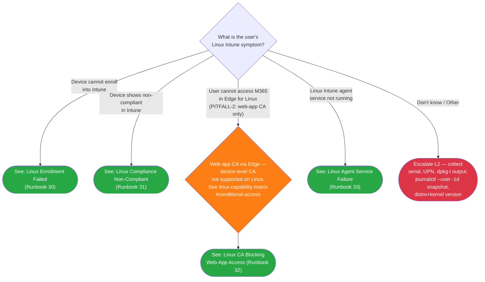

# Phase 51 Research

**Date:** 2026-04-27
**Status:** RESEARCH COMPLETE
**Scope:** Implementation-level technical research for Phase 51 (Linux L1 Triage + Runbooks 30-33). User-decision layer is locked in 51-CONTEXT.md; this document covers technical execution patterns, exact commands, validator regex, file-state verification, and Validation Architecture.

## Summary

All Phase 50 deliverables have shipped (verified in `docs/admin-setup-linux/`, `docs/end-user-guides/linux-intune-portal-enrollment.md`, `docs/reference/linux-capability-matrix.md`, `docs/_glossary-linux.md`, `scripts/validation/check-phase-49.mjs` + `check-phase-50.mjs`). Phase 51 can proceed without blocking. The Phase 50 cross-link target anchors are confirmed: `linux-intune-portal-enrollment.md#enroll-your-device` (verified at line 36) and `linux-capability-matrix.md#conditional-access` (verified at line 59). The `_glossary-linux.md` exposes ~30 H3 anchors covering all 10-12 terms Phase 51 needs to reference. Validator pattern for Phase 51 follows `check-phase-50.mjs` exactly: `node:fs/path/process` imports, `readFile()` helper, array-of-checks with `{id, name, run()}` shape, padded-label output, `process.exit(failed > 0 ? 1 : 0)`.

## File-State Verification (Phase 50 Inheritance Check)

All Phase 50 + Phase 49 deliverables exist as of 2026-04-27 startup:

| File | Status | Critical Anchor |
|------|--------|-----------------|
| `docs/end-user-guides/linux-intune-portal-enrollment.md` | EXISTS (8046 bytes) | `## Enroll your device` at line 36 → slug `#enroll-your-device` (DPO-01 target) |
| `docs/reference/linux-capability-matrix.md` | EXISTS (11512 bytes) | `## Conditional Access` at line 59 → slug `#conditional-access` (DPO-02 target; CDI-Phase50-04 immutable) |
| `docs/admin-setup-linux/00-overview.md` | EXISTS (3558 bytes) | n/a |
| `docs/admin-setup-linux/01-intune-linux-agent.md` | EXISTS (5534 bytes) | LIN-05 callout at line 17; `## Step 3: Verify Microsoft Identity Broker is running` (line 77) |
| `docs/admin-setup-linux/02-enrollment-profile.md` | EXISTS (6855 bytes) | n/a |
| `docs/admin-setup-linux/03-compliance-policy.md` | EXISTS (10737 bytes) | PITFALL-2 architectural callout at line 15-17 (contains literal "Require device to be marked as compliant") |
| `docs/admin-setup-linux/04-app-delivery.md` | EXISTS (5342 bytes) | n/a |
| `docs/admin-setup-linux/05-conditional-access.md` | EXISTS (6859 bytes) | Architectural callout at line 15 (contains "Require device to be marked as compliant"); CA grant comparison table at line 40-44 |
| `docs/_glossary-linux.md` | EXISTS (21143 bytes) | ~30 H3 anchors verified — see anchor map below |
| `scripts/validation/check-phase-49.mjs` | EXISTS (17961 bytes; 22 V-49-NN checks) | Validator pattern reference |
| `scripts/validation/check-phase-50.mjs` | EXISTS (18834 bytes; 26 V-50-NN checks) | Closest validator pattern reference |
| `scripts/validation/v1.5-milestone-audit.mjs` | EXISTS (27054 bytes) | C10 blocking; will validate Phase 51 outputs |
| `scripts/validation/v1.5-audit-allowlist.json` | EXISTS | Confirmed: `00-index.md` and `00-initial-triage.md` are NOT in `supervision_exemptions[]` (Android files only) — confirms Phase 51 D-22 single-commit rationale (CDI-Phase51-06) |

**No blocking — Phase 51 may proceed.**

## Technical Patterns

### Mermaid Tree Syntax for Linux

The **Initial Triage tree (`00-initial-triage.md` lines 44-86)** is the closer structural analog to Linux's flat-symptom shape than Android (which has the rejected mode-axis pre-gate). Both Initial Triage and Linux trees flow root-decision → symptom-branches without an enrollment-mode pre-gate. Linux mirrors Initial Triage's flat shape but routes only to L1 runbooks (no further sub-trees).

**Recommended Mermaid block shape for `09-linux-triage.md`:**

```

```

**Notes per CD-02/CD-03/CD-07:**
- The CA disambiguation node (`LINCA`) shape is a decision diamond ({...}) carrying the PITFALL-2 callout text inline; routes through the diamond to `LINR32`. Validator V-51-09 accepts either decision-diamond or callout-shape variants — this is CD-03 author discretion, but decision-diamond is more legible per Initial-Triage pattern.
- `classDef pitfallCallout fill:#fd7e14` (orange) follows Initial-Triage's `escalateInfra` orange precedent at `00-initial-triage.md` line 81; visually distinguishes the architectural-callout node from resolved/escalate-L2 nodes.
- Mermaid rendering on GitHub Markdown supports `<br/>` line breaks inside node labels; Android tree uses this exact pattern at lines 31-37.
- The `click` directive syntax is `click NODE_ID "relative/path/to/runbook.md"` — Android tree lines 63-69 are the verbatim pattern.

### Anchor-Indexed Multi-Cause Runbook Anatomy (Runbook 25 verbatim)

Per D-09 + D-12, multi-cause runbooks 30/31/32 mirror `25-android-compliance-blocked.md`:

```
---
last_verified: 2026-04-27
review_by: 2026-06-26
applies_to: all
audience: L1
platform: Linux
---

> **Platform gate:** This guide covers Linux Intune client troubleshooting (Ubuntu 22.04/24.04 LTS).
> For Windows Autopilot, see [Windows L1 Runbooks](00-index.md#apv1-runbooks). For macOS ADE, see
> [macOS ADE Runbooks](00-index.md#macos-ade-runbooks). For iOS/iPadOS, see [iOS L1 Runbooks](00-index.md#ios-l1-runbooks).
> For Android, see [Android L1 Runbooks](00-index.md#android-l1-runbooks).

# Linux [Symptom Title]

L1 runbook for [symptom-class]. Three distinct causes are diagnosed independently:

- **Cause A:** [name]
- **Cause B:** [name]
- **Cause C:** [name]

Routed here from the [Linux Triage Decision Tree](../decision-trees/09-linux-triage.md) [LINR<NN>] branch.

## Prerequisites

- [Access requirements; portal shorthand definitions if portal-side investigation]
- [Device data needed]

## How to Use This Runbook

Check the cause that matches your observation. Causes are independently diagnosable — you do not need to rule out prior causes.

- [Cause A: <name>](#cause-a-<anchor>) — <one-line entry condition>
- [Cause B: <name>](#cause-b-<anchor>) — <one-line entry condition>
- [Cause C: <name>](#cause-c-<anchor>) — <one-line entry condition>

If none matches, proceed directly to [Escalation Criteria](#escalation-criteria).

Common ticket phrasings: "...", "...".

---

## Cause A: <Name> {#cause-a-<anchor>}

> See [<glossary-term>](../_glossary-linux.md#<term-anchor>) for [contextual term definition].

**Entry condition:** [Observable signal — portal state OR terminal output the L1 will see].

### Symptom

- [bulleted observable indicators]

### L1 Triage Steps

1. > **Say to the user:** "[explanation in plain language]. Please open Terminal and type: `<command>`. Read me the output."
2. [Numbered diagnostic steps; for terminal-walkthrough causes — read-only commands per CDI-Phase51-05]
3. [Cross-reference glossary anchor inline if needed]

### Admin Action Required

**Ask the admin to:**

- [State-changing remediation — sudo prefixes appear ONLY here, never in L1 Triage Steps]

**Verify:**

- [Expected post-remediation state]

**If the admin confirms none of the above applies:**

- Proceed to [Escalation Criteria](#escalation-criteria).

### Escalation (within Cause A)

- [Sub-cause-specific escalation triggers]

---

## Cause B: <Name> {#cause-b-<anchor>}
[Same per-cause shape repeated]

---

## Cause C: <Name> {#cause-c-<anchor>}
[Same per-cause shape repeated]

---

## Escalation Criteria

(Overall — applies across all causes.)

Escalate to L2 (per Phase 30 D-12 three-part escalation packet). See [Phase 52 L2 runbooks 24/25].

Escalate to L2 if:

- [Cross-cause escalation triggers]

**Before escalating, collect:**

- Device serial number
- Distro + version (`lsb_release -a` output)
- Kernel + GA-vs-HWE (`uname -r`)
- User UPN
- `dpkg -l intune-portal` output
- `journalctl --user -1d` snapshot (or relevant scope)
- [Cause-specific data per Phase 30 D-12]

---

[Back to Linux Triage](../decision-trees/09-linux-triage.md)

## Version History

| Date | Change | Author |
|------|--------|--------|
| 2026-04-27 | Initial version (N-cause runbook: ...) | -- |
```

### Single-Cause Runbook Anatomy (Runbook 33)

Per D-10, Runbook 33 mirrors `22-android-enrollment-blocked.md`:

```
---
[same frontmatter]
---

> **Platform gate:** [same as multi-cause]

# Linux Intune Agent Service Failure

L1 runbook for Linux endpoints where the Intune Linux client (`intune-portal` deb + `intune-agent.timer`)
is not running or not checking in.

## Symptom

One or more of the following:

- [bulleted observable indicators]

Common ticket phrasings: "...".

Routed here from the [Linux Triage Decision Tree](../decision-trees/09-linux-triage.md) LINR33 branch.

> **Disambiguation:** [If specific differentiation needed]

## L1 Triage Steps

L1 Triage Steps are read-only checks. L1 does NOT modify any service state — that is an admin action
(see [Admin Action Required](#admin-action-required) below).

1. > **Say to the user:** "[explanation]. Please open Terminal and type: `<command>`. Read me the output."
2-N. [Numbered diagnostic steps]

## Admin Action Required

[State-changing remediation]

## Escalation Criteria

[Cross-cause escalation triggers + Before escalating collect packet]

---

[Back to Linux Triage](../decision-trees/09-linux-triage.md)

## Version History
```

### Linux Diagnostic Commands (per Runbook per Cause)

**Source:** Verified against `_glossary-linux.md` H3 entries (line 70-128) + Phase 50 admin-setup-linux/01-intune-linux-agent.md verification commands (lines 84-91, 100-104). Apt(8)/dpkg(1) read-vs-write semantics verified per CONTEXT.md D-13 + GA-3B disprove 3B-5 ADOPTED.

| Runbook / Cause | Command | sudo? | State | Expected output L1 reads |
|-----------------|---------|-------|-------|--------------------------|
| **30/A package-install** | `apt list --installed \| grep intune-portal` | NO | read-only | Either single line `intune-portal/jammy,now 2.0.X amd64 [installed]` OR empty (= not installed) |
| **30/A** | `dpkg -l intune-portal` | NO | read-only | Status table; `ii  intune-portal  2.0.X` = installed; non-`ii` (e.g., `un`, `iU`) = problem state |
| **30/A** | `cat /var/log/dpkg.log \| grep intune` | NO | read-only | Lines like `2026-04-27 09:15:32 install intune-portal:amd64 <none> 2.0.2`; per `_glossary-linux.md#varlogdpkglog` LOW-MEDIUM confidence (per Phase 49) |
| **30/A** | `cat /var/log/dpkg.log \| tail -50` | NO | read-only | Last 50 dpkg events; useful for "what happened just before failure" |
| **30/B sign-in-failure** | `journalctl --user -u microsoft-identity-broker --since "1 hour ago"` | NO | read-only | Per-unit log entries; `--user` scope avoids needing `sudo` because user-scope systemd journal is readable by the owning user. **NOTE:** `microsoft-identity-broker` is a SYSTEM-scope service per `01-intune-linux-agent.md` line 25 (`systemctl status microsoft-identity-broker` without `--user`). Plan author MUST clarify: for `microsoft-identity-broker`, the L1 command is `journalctl -u microsoft-identity-broker --since "1 hour ago"` (system-scope; user-readable on most Ubuntu installs because non-private logs are world-readable BUT may need `sudo` if `Storage=persistent` + `journal` group not in user's groups). For `intune-agent.timer` and other user-scope units, `journalctl --user -u <unit>` is correct. |
| **30/B** | `journalctl --user \| grep -iE "broker\|signin\|sign-in"` | NO | read-only | Filtered user-scope journal lines. Free-text grep across user journal. |
| **30/C enrollment-timeout** | `journalctl --user -u intune-agent.timer --since "1 hour ago"` | NO | read-only | User-scope timer log entries; per `_glossary-linux.md#intune-agenttimer` (line 80-84). |
| **30/C** | `systemctl --user list-timers intune-agent.timer` | NO | read-only | Next/last activation columns; tells L1 if the timer is firing on schedule |
| **31/A distro-version** | `lsb_release -a` | NO | read-only | Distributor/Description/Release/Codename — confirms Ubuntu 22.04 vs 24.04 |
| **31/A** | `cat /etc/os-release` | NO | read-only | Same info as lsb_release; alternative on minimal installs |
| **31/A** | `uname -r` | NO | read-only | Kernel version — disambiguates GA vs HWE per `_glossary-linux.md#ga-kernel` / `#hwe-kernel` |
| **31/B disk-encryption** (portal-first; user-side optional) | `lsblk -f` | NO | read-only | Filesystem table; LUKS volumes show `crypto_LUKS` in FSTYPE column. **Per CONTEXT.md D-15** Runbook 31 encryption cause is portal-first (admin observes failing-setting in P-09-equiv); the user-side `lsblk -f` is informational diagnostic only |
| **31/C password-policy** (portal-first; user-side optional) | `passwd --status` | NO | read-only | One line: `username P 04/27/2026 0 99999 7 -1` — P=set, NP=not set, L=locked. **Per D-15** Runbook 31 password cause is portal-first |
| **31/D custom-compliance** | `cat /var/log/intune-update.log \| tail -50` | NO | read-only | Per `_glossary-linux.md#varlogintune-updatelog` (line 126-128) — LOW-MEDIUM confidence path |
| **31/D** | `journalctl --user \| grep intune-update` | NO | read-only | Filter user journal for intune-update events |
| **33** | `systemctl --user status intune-agent.timer` | NO | read-only | Service status block; `Active: active (waiting)` = healthy; per `01-intune-linux-agent.md` line 89-91 |
| **33** | `systemctl --user is-active intune-agent.timer` | NO | read-only | One word: `active` / `inactive` / `failed` |
| **33** | `systemctl --user is-enabled intune-agent.timer` | NO | read-only | One word: `enabled` / `disabled` / `static` |
| **33** | `journalctl --user -u intune-agent.timer --since "1 hour ago"` | NO | read-only | User-scope timer log entries |
| **33** | `apt list --installed \| grep intune-portal` | NO | read-only | Confirms `intune-portal` deb still installed (deb removal would be the upstream cause of timer absence) |
| **30/31/32/33 admin remediation** | `sudo apt install intune-portal` | YES | state-changing | Routes to `## Admin Action Required` H2 only — never in L1 Triage Steps |
| **30/31/32/33 admin remediation** | `sudo systemctl --user restart intune-agent.timer` | depends on context | state-changing | **NOTE:** `--user` units do NOT take `sudo` — `systemctl --user restart X` is user-runnable. The `sudo` prefix appears for SYSTEM-scope service restart: `sudo systemctl restart microsoft-identity-broker`. Plan author MUST distinguish |

**Critical edge case:** `microsoft-identity-broker` is system-scope (per `01-intune-linux-agent.md` line 25: `systemctl status microsoft-identity-broker`); `intune-agent.timer` is user-scope (per `01-intune-linux-agent.md` line 90: `systemctl --user status intune-agent.timer`). The two units take different `--user` invocation rules and the plan author + validator regex must handle both. V-51-20 negative regex `sudo systemctl --user` is correct (user-scope never takes sudo); but `sudo systemctl status microsoft-identity-broker` may legitimately appear if root-only journal scope is needed (acceptable per D-18 carve-out).

### Validator Regex Patterns

**Source pattern:** `check-phase-50.mjs` lines 7-18 (imports + readFile helper); lines 405-422 (output loop). All Phase 51 patterns can be regex on `readFileSync` output.

**File-existence pattern (V-51-01..04):** match `check-phase-50.mjs` V-50-01..08 verbatim — `readFile()` returns `null` if missing.

**Frontmatter pattern (V-51-05):** match `check-phase-50.mjs` V-50-25/V-50-26 verbatim:
```javascript
const fmMatch = c.replace(/\r\n/g, '\n').match(/^---\n([\s\S]*?)\n---/m);
const fm = fmMatch[1];
if (!/^platform: Linux\s*$/m.test(fm)) issues.push("platform: Linux missing");
if (!/^audience: L1\s*$/m.test(fm)) issues.push("audience: L1 missing");
const lvMatch = fm.match(/^last_verified: (\d{4}-\d{2}-\d{2})\s*$/m);
const rbMatch = fm.match(/^review_by: (\d{4}-\d{2}-\d{2})\s*$/m);
// 60-day cycle check: (rb - lv) / (1000*60*60*24) <= 60
```

**Mermaid block + graph TD + LIN1 root (V-51-06):**
```javascript
// All three must be true (regex on full file content):
/```mermaid\n[\s\S]*?graph TD[\s\S]*?LIN1\{[\s\S]*?```/.test(c)
// OR split-pattern:
const mermaidBlock = c.match(/```mermaid\n([\s\S]*?)```/);
if (!mermaidBlock) return { pass: false, ... };
if (!/graph TD/.test(mermaidBlock[1])) return { pass: false, ... };
if (!/LIN1\{/.test(mermaidBlock[1])) return { pass: false, ... };
```

**Tree NEGATIVE assertion (V-51-07; whitelist-first regression guard):**
```javascript
const mermaidBlock = c.match(/```mermaid\n([\s\S]*?)```/);
if (!mermaidBlock) return { pass: false, ... };
const m = mermaidBlock[1];
const forbidden = [
  /\bBYOD\b/, /\bCOBO\b/, /\bCOPE\b/, /\bDedicated\b/,
  /\bZTE\b/, /\bAOSP\b/, /What type of[\s\S]*?enrollment/i
];
const found = forbidden.filter(r => r.test(m)).map(r => r.source);
if (found.length > 0) return { pass: false, detail: "PITFALL-1 violation; mode-axis tokens: " + found.join(", ") };
```

**Tree click directives (V-51-08):**
```javascript
const required = [
  /click \w+ "\.\.\/l1-runbooks\/30-linux-enrollment-failed\.md"/,
  /click \w+ "\.\.\/l1-runbooks\/31-linux-compliance-non-compliant\.md"/,
  /click \w+ "\.\.\/l1-runbooks\/32-linux-ca-blocking-web-access\.md"/,
  /click \w+ "\.\.\/l1-runbooks\/33-linux-agent-service-failure\.md"/
];
const missing = required.filter(r => !r.test(c)).map(r => r.source);
```

**Tree-level PITFALL-2 callout (V-51-09):**
```javascript
const mermaid = c.match(/```mermaid\n([\s\S]*?)```/);
if (!mermaid) return { pass: false, ... };
const m = mermaid[1];
const hasPitfall2 = /PITFALL-2/.test(m);
const hasWebAppCA = /web-app CA/i.test(m) || /Edge for Linux/i.test(m);
if (!(hasPitfall2 && hasWebAppCA)) return { pass: false, ... };
```

**Tree CA deep-link (V-51-10):**
```javascript
if (!c.includes("../reference/linux-capability-matrix.md#conditional-access")) return { pass: false, ... };
```

**Tree escalation node (V-51-11):**
```javascript
// Match Mermaid edge label "Don't know" / "Other" / "Unclear" routing to terminal node
if (!/-->\|"Don't know[\s\S]*?Other"\|/.test(c) && !/-->\|"Other[\s\S]*?Unclear"\|/.test(c)) return { pass: false, ... };
// Plus terminal-node assertion:
if (!/(Escalate L2|escalateL2)/.test(c)) return { pass: false, ... };
```

### Anchor-Indexed Cause Regex (V-51-12..15)

Per CONTEXT D-11 + D-09, validator pins literal anchors. Pattern from Runbook 25:
- H2 syntax: `## Cause A: [Display Name] {#cause-a-anchor-slug}`
- Markdown's GFM extension supports `{#anchor}` post-H2 for explicit anchor.

```javascript
// Runbook 30 — 3 causes
const r30required = [
  /^## Cause A: [^\n]*\{#cause-a-package-install\}\s*$/m,
  /^## Cause B: [^\n]*\{#cause-b-sign-in-failure\}\s*$/m,
  /^## Cause C: [^\n]*\{#cause-c-enrollment-timeout\}\s*$/m
];

// Runbook 31 — 4 causes
const r31required = [
  /^## Cause A: [^\n]*\{#cause-a-distro-version-out-of-range\}\s*$/m,
  /^## Cause B: [^\n]*\{#cause-b-disk-not-encrypted\}\s*$/m,
  /^## Cause C: [^\n]*\{#cause-c-password-policy-not-met\}\s*$/m,
  /^## Cause D: [^\n]*\{#cause-d-custom-compliance-failure\}\s*$/m
];

// Runbook 32 — 3 causes
const r32required = [
  /^## Cause A: [^\n]*\{#cause-a-not-enrolled\}\s*$/m,
  /^## Cause B: [^\n]*\{#cause-b-non-compliant\}\s*$/m,
  /^## Cause C: [^\n]*\{#cause-c-edge-not-signed-in\}\s*$/m
];

// Runbook 33 — single cause; assert NEGATIVE (no Cause H2s):
if (/^## Cause [A-Z]:/m.test(r33Content)) return { pass: false, detail: "Runbook 33 must NOT use anchor-indexed cause shape (D-10)" };
// Positive assertion: must contain `## L1 Triage Steps` (single-cause Runbook 22 shape)
if (!/^## L1 Triage Steps\s*$/m.test(r33Content)) return { pass: false, ... };
```

### Cross-Link Literal Strings

Verified against actual Phase 50 + Phase 49 deliverables:

| Validator Check | Source File | Required Literal | Verification |
|-----------------|-------------|------------------|--------------|
| V-51-16 | Runbook 30 | `../end-user-guides/linux-intune-portal-enrollment.md#enroll-your-device` | Anchor `## Enroll your device` confirmed at line 36 of end-user file. **Slug:** GFM/markdownlint convention is `#enroll-your-device` (lowercase, spaces→hyphens, no special chars to strip). |
| V-51-17 | Runbook 32 | `../reference/linux-capability-matrix.md#conditional-access` | Anchor `## Conditional Access` confirmed at line 59 of matrix. Slug: `#conditional-access`. CDI-Phase50-04 immutable. |
| V-51-10 | Tree | `../reference/linux-capability-matrix.md#conditional-access` | Same as above. |
| V-51-23 | All 4 runbooks | At least one `../_glossary-linux.md#<term-anchor>` link each | Verified anchor slugs below |

**Verified glossary anchor slugs from `docs/_glossary-linux.md` Alphabetical Index (line 16):**

| Term | Slug | Line |
|------|------|------|
| APT repository | `#apt-repository` | 22 |
| deb (package format) | `#deb-package-format` | 26 |
| dm-crypt | `#dm-crypt` | 30 |
| dpkg | `#dpkg` | 70 |
| GA kernel | `#ga-kernel` | 36 |
| GNOME desktop | `#gnome-desktop` | 42 |
| HWE kernel | `#hwe-kernel` | 46 |
| Identity Broker | `#identity-broker` | 74 |
| **intune-agent.timer** | `#intune-agenttimer` (period stripped per GFM slug rule) | 80 |
| **intune-portal (package)** | `#intune-portal-package` (parens stripped + space→hyphen) | 86 |
| journalctl | `#journalctl` | 116 |
| Linux compliance settings | `#linux-compliance-settings` | 102 |
| LUKS | `#luks` | 50 |
| MS Edge for Linux | `#ms-edge-for-linux` | 56 |
| **microsoft-identity-broker** | `#microsoft-identity-broker` | 92 |
| packages.microsoft.com | `#packagesmicrosoftcom` (period stripped) | 60 |
| systemd | `#systemd` | 96 |
| Ubuntu LTS | `#ubuntu-lts` | 64 |
| **/var/log/dpkg.log** | `#varlogdpkglog` (slashes + period stripped) | 122 |
| **/var/log/intune-update.log** | `#varlogintune-updatelog` | 126 |
| **Web-app CA** | `#web-app-ca` | 108 |

**CRITICAL anchor-slug warning:** GFM strips dots/slashes/parens from H3 text. The `intune-agent.timer` anchor is `#intune-agenttimer` (no period) NOT `#intune-agent.timer`. The CONTEXT.md D-11 + CDI-Phase51-04 reference these by abstract term name; runbook authors must use the GFM-stripped slug. The Phase 50 capability-matrix line 75 + 80 + 84 already uses these correctly (`[intune-portal package](_glossary-linux.md#intune-portal-package)`, `[intune-agent.timer](_glossary-linux.md#intune-agenttimer)`).

### PITFALL-2 Architectural Callout Variants

**Phase 50 canonical PITFALL-2 phrasings the planner can mirror in Runbook 32:**

1. **`docs/admin-setup-linux/03-compliance-policy.md` lines 15-17 (V-50-21 pinned):**
   > ⚠️ **Architecture callout — compliance reporting is NOT a Conditional Access grant on Linux:** A Linux device that reports `compliant` via an Intune compliance policy does NOT receive Conditional-Access-level access grants. The CA grant control `Require device to be marked as compliant` is **not available** on Linux — the only CA enforcement path on Linux is web-app CA via Microsoft Edge for Linux 102.x+. Compliance policy on Linux is **detect-only**...

2. **`docs/admin-setup-linux/05-conditional-access.md` line 15 (canonical):**
   > ⚠️ **Architecture: Web-app CA only.** Linux does NOT support device-level Conditional Access. The CA grant control `Require device to be marked as compliant` is not available on Linux. The only CA enforcement path on Linux is web-app CA via Microsoft Edge for Linux 102.x+...

3. **`docs/reference/linux-capability-matrix.md` line 63 (the cell phrasing locked by Phase 49 V-49-08 + Phase 50 V-50-15):**
   > Device-based CA (`Require device to be marked as compliant`) | Supported | **Not supported — web-app CA only**

**V-51-19 negative-regression-guard FALSE-POSITIVE risk (defect 4C-1):**

Phase 50 `03-compliance-policy.md` legitimately contains the literal string `Require device to be marked as compliant` (verified at line 15 + 26). If Runbook 32 author quotes this architectural callout verbatim, V-51-19 negative-assertion fires false-positive. Resolution per CONTEXT D-19 V-51-19 caveat: same-commit allowlist treatment via `c5_collision_allowlist[]`-style pattern in `v1.5-audit-allowlist.json` OR (preferred) Runbook 32 author writes the architectural callout using **paraphrased** wording that avoids the literal "Require device to be marked as compliant" string while still surfacing the architectural meaning. Recommended Runbook 32 phrasing:

> ⚠️ **Architecture: Linux is web-app CA only.** Device-level CA (the grant tied to compliance state) is not supported on Linux — only web-app sign-in via Edge for Linux 102.x+ is enforceable. See [Linux Capability Matrix — Conditional Access](../reference/linux-capability-matrix.md#conditional-access) for the full architectural detail.

Avoiding the literal `Require device to be marked as compliant` string in Runbook 32 keeps V-51-19 simple and avoids needing the allowlist sidecar entry.

### Append-Only Insertion Points

**`docs/l1-runbooks/00-index.md`:**
- **Insertion point:** After line 76 (the AOSP Runbook 29 row, last existing Android entry).
- **Pattern:** Mirror the Android L1 Runbooks H2 + table block (lines 64-76).
- **New content (8-10 lines):**
  ```markdown
  ## Linux L1 Runbooks

  L1 runbooks for the four most common Linux Intune client failure scenarios on Ubuntu 22.04/24.04 LTS. Start with the [Linux Triage Decision Tree](../decision-trees/09-linux-triage.md) to identify the failure mode, then follow the matching runbook below. All runbooks include L1-executable steps (portal-first or terminal walkthrough as appropriate per cause) and explicit escalation triggers to L2.

  | Runbook | Scenario | Applies To |
  |---------|----------|------------|
  | [30: Linux Enrollment Failed](30-linux-enrollment-failed.md) | Enrollment failed at package install / sign-in / or timeout | Ubuntu 22.04/24.04 LTS |
  | [31: Linux Compliance Non-Compliant](31-linux-compliance-non-compliant.md) | Device shows non-compliant in Intune (distro/encryption/password/custom-compliance) | Ubuntu 22.04/24.04 LTS |
  | [32: Linux CA Blocking Web-App Access](32-linux-ca-blocking-web-access.md) | User blocked accessing M365 in Edge (web-app CA only — PITFALL-2) | Ubuntu 22.04/24.04 LTS |
  | [33: Linux Agent Service Failure](33-linux-agent-service-failure.md) | intune-agent.timer not running / not checking in | Ubuntu 22.04/24.04 LTS |
  ```

**`docs/decision-trees/00-initial-triage.md`:**
- **Insertion point #1: Platform-gate banner area (after line 11, the Android line):**
  ```markdown
  > **Linux:** For Linux Intune client troubleshooting (Ubuntu LTS), see [Linux Triage](09-linux-triage.md).
  ```

- **Insertion point #2: Scenario Trees list (after line 40, the Android entry):**
  ```markdown
  - [Linux Triage](09-linux-triage.md) — Linux Intune client (Ubuntu 22.04/24.04 LTS) failure routing
  ```

- **Insertion point #3: See Also section (after line 122, the Android entry):**
  ```markdown
  - [Linux Triage](09-linux-triage.md) -- Linux Intune client (Ubuntu LTS) triage
  ```

- **Insertion point #4: Scenario Trees footer (after line 133, Android entry):**
  ```markdown
  - [Linux Triage](09-linux-triage.md)
  ```

- **Insertion point #5: Version History (new top row, after line 138 header separator):**
  ```markdown
  | 2026-04-27 | Added Linux banner + triage link (Scenario Trees, See Also, Version History) | -- |
  ```

**Confirmed PITFALL-12 sanity check:** Neither `docs/l1-runbooks/00-index.md` nor `docs/decision-trees/00-initial-triage.md` appears in `v1.5-audit-allowlist.json`'s `supervision_exemptions[]` array (lines 11-30). Per CONTEXT D-22 + DPO-07, append targets are NOT pinned, so PITFALL-12 motivation does not transfer — single-commit atomicity governs (forced by V-51-21/V-51-22 append-assertions per CDI-Phase51-06).

## Validation Architecture

Per Nyquist Dimension 8 — for each Phase 51 SC, the validator V-51-NN coverage:

| SC# | Acceptance Test (ROADMAP line 207-213) | Validator V-51-NN coverage |
|-----|----------------------------------------|----------------------------|
| **SC#1** | L1 reaches correct runbook in ≤2 steps for each of 4 failure branches | V-51-08 (4 click directives) + V-51-12..15 (anchor-indexed cause structure proves runbook structure complete). The Routing Verification table itself is structural prose; testable manually but the click count + tree shape (V-51-06 LIN1 root + V-51-07 negative whitelist) suffice as proxies for "≤2 steps." |
| **SC#2** | Runbook 30 routes 3 symptoms (package-install / sign-in / timeout) to discrete cause/fix steps with observable error state per cause | V-51-12 (3 cause anchors with literal slugs `#cause-a-package-install` / `#cause-b-sign-in-failure` / `#cause-c-enrollment-timeout`). Combined with V-51-24 (`> **Say to the user:**` blockquote at least once per runbook in L1 Triage Steps) proves observable-state patterning. |
| **SC#3** | Runbook 32 routes to web-app CA workflow only — not device compliance CA path; PITFALL-2 routing discipline enforced AT TREE LEVEL per Adversary 1C-3 REJECTED + D-04 | **Tree-level:** V-51-09 (PITFALL-2 + web-app-CA-or-Edge-for-Linux tokens in Mermaid block). **Runbook-level:** V-51-18 positive web-app-CA assertion + V-51-19 negative `Require device to be marked as compliant` assertion (with allowlist caveat per defect 4C-1). |
| **SC#4** | `00-index.md` + `00-initial-triage.md` have Linux append-only edits | V-51-21 (literal `## Linux L1 Runbooks` H2 + 4 runbook entries in `00-index.md`) + V-51-22 (literal `[Linux Triage](09-linux-triage.md)` link in 3 distinct positions of `00-initial-triage.md`). |
| **SC#5** | `check-phase-51.mjs` passes; all 4 runbooks `platform: Linux` frontmatter on 60-day cycle | V-51-05 frontmatter check covers all 5 new content files (1 tree + 4 runbooks); validator self-runs end-to-end. |

**Validator output style:** padLabel + dot-leader + PASS/FAIL/SKIPPED, summary line, exit-code = (failed > 0 ? 1 : 0). Mirror `check-phase-50.mjs` lines 397-422 verbatim.

**Validator output count:** 22-26 V-51-NN checks per CONTEXT D-19. Distribution:
- V-51-01..04 (4 checks): file existence (5 new files + 2 append targets — count varies; CONTEXT counts as 4 + the append targets implicitly)
- V-51-05 (1 check): frontmatter on 5 new content files (consolidated like V-50-25 multi-file loop)
- V-51-06..11 (6 checks): tree structure (Mermaid + negative-whitelist + 4 click + PITFALL-2 callout + CA deep-link + escalation node)
- V-51-12..15 (4 checks): per-runbook anchor-indexed cause structure (3 multi-cause + 1 single-cause negative)
- V-51-16..19 (4 checks): cross-link literals + PITFALL-2 positive/negative
- V-51-20 (1 check): read-vs-write apt regex across 4 runbooks
- V-51-21..22 (2 checks): append-only assertions
- V-51-23..25 (3 checks): glossary consumption + actor-boundary blockquote + TBD scan

Total: ~25 checks, comfortably in the 22-26 budget per D-19.

## Project Conventions

**`.claude/skills/` contents (project-local skills):**
- `adversarial-review/` — already used in Phase 51 discuss phase (Finder/Adversary/Referee scored pattern)
- `fireworks-tech-graph/` — diagram-generation skill (not relevant to Phase 51 markdown deliverables)
- `jira-milestone/` — milestone-tracking skill (not relevant)

**`.agents/skills/` contents:**
- Empty directory (no project-local skills)

**Project-level constraints (from `CLAUDE.md`):**
- Repository hosts a three-tier diagnostic toolkit (PowerShell + FastAPI + React). Phase 51 deliverables are pure-markdown documentation under `docs/` + JS validator under `scripts/validation/` — orthogonal to the live code domains.
- Standard guidance applies: never commit `.env`, audit-log all admin actions, follow least-privilege. None of this affects the Phase 51 markdown/validator scope.

**`/loop` and CronCreate skills:** Phase 51 work is single-pass. No looping/scheduling needed.

## Implementation Risks

1. **Mermaid render variance — GitHub Markdown vs IDE preview vs published static-site (e.g., MkDocs/Docusaurus).** Phase 51 plan author should target GitHub Markdown's `mermaid` fenced code-block convention (used by all 7 existing trees) to maximize portability. The `<br/>` line break inside node labels works in GitHub Mermaid; verified in `08-android-triage.md` lines 31-46.

2. **GFM anchor-slug edge cases.** As documented in the cross-link table above, `intune-agent.timer` becomes `#intune-agenttimer` (period stripped), `/var/log/dpkg.log` becomes `#varlogdpkglog` (slashes + period stripped). Plan author + executor MUST use the GFM-stripped slug, not the literal term name. Phase 50 capability matrix already follows the convention correctly — it is the reference.

3. **`microsoft-identity-broker` system-vs-user scope ambiguity.** The unit is system-scope per Phase 50 `01-intune-linux-agent.md` line 84 (`systemctl status microsoft-identity-broker`, no `--user`). But the L1 Triage Steps in Runbook 30 Cause B want users to read its journal. Without `sudo` and without `Storage=persistent` + journal group access, the user may get "no entries" or permission denied. Plan author should:
   - Document the command as `journalctl -u microsoft-identity-broker --since "1 hour ago"` (no `--user`, no `sudo`)
   - Add a fallback: "If output is empty or 'no entries', try `sudo journalctl -u microsoft-identity-broker --since '1 hour ago'`" — sudo prefix here is acceptable per D-18 carve-out (root-only journals)
   - Validator V-51-20 must allow `sudo journalctl -u microsoft-identity-broker` (system-scope) but disallow `sudo systemctl --user` and `sudo apt list`

4. **PITFALL-13 false-positive in V-51-19.** As discussed in PITFALL-2 Architectural Callout Variants section above. Mitigation: Runbook 32 author paraphrases the architectural callout to avoid the literal `Require device to be marked as compliant` string; if unavoidable, lazy-add to `c5_collision_allowlist[]` per Phase 48 D-15 YAGNI in same commit.

5. **Mermaid CA disambiguation node shape (CD-03).** A decision diamond `LINCA{...}` with embedded PITFALL-2 callout text is more legible than a callout-shape adjacent to a single arrow but takes more vertical space. Either rendering passes V-51-09 as long as `PITFALL-2` + `web-app CA`/`Edge for Linux` tokens are present in the Mermaid block. Plan author may choose; validator does not enforce shape.

6. **`journalctl --user` flag behavior on Ubuntu HWE vs GA.** No known divergence — `journalctl --user` reads the user's systemd journal which is per-user-scoped on both Ubuntu 22.04 and 24.04 (verified per `_glossary-linux.md#journalctl` line 116-118 + `01-intune-linux-agent.md` line 90).

7. **`systemctl --user list-timers intune-agent.timer` output format.** On systemd 245+ (Ubuntu 22.04 ships 249, Ubuntu 24.04 ships 255), `list-timers` output has columns: NEXT, LEFT, LAST, PASSED, UNIT, ACTIVATES. L1 reads the NEXT column to confirm the timer is scheduled to fire; if NEXT shows `-` the timer is not active.

8. **Validator file-read order vs caching.** `check-phase-50.mjs` reads files inline within each check — re-reads the same file for V-50-09/10 (both touch `02-enrollment-profile.md`). Phase 51 will re-read multiple files per check; for ~25 checks total this is acceptable performance (each `readFileSync` is sub-ms). No need for shared module per Phase 48 D-25.

9. **Single-atomic-commit risk: hook failure during commit.** Plan author must verify `check-phase-51.mjs` exits 0 BEFORE attempting the commit. If `regenerate-supervision-pins.mjs --self-test` or `v1.5-milestone-audit.mjs` fails post-stage, follow CLAUDE.md guidance — investigate, fix, NEW commit (do NOT amend). Per CONTEXT D-22 + Phase 48 D-14 commit-each-bisect-clean.

10. **Glossary anchor `#web-app-ca` vs `#web-app CA`.** Verified slug is `#web-app-ca` (lowercase, hyphenated; from H3 line 108 `### Web-app CA`). The Phase 50 cross-platform-equivalence row 84 references `[web-app CA pattern](../_glossary-linux.md#web-app-ca)` — this is the canonical form. Runbook 32 + tree CA callout authors must use `#web-app-ca` not `#web-app%20ca` or any other variant.

## Open Questions

1. **Don't-Know escalation node label exact text (CD-08).** CONTEXT D-03 + D-25 step 2 specify the data to collect ("serial, UPN, dpkg-l output, journalctl --user-1d snapshot, distro+kernel version") but does not pin a specific node-label string. Author may inline the data list in the Mermaid node OR delegate to an Escalation Data table at the bottom (Android tree precedent at lines 117-121). Recommended: Escalation Data table for parity with Android tree + Initial Triage tree.

2. **Routing Verification table count.** CONTEXT D-07 says 5 rows (4 symptom-to-runbook + 1 unclear-to-escalation). Plan author may add a 6th row for the CA disambiguation node explicit verification ("CA branch via LINCA → LINR32: 2 decision steps") to make SC#1 evidence chain explicit. Author discretion.

3. **Should Runbook 31's per-cause Verification H3 be added to all 4 causes or only the non-portal-only causes (Cause D)?** Runbook 25 Cause A has Verification text inline in `### Admin Action Required` section (line 76-78) without a separate H3. Phase 51 plan author may choose. Recommended: inline Verification text after Admin Action Required for portal-first causes; explicit `### Verification` H3 for terminal-walkthrough causes (Runbook 30 all-3 + Runbook 31 Cause D + Runbook 33).

4. **Whether to add a `> **L1 scope note:**` blockquote near top of each runbook.** Runbook 26 line 15 has this pattern; clarifies actor boundary upfront. Phase 51 plan author may inherit; CONTEXT does not mandate but it is a good ergonomic affordance for L1 readers.

5. **Glossary anchor count expected per runbook.** V-51-23 says "at least 1 link" — sanity-check minimum. Realistic per-runbook count from CDI-Phase51-04 ~10-12 across the 4 runbooks total. Author should use anchors freely without worrying about a per-runbook minimum (V-51-23 set to ≥1 floor; not a maximum or balanced-distribution check).

## RESEARCH COMPLETE
