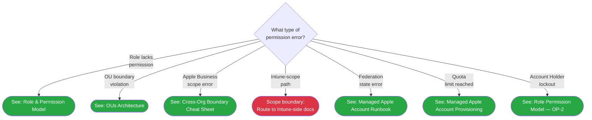

# Phase 65: Apple Business L1/L2 + Hub Navigation Integration - Pattern Map

**Mapped:** 2026-05-22
**Files analyzed:** 13 (2 new runbooks + 1 new validator + 7 hub/index appends + 3 atomic-trio edits)
**Analogs found:** 13 / 13

---

## File Classification

| New/Modified File | Role | Data Flow | Closest Analog | Match Quality |
|-------------------|------|-----------|----------------|---------------|
| `docs/l1-runbooks/34-apple-business-shared-ipad-passcode-reset.md` | L1 runbook (new) | request-response | `docs/l1-runbooks/30-linux-enrollment-failed.md` | exact (same envelope, read-only convention, "Before escalating" pattern) |
| `docs/l2-runbooks/26-apple-business-permission-denied.md` | L2 runbook + Mermaid tree (new) | request-response | `docs/decision-trees/07-ios-triage.md` | exact (hybrid leaf precedent — route-via-`click` + inline escalation leaves coexist) |
| `scripts/validation/check-phase-65.mjs` | per-phase validator (new) | batch | `scripts/validation/check-phase-64.mjs` | exact (Path-A copy source; CHAIN_PHASES extension + V-65-NN runner) |
| `docs/l1-runbooks/00-index.md` | index append | request-response | `docs/l1-runbooks/00-index.md` existing H2 platform-group sections | role-match (same file; append-only pattern) |
| `docs/l2-runbooks/00-index.md` | index append | request-response | `docs/l2-runbooks/00-index.md` existing "When to Use" table sections | role-match (same file; append-only pattern) |
| `docs/common-issues.md` | hub append (ABNAV-03) | request-response | `docs/common-issues.md:33-58` existing symptom→L1/L2 routing voice | role-match (same file; append-only) |
| `docs/quick-ref-l1.md` | hub append (ABNAV-04) | request-response | `docs/quick-ref-l1.md:186-215` Linux Quick Reference section | role-match (same file; append-only; H2 title LOCKED) |
| `docs/quick-ref-l2.md` | hub append (ABNAV-05) | request-response | `docs/quick-ref-l2.md:283-328` Linux Quick Reference section | role-match (same file; append-only) |
| `docs/operations/00-index.md` | hub append (ABNAV-06) | request-response | `docs/operations/00-index.md:14-26` Co-Management H2 section | exact (same file; same table format) |
| `docs/index.md` | hub surgical edits (ABNAV-07) | request-response | `docs/index.md` existing Operations sub-H3 blocks (`:237-276`) | role-match (3 surgical edits at specified lines) |
| `docs/cross-platform/apple-business/12-shared-ipad-passcode-reset.md` | back-link append (atomic-trio) | request-response | `docs/cross-platform/apple-business/12-shared-ipad-passcode-reset.md:187-194` existing `## Cross-References` tail | exact (D-04a; append bullet to existing cross-ref H2) |
| `scripts/validation/v1.6-audit-allowlist.json` | allowlist edit (atomic-trio) | static config | `scripts/validation/v1.6-audit-allowlist.json:80-85` existing `c16_missing_endpoint_exemptions` | exact (same file; remove 4 entries atomically) |
| `scripts/validation/check-phase-64.mjs:135-145` | validator surgical edit (atomic-trio) | batch | `scripts/validation/check-phase-64.mjs:135-145` V-64-05 block | exact (flip NEGATIVE→POSITIVE assertion in-place) |

---

## Pattern Assignments

### `docs/l1-runbooks/34-apple-business-shared-ipad-passcode-reset.md` (L1 runbook, new)

**Analog:** `docs/l1-runbooks/30-linux-enrollment-failed.md`

**Frontmatter pattern** (analog lines 1-7):
```yaml
---
last_verified: 2026-05-22
review_by: 2026-07-21
applies_to: all
audience: L1
platform: ios+macos+shared-ipad
---
```
NOTES: `platform: ios+macos+shared-ipad` is the compound value from D-A5 + Phase 62 `+` separator contract. This exact string is verified at `12-shared-ipad-passcode-reset.md:6`. The `+` separator has no spaces. Dates use the 60-day rule from STATE.md:102.

**Platform gate blockquote** (analog line 9):
```markdown
> **Platform gate:** This guide covers Apple Business Shared iPad passcode reset (iOS + Shared iPad). For Windows Autopilot, see [Windows L1 Runbooks](00-index.md#apv1-runbooks). For macOS ADE, see [macOS ADE Runbooks](00-index.md#macos-ade-runbooks). For iOS/iPadOS, see [iOS L1 Runbooks](00-index.md#ios-l1-runbooks).
```

**L1 scope note blockquote** (analog line 21 — VERBATIM, do not paraphrase):
```markdown
> **L1 scope note:** L1 Triage Steps in this runbook are read-only checks. State-changing commands (`sudo apt install`, package reinstall, service restart) appear ONLY in the per-cause `### Admin Action Required` sections — they are not L1 actions.
```
NOTE: Replace Linux-specific parenthetical with Apple Business equivalent. The opening sentence structure is IDENTICAL. Destructive Path C (EraseDevice) is L2-only per OP-11 — must NOT appear as an L1-executable step.

**3-Path matrix table** (required by ABNAV-01; D-01 decision; per RESEARCH.md:176-186):
```markdown
| Path | Description | Who Executes | Gating |
|------|-------------|--------------|--------|
| Path A — Apple Business UI | Shared iPad passcode reset via Apple Business portal | L1 / sub-org admin (this runbook) | No approval required |
| Path B — MDM ClearPasscode | MDM ClearPasscode command via Intune | L2 only | L2-only; route to L2 #26 |
| Path C — MDM EraseDevice | Full device erase via Intune | L2 with L2 approval required | OP-11 hard gate; route to L2 #26 |
```
NOTE: The matrix rows for B and C must include escalation routing to L2 #26 and cross-link to `12-shared-ipad-passcode-reset.md`. Path A is the only fully executable section in L1 #34.

**"Before escalating, collect:" pattern** (analog lines 188-198):
```markdown
**Before escalating, collect:**

- Device serial number
- Shared iPad platform version (iPadOS version)
- User UPN for the locked account
- Which admin pool owns the device (from `05-sub-org-admin-onboarding.md#which-admin-owns-this-pool` lookup)
- Screenshot of the error (Apple Business portal or MDM error message)
- Path attempted (B: MDM ClearPasscode or C: MDM EraseDevice) if escalating from a failed Path A
- Timestamp of the failed attempt
- User actions attempted (if any) and the outcome
```

**C16 load-bearing cross-links REQUIRED in L1 #34:**
- Substring `12-shared-ipad-passcode-reset` must appear (C16 `l1_34 → admin_12` edge; harness line 798)
- Substring `#which-admin-owns-this-pool` must appear (ABNAV-01 lookup step)

**Version History row** (analog line 204-208 format):
```markdown
| 2026-05-22 | Phase 65 plan 65-XX: initial authoring — L1 Apple Business Shared iPad passcode reset; Path A executable (Apple Business UI); Paths B/C escalation-pointer only (OP-11); C16 edge l1_34↔admin_12 live | -- |
```

---

### `docs/l2-runbooks/26-apple-business-permission-denied.md` (L2 runbook + Mermaid tree, new)

**Analog:** `docs/decision-trees/07-ios-triage.md` (Mermaid syntax + hybrid leaf pattern)

**Frontmatter pattern** (mirror `12-shared-ipad-passcode-reset.md:1-7`, with L2 audience):
```yaml
---
last_verified: 2026-05-22
review_by: 2026-07-21
applies_to: apple-business
audience: L2
platform: ios+macos+shared-ipad
---
```

**Mermaid tree template** (analog `07-ios-triage.md:29-58`; full 7-leaf form per DA-9 LOCKED):

NOTES:
- `ABPDE1` (Intune-scope leaf) has NO `click` directive — inline text only. This is the D-02 hybrid leaf pattern: inline escalation leaf (red, `escalateL2` class) for Intune-scope.
- `graph TD` (top-down) — consistent with all existing trees (`07-ios-triage.md:30`).
- `click` uses two-argument form: `click NODE "URL"` (not three-argument — per Pitfall 5; `07-ios-triage.md:47-52` corpus precedent).
- OU-boundary leaf (ABPDR2): planner may split or combine with `05-sub-org-admin-onboarding.md#which-admin-owns-this-pool`. `02-ous-architecture.md` is the primary target per CONTEXT.md D-02.
- ABPDR7 routes to `01-role-permission-model.md` — the OP-2 Account-Holder DO-NOT-delegate callout at `:39-58` is IN that file; no separate callout file needed.

**Intune-scope leaf C15-safe callout** (Pitfall 3 / Option A from RESEARCH.md:279-285):
```markdown
> **Scope boundary:** This path involves MDM commands (ClearPasscode / EraseDevice) that are
> issued from the Intune admin center, outside the Apple Business permission surface.
> See [18-cross-org-boundary-cheat-sheet.md](../cross-platform/apple-business/18-cross-org-boundary-cheat-sheet.md)
> for the full Apple-Business-vs-Intune responsibility table.
```
NOTE: Prefer Option A (avoid the banned phrases) to minimize ABAUDIT overhead. If "Intune RBAC" or "Intune-side" is required for clarity, use ABAUDIT-24 (next sequential per RESEARCH.md:311).

**ABAUDIT line-pair mechanics** (harness `v1.6-milestone-audit.mjs:859-862`):
```javascript
// Comment exempts line i AND line i+1. Colon after number is REQUIRED.
// Pattern: /<!--\s*ABAUDIT-\d+:/
<!-- ABAUDIT-24: next line routes Intune-scope leaf to scope boundary; C15 regex 1 false-positive exemption -->
> Intune RBAC controls this path. [Only if Option B is chosen]
```
NOTE: Next sequential ABAUDIT number is **ABAUDIT-24**. Last used: ABAUDIT-23 in `18-cross-org-boundary-cheat-sheet.md` (RESEARCH.md:309).

---

### `scripts/validation/check-phase-65.mjs` (per-phase validator, new)

**Analog:** `scripts/validation/check-phase-64.mjs` (Path-A copy source)

**Header comment block** (analog lines 1-24):
```javascript
#!/usr/bin/env node
// check-phase-65.mjs -- Phase 65 (Apple Business L1/L2 + Hub Navigation Integration) deliverables
// Source of truth: .planning/phases/65-apple-business-l1-l2-hub-navigation-integration/65-CONVENTIONS.md
// Assertions: .planning/phases/65-apple-business-l1-l2-hub-navigation-integration/65-PATTERNS.md (V-65-01..V-65-SELF)
//
// 14 V-65-NN structural assertions + V-65-CHAIN + V-65-AUDIT + V-65-SELF covering:
//   L1 #34 exists + compound platform frontmatter + cross-links (12-, #which-admin-owns-this-pool)
//   L2 #26 exists + 7-leaf Mermaid tree
//   5 hub appends: common-issues / quick-ref-l1 / quick-ref-l2 / operations/00-index / docs/index
//   12- back-link landed (34-apple-business present)
//   4 C16 exemptions removed from allowlist
//   V-64-05 reconciled (old negative assertion string absent from check-phase-64.mjs)
//
// Lineage: Phase 48 D-25 → ... → Phase 63 D-01..D-06 → Phase 64 DELEG-01..08 → Phase 65 ABNAV-01..07
//
// Usage: node scripts/validation/check-phase-65.mjs [--verbose]
// Exit code: 0 if all V-65-NN PASS or SKIPPED; 1 if any FAIL.
```

**Imports + readFile helper** (analog lines 26-38 — copy verbatim):
```javascript
import { readFileSync, existsSync } from 'node:fs';
import { join } from 'node:path';
import { execFileSync } from 'node:child_process';
import process from 'node:process';

const argv = process.argv.slice(2);
const VERBOSE = argv.includes('--verbose');

function readFile(relPath) {
  const abs = join(process.cwd(), relPath);
  if (!existsSync(abs)) return null;
  return readFileSync(abs, 'utf8').replace(/\r\n/g, '\n');
}
```

**File path constants** (analog lines 40-48, replace with Phase 65 paths):
```javascript
const HARNESS    = 'scripts/validation/v1.6-milestone-audit.mjs';
const ALLOWLIST  = 'scripts/validation/v1.6-audit-allowlist.json';
const CHECK64    = 'scripts/validation/check-phase-64.mjs';
const L1_34      = 'docs/l1-runbooks/34-apple-business-shared-ipad-passcode-reset.md';
const L2_26      = 'docs/l2-runbooks/26-apple-business-permission-denied.md';
const AB_12      = 'docs/cross-platform/apple-business/12-shared-ipad-passcode-reset.md';
const COMMON_ISS = 'docs/common-issues.md';
const QREF_L1    = 'docs/quick-ref-l1.md';
const QREF_L2    = 'docs/quick-ref-l2.md';
const OPS_IDX    = 'docs/operations/00-index.md';
const DOCS_IDX   = 'docs/index.md';
```

**CHAIN_PHASES extension** (analog line 52 — add 64):
```javascript
// Extends check-phase-64.mjs chain by adding 64.
const CHAIN_PHASES = [48, 49, 50, 51, 52, 53, 54, 55, 56, 57, 58, 59, 60, 61, 62, 63, 64];
const CHAIN_SKIP = new Set([48, 51, 58, 60, 61]);  // same pre-existing failures as Phase 64
```

**V-65-NN assertions inventory** (analog lines 75-295 pattern — `{id, name, run()}`):

| ID | File | Assert | JS pattern |
|----|------|--------|-----------|
| V-65-01 | `L1_34` | file exists | `readFile(L1_34) !== null` |
| V-65-02 | `L1_34` | contains `platform: ios+macos+shared-ipad` | `c.includes('platform: ios+macos+shared-ipad')` |
| V-65-03 | `L1_34` | contains `12-shared-ipad-passcode-reset` | `c.includes('12-shared-ipad-passcode-reset')` |
| V-65-04 | `L1_34` | contains `#which-admin-owns-this-pool` | `c.includes('#which-admin-owns-this-pool')` |
| V-65-05 | `L2_26` | file exists | `readFile(L2_26) !== null` |
| V-65-06 | `L2_26` | ≥7 leaf nodes (`([`) in Mermaid block | count `([` occurrences ≥ 7 |
| V-65-07 | `COMMON_ISS` | `## Apple Business Governance Failure Scenarios` present | `c.includes('## Apple Business Governance Failure Scenarios')` |
| V-65-08 | `QREF_L1` | `## Apple Business Quick Reference` present | `c.includes('## Apple Business Quick Reference')` |
| V-65-09 | `QREF_L2` | `## Apple Business Quick Reference` present | `c.includes('## Apple Business Quick Reference')` |
| V-65-10 | `OPS_IDX` | `## Apple Business` section present | `c.includes('## Apple Business')` |
| V-65-11 | `DOCS_IDX` | Apple Business sub-H3 present under Operations | `c.includes('Apple Business')` (scope: after `## Operations`) |
| V-65-12 | `AB_12` | `34-apple-business` back-link present | `c.includes('34-apple-business')` |
| V-65-13 | `ALLOWLIST` | 0 sunset-65 exemptions remain | parse JSON; `c16_missing_endpoint_exemptions.length === 0` |
| V-65-14 | `CHECK64` | old NEGATIVE failure detail string absent | `!c.includes("12- contains 34-apple-business reference (C16 sunset Phase 65; must not appear in Phase 64)")` |
| V-65-SELF | in-memory | `CHAIN_PHASES` does NOT include 65 | `!CHAIN_PHASES.includes(65)` |

**V-65-AUDIT subprocess pattern** (analog lines 315-331 — copy verbatim, update label):
```javascript
checks.push({
  id: 'AUDIT', name: 'V-65-AUDIT: v1.6-milestone-audit.mjs exits 0',
  run() {
    try {
      execFileSync('node', [HARNESS], { stdio: 'pipe', timeout: 60000, cwd: process.cwd() });
      return { pass: true, detail: 'v1.6 harness exits 0' };
    } catch (err) {
      const stderr = err.stderr ? err.stderr.toString() : '';
      const stdout = err.stdout ? err.stdout.toString() : '';
      const isMissing = err.code === 'ENOENT' || err.status === 127
        || stderr.includes('not found') || stderr.includes('Could not resolve');
      if (isMissing) return { pass: true, skipped: true, detail: 'node not found -- skipped' };
      return { pass: false, detail: 'harness FAIL: ' + (stdout + stderr).slice(0, 300) };
    }
  }
});
```

**Runner loop** (analog lines 343-370 — copy verbatim, update phase label):
```javascript
const LABEL_WIDTH = 60;
function padLabel(s) { ... }
let passed = 0, failed = 0, skipped = 0;
console.log('check-phase-65 -- Phase 65 deliverables\n');
for (const check of checks) { ... }
process.stdout.write('\nResult: ' + passed + ' PASS, ' + failed + ' FAIL, ' + skipped + ' SKIPPED\n');
process.exit(failed > 0 ? 1 : 0);
```

---

### `docs/l1-runbooks/00-index.md` (index append, ABNAV-01 side effect)

**Analog:** `docs/l1-runbooks/00-index.md` existing H2 platform-group sections (e.g., `## macOS ADE Runbooks` format)

**Append content** (RESEARCH.md:191-199):
```markdown
## Apple Business L1 Runbooks

L1 runbook for the Apple Business Shared iPad passcode reset scenario. Start with the [Apple Business permission-denied triage](../l2-runbooks/26-apple-business-permission-denied.md) for complex escalation routing.

| Runbook | Scenario | Applies To |
|---------|----------|------------|
| [34: Apple Business Shared iPad Passcode Reset](34-apple-business-shared-ipad-passcode-reset.md) | Shared iPad passcode reset via Apple Business UI (Path A primary); Paths B/C escalation to L2 | iOS+macOS+Shared iPad |
```

**Insertion point:** After the last existing L1 section (Linux Runbooks, #33), before `## Version History`.

---

### `docs/l2-runbooks/00-index.md` (index append, ABNAV-02 side effect)

**Analog:** `docs/l2-runbooks/00-index.md:44-58` APv2 section (H2 + version-gate blockquote + `### When to Use` table)

**Append content** (RESEARCH.md:333-344):
```markdown
## Apple Business L2 Runbooks

> **Version gate:** The runbooks below cover Apple Business Delegated Governance through Apple Business portal and associated MDM surfaces (Phase 65 deliverables).

### When to Use

| Runbook | When to Use | Prerequisite |
|---------|-------------|--------------|
| [Apple Business Permission Denied Investigation](26-apple-business-permission-denied.md) | Apple Business portal returns permission error across any delegation action; includes 7-leaf triage tree routing to per-cause runbooks | None |
```

**Insertion point:** After the last existing L2 section (Linux L2, #24-25), before `## Version History`.

---

### `docs/common-issues.md` (hub append ABNAV-03, append-only)

**Analog:** `docs/common-issues.md:33-58` — existing symptom→H3-subsection→`L1:`/`L2:` routing voice

**Insertion point:** After Android Enterprise section (`:268-336`), before `## Version History` (`:337`). No existing anchors shift.

**Required C16 content:** The section must contain the substring `#apple-business-quick-reference` (C16 `common_issues → quick_ref_l1` edge; harness line 798 check: `content.includes('#apple-business-quick-reference')`). This is satisfied by a cross-reference link such as `[Apple Business Quick Reference](quick-ref-l1.md#apple-business-quick-reference)`.

**Voice pattern** (from `:33-58` existing routing rows):
```markdown
## Apple Business Governance Failure Scenarios

> **Apple Business:** For Apple Business permission errors and Shared iPad issues, use the runbooks below. For L1 quick reference, see [Apple Business Quick Reference](quick-ref-l1.md#apple-business-quick-reference).

### Shared iPad Passcode Reset

Shared iPad passcode locked or inaccessible.

- **L1:** [34: Apple Business Shared iPad Passcode Reset](l1-runbooks/34-apple-business-shared-ipad-passcode-reset.md) — Path A (Apple Business UI); L1-delegatable
- **L2:** [26: Apple Business Permission Denied Investigation](l2-runbooks/26-apple-business-permission-denied.md) — Paths B/C or permission failures

### Apple Business Permission Denied

Apple Business portal returns permission error.

- **L1:** Route to L2 directly (no L1 self-service resolution for permission errors)
- **L2:** [26: Apple Business Permission Denied Investigation](l2-runbooks/26-apple-business-permission-denied.md) — 7-leaf Mermaid triage tree
```

---

### `docs/quick-ref-l1.md` (hub append ABNAV-04, append-only)

**Analog:** `docs/quick-ref-l1.md:186-215` Linux Quick Reference section (H2 + H3 sub-sections matching "Top Checks + escalation triggers + runbooks" voice)

**Insertion point:** After `## Linux Quick Reference` (`:186-215`), before `## Version History` (`:216`).

**H2 title is LOAD-BEARING — must be EXACTLY:**
```markdown
## Apple Business Quick Reference
```
GitHub slug: `#apple-business-quick-reference`. If reworded (e.g., "Card"), C16 `common_issues → quick_ref_l1` edge fails silently.

**Required C16 content:** Substring `34-apple-business` must appear (C16 `quick_ref_l1 → l1_34` edge). Satisfied by: `[34: Apple Business Shared iPad Passcode Reset](l1-runbooks/34-apple-business-shared-ipad-passcode-reset.md)`.

**Voice pattern** (matching `quick-ref-l1.md:14-33` "Top 5 Checks" + escalation triggers depth):
```markdown
## Apple Business Quick Reference

### Top Checks — Shared iPad Passcode Reset

1. **Which path?** — Can the sub-org admin reach the Apple Business portal? → Path A (Apple Business UI, L1-delegatable)
2. **Pool owner?** — See [`05-sub-org-admin-onboarding.md#which-admin-owns-this-pool`](cross-platform/apple-business/05-sub-org-admin-onboarding.md#which-admin-owns-this-pool) to confirm who owns the Shared iPad pool
3. **Portal reachable?** — Navigate to Apple Business and confirm sub-org admin can log in
4. **Permission granted?** — Sub-org admin has "Reset Shared iPad passcode" in their OU
5. **Error visible?** — Note exact portal error text for escalation

### Apple Business Escalation Triggers

- Path A failed or portal unreachable → **Escalate L2** (collect: serial, UPN, pool owner, screenshot)
- Permission denied error in Apple Business portal → **Escalate L2 directly** (collect: error text, user role, OU name)
- MDM path required (Paths B/C) → **L2 only** per OP-11

### Apple Business Runbooks

- [34: Apple Business Shared iPad Passcode Reset](l1-runbooks/34-apple-business-shared-ipad-passcode-reset.md) — Path A primary (L1-delegatable)
- [26: Apple Business Permission Denied Investigation](l2-runbooks/26-apple-business-permission-denied.md) — 7-leaf L2 triage tree
```

---

### `docs/quick-ref-l2.md` (hub append ABNAV-05, append-only)

**Analog:** `docs/quick-ref-l2.md:283-328` Linux Quick Reference section (H2 + command/log-collection depth with `### Log Collection`, `### Investigation Runbooks` sub-sections)

**Insertion point:** After `## Linux Quick Reference` (`:283-328`), before `## Version History` (`:329`).

**H2 title:**
```markdown
## Apple Business Quick Reference
```
No C16 dependency on quick-ref-l2 (only `common_issues → quick_ref_l1` and `quick_ref_l1 → l1_34` are C16 edges). The H2 title matches quick-ref-l1 for consistency but is NOT load-bearing here.

**Voice pattern** (matching existing command/event-ID depth — `quick-ref-l2.md:14-61`):
```markdown
## Apple Business Quick Reference

### Apple Business Portal Navigation

- **Permission catalog:** Apple Business > Settings > Roles (sub-org admin view)
- **OU device list:** Apple Business > Locations > [OU name] > Devices
- **Activity log:** Apple Business > Activity (audit log for permission events; no public retention SLA per DELEG-07)

### Apple Business Permission Investigation

1. Confirm user role in Apple Business portal — Settings > People > [user] > Role
2. Check OU scope of the role assignment — compare against the failing action's OU
3. Check Edit-without-View table in [01-role-permission-model.md](cross-platform/apple-business/01-role-permission-model.md) for OP-3 companion-view dependencies
4. Federation state check: Settings > Accounts (SCIM/OIDC sync status) — see [16-managed-apple-account-runbook.md](cross-platform/apple-business/16-managed-apple-account-runbook.md)

### Investigation Runbooks

- [26: Apple Business Permission Denied Investigation](l2-runbooks/26-apple-business-permission-denied.md) — 7-leaf Mermaid tree; role / OU / scope / Intune / federation / quota / lockout
- [12: Shared iPad Passcode Reset](cross-platform/apple-business/12-shared-ipad-passcode-reset.md) — 3-path matrix (Path A UI / Path B MDM ClearPasscode / Path C MDM EraseDevice + OP-11)
```

---

### `docs/operations/00-index.md` (hub append ABNAV-06, append-only)

**Analog:** `docs/operations/00-index.md:14-26` Co-Management H2 section (H2 + description paragraph + `| Guide | Covers |` table)

**Insertion point:** After `## Compliance Drift Detection + Tenant Migration` section (`:51-61`), before `## Version History` (`:63`). All 4 existing H2 anchors remain unchanged.

**Append content** (matching Co-Management template exactly):
```markdown
## Apple Business Governance

Apple Business delegated governance — sub-org admin onboarding, Shared iPad passcode reset, MDM server assignment, Managed Apple Account provisioning, VPP catalog management, and cross-org boundary operations.

| Guide | Covers |
|-------|--------|
| [Overview: Apple Business Governance](../cross-platform/apple-business/00-overview.md) | Governance model overview; tree root linking all 18 admin-context docs |
| [Role & Permission Model](../cross-platform/apple-business/01-role-permission-model.md) | 7-subgroup permission catalog; OP-1/OP-2/OP-3 safety rules; Edit-without-View table |
| [OUs Architecture](../cross-platform/apple-business/02-ous-architecture.md) | OU primitive; flat-by-default; OU-scoped resource coverage |
| [L1 Runbooks](../l1-runbooks/00-index.md#apple-business-l1-runbooks) | L1 #34 — Shared iPad passcode reset (Path A) |
| [L2 Runbooks](../l2-runbooks/00-index.md#apple-business-l2-runbooks) | L2 #26 — Permission denied investigation (7-leaf triage) |
```

---

### `docs/index.md` (hub surgical edits ABNAV-07, 3 distinct locations)

**Analog:** `docs/index.md` existing Operations sub-H3 blocks (`:237-276`) and `## Cross-Platform References` table

**Edit 1 — platform-coverage banner at line 9** (surgical append within blockquote):
- Append `, plus Apple Business delegated governance (Apple Business-managed device pools, shared iPad passcode reset, sub-org admin onboarding)` before the closing period of the existing banner text.
- PITFALL-6: Line 9 is the banner; no headings shift.

**Edit 2 — `### Apple Business Governance` sub-H3 under `## Operations` H2** (insertion after last existing sub-H3 at `:267`, before `---` separator at `:277`):
```markdown
### Apple Business Governance

Apple Business delegated governance for sub-org admins — Shared iPad passcode reset, permission denied investigation, MDM server assignment, VPP catalog, Managed Apple Account provisioning, and cross-org boundary operations.

| Resource | Description |
|----------|-------------|
| [Apple Business Operations Overview](cross-platform/apple-business/00-overview.md) | Governance tree root; links to all 18 admin-context docs |
| [L1 #34: Shared iPad Passcode Reset](l1-runbooks/34-apple-business-shared-ipad-passcode-reset.md) | Path A (Apple Business UI, L1-delegatable) |
| [L2 #26: Permission Denied Investigation](l2-runbooks/26-apple-business-permission-denied.md) | 7-leaf Mermaid triage tree |
```

**Edit 3 — Cross-Platform References new entries** (append before `## Version History`):
```markdown
| [Apple Business Governance Glossary](_glossary-apple-business.md) | Apple Business terminology; Organizational Units; Managed Apple Accounts; rebrand mapping (ABM → Apple Business 2026-04-14) |
| [Cross-Org Boundary Cheat Sheet](cross-platform/apple-business/18-cross-org-boundary-cheat-sheet.md) | Apple-Business-vs-Intune responsibility table; scope-boundary disambiguation |
```

**PITFALL-6 for `docs/index.md`:** This file has surgical edits (not pure append-only). Existing anchors `#operations` (`:232`) and `#cross-platform-references` (`:279`) must remain stable. Sub-H3 insertion shifts absolute line numbers for content after the insertion point — this is acceptable per PITFALL-6 definition (monitors H2/H3 ANCHOR SLUGS, not line numbers). Pre-edit anchor inventory MANDATORY before execution.

---

## Atomic-Trio Patterns (D-04a — INDIVISIBLE UNIT)

The following three sub-actions MUST land in a single commit. Any partial application leaves the validator chain in a non-zero exit state.

### Sub-Action 1: `docs/cross-platform/apple-business/12-shared-ipad-passcode-reset.md` — back-link append

**Analog:** `docs/cross-platform/apple-business/12-shared-ipad-passcode-reset.md:187-194` existing `## Cross-References` block

**Exact current tail** (VERIFIED: `:187-194`):
```markdown
## Cross-References

- Permission catalog: [01-role-permission-model.md](01-role-permission-model.md) — People subgroup;
  "Reset Shared iPad passcode" (conditionally-grant, OP-11 note); OP-3 Edit-without-View table
- Shared iPad lifecycle: [09-shared-ipad-lifecycle.md](09-shared-ipad-lifecycle.md) — enrollment
  prerequisites; Find My pre-check (OP-12); lifecycle stages
- Cross-org boundary: [18-cross-org-boundary-cheat-sheet.md](18-cross-org-boundary-cheat-sheet.md) —
  full Apple-Business-vs-Intune responsibility table (D-02 SOT)
```

**New bullet to append** (after line 194, before blank line + `## Version History`):
```markdown
- **L1 runbook:** [L1 #34 — Apple Business Shared iPad Passcode Reset](../../l1-runbooks/34-apple-business-shared-ipad-passcode-reset.md) (Path A L1-delegated entry point)
```
NOTE: Relative path from `docs/cross-platform/apple-business/` to `docs/l1-runbooks/` is `../../l1-runbooks/`. The substring `34-apple-business` is LOAD-BEARING for C16 `admin_12 → l1_34` edge (harness `:798`). ABAUDIT-06 (line 13) and ABAUDIT-07 (line 116) are unaffected — this append is after line 194 and does not shift earlier line indices.

**Version History row** (append to `12-` Version History table):
```markdown
| 2026-05-22 | Phase 65 plan 65-04: added L1 #34 back-link to `## Cross-References` tail per D-04a + C16 atomic-reconciliation contract (62-08-PLAN §464-465); removed admin_12 C16 exemption from allowlist | -- |
```

---

### Sub-Action 2: `scripts/validation/v1.6-audit-allowlist.json` — remove 4 sunset-65 exemptions

**Analog:** `scripts/validation/v1.6-audit-allowlist.json:80-85` current `c16_missing_endpoint_exemptions` block

**Current state** (VERIFIED: `:80-85`):
```json
"c16_missing_endpoint_exemptions": [
  {"file": "docs/l1-runbooks/34-apple-business-shared-ipad-passcode-reset.md",
   "reason": "Phase 65 deliverable per ABNAV-01; lands with all 4 edges per C16 triangle contract",
   "sunset_phase": "65"},
  {"file": "docs/cross-platform/apple-business/12-shared-ipad-passcode-reset.md",
   "reason": "Phase 64 deliverable per DELEG-02; admin-context canonical doc for L1 #34 cross-link",
   "sunset_phase": "64-65"},
  {"file": "docs/common-issues.md#apple-business-governance-failure-scenarios",
   "reason": "Phase 65 deliverable per ABNAV-03; inbound H2 section append-only",
   "sunset_phase": "65"},
  {"file": "docs/quick-ref-l1.md#apple-business-quick-reference",
   "reason": "Phase 65 deliverable per ABNAV-04; inbound H2 section append-only",
   "sunset_phase": "65"}
]
```

**Target state** (all 4 entries removed):
```json
"c16_missing_endpoint_exemptions": []
```
NOTE: The C16 exemption check at harness line 785-786 uses `Array.from(exemptFiles).some(ef => ef.startsWith(filePath + '#'))`. Removing all entries means C16 checks all four edges against actual file content. Any entry left masquerades as an exemption and hides edge failures.

---

### Sub-Action 3: `scripts/validation/check-phase-64.mjs:135-145` — flip V-64-05 NEGATIVE→POSITIVE

**Analog:** `scripts/validation/check-phase-64.mjs:135-145` current V-64-05 block

**Replace this exact block** (VERIFIED: `:135-145`):
```javascript
// === V-64-05: 12- does NOT contain 34-apple-business reference (C16 Phase 65 gate) ===
{
  id: 5, name: 'V-64-05: 12-shared-ipad-passcode-reset.md does NOT contain 34-apple-business (C16 sunset Phase 65)',
  run() {
    const c = readFile(AB_12);
    if (c === null) return { pass: false, detail: AB_12 + ' missing' };
    // V-64-NN: 12- does NOT contain 34-apple-business reference (C16 Phase 65 gate)
    const has34 = c.includes('34-apple-business');
    if (has34) return { pass: false, detail: '12- contains 34-apple-business reference (C16 sunset Phase 65; must not appear in Phase 64)' };
    return { pass: true, detail: '12- does not contain 34-apple-business (C16 constraint satisfied)' };
  }
},
```

**With this replacement** (RESEARCH.md:861-872):
```javascript
// === V-64-05: 12- MUST contain 34-apple-business reference (C16 Phase 65 gate — RECONCILED) ===
{
  id: 5, name: 'V-64-05 [RECONCILED Phase 65]: 12-shared-ipad-passcode-reset.md MUST contain 34-apple-business (C16 back-link landed)',
  // RECONCILED: was NEGATIVE assertion in Phase 64 (must NOT contain). Phase 65 atomic commit
  // (D-04a + 62-08-PLAN §464-465 contract) added the back-link; assertion flipped to POSITIVE.
  run() {
    const c = readFile(AB_12);
    if (c === null) return { pass: false, detail: AB_12 + ' missing' };
    const has34 = c.includes('34-apple-business');
    if (!has34) return { pass: false, detail: '12- missing 34-apple-business back-link -- Phase 65 atomic commit (D-04a) not yet landed' };
    return { pass: true, detail: '12- contains 34-apple-business back-link (C16 RECONCILED; Phase 65 atomic commit confirmed)' };
  }
},
```
NOTE: The test ID `V-64-05` is preserved so the name appears in Phase 66 chain output with "RECONCILED" label. V-65-14 asserts the old failure detail string is absent as post-hoc verification the flip landed correctly.

---

## Shared Patterns

### Frontmatter Convention (all new Apple Business docs)

**Source:** `docs/l1-runbooks/30-linux-enrollment-failed.md:1-7` + Phase 64 PATTERNS.md envelope table
**Apply to:** L1 #34, L2 #26

```yaml
---
last_verified: 2026-05-22
review_by: 2026-07-21
applies_to: apple-business
audience: <L1|L2>
platform: ios+macos+shared-ipad
---
```

Key: `platform: ios+macos+shared-ipad` (no spaces around `+`; compound value; Phase 62 contract; D-A5).

---

### C16 Load-Bearing Substrings (must appear verbatim in named files)

**Source:** `scripts/validation/v1.6-milestone-audit.mjs:771-803`
**Apply to:** Every file in the C16 triangle

| File | Required Substring | C16 Edge |
|------|--------------------|----------|
| `34-apple-business-shared-ipad-passcode-reset.md` | `12-shared-ipad-passcode-reset` | l1_34 → admin_12 |
| `12-shared-ipad-passcode-reset.md` | `34-apple-business` | admin_12 → l1_34 |
| `docs/common-issues.md` | `#apple-business-quick-reference` | common_issues → quick_ref_l1 |
| `docs/quick-ref-l1.md` | `34-apple-business` | quick_ref_l1 → l1_34 |

H2 title `## Apple Business Quick Reference` (in `quick-ref-l1.md`) slugifies to `#apple-business-quick-reference` — **DO NOT REWORD**. Silent C16 fail if the slug changes.

---

### C15 ABAUDIT Exemption Pattern

**Source:** `docs/cross-platform/apple-business/12-shared-ipad-passcode-reset.md:116` + `scripts/validation/v1.6-milestone-audit.mjs:859-862`
**Apply to:** Any line in L1 #34 or L2 #26 that trips C15 banned-phrase regexes

```markdown
<!-- ABAUDIT-24: next line [describes why it trips C15]; C15 regex N false-positive exemption ([reason]) -->
[the line that trips C15]
```

Rules:
- Colon after number REQUIRED: `ABAUDIT-24:` not `ABAUDIT-24 `.
- Comment exempts ONLY the immediately following line (`i+1`); budget one comment per banned line.
- Next sequential number: **ABAUDIT-24** (last used: ABAUDIT-23 in `18-cross-org-boundary-cheat-sheet.md`).
- Prefer Option A (avoid the phrase) for the Intune-scope leaf in L2 #26 to minimize ABAUDIT overhead.

---

### Append-Only Hub Pattern (PITFALL-6)

**Source:** Phase 62 PATTERNS.md + STATE.md PITFALL-6 anchor-stability invariant
**Apply to:** All 5 hub-file appends (common-issues, quick-ref-l1, quick-ref-l2, operations/00-index, docs/index)

Rules:
- ZERO existing H2/H3 headings renamed in any hub file.
- New content inserted BETWEEN last content H2 and `## Version History`.
- Pre-edit anchor inventory (per-file H2/H3 slug snapshot) MANDATORY before any hub-file edit.
- `docs/index.md` is the exception: 3 surgical edits at specified lines; sub-H3 insertion shifts line numbers for subsequent content but not anchor slugs (acceptable).

---

### Validator-as-Deliverable Pattern

**Source:** `scripts/validation/check-phase-64.mjs` (Phase 64 chain validator)
**Apply to:** `check-phase-65.mjs`

- Each phase authors its own `check-phase-NN.mjs` in-phase (not deferred to successor).
- CHAIN_PHASES extends the predecessor list by adding the predecessor's phase number (64).
- CHAIN_SKIP carries forward unchanged pre-existing failures from Phase 64.
- Do NOT duplicate C16 logic in check-phase-65.mjs — C16 is handled by V-65-AUDIT subprocess (harness invocation).
- V-65-SELF asserts `CHAIN_PHASES.includes(65) === false` (no self-reference).

---

## No Analog Found

All 13 files have strong analogs from the existing corpus. No "no analog" entries.

| File | Note |
|------|------|
| `docs/l2-runbooks/26-apple-business-permission-denied.md` | While `07-ios-triage.md` is the Mermaid syntax analog, a full L2 runbook with an EMBEDDED Mermaid tree (rather than a standalone decision-tree file) is a new structural form for Phase 65. The hybrid leaf pattern (5 route-via-`click` + 1 inline-only Intune-scope + 1 route-via-`click` Account-Holder) is established by `07-ios-triage.md:41-57` (3 inline escalation leaves coexist with 6 route leaves). The pattern is known; the application is new. Planner treat as "role-match" (hybrid leaf) not "no analog". |

---

## Metadata

**Analog search scope:**
- `docs/l1-runbooks/30-linux-enrollment-failed.md` (L1 envelope)
- `docs/l1-runbooks/00-index.md` (index append pattern)
- `docs/l2-runbooks/00-index.md` (index append pattern)
- `docs/decision-trees/07-ios-triage.md` (Mermaid hybrid leaf precedent)
- `docs/cross-platform/apple-business/12-shared-ipad-passcode-reset.md:187-201` (Cross-References tail)
- `docs/common-issues.md:20-70` (symptom routing voice)
- `docs/quick-ref-l1.md:1-55` (Top 5 Checks + escalation triggers voice)
- `docs/operations/00-index.md:50-66` (Co-Management section template + Drift section closing)
- `scripts/validation/check-phase-64.mjs` (full file — Path-A copy source + V-64-05 exact current code)
- `.planning/phases/64-apple-business-delegation-runbooks/64-PATTERNS.md` (upstream template)
- `.planning/phases/62-apple-business-foundation-rebrand/62-PATTERNS.md` (foundational patterns)

**Files read:** 11 corpus/validator files + 2 upstream PATTERNS.md files + CONTEXT.md + RESEARCH.md
**Pattern extraction date:** 2026-05-22

---

**Critical reminders for planner:**

1. **Atomic-trio is INDIVISIBLE** — Plans 65-04 sub-actions (12- back-link + 4 allowlist removals + V-64-05 flip) must land in one commit; any partial state leaves the chain red.
2. **H2 title `## Apple Business Quick Reference` is LOCKED** — reword breaks C16 `common_issues` edge silently.
3. **ABAUDIT-24 is next** — first Phase 65 exemption (if needed for Intune-scope leaf in L2 #26). Track allocation in 65-CONVENTIONS.md.
4. **PITFALL-6 pre-edit anchor inventory MANDATORY** before editing `12-` and each of the 5 hub files.
5. **D-22 auditor-independence:** check-phase-65.mjs is authored IN Phase 65; Phase 66 only RUNS the chain.
6. **check-phase-65.mjs is Wave 3 (close-gate)** — run it only after ALL other plans complete; V-65-13 asserts allowlist clean, which requires Plan 65-04 (atomic-trio) to have committed.
