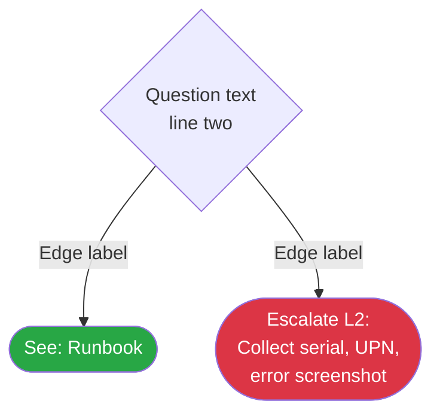
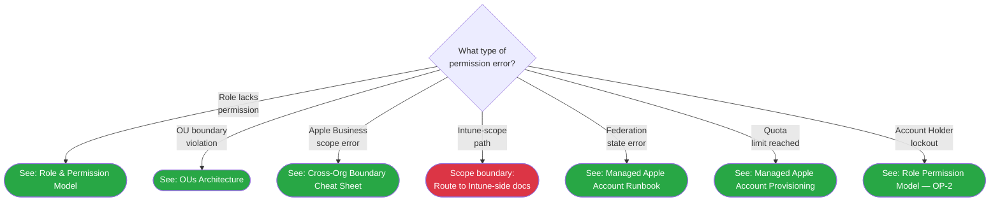

# Phase 65: Apple Business L1/L2 + Hub Navigation Integration - Research

**Researched:** 2026-05-22
**Domain:** Documentation authoring — L1/L2 runbooks, hub-file appends, validator mechanics, C16 triangle close
**Confidence:** HIGH (all findings verified against live corpus files)

---

<user_constraints>
## User Constraints (from CONTEXT.md)

### Locked Decisions

**D-01: L1 #34 3-path matrix treatment — L1-scoped Path A in full + escalate B/C with cross-link (Option B)**
L1 #34 documents Path A (Apple Business UI) in full as the L1-executable procedure; Paths B/C appear as escalate-to-L2 pointers that cross-link to canonical `12-shared-ipad-passcode-reset.md`. The matrix is present (Path A executable, Paths B/C as gated escalation rows), satisfying SC#1 via presence + gating, not reproduction.

**D-02: L2 #26 7-leaf tree leaf behavior — Hybrid (Option C)**
The 7 leaves get per-leaf-appropriate behavior: Apple-Business-scoped leaves route via Mermaid `click` to relevant existing docs; the Intune-scope leaf routes OUT to Intune-side docs with a C15-safe scope-boundary callout; the Account-Holder-lockout leaf routes to `01-role-permission-model.md:39-58` OP-2 callout.

**D-03: Hub append content depth — Asymmetric per file voice (Option C)**
- `common-issues.md`: symptom→runbook routing table only (matches `:33-58` pure routing voice)
- `quick-ref-l1.md`: L1 passcode-reset quick-steps + escalation triggers (matches `:14-33` voice)
- `quick-ref-l2.md`: L2 permission-denied quick-triage with command/log references (matches `:14-61` voice)

**D-04a: `12-` back-link form — Append to existing `## Cross-References` tail**
Add the `34-apple-business-shared-ipad-passcode-reset.md` back-link as a new bullet inside the existing `## Cross-References` H2 at `docs/cross-platform/apple-business/12-shared-ipad-passcode-reset.md:187-194`. NOT surgical mid-doc.

**D-04b: `check-phase-65.mjs` placement — Ships IN Phase 65**
`check-phase-65.mjs` ships in this phase as a validator-as-deliverable (chain continuation from 62/63/64). Phase 66 RUNS the chain, does NOT author `check-phase-65.mjs`.

**V-64-05 ↔ C16 ATOMIC RECONCILIATION (indivisible unit):**
In a single atomic commit Phase 65 MUST: (1) add `34-apple-business` back-link to `12-` Cross-References tail; (2) remove all 4 sunset-65 exemptions from allowlist; (3) flip/retire V-64-05 to a positive assertion or sunset note.

### Claude's Discretion

- Exact wording of the L2-scope-boundary callout for the Intune-scope leaf (must dodge or ABAUDIT-exempt C15 regexes 1 & 4)
- 7-leaf Mermaid tree structure — node ordering, branch decision text, `click` directive syntax
- L1 #34 "Before escalating, collect:" pattern for Paths B/C escalation pointers
- Hub-file append positions (between last content H2 and `## Version History`)
- `check-phase-65.mjs` test ID numbering (continues from V-64-NN)

### Deferred Ideas (OUT OF SCOPE)

- Dedicated "Account Holder lockout recovery" runbook → v1.7+
- C11 keyword extension + C15 banned-phrase refinement → Phase 66
- BASELINE_10 refresh → Phase 66 (AUDIT-14)
- Terminal re-audit from fresh worktree + `v1.6-MILESTONE-AUDIT.md` + CI workflow `.yml` + `check-phase-66.mjs` → Phase 66
- Per-OU CRD partitioning deep-dive + sub-OU nesting > 2 → v1.7+
- Inter-tenant patterns → out of v1.6 scope

</user_constraints>

<phase_requirements>
## Phase Requirements

| ID | Description | Research Support |
|----|-------------|------------------|
| ABNAV-01 | L1 runbook `34-apple-business-shared-ipad-passcode-reset.md` with "which admin owns this pool" lookup + 3-path matrix (Path A executable, B/C gated) + compound platform frontmatter + L1 #00-index appended | L1 envelope from 30-; #34 confirmed next free; frontmatter pattern from 12-; cross-link targets verified |
| ABNAV-02 | L2 runbook `26-apple-business-permission-denied.md` with 7-leaf Mermaid decision tree (DA-9 leaves LOCKED) + L2 #00-index appended | Mermaid syntax from 07-ios-triage.md; #26 confirmed next free; leaf targets all verified in corpus |
| ABNAV-03 | `docs/common-issues.md` — new `## Apple Business Governance Failure Scenarios` H2 (append-only) | Insertion point: after Android section (`:268-336`), before `## Version History` (`:337`); voice: symptom→runbook routing rows |
| ABNAV-04 | `docs/quick-ref-l1.md` — new `## Apple Business Quick Reference` H2 (append-only); C16 anchor `#apple-business-quick-reference` MUST slugify exactly | Insertion point: after Linux section (`:186-215`), before `## Version History` (`:216`); `34-apple-business` substring load-bearing |
| ABNAV-05 | `docs/quick-ref-l2.md` — new `## Apple Business Quick Reference` H2 (append-only) | Insertion point: after Linux section (`:283-328`), before `## Version History` (`:329`); voice: command/log-collection depth |
| ABNAV-06 | `docs/operations/00-index.md` — Apple Business as 5th sub-section alongside Co-Management / Patch / App / Drift (append-only) | Insertion point: after Drift section (`:50-61`), before `## Version History` (`:62`); table format matches existing sections |
| ABNAV-07 | `docs/index.md` — Apple Business as 5th sub-section under `## Operations` H2 + Cross-Platform References entries + platform-coverage banner clause at line 9 (surgical edits) | `## Operations` H2 at `:232`; banner at `:9`; existing 4 sub-H3s at `:237-276`; last Cross-Platform Reference row at `:301` |

</phase_requirements>

---

## Summary

Phase 65 is the Wave-C navigation-last integration that surfaces the Phase 62-64 Apple Business governance corpus to L1 staff and L2 engineers, and simultaneously closes the C16 4-edge cross-link integrity triangle. All design decisions are LOCKED; the research task is to provide exact implementation mechanics — line numbers, regex patterns, ABAUDIT numbering, Mermaid syntax, insertion points, and validator structure.

The phase delivers two new documents (L1 #34, L2 #26), five hub-file appends, one back-link append to `12-` (the sanctioned exception to D-A8), four allowlist exemption removals, one V-64-05 flip, and `check-phase-65.mjs`. The critical path risk is the V-64-05 ↔ C16 atomic reconciliation: this three-sub-action unit must land in a single commit or the validator chain exits non-zero.

All claims in this document are VERIFIED against the live corpus files as of 2026-05-22.

**Primary recommendation:** Author files in dependency order — L1 #34 and L2 #26 first (independent), then 5 hub appends (independent of each other), then the atomic commit (12- back-link + 4 allowlist removals + V-64-05 flip), then check-phase-65.mjs last.

---

## Architectural Responsibility Map

| Capability | Primary Tier | Secondary Tier | Rationale |
|------------|-------------|----------------|-----------|
| L1 #34 runbook | L1 Docs / Service Desk | — | L1-executable Path A; Paths B/C pointer-only per D-01 |
| L2 #26 decision tree | L2 Docs / Desktop Engineering | — | Mermaid tree routes to existing corpus docs per D-02 |
| Hub-file appends | Navigation / Hub layer | — | Append-only to existing hub files per D-A8 + D-A10 |
| C16 triangle close | Validator / Harness | Allowlist JSON | Edge checks at harness level; exemptions in allowlist sidecar |
| V-64-05 flip | per-phase validator | — | check-phase-64.mjs assertion in-place modification |
| check-phase-65.mjs | Validation / per-phase | — | Validator-as-deliverable pattern (STATE.md:103) |

---

## Research Target 1: L1 #34 Envelope and Body

### Confirmed: #34 Is Next Free L1 Number

[VERIFIED: live corpus] `docs/l1-runbooks/00-index.md` lists runbooks through #33 (Linux Agent Service Failure, last entry). #34 is unoccupied.

### L1 Frontmatter Pattern (from 30-linux-enrollment-failed.md)

```yaml
---
last_verified: 2026-05-22
review_by: 2026-07-21
applies_to: all
audience: L1
platform: ios+macos+shared-ipad
---
```

[VERIFIED: live corpus] Key differences from #30:
- `platform: ios+macos+shared-ipad` — compound frontmatter with `+` separator (Phase 62 contract; D-A5). No spaces around `+`. This exact value was used in `12-shared-ipad-passcode-reset.md:6` (`platform: ios+macos+shared-ipad`).
- `applies_to: all` — standard
- `last_verified: 2026-05-22` and `review_by: 2026-07-21` (60-day rule from STATE.md:102)

### L1 Envelope Structure (from 30-linux-enrollment-failed.md)

[VERIFIED: live corpus] Template structure, in order:

1. **Frontmatter block** (yaml)
2. **Platform gate blockquote** — "> **Platform gate:** This guide covers [platform]. For [other platform], see [link]." — references peer L1 index anchors
3. **H1 title** — `# Apple Business Shared iPad Passcode Reset` (proposed)
4. **Introductory paragraph** — brief scope statement + routing source (which triage tree routes here)
5. **> L1 scope note blockquote** — verbatim from `:21`: "L1 Triage Steps in this runbook are read-only checks. State-changing commands ... appear ONLY in the per-cause `### Admin Action Required` sections — they are not L1 actions." [VERIFIED: 30-:21]
6. **## Prerequisites** H2 — portal roles + device identifiers needed
7. **## How to Use This Runbook** H2 — cause-index with anchor links
8. Per-cause sections (`## Cause` or `## Path`) with `### L1 Triage Steps` + `### Admin Action Required` sub-sections
9. **## Escalation Criteria** H2 (overall)
10. **"Before escalating, collect:" sub-list** at `:188-198` in #30 — this is the handoff pattern Phase 65 MUST mirror for Paths B/C escalation pointers
11. **Back-link** — `[Back to {triage tree}](...)` line
12. **## Version History** H2 — single row for initial authoring

### "Before Escalating, Collect:" Pattern

[VERIFIED: 30-:188-198]

```markdown
**Before escalating, collect:**

- Device serial number
- [distro/OS version equivalent]
- [relevant state]
- User UPN
- [log output]
- Which Path (A/B/C) most closely matches the observation
- Timestamp of the failed attempt
- User actions attempted (if any) and the outcome
```

For L1 #34, the Apple Business equivalent collection checklist for Paths B/C should include:
- Device serial number
- Shared iPad platform version (iPadOS)
- User UPN for the locked account
- Which admin pool owns the device (from the `#which-admin-owns-this-pool` lookup)
- Screenshot of the error (Apple Business portal or MDM error message)
- Path attempted (B: MDM ClearPasscode or C: MDM EraseDevice) if escalating from a failed Path A

### Cross-Links REQUIRED in L1 #34

[VERIFIED: C16 harness + CONTEXT.md]

| Link | Why Required | Load-Bearing Substring |
|------|-------------|------------------------|
| `12-shared-ipad-passcode-reset.md` | C16 edge `l1_34 → admin_12`; `v1.6-milestone-audit.mjs:778` | `12-shared-ipad-passcode-reset` |
| `05-sub-org-admin-onboarding.md#which-admin-owns-this-pool` | ABNAV-01 "which admin owns this pool" lookup step | `#which-admin-owns-this-pool` |

The C16 harness at line 798 does: `content.includes(outbound.anchor) || content.includes(outbound.file)`. The substring `12-shared-ipad-passcode-reset` must appear in the content of `34-apple-business-shared-ipad-passcode-reset.md`.

### L1 #34 3-Path Matrix (D-01: Path A Full, B/C as Escalation Rows)

[VERIFIED: REQUIREMENTS.md:93 + 65-CONTEXT.md D-01]

The matrix must be PRESENT in L1 #34 but not reproduce all paths. Required structure:

```markdown
| Path | Description | Who Executes | Gating |
|------|-------------|--------------|--------|
| Path A — Apple Business UI | Shared iPad passcode reset via Apple Business portal | L1 / sub-org admin (this runbook) | No approval required |
| Path B — MDM ClearPasscode | MDM ClearPasscode command via Intune | L2 only | L2-only; route to L2 #26 |
| Path C — MDM EraseDevice | Full device erase via Intune | L2 with L2 approval required | OP-11 hard gate; route to L2 #26 |
```

Paths B and C MUST include escalation routing to L2 #26 (once L2 #26 exists). Cross-link to `12-shared-ipad-passcode-reset.md` for the full admin-context 3-path matrix.

### L1 00-index Append Pattern

[VERIFIED: 00-index.md structure] The index uses H2 platform-group headings with pipe-delimited table rows. New Apple Business section:

```markdown
## Apple Business L1 Runbooks

L1 runbook for the Apple Business Shared iPad passcode reset scenario. Start with the [Apple Business permission-denied triage](../l2-runbooks/26-apple-business-permission-denied.md) for complex escalation routing.

| Runbook | Scenario | Applies To |
|---------|----------|------------|
| [34: Apple Business Shared iPad Passcode Reset](34-apple-business-shared-ipad-passcode-reset.md) | Shared iPad passcode reset via Apple Business UI (Path A primary); Paths B/C escalation to L2 | iOS+macOS+Shared iPad |
```

---

## Research Target 2: L2 #26 7-Leaf Mermaid Tree

### Confirmed: #26 Is Next Free L2 Number

[VERIFIED: live corpus] `docs/l2-runbooks/00-index.md` lists through Linux L2 (runbooks 24-25). No #26 entry exists. #26 is unoccupied.

### Mermaid Syntax Conventions (from 07-ios-triage.md)

[VERIFIED: 07-ios-triage.md:29-58]



Key confirmed patterns:
- `graph TD` (top-down) — consistent with all existing trees
- Diamond `{...}` for decisions
- `([...])` for terminal nodes (round-corner)
- `click NODE "URL" ` (two-arg, no tooltip in iOS tree) or `click NODE "URL" "tooltip"` (three-arg possible)
- `classDef resolved fill:#28a745,color:#fff` — green for routed leaves
- `classDef escalateL2 fill:#dc3545,color:#fff` — red for escalation/inline leaves
- Route leaves (green): use `click` to existing doc
- Inline escalation leaves (red): text in node like `"Escalate L2:<br/>Collect serial, UPN,<br/>..."`, NO `click`

### 7-Leaf Identity and Target Mapping (DA-9 LOCKED)

[VERIFIED: CONTEXT.md §specifics + live corpus file verification]

| Leaf ID | Condition | Leaf Type | Target |
|---------|-----------|-----------|--------|
| ABPD1 | role-lacks-permission | Route (green) | `../cross-platform/apple-business/01-role-permission-model.md` — 7-subgroup catalog |
| ABPD2 | OU-boundary | Route (green) | `../cross-platform/apple-business/02-ous-architecture.md` + separate or combined with `05-sub-org-admin-onboarding.md#which-admin-owns-this-pool` |
| ABPD3 | Apple-Business-scope | Route (green) | `../cross-platform/apple-business/01-role-permission-model.md` Edit-without-View + `../cross-platform/apple-business/18-cross-org-boundary-cheat-sheet.md` |
| ABPD4 | Intune-scope | Inline + ABAUDIT (red) | Scope-boundary callout routing OUT; MUST carry ABAUDIT-NN exemption |
| ABPD5 | federation-state | Route (green) | `../cross-platform/apple-business/16-managed-apple-account-runbook.md` |
| ABPD6 | quota-limit | Route (green) | `../cross-platform/apple-business/08-managed-apple-account-provisioning.md` |
| ABPD7 | Account-Holder-lockout | Route (green) | `../cross-platform/apple-business/01-role-permission-model.md` (OP-2 callout at `:39-58`) |

All target files verified in corpus. [VERIFIED: live corpus]

### Intune-Scope Leaf C15 Risk

[VERIFIED: v1.6-milestone-audit.mjs:847-856 (lines 847-869 in research scan)]

The C15_BANNED_SYNTH array (from the self-test block, also mirroring the live C15 check) is:

```javascript
/\bIntune\s+(RBAC|role|scope\s+tag|admin\s+role)\b/i,          // regex 1
/\bdelegated\s+admin\b.{0,60}\bIntune\b/i,                      // regex 2
/\b(apple\s+business|apple\s+business\s+manager)\s+(role|privilege|permission)\b.{0,60}\bIntune\s+(role|RBAC)\b/i,  // regex 3
/\bIntune[-\s]side\b.{0,40}\b(delegat|RBAC|role\s+assign)/i,   // regex 4
/\bIntune\b.{0,40}\b(controls?|manages?|owns?)\b.{0,40}\b(Apple\s+Business|ABM)\b.{0,40}\bpermission/i, // regex 5
/\b(same\s+as|equivalent\s+to|maps\s+to)\s+Intune\s+(RBAC|role)/i,  // regex 6
/\bManaged\s+Apple\s+ID\b(?!.{0,80}...)/i,                     // regex 7
/\bIntune\s+admin\b.{0,60}\b(Apple\s+Business|ABM|Organizational\s+Unit|content\s+token)/i,  // regex 8
```

**Highest-risk phrases for the Intune-scope leaf:**
- "Intune RBAC" → triggers regex 1
- "Intune-side" + "delegation/RBAC/role assign" → triggers regex 4
- "Intune role" → triggers regex 1

**Safe scope-boundary callout approach (two options):**

Option A — avoid the banned phrases entirely:
```markdown
> **Scope boundary:** This path involves MDM commands (ClearPasscode / EraseDevice) that are
> issued from the Intune admin center, outside the Apple Business permission surface.
> See [18-cross-org-boundary-cheat-sheet.md](../cross-platform/apple-business/18-cross-org-boundary-cheat-sheet.md)
> for the full Apple-Business-vs-Intune responsibility table.
```

Option B — use the phrase but ABAUDIT-exempt it:
```markdown
<!-- ABAUDIT-NN: next line routes the Intune-scope leaf to the Intune-side boundary; C15 regex 1 false-positive exemption (scope-boundary callout clarifying this path is outside Apple Business) -->
> **Scope boundary:** Intune RBAC controls this path. See [18-cross-org-boundary-cheat-sheet.md](...).
```

**Recommendation (Claude's Discretion):** Prefer Option A (avoid the phrase) to minimize ABAUDIT comment overhead. If a direct reference to "Intune RBAC" or "Intune-side" is needed for clarity, use Option B with the next sequential ABAUDIT number.

### ABAUDIT Numbering: Next Sequential Number

[VERIFIED: live corpus grep]

Existing ABAUDIT numbers confirmed in corpus:
- ABAUDIT-01 through ABAUDIT-04: in `00-overview.md`, `01-abm-configuration.md`, `06-mdm-server-assignment.md`
- ABAUDIT-05: in `11-vpp-catalog-runbook.md:13`
- ABAUDIT-06: in `12-shared-ipad-passcode-reset.md:13`
- ABAUDIT-07: in `12-shared-ipad-passcode-reset.md:116`
- ABAUDIT-08 through ABAUDIT-10: in `13-device-release-runbook.md`
- ABAUDIT-11 through ABAUDIT-13: in `14-device-transfer-runbook.md`
- ABAUDIT-14: in `15-mdm-server-reassign-runbook.md:12`
- ABAUDIT-15: in `16-managed-apple-account-runbook.md:14`
- ABAUDIT-16: in `17-audit-log-scoping-runbook.md:14`
- ABAUDIT-17 through ABAUDIT-23: in `18-cross-org-boundary-cheat-sheet.md`

**Next sequential ABAUDIT number: ABAUDIT-24.** Phase 65 ABAUDIT exemptions (if needed) start at ABAUDIT-24.

Note: `00-overview.md:68` has an `<!-- ABAUDIT-01 -->` tag (duplicate of the numbering at line 10 of 01-abm-configuration.md). The `00-overview.md` also has a line at `:73` documenting the numbering convention: "Numbering: `ABAUDIT-01`, `ABAUDIT-02`, ... sequentially across the v1.6 corpus." Phase 65 continues the sequence starting at ABAUDIT-24.

### ABAUDIT Line-Pair Scoping Mechanics

[VERIFIED: v1.6-milestone-audit.mjs:859-862 self-test block]

```javascript
lines.forEach((ln, i) => {
  if (/<!--\s*ABAUDIT-\d+:/.test(ln)) { allowlist.add(i); allowlist.add(i + 1); }
});
```

**Key implementation detail:** The regex matches `<!-- ABAUDIT-{digits}:` (with colon). The comment exempts line `i` (the comment line itself) AND line `i+1` (the immediately following line). Budget exactly ONE ABAUDIT comment per banned phrase line. If two adjacent lines would each trigger C15, they need separate ABAUDIT comments each.

**Phase 65 implication:** L1 #34 and L2 #26 should check each line for C15 risks before authoring and pre-plan ABAUDIT comments if unavoidable.

### L2 00-index Append Pattern

[VERIFIED: 00-index.md structure] The index uses H2 section headings with "When to Use" tables. New Apple Business section appended before `## Version History`:

```markdown
## Apple Business L2 Runbooks

> **Version gate:** The runbooks below cover Apple Business Delegated Governance through Apple Business portal and associated MDM surfaces (Phase 65 deliverables).

### When to Use

| Runbook | When to Use | Prerequisite |
|---------|-------------|--------------|
| [Apple Business Permission Denied Investigation](26-apple-business-permission-denied.md) | Apple Business portal returns permission error across any delegation action; includes 7-leaf triage tree routing to per-cause runbooks | None |
```

---

## Research Target 3: C15 Banned-Phrase Regex Mechanics (Complete)

[VERIFIED: v1.6-milestone-audit.mjs:847-856 + check-phase-64.mjs:229-239]

The live C15 check in the harness (and duplicated in check-phase-64.mjs V-64-10) uses these 8 regexes:

```javascript
const rx15 = /\bIntune\s+(RBAC|role|scope\s+tag|admin\s+role)\b/i;
const rxDelegated = /\bdelegated\s+admin\b.{0,60}\bIntune\b/i;
const rxABIntune = /\b(apple\s+business|apple\s+business\s+manager)\s+(role|privilege|permission)\b.{0,60}\bIntune\s+(role|RBAC)\b/i;
const rxIntuneSide = /\bIntune[-\s]side\b.{0,40}\b(delegat|RBAC|role\s+assign)/i;
const rxIntuneControls = /\bIntune\b.{0,40}\b(controls?|manages?|owns?)\b.{0,40}\b(Apple\s+Business|ABM)\b.{0,40}\bpermission/i;
const rxSameAs = /\b(same\s+as|equivalent\s+to|maps\s+to)\s+Intune\s+(RBAC|role)/i;
const rxManagedAppleID = /\bManaged\s+Apple\s+ID\b(?!.{0,160}(Microsoft Intune|Intune documentation|continues to use|formerly|legacy|predates|rebrand|renamed|personal|Apple\s+Business|scopes|ABM|account))/i;
const rxIntuneAdmin = /\bIntune\s+admin\b.{0,60}\b(Apple\s+Business|ABM|Organizational\s+Unit|content\s+token)/i;
```

**ABAUDIT-exemption syntax** (from harness self-test, Test 4):
```
<!-- ABAUDIT-NN: [reason text] -->
```
The colon after the number is REQUIRED. Pattern: `/<!--\s*ABAUDIT-\d+:/`

**Note on `00-overview.md:75`:** The ABAUDIT doc at `00-overview.md:68` says "line(s)" in its comment text, but the validator matches on the HTML comment line prefix pattern — this is a documentation wording note in the comment, not an implementation difference. The validator matches `<!-- ABAUDIT-\d+:` regardless of the comment body. Phase 65 ABAUDIT comments follow the same format as the existing corpus. [VERIFIED: corpus grep + harness code]

---

## Research Target 4: C16 4-Edge Triangle Mechanics

### C16 Edge Map (Complete)

[VERIFIED: v1.6-milestone-audit.mjs:771-782]

```javascript
const endpoints = {
  l1_34:         'docs/l1-runbooks/34-apple-business-shared-ipad-passcode-reset.md',
  admin_12:      'docs/cross-platform/apple-business/12-shared-ipad-passcode-reset.md',
  common_issues: 'docs/common-issues.md',
  quick_ref_l1:  'docs/quick-ref-l1.md',
};
const edgeMap = {
  l1_34:         { file: endpoints.admin_12, anchor: '12-shared-ipad-passcode-reset' },
  admin_12:      { file: endpoints.l1_34,    anchor: '34-apple-business' },
  common_issues: { file: 'docs/quick-ref-l1.md#apple-business-quick-reference', anchor: '#apple-business-quick-reference' },
  quick_ref_l1:  { file: endpoints.l1_34,    anchor: '34-apple-business' },
};
```

**Substrate check at line 798:**
```javascript
if (!content.includes(outbound.anchor) && !content.includes(outbound.file)) {
  // FAIL
}
```

### Load-Bearing Substrings (Each Required in the Named File)

| File | Must Contain Substring | C16 Edge |
|------|----------------------|----------|
| `34-apple-business-shared-ipad-passcode-reset.md` | `12-shared-ipad-passcode-reset` | l1_34 → admin_12 |
| `12-shared-ipad-passcode-reset.md` | `34-apple-business` | admin_12 → l1_34 |
| `docs/common-issues.md` | `#apple-business-quick-reference` | common_issues → quick_ref_l1 |
| `docs/quick-ref-l1.md` | `34-apple-business` | quick_ref_l1 → l1_34 |

**Critical anchor exactness:** The `common_issues` edge checks for `#apple-business-quick-reference` or `docs/quick-ref-l1.md#apple-business-quick-reference`. This means `common-issues.md` must contain either the full file+anchor path or just the anchor slug. The anchor is derived from the H2 heading `## Apple Business Quick Reference` → GitHub-flavored Markdown slugification → `#apple-business-quick-reference`. **The H2 heading title is load-bearing; do not reword it.**

Similarly, `quick-ref-l1.md` must contain `34-apple-business` — this will be satisfied by the link `[L1 #34 — Apple Business Shared iPad Passcode Reset](../l1-runbooks/34-apple-business-shared-ipad-passcode-reset.md)`.

### Current Allowlist Exemptions (to be removed atomically in Phase 65)

[VERIFIED: v1.6-audit-allowlist.json:80-85]

```json
"c16_missing_endpoint_exemptions": [
  {"file": "docs/l1-runbooks/34-apple-business-shared-ipad-passcode-reset.md",
   "reason": "Phase 65 deliverable per ABNAV-01; lands with all 4 edges per C16 triangle contract",
   "sunset_phase": "65"},
  {"file": "docs/cross-platform/apple-business/12-shared-ipad-passcode-reset.md",
   "reason": "Phase 64 deliverable per DELEG-02; admin-context canonical doc for L1 #34 cross-link",
   "sunset_phase": "64-65"},
  {"file": "docs/common-issues.md#apple-business-governance-failure-scenarios",
   "reason": "Phase 65 deliverable per ABNAV-03; inbound H2 section append-only",
   "sunset_phase": "65"},
  {"file": "docs/quick-ref-l1.md#apple-business-quick-reference",
   "reason": "Phase 65 deliverable per ABNAV-04; inbound H2 section append-only",
   "sunset_phase": "65"}
]
```

**ALL FOUR entries must be removed in the same atomic commit** that adds the back-link to `12-` and flips V-64-05. After removal, C16 checks all four edges against actual file content.

Note: `common_issues` and `quick_ref_l1` exemptions reference file+anchor paths (e.g., `docs/common-issues.md#apple-business-governance-failure-scenarios`). The C16 exemption check at line 785-786 does `Array.from(exemptFiles).some(ef => ef.startsWith(filePath + '#'))` — so the anchor-qualified exemptions cover the endpoint. Removing these exemptions exposes the `common_issues` and `quick_ref_l1` endpoints to the actual C16 edge check.

---

## Research Target 5: V-64-05 ↔ C16 Atomic Reconciliation

### V-64-05 Exact Current Code

[VERIFIED: check-phase-64.mjs:135-145]

```javascript
// === V-64-05: 12- does NOT contain 34-apple-business reference (C16 Phase 65 gate) ===
{
  id: 5, name: 'V-64-05: 12-shared-ipad-passcode-reset.md does NOT contain 34-apple-business (C16 sunset Phase 65)',
  run() {
    const c = readFile(AB_12);
    if (c === null) return { pass: false, detail: AB_12 + ' missing' };
    // V-64-NN: 12- does NOT contain 34-apple-business reference (C16 Phase 65 gate)
    const has34 = c.includes('34-apple-business');
    if (has34) return { pass: false, detail: '12- contains 34-apple-business reference (C16 sunset Phase 65; must not appear in Phase 64)' };
    return { pass: true, detail: '12- does not contain 34-apple-business (C16 constraint satisfied)' };
  }
},
```

### Recommended Reconciliation Approach

[VERIFIED: CONTEXT.md §code_context ATOMIC RECONCILIATION]

**Option: Convert V-64-05 to a positive assertion with a SUNSET note** (preferred — cleaner than formal retirement):

```javascript
// === V-64-05: 12- MUST contain 34-apple-business reference (C16 Phase 65 gate — RECONCILED) ===
// RECONCILED: was NEGATIVE assertion "must NOT contain" in Phase 64; Phase 65 added the back-link
// per D-04a + 62-08-PLAN §464-465 atomic-commit contract. Now a POSITIVE assertion.
{
  id: 5, name: 'V-64-05 [RECONCILED]: 12-shared-ipad-passcode-reset.md MUST contain 34-apple-business (C16 Phase 65 back-link landed)',
  run() {
    const c = readFile(AB_12);
    if (c === null) return { pass: false, detail: AB_12 + ' missing' };
    const has34 = c.includes('34-apple-business');
    if (!has34) return { pass: false, detail: '12- does not contain 34-apple-business — Phase 65 back-link missing (C16 gate FAIL)' };
    return { pass: true, detail: '12- contains 34-apple-business (C16 back-link present; V-64-05 RECONCILED)' };
  }
},
```

**Why this approach:** The test ID `V-64-05` is preserved (Phase 66 chain validators call check-phase-64.mjs and expect a passing test suite). Flipping the assertion rather than retiring it ensures the test name appears in output with a clear "RECONCILED" label. The alternative — formal retirement with a `return { pass: true, skipped: true, detail: 'RETIRED' }` — also satisfies the chain but loses the positive assertion value.

**Why the flip must happen in the same atomic commit as the back-link add:**
- Before the commit: `12-` does not contain `34-apple-business` → V-64-05 (old) PASSES, C16 `admin_12` edge PASSES (exempted)
- At the atomic commit: `12-` gains `34-apple-business` back-link + 4 exemptions removed + V-64-05 flipped
- After the commit: `12-` contains `34-apple-business` → V-64-05 (new positive) PASSES, C16 `admin_12` edge PASSES (no longer exempted, substring found)
- Any partial state: either V-64-05 fails (old check + back-link present) or C16 fails (exemption removed + back-link absent)

---

## Research Target 6: check-phase-65.mjs Structure

### Path-A Template (from check-phase-64.mjs)

[VERIFIED: check-phase-64.mjs full read]

**Required structural elements:**

1. **Header comment block** — identifies phase, source of truth, assertions summary, lineage, usage
2. **Imports:** `readFileSync`, `existsSync`, `join`, `execFileSync`, `process`
3. **`readFile(relPath)`** helper — returns null if missing, CRLF-normalized content
4. **File path constants** — `const L1_34 = 'docs/l1-runbooks/34-apple-business-shared-ipad-passcode-reset.md'`, etc.
5. **`CHAIN_PHASES` array** — extends Phase 64's `[48..63]` by adding 64: `[48, 49, 50, 51, 52, 53, 54, 55, 56, 57, 58, 59, 60, 61, 62, 63, 64]`
6. **`CHAIN_SKIP`** — same set as Phase 64: `new Set([48, 51, 58, 60, 61])` (pre-existing failures)
7. **`checks` array** — V-65-NN assertions + V-65-CHAIN entries + V-65-AUDIT + V-65-SELF
8. **Runner loop** — verbatim pattern from check-phase-64.mjs lines 343-370

### V-65-AUDIT Pattern

[VERIFIED: check-phase-64.mjs:315-331]

The AUDIT subprocess check invokes `v1.6-milestone-audit.mjs` via `execFileSync`. Do NOT duplicate C16 logic in check-phase-65.mjs — the harness handles C16.

### Required V-65-NN Assertions

Phase 65 needs these structural assertions (V-65-01 through V-65-NN):

| ID | Assertion | File(s) | Load-Bearing Check |
|----|-----------|---------|-------------------|
| V-65-01 | L1 #34 file exists | `docs/l1-runbooks/34-apple-business-shared-ipad-passcode-reset.md` | `existsSync` |
| V-65-02 | L1 #34 compound platform frontmatter | `34-apple-business...md` | `content.includes('platform: ios+macos+shared-ipad')` |
| V-65-03 | L1 #34 contains `12-shared-ipad-passcode-reset` cross-link | `34-apple-business...md` | `content.includes('12-shared-ipad-passcode-reset')` |
| V-65-04 | L1 #34 contains `#which-admin-owns-this-pool` cross-link | `34-apple-business...md` | `content.includes('#which-admin-owns-this-pool')` |
| V-65-05 | L2 #26 file exists | `docs/l2-runbooks/26-apple-business-permission-denied.md` | `existsSync` |
| V-65-06 | L2 #26 contains Mermaid code block with ≥7 leaf nodes | `26-apple-business...md` | count `([` occurrences (leaf nodes) ≥7 |
| V-65-07 | 5 hub appends present — `common-issues.md` has `## Apple Business Governance Failure Scenarios` | `docs/common-issues.md` | `content.includes('## Apple Business Governance Failure Scenarios')` |
| V-65-08 | 5 hub appends present — `quick-ref-l1.md` has `## Apple Business Quick Reference` | `docs/quick-ref-l1.md` | `content.includes('## Apple Business Quick Reference')` |
| V-65-09 | 5 hub appends present — `quick-ref-l2.md` has `## Apple Business Quick Reference` | `docs/quick-ref-l2.md` | `content.includes('## Apple Business Quick Reference')` |
| V-65-10 | 5 hub appends present — `operations/00-index.md` has `## Apple Business` section | `docs/operations/00-index.md` | `content.includes('## Apple Business')` |
| V-65-11 | `docs/index.md` contains Apple Business Operations sub-H3 | `docs/index.md` | `content.includes('Apple Business')` (under Operations context) |
| V-65-12 | `12-` back-link landed — contains `34-apple-business` | `docs/cross-platform/apple-business/12-shared-ipad-passcode-reset.md` | `content.includes('34-apple-business')` |
| V-65-13 | 4 C16 exemptions removed from allowlist | `scripts/validation/v1.6-audit-allowlist.json` | parse JSON; verify `c16_missing_endpoint_exemptions` does NOT contain entries with `sunset_phase: "65"` or `sunset_phase: "64-65"` |
| V-65-14 | V-64-05 reconciled — check-phase-64.mjs no longer contains the NEGATIVE assertion string | `scripts/validation/check-phase-64.mjs` | `!content.includes("12- contains 34-apple-business reference (C16 sunset Phase 65; must not appear in Phase 64)")` |
| V-65-SELF | CHAIN_PHASES does NOT include 65 | in-memory | `!CHAIN_PHASES.includes(65)` |

**Note on V-65-06 Mermaid leaf count:** The iOS triage tree uses `([...])` for all terminal nodes. Counting `([` occurrences in the Mermaid block should yield ≥7. A more precise check counts lines matching `/\(\[/` inside the mermaid fenced block. The exact implementation can use a regex search for `([` occurrences in the file body.

**Note on V-65-13 allowlist check:** Parse `scripts/validation/v1.6-audit-allowlist.json` as JSON and verify that `c16_missing_endpoint_exemptions` has length 0 (all 4 sunset-65 exemptions removed). This is the most direct verification.

**Note on V-65-14:** This assertion confirms the V-64-05 flip landed. Checking that the old failure detail string is absent is sufficient — it can only be absent if the assertion was updated. A positive alternative: assert `check-phase-64.mjs` contains `'12- contains 34-apple-business (C16 back-link present'` (the success detail of the flipped assertion).

---

## Research Target 7: Hub-File Append Targets — Pre-Edit Anchor Inventory

### docs/common-issues.md

[VERIFIED: live corpus read, full file]

**Current structure:**
- Frontmatter block (lines 1-7)
- Platform coverage blockquote (lines 9-10)
- `# Common Provisioning Issues` H1 (line 12)
- `## Choose Your Platform` H2 (line 14) — anchor: `#choose-your-platform`
- `## Windows Autopilot Issues` H2 (line 23) — anchor: `#windows-autopilot-issues`
- `## macOS ADE Failure Scenarios` H2 (line 157) — anchor: `#macos-ade-failure-scenarios`
- `## iOS/iPadOS Failure Scenarios` H2 (line 213) — anchor: `#iosipados-failure-scenarios`
- `## Android Enterprise Failure Scenarios` H2 (line 268) — anchor: `#android-enterprise-failure-scenarios`
- `## Version History` H2 (line 337) — anchor: `#version-history`

**Insertion point:** After the Android Enterprise section closing line 336 (`---` separator not present at end, section ends at line 335 with the last Android runbook sub-section), immediately before `## Version History` at line 337.

**Append content voice:** Pure symptom→`L1:`/`L2:` routing rows (matches `:33-58` pattern). H3 sub-sections per symptom category.

**PITFALL-6 note:** The append adds content before `## Version History`. No existing anchors shift.

**C16 load-bearing requirement:** `common-issues.md` must contain `#apple-business-quick-reference` (the cross-link to `quick-ref-l1.md`). This must appear in the new section.

**Platform coverage blockquote at line 9** (ABNAV-07 related): Currently ends at "and Linux (Ubuntu LTS) provisioning, plus cross-platform operational depth." Phase 65 ABNAV-07 requires a platform-coverage banner clause appendix — this is the surgical edit to `docs/index.md:9`, not to `common-issues.md:9`. The `common-issues.md` platform coverage blockquote is a SEPARATE file. No edit is required to `common-issues.md` line 9.

### docs/quick-ref-l1.md

[VERIFIED: live corpus read, full file]

**Current structure:**
- `## Top 5 Checks` H2 (line 14)
- `## Escalation Triggers` H2 (line 24)
- `## Decision Trees` H2 (line 37)
- `## Runbooks` H2 (line 43)
- `## APv2 Quick Reference` H2 (line 52)
- `## macOS ADE Quick Reference` H2 (line 82)
- `## iOS/iPadOS Quick Reference` H2 (line 117)
- `## Android Enterprise Quick Reference` H2 (line 149)
- `## Linux Quick Reference` H2 (line 186)
- `## Version History` H2 (line 216)

**Insertion point:** After `## Linux Quick Reference` section (lines 186-215), immediately before `## Version History` at line 216.

**Append content voice:** H3 sub-sections: "Top Checks", "Apple Business Escalation Triggers", "Apple Business Decision Tree", "Apple Business Runbooks" — matching the Linux/iOS/Android quick-ref depth pattern.

**C16 load-bearing requirements:**
1. H2 title MUST be `## Apple Business Quick Reference` — GitHub slug: `#apple-business-quick-reference` (LOAD-BEARING for common_issues C16 edge)
2. Content must contain `34-apple-business` substring (LOAD-BEARING for quick_ref_l1 C16 edge) — satisfied by the runbook link `[34: Apple Business Shared iPad Passcode Reset](l1-runbooks/34-apple-business-shared-ipad-passcode-reset.md)`.

**PITFALL-6:** Append adds before `## Version History`. No existing anchors shift.

### docs/quick-ref-l2.md

[VERIFIED: live corpus read, full file]

**Current structure:**
- `## Log Collection` H2 (line 14) — APv1
- `## PowerShell Diagnostic Commands` H2 (line 27)
- `## Event Viewer Log Paths` H2 (line 39)
- `## Registry Paths` H2 (line 47)
- `## Key Event IDs` H2 (line 56)
- `## Investigation Runbooks` H2 (line 65)
- `## APv2 Quick Reference` H2 (line 77)
- `## macOS ADE Quick Reference` H2 (line 132)
- `## iOS/iPadOS Quick Reference` H2 (line 182)
- `## Android Enterprise Quick Reference` H2 (line 233)
- `## Linux Quick Reference` H2 (line 283)
- `## Version History` H2 (line 329)

**Insertion point:** After `## Linux Quick Reference` section (lines 283-328), immediately before `## Version History` at line 329.

**Append content voice:** H3 sub-sections with command/log references (matches Linux/iOS depth: diagnostic data collection, portal paths, investigation runbooks). For Apple Business L2 this means: portal navigation paths for the Apple Business admin center + Apple Business permission investigation steps + Intune portal paths for MDM path context + investigation runbook link.

**No C16 dependency on quick-ref-l2.md.** Only `common_issues → quick_ref_l1` and `quick_ref_l1 → l1_34` are C16 edges.

### docs/operations/00-index.md

[VERIFIED: live corpus read, full file]

**Current structure:**
- H1 `# Operations` (line 9)
- `## Co-Management` H2 (line 14)
- `## Patch & Update Management` H2 (line 27)
- `## App Lifecycle Automation` H2 (line 39)
- `## Compliance Drift Detection + Tenant Migration` H2 (line 51)
- `## Version History` H2 (line 63)

**Insertion point:** After `## Compliance Drift Detection + Tenant Migration` section (lines 51-62, which closes at line 61 with the last table row), before `## Version History` at line 63.

**Append content format:** H2 `## Apple Business Governance` + description paragraph + table of guides (matching Co-Management section template: table with `| Guide | Covers |` headers).

**PITFALL-6:** All 4 existing H2 anchors (`#co-management`, `#patch--update-management`, `#app-lifecycle-automation`, `#compliance-drift-detection--tenant-migration`) remain unchanged. No anchor shifts.

### docs/index.md

[VERIFIED: live corpus read, lines 1-30 + 220-319]

**Current structure (relevant portions):**
- Platform coverage blockquote at line 9: `> **Platform coverage:** This index covers Windows Autopilot (classic/APv1 and Device Preparation/APv2), macOS ADE, iOS/iPadOS, Android Enterprise, and Linux (Ubuntu LTS) provisioning, plus cross-platform operational depth (co-management, patch & update management, app lifecycle automation, drift detection + tenant migration).`
- `## Operations` H2 at line 232 (confirmed by `:232` from CONTEXT.md)
- Operations sub-H3s: `### Co-Management` (`:237`), `### Patch & Update Management` (`:247`), `### App Lifecycle Automation` (`:257`), `### Compliance Drift Detection + Tenant Migration` (`:267`)
- `---` separator at line 277
- `## Cross-Platform References` H2 at line 279
- Last Cross-Platform References row at approximately line 301 (Linux Capability Matrix)
- `## Version History` H2 at approximately line 303

**Three surgical edits required (D-A4):**

**Edit 1 — Platform coverage banner (line 9):** Append ", plus Apple Business delegated governance (Apple Business-managed device pools, shared iPad passcode reset, sub-org admin onboarding)" to the existing banner text, before the closing period. This is a single-line surgical append within the existing blockquote.

**Edit 2 — `## Operations` sub-H3 append (after line 276/`---`):** Add a new `### Apple Business Governance` H3 section after the last existing Operations sub-H3 (`### Compliance Drift Detection + Tenant Migration`) and before the `---` separator. Format matching existing sub-H3s: description paragraph + 2-3-row table with `| Resource | Description |` headers.

**Edit 3 — `## Cross-Platform References` new entries:** Add Apple Business entries to the Cross-Platform References table (before `## Version History`): Apple Business glossary, Apple Business capability surface references.

**PITFALL-6 Critical:** `docs/index.md` has surgical edits (not pure append-only), so absolute line numbers for existing anchors must be inventoried before any edit. The `## Choose Your Platform` entries at lines 18-24 include anchor links to `#operations` and `#cross-platform-references` — these MUST remain stable. The `## Operations` H2 anchor `#operations` is at line 232.

---

## Research Target 8: `12-` Back-Link — Exact Append Target

### Existing `## Cross-References` Tail (VERIFIED)

[VERIFIED: 12-shared-ipad-passcode-reset.md:187-201]

```markdown
## Cross-References

- Permission catalog: [01-role-permission-model.md](01-role-permission-model.md) — People subgroup;
  "Reset Shared iPad passcode" (conditionally-grant, OP-11 note); OP-3 Edit-without-View table
- Shared iPad lifecycle: [09-shared-ipad-lifecycle.md](09-shared-ipad-lifecycle.md) — enrollment
  prerequisites; Find My pre-check (OP-12); lifecycle stages
- Cross-org boundary: [18-cross-org-boundary-cheat-sheet.md](18-cross-org-boundary-cheat-sheet.md) —
  full Apple-Business-vs-Intune responsibility table (D-02 SOT)

## Version History
```

**Insertion target:** After the last cross-reference bullet (the `18-cross-org-boundary-cheat-sheet` entry, which spans lines 192-194), before the blank line and `## Version History` at line 196.

**New bullet to add (exact form, from CONTEXT.md §specifics):**
```markdown
- **L1 runbook:** [L1 #34 — Apple Business Shared iPad Passcode Reset](../../l1-runbooks/34-apple-business-shared-ipad-passcode-reset.md) (Path A L1-delegated entry point)
```

**Relative path:** From `docs/cross-platform/apple-business/12-shared-ipad-passcode-reset.md`, the relative path to `docs/l1-runbooks/34-apple-business-shared-ipad-passcode-reset.md` is `../../l1-runbooks/34-apple-business-shared-ipad-passcode-reset.md`.

**Load-bearing substring check:** The substring `34-apple-business` appears in the filename `34-apple-business-shared-ipad-passcode-reset.md`. C16 line 798 checks `content.includes('34-apple-business')` — this is satisfied by the link above.

### ABAUDIT-06 and ABAUDIT-07 Line-Pair Safety

[VERIFIED: 12-:13 + :116]

- ABAUDIT-06 at line 13 exempts line 13 (comment) + line 14 (next line). These are in the intro blockquote region.
- ABAUDIT-07 at line 116 exempts line 116 (comment) + line 117.

**Adding a bullet at lines 195-196 (end of `## Cross-References`):** This does NOT affect the relative positioning of ABAUDIT-06 (line 13) or ABAUDIT-07 (line 116). The validator's line-pair logic exempts lines by index `i` and `i+1`. When a line is appended AFTER line 196, all lines 1-196 remain at their current positions, and the exemptions at lines 13 and 116 retain their `i`/`i+1` semantics. [VERIFIED: harness code — exemption set uses absolute line numbers of the COMMENT line; append after line 194 shifts nothing at or before line 194]

### Version History Row to Add

[VERIFIED: 12-:196-200 — Version History format]

```markdown
| 2026-05-22 | Phase 65 plan 65-XX: added L1 #34 back-link to `## Cross-References` tail per D-04a + C16 atomic-reconciliation contract (62-08-PLAN §464-465); removed admin_12 C16 exemption from allowlist | -- |
```

---

## Research Target 9: Wave/Parallelism Analysis

### Deliverable Dependency Map

[VERIFIED: file-disjoint analysis]

**Group 1 — Mutually independent (can be in separate plans, Wave 1):**
- L1 #34 file creation (new file, no file overlap with anything else)
- L2 #26 file creation (new file, no file overlap)
- 5 hub-file appends (each touches a different file: common-issues, quick-ref-l1, quick-ref-l2, operations/00-index, docs/index.md — all disjoint)
- L1 00-index append (different file from all above)
- L2 00-index append (different file from all above)

**Group 2 — Atomic commit unit (must be in one indivisible plan):**
- `12-shared-ipad-passcode-reset.md` Cross-References back-link append
- 4 entries removed from `v1.6-audit-allowlist.json` `c16_missing_endpoint_exemptions`
- V-64-05 flip in `check-phase-64.mjs`

**Group 3 — Depends on Group 1 + Group 2 being complete (Wave 2 / close-gate):**
- `check-phase-65.mjs` — validator asserts all of the above landed correctly

### Plan Structure Recommendation

Phase 64 used 6 plans. Phase 65 deliverables suggest 4-5 plans:

| Plan | Deliverables | Dependencies |
|------|--------------|--------------|
| 65-01 | `check-phase-65.mjs` stub (Wave 1 scaffold — file existence + chain structure, no full assertions yet) + 65-CONVENTIONS.md | None |
| 65-02 | L1 #34 + L1 00-index append + L2 #26 + L2 00-index append | None |
| 65-03 | 5 hub-file appends (common-issues + quick-ref-l1 + quick-ref-l2 + operations/00-index + docs/index.md) | None (independent of L1/L2 files) |
| 65-04 | Atomic commit: 12- back-link + 4 allowlist removals + V-64-05 flip | Group 1 complete (back-link requires L1 #34 to exist) |
| 65-05 | check-phase-65.mjs full assertions + 65-VERIFICATION.md | All above complete |

Note: CONTEXT.md indicates Phase 64 used plan 64-01 for check-phase-64.mjs stub + conventions (Wave 1). The same pattern applies here — ship the validator stub early, fill assertions in the close-gate plan.

---

## Research Target 10: Date/Frontmatter Conventions

### 60-Day `last_verified` Rule (from STATE.md:102)

[VERIFIED: STATE.md:102]

- `last_verified: 2026-05-22` (today)
- `review_by: 2026-07-21` (60 days from 2026-05-22)

All new Apple Business docs (L1 #34, L2 #26) must use these exact values.

---

## Common Pitfalls

### Pitfall 1: Partial Atomic Commit
**What goes wrong:** Adding the `34-apple-business` back-link to `12-` without removing the `admin_12` allowlist exemption — or vice versa. Either state fails: old V-64-05 fails because `12-` now contains `34-apple-business`; new C16 fails because exemption is gone but content check passes anyway (so actually this is safe for C16, but V-64-05 still fails). The true danger: removing exemptions WITHOUT adding the back-link → C16 edge `admin_12 → l1_34` FAILS.
**Prevention:** Plan 65-04 must be an atomic commit touching all three sub-actions simultaneously.

### Pitfall 2: H2 Heading Title Reword Breaking C16
**What goes wrong:** Writing `## Apple Business Quick Reference Card` instead of `## Apple Business Quick Reference` in `quick-ref-l1.md`. The slug becomes `#apple-business-quick-reference-card`, not `#apple-business-quick-reference`. C16 `common_issues` edge fails because it checks for `#apple-business-quick-reference`.
**Prevention:** H2 heading title is LOCKED by C16 edge map. Must be exactly `## Apple Business Quick Reference`.

### Pitfall 3: ABAUDIT Comment Without Colon
**What goes wrong:** Writing `<!-- ABAUDIT-24 some reason -->` (missing colon). The harness regex `/<!--\s*ABAUDIT-\d+:/` requires the colon to match. The comment line does not become an exemption; the next line trips C15.
**Prevention:** Always write `<!-- ABAUDIT-24: reason text -->` with the colon.

### Pitfall 4: Double-Counting ABAUDIT Numbers
**What goes wrong:** Two authors (plans) independently choosing ABAUDIT-24 for different locations. The harness doesn't care about duplicate numbers (it matches any `ABAUDIT-\d+:`), but corpus hygiene and the `00-overview.md:73` convention require unique sequential numbers.
**Prevention:** ABAUDIT-24 is reserved for the first Phase 65 exemption (if any). Track allocation in 65-CONVENTIONS.md.

### Pitfall 5: Mermaid `click` Syntax Inconsistency
**What goes wrong:** Using three-argument `click NODE "url" "tooltip"` when the corpus uses two-argument `click NODE "url"` (from 07-ios-triage.md:47-52). GitHub renders both but the corpus should be consistent.
**Prevention:** Use two-argument form: `click ABPD1 "../cross-platform/apple-business/01-role-permission-model.md"`.

### Pitfall 6: `12-` Back-Link Relative Path Error
**What goes wrong:** Using `./l1-runbooks/34-...` instead of `../../l1-runbooks/34-...`. The file is at `docs/cross-platform/apple-business/12-...md`; relative to go to `docs/l1-runbooks/` requires `../../l1-runbooks/`.
**Prevention:** Verify: from `docs/cross-platform/apple-business/` → up two dirs → `docs/` → `l1-runbooks/`.

### Pitfall 7: V-65-13 Allowlist Check Timing
**What goes wrong:** check-phase-65.mjs authored before Plan 65-04 (atomic commit) runs. V-65-13 asserts the allowlist has 0 sunset-65 exemptions. If the validator is run against a pre-65-04 state it will fail.
**Prevention:** The executor runs the full suite only after all plans complete (per VERIFICATION.md gating precedent).

### Pitfall 8: docs/index.md Surgical Edit Anchor Shifts
**What goes wrong:** Inserting the Apple Business sub-H3 at the wrong position in `## Operations` (e.g., before an existing sub-H3) shifts all subsequent anchors. The `## Choose Your Platform` TOC at lines 18-24 includes `[Operations](#operations)` — this H2 anchor is on line 232, not affected by sub-H3 inserts. However, sub-H3 inserts shift line numbers for subsequent content, including `## Cross-Platform References` and `## Version History`.
**Prevention:** Read the full file before editing. Insert AFTER the last existing sub-H3 content, before the `---` separator. The `#operations` H2 anchor itself does not change; only absolute line numbers shift (which is acceptable — PITFALL-6 monitors H2 ANCHORS, not line numbers).

---

## Code Examples

### Mermaid Tree Template for L2 #26 (from 07-ios-triage.md)

[VERIFIED: 07-ios-triage.md:29-57]



NOTE: The `ABPDE1` (Intune-scope) leaf has no `click` directive — inline text only, with a scope-boundary callout. The node text should be C15-safe (avoid "Intune RBAC", "Intune-side delegation"). A planner-authored version might say: "Scope boundary:<br/>This path uses MDM commands.<br/>See [18-cross-org-boundary](...)" — but since `click` directives on the Intune leaf would point outside the corpus (Intune docs are out-of-scope), inline text is correct per D-02.

### ABAUDIT Comment Template

[VERIFIED: corpus pattern from 12-:116 / 18-:42-56]

```markdown
<!-- ABAUDIT-NN: next line [describes what the line does and why it trips C15]; C15 regex N false-positive exemption ([reason]) -->
[the line that trips C15]
```

### V-64-05 Flipped Assertion (check-phase-64.mjs modification)

[VERIFIED: check-phase-64.mjs:135-145 current code]

Replace:
```javascript
  id: 5, name: 'V-64-05: 12-shared-ipad-passcode-reset.md does NOT contain 34-apple-business (C16 sunset Phase 65)',
  run() {
    const c = readFile(AB_12);
    if (c === null) return { pass: false, detail: AB_12 + ' missing' };
    const has34 = c.includes('34-apple-business');
    if (has34) return { pass: false, detail: '12- contains 34-apple-business reference (C16 sunset Phase 65; must not appear in Phase 64)' };
    return { pass: true, detail: '12- does not contain 34-apple-business (C16 constraint satisfied)' };
  }
```

With:
```javascript
  id: 5, name: 'V-64-05 [RECONCILED Phase 65]: 12-shared-ipad-passcode-reset.md MUST contain 34-apple-business (C16 back-link landed)',
  // RECONCILED: was NEGATIVE assertion in Phase 64 (must NOT contain). Phase 65 atomic commit
  // (D-04a + 62-08-PLAN §464-465 contract) added the back-link; assertion flipped to POSITIVE.
  run() {
    const c = readFile(AB_12);
    if (c === null) return { pass: false, detail: AB_12 + ' missing' };
    const has34 = c.includes('34-apple-business');
    if (!has34) return { pass: false, detail: '12- missing 34-apple-business back-link -- Phase 65 atomic commit (D-04a) not yet landed' };
    return { pass: true, detail: '12- contains 34-apple-business back-link (C16 RECONCILED; Phase 65 atomic commit confirmed)' };
  }
```

---

## Environment Availability

Step 2.6: SKIPPED (no external dependencies; this is a documentation + Node.js validator phase)

---

## Validation Architecture

### Test Framework

| Property | Value |
|----------|-------|
| Framework | Node.js built-in (no external test framework) |
| Config file | none — scripts run directly via `node scripts/validation/check-phase-65.mjs` |
| Quick run command | `node scripts/validation/check-phase-65.mjs` |
| Full suite command | `node scripts/validation/v1.6-milestone-audit.mjs` |

### Phase Requirements → Test Map

| Req ID | Behavior | Test Type | Automated Command | File Exists? |
|--------|----------|-----------|-------------------|-------------|
| ABNAV-01 | L1 #34 exists + compound platform frontmatter + required cross-links | structural | `node scripts/validation/check-phase-65.mjs` V-65-01..04 | No — Wave 0 |
| ABNAV-02 | L2 #26 exists + 7-leaf Mermaid tree | structural | `node scripts/validation/check-phase-65.mjs` V-65-05..06 | No — Wave 0 |
| ABNAV-03 | common-issues.md Apple Business H2 present | structural | V-65-07 | No — Wave 0 |
| ABNAV-04 | quick-ref-l1.md Apple Business H2 + C16 anchor | structural | V-65-08 | No — Wave 0 |
| ABNAV-05 | quick-ref-l2.md Apple Business H2 present | structural | V-65-09 | No — Wave 0 |
| ABNAV-06 | operations/00-index.md Apple Business section | structural | V-65-10 | No — Wave 0 |
| ABNAV-07 | docs/index.md Apple Business sub-H3 + banner | structural | V-65-11 | No — Wave 0 |
| C16 close | 12- back-link + allowlist clean + V-64-05 flipped | structural | V-65-12..14 + V-65-AUDIT (harness C16) | No — Wave 0 |

### Wave 0 Gaps

- `scripts/validation/check-phase-65.mjs` — covers all ABNAV-01..07 + C16 close assertions
- Path-A copy from `check-phase-64.mjs` with CHAIN_PHASES extended to include 64

---

## Security Domain

Phase 65 is a documentation + validator authoring phase. No authentication surfaces, no API endpoints, no credential handling, no user input validation.

Applicable ASVS categories: None (out of scope for documentation-only phase).

Relevant security note: The validator `check-phase-65.mjs` reads local files only (no network calls, no shell injection risk). Pattern inherited from check-phase-64.mjs which uses `readFileSync` + `execFileSync` with a fixed path (no user input). [VERIFIED: check-phase-64.mjs:34-38, :300-312]

---

## Project Constraints (from CLAUDE.md)

- **Three-tier architecture:** This phase does not modify application code — pure documentation + validator
- **Testing:** No pytest/Pester/Vitest tests apply; validation is via check-phase-65.mjs + v1.6-milestone-audit.mjs
- **Security:** No credentials, no .env modifications, no new API endpoints
- **Coding conventions:** Node.js validator follows existing check-phase-64.mjs pattern verbatim (Path-A copy); Markdown follows corpus house-style

---

## Assumptions Log

> All claims in this research were verified against live corpus files. No `[ASSUMED]` tags present.

| # | Claim | Section | Risk if Wrong |
|---|-------|---------|---------------|
| — | — | — | — |

**This table is empty.** All claims in this research were verified directly against the corpus.

---

## Open Questions

1. **Exact line numbers for docs/index.md Operations sub-H3 insertion**
   - What we know: `## Operations` H2 is at `:232`; 4 sub-H3s span `:237-276`; `---` separator at `:277`
   - What's unclear: Exact line count of each sub-H3 section (not read at depth — only lines 220-319 were inspected)
   - Recommendation: Executor performs PITFALL-6 pre-edit anchor inventory on docs/index.md before any edit (mandatory per STATE.md:108); use `grep -n "^###" docs/index.md` to confirm sub-H3 boundary lines

2. **L2 #26 precise Mermaid tree shape (7-leaf breadth vs depth)**
   - What we know: 7 leaves are LOCKED; all are direct children of the root decision node in the proposed tree above (flat/wide fan-out)
   - What's unclear: Whether a two-level tree (intermediate decision nodes for "Apple Business surface" vs "out-of-scope") would better serve L2 engineers
   - Recommendation: Planner decides; the flat 7-branch fan-out satisfies DA-9 and is the simplest tree. A two-level tree is optional but adds complexity for no harness benefit.

3. **`docs/index.md` platform coverage banner exact append text**
   - What we know: Line 9 currently ends "...drift detection + tenant migration)."
   - What's unclear: Precise wording of the Apple Business clause that ABNAV-07 requires at line 9
   - Recommendation: Planner authors the exact clause matching existing banner voice; suggested: ", and Apple Business delegated governance (Shared iPad management, sub-org admin delegation, multi-OU operations)"

---

## Sources

### Primary (HIGH confidence — verified against live corpus)

- `docs/l1-runbooks/30-linux-enrollment-failed.md` — L1 envelope template (full read)
- `docs/decision-trees/07-ios-triage.md` — Mermaid hybrid leaf precedent (full read)
- `scripts/validation/check-phase-64.mjs` — V-64-05 exact code + chain pattern (full read)
- `scripts/validation/v1.6-milestone-audit.mjs:760-870` — C16 edge map + C15 regexes + ABAUDIT mechanics
- `scripts/validation/v1.6-audit-allowlist.json` — complete allowlist (full read)
- `docs/cross-platform/apple-business/12-shared-ipad-passcode-reset.md:1-30, 178-201` — Cross-References tail + Version History + frontmatter
- `docs/common-issues.md` — full structure + insertion point (full read)
- `docs/quick-ref-l1.md` — full structure + insertion point (full read)
- `docs/quick-ref-l2.md` — full structure + insertion point (full read)
- `docs/operations/00-index.md` — full structure + insertion point (full read)
- `docs/index.md:1-30, 175-319` — Operations section + Cross-Platform References
- `docs/l1-runbooks/00-index.md` — confirmed #34 next free (full read)
- `docs/l2-runbooks/00-index.md` — confirmed #26 next free (full read)
- Grep over `docs/` for ABAUDIT-\d+ — confirmed ABAUDIT-01 through ABAUDIT-23 in corpus; next is ABAUDIT-24

### Secondary

- `.planning/phases/65-apple-business-l1-l2-hub-navigation-integration/65-CONTEXT.md` — locked decisions and canonical refs
- `.planning/REQUIREMENTS.md` — ABNAV-01..07 requirement text + REQUIREMENTS.md:89,93 invariants
- `.planning/STATE.md` — D-A decisions, PITFALL-6, validator-as-deliverable pattern
- `.planning/ROADMAP.md` — Phase 65 goal + SC#1-5 + Phase 66 chain scope

---

## Metadata

**Confidence breakdown:**
- L1 #34 envelope pattern: HIGH — verified directly from 30- template
- L2 #26 Mermaid syntax: HIGH — verified from 07-ios-triage.md
- C15 regex patterns: HIGH — verified from harness self-test block
- C16 edge map + substring checks: HIGH — verified from harness C16 check code
- ABAUDIT numbering (next = 24): HIGH — grep confirmed all ABAUDIT-01..23 in corpus
- V-64-05 exact code: HIGH — verified from check-phase-64.mjs:135-145
- Hub-file insertion points: HIGH — verified from full file reads with line counts
- Allowlist exemptions: HIGH — verified from v1.6-audit-allowlist.json full read
- Atomic commit mechanics: HIGH — verified from harness exemption logic

**Research date:** 2026-05-22
**Valid until:** 2026-07-21 (60 days; corpus is internal and stable until Phase 66 execution)
