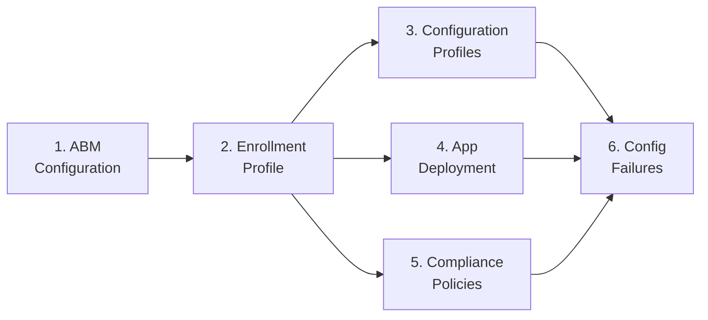

# Phase 76: Platform SSO Admin Setup Guide - Pattern Map

**Mapped:** 2026-06-21
**Files analyzed:** 3 (1 CREATE + 2 EDIT)
**Analogs found:** 3 / 3

---

## File Classification

| New/Modified File | Role | Data Flow | Closest Analog | Match Quality |
|---|---|---|---|---|
| `docs/admin-setup-macos/07-platform-sso-setup.md` | admin-guide (CREATE) | request-response (admin walkthrough) | `docs/admin-setup-macos/02-enrollment-profile.md` | exact — same corpus role, same outer skeleton |
| `docs/admin-setup-macos/00-overview.md` | navigation-hub (EDIT) | append-only | itself — current Mermaid + bullet + Version-History | exact self-analog |
| `docs/admin-setup-macos/03-configuration-profiles.md` | admin-guide (EDIT) | surgical-edit | itself — §Extensible SSO line 168 | exact self-analog |

---

## Pattern Assignments

---

### `docs/admin-setup-macos/07-platform-sso-setup.md` (CREATE)

**Analog:** `docs/admin-setup-macos/02-enrollment-profile.md`

---

#### Front-matter block (lines 1–7 of analog)

```yaml
---
last_verified: 2026-04-14
review_by: 2026-07-13
applies_to: ADE
audience: admin
platform: macOS
---
```

**Guide 07 values (mandatory — per RESEARCH.md carry-overs):**

```yaml
---
last_verified: 2026-06-20
review_by: 2026-09-20
applies_to: ADE
audience: admin
platform: macOS
---
```

Five keys, exact order. `last_verified` / `review_by` are mandatory per DS-2 90-day PSSO cadence. `applies_to: ADE` matches every existing sibling guide (01–06) for corpus consistency.

---

#### Platform-gate blockquote (line 9–11 of analog)

```markdown
> **Platform gate:** This guide covers macOS ADE configuration via Apple Business Manager and Intune.
> For Windows Autopilot setup, see [Windows Admin Setup Guides](../admin-setup-apv1/00-overview.md).
> For macOS provisioning terminology, see the [macOS Glossary](../_glossary-macos.md).
```

Guide 07 replaces the first line's description; the other two lines are copied verbatim:

```markdown
> **Platform gate:** This guide covers macOS Platform SSO configuration via Microsoft Intune.
> For Windows Autopilot setup, see [Windows Admin Setup Guides](../admin-setup-apv1/00-overview.md).
> For macOS provisioning terminology, see the [macOS Glossary](../_glossary-macos.md).
```

---

#### Section skeleton — exact heading sequence (locked by D-01/A3)

Derived from analog lines 17–141:

```markdown
## Prerequisites

## Steps

### Step 1: [name]

#### In Intune admin center

### Step 2: [name]

...

## Verification

- [ ] checkbox item

## Configuration-Caused Failures

| Misconfiguration | Portal | Symptom | Runbook |
|------------------|--------|---------|---------|

## See Also

---

| Date | Change | Author |
|------|--------|--------|
```

**D-01a constraint:** The three bootstrapping blockers (PSSO-03) must appear BEFORE the Settings Catalog step. Recommended placement: a `### Known Silent Blockers — Resolve Before Deployment` subsection under `## Prerequisites`, so the DF-3 "before any Settings Catalog steps" invariant is unambiguous.

---

#### Step subheading pattern (analog lines 25–27, 34, 61, 99)

```markdown
### Step 1: Create Enrollment Profile

#### In Intune admin center

1. Navigate to ...
```

```markdown
### Step 2: Configure User Affinity and Authentication

Configure the following enrollment settings:

| Setting | Options | Default | Notes |
```

Rules: `### Step N: [Verb phrase]` followed optionally by `#### In Intune admin center` when the step is portal-driven. Navigation paths use **bold** > **bold** > **bold** chains. Numbered lists for sequential portal clicks. Tables for settings grids.

---

#### "What breaks if misconfigured" callout (analog lines 46–50)

```markdown
> **What breaks if misconfigured:** Without user affinity, Company Portal will not work and user-based Conditional Access policies do not apply. Symptom appears in: Intune admin center (device shows no primary user) and Company Portal (app not functional).
> See: [Setup Assistant Failed](../l1-runbooks/11-macos-setup-assistant-failed.md)
```

Pattern: single `>` blockquote, bold label, one-sentence symptom with portal/device location, `> See:` link on the next line of the same blockquote. Used for per-setting inline callouts.

**Note:** Guide 07's upfront bootstrapping blockers callout (D-01a / C4) uses the hard-bordered blockquote pattern (see Shared Patterns section) — NOT the per-setting "What breaks" style.

---

#### Verification section — checkbox list (analog lines 108–115)

```markdown
## Verification

- [ ] Enrollment profile appears under token's Profiles tab in Intune admin center
- [ ] User Affinity setting matches organizational requirement
- [ ] Await final configuration is set to Yes (recommended)
- [ ] Authentication method is "Setup Assistant with modern authentication"
- [ ] At least one device shows the profile assignment in Devices > [serial] > Profile column
- [ ] Locked enrollment set per organizational policy
```

Pattern: `- [ ]` GitHub-flavored checkbox per item. Mix of portal checks and device-side checks. Guide 07 must include both `app-sso platform -s` (device-side) and Intune portal profile status checks per D-01b.

---

#### Configuration-Caused Failures table (analog lines 117–127)

```markdown
## Configuration-Caused Failures

| Misconfiguration | Portal | Symptom | Runbook |
|------------------|--------|---------|---------|
| No user affinity on user-targeted deployment | Intune | Company Portal non-functional; user CA policies not applied | [Setup Assistant Failed](../l1-runbooks/11-macos-setup-assistant-failed.md) |
| Legacy authentication method | Intune | Setup Assistant auth failure when modern CA policies are enforced | [Setup Assistant Failed](../l1-runbooks/11-macos-setup-assistant-failed.md) |
```

Four columns: `Misconfiguration | Portal | Symptom | Runbook`. Runbook column uses live markdown links when targets exist. For guide 07, Phase 80 runbooks do not yet exist — use code-span placeholders per D-06 pattern:

```markdown
| Only macOS 14+ auth method configured on mixed fleet | Intune | Error 10001 on macOS 13 devices | `35-macos-sso-sign-in-failure.md` (Phase 80) |
```

Bootstrapping blockers (DF-3/DF-9/DF-10) do NOT appear in this table per D-03 decision.

---

#### See Also section (analog lines 128–133)

```markdown
## See Also

- [ABM Configuration](01-abm-configuration.md)
- [Configuration Profiles](03-configuration-profiles.md)
- [macOS ADE Lifecycle Overview](../macos-lifecycle/00-ade-lifecycle.md)
- [macOS Provisioning Glossary](../_glossary-macos.md)
```

Pattern: bare `- [text](path)` links, no bold labels, one per line. Guide 07 must include the Phase-75 glossary anchors:

```markdown
## See Also

- [Platform SSO](../_glossary-macos.md#platform-sso)
- [Secure Enclave](../_glossary-macos.md#secure-enclave)
- [Enterprise SSO Plug-in](../_glossary-macos.md#enterprise-sso-plug-in)
- [Configuration Profiles](03-configuration-profiles.md)
- [macOS ADE Lifecycle Overview](../macos-lifecycle/00-ade-lifecycle.md)
```

---

#### Version-History table (analog lines 135–140)

```markdown
---

| Date | Change | Author |
|------|--------|--------|
| 2026-04-14 | Resolved Phase 24 runbook links | -- |
| 2026-04-14 | Initial version -- enrollment profile with Setup Assistant screens, enrollment settings, what-breaks callouts | -- |
```

Rules: `---` horizontal rule immediately above the table (no heading). Three columns `Date | Change | Author`. Author value is ` -- ` (space-dash-dash-space). Newest row at top. Date is ISO 8601.

Guide 07 initial row:

```markdown
---

| Date | Change | Author |
|------|--------|--------|
| 2026-06-20 | Phase 76 (PSSO-01/02/03/12): initial Platform SSO admin setup guide | -- |
```

---

### `docs/admin-setup-macos/00-overview.md` (EDIT)

**Analog:** itself (all 61 lines read above)

---

#### Current front matter (lines 1–7) — DO NOT CHANGE

```yaml
---
last_verified: 2026-04-14
review_by: 2026-07-13
applies_to: ADE
audience: admin
platform: macOS
---
```

The front matter is NOT updated in this phase (RESEARCH.md identifies only Mermaid body, bullet list, and Version-History as the three sanctioned edit locations).

---

#### Current Mermaid block (lines 19–28) — ADD nodes G/H/I

Exact current text:

```markdown

```

B1 additions (append inside the fenced block, after the last `E --> F` line, before the closing fence):

```
  C --> G[7. Platform SSO<br/>Setup]
  G --> H[8. Auth Methods<br/>Deep-Dive]
  G --> I[9. Enterprise SSO<br/>Migration]
```

Node-label format: `[N. Label<br/>Line2]` — number, dot, space, label split across two lines with `<br/>`. Node IDs continue alphabetically (G, H, I). Mermaid node labels are NOT markdown link targets — C13 never validates them; safe regardless of whether guide files exist.

---

#### Current numbered bullet list (lines 30–41) — ADD entries 7/8/9

Exact current text (lines 30–40):

```markdown
1. **[ABM Configuration](01-abm-configuration.md)** -- Create ADE token in Apple Business Manager and Intune, assign devices to MDM server, configure token renewal. This must be complete before any enrollment profile can be created.

2. **[Enrollment Profile](02-enrollment-profile.md)** -- Configure enrollment profile with user affinity, authentication method, Await Configuration, locked enrollment, and Setup Assistant screen customization.

3. **[Configuration Profiles](03-configuration-profiles.md)** -- Deploy Wi-Fi, VPN, email, restrictions, FileVault, and firewall profiles via Settings Catalog. Configuration profiles enforce settings; compliance policies detect non-compliance.

4. **[App Deployment](04-app-deployment.md)** -- Deploy macOS apps via DMG, PKG (managed and unmanaged), and VPP/Apps and Books with size limits, detection rules, and uninstall capabilities documented per type.

5. **[Compliance Policies](05-compliance-policy.md)** -- Configure compliance policies for SIP, FileVault, firewall, Gatekeeper, and password. Important: no Intune security baselines exist for macOS.

6. **[Configuration-Caused Failures Reference](06-config-failures.md)** -- Consolidated reverse-lookup table of all macOS admin setup misconfigurations with links to guide files and troubleshooting runbooks.
```

Three new entries to append after line 40 (after the existing entry 6), before the `## Cross-Platform References` heading:

```markdown
7. **[Platform SSO Setup](07-platform-sso-setup.md)** -- Configure macOS Platform SSO via the Settings Catalog `com.apple.extensiblesso` payload. Covers Entra prerequisites, the three silent bootstrapping blockers, dual-field mixed-fleet configuration, user-group assignment, and `app-sso platform -s` verification.

8. `08-auth-methods-deep-dive.md` (added in a later documentation phase)

9. `09-enterprise-sso-plugin-migration.md` (added in a later documentation phase)
```

**C13 rule:** Entry 7 is a live markdown link (`[text](07-platform-sso-setup.md)`) — safe because guide 07 is created in the same commit. Entries 8 and 9 are inline code-spans, NOT markdown links — C13 does not validate code-span filenames; the 15-entry allowlist stays at 15.

**Format:** Entry 7 follows the existing bold-link-with-description pattern. Entries 8/9 use bare code-span form without bold wrapping (they are stub references, not live guides).

---

#### Current Version-History table (lines 57–60) — ADD new row

Exact current text:

```markdown
| Date | Change | Author |
|------|--------|--------|
| 2026-04-14 | Initial version -- macOS admin setup overview with Mermaid diagram and 6-guide setup sequence | -- |
```

New row to prepend (newest row at top):

```markdown
| 2026-06-20 | Phase 76: added guides 07/08/09 to Mermaid diagram and numbered list | -- |
```

Result:

```markdown
| Date | Change | Author |
|------|--------|--------|
| 2026-06-20 | Phase 76: added guides 07/08/09 to Mermaid diagram and numbered list | -- |
| 2026-04-14 | Initial version -- macOS admin setup overview with Mermaid diagram and 6-guide setup sequence | -- |
```

---

### `docs/admin-setup-macos/03-configuration-profiles.md` (EDIT)

**Analog:** itself — §Extensible SSO, line 168

---

#### Current §Extensible SSO section (lines 157–168) — anchor-safety constraint

```markdown
## Extensible SSO

#### In Intune admin center

Navigation: **Devices** > **Manage devices** > **Configuration** > **Create** > **New policy** > **Settings catalog** > **Authentication** > **Extensible Single Sign On (SSO)**

Enterprise SSO plug-in or Platform SSO (macOS 13+, macOS 14 recommended) for single sign-on across apps and web. Two configuration approaches:

- **SSO app extension (Redirect type):** For Microsoft Enterprise SSO plug-in -- enables SSO across Safari and apps using Microsoft identity
- **Platform SSO (macOS 13+; macOS 14 recommended; Smart Card requires macOS 14+):** Registers the Mac with Entra ID and provides device-wide SSO. Three mutually exclusive authentication methods configured in Settings Catalog: Secure Enclave key/Platform Credential (recommended — local password unchanged), Password sync (Entra ID password replaces local password), and Smart Card (macOS 14+ only)

Continue with Platform SSO setup in `07-platform-sso-setup.md` (added in the next documentation phase).
```

**The `## Extensible SSO` heading (line 157) and `#### In Intune admin center` subheading (line 159) must NOT be changed.** This file has exactly 9 `#### In Intune admin center` subheadings (lines 29, 52, 67, 84, 100, 119, 136, 145, 159); count must remain 9.

---

#### Single-line change: line 168

**Current (line 168):**

```
Continue with Platform SSO setup in `07-platform-sso-setup.md` (added in the next documentation phase).
```

**Target:**

```
Continue with Platform SSO setup in [07-platform-sso-setup.md](07-platform-sso-setup.md).
```

The parenthetical `(added in the next documentation phase)` is dropped — the file now exists. The relative path `07-platform-sso-setup.md` is correct (sibling file in `docs/admin-setup-macos/`). This change is safe IF AND ONLY IF guide 07 is created in the same commit (D-06 / C13 mandate).

---

#### Version-History row to add (lines 199–203 of current file)

Current Version-History table (lines 199–203):

```markdown
| Date | Change | Author |
|------|--------|--------|
| 2026-06-20 | Phase 75 (PSSO-04 / DS-5): corrected Extensible SSO section — fixed macOS version floor (13+, 14 recommended, Smart Card 14+), separated the three auth methods, removed blanket password-binding claim; replaced external fallback with deferred in-suite pointer to `07-platform-sso-setup.md` (link converted in Phase 76) | -- |
| 2026-04-14 | Resolved Phase 24 runbook links | -- |
| 2026-04-14 | Initial version -- 9 profile types with Settings Catalog paths, what-breaks callouts, delivery channel note | -- |
```

New row to prepend (newest row at top):

```markdown
| 2026-06-20 | Phase 76 (PSSO-01 / D-06): converted `07-platform-sso-setup.md` code-span to live markdown link | -- |
```

---

## Shared Patterns

---

### Hard-Bordered Blockquote Callout (D-01a / C4 / D-04)

**Source:** `docs/cross-platform/apple-business/01-role-permission-model.md` lines 39–54 (Phase 62/63 "Account Holder — DO NOT DELEGATE" pattern); `docs/cross-platform/apple-business/13-device-release-runbook.md` lines 78–95 (Phase 64 OP-6 "release ≠ removal" pattern)

**Apply to:** (a) Guide 07 upfront bootstrapping blockers callout (D-01a, before Settings Catalog steps); (b) Guide 07 ADE Advanced/Optional bordered subsection at guide end (D-04)

**Account Holder pattern (single-block, multi-paragraph):**

```markdown
> **Critical (OP-2 / DA-2): Account Holder — DO NOT DELEGATE**
>
> The **Account Holder** role MUST NOT be delegated to any sub-organization admin, any individual
> employee, or any non-canonical managed account. [...]
>
> - Bullet 1
> - Bullet 2
>
> Closing sentence with consequences.
```

**OP-6 callout with checklist (Phase 64):**

```markdown
> **⛔ Device Release — "release ≠ removal" (OP-6)**
>
> Releasing a device from Apple Business does NOT remove it from Apple's DEP backend.
> [...]
>
> **Pre-release checklist (all must be resolved):**
> - [ ] Item 1
> - [ ] Item 2
```

**Rules for guide 07 callouts:**
- Opening line is `> **[Label]:** [Title phrase]` — bold label, colon, space, title
- Blank `>` lines between paragraphs within the same blockquote block
- Bullet lists inside the blockquote use `> - ` prefix
- Checkbox lists use `> - [ ] ` prefix
- The blockquote is preceded and followed by blank lines
- For the upfront blockers callout (D-01a): use `> **Before You Deploy — Resolve These First:**` or equivalent; list all three blockers (per-user MFA, CA exclusion, TLS exemption); place under `## Prerequisites` before any Settings Catalog step
- For the ADE Advanced/Optional subsection (D-04): bordered block labeled `Advanced / Optional` with an ADE-only callout inside — distinct string from the suite's supervised-only callout (DS-1)

---

### Deferred Code-Span Pattern (C13 gate safety)

**Source:** `docs/admin-setup-macos/03-configuration-profiles.md` line 168 (Phase 75 D-06); `docs/admin-setup-macos/00-overview.md` entries 8/9 (Phase 76 B1)

**Apply to:** Configuration-Caused Failures table runbook column (Phase 80 files not yet authored); 00-overview entries 8/9

```markdown
`08-auth-methods-deep-dive.md` (added in a later documentation phase)
```

```markdown
`35-macos-sso-sign-in-failure.md` (Phase 80)
```

Code-span filename (backtick-wrapped), NOT `[text](path)`. C13 validates markdown link syntax only, not code-span text. The live-link conversion happens in the same commit that creates the target file.

---

### Version-History Row Format

**Source:** `docs/admin-setup-macos/02-enrollment-profile.md` lines 137–140; `docs/admin-setup-macos/03-configuration-profiles.md` lines 199–203

**Apply to:** All three files (guide 07 new table; 00-overview append; 03-config-profiles append)

```markdown
| Date | Change | Author |
|------|--------|--------|
| YYYY-MM-DD | Phase NN (REQ-ID): description | -- |
```

Rules: ISO 8601 date; Author always ` -- `; newest row at top; backtick inline code for filenames/codes in Change field; `##` notation for section names when referenced.

---

### Navigation Path Format

**Source:** `docs/admin-setup-macos/03-configuration-profiles.md` lines 31, 54, 69, 84, 102, 121, 138

```markdown
Navigation: **Devices** > **Manage devices** > **Configuration** > **Create** > **New policy** > **Settings catalog** > **Authentication** > **Extensible Single Sign On (SSO)**
```

The exact Settings Catalog navigation path for guide 07 (VERIFIED 2026-05-18):

```markdown
Navigation: **Devices** > **Manage devices** > **Configuration** > **Create** > **New policy** > **Platform:** macOS > **Profile type:** Settings catalog > **Configuration settings** > Add settings > **Authentication** > **Extensible Single Sign On (SSO)**
```

All portal navigation path components are **bold**. Literal UI labels are preserved verbatim.

---

## No Analog Found

None. All three files have exact analogs within the existing corpus.

---

## Anchor Contracts (Inherited from Phase 75 — Do Not Break)

These slugs are stable and used by guide 07's See Also links:

| Anchor | File |
|--------|------|
| `#platform-sso` | `docs/_glossary-macos.md` |
| `#secure-enclave` | `docs/_glossary-macos.md` |
| `#enterprise-sso-plug-in` | `docs/_glossary-macos.md` |
| `#entra-id-sso` | `docs/_glossary.md` |

The `## Extensible SSO` heading (line 157) and all nine `#### In Intune admin center` headings in `03-configuration-profiles.md` must not be renamed or reordered — they are potential inbound link targets from `06-config-failures.md` and other corpus files.

---

## Metadata

**Analog search scope:** `docs/admin-setup-macos/` (all three target files); `docs/cross-platform/apple-business/` (callout patterns); `.planning/phases/75-*/75-PATTERNS.md` (prior-phase pattern precedents)
**Files read:** 6 (CONTEXT.md, RESEARCH.md, 02-enrollment-profile.md, 00-overview.md, 03-configuration-profiles.md, 75-PATTERNS.md, 01-role-permission-model.md, 13-device-release-runbook.md)
**Pattern extraction date:** 2026-06-21
