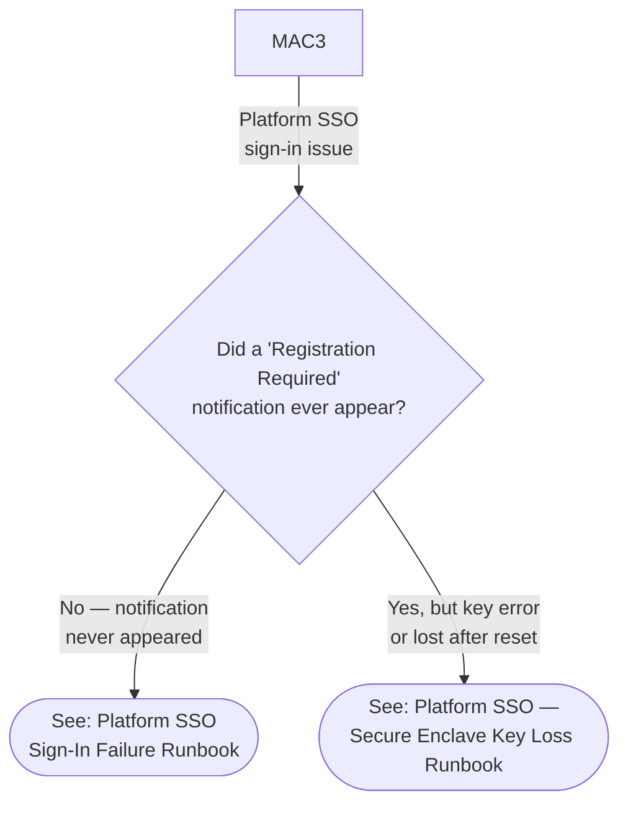

# Phase 81: Nav Hub Integration - Research

**Researched:** 2026-06-22
**Domain:** Documentation navigation — append-only hub integration for v1.9 macOS Platform SSO content
**Confidence:** HIGH (all findings verified by direct file inspection; no external sources required)

---

<user_constraints>
## User Constraints (from CONTEXT.md)

### Locked Decisions

**D-01:** Extend `06-macos-triage.md` with a new SSO symptom edge off `MAC3` leading to ONE sub-decision diamond (`MACSSO`) that routes to two resolved leaves — L1 #35 ("Registration required" notification missing) and L1 #36 (Secure Enclave key error). Path `MAC1→MAC3→MACSSO→leaf` = exactly 3 edges. Apply `classDef resolved` to BOTH new leaves. Add a matching new row pair to the Routing Verification table (lines 61–69). Add `click` directives for both new leaves. #35 leaf must carry/preserve its onward escalation to L2 #27.

**D-02:** Write the SC4 closure checklist to `.planning/phases/81-nav-hub-integration/81-CROSSLINK-CLOSURE.md` (committed). NOT in the `docs/` corpus.

**D-03:** Create E8 (`00-ade-lifecycle→07`) by appending ONE bullet to the "Related Guides:" list in `docs/macos-lifecycle/00-ade-lifecycle.md` (~lines 391–394). Verify E1–E7 with cited evidence. If a prior-phase edge is found broken, log it to `81-CROSSLINK-CLOSURE.md` + deferred backlog — do NOT re-author prior-phase content.

**D-04:** Append ONE grouped row to each of the macOS Admin Setup / L1 / L2 tables in `docs/index.md`, matching the established grouped-row house style. The Admin Setup row's "When to Use" cell must name all three guides 07/08/09 by topic. The L1 row names #35 + #36. The L2 row names #27.

### Claude's Discretion

- Exact prose wording of all appended nav entries, the SSO triage diamond's question text, escalation-trigger bullets, and "When to Use" cell copy — within the locked SC1–SC4 facts and the guardrails above.
- Exact node IDs / anchor text for the new Mermaid leaves (subject to the `classDef` + `click` + Routing-Verification-row guardrails in D-01).
- The `81-CROSSLINK-CLOSURE.md` table column layout (follow the SC4 edge enumeration).
- Plan decomposition / commit batching across the touched files (planner's call), provided the navigation-last ordering and append-only invariants hold.

### Deferred Ideas (OUT OF SCOPE)

- v1.9 harness lineage bump + `check-phase-81` validator + 3-axis terminal re-audit + milestone close — Phase 82.
- Any broken E1–E7 edge discovered during verification — log to `81-CROSSLINK-CLOSURE.md` + deferred backlog; do NOT re-author prior-phase content inside this nav phase (D-03 guardrail).
</user_constraints>

---

<phase_requirements>
## Phase Requirements

| ID | Description | Research Support |
|----|-------------|------------------|
| SSOREF-04 | Navigation hubs integrate the new v1.9 content (append-only) — `index.md`, `common-issues.md`, `quick-ref-l1.md`, `quick-ref-l2.md`, `l1-runbooks/00-index.md`, `l2-runbooks/00-index.md`, and `decision-trees/06-macos-triage.md` SSO failure leaf. Additionally: `00-ade-lifecycle.md` E8 bullet + `81-CROSSLINK-CLOSURE.md` committed closure checklist. | All 7+ insertion points mapped with exact line numbers and current formats below. |
</phase_requirements>

---

## Summary

Phase 81 is a pure append-only documentation navigation phase. All content (guides 07/08/09, runbooks #35/#36/#27) shipped in Phases 75–80 and is already committed. This phase wires those artifacts into the navigation hubs, adds one SSO triage sub-decision to the macOS decision tree, and commits a cross-link closure checklist for the 8 SSO edges (E1–E8).

The single highest-value research output is a precise, verified map of every insertion point — exact file paths, current line numbers, existing content format, and verbatim append instructions — so the planner can write unambiguous tasks with no guesswork.

**Primary recommendation:** Use the file-by-file insertion map below as the authoritative blueprint for every task in the plan. All line numbers were verified by direct file inspection on 2026-06-22.

**Important: CONTEXT.md line-number accuracy.** The CONTEXT.md cites several approximate line numbers. All have been verified; discrepancies are noted per file. [VERIFIED: direct file inspection]

---

## Architectural Responsibility Map

| Capability | Primary Tier | Secondary Tier | Rationale |
|------------|-------------|----------------|-----------|
| Nav hub table rows (index.md) | Documentation corpus — static navigation | — | Pure markdown table append; no backend |
| Common-issues routing entry | Documentation corpus — static navigation | — | Symptom-to-runbook router, append-only |
| Quick-ref escalation triggers (L1) | Documentation corpus — static navigation | — | L1 cheat card, append-only |
| Quick-ref log paths + commands (L2) | Documentation corpus — static navigation | — | L2 cheat card, append-only |
| Decision-tree SSO leaf (Mermaid) | Documentation corpus — static Mermaid diagram | — | Append-only Mermaid node + table row |
| ADE lifecycle Related Guides bullet (E8) | Documentation corpus — static navigation | — | Single bullet append |
| Cross-link closure checklist | Planning artifact — `.planning/` only | — | Build-time verification artifact; NOT corpus |

---

## File-by-File Insertion Map

### 1. `docs/index.md` — macOS Provisioning Tables

**Current state — macOS Provisioning section starts at line 98.** [VERIFIED: direct file inspection]

The section contains three sub-tables:

#### 1a. Service Desk (L1) table

Lines 102–109 (current content):

```
### Service Desk (L1)

| Resource | When to Use |
|----------|-------------|
| [macOS ADE Lifecycle](macos-lifecycle/00-ade-lifecycle.md) | Understand the 7-stage macOS enrollment pipeline from ABM registration through desktop |
| [macOS ADE Triage Decision Tree](decision-trees/06-macos-triage.md) | Start here -- identifies the macOS ADE failure scenario and routes to the correct runbook |
| [macOS L1 Runbooks](l1-runbooks/00-index.md#macos-ade-runbooks) | Scripted procedures for top macOS ADE enrollment failures (6 runbooks: device, Setup Assistant, profiles, apps, compliance, Company Portal) |
| [L1 Quick-Reference Card](quick-ref-l1.md#macos-ade-quick-reference) | One-page cheat sheet -- macOS top checks, escalation triggers, and runbook links |
```

**Exact current last row:** line 109 — `| [L1 Quick-Reference Card](quick-ref-l1.md#macos-ade-quick-reference) | One-page cheat sheet -- macOS top checks, escalation triggers, and runbook links |`

**Append point for D-04 L1 row:** after line 109 (after the last existing L1 row, before the blank line separating from L2 section header).

**D-04 L1 row to append (follow grouped-row house style — single row naming both runbooks):**

```markdown
| [macOS Platform SSO Runbooks](l1-runbooks/00-index.md#macos-ade-runbooks) | Platform SSO sign-in failure (runbook #35: "Registration Required" not appearing) or Secure Enclave key loss after password reset (runbook #36) |
```

**CONTEXT.md cited range:** `~:104–109` — CONFIRMED ACCURATE. [VERIFIED: direct file inspection]

#### 1b. Desktop Engineering (L2) table

Lines 111–121 (current content):

```
### Desktop Engineering (L2)

| Resource | When to Use |
|----------|-------------|
| [macOS ADE Lifecycle](macos-lifecycle/00-ade-lifecycle.md) | End-to-end enrollment stages with behind-the-scenes technical detail |
| [macOS Terminal Commands Reference](reference/macos-commands.md) | Look up diagnostic commands (profiles, log show, system_profiler, IntuneMacODC) |
| [macOS Log Paths Reference](reference/macos-log-paths.md) | Find log file locations, unified log subsystems, and configuration profile paths |
| [Network Endpoints Reference](reference/endpoints.md#macos-ade-endpoints) | Required Apple and Microsoft URLs for ADE enrollment with test commands |
| [macOS Log Collection Guide](l2-runbooks/10-macos-log-collection.md) | Collect macOS diagnostic logs using IntuneMacODC and Terminal commands |
| [macOS L2 Runbooks](l2-runbooks/00-index.md#macos-ade-runbooks) | Investigation guides for profile delivery, app install, and compliance evaluation failures |
| [L2 Quick-Reference Card](quick-ref-l2.md#macos-ade-quick-reference) | One-page cheat sheet -- macOS Terminal commands, log paths, and key diagnostic checks |
```

**Exact current last row:** line 121 — `| [L2 Quick-Reference Card](quick-ref-l2.md#macos-ade-quick-reference) | One-page cheat sheet -- macOS Terminal commands, log paths, and key diagnostic checks |`

**Append point for D-04 L2 row:** after line 121.

**D-04 L2 row to append:**

```markdown
| [macOS Platform SSO Investigation](l2-runbooks/00-index.md#macos-ade-runbooks) | PSSO registration failure or Password-sync failure investigation (runbook #27) |
```

**CONTEXT.md cited range:** `~:111–121` — CONFIRMED ACCURATE. [VERIFIED: direct file inspection]

#### 1c. Admin Setup table

Lines 123–130 (current content):

```
### Admin Setup

| Resource | When to Use |
|----------|-------------|
| [macOS ADE Lifecycle](macos-lifecycle/00-ade-lifecycle.md) | Review the enrollment pipeline before configuring ABM and Intune |
| [Network Endpoints Reference](reference/endpoints.md#macos-ade-endpoints) | Verify firewall rules for all required ADE endpoints |
| [macOS Admin Setup Guides](admin-setup-macos/00-overview.md) | ABM configuration, enrollment profiles, configuration profiles, app deployment, compliance policies |
```

**Exact current last row:** line 129 — `| [macOS Admin Setup Guides](admin-setup-macos/00-overview.md) | ABM configuration, enrollment profiles, configuration profiles, app deployment, compliance policies |`

**Append point for D-04 Admin Setup row:** after line 129.

**D-04 Admin Setup row to append (D-04 GUARDRAIL: must name all three guides 07/08/09 by topic):**

```markdown
| [macOS Platform SSO Admin Setup Guides](admin-setup-macos/00-overview.md) | Platform SSO deployment (guide 07: setup), authentication method selection and deep-dive (guide 08: Secure Enclave key, Password sync, Smart card), and legacy SSO plug-in migration (guide 09) |
```

**CONTEXT.md cited range:** `~:123–130`, existing row at `:129` — CONFIRMED ACCURATE. [VERIFIED: direct file inspection]

**Line 131 is `---` (horizontal rule starting iOS section).** The three appended rows go before line 131.

---

### 2. `docs/common-issues.md` — macOS ADE Failure Scenarios

**Current state:** The `## macOS ADE Failure Scenarios` section begins at line 157. [VERIFIED: direct file inspection]

The section currently contains 5 H3 sub-entries:

| H3 heading | Lines (approx) |
|---|---|
| `### Device Not Appearing in Intune` | ~168 |
| `### Setup Assistant Stuck or Failed` | ~174 |
| `### Configuration Profile Not Applied` | ~183 |
| `### App Not Installed` | ~190 |
| `### Compliance Failure or Access Blocked` | ~199 |
| `### Company Portal Sign-In Failure` | ~206 |

**Exact current last entry in macOS section:** lines 206–211:

```
### Company Portal Sign-In Failure

Company Portal not available, sign-in failing, or Entra registration incomplete.

- **L1:** [Company Portal Sign-In](l1-runbooks/15-macos-company-portal-sign-in.md)
- **L2:** [Compliance Evaluation Investigation](l2-runbooks/13-macos-compliance.md) (for Entra registration issues)
```

**Line 213:** `## iOS/iPadOS Failure Scenarios` (next H2 — this is the hard lower boundary; do NOT insert past it)

**Append point:** After the Company Portal entry (after line 211), before the blank line leading into `## iOS/iPadOS Failure Scenarios` at line 213.

**Entry format (match existing H3 pattern):** H3 heading + one-line description + `- **L1:** [...]` + `- **L2:** [...]` bullet pair.

**New SSO entry to append:**

```markdown
### Platform SSO Sign-In Failure

Platform SSO "Registration Required" notification never appeared despite Intune reporting Succeeded, or Platform SSO sign-in is failing after registration.

- **L1:** [Platform SSO Sign-In Failure](l1-runbooks/35-macos-sso-sign-in-failure.md) — four root causes: old Company Portal, Error 10002 legacy conflict, mistyped registration token, dismissed notification
- **L2:** [Platform SSO Investigation](l2-runbooks/27-macos-sso-investigation.md)
```

**CONTEXT.md anchor citation:** `#macos-ade-failure-scenarios` and cross-refs at lines 9–69 — the anchor is the slug of `## macOS ADE Failure Scenarios`. Confirmed present (line 16 of TOC links to it). [VERIFIED: direct file inspection]

**House style note:** The existing Company Portal entry does NOT use the `> **macOS:** ...` banner pattern inside the section — those banners appear at section tops and in Windows sections pointing TO macOS. No banner is needed on the new H3 entry.

**Version History update required:** Append one row to the Version History table at the bottom of the file (currently ends at line 380 with the Phase 65 entry).

---

### 3. `docs/quick-ref-l1.md` — macOS ADE Quick Reference

**Current state:** The `## macOS ADE Quick Reference` section spans lines 83–114. [VERIFIED: direct file inspection]

The section contains:
- `### Top Checks` — lines 87–93 (4 numbered checks)
- `### macOS Escalation Triggers` — lines 94–101 (5 bullet triggers)
- `### macOS Decision Tree` — lines 102–104 (1 link)
- `### macOS Runbooks` — lines 105–114 (6 runbook links, #10–15)

**Exact current content of `### macOS Escalation Triggers`** (lines 94–101):

```
### macOS Escalation Triggers

- Serial in ABM but device not in Intune after 24 hours --> **Escalate L2** (collect: serial number, ABM MDM server assignment screenshot, Intune enrollment status)
- Setup Assistant stuck or authentication failure after one retry --> **Escalate L2** (collect: serial number, screenshot of error, macOS version)
- Configuration profile not applied after 4-hour sync wait and manual sync --> **Escalate L2** (collect: serial number, expected profile name, Intune device compliance screenshot)
- App showing "Failed" in Intune after reinstall attempt --> **Escalate L2** (collect: app name, app type, Intune app install status screenshot)
- Device non-compliant but user believes settings are correct --> **Escalate L2** (collect: non-compliant setting names, device serial)
```

**Exact current content of `### macOS Runbooks`** (lines 105–114):

```
### macOS Runbooks

- [Device Not Appearing](l1-runbooks/10-macos-device-not-appearing.md)
- [Setup Assistant Failed](l1-runbooks/11-macos-setup-assistant-failed.md)
- [Profile Not Applied](l1-runbooks/12-macos-profile-not-applied.md)
- [App Not Installed](l1-runbooks/13-macos-app-not-installed.md)
- [Compliance / Access Blocked](l1-runbooks/14-macos-compliance-access-blocked.md)
- [Company Portal Sign-In](l1-runbooks/15-macos-company-portal-sign-in.md)
```

**Exact current last line of macOS section:** line 114 — `- [Company Portal Sign-In](l1-runbooks/15-macos-company-portal-sign-in.md)`

**Line 116:** `---` then `## iOS/iPadOS Quick Reference` (hard lower boundary)

**Two appends required for SC2:**

**Append 1 — Two new escalation trigger bullets** (append after the last existing bullet in `### macOS Escalation Triggers`, i.e. after "Device non-compliant but user believes settings are correct" bullet):

```markdown
- Secure Enclave key error after password reset or FileVault recovery --> **Escalate L2** via [Platform SSO — Secure Enclave Key Loss](l1-runbooks/36-macos-secure-enclave-key.md) first; escalate to L2 if re-registration fails (collect: serial number, macOS version, `app-sso platform -s` output)
- Platform SSO sign-in loop or "Registration Required" notification never appeared --> **Use [Platform SSO Sign-In Failure](l1-runbooks/35-macos-sso-sign-in-failure.md) runbook** (collect: Intune Succeeded screenshot, Company Portal version, `app-sso platform -s` output)
```

**Append 2 — Two new runbook links** (append after the last existing bullet in `### macOS Runbooks`, i.e. after `[Company Portal Sign-In]` bullet):

```markdown
- [Platform SSO Sign-In Failure](l1-runbooks/35-macos-sso-sign-in-failure.md) — "Registration Required" not appearing, sign-in loop
- [Platform SSO — Secure Enclave Key Loss](l1-runbooks/36-macos-secure-enclave-key.md) — key loss after password reset
```

**Version History update required** at the bottom of the file.

---

### 4. `docs/quick-ref-l2.md` — macOS ADE Quick Reference

**Current state:** The `## macOS ADE Quick Reference` section spans lines 132–179. [VERIFIED: direct file inspection]

The section contains:
- `### macOS Log Collection` — lines 136–143 (IntuneMacODC script block)
- `### Key Terminal Commands` — lines 145–159 (bash code block with 5 commands)
- `### Critical Log Paths` — lines 161–170 (3-row table + unified log subsystems line)
- `### macOS Investigation Runbooks` — lines 173–179 (4 runbook links)

**Exact current content of `### Critical Log Paths`** (lines 161–170):

```
### Critical Log Paths

| Path | Purpose |
|------|---------|
| `/Library/Logs/Microsoft/Intune/IntuneMDMDaemon*.log` | Intune daemon -- PKG/DMG installs, scripts, policy |
| `~/Library/Logs/Microsoft/Intune/IntuneMDMAgent*.log` | Intune agent -- user-context scripts, user policy |
| `/Library/Logs/Microsoft/Intune/CompanyPortal*.log` | Company Portal enrollment, registration, compliance |

Unified log subsystems: `com.apple.ManagedClient` (profile events), `com.apple.ManagedClient.cloudconfigurationd` (ADE enrollment)

Full reference: [macOS Terminal Commands](reference/macos-commands.md) | [macOS Log Paths](reference/macos-log-paths.md)
```

**Exact current content of `### macOS Investigation Runbooks`** (lines 173–179):

```
### macOS Investigation Runbooks

- [macOS Log Collection Guide](l2-runbooks/10-macos-log-collection.md) -- prerequisite for all macOS investigations
- [Profile Delivery Investigation](l2-runbooks/11-macos-profile-delivery.md)
- [App Install Failure Diagnosis](l2-runbooks/12-macos-app-install.md)
- [Compliance Evaluation Investigation](l2-runbooks/13-macos-compliance.md)
```

**Exact current last line of macOS section:** line 179 — `- [Compliance Evaluation Investigation](l2-runbooks/13-macos-compliance.md)`

**Line 181:** `---` then `## iOS/iPadOS Quick Reference` (hard lower boundary)

**Two appends required for SC2:**

**Append 1 — New Platform SSO log paths sub-section** (append after line 170, before the `Full reference:` line OR as a new sub-section after the existing Critical Log Paths table). Recommended: insert a new H4 block immediately after the existing Critical Log Paths section and before the Investigation Runbooks section:

```markdown
### Platform SSO Log Paths

| Path | Purpose |
|------|---------|
| `/Library/Logs/Microsoft/CompanyPortal/CompanyPortal*.log` | Company Portal PSSO registration events |
| `/var/log/DiagnosticMessages` | System-level SSO framework messages (search for `ssoextension`) |

#### Platform SSO Attestation Command

Verify PSSO registration state — run on the affected Mac:

```bash
app-sso platform -s
```

Expected healthy output includes both `Device Registration: REGISTERED` and `User Registration: REGISTERED` with SSO tokens listed. See [07-platform-sso-setup.md — Verification](admin-setup-macos/07-platform-sso-setup.md) for the full expected output format.
```

**Append 2 — New investigation runbook link** (append after line 179, the last existing macOS investigation runbook bullet):

```markdown
- [Platform SSO Investigation](l2-runbooks/27-macos-sso-investigation.md) -- PSSO registration failure and Password-sync failure investigation
```

**Critical constraint — `app-sso platform -s` verbatim:** CONTEXT.md and 81-CONTEXT.md both lock `app-sso platform -s` as the SC-locked canonical attestation command. It must appear EXACTLY as written — no variation, no `security find-certificate`. [VERIFIED: cross-checked against docs/l1-runbooks/35-macos-sso-sign-in-failure.md and docs/admin-setup-macos/07-platform-sso-setup.md which use this exact form]

**Version History update required** at the bottom of the file.

---

### 5. `docs/decision-trees/06-macos-triage.md` — SSO Failure Leaf (D-01)

**Current exact state — complete verified content:** [VERIFIED: direct file inspection]

**Frontmatter (lines 1–7):**
```yaml
---
last_verified: 2026-04-14
review_by: 2026-07-13
applies_to: ADE
audience: L1
platform: macOS
---
```

**Mermaid block: lines 29–55** (fenced block starts at line 29, closes at line 55)

**Current Mermaid nodes:**
- `MAC1` — root decision: "Did Setup Assistant complete?"
- `MAC2` — "Is the device visible in Intune admin center Devices > macOS?"
- `MAC3` — "What is the primary symptom?" (fan-out node)
- `MACR1` — leaf: "See: Device Not Appearing in Intune Runbook" → `10-macos-device-not-appearing.md`
- `MACR2` — leaf: "See: Setup Assistant Stuck or Failed Runbook" → `11-macos-setup-assistant-failed.md`
- `MACR3` — leaf: "See: Profile Not Applied Runbook" → `12-macos-profile-not-applied.md`
- `MACR4` — leaf: "See: App Not Installed Runbook" → `13-macos-app-not-installed.md`
- `MACR5` — leaf: "See: Compliance / Access Blocked Runbook" → `14-macos-compliance-access-blocked.md`
- `MACR6` — leaf: "See: Company Portal Sign-In Runbook" → `15-macos-company-portal-sign-in.md`
- `MACE1` — escalate leaf: "Escalate to L2: Collect serial number, stage of failure, screenshots"

**Current classDef/class lines (lines 51–54):**
```
    classDef resolved fill:#28a745,color:#fff
    classDef escalateL2 fill:#dc3545,color:#fff
    class MACR1,MACR2,MACR3,MACR4,MACR5,MACR6 resolved
    class MACE1 escalateL2
```

**Current click directives (lines 44–50):**
```
    click MACR1 "../l1-runbooks/10-macos-device-not-appearing.md"
    click MACR2 "../l1-runbooks/11-macos-setup-assistant-failed.md"
    click MACR3 "../l1-runbooks/12-macos-profile-not-applied.md"
    click MACR4 "../l1-runbooks/13-macos-app-not-installed.md"
    click MACR5 "../l1-runbooks/14-macos-compliance-access-blocked.md"
    click MACR6 "../l1-runbooks/15-macos-company-portal-sign-in.md"
```

**Routing Verification table: lines 57–69 (inclusive):**
```
## Routing Verification

All terminal nodes are within 3 edges of the root node (MAC1):

| Path | Step 1 | Step 2 | Destination |
|------|--------|--------|-------------|
| Device not appearing | Setup Assistant? No | Visible in Intune? No | Runbook 10 |
| Setup Assistant stuck | Setup Assistant? No | Visible in Intune? Yes | Runbook 11 |
| Profile not applied | Setup Assistant? Yes | Symptom: profile | Runbook 12 |
| App not installed | Setup Assistant? Yes | Symptom: app | Runbook 13 |
| Compliance / access blocked | Setup Assistant? Yes | Symptom: non-compliant | Runbook 14 |
| Company Portal sign-in | Setup Assistant? Yes | Symptom: CP sign-in | Runbook 15 |
| Other / unclear | Setup Assistant? Yes | Symptom: other | L2 escalation |
```

**CONTEXT.md line citations verified:** Mermaid block lines 29–55 ✓; Routing Verification table lines 57–69 ✓; click/classDef/class directives lines 44–54 ✓; "within 3 edges" invariant at line 59 ✓; "within 3 decision steps" at line 15 ✓. ALL CONFIRMED ACCURATE. [VERIFIED: direct file inspection]

**3-edge invariant verification for D-01:** `MAC1 →(edge 1)→ MAC3 →(edge 2)→ MACSSO →(edge 3)→ MACR7 or MACR8` = 3 edges. CONFIRMED within budget.

**Existing MAC3 edge labels (verbatim, for context):**
- `|"Profile not applied"|`
- `|"App not installed"|`
- `|"Non-compliant / access blocked"|`
- `|"Company Portal sign-in issue"|`
- `|"Other / unclear"|` → MACE1

**What to ADD to the Mermaid block (append before the closing ` ``` `):**

New nodes and edges:

```
    MAC3 -->|"Platform SSO<br/>sign-in issue"| MACSSO{"Did a 'Registration Required'<br/>notification ever appear?"}
    MACSSO -->|"No — notification<br/>never appeared"| MACR7(["See: Platform SSO<br/>Sign-In Failure Runbook"])
    MACSSO -->|"Yes, but key error<br/>or lost after reset"| MACR8(["See: Platform SSO —<br/>Secure Enclave Key Loss Runbook"])

    click MACR7 "../l1-runbooks/35-macos-sso-sign-in-failure.md"
    click MACR8 "../l1-runbooks/36-macos-secure-enclave-key.md"

    class MACR7,MACR8 resolved
```

**Implementation notes for Mermaid edit:**
- Append the new MAC3 edge + MACSSO node + two leaves BEFORE the existing `click MACR1` block (or append to the Mermaid body before the closing triple-backtick — the click/classDef/class block should remain last).
- Add `click MACR7` and `click MACR8` after the existing six `click` directives.
- Add `MACR7,MACR8` to the `class ... resolved` line (or add a new `class MACR7,MACR8 resolved` line after the existing class line).
- Do NOT add `MACR7` or `MACR8` to `class MACE1 escalateL2` — they are resolved leaves, not L2 escalations.
- Suggested node IDs: `MACSSO` (sub-decision diamond), `MACR7` (leaf #35), `MACR8` (leaf #36). These are the next available IDs after MACR6.

**What to ADD to the Routing Verification table (D-01 GUARDRAIL):**

Append two rows at the end of the current table (after the "Other / unclear" row):

```markdown
| Platform SSO — registration not appearing | Setup Assistant? Yes | Symptom: Platform SSO | Runbook 35 |
| Platform SSO — Secure Enclave key error | Setup Assistant? Yes | Symptom: Platform SSO → key error | Runbook 36 |
```

**D-01 GUARDRAIL for #35 leaf:** The #35 runbook (`35-macos-sso-sign-in-failure.md`) already contains escalation language pointing to L2 #27 at line 98: `See [macOS Platform SSO Investigation (L2 #27)](../l2-runbooks/27-macos-sso-investigation.md) for PSSO registration and Password-sync failure investigation.` The leaf click directive targets #35 which already carries the L2 #27 escalation. This satisfies D-01 guardrail (e) without any action on the triage tree itself.

**Version History update required** at the bottom of the file.

---

### 6. `docs/macos-lifecycle/00-ade-lifecycle.md` — E8 Related Guides Bullet (D-03)

**Current state — "See Also" / "Related Guides:" section:** [VERIFIED: direct file inspection]

Lines 378–395 (exact content):

```
## See Also

**Terminology and Concepts:**

- [macOS Provisioning Glossary](../_glossary-macos.md) -- ADE, ABM, Setup Assistant, VPP terminology with Windows equivalents
- [Windows vs macOS Concept Comparison](../windows-vs-macos.md) -- Platform enrollment mechanism mapping and diagnostic tool comparison

**Technical References:**

- [macOS Terminal Commands Reference](../reference/macos-commands.md) -- Diagnostic commands for enrollment verification, profile inspection, and log analysis
- [macOS Log Paths Reference](../reference/macos-log-paths.md) -- Log file locations for Intune agent, Company Portal, and MDM subsystems
- [Network Endpoints Reference](../reference/endpoints.md#macos-ade-endpoints) -- Required Apple and Microsoft URLs for ADE enrollment

**Related Guides:**

- [Autopilot Lifecycle Overview](../lifecycle/00-overview.md) -- Windows Autopilot 5-stage deployment pipeline (for comparison)
- [Documentation Hub](../index.md) -- Role-based entry points for all platforms
```

**Exact line numbers — DISCREPANCY ALERT:**
CONTEXT.md cites "Related Guides:" list at lines 391–394. Actual content is at lines 391–395:
- Line 391: `**Related Guides:**`
- Line 392: (blank)
- Line 393: `- [Autopilot Lifecycle Overview](../lifecycle/00-overview.md) -- Windows Autopilot 5-stage deployment pipeline (for comparison)`
- Line 394: `- [Documentation Hub](../index.md) -- Role-based entry points for all platforms`
- Line 395: (blank before `---`)

**The CONTEXT.md "lines 391–394" is approximately correct; actual last bullet is line 394.**

**Append point for E8:** After line 394 (after `[Documentation Hub]` bullet), before line 395/396 (`---`).

**E8 bullet to append (D-03 GUARDRAIL verbatim template):**

```markdown
- [Platform SSO Setup](../admin-setup-macos/07-platform-sso-setup.md) -- Configure macOS Platform SSO authentication via the Settings Catalog `com.apple.extensiblesso` payload
```

**Path verification:** `docs/macos-lifecycle/00-ade-lifecycle.md` is the source. `docs/admin-setup-macos/07-platform-sso-setup.md` is the target. Relative path from `docs/macos-lifecycle/` to `docs/admin-setup-macos/07-platform-sso-setup.md` = `../admin-setup-macos/07-platform-sso-setup.md`. CONFIRMED CORRECT. [VERIFIED: direct file inspection of guide 07 at that path]

---

### 7. `.planning/phases/81-nav-hub-integration/81-CROSSLINK-CLOSURE.md` — New File (D-02)

**This file does NOT exist yet.** It must be created. [VERIFIED: directory listing]

**D-02 GUARDRAIL:** Enumerate all 8 edges E1–E8 verbatim from ROADMAP line 531, each with source `file:line` and a resolved? checkbox.

**ROADMAP line 531 exact edge enumeration:** `07→glossary (E1), glossary→07 (E2), 07→capability-matrix#authentication (E3), capability-matrix→07 (E4), 35→27 escalation (E5), 27→35 back-link (E6), 03-config-profiles→07 (E7), 00-ade-lifecycle→07 (E8)`

---

## Edge Audit: E1–E8 Verified State

All edges verified by direct file inspection on 2026-06-22. [VERIFIED: direct file inspection]

### E1 — `07→glossary` (`07-platform-sso-setup.md` → `_glossary-macos.md#platform-sso`)

**Status: PRESENT**

`docs/admin-setup-macos/07-platform-sso-setup.md:15` — `This guide walks an Intune administrator through configuring [Platform SSO](../_glossary-macos.md#platform-sso) on macOS`

`docs/admin-setup-macos/07-platform-sso-setup.md:142` — `- [Platform SSO](../_glossary-macos.md#platform-sso)` (See Also section)

`docs/admin-setup-macos/07-platform-sso-setup.md:11` — `For macOS provisioning terminology, see the [macOS Glossary](../_glossary-macos.md).`

The `#platform-sso` anchor resolves to `docs/_glossary-macos.md` at line 123 (`### Platform SSO`). **E1 CONFIRMED PRESENT.**

### E2 — `glossary→07` (`_glossary-macos.md` → `07-platform-sso-setup.md`)

**Status: ABSENT — NEEDS INVESTIGATION**

Direct grep of `docs/_glossary-macos.md` for `07-platform-sso` returned **no matches**. The `## Authentication` section (added Phase 75) at lines 121–142 does NOT contain a link to `07-platform-sso-setup.md`. The Platform SSO entry body (line 125) and the See Also footnotes (line 128) link only to:
- `#enterprise-sso-plug-in` (same file)
- `_glossary.md#entra-id-sso` (windows glossary)

**E2 is ABSENT.** This is a prior-phase deliverable (Phase 75 / SSOREF-01). Per D-03 GUARDRAIL: log in `81-CROSSLINK-CLOSURE.md` and deferred backlog. Do NOT re-author the glossary inside this nav phase.

### E3 — `07→capability-matrix#authentication` (`07-platform-sso-setup.md` → `macos-capability-matrix.md#authentication`)

**Status: ABSENT**

Direct grep of `docs/admin-setup-macos/07-platform-sso-setup.md` for `macos-capability-matrix` and `capability.matrix` returned **no matches**. Guide 07's "See Also" section (lines 140–147) links to `_glossary-macos.md` entries, `03-configuration-profiles.md`, and `../macos-lifecycle/00-ade-lifecycle.md` — but NOT to the capability matrix.

**E3 is ABSENT.** This is a prior-phase deliverable (Phase 79 / SSOREF-02). Per D-03 GUARDRAIL: log in `81-CROSSLINK-CLOSURE.md` and deferred backlog. Do NOT add this link to guide 07 inside this nav phase.

### E4 — `capability-matrix→07` (`macos-capability-matrix.md` → `07-platform-sso-setup.md`)

**Status: ABSENT**

Direct grep of `docs/reference/macos-capability-matrix.md` for `07-platform-sso` and `admin-setup-macos.*07` returned **no matches**. The `## Configuration` row for Platform SSO at line 38 reads `Yes (macOS 14+ via Settings Catalog) — see [Authentication](#authentication)` — it links to the internal `#authentication` anchor, NOT to guide 07. The `## Authentication` section (lines 100–113) links to `08-auth-methods-deep-dive.md` and `09-enterprise-sso-plugin-migration.md` in several cells but has no direct link to `07-platform-sso-setup.md`.

**E4 is ABSENT.** This is a prior-phase deliverable (Phase 79 / SSOREF-02). Per D-03 GUARDRAIL: log in `81-CROSSLINK-CLOSURE.md` and deferred backlog. Do NOT add this link to the capability matrix inside this nav phase.

### E5 — `35→27 escalation` (`35-macos-sso-sign-in-failure.md` → `27-macos-sso-investigation.md`)

**Status: PRESENT**

`docs/l1-runbooks/35-macos-sso-sign-in-failure.md:98` — `See [macOS Platform SSO Investigation (L2 #27)](../l2-runbooks/27-macos-sso-investigation.md) for PSSO registration and Password-sync failure investigation.`

**E5 CONFIRMED PRESENT.** (Phase 80 in-phase deliverable, as expected.)

### E6 — `27→35 back-link` (`27-macos-sso-investigation.md` → `35-macos-sso-sign-in-failure.md`)

**Status: PRESENT**

`docs/l2-runbooks/27-macos-sso-investigation.md:191` — `- [L1 Runbook 35: macOS Platform SSO Sign-In Failure](../l1-runbooks/35-macos-sso-sign-in-failure.md) — escalation source (registration not appearing / sign-in failure)`

**E6 CONFIRMED PRESENT.** (Phase 80 in-phase deliverable.)

Note: L2 #27 also back-references L1 #36 at line 192: `- [L1 Runbook 36: macOS Platform SSO — Secure Enclave Key Loss](../l1-runbooks/36-macos-secure-enclave-key.md) — escalation source (key loss after password reset)`. And L1 #36 escalates to L2 #27 at line 86 of `36-macos-secure-enclave-key.md`. These edges are not in the SC4 E1-E8 set but are fully present.

### E7 — `03-config-profiles→07` (`03-configuration-profiles.md` → `07-platform-sso-setup.md`)

**Status: PRESENT**

`docs/admin-setup-macos/03-configuration-profiles.md:168` — `Continue with Platform SSO setup in [07-platform-sso-setup.md](07-platform-sso-setup.md).`

**E7 CONFIRMED PRESENT.** (Phase 76 deliverable, as cited in CONTEXT.md.)

### E8 — `00-ade-lifecycle→07` (`00-ade-lifecycle.md` → `07-platform-sso-setup.md`)

**Status: ABSENT — Phase 81 CREATES this**

`docs/macos-lifecycle/00-ade-lifecycle.md` "Related Guides:" section currently contains only two bullets (lines 393–394): `[Autopilot Lifecycle Overview]` and `[Documentation Hub]`. No link to `07-platform-sso-setup.md` exists anywhere in that file (confirmed by absence of `07-platform-sso` in grep).

**E8 is ABSENT as expected. Phase 81 creates it via D-03.** [VERIFIED: direct file inspection]

### Edge Audit Summary Table

| Edge | Definition | Status | File:Line Evidence |
|------|-----------|--------|--------------------|
| E1 | `07→glossary` | PRESENT | `07-platform-sso-setup.md:15,142` → `_glossary-macos.md#platform-sso` |
| E2 | `glossary→07` | **ABSENT** (prior-phase gap) | `_glossary-macos.md` has no link to `07-platform-sso-setup.md` |
| E3 | `07→capability-matrix#authentication` | **ABSENT** (prior-phase gap) | `07-platform-sso-setup.md` has no link to `macos-capability-matrix.md` |
| E4 | `capability-matrix→07` | **ABSENT** (prior-phase gap) | `macos-capability-matrix.md` links to `08-auth-methods-deep-dive.md` but not to `07` |
| E5 | `35→27 escalation` | PRESENT | `35-macos-sso-sign-in-failure.md:98` → `27-macos-sso-investigation.md` |
| E6 | `27→35 back-link` | PRESENT | `27-macos-sso-investigation.md:191` → `35-macos-sso-sign-in-failure.md` |
| E7 | `03-config-profiles→07` | PRESENT | `03-configuration-profiles.md:168` → `07-platform-sso-setup.md` |
| E8 | `00-ade-lifecycle→07` | **ABSENT** (Phase 81 creates) | `00-ade-lifecycle.md:391–394` "Related Guides:" has no `07` link |

**Critical finding:** E2, E3, E4 are ABSENT and are prior-phase (Phase 75/79) deliverables. Per D-03 GUARDRAIL these must be **logged in `81-CROSSLINK-CLOSURE.md` as broken prior-phase edges** and deferred. Phase 81 does NOT re-author the glossary or capability matrix to add them. Phase 82's C17 adversarial review decision will determine whether these become a blocking harness check.

---

## Don't Hand-Roll

| Problem | Don't Build | Use Instead | Why |
|---------|-------------|-------------|-----|
| SSO log paths lookup | Custom table from scratch | Adapt from `quick-ref-l2.md` macOS section pattern (4-row table + unified log line) | Consistency with existing house style |
| Mermaid node IDs | Novel naming scheme | Continue `MACR{N}` pattern (MACR7, MACR8) and `MACSSO` for the sub-decision | Matches existing MACR1-MACR6 + MACE1 convention |
| Routing Verification rows | Free-form text | Match exact 4-column table format `| Path | Step 1 | Step 2 | Destination |` | Consistency with lines 61–69 |
| `app-sso platform -s` command | Alternate spelling | Use exactly `app-sso platform -s` — verbatim, no substitution | SC-locked canonical command per D-03a of Phase 80 |
| E8 bullet format | Novel prose style | Match exact `- [Link Text](../path.md) -- Description` house style (double-dash separator) | Matches existing Related Guides bullets at lines 393–394 |

---

## House-Style and Frontmatter Conventions

### Frontmatter on decision-tree/runbook files

The macOS triage decision tree (`06-macos-triage.md`) uses this frontmatter pattern:

```yaml
---
last_verified: 2026-04-14
review_by: 2026-07-13
applies_to: ADE
audience: L1
platform: macOS
---
```

Phase 81 edits `06-macos-triage.md` — the planner should update `last_verified` to the edit date and `review_by` to 90 days out. [ASSUMED — project convention inferred from existing files; not formally documented in a style guide file]

### Anchor-slug conventions

Anchor slugs in this corpus are auto-generated from heading text using standard GitHub-flavored Markdown rules (lowercase, spaces → hyphens, punctuation stripped). The new H3 in `common-issues.md` will auto-slug as `#platform-sso-sign-in-failure`. No custom anchor needed.

The new Mermaid node IDs (`MACSSO`, `MACR7`, `MACR8`) are NOT anchors in the Markdown sense; they are Mermaid-internal. The `click` directives use file paths, not anchors.

### The harness blind-spot

From `80-CONTEXT.md:88–90` and `81-CONTEXT.md:98`: The frozen v1.8 harness does NOT crawl internal links or anchor targets. C13 only counts the broken-link allowlist sidecar entries (currently 15). C16 checks only 4 hardcoded Apple-Business endpoints. Every Phase-81 edge is harness-invisible. **The `81-CROSSLINK-CLOSURE.md` checklist and the Routing Verification table additions are the ONLY safety nets for Phase-81 edges.**

### Link format

Internal links use relative paths from the file's directory. All relative paths in this analysis have been verified against actual file locations. The `docs/` directory is flat + first-level subdirectories; links cross between them using `../` patterns.

### Double-dash separator

Navigation entries in this corpus consistently use ` -- ` (space-double-dash-space) as the separator between link text and description. Example: `- [Autopilot Lifecycle Overview](../lifecycle/00-overview.md) -- Windows Autopilot 5-stage deployment pipeline (for comparison)`. All new bullets must follow this style.

### Version History table

Every edited file has a `## Version History` table at the bottom. Each Phase-81 edit must append one row per file:
```
| 2026-06-22 | Phase 81 (SSOREF-04): [brief description of what was appended] | -- |
```

---

## Architecture Patterns

### System Architecture Diagram

```
Phase 75-80 content (already committed)
    guides 07/08/09 (admin-setup-macos/)
    runbooks 35/36 (l1-runbooks/)
    runbook 27 (l2-runbooks/)
    glossary entries (Phase 75)
    capability matrix (Phase 79)
         |
         | Phase 81: nav hub append-only wiring
         v
docs/index.md ──────────────────────→ guides 07/08/09, runbooks 35/36/#27
docs/common-issues.md ──────────────→ runbooks 35/#27
docs/quick-ref-l1.md ───────────────→ runbooks 35/#36
docs/quick-ref-l2.md ───────────────→ runbook #27 + app-sso platform -s
docs/decision-trees/06-macos-triage.md → runbooks 35/#36 (new SSO leaf)
docs/macos-lifecycle/00-ade-lifecycle.md → guide 07 (E8 bullet)
         |
         v
.planning/phases/81-nav-hub-integration/81-CROSSLINK-CLOSURE.md
    (build-time only — NOT in docs/ corpus)
```

### Recommended Commit Batching

The planner has discretion over commit batching, but the following ordering satisfies the navigation-last invariant (all content already exists, so ordering is for atomicity and review clarity):

**Wave 1 (independent, can batch):**
- `docs/index.md` — 3 table rows (D-04)
- `docs/common-issues.md` — 1 H3 entry (SC2)
- `docs/quick-ref-l1.md` — 2 escalation triggers + 2 runbook links (SC2)
- `docs/quick-ref-l2.md` — Platform SSO log paths + command + 1 runbook link (SC2)
- `docs/macos-lifecycle/00-ade-lifecycle.md` — 1 bullet E8 (D-03)

**Wave 2 (after Wave 1 committed, for independence from content):**
- `docs/decision-trees/06-macos-triage.md` — SSO sub-decision leaf (D-01)

**Wave 3 (after Wave 1 + 2, requires E1-E7 verification complete):**
- `.planning/phases/81-nav-hub-integration/81-CROSSLINK-CLOSURE.md` — new file (D-02)

---

## Common Pitfalls

### Pitfall 1: Mermaid 4-edge violation

**What goes wrong:** Nesting a second sub-decision under `MACSSO` would push some leaves to 4 edges from root, violating the line-15 and line-59 "within 3 decision steps/edges" invariant.
**Why it happens:** Wanting to add more granularity (e.g., splitting by macOS version).
**How to avoid:** `MACSSO` is the ONLY diamond between `MAC3` and the two leaf nodes. No further branching.
**Warning signs:** Any leaf reachable via `MAC1→MAC3→MACSSO→X→leaf` is 4 edges — remove X.

### Pitfall 2: Modifying existing rows/nodes/anchors

**What goes wrong:** Updating the existing `[macOS L1 Runbooks]` row in `index.md` to mention runbooks 35/36 instead of appending a new row.
**Why it happens:** Seems "cleaner" than a separate row.
**How to avoid:** Append only. Existing rows 104–109, 111–121, 123–129 are unchanged.
**Warning signs:** Any edit that changes existing line content rather than inserting after it.

### Pitfall 3: Using `security find-certificate` instead of `app-sso platform -s`

**What goes wrong:** Writing `security find-certificate` anywhere in the new content.
**Why it happens:** Training-data familiarity with the older command.
**How to avoid:** Use `app-sso platform -s` verbatim everywhere. This is SC-locked per Phase 80 D-03a and Phase 81 CONTEXT.md specifics.
**Warning signs:** Any `security find-certificate` string in the new content blocks.

### Pitfall 4: Putting `81-CROSSLINK-CLOSURE.md` in the docs/ corpus

**What goes wrong:** Creating the checklist at `docs/81-CROSSLINK-CLOSURE.md` or similar.
**Why it happens:** It's about docs content so it feels natural to put it in docs/.
**How to avoid:** File lives at `.planning/phases/81-nav-hub-integration/81-CROSSLINK-CLOSURE.md` — the planning directory.
**Warning signs:** Any creation of a new `.md` file under `docs/`.

### Pitfall 5: Re-authoring prior-phase content for E2/E3/E4

**What goes wrong:** Adding `07-platform-sso-setup.md` link to `_glossary-macos.md` (E2) or the capability matrix (E3, E4) in this phase.
**Why it happens:** These edges are ABSENT and it's tempting to "fix" them.
**How to avoid:** Per D-03 GUARDRAIL, only LOG them in `81-CROSSLINK-CLOSURE.md`. Do NOT re-author `_glossary-macos.md` or `macos-capability-matrix.md` in Phase 81.
**Warning signs:** Any edit to `_glossary-macos.md` or `macos-capability-matrix.md`.

### Pitfall 6: Forgetting Version History rows

**What goes wrong:** All 5–6 edited docs silently lack Version History entries.
**Why it happens:** Overlooked as a mechanical step.
**How to avoid:** Every file with a `## Version History` table gets a new row dated 2026-06-22 with a Phase 81 description.

---

## Code Examples

### Mermaid Sub-Decision Diamond Pattern (D-01)

Verified pattern from existing tree (lines 29–55): [VERIFIED: direct file inspection]



*(These lines are appended inside the existing Mermaid fenced block before the closing backticks, after the existing `MAC3 -->|"Other / unclear"| MACE1` line. The existing `classDef resolved` + `classDef escalateL2` + `class MACR1,MACR2,...` lines remain; add `MACR7,MACR8` to the resolved class list or append a separate `class MACR7,MACR8 resolved` line.)*

### E8 Bullet Format (D-03)

Matching existing Related Guides bullet style at lines 393–394: [VERIFIED: direct file inspection]

```markdown
- [Platform SSO Setup](../admin-setup-macos/07-platform-sso-setup.md) -- Configure macOS Platform SSO authentication via the Settings Catalog `com.apple.extensiblesso` payload
```

### `app-sso platform -s` Verbatim Command

```bash
app-sso platform -s
```

Do NOT vary this spelling. [VERIFIED: docs/l1-runbooks/35-macos-sso-sign-in-failure.md and docs/admin-setup-macos/07-platform-sso-setup.md both use this exact form]

---

## Environment Availability

Step 2.6: SKIPPED — Phase 81 is purely append-only documentation edits. No external tools, runtimes, databases, or CLI utilities are required beyond `git` for committing.

---

## Validation Architecture

> `workflow.nyquist_validation` not present in `.planning/config.json` — treated as enabled.

### Test Framework

| Property | Value |
|----------|-------|
| Framework | None — documentation-only phase; no automated test suite |
| Config file | N/A |
| Quick run command | Manual checklist review of `81-CROSSLINK-CLOSURE.md` |
| Full suite command | `node scripts/validation/v1.8-milestone-audit.mjs` (frozen harness; does NOT check Phase-81 edges) |

### Phase Requirements → Test Map

| Req ID | Behavior | Test Type | Automated Command | File Exists? |
|--------|----------|-----------|-------------------|-------------|
| SSOREF-04 | Nav hubs integrate SSO content | Manual | Review `81-CROSSLINK-CLOSURE.md` checklist — all 8 edges have file:line citations | ❌ Wave 0 (create checklist file) |
| SSOREF-04 | index.md has 3 new rows | Manual | `grep "Platform SSO" docs/index.md` | N/A |
| SSOREF-04 | common-issues.md has SSO entry | Manual | `grep "Platform SSO Sign-In Failure" docs/common-issues.md` | N/A |
| SSOREF-04 | Decision tree 3-edge invariant | Manual | Count path steps in `06-macos-triage.md` Routing Verification table | N/A |
| SSOREF-04 | E8 bullet exists | Manual | `grep "07-platform-sso-setup" docs/macos-lifecycle/00-ade-lifecycle.md` | N/A |
| SSOREF-04 | `app-sso platform -s` verbatim | Manual | `grep "app-sso platform -s" docs/quick-ref-l2.md` | N/A |

### Wave 0 Gaps

- [ ] `.planning/phases/81-nav-hub-integration/81-CROSSLINK-CLOSURE.md` — covers SSOREF-04 SC4 (all 8 edges with file:line citations and checkboxes)

*(No test framework changes needed — documentation-only phase, harness is frozen until Phase 82.)*

---

## Security Domain

Security domain: NOT APPLICABLE for this phase. Phase 81 consists exclusively of append-only Markdown navigation edits to existing documentation files and a planning artifact. No code, no API, no authentication, no data persistence, no input handling. ASVS categories do not apply.

---

## Assumptions Log

| # | Claim | Section | Risk if Wrong |
|---|-------|---------|---------------|
| A1 | `last_verified` frontmatter on `06-macos-triage.md` should be updated to the edit date | House-Style Conventions | Low — cosmetic only; the harness does not validate frontmatter dates on decision-tree files |
| A2 | `review_by` should be set 90 days from edit date on `06-macos-triage.md` | House-Style Conventions | Low — same as A1 |
| A3 | E2 (`glossary→07`), E3 (`07→capability-matrix#authentication`), E4 (`capability-matrix→07`) were intended to ship in Phases 75/79 but did not land | Edge Audit | MEDIUM — if these were intentionally deferred to Phase 81, the plan needs to add edits to `_glossary-macos.md` and `macos-capability-matrix.md`; however D-03 GUARDRAIL explicitly prohibits re-authoring prior-phase content inside Phase 81 regardless |

**If table A3 is wrong:** The D-03 guardrail is explicit — log the absent edges to `81-CROSSLINK-CLOSURE.md` and do not re-author them in this phase regardless of the original intent. Phase 82's C17 decision will address enforcement.

---

## Open Questions (RESOLVED)

1. **E2/E3/E4 absent — should Phase 82 C17 check them?**
   - What we know: All three edges are missing from the corpus. SC4 in ROADMAP line 531 defines E1-E8 as the closure set for Phase 81; E2/E3/E4/E8 are in that set.
   - **RESOLVED (2026-06-22):** D-03 was REVISED after this research — the user chose "Create all 4 now," so E2/E3/E4/E8 are CREATED in Phase 81 (Plan 81-03) as one-line additive cross-links, NOT logged as deferred gaps. The 81-CROSSLINK-CLOSURE.md checklist will therefore mark all 8 edges resolved. The C17 harness-enforcement decision (whether a `check-phase-81` validator gates on these edges) remains deferred to Phase 82 adversarial-review **by design** — that is a Phase-82-owned scope decision, not a Phase-81 gap.

2. **`81-CROSSLINK-CLOSURE.md` — should it be referenced from VERIFICATION.md?**
   - What we know: D-02 GUARDRAIL states "reference the checklist from the phase VERIFICATION.md so it is not author-invisible to the Phase-82 harness author."
   - **RESOLVED:** Plan 81-04 Task 2 creates `81-VERIFICATION.md` with an explicit reference to `81-CROSSLINK-CLOSURE.md` (D-02 guardrail honored).

---

## Sources

### Primary (HIGH confidence)

All findings in this document are based on direct file inspection of the actual repository files. No external sources were consulted.

- `docs/index.md` — full file read, lines 1–332
- `docs/common-issues.md` — full file read, lines 1–380
- `docs/quick-ref-l1.md` — full file read, lines 1–250
- `docs/quick-ref-l2.md` — full file read, lines 1–364
- `docs/decision-trees/06-macos-triage.md` — full file read, lines 1–98
- `docs/macos-lifecycle/00-ade-lifecycle.md` — lines 370–409
- `docs/admin-setup-macos/07-platform-sso-setup.md` — lines 1–20, 135–157
- `docs/admin-setup-macos/03-configuration-profiles.md` — lines 160–170
- `docs/_glossary-macos.md` — lines 119–148
- `docs/reference/macos-capability-matrix.md` — full file read, lines 1–127
- `docs/l1-runbooks/00-index.md` — lines 1–65
- `docs/l2-runbooks/00-index.md` — lines 1–100
- `docs/l1-runbooks/35-macos-sso-sign-in-failure.md` — grep verification
- `docs/l1-runbooks/36-macos-secure-enclave-key.md` — grep verification
- `docs/l2-runbooks/27-macos-sso-investigation.md` — grep verification
- `.planning/phases/81-nav-hub-integration/81-CONTEXT.md` — full read
- `.planning/ROADMAP.md` — lines 510–548
- `.planning/REQUIREMENTS.md` — full read
- `.planning/phases/80-l1-l2-runbooks/80-CONTEXT.md` — full read

---

## Metadata

**Confidence breakdown:**
- Insertion maps (line numbers, formats): HIGH — verified by direct file inspection
- Edge audit (E1–E8): HIGH — verified by grep against actual files
- D-01 Mermaid implementation: HIGH — existing tree structure fully read; sub-decision shape matches existing pattern
- E2/E3/E4 absent status: HIGH — negative confirmed by grep with no matches
- House-style conventions: HIGH for most; LOW for frontmatter date-update convention (A1/A2)

**Research date:** 2026-06-22
**Valid until:** 2026-07-22 (stable corpus; line numbers stable unless other phases edit these files)
