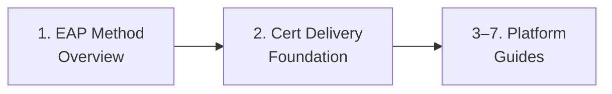
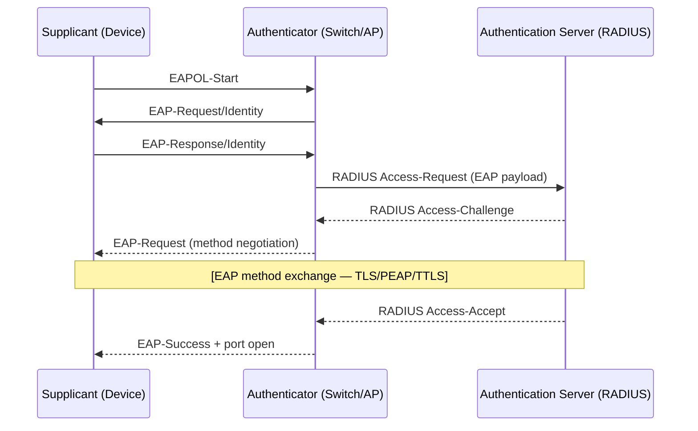

# Phase 101: 802.1X Foundation — Glossary, EAP Methods & Cert Delivery - Research

**Researched:** 2026-06-29
**Domain:** Documentation authoring — 802.1X conceptual foundation (platform-neutral glossary, EAP overview, cert-delivery foundation)
**Confidence:** HIGH — all findings from direct corpus reads and HIGH-confidence milestone research (SUMMARY.md)

---

<user_constraints>
## User Constraints (from CONTEXT.md)

### Locked Decisions

**A2 — `00-overview.md` content:** Thin navigation summary only. Descriptive one-liner per platform guide. The ONLY capability fact permitted: wired-availability flag for gap platforms (Android/Linux) phrased as scope orientation. NO capability table (that is Phase-109 SC3 work).

**B3 — Cert-delivery matrix depth:** Exactly the cells specified in DOT1X-03: macOS/iOS wired = SCEP-only / no PKCS; Windows wired adds PFX Import; Linux = no Intune cert delivery; plus trusted-root support per platform. Plus: hard ordering rule, EKU = Client Authentication, RADIUS server-name validation, Cloud PKI noted as alternative. Boundary note that per-setting UI detail lives in per-platform guides (link-not-copy split).

**C3 — Scope-callout reuse:** Canonical Intune-client-side-only scope callout defined ONCE in the foundation (in `02-cert-delivery-foundation.md` or `00-overview.md`). Exclusion list is exactly: RADIUS/NPS server config; PKI/CA build-out (ADCS/NDES); Certificate Connector install; network switch/AP port config; MAB; Conditional Access network policies; non-co-equal EAP types (EAP-SIM / EAP-FAST / LEAP / TEAP-as-a-path). Phase 101 delivers the canonical section + one-line banner TEMPLATE; Phases 102–106 place the banner in their own guides.

**D-terms-2 (curated) + one-way links + iOS-in-macOS:**
- Term floor (13 terms): 802.1X, EAP, EAPOL, RADIUS, supplicant, SCEP, PKCS, trusted root, server-name validation (DOT1X-01 floor 9) PLUS authenticator, authentication server, EKU/Client Authentication, inner/outer identity.
- Platform-specific terms OUT of the neutral glossary (e.g., `dynamic trust dialog` stays in `_glossary-macos.md`).
- See-also banners one-directional only: existing platform glossaries → `_glossary-network.md`. No back-links from network glossary.
- iOS see-also banner lands in `docs/_glossary-macos.md`. Do NOT create or edit `_glossary-ios.md` — it does not exist.
- Anchor slugs: plain GitHub auto-slugs, no `{#id}` overrides; mind double-hyphen trap.

### Claude's Discretion

Exact prose, callout phrasing, anchor wording, and section ordering within each file — provided the locked decisions and corpus conventions (callout blockquote style, Mermaid setup-sequence in overviews, alphabetical glossary index) are honored.

### Deferred Ideas (OUT OF SCOPE)

- Phase-109 capability matrix rows and nav-hub wiring — NOT Phase 101.
- Per-platform Intune profile steps — Phases 102–106.
- L1/L2 runbooks and decision tree — Phases 107–108.
- RADIUS/NPS server config, PKI/CA build-out, switch/AP config, MAB — out of milestone scope entirely.
- `_glossary-ios.md` creation — file does not exist; iOS see-also banner goes into `_glossary-macos.md` (D-11).
- Phase-109 cross-glossary back-links from `_glossary-network.md` into platform glossaries.
</user_constraints>

---

<phase_requirements>
## Phase Requirements

| ID | Description | Research Support |
|----|-------------|------------------|
| DOT1X-01 | Platform-neutral 802.1X conceptual model (supplicant/authenticator/authentication server; EAPOL; RADIUS exchange) in a new `docs/_glossary-network.md`; see-also banners in existing platform glossaries | Term definitions in §Term Definitions Table; banner insert points in §Banner Insert Specification; house-style conventions in §House-Style Conventions |
| DOT1X-02 | Co-equal EAP-method overview — EAP-TLS (mutual cert), PEAP-MSCHAPv2 (server-cert + tunneled password), EAP-TTLS (server-cert + configurable inner auth) — including when-to-choose and client requirements | EAP per-method spec in §Per-File Authoring Spec (01-eap-method-overview); co-equal template requirement; TEAP exclusion rule |
| DOT1X-03 | Cert-delivery foundation: hard ordering rule (trusted-root → SCEP/PKCS → network profile), EKU = Client Authentication, server-name validation, per-platform cert-delivery support matrix, Cloud PKI noted as alternative | Exact matrix in §Cert Asymmetry Matrix; ordering rule prominence guidance in pitfalls section |
</phase_requirements>

---

## Summary

Phase 101 is a pure documentation-authoring phase. No code is written; no packages are installed. The deliverables are four new Markdown files and see-also banner insertions into four pre-existing glossary files. Every fact needed to author these files is available from the HIGH-confidence milestone research (SUMMARY.md, STACK.md, PITFALLS.md) and from direct inspection of the existing corpus. No additional web research is required for the foundation content.

The key authoring discipline is: the foundation files are the single source of truth for shared 802.1X concepts, and per-platform guides (Phases 102–106) link back to them. Phase 101 must establish the canonical scope callout, EAP co-equal structure, cert ordering rule, and cert matrix — but must NOT author per-platform UI steps, capability matrix rows, or navigation hub entries. Those belong in their owning phases.

The most important fact in the entire 802.1X doc set — the cert deployment ordering rule — must be prominent, not buried. Violating it causes silent Intune "Succeeded" + live auth failure, which is the milestone's top operational risk.

**Primary recommendation:** Author the four files in the order: `_glossary-network.md` first (terms must exist before overview and foundation files reference them), then `00-overview.md`, then `01-eap-method-overview.md`, then `02-cert-delivery-foundation.md`. Apply glossary banners after all four new files are committed (navigation-last for banner edits that reference the new file).

---

## Architectural Responsibility Map

| Capability | Primary Tier | Secondary Tier | Rationale |
|------------|-------------|----------------|-----------|
| 802.1X conceptual model (3-actor + EAPOL + RADIUS) | Foundation docs (this phase) | Platform glossaries (see-also) | Platform-neutral; single source of truth per link-not-copy |
| EAP method comparison (TLS/PEAP/TTLS) | Foundation docs — 01-eap | Per-platform guides (link back) | Co-equal across all platforms; defined once |
| Cert delivery ordering rule + EKU + server-name validation | Foundation docs — 02-cert | Per-platform guides (reference, add platform-specific callout) | Ordering rule is universal; platforms add platform-specific "What breaks" callouts |
| Per-platform cert matrix (SCEP/PKCS/PFX/trusted-root) | Foundation docs — 02-cert (the matrix lives here, per B3) | Per-platform guides (link to matrix, add UI detail) | B3 decision: matrix is homed in 02; guides link back |
| Scope callout (Intune client-side only) | Foundation docs (canonical section) | Per-platform guides (one-line banner links to canonical) | C3: one-definition, many banner-links |
| 802.1X terminology / glossary | `_glossary-network.md` (new) | Platform glossaries (see-also banners) | New cross-platform domain glossary |
| Platform capability matrix 802.1X rows | Phase 109 (navigation-last) | — | Navigation-last hard constraint |
| Nav hub wiring | Phase 109 | — | Navigation-last hard constraint |

---

## Per-File Authoring Spec

### File 1: `docs/_glossary-network.md`

**Governs:** DOT1X-01; decisions D-08, D-09, D-10, D-11
**Create new — does not exist**
**Author first** (overview and foundation files reference its term anchors)

**Front-matter** (match exact schema of existing glossaries — see §House-Style Conventions):
```yaml
---
last_verified: 2026-06-29
review_by: 2026-09-27
applies_to: both
audience: all
platform: all
---
```

**Top blockquote banner** (matches `_glossary-macos.md` / `_glossary-linux.md` pattern):
```
> **Domain coverage:** This glossary covers platform-neutral 802.1X network authentication
> terminology (IEEE 802.1X port-based access control, EAP methods, RADIUS, certificate delivery).
> For platform-specific provisioning terminology, see:
> [Windows Autopilot Glossary](_glossary.md) · [Apple Provisioning Glossary](_glossary-macos.md)
> · [Android Enterprise Glossary](_glossary-android.md) · [Linux Provisioning Glossary](_glossary-linux.md)
```

Note: NO back-links from platform glossaries into `_glossary-network.md` within the network glossary's own banner — those back-links are Phase-109 work (D-10). The platform references above are navigation aids for readers who land in the wrong glossary.

**H1:** `# Network Authentication Glossary`

**Alphabetical index** (see §House-Style Conventions for format): pipe-separated anchor links, one per term, sorted A-Z. Example entry in index: `[802.1X](#8021x)` (note: `.` stripped by GitHub slug algorithm → `#8021x`).

**Sections:** Group terms under logical H2 headings. Suggested grouping:
- `## 802.1X Protocol Actors` — 802.1X, supplicant, authenticator, authentication server, EAPOL
- `## Authentication Methods` — EAP, RADIUS, inner/outer identity
- `## Certificate Delivery` — SCEP, PKCS, trusted root, EKU / Client Authentication, server-name validation

**Exact anchor slugs** (GitHub auto-slug; no `{#id}` overrides; double-hyphen trap applies):
| Heading text | Auto-slug | Notes |
|---|---|---|
| `### 802.1X` | `#8021x` | Period stripped by GitHub |
| `### EAP` | `#eap` | |
| `### EAPOL` | `#eapol` | |
| `### RADIUS` | `#radius` | |
| `### supplicant` | `#supplicant` | |
| `### authenticator` | `#authenticator` | |
| `### authentication server` | `#authentication-server` | |
| `### SCEP` | `#scep` | |
| `### PKCS` | `#pkcs` | |
| `### trusted root` | `#trusted-root` | |
| `### server-name validation` | `#server-name-validation` | |
| `### EKU (Client Authentication)` | `#eku-client-authentication` | Parentheses stripped; no double-hyphen trap |
| `### inner-outer identity` | `#inner-outer-identity` | Use hyphen NOT slash; `inner/outer` → slug `#innerouter-identity` (double-hyphen trap via slash) — write heading as `### inner-outer identity` |

**TRAP WARNING — `inner/outer identity`:** The canonical term name contains a slash. If the H3 heading is `### inner/outer identity`, GitHub strips the slash and produces `#innerouter-identity` (no separator between "inner" and "outer"). Write the heading as `### inner-outer identity` to get the clean slug `#inner-outer-identity`, and note `inner/outer` as the conventional shorthand in the term body.

**Platform-specific terms to EXCLUDE** (decision D-09):
- `dynamic trust dialog` → stays in `_glossary-macos.md`
- `NAC` / MAC randomization specifics → per-platform guides
- `dot3svc` → Windows guide (Phase 102)
- `wpa_supplicant` / `NetworkManager` → Linux guide (Phase 106)
- `nmcli` → Linux guide

---

### File 2: `docs/admin-setup-8021x/00-overview.md`

**Governs:** DOT1X-01 (entry point); decisions A2, D-02
**Create new — folder does not exist** (create `docs/admin-setup-8021x/` first)
**Author second** (after glossary is committed)

**Front-matter:**
```yaml
---
last_verified: 2026-06-29
review_by: 2026-09-27
applies_to: both
audience: admin
platform: all
---
```

**Top blockquote** (A2-style platform gate — matching `admin-setup-macos/00-overview.md`):
```
> **Guide scope:** This guide set covers 802.1X enterprise network authentication
> configuration for Intune-managed devices — client-side only.
> For protocol terminology, see the [Network Authentication Glossary](../_glossary-network.md).
```

**H1:** `# 802.1X Network Authentication: Admin Setup Guides`

**Intro paragraph:** One sentence stating what 802.1X does and that this folder houses the shared foundation plus per-platform guides.

**`## Setup Sequence`** with Mermaid `graph LR` diagram (matches `admin-setup-macos/00-overview.md` pattern). At Phase 101 commit time, only the two foundation guides exist; per-platform guide nodes are added by Phases 102–106 respectively:

Phase 101 Mermaid (two foundation nodes only):


Note the `C[3–7. Platform Guides]` node is a placeholder label with no file link; Phase 102 will add the first real platform node. This avoids broken links (C13 check) while giving readers orientation.

**Numbered list:** One-liner per guide with bold linked title and description. At Phase 101:
1. `**[EAP Method Overview](01-eap-method-overview.md)**` — EAP-TLS, PEAP-MSCHAPv2, and EAP-TTLS presented co-equally: what authenticates, client requirements, trust requirements, and when to choose each.
2. `**[Certificate Delivery Foundation](02-cert-delivery-foundation.md)**` — Deployment ordering (trusted-root profile → SCEP/PKCS client cert → network profile), EKU requirements, RADIUS server-name validation, and the per-platform cert-delivery support matrix.
3–7. Platform guides *(Phase 102–106)* — entries added as each guide is authored.

**A2 wired-availability flags** (decision D-02 — the ONLY capability fact permitted here):
Add a brief blockquote after the numbered list:
```
> **Wired 802.1X availability note:** Android Enterprise has no native Intune wired-network
> profile type — Wi-Fi only; see the Android guide for details. Linux has no native Intune
> Wi-Fi or wired profile — script-based EAP-TLS only; see the Linux guide for details.
```

**`## Scope`** — One-line canonical scope callout linking to the canonical section in `02-cert-delivery-foundation.md` (C3). Or, optionally, host the canonical section here and have `02-` link to it. Decision: host in `02-cert-delivery-foundation.md` per C3 (that file carries the full exclusion list); `00-overview.md` carries a brief "Intune client-side only — RADIUS/NPS assumed to exist" sentence that links to the canonical section.

**`## See Also`** and **Change history table** at bottom (matches macOS overview pattern).

---

### File 3: `docs/admin-setup-8021x/01-eap-method-overview.md`

**Governs:** DOT1X-02; decisions D-08 (uses glossary terms), E-06 (co-equal EAP)
**Create new**
**Author third** (after glossary and overview are committed)

**Front-matter:**
```yaml
---
last_verified: 2026-06-29
review_by: 2026-09-27
applies_to: both
audience: admin
platform: all
---
```

**Top blockquote** (prerequisites):
```
> **Prerequisites:** Read the [Network Authentication Glossary](../_glossary-network.md)
> for 802.1X, EAP, RADIUS, supplicant, and authentication server definitions before this guide.
```

**H1:** `# 802.1X EAP Method Overview`

**`## The 802.1X Three-Actor Model`** — Explain supplicant / authenticator / authentication server with EAPOL flow. Reference `_glossary-network.md` term anchors (link, not copy). The conceptual model (Client → Switch/AP → RADIUS) should be visualized with a Mermaid sequence diagram. Suggested:



**`## EAP-TLS`** — Co-equal H2 section
- What authenticates: mutual certificate — supplicant presents client cert; RADIUS presents server cert; both sides validate
- Client requires: client certificate (from SCEP or PKCS profile) + trusted root for RADIUS server cert
- Trust requirements: RADIUS must trust the CA that issued the client cert; client must trust the CA that issued the RADIUS server cert
- Identity privacy: configure outer identity to "anonymous" — real identity is inside TLS tunnel
- When to choose: highest security; certificate infrastructure already deployed; no password dependency; preferred for machine authentication

**`## PEAP-MSCHAPv2`** — Co-equal H2 section
- What authenticates: server presents cert (outer TLS); user authenticates with domain credentials (MSCHAPv2) inside tunnel
- Client requires: trusted root for RADIUS server cert; domain username/password (or device credential)
- Trust requirements: client must validate RADIUS server cert (server validation MUST be enabled — never disable)
- Security callout: `PerformServerValidation = false` in Windows EAP XML + no server name = rogue RADIUS attack surface (pitfall C-02). Example code MUST NEVER show server validation disabled.
- When to choose: no client cert infrastructure; password-based environments; faster to deploy than EAP-TLS

**`## EAP-TTLS`** — Co-equal H2 section
- What authenticates: server presents cert (outer TLS); inner auth method (PAP / CHAP / MS-CHAP / MS-CHAPv2) carries credentials inside tunnel
- Client requires: trusted root for RADIUS server cert; credentials for inner method
- Inner method coordination: inner auth method must match RADIUS/NPS policy (mismatch causes post-tunnel failure — pitfall C-03)
- Platform note: Android Enterprise EAP-TTLS supports PAP / MS-CHAP / MS-CHAPv2 inner — CHAP NOT supported
- When to choose: RADIUS supports multiple inner auth methods; need flexibility in inner credential type; similar to PEAP but with more inner method options

**`## TEAP` — ONE PARAGRAPH ONLY (not a co-equal section)**
Brief awareness note: Tunneled EAP (TEAP) is visible in the Windows Intune wired-network profile UI and is unique to Windows wired. It is not a co-equal path in this guide set. See the Windows guide (Phase 102) for a one-paragraph awareness note.

**`## EAP Method Comparison`** — Summary table:
| Property | EAP-TLS | PEAP-MSCHAPv2 | EAP-TTLS |
|---|---|---|---|
| Client cert required | Yes | No | No |
| Server cert required | Yes | Yes | Yes |
| Inner credential | None (cert-only) | Domain username/password | PAP / MS-CHAP / MS-CHAPv2 |
| Identity privacy | Outer identity config | Outer identity config | Outer identity config |
| Intune support | Win / macOS / iOS / Android / Linux* | Win / macOS / iOS / Android / Linux* | Win / macOS / iOS / Android |
| Wired support | Win / macOS / iOS | Win / macOS / iOS | Win / macOS / iOS |

*Linux = script-based EAP-TLS only; PEAP/TTLS not in Microsoft documentation (out of scope).

**`## Canonical Scope Callout`** — (Alternatively homed in `02-cert-delivery-foundation.md` — see C3 note. If here, the canonical section ID must be cross-referenceable via anchor.) The canonical scope callout text is specified in §Canonical Scope Callout Text below.

---

### File 4: `docs/admin-setup-8021x/02-cert-delivery-foundation.md`

**Governs:** DOT1X-03; decisions B3, D-04, D-05, C3
**Create new**
**Author fourth** (after glossary, overview, and EAP overview are committed)

**Front-matter:**
```yaml
---
last_verified: 2026-06-29
review_by: 2026-09-27
applies_to: both
audience: admin
platform: all
---
```

**Top blockquote** (prerequisites):
```
> **Prerequisites:** Read [EAP Method Overview](01-eap-method-overview.md) first.
> For certificate term definitions, see [Network Authentication Glossary](../_glossary-network.md#scep).
```

**H1:** `# 802.1X Certificate Delivery Foundation`

**`## Canonical Scope Callout`** (C3 — define once here)
Use a `> **Scope:**` blockquote callout:
```
> **Scope — Intune client-side configuration only.** These guides cover what you configure in
> Intune on the managed device. The following are explicitly OUT OF SCOPE:
> - RADIUS/NPS server installation, connection-request policies, and network policies
> - PKI/CA infrastructure build-out (ADCS, NDES installation and configuration)
> - Certificate Connector installation and maintenance
> - Network switch or wireless AP port configuration (VLAN assignment, port auth mode)
> - MAC Authentication Bypass (MAB)
> - Conditional Access network-based policies
> - Non-co-equal EAP types: EAP-SIM, EAP-FAST, LEAP, TEAP-as-a-path
>
> This guide assumes a RADIUS server already exists and is reachable from managed devices.
```

The C3 one-line banner template for per-platform guides (to be placed by Phases 102–106):
```markdown
> **Scope:** Intune client-side only. See [scope details](../admin-setup-8021x/02-cert-delivery-foundation.md#canonical-scope-callout).
```

**`## The Deployment Ordering Rule`** — MUST be first substantive content section, prominently callout-boxed.

Use a `> **CRITICAL — Ordering:**` blockquote (corpus uses `> **Label:**` blockquotes, not `:::` admonitions):
```
> **CRITICAL — Deployment ordering:** Always assign profiles in this sequence and confirm
> each reaches "Succeeded" across target devices before assigning the next:
>
> 1. **Trusted Root Certificate profile** (RADIUS server CA) → wait for "Succeeded"
> 2. **SCEP or PKCS client certificate profile** → wait for "Succeeded" + cert enrolled
> 3. **802.1X Wi-Fi or Wired network profile**
>
> Violating this order produces silent Intune "Succeeded" status while devices fail to
> authenticate. Intune does not enforce dependency ordering between profiles.
```

**`## Trusted Root Certificate Profile`**
- Purpose: delivers the root CA cert that signed the RADIUS server's certificate
- Required on: Windows, macOS, iOS/iPadOS, Android Enterprise (not supported on Linux via Intune)
- Create as: Configuration profile → Templates > Trusted certificate
- Assignment: must cover the same device/user groups as the SCEP/PKCS and 802.1X profiles

**`## SCEP Certificate Profile`**
- Purpose: delivers per-device client identity certificates automatically from CA (via NDES/SCEP)
- Required EKU: Client Authentication (OID 1.3.6.1.5.5.7.3.2) — MUST be set explicitly
- Subject SAN: for Android Enterprise personally-owned work profile, SAN must include UPN (profile deployment fails if absent)
- Renewal threshold: set to 20% (renews at 80% of cert lifetime)
- Supported platforms: Windows, macOS, iOS/iPadOS, Android Enterprise; NOT Linux (no Intune cert profiles)

**`## PKCS Certificate Profile`**
- Purpose: delivers CA-issued certificates via Intune Certificate Connector (PKCS#12 format)
- Supported for 802.1X client certs: Windows (Wi-Fi + Wired), macOS (Wi-Fi only), iOS/iPadOS (Wi-Fi only), Android Enterprise Wi-Fi
- NOT supported: macOS wired profiles, iOS/iPadOS wired profiles, Linux

**`## PFX Import (PKCS Imported) Certificate Profile`**
- Unique to: Windows wired network profile UI (only platform that exposes this in the wired profile)
- Use case: importing pre-generated PFX bundles for specific identity scenarios
- Note: NOT typically the first choice for standard 802.1X deployments; SCEP is preferred

**`## EKU Requirement: Client Authentication`**
- Every client certificate used for 802.1X MUST include EKU = Client Authentication (OID 1.3.6.1.5.5.7.3.2)
- Verify in SCEP profile: Extended Key Usage section must explicitly include "Client Authentication"
- Missing EKU → RADIUS returns Access-Reject → device sees "Authentication Failed"

**`## RADIUS Server-Name Validation`**
- Always populate "Certificate server names" with RADIUS server FQDN or CN suffix
- Always set "Perform server validation" to enabled
- Always reference a trusted root certificate for RADIUS server validation
- Android 11+ requirement: RADIUS server name field is required (not optional) for new Wi-Fi profiles
- Android 14+ constraint: total combined RADIUS server name length ≤ 256 chars; no special characters

**`## Cloud PKI (Alternative)`**
- Microsoft Intune Suite includes Cloud PKI (formerly "EZCMS") as a managed CA-in-the-cloud alternative to on-premises ADCS/NDES
- Cloud PKI can issue SCEP-based client certificates without an on-premises NDES server
- Full Cloud PKI configuration is out of scope for this guide set; see Microsoft Learn for Cloud PKI setup

**`## Per-Platform Cert-Delivery Support Matrix`** — (B3 decision: this matrix lives here)

See §Cert Asymmetry Matrix for exact table. Insert the table with the ordering note and a boundary callout:
```
> **Boundary:** This matrix shows which cert delivery methods Intune supports per platform at
> the foundation level. Per-platform guides (Phases 102–106) document the exact Intune UI
> fields, settings, and profile configuration steps. Do not duplicate that detail here.
```

---

## Term Definitions Table

The following definitions are for `docs/_glossary-network.md`. All are sourced from SUMMARY.md/PITFALLS.md (HIGH confidence, verified against Microsoft Learn 2026-06-29) and/or direct protocol specs.

| Term | H3 Heading | Slug | Definition |
|---|---|---|---|
| 802.1X | `### 802.1X` | `#8021x` | IEEE 802.1X — standard for port-based network access control (NAC). Governs the authentication exchange between a supplicant (device), an authenticator (switch port or wireless access point), and an authentication server (RADIUS) that determines whether a device is allowed onto a network segment. The "port" may be a physical Ethernet port or a logical 802.11 wireless association. 802.1X is the container; EAP is the authentication framework carried inside it. [VERIFIED: Microsoft Learn, verified 2026-06-29] |
| EAP | `### EAP` | `#eap` | Extensible Authentication Protocol — authentication framework carried over 802.1X (as EAPOL frames on the wire). EAP does not define an authentication algorithm; it defines a negotiation mechanism that allows different authentication methods (EAP-TLS, PEAP, EAP-TTLS, etc.) to be used. The supplicant and authentication server negotiate which EAP method to use before the actual credential exchange occurs. [VERIFIED: Microsoft Learn, verified 2026-06-29] |
| EAPOL | `### EAPOL` | `#eapol` | EAP over LAN — the IEEE 802.1X Layer-2 encapsulation that carries EAP frames directly over Ethernet or Wi-Fi without requiring IP connectivity. The exchange between supplicant and authenticator (switch/AP) uses EAPOL frames. The authenticator then relays the EAP payload to the RADIUS server using RADIUS packets over IP. EAPOL is why 802.1X authentication can happen before the device has an IP address. [ASSUMED: standard protocol knowledge; no direct Microsoft Learn citation for EAPOL definition isolated from 802.1X context] |
| RADIUS | `### RADIUS` | `#radius` | Remote Authentication Dial-In User Service (RFC 2865) — the network protocol and server role that receives authentication requests forwarded by the authenticator (switch/AP) and makes the Access-Accept or Access-Reject decision. In Intune-managed environments, RADIUS is assumed to already exist (Windows NPS or a third-party RADIUS server); these guides cover only the Intune client-side configuration, not RADIUS server setup. [VERIFIED: Microsoft Learn, verified 2026-06-29] |
| supplicant | `### supplicant` | `#supplicant` | The 802.1X client — the device requesting network access. The supplicant initiates the EAPOL exchange and responds to the authenticator's EAP challenges. Platform implementations: Windows uses the WLAN-AutoConfig service (Wi-Fi) and Wired AutoConfig (dot3svc) service (wired); macOS and iOS/iPadOS use the built-in OS supplicant; Android uses the Wi-Fi supplicant stack; Linux uses wpa_supplicant or NetworkManager with 802-1x settings. [VERIFIED: Microsoft Learn, verified 2026-06-29] |
| authenticator | `### authenticator` | `#authenticator` | The network device (Ethernet switch port or wireless access point) that enforces 802.1X. The authenticator acts as a relay between the supplicant and the authentication server: it passes EAPOL frames from the supplicant to the RADIUS server and opens or closes the port based on the authentication outcome. Authenticator configuration (port auth mode, VLAN assignment, MAB fallback) is the network infrastructure team's responsibility and is out of scope for these Intune guides. [VERIFIED: Microsoft Learn, verified 2026-06-29] |
| authentication server | `### authentication server` | `#authentication-server` | The server that evaluates the supplicant's identity and issues an Access-Accept or Access-Reject. Typically a RADIUS server. In Microsoft environments, this is Windows Server Network Policy Server (NPS); in mixed environments it may be a third-party RADIUS product (Cisco ISE, Aruba ClearPass, etc.). Authentication server configuration is out of scope for these guides. [VERIFIED: Microsoft Learn, verified 2026-06-29] |
| SCEP | `### SCEP` | `#scep` | Simple Certificate Enrollment Protocol — a protocol for requesting and automatically renewing X.509 certificates from a CA. In Microsoft environments, SCEP is served by the Network Device Enrollment Service (NDES) role. Intune SCEP profiles deliver per-device client certificates to managed devices automatically without manual PFX export. Supported platforms: Windows, macOS, iOS/iPadOS, Android Enterprise. Not available via Intune for Linux. [VERIFIED: Microsoft Learn certificates/scep-profiles, verified 2026-06-29] |
| PKCS | `### PKCS` | `#pkcs` | Public Key Cryptography Standards — in the Intune context, refers to PKCS certificate profiles (PKCS #12 / PFX format) delivered via the Intune Certificate Connector. PKCS client certificates are supported for 802.1X on Windows and Android Enterprise (Wi-Fi + Wired for Windows; Wi-Fi only for Android). PKCS certificates are NOT supported for wired profiles on macOS or iOS/iPadOS — SCEP only is supported for those wired profiles. [VERIFIED: Microsoft Learn certificates/overview, verified 2026-06-29] |
| trusted root | `### trusted root` | `#trusted-root` | A Trusted Certificate profile in Intune that delivers a root CA certificate to managed devices. In the 802.1X context, this is the root CA that signed the RADIUS server's certificate; it must be deployed to the device so the supplicant can validate the RADIUS server's identity during TLS negotiation. Must be deployed BEFORE the SCEP/PKCS client cert profile and the 802.1X network profile (see ordering rule). Supported on Windows, macOS, iOS/iPadOS, Android Enterprise. Not supported on Linux via Intune. [VERIFIED: Microsoft Learn certificates/trusted-root-profiles, verified 2026-06-29] |
| server-name validation | `### server-name validation` | `#server-name-validation` | The 802.1X profile configuration that specifies the expected FQDN or CN of the RADIUS server's certificate. The supplicant validates that the RADIUS server's certificate subject matches this value during EAP TLS negotiation, preventing rogue-RADIUS man-in-the-middle attacks. Required on Android 11+ (field must be populated; profiles without it may not connect). Android 14+ constraint: total combined RADIUS server names ≤ 256 characters; no special characters. Always populate this field — leaving it blank with server validation enabled is a misconfiguration. [VERIFIED: Microsoft Learn ref-wifi-settings-android-enterprise, verified 2026-06-29] |
| EKU (Client Authentication) | `### EKU (Client Authentication)` | `#eku-client-authentication` | Extended Key Usage (EKU) is an X.509 certificate extension that declares the purpose(s) for which a certificate may be used. The Client Authentication EKU (OID 1.3.6.1.5.5.7.3.2) must be present on the client certificate used for 802.1X EAP-TLS authentication. The RADIUS server checks the EKU to confirm the certificate is authorized for client authentication; a missing EKU causes the RADIUS server to return Access-Reject. Set explicitly in the Intune SCEP profile under Extended Key Usage. [VERIFIED: Microsoft Learn certificates/scep-profiles, verified 2026-06-29] |
| inner-outer identity | `### inner-outer identity` | `#inner-outer-identity` | In tunneled EAP methods (PEAP, EAP-TTLS), the "outer identity" is sent before the TLS tunnel is established and is visible in cleartext on the network segment. The "inner identity" is the real user credential, sent inside the encrypted TLS tunnel. Configure the outer identity to an anonymous value (e.g., "anonymous" or "anonymous@domain.com") to prevent credential-related PII from being observable before the tunnel is established. Known in Intune profile UI as "Identity privacy" or "Outer identity." Also applies to EAP-TLS where the outer identity is taken from the certificate subject. [VERIFIED: Microsoft Learn ref-wifi-settings-android-enterprise, ref-wifi-settings-windows, verified 2026-06-29] |

---

## Cert Asymmetry Matrix

**This exact table belongs in `docs/admin-setup-8021x/02-cert-delivery-foundation.md` (B3 decision). Do not place it anywhere else in Phase 101.**

Source: SUMMARY.md Per-Platform Coverage-Reality Matrix (HIGH confidence, verified Microsoft Learn 2026-06-29).

| Platform | Wired Profile | SCEP (client cert) | PKCS (client cert) | PFX Import / PKCS Imported | Trusted Root |
|---|---|---|---|---|---|
| **Windows** | YES — WiredNetwork CSP | Yes | Yes (wired + Wi-Fi) | **Yes — wired only, unique to Windows wired profile UI** | Yes |
| **macOS** | YES — Templates > Wired network | Yes | Wi-Fi only — **NOT supported for wired profiles** | Wi-Fi only | Yes |
| **iOS/iPadOS** | YES — GA on M-series iPad (USB Ethernet) | Yes | Wi-Fi only — **NOT supported for wired profiles** | Wi-Fi only, non-AOSP | Yes |
| **Android Enterprise** | **NO native wired profile type** — gap stub only | Yes (Wi-Fi) | Yes (Wi-Fi, non-AOSP) | Wi-Fi only, non-AOSP | Yes |
| **Linux** | **NO native Intune profile** — script-based only | **NO — no Intune cert profiles for Linux** | NO | NO | **NO — not supported via Intune** |

**Key asymmetries (stated verbatim in DOT1X-03):**
- macOS/iOS wired = SCEP-only / no PKCS
- Windows wired adds PFX Import (unique)
- Linux = no Intune cert delivery of any kind

**Required foundation-file facts (DOT1X-03 mandates):**
1. Hard ordering rule: trusted-root profile → SCEP/PKCS client cert → 802.1X network profile
2. EKU = Client Authentication (OID 1.3.6.1.5.5.7.3.2)
3. RADIUS server-name validation (always populate — required on Android 11+)
4. Cloud PKI noted as alternative CA delivery approach (not a full guide)

---

## Banner Insert Specification

**Four existing files receive one-directional see-also banners (D-10, D-11). `_glossary-ios.md` does NOT exist — confirmed by glob listing of `docs/_glossary*.md`:**

Confirmed existing glossary files (from `glob docs/_glossary*.md`):
1. `docs/_glossary.md` (Windows Autopilot Glossary)
2. `docs/_glossary-macos.md` (Apple Provisioning Glossary — includes iOS/iPadOS, D-11)
3. `docs/_glossary-android.md` (Android Enterprise Provisioning Glossary)
4. `docs/_glossary-linux.md` (Linux Provisioning Glossary)
5. `docs/_glossary-apple-business.md` (Apple Business Governance — does NOT receive a banner; domain-specific, not a platform provisioning glossary)

**Banner text template** (one-line `>` continuation appended to end of existing top blockquote):
```
> **802.1X / Network authentication:** For 802.1X protocol terminology (EAP methods, RADIUS, supplicant, SCEP, PKCS, trusted root, server-name validation), see the [Network Authentication Glossary](_glossary-network.md).
```

**Insert location per file** (executor: read each file fresh to confirm exact line; approximate positions from 2026-06-29 corpus read):

| File | Insert After | Approximate Line | Notes |
|---|---|---|---|
| `docs/_glossary.md` | Last line of top blockquote (currently: `> **Apple Business governance:** ...`) | ~line 12 | Blockquote precedes `# Autopilot Glossary` H1 |
| `docs/_glossary-macos.md` | Last line of top blockquote (currently: `> **Apple Business governance:** ...`) | ~line 11 | Carries both macOS AND iOS/iPadOS (D-11); one banner covers both platforms |
| `docs/_glossary-android.md` | Last line of top blockquote (currently: `> **Apple Business governance:** ...`) | ~line 13 | Blockquote appears AFTER the H1, before `## Alphabetical Index` — different structure from other glossaries |
| `docs/_glossary-linux.md` | Last line of top blockquote (currently: `> **Apple Business governance:** ...`) | ~line 11 | Blockquote precedes `# Linux Provisioning Glossary` H1 |

**iOS banner note (D-11):** `_glossary-macos.md` already self-scopes as covering "macOS and iOS/iPadOS." The single see-also banner insert at line ~11 of `_glossary-macos.md` covers the iOS/iPadOS see-also requirement. No other action required for iOS terminology.

**Navigation-last ordering for banners:** Commit the four new files first. Apply banner edits after the new files are committed to disk (banners reference `_glossary-network.md` which must exist before links can resolve). Recommended: separate commit for the four new files, then a second commit for the four banner insertions.

**`last_verified` / `review_by` update on banner edits:** Each glossary file whose blockquote is modified should have its `last_verified` updated to the Phase 101 authoring date and `review_by` set to +90 days (2026-09-27). This avoids triggering freshness-staleness checks.

---

## House-Style Conventions

**All findings from direct corpus reads — VERIFIED.**

### Front-Matter Schema

Exact field order and values from existing glossary files:
```yaml
---
last_verified: YYYY-MM-DD        # date file was last reviewed against official sources
review_by: YYYY-MM-DD            # last_verified + 90 days (standard cadence)
applies_to: both                 # or: ADE, apple-business, etc.
audience: all                    # or: admin, l1, l2
platform: all                    # or: macOS, Linux, ios+macos, etc.
---
```

For the four new Phase 101 files:
- `last_verified: 2026-06-29` (Phase 101 authoring date)
- `review_by: 2026-09-27` (90-day cadence)
- `applies_to: both` (Wi-Fi + wired)
- `audience: all` (glossary); `admin` (admin-setup guides)
- `platform: all`

Note: `_glossary-android.md` has an extra `phase_46_wave2_retrofit: 2026-04-25` field — this is a one-off tracking field from a prior milestone. Do not add similar custom fields to the new glossary.

### Callout/Blockquote Convention

Corpus uses `> **Label:** text` blockquotes — NOT `:::` admonitions or HTML `<div>` wrappers. Examples from corpus:
- `> **Platform gate:**` (admin-setup-macos/00-overview.md)
- `> **Platform coverage:**` (glossary banner)
- `> **Windows equivalent:**` (cross-platform note within a term)
- `> **APv2 note:**` (framework-specific note within a term)

For Phase 101 files, use:
- `> **CRITICAL — Ordering:**` for the cert ordering rule (highest-severity callout)
- `> **Scope:**` for the Intune-client-side-only scope callout
- `> **Prerequisites:**` for prerequisite banners at top of foundation files
- `> **Wired 802.1X availability note:**` for the A2 wired gap flag in 00-overview

Do NOT use emoji in callouts — project instruction.

### Mermaid Diagram Format

From `admin-setup-macos/00-overview.md` (exact match):
- `graph LR` (left-to-right) for setup sequences
- Node labels: `A[1. Short<br/>Label]` (two-line labels with `<br/>`)
- Arrows: `A --> B`
- For 802.1X concept diagrams (EAPOL flow), use `sequenceDiagram` with `participant` declarations

### Alphabetical Index Format

From `_glossary-macos.md` (exact match, line 17):
```
[TermA](#terma-slug) | [TermB](#termb-slug) | [TermC](#termc-slug)
```
Single line, pipe-separated, alphabetical by term. The index line does NOT wrap — it is a single long line in the Markdown source. Each `[Term](#slug)` link uses the exact anchor slug (see §Term Definitions Table for 802.1X term slugs).

### See-Also Format Within Term Entries

From `_glossary-macos.md` entry examples:
```
> **Windows equivalent:** [term](_glossary.md#slug) -- explanation.
> See also: [term](_glossary-other.md#slug) (Platform).
```

From `_glossary-apple-business.md` top banner:
```
> See also: [Windows Autopilot Glossary](_glossary.md) · [Android Enterprise Glossary](_glossary-android.md) · [Linux Provisioning Glossary](_glossary-linux.md)
```

For cross-glossary see-also within individual term definitions in `_glossary-network.md`: follow the `> See also:` pattern from existing entries.

### Freshness Stamps

- File-level stamps: YAML front matter `last_verified` + `review_by`
- Per-section inline stamps (for version-gated content): use a blockquote:
  ```
  > *Freshness: last verified 2026-06-29 against Microsoft Learn. Review by 2026-09-27.*
  ```
- Phase 101 foundation files have NO version-gated per-section content requiring inline stamps (the Android 11+/14+ version-gating is in per-platform guides, not the foundation). The cert matrix is cross-platform and not version-gated at the cell level.
- Exception: the Android 11+ server-name requirement note in `02-cert-delivery-foundation.md` should carry an inline freshness stamp since it is version-gated.

### Change History Table

From `admin-setup-macos/00-overview.md` (bottom of file):
```markdown
| Date | Change | Author |
|------|--------|--------|
| YYYY-MM-DD | Initial version — description | -- |
```

Add to all four new files. Author column is `--` (same pattern as existing corpus).

### Descriptive One-Liner Format (for 00-overview numbered list)

From `admin-setup-macos/00-overview.md` pattern:
```
1. **[Guide Title](filename.md)** -- Description of what the guide covers and why it matters. Specific callout of any unique constraint or caveat.
```

Use `--` (double hyphen) as separator, not `—` (em dash). Match existing corpus exactly.

---

## Harness / Allowlist Constraint

**Source: direct read of `scripts/validation/v1.13-audit-allowlist.json`**

**Critical constraint for planner:**

The see-also banner insertions into `docs/_glossary-android.md` and the other existing glossary files will shift line numbers of existing corpus entries. Specifically, `_glossary-android.md` has the following exemption line numbers tracked in `v1.13-audit-allowlist.json`:
- `safetynet_exemptions`: lines 186, 201 (in _glossary-android.md)
- `supervision_exemptions`: lines 17, 50, 70, 80, 82, 83, 182, 196, 198, 199
- `c7_knox_allowlist`: lines 122, 124, 126, 198
- `c9_exemptions`: line 203

**Each banner line inserted into `_glossary-android.md` will shift all tracked line numbers above the insertion point by +1.**

**Resolution path (not Phase 101's responsibility):** The `v1.13-audit-allowlist.json` is a FROZEN surface — must not be modified (byte-unchanged invariant). Phase 112 creates the NEW `v1.14-audit-allowlist.json` which will carry the updated line numbers. The Phase 101 plan does NOT need to create or modify any allowlist file. Phase 112 must compute the correct post-insertion line numbers for `_glossary-android.md` and any other edited glossary.

**Action for Phase 101 plan:** In the plan task for banner insertions, note the approximate number of lines inserted (1 per glossary file = 1 line shift per file) so Phase 112 can update the allowlist accurately.

**FROZEN surface check:** `v1.13-audit-allowlist.json` itself must NOT be touched in Phase 101 or any phase before Phase 112.

**New files are not frozen surfaces:** The four new Phase 101 files (`_glossary-network.md`, `00-overview.md`, `01-eap-method-overview.md`, `02-cert-delivery-foundation.md`) do not require allowlist entries themselves — they are net-new files and will have their own `check-phase-101.mjs` validator authored in Phase 112.

---

## Canonical Scope Callout Text

*The exact exclusion list (decision D-07) for the canonical scope callout in `02-cert-delivery-foundation.md`:*

```
> **Scope — Intune client-side configuration only.** These guides cover configuring managed
> devices via Intune. The following are OUT OF SCOPE for this guide set:
> - RADIUS/NPS server configuration (connection-request policies, network policies, server certificates)
> - PKI/CA infrastructure build-out (ADCS installation, NDES configuration, CA hierarchy design)
> - Intune Certificate Connector installation and maintenance
> - Network switch or wireless access point port configuration (port authentication mode, VLAN assignment, dynamic ACLs)
> - MAC Authentication Bypass (MAB) — a server-side / switch-side concern
> - Conditional Access network-based policies
> - Non-co-equal EAP types: EAP-SIM, EAP-FAST, LEAP — not verifiable against Microsoft documentation; TEAP — Windows-wired-only awareness note, not a co-equal guide path
>
> **Assumed:** A RADIUS/NPS server already exists and is reachable from managed devices before
> any Intune 802.1X profile configuration begins.
```

The one-line banner template for Phases 102–106 to place at the top of each per-platform guide:
```markdown
> **Scope:** Intune client-side configuration only. RADIUS/NPS server assumed to exist. [Full scope exclusion list](02-cert-delivery-foundation.md#canonical-scope-callout).
```

---

## Common Pitfalls for Foundation File Authors

These pitfalls from PITFALLS.md are directly relevant to Phase 101 authoring:

**A-01 (Trust-before-profile ordering):** The ordering rule must be prominently placed in `02-cert-delivery-foundation.md` — not buried. Use a prominent `> **CRITICAL:**` blockquote, not inline prose. The ordering rule is the most consequential fact in the doc set.

**A-05 / C-02 (Server validation disabled):** The PEAP overview in `01-eap-method-overview.md` MUST NOT show any example configuration with server validation disabled. This includes: no XML snippets with `PerformServerValidation=false`, no callouts suggesting "temporarily disable for testing." The PEAP section must state: server validation is required; the default Windows EAP XML skeleton has it disabled — override it.

**E-01 (Scope creep):** The canonical scope callout must be present in `02-cert-delivery-foundation.md`. Do not include any RADIUS/NPS configuration steps, even as "context" or "for reference."

**E-02 (Link-not-copy):** `01-eap-method-overview.md` and `02-cert-delivery-foundation.md` are the canonical sources. They must NOT duplicate each other's content — `01-` focuses on EAP methods; `02-` focuses on certificate delivery. Cross-reference between them via links.

**E-06 (Co-equal EAP treatment):** `01-eap-method-overview.md` must give EAP-TLS, PEAP-MSCHAPv2, and EAP-TTLS equal section depth. The comparison table must have equal columns for each. No H2 heading for one method vs H3 for another.

**D-09 (Platform-specific terms out of neutral glossary):** Reviewers should check: does any term entry in `_glossary-network.md` reference Apple-specific, Windows-specific, or Android-specific implementation details in the definition body? Those details belong in per-platform guides. The definition should be protocol-level.

---

## Open Questions / Planning Decision Points

1. **`00-overview.md` guide entries for Phase 101 only vs. all phases:** The macOS overview precedent shows guides were added incrementally (Phase 76 added guides 07-09, etc.). For 802.1X, Phase 101 can either: (a) create the overview with ONLY the two foundation guide entries that exist at commit time, and have Phases 102-106 add their own entries; or (b) include all seven entries as stubs (risky: C13 broken-link check will fail on files that don't exist yet). **Recommended:** option (a) — Phase 101 overview contains only foundation entries + a placeholder Mermaid node. Add explicit "update 00-overview.md" tasks to Phases 102-106 plans.

2. **`01-eap-method-overview.md` vs. `02-cert-delivery-foundation.md` as home for the canonical scope callout (C3):** CONTEXT.md D-06 says "defined once, canonically, in the foundation." Either file qualifies as "the foundation." Recommended: home it in `02-cert-delivery-foundation.md` (prerequisites are naturally the first thing in a cert-delivery guide; readers arriving at the cert file will see the scope early). `01-eap-method-overview.md` can carry a brief forward-reference.

3. **Alphabetical index in `_glossary-network.md`:** 13 terms, A-Z order: 802.1X, authenticator, authentication server, EAP, EAPOL, EKU (Client Authentication), inner-outer identity, PKCS, RADIUS, SCEP, server-name validation, supplicant, trusted root. Confirm final sort order at authoring time (numeric "802.1X" sorts before alpha entries in most index conventions — match the pattern used in `_glossary-macos.md` where `[ABM](#abm)` leads the index).

4. **STATE.md references `docs/_glossary-ios.md` in the Phase 101 MODIFIED list (line 47-48):** This is a STATE.md artifact written before the D-11 decision was locked. `_glossary-ios.md` DOES NOT EXIST (confirmed by glob). The executor must NOT create or edit it. The iOS see-also banner goes into `_glossary-macos.md` only. Flag for correction in STATE.md or ROADMAP.md at Phase 109 (per CONTEXT.md deferred section).

5. **`_glossary-apple-business.md` receives no banner:** Confirmed — this is the Apple Business governance glossary, not a platform provisioning glossary. It does not need an 802.1X see-also banner.

---

## Environment Availability

SKIPPED — Phase 101 is pure Markdown authoring. No external tools, services, runtimes, or CLI utilities are required. No packages to install.

---

## Package Legitimacy Audit

SKIPPED — No packages are installed in this phase.

---

## Validation Architecture

Phase 101 creates documentation files only. No automated test suite applies to Markdown content at execution time. The audit harness validator for Phase 101 (`check-phase-101.mjs`) is authored in Phase 112 (harness bump, navigation-last), not in Phase 101. The harness C-series checks that DO apply to the new files:

- **C13 (broken links):** All links in the four new files must resolve. Specifically: `00-overview.md` must only link to files that exist at commit time. See Open Question 1.
- **Freshness checks:** `last_verified` + `review_by` front-matter fields required on all new files.
- **Link-not-copy check (if implemented):** Reviewers should verify no content from `01-eap-method-overview.md` is duplicated in `02-cert-delivery-foundation.md` or vice versa.

Verification at Phase 101 close: manually confirm all four files exist, all internal links resolve, front-matter is complete, and the four see-also banner lines are present in the correct four platform glossary files.

---

## Assumptions Log

| # | Claim | Section | Risk if Wrong |
|---|---|---|---|
| A1 | `EAPOL` definition (standard protocol knowledge — no direct Microsoft Learn citation isolated for EAPOL definition) | Term Definitions Table | Definition is accurate; no planner risk |
| A2 | Approximate line numbers for banner insert locations in glossary files (read from 2026-06-29 corpus snapshot; files may have been modified since) | Banner Insert Specification | Executor must read files fresh before inserting; approximate positions are guidance only |
| A3 | `_glossary-apple-business.md` does not need a see-also banner (inferred from its domain-specific scope) | Banner Insert Specification | Low risk; governance glossary has no provisioning-platform content |
| A4 | The canonical scope callout is best homed in `02-cert-delivery-foundation.md` (Claude's discretion — not locked) | Per-File Authoring Spec / Open Questions | If planner homes it in `01-eap-method-overview.md`, the C3 template anchor path changes |

---

## Sources

### Primary (HIGH confidence — VERIFIED from direct corpus reads)

- `docs/_glossary-macos.md` — front-matter schema, alphabetical index format, `> **Platform coverage:**` / `> **Windows equivalent:**` / `> See also:` blockquote format, self-scoping of iOS/iPadOS terminology, iOS-in-macOS glossary precedent (D-11)
- `docs/_glossary.md` — front-matter schema, `> **Framework coverage:**` banner format
- `docs/_glossary-android.md` — blockquote AFTER H1 (unique structure); exact line positions of banner insert; `phase_46_wave2_retrofit` custom front-matter field
- `docs/_glossary-linux.md` — front-matter with `platform: Linux` specificity; blockquote format
- `docs/_glossary-apple-business.md` — `> See also: [X] · [Y] · [Z]` separator format for see-also multi-links
- `docs/admin-setup-macos/00-overview.md` — Mermaid `graph LR`, `graph LR` node format `A[1. Short<br/>Label]`, numbered list one-liner format with `--` separator, change history table, platform-gate blockquote
- `scripts/validation/v1.13-audit-allowlist.json` — allowlist schema, line-tracking mechanism, `safetynet_exemptions`/`supervision_exemptions`/`c7_knox_allowlist`/`c9_exemptions` structure, `_glossary-android.md` line numbers for harness offset calculation
- Glob of `docs/_glossary*.md` — CONFIRMED: no `_glossary-ios.md` file exists (5 files found; iOS-related content is in `_glossary-macos.md`)
- Glob of `docs/admin-setup-8021x/` — CONFIRMED: folder does not exist; must be created

### Secondary (HIGH confidence — sourced from verified milestone research)

- `.planning/research/SUMMARY.md` — Per-Platform Coverage-Reality Matrix (all cells in §Cert Asymmetry Matrix); 3-actor model; EAP method facts; Linux MEDIUM confidence notation; build order constraint — all verified against Microsoft Learn 2026-06-29
- `.planning/research/PITFALLS.md` — A-01 (ordering), A-05/C-02 (server validation), E-01/E-02/E-06 (scope/link-not-copy/co-equal EAP); A-02 (EKU Client Authentication)
- `.planning/research/ARCHITECTURE.md` — HYBRID file layout; build order; glossary see-also precedent; allowlist note
- `.planning/phases/101-802-1x-foundation-glossary-eap-methods-cert-delivery/101-CONTEXT.md` — all four locked decisions and their exact parameters

### Tertiary

None — all findings confirmed via direct reads or HIGH-confidence milestone research.

---

## RESEARCH COMPLETE
