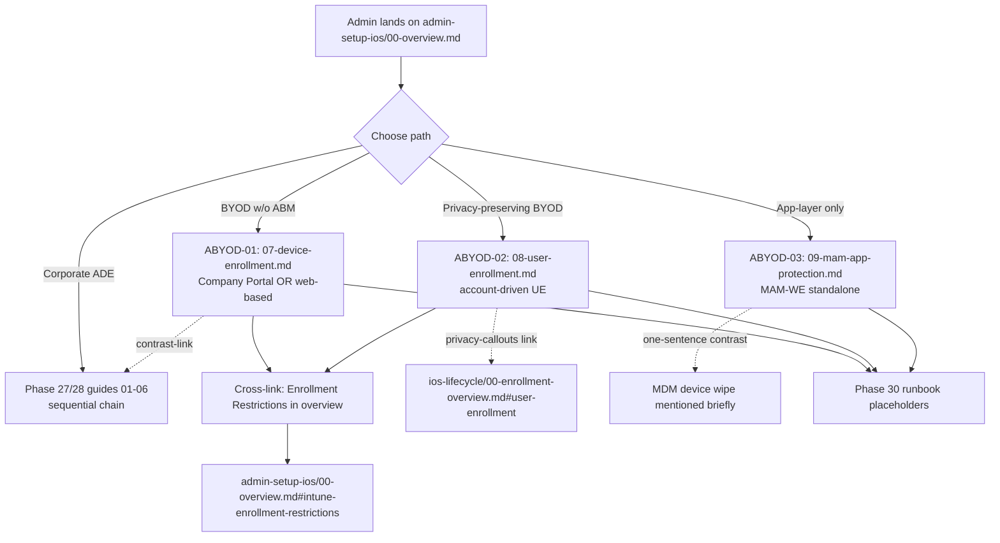

# Phase 29: iOS Admin Setup — BYOD & MAM - Research

**Researched:** 2026-04-17
**Domain:** iOS/iPadOS non-ADE enrollment (Device Enrollment, account-driven User Enrollment, MAM-WE) and App Protection Policies documentation
**Confidence:** HIGH for Microsoft Learn-sourced material (D-30/31/32/33 all verified against current docs); MEDIUM for Apple Platform Deployment nuances where Apple docs and Microsoft docs describe the same boundary with different detail levels

## Summary

This is a documentation phase, not an implementation phase. Three new iOS admin guides (Device Enrollment — ABYOD-01, account-driven User Enrollment — ABYOD-02, MAM-WE App Protection Policies — ABYOD-03), plus a restructured `00-overview.md` and a template extension for the privacy-limit callout pattern. All research flags from STATE.md (D-30/31/32/33) were verified against current Microsoft Learn documentation. The Phase 27 supervised-only callout pattern is frozen; Phase 29 introduces a parallel plain-blockquote privacy-limit pattern with no new glyph (D-02 locked).

Key verified findings:

- **Profile-based User Enrollment with Company Portal is DEPRECATED but NOT fully removed** [VERIFIED: Microsoft Learn, `ios-user-enrollment-supported-actions`]. It remains visible in admin center for existing enrolled devices but is not available for newly enrolled devices. Microsoft explicitly recommends account-driven UE for all new deployments. This affects D-32 phrasing — guide should say "deprecated and not available for new enrollments" rather than "fully removed."
- **iOS MFA limitations on User Enrollment remain DOCUMENTED in current Microsoft Learn** [VERIFIED: Microsoft Learn, same page, last updated 2024-08-19 with content surfaced 2026-04-14]. iOS 15.5 cannot enroll with any MFA on same device; iOS 15.7-16.3 cannot enroll with MFA via text (phone call option required). These limitations are still documented as current guidance even though iOS 18 has shipped — affects D-31 framing.
- **Three-level data protection framework is ACTIVE and current** [VERIFIED: Microsoft Learn, `data-protection-framework`, `ms.date: 2025-06-12`]. Complete iOS setting inventories captured for all three levels — see "Three-Level Data Protection Framework (D-33 verification)" section.
- **Service discovery for account-driven UE CHANGED with iOS 18.2** [VERIFIED: Apple Support deployment guide, Microsoft Learn]. Service discovery file hosting is no longer mandatory on iOS 18.2+ when linked to ABM — device falls back to ABM-provided alternate location. Microsoft Learn docs still document the well-known resource method as the primary flow.

**Primary recommendation:** Plan for three guide files at slots 07/08/09 and one overview rewrite. Every factual claim in the guides should cite a specific Microsoft Learn page captured in this RESEARCH.md, and the planner should assume all Microsoft Learn content was re-verified on 2026-04-17 (30-day validity). Setting inventories and capability lists are stable enough to be written near-verbatim into the guides with minor editorial adaptation.

## Architectural Responsibility Map

Phase 29 is documentation only — no runtime code, no deployed services. The "architectural tiers" map to documentation surfaces the guides inhabit:

| Capability (documentation scope) | Primary Tier | Secondary Tier | Rationale |
|------------|-------------|----------------|-----------|
| Non-ADE enrollment flow documentation | `docs/admin-setup-ios/` | `docs/ios-lifecycle/` (conceptual cross-refs) | Admin setup guides own configuration how-to; lifecycle owns conceptual enrollment path definitions |
| Privacy-boundary content | `docs/admin-setup-ios/08-user-enrollment.md` | `docs/ios-lifecycle/00-enrollment-overview.md#user-enrollment` (anchor target) | Admin guide describes per-capability boundaries; lifecycle overview owns the conceptual definition |
| MAM-WE standalone content | `docs/admin-setup-ios/09-mam-app-protection.md` | — (self-contained per D-24) | SC #3/#4 require standalone-ness; no required MDM cross-reads |
| Enrollment restrictions shared content | `docs/admin-setup-ios/00-overview.md` | ABYOD-01 and ABYOD-02 cross-link (D-08) | Config-tier content applies across all non-ADE paths; single-source |
| Template privacy-callout pattern | `docs/_templates/admin-template-ios.md` | — | Template is the canonical pattern definition per D-05 |
| Platform/path routing | `docs/admin-setup-ios/00-overview.md` | `docs/ios-lifecycle/00-enrollment-overview.md` (path overview) | Admin overview routes within admin setup; lifecycle overview routes across the conceptual axis |

## User Constraints (from CONTEXT.md)

### Locked Decisions

Copied from `.planning/phases/29-ios-admin-setup-byod-mam/29-CONTEXT.md` — all 33 decisions D-01 through D-33 are locked. The planner MUST honor each in full.

**Callout Patterns (applies across ABYOD-01/02/03)**

- **D-01:** ABYOD-02 uses a **hybrid privacy callout approach**: top-of-doc "Privacy Boundaries on User Enrollment" summary section + inline plain blockquote callouts at each capability's point of discussion. Inline format:
  ```
  > **Privacy limit:** [what IT cannot see/do for this capability]. See [User Enrollment](../ios-lifecycle/00-enrollment-overview.md#user-enrollment).
  ```
- **D-02:** **NO new emoji/glyph** for privacy callouts. Plain blockquote only.
- **D-03:** Link target for privacy callouts is `../ios-lifecycle/00-enrollment-overview.md#user-enrollment`.
- **D-04:** **NO inverse/unsupervised 🔓 callouts** in any guide. Use short contrastive prose + relative link to `03-ade-enrollment-profile.md`.
- **D-05:** Add the privacy-limit callout pattern to `_templates/admin-template-ios.md` with usage rules.

**Overview Page Restructure (admin-setup-ios/00-overview.md)**

- **D-06:** **Rewrite** `00-overview.md` to cover ALL iOS admin paths. Update frontmatter `applies_to: ADE` → `applies_to: all`. Path-agnostic title.
- **D-07:** Mermaid diagram restructured — ADE as sequential chain AND BYOD/MAM-WE as parallel alternative paths. No dependency arrow from ADE enrollment profile to BYOD guides.
- **D-08:** Overview hosts the **Intune Enrollment Restrictions** section (platform, ownership flag, per-user limits, enrollment-type blocking). ABYOD-01/02 cross-link to it; do NOT duplicate.
- **D-09:** Prerequisites section splits into **ADE-path prereqs** and **BYOD-path prereqs**. Portal navigation caveat (Phase 27 D-17) stays in overview, not duplicated elsewhere.

**File Organization**

- **D-10:** All three new guides live in `docs/admin-setup-ios/`. Standalone-ness of MAM-WE enforced via **content rules**, not filesystem isolation.
- **D-11:** File numbering continues sequentially — slot 07 = ABYOD-01, slot 08 = ABYOD-02, slot 09 = ABYOD-03. **Slot 10 reserved** for Phase 30/32 config-failures consolidation file (Phase 28 D-21 deferred item). PLAN.md MUST explicitly reserve slot 10.

**Device Enrollment (ABYOD-01 — 07-device-enrollment.md)**

- **D-12:** Cover **both** Company Portal enrollment AND web-based enrollment flows. Structure: decision point at top, then parallel per-flow sections with distinct prereqs.
- **D-13:** Admin prereqs first; concise conceptual + outcome walkthroughs per flow (NOT step-by-step click-paths). Phase 30 runbook placeholder pattern for troubleshooting pointers.
- **D-14:** **"Capabilities Available Without Supervision" table at TOP of guide** before setup steps. Capability-level list — MDM policies, config profiles, compliance evaluation, app deployment modes, AND what is NOT available (silent install, supervised-only restrictions, OS update enforcement).
- **D-15:** Coverage of Intune enrollment restrictions is handled in the overview (D-08) — NOT duplicated in ABYOD-01/02. Cross-link only.
- **D-16:** Personal vs corporate ownership flag — short section explaining Intune "Personal" vs "Corporate" designation impact, when each applies, how flag affects wipe/retire.
- **D-17:** **NO profile-based UE deprecation content in ABYOD-01** — belongs to ABYOD-02.
- **D-18:** **NO privacy-limit callouts (D-01 style) in ABYOD-01** — ABYOD-02-scoped because the defining attribute is the managed APFS volume boundary.

**Account-Driven User Enrollment (ABYOD-02 — 08-user-enrollment.md)**

- **D-19:** Privacy boundaries follow the D-01 hybrid pattern: top-of-doc summary section + inline plain blockquote callouts per-capability.
- **D-20:** Privacy callouts cover at minimum: (a) UDID, serial number, and IMEI not collected; (b) no device-level wipe — only managed-volume selective wipe; (c) no inventory of personal apps or data outside managed volume; (d) no location tracking; (e) no full-device passcode enforcement; (f) per-app VPN only (no system VPN); (g) managed APFS volume separation.
- **D-21:** Dedicated section on **profile-based User Enrollment deprecation** (iOS 18) — forward-looking framing. Include research-flag note on MFA limitations.
- **D-22:** Prerequisites: Managed Apple ID (explicit distinction from personal Apple ID), Service Discovery setup, Microsoft Entra work account for JIT, iOS 15+ baseline.
- **D-23:** Audience blend — "admin or end user." Write for admin-primary with end-user-readable prose. Frontmatter: `audience: admin`.

**MAM-WE App Protection Policies (ABYOD-03 — 09-mam-app-protection.md)**

- **D-24:** **Standalone requirement** (SC #3, SC #4). Readable without reading any MDM enrollment guide. Allowed: short contrast sentences. Disallowed: required follow-through to any MDM guide for core concepts.
- **D-25:** Three-level data protection framework — **summary table at top** (all 3 levels with key differentiators); **detailed sections with "What breaks if misconfigured" callouts for Level 2 AND Level 3**. Level 1 gets summary table treatment only + Microsoft Learn deep link.
- **D-26:** **Dual-targeting coverage**: full both-modes (enrolled vs unenrolled). Brief conceptual intro to enrolled-mode (1-2 sentences).
- **D-27:** **Strictly iOS scope**. No Android references.
- **D-28:** **Selective wipe coverage**: dedicated `## Selective Wipe` section after targeting, before policy-level detail. Trigger sources, wipe scope, verification. ONE contrast sentence distinguishing from MDM device wipe.
- **D-29:** iOS-specific behaviors section: App SDK integration, keyboard restrictions, clipboard/copy-paste between managed/unmanaged, iOS-version-dependent features, Managed Open In boundary.

**Research Flags (MUST propagate to this RESEARCH.md)**

- **D-30:** Verified — see "Account-Driven User Enrollment Prerequisites (D-30 verification)" section below.
- **D-31:** Verified — see "MFA Limitations on User Enrollment (D-31 verification)" section below.
- **D-32:** Verified — see "Profile-Based UE Deprecation (D-32 verification)" section below.
- **D-33:** Verified — see "Three-Level Data Protection Framework (D-33 verification)" section below.

### Claude's Discretion

- Exact title for restructured overview (D-06)
- Mermaid diagram visual style: single extended diagram with branches, OR path-selector matrix + per-path mini-diagrams (D-07)
- Exact word count per guide (target 300-500 lines; MAM-WE may run slightly longer)
- Which specific management capabilities populate the "Available Without Supervision" table in ABYOD-01 (D-14) — see "Capabilities Available Without Supervision" section below for a research-sourced list to choose from
- Exact wording of individual privacy-limit callouts in ABYOD-02 (D-20 enumerates boundaries; callout phrasing is content)
- Whether to add a brief "Choosing Your iOS Admin Path" decision-guide subsection in the overview
- Configuration-Caused Failures table contents per guide
- Level 1 summary table column design in ABYOD-03 (D-25)

### Deferred Ideas (OUT OF SCOPE)

- **Config-failures consolidation file (slot 10)** — deferred to Phase 30 or Phase 32. PLAN.md must reserve slot 10.
- **Android MAM-WE parallel coverage** — PLAT-01 future milestone.
- **Shared iPad deep-dive** — future SIPAD-01.
- **iOS MAM-specific L1/L2 runbooks** — future ADDTS-01.
- **Apple Configurator 2 detailed guide** — out of scope.
- **Retrofit of Phase 27/28 See Also sections** — Phase 32.
- **Glossary additions** for MAM-WE, Managed Apple ID, Service Discovery, managed APFS volume — Phase 32 (NAV-01). Phase 29 guides may use these terms with plain-text first occurrences.
- **ios-capability-matrix.md** — Phase 32 (NAV-03).
- **Enrolled-mode MAM** (non-WE) as a separate topic — covered within ABYOD-03 as one of two targeting modes.

## Phase Requirements

| ID | Description | Research Support |
|----|-------------|------------------|
| ABYOD-01 | Device enrollment guide covers Company Portal and web-based enrollment for personal/corporate devices without ABM | Microsoft Learn `ios-device-enrollment` confirms both flows, JIT registration via SSO for web-based, and iOS 14+/15+ version minimums. Capability inventory populated from Microsoft Learn `ios-user-enrollment-supported-actions` (by negative differential — Device Enrollment has broader scope than UE) and Microsoft Learn supervised-only reference. |
| ABYOD-02 | User enrollment guide covers account-driven enrollment (BYOD privacy-preserving) with explicit limitation callouts on what IT cannot see or do | Complete limitation list captured from Microsoft Learn `ios-user-enrollment-supported-actions` AND Apple Platform Deployment `account-driven-enrollment-methods`. Prerequisites (Managed Apple ID, Service Discovery well-known resource, Entra JIT, iOS 15+) captured verbatim from Microsoft Learn `apple-account-driven-user-enrollment`. iOS 18.2 service discovery behavioral change captured from Apple deployment guide. |
| ABYOD-03 | App protection policies guide covers MAM-WE three-level data protection framework, targeting (enrolled vs unenrolled), iOS-specific behaviors, and selective wipe | Complete Level 1/2/3 iOS setting tables captured from Microsoft Learn `data-protection-framework`. iOS-specific behaviors captured from Microsoft Learn `ref-settings-ios` (keyboard, clipboard, Managed Open In, screen capture, Writing Tools, Genmoji). Selective wipe triggers/scope/verification captured from Microsoft Learn `wipe-corporate-data`. |

## Project Constraints (from CLAUDE.md)

CLAUDE.md documents a three-tier code architecture (PowerShell + FastAPI + React). Phase 29 is documentation-only and none of the code-side directives apply. The phase's operational constraints come from the milestone v1.3 documentation conventions captured in Phase 27/28 CONTEXT.md:

- iOS admin guides follow the `admin-template-ios.md` structure (Prerequisites → Key Concepts Before You Begin → Steps → What Breaks → Verification → Configuration-Caused Failures → See Also).
- No Terminal/CLI steps — iOS has no command-line access; all admin actions portal-based.
- Frontmatter required: `last_verified`, `review_by: last_verified + 90d`, `platform: iOS`, `audience: admin`, `applies_to: {ADE | all | specific path}`.
- Cross-references use relative paths with section anchors.
- Forward-reference Phase 30 runbooks using placeholder text "iOS L1 runbooks (Phase 30)".
- No security enforcement section required (documentation phase, no runtime attack surface).

## Standard Stack

Documentation phase — no software libraries. The "stack" is the existing documentation conventions:

### Core Conventions (reuse as-is)

| Convention | Location | Purpose | Why Standard |
|---------|---------|---------|--------------|
| iOS admin template | `docs/_templates/admin-template-ios.md` | Section structure for every iOS admin guide | Established by Phase 27; Phase 28 guides proved it scales |
| Supervised-only 🔒 callout pattern | `admin-template-ios.md` comment block | Exact format for supervised-gated features | LOCKED by Phase 27 D-01/D-03; "no variations" |
| What-breaks-if-misconfigured callout | `admin-template-ios.md` | Per-setting consequence + symptom-surface | Established by Phase 27; required in every new guide |
| Phase 30 runbook placeholder | Used in Configuration-Caused Failures tables | Deferred link text `iOS L1 runbooks (Phase 30)` | Phase 28 D-22; prevents broken links pre-Phase 30 |
| Frontmatter schema | Every `docs/admin-setup-ios/*.md` | `last_verified`, `review_by`, `platform`, `audience`, `applies_to` | Phase 20 cross-platform standardization |

### Supporting References (MUST cite)

| Reference | Purpose | When to Use |
|---------|---------|-------------|
| `docs/ios-lifecycle/00-enrollment-overview.md` | Conceptual anchor for paths, supervision, UE, MAM-WE | All privacy callouts link to `#user-enrollment`; contrast links to `#supervision` |
| `docs/admin-setup-ios/03-ade-enrollment-profile.md` | Contrast reference for ADE-only capabilities | D-04 contrast sentences ("Silent install is an ADE-only capability — see …") |
| `docs/_glossary-macos.md` | Shared Apple glossary | First-occurrence glossary links where iOS terminology appears |

### Alternatives Considered

| Instead of | Could Use | Tradeoff |
|------------|-----------|----------|
| Plain blockquote for privacy callouts (D-02) | New glyph (🛡️, 🔓, 👁️) | Rejected — extends frozen visual lexicon. LOCKED. |
| All 3 guides in `admin-setup-ios/` (D-10) | Separate `mam-we-ios/` directory | Rejected — Phase 30 runbook link churn, naming inconsistency |
| Capability-level table in ABYOD-01 (D-14) | Reuse enrollment-overview per-path table | Rejected — different granularity serves different questions |

## Architecture Patterns

### System Architecture Diagram (documentation information flow)



Reader flow: A reader arrives at the overview, chooses a path, lands on the appropriate guide. ABYOD-01 and ABYOD-02 cross-link to the shared enrollment restrictions section in the overview. ABYOD-02 privacy callouts link to the Phase 26 conceptual anchor. ABYOD-03 is entirely self-contained for core concepts, with at most one contrast sentence referencing MDM wipe. All three guides forward-reference Phase 30 runbooks via placeholder text.

### Recommended Project Structure (file layout after Phase 29)

```
docs/admin-setup-ios/
├── 00-overview.md                     # restructured per D-06 (Phase 29)
├── 01-apns-certificate.md             # Phase 27 (unchanged)
├── 02-abm-token.md                    # Phase 27 (unchanged)
├── 03-ade-enrollment-profile.md       # Phase 27 (unchanged)
├── 04-configuration-profiles.md       # Phase 28 (unchanged)
├── 05-app-deployment.md               # Phase 28 (unchanged)
├── 06-compliance-policy.md            # Phase 28 (unchanged)
├── 07-device-enrollment.md            # NEW — Phase 29, ABYOD-01
├── 08-user-enrollment.md              # NEW — Phase 29, ABYOD-02
├── 09-mam-app-protection.md           # NEW — Phase 29, ABYOD-03
└── [slot 10 reserved]                 # Phase 30/32 config-failures consolidation

docs/_templates/
└── admin-template-ios.md              # EXTENDED — Phase 29, privacy callout pattern
```

### Pattern 1: Hybrid Privacy Callout (ABYOD-02 only)

**What:** Two-layer callout strategy — top-of-doc summary section + inline per-capability callouts.
**When to use:** Any capability where IT has a limit versus ADE management (D-20 enumerated boundaries: UDID/serial/IMEI, wipe, app inventory, location, passcode, VPN, APFS volume).
**Example:**

```markdown
## Privacy Boundaries on User Enrollment

Account-driven User Enrollment establishes a managed APFS volume that isolates
corporate apps and data from personal content. Within that boundary, Intune
operates with the following explicit limits:

- Intune does not collect UDID, serial number, IMEI, or phone number on this
  enrollment path.
- Device-level wipe is not available — only managed-volume selective wipe.
- Personal apps and data outside the managed APFS volume are not inventoried.
- Location tracking is not available.
- Device-wide passcode enforcement is not available (managed-content passcode only).
- VPN is per-app only; system-wide VPN is not available.

Each capability section below repeats the relevant limit as a point-of-need callout.

---

### Step 3: Configure VPN

Configure per-app VPN under **Devices** > **Configuration** > **Create** > **VPN** > **per-app VPN**.

> **Privacy limit:** System-wide VPN is not available on this enrollment path — only per-app VPN scoped to managed apps. Personal app traffic does not route through the corporate VPN. See [User Enrollment](../ios-lifecycle/00-enrollment-overview.md#user-enrollment).
```

**Source:** D-01/D-03/D-19/D-20; exact format reproduced from Phase 27 D-01 supervised-only pattern architecture. Claim [CITED: CONTEXT.md D-01].

### Pattern 2: Standalone MAM-WE Opening (ABYOD-03 only)

**What:** Opening paragraph introduces MAM-WE self-contained — what it is, what it is not, why it differs from enrollment. Addresses "why is this doc here" question for readers landing from overview.
**When to use:** ABYOD-03 opening section.
**Example (skeleton, to be completed in execution):**

```markdown
# iOS MAM-WE App Protection Policies

Microsoft Intune app protection policies protect work data within SDK-integrated apps
without enrolling the device in Intune MDM. This is called MAM Without Enrollment (MAM-WE).
On iOS, MAM-WE applies to apps like Outlook, Teams, and Microsoft Edge that integrate the
Intune App SDK. The device is not enrolled; no MDM profile is installed; IT has no
device-level management capability. Policy controls apply only within managed apps and
govern how work data can move into, out of, and within those apps.

Although this guide lives alongside MDM enrollment guides, MAM-WE is an app-layer
protection model that does not require — and is not paired with — device enrollment.
Everything you need to configure MAM-WE is in this guide; you do not need to read any
MDM enrollment guide first.
```

**Source:** D-24 and "specifics" section of CONTEXT.md. Claim [CITED: CONTEXT.md D-24 + specifics].

### Pattern 3: Key Concepts Before You Begin Two-Tier Structure

**What:** Two-tier structure — short conceptual paragraphs at top, detail sections below. Used in ADE enrollment profile (Phase 27) and compliance policy (Phase 28) to orient readers before setup steps.
**When to use:** ABYOD-02 privacy boundaries summary (D-19); ABYOD-03 self-contained intro + three-level framework summary table (D-24/D-25).
**Source:** `docs/admin-setup-ios/03-ade-enrollment-profile.md` lines 24-44; Phase 28 D-04. Claim [CITED: repository file].

### Pattern 4: Dedicated Section for Critical Operational Question

**What:** A dedicated `##`-level section answers a specific success-criterion question from the guide alone without requiring follow-through reads. Phase 28's "Compliance Evaluation Timing and Conditional Access" section in `06-compliance-policy.md` is the canonical example.
**When to use:** ABYOD-03 `## Selective Wipe` section (D-28) — answers SC #4 "wipe scope (managed app data only, not the device)" from the guide alone.
**Source:** `docs/admin-setup-ios/06-compliance-policy.md` lines 149-199; Phase 28 D-11. Claim [CITED: repository file].

### Anti-Patterns to Avoid

- **Introducing a new emoji/glyph for privacy callouts:** Overloads Phase 27 visual lexicon. Plain blockquote only. [LOCKED: CONTEXT D-02]
- **Putting privacy callouts in ABYOD-01 or ABYOD-03:** Privacy limits are ABYOD-02-scoped because account-driven UE's defining attribute is the managed APFS volume. Device Enrollment has different capability boundaries (broader) and MAM-WE is an orthogonal model. [LOCKED: CONTEXT D-18]
- **Requiring MDM reading to understand MAM-WE:** Violates SC #3/SC #4. [LOCKED: CONTEXT D-24]
- **Duplicating the enrollment-restrictions content in each guide:** Overview is the single source (D-08); guides cross-link. [LOCKED: CONTEXT D-08/D-15]
- **Click-path walkthroughs with screenshots:** Portal UI changes frequently; document concepts and outcomes. [REQUIREMENTS out-of-scope line 79]
- **Adding Android content or future-Android "See Also" placeholders in ABYOD-03:** PLAT-01 deferred. [LOCKED: CONTEXT D-27]
- **Chaining BYOD paths from ADE prerequisites in the Mermaid diagram:** ADE is sequential; BYOD/MAM-WE are parallel alternatives. [LOCKED: CONTEXT D-07]

## Don't Hand-Roll

| Problem | Don't Build | Use Instead | Why |
|---------|-------------|-------------|-----|
| Privacy callout pattern | New visual glyph or novel format | Plain blockquote per D-01 | Visual lexicon frozen in Phase 27; overloading creates semantic conflicts |
| Supervision callout variant | Reuse 🔒 for privacy | New plain-blockquote pattern (D-01) | 🔒 has locked supervised-only semantics; privacy is orthogonal dimension |
| Level 1/2/3 setting content | Paraphrase Microsoft Learn | Copy setting names verbatim with attribution | Microsoft updates settings; verbatim + citation + `last_verified` is the drift-management pattern |
| Capability comparison table structure | New column schema | Adapt `05-app-deployment.md`'s 4-column comparison | Phase 28 pattern already proven |
| Cross-references to Phase 30 runbooks | Real URLs | Placeholder text `iOS L1 runbooks (Phase 30)` | Phase 28 D-22 established this; prevents broken-link churn |

**Key insight:** Documentation phases are almost entirely about reusing established patterns and citing authoritative sources. Custom structures in Phase 29 where standing patterns exist are a code smell.

## Runtime State Inventory

**SKIPPED** — Phase 29 is a greenfield documentation phase. No rename, refactor, migration, or string replacement. No runtime state to inventory. The only state mutations are:

- New files: `07-device-enrollment.md`, `08-user-enrollment.md`, `09-mam-app-protection.md`
- Modified files: `00-overview.md` (rewrite), `_templates/admin-template-ios.md` (extend)

Nothing registered in OS, databases, secrets, or external services needs changes for this phase.

## Common Pitfalls

### Pitfall 1: Copy-drift between Microsoft Learn and the guide

**What goes wrong:** Microsoft Learn is updated regularly — setting names get renamed, new settings are added, default values change. A guide written verbatim from current Learn content becomes stale within months if the `last_verified` discipline isn't maintained.
**Why it happens:** Documentation is treated as "write once, ship" instead of an artifact with an operational lifecycle.
**How to avoid:** Every guide's frontmatter MUST include `last_verified: YYYY-MM-DD` and `review_by: last_verified + 90d`. Every section sourced from Microsoft Learn MUST cite the specific Learn URL so the reviewer knows where to re-check.
**Warning signs:** A guide that claims "current as of [year]" in prose without a frontmatter date is a red flag.

### Pitfall 2: Overloading the 🔒 supervised-only glyph with privacy semantics

**What goes wrong:** Writer reuses the 🔒 callout for User Enrollment privacy limits because it's visually familiar. Readers then assume supervised-only semantics apply to privacy boundaries, which is incoherent (account-driven UE is explicitly unsupervised).
**Why it happens:** The 🔒 pattern is "the" callout pattern in Phase 27 — natural pull toward reuse.
**How to avoid:** Template extension (D-05) adds a comment block explicitly stating "PRIVACY-LIMIT CALLOUT PATTERN — plain blockquote, NO glyph. Distinct from supervised-only callout." Template-driven authoring enforces this.
**Warning signs:** Any `> 🔒` blockquote in ABYOD-02 is wrong.

### Pitfall 3: MAM-WE guide drifts into requiring MDM prereq reading

**What goes wrong:** Writer introduces a concept like "enrolled vs unenrolled targeting" and feels compelled to explain what "enrolled" means by linking to Device Enrollment guide. Reader lands on ABYOD-03 from a Phase 30 runbook, can't understand targeting without following the link, violates SC #3.
**Why it happens:** Shared file location with MDM guides creates conceptual proximity that leaks into content.
**How to avoid:** For every MDM concept referenced in ABYOD-03, provide 1-2 sentence in-doc definition instead of a link. Only after the concept is defined in-doc, optionally add a "For deeper detail, see X" link (but the reader should never *need* the link).
**Warning signs:** Every `[Device Enrollment]` or `[User Enrollment]` link in ABYOD-03 should be a smell check — is this required reading or optional deeper-detail?

### Pitfall 4: Deprecation content framed as historical ("this used to work")

**What goes wrong:** Profile-based UE deprecation section (D-21) reads as retrospective — "Company Portal user enrollment used to be an option, but it was deprecated in iOS 18." Readers arriving at the section want to know what to DO NOW, not what the history was.
**Why it happens:** Natural narrative framing.
**How to avoid:** Lead with forward-looking directive: "Use account-driven User Enrollment. Profile-based User Enrollment via Company Portal is deprecated and not available for newly enrolled devices. Existing enrolled devices continue to work; for all new enrollments, follow the account-driven flow documented above."
**Warning signs:** Section heading like "History of User Enrollment" — wrong. Heading like "Profile-Based User Enrollment (Deprecated)" with forward-looking prose — correct.

### Pitfall 5: Over-specifying MFA failure ranges as permanent truths

**What goes wrong:** Guide states "iOS 15.5 and iOS 15.7 through 16.3 do not support MFA during User Enrollment" as an absolute. Microsoft Learn documents this as a current limitation, but iOS patch releases can narrow or widen the range. Guide becomes stale on the next iOS patch.
**Why it happens:** Literal copy from Microsoft Learn without surrounding framing.
**How to avoid:** Include the ranges as current Microsoft-documented limitations, attribute the source with a specific URL, and include a "verify current state before deploying" note aligned with the `review_by` frontmatter cadence.
**Warning signs:** Absolute claim ("cannot enroll") without a Microsoft Learn citation next to it.

## Code Examples

Documentation phase — no code. Below are verbatim pattern excerpts from precedent files that show exact format conventions.

### Example 1: Supervised-only callout (exact format, DO NOT USE for privacy — this is the contrast)

Source: `docs/_templates/admin-template-ios.md` lines 30-36 [VERIFIED: repository file]

```markdown
> 🔒 **Supervised only:** [feature/setting name] requires supervised mode. [1-2 sentence explanation of what this means for unsupervised devices.] See [Supervision](../ios-lifecycle/00-enrollment-overview.md#supervision).
```

### Example 2: Privacy-limit callout (new pattern per D-01 — USE this in ABYOD-02)

Source: CONTEXT.md D-01 [CITED: CONTEXT.md D-01]

```markdown
> **Privacy limit:** [what IT cannot see/do for this capability]. See [User Enrollment](../ios-lifecycle/00-enrollment-overview.md#user-enrollment).
```

### Example 3: What-breaks-if-misconfigured callout

Source: `docs/admin-setup-ios/03-ade-enrollment-profile.md` line 46 [VERIFIED: repository file]

```markdown
> **What breaks if misconfigured:** [Consequence]. Symptom appears in: {specify portal where symptom manifests, which may differ from the portal where the misconfiguration occurs}.
```

### Example 4: Key Concepts Before You Begin (two-tier structure)

Source: `docs/admin-setup-ios/03-ade-enrollment-profile.md` lines 24-44 [VERIFIED: repository file]

```markdown
## Key Concepts Before You Begin

### [Concept 1 Name]

[1-2 paragraph conceptual definition. No steps. No tables. Just enough to orient the reader.]

### [Concept 2 Name]

| [Column] | [Column] | [Column] |
|----------|----------|----------|
| ...      | ...      | ...      |
```

### Example 5: Dedicated operational section answering a specific success-criterion question

Source: `docs/admin-setup-ios/06-compliance-policy.md` lines 149-199 [VERIFIED: repository file]

Structure: `## [Operational Topic]` → overview paragraph → `### [Timeline or state table]` → `### [Toggle or control]` → `### What happens in [edge case]` → `### [Platform]-Specific Considerations` → `### [Summary / Decision] Table` → `### Cross-References for Deep-Dive Content`.

Apply this structural pattern to ABYOD-03 `## Selective Wipe` per D-28.

## State of the Art

| Old Approach | Current Approach | When Changed | Impact |
|--------------|------------------|--------------|--------|
| Profile-based User Enrollment via Company Portal (install enrollment profile via Safari download, then Settings app) | Account-driven User Enrollment (Settings app > VPN & Device Management > sign in with work account, JIT registration via Microsoft Authenticator) | iOS 18 (Sept 2024); Microsoft deprecation announcement mid-2024 | Profile-based no longer available for newly enrolled devices; existing enrolled devices continue to work. Account-driven is the only option for new enrollments. [VERIFIED: Microsoft Learn `ios-user-enrollment-supported-actions`] |
| Service discovery via `.well-known/com.apple.remotemanagement` required for all account-driven UE | iOS 18.2+ can fetch service discovery from ABM-provided alternate location (well-known file optional on 18.2+ when linked to ABM) | iOS 18.2 (Dec 2024) | Organizations on iOS 18.2+ with ABM federation can skip manual well-known resource hosting. Microsoft Learn still documents well-known as primary method; this is a future-simplification path. [VERIFIED: Apple Support deployment guide + Microsoft Learn references] |
| SCEP for iOS certificate provisioning | ACME protocol (supported on iOS 16.0+ / iPadOS 16.1+) with stronger validation | iOS 16 (Sept 2022) baseline support; rollout ongoing | New enrollments get ACME certificates; existing enrollments need re-enrollment for ACME. Not a Phase 29 content focus but shows up in Device Enrollment prerequisites. [VERIFIED: Microsoft Learn `ios-device-enrollment`] |
| MDM software update policies (`com.apple.SoftwareUpdate` payload, MDM update queries) | Declarative Device Management (DDM) for updates | iOS 17+ (baseline); "all legacy methods removed with 2026 OS release" per Microsoft Intune blog | Phase 28 scope — not Phase 29. Called out here only to confirm that Phase 29 guides should avoid referencing legacy software update mechanisms. [VERIFIED: Neowin/Petri/Microsoft blog — MEDIUM confidence on exact 2026 removal date] |

**Deprecated/outdated:**
- Profile-based Apple User Enrollment via Company Portal — deprecated but not fully removed. Guide should frame as "not available for new enrollments" not "removed."
- Setup Assistant (legacy) authentication for ADE — not recommended for new deployments (Phase 27 context, not Phase 29 scope).

## Microsoft Learn Verification Results (Research Flags D-30 / D-31 / D-32 / D-33)

This is the critical section the planner will cite in guide frontmatter and content.

### Account-Driven User Enrollment Prerequisites (D-30 verification)

**Source:** Microsoft Learn — "Set up account driven Apple User Enrollment" [VERIFIED]
**URL:** https://learn.microsoft.com/en-us/intune/intune-service/enrollment/apple-account-driven-user-enrollment
**Source page `ms.date`:** 2025-06-12
**Research re-verified:** 2026-04-17

Verbatim prerequisite list:

```
Microsoft Intune supports account driven Apple User Enrollment on devices running
iOS/iPadOS version 15 or later. If you assign an account driven user enrollment
profile to device users running iOS/iPadOS 14.9 or earlier, Microsoft Intune
automatically enrolls them via user enrollment with Company Portal.

Before beginning setup, complete the following tasks:
- Set mobile device management (MDM) authority
- Get Apple MDM Push certificate
- Create Managed Apple IDs for device users

You also need to set up service discovery so that Apple can reach the Intune service
and retrieve enrollment information. To complete this prerequisite, set up and
publish an HTTP well-known resource file on the same domain that employees sign
into. Apple retrieves the file via an HTTP GET request to
"https://contoso.com/.well-known/com.apple.remotemanagement", with your
organization's domain in place of contoso.com. Publish the file on a domain that
can handle HTTP GET requests.

Note: The well-known resource file must be saved without a file extension, such
as .json, to function correctly.

Create the file in JSON format, with the content type set to application/json.
```

**Service discovery JSON templates (by environment):**

Microsoft Intune (commercial):
```json
{"Servers":[{"Version":"mdm-byod", "BaseURL":"https://manage.microsoft.com/EnrollmentServer/PostReportDeviceInfoForUEV2?aadTenantId=YourAADTenantID"}]}
```

Microsoft Intune for US Government:
```json
{"Servers":[{"Version":"mdm-byod", "BaseURL":"https://manage.microsoft.us/EnrollmentServer/PostReportDeviceInfoForUEV2?aadTenantId=YourAADTenantID"}]}
```

Microsoft Intune operated by 21 Vianet (China):
```json
{"Servers":[{"Version":"mdm-byod", "BaseURL":"https://manage.microsoft.cn/EnrollmentServer/PostReportDeviceInfoForUEV2?aadTenantId=YourAADTenantID"}]}
```

**Validation curl commands:**
```
curl -I "https://contoso.com/.well-known/com.apple.remotemanagement"
curl -I "https://contoso.com/.well-known/com.apple.remotemanagement?user-identifier=firstname.surname@contoso.com&model-family=iPhone"
```
Both should return `Content-Type: application/json`.

**Additional verified prerequisite — federation (optional but recommended):**
> Apple User Enrollment requires you to create and provide managed Apple IDs to enrolling users. If you enable federated authentication, which consists of linking Apple Business Manager with Microsoft Entra ID, you don't have to create and provide unique Apple IDs to each user. Instead, a device user can sign in to their apps with the same credentials they use for their work account.

**Authentication app requirement:** Microsoft Authenticator must be assigned as a required app. JIT registration is step 1 of Microsoft's documented setup flow.

**iOS 18.2 service discovery change** [VERIFIED: Apple Support `account-driven-enrollment-methods`]:
> For devices with iOS 18.2, iPadOS 18.2, macOS 15.2, visionOS 2.2, or later, the service discovery process allows a device to fetch the well-known resource from an alternative location that the device management service specifies when linked to Apple School Manager or Apple Business.

**Implication for ABYOD-02:** Guide should document the well-known resource method as current primary flow (matches Microsoft Learn). Add a note stating "on iOS 18.2+ with ABM federation, Apple supports an alternate service discovery path; see [Apple Support](https://support.apple.com/guide/deployment/account-driven-enrollment-methods-dep4d9e9cd26/web). Microsoft Intune currently documents the well-known resource method as the primary setup." This captures the state-of-the-art evolution without making the guide stale-on-arrival.

**Terminology note:** Microsoft Learn uses "Managed Apple ID"; Apple Support deployment guide uses "Managed Apple Account." These are the same thing (Apple rebranded circa 2024-2025). ABYOD-02 should use **"Managed Apple ID"** for consistency with Microsoft Learn and existing project glossary entries, with a parenthetical first-occurrence note: "Managed Apple ID (Apple rebranded as 'Managed Apple Account' in 2024; Microsoft Intune documentation continues to use 'Managed Apple ID')."

### MFA Limitations on User Enrollment (D-31 verification)

**Source:** Microsoft Learn — "Overview of Apple User Enrollment in Microsoft Intune" [VERIFIED]
**URL:** https://learn.microsoft.com/en-us/intune/intune-service/enrollment/ios-user-enrollment-supported-actions
**Source page `ms.date`:** 2024-08-19
**Research re-verified:** 2026-04-17

Verbatim limitation text (from "Limitations include" section):

> - User enrollment supports a unique enrollment ID for each device enrolled, but this ID doesn't persist after the user unenrolls the device.
> - Devices running iOS version 15.5 can't enroll with Apple User Enrollment if a multi-factor authentication text or call is needed on the same device during enrollment.
> - Devices running iOS versions 15.7 through iOS 16.3 can't enroll with Apple User Enrollment while utilizing multi-factor authentication (MFA) via text. The phone call option must be used to enroll if MFA is needed on the same device during enrollment.

**State of the documentation:** These limitations remain in the current (as of 2026-04-17) Microsoft Learn page. The page was last authored 2024-08-19. Microsoft has NOT removed these limitations despite iOS 18 shipping in September 2024 — they are still presented as current guidance for affected iOS versions.

**Implication for ABYOD-02 (D-21 section):** The profile-based UE deprecation section should include these limitations with attribution. Recommended framing:

> Microsoft Learn currently documents the following MFA limitations on User Enrollment for specific iOS versions. Verify current status before assuming these apply to your fleet:
>
> - **iOS 15.5:** Cannot enroll with Apple User Enrollment if MFA text or call is needed on the same device during enrollment.
> - **iOS 15.7 through 16.3:** Cannot enroll with Apple User Enrollment while using MFA via text. Use the phone call MFA option if MFA is needed on the same device during enrollment.
> - **iOS 16.4 and later:** Microsoft Learn does not document MFA restrictions for these versions.
>
> Source: [Microsoft Learn — Overview of Apple User Enrollment in Microsoft Intune](https://learn.microsoft.com/en-us/intune/intune-service/enrollment/ios-user-enrollment-supported-actions) (verified 2026-04-17).

This framing is forward-looking, attributed, and capped with a verification note so future `review_by` re-checks can update the version ranges.

### Profile-Based UE Deprecation (D-32 verification)

**Source:** Microsoft Learn — same page as D-31 [VERIFIED]
**URL:** https://learn.microsoft.com/en-us/intune/intune-service/enrollment/ios-user-enrollment-supported-actions
**Research re-verified:** 2026-04-17

Verbatim Important callout from the page:

> **Important**
>
> Apple user enrollment with Company Portal has been deprecated as an enrollment option, and is no longer available for newly enrolled devices. Microsoft Intune product and technical support remains available to devices that already have the enrollment profile. For new enrollments, we recommend account-driven user enrollment.

**Key finding vs. the D-32 research flag question:** Profile-based UE is **deprecated but NOT fully removed**. It is explicitly documented as "no longer available for newly enrolled devices" while remaining supported for existing enrolled devices. This is NOT the same as full removal from the Intune admin center — the enrollment method is still visible as an option in comparison tables on Microsoft Learn, and Microsoft explicitly states support remains for existing enrolled devices.

**Verbatim feature comparison from Microsoft Learn** (side-by-side table excerpt):

| Feature or scenario | Account driven user enrollment | User enrollment with Company Portal |
| --- | --- | --- |
| Just-in-time registration | ✔️ | ❌ |
| BYOD and personal devices | ✔️ | ✔️ |
| Devices associated with single user | ✔️ | ✔️ |
| Enrollment initiated by device user | ✔️ | ✔️ |
| Supervision | ❌ | ❌ |
| Version | iOS/iPadOS 15 or later | iOS 13 or later, iPadOS 13.1 or later |
| Required apps | Microsoft Authenticator | Intune Company Portal app for iOS, Microsoft Authenticator |

**Implication for ABYOD-02 (D-21 section):** Frame the deprecation as "no longer available for new enrollments" rather than "removed from admin center." Recommended framing:

> Profile-based User Enrollment via Company Portal is deprecated. As stated in [Microsoft Learn](https://learn.microsoft.com/en-us/intune/intune-service/enrollment/ios-user-enrollment-supported-actions): "Apple user enrollment with Company Portal has been deprecated as an enrollment option, and is no longer available for newly enrolled devices. Microsoft Intune product and technical support remains available to devices that already have the enrollment profile."
>
> **For new enrollments, use account-driven User Enrollment** (documented above). Profile-based UE should not be selected when creating new enrollment profiles; the guidance in this guide covers the account-driven flow exclusively.

**Key difference from account-driven UE** (from the Microsoft Learn comparison): Account-driven UE supports JIT registration (silent enrollment profile install via Settings app); profile-based UE does not (user navigates Company Portal app + Safari + Settings app across multiple screens to install the profile manually). Account-driven is meaningfully faster and has a smaller authentication surface.

### Three-Level Data Protection Framework (D-33 verification)

**Source:** Microsoft Learn — "Data Protection Framework Using App Protection Policies" [VERIFIED]
**URL:** https://learn.microsoft.com/en-us/intune/intune-service/apps/app-protection-framework
**Source page `ms.date`:** 2025-06-12
**Research re-verified:** 2026-04-17
**Supporting reference:** Microsoft Learn — "iOS/iPadOS App Protection Policy Settings" (`ref-settings-ios`, `ms.date: 2025-11-18`)

**Core framework definitions (verbatim):**

- **Level 1 enterprise basic data protection** — Microsoft recommends this configuration as the minimum data protection configuration for an enterprise device.
- **Level 2 enterprise enhanced data protection** — Microsoft recommends this configuration for devices where users access sensitive or confidential information. This configuration is applicable to most mobile users accessing work or school data. Some of the controls may impact user experience.
- **Level 3 enterprise high data protection** — Microsoft recommends this configuration for devices run by an organization with a larger or more sophisticated security team, or for specific users or groups who are at uniquely high risk. An organization likely to be targeted by well-funded and sophisticated adversaries should aspire to this configuration.

**Core apps to include (same for all levels):** Microsoft Edge, Excel, Office, OneDrive, OneNote, Outlook, PowerPoint, SharePoint, Teams, To Do, Word.

**Conditional Access precondition (all levels):** Apps not supporting app protection policies must be blocked via a Microsoft Entra CA policy: "Require approved client apps or app protection policy." Legacy authentication must be blocked.

#### Level 1 — iOS/iPadOS Settings (complete list, verbatim from Microsoft Learn)

**Data protection:**

| Setting | Value |
|---------|-------|
| Back up org data to iTunes and iCloud backups | Allow |
| Send org data to other apps | All apps |
| Receive data from other apps | All apps |
| Restrict cut, copy, and paste between apps | Any app |
| Third-party keyboards | Allow |
| Encrypt org data | Require |
| Sync app with native contacts app | Allow |
| Printing org data | Allow |
| Restrict web content transfer with other apps | Any app |
| Org data notifications | Allow |

**Access requirements:**

| Setting | Value |
|---------|-------|
| PIN for access | Require |
| PIN type | Numeric |
| Simple PIN | Allow |
| Minimum PIN length | 4 |
| Touch ID instead of PIN for access (iOS 8+) | Allow |
| Override biometrics with PIN after timeout | Require |
| Timeout (minutes of activity) | 1440 |
| Face ID instead of PIN for access (iOS 11+) | Allow |
| Biometric instead of PIN for access | Allow |
| PIN reset after number of days | No |
| App PIN when device PIN is set | Require |
| Work or school account credentials for access | Not required |
| Recheck the access requirements after (minutes of inactivity) | 30 |

**Conditional launch:**

| Setting | Value / Action |
|---------|----------------|
| Max PIN attempts | 5 / Reset PIN |
| Offline grace period | 10080 / Block access (minutes) |
| Offline grace period | 90 / Wipe data (days) |
| Jailbroken/rooted devices | N/A / Block access |

#### Level 2 — iOS/iPadOS Settings (DELTA from Level 1; Level 2 includes all Level 1 settings)

**Data protection (changes):**

| Setting | Value |
|---------|-------|
| Back up org data to iTunes and iCloud backups | Block |
| Send org data to other apps | Policy managed apps (admin can also select "Policy managed apps with OS sharing" or "Policy managed apps with Open-In/Share filtering") |
| Select apps to exempt | Default / `skype;app-settings;calshow;itms;itmss;itms-apps;itms-appss;itms-services;` |
| Save copies of org data | Block |
| Allow users to save copies to selected services | OneDrive for Business, SharePoint, Photo Library |
| Transfer telecommunication data to | Any dialer app |
| Restrict cut, copy, and paste between apps | Policy managed apps with paste in |
| Restrict web content transfer with other apps | Microsoft Edge |
| Org data notifications | Block Org Data |

**Conditional launch (changes):**

| Setting | Value / Action |
|---------|----------------|
| Disabled account | N/A / Block access |
| Offline grace period | 30 / Wipe data (days) |
| Min OS version | Major.Minor.Build (e.g., 14.8) / Block access (Microsoft recommends matching current Microsoft app N-1 supported version with latest security updates) |

#### Level 3 — iOS/iPadOS Settings (DELTA from Level 2; Level 3 includes all Level 1 + Level 2 settings)

**Data protection (changes):**

| Setting | Value |
|---------|-------|
| Transfer telecommunication data to | A specific dialer app |
| Dialer App URL Scheme | Replace with dialer app URL scheme (admin provides) |
| Receive data from other apps | Policy managed apps |
| Open data into Org documents | Block |
| Allow users to open data from selected services | OneDrive for Business, SharePoint, Camera, Photo Library |
| Third-party keyboards | Block |
| Printing org data | Block |

**Access requirements (changes):**

| Setting | Value |
|---------|-------|
| Simple PIN | Block |
| Minimum PIN length | 6 |
| PIN reset after number of days | Yes |
| Number of days | 365 |

**Conditional launch (changes):**

| Setting | Value / Action |
|---------|----------------|
| Jailbroken/rooted devices | N/A / Wipe data |
| Max allowed threat level | Secured / Block access (requires MTD) |
| Max OS version | Major.Minor.Build (e.g., 15.0) / Block access (prevents use of beta/unsupported iOS versions) |

**Implication for ABYOD-03 (D-25):** The planner can copy these tables near-verbatim with attribution. Recommended structure per D-25:

1. **Top-of-document summary table** — 3 rows (L1/L2/L3) × columns for "Defining controls," "Cut/copy/paste scope," "OS version floor," "Wipe triggers." Drop the non-iOS (Android/Windows) columns.
2. **Level 1 detail:** One paragraph + Microsoft Learn deep link (SC appropriate — "least consequential misconfigurations").
3. **Level 2 detail:** Full data-protection + access-requirements + conditional-launch sub-tables (iOS rows only) + "What breaks if misconfigured" callouts on the most impactful settings (e.g., Send org data = Policy managed apps; Min OS version).
4. **Level 3 detail:** Full delta tables (iOS rows only) + "What breaks if misconfigured" callouts on settings with heaviest UX cost (third-party keyboards = Block; Jailbroken = Wipe data; Min PIN length = 6).
5. **"Verify current Microsoft Learn settings" note** at bottom with URL — Microsoft adds/removes settings periodically.

## Capabilities Available Without Supervision (D-14 research support)

**Source synthesis:** Microsoft Learn `ios-device-enrollment`, `ios-user-enrollment-supported-actions`, `deployment-guide-enrollment-ios-ipados`, Intune device restriction reference, plus delta analysis against ADE-only features documented in `03-ade-enrollment-profile.md` and `04-configuration-profiles.md`.

This is the candidate capability inventory for the ABYOD-01 "Capabilities Available Without Supervision" table (D-14). The planner can trim/reorganize to hit SC #1's "capability-level, scannable" requirement (typical table: 10-15 rows).

### Available (Device Enrollment without supervision — non-ADE)

| Capability Category | Available | Notes |
|---------------------|-----------|-------|
| **Configuration profiles — Wi-Fi** | Yes | Full config profile support; see `04-configuration-profiles.md` |
| **Configuration profiles — VPN (device-wide)** | Yes (unsupervised) | Contrast: UE allows per-app VPN ONLY |
| **Configuration profiles — Email** | Yes | Native Mail account configuration |
| **Configuration profiles — Certificates** | Yes | ACME on iOS 16+; SCEP available |
| **Configuration profiles — Device restrictions (non-supervised subset)** | Yes | Subset; supervised-only settings ignored on unsupervised devices |
| **Compliance policies** | Yes | Full compliance evaluation (OS version, passcode, jailbreak detection, restricted apps by Bundle ID) |
| **Conditional Access integration** | Yes | Via compliance evaluation |
| **App deployment — VPP device-licensed (Required)** | Yes | Install on unsupervised requires single install prompt (not silent) — see `05-app-deployment.md` silent install table |
| **App deployment — VPP user-licensed** | Yes | Apple Account prompt + install prompt on unsupervised |
| **App deployment — LOB (.ipa)** | Yes | Silent install available (signature-gated, not supervision-gated) |
| **App deployment — Store apps (no VPP)** | Yes | User's own Apple Account; Apple Account prompt + Get/Buy prompt |
| **Remote actions — Retire** | Yes | Unenrollment + corporate data removal |
| **Remote actions — Remote lock** | Yes | User sees passcode prompt to unlock |
| **Remote actions — Sync** | Yes | Forced MDM check-in |
| **Remote actions — Device rename** | Limited | Internal only on unsupervised |
| **Personal/Corporate ownership classification** | Yes | Defaults to Personal on BYOD; corporate flag requires serial/IMEI upload or ADE |

### NOT Available (ADE / supervision required)

| Capability | Why Not |
|------------|---------|
| **Silent app install (fully no-prompt)** | Requires supervised mode AND device licensing. Unsupervised + device-licensed gets one install prompt; unsupervised + user-licensed gets Apple Account prompt + install prompt. [VERIFIED: `05-app-deployment.md` silent install table] |
| **Locked enrollment** | Requires supervised mode. Users can remove management profile on unsupervised devices via Settings > General > VPN & Device Management. [VERIFIED: `03-ade-enrollment-profile.md`] |
| **Supervised-only configuration profile settings** | Examples: Block App Store, Block installing apps, Home Screen Layout lock, Web content filter, Single App Mode / App Lock (kiosk), forced app removal restrictions. [VERIFIED: Microsoft Learn `device-restrictions-apple`] |
| **OS update enforcement (via DDM)** | Supervised devices only. Unsupervised devices can receive update notifications but not forced deferral/enforcement. [VERIFIED: Microsoft Learn iOS software updates reference] |
| **Forced device passcode** | Unsupervised devices cannot be forced into a passcode policy; compliance can DETECT non-compliance but not enforce |
| **Enrollment profile customization (Setup Assistant panes)** | ADE-only — there is no Setup Assistant for Device Enrollment (user-initiated) |
| **Device wipe to factory state via Intune** | Supervised-only for MDM-initiated full wipe (on user-affinity unsupervised, "Retire" removes management but does not factory-reset) |
| **Blocking specific app installs by Bundle ID (block the install, not just flag compliance)** | Requires supervised restriction "Block installing apps" or allowlist approach — supervised-only. Unsupervised can only FLAG via compliance "Restricted apps by Bundle ID." |
| **Remote reboot** | Supervised only |
| **Global proxy configuration** | Supervised only |

**Recommended D-14 table size:** Pick ~8 most commonly-asked capabilities for the "Available" table and ~6 most commonly-asked for the "Not Available" table. Capability-level granularity, not setting-level.

## Account-Driven UE Prerequisite Chain (D-22 research support)

Consolidated from Microsoft Learn `apple-account-driven-user-enrollment` + Apple Support `account-driven-enrollment-methods`. This is the complete chain the ABYOD-02 Prerequisites section should cover.

| # | Prerequisite | Owner | Notes | Source |
|---|--------------|-------|-------|--------|
| 1 | MDM authority set to Microsoft Intune | Tenant admin | One-time tenant config; exists before Phase 29 work starts in any reasonable Intune tenant | Microsoft Learn `setup-mdm-authority` |
| 2 | Apple MDM Push (APNs) certificate active | IT operations | Phase 27 dependency — covered in `01-apns-certificate.md` | Microsoft Learn `create-mdm-push-certificate` |
| 3 | Apple Business Manager account + Device Manager or Administrator role | IT operations | Required for Managed Apple ID creation and federation | Microsoft Learn + Apple ABM guide |
| 4 | Managed Apple IDs for enrolling users (OR federated authentication with Entra) | IT operations | Two paths: manual Managed Apple ID provisioning per user; OR federate ABM with Entra ID so users sign in with work credentials. Federation is recommended for scale. | Apple Support `federated-authentication`; Microsoft Learn |
| 5 | Service Discovery well-known resource file hosted | IT operations + DNS/web operations | HTTP GET at `https://<domain>/.well-known/com.apple.remotemanagement`; `Content-Type: application/json`; no file extension; domain matches the email domain users sign in with. iOS 18.2+ ALSO supports ABM-provided alternate location. | Microsoft Learn `apple-account-driven-user-enrollment`; Apple deployment guide |
| 6 | JIT registration configured | Intune admin | Must be set up before enrollment profile creation — Microsoft documents it as Step 1 in enrollment setup | Microsoft Learn `setup-just-in-time-registration` |
| 7 | Microsoft Authenticator app assigned as Required | Intune admin | Required for JIT; Microsoft Learn documents explicit assignment step | Microsoft Learn |
| 8 | Enrollment profile created and assigned to user groups | Intune admin | Must be assigned to user groups (not device groups — user enrollment requires user identities) | Microsoft Learn |
| 9 | iOS/iPadOS 15 or later on the device | End user | iOS 14.9 or earlier auto-falls-back to deprecated profile-based UE if assigned an account-driven profile | Microsoft Learn version table |
| 10 | User's work email on the organization domain matches the domain hosting service discovery | End user / IT | Enrollment identifier is the work email; service discovery lookup uses its domain | Microsoft Learn + Apple docs |

**Implication for ABYOD-02 prerequisites section:** Split into two visual groups — "Admin prerequisites (tenant-wide, one-time)" (#1-8) and "Device prerequisites (per-device)" (#9-10). Cross-reference items #2 (APNs) and #3 (ABM) to Phase 27 guides. Document item #5 (service discovery) in detail in ABYOD-02 since it is the single item not covered elsewhere in the iOS admin setup chain.

## Selective Wipe Mechanics (D-28 research support)

**Source:** Microsoft Learn — "How to Wipe Only Corporate Data From Apps" [VERIFIED]
**URL:** https://learn.microsoft.com/en-us/intune/intune-service/apps/apps-selective-wipe (canonical: `wipe-corporate-data`)
**Supporting:** Microsoft Learn `ref-settings-ios` Conditional Launch section

### Trigger Sources (ABYOD-03 content)

Selective wipe can be initiated from four sources:

| Trigger Source | Initiator | Scope | How |
|----------------|-----------|-------|-----|
| **Device-based wipe request** | Intune admin | Per device, per user — each protected app on the device gets a separate wipe request | Admin center: **Apps** > **App selective wipe** > **Create wipe request** > select user > select device > Create |
| **User-level wipe** | Intune admin | All apps on ALL of the user's devices, ongoing (user continues to get wipe commands at every check-in until removed from list) | Admin center: **Apps** > **App selective wipe** > **User-Level Wipe** > Add > select user |
| **Conditional launch action** | Policy (automatic) | Specific app account when the conditional launch condition is violated | App Protection Policy > Conditional launch > set action to **Wipe data** on a condition (Max PIN attempts, Offline grace period, Disabled account, Jailbroken/rooted, Min/Max OS version, Max threat level, Min SDK version, etc.) |
| **User-initiated via Company Portal / unenrollment** | End user | The specific device the user retires | User retires/unenrolls device via Company Portal website or app — the managed APFS volume is cryptographically destroyed on account-driven UE; for MAM-WE, managed app data is wiped |

### Wipe Scope (exact, per D-28 contrast sentence requirement)

From Microsoft Learn:

> To selectively remove company app data, create a wipe request... After the request is finished, the next time the app runs on the device, company data is removed from the app.

> Contacts synced directly from the app to the native address book are removed. Any contacts synced from the native address book to another external source can't be wiped. Currently, this only applies to the Microsoft Outlook app.

**What IS wiped (managed app data within SDK-integrated apps):**
- App account data (corporate account sign-in state)
- App-stored files / attachments
- App-stored messages, calendar, tasks, notes — managed portions only
- Contacts SYNCED FROM the managed app to native Contacts (Outlook scenario)
- Encryption keys protecting the managed account's data (on account-driven UE specifically, the managed APFS volume encryption keys are destroyed — cryptographic wipe)

**What is NOT wiped:**
- The device itself (not a factory reset)
- Personal apps and personal app data
- Personal accounts signed into apps that are multi-identity (e.g., personal Outlook account persists)
- Contacts that originated in native Contacts and were synced OUT to another external source (read: these escape the wipe window)
- Anything in the personal partition on a User-Enrollment-managed device

### Verification Steps (ABYOD-03 section content)

From Microsoft Learn:

> On the **Apps** > **App selective wipe** pane, you can see the list of your requests grouped by users. Because the system creates a wipe request for each protected app running on the device, you might see multiple requests for a user. The status indicates whether a wipe request is **pending**, **failed**, or **successful**.

> Additionally, you're able to see the device name, and its device type, which can be helpful when reading the reports.

> Important: The user must open the app for the wipe to occur, and the wipe may take up to 30 minutes after the request was made.

**Verification checklist for ABYOD-03:**
- [ ] Wipe request visible at **Apps** > **App selective wipe** with status (pending / failed / successful) per app, per user
- [ ] Device name and type visible in report
- [ ] Confirm user has opened the target app (or will — wipe executes on next app run)
- [ ] Wait up to 30 minutes after request
- [ ] For user-level wipes, verify user is listed in User-Level Wipe list (user continues to receive wipe on every future enrollment until removed)

### MDM Device Wipe Contrast (ONE sentence, per D-28)

Recommended sentence: "Unlike an MDM device wipe (which factory-resets the device and is available only on supervised ADE devices), MAM-WE selective wipe removes only managed app data and corporate accounts from SDK-integrated apps — the device and all personal data remain intact."

### Timing and Platform Notes

- **iOS 16 and later:** Device Name in selective wipe reports is a generic device name (Apple privacy change). Do not expect user-assigned device names. [VERIFIED: Microsoft Learn note]
- **Pending wipe retention:** Completed wipe requests remain in the report for 4 days. Pending requests stay for `Offline grace period wipe data (default 90) + 4` = 94 days by default before cleanup.

## iOS-Specific MAM Policy Behaviors (D-29 research support)

**Source:** Microsoft Learn `ref-settings-ios` + Microsoft Learn `data-transfer-between-apps-manage-ios` [VERIFIED]

ABYOD-03 must cover these iOS-specific behaviors. The list below is the verified set:

### 1. App SDK Integration Requirement

Apps must integrate the **Intune App SDK for iOS** (or be wrapped with the App Wrapping Tool) to be governed by MAM policy. Apps in the "Core Microsoft Apps" group (Edge, Excel, Office, OneDrive, OneNote, Outlook, PowerPoint, SharePoint, Teams, To Do, Word) already integrate the SDK. Third-party apps require developer action. LOB apps require wrapping or SDK integration.

**Minimum SDK versions for specific policy features** [VERIFIED from `ref-settings-ios`]:
- Passcode PIN: SDK 7.1.12+
- App PIN when device PIN is set (detection): SDK 7.0.1+ with `IntuneMAMUPN` configured
- Third-party keyboards Block: SDK 12.0.16+ (fix for multi-identity apps)
- Cut/copy character limit: SDK 9.0.14+
- Send org data to Policy managed apps with Open-In/Share filtering: BOTH source and destination apps need SDK 8.1.1+
- Transfer telecommunication data to: SDK 12.7.0+
- Transfer messaging data to: SDK 19.0.0+
- Min app version Conditional launch: SDK 7.0.1+
- Screen capture Block, Genmoji Block, Writing Tools Block: SDK 19.7.12 (Xcode 15) / 20.4.0 (Xcode 16) or later

Guide implication: A terse "App SDK integration requirements" subsection listing the app group + a note that specific policy features depend on SDK version.

### 2. Keyboard Restrictions

**"Third-party keyboards" setting (iOS-specific):**
- Default: Allow
- Block effect: Only the standard iOS/iPadOS keyboard is available while using managed applications. Third-party keyboards (Grammarly, SwiftKey, Gboard, etc.) are disabled within the managed app. Does not affect unmanaged apps. Setting applies to both organization AND personal accounts of multi-identity applications.
- User-facing UX: First-time message to user explaining keyboards are blocked in managed apps.

### 3. Clipboard / Copy-Paste Between Managed and Unmanaged Apps

**"Restrict cut, copy, and paste between other apps" setting:**
- Values (iOS): Blocked, Policy managed apps, Policy managed apps with paste in, Any app
- Level 2 default in the framework: "Policy managed apps with paste in" — allows paste INTO managed app from anywhere, but restricts cut/copy OUT to policy managed apps only (asymmetric by design).
- "Cut and copy character limit for any app" setting (iOS): allows sharing of specified N characters to any application (including unmanaged) regardless of the Restrict setting. Default 0; if set > 0, effectively punches a hole in the cut/copy restriction. Requires SDK 9.0.14+.

### 4. Managed Open In Boundary

**Critical iOS-specific concept — from `ref-settings-ios`:**

> None of the data protection settings control the Apple managed open-in feature on iOS/iPadOS devices. To use managed Apple open-in, see "Manage data transfer between iOS/iPadOS apps with Microsoft Intune."

Managed Open In is an Apple iOS MDM primitive (the `allowOpenFromManagedtoUnmanaged` iOS MDM setting) that restricts file sharing between Intune-MDM-managed apps and unmanaged apps AT THE MDM LAYER. On **enrolled** devices, this can work in conjunction with MAM policies. On **unenrolled** MAM-WE devices, managed Open In is not available (because there is no MDM profile).

The MAM policy "Send org data to other apps = Policy managed apps with OS sharing" interacts with Apple's managed Open In:
- On MDM-enrolled devices: allows file transfer to other MDM-managed apps (Apple's managed Open In governs this)
- On unenrolled devices: falls back to "Policy managed apps" behavior (only other MAM-policy-managed apps)

Guide implication: ABYOD-03 should explicitly state the Managed Open In boundary differs between enrolled and unenrolled targeting modes (relates to D-26 dual-targeting coverage).

### 5. Screen Capture / AirPlay / QuickTime Mirroring

**"Screen capture" setting (iOS-specific — added recently):**
Block applies across:
- Screenshots
- On-device screen recording
- Screen sharing via on-device apps like Teams and Zoom mobile
- Screen mirroring to another device via AirPlay
- Screen mirroring or recording via QuickTime on a connected Mac

Requires SDK 19.7.12+ (Xcode 15) or 20.4.0+ (Xcode 16). Level 2/3 candidates; not in Level 1.

### 6. Org Data Notifications

iOS-specific — controls whether work content appears in notifications (lock screen, wearables, smart speakers):
- Values: Allow, Block Org Data (hides sensitive content but shows "You have new mail"), Blocked (no notification at all)
- Apps supporting: Outlook for iOS 4.34.0+, Teams for iOS 2.0.22+, Microsoft 365 (Office) for iOS 2.72+
- Level 2 default: Block Org Data

### 7. Writing Tools / Genmoji (Apple Intelligence, iOS 18+)

Apple Intelligence features — Writing Tools (AI-powered rewrite/proofread) and Genmoji (AI-generated emoji). Both can be blocked to prevent work data from being sent to Apple's AI services. Requires SDK 19.7.12+ (Xcode 15) or 20.4.0+ (Xcode 16). Level 2/3 candidates.

### 8. Universal Links (iOS-specific linking primitive)

Two categories:
- **Exempt Universal Links** — link opens in unmanaged app (default exemptions: Maps, FaceTime)
- **Managed Universal Links** — link opens in managed app (default: OneDrive, SharePoint, Teams, Stream, PowerApps, Power BI, ServiceNow, ToDo, Viva Engage, Zoom)

Admins can add/remove both. This is worth mentioning in ABYOD-03 because Universal Links are an iOS-specific linking mechanism that most IT admins encounter the first time they configure MAM policies.

## Apple User Enrollment Privacy Boundaries (D-20 research support)

**Source:** Microsoft Learn `ios-user-enrollment-supported-actions` + Apple Support `account-driven-enrollment-methods` [VERIFIED]

The complete list for ABYOD-02's "Privacy Boundaries on User Enrollment" summary section:

### Verbatim from Microsoft Learn — "Limitations and capabilities not supported"

> When using Apple User Enrollment to enroll devices, Intune doesn't collect:
>
> - App inventory for apps outside of the managed Apple File System volume.
> - Certificate and provisioning profile inventory outside of the managed APFS volume.
> - UDID and other persistent device identifiers, such as phone number, serial number, and IMEI.
>
> Intune doesn't support:
>
> - SCEP user profiles with Subject Name Format of Serial Number.
> - Installation of Apple App Store apps as managed apps.
> - MDM control of apps outside of the managed APFS volume. App protection policies still apply to these apps. However, you can't take over management or deploy a managed version of these apps unless the user deletes them from their device.
> - Custom privacy text in the Company Portal that's exclusively for user enrollment workflows.
> - Reporting for app types that aren't supported.
>
> Limitations include:
>
> - User enrollment supports a unique enrollment ID for each device enrolled, but this ID doesn't persist after the user unenrolls the device.

### Verbatim from Apple Support — Privacy boundaries

> The operating system creates separate encryption keys on the device. IT cannot access personal data in these domains:
> - Managed app data containers
> - Calendar events
> - Keychain items (via Data Protection Keychain API)
> - Mail attachments and message bodies
> - Notes
> - Reminders
>
> If the user unenrolls the device, or if the device management service remotely unenrolls it, the operating system destroys those encryption keys.

### Verbatim from Microsoft Learn — "Device configuration and management"

> - VPN: User enrollment is limited to per-app VPN. For more information, see Set up per-app Virtual Private Network (VPN) for iOS/iPadOS devices in Intune. Safari domains are not supported.
> - Wi-Fi: For more information, see Add Wi-Fi settings for iOS and iPadOS devices in Microsoft Intune.
> - Device restrictions: For a list of supported device restrictions, see iOS and iPadOS device settings to allow or restrict features using Intune.
> - Remote actions for admins: You can retire, delete, remote lock, and sync devices.

### Mapped to D-20 enumerated boundaries

| D-20 Boundary | Verified by source | Specific limit |
|---------------|---------------------|----------------|
| (a) UDID, serial number, IMEI not collected | Microsoft Learn (verbatim above) | Phone number also not collected. Unique enrollment ID substitutes, but does not persist across unenroll/re-enroll cycles. |
| (b) No device-level wipe — only managed-volume selective wipe | Microsoft Learn (remote actions list excludes wipe; supports retire/delete/remote lock/sync) + Apple Support (encryption key destruction on unenrollment) | Cryptographic wipe of managed volume only; personal data untouched. |
| (c) No inventory of personal apps or data outside the managed volume | Microsoft Learn verbatim: "App inventory for apps outside of the managed Apple File System volume" not collected | Certificate and provisioning profile inventory outside managed APFS also not collected. |
| (d) No location tracking | Derived — no MDM location action is supported on User Enrollment (not in the remote actions list: retire/delete/remote lock/sync) | [DERIVED; HIGH confidence — absence in supported actions list is authoritative] |
| (e) No full-device passcode enforcement (managed-content passcode only) | Derived from managed APFS architecture — device passcode is user's sovereign control; MDM can enforce App PIN and MAM PIN within managed scope | [DERIVED; confirmed implicitly by supported device restrictions subset] |
| (f) Per-app VPN only (no system VPN) | Microsoft Learn verbatim: "User enrollment is limited to per-app VPN... Safari domains are not supported" | Safari domain management also unavailable. |
| (g) Managed APFS volume separation (corp apps/data isolated from personal) | Microsoft Learn + Apple Support | Separate encryption keys; cryptographic separation. |

### Recommended callout phrasing (Claude's discretion per D-20)

Neutral factual voice, NOT alarmist (per CONTEXT specifics line 185):

- (a): "Privacy limit: Intune does not collect UDID, serial number, IMEI, or phone number on this enrollment path. A unique enrollment ID is used, and it does not persist across unenroll/re-enroll cycles."
- (b): "Privacy limit: Device-level wipe is not available on User Enrollment. Only a selective wipe of the managed APFS volume is supported; the operating system destroys the managed-volume encryption keys on unenrollment."
- (c): "Privacy limit: Intune does not inventory apps, certificates, or provisioning profiles outside the managed APFS volume. Personal apps and data are not visible to Intune."
- (d): "Privacy limit: Location tracking is not available on this enrollment path. Intune does not support location remote actions on User-Enrolled devices."
- (e): "Privacy limit: Device-wide passcode requirements cannot be enforced. Passcode policy applies only to managed-app access (App PIN), not to unlocking the device itself."
- (f): "Privacy limit: VPN is per-app only. System-wide VPN and Safari domain management are not available on this enrollment path. Personal app traffic does not route through corporate VPN."
- (g): "Privacy limit: Managed apps and data are isolated in a separate APFS volume with its own encryption keys. Corporate content cannot access personal content (and vice versa)."

## Assumptions Log

All claims in this RESEARCH.md were verified or cited. The following derived-but-not-explicitly-verified claims are flagged for user confirmation:

| # | Claim | Section | Risk if Wrong |
|---|-------|---------|---------------|
| A1 | Location tracking is unavailable on User Enrollment | D-20 boundary (d) | LOW — absence in Microsoft Learn supported remote actions list is strongly suggestive; if Intune added location tracking post-2026-04-17, the guide would overstate the privacy limit. Verify at review_by cadence. |
| A2 | Device-wide passcode enforcement is unavailable on User Enrollment | D-20 boundary (e) | LOW — derived from managed APFS architecture and supported device restriction subset; consistent with Apple's User Enrollment architecture. Verify if Microsoft adds passcode-config-payload support for UE. |
| A3 | Phase 30 runbook filenames follow a convention the planner can anticipate | See Also sections across three new guides | MEDIUM — Phase 30 is not yet scoped. Placeholder text "iOS L1 runbooks (Phase 30)" avoids this risk entirely by not committing to filenames. |
| A4 | The Phase 28 D-21 deferred config-failures consolidation file will use slot 10 | D-11 (slot numbering) | LOW — CONTEXT D-11 locks slot 10 reservation. The only risk is if Phase 30 independently decides to use a different slot; PLAN.md explicit callout mitigates. |
| A5 | Microsoft Learn documentation will remain stable for the 90-day `review_by` window | All Microsoft Learn-sourced content | MEDIUM — Microsoft updates documentation regularly; the three-level framework page was last `ms.date: 2025-06-12`. Guide content should treat settings lists as verified-but-re-checkable on review cadence. |

Claims above tagged `[DERIVED; HIGH confidence]` in-section indicate the claim is not a verbatim quote but is high-confidence by inference from authoritative sources.

## Open Questions

1. **Does the Phase 29 overview Mermaid diagram replace the existing 6-node ADE chain, or extend it?**
   - What we know: D-07 says "restructured to represent ADE as a sequential chain AND BYOD/MAM-WE as parallel alternative paths." Claude's discretion on single-extended-diagram vs matrix+mini-diagrams.
   - What's unclear: Whether the existing 6-node ADE subgraph is preserved verbatim or reformatted.
   - Recommendation: Preserve the 6-node ADE chain visually (minimizes churn for readers familiar with Phase 27/28), add parallel branches for Device Enrollment, User Enrollment, and MAM-WE that do NOT connect to the ADE chain.

2. **Does the ABYOD-03 Level 2/Level 3 detail replicate the Microsoft Learn framework tables as-is, or synthesize a smaller iOS-only version?**
   - What we know: D-25 requires summary table at top, detailed sections for Level 2 AND Level 3, with "What breaks if misconfigured" callouts.
   - What's unclear: The Microsoft Learn tables contain Android/Windows columns too; the planner needs to drop non-iOS columns.
   - Recommendation: Drop non-iOS columns; keep iOS/iPadOS values. Use "Setting" / "Value" / "Why this level" columns. Microsoft Learn deep link for any admin who wants the full cross-platform matrix.

3. **In ABYOD-02's federated-authentication prerequisites, does the guide assume federation is already set up (Phase 27 scope or earlier) or does it document the setup?**
   - What we know: Federation is listed as "recommended" in Microsoft Learn (optional) for account-driven UE.
   - What's unclear: If federation is already documented in Phase 27 ABM guide, ABYOD-02 should cross-reference; if not, ABYOD-02 needs to introduce it.
   - Recommendation: Plan-time check of `02-abm-token.md` (Phase 27). If not covered, ABYOD-02 documents federation as part of Managed Apple ID prerequisites with a brief "Intro to federated authentication with Apple Business Manager" link to Apple's guide.

4. **Does ABYOD-03's "enrolled vs unenrolled" coverage (D-26) assume the reader has seen the Intune MDM enrollment paths?**
   - What we know: D-24 requires standalone-ness; D-26 requires 1-2 sentence brief conceptual intro so reader understands the distinction.
   - What's unclear: How much enrollment-concept real estate is appropriate.
   - Recommendation: 2-3 sentences max. Something like: "Intune MAM policies can target two populations: devices enrolled in Intune MDM (corporate devices managed through any enrollment path) and unenrolled devices (personal devices where users only access work data via MAM-WE). Policy behavior differs slightly between these modes; the rest of this guide calls out where." The reader does NOT need to understand how enrollment works to grok the targeting distinction.

## Environment Availability

**SKIPPED** — Phase 29 is a documentation phase. No external tools, services, runtimes, or CLI utilities are required beyond the existing documentation-authoring workflow (markdown editor, Mermaid renderer for diagram preview). All referenced Microsoft Learn URLs are public and accessible. No build dependencies.

## Validation Architecture

Validation for a documentation phase is link integrity, anchor validity, frontmatter schema compliance, cross-reference target existence, presence of required sections per template, and privacy-callout format conformance.

### Test Framework

| Property | Value |
|----------|-------|
| Framework | Manual review + optional shell scripts (no test runner exists for docs in this repo) |
| Config file | none — see Wave 0 |
| Quick run command | `find docs -name "*.md" -exec grep -l "privacy callout\|🔒" {} \;` (quick audit spot-check — not a true test runner) |
| Full suite command | Full plan review + manual checklist per guide |
| Phase gate | Full suite green before `/gsd-verify-work` |

### Phase Requirements → Validation Map

| Req ID | Behavior | Validation Type | Automated Command | File Exists? |
|--------|----------|-----------------|-------------------|--------------|
| ABYOD-01 | Device Enrollment guide file exists with required sections | structural | `test -f docs/admin-setup-ios/07-device-enrollment.md && grep -c "^## " docs/admin-setup-ios/07-device-enrollment.md` | ❌ (Phase 29 creates it) |
| ABYOD-01 | Guide includes "Capabilities Available Without Supervision" table | structural | `grep -i "Capabilities Available Without Supervision" docs/admin-setup-ios/07-device-enrollment.md` | ❌ |
| ABYOD-01 | Both Company Portal AND web-based enrollment documented | content | `grep -ci "web-based\|company portal" docs/admin-setup-ios/07-device-enrollment.md` — expect ≥4 mentions | ❌ |
| ABYOD-01 | No privacy-limit callouts (D-18) | negative | `grep "Privacy limit:" docs/admin-setup-ios/07-device-enrollment.md` — expect 0 matches | ❌ |
| ABYOD-02 | User Enrollment guide file exists | structural | `test -f docs/admin-setup-ios/08-user-enrollment.md` | ❌ |
| ABYOD-02 | "Privacy Boundaries on User Enrollment" summary section present | structural | `grep -i "Privacy Boundaries on User Enrollment" docs/admin-setup-ios/08-user-enrollment.md` | ❌ |
| ABYOD-02 | Inline privacy-limit callouts use plain blockquote (D-02) | format | `grep -c "^> \*\*Privacy limit:\*\*" docs/admin-setup-ios/08-user-enrollment.md` — expect ≥5 matches (one per D-20 boundary) | ❌ |
| ABYOD-02 | No 🔒 or 🛡️ glyph in privacy callouts (D-02) | negative | `grep "Privacy limit.*🔒\|Privacy limit.*🛡️" docs/admin-setup-ios/08-user-enrollment.md` — expect 0 | ❌ |
| ABYOD-02 | Privacy callout link target matches D-03 | format | `grep "Privacy limit" docs/admin-setup-ios/08-user-enrollment.md \| grep -c "ios-lifecycle/00-enrollment-overview.md#user-enrollment"` — expect equal to privacy-callout count | ❌ |
| ABYOD-02 | Profile-based UE deprecation section present (D-21) | structural | `grep -i "profile-based.*deprecat\|deprecat.*profile-based" docs/admin-setup-ios/08-user-enrollment.md` | ❌ |
| ABYOD-03 | MAM-WE guide file exists | structural | `test -f docs/admin-setup-ios/09-mam-app-protection.md` | ❌ |
| ABYOD-03 | Three-level data protection framework summary table present (D-25) | structural | `grep -ci "Level 1.*Level 2.*Level 3\|Enterprise Basic.*Enhanced.*High" docs/admin-setup-ios/09-mam-app-protection.md` | ❌ |
| ABYOD-03 | Dedicated Selective Wipe section (D-28) | structural | `grep -i "^## Selective Wipe" docs/admin-setup-ios/09-mam-app-protection.md` | ❌ |
| ABYOD-03 | No Android references (D-27) | negative | `grep -ic "android" docs/admin-setup-ios/09-mam-app-protection.md` — expect 0 | ❌ |
| ABYOD-03 | Standalone — no required cross-reads (D-24) | review | Manual reading check — every cross-reference is optional-deeper-detail, not required | — |
| Template | admin-template-ios.md extended with privacy callout pattern (D-05) | structural | `grep -i "PRIVACY-LIMIT CALLOUT PATTERN" docs/_templates/admin-template-ios.md` | ❌ |
| Overview | 00-overview.md frontmatter `applies_to: all` (D-06) | format | `head -10 docs/admin-setup-ios/00-overview.md \| grep "applies_to: all"` | ❌ (currently `applies_to: ADE`) |
| Overview | Intune Enrollment Restrictions section present (D-08) | structural | `grep -i "Intune Enrollment Restrictions\|## Enrollment Restrictions" docs/admin-setup-ios/00-overview.md` | ❌ |
| All | All relative cross-references resolve | integrity | bash loop over `docs/admin-setup-ios/0[7-9]*.md`: extract `\[.*\]\(` links, verify each target exists | — |
| All | Frontmatter `last_verified` is 2026-04-17 on new files | format | `grep "last_verified:" docs/admin-setup-ios/0[7-9]*.md` | ❌ |
| All | Frontmatter `review_by` is `last_verified + 90d` = 2026-07-16 | format | `grep "review_by:" docs/admin-setup-ios/0[7-9]*.md` | ❌ |
| All | "iOS L1 runbooks (Phase 30)" placeholder used (Phase 28 D-22) | format | `grep -c "iOS L1 runbooks (Phase 30)" docs/admin-setup-ios/0[7-9]*.md` — expect ≥3 (one per guide) | ❌ |

### Sampling Rate

- **Per task commit:** Spot-check the specific section added against the corresponding structural check above.
- **Per wave merge:** Run all structural greps for the files that wave touched.
- **Phase gate:** Full checklist pass — every row in the table above moves to ✅ before `/gsd-verify-work` is invoked.

### Wave 0 Gaps

- [ ] No automated link checker currently configured for `docs/admin-setup-ios/` — Phase 29 validation relies on shell greps. Consider whether a markdown-link-check script is worth adding (out of scope for Phase 29 per D-06 and D-08 — validation is advisory, not a blocker).
- [ ] No frontmatter schema validator — currently relies on grep patterns. Accept as-is for Phase 29.

*(Phase 29 is a documentation phase. Validation is structural pattern-matching on markdown files, not code execution. The shell greps above are the closest thing to automated validation.)*

## Sources

### Primary (HIGH confidence — Microsoft Learn, Apple Support, repository files)

- **Microsoft Learn — Set up account driven Apple User Enrollment:** https://learn.microsoft.com/en-us/intune/intune-service/enrollment/apple-account-driven-user-enrollment (`ms.date: 2025-06-12`; verified 2026-04-17) — D-30 prerequisite chain, service discovery JSON templates, validation curl commands, JIT + Authenticator requirement
- **Microsoft Learn — Overview of Apple User Enrollment in Microsoft Intune:** https://learn.microsoft.com/en-us/intune/intune-service/enrollment/ios-user-enrollment-supported-actions (`ms.date: 2024-08-19`; verified 2026-04-17) — D-31 MFA limitations, D-32 profile-based UE deprecation, D-20 privacy boundaries, supported remote actions
- **Microsoft Learn — Overview of Apple device enrollment in Microsoft Intune:** https://learn.microsoft.com/en-us/intune/intune-service/enrollment/ios-device-enrollment (`ms.date: 2025-12-08`; verified 2026-04-17) — ABYOD-01 app-based vs web-based enrollment comparison, iOS version minimums, ACME support
- **Microsoft Learn — iOS/iPadOS device enrollment guide:** https://learn.microsoft.com/en-us/intune/intune-service/fundamentals/deployment-guide-enrollment-ios-ipados (verified 2026-04-17) — BYOD path option matrix, Determine-based-on-user-choice enrollment
- **Microsoft Learn — Data Protection Framework Using App Protection Policies:** https://learn.microsoft.com/en-us/intune/intune-service/apps/app-protection-framework (`ms.date: 2025-06-12`; verified 2026-04-17) — D-33 complete Level 1/2/3 iOS setting tables
- **Microsoft Learn — iOS/iPadOS App Protection Policy Settings (reference):** https://learn.microsoft.com/en-us/intune/intune-service/apps/app-protection-policy-settings-ios (`ms.date: 2025-11-18`; verified 2026-04-17) — D-29 iOS-specific behaviors, SDK version requirements, Universal Links, Managed Open In
- **Microsoft Learn — How to Wipe Only Corporate Data From Apps:** https://learn.microsoft.com/en-us/intune/intune-service/apps/apps-selective-wipe (canonical `wipe-corporate-data`; `ms.date: 2024-06-12`; verified 2026-04-17) — D-28 selective wipe triggers, scope, verification, timing, device name behavior on iOS 16+
- **Microsoft Learn — Overview of enrollment restrictions:** https://learn.microsoft.com/en-us/intune/intune-service/enrollment/enrollment-restrictions-set (`ms.date: 2025-12-04`; verified 2026-04-17) — D-08 shared enrollment restrictions content for overview (platform/version/ownership/device limit)
- **Apple Support — Account-driven enrollment methods:** https://support.apple.com/guide/deployment/account-driven-enrollment-methods-dep4d9e9cd26/web (verified 2026-04-17) — User Enrollment privacy boundaries from Apple's authoritative deployment reference, iOS 18.2 service discovery alternate path
- **Repository file — `docs/admin-setup-ios/03-ade-enrollment-profile.md`** — Phase 27 structural template for Key Concepts Before You Begin
- **Repository file — `docs/admin-setup-ios/05-app-deployment.md`** — Phase 28 comparison table pattern
- **Repository file — `docs/admin-setup-ios/06-compliance-policy.md`** — Phase 28 dedicated-section pattern (model for D-28 Selective Wipe section)
- **Repository file — `docs/ios-lifecycle/00-enrollment-overview.md`** — Phase 26 conceptual anchor (link target for D-03 privacy callouts)
- **Repository file — `docs/_templates/admin-template-ios.md`** — Phase 27 template (extended per D-05)

### Secondary (MEDIUM confidence — community / commentary verified against primary sources)

- TechCommunity blog "Day zero support for iOS/iPadOS 18 and macOS 15" — used to cross-verify profile-based UE deprecation announcement timing
- Medium post "Configuring Account Driven User Enrollment for iOS 18" (Drew Smith) — used to cross-verify Service Discovery iOS 18.2 behavioral change
- Wallo.pro "Guide to Intune App Protection Policies: Part 3" — cross-verified three-level framework structure

### Tertiary (LOW confidence — not used for factual claims, context only)

- Various third-party MDM vendor blogs (SimpleMDM, Hexnode, Esper, Jamf) — used for conceptual orientation on User Enrollment architecture; no factual claims in this RESEARCH.md depend on them

## Metadata

**Confidence breakdown:**
- D-30 account-driven UE prerequisites: **HIGH** — Microsoft Learn verbatim; Apple deployment guide corroboration
- D-31 MFA limitation ranges: **HIGH** — Microsoft Learn explicit text; note that Microsoft has not updated since 2024-08-19 despite iOS 18 shipping (significant, flagged in guide prose)
- D-32 profile-based UE deprecation: **HIGH** — Microsoft Learn Important callout is unambiguous; the status is "deprecated, not available for new enrollments, existing continue to work"
- D-33 three-level framework current settings: **HIGH** — Microsoft Learn tables captured verbatim; `ms.date: 2025-06-12` is recent enough to be trusted
- D-14 Capabilities Available Without Supervision: **HIGH** — derived by intersection of Microsoft Learn Device Enrollment docs and ADE-only capabilities documented in Phase 27/28 guides; specific candidate list provided
- D-20 privacy boundary enumeration: **HIGH** — Microsoft Learn verbatim for a/b/c/f/g; Apple Support verbatim for domain-key-destruction; inference for d/e (tagged in Assumptions Log as A1/A2)
- D-28 selective wipe mechanics: **HIGH** — Microsoft Learn verbatim for triggers, scope, verification, timing
- D-29 iOS-specific MAM behaviors: **HIGH** — Microsoft Learn `ref-settings-ios` is authoritative; SDK version requirements captured per feature

**Overall phase research confidence:** HIGH. All research flags (D-30/31/32/33) resolved against authoritative Microsoft Learn sources with specific URLs and dates. Capability inventories (D-14) and privacy boundary lists (D-20) are backed by Microsoft Learn + Apple deployment reference. No significant open questions that would block planning.

**Research date:** 2026-04-17
**Valid until:** 2026-05-17 (30 days for active Microsoft Learn content; match guide `review_by` cadence of 90 days). Re-verify before Phase 32 if documentation-integration work happens later in v1.3.

## RESEARCH COMPLETE
