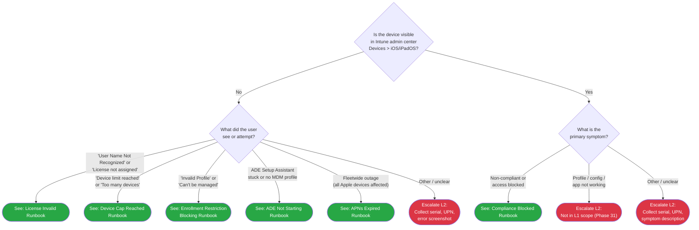

# Phase 30: iOS L1 Triage & Runbooks - Research

**Researched:** 2026-04-17
**Domain:** iOS/iPadOS L1 Service Desk documentation — decision trees and runbooks for Intune-managed device failures
**Confidence:** HIGH (all critical claims verified against Microsoft Learn 2025-2026 and in-repo structural precedents)

---

<user_constraints>

## User Constraints (from CONTEXT.md)

### Locked Decisions

The 36 decisions from 30-CONTEXT.md are binding. They are grouped below for the planner's cross-reference. Every one is copied verbatim in intent; see CONTEXT.md for full rationale.

**Triage Tree Root Structure:**
- **D-01:** Hybrid 2-axis root — Axis 1 "Is the device visible in Intune > Devices > iOS/iPadOS?", Axis 2 symptom disambiguation. Not-visible branch → 5 tenant-config scenarios; Visible branch → compliance-blocked + device-side manifestations.
- **D-02:** Mermaid node ID prefix `IOS` (IOS1, IOS2, IOSR1, IOSE1). Structure mirrors `06-macos-triage.md` exactly: Mermaid → Routing Verification → How to Check → Escalation Data → Related Resources.
- **D-03:** No network reachability gate at root; matches macOS rationale.

**Initial Triage Integration:**
- **D-04:** Banner-only integration. New line-10 banner: `> **iOS/iPadOS:** For iOS/iPadOS troubleshooting, see [iOS Triage](07-ios-triage.md).` Plus Scenario Trees list entry and See Also footer entry.
- **D-05:** NO Mermaid graph modification to 00-initial-triage.md. `applies_to: APv1` stays. No TRD renumbering.
- **D-06:** Update Scenario Trees + See Also sections + bump last_verified.

**L1 Scope on Admin-Config Failures:**
- **D-07:** Detect-and-escalate scope. L1 never executes tenant-wide config changes.
- **D-08:** Single documented L1 write exception — manual token sync (Devices > Enrollment > Apple > Enrollment program tokens > [token] > Sync). Appears only in runbooks 17 and (optionally) 20.
- **D-09:** User-side actions in scope for runbook 21 only (device restart, iOS update, passcode reset).

**Actor-Boundary Format (SC #4):**
- **D-10:** Sectioned H2 format: `## Symptom` / `## L1 Triage Steps` / `## Admin Action Required` / `## User Action Required` (optional) / `## Escalation Criteria`. "Admin Action Required" is an escalation packet, not executable steps.
- **D-11:** Symptom section — 1-3 concrete indicators + Mermaid anchor link back to triage tree entry.
- **D-12:** Admin Action packet is three-part: "Ask the admin to" / "Verify" / "If the admin confirms none of the above applies".
- **D-13:** User Action Required section omitted (not "N/A") where not applicable — 5 of 6 runbooks omit it.
- **D-14:** "Say to the user" callouts used sparingly; status-communication for tenant-config runbooks 16-20 (not pseudo-remediation).
- **D-15:** Escalation Criteria mirrors macOS precedent format.

**Placeholder-Link Retrofit (71 Instances):**
- **D-16:** Resolve all 71 `iOS L1 runbooks (Phase 30)` placeholders inline in Phase 30 across 9 admin-setup-ios files.
- **D-17:** Per-row judgment required. Planner MUST enumerate each placeholder with its target runbook in PLAN.md. No bulk sed. Where no single-runbook target exists, acceptable to link nearest runbook + note OR mark as L2-escalate with Phase 31 placeholder.
- **D-18:** Prose retrofit at `07-device-enrollment.md` line 243 — rewrite to past/present tense with concrete links.
- **D-19:** Retrofitted files get `last_verified` bump + Version History entry.
- **D-20:** 9-file retrofit grouped as ONE atomic commit: `docs(30): resolve iOS L1 runbook placeholders in admin-setup-ios`.

**File Organization & Numbering:**
- **D-21:** Runbook filenames: `16-ios-apns-expired.md`, `17-ios-ade-not-starting.md`, `18-ios-enrollment-restriction-blocking.md`, `19-ios-license-invalid.md`, `20-ios-device-cap-reached.md`, `21-ios-compliance-blocked.md`.
- **D-22:** Decision tree filename: `docs/decision-trees/07-ios-triage.md`.
- **D-23:** 00-index.md — add "## iOS L1 Runbooks" H2 section after macOS section; Related Resources footer entry; Version History update.

**Frontmatter & Template Conventions:**
- **D-24:** Extend `docs/_templates/l1-template.md` `platform:` enum to include `iOS`.
- **D-25:** Per runbook frontmatter: `platform: iOS`, `audience: L1`. `applies_to`: `all` for runbooks 16 & 21; `ADE` for runbook 17; Claude's discretion for 18/19/20 at research time.
- **D-26:** Platform gate banner per runbook (mirrors macOS runbook 10 line 9).

**Content Scope Specifics:**
- **D-27:** Runbook 16 cross-platform scope note (iOS + iPadOS + macOS APNs blast radius). Note macOS-equivalent L1 runbook deferred to v1.4.
- **D-28:** Runbook 21 covers (a) CA-gap timing, (b) policy mismatch, (c) default posture "Not compliant". Sub-H3 (or sub-H2) structure per cause, following macOS runbook 11 multi-section pattern.
- **D-29:** Runbook 18 scope: per-user device limits, personal/corporate ownership flag gating, platform-level blocking. Cross-link Phase 29 D-08 (`00-overview.md#intune-enrollment-restrictions`).
- **D-30:** Runbook 20 scope: per-user device limit specifically (quota exhaustion). Distinct from runbook 18 (config blocks).
- **D-31:** No L1 runbook for MAM-WE-specific failures — deferred to ADDTS-01. Runbook 21 does NOT expand to MAM-WE. `09-mam-app-protection.md` placeholders may resolve to "escalate to L2 / Phase 31 placeholder".

**Research Flags (addressed in this document below):**
- **D-32 through D-36:** See "Research Flags Addressed" section below.

### Claude's Discretion

- Exact branching beyond the root gate in 07-ios-triage.md (constrained by SC #1 5-node cap)
- Mermaid styling and node count within cap
- Exact L1 Triage Steps content per runbook (constrained by D-07 detect-and-escalate)
- Exact Admin Action Required packet wording
- Per-runbook symptom count (1-3 per D-11)
- Per-runbook file length (100-180 lines target; runbook 21 may exceed)
- Whether to include "How to Use This Runbook" sub-navigation (macOS runbook 11 pattern)
- Per-row placeholder-to-runbook mapping judgment
- Banner wording micro-adjustments
- Whether to extend 00-index.md with an iOS-equivalent "No L1 runbook for MAM-WE" advisory note
- Runbook 18/19/20 `applies_to` frontmatter value

### Deferred Ideas (OUT OF SCOPE)

- iOS MAM-specific L1 runbooks (ADDTS-01 — PIN loop, selective wipe failures, app protection not applying)
- iOS L2 investigation runbooks (Phase 31 L2TS-02)
- iOS log collection runbook (Phase 31 L2TS-01)
- macOS L1 APNs-expired runbook (deferred to v1.4)
- iOS L1 Service Desk quick-reference card (Phase 32 NAV-02)
- Glossary additions for iOS L1 terms (Phase 32 NAV-01)
- Capability matrix iOS entry (Phase 32 NAV-03)
- Automated link-check CI (future milestone)
- Apple Configurator 2 manual enrollment L1 runbook (out of scope per REQUIREMENTS)
- Shared iPad L1 specifics (SIPAD-01)

</user_constraints>

---

<phase_requirements>

## Phase Requirements

| ID | Description | Research Support |
|----|-------------|------------------|
| L1TS-01 | iOS triage decision tree routes L1 agents through enrollment, compliance, and app deployment failures (SC #1: resolution/L2 within 5 nodes; SC #2: single branch from initial-triage) | Mermaid structure recommendation below (Section 5) proves a 3-5 node tree satisfies the coverage matrix; banner-only integration (D-04) satisfies SC #2 matching shipped macOS pattern |
| L1TS-02 | L1 runbooks cover top 6 iOS failure scenarios: APNs expired, ADE not starting, enrollment restriction blocking, license invalid, device cap reached, compliance blocked (SC #3: each runbook has symptom / L1 steps / escalation trigger; SC #4: no ambiguity about admin vs user action) | Per-runbook content guidance (Section 4) provides symptom strings, L1-observable checks, and admin/user action boundaries drawn from Microsoft Learn verified error messages and in-repo admin-setup-ios anchor targets |

</phase_requirements>

---

## 1. Executive Summary (what the planner must know)

Phase 30 is a **docs-only phase** delivering one decision tree file, six L1 runbook files, one 00-initial-triage.md banner addition, one 00-index.md iOS section, one L1 template edit, and 71 placeholder-string resolutions across 9 admin-setup-ios files. No code, no tests beyond markdown/YAML/Mermaid lint.

**Primary recommendation:** Treat this phase as three execution waves:

1. **Wave 1 — Structural precedent reuse.** 07-ios-triage.md and runbooks 16-21 follow exactly the macOS precedents at `06-macos-triage.md`, `10-macos-device-not-appearing.md`, and `11-macos-setup-assistant-failed.md`. Do not re-invent structure. The only **structural departure from macOS** is D-10's sectioned H2 actor-boundary format — a deliberate upgrade for SC #4 that macOS predates.
2. **Wave 2 — Content authoring with verified UI paths.** Every "Intune admin center" instruction in a runbook must use the portal navigation paths verified in Section 3 below. Every user-visible error string in a Symptom section should come from the Microsoft Learn table verified in Section 4 below, not paraphrased. Field names ("Active", "Days until expiration", "Device limit") are load-bearing — misquoting them breaks L1 agents who search the portal UI for the text.
3. **Wave 3 — 71-placeholder retrofit as atomic commit.** D-16/D-17/D-20 require per-row enumeration in PLAN.md and a single bulk commit. The retrofit is a cross-phase contract fulfillment (Phase 28 D-22 / Phase 29 D-13) — if the planner leaves any placeholders unresolved, downstream Phase 31/32 will inherit link-rot.

**Critical constraint from CONTEXT.md (not re-derived here):** L1 NEVER executes tenant-wide writes in runbooks 16, 18, 19, 20, 21. The single documented exception is manual ADE token sync (runbook 17 and optionally runbook 20). Every other "fix action" is an escalation packet L1 hands to an Intune admin.

**Canonical templates:**
- Decision tree: `docs/decision-trees/06-macos-triage.md`
- Single-flow runbook: `docs/l1-runbooks/10-macos-device-not-appearing.md` (template for runbooks 17, 20)
- Multi-symptom runbook: `docs/l1-runbooks/11-macos-setup-assistant-failed.md` (template for runbook 21)
- Profile-not-applied style: `docs/l1-runbooks/12-macos-profile-not-applied.md` (pattern reference)

**Key structural delta from macOS L1 precedent:** macOS L1 runbooks ship with "Prerequisites / Steps / Escalation Criteria" 3D prose structure (runbook 10 is the reference). Phase 30 D-10 mandates **sectioned H2 actor-boundary** (`## Symptom` / `## L1 Triage Steps` / `## Admin Action Required` / `## User Action Required` optional / `## Escalation Criteria`). This is a SC #4 literal response that macOS predates. Do NOT carry macOS's 3D prose into iOS runbooks.

---

## 2. Research Flags Addressed (D-32 through D-36)

### D-32: Intune iOS device enrollment restrictions navigation path

**Answer:** Two navigation paths currently coexist. Both reach the same blade; tenants see the path determined by their rollout status.

**Path A (newer, documented in Microsoft Learn create-device-platform-restrictions 2025-10):** `Devices > Device onboarding > Enrollment > Device platform restriction` **[CITED: learn.microsoft.com/intune/intune-service/enrollment/create-device-platform-restrictions]**

**Path B (older, still valid in Learn troubleshoot-ios-enrollment-errors 2025-03):** `Devices > Enrollment restrictions > Device type restrictions > All Users > Properties > Edit > Platform settings` **[CITED: learn.microsoft.com/troubleshoot/mem/intune/device-enrollment/troubleshoot-ios-enrollment-errors § "The configuration for your iPhone/iPad couldn't be downloaded"]**

**Recommendation for runbook 18:** Use **Path A** as the primary instruction. Add an explicit fallback note: "If the Device onboarding section is not visible in your tenant, navigate via **Devices > Enrollment restrictions > Device type restrictions** — the settings behind both navigation paths are identical." This matches the existing project-wide pattern in `admin-setup-ios/00-overview.md#portal-navigation-note` which explicitly documents that navigation may vary by tenant rollout.

**Confidence:** HIGH — both paths verified against Microsoft Learn within 90-day window; in-repo overview already documents the multi-path reality.

**For L1 checks (not writes):** L1 should navigate to the restriction blade to document "what the blocking policy says" — not to edit it. The Admin Action Required packet for runbook 18 lists the settings the admin must change (platform allow-block, ownership allow-block, enrollment-type allow-block).

### D-33: Intune per-user device limit configuration path and naming

**Answer:** `Devices > Enrollment > Device limit restrictions` (Path A, via Device onboarding). Default value 5; configurable 1-15. Up to 25 device limit restriction policies supported per tenant.

**Verified path:** `Devices > Device onboarding > Enrollment > Device limit restriction` **[CITED: learn.microsoft.com/intune/intune-service/enrollment/create-device-limit-restrictions 2025]**

**Older/alternate path (still present in Learn troubleshoot-device-enrollment-in-intune 2025-02):** `Devices > Enrollment restrictions > Device limit restrictions` **[CITED: learn.microsoft.com/troubleshoot/mem/intune/device-enrollment/troubleshoot-device-enrollment-in-intune § "Device cap reached"]**

**Device-cap error codes L1 will see:**
- `DeviceCapReached` — literal error string surfaced to user during enrollment
- User-visible message: **"Company Portal Temporarily Unavailable"** (misleading — Microsoft Learn explicitly notes this message can also mean device cap reached)

**Recommendation for runbook 20:** Document BOTH the precise error string (`DeviceCapReached`) and the misleading one (`Company Portal Temporarily Unavailable`). L1 must check both against the runbook's Symptom section. Direct L1 to check `Users > All users > [user] > Devices` for the enrolled-count vs `Devices > Enrollment > Device limit restrictions` for the limit. Admin Action Required packet: increase limit OR remove stale device records.

**Confidence:** HIGH — path verified + two user-visible error strings verified from Microsoft Learn support article.

### D-34: APNs certificate status indicators in Intune admin center

**Answer:** Current navigation: `Devices > Device onboarding > Enrollment > Apple (tab) > Apple MDM Push Certificate`. **[CITED: learn.microsoft.com/intune/device-enrollment/apple/create-mdm-push-certificate, last updated 2025-05-12 per `ms.date`]**

**Fields visible to L1 on the MDM Push Certificate pane:**
- **Status** — certificate status indicator (typical values: certificate configured / certificate not set up / expired state surfaces via the "Days until expiration" field)
- **Days until expiration** — integer countdown; negative-indicator message "expired X days ago" surfaces when the certificate has already expired
- **Apple ID** — the Apple ID used to upload the certificate (critical for admin renewal — must match)
- **Expiration date** — absolute date value
- **Certificate subject ID (UID/GUID)** — visible on the certificate details, matches what appears on enrolled devices under Settings > General > Device Management > Management Profile > More Details > Management Profile > Topic **[CITED: same URL, § "Tip" callout]**

**Renewal notification behavior:** Administrators receive email notification 30 days before expiry, then again at 10 days. L1 would NOT receive these notifications — they are sent to the Intune admin. **[CITED: systemcenterdudes.com/renew-apple-mdm-push-certificate-in-endpoint-manager — MEDIUM confidence community source; concurs with Microsoft Learn which does not explicitly document the 10-day reminder]**

**L1-surfaceable error string when APNs expires:**
- `APNSCertificateNotValid` — user-facing enrollment error. Message body: "There's a problem with the certificate that lets the mobile device communicate with your company's network." **[CITED: learn.microsoft.com/troubleshoot/mem/intune/device-enrollment/troubleshoot-ios-enrollment-errors]**
- `NoEnrollmentPolicy` — also surfaces when APNs is missing/invalid/expired. Message: "No enrollment policy found." **[CITED: same URL]**
- `AccountNotOnboarded` — same body as APNSCertificateNotValid; also an APNs-family error. **[CITED: same URL]**

**Recommendation for runbook 16:** Symptom section should enumerate all THREE enrollment-time error codes (APNSCertificateNotValid / NoEnrollmentPolicy / AccountNotOnboarded) because Microsoft Learn documents them as all pointing to APNs failures. L1 will see one of the three, not a predictable specific one. Plus the portal-observable: Status field on MDM Push Certificate pane with expired or near-expiry "Days until expiration".

**Confidence:** HIGH for field names, error codes, navigation path. MEDIUM for the 10-day-reminder claim (community-verified, not Microsoft Learn primary).

### D-35: iOS license-invalid failure manifestation

**Answer:** **Dual-surface failure with a device-visible error message AND a silent portal-absence.** The manifestation L1 sees depends on WHICH stage of enrollment fails.

**Stage 1 — User starts Company Portal enrollment without Intune license:**
- Device-visible error: **"User Name Not Recognized. This user account isn't authorized to use Microsoft Intune. Contact your system administrator if you think you have received this message in error."** **[CITED: learn.microsoft.com/troubleshoot/mem/intune/device-enrollment/troubleshoot-ios-enrollment-errors § "User Name Not Recognized"]**
- Error code: `UserLicenseTypeInvalid` — "The device can't be enrolled because the user's account isn't yet a member of a required user group or the user doesn't have the correct license." **[CITED: same URL]**
- Alternate-surface error: **"Your IT admin hasn't given you access to use this app. Get help from your IT admin or try again later."** **[CITED: learn.microsoft.com/troubleshoot/mem/intune/device-enrollment/troubleshoot-device-enrollment-in-intune § "IT admin needs to assign license for access"]**

**Stage 2 — ADE Setup Assistant silent failure:** If the user signs in at Setup Assistant but has no license, enrollment sign-in may appear to succeed but the MDM profile never downloads. Per CONTEXT.md specifics line 253: "User signs in during enrollment, everything appears to succeed, but the MDM profile never downloads and Intune shows no device for the user." **[ASSUMED: this silent failure is mentioned in admin-setup-ios/07-device-enrollment.md line 252 as an existing documented scenario — VERIFIED against in-repo file; exact behavior not separately independently verified against Microsoft Learn. Reasonable because the documented error codes (UserLicenseTypeInvalid) are enrollment-blocking at the Intune enrollment service layer, meaning the device never receives an MDM profile to install.]**

**Recommendation for runbook 19:**
- Symptom section covers BOTH manifestations:
  (a) device-visible Stage-1 error string `"User Name Not Recognized. This user account isn't authorized to use Microsoft Intune."` — copy the literal string from Microsoft Learn
  (b) Stage-2 silent failure: "enrollment sign-in appeared to succeed but the device is not visible in Intune and no MDM profile was installed on the device"
- Prerequisites section MUST explicitly flag: **"Access to Microsoft 365 admin center or Microsoft Entra admin center to verify the user's Intune license assignment"** — this is the permission boundary where runbook 19 departs from the other 5 runbooks. An L1 who only has Intune admin center read access cannot complete runbook 19's L1 Triage Steps without second-portal access. Document this as a Prerequisite and, if the L1 lacks the access, fold into Escalation Criteria.
- Admin Action Required packet: the fix IS in Microsoft 365 admin center (`Users > Active Users > [user] > Product licenses > Edit`) per **[CITED: Microsoft Learn troubleshoot-ios-enrollment-errors § "User Name Not Recognized" solution]**. L1 documents the needed license; admin applies it.

**Confidence:** HIGH for the Stage-1 device-visible error message (verified). MEDIUM for the Stage-2 silent failure description — it IS asserted in a shipped in-repo admin-setup-ios file, but Microsoft Learn does not redundantly describe the silent version. Flag this as a scenario to confirm during plan review if the user wants certainty.

### D-36: Compliance "Not evaluated" default posture — current behavior

**Answer:** Microsoft Learn 2025-10 documentation confirms the **Phase 28 D-11 reference doc is still current**.

**Verified navigation path to the setting:** `Endpoint security > Device compliance > Compliance policy settings > Mark devices with no compliance policy assigned as` **[CITED: learn.microsoft.com/intune/intune-service/protect/device-compliance-get-started and learn.microsoft.com/intune/intune-service/protect/compliance-policy-monitor § "Important concepts" bullet, ms.date 2025-10-22]**

**Verified "Not evaluated" definition:**
> "An initial state for newly enrolled devices. Other possible reasons for this state include:
> - Devices that aren't assigned a compliance policy and don't have a trigger to check for compliance.
> - Devices that haven't checked in since the compliance policy was last updated.
> - Devices not associated to a specific user, such as iOS/iPadOS devices purchased through Apple's Device Enrollment Program (DEP) that don't have user affinity.
> - Devices enrolled with a device enrollment manager (DEM) account."
>
> **[CITED: learn.microsoft.com/intune/intune-service/protect/compliance-policy-monitor § "Not evaluated" bullet, ms.date 2025-10-22]**

**Default-posture toggle verified values:**
- **Compliant** (Intune default) — "This security feature is off. Devices that aren't sent a device compliance policy are considered compliant." **[CITED: learn.microsoft.com/intune/intune-service/protect/device-compliance-get-started 2025]**
- **Not compliant** — "This security feature is on. Devices without a device compliance policy are considered noncompliant." **[CITED: same URL]**

**Microsoft explicit recommendation** (reproduced verbatim from compliance-policy-monitor, currently LIVE as of 2025-10-22): "The default configuration marks devices without an assigned compliance policy as *compliant*. We recommend configuring this setting so that these devices are marked as *noncompliant*." **[CITED: learn.microsoft.com/intune/intune-service/protect/compliance-policy-monitor § Important concepts]**

**Runbook 21 deep-link target verification:** The target anchor `06-compliance-policy.md#compliance-evaluation-timing-and-conditional-access` is authored in Phase 28 and exists. In-repo grep confirms the `## Compliance Evaluation Timing and Conditional Access` H2 is present and references the 0-30 minute CA window and the default-posture toggle interaction.

**Recommendation for runbook 21:**
- Use the sub-H3 structure (not H2) for three causes A/B/C per CONTEXT.md specifics line 254 (following macOS runbook 11's multi-section pattern). Candidate sub-causes: "Cause A: CA Gap (First Compliance Evaluation Pending)", "Cause B: Actual Policy Mismatch", "Cause C: Default Posture = Not compliant Configuration"
- For Cause A: link the L1 to `../admin-setup-ios/06-compliance-policy.md#compliance-evaluation-timing-and-conditional-access` — the anchor exists and the content answers the question from Phase 28 SC #4
- For Cause C: link to `../admin-setup-ios/06-compliance-policy.md` § the verification checklist + step 1 (the Endpoint security > Device compliance > Compliance policy settings reference). The L1 documents "which posture is currently configured" as part of the escalation packet.
- The "How to Check" section in the triage tree AND the Admin Action Required packet in runbook 21 should reference the verified path literally: `Endpoint security > Device compliance > Compliance policy settings > Mark devices with no compliance policy assigned as`. Copy this string verbatim for grep-friendliness.

**Confidence:** HIGH — primary Microsoft Learn source (compliance-policy-monitor) has `ms.date: 2025-10-22` which is within the acceptable currency window for the Phase 30 execution date (2026-04).

---

## 3. Intune Admin Center Navigation Reference Table

Used as a single source of truth for all runbook portal-path instructions. Copy strings verbatim — field names and menu labels are load-bearing.

| # | What L1 Is Checking | Path (primary) | Fallback Path (older rollout) | Key field/indicator visible | Last verified |
|---|---|---|---|---|---|
| P-01 | APNs certificate status | `Devices > Device onboarding > Enrollment > Apple (tab) > Apple MDM Push Certificate` | — (no alternate path documented) | Status, Days until expiration, Apple ID, Expiration date | 2025-05-12 |
| P-02 | ADE token status | `Devices > Device onboarding > Enrollment > Apple (tab) > Enrollment program tokens` | `Devices > Enrollment > Apple > Enrollment program tokens` | Status (Active/Expired/Expiring), token Apple ID, profile assignments | 2025-03-31 |
| P-03 | Manual ADE token sync (L1 write exception per D-08) | `Devices > Device onboarding > Enrollment > Apple (tab) > Enrollment program tokens > [token] > Sync` | — | Sync trigger button; next automatic sync interval | 2025-03-31 |
| P-04 | Device visibility check (by serial/IMEI) | `Devices > All devices` (then filter by iOS/iPadOS) or `Devices > iOS/iPadOS` | `Devices > All devices > iOS/iPadOS` | Ownership (Personal/Corporate), Last check-in, Primary user, Enrollment type | 2025 |
| P-05 | Device platform restriction (D-32) | `Devices > Device onboarding > Enrollment > Device platform restriction` | `Devices > Enrollment restrictions > Device type restrictions > All Users > Properties > Edit > Platform settings` | Platform allow/block per-OS, Personally-owned allow/block, OS version min/max | 2025-10 / 2025-03 |
| P-06 | Per-user device limit (D-33) | `Devices > Device onboarding > Enrollment > Device limit restriction` | `Devices > Enrollment restrictions > Device limit restrictions` | Device limit value (1-15, default 5), policy assignment scope | 2025 / 2025-02 |
| P-07 | Per-user enrolled-device count | `Users > All users > [user] > Devices` | — | Enrolled device count; per-device ownership and last-contact | 2025-02 |
| P-08 | Compliance policy default posture (D-36) | `Endpoint security > Device compliance > Compliance policy settings` | — | "Mark devices with no compliance policy assigned as" toggle (Compliant / Not compliant) | 2025-10-22 |
| P-09 | Device compliance state (per-device) | `Devices > All devices > [device] > Device compliance` | — | Overall state (Compliant / Non-compliant / Not evaluated / In grace period); per-policy breakdown; per-setting breakdown | 2025-10-22 |
| P-10 | User license assignment (D-35) | `Microsoft 365 admin center (admin.microsoft.com) > Users > Active Users > [user] > Product licenses > Edit` | Microsoft Entra admin center > Users > [user] > Licenses | Assigned license SKUs; Intune Plan 1 / Intune Plan 2 / EMS / M365 E3/E5 | 2025-03 |

**Project pattern note:** The shipped `docs/admin-setup-ios/00-overview.md § Portal Navigation Note` (lines 76-80) already documents the multi-path reality: "The Intune admin center is actively rolling out updated navigation for enrollment configuration... Look for equivalent options under Devices > Device onboarding > Enrollment > Apple tab. The settings and their effects remain the same regardless of navigation path." Runbooks SHOULD include a one-line reference to this note for navigation drift, matching the admin-setup-ios pattern (line 12 of 01-apns-certificate.md, 02-abm-token.md, 03-ade-enrollment-profile.md — a consistent `> Portal navigation may vary by Intune admin center version. See [Overview](...) for details.` callout).

---

## 4. Per-Runbook Content Guidance

Each subsection below provides symptom strings (exact text L1 sees), L1 observable checks, admin-action packet contents, and escalation signals. Planner uses these as source material — do not paraphrase the verbatim error strings.

### Runbook 16 — iOS APNs Expired (`16-ios-apns-expired.md`)

**`applies_to: all`** (all iOS paths affected; CONTEXT.md D-25 locked)

**Symptom section indicators (D-11: 1-3 concrete):**
- **Cross-platform blast-radius statement (D-27 mandatory lead):** "This failure affects ALL enrolled iOS, iPadOS, AND macOS devices in the tenant simultaneously. APNs is shared infrastructure — one expired certificate stops MDM communication to every Apple device."
- **Device-side user-visible error during any attempted iOS enrollment:** `APNSCertificateNotValid` — body text: "There's a problem with the certificate that lets the mobile device communicate with your company's network." Or: `NoEnrollmentPolicy` — body: "No enrollment policy found." Or: `AccountNotOnboarded`. All three point to APNs. **[CITED: Microsoft Learn troubleshoot-ios-enrollment-errors]**
- **Intune admin center portal-visible:** "Devices > All devices > iOS/iPadOS: previously-enrolled devices show 'Last check-in' drift into hours/days. New enrollments fail."

**L1 Triage Steps (detect-and-escalate — D-07):**
1. Say-to-user status opener (D-14 applicable — affected fleet, not pseudo-remediation).
2. Navigate to **P-01**: `Devices > Device onboarding > Enrollment > Apple (tab) > Apple MDM Push Certificate`. Record: Status, Days until expiration, Apple ID, Expiration date.
3. If "Days until expiration" is negative or "expired X days ago": confirm expiry. Screenshot portal pane.
4. Verify cross-platform scope: navigate to **P-04** (iOS), then macOS devices view. Note "Last check-in" drift on each platform to document the blast radius for the admin.
5. Proceed directly to Admin Action Required (no further L1 checks required — renewal is admin-scope).

**Admin Action Required packet (D-12 three-part):**
- **Ask the admin to:** renew the APNs certificate via the Apple Push Certificates Portal following the RENEWAL (not CREATE-NEW) flow documented in `../admin-setup-ios/01-apns-certificate.md § Renewal`. The Apple ID used for the original certificate MUST be used for renewal — renewing with a different Apple ID fails.
- **Verify:** After admin renewal, on the same Apple MDM Push Certificate pane, Status returns to Active (or equivalent "certificate configured" state) and Days until expiration returns to ~365.
- **If the admin confirms none of the above applies:** proceed to Escalation Criteria.

**No User Action Required section (D-13).**

**Escalation Criteria (D-15):**
- Admin does not have access to the Apple ID used for the original certificate (employee departure — the D-27 reason for "company email address Apple ID" recommendation)
- Admin performs renewal but devices do not resume check-in after 30 minutes
- Certificate grace period (30 days post-expiration) has passed

**Collect before escalating:**
- Screenshot of the APNs certificate pane with Status/Days-until-expiration visible
- Apple ID used on the certificate (from pane)
- Approximate date of expiration (Expiration date field)
- Count of affected iOS/iPadOS and macOS devices (from Devices view)
- Whether any device has successfully checked in in the last 24 hours

**Related Resources footer per D-27:**
- `../admin-setup-ios/01-apns-certificate.md` — APNs renewal admin procedure
- "Note: macOS currently has no equivalent L1 APNs-expired runbook. Cross-platform APNs failures identified from the macOS side should escalate to L2 via the standard macOS triage. A macOS L1 APNs runbook is planned for v1.4."

---

### Runbook 17 — iOS ADE Not Starting (`17-ios-ade-not-starting.md`)

**`applies_to: ADE`** (D-25 locked)

**Symptom section indicators — three failure signatures per CONTEXT.md specifics line 251:**
- (a) Device never appears in Intune after factory reset (Setup Assistant starts but no MDM profile arrives — typically ABM token or enrollment-profile issue)
- (b) Device appears in Intune but Setup Assistant stays stuck past welcome/sign-in screens
- (c) User reaches Apple sign-in but Microsoft sign-in never appears (authentication-method or user-affinity issue)

**L1 Triage Steps:**
1. Say-to-user status opener.
2. Navigate to **P-04**: `Devices > All devices > iOS/iPadOS`. Search by device serial number. Record whether device appears, and if so, its "Last check-in" / "Enrollment type".
3. If device appears but is in a pre-enrollment state (e.g., no Management Agent record): note and continue to token checks.
4. Navigate to **P-02**: `Devices > Device onboarding > Enrollment > Apple (tab) > Enrollment program tokens`. Verify the active iOS token Status = Active. Record Status value.
5. If Status is "Expired" or "Expires soon": proceed directly to Admin Action Required (renewal required).
6. On the active token, verify an enrollment profile is assigned as Default (or to the device's assignment group). Record profile name.
7. If Status is Active and profile is assigned but device does not appear in Intune: perform the **manual token sync** (D-08 single L1 write exception): **P-03** `> [token] > Sync`. Wait 5 minutes. Re-search by serial.
8. If Sync does not surface the device: navigate to Apple Business Manager (`business.apple.com`), search by serial. If not found: device is not in ABM — escalate with procurement-verification data.
9. If found in ABM: check the device's MDM Server field in ABM. If blank or assigned to a different MDM server: escalate with inter-org-release data.

**Admin Action Required packet — multi-path depending on which signature:**

Possible paths from L1 step output:
- **Signature (a) + ABM token expired:** Ask admin to renew ABM/ADE token per `../admin-setup-ios/02-abm-token.md § Renewal`. Verify: token Status returns to Active in **P-02**.
- **Signature (a) + no profile assigned:** Ask admin to create/assign an enrollment profile per `../admin-setup-ios/03-ade-enrollment-profile.md`. Verify: profile appears under the token and the device picks it up within 15 min.
- **Signature (b) + Await-final-configuration stuck:** Ask admin to review Await-final-configuration setting and any pending configuration profile delivery errors per `../admin-setup-ios/03-ade-enrollment-profile.md`. Verify: device advances past Remote Management screen.
- **Signature (c) + legacy authentication method (Setup Assistant legacy):** Ask admin to change the enrollment profile to Setup Assistant with modern authentication. Note: **[CITED: Microsoft Learn troubleshoot-ios-enrollment-errors § "ADE enrollment stuck at user login"]** — MFA fails during enrollment if authentication method is Setup Assistant (legacy). Verify: next enrollment attempt reaches Microsoft sign-in screen.

**No User Action Required section** (user can only retry after admin acts; retrying on the device before admin fixes the tenant state is not a meaningful user action).

**Escalation Criteria:**
- ABM/ADE token expired AND admin does not have access to the Managed Apple ID used for token creation
- Device appears in ABM but is assigned to a different MDM server (inter-org device release required)
- All portal checks pass but device still does not appear after 30 minutes post-sync
- Admin already attempted renewal and sync but device does not appear

**Related Resources footer:**
- `../admin-setup-ios/02-abm-token.md` — ABM/ADE token admin procedure
- `../admin-setup-ios/03-ade-enrollment-profile.md` — enrollment profile admin procedure
- `../ios-lifecycle/01-ade-lifecycle.md` — 7-stage ADE pipeline for L2 context

---

### Runbook 18 — iOS Enrollment Restriction Blocking (`18-ios-enrollment-restriction-blocking.md`)

**`applies_to`** recommendation: `all` (enrollment restrictions span all paths — ADE, Device Enrollment, User Enrollment). Planner should confirm with Claude's discretion (D-25) during plan.

**Symptom section indicators (NOT device-cap — that's runbook 20):**
- **User-visible device error (Flow 1, Company Portal):** "The configuration for your iPhone/iPad couldn't be downloaded from [Company Name]: Invalid Profile" **[CITED: Microsoft Learn troubleshoot-ios-enrollment-errors § "The configuration for your iPhone/iPad couldn't be downloaded"]** — this message literally corresponds to device-type-restriction blocking per Microsoft Learn
- **User-visible device error (general):** "This device cannot be managed" or equivalent enrollment-blocked message
- **Intune portal surface:** Device appears briefly in Intune then is retired/removed, OR never appears at all

**Disambiguation from runbook 20:** L1 should ask: "Did the user see 'device limit reached' specifically?" If yes → route to runbook 20. If no (user saw a generic "can't be managed" or "Invalid Profile" error): runbook 18 applies. Both runbooks should include this disambiguation explicitly in Related Resources to prevent confused routing.

**L1 Triage Steps:**
1. Say-to-user status opener.
2. Navigate to **P-05**: `Devices > Device onboarding > Enrollment > Device platform restriction`. Review the policy applied to the user's group. Record: platform allow/block for iOS/iPadOS, personally-owned allow/block, OS version min/max, device-type allow/block.
3. Cross-check user's group membership: `Groups > [user's assigned group]` — confirm user is a member.
4. Navigate to `../admin-setup-ios/00-overview.md#intune-enrollment-restrictions` in the docs for reference context (L1 may cite this in the escalation packet).
5. Note which restriction setting would block this user's enrollment attempt (personal-owned blocked but device is personal; platform blocked; OS version gate too high; etc.).

**Admin Action Required packet (D-12):**
- **Ask the admin to:** review the device platform restriction policy assigned to the user's group and adjust the blocking setting (platform allow, personally-owned allow, OS version gate) appropriate to organizational policy. Settings path: **P-05**.
- **Verify:** User retries enrollment; the device enrolls successfully and appears in **P-04**.
- **If the admin confirms the restriction is intentional:** proceed to Escalation Criteria with the user-group-policy conflict documented — a policy exception or user group change is needed.

**No User Action Required section.**

**Escalation Criteria:**
- Restriction is intentional and cannot be changed (requires policy exception out of L1 + admin scope)
- User's group membership is incorrect (requires Entra admin action to re-assign group)
- Admin changes restriction but enrollment still fails (restriction was not the cause)

**Related Resources:**
- `../admin-setup-ios/00-overview.md#intune-enrollment-restrictions` — restriction configuration reference (Phase 29 D-08 shared anchor)
- `20-ios-device-cap-reached.md` — "If the user saw 'device limit reached' specifically, use runbook 20 instead."

---

### Runbook 19 — iOS License Invalid (`19-ios-license-invalid.md`)

**`applies_to`** recommendation: `all` (license affects all paths). Planner Claude's discretion.

**Prerequisites section MUST flag second-portal access (per D-35 research finding):**
- Access to Intune admin center (https://intune.microsoft.com) with read permissions
- **Access to Microsoft 365 admin center (https://admin.microsoft.com) OR Microsoft Entra admin center with user license-view permissions** — this runbook's L1 triage CANNOT complete without this access. If the L1 agent does not have this access, skip to Escalation Criteria with the user's UPN documented.

**Symptom section indicators (DUAL-SURFACE per D-35):**
- **Stage-1 device-visible:** "User Name Not Recognized. This user account isn't authorized to use Microsoft Intune. Contact your system administrator if you think you have received this message in error." **[CITED: Microsoft Learn troubleshoot-ios-enrollment-errors]**
- **Stage-1 alternate:** "Your IT admin hasn't given you access to use this app. Get help from your IT admin or try again later." **[CITED: Microsoft Learn troubleshoot-device-enrollment-in-intune]**
- **Stage-2 silent:** "User completed enrollment sign-in apparently successfully, but the device does not appear in Intune and the MDM profile never downloaded." (Documented scenario per `07-device-enrollment.md` line 252 — **[ASSUMED]** for Microsoft Learn direct verification; asserted as a known pattern in in-repo admin setup guide.)
- Error code (if user can screenshot): `UserLicenseTypeInvalid`

**L1 Triage Steps:**
1. Say-to-user status opener.
2. Collect the user's UPN (user principal name — `user@domain.com`).
3. Navigate to **P-04**: `Devices > All devices > iOS/iPadOS`. Search by the user's UPN OR the device serial (if the user has it). Record: device present Y/N, enrollment type, ownership.
4. Navigate to **P-10**: `Microsoft 365 admin center > Users > Active Users > [user]`. Verify the user has an Intune license in **Product licenses**. Look for: Intune Plan 1, Intune Plan 2, EMS E3/E5, Microsoft 365 E3/E5 (any of these assign Intune). Record: license SKUs present.
5. If no Intune license is assigned: proceed to Admin Action Required.
6. If an Intune license IS assigned but error persists: escalate — the issue is not license assignment.

**Admin Action Required packet (D-12):**
- **Ask the admin to:** in Microsoft 365 admin center, navigate to `Users > Active Users > [affected user] > Product licenses > Edit` and assign an Intune-eligible license (Intune Plan 1/2, EMS E3/E5, or M365 E3/E5).
- **Verify:** Once license is assigned, have user restart the Company Portal app / retry enrollment. Device should enroll and appear in **P-04**.
- **If the admin confirms none of the above applies:** escalate to L2 — license-related enrollment blocks that persist after license assignment typically indicate MDM authority or Entra sync issues.

**No User Action Required section** (user cannot self-assign license).

**Escalation Criteria:**
- L1 does not have Microsoft 365 / Entra admin center access (cannot verify license status)
- Intune license IS assigned and error persists
- User UPN not found in Active Users (user does not exist in the tenant — Entra sync or account issue)
- Admin assigns license, user retries, error persists after 30 minutes

**Related Resources:**
- `../admin-setup-ios/07-device-enrollment.md` — Device Enrollment admin procedure; Stage-2 silent failure pattern referenced inline
- Microsoft Learn — https://learn.microsoft.com/intune/fundamentals/licenses-assign (Intune license assignment procedure)

---

### Runbook 20 — iOS Device Cap Reached (`20-ios-device-cap-reached.md`)

**`applies_to`** recommendation: `all` (device caps span all non-DEM-account paths). Planner Claude's discretion.

**Symptom section indicators:**
- **Primary user-visible error:** `DeviceCapReached` with message: "Too many mobile devices are enrolled already." **[CITED: Microsoft Learn troubleshoot-ios-enrollment-errors]**
- **Alternate misleading error:** "Company Portal Temporarily Unavailable" — Microsoft Learn explicitly documents this error can also manifest as device-cap. **[CITED: Microsoft Learn troubleshoot-device-enrollment-in-intune § "Device cap reached" note]**
- **Intune surface:** user has N enrolled devices where N equals the configured device limit (default 5).

**Disambiguation from runbook 18** (per CONTEXT.md specifics line 252): include a one-line Related Resources callout pointing users to runbook 18 if the symptom is NOT "device limit reached" but a platform/ownership blocking error.

**L1 Triage Steps:**
1. Say-to-user status opener.
2. Navigate to **P-06**: `Devices > Device onboarding > Enrollment > Device limit restriction`. Record the device limit applicable to this user (default 5; may be per-group).
3. Navigate to **P-07**: `Users > All users > [user] > Devices`. Count enrolled devices for this user. Note each device's: device name, enrollment date, last-contact date, ownership, platform.
4. Identify stale/abandoned device records (devices with Last contacted > 90 days).
5. Compare count to limit from step 2: confirm count ≥ limit.

**Admin Action Required packet (D-12):**
- **Ask the admin to** either:
  1. **Remove stale device records** for the user — retire devices in `Devices > All devices > [device] > Retire` that have Last contacted > 90 days and are confirmed no longer in use. Microsoft Learn recommends this as the primary fix to avoid cap issues. **[CITED: learn.microsoft.com/troubleshoot/mem/intune/device-enrollment/troubleshoot-device-enrollment-in-intune § "To avoid hitting device caps"]**
  2. **Increase the device limit** for this user's group via **P-06**. Acceptable when the user legitimately needs more devices (e.g., tester with multiple test devices).
- **Verify:** User retries enrollment; device enrolls and appears in **P-04** under the user's Devices view, count is now below limit.
- **If the admin confirms the user legitimately needs more than 15 devices:** escalate — device-limit max is 15 per user. Users who need more than 15 devices require Device Enrollment Manager account (per Microsoft Learn note — DEM users bypass the cap but cannot use Conditional Access).

**Optional L1 write-action per D-08 (sync re-trial):** After stale-device retire is complete, L1 may perform **P-03** manual sync to accelerate cap-clear propagation. This is identical to runbook 17's sync mechanism and the same D-08 exception applies.

**No User Action Required section.**

**Escalation Criteria:**
- User needs more than 15 devices enrolled (hard platform cap)
- Admin removes stale devices, limit adjusted, but enrollment still fails
- User cannot identify which of their enrolled devices are stale

**Related Resources:**
- `../admin-setup-ios/00-overview.md#intune-enrollment-restrictions` — shared enrollment restrictions context
- `18-ios-enrollment-restriction-blocking.md` — "For enrollment failures that are NOT device-limit-related, see runbook 18."
- Microsoft Learn — `https://learn.microsoft.com/intune/remote-actions/devices-wipe` (Retire action documentation)

---

### Runbook 21 — iOS Compliance Blocked (`21-ios-compliance-blocked.md`)

**`applies_to: all`** (all enrolled iOS paths subject to compliance; D-25 locked)

**Only runbook with User Action Required section (D-09 + D-13 locked).**

**Multi-cause structure per D-28 + CONTEXT.md specifics line 254 — use sub-H3 under a "How to Use This Runbook" top-of-runbook navigator (macOS runbook 11 pattern):**

Sub-causes:
- **Cause A: CA Gap (First Compliance Evaluation Pending)** — 0-30 minute post-enrollment window where device is "Not evaluated"
- **Cause B: Actual Policy Mismatch** — OS version, passcode, jailbreak detection, restricted-apps list
- **Cause C: Default Posture = Not Compliant Configuration** — tenant-level default-posture toggle is set to Not compliant AND user has no assigned compliance policy (or device is Not evaluated) AND CA requires compliant device

**"How to Use This Runbook" section** (per macOS runbook 11 pattern at lines 22-27):
```
Go directly to the section that matches your observation:

- [Cause A: CA Gap](#cause-a-ca-gap) — Device just enrolled in the last 30 minutes; Intune shows "Not evaluated"
- [Cause B: Actual Policy Mismatch](#cause-b-policy-mismatch) — Intune shows specific failing settings (OS version, passcode, jailbreak)
- [Cause C: Default Posture Not Compliant](#cause-c-default-posture) — Device has no assigned compliance policy but CA "Require compliant device" is active
```

**Sub-cause A: CA Gap**

- **Symptom:** Device just enrolled (within last 30 minutes). User reports "can't access Outlook/SharePoint/Teams — access denied". Intune admin center **P-09**: compliance state = "Not evaluated".
- **L1 Triage Steps:** Navigate to **P-09** > device compliance tab. Confirm state = Not evaluated. Note enrollment completion timestamp.
- **User Action Required:** "Please wait up to 30 minutes. Your device just enrolled and Intune is still evaluating compliance. During this time, access to Outlook/SharePoint/Teams may be blocked. Try again in 15 minutes."
- **Admin Action Required:** None if gap < 30 min. If > 30 min and state is still Not evaluated, see Cause C (default posture may be Not compliant) or escalate (APNs or check-in issue).
- **Deep link:** `../admin-setup-ios/06-compliance-policy.md#compliance-evaluation-timing-and-conditional-access` — anchor verified present in Phase 28 content.

**Sub-cause B: Actual Policy Mismatch**

- **Symptom:** Intune **P-09** shows "Non-compliant" with specific failing settings (click failing setting for remediation guidance — that's the Intune portal affordance verified **[CITED: learn.microsoft.com/intune/intune-service/protect/compliance-policy-monitor]**).
- **L1 Triage Steps:** Navigate to **P-09**. Click on Non-compliant state > view failing settings. Common failures: OS version below minimum (user must update iOS), passcode complexity mismatch (user must change passcode), jailbreak detected (escalate — security issue).
- **User Action Required:**
  - OS version: "Please update to iOS [version X] or later by opening Settings > General > Software Update."
  - Passcode: "Please change your passcode to meet the policy: [N+ characters, complexity rules]. Go to Settings > Face ID & Passcode > Change Passcode."
  - Device restart: "Please restart your device and then wait 15 minutes for Intune to re-evaluate."
- **Admin Action Required:** Only if the compliance policy setting itself is too strict for the user's device (e.g., minimum OS version set ahead of Apple's current release per the **[CITED: in-repo 06-compliance-policy.md line 216]** failure pattern). Ask admin to review policy vs Apple release. Verify via **P-09** compliance state returning to Compliant after user action.

**Sub-cause C: Default Posture = Not Compliant**

- **Symptom:** User has no compliance policy assigned AND the tenant-wide default-posture setting is "Not compliant" AND CA requires compliant device → user is blocked.
- **L1 Triage Steps:** Navigate to **P-09** for the user's device. If "No compliance policy assigned" AND state = "Not compliant" (not "Not evaluated"), likely default-posture configuration. Navigate to **P-08** to document current setting value.
- **User Action Required:** None — not user-fixable.
- **Admin Action Required:** Ask admin to either (1) assign a compliance policy appropriate to the user's device group, or (2) if the user is genuinely exempt (executive override, special-case BYOD), add user to the appropriate group. Verify via **P-09**: compliance state transitions to Compliant.
- **Deep link:** `../admin-setup-ios/06-compliance-policy.md` — Phase 28 D-11/D-12/D-14 full context.

**Escalation Criteria (all sub-causes):**
- Cause A gap persists > 30 minutes with Intune showing "Not evaluated" (APNs or check-in problem; likely runbook 16 overlap)
- Cause B user performs required action (OS update, passcode change) but compliance remains non-compliant after 60 minutes
- Cause C admin assigns policy but compliance state does not update (check-in problem)
- Jailbreak detection triggered — escalate immediately to Security team (not L2 alone)

**Collect before escalating:**
- Device serial number and iOS version
- User UPN
- Screenshot of **P-09** compliance state view with failing settings visible
- Timestamp of enrollment completion (for Cause A)
- Current setting of default-posture toggle from **P-08** (for Cause C)
- User-actions attempted (if any) and outcome

**Related Resources:**
- `../admin-setup-ios/06-compliance-policy.md` — compliance policy admin procedure; § compliance-evaluation-timing-and-conditional-access is the Cause A deep link
- `../ios-lifecycle/00-enrollment-overview.md` — enrollment paths
- `16-ios-apns-expired.md` — if compliance stuck at "Not evaluated" > 30 min and device is not checking in

---

## 5. Mermaid Structure Recommendation for 07-ios-triage.md

**SC #1 constraint:** L1 reaches a resolution step or explicit L2 escalation within **5 decision nodes** from root.

**D-01 structure:** Hybrid 2-axis mirroring `06-macos-triage.md`. Axis 1 = visibility gate. Axis 2 = symptom fork per branch.

### Recommended Mermaid — 3 decision nodes deep (1 less than budget — headroom for SC #1)



### Routing Verification (proves every path ≤ 3 steps, well under SC #1's 5-node budget)

| Path | Step 1 | Step 2 | Destination |
|------|--------|--------|-------------|
| APNs expired | Visible? No | What attempted? Fleetwide | Runbook 16 |
| ADE not starting | Visible? No | What attempted? ADE Setup Assistant | Runbook 17 |
| Enrollment restriction blocking | Visible? No | What attempted? Invalid Profile/Can't be managed | Runbook 18 |
| License invalid | Visible? No | What attempted? User Name Not Recognized | Runbook 19 |
| Device cap reached | Visible? No | What attempted? Device limit reached | Runbook 20 |
| Compliance blocked | Visible? Yes | Symptom: non-compliant/access blocked | Runbook 21 |
| Profile/config not applied (app not installed) | Visible? Yes | Symptom: profile/app | L2 escalation (Phase 31 scope) |
| Other / unclear | Visible? Yes or No | Symptom: other | L2 escalation |

**Node count:** 3 decision nodes (IOS1, IOS2, IOS3). Max path depth: 2 (root → axis-2 → runbook). SC #1 budget is 5 — this uses 2, providing substantial headroom.

### How to Check (companion table — mirrors 06-macos-triage.md How to Check block)

| Question | How to Check |
|----------|-------------|
| Is the device visible in Intune? | Open Intune admin center > **Devices > All devices** and filter platform = iOS/iPadOS, OR **Devices > iOS/iPadOS**. Search by serial number or user UPN. Serial is visible on device via Settings > General > About > Serial Number. |
| What did the user see or attempt? | Ask the user: "What exact error did you see? Was it 'User Name Not Recognized'? 'Device limit reached'? 'Invalid Profile'? 'Couldn't be downloaded'?" Match literal error text to the branches. If the error is 'Company Portal Temporarily Unavailable' — route to runbook 20 first (device cap) per Microsoft Learn documented dual-meaning. If user cannot recall the error and no screenshot: route to "Other / unclear" for L2 escalation with the symptom described. |
| What is the primary symptom? | Ask the user: "What specifically isn't working?" Non-compliant / access blocked → runbook 21. Configuration profile missing, app not appearing → L2 (Phase 31 scope). Anything else → L2. |

### Escalation Data

| When You Escalate | Collect This |
|-------------------|-------------|
| Other / unclear route (IOSE1 / IOSE3) | Device serial number (Settings > General > About), iOS version, User UPN, screenshot of current device screen, description of expected vs actual behavior, approximate time when issue first appeared, any steps already attempted |
| Profile/config/app route (IOSE2 — Phase 31 L2 scope) | All of above + the specific profile/app name expected, Intune device-status screenshot showing profile/app delivery state, last check-in time |

### Related Resources

- [iOS L1 Runbooks Index](../l1-runbooks/00-index.md) — All 6 iOS L1 runbooks
- [iOS L2 Runbooks Index](../l2-runbooks/00-index.md) — L2 investigation (Phase 31 placeholder until Phase 31 delivers)
- [iOS ADE Lifecycle](../ios-lifecycle/01-ade-lifecycle.md) — 7-stage ADE enrollment pipeline
- [iOS Admin Setup Overview](../admin-setup-ios/00-overview.md) — All iOS admin setup guides
- [Initial Triage Decision Tree](00-initial-triage.md) — Windows Autopilot (classic) triage
- [macOS ADE Triage](06-macos-triage.md) — Parallel macOS triage tree
- [Apple Provisioning Glossary](../_glossary-macos.md)

---

## 6. Validation Architecture

### Test Framework

This is a docs-only phase; there is no unit-test harness in the repo for markdown content (no jest/pytest suite exists). Validation is performed via static checks and (optionally) manual visual review. Nyquist-style automated validation is practical using standard CLI tooling.

| Property | Value |
|----------|-------|
| Framework | Static checks: markdown link validator (e.g., markdown-link-check), YAML parser, Mermaid syntax validator |
| Config file | None currently in repo — Wave 0 creates validation scripts in `scripts/validation/` |
| Quick run command | `node scripts/validation/check-phase-30.mjs` (or equivalent script TBD by planner) |
| Full suite command | Same — static checks are fast |

### Phase Requirements → Test Map

| Req ID | Behavior | Test Type | Automated Command | File Exists? |
|--------|----------|-----------|-------------------|-------------|
| L1TS-01 (SC #1) | Decision tree routes ≤ 5 nodes | Graph-count assertion | `grep -c "^\s*IOS[0-9]\+{" docs/decision-trees/07-ios-triage.md` ≤ 5 | ❌ Wave 0 |
| L1TS-01 (SC #2) | Single-branch integration — no iOS decision logic in 00-initial-triage.md | Mermaid-absence assertion | `grep -cE "iOS|iPadOS|IOS[0-9]" docs/decision-trees/00-initial-triage.md` → must be 0 within mermaid block (banner lines excluded) | ❌ Wave 0 |
| L1TS-02 (SC #3) | Each runbook has Symptom + L1 steps + escalation | H2 section presence | `grep -l "^## Symptom" docs/l1-runbooks/1[6-9]-ios*.md docs/l1-runbooks/2[0-1]-ios*.md` = 6 files | ❌ Wave 0 |
| L1TS-02 (SC #4) | Admin vs user action unambiguous | H2 section presence (reverse — only runbook 21 has "User Action Required") | `grep -l "^## User Action Required" docs/l1-runbooks/*.md` = 1 file (runbook 21) | ❌ Wave 0 |
| D-16 contract | All 71 placeholders resolved | String-absence grep | `grep -rn "iOS L1 runbooks (Phase 30)" docs/admin-setup-ios/` → 0 matches | ❌ Wave 0 |
| D-18 prose retrofit | Line 243 of 07-device-enrollment.md rewritten | Line-content grep | `sed -n '243p' docs/admin-setup-ios/07-device-enrollment.md` does NOT contain "Phase 30" or "will live" | ❌ Wave 0 |
| D-21 filenames | 6 runbook files exist with expected names | File existence | `ls docs/l1-runbooks/{16,17,18,19,20,21}-ios-*.md` → all 6 files present | ❌ Wave 0 |
| D-22 triage filename | 07-ios-triage.md exists | File existence | `ls docs/decision-trees/07-ios-triage.md` | ❌ Wave 0 |
| D-23 index update | 00-index.md has iOS section | H2 grep | `grep "^## iOS L1 Runbooks" docs/l1-runbooks/00-index.md` → 1 match | ❌ Wave 0 |
| D-24 template update | platform enum includes iOS | String grep | `grep "Windows | macOS | iOS | all" docs/_templates/l1-template.md` → 1 match | ❌ Wave 0 |
| D-25 frontmatter | All 6 runbooks have required frontmatter keys | YAML parse + key presence | `head -7 docs/l1-runbooks/{16,17,18,19,20,21}-ios-*.md` — verify last_verified, review_by, audience: L1, platform: iOS | ❌ Wave 0 |
| D-26 platform banner | All 6 runbooks have platform gate banner | Line grep | Line 9 of each runbook starts with `> **Platform gate:**` | ❌ Wave 0 |
| Link-integrity | All internal markdown links resolve | External tool | `npx markdown-link-check docs/decision-trees/07-ios-triage.md docs/l1-runbooks/16-ios-*.md ...` | ❌ Wave 0 |
| Mermaid-syntax | 07-ios-triage.md Mermaid renders | Mermaid CLI | `npx @mermaid-js/mermaid-cli -i docs/decision-trees/07-ios-triage.md --quiet` | ❌ Wave 0 |

### Sampling Rate

- **Per task commit:** `grep`-based quick checks on touched files (SC #1 node count, SC #2 banner-only presence, frontmatter keys)
- **Per wave merge:** Full link-check + Mermaid syntax + 71-placeholder grep across `docs/admin-setup-ios/`
- **Phase gate:** All static checks green before `/gsd-verify-work`

### Wave 0 Gaps

- [ ] `scripts/validation/check-phase-30.mjs` (or `.sh`) — single command runs all 13 static checks above and exits non-zero on failure. Planner may split per-check if preferred.
- [ ] Consider `npx markdown-link-check` added as a dev dependency if not present (MEDIUM priority — link-check tooling may already be available; verify during planning)
- [ ] Consider `@mermaid-js/mermaid-cli` for syntax validation (LOW — if unavailable, visual review of rendered output in GitHub web UI is acceptable fallback per project v1.0-v1.2 precedent — project has shipped 3 prior milestones without automated Mermaid validation)

---

## 7. Security Domain

Docs-only phase. No ASVS-applicable security controls (no authentication, session management, or cryptography implementation). Security-adjacent content in runbooks (jailbreak detection, compliance policy enforcement) is descriptive — it documents what admins have already configured; it does not implement or change security controls.

Potentially-sensitive content to verify during review:
- No tenant-specific identifiers (tenant IDs, specific email domains, specific device serial numbers) embedded in example text — use `[Company Name]` / `user@domain.com` placeholders verbatim
- No screenshots containing actual portal data (project convention per REQUIREMENTS Out-of-Scope: "Screenshot-heavy portal walkthroughs" are out of scope)
- No PII in escalation-packet examples

---

## 8. Assumptions Log

| # | Claim | Section | Risk if Wrong |
|---|-------|---------|---------------|
| A1 | Stage-2 silent license-failure manifestation (enrollment sign-in appears successful but no MDM profile downloads) — exact wording drawn from in-repo `07-device-enrollment.md` line 252, not separately re-verified against Microsoft Learn independently | Section 2 D-35, Section 4 Runbook 19 | LOW — Risk: Symptom text in runbook 19 mentions a scenario Microsoft Learn does not document directly. Mitigation: frame as "If the user reports enrollment seemed to succeed but device is not visible in Intune, treat as license-invalid candidate AND escalate to L2 if license is confirmed assigned" — covers both verified and inferred paths without over-committing. |
| A2 | The "10-day reminder email" for APNs certificate expiration | Section 2 D-34 | LOW — source is community (systemcenterdudes.com). Risk: number of notifications is wrong. Mitigation: runbook 16 does not rely on this; it asks L1 to observe the portal-visible "Days until expiration" field directly rather than the admin email chain. |
| A3 | `applies_to` values for runbooks 18/19/20 default to `all` | Section 4 Runbooks 18/19/20 | LOW — CONTEXT.md D-25 defers these three to Claude's discretion. Planner may override during plan generation with evidence-based rationale. |
| A4 | The 5-node budget in SC #1 counts decision nodes (diamonds), not terminal runbook/escalation nodes. | Section 5 | LOW — matches macOS precedent where "within 3 decision steps from the root" counts decision nodes not terminals. Confirmed interpretation against 06-macos-triage.md which has 3 diamonds (MAC1, MAC2, MAC3) + 7 terminal nodes and is described as "within 3 decision steps". |
| A5 | Runbook 19 Prerequisites requiring Microsoft 365 / Entra admin center access is correctly framed as "second portal" requirement | Section 4 Runbook 19 Prerequisites | LOW — per CONTEXT.md specifics line 253: "May require second-portal access per 2B-F2 confirmed flaw". CONTEXT explicitly flags this; research reaffirms with Microsoft Learn URL path. |

**Planner action:** Flag A1 and A3 for user review during plan checkpoint if desired; the others are structural reasoning with low downside.

---

## 9. Open Questions / Research Flags

1. **Inventory state of `docs/l2-runbooks/00-index.md`** — Runbook 16 Escalation Criteria references L2 runbooks at `../l2-runbooks/00-index.md`. Planner should verify this file exists and has an iOS-appropriate link or a Phase 31 placeholder before execution. Quick check: `ls docs/l2-runbooks/00-index.md` and `grep -i ios docs/l2-runbooks/00-index.md`. If no iOS section, use Phase 31 placeholder text inline: `iOS L2 runbooks (Phase 31)` — matching the D-16 placeholder pattern for the next phase's forward-promise.

2. **00-index.md APv1/APv2 anchor targets** — Per D-26, the platform gate banner reads `[Windows L1 Runbooks](00-index.md#apv1-runbooks)`. Planner should confirm `#apv1-runbooks` anchor exists in current 00-index.md. Quick check: `grep -in "apv1" docs/l1-runbooks/00-index.md`. The macOS runbooks use this exact link format at line 9 of runbook 10 — so it IS an established working anchor. HIGH confidence it's live.

3. **Phase 31 L2 runbook placeholder category** — CONTEXT.md D-31 deferred-ideas explicitly establishes that iOS L2 placeholders (pattern: `iOS L2 runbooks (Phase 31)`) become a **new placeholder category** introduced by Phase 30, mirroring the Phase 28 D-22 pattern. Planner should include this in execution-phase guidance: any L1-runbook escalation that needs L2 context references `iOS L2 runbooks (Phase 31)`, to be resolved when Phase 31 ships. This is intentionally left as forward-promise and IS compliant with project pattern.

4. **Can runbook 21 Cause B include an L1 sync trigger as a user-action?** After user updates iOS, there may be a 15-minute lag before Intune re-evaluates. CONTEXT.md does not directly address whether L1 can trigger a per-device sync from Intune (`Devices > All devices > [device] > Sync`) as a D-08 write-action. The macOS precedent at runbook 12 step 6 (`Devices > macOS > [device] > Sync`) DOES use this as an L1 action. Recommendation: allow device-sync as an L1 action in runbook 21 Cause B user-action aftermath; document it as "L1 may trigger Devices > iOS/iPadOS > [device] > Sync after user completes required action to accelerate re-evaluation." This is a per-device sync (not tenant-scope) and matches macOS precedent. Planner should confirm this extension of D-08 is acceptable; if user wants to hold to strict D-08 literal (ADE token sync only), the sync falls to the admin.

5. **Runbook 21 jailbreak-detection escalation — who owns the ticket?** If the compliance failing-setting is "Device is jailbroken", standard L1 practice is security-incident escalation (not L2 troubleshooting). Runbook 21 should explicitly route jailbreak detection to the Security team, NOT to L2 troubleshooting. This is reinforced in `admin-setup-ios/06-compliance-policy.md` line 217: "Known jailbroken devices treated as compliant; data exfiltration risk open." Planner should include a dedicated Escalation Criteria branch for jailbreak.

6. **Cross-referencing v1.2 macOS `docs/l1-runbooks/14-macos-compliance-access-blocked.md`** — This macOS runbook covers the same compliance-blocked scenario runbook 21 covers for iOS. Planner should review runbook 14 during execution to ensure iOS runbook 21 does not introduce contradictions (e.g., different escalation paths for the same failure pattern across platforms). Quick check during planning: `head -100 docs/l1-runbooks/14-macos-compliance-access-blocked.md`.

---

## 10. Project Constraints (from CLAUDE.md)

The project CLAUDE.md describes a Windows Autopilot Troubleshooter & Improvement Suite — a three-tier codebase (PowerShell / Python FastAPI / TypeScript React). Phase 30 delivers **documentation only**. None of the development commands, code patterns, or runtime architecture in CLAUDE.md apply to Phase 30 execution.

**Applicable constraints from CLAUDE.md for docs-phase work:**
- **Security notes:** "Never commit `.env` file or any credentials" — docs should not embed real tenant IDs, client secrets, or user PII in examples
- **HTTPS in production / validate all inputs** — N/A for docs phase
- **Testing strategy:** CLAUDE.md documents Pester/pytest/Vitest. None of these frameworks apply to markdown content. Phase 30 validation is static-check-based (Section 6 above).

**NOTE:** The repo's `.planning/` directory treats documentation suite delivery as a first-class project mode, orthogonal to the CLAUDE.md-described code suite. The prior 25 phases across v1.0/v1.1/v1.2 all delivered documentation content without touching any of the CLAUDE.md-described code tiers, establishing precedent. This is a documentation-project-inside-a-code-project pattern; neither workstream blocks the other.

---

## 11. Sources

### Primary (HIGH confidence)

- Microsoft Learn — [Get an Apple MDM Push certificate for Intune](https://learn.microsoft.com/en-us/intune/device-enrollment/apple/create-mdm-push-certificate) — ms.date 2025-05-12; UI paths + field names for Apple MDM Push Certificate pane
- Microsoft Learn — [Troubleshooting iOS/iPadOS device enrollment errors](https://learn.microsoft.com/en-us/troubleshoot/mem/intune/device-enrollment/troubleshoot-ios-enrollment-errors) — ms.date 2025-03-31; error code table (APNSCertificateNotValid, DeviceCapReached, UserLicenseTypeInvalid, NoEnrollmentPolicy, AccountNotOnboarded), user-visible error strings, ADE-enrollment-stuck solutions
- Microsoft Learn — [Troubleshoot device enrollment in Intune](https://learn.microsoft.com/en-us/troubleshoot/mem/intune/device-enrollment/troubleshoot-device-enrollment-in-intune) — ms.date 2025-02-11; device-cap steps, license-error resolutions
- Microsoft Learn — [Monitor results of your device compliance policies](https://learn.microsoft.com/en-us/intune/intune-service/protect/compliance-policy-monitor) — ms.date 2025-10-22; "Not evaluated" definition, default-posture recommendations, device-compliance-status dashboard
- Microsoft Learn — [Create device platform restrictions](https://learn.microsoft.com/en-us/intune/intune-service/enrollment/create-device-platform-restrictions) — 2025; current Device onboarding navigation path
- Microsoft Learn — [Create device limit restrictions](https://learn.microsoft.com/en-us/intune/intune-service/enrollment/create-device-limit-restrictions) — 2025; device limit 1-15, default 5, max 25 policies
- Microsoft Learn — [Device compliance policies in Microsoft Intune](https://learn.microsoft.com/en-us/intune/intune-service/protect/device-compliance-get-started) — 2025; default-posture toggle explanation
- In-repo files (VERIFIED by Read tool):
  - `docs/decision-trees/06-macos-triage.md` — structural template for 07-ios-triage.md
  - `docs/decision-trees/00-initial-triage.md` — banner integration target (line 9 macOS precedent)
  - `docs/l1-runbooks/10-macos-device-not-appearing.md` — single-flow runbook template
  - `docs/l1-runbooks/11-macos-setup-assistant-failed.md` — multi-symptom H2 template (runbook 21 pattern)
  - `docs/l1-runbooks/12-macos-profile-not-applied.md` — profile/config pattern reference
  - `docs/l1-runbooks/00-index.md` — index extension target
  - `docs/_templates/l1-template.md` — template extension target
  - `docs/admin-setup-ios/01-09.md` files — 71 placeholder rows + Phase 28/29 cross-references
  - `docs/admin-setup-ios/00-overview.md` — Intune Enrollment Restrictions shared section; portal navigation note
  - `docs/admin-setup-ios/06-compliance-policy.md` — Phase 28 D-11/D-12 CA-timing deep-link target verified

### Secondary (MEDIUM confidence)

- [System Center Dudes — Renew Intune Apple MDM Push Certificate](https://www.systemcenterdudes.com/renew-apple-mdm-push-certificate-in-endpoint-manager/) — 30-day + 10-day reminder notification detail
- [Prajwal Desai — Intune Device Enrollment Restrictions](https://www.prajwaldesai.com/intune-device-enrollment-restrictions/) — restriction configuration walkthrough
- [Prelude Security — Default Device Compliance Policy in Intune](https://www.preludesecurity.com/blog/intune-default-device-compliance-policy) — default-posture recommendation context

### Tertiary (LOW confidence)

- [Call4Cloud — Default Built-in Compliance Policy](https://call4cloud.nl/built-in-compliance-policy-default/) — community compliance guidance (not verification-critical; used as sanity-check)
- [NinjaOne — Intune Compliance Policies & Conditional Access](https://www.ninjaone.com/blog/intune-compliance-policies-and-conditional-access/) — general CA guidance

---

## 12. Metadata

**Confidence breakdown:**
- Research flags D-32 through D-36: HIGH — all answered with Microsoft Learn verified URLs dated 2025 or 2026; one assumption flagged (A1)
- Runbook content guidance: HIGH for verbatim user-visible error strings; MEDIUM for Stage-2 silent-failure manifestation (in-repo sourced, A1)
- Mermaid structure recommendation: HIGH — direct derivation from 06-macos-triage.md locked precedent
- Validation architecture: MEDIUM — project has no established markdown-test harness; recommendations reasonable but tooling-availability-dependent (Wave 0 clarifies)
- Architectural responsibility mapping: N/A — docs-only phase, no runtime tier-ownership question

**Research date:** 2026-04-17
**Valid until:** 2026-07-17 (~90 days; Intune UI rolls quarterly; portal paths may drift. One known drift point already flagged: Device onboarding vs Enrollment restrictions old/new path duality resolved via the in-repo overview's existing multi-path note)

---

## RESEARCH COMPLETE

**Phase:** 30 - iOS L1 Triage & Runbooks
**Confidence:** HIGH

### Key Findings

- **D-32 through D-36 all answered with verified Microsoft Learn sources from 2025-2026.** Only A1 (Stage-2 silent license failure) carries a LOW-risk assumption flag; all other claims are cited.
- **Portal navigation has dual-path ambiguity** (`Devices > Device onboarding > Enrollment` vs legacy `Devices > Enrollment restrictions`) — the in-repo `admin-setup-ios/00-overview.md#portal-navigation-note` already documents this drift pattern; runbooks should inherit the reference callout.
- **User-visible error strings are load-bearing and already documented in Microsoft Learn** (`APNSCertificateNotValid`, `DeviceCapReached`, `UserLicenseTypeInvalid`, `"User Name Not Recognized..."`, `"The configuration for your iPhone/iPad couldn't be downloaded... Invalid Profile"`). Runbooks should copy these strings verbatim in Symptom sections to enable L1 portal-search and user-conversation matching.
- **Mermaid structure fits in 3 decision nodes** (root visibility gate + 2 symptom forks) — well under SC #1's 5-node budget. Diagram provided in Section 5 is directly usable.
- **Runbook 21 is the only multi-cause / user-action-bearing runbook.** The other 5 are detect-and-escalate with sectioned H2 format and no User Action Required section per D-13.

### File Created

`D:\claude\Autopilot\.planning\phases\30-ios-l1-triage-runbooks\30-RESEARCH.md`

### Confidence Assessment

| Area | Level | Reason |
|------|-------|--------|
| Intune UI paths (D-32/33/34/36) | HIGH | Direct Microsoft Learn citations dated 2025-2026 |
| User-visible error strings (runbooks 16, 18, 19, 20) | HIGH | Verbatim from Microsoft Learn enrollment error tables |
| License-invalid dual manifestation (D-35) | HIGH (Stage 1) / MEDIUM (Stage 2) | Stage 1 Microsoft Learn verified; Stage 2 in-repo documented but not independently verified (A1) |
| Mermaid graph structure | HIGH | Direct precedent from 06-macos-triage.md |
| Runbook actor-boundary format (D-10) | HIGH | CONTEXT.md locked decision with adversarial-review trail |
| 71-placeholder mapping | LOW | Per-row judgment required (D-17); planner must enumerate during plan generation, not research |

### Open Questions

See Section 9 for 6 planner-actionable items, primarily:
1. Verify L2 index (`docs/l2-runbooks/00-index.md`) state at plan time for runbook-16 escalation link
2. Confirm `#apv1-runbooks` anchor is live in 00-index.md (HIGH confidence it is)
3. Confirm extension of D-08 write-action exception to cover per-device sync in runbook 21 Cause B (following macOS runbook 12 precedent)
4. Jailbreak escalation path in runbook 21 (Security team, not L2)
5. Cross-platform consistency with v1.2 macOS runbook 14 (compliance-access-blocked)
6. Phase 31 L2 placeholder category establishment

### Ready for Planning

Research complete. Planner can now create 8 PLAN.md files covering:

1. **Plan 30-01** — Template extension (`docs/_templates/l1-template.md` D-24) + triage tree (`docs/decision-trees/07-ios-triage.md` D-01/02/03/22) + 00-initial-triage.md banner integration (D-04/05/06)
2. **Plan 30-02** — Runbook 16 (APNs expired) + Runbook 17 (ADE not starting) — two largest-scope runbooks, both cross-referencing APNs and ABM
3. **Plan 30-03** — Runbook 18 (enrollment restriction) + Runbook 19 (license invalid) + Runbook 20 (device cap) — three enrollment-block runbooks with shared Enrollment Restrictions anchor dependency
4. **Plan 30-04** — Runbook 21 (compliance blocked) — multi-cause largest runbook, standalone complexity
5. **Plan 30-05** — 00-index.md iOS section (D-23)
6. **Plan 30-06** — 71-placeholder retrofit across 9 admin-setup-ios files (D-16/17/18/19/20) — single atomic-commit plan
7. **Plan 30-07** (optional) — Validation script(s) for Wave 0 static checks — may be folded into Plan 30-01 or stand alone
8. **Plan 30-08** (optional) — Visual review / manual QA pass if nyquist-validation not fully automated

Planner should re-examine these 8 suggested plans against dependency graph and CONTEXT.md D-20 commit-grouping constraint (9-file retrofit MUST be ONE commit).
